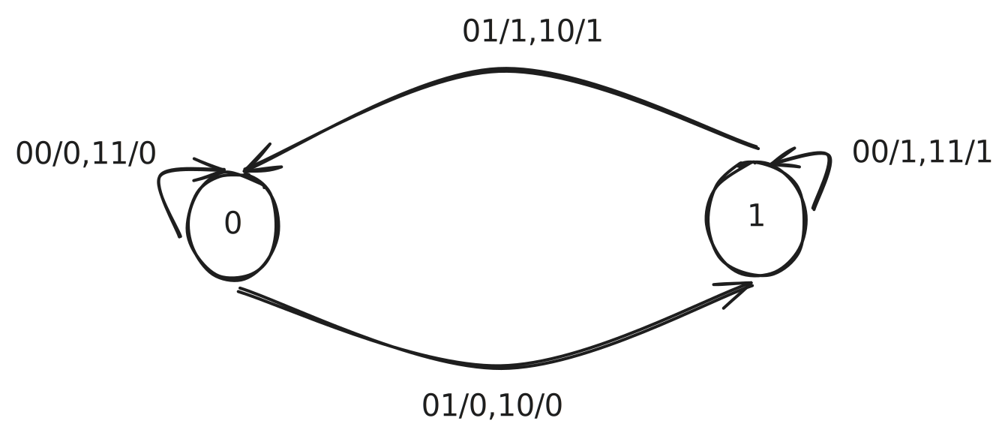

import QACard from "@md-components/QACard.vue"

# Section 1

## Problem 1-1

<QACard>

<>
Convert the following numbers from the given base to the other three bases listed in the table:
</>

<>
| Decimal   | Binary                | Octal    | Hexadecimal |
| --------- | --------------------- | -------- | ----------- |
| 369.3125  | $101110001.0101$      | 561.24   | 171.5       |
| 189.625   | $10111101.101$        | 275.5    | BD.A        |
| 214.625   | $11010110.101$        | 326.5    | D6.A        |
| 62407.625 | $111100111000111.101$ | 171707.5 | F3C7.A      |
</>

</QACard>

## Problem 1-2

<QACard>

<>
In each of the following cases, determine the radix $r$:

(a) $(BEE)_r = (2699)_{10}$  
(b) $(365)_r = (194)_{10}$

</>
<>

(a)  
for $(BEE)_r = (2699)_{10}$  
get: $11 \times r^2 + 14 \times r^1 + 14 \times r^0 = 2699$  
square root : $r = 15$ or $r \approx -16.27$  
Deserve : $r = 15$

(b)  
for $(365)_r = (194)_{10}$  
get $3 \times r^2 + 6 \times r^1 + 5 \times r^0 = 194$  
square root : $r = -9$ or $r = 7$  
choose: $r = 7$

</>
</QACard>

# Section 2

## Problem 2-1

<QACard>
<>
For the Boolean functions E and F, as given in the following truth table:

| XYZ | E  | F  |
|-----|----|----|
| 000 | 0  | 1  |
| 001 | 1  | 0  |
| 010 | 1  | 1  |
| 011 | 0  | 0  |
| 100 | 1  | 1  |
| 101 | 0  | 0  |
| 110 | 1  | 0  |
| 111 | 0  | 1  |

(a) List the minterms and maxterms of each function.  
(b) List the minterms of $ \overline{E} $ and $ \overline{F} $  
(c) List the minterms of $E + F$ and $E \cdot F$.  
(d) Express $E$ and $F$ in sum-of-minterms algebraic form.  
(e) Simplify $E$ and $F$ to expressions with a minimum of literals.

</>
<>

(a)  
$ E = \sum m(1,2,4,6) = \prod M(0,3,5,7) $  
$ F = \sum m(0,2,4,7) = \prod M(1,3,5,6) $

(b)

$ \overline{E} = \sum m(0,3,5,7) $

$ \overline{F} = \sum m(1,3,5,6) $

(c)  
$ E + F = \sum m(0,1,2,4,6,7) $  
$ E \cdot F = \sum m(2,4) $

(d)  
$ E = \overline{X}\overline{Y}Z + \overline{X}Y\overline{Z} + X\overline{Y}\overline{Z} + XYZ $  
$ = \overline{X}\overline{Y}Z + X\overline{Z} + Y\overline{Z} $  
$ F = \overline{X}\overline{Y}\overline{Z} + \overline{X}Y\overline{Z} + X\overline{Y}\overline{Z} + XYZ $  
$ = \overline{Y}\overline{Z} + \overline{X}\overline{Z} + XYZ $

(e)
$ E = \overline{X}\overline{Y}Z + X\overline{Z} + Y\overline{Z} $
$ F = \overline{Y}\overline{Z} + \overline{X}\overline{Z} + XYZ $

</>
</QACard>

minterm是$x y z$,maxterm是$x + y + z$

## Problem 2-2
<QACard>
<>

*Find all the prime implicants for the following Boolean functions, and determine which are essential:

(a) $ F(W, X, Y, Z) = \sum m (0, 2, 5, 7, 8, 10, 12, 13, 14, 15) $  
(b) $ F(A, B, C, D) = \sum m (0, 2, 3, 5, 7, 8, 10, 11, 14, 15) $  
(c) $ F(A, B, C, D) = \sum m (1, 3, 4, 5, 9, 10, 11, 12, 13, 14, 15) $
</>
<>
a)  
Prime = $ XZ, WX, \overline{X}\overline{Z}, W\overline{Z} $  
Essential = $ XZ, \overline{X}\overline{Z} $

b)  
Prime = $ CD, AC, \overline{B}\overline{D}, \overline{A}BD, \overline{B}C $  
Essential = $ AC, \overline{B}\overline{D}, \overline{A}BD $

c)  
Prime = $ AB, AC, AD, BC\overline{C}, \overline{B}D, \overline{C}D $  
Essential = $ AC, BC\overline{C}, \overline{B}D $
</>
</QACard>

## Problem 2-3. 

<QACard>
<>

Prove the identity of each of the following Boolean equations, using algebraic manipulation:

(a) $AB\overline{C} + B\overline{C}\overline{D} + BC + \overline{C}D = B + \overline{C}D$ 
(b) $WY + \overline{W}Y\overline{Z} + WXZ + \overline{W}XY = WY + \overline{W}X\overline{Z} + \overline{X}Y\overline{Z} + XYZ$ 
(c) $A\overline{D} + \overline{A}B + \overline{C}D + \overline{B}C = (\overline{A} + \overline{B} + \overline{C} + \overline{D})(A + B + C + D) $

</>
<>

</>
</QACard>

## Problem 2-4

<QACard>
<>
Optimize the following Boolean functions F together with the don`t-care conditions d. Find all prime implicants and essential prime implicants, and apply the selection rule.

(a) $ F(A, B, C) = \sum m (3, 5, 6) $, $ d(A, B, C) = \sum m (0, 7) $  
(b) $ F(W, X, Y, Z) = \sum m (0, 2, 4, 5, 8, 14, 15) $, $ d(W, X, Y, Z) = \sum m (7, 10, 13) $  
(c) $ F(A, B, C, D) = \sum m (4, 6, 7, 8, 12, 15) $, $ d(A, B, C, D) = \sum m (2, 3, 5, 10, 11, 14) $

</>
<>

(a) Primes: $ AB, AC, BC, \overline{A}\overline{B}\overline{C} $;  
   Essential : $ AB, AC, BC $;  
   $ F = AB + AC + BC $

(b) Primes: $ \overline{X}\overline{Z}, XZ, \overline{W}X\overline{Y}, WXY, \overline{W}\overline{Y}Z, WY\overline{Z} $  
   Essential : $ \overline{X}\overline{Z} $  
   $ F = \overline{X}\overline{Z} + \overline{W}X\overline{Y} + WXY $

(c) Primes: $ \overline{A}B, C, A\overline{D}, BD $  
   Essential: $ C, A\overline{D} $  
   $ F = C + A\overline{D} $ ($BD$ or $AB$)
</>
</QACard>

# Section 3

## Problem 3-1

<QACard>
<>
A hierarchical component with the function is to be used along with inverters to implement the following equation:

$$
H = \overline{X}Y + XZ
$$

$$
G = \overline{A}\overline{B}C + \overline{A}BD + A\overline{B}\overline{C} + AB\overline{D}
$$

The overall circuit can be obtained by using **Shannon’s expansion theorem**,

$$
F = \overline{X} \cdot F_0(X) + X \cdot F_1(X)
$$

where $ F_0(X) $ is F evaluated with variable $ X = 0 $ and $ F_1(X) $ is F evaluated with variable $ X = 1 $. This expansion F can be implemented with function H by letting $ Y = F_0 $ and $ Z = F_1 $. The expansion theorem can then be applied to each of $ F_0 $ and $ F_1 $ using a variable in each, preferably one that appears in both true and complemented form. The process can then be repeated until all $ F_i $’s are single literals or constants.

For G, use $ X = A $ to find $ G_0 $ and $ G_1 $ and then use $ X = B $ for $ G_0 $ and $ G_1 $. Draw the top-level diagram for G using H as a hierarchical component.
</>
<>
</>
</QACard>

# Section 4

## Problem 4-1

<QACard>
<>
- What decimal number does the bit pattern $0x00000000$ represent if it is a two's complement integer? An unsigned integer?

- If the bit pattern `0x00000000` is placed into the Instruction Register, what MIPS instruction will be executed?

- What decimal number does the bit pattern `0x00000000` represent if it is a floating point number? Use the IEEE 754 standard.

- Write down the binary representation of the decimal number 63.25 assuming the IEEE 754 single precision format.

- Write down the binary representation of the decimal number 63.25 assuming the IEEE 754 double precision format.
</>

<>

-  $12 \times 16^6 = 201326592$ in both cases.
- `jal 0x00000000`
-  0x0C0000000 = 0000 1100 0000 0000 0000 0000 0000 0000
   - sign is positive, exp = 24 - 127 = -103, fraction = 0, so answer = $1.0 \times 2^{-103}$
-  63.25 = 111111.01 = $1.1111101 \times 2^5$
   - sign = positive, exp = 127 + 5 = 132
   - so IEEE 754 single format = `0 1000 0100 1111 1010 0000 0000 0000 0000` = `0x427D0000`
-  sign = positive, exp = 1023 + 5 = 1028
   - so IEEE 754 double format = `0 100 0000 0100 1111 1010 0000 0000 0000 0000 0000 0000 0000 0000 0000 0000`
   - = `0x404FA00000000000`

</>
</QACard>

## Problem 4-2
<QACard>
<>

IEEE 754-2008 contains a half precision that is only 16 bits wide. The leftmost bit is still the sign bit, the exponent is 5 bits wide and has a bias of 15, and the mantissa is 10 bits long. A hidden 1 is assumed. Write down the bit pattern to represent $-1.5625 \times 10^{-1}$ assuming a version of this format, which uses an excess-16 format to store the exponent. Comment on how the range and accuracy of this 16-bit floating point format compares to the single precision IEEE 754 standard.

</>
<>
$-1.5625 \times 10^{-1} = -0.00101 = -1.01 \times 2^{-3}$

exponent = $-3 + 15 = 12$ : 01100,

fraction = $-0.0100000000000$

answer: `1 01100 0100000000000`
</>
</QACard>

## Problem 4-3
<QACard>
<>

5-1. A sequential circuit has one flip-flop Q, two inputs X and Y, and one output S. The circuit consists of a D flip-flop with S as its output and logic implementing the function

$$
D = X \oplus Y \oplus S 
$$

with D as the input to the D flip-flop. Derive the state table and state diagram of the sequential circuit.

</>
<>

| Present state | Inputs | Next state | Output |
|---------------|--------|------------|--------|
| Q             | X  Y   | Q          | S      |
| 0             | 0  0   | 0          | 0      |
| 0             | 0  1   | 1          | 0      |
| 0             | 1  0   | 1          | 0      |
| 0             | 1  1   | 0          | 0      |
| 1             | 0  0   | 1          | 1      |
| 1             | 0  1   | 0          | 1      |
| 1             | 1  0   | 0          | 1      |
| 1             | 1  1   | 1          | 1      |

</>
</QACard>

## Problem 4-4
<QACard>
<>

</>

<>

</>

</QACard>