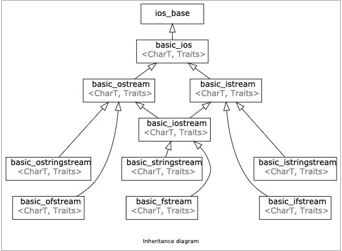

# Lecture 4 - Streams

**Instructors:** Rachel Fernandez, Thomas Poimenidis


> "Designing and implementing a general input/output facility for a programming language is notoriously difficult"
> — Bjarne Stroustrup

## 1. What are Streams?
*   **Definition:** **Streams are a general input/output (IO) abstraction for C++**. 
*   **Why use them?:** They hide unnecessary hardware details and provide a **consistent interface for reading and writing data**, regardless of whether the source is a console, file, or string. They allow for universal type conversion between external string representations (like `"3.14"`) and internal variables (like `double 3.14`).
*   **Inheritance Hierarchy:**
    *   **`ios_base`:** The foundation for streams. It maintains **State Information** (flags that tell you the status/health of your streamlike `failbit` or `eofbit`) and **Control Information** (formatting rules, like displaying hex vs decimal).
    *   **`basic_ios`:** Builds off `ios_base` and ensures the stream is working correctly relative to its source.
    *   **`istream` & `ostream`:** Input and output stream base classes. 
    *   **`iostream`:** Inherits from both `istream` and `ostream`.

Streams allow for a universal way of dealing with external data.

Classifying different types of streams:

- Input streams (I)  
  a way to read data from a source  
    - Are inherited from std::istream
    - ex. reading in something from the console (std::cin)
    - primary operator: `>>` (called the extraction operator)
-  Output streams (O)  
   a way to write data to a destination  
    -  Are inherited from std::ostream
    -  ex. writing out something to the console (std::cout)
    -  primary operator: `<<` (called the insertion operator)


---

## 2. Stringstreams (`std::stringstream`)
*   **What it is:** A way to treat strings as streams. 
*   **Utility:** Excellent for parsing and mixing data types from a single string source. 
*   **Usage:** You can initialize it using the string constructor (e.g., `std::stringstream ss(initial_quote);`) or insert data dynamically via `ss << initial_quote;`.
*   **Extraction limit:** The extraction operator (`>>`) **only reads up until the next whitespace**. 
*   **Using `getline()`:** To read past whitespaces, use `std::getline(istream& is, string& str, char delim)`. It reads the stream until it hits the delimiter (which defaults to `\n`) and stores the result in the string variable. **Crucially, `getline()` consumes the delimiter character**.

```cpp
#include <sstream>
int main() {
  /// partial Bjarne Quote
  std::string initial_quote =
      "Bjarne Stroustrup C makes it easy to shoot yourself in the foot\n";
  /// create a stringstream
  std::stringstream ss(initial_quote);
  /// data destinations
  std::string first;
  std::string last;
  std::string language, extracted_quote;
  ss >> first >> last >> language;
  std::getline(ss, extracted_quote);  // consume the rest of the quote
  std::cout << first << " " << last << " said this: " << language << " "
            << extracted_quote << std::endl;
}
```

---

## 3. Output Streams (`ostream`)
*   **What it is:** Inherits from `std::ostream` and provides a way to write data to a destination. The primary operator is the insertion operator `<<`.
*   **Buffering & Flushing:** Output streams are typically buffered, meaning characters are stored in an intermediary buffer and not shown on the external source until an **explicit flush** occurs.
    *   Flushes occur when:   
        - `std::cout << std::flush`
        - `std::cout << std::endl`
        - When you reach the end of your program
        - When the buffer is full
        - When tied streams interact (ie. cout has to flush before you take input via cin)
    *   **`std::endl` vs `\n`:** `std::endl` inserts a newline **and** flushes the stream. While `\n` usually just acts as a newline, some interactive terminals treat it as a trigger to flush immediately; however, this is dependent on system implementation and whether streams are synchronized.
*   **Error / Event streams:** `std::cerr` is used for critical errors and is **unbuffered** (sends errors out immediately), while `std::clog` is buffered and used for non-critical event logging. [Read more](https://www.geeksforgeeks.org/cpp/difference-between-cerr-and-clog/)

> ```cpp
> int main() 
> {
>     std::ios::sync_with_stdio(false);
>     for (int i=1; i <= 5; ++i) {
>         std::cout << i << "\n";
>     }
>     return 0;
> }
> ```
> 
> You may get a massive performance boost from this.
> 
> 
> This only works if your output stream is non-interactive!
> We tested this `std::ios::sync_with_stdio(false)` proposed solution on various output streams, and found out that it only stopped flushing `\n`s when the output stream was non-interactive (i.e. file, Unix pipe).
> However, if the output stream was interactive (i.e. terminal), the output stream still interpreted it as a line buffer, resulting in an immediate flush when `\n` was pushed to the stream.

### Output File Streams (`std::ofstream`)
*   **What it is:** A way to write output data directly to a file. 
*   **Usage:** Initialize with `std::ofstream ofs("hello.txt");` and write to it using `<<`.
*   **Methods:** Useful methods include `.is_open()`, `.open()`, `.close()`, and `.fail()`. If you close a stream and try to write to it, it will silently fail. 
*   **Appending:** By default, opening a file truncates it. To preserve existing data and add to the bottom, pass the append flag: `ofs.open("hello.txt", std::ios::app);`.

---

## 4. Input Streams (`istream`)
*   **What it is:** Inherits from `std::istream` and provides a way to read data from a source (like `std::cin` for the console or `std::ifstream` for files). The primary operator is the extraction operator `>>`.
*   **How it works:** Input streams like `std::cin` are buffered and **stop reading when they encounter a whitespace** (space `" "`, newline `\n`, or tab `\t`).

### The `cin` and `getline()` Bug
*   **The Issue:** You generally **should not use `getline()` and `std::cin >>` together** because of how they handle newlines. `std::cin >>` reads data but **leaves the trailing newline (`\n`) in the buffer**. 
*   **The Consequence:** If you call `getline()` immediately after `cin >>`, `getline()` will instantly read the leftover `\n`, consume it, and return an empty string (`""`) without ever prompting the user for new input.
*   **The Fix:** If you must use them together, call `getline()` twice. The first `getline()` call acts as a "garbage collector" to consume the leftover newline from the buffer, allowing the second `getline()` call to accurately capture the intended user input.