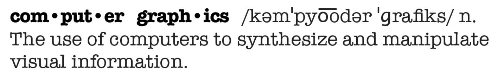

Lecture 1: Overview of Computer Graphics

# What is Computer Graphics?

# Why study Computer Graphics?

## Applications 
## Fundamental Intellectual Challenges 

- Creates and interacts with realistic virtual world 
- Requires understanding of all aspects of physical world 
- New computing methods, displays, technologies
## Technical Challenges 
- Math of (perspective) projections, curves, surfaces 
- Physics of lighting and shading 
- Representing / operating shapes in 3D 
- Animation / simulation 
- ~~3D graphics software programming and hardware~~
# Course Topics

- Rasterization
  - Project geometry primitives (3D triangles / polygons) onto the screen
  - Break projected primitives into fragments (pixels)
  - Gold standard in Video Games (Real-time Applications)
- Curves and Meshes
  - How to represent geometry in Computer Graphics
- Ray Tracing
  - Shoot rays from the camera though each pixel
    - Calculate intersection and shading
    - Continue to bounce the rays till they hit light sources 
  - Gold standard in Animations / Movies (Offline Applications)
- Animation / Simulation
  - Key frame Animation
  - Mass-spring System

GAMES101 is NOT about
- Using OpenGL / DirectX / Vulkan
- The syntax of Shaders
- **We learn Graphics, not Graphics APIs!**
- After this course, you’ll be able to learn these by yourself (I promise)
- 3D modeling using Maya / 3DS MAX / Blender, or VR / game development using Unity / Unreal Engine (where can I learn them?)
- Computer Vision / Deep Learning topics, e.g. XYZ-GAN (where can I learn them?)

# Course Logistics