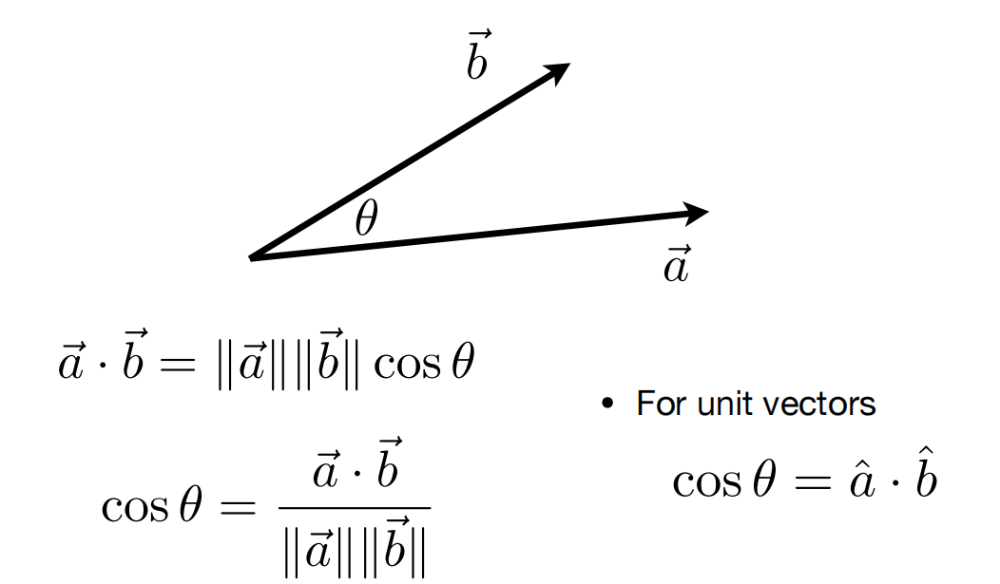

Lecture 2: Review of Linear Algebra

# 向量

## 定义

- Usually written as $\vec{a}$ or in bold **a**
- Or using start and end points $\vec{AB} = B - A$
- Direction and length
- No absolute starting position

## 标准化（Normalization）

Magnitude (length) of a vector written as $||\vec{a}||$

Unit vector
  - A vector with magnitude of 1
  - Finding the unit vector of a vector (normalization): $\hat{a} = \vec{a} / ||\vec{a}||$
  - Used to represent directions

## 加法（Vector Addition）

- Geometrically: Parallelogram law & Triangle law
- Algebraically: Simply add coordinates

## 笛卡尔坐标系（Cartesian Coordinates）

## 点乘（Dot (scalar) Product）

## 叉乘（Cross (vector) Product）

- Cross product is orthogonal to two initial vectors
- Direction determined by right-hand rule
- Useful in constructing coordinate systems (later)

性质：

# 矩阵

矩阵，矩阵乘法，转置，单位矩阵和矩阵的逆，