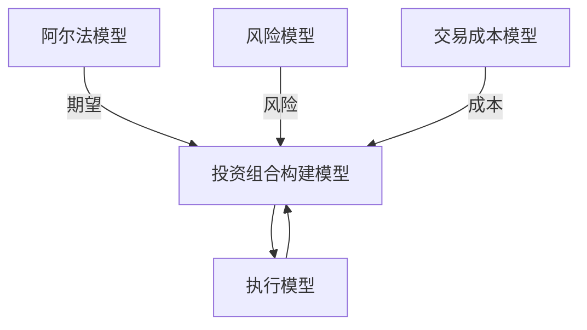
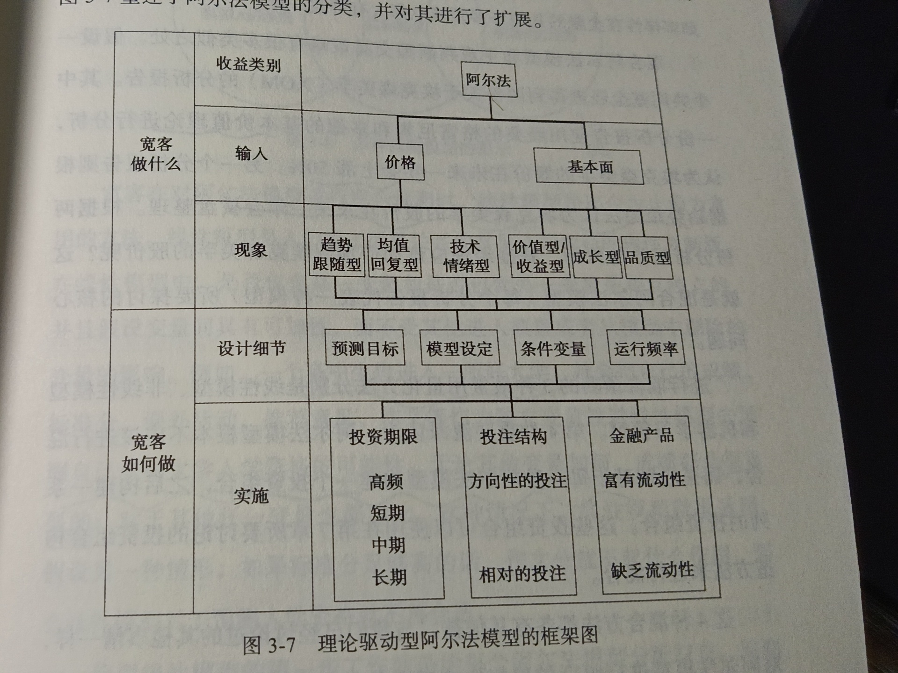

# 第一部分 量化交易的世界
## 第1章 关注量化交易的原因 /2
### 深度思考的益处 /7
### 风险的正确度量和错误度量 /9
### 遵守纪律 /10
### 小结 /11

## 第2章 量化交易简介 /12
### 何为宽客 /14

尽管在本章的开始部分，在操作层面上我们对宽客进行了定义，但是在**严格的主观判断型**（fully discretionary）交易策略和**严格的系统型**（fully systematic）交易策略或严格的自动化（fully automated）交易策略之间，还存在着很多兼顾型策略。区分交易策略所属类别的关键在于，在该策略下投资组合的规模和日常交易品种的选择是依赖于系统（允许上文例子所描述的 “紧急” 情形下的处理）还是主观判断决定的。如果**建仓的点位选择及头寸的规模大小都是系统自动生成的**，则是量化交易；如果两者中有一个是需要人工干预的，就不是量化交易。

随着量化交易规模的增加，逐渐出现了越来越多的伪宽客（quasi-quant traders），这是个很有趣的现象。例如，有些伪宽客利用自动化的系统进行扫描，寻找潜在的交易机会，将大量的备选对象减少到一个相对较少、更加可控的规模；这时再进行人工干预，采用一系列手段在筛选后的名单中选择值得进行投资的对象。还有两种不太常见的情形：一是将交易品种的选择完全由人工完成，而不是通过电脑来优化投资组合的具体配置并管理风险；更为不常见的情形是先使用电脑筛选出所有可进行交易的品种，然后人为地决定如何在这些品种间分配头寸的规模。这些伪宽客使用了宽客常用的一些工具，因此我们的研究也将他们所使用的技术涵盖在内。

### 量化交易系统的典型结构 /16

第2章 量化交易简介 | 17

图2-1 量化交易策略的基本结构

交易系统包含3个模块——**阿尔法模型**（alpha model）、**风险模型**（risk model）和**交易成本模型**（transaction cost model）。这3个模型构成**投资组合构建模型**（portfolio construction model）的输入变量，而投资组合构建模型与**执行模型**（execution model）又相互作用。阿尔法模型旨在预测宽客所考虑交易的金融产品未来趋势。例如，在期货市场上的趋势

### 小结 /19

# 第二部分 打开黑箱
## 第3章 阿尔法模型：宽客如何盈利 /22

我们已经对黑箱的框架进行了研究，接下来将探索其内部，通过理解量化交易的核心交易系统来加深对黑箱操作的认识。阿尔法模型是量化交易系统的第一个重要组成部分，主要是为了寻找盈利机会。目前对量化交易的研究重点大都集中在对阿尔法模型的研究上。阿尔法是希腊字母 α 的音译，常用于量化表述投资者的盈利能力，或投资者得到的与市场波动无关的回报。在通常的定义中，**阿尔法是指扣除市场基准回报之后的投资回报率，或仅仅是由投资策略所带来的价值**。**由于市场因素带来的回报率称为贝塔**，例如，某基金的回报率是12%，而同时期的市场基准回报率是10%，则该基金的阿尔法值就是2%（这里假设了基金投资组合的贝塔恰好为1）。采用这种阿尔法计算方法的缺陷在于，无法判断收益是由交易策略还是单纯的好运带来的。显然，任何交易者都倾向于把超过基准回报率的利润归功于交易策略。

### 两类阿尔法模型：理论驱动型和数据驱动型 /24

### 理论驱动型阿尔法模型 /25

事实上，这些交易策略既没有保密的必要，也不是只有那些博士们才能理解。绝大多数理论驱动型交易策略可以较为容易地划分为六类：**趋势型（trend）、回复型（reversion）、技术情绪型（technical sentiment）、价值型/收益型（value/yield）、成长型（growth）和品质型（quality）**。值得注意的是，宽客所使用的这些交易策略，和追逐阿尔法收益的主观判断型交易者所使用的策略是完全相同的。通过观察这些策略所使用的数据是价格数据还是基本面数据，有助于更加深入地理解这六类策略。在本书中我们将看到，理解一个交易策略所使用的数据比理解策略本身更加重要。趋势型和均值回复型交易策略都依赖于价格数据。技术情绪型策略较为少见，可看作基于价格的第三类型策略。而剩余的价值型/收益型、成长型和品质型策略都基于基本面数据。

1. 基于价格数据的阿尔法模型( 趋势型、回复型、技术情绪型 )

首先，我们研究基于价格数据的阿尔法模型。这里所说的价格数据，一般是指与各种金融产品价格相关的数据，或者交易所产生的其他数据信息（如交易量等）。试图预测价格并从中获利的宽客，通常都是在分析以下两种现象之一：一是已有的**趋势是否会延续**，二是目前的**趋势是否会反转**。换句话说，价格是沿着目前的态势继续向前还是会反向波动。前者我们称为**趋势跟随**策略（trend following）或**动量策略**（momentum），后者称为反趋势策略（counter-trend）或**均值回复**策略（mean reversion）。第三类是技术情绪型策略，虽然是阿尔法模型中不太常见的类型，但仍值得进行一些探讨。

以交易为目的，定义趋势的一种方法是移动平均线交叉指标（moving average crossover indicator），通过对比较短期间和较长期间的某个指标来判断趋势，例如通过短期（60天）价格均线和长期（200天）价格均线的交叉点来判断趋势。当短期均线位于长期均线之下时，认为市场处于下跌趋势；反之则认为市场处于上涨趋势。

实际上，可以看出在不同的时间段使用两种策略都有可能奏效。例如，2000～2002年以及在2008年，趋势跟随策略会有较好的收益，因为在这些时间段市场的趋势很强劲。而2003～2007年，均值回复策略会更加奏效。在整个时间段上，如果运用得当，两种策略都可以盈利。这一结论也可以用其他时间段的数据加以验证；在某些情况下，均值回复策略可作为长期指标，而动量（momentum）可以作为速度指标。

2. 基于基本面数据的阿尔法模型（价值型/收益型、成长型、品质型）

归功于尤金·法玛（Eugene Fama）和肯尼思·弗伦奇（Kenneth French）的研究。在20世纪90年代早期，他们发表了一系列论文，对宽客在基本面策略中经常考虑的因素进行量化分析。在论文《股票期望收益的截面分析》（The Cross Section of Expected Stock Returns）中，他们总结了自己使用量化基本面要素去预测股票方面十多年的研究成果，极大地推进了该领域的发展⁵。简单地说，法玛和弗伦奇认为，股票的贝塔系数并不足以有效解释股票收益的千差万别；根据股票的账面净值与股价的比率以及股票市值的历史记录，再结合股票的贝塔系数，可以对预期收益做出更准确的预测。略具讽刺意味的是，尤金·法玛的理论奠定了量化阿尔法交易策略的基础，而法玛最为著名的工作是市场有效性理论，该理论认为在有效市场上不可能获得阿尔法收益。

1. 价值型/收益型策略

价值型策略是极为常见的，主要用于股票交易，当然这类策略也可以用在其他市场上。用于度量资产价值的指标有很多，绝大部分是一些基本面数据与资产价格的比率，如市盈率（P/E）等。宽客倾向于使用这些比率的倒数，通常将资产价格放在分母上。如**市盈率的倒数**（E/P 比率）称为盈利收益率（earnings yield）。实际上，投资者很早就开始这样处理股利，计算股息收益率（dividend yield）作为度量价值的另一种常用指标。价值型策略的基本理念是，收益率越高，价格越低。使用将常见比率求倒数得到的收益率的益处是，有利于分析方法的简洁性和一致性。

在同一相对水平上，买入估值过低的证券并卖出估值过高的证券，这种策略也称为**利差交易**（carry trade）。投资者通过卖出收益低的资产获取资金，用以买入高收益的资产。两种收益之间的差别称为利差所得（carry）。例如，投资者可以卖空 100 万美元的美国国债，用其所得买入价值 100 万美元具有较高收益的墨西哥债券。格雷厄姆和多德在其经典著作《证券分析》中指出，价值型交易带给投资者安全边际。在很多情形下，这个安全边际可以通过利差交易所得进行计算。如果不考虑其他情况，利差交易可以以基准回报率带给投资者收益，这正是格雷厄姆和多德所说的安全边际。

2. 成长型策略

成长型策略试图通过对所考虑资产以往的增长水平进行分析而对未来的走势进行预测。国内生产总值（GDP）或收益预测都属于这类预测的范畴。判断一只股票属于成长型资产，并不意味着它的收益会怎么样。成长型策略认为，在其他条件都相同的情况下，应该买入价格正在快速上涨的产品而卖出价格涨幅较慢甚至负增长的产品。一些成长性的度量指标，如市盈率与增长比率（PEG，PE 比率与 EPS 增长率的比值），基本上都是度量价值的前瞻性指标。换句话说，通过比较预期增长与预期价值，在对金融产品可能会经历的正增长或负增长做出预测的基础上来判断金融产品的价格是否合理。

3. 品质型
理论驱动型的基本面阿尔法模型的最后一类我们称为品质型。使用品质型策略的交易者认为，在其他条件相同的情形下，最好买入或持有高品质的商品而做空或减少持有低品质的资产。品质型策略的基本理念是看重资金的安全性，而成长型或价值型策略对这一点都没有予以重视。着眼于持有高品质金融资产的投资策略有利于保护投资者，尤其是在高风险的市场环境中。绝非偶然，这类策略常被称为**安全投资转移策略（flight-to-quality）**。这类策略在股票量化投资中经常用到，而在宏观性的量化交易中并不常见用到，可能是因为历史上国家违约的风险总是很低的缘故。随着经济危机在欧洲大陆的蔓延，越来越多的宏观型策略中也开始引入品质型模型。

一般地，衡量资产质量的指标可以分为五大类。

第一类是**杠杆比率（leverage）**。基于对杠杆比率的度量，在其他条件无差别时，应该卖出高杠杆比率的公司的股票而买入低杠杆比率的公司的股票。使用量化股票多空策略的分析师们经常使用债务股本比来判定股票的买卖，这个策略的本质就是认为，在其他条件相同时，杠杆低的企业要比杠杆高的企业更加可靠。

第二类度量品质的指标是**收入来源的多样性（diversity of revenue source）**。该指标认为，具有多种潜在增长渠道的国家或公司比渠道单一的国家或公司质量要高。所以，同等条件下，为各类用户提供多种产品或服务来盈利的公司，比只为特定目的生产单一产品的公司更加稳定。对公司而言，**收入的波动率（volatility of revenue）**就属于这类指标。拿公司收益和股票价格的例子来说，同等条件下，投资者更青睐收益稳定（低波动率）的公司的股票，而不愿购买收益波动较大（高波动率）的公司的股票。

### 数据驱动型阿尔法模型 /45

由于种种原因，实业界很少有人使用这类策略；其中一个重要原因是这类策略都特别难以理解，并且所使用的数据工具也极其复杂。做得好的话，数据挖掘可以借助一定的分析工具通过某些可识别的模式，由数据告诉你未来会发生的事。

这类模型有两大优势。首先，与理论型策略相比，数据挖掘明显更具有技术挑战性，并且在实业界使用很少。这意味着市场上少有竞争者，这是大有裨益的。由于理论驱动型策略通常易于理解，并且在构建相应模型时所使用的数学工具通常来说也并不复杂，所以进入的门槛自然会低一些。数据驱动型策略就没有这样的优势，进入门槛比较高。其次，数据驱动型策略可以分辨出一些市场行为，无论该行为目前是否可以用理论加以解释，从而即使不理解某些市场行为的成因依然可以发现它们。相比而言，理论驱动型策略只能捕获到人们已经对其有所认识的一些行为，从而将其范围局限于上文我们所提及的 6 种类型。

------

首先，**如何定义 “目前的市场环境”**？牢记一点：在量化交易策略中不允许存在任何模糊的余地。仅仅告诉电脑 “找出历史上和现在很相像的市场环境” 是远远不够的。我们必须精确地定义 “现在”“环境” 具体指什么。说到 “现在”，即便我们不去探讨时间的哲学概念，“现在” 可以指一瞬间、刚过去的 10 分钟、过去的 10 年等。这并不存在统一的标准，宽客在这一点上可以根据自己的偏好进行选择。所以，即便是在极其依赖经验主义的数据驱动型量化策略中，主观判断也是设计策略的关键因素。谈及 “环境”，我们是考虑价格因素，还是交易量或基本面数据？这不仅仅是个学术问题：对小型技术公司股票的价格变动的处理方式和处理大型多元化金融公司的股价波动的手段是否相同，涉及市场如何运作的基本理念问题。
其次，**寻找 “相似” 模式使用什么搜索算法**？随之而来的一个问题是：如何定义 “相似”？另一个相关问题是：算法采用什么方法来给出未来各种可能情况的概率？这些都是最不容易概念化又最具技术性的问题。选择适用于所要处理数据集的统计工具是极为重要的，宽客必须重视这一点。在量化分析中最为常见的蠢事儿就是把统计工具应用到错误的问题中。关于统计工具的选择，有很多的门道和技巧，对于如何选择统计方法很难有个统一的回答。
再次，如**何确定历史数据的回溯时间段**？显然地，追溯历史数据寻找相似模式时要回溯多久是个更加直接的问题。通常是选择折中方案，这种方案常见于量化研究和主观型投资管理中。一方面，时点靠近现在的数据对预测未来作用更大，因为这些数据和现在以及不远的未来都最为相关。人类的行为是否在变化仍值得商榷，但是有一点却是肯定的：科技以及由此导致的人类交流的方式在不断进化中，不仅如此，进化的速度随着时间不断加快。市场结构同样也在进化。纽交所梧桐树时代的数据和现在完全电子化交易的时代能有什么太大关系呢？另一方面，将数据挖掘工具应用于当前资本市场含有噪声的数据集时，统计学意义上的显著性通常是至关重要的。对于绝大多数统计学上的假设检验方法而言，样本量越大，从数据得到的结论可靠性会越高。所以，越近期的数据越相关，越多的数据结论越准确。因此，在对具有这种动态特征的系统进行统计分析时，宽客必须在这些相互冲突的特征间进行权衡。

### 实施策略 /49

1. 信号强度

2. 投资期限

投资期限有无穷多种选择，例如你可以预测两周后的情形，也可以预测两周零 30 秒，或者两周零 31 秒后的情形，尽管在两周的基础上增加 30 秒或 31 秒对预测结果并没有太大影响。顺着这个思路，对策略进行分类有助于理解不同投资期限上的量化交易策略间的差异。**高频交易策略**（high-frequency strategy）是最快的，预测期限不超过当前交易日。第二类是**短线交易策略**（short-term strategy），倾向于持仓一天到两周。中线策略（medium-term strategy）预测的期限是几周到几个月。**长线策略**（long-term strategy）通常是持仓几个月或更长时间。不同类别策略间的差异具有一定的随意性，但这种粗略划分有助于理解各种量化交易策略相互间的差别。

3. 投注结构

4. 投资范围

一个策略可以被用在各种金融产品上，宽客必须决定其**适用于哪些金融产品**。宽客对投资范围做出的第一个重要选择是*地理范围*（geography）。一个适用于美国股市的相对均值回复短线策略用到中国香港股市时，可能表现会差别很大。分析人员必须做出判断，在哪里使用这个策略。关于投资范围，宽客必须做出的第二个重要选择是*资产种类*（asset class）。外汇市场上的成长型策略用到股指上去，表现可能会大为不同。宽客必须决定每个策略所适用的资产种类。第三个重要决定是*产品类别*（instrument class）。股指类产品一般在期货市场交易，完全不同于单只股票，尽管它们都属于股票类资产。此外，在市场上，不同产品类别的参与者性质和流动性特征都各不相同，因此交易什么类型的产品也是宽客必须认真研究的内容。税务因素也必须考虑在内。最后，在某些情形下，由于种种原因，宽客可能会包含或排除某一类产品。

5. 模型设定

6. 条件变量

7. 运行频率

提高模型运行频率通常会带来更多的交易机会，这也意味着要付给经纪商更多的佣金，交易成本也就更高。此外，模型运行频率高，投资组合是基于并不包含有用信息的噪声数据进行决策的可能性会更大。这反过来意味着交易成本的增加并没有带来交易策略的阿尔法收益显著增加，从而降低了策略的总体盈利水平。

另一方面，运行频率低的模型会导致数量小但规模较大的交易发生。这样的交易会对整个市场造成较大的影响，从这一层面看这样的交易代价很高。如果模型运行过于不频繁，当模型运行时会对目前所持有的投资组合造成很大的变动。这也意味着大宗交易会对市场既有结构造成很大冲击。运行频率低的模型容易错失市场机会。如果一个策略每月运行一次，可能会在模型休眠期错失以更有利的价格进行交易的机会。另外，如果在模型运行前后出现一些偏差，就有可能错过以稍纵即逝却更具吸引力的价格进行交易的机会。

-----------

### 混合型阿尔法模型 /61

进行混合预测的3种最常用量化方法分别是*线性模型、非线性模型和机器学习模型*。第4种重要流派认为，阿尔法模型根本不应该进行混合，而是应该基于每一种阿尔法模型构建一个投资组合，之后构建一系列的投资组合。这些投资组合可以使用在第7章所要讨论的投资组合构造方法来进行混合。

### 小结 /67

## 第4章 风险模型 /71

风险管理绝不仅仅是规避风险和减少损失，是**通过对敞口实施有目的的选择和规模控制来提高收益的质量和稳定性**。在第 3 章中，我们定义阿尔法为一种敞口，宽客借此盈利。但我们也注意到，接受这个敞口也会时不时遇到风险。这并不是我们对风险本身的分类。追求阿尔法收益就相当于我们明确要对这个敞口的升降沉浮进行投资，因为我们相信从长期来看可以从中获利。如果能只接受阿尔法策略的利润而拒绝随之而来的损失，将是件多么好的事情，但这是不可能的。还有另外一些敞口，通常与追求阿尔法收益有关。不能期望这些敞口带来任何收益，但它们经常和追求收益的敞口同时出现。这些敞口称为*风险*。

### 控制风险规模 /73

有多种控制规模的量化交易模型，它们的不同之处主要体现在以下三个方面：

（1）控制规模的方式；
（2）度量风险的方式；
（3）怎么才算控制了规模。

1. 通过约束或惩罚加以限制（硬性约束：风险线；惩罚：惩罚函数/阻力）

2. 度量风险

市场上，对风险的度量有两种被广为认可的方式。第一种是通过纵向方式来度量不确定性，计算不同时期各个产品收益的标准差来度量风险。在金融业中，这个概念通常称为**波动率**。波动率越高，说明目前的市场风险越大 ¹。

度量风险的第二种方式是，在给定产品范围内对各种金融产品表现的相似水平进行测量，通常是计算在给定时间所有相关金融产品的**横截面标准差（cross-sectional standard deviation）**。标准差越大，说明所包含在内的金融产品的表现种类越多样化。这意味着市场处于低风险中，因为进行投资组合时可以选择多样化的产品投注。这一点可以从一种极端情况看出：如果一个投资组合中所有的产品都是完全相关的，那么当一个产品波动时其他产品也都会跟着波动。宽客称（标准差）这个概念为**离散（dispersion）**。离散也可以使用给定范围内金融产品的相关系数或协方差来度量。同样地，产品之间的相似度越高，市场风险越大。

VaR(value at risk)是金融业中最为常用的风险度量方法之一。VaR的定义是：在给定的置信水平下，投资组合在未来特定时间段内可能遭受的最大损失。VaR的计算方法有很多种，最常用的方法是历史模拟法（historical simulation method）。该方法通过对投资组合在过去一段时间内的表现进行模拟来估计未来可能的损失。
### 限制风险种类 /77

理论驱动型风险模型

经典的理论驱动型风险建模专注于已知的或系统性的风险因素。正如在理论驱动型阿尔法模型中一样，基于理论的系统风险是指那些宽客可以进行合理的经济学解读的风险因素。理论驱动型风险建模使用大量预先设定的系统性风险因素，使得宽客可以度量和校准所给定投资组合的敞口。

### 经验型风险模型（这一段没看懂）
经验型风险模型和理论驱动型风险模型都是基于同样的假设：系统风险可以被度量并加以减缓。但是经验主义的方法根据历史数据来判断这些风险是什么以及投资组合如何暴露其中。利用如主成分分析（PCA）之类的统计方法，宽客可以从历史数据中识别出系统风险，尽管没有名称却可以和已知的风险因子有很好的对应关系⁴。例如，对不同到期日的国债数据进行主成分分析，结果表明统计学意义上的第一风险因素对应于利率水平，或者理论驱动型风险模型中的利率风险（interest rate risk）。

主成分分析和其他统计模型在股票市场上经常被使用，这些模型通常都会发现，对于给定的某只股票而言，市场本身就是股票收益最为重要的驱动力，第二重要的推动力则来自板块。统计风险模型在统计套利交易者中非常流行，他们对股票收益中无法由系统风险加以解释的部分进行投注。

需要注意的是，这类统计方法可能发现全新的系统风险因素，聪明的观察者倾向于承认它的存在，只是还未给它明确命名。另一方面，可能由于数据的误导，统计模型会发现一些短暂存在的风险因素，在未来很快会消失。统计风险模型也有可能找到虚假的敞口，只是数据上的巧合而不代表市场上的任何风险。这些都是宽客需要谨慎对待的问题。

### 小结 /82

## 第5章 交易成本模型 /85

### 定义交易成本 /86

理解交易成本到底是什么是很有用的，因为我们正在描述对其进行建模的方式。交易成本主要由三部分构成：佣金和费用（commissions and fees）、滑点（slippage）以及市场冲击成本（market impact）。

1. 佣金和费用：佣金和费用是交易成本的第一种类型，是支付给经纪商、交易所和监管者的费用，因为它们提供了服务，包括市场参与者的接入通道，有所保障的交易安全性以及运作的基础设施等。对很多宽客而言，每笔交易的经纪佣金是很低的。宽客通常都不使用银行的很多服务和人工，而只是依赖于银行的基础设施来直接进入市场。

佣金并不是经纪商和交易所收取的唯一费用。经纪商对所提供的清算（clearing）和结算（settlement）服务也会收取费用（通常也是佣金的一部分）。清算活动包括监管报告、实时监控、税务处理和破产处理，所有这些活动都必须在结算活动前完成。结算活动是以有价证券的交割来换取资金的交付，是交易活动的最后一步，交易双方分别践行其义务。这些活动都花费精力，因而是有偿的。同时，考虑到每天有许多宽客进行成千上万笔交易，这里涉及的工作量是巨大的。
与传统经纪商相比，交易所和电子撮合成交网络（electronic matching networks）提供了一种不同的服务，即流动性资金池接入通道。交易所必须吸引交易者通过其平台进行交易，平台的交易量又会吸引其他寻求流动性的交易者。交易所也会做一些运行性质的工作，并且保证交易双方履行各自的合同义务。因此，交易所对每笔交易收取一小部分费用，以覆盖其成本和风险（当然，也作为商业利润）。最近，暗池交易（dark pools）大行其道，目前已经占到美国股市交易量的很高比例（根据 Tabb Group 的消息，2012 年达 32%）¹。暗池交易，主要是在某银行的客户内部，通过匹配引擎去撮合同一时间同一金融资产的买方和卖方。

2. **滑点**是指从交易者决定开始交易到订单进入交易所系统实际被执行这两个时间段所发生的价格变动。市场瞬息万变，而交易决策都是在某一时点做出的。在做出交易决策到执行交易这段时间内，金融产品的价格可能已经偏离预测时的价格。实际上，预测越准确，随着时间推移，金融产品的价格越有可能偏离预测价格。但是产品价格的波动并没有产生收益，因为这笔交易还没有真正发生。假设交易者想在 100 美元 / 股的价位卖出 100 股雪佛龙公司（CVX）的股票，当交易者通过经纪商和交易所系统完成这笔交易时，价格可能已经回落到了 99.90 美元 / 股。0.10 美元就是滑点交易成本，因为交易者打算在 100 美元 / 股的价位时卖出的，但实际上价格已经回落到了 99.90 美元 / 股。如果股价从 100 美元上升到了 100.10 美元，交易者以更高的价位成交，这种情况说明滑点有时候可以带来正收益。

3. **市场冲击成本**是交易成本中第三个也是最后一个种类。对宽客而言，这可能是最重要的成本。市场冲击所描述的基本问题是，交易者买入某项产品的行为会推高该产品的价格。而如果交易者想要卖出，当他完成交易时会造成产品价格下降。对于小规模订单而言，价格波动幅度通常介于最优买卖价之间。但大规模订单会造成巨大的波动幅度，极端情况下会高达几个百分点。因此，市场冲击是给定订单通过流动性需求对市场造成的价格变动的度量。市场冲击成本通常定义为订单进入市场时的价格和订单被执行价格之间的差价。
### 交易成本模型的种类 /91

4类交易成本模型：常值，线性，分段线性，二次型

第一种交易成本模型是**常值型模型**，即认为无论订单规模如何，交易成本保持不变。这个模型计算极其简单，但通常是不对的，因而不是很常用。

第二类交易成本模型是**线性模型**，意味着交易成本以一个固定的比率随着交易规模的增大而增大。这是个拟合程度较高的拟合方法，也只是建立真实模型的一个捷径。

在使用相对简单的公式估计交易成本时，**分段线性**交易成本模型可以用来提高计算精度，其基本理念是：在一定范围内线性估计基本是正确的，但在某些点上，二次估计的曲率会造成真实交易成本曲线斜率有较大的上升，所以从那一点开始使用新的直线进行拟合比较合适。（*用多段首尾相接线段拟合曲线*）

最后，宽客创建了交易成本的二次型模型。该模型计算复杂度最高，因为所使用的函数不像线性模型以及分段线性模型那么简单。二次型模型包含的元素很多，形式也比较多样，所以建模过程比较复杂。

### 小结 /96

## 第6章 投资组合构建模型 /98

投资组合构建模型的目的是为了决定宽客所持有的投资组合。这个模型扮演着裁决者的角色，听取了乐观主义者（阿尔法模型）、悲观主义者（风险模型）和具有成本核算意识的会计（交易成本模型）的说辞之后，决定该进行怎样的投资组合。如何分配投资组合中各种产品的比例，主要需要考虑期望收益、风险和交易成本之间的平衡。过于强调交易机会会因为忽略风险而带来损失；过于强调风险会因为忽略交易机会而造成收益不足。过于强调交易成本会使系统陷入瘫痪，因为容易导致交易者因不愿意承担更新投资组合的成本而持仓时间很长。

量化投资组合构建模型主要分为两大类。第一类是**基于规则的模型**。基于规则的投资组合构建模型主要依赖于宽客的直觉，可以很简单也可以很复杂。这些直觉一般是根据经验得到的规律，例如试验结果或犯错得到的教训等。

第二大量化投资组合构建模型是基于优化的。优化程序使用算法去寻找达到宽客所定义目标的最优路径，这里的算法指的是所设计的一步步的规则，引导使用者从初始点到达终点。这里的目标一般称为目标函数（objective function）。优化程序的目标函数典型的例子是寻找投资组合，使得承担每一份风险可能得到的收益最大化。优化程序的性质决定了从细节上完全理解它是非常困难的，但是其概念是很清晰的。

### 基于规则的投资组合构建模型 /99

常见的基于规则的投资组合构建模型有4类：**相等头寸加权、相等风险加权、阿尔法驱动型加权**和**决策树加权**。前两类模型最为简单，核心理念是等权重，只是在如何给出同等权重的方式上有所不同。阿尔法驱动型投资组合构建模型主要依赖阿尔法模型来进行头寸规模选择和投资组合构建。决策树方法，主要是以某种顺序使用一系列规则来决定头寸规模，可以很简单也可以很复杂。以下我们对这几类方法由易到难一一阐述。

1. 相等头寸加权
相等头寸加权模型极其普遍。使用这一模型的宽客认为，如果某一头寸好到值得拥有，就不再需要其他信息来决定其规模。这里有个深层次的隐含假设：金融产品具有同质性，不需要根据其风险或其他指标加以区分。如上文所言，对于给定的金融产品而言，信号强度的概念与预测的规模有关。信号强度通常会被忽略掉，除非信号强度已经强到非常值得建立头寸。初看起来，对这一问题的处理过于简单。一些严谨的宽客已经针对这一问题找到了解决方案。相等头寸加权模型的基本前提是，对不同的头寸加以区分（给予不同权重）可能会具有两种负面结果，最终会超过非等权重加权所带来的好处。换言之，使用等权重模型是因为他们注意到了非等权重加权方法的很多缺陷。

非等权重方法的第一个潜在问题是，它总是默认模型具有统计学意义上的能力和功效，对头寸方向、波动幅度和（或）向相对于投资组合中其他预测值变动的概率进行准确的预测。相反，使用等权重方法的宽客认为，只有在方向性预测上才可以充分信任阿尔法模型，并且只要在方向性预测上有足够的置信度可以确保值得进行交易，就值得进行和其他头寸相同规模的交易。

投资组合中非等权重方法的第二个潜在问题是，它一般倾向于在“最好”的几个预测头寸上进行大的投注，而在其他预测上投注很少。但是，这种权重的差异都会使策略在看似很有吸引力的头寸上承担一些例外事件的风险，而不管进行预测时使用的是何种阿尔法模型。例如，在动量型策略中，最强的信号中很多是那些价格已经发生了最大幅度移动（例如，已经具有明显的趋势）的金融产品。换句话说，交易者已经错过了时机，在趋势的峰值处得到最强信号所承担正是趋势可能会反转的风险。类似地，对于均值回复型策略，很多很强的信号也是产品的价格已经发生了很大程度的波动而预计会发生大幅反转之时。但是通常来说，发生大幅波动，都是因为市场上有确切的信息导致波动延续下去。统计学家称这种现象为**逆向选择偏误（adverse selection bias）**。这种情形下的均值回复策略被形象地称为 “空手套白狼”，相当于是赌一个很强的趋势会发生反转，经常会发生趋势继续而没有反转导致策略损失的情况。

2. 相等风险加权
相等风险加权方法根据头寸的波动性（或风险的其他度量指标，如下降幅度）来反向调整头寸规模。波动性越大（小）的头寸，分配的权重就越小（大）。这样，根据对于整个投资组合的风险贡献度而言，并不是根据分配的头寸规模，投资组合中的每个头寸都是均等的。表6-1展示了一个含有两只股票的投资组合的例子，相比于埃克森美孚公司（XOM）的股票，波动性大的谷歌（GOOG）的股票在投资组合中被分配的权重就小一些（39%）。

3. 阿尔法驱动型加权
基于规则的投资组合构建的第三种方法，主要是通过阿尔法法模型来决定头寸规模。该方法的理念是，阿尔法模型可以决定头寸可能具有的吸引力，这个信号是合理决定头寸规模的最佳途径。此外，使用这一方法的绝大部分宽客并不会让最大头寸的规模趋于无穷。这时他们会使用风险模型来给出单个头寸的最大规模上限。给定这个上限后，可以使用信号强度来决定实际头寸与头寸的最大可能值的接近程度。这就好比在曲线上进行评级，得分最高的获得最大的头寸规模，次高的获得次之的规模。在投资组合构建中，这种方法所使用的约束类型还包括对某一组（如板块或资产种类）的投注总额设置上限。

### 投资组合最优化 /104

在量化金融中，投资组合最优化是很重要的一个主题。这是量化金融中首先受到学术界关注的领域之一，诞生的标志是量化分析之父哈里·马科维茨（Harry Markowitz）发表了名为《投资组合选择》（Portfolio Selection）的里程碑式的论文¹。他发明了至今已广为使用的**均值方差优化技术**（mean variance optimization），以此为核心的许多复杂方法也纷纷涌现。由于对投资组合构建中量化分析的深入理解，1990年他和威廉·夏普（William Sharpe）分享了诺贝尔奖。

投资组合优化工具主要是基于资产管理行业的经典理论——**现代投资组合理论**（modern portfolio theory，MPT）的基本原理。MPT的核心原理是，投资者一贯是风险厌恶型的，这意味着如果两种产品收益相同但风险水平不同，投资者会偏好低风险产品。据此可以得到一个推论，只有存在额外收益作为补偿，投资者才愿意承担额外的风险。由此引入了**风险调整收益**（risk-adjusted return）的概念。**均值方差优化技术**是基于 MPT 构建投资组合的一种常用方法。均值和方差是传向优化器的两个输入变量，输出变量是在各个风险水平上具有最高收益的一系列投资组合。这里的均值是指进行评估的各种资产的平均期望收益，方差是对各种资产期望风险的度量，通过计划持有的各种资产收益的标准差来计算。传向优化器的第三个输入变量是这些资产的**期望相关系数矩阵**（expected correlation matrix）。优化器使用这些输入量，可以输出在不同风险水平下可以达到最高可能收益的一系列投资组合，称为**有效边界**（efficient frontier）。

量化交易策略，除了使用阿尔法模型、风险模型和交易成本模型外，还需要说明这些模型中所包含的信息以及与这些模型相关的约束条件。例如，投资组合优化工具可能被用来解决最优投资组合问题（例如最大化风险调整收益），说明各种可能持有产品的期望收益，持有产品收益的波动性，持有产品相互之间的相关性以及最小化对应于风险模型中的各种风险因素的风险敞口。在真实交易中，宽客也会采用其他几个额外的输入变量，包括①以货币表示的投资组合规模，②期望的风险水平（通常以波动率或预期下跌来度量），③其他会缩小优化工具可行域的约束条件，例如股票交易中主要经纪商提供的**卖空限制列表**（hard-to-borrow list）。这些输入变量并不是优化工具必须使用的，前两种就比较任意，但这些变量可以帮助构建切合实际并且对宽客更加有用的投资组合。

这些技术被称为优化工具的原因在于，它试图去寻找分析师所给定函数的最大值（最优值），这个函数称为**目标函数**（objective function）。优化工具通过算法在各种可行的产品组合中进行定向搜索，以实现最优化的目的。对于给定组合，优化工具检验其收益和风险特征，并与之前

#### 优化工具的输入变量

1. 期望收益
2. 期望波动率
3. 期望相关性

#### 优化技术

1. 无约束条件的优化方法
2. 带约束条件的优化方法
3. 布莱克-利特曼（Black-Litterman）模型
4. 格里诺德-卡恩方法：优化要素投资组合
5. 重新取样效率
6. 基于数据挖掘的

### 投资组合构建模型的输出 /120
### 宽客如何选择投资组合构建模型 /121
### 小结 /122

## 第7章 执行模型 /124
### 订单执行算法 /126
### 交易基础设施 /138
### 小结 /140

## 第8章 数据 /142
### 数据的重要性 /143
### 数据类型 /145
### 数据来源 /147
### 数据清洗 /149
### 数据存储 /155
### 小结 /156

## 第9章 研究 /158
### 研究蓝图：科学的方法 /159
### 思想的产生 /160
### 检验 /163
### 小结 /184

# 第三部分 量化投资策略实战指南
## 第10章 量化策略的风险内生性 /188
### 模型风险 /189
### 结构关系变化风险 /194
### 外生冲击风险 /198
### 蔓延风险和同质投资者风险 /200
### 宽客如何监控风险 /208
### 小结 /210

## 第11章 对量化交易的批评 /212
### 交易是一门艺术，不是科学 /213
### 由于低估风险，宽客引起更多的市场波动性 /214
### 宽客不能应对市场行情中的不寻常事件或快速的变化 /220
### 宽客完全相同 /222
### 长远来看，只有少数几个大型量化公司能够蓬勃发展 /223
### 宽客在数据挖掘中存在错误 /227
### 小结 /230

## 第12章 评估宽客和量化交易策略 /232
### 收集信息 /233
### 评估量化交易策略 /236
### 评估量化交易者 /239
### 优势 /242
### 评估宽客的诚信 /246
### 宽客如何适应投资组合 /248
### 小结 /251

# 第四部分 高速及高频交易
## 第13章 高速及高频交易概要 /254

## 第14章 高速交易 /260
### 速度的重要性 /261
### 延迟根源 /270
### 小结 /281

## 第15章 高频交易 /284
### 契约型做市 /284
### 非契约型做市 /289
### 套利 /291
### 快速的阿尔法策略 /293
### 高频交易风险管理和投资组合构建 /295
### 小结 /297

## 第16章 关于高频交易的争论 /299
### 高频交易创造不公平的竞争了吗 /300
### 高频交易导致老鼠仓交易或市场操纵吗 /304
### 高频交易导致更大的波动性或者结构不稳吗 /311
### 高频交易缺乏社会价值吗 /319
### 监管注意事项 /320
### 小结 /323

## 第17章 量化交易的展望 /326