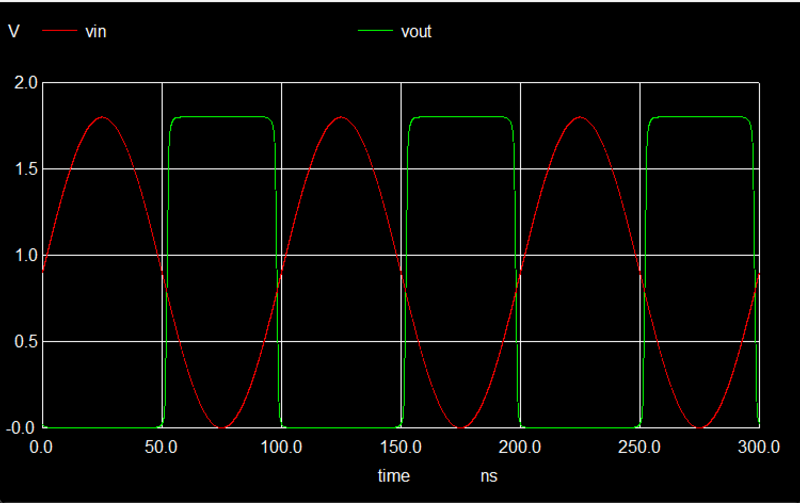

##

## 5.1 反相器的电压传输特性

### 5.1.2

<container type="question">

描述执行 `ngspice inv.sp` 得到的输入输出关系

</container>

1. 在时间 t=0 到 t=0.8 纳秒之间，输入电压 Vin​ 从 0 线性增加到大约 1.8 伏特，而输出电压 Vout​ 保持在大约 1.8 伏特不变。
2. 在 t=0.8 纳秒时，输出电压 Vout​ 突然下降，迅速降至接近 0 伏特。
3. 从 t=0.8 纳秒之后，输入电压 Vin​ 继续线性增加，而输出电压 Vout​ 保持在 0 伏特不变。


### 5.1.3

<container type="question">
观察 Vout，思考如果给 Vin 接入一个正弦变化的电压，输出的 Vout 是什么样的，可以手绘 Vout-T 的结果加以文字描述
</container>

如果给 Vin 接入一个正弦变化的电压，输出的 Vout 是一个方波。Vin处于波峰时，Vout处于1.8V处，Vin处于波谷时，Vout处于0V处

验证：

修改`inv.sp`，使接入Vin的电压呈正弦变化
```spice diff
skywater 130nm Inverter

.option scale=1E-6
.include "./pdk/nfet.spice"
.include "./pdk/pfet.spice"

X0 Vout Vin VGND VGND sky130_fd_pr__nfet_01v8 w=650000u l=150000u
X1 Vout Vin VPWR VPWR sky130_fd_pr__pfet_01v8_hvt w=1e+06u l=150000u

VDD VPWR 0 1.8V
VSS VGND 0 0V
- Vgate Vin GND PWL(0ns 0V 1.8ns 1.8V)
+ Vgate Vin GND SIN(0.9V 0.9V 1e7Hz)

- .tran 0.01ns 1.8ns
+ .tran 0.01ns 300ns

.control
run
setplot tran1
plot Vout vs time Vin
.endc

.end
```



