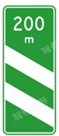
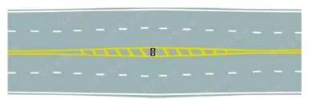
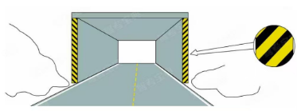

1. 驾驶机动车应在变更车道的*同时*判断开启转向灯。 (错误)
2. 对驾驶*拼装*机动车上路行驶的驾驶人，会受到下列哪种处罚?

   (√)处200元以上2000元以下罚款

   (x)吊销机动车行驶证
3. 图中这个标志表示距离出口200米。（正确）

   

   说明：**左下进口，右下出口**
4. 雪天行车中，在有车辙的路段应判断循车辙行驶。（√）
5.

说明：

**路面 黄高白底黑建议**

**标识牌 红高蓝低黄建议**
6. 路面上的黄色填充标线是何含义 ？

7. 这种黄黑相间的倾斜线条是什么标记?

（立面标记）
8. 驾驶机动车在道路上靠路边停车单选过程中如何使用灯光? (提前开启右转向灯)

说明：

停车右转向灯

驶离停车地、超车、掉头开左转向灯

左舵车，靠右行驶，如果不提前开启右转向灯，没人知道你要停靠路边，停靠后，才开始双闪报警灯，注意是停靠后使用，而不是停靠前。
9. 总结一下，对驾驶已达到报废标准的机动车，或拼装机动车，或者车速超过规定速度50%，均罚款200~2000元，并吊销驾驶证

10. 在堵车的交叉路口绿灯亮时，车辆应怎样做?
    A可直接驶入交叉路口
    (√)B不能驶入交叉路口
    C可借对向车道通过路口
    D在保证安全的情况下驶入交叉路

11. 驾驶机动车驶出地下车库，遇车单选流量较大时，以下做法正确的是什么? 
    A鸣喇叭提醒其他车辆让行
    B在确认安全的情况下从车库入口驶出
    (√)C依次排队等候通过
    D穿插车流尽快驶出
