# 考纲

1. 驾驶证和机动车管理规定
   - 考试内容：驾驶证申领和使用
   - 考试要点：
     - 机动车驾驶许可；
     - 准驾车型和机动车驾驶证有效期；
     - 机动车驾驶证申请条件；
     - 驾驶人考试内容和合格标准；
     - 学习驾驶证明使用规定；
     - 驾驶证实习期；
     - 有效期满、转入、变更换证；
     - 驾驶证遗失补证；
     - 驾驶证审验；
     - 驾驶证注销情形；
     - 驾驶证电子版申领和使用；
     - 违规申领、考试、审验的法律责任；
     - 申请增加准驾车型的条件；
     - 大中型客货车驾驶证日常管理要求※
   - 考试内容：交通违法行为记分管理
   - 考试要点：
     - 记分分值；
     - 记分执行；
     - 满分处理；
     - 记分减免；
     - 法律责任
   - 考试内容：机动车登记和使用
   - 考试要点：
     - 机动车注册、变更、转移、抵押、注销登记；
     - 机动车登记证书、号牌、行驶证灭失、丢失或损毁；
     - 机动车上路行驶条件；
     - 机动车安全技术检验；
     - 机动车交通事故责任强制保险；
     - 机动车强制报废※
   - 考核是否掌握驾驶证申领和使用相关知识；是否了解交通违法记分管理制度； 是否了解机动车登记和使用的相关知识
2. 道路通行条件及通行规定
   - 考试内容：道路交通信号
   - 考试要点：
     - 道路交通信号灯的分类、含义、识别和作用；
     - 道路交通标志的分类、含义、识别和作用；
     - 道路交通标线的分类、含义、识别和作用；
     - 交通警察指挥手势的分类、含义、识别和作用
   - 考试内容：道路通行规定
   - 考试要点：
     - 右侧通行；
     - 灯光、喇叭的使用；
     - 有划分车道、无划分车道的道路通行；
     - 超车规定；
     - 跟车距离的保持要求；
     - 交叉路口通行；
     - 变更车道规定；
     - 限速通行；
     - 会车规定；
     - 掉头规定；
     - 倒车规定；
     - 铁路道口及渡口通行；
     - 缓行、拥堵路段或路口通行；
     - 漫水路、漫水桥通行；
     - 避让行人和非机动车；
     - 避让执行紧急任务的特种车辆、道路养护作业车辆；
     - 遇校车通行规定；
     - 专用车道的使用要求；
     - 载物规定；
     - 载人规定；
     - 驾驶机动车禁止行为；
     - 停车规定；
     - 牵引挂车规定；
     - 故障处置；
     - 牵引故障机动车
   - 考试内容：高速公路通行特殊规定
   - 考试要点：
     - 高速公路禁行要求；
     - 高速公路限速规定；
     - 进出高速公路；
     - 跟车距离要求；
     - 低能见度等恶劣环境下的通行规定；
     - 应急车道使用规定；
     - 高速公路禁止行为；
     - 高速公路机动车故障处置
   - 考核是否掌握道路通行条件以及道路通行规定相关知识
3. 道路交通安全违法行为及处罚
   - 考试内容：道路交通安全违法行政强制措施
   - 考试要点：
     - 扣留机动车的情形；
     - 扣留机动车驾驶证的情形；
     - 拖移机动车的情形；
     - 强制检验体内违禁饮（用）品含量的情形
   - 考试内容：道路交通安全违法行政处罚
   - 考试要点：
     - 道路交通安全违法的行政处罚种类；
     - 违反道路通行规定的处罚；
     - 饮酒、醉酒驾车的处罚；
     - 涉及登记证书、号牌、证件、标志违法的处罚；
     - 未投保交强险的处罚；
     - 违法停车的处罚；
     - 超速、疲劳驾驶、分心驾驶等其他违法行为的处罚；
     - 超载、超员的处罚※
   - 考试内容：道路交通安全违法刑事处罚
   - 考试要点：
     - 交通肇事罪；
     - 危险驾驶罪；
     - 伪造、变造、买卖驾驶证；
     - 使用伪造、变造的或者盗用他人驾驶证；
     - 其他涉牌涉证、涉考涉驾等犯罪行为的刑事处罚
   - 考核是否掌握涉及道路交通安全的违法行为； 是否了解相关行政强制措施、行政处罚、刑事处罚的知识
4. 道路交通事故处理相关规定
   - 考试内容：道路交通事故处理
   - 考试要点：
     - 事故报警；
     - 事故现场处置；
     - 高速公路事故现场处置；
     - 自行协商、简易程序；
     - 事故现场的强制撤离
5. 机动车基础知识
   - 考试内容：车辆结构与车辆性能常识
   - 考试要点：
     - 车辆的基本构成；
     - 车辆制动性、通过性对行车安全影响的相关知识；
     - 新能源汽车基础知识；
     - 车辆轮胎、燃油、润滑油、冷却液、风窗玻璃清洗液 等运行材料的作用和使用要求※
   - 考试内容：常见操纵装置
   - 考试要点：
     - 转向盘的作用；
     - 机动车踏板的分类和作用；
     - 变速器操纵杆的作用；
     - 驻车制动器的作用；
     - 各类开关的辨识和作用；
     - 辅助驾驶功能
   - 考试内容：常见安全装置
   - 考试要点：
     - 仪表、指示灯、报警灯的辨识和作用；
     - 安全头枕的作用及使用要求；
     - 安全带的作用及使用要求；
     - 安全气囊的作用及使用要求；
     - 儿童安全座椅的作用及使用要求；
     - 防抱死制动装置等其他常见安全装置的作用
   - 考试内容：大中型客货车制动系统及安全装置※
   - 考试要点：
     - 客车、城市公交车行车制动装置、辅助制动装置、驻车制动装置的作用和使用要求；
     - 客车、城市公交车车门、应急（安全）出口、安全锤、灭火器等安全装置的使用要求；
     - 货车制动系统的特点和使用要求；
     - 汽车列车连接与分离装置的使用要求；
     - 紧急切断阀、汽车尾板等专用装置的作用和使用要求
6. 地方性法规
   - 考试内容：根据地方性法规选定的重点内容

# 口诀

!!!Note 不具有 Copyright 的内容
以下内容整理自小红书、驾校一点通等多种平台

## 停车距离题 - **口五站三**

“口五”是指机动车在距离交叉路口、弯路、陡坡、隧道 50 米以内不准停车;

“站三”是指机动车在距离急救站、加油站、消防站 30 米以内的路段，不准停车。

题目里有“口”的选 50 米，有“站”的选 30 米，剩下的全选 150 米

没有 150 的选最大

## 假一吊二撤三醉五逃终生（撤/骗/毒 三）

假一:提供虚材料申领驾驶证的，一年内不得报考。

吊二:吊销驾驶证后，两年内不得报考。

撤三:被撤销驾驶证的，三年内不得报考。

醉五:醉驾被吊销驾照的五年内不得报考。

逃终生:交通肇事逃逸的，终身不能报考驾驶证。

## 高速能见度口诀:261,145,520

能见度 200 米，车速 60km，车距 100 米

能见度 100 米，车速 40km,车距 50 米

能见度 50 米，车速 20km，尽快驶离高速

## 城市公路题:城 35 公 47

城市道路无中心线选择 30 公里

城市道路有中心线选择 50 公里

乡村公路无中心线选择 40 公里

乡村公路有中心线选择 70 公里

## 行车速度题

特殊路段限速

机动车驶入驶出<非机动车道/通过铁路道口、急转弯、转弯、窄路、窄桥、掉头、下陡坡、牵引故障机动车>最高时速不准超过 30 公里

有无中心线

1. 没有道路中心线的:城市 30:公路 40(城 3 公 4)
2. 有中心线，同方向只有一条车道的:城市 50;公路 70(城 5 公 7)
3. 有中心线，同方向 2 条以上车道的:城市 60;公路 80(城 6 公 8)

高速同方向车道最低限速:

1. 二条车道左:100 右:60
2. 三条车道左:110 中:90 右:60
3. 三条以上/四车道:最左:110;中间二条:90;最右:60

进入高速加速车道，尽快提到(60 公里)以上特殊天速限速(口诀:261，145，520)

高速公路遇到雨、雾、沙尘、冰雹等能见度低的特殊天气时，高速公路行车限速：

(1)能见度小于 200 米时，开启雾灯、近光灯、示廓灯、前后位灯车速不得超过每小时 60 公里，与同车道前车保持 100 米以上的距离;(261:“2”是能见度<200 米;“6”是车速不能超多 60KM/h“1”是安全距离 100 米)

(2)能见度小于 100 米时，开启雾灯、近光灯、示廓灯、前后位灯危险报警闪光灯，车速不得超过每小时 40 公里，与同车道前车保持 50 米以上的距离(145)

(3)能见度小于 50 米时，开启雾灯、近光灯、示廓灯、前后位灯和危险报警闪光灯车速不得超过每小时 20 公里，并从最近的出口尽快驶离高速公路(520)

高速不同车辆最高限速:

小型载客汽车:120 公里

摩托车:80 公里

其他机动车:100 公里

## 扣分类技巧

扣 1 分:禁、灯、掉、会、安、检

1. 禁:违反禁令标志、禁止标线的;
2. 灯:不按规定使用灯光
3. 掉:普通公路倒车、掉头
4. 会:不按规定会车
5. 安:未按规定系安全带
6. 检:客运和危险车以外，不安全检验

扣 3 分:让、道、超、装、电、警、低

1. 让:不避让校车、不避让行人、不让行车辆
2. 道:穿插变道，占用对向车道(逆行普 3 高 12)高快路不按规定车道行驶
3. 超:不按规定借道超车;穿插等待车辆
4. 装:不按规定安装机动车号牌上
5. 电:拨打接听电话妨碍安全驾驶行为的
6. 警:发生故障、事故停车不按规定使用灯光、未设置警告标志
7. 低:驾驶机动车在高速公路低于最低时速的

扣 6 分:占、扣、轻、信

1. 占:违法占用应急车道的
2. 扣:驾驶证暂扣期间驾驶机动车的
3. 轻:轻微伤逃逸，不构成犯罪的
4. 信:驾驶机动车不按交通信号灯指示

扣 9 分:停车、不符、没号牌

1. 停车:高速/快速路违法停车，超过 4 小时未休息
2. 不符:准驾车型不符的
3. 没号牌:未悬挂、遮挡、污损、号牌

扣 12 分:酒、伪、亡、重、反

1. 酒:饮酒、醉酒开车
2. 伪:伪造/变造、使用他人行驶证/驾驶证/号牌
3. 亡:轻伤(以上)或死亡，逃逸，不构成犯罪的
4. 重:致人重伤或严重事故致人死亡的
5. 反:反方向开车，高快路倒车、逆行、掉头

## 更多

- 右转让左转，左转让直行（转弯让直行）
- 驾驶机动车在黄色信号灯亮的路口，已越过停止线的车辆可以继续通行;没有越过停止线的车辆不得加速抢行通过，要在停止线以外停车等待。
- 选择题有违章、违规、违法：只选违法
- 高速上开车:

  **时速超过100，车距100以上!**

  **时速低于100，车距50以上!**
- 车后设置警告标志距离:**高速上是150m开外;普通道路上是50-100m**.
- **广告 颜色 所有权 罚200 代罚35 代审32**

  **弄虚作假1000。虚假材料500**
- 没有相应标志，大家就数数车道有几条，从而判断最低时速:

  两条车道:**100 60**

  三条车道:**110 90 60**

  四条车道:**110 90 90 60**
- 总结一下，对驾驶已达到报废标准的机动车，或拼装机动车，或者车速超过规定速度50%，均罚款200~2000元，并吊销驾驶证
- 看到**依次、顺序、礼让**就对，其次是**确认安全、谨慎通过**
- **无障碍，上坡，不靠山体先行**，走到一半了除外
- 网学**半小时**考试合格减扣**1分**

  现场学习**一小时**减扣**2分**

  参加公益活动**一小时**减扣**1分**
- 不予受理：
  （一）在本记分周期内或者上一个记分周期内，机动车驾驶人有二次以上参加满分教育记录的；
  （二）在最近三个记分周期内，机动车驾驶人因造成交通事故后逃逸，或者饮酒后驾驶机动车，或者使用伪造、变造的机动车号牌、行驶证、驾驶证、校车标牌，或者使用其他机动车号牌、行驶证，或者买分卖分受到过处罚的；
  （三）机动车驾驶证在实习期内，或者机动车驾驶证逾期未审验，或者机动车驾驶证被扣留、暂扣期间的；
  （四）机动车驾驶人名下有安全技术检验超过有效期或者未按规定办理注销登记的机动车的；
  （五）在最近三个记分周期内，机动车驾驶人参加接受交通安全教育扣减交通违法行为记分或者机动车驾驶人满分教育、审验教育时，有弄虚作假、冒名顶替记录的。
- 疲劳驾驶：开4休20
- 小车18无上限

- 满9补6变审3

- 有严重 3~7年 没严重 3年一下

- 假一吊二撤三醉五逃终生，罚款：虚假500作弊1000欺骗2000

- 预约次数五次，有效期三年

- 停车位：蓝免黄专白收费

- 停车口5站3，灯光口3站5

- 申请增加准驾车型：1轻2中3大

- 争3调10罚15；变更30补证60期满90

# 车辆结构

## 踏板

**左离合**踏板，**中间制动**踏板，**右边加速**踏板

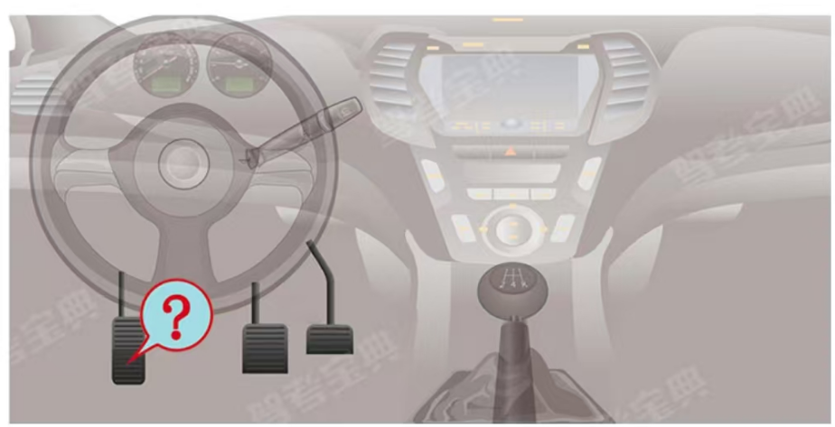

## 点火开关

LOCK:切断电源，锁定方向盘，

ACC:接通附件电源(比如收音机等附件);

ON:接通除起动机外的全车全部电源:

START:接通起动机电源，起动发动机。

# 扣分办法具体摘录

扣 1 分:禁、灯、掉、会、安、检

1. 禁:违反禁令标志、禁止标线的;
2. 灯:不按规定使用灯光
3. 掉:普通公路倒车、掉头
4. 会:不按规定会车
5. 安:未按规定系安全带
6. 检:客运和危险车以外，不安全检验

扣 3 分:让、道、超、装、电、警、低

1. 让:不避让校车、不避让行人、不让行车辆
2. 道:穿插变道，占用对向车道(逆行普 3 高 12)高快路不按规定车道行驶
3. 超:不按规定借道超车;穿插等待车辆
4. 装:不按规定安装机动车号牌上
5. 电:拨打接听电话妨碍安全驾驶行为的
6. 警:发生故障、事故停车不按规定使用灯光、未设置警告标志
7. 低:驾驶机动车在高速公路低于最低时速的

扣 6 分:占、扣、轻、信

1. 占:违法占用应急车道的
2. 扣:驾驶证暂扣期间驾驶机动车的
3. 轻:轻微伤逃逸，不构成犯罪的
4. 信:驾驶机动车不按交通信号灯指示

扣 9 分:停车、不符、没号牌

1. 停车:高速/快速路违法停车，超过 4 小时未休息
2. 不符:准驾车型不符的
3. 没号牌:未悬挂、遮挡、污损、号牌

扣 12 分:酒、伪、亡、重、反

1. 酒:饮酒、醉酒开车
2. 伪:伪造/变造、使用他人行驶证/驾驶证/号牌
3. 亡:轻伤(以上)或死亡，逃逸，不构成犯罪的
4. 重:致人重伤或严重事故致人死亡的
5. 反:反方向开车，高快路倒车、逆行、掉头

|                                                            |      1 |              3 |       6 |       9 |    12 |
| ---------------------------------------------------------- | -----: | -------------: | ------: | ------: | ----: |
| 超载 - 校车、公路客运汽车、旅游客运汽车                    |        |                |    <20% |         |  >20% |
| 超载 - 7座以上载客汽车                                     |        |                |  20\~50 | 50\~100 | >100% |
| 超载 - 其他载客汽车                                        |        |         20\~50 | 50\~100 |         | >100% |
| 超速 - 高快 - 校车、中型以上载客载货汽车、危险物品运输车辆 |        |                |         |         |  >20% |
| 超速 - 以外 - 校车、中型以上载客载货汽车、危险物品运输车辆 |        |                |         |    >50% |       |
| 超速 - 高快 - 以外                                         | 10\~20 |                |  20\~50 |         |  >50% |
| 超速 - 以外 - 以外                                         |        |         20\~50 |    >50% |         |       |
| 驾驶载货汽车载物超过最大允许总质量                         |   <30% | 30\~50 或 载客 |    >50% |         |       |

# 易混标志

## 蓝底人行横道，黄底注意行人

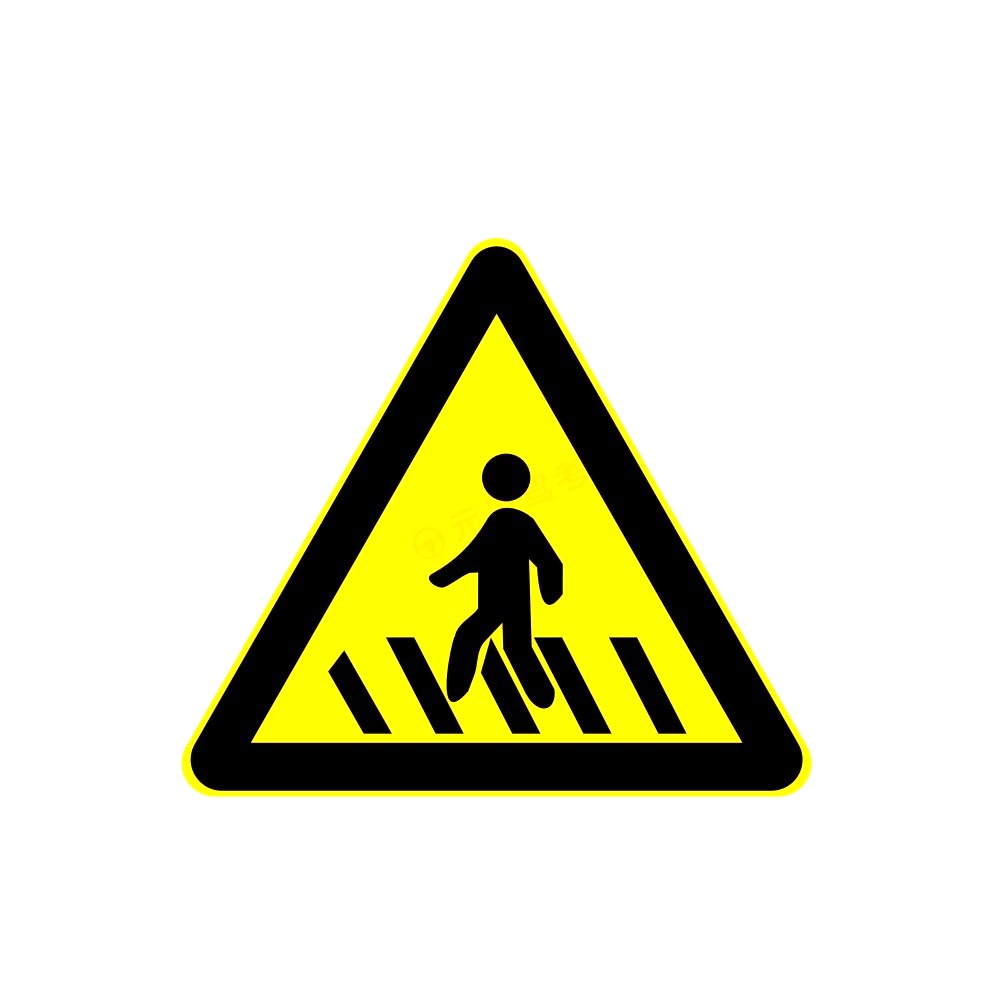

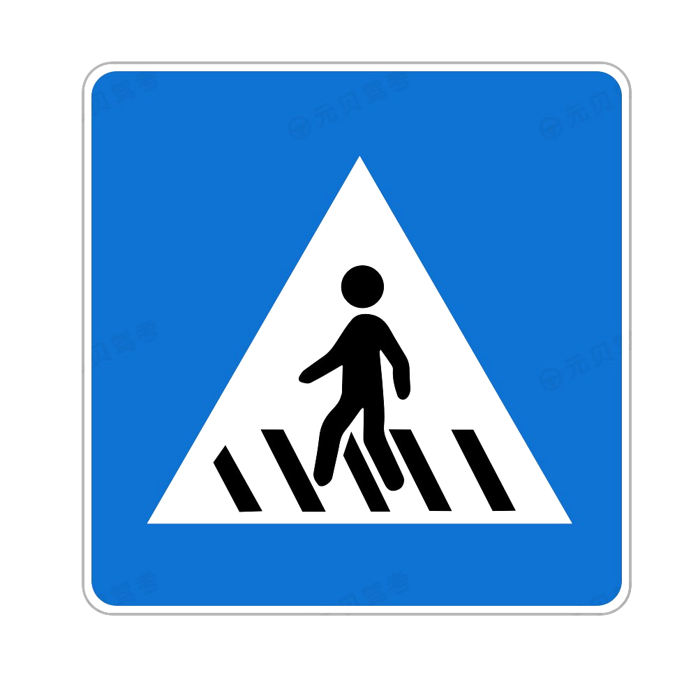

## S连续弯，N反向弯

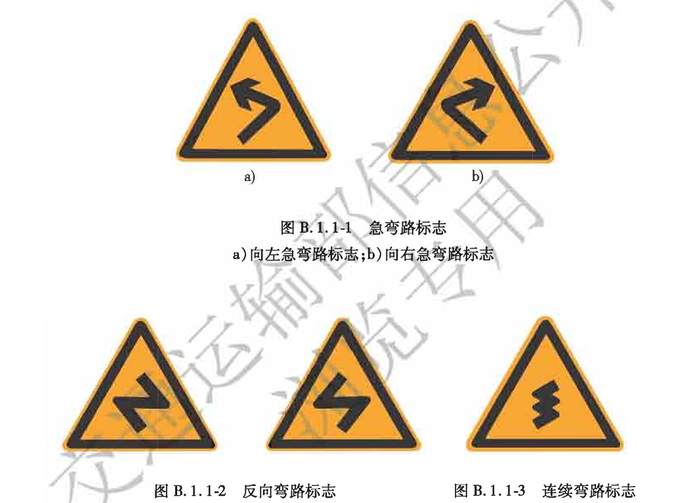

## 注意落石与傍山险路

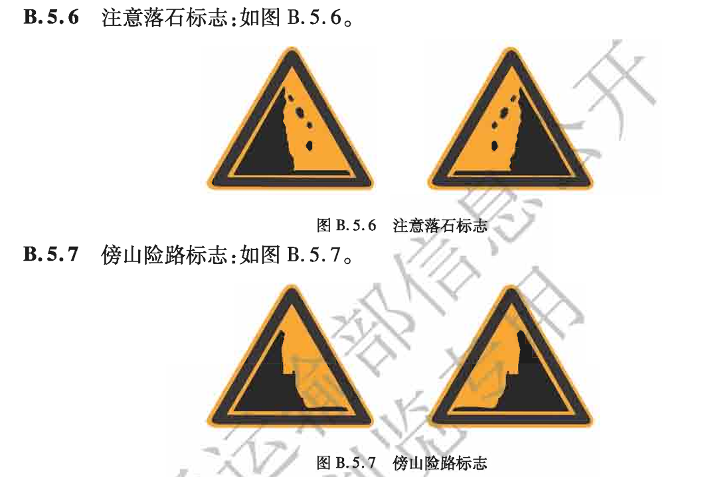

## 停车让行，会车让行，减速让行

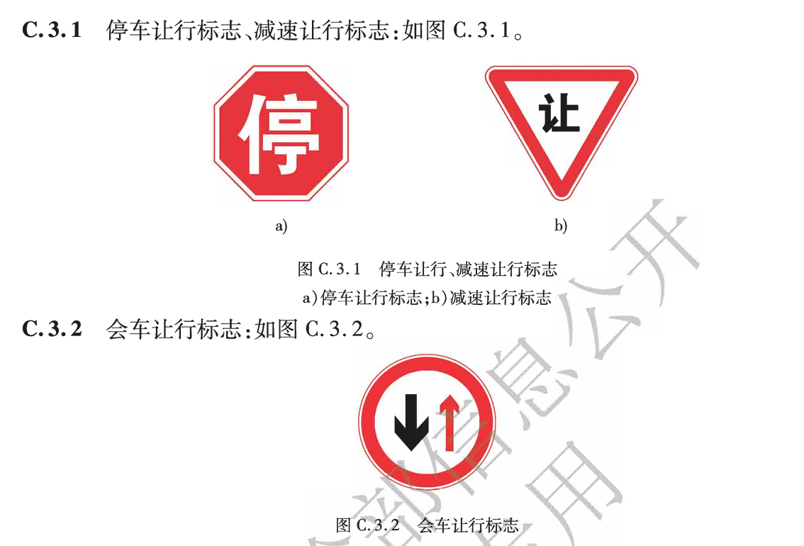

## 禁止通行，禁止驶入，禁止停车，禁止长时间停车

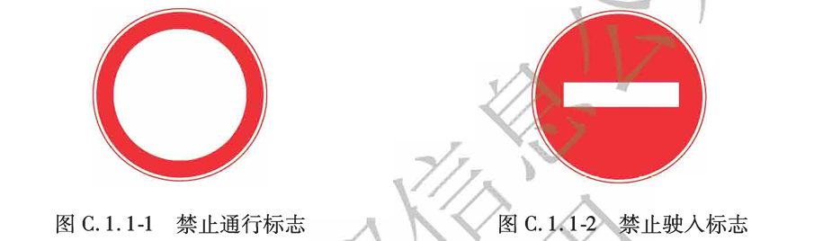

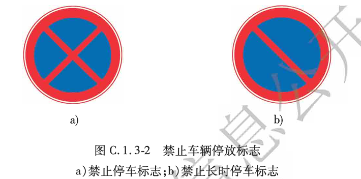

## 禁止机动车驶入：正面各种车，侧面对应车

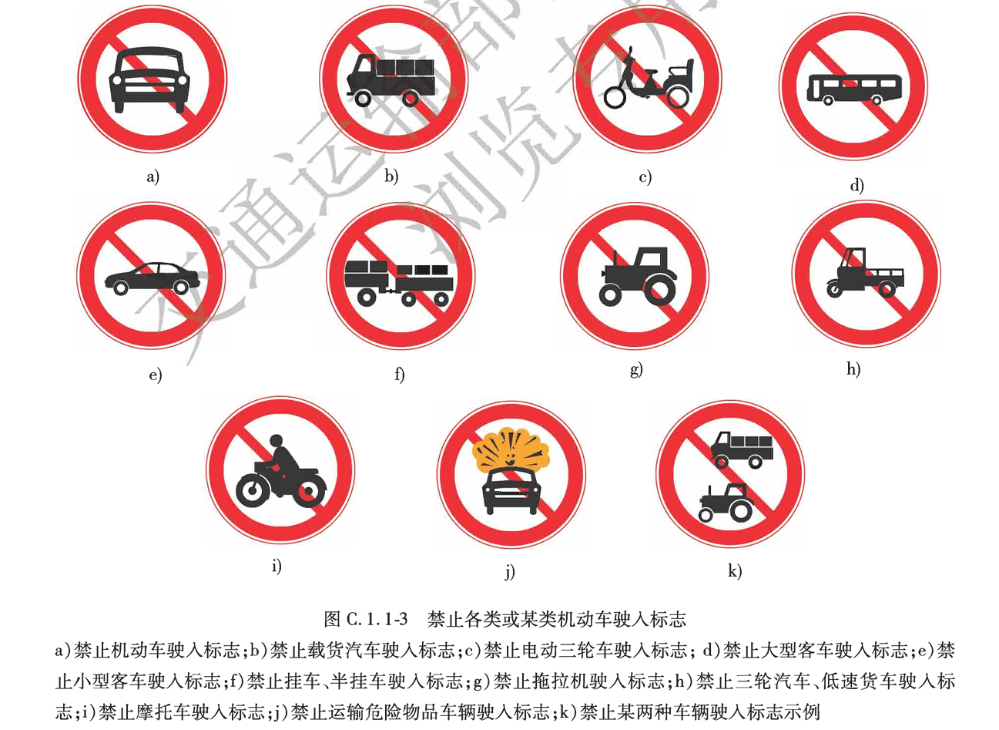

## 蓝底：圆形指示方向，方形虚线车道

## 停车场

P字上没有白色尖角遮挡表示露天停车场，有白色尖角遮挡表示室内停车场。

# 交警手势题

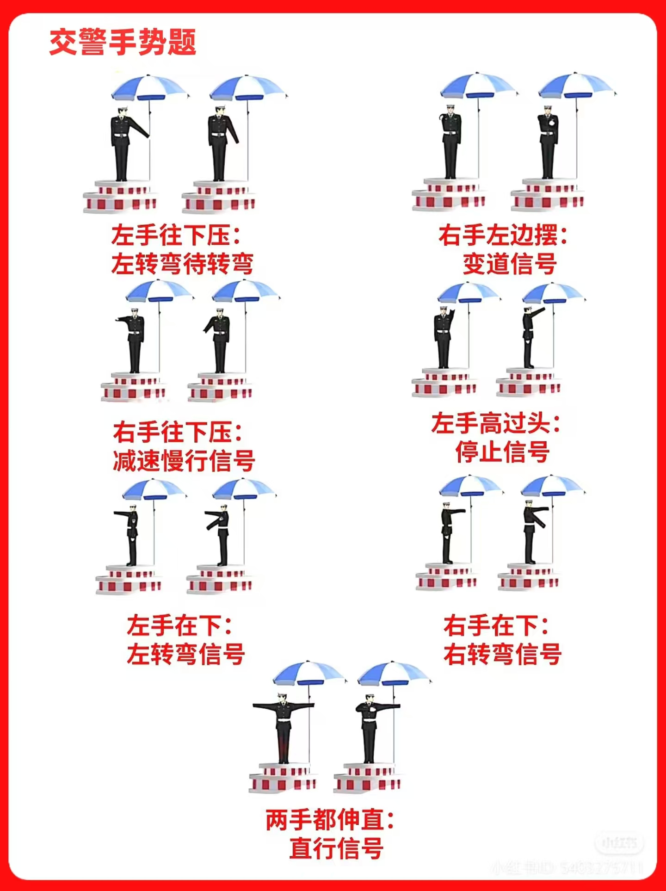

# 仪表盘图标

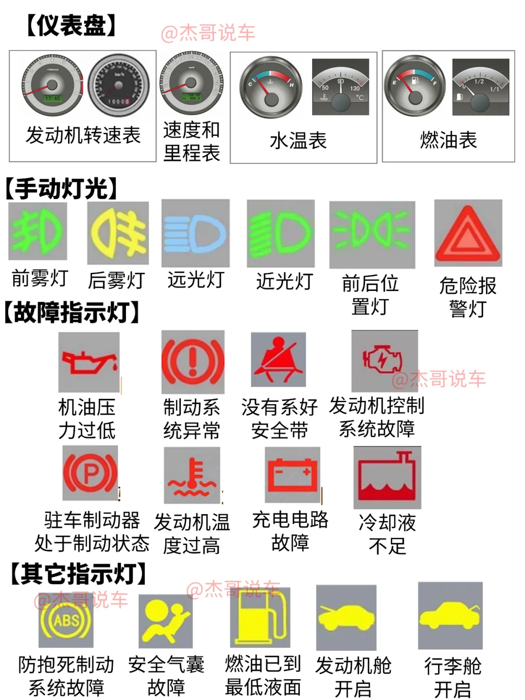

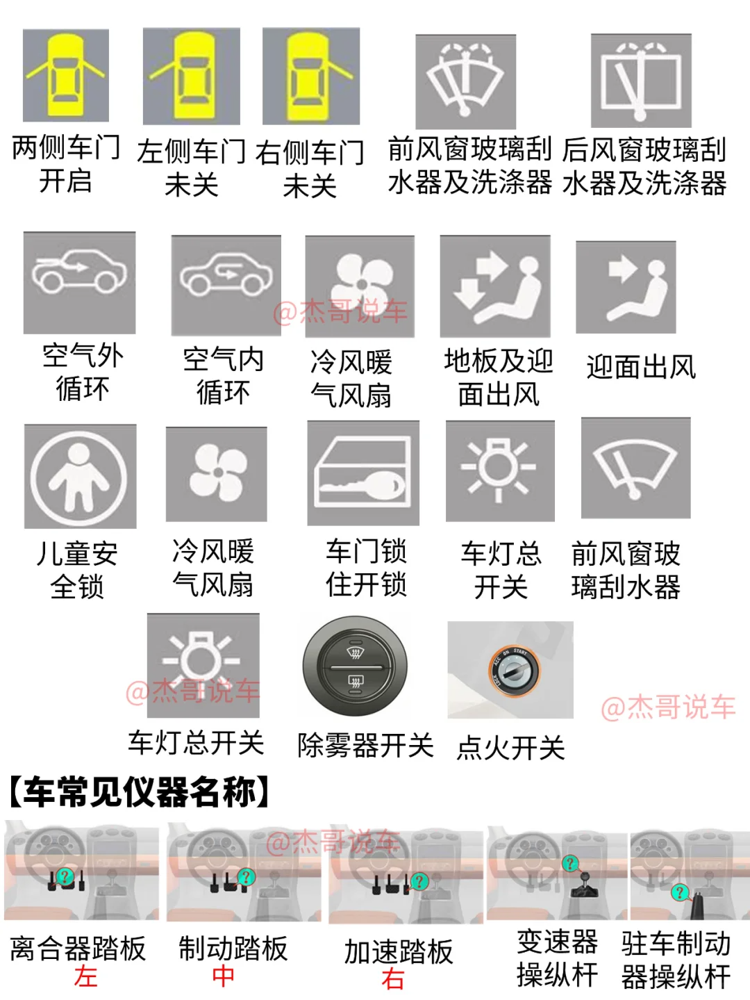

# 英文缩写

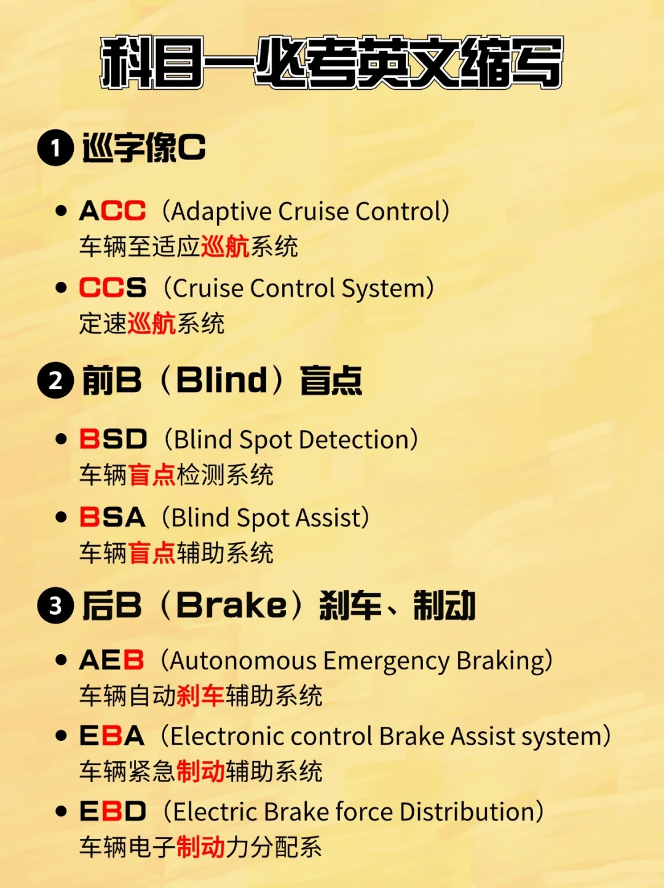

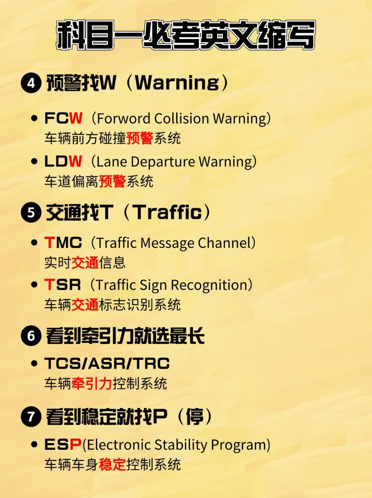

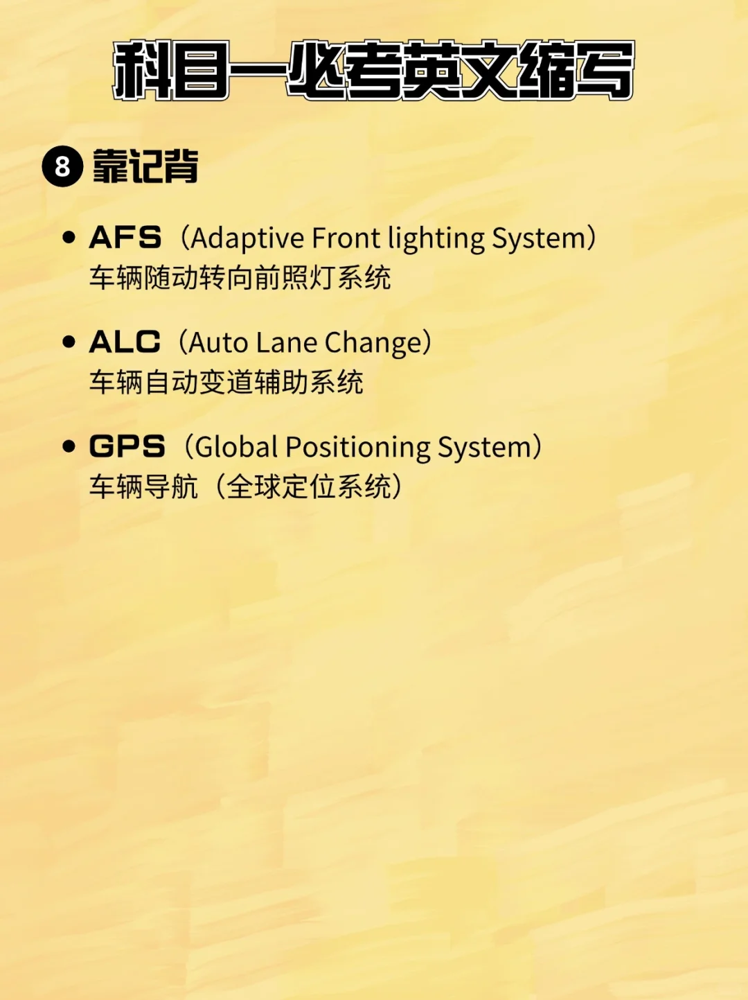