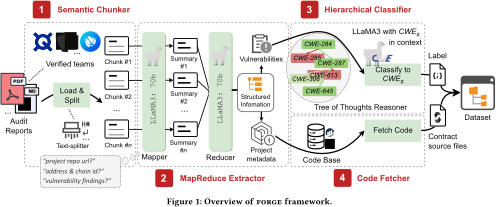

一个基于大语言模型的自动化智能合约漏洞数据集构建框架，看看怎么个事。

# Outline

## 一、研究背景与问题

### 1. 研究背景
- 智能合约在区块链中管理大量资产（TVL > $1170亿），但安全事件频发（2024年损失$23.6亿）。
- 高质量漏洞数据集对安全工具评估和研究至关重要。

### 2. 现有问题
- **人工构建成本高、易出错**：例如DAppSCAN需44人月构建1,618个漏洞。
- **分类标准不统一**：不同数据集使用不同分类体系（如SWC、DASP10），导致标签不一致。

## 二、FORGE 框架设计

FORGE 是一个端到端的自动化框架，包含四个核心模块：

### 1. **Semantic Chunker**
- 将审计报告按语义边界切分为可处理的文本块，适应LLM的上下文限制。

### 2. **MapReduce Extractor**
- **Map阶段**：从每个文本块中提取项目元数据和漏洞信息。
- **Reduce阶段**：合并、去重、结构化提取结果，输出为JSON格式。

### 3. **Hierarchical Classifier**
- 使用**Tree-of-Thoughts**方法，将漏洞按CWE层次结构进行分类。
- 引入**fallback策略**，当无法细分时返回更通用的CWE类别。

### 4. **Code Fetcher**
- 根据提取的元数据（GitHub URL、commit ID、合约地址）获取对应的智能合约源代码。

## 三、实验与评估

### 1. 数据集构建结果（RQ1）
- 输入：6,454份审计报告
- 输出：
  - 81,390个Solidity文件
  - 27,497个漏洞
  - 覆盖296个CWE类别
  - 平均每个项目2,575行代码，59.0%使用Solidity v0.8+
- 耗时：229.5小时，远低于人工构建（如DAppSCAN的44人月）

### 2. 信息提取性能（RQ2）
- 整体精度：95.6%
- 召回率：78.4%
- Macro-F1：86.1%

### 3. 分类一致性（RQ3）
- 使用Krippendorff’s α系数评估与专家的一致性：**0.87**（高于0.80的可靠阈值）

### 4. 数据集实用性（RQ4）
- 评估13种现有安全工具（如Slither、Mythril、Oyente等）
- 最高F1分数仅为18.59%，平均仅为5.06%
- 揭示现有工具在真实漏洞检测中的严重不足
