# 第1章 集合 关系 运算 结构

高斯消元法

# 第2章 线性空间 内积空间

## 2.1线性空间的定义及其简单性质 

## 2.2线性子空间 

## 2.3 线性相关性 

## 2.4 有限维线性空间的基和维数 向量组的秩

## 2.5 向量的坐标 

## 2.6 子空间的交与和 直和 

## 2.7 内积空间... 

## 2.8欧氏空间的单位正交基...... 

## 2.9 正交子空间 正交补 

...是否构成线性空间

证八大性质：

结合律$(\alpha \oplus \beta) \oplus \gamma = \alpha \oplus (\beta \oplus \gamma)$

单位元$\exists\mathbb{e},\mathbb{e} \oplus \alpha = \alpha \oplus \mathbb{e}$

逆元$\forall\alpha,\exists\beta,\alpha \oplus \beta = \beta \oplus \alpha = \mathbb{e}$

交换律$\alpha \oplus \beta = \beta \oplus \alpha$

单位1$\exists\lambda,\lambda \circ \alpha = \alpha$

结合律$\lambda \circ (\mu \circ \alpha) = (\lambda \circ \mu) \circ a$

左分配&右分配$\mu \circ a \oplus \lambda \circ \alpha = (\mu \oplus \lambda) \circ a$

$\mu \circ (\alpha \oplus \beta) = \mu \circ \alpha \oplus \mu \circ \beta$

...是否线性子空间

$W_{1} \subseteq W$

其中的元素满足对原空间的加法和数乘运算封闭

2个平凡子空间：仅含零元的子集$\left\{ 0 \right\}$和其自身$V$

定义2.4 设 *S* 是线性空间 *V* (F) 的非空子集，我们称
${span}(s) = \left\{ \lambda_{1}\alpha_{1},\ldots,\lambda_{k}\left. \ \alpha_{k} \right|\lambda_{\lambda},\ldots,\lambda_{k} \in F,\alpha_{1},\ldots,\alpha_{k} \in S,k \in \mathbb{N}^{+} \right\}$为
*S* 的**线性扩张**，即 *S* 中所有有限子集在域 F 上的一切线性组合组成的
*V* (F) 的子集.

定理2.2 线性空间V(F)的非空子集S的线性扩张L(S)是V中包含 S的最小子空间.

...是否线性相关

解方程$\lambda_{1}\alpha_{1} + \ldots + \lambda_{n}\alpha_{n} = 0$，有$\lambda_{1} = \ldots = \lambda_{n} = 0$以外的解则线性相关，否则线性无关

或者 $\alpha_{1},\ldots,\alpha_{n}$中有一个可以由其他向量线性表示

向量组线性相关$\Leftrightarrow$它们有系数不全为 0 的线性组合等于零向量

向量组线性无关$\Leftrightarrow$它们只有系数全为 0
的线性组合才会等于零向量.

向量组线性相关$\Leftrightarrow$其中至少有一个向量可以由其余向量线性表示；

向量组线性无关$\Leftrightarrow$其中每一个向量都不能由其余向量线性表示.

（例6）如果向量组$\left\{ a_{1},a_{2},\ldots,a_{n} \right\}$线性无关，则其任意子集也线性无关，

如果向量组$\left\{ a_{1},a_{2},\ldots,a_{n} \right\}$线性相关，则其任意包含它的向量组也线性相关.

定理2.4
若向量组$\left\{ a_{1},a_{2},\ldots,a_{n} \right\}$线性无关,而向量组$\left\{ \beta,a_{1},\ldots,a_{n} \right\}$线性相关,则β可由$\left\{ a_{1},a_{2},\ldots,a_{n} \right\}$线性表示,且表示法唯一

推论
如果$\left\{ a_{1},a_{2},\ldots,a_{n} \right\}$是$\mathbb{R}^{n}$中线性无关的n个向量,则$\mathbb{R}^{n}$中任一个向量$\alpha$可由$\left\{ a_{1},a_{2},\ldots,a_{n} \right\}$线性表示,且表示法唯一.

定理2.5设V(F)中向量组$\left\{ \beta_{1},\cdots,\beta_{S} \right\}$的每个向量可由另一向量组$\left\{ a_{1},a_{2},\ldots,a_{r} \right\}$线性表示.如果$s > r$则$\left\{ \beta_{1},\cdots,\beta_{S} \right\}$线性相关；若$\left\{ \beta_{1},\cdots,\beta_{S} \right\}$线性无关，则$s \leq r$。

定义2.7如果线性空间V(F)的有限子集$B = \left\{ a_{1},\ldots,a_{r} \right\}$线性无关,且${span}(B) = V$,则称B为V的一组**基**,并称m为V的**维数**(或说V是n维线性空间),记作
$\dim V = n$。

线性空间V的零子空间$\left\{ 0 \right\}$的维数为零,因为其中没有线性无关的向量

有限维线性空间的基并不唯一,但任一组基所含向量的个数是唯一确定的

定理2.6如果W是n维线性空间V的一个子空间,则W的基可以扩充为V的基(即W的基可添加V中若干向量成为V的基)

定义2.8
设向量组$S = \left\{ a_{1},\ldots,a_{n} \right\}$张成的线性空间为 *V*
，若存在 *S*
的一个线性无关向量组$B = \left\{ a_{k_{1}},\ldots,a_{k_{r}} \right\}$，使得
*V* = span(*B*)，则称 *B* 为 *S*
的一个**极大线性无关组**，并称极大线性无关组的长度 *r* = *r*(*S*) 为 *S*
的**秩**.

(1)秩(S)=r,则S中任何r+1个向量都线性相关.因此S中任何线性无关的向量组至多含r个向量,并把含r个线性无关向量的向量组称为S的极大线性无关组。

(2)如果秩(S)=r,
$B = \left\{ a_{1},\ldots,a_{r} \right\}$是S的极大线性无关组,则L(S)
=L(B),即dimL(S)=秩(S).

(3)如果S,T是V(F)的两个有限子集,且S中每个向量可由T线性表示,则秩(S)≤秩(T).

(4)如果S,T是V(F)的两个有限子集,则L(S)=L(T)的充要条件是:S中每个元素可由T线性表示,且T中每个元素也可由S线性表示(此时也称S与T是**等价向量组**).

*V* (F) 称为有限维线性空间，如果 *V* 中存在一个有限子集 *S* 使得
span(*S*) = *V* ，反 之称为无限维线性空间.

...求最大线性无关组...

?

**向量的坐标**

通过待定系数法解方程即可.

线性空间的运算

设 *W*1*, W*2 是线性空间 *V* (F) 的两个子空间，则

*W*1 *∩ W*2 = *{α \| α ∈ W*1 且 *α ∈ W*2*}*

*W*1 *∪ W*2 = *{α \| α ∈ W*1 或 *α ∈ W*2*}*

*W*1 + *W*2 = *{α*1 + *α*2 *\| α*1 *∈ W*1*, α*2 *∈ W*2*}*

分别称为 *W*1 和 *W*2 的交、并、和

设 *W*1*, W*2 是线性空间 *V* (F) 的两个子空间，则

1\. *W*1 *∩ W*2 是 *V* 的子空间；

2\. *W*1 + *W*2 是 *V* 的子空间；

3\. *W*1*∪W*2 为 *V* 的子空间 *⇐⇒ W*1 *⊆ W*2 或 *W*2 *⊆ W*1 *⇐⇒ W*1*∪W*2
= *W*1+*W*2.

\+ 张起来

*∪ 仅有两个子空间*

*求V*1 和 *V*2 的和的基=\>所有向量连一起解方程

**定理 4.2 覆盖定理** 设 *V*1*, V*2*, . . . , Vs* 是数域 F 上线性空间
*V* (F) 的 *s* 个非平凡子空间，证明：*V* 中至少存在一个向量不属于 *V*1*,
V*2*, . . . , Vs* 中的任何一个，即 *V*1 *∪ V*2 *∪ · · · ∪ Vs* ⊊ *V* .

覆盖定理表明任何一个数域 F
上的线性空间都不能被自身有限个非平凡子空间通过并得到.

**定理 4.3 线性空间维数公式** 设 *W*1*, W*2 是线性空间 *V* (F)
的两个子空间，则 dim *W*1 + dim *W*2 = dim(*W*1 + *W*2) + dim(*W*1 *∩
W*2)*.*

正交子空间 正交补

设 *W*1*, W*2 是线性空间 *V* (F) 的两个子空间. 若 *W*1 *∩ W*2 =
*{*0*}*，则 *W*1 + *W*2 叫做

*W*1 与 *W*2 的**直和**，记作 *W*1 *⊕ W*2.

进一步地，若 *V* = *W*1 *⊕ W*2，则称 *W*1*, W*2 为**互补子空间**，或
*W*1 是 *W*2 的补空间，

或 *W*2 是 *W*1 的补空间

对于子空间 *W*1*, W*2，下列命题等价：

1\. *W*1 + *W*2 是直和，即 *W*1 *∩ W*2 = *{***0***}*；

2\. *W*1 + *W*2 中的每个向量 *α* 的分解式 *α* = *α*1 + *α*2 (*α*1 *∈
W*1*, α*2 *∈ W*2) 唯一；

3\. 零向量的分解式 **0** = *α*1 + *α*2 (*α*1 *∈ W*1*, α*2 *∈ W*2) 仅当
*α*1 = *α*2 = **0** 时成立；

4\. dim(*W*1 + *W*2) = dim *W*1 + dim *W*2.

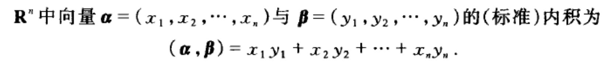{width="5.768055555555556in"
height="0.6097222222222223in"}

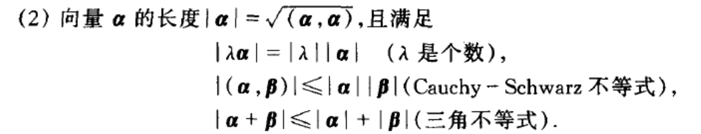{width="5.768055555555556in" height="1.1125in"}

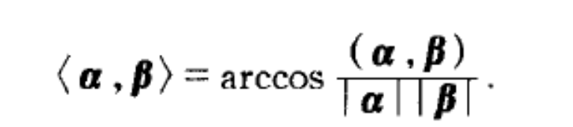{width="2.7407020997375326in"
height="0.6097779965004374in"}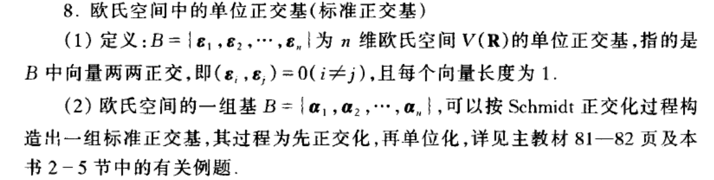{width="5.768055555555556in"
height="1.4569444444444444in"}

# 第3章 线性映射

## 3.1 线性映射的定义及例

## 3.2 线性映射的像和核 

## 3.3线性映射的运算 空间$\mathbf{L}\left( \mathbf{V}_{\mathbf{1}}\mathbf{,}\mathbf{V}_{\mathbf{2}} \right)$ 

## 3.4有限维线性空间的线性映射 线性陕射的秩 

## 3.5 线性空间的同构 

从线性空间 *V*1(F) 到 *V*2(F) 的一个映射 *σ* 是线性的，如果 *∀α, β ∈ V*1
和 *∀λ, µ ∈* F 都有 *σ*(*λα* + *µβ*) = *λσ*(*α*) + *µσ*(*β*)*.*

从线性空间 *V* 到自身的线性映射 *σ* 也叫作 *V*
上的**线性变换**，在有的教材中也称为 **算子**. 从线性空间 *V* (F) 到域 F
的线性映射 *f* 叫作 *V* 上的线性泛函（或称线性函数，线性形式）.

性质：*σ*(*α* + *β*) = *σ*(*α*) + *σ*(*β*) (加性)

*σ*(*λα*) = *λσ*(*α*) (齐次性)

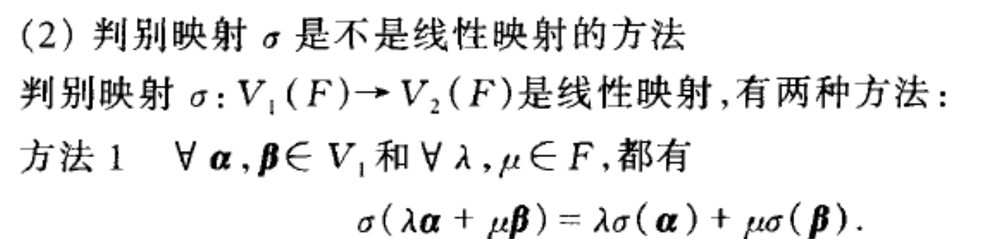{width="5.768055555555556in"
height="1.38125in"}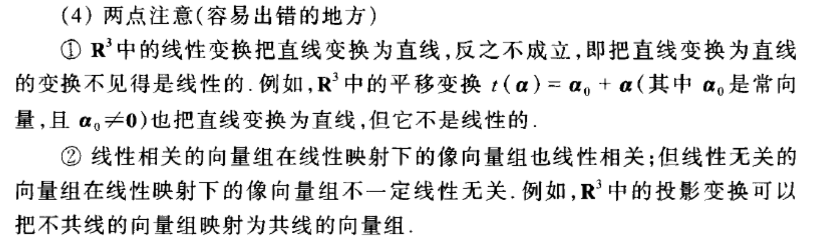{width="5.768055555555556in"
height="1.7055555555555555in"}

3.2 线性映射的像和核

$$r(\sigma) = \dim\left( {Im}\sigma \right)$$

$$\gamma(\sigma) + \dim\left( {Ker}r \right) = \dim V_{1} = n$$

设 *σ* 是线性空间 *V*1(F) 到 *V*2(F) 的线性映射. *V*1 的所有元素在 *σ*
下的像组成的集合

*σ*(*V*1) = *{β \| β* = *σ*(*α*)*, α ∈ V*1*}* 称为 *σ*
的**像**（或**值域**），记作 Im *σ*，或记作 range *σ*.

*V*~2~ 的零元 02 在 *σ* 下的完全原像称为 *σ*
的**核**（或**零空间**），记作 ker *σ*，或记作 null *σ*.

设 *σ ∈ L*(*V*1*, V*2)，如果 *σ*(*V*1) 是 *V*2 的有限维子空间，则
*σ*(*V*1) 的维数称为 *σ* 的秩，

记作 *r*(*σ*)，即 *r*(*σ*) = dim *σ*(*V*1).

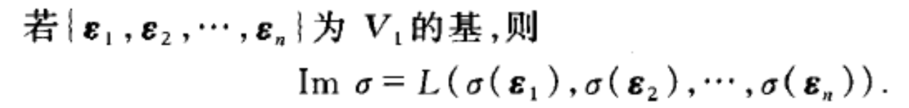{width="4.218601268591426in"
height="0.504342738407699in"}

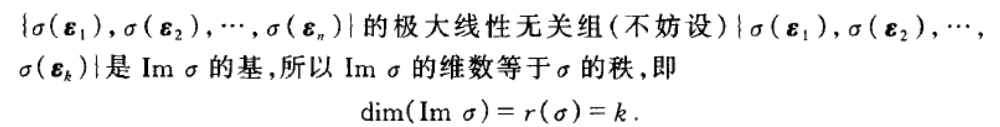{width="5.768055555555556in"
height="0.7347222222222223in"}

线性映射的运算:

设 *σ ∈ L*(*V*1*, V*2)，若 dim *V*1 = *n*，则 *r*(*σ*) + dim ker *σ* =
*n.*

线性映射的秩（或者说线性映射像空间维数）与核空间维数之和等于出发空间的维数.

有限维线性空间的线性映射 线性映射的秩

如果由线性空间 *V*1(F) 到 *V*2(F) 存在一个线性双射 *σ*，则称 *V*1(F) 和
*V*2(F) 是**同构**

**的**，记作 *V*1(F) *∼*= *V*2(F). *σ* 称为 *V*1(F) 到 *V*2(F)
的一个**同构映射**.

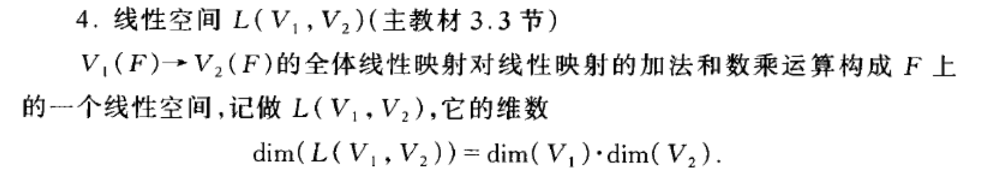{width="5.768055555555556in"
height="0.9923611111111111in"}

# 第4章 矩阵

## 4.1 矩阵的定义

## 4.2线性映射的矩阵表示

## 4.3矩阵的加法与数量乘法

## 4.4矩阵的乘法

## 4.5 可逆矩阵

定义4.5设A∈M.(F),如果存在B∈M(F),使得$BA = AB = E$，则称矩阵A是可逆的,并把B叫做A的逆矩阵

定理4.2设B,A∈M(F),若AB=E,则必有BA=E,即A,B互为逆矩阵。

> （1）主对角元都是非零数的对角矩阵一定可逆，且逆矩阵就是对角线上元素取倒数

求逆矩阵：

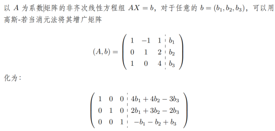{width="5.6570395888014in"
height="2.698292869641295in"}

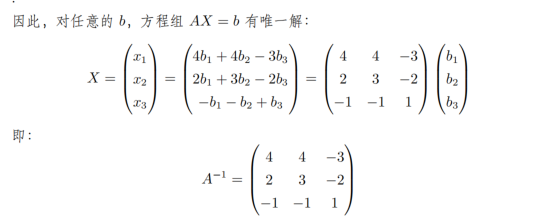{width="5.768055555555556in"
height="2.279861111111111in"}

## 4.6矩阵的转置

## 4.7矩阵的初等变换和初等矩阵

## 4.8矩阵的秩 相抵标准形

${tr}(A) = \sum_{i = 1}^{n}a_{ii}$被称为矩阵的迹

## 4.9分块矩阵

分块矩阵

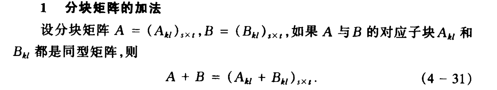{width="5.768055555555556in"
height="1.0486111111111112in"}

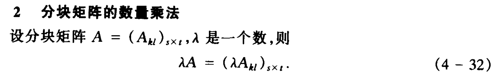{width="5.768055555555556in"
height="0.8729166666666667in"}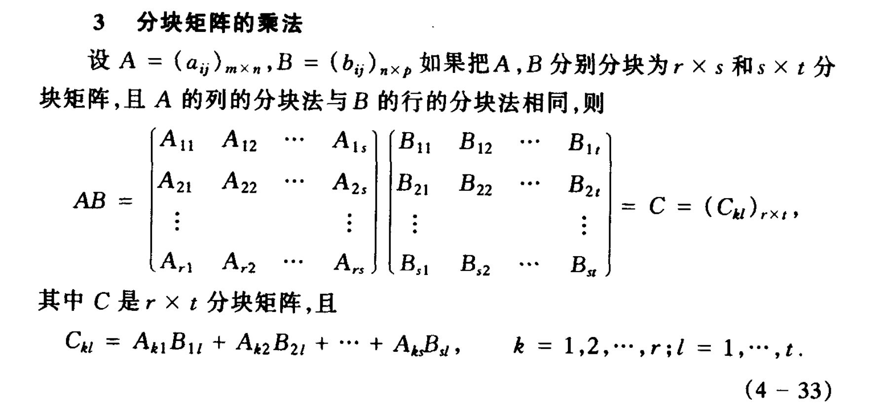{width="5.768055555555556in"
height="2.6590277777777778in"}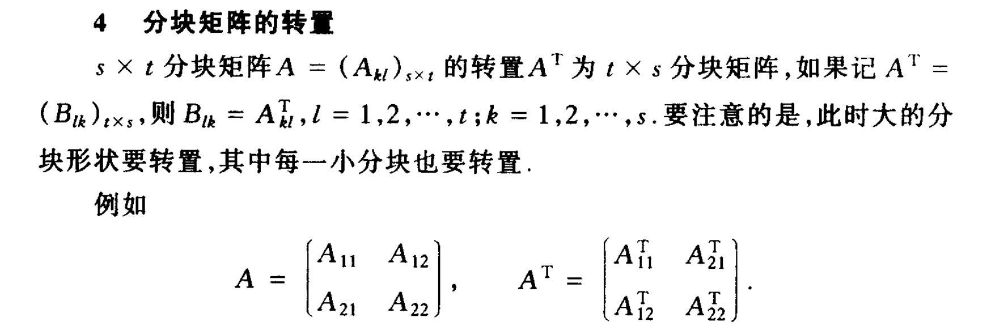{width="5.768055555555556in"
height="1.90625in"}

## 4.10基的变换矩阵与坐标变换

矩阵是线性映射的数值表示,矩阵的运算与是线性映射的运算相对应

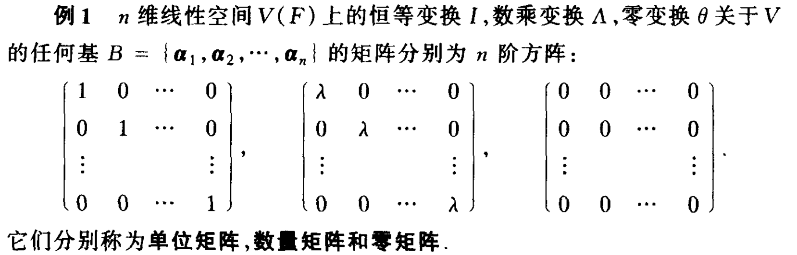{width="4.396856955380578in"
height="1.410812554680665in"}

运算。。。。

可逆矩阵(主教材4.5节)

定义4.5设A∈Mn(F),如果存在B∈Mn(F),使得 BA=AB=E,
则称矩阵A是可逆的,并把B叫做A的逆矩阵。

定理4.2设B,A∈Mn(F),若AB=E,则必有BA=E,即A,B互为逆矩阵。

方程的逆矩阵

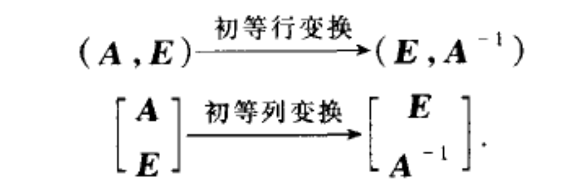{width="2.92007217847769in"
height="0.9527318460192475in"}

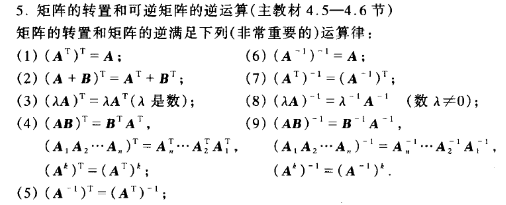{width="5.768055555555556in"
height="2.3402777777777777in"}

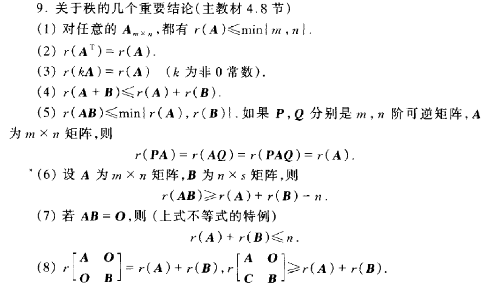{width="5.768055555555556in"
height="3.3819444444444446in"}

-   

# 第5章 行列式

## 5.1 n阶行列式的定义 

数域 F 上的一个 *n* 阶**行列式**是取值于 F 的 *n* 个 *n* 维向量 *α*1*,
α*2*, . . . , αn ∈* F *n* 的一

个函数，且 *∀αi , βi ∈* F *n* 和 *∀λ ∈* F，满足下列规则：

1\. (齐性) *D*(*α*1*, . . . , λαi , . . . , αn*) = *λD*(*α*1*, . . . ,
αi , . . . , αn*)；

2\. (加性，与 1 合称线性性)

*D*(*α*1*, . . . , αi* + *βi , . . . , αn*) = *D*(*α*1*, . . . , αi , .
. . , αn*) + *D*(*α*1*, . . . , βi , . . . , αn*)；

3\. (反对称性) *D*(*α*1*, . . . , αi , . . . , αj , . . . , αn*) =
*−D*(*α*1*, . . . , αj , . . . , αi , . . . , αn*)；

4\. (规范性) *D*(*e*1*, e*2*, . . . , en*) = 1.

【任意一项的倍数可以提出来，相加可以拆出来，调换列值取反】

性质1 若行列式有一列为零向量,则行列式的值等于零

性质2 若行列式有两列元素相同,则行列式的值等于零

性质3若行列式有两列元素成比例,则行列式的值等于零.

性质4
将行列式的某一列乘以常数加到另一列(即对行列式作倍加列变换),则行列式的值不变

性质5若$\left\{ \alpha_{1},\alpha_{2},\ldots,\alpha_{n} \right\}$线性相关,则$D\left( \alpha_{1},\alpha_{2},\cdots,\alpha_{n} \right) = 0$

性质6
n阶行列式的行与列依次互换,则行列式的值不变。$\left| A^{T} \right| = |A|$

## 5.2行列式按一列(行)的展开式 

行列式按一列(或行)的展开式是计算行列式的一种常用方法,它把计算
一个n阶行列式化为计算n个n-1阶行列式

## 5.3方阵乘积的行列式 

定理5.3 若$A,B \in M_{n}(F)$,则$|AB| = |A||B|$

定理5.4 $n$阶矩阵A可逆的充要条件是$|A| \neq 0$

定义5.4 矩阵A的非零子式的最高阶数r称为A的行列式秩

定理5.5秩(A)=r的充要条件是A的行列式的秩为r,

伴随矩阵：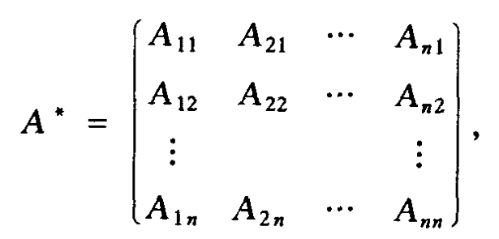{width="2.5624070428696415in"
height="1.2290671478565178in"}代数余子式矩阵的转置

(2)伴随矩阵的性质

①$AA^{*} = A^{*}A = |A|E$,若\|A\|≠0,则$A^{- 1} = \frac{1}{|A|}A^{*}$，$A^{*} = |A|A^{- 1}$，$\left( A^{*} \right)^{- 1} = \frac{1}{|A|}A$

③$\left| A^{*} \right| = |A|^{n - 1}$ (此式对\|A\|≠0,\|A\|=0都成立).

## 5.4 Cramer法则 

定理5.7若A为n阶矩阵,则齐次线性方程组AX=0有非零解的充要条件为$|A| = 0$
,即秩(A)\<n,

其等价命题为:AX=0只有零解的充要条件为$|A| \neq 0$

More...

**化三角形法**

上、下三角矩阵行列式均为主对角线元素的乘积；

**范德蒙（Vandermonde）行列式**

"打洞法"（分块矩阵初等变换）：

$$\left| \begin{matrix}
A & 0 \\
0 & B
\end{matrix} \right| = \left| \begin{matrix}
A & 0 \\
C & B
\end{matrix} \right| = \left| \begin{matrix}
A & D \\
0 & B
\end{matrix} \right| = |A||B|$$

**连加法：**

矩阵的每行或每列总和相等，这时我们可以将每行或每列的元素分别累加到第一行或第一列上，从而使得第一行或第一列的元素全部相同，然后将第一行或第一列的元素提取出来

**滚动消去法**

**降阶法：**

用按行展开或按列展开的方法以及分块对角矩阵行列式的性质

？more

**行列式的常用性质**

设 *A, B ∈* F *n×n*，*k ∈* F，则

1\. 一般情况下，$|A \pm B| \neq |A| \pm |B|$；

2.$|kA| = k^{n}|A|$

3\. 初等矩阵行列式（注意初等矩阵不分行列，左乘右乘区分初等行列变换）：

*\|Eij \|* = *−*1*, \|Ei*(*c*)*\|* = *c, \|Eij* (*k*)*\|* = 1；

4\. *\|AB\|* = *\|A\|\|B\|, \|Ak \|* = *\|A\| k*；

5\. *A* 可逆$\Leftrightarrow |A| \neq 0$；

6.$\left| A^{T} \right| = |A|$；

7\. 上、下三角矩阵行列式均为主对角线元素的乘积；

8\. 若 *A* 可逆，则 $\left| A^{- 1} \right| = |A|^{- 1}$

# 第6章 线性方程组与线性几何

## 6.1齐次线性方程组

定理6.1设矩阵$A \in M_{m \times n}(F)$,若r(A)=r,则齐次线性方程组
AX=0的解空间N(A)是$F^{n}$的一个$n - r$维子空间

推论
以m×n矩阵A为系数矩阵的齐次线性方程组AX=0有非零解的充要条件是$r(A) < n$

定理6.2对于非齐次线性方程组AX=b,下列命题等价:

(1)AX=b有解;

(2)b∈R(A),即b可被A的列向量组线性表示;

(3)r(A,b)=r(A),即增广矩阵的秩等于系数矩阵的秩

推论 非齐次线性方程组AX=b有唯一解的充要条件是r(A,b)=r(A)=A的列数。

定理6.3若非齐次线性方程组AX=b有解,则其一般解为$X = X_{0} + \overline{X}$,
其中$X_{0}$是AX=b的一个特解;$\overline{X}$是AX=0的一般解

## 6.2非齐次线性方程组

齐次线性方程组总是有解的（）

$$\dim{N(A)} = \dim\left( \ker\sigma \right) = dimV_{1} - r(\sigma) = n - r(A)$$

AX=0的基础解系(

设A是m×n矩阵,且r(A)=r\<n,则以下命题成立

1)AX=0存在基础解系,即解空间N(A)的一组基(或解集合的极大线性无关组),它包含n-r个线性无关的解向量

②AX=0的任意n-r个线性无关的解,都是AX=0的一个基础解系

③若AX=0有一组线性无关的解$X_{1},X_{2},\ldots,X_{p}$且AX=0的任意一个解均可用它们线性表示,则$X_{1},X_{2},\ldots,X_{p}$是AX=0的一个基础解系,此时必有
p=n-r(A).

④与AX=0的基础解系等价的向量组也是AX=0的一个基础解系

⑤方程组AX=0的通解(一般解)为基础解系的线性组合:
$X = k_{1}X_{1} + k_{2}X_{2} + \ldots + k_{n - r}X_{n - r}$

求解方法:对增广矩阵\[A,b\]作初等行变换,将其化为阶梯形矩阵\[U,
d\].则UX=d与Ax=b是同解方程组.

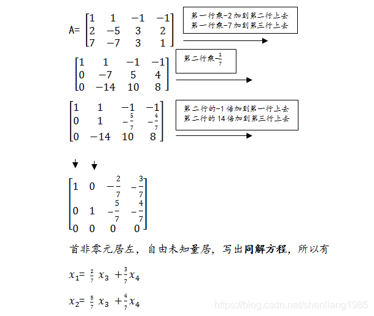{width="4.4099475065616796in"
height="3.7345975503062117in"}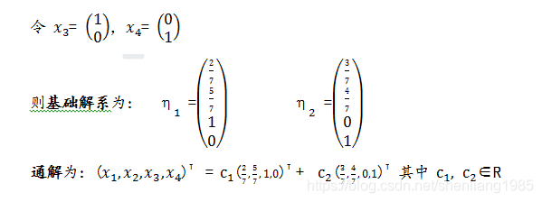{width="4.440127952755906in"
height="1.6587674978127733in"}

(1)检查解是否正确,一是代入方程组看是否满足方程,二是看任意常数的个数是否等于$n - r$

(3)求线性方程组的解时,只能做行变换,不能做倍乘和倍加列变换.因为这种列变换后所得的方程组与原方程组不是同解方程组.

# 第7章 特征值与特征向量 矩阵的标准形

## 7.1 正交变换与正交矩阵 

定义7.1欧氏空间V(R)的一个线性变换$\sigma$称为正交变换,如果$\forall\alpha,\beta \in V$,都有

$$\left( \sigma(\alpha),\sigma(\beta) \right) = (\alpha,\beta)$$

定义7.2欧氏空间V(R)的正交变换$\sigma$关于V的单位正交基所对应的矩阵A称为正交矩阵

定义7.3
n阶实矩阵A称为正交矩阵,如果$A^{T}A = E$(或：如果A的列向量组是$\mathbb{R}^{n}$的一组单位正交基).

(1)若A为正交矩阵,则$A^{- 1} = A^{T}$,且$A^{T}$也是正交矩阵;

(2)若A是正交矩阵,则$|A| = 1$或-1;

(3)若A,B都是正交矩阵,则AB也是正交矩阵.

## 7.3 线性变换在不同基下的矩阵表示 相似矩阵 

## 7.4特征值与特征向量 

设 *σ* 是线性空间 *V* (F) 上的一个线性变换，如果存在数 *λ ∈* F
和非零向量 *ξ ∈ V* 使

得 *σ*(*ξ*) = *λξ*，则称数 *λ* 为 *σ* 的一个**特征值**，并称非零向量 *ξ*
为 *σ* 属于其特征值 *λ*

的**特征向量**.

## 7.5可对角化的条件 相似标准形 

## 7.6实对称矩阵的对角化 

## 7.7双线性函数 二次型 

## 7.8实二次型的标准形 实对称矩阵的相合标准形

## 7.9正定二次型与正定矩阵 其它有定二次型

矩阵的主对角元之和称为矩阵A的**迹tr(A)**

1.正交变换与正交矩阵

2.正交变换和正交矩阵(主教材7.1节)

正交变换是保持向量长度(从而保持两向量的夹角)不变的线性变换.在R2和

R°中向量的旋转变换和镜面反射(镜像变换)是典型的、基本的正交变换.

正交矩阵2是实矩阵,它满足2\*Q=E.所以,1Q1=1或-1;Q1=0′;0

的列向量组和行向量组都是单位正交向量组,也是R"的单位正交基;两个正交矩

阵 A,B的乘积 AB也是正交矩阵

二次型

二次齐次多项式对应二次型

*n* 个元 *x*1*, x*2*, . . . , xn* 的二次齐次多项式

称为域 F 上的 *n* 元二次型（简称**二次型**）.
