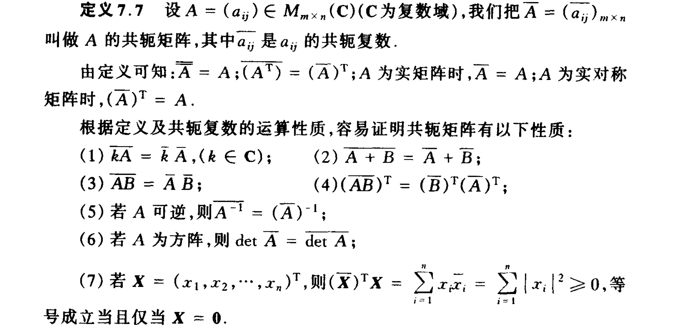

定义3.1从线性空间$V_{1}(F)$到$V_{2}(F)$的一个**映射**$\sigma$是**线性**的,如果$\forall\alpha,\beta \in V_{1}$和$\forall\lambda,\mu \in F$都有

$$\sigma(\lambda\alpha + \mu\beta) = \lambda\sigma(\alpha) + \mu\sigma(\beta)$$

从线性空间V到自身的线性映射$\sigma$也叫做V上的**线性变换**,

从线性空间V(F)到域F的线性映射f叫做V上的线性函数(或称线性形式)

定义3.2设$\sigma$是线性空间$V_{1}(F)$到$V_{2}(F)$的线性映射,V的所有元素在$\sigma$下的像所组成的集合

$$\sigma\left( V_{1} \right) = \left\{ \left. \ \beta \right|\beta = \sigma(\alpha),\alpha \in V_{1} \right\}$$

称为$\sigma$的**像**(或称$\sigma$的**值域**),$V_{2}$的零元$0_{2}$在$\sigma$下的完全原像

$$\sigma^{- 1}\left( 0_{2} \right) = \left\{ \left. \ \alpha \right|\sigma(a) = 0_{2},\alpha \in V_{1} \right\}$$

称为$\sigma$的**核**,
$\sigma\left( V_{1} \right)$和$\sigma^{- 1}\left( 0_{2} \right)$也常记作$\mathbf{Im}\mathbf{\sigma}$和$\mathbf{\ker}\mathbf{\sigma}$.

定理3.1线性映射$\sigma:V_{1} \rightarrow V_{2}$是单射$\Leftrightarrow \sigma^{- 1}\left( 0_{2} \right) = \left\{ 0_{1} \right\}$

定义3.3设
$\sigma,\tau \in L\left( V_{1},V_{2} \right)$,规定$\sigma$与$\tau$之和$\sigma + \tau$及λ与$\sigma$之数量乘积$\lambda\sigma$分别为

$$(\sigma + \tau)(\alpha) = \sigma(\alpha) + \tau(\alpha)$$

$$(\lambda\sigma)(\alpha) = \lambda\left( \sigma(\alpha) \right)$$

定义3.4(线性映射的秩)设$\sigma \in L\left( V_{1},V_{2} \right)$,如果$\sigma\left( V_{1} \right)$是$V_{2}$的有限堆子空间,则$\sigma\left( V_{1} \right)$的维数称为$\sigma$的**秩**,记作$\mathbf{r}\left( \mathbf{\sigma} \right)$,即

$$r(\sigma) = \dim{\sigma\left( V_{1} \right)}$$

定理3.2(维数公式)
设$\sigma \in L\left( V_{1},V_{2} \right)$如果$\dim\left( V_{1} \right) = n$,则

$$r(\sigma) + \dim\left( \ker\sigma \right) = n$$

定理3.3设$\sigma \in L\left( V_{1},V_{2} \right)$,如果$V_{1}$和$V_{2}$都是$n$维线性空间,则下列命题等价:

(1)秩($\sigma$)=n(或说$\sigma$满秩);(2)$\sigma$是单射;(3)
$\sigma$是满射;(4)$\sigma$是可逆线性映射。

定义3.5如果由线性空间$V_{1}(F)$到$V_{2}(F)$存在一个线性的双射$\sigma$,就说$V_{1}(F)$和$V_{2}(F)$是同构的,记作$V_{1}(F) \cong V_{2}(F)$,这个$\sigma$叫做从$V_{1}(F)$到$V_{2}(F)$的一个**同构映射**(或同构)

定理3.8两个有限维线性空间$V_{1}(F)$和$V_{2}(F)$同构的充要条件是它们的维数相等。

定义4.5设A∈M.(F),如果存在B∈M(F),使得$BA = AB = E$，则称矩阵A是可逆的,并把B叫做A的**逆矩阵**

定理4.2设B,A∈M(F),若AB=E,则必有BA=E,即A,B互为逆矩阵。

定义4.7设$A = \left( a_{ij} \right)_{n \times n}$如果$\forall\mathbb{i},j = 1,\ldots,n$均有$a_{ji} = a_{ij}$,则A称为**对称矩阵**;如均有$a_{ji} = - a_{ij}$,则A称为**反对称矩阵**,

n阶为反对称矩阵A的主对角元都为零,因为由$a_{ji} = - a_{ij}$即得$a_{ii} = 0(\mathbb{i} = 1,2,\ldots,n)$

根据定义4.6和4.7,容易证明:

A为对称矩阵的充要条件是$A^{T} = A$;

A为反对称矩阵的充要条件是$A^{T} = - A$.

定义5.2 在 *n*
阶行列式中，去掉$D = \left| a_{ij} \right|_{n \times n}$元素$a_{ij}$所在的第
*i* 行和第 *j* 列的所有元素而得到的 *n −* 1 阶行列式称为元素 *aij*
的**余子式**，记作
*Mij*，并把数$A_{ij} = ( - 1)^{\mathbb{i} + j}M_{ij}$称为元素 *aij*
的**代数余子式**.

定理5.1(对第j列的展开式和对第i行的展开式)
设$D = \left| a_{ij} \right|_{n \times n}$则

$$D = \sum_{k = 1}^{n}{a_{kj}A_{kj}} = a_{1j}A_{1j} + \ldots + a_{nj}A_{nj},j = 1,2,\ldots,n$$

$$D = \sum_{k = 1}^{n}{a_{ik}A_{ik}} = a_{i1}A_{i1} + \ldots + a_{in}A_{in},i = 1,2,\ldots,n$$

定理5.3 若$A,B \in M_{n}(F)$,则$|AB| = |A||B|$

定理5.4 $n$阶矩阵A可逆的充要条件是$|A| \neq 0$

定义5.4 矩阵A的非零子式的最高阶数r称为A的行列式秩

定理5.5秩(A)=r的充要条件是A的行列式的秩为r,

定理5.6
(Cramer法则)设$A = \left( a_{ij} \right)_{n \times n}$若线性方程组$AX = b$,即$\sum_{j = 1}^{n}{a_{ij}x_{j}} = b$的系数行列式$D = |A| \neq 0$则方程组有唯一解,且$x_{j} = \frac{D_{j}}{D}$

定理5.7若A为n阶矩阵,则齐次线性方程组AX=0有非零解的充要条件为,$|A| = 0$
,即秩(A)\<n,

其等价命题为:AX=0只有零解的充要条件为$|A| \neq 0$

定理6.1设矩阵$A \in M_{m \times n}(F)$,若r(A)=r,则齐次线性方程组
AX=0的解空间N(A)是$F^{n}$的一个$n - r$维子空间

推论
以m×n矩阵A为系数矩阵的齐次线性方程组AX=0有非零解的充要条件是$r(A) < n$

定理6.2对于非齐次线性方程组AX=b,下列命题等价:

(1)AX=b有解;

(2)b∈R(A),即b可被A的列向量组线性表示;

(3)r(A,b)=r(A),即增广矩阵的秩等于系数矩阵的秩

推论 非齐次线性方程组AX=b有唯一解的充要条件是r(A,b)=r(A)=A的列数。

定理6.3若非齐次线性方程组AX=b有解,则其一般解为$X = X_{0} + \overline{X}$,
其中$X_{0}$是AX=b的一个特解;$\overline{X}$是AX=0的一般解

定义7.1欧氏空间V(R)的一个线性变换$\sigma$称为正交变换,如果$\forall\alpha,\beta \in V$,都有

$$\left( \sigma(\alpha),\sigma(\beta) \right) = (\alpha,\beta)$$

定义7.2欧氏空间V(R)的正交变换$\sigma$关于V的单位正交基所对应的矩阵A称为正交矩阵

定义7.3
n阶实矩阵A称为正交矩阵,如果$A^{T}A = E$(或：如果A的列向量组是$\mathbb{R}^{n}$的一组单位正交基).

(1)若A为正交矩阵,则$A^{- 1} = A^{T}$,且$A^{T}$也是正交矩阵;

(2)若A是正交矩阵,则$|A| = 1$或-1;

(3)若A,B都是正交矩阵,则AB也是正交矩阵.

\*正交变换不考

定理7.4设线性变换$\sigma \in L(V,V)$,$B_{1} = \left\{ \alpha_{1},\ldots,\alpha_{n} \right\}$和$B_{2} = \left\{ \beta_{1},\ldots,\beta_{n} \right\}$是线性空V(F)的两组基,基$B_{1}$变为基$B_{2}$的变换矩阵为C,如果$\sigma$在基$B_{1}$下的矩阵为A,则$\sigma$关于基$B_{2}$所对应的矩阵为$C^{- 1}AC$

定义7.4如果对于$A,B \in M_{n}(F)$,存在可逆矩阵$C \in M_{n}(F)$,使得$C^{- 1}AC = B,$则称A**相似**于B,记作$A\sim B$.

容易证明,矩阵的相似关系是集合$M_{n}(F)$上的一种等价关系,即相似关系具有:

(1)自反性,即$\forall A \in M_{n}(F),A\sim A$;

(2)对称性,即$\forall A,B \in M_{n}(F)$,若$A\sim B$,则$B\sim A$;

(3)传递性,即$\forall A_{1},A_{2},A_{3} \in M_{n}(F)$,若$A_{1}\sim A_{2},A_{2}\sim A_{3}$则$A_{1}\sim A_{3}$

因此,彼此相似的矩阵构成一个等价类,等价的相似矩阵都表示同一个线性变换,只不过取的基不同而已,相似矩阵还有以下性质:

(1)$C^{- 1}(kA + tB)C = kC^{- 1}AC + tC^{- 1}BC,(k,t \in F)$

(2)$C^{- 1}(AB)C = \left( C^{- 1}AC \right)\left( C^{- 1}BC \right)$;

(3)若$A\sim B$,则$A^{m}\sim B^{m}$ (m为正整数);

(4)若$A\sim B$,则$f(A)\sim f(B)$

定义7.5设$\sigma$是线性空间V(F)的一个线性变换,如果存在数$\lambda_{0} \in F$和非等向量$\xi \in V$,使得$\sigma(\xi) = \lambda_{0}\xi$,则称数$\lambda_{0}$为$\sigma$的一个**特征值**,称非零向量$\xi$为$\sigma$的属于其特征值$\lambda_{0}$的**特征向量**

定义7.6设矩阵$A \in M_{n}(F)$,如果存在数$\lambda_{0} \in F$和非零向量$X \in F^{n}$.
使得$AX = \lambda_{0}X$则称数$\lambda_{0}$为A的一个**特征值**,称非零向量X为A的属于其特征值$\lambda_{0}$的**特征向量**。

域F上的n阶矩阵A的特征值是方程$|\lambda E - A| = 0$在域F上的根,因此,通常把方程$|\lambda E - A| = 0$叫做矩阵A的特征方程,把λ的n次多项式$f(\lambda) = |\lambda E - A|$叫做矩阵A的特征多项式.

定理7.5
n阶矩阵$A = \left( a_{ij} \right)_{n \times n}$的特征多项式为$f(\lambda) = \lambda^{n} + b_{1}\lambda^{n - 1} + \ldots + b_{k}\lambda^{n - k} + \ldots + b_{n - 1}\lambda + b_{n}$

推论
若n阶矩阵$A = \left( a_{ij} \right)_{n \times n}$的n个特征值为$\lambda_{1},\lambda_{2},\ldots,\lambda_{n}$,则

(1)$\sum_{i = 1}^{n}\lambda_{i} = \sum_{i = 1}^{n}a_{ii}$(2)$\prod_{i = 1}^{n}\lambda_{i} = |A|$

定理7.6若矩阵A与B相似,则它们的特征多项式相等,即$|\lambda E - A| = |\lambda E - B|$

定理7.7设$\lambda_{j}$和$V_{\lambda_{j}}(j = 1,\cdots,n)$是n维线性空间V(F)的线性变换$\sigma$的m个互不相同的特征值及相应的特征子空间,则m个特征子空间的和是直和,即

$$\dim\left( V_{\lambda_{1}} + V_{\lambda_{2}} + \ldots + V_{\lambda_{m}} \right) = \sum_{j = 1}^{m}{\dim V_{\lambda_{j}}}$$

定理7.8 n维线性空间V(F)的线性变换$\sigma$
(或A∈M,(F))可对角化的充分必要条件为$\sigma$(或A)有n个线性无关的特征向量

{width="5.768055555555556in"
height="2.740972222222222in"}

定理7.11 实对称矩阵A的特征值都是实数

定理7.12实对称矩阵A的属于不同特征值的特征向量是正交的

定理7.13 若A是一个n阶实对称矩阵,则存在n阶正交矩阵Q,使得$Q^{- 1}AQ$

定义7.9我们称n阶矩阵A**相合**于B(记作$A\frac{\sim}{}B$),如果存在可逆矩阵C,使$B = C^{T}AC$。容易验证,矩阵的相合(或说:合同)关系也是集合M,(F)中的一种等价5关系,即相合关系具有:

(1)自反性,即$\forall A \in M_{n}(F),A\frac{\sim}{}A$;

(2)对称性,即若A$\frac{\sim}{}$B,则B$\frac{\sim}{}$A;

(3)传递性,即若A$\frac{\sim}{}$B,B$\frac{\sim}{}$C,则A$\frac{\sim}{}$C

定理7.15(主轴定理)对于任一个n元二次型$f\left( x_{1},x_{2},\cdots,x_{n} \right) = X^{T}AX$,都存在正交变换X=
QY,使得$X^{T}AX = Y^{T}\left( Q^{T}AQ \right)Y = \lambda_{1}y_{1}^{2} + \ldots + \lambda_{n}y_{n}^{2}$

其中$\lambda_{1},\ldots,\lambda_{n}$是实对称矩阵A的n个特征值,Q的n个列向量是A属于$\lambda_{1},\ldots,\lambda_{n}$的n个单位正交的特征向量

定理7.16(惯性定理)实对称矩阵A的正、负惯性指数是由A唯一确定的。

定义7.12
n元实二次型$f\left( x_{1},x_{2},\cdots,x_{n} \right) = X^{T}AX$称为**正定二次型**,如果$\forall x \neq 0,\left( x \in R^{n} \right)$恒有$X^{T}AX > 0$;正定二次型$X^{T}AX$所对应的矩阵A叫做**正定矩阵**,

定理7.17 对于n阶实对称矩阵A,下列命题等价

(1)$X^{T}AX$是正定二次型(或A是正定矩阵);

(2)A的正惯性指数为n,即A$\frac{\sim}{}$E;

(3)存在可逆矩阵P,使得$A = P^{T}P$

(4)A的n个特征值$\lambda_{1},\ldots,\lambda_{n}$都大于零.

定理7.18 若n元二次型$X^{T}AX$正定,则

(1)A的主对角元$a_{ii} > 0(\mathbb{i} = 1,2,\ldots,n)$;

(2)A 的行列式$\det A > 0$

定理7.19n元二次型$X^{T}AX$正定的充分必要条件为A的n个顺序主子式(左上角主子式)都大于零,

定义7.12如果n元实二次型$X^{T}AX$满足$\forall x \neq 0$,恒有

\(1\) $X^{T}AX$ \<0,则称之为负定二次型,相应地称A为负定矩阵;

\(2\) $X^{T}AX$≥0,则称之为半正定二次型,相应地称A为半正定矩阵

\(3\) $X^{T}AX$≤0,则称之为半负定二次型,相应地称A为半负定矩阵

不是正定、半正定、负定、半负定的二次型叫做不定二次型
