import { NTable, NCode } from "naive-ui";
import {Timeline as ATimeline, TimelineItem as ATimelineItem} from "ant-design-vue"
import CustomContainer from "@/components/container.vue";

# Lab 0-1 实验报告

## 5.1 反相器的电压传输特性

### 5.1.2

<CustomContainer type="question">

描述执行 `ngspice inv.sp` 得到的输入输出关系

</CustomContainer>

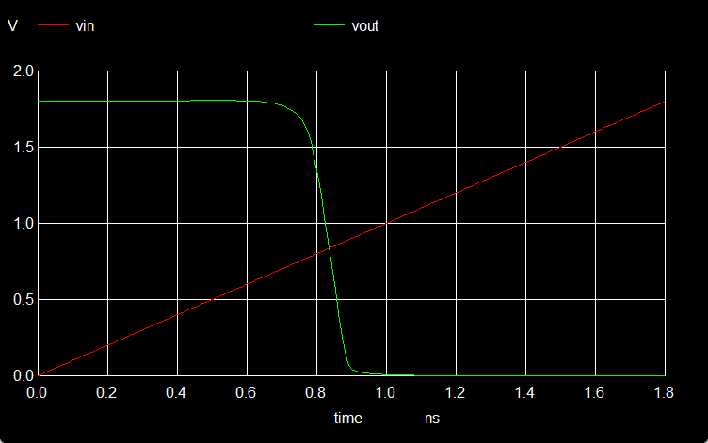

1. 在时间 t=0 到 t=0.8 纳秒之间，输入电压 Vin​ 从 0 线性增加到大约 1.8 伏特，而输出电压 Vout​ 保持在大约 1.8 伏特不变。
2. 在 t=0.8 纳秒时，输出电压 Vout​ 突然下降，迅速降至接近 0 伏特。
3. 从 t=0.8 纳秒之后，输入电压 Vin​ 继续线性增加，而输出电压 Vout​ 保持在 0 伏特不变。

### 5.1.3

<CustomContainer type="question">
  观察 Vout，思考如果给 Vin 接入一个正弦变化的电压，输出的 Vout
  是什么样的，可以手绘 Vout-T 的结果加以文字描述
</CustomContainer>

如果给 Vin 接入一个正弦变化的电压，输出的 Vout 是一个方波。Vin 处于波峰时，Vout 处于 $1.8V$ 处，Vin 处于波谷时，Vout 处于 $0V$ 处

**验证：**

修改`inv.sp`，使接入 Vin 的电压呈正弦变化

<NCode code={
`skywater 130nm Inverter

.option scale=1E-6
.include "./pdk/nfet.spice"
.include "./pdk/pfet.spice"

X0 Vout Vin VGND VGND sky130_fd_pr**nfet_01v8 w=650000u l=150000u
X1 Vout Vin VPWR VPWR sky130_fd_pr**pfet_01v8_hvt w=1e+06u l=150000u

VDD VPWR 0 1.8V
VSS VGND 0 0V

- Vgate Vin GND PWL(0ns 0V 1.8ns 1.8V)
+ Vgate Vin GND SIN(0.9V 0.9V 1e7Hz)

- .tran 0.01ns 1.8ns
+ .tran 0.01ns 300ns

.control
run
setplot tran1
plot Vout vs time Vin
.endc

.end`
} language="diff" show-line-numbers />

发现呈现的Vout图像确实为方波

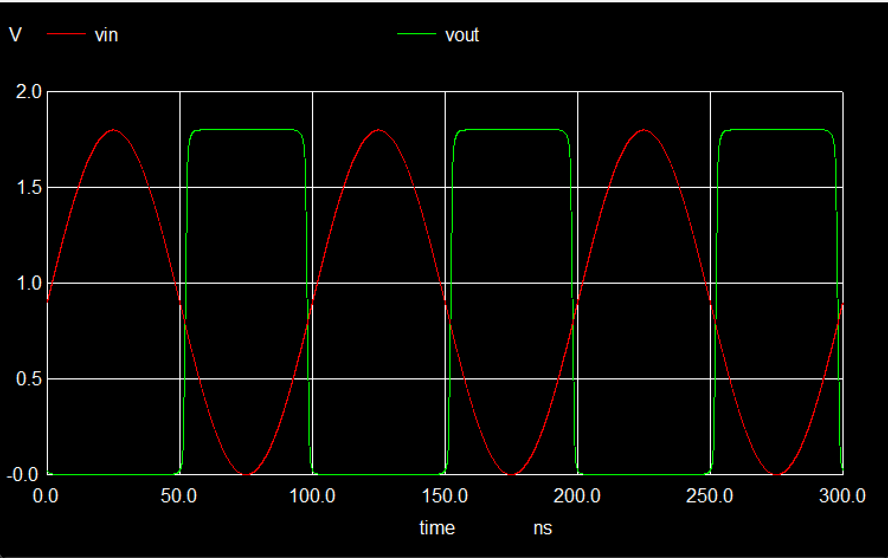

### 5.1.4

<CustomContainer type="question">
  你认为对于该反相器，逻辑 0 和逻辑 1 的阈值应该设定为多少 V，即 Vin
  输入的电压范围是多少可以认为输入的电压是 0/1 信号，Vout
  输出的电压范围是多少可以认为输出的电压是 0/1 信号
</CustomContainer>

Vin 输入应为：
- $1.8V \times [0,0.4] = [0,0.72V]$ 视为 0 信号
- $1.8V \times [0.6,1] = [1.08V,1.8V]$ 视为 1 信号

Vout 输出应为：
- $1.8V \times [0,0.1] = [0,0.18V]$ 视为 0 信号
- $1.8V \times [0.9,1] = [1.62V,1.8V]$ 视为 1 信号

## 5.2  Logisim 电路仿真 30% 

### 5.2.1
<CustomContainer type="question">
截图除安装、保存外的相关实验步骤 10%
</CustomContainer>

<ATimeline>
  <ATimelineItem>
  **创建新文档**
  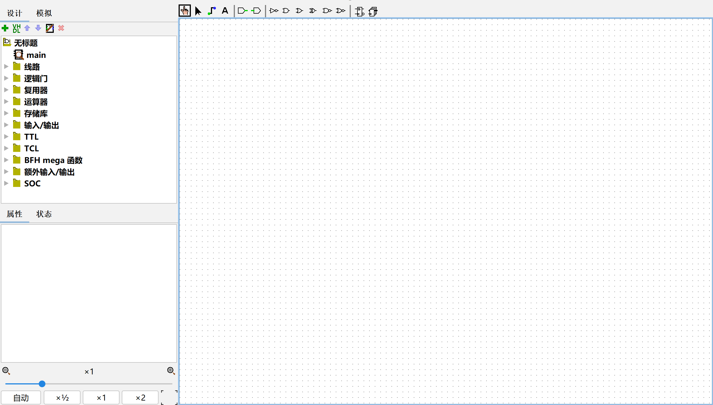
  </ATimelineItem>
  <ATimelineItem>
  **绘图**
  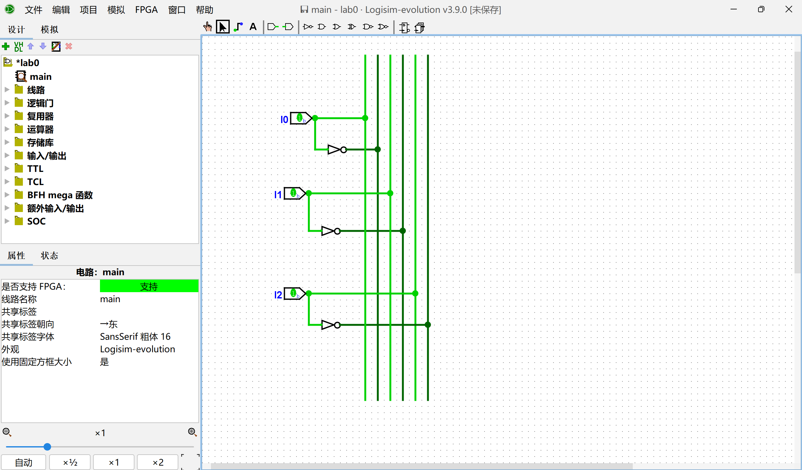
  </ATimelineItem>
  <ATimelineItem>
  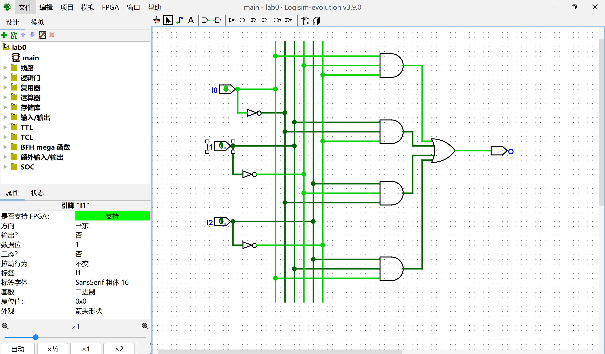
  </ATimelineItem>
  <ATimelineItem>
  **电路仿真**
  （详略）
  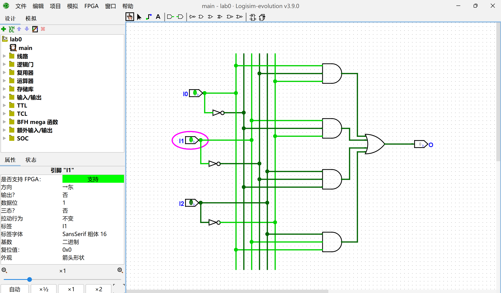
  </ATimelineItem>
</ATimeline>

### 5.2.2

<CustomContainer type="question">
遍历全部可能的输入，填写以下表格并总结该电路实现的功能 20%
</CustomContainer>

<NTable>
    <thead>
        <tr> <th colspan="3">Input</th> <th>Output</th> </tr>
        <tr> <td>I0</td> <td>I1</td> <td>I2</td> <td>O</td> </tr>
    </thead>
    <tbody>
        <tr> <td>$0$</td> <td>$0$</td> <td>$0$</td> <td>$0$</td> </tr>
        <tr> <td>$0$</td> <td>$0$</td> <td>$1$</td> <td>$1$</td> </tr>
        <tr> <td>$0$</td> <td>$1$</td> <td>$0$</td> <td>$1$</td> </tr>
        <tr> <td>$0$</td> <td>$1$</td> <td>$1$</td> <td>$0$</td> </tr>
        <tr> <td>$1$</td> <td>$0$</td> <td>$0$</td> <td>$1$</td> </tr>
        <tr> <td>$1$</td> <td>$0$</td> <td>$1$</td> <td>$0$</td> </tr>
        <tr> <td>$1$</td> <td>$1$</td> <td>$0$</td> <td>$0$</td> </tr>
        <tr> <td>$1$</td> <td>$1$</td> <td>$1$</td> <td>$1$</td> </tr>
    </tbody>

</NTable>

功能：判断了输入中1的个数的奇偶性。

### 5.2.3

<CustomContainer type="question">
尝试总结输入输出关系和电路组成结构之间存在什么内在联系（选做）
</CustomContainer>

~~其实没太理解题目想让人答什么啊（想必是理解能力太差了（幸好是选做题~~

输入输出关系和电路组成结构之间存在着紧密的内在联系，这种联系体现在多个方面：

#### 一、功能决定结构
- **输入输出功能需求引导电路设计**
    - 电路的输入输出关系直接决定了电路的组成结构。例如，如果一个电路需要实现两个输入信号的与逻辑运算，那么电路的结构就应该是包含一个与门。输入信号连接到与门的输入端，输出信号从与门的输出端获取。
    - 对于更复杂的电路，如一个四位全加器，其功能是接收两个四位二进制数和一个低位进位输入，输出它们的和以及高位进位。这就决定了电路结构需要包含多个加法单元（如半加器和全加器的组合），并且这些单元之间需要有特定的连接方式来传递进位信号。

#### 二、结构实现功能
- **电路结构体现输入输出逻辑关系**
    - 电路的组成结构是实现输入输出关系的物理基础。例如，在一个组合逻辑电路中，多个逻辑门（如与门、或门、非门等）按照一定的连接方式组合在一起，形成了特定的逻辑功能。这些逻辑门的连接方式决定了输入信号如何被处理，最终产生期望的输出信号。
    - 以一个简单的优先编码器为例，它的输入是多个信号，输出是优先级最高的信号的编码。优先编码器的电路结构包含多个比较和选择逻辑单元，这些单元根据输入信号的优先级关系进行选择和编码操作，从而实现输入输出之间的特定逻辑关系。

#### 三、层次化结构与模块化设计
- **模块化体现输入输出的局部和整体关系**
    - 在复杂的电路设计中，通常采用层次化和模块化的设计方法。每个模块都有自己的输入输出接口，这些接口定义了模块与其他模块之间的交互方式。
    - 例如，在一个数字处理器中，指令译码模块的输入是指令信号，输出是控制信号。这些控制信号连接到其他模块（如运算单元模块），从而实现整个处理器的输入输出功能。模块化设计使得电路的结构更加清晰，同时也方便对每个模块的输入输出关系进行单独的设计和验证。
- **层次化结构体现输入输出的传递和转换过程**
    - 电路的层次化结构反映了输入信号在不同层次之间的传递和转换过程。在高层次上，输入信号可能是一个复杂的指令或数据包，而在低层次上，这些信号被分解为更基本的信号，通过具体的逻辑电路进行处理。
    - 例如，在一个通信系统中，输入信号可能是一个调制后的信号，在接收端经过多级电路处理，包括解调电路、滤波电路等，最终得到原始的数字信号。每一级电路的结构都对应着输入输出信号的特定转换关系。

#### 四、反馈与控制
- **反馈结构影响输入输出的动态关系**
    - 在时序电路中，反馈结构是实现特定输入输出动态行为的关键。例如，在一个计数器电路中，输出信号通过反馈连接到输入端，形成一个闭环系统。这种反馈结构使得计数器能够在每个时钟周期根据当前状态和输入信号更新其输出状态。
    - 反馈结构还可以用于实现稳定的状态转换和复杂的控制逻辑。例如，在一个锁存器或触发器电路中，反馈信号确保了电路能够在特定的输入条件下保持或改变其状态，从而实现对输入信号的存储和控制功能。

总之，输入输出关系和电路组成结构之间存在着相互依赖、相互实现的内在联系。输入输出关系是电路设计的目标和依据，而电路组成结构是实现这些关系的手段和基础。通过合理设计电路结构，可以精确地实现所需的输入输出功能，满足电路系统的各种应用需求。

# Lab 0-2 实验报告

## 5.1 Verilog 练习 30%

### 5.1.1

<CustomContainer type="question">
写出如下表达式对应的 Verilog 代码（补全 src/lab0-3/syn 10%、src/lab0-3/submit 10%）

$$
F(A,B,C,D) = \overline{B}\,\overline{C}\,\overline{D}+\overline{A}C\overline{B}+\overline{A}BD+CD+AC
$$

</CustomContainer>

<CustomContainer type="attached-file" filename="">

Related Files:
- `lab0-3/syn/top.v`
- `lab0-3/syn/nexysa7.xdc`
- `lab0-3/submit/main.v`

</CustomContainer> 

Core code:

<NCode code={
`module main( 
   input I0,
   input I1,
   input I2,
   input I3,
   output O 
);
   assign O =  ((~I1) & (~I2) & (~I3)) | (~I0 & I2 & ~I1) | (~I0 & I1 & I3) | 
               (I2 & I3) | (I0 & I2);
endmodule`
} language="verilog" show-line-numbers />

### 5.1.2

<CustomContainer type="question">

编写引脚约束文件并进行上板验证，其中将开关 R15、M13、L16、J15 作为输入，LED 灯 H17 作为输出（给出上板结果 10%）:  

</CustomContainer>

**上板结果**（图片未包含所有情况）

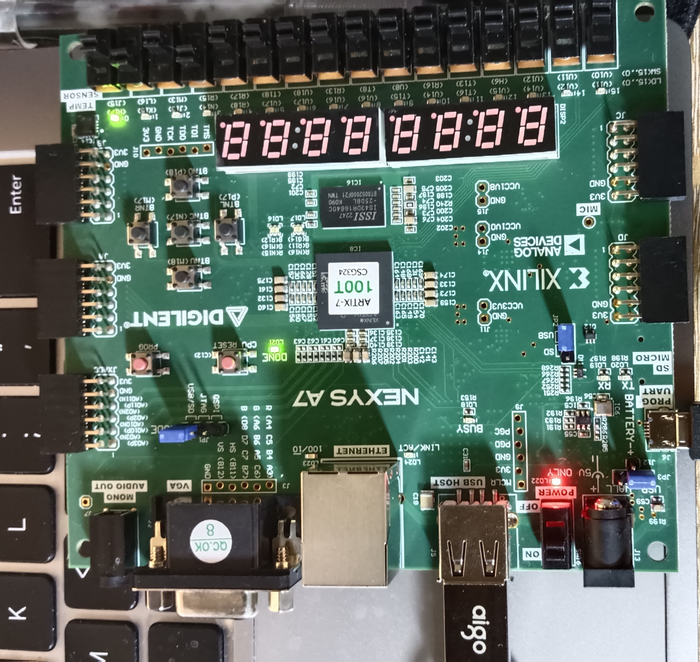
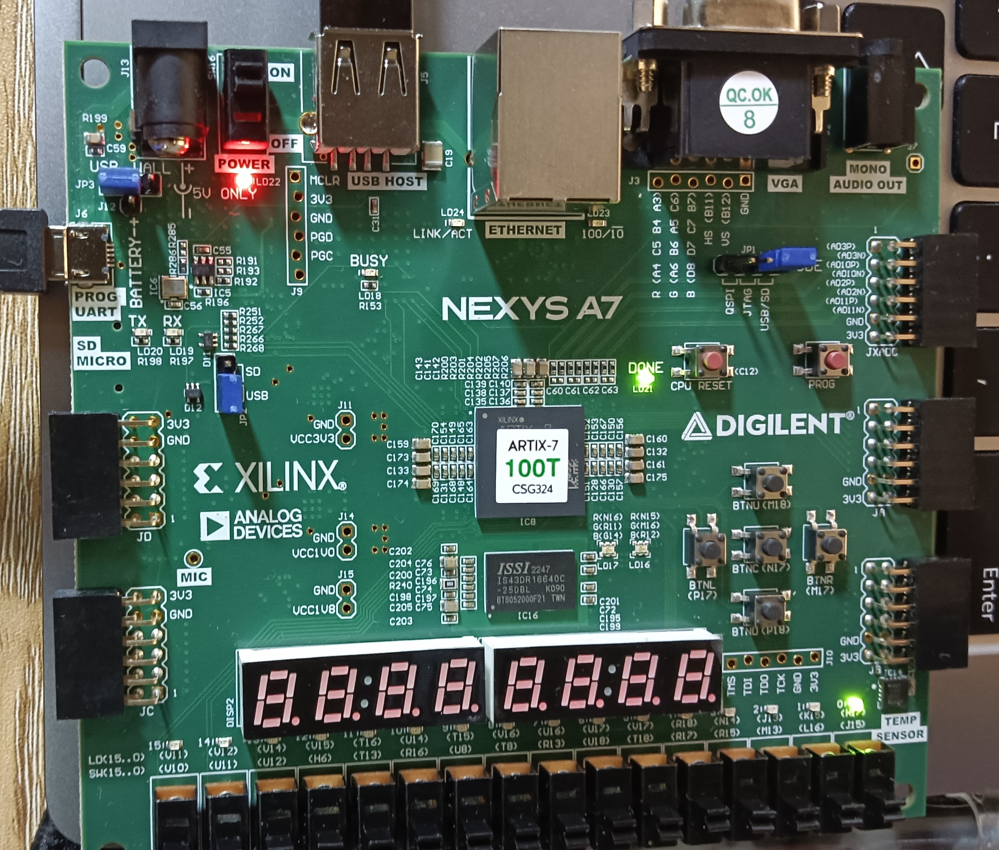
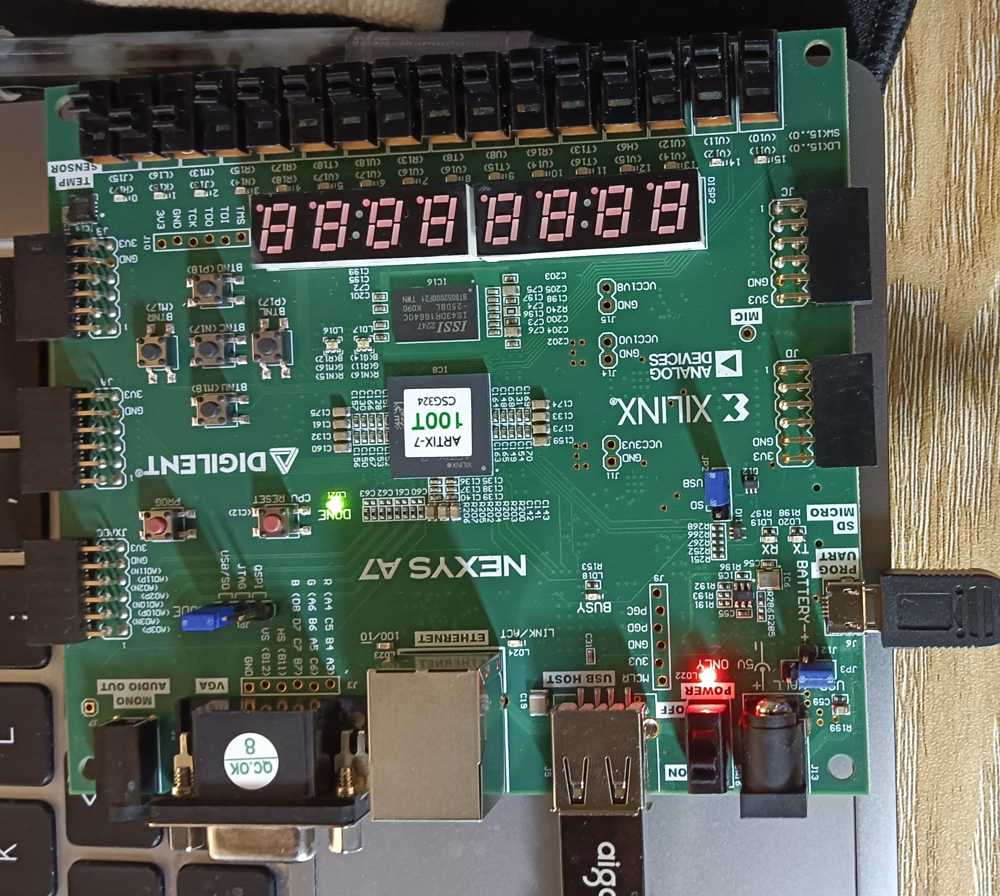

## 5.2 仿真练习 20%

### 5.2.1

<CustomContainer type="question">
为该模块设计仿真激励文件（补全 src/lab0-3/sim 10%），分别用 Verilator 和 Vivado 进行仿真，解释仿真设计的思路，并提供仿真的波形截图，两部分思路截图各5%，共10%
</CustomContainer>

<CustomContainer type="attached-file" filename="">

Related File:
- `lab0-3/sim/testbench.v`

</CustomContainer>

<NCode code={
`module Testbench;

    reg I0,I1,I2,I3;
    wire O;

    initial begin
        // 遍历所有可能的输入
        I0=1'b0;I1=1'b0;I2=1'b0;I3=1'b1;#3;
        I0=1'b0;I1=1'b0;I2=1'b0;I3=1'b0;#3;
        I0=1'b0;I1=1'b0;I2=1'b1;I3=1'b1;#3;
        I0=1'b0;I1=1'b0;I2=1'b1;I3=1'b0;#3;
        I0=1'b0;I1=1'b0;I2=1'b0;I3=1'b1;#3;
        I0=1'b0;I1=1'b0;I2=1'b0;I3=1'b0;#3;
        I0=1'b0;I1=1'b0;I2=1'b1;I3=1'b1;#3;
        I0=1'b0;I1=1'b0;I2=1'b1;I3=1'b0;#3;
        
        I0=1'b0;I1=1'b1;I2=1'b0;I3=1'b1;#3;
        I0=1'b0;I1=1'b1;I2=1'b0;I3=1'b0;#3;
        I0=1'b0;I1=1'b1;I2=1'b1;I3=1'b1;#3;
        I0=1'b0;I1=1'b1;I2=1'b1;I3=1'b0;#3;
        I0=1'b0;I1=1'b1;I2=1'b0;I3=1'b1;#3;
        I0=1'b0;I1=1'b1;I2=1'b0;I3=1'b0;#3;
        I0=1'b0;I1=1'b1;I2=1'b1;I3=1'b1;#3;
        I0=1'b0;I1=1'b1;I2=1'b1;I3=1'b0;#3;

        I0=1'b1;I1=1'b0;I2=1'b0;I3=1'b1;#3;
        I0=1'b1;I1=1'b0;I2=1'b0;I3=1'b0;#3;
        I0=1'b1;I1=1'b0;I2=1'b1;I3=1'b1;#3;
        I0=1'b1;I1=1'b0;I2=1'b1;I3=1'b0;#3;
        I0=1'b1;I1=1'b0;I2=1'b0;I3=1'b1;#3;
        I0=1'b1;I1=1'b0;I2=1'b0;I3=1'b0;#3;
        I0=1'b1;I1=1'b0;I2=1'b1;I3=1'b1;#3;
        I0=1'b1;I1=1'b0;I2=1'b1;I3=1'b0;#3;
        
        I0=1'b1;I1=1'b1;I2=1'b0;I3=1'b1;#3;
        I0=1'b1;I1=1'b1;I2=1'b0;I3=1'b0;#3;
        I0=1'b1;I1=1'b1;I2=1'b1;I3=1'b1;#3;
        I0=1'b1;I1=1'b1;I2=1'b1;I3=1'b0;#3;
        I0=1'b1;I1=1'b1;I2=1'b0;I3=1'b1;#3;
        I0=1'b1;I1=1'b1;I2=1'b0;I3=1'b0;#3;
        I0=1'b1;I1=1'b1;I2=1'b1;I3=1'b1;#3;
        I0=1'b1;I1=1'b1;I2=1'b1;I3=1'b0;#3;

        $finish;
        #1;
    end

    // 定义模块，I0,I1,I2,I3是前述输入数据，O则是其输出
    main dut( 
        .I0(I0),
        .I1(I1),
        .I2(I2),
        .I3(I3),
        .O(O) 
    );

...
`
} language="verilog" show-line-numbers />

**仿真设计思路**主要包括以下几个方面：
- 明确设计目标（功能需求分析：首先要清楚所要设计的数字电路系统需要实现什么功能）
- 设计阶段
  - 模块划分
    - 将整个系统按照功能划分为多个模块。
    - 每个模块都有明确的输入输出接口，方便后续的集成和测试。
  - 编写 Verilog 代码
    - 根据模块的功能，使用 Verilog 语言描述每个模块的逻辑电路。
    - 对于复杂的模块，可能需要使用组合逻辑和时序逻辑来实现。
- 仿真测试阶段
  - 搭建测试平台（Testbench）
    - 测试平台是用于生成输入信号、接收输出信号并观察电路行为的环境。
    - **在这个 Testbench 中，`#3` 表示延迟 3 个时间单位，用于模拟输入信号的变化和观察输出信号的变化；该 Testbench 遍历了输入数据所有可能的值。**
  - 运行仿真
    - 使用仿真工具运行仿真。仿真工具会根据 Verilog 代码和 Testbench 中定义的输入信号，计算出电路的输出信号，并生成波形图等可视化结果。
    - 通过观察波形图，可以直观地看到每个信号的变化情况。
  - 调试与验证
    - 根据仿真结果检查设计是否符合功能需求。如果发现输出信号与预期不符，需要定位问题。可能是 Verilog 代码中逻辑错误，也可能是 Testbench 中输入信号设置不合理。
    - 对于发现的问题，修改代码或 Testbench，重新运行仿真，直到仿真结果满足设计要求。

**Verilator仿真截图**（GTKWave）：

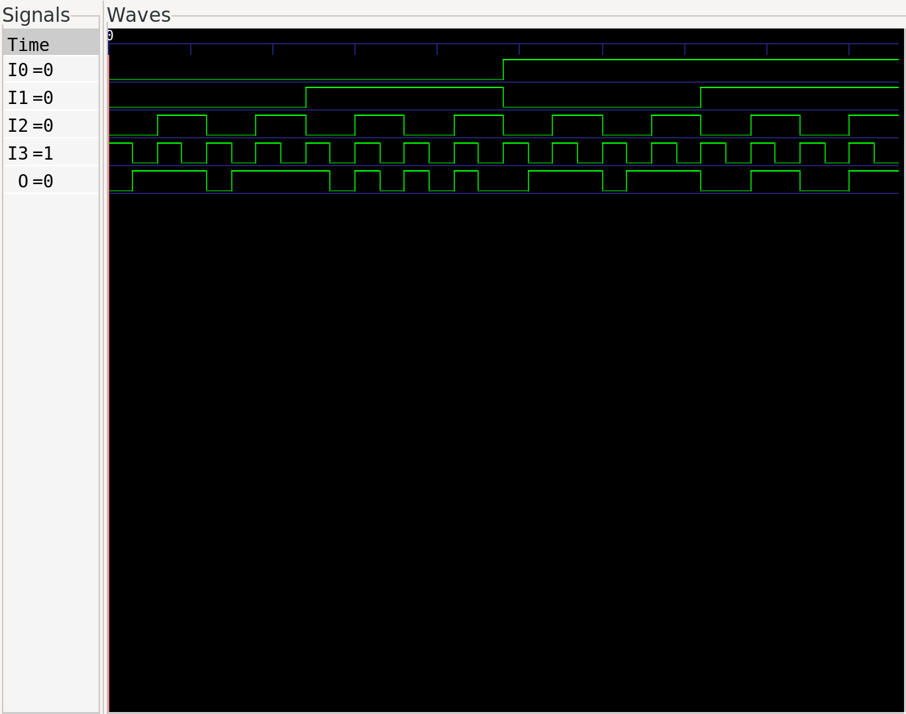

**Vivado仿真截图**：

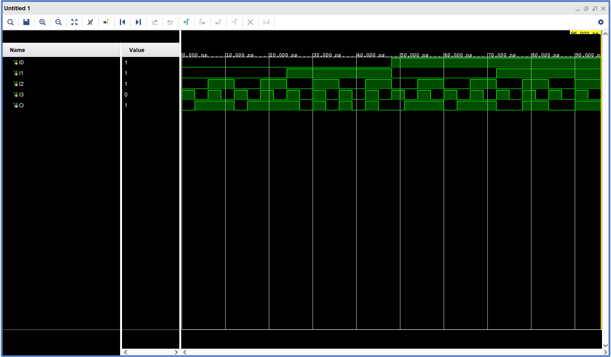

### 5.2.2

<CustomContainer type="question">
尝试 Verilator、Vivado 波形窗口的各个按键，尝试理解每个按键的功能
</CustomContainer>

略