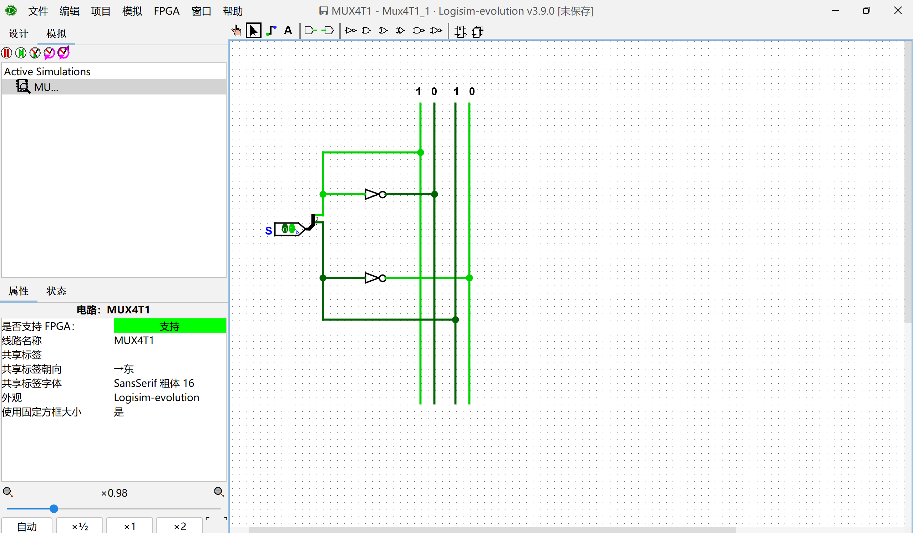
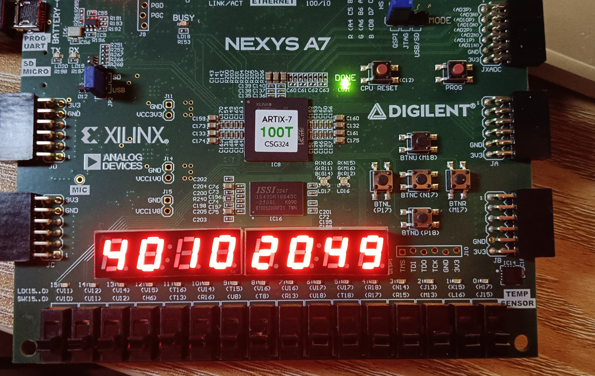

import { NTable, NCode,NCollapse,NCollapseItem,NTabs,NTabPane,NCard } from "naive-ui";
import {Timeline as ATimeline, TimelineItem as ATimelineItem} from "ant-design-vue"
import CustomContainer from "@md-components/CustomContainer.vue";

# Lab 1-1 实验报告

<CustomContainer type="question">

请在实验报告中详细描述每一步的过程并配有适当的截图和解释，对于仿真设计和上板验证的结果也应当有适当的解释和照片 Total : 23%

> 细分：
> 
> - 四路选择器原理图 3%
> - 八路选择器代码解释 5%
> - TestBench 设计 5%
> - 其余实验步骤及截图 10%

</CustomContainer>

<ATimeline>

<ATimelineItem>
设计原理图
</ATimelineItem><ATimelineItem>

</ATimelineItem><ATimelineItem>

</ATimelineItem><ATimelineItem>

</ATimelineItem><ATimelineItem>

</ATimelineItem><ATimelineItem>
四路选择器原理图 3%

</ATimelineItem><ATimelineItem>
八路选择器代码解释 5%
<CustomContainer type="attached-file" filename="">

Related File:
- `lab1-1/sim/Mux8T1_1.v`

</CustomContainer>

<NCode code={
`// 定义一个8选1的多路选择器模块
module Mux8T1_1( 
   input [7:0] I,  // 8位输入信号，I[0]到I[7]
   input [2:0] S,  // 3位选择信号，用于选择输入信号中的哪一位
   output O       // 输出信号
);

   wire [1:0] select;  // 定义一个2位的中间信号，用于存储两个4选1多路选择器的输出

   // 实例化第一个4选1多路选择器，选择I[0]到I[3]中的一个信号
   Mux4T1 MUX4T1_1 (.I0(I[0]), 
               .I1(I[1]),      
               .I2(I[2]),      
               .I3(I[3]),      
               .S(S[1:0]),     
               .O(select[0]));  // 输出连接到select[0]

   // 实例化第二个4选1多路选择器，选择I[4]到I[7]中的一个信号
   Mux4T1 MUX4T1_2 (.I0(I[4]), 
               .I1(I[5]),      
               .I2(I[6]),      
               .I3(I[7]),      
               .S(S[1:0]),     
               .O(select[1]));  // 输出连接到select[1]

   // 使用S的最高位选择select[0]或select[1]作为最终输出
   assign O = select[S[2]];

endmodule`
} language="verilog" show-line-numbers />

这段代码实现了一个8选1的多路选择器，通过两个4选1的多路选择器分两步选择输入信号。首先，分别从`I[0]`到`I[3]`和`I[4]`到`I[7]`中各选一个信号，然后根据`S[2]`的值从这两个信号中选择一个作为最终输出`O`。

</ATimelineItem><ATimelineItem>
TestBench 设计 5%
<CustomContainer type="attached-file" filename="">

Related File:
- `lab1-1/syn/testbench.v`

</CustomContainer>

<NCode code={
`...

initial begin
    // Testcase 1 For a certain input, simulate all possible values of S
    I=8'b01010101;S=3'b000;#3;
    I=8'b01010101;S=3'b001;#3;
    I=8'b01010101;S=3'b010;#3;
    I=8'b01010101;S=3'b011;#3;
    I=8'b01010101;S=3'b100;#3;
    I=8'b01010101;S=3'b101;#3;
    I=8'b01010101;S=3'b110;#3;
    I=8'b01010101;S=3'b111;#3;
    $finish;
    #1;

end

...`
} language="verilog" show-line-numbers />

</ATimelineItem><ATimelineItem>
使用Verilator + GTKWave仿真

</ATimelineItem><ATimelineItem>

上板验证（图中未包括所有情况）

</ATimelineItem><ATimelineItem>

</ATimelineItem>

</ATimeline>

<CustomContainer type="question">

在实验中我们已经拥有了 Mux4（控制的信号数）T1_1（输入的位数），实际上它是由如 3.1 图中展示的结构组成，思考如下问题：

- Mux2T1_1 是两个 AND，一个 OR 和一个 NOT 组成的简单结构，它是由哪种 decoder 和 AND-OR 结构组成的 5%
- Mux4T1_1 是如何组成的 6%
- Mux8T1_1 是如何组成的 6%
- 那么 Mux2mT1_n是如何构成的呢 10%

</CustomContainer>

- Mux2T1_1 是由一个 **1-to-2-line decoder** 和 **2 $\times$ 2 AND-OR** 结构组成的;
- Mux4T1_1 是由一个 **2-to-4-line decoder** 和 **4 $\times$ 2 AND-OR** 结构组成的;
- Mux8T1_1 是由一个 **3-to-8-line decoder** 和 **8 $\times$ 2 AND-OR** 结构组成的;
- Mux2mT1_n 是由一个 **$m$-to-$2^m$-line decoder** 和 **2^m $\times (n+1)$  AND-OR** 结构组成的;

# Lab 1-2 实验报告

<CustomContainer type="question">

请在实验报告中详细描述每一步的过程并配有适当的截图和解释，对于仿真设计和上板验证的结果也应当有适当的解释和照片 Total 30%

> 细分：
> 
> - 译码管设计 10%
> - 复合多路选择器及语法分析比较 10%
> - 综合实现数码管 10%

</CustomContainer>

<ATimeline>

<ATimelineItem>
设计七段数码管译码器10%
<CustomContainer type="attached-file" filename="">

Related File:
- `lab1-2/submit/SegDecoder.v`

</CustomContainer>
<CustomContainer type="info" title="p.s.">

写这个lab时还没有这个[Commit `19bdffd7`](https://git.zju.edu.cn/zju-sys/sys1/sys1-sp25/-/commit/19bdffd70d268a99e441b91a2103298bcd5312ad) 添加的样例，这一部分的代码还是面对`//fill your code`天马行空发挥的。

写实验报告时才发现上游repo有这些更新🤡

</CustomContainer>

<NCode code={
`assign p = ~point;

wire a_out;
assign a_out = ~((~data[3] & ~data[2] & (data[1] | ~data[0])) |
               (data[3] & data[2] & (data[1] | ~data[0])) | 
               (~data[3] & data[2] & (data[1] | data[0])) | 
               (data[3] & ~data[2] & (~data[1] | ~data[0])));
               
wire b_out;
assign b_out = (data[3] & data[2] & (data[1] | ~data[0])) |
               (~data[3] & data[2] & ((data[1] & ~data[0]) | 
               (~data[1] & data[0]))) |  (data[3] & ~data[2] &
               data[1] & data[0]) ;
               
wire c_out;
assign c_out = (~data[3] & ~data[2] & data[1] & ~data[0]) |
               (data[3] & data[2] & (data[1] | ~data[0]));
               
wire d_out;
assign d_out = (  (~data[3] & ~data[2] & ~data[1] & data[0]) |
               (~data[3] & data[2] & ((data[1] & data[0]) | 
               (~data[1] & ~data[0]))) | (data[3] & ~data[2] 
               & data[1] & ~data[0]) | (data[3] & data[2] & 
               data[1] & data[0]));
               
wire e_out;
assign e_out = (~data[3] & ~data[2] & data[0]) | (~data[3] &
               data[2] & (data[0] | ~data[1])) | (data[3] & 
               ~data[2] & ~data[1] & data[0]);
               
wire f_out;
assign f_out = (~data[3] & ~data[2] & (data[1] | data[0])) |
               (~data[3] & data[2] & data[1] & data[0]) | 
               (data[3] & data[2] & ~data[1] & data[0]);
               
wire g_out;
assign g_out = (~data[3] & ~data[2] & ~data[1]) | (~data[3] &
               data[2] & data[1] & data[0]) | (data[3] & data[2] &
               ~data[1] & ~data[0]);
               
assign a = a_out || LE;
assign b = b_out || LE;
assign c = c_out || LE;
assign d = d_out || LE;
assign e = e_out || LE;
assign f = f_out || LE;
assign g = g_out || LE;`
} language="verilog" show-line-numbers />

<CustomContainer type="tricky" title="欸，你最后上板咋有个小数点呢">
不看题还不看电路导致的🤡。一看 `input wire point,//是否显示小数点，1 显示小数点` 欸☝️🤓我们直接`assign p = point;` 完全不把提示放在眼里

> NOTE: Nexys A7 开发板的七段数码管为**共阳极**数码管，当输入信号为 0 时，对应数码管亮；输入信号为 1 时，对应数码管灭。([refer](https://zju-sys.pages.zjusct.io/sys1/sys1-sp25/lab1-2/#%E4%B8%83%E6%AE%B5%E6%95%B0%E7%A0%81%E7%AE%A1))

就是说，输入的`point`得取个反才是显示，`assign p = ~point;`
</CustomContainer>

</ATimelineItem><ATimelineItem>
仿真验证查看波形

</ATimelineItem><ATimelineItem>

复合多路选择器及语法分析比较 10%

<CustomContainer type="attached-file" filename="">

Related File:
- `lab1-2/submit/Mux4T1_32.v`

</CustomContainer>

    <NTabs type="line" animated>
      <NTabPane name="1" tab="使用 ?: 语法">
<NCode code={
`    assign O = S[1] ? (S[0] ? I3 : I2) : (S[0] ? I1 : I0);`
} language="verilog" show-line-numbers />

评价：~~最简洁~~最紧凑，可读性略低

      </NTabPane>
      <NTabPane name="5" tab="使用数组索引">
<NCode code={
`wire [31:0] I [3:0];
assign I[0] = I0;
assign I[1] = I1;
assign I[2] = I2;
assign I[3] = I3;

assign O = I[S];`
} language="verilog" show-line-numbers />

评价：将离散的线路数组整合为可以被索引的二维数组，依赖综合工具支持。

      </NTabPane>
      <NTabPane name="4" tab="使用case语句">
<NCode code={
`always @(*) begin
    case (S)
        2'b00: O = I0;
        2'b01: O = I1;
        2'b10: O = I2;
        2'b11: O = I3;
        default: O = 32'b0; // 可选默认值
    endcase
end`
} language="verilog" show-line-numbers />

评价：采用case语句，清晰易维护。

      </NTabPane>
      <NTabPane name="7" tab="使用case语句">
<NCode code={
`always @(*) begin
    if (S[1]) begin
        if (S[0]) O = I3;
            else O = I2;
        end else begin
        if (S[0]) O = I1;
            else O = I0;
        end      
    end 
end`
} language="verilog" show-line-numbers />

评价：和case语句相似，直观程度略低于采用case语句的。

      </NTabPane>
      <NTabPane name="2" tab="与或形式">
<NCode code={
`wire [3:0] sel;
assign sel[0] = ~S[1] & ~S[0]; 
assign sel[1] =  S[0] & ~S[1]; 
assign sel[2] = ~S[0] &  S[1]; 
assign sel[3] =  S[0] &  S[1]; 

assign O = ({32{sel[0]}} & I0) | 
             ({32{sel[1]}} & I1) | 
             ({32{sel[2]}} & I2) | 
             ({32{sel[3]}} & I3);`
} language="verilog" show-line-numbers />

评价：相对适合理解硬件结构。

      </NTabPane>
    </NTabs>

<NCard type="info" title="[Tabpane Expansion] For print version, here the tabpanes above are expanded for better accessibility">

  <NCollapse>
     <NCollapseItem name="1" title="使用 ?: 语法">
<NCode code={
`    assign O = S[1] ? (S[0] ? I3 : I2) : (S[0] ? I1 : I0);`
} language="verilog" show-line-numbers />

评价：~~最简洁~~最紧凑，可读性略低

      </NCollapseItem>
      <NCollapseItem name="5" title="使用数组索引">
<NCode code={
`wire [31:0] I [3:0];
assign I[0] = I0;
assign I[1] = I1;
assign I[2] = I2;
assign I[3] = I3;

assign O = I[S];`
} language="verilog" show-line-numbers />

评价：将离散的线路数组整合为可以被索引的二维数组，依赖综合工具支持。

      </NCollapseItem>
      <NCollapseItem name="4" title="使用case语句">
<NCode code={
`always @(*) begin
    case (S)
        2'b00: O = I0;
        2'b01: O = I1;
        2'b10: O = I2;
        2'b11: O = I3;
        default: O = 32'b0; // 可选默认值
    endcase
end`
} language="verilog" show-line-numbers />

评价：采用case语句，清晰易维护。

      </NCollapseItem>
           <NCollapseItem name="7" title="使用case语句">
<NCode code={
`always @(*) begin
    if (S[1]) begin
        if (S[0]) O = I3;
            else O = I2;
        end else begin
        if (S[0]) O = I1;
            else O = I0;
        end      
    end 
end`
} language="verilog" show-line-numbers />

评价：和case语句相似，直观程度略低于采用case语句的。

      </NCollapseItem>
      <NCollapseItem name="2" title="与或形式">
<NCode code={
`wire [3:0] sel;
assign sel[0] = ~S[1] & ~S[0]; 
assign sel[1] =  S[0] & ~S[1]; 
assign sel[2] = ~S[0] &  S[1]; 
assign sel[3] =  S[0] &  S[1]; 

assign O = ({32{sel[0]}} & I0) | 
             ({32{sel[1]}} & I1) | 
             ({32{sel[2]}} & I2) | 
             ({32{sel[3]}} & I3);`
} language="verilog" show-line-numbers />

评价：相对适合理解硬件结构。

      </NCollapseItem>
  </NCollapse>

</NCard>

</ATimelineItem><ATimelineItem>

综合实现数码管 10% 以及上板验证

</ATimelineItem>
</ATimeline>

<CustomContainer type="question">

阅读 `repo/sys-project/lab1-2/sim/testbench.v` 的测试样例，尝试将 `for` 语句展开为初始化序列，然后写出你对 `for` 语句的理解 10%

</CustomContainer>

<NCode code={
`initial begin
    LE = 1'b1;
    point = 1'b1;
    data = 4'h9;
    #5;
    LE = 1'b0;

    // 第一个 for 循环展开（i=0 到 i=7）
    data = 4'h0; #5;
    data = 4'h1; #5;
    data = 4'h2; #5;
    data = 4'h3; #5;
    data = 4'h4; #5;
    data = 4'h5; #5;
    data = 4'h6; #5;
    data = 4'h7; #5;

    point = 1'b0;

    // 第二个 for 循环展开（i=8 到 i=15）
    data = 4'h8; #5;  // i=8, data=8
    data = 4'h9; #5;  // i=9, data=9
    data = 4'ha; #5;  // i=10, data=a
    data = 4'hb; #5;  // i=11, data=b
    data = 4'hc; #5;  // i=12, data=c
    data = 4'hd; #5;  // i=13, data=d
    data = 4'he; #5;  // i=14, data=e
    data = 4'hf; #5;  // i=15, data=f

    $finish;
end`
} language="verilog" show-line-numbers />

对 `for` 语句的理解：

1. **顺序执行**：在仿真中，`for` 循环的每次迭代会**顺序执行**，而非并行展开。上述代码中的循环用于生成一系列连续的信号变化，每个迭代依次更新 `data` 并添加固定延时（`#5`），模拟时序逻辑的行为。
2. **硬件无关性**：`for` 循环不直接生成硬件电路，而是用于描述仿真时的重复操作。例如，上述代码通过循环依次将 `data` 从 `0` 递增到 `f`，为测试提供激励信号。

<CustomContainer type="question">

对于各种多路选择器的写法进行比较，请写出你最喜欢的多路选择器语法，并给出理由 10%

</CustomContainer>

最喜欢的多路选择器语法：`?:` 三元运算符语法 ~~（箱子爆炸.jpg）~~ 主要因为就目前的lab来说，这种语法属于既紧凑还直观的（或许做到后面的时候就会更喜欢if,else,case之类的了