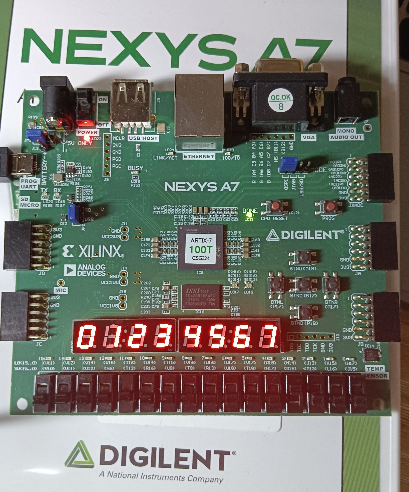
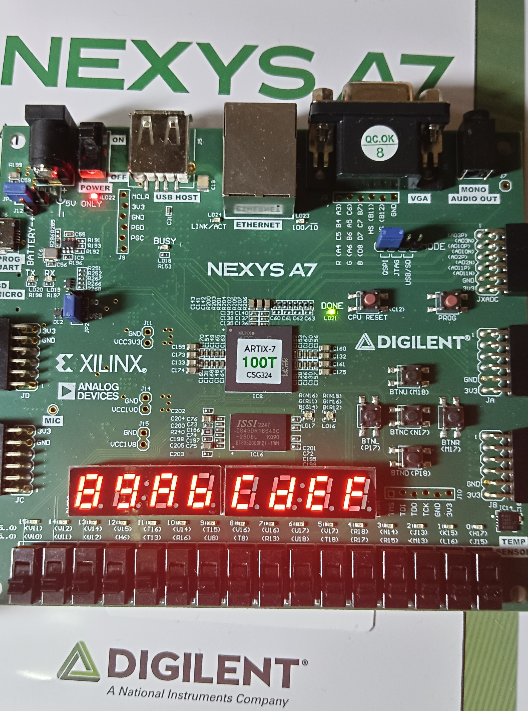
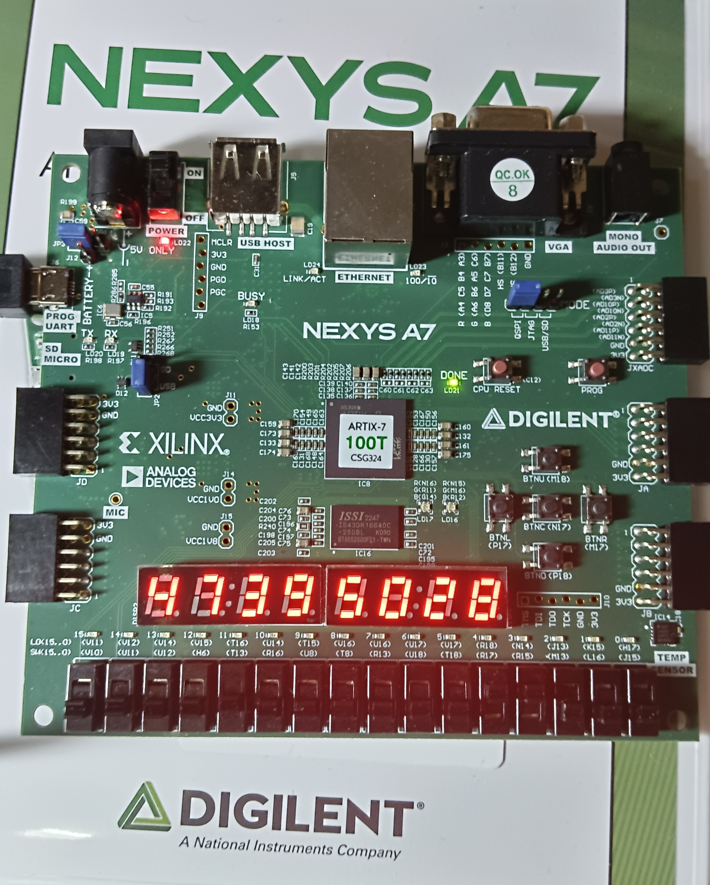
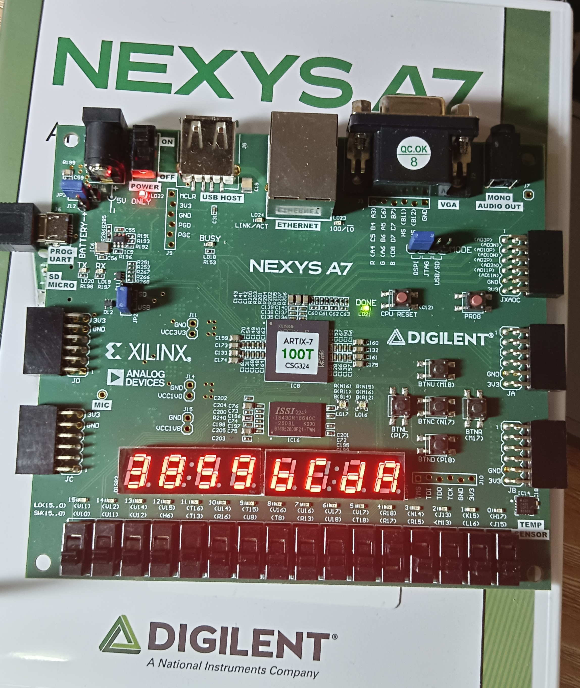
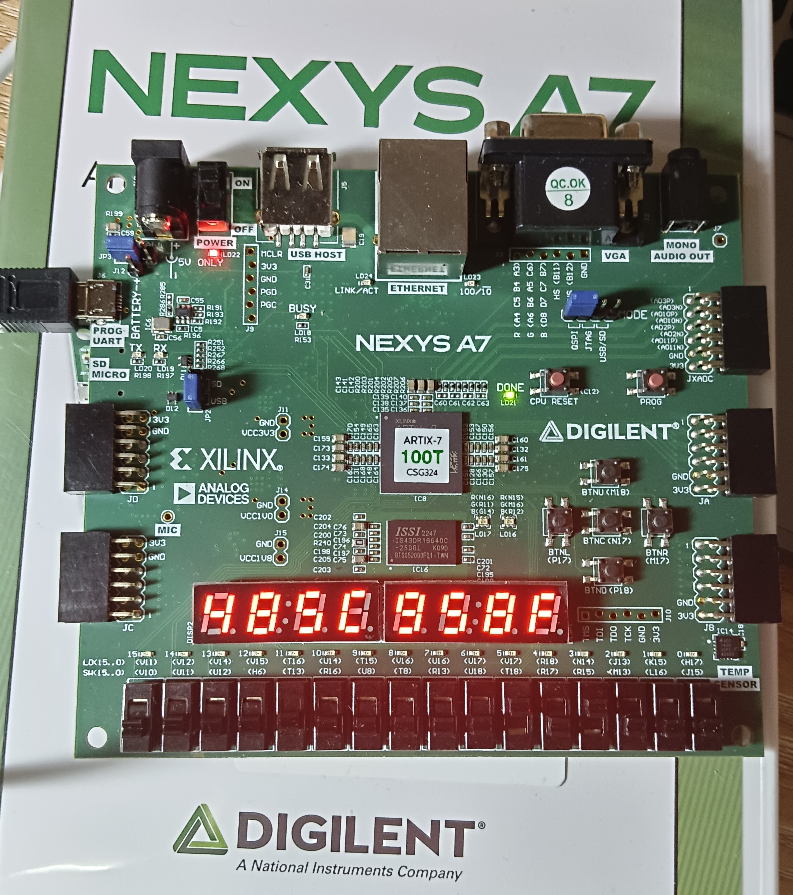
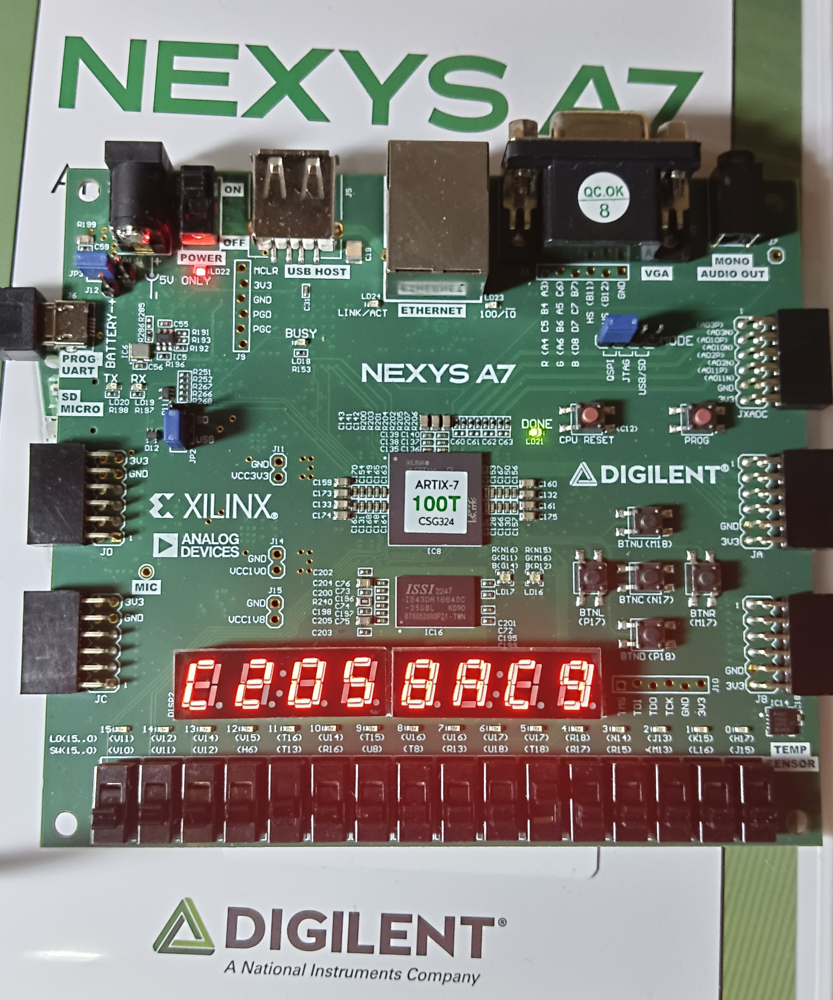
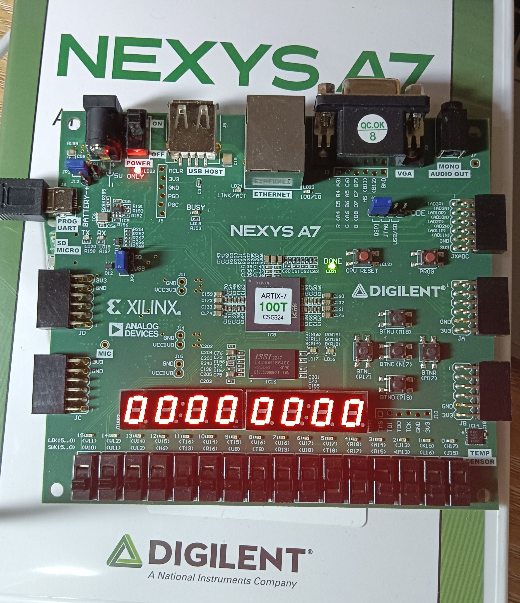

import { NTable, NCode,NCollapse,NCollapseItem,NTabs,NTabPane,NCard,NLog } from "naive-ui";
import {Timeline as ATimeline, TimelineItem as ATimelineItem} from "ant-design-vue"
import CustomContainer from "@/components/container.vue";

# Lab 2-1 实验报告

<CustomContainer type="question">

1. 请在实验报告中详细描述每一步的过程并配有适当的截图和解释，对于仿真设计和上板验证的结果也应当有适当的解释和照片。Total : 50%

    > 细分：
    > 
    > - 使用 `for` 语句进行仿真和综合 15%
    > - 使用 `$random()` 函数进行仿真样例生成 15%
    > - 综合实现全加减法器 20%

</CustomContainer>

<ATimeline>
<ATimelineItem>
设计行波进位加法器
<CustomContainer type="attached-file" filename="">

Related File:
- `lab2-1/submit/adder.v`
- `lab2-1/submit/adders.v`
- `lab2-1/submit/add_subs.v`

</CustomContainer>
`Adder`:
<NCode code={
`assign s = a ^ b ^ c_in;         
assign c_out = (a & b) | (b & c_in) | (a & c_in);`
} language="verilog" show-line-numbers />
`Adders`:
<NCode code={
`wire [LENGTH:0] carry;   // carry waving

assign carry[0] = c_in; // carry entry

genvar i;
generate
    for(i=0; i<LENGTH; i=i+1) begin
        Adder u_adder(
            .a(a[i]),          // 当前位被加数
            .b(b[i]),          // 当前位加数
            .c_in(carry[i]),   // 前级进位输入
            .s(s[i]),          // 当前位和输出
            .c_out(carry[i+1]) // 当前位进位输出
        );
    end
endgenerate

assign c_out = carry[LENGTH]; // 最高位进位输出`
} language="verilog" show-line-numbers />

`add_subs`:

<NCode code={
`wire [LENGTH-1:0] b_xor = b ^ {LENGTH{do_sub}}; 
wire [LENGTH-1:0] s_tmp;
wire c_tmp;
Adders #(
    .LENGTH(LENGTH)
) u_adders(
    .a(a),
    .b(b_xor),
    .c_in(do_sub),
    .s(s),
    .c_out(c)
);`
} language="verilog" show-line-numbers />

</ATimelineItem><ATimelineItem>
样例生成

<CustomContainer type="attached-file" filename="">

Related File:
- `lab2-1/sim/testbench.v`

</CustomContainer>

<NCode code={
`for(i=0; i<20; i=i+1) begin
    a = $random;
    b = $random;
    /* verilator lint_off WIDTHTRUNC */
    do_sub = $random % 2;  // 随机选择加减模式
    
    #20; // 等待电路稳定
    
end
$finish;`
} language="verilog" show-line-numbers />

</ATimelineItem><ATimelineItem>

仿真验证

`make`输入如下，证明了 `AddSubers` 模块的正确性。

<NLog log={`
a=2037806020, b= 186539420, do_sub=0, s=2224345440, c=0, no error
a=1220731108, b=2451014520, do_sub=0, s=3671745628, c=0, no error
a=1220731108, b=2451014520, do_sub=0, s=3671745628, c=0, no error
a=3399786166, b= 706019300, do_sub=1, s=2693766866, c=1, no error
a=3399786166, b= 706019300, do_sub=1, s=2693766866, c=1, no error
a=4240732499, b=1872631585, do_sub=1, s=2368100914, c=1, no error
a=4240732499, b=1872631585, do_sub=1, s=2368100914, c=1, no error
a=3750539205, b= 307491714, do_sub=0, s=4058030919, c=0, no error
a=3750539205, b= 307491714, do_sub=0, s=4058030919, c=0, no error
a=1935152693, b=2918959378, do_sub=0, s= 559144775, c=1, no error
a=1935152693, b=2918959378, do_sub=0, s= 559144775, c=1, no error
a=3023191037, b=3698016756, do_sub=1, s=3620141577, c=0, no error
a=3023191037, b=3698016756, do_sub=1, s=3620141577, c=0, no error
a=3329051992, b=3922658482, do_sub=0, s=2956743178, c=1, no error
a=3329051992, b=3922658482, do_sub=0, s=2956743178, c=1, no error
a=1511752990, b=2904507806, do_sub=0, s= 121293500, c=1, no error
a=1511752990, b=2904507806, do_sub=0, s= 121293500, c=1, no error
a=2066947310, b=2554030864, do_sub=0, s= 326010878, c=1, no error
a=2066947310, b=2554030864, do_sub=0, s= 326010878, c=1, no error
a=1515253091, b=1503634112, do_sub=1, s=  11618979, c=1, no error
a=1515253091, b=1503634112, do_sub=1, s=  11618979, c=1, no error
a=3239776034, b=4019425030, do_sub=1, s=3515318300, c=0, no error
a=3239776034, b=4019425030, do_sub=1, s=3515318300, c=0, no error
a=2033005155, b=3293889144, do_sub=1, s=3034083307, c=0, no error
a=2033005155, b=3293889144, do_sub=1, s=3034083307, c=0, no error
a=1666505422, b=2474901239, do_sub=1, s=3486571479, c=0, no error
a=1666505422, b=2474901239, do_sub=1, s=3486571479, c=0, no error
a=1020900254, b=2621692023, do_sub=0, s=3642592277, c=0, no error
a=1020900254, b=2621692023, do_sub=0, s=3642592277, c=0, no error
a=4054322344, b=2763580239, do_sub=1, s=1290742105, c=1, no error
a=4054322344, b=2763580239, do_sub=1, s=1290742105, c=1, no error
a= 431131028, b=3171626722, do_sub=0, s=3602757750, c=0, no error
a= 431131028, b=3171626722, do_sub=0, s=3602757750, c=0, no error
a=4026276639, b=3176444681, do_sub=1, s= 849831958, c=1, no error
a=4026276639, b=3176444681, do_sub=1, s= 849831958, c=1, no error
a=1471215135, b=2175643524, do_sub=1, s=3590538907, c=0, no error
a=1471215135, b=2175643524, do_sub=1, s=3590538907, c=0, no error
a=2032248371, b=3748850251, do_sub=0, s=1486131326, c=1, no error
a=2032248371, b=3748850251, do_sub=0, s=1486131326, c=1, no error`}></NLog>

</ATimelineItem><ATimelineItem>

上板验证

详略，下方呈现的是第一组测试数据：

`0123456789abcdef+473950283859bcda=485c958fc2058ac9, c=0`

</ATimelineItem>

</ATimeline>

<CustomContainer type="question">
对于 `repo/sys-project/lab2-1/syn/top.v` 中的 `reg [63:0] adder [0:7]`，通过仿真或者综合下板观察 adder 的每个 bit 会被初始化为何值？请尝试对对 `readmemh` 如何初始化一维向量数组的每个 bit 给出结论。15%
</CustomContainer>

首先，很显然如题所示 `reg [63:0] adder [0:7]` 是一个一维向量数组，那它也应当像数组一样被初始化：

1. 纵向
   - `initial.hex` 中的每一行对应一个 64 位宽的 `adder` 元素。
   - 文件的第一行初始化 `adder[0]`，第二行初始化 `adder[1]`，依此类推，直到第八行初始化 `adder[7]`。

2. 横向：
   - 每行的十六进制字符串按**从左到右的顺序**依次填充到 64 位的 `adder[i]` 中。
   - 每个十六进制字符转换为 4 位二进制，高位在前（例如字符 `f` 转换为 `1111`）。
   - 字符串的**第一个字符**对应 `adder[i]` 的最高 4 位（即 `adder[i][63:60]`），第二个字符对应 `adder[i][59:56]`，依此类推，最后一个字符对应 `adder[i][3:0]`。

<CustomContainer type="question">
请总结超前进位加法器和行波进位加法器的优缺点？20%
</CustomContainer>

**行波进位加法器**

**优点**：**实现简单**，由全加器级联实现，设计直观，且硬件资源占用少，适合对面积敏感的场景。

**缺点**：**延迟高，速度受限**：进位信号需从最低位逐级传递到最高位，高位运算需等待低位进位完成，不适用于高性能计算场景。

**超前进位加法器**

**优点**：**延迟低，速度快**：通过并行计算进位，加法速度显著优于行波进位加法器。

**缺点**：**结构复杂**，需额外电路计算 \(G_i\)、\(P_i\) 及多级进位逻辑，设计难度较高，需要更多逻辑门，硬件资源消耗大，且高位数的超前进位加法器实现复杂度急剧上升。

<CustomContainer type="question">
如何表示运算溢出？请给出溢出表示（用 `AddSubers` 的输入与输出以及各位进位 $c_i$ 计算）。15%

</CustomContainer>

For unsigned number

- Add 
    - The carry of 1 indicates overflow
- Subtraction 
    - The carry of 1 indicates that no correction of the result is required
    - The carry of 0 indicates that a correction of the result is required

V = `do_sub` $\oplus$ `c`

For signed number

$V = C_{n-1} \oplus C_{n}$
