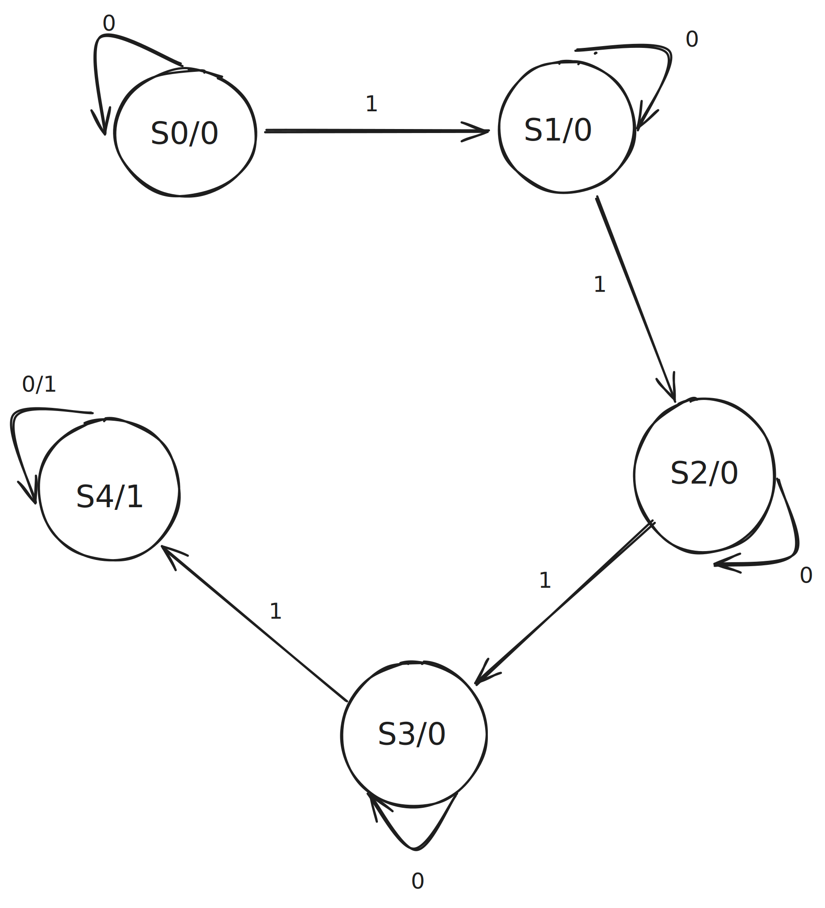
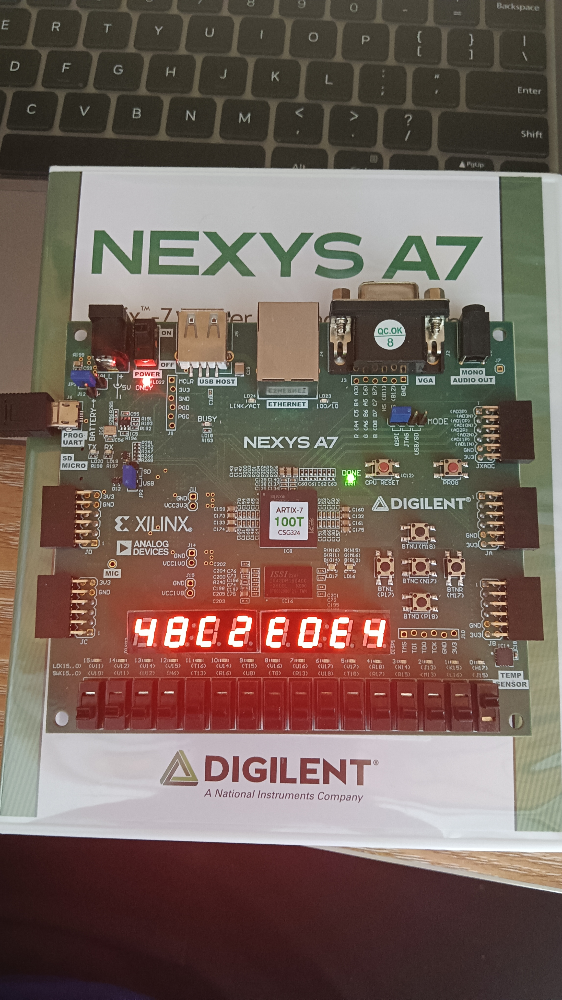
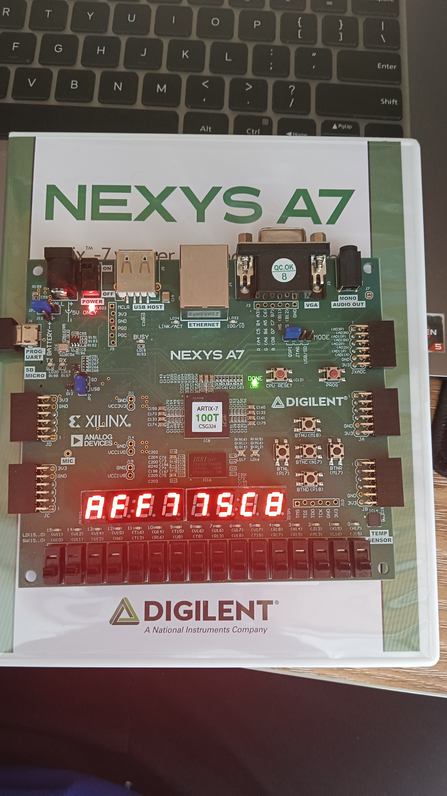
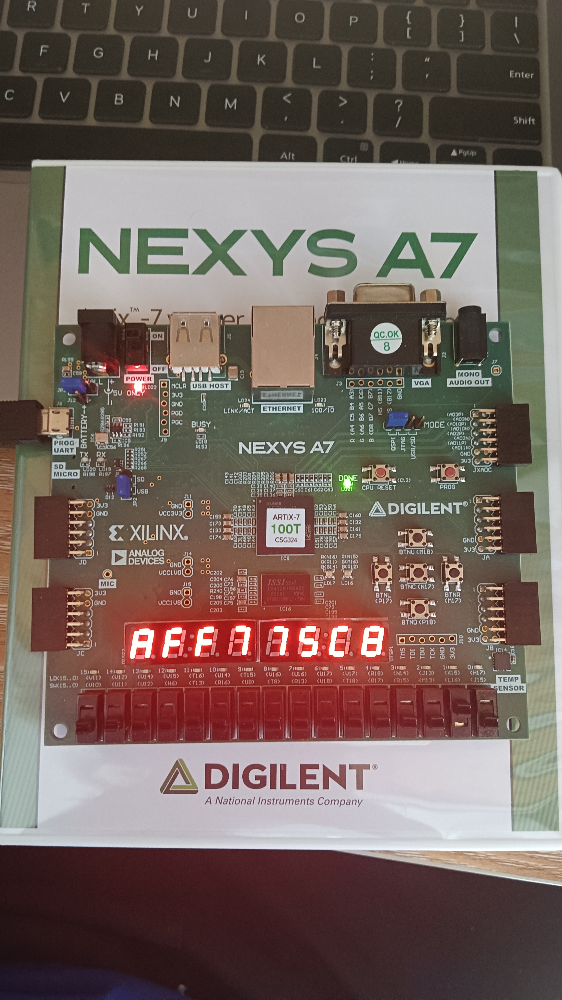
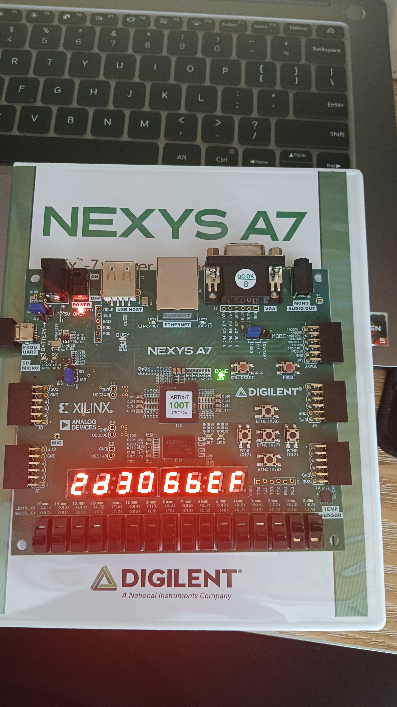
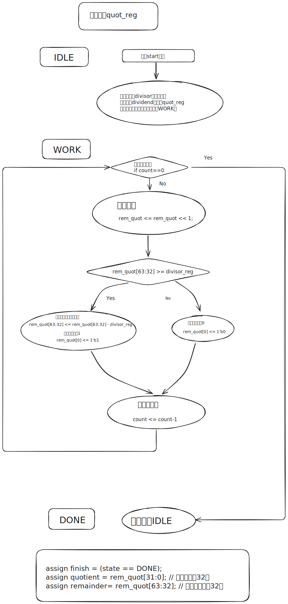

import { NTable, NCode,NCollapse,NCollapseItem,NTabs,NTabPane,NCard,NLog,NAlert } from "naive-ui";
import {Timeline as ATimeline, TimelineItem as ATimelineItem} from "ant-design-vue"
import CustomContainer from "@md-components/CustomContainer.vue";

# Lab 3-1 实验报告

<CustomContainer type="question">

1. 请在实验报告中详细描述每一步的过程并配有适当的截图和解释，对于仿真设计和上板验证的结果也应当有适当的解释和照片 Total: 15%

    > 细分：
    > 
    > - 使用 enum 语法 FSM 设计 5%
    > - 综合实现有限状态机 10%

</CustomContainer>

<ATimeline>
<ATimelineItem>
设计简单的有限状态机
<CustomContainer type="attached-file" filename="">

Related File:
- `lab3-1/submit/FSM.sv`

</CustomContainer>

<NCode code={
`module FSM(
    input rstn,
    input clk,
    input a,
    input b,
    output [1:0] state
);

    
    typedef enum logic [1:0] {
        S0,  // 初始状态：未检测到a
        S1,  // 检测到1个a
        S2,  // 检测到2个连续a
        S3   // 接受状态：检测到3个连续a
    } state_t;

    state_t current_state, next_state;

    // 状态寄存器时序逻辑
    always_ff @(posedge clk or negedge rstn) begin
        if (!rstn) begin
            current_state <= S0;  
        end else begin
            current_state <= next_state;
        end
    end

    // 状态转移组合逻辑
    always_comb begin
        // next_state = current_state;  
        
        case (current_state)
            S0: begin
                next_state = a ? S1 : (b ? S0 : S0);  // 输入a进入S1，b保持S0
            end
            S1: begin
                next_state = a ? S2 : (b ? S0 : S1);  // 输入a进入S2，b返回S0
            end
            S2: begin
                next_state = a ? S3 : (b ? S0 : S2);  // 输入a进入S3，b返回S0
            end
            S3: begin
                next_state = S3; 
            end
            default: next_state = S0;
        endcase
    end

    // 状态输出连接
    assign state = current_state;

endmodule`
} language="verilog" show-line-numbers />

</ATimelineItem><ATimelineItem>
仿真

执行 `make verilate` 进行仿真测试.

<NLog log={

`➜  lab3-1 ./build/verilate/Testbench
success!!!
- ../../sys-project-other/lab3-1/sim/testbench.v:49: Verilog $finish
- S i m u l a t i o n   R e p o r t: Verilator 5.033 devel
- Verilator: $finish at 210ns; walltime 0.003 s; speed 104.603 us/s
- Verilator: cpu 0.002 s on 1 threads; alloced 89 MB`
}></NLog>

注意到输出 `success!!!`，说明仿真成功。

</ATimelineItem><ATimelineItem>

综合下板

运行 `make bitstream` 生成比特流，然后下板验证。

<video src="./1-show.mp4" style="width:570px" controls></video>

</ATimelineItem>
</ATimeline>

<CustomContainer type="question">

2. 思考比较 `enum + case` 的编程范式和数组查表的编程范式之间的优劣 5%

</CustomContainer>

`enum + case` 的编程范式的优点是可读性强，易于理解和维护。每个状态都有明确的名称，便于后续修改和扩展。特别的，对于复杂的状态机（说的就是你乘法器交互协议），各个状态下有复杂的、难以被写成状态表的转移关系，就只能用`enum + case` 的编程范式。

而数组查表的编程范式则在某些情况下可能更高效，尤其是在状态数较多时，可以减少代码量和复杂度，但可读性较差，难以理解和维护。

<CustomContainer type="question">

3. 绘制一个有限状态机的状态图和状态转移表，如果输入的 01 字符串中 1 的个数大于 3 个，则 FSM 输出 1 表示接受，反之输出 0 表示拒绝。10%

    > 符号表示: 输入信号 X，输出信号 Y，内部状态为 S0、S1...

</CustomContainer>

状态图:

Draw with [Excalidraw](https://excalidraw.com/#json=15i_eailicOGUVQnzEXtd,A78XD6xypexVaFIP-_Nvmg)

状态转移表:

<NTable>
{/* | Current State | X | Next State | Y |
|---------------|-------|------------|--------|
| S0            | 0     | S0         | 0      |
| S0            | 1     | S1         | 0      | 
| S1            | 0     | S1         | 0      |
| S1            | 1     | S2         | 0      |
| S2            | 0     | S2         | 0      |
| S2            | 1     | S3         | 0      |
| S3            | 0     | S3         | 0      |
| S3            | 1     | S4         | 1      |
| S4            | 0     | S4         | 1      |
| S4            | 1     | S4         | 1      | */}
<thead><tr><th>Current State</th><th>X</th><th>Next State</th><th>Y</th></tr></thead><tbody><tr><td>S0</td><td>0</td><td>S0</td><td>0</td></tr><tr><td>S0</td><td>1</td><td>S1</td><td>0</td></tr><tr><td>S1</td><td>0</td><td>S1</td><td>0</td></tr><tr><td>S1</td><td>1</td><td>S2</td><td>0</td></tr><tr><td>S2</td><td>0</td><td>S2</td><td>0</td></tr><tr><td>S2</td><td>1</td><td>S3</td><td>0</td></tr><tr><td>S3</td><td>0</td><td>S3</td><td>0</td></tr><tr><td>S3</td><td>1</td><td>S4</td><td>1</td></tr><tr><td>S4</td><td>0</td><td>S4</td><td>1</td></tr><tr><td>S4</td><td>1</td><td>S4</td><td>1</td></tr></tbody>
</NTable>

<CustomContainer type="question">
4. 观察以下有限状态机电路实现存在的不足和不足的原因，如果电路不稳定可能会发生什么问题（bonus，分数不溢出 report）：+10%

<NCode code={
`always@(posedge clk)begin
    if(~rstn) state <= 2'b01;
    else state[1:0] <= state[0:1];
end`
} language="verilog" show-line-numbers />

</CustomContainer>

状态机只用了`01`和`10`两个状态，若因干扰或时序问题导致状态机进入无效状态，将无法自动恢复（`state[1:0] <= state[0:1]`，假如电路不稳定给我`state`搞成了`00`，那我不炸了）。

<NCode code={
`...
else case (state)
    2'b01: state <= 2'b10;
    2'b10: state <= 2'b01;
    default: state <= 2'b01; 
endcase
...`
} language="verilog" show-line-numbers />
>

# Lab 3-2 实验报告

<CustomContainer type="question">

1. 请在实验报告中详细描述每一步的过程并配有适当的截图和解释，对于仿真设计和上板验证的结果也应当有适当的解释和照片 Total: 20%

> 细分：
> 
> - 仿真通过，输出`success!!!` 10%
> - 综合实现计数器 10%

</CustomContainer>

<ATimeline>
<ATimelineItem>
实现计数器模块

<CustomContainer type="attached-file" filename="">

Related File:
- `lab3-2/submit/Cnt.sv`

</CustomContainer>

实现了模数计数器。

<NCode code={
`module Cnt #(
    parameter BASE = 10,
    parameter INITIAL = 0
) (
    input en,
    input clk,
    input rstn,
    input low_co,
    input high_rst,
    output co,
    output reg [3:0] cnt
);

assign co = en && (cnt == (BASE-1)); 

always @(posedge clk or negedge rstn) begin
    if (!rstn) begin        
        cnt <= INITIAL[3:0];     
    end else if (high_rst) begin 
        cnt <= 0;          
    end else if (en && low_co) begin 
        if (cnt == (BASE-1)) begin
            cnt <= 0;      
        end else begin
            cnt <= cnt + 1;
        end
    end
end
endmodule`
} language="verilog" show-line-numbers />

</ATimelineItem><ATimelineItem>
实现 24 BCD 码计数器

<CustomContainer type="attached-file" filename="">

Related File:
- `lab3-2/submit/Cnt2num.sv`

</CustomContainer>

实现了模数计数器。

<NCode code={
`module Cnt2num #(
    parameter BASE = 24,
    parameter INITIAL = 16
)(
    input en,
    input clk,
    input rstn,
    input high_rst,
    input low_co,
    output co,
    output [7:0] cnt
);

    localparam HIGH_BASE = 10;
    localparam LOW_BASE  = 10;
    localparam HIGH_INIT = INITIAL/10;
    localparam LOW_INIT  = INITIAL%10;
    localparam HIGH_CO   = (BASE-1)/10;
    localparam LOW_CO    = (BASE-1)%10;

    wire [3:0] cnt_high, cnt_low;
    wire total_high_rst;
    wire low_co_to_high;

    Cnt #(
        .BASE(LOW_BASE),
        .INITIAL(LOW_INIT)
    ) u_low (
        .en(en),
        .clk(clk),
        .rstn(rstn),
        .low_co(low_co),
        .high_rst(total_high_rst),
        .co(low_co_to_high),
        .cnt(cnt_low)
    );

    

    Cnt #(
        .BASE(HIGH_BASE),
        .INITIAL(HIGH_INIT)
    ) u_high (
        .en(en),
        .clk(clk),
        .rstn(rstn),
        .low_co(low_co_to_high),
        .high_rst(total_high_rst),
        .co(),  
        .cnt(cnt_high)
    );

    assign cnt = {cnt_high,cnt_low};
    
    assign co = en  && low_co && (cnt_high == HIGH_CO[3:0]) && (cnt_low == LOW_CO[3:0]); ;
    assign total_high_rst = high_rst || co;
endmodule`
} language="verilog" show-line-numbers />

</ATimelineItem><ATimelineItem>
仿真

执行 `make verilate` 进行仿真测试.

<NLog log={

`➜  lab3-2 ./build/verilate/Testbench
init cnt_state = 16
simulation cnt_state = 16, co_state = 0
simulation cnt_state = 17, co_state = 0
simulation cnt_state = 18, co_state = 0
simulation cnt_state = 19, co_state = 0
simulation cnt_state = 20, co_state = 0
simulation cnt_state = 21, co_state = 0
simulation cnt_state = 22, co_state = 0
simulation cnt_state = 23, co_state = 1
simulation cnt_state = 0, co_state = 0
simulation cnt_state = 1, co_state = 0
simulation cnt_state = 2, co_state = 0
simulation cnt_state = 3, co_state = 0
simulation cnt_state = 4, co_state = 0
simulation cnt_state = 5, co_state = 0
simulation cnt_state = 6, co_state = 0
simulation cnt_state = 7, co_state = 0
simulation cnt_state = 8, co_state = 0
simulation cnt_state = 9, co_state = 0
simulation cnt_state = 10, co_state = 0
simulation cnt_state = 11, co_state = 0
simulation cnt_state = 12, co_state = 0
simulation cnt_state = 13, co_state = 0
simulation cnt_state = 14, co_state = 0
simulation cnt_state = 15, co_state = 0
simulation cnt_state = 16, co_state = 0
simulation cnt_state = 17, co_state = 0
simulation cnt_state = 18, co_state = 0
simulation cnt_state = 19, co_state = 0
simulation cnt_state = 20, co_state = 0
simulation cnt_state = 21, co_state = 0
simulation cnt_state = 22, co_state = 0
simulation cnt_state = 23, co_state = 1
simulation cnt_state = 0, co_state = 0
simulation cnt_state = 1, co_state = 0
simulation cnt_state = 2, co_state = 0
simulation cnt_state = 3, co_state = 0
simulation cnt_state = 4, co_state = 0
simulation cnt_state = 5, co_state = 0
simulation cnt_state = 6, co_state = 0
simulation cnt_state = 7, co_state = 0
success!!!
- ../../sys-project-other/lab3-2/sim/testbench.v:22: Verilog $finish
- S i m u l a t i o n   R e p o r t: Verilator 5.033 devel
- Verilator: $finish at 425ns; walltime 0.003 s; speed 196.759 us/s
- Verilator: cpu 0.002 s on 1 threads; alloced 89 MB`
} rows={49}></NLog>

注意到输出 `success!!!`，说明仿真成功。

</ATimelineItem><ATimelineItem>

综合下板

运行 `make bitstream` 生成比特流，然后下板验证。

<video src="./2-show.mp4" style="width:570px" controls></video>

</ATimelineItem>
</ATimeline>

<CustomContainer type="question">

2. 简述如何使用 Cnt2num 实现 1234 的 BCD 码计数器，并思考 Cnt2num 预留 co、low_co、high_rst 引脚的意义 10%

</CustomContainer>

**像级联两个Cnt一样级联两个Cnt2num**

一个Cnt2num管高位2个数字，另一个Cnt2num管低位2个数字，低位的co连到高位的low_co，然后如果两个Cnt2num拼起来为1234就rst。

从这个角度就可以发现Cnt2num 预留 co、low_co、high_rst 引脚的意义所在了：**方便进行级联拓展**。

引脚意义:

1. `co`（进位信号）  
   - 当计数器达到 `BASE-1` 时，`co=1`，通知高位计数器。
2. `low_co`（低位进位输入）  
   - 接收低位计数器的进位信号。例如，个位 `co` 连接十位的 `low_co`，使十位在个位满 9 时递增。
3. `high_rst`（高位复位）  
   - 接收全局复位信号。当计数器达到预设值（如 1234）时，`high_rst=1`，强制所有计数器复位，实现循环计数。

# Lab 3-3 实验报告

<CustomContainer type="question">

1. 请在实验报告中详细描述每一步的过程并配有适当的截图和解释，对于仿真设计和上板验证的结果也应当有适当的解释和照片 Total: 20%

> 细分：
> 
> - 仿真通过，输出`success!!!` 10%
> - 综合实现计数器 10%

</CustomContainer>

<ATimeline>
<ATimelineItem>
设计参数配置的无符号乘法器
<CustomContainer type="attached-file" filename="">

Related File:
- `lab3-3/submit/Multiplier.sv`

</CustomContainer>

<NCode code={
`module Multiplier #(
    parameter LEN = 32
) (
    input clk,
    input rst,
    input [LEN-1:0] multiplicand,
    input [LEN-1:0] multiplier,
    input start,
    
    output [LEN*2-1:0] product,
    output finish
);

    localparam PRODUCT_LEN = LEN*2;
    logic [LEN-1:0] multiplicand_reg;
    logic [PRODUCT_LEN-1:0] product_reg;

    localparam CNT_LEN = $clog2(LEN);
    localparam CNT_NUM = LEN - 1;
    typedef enum logic [1:0] {IDLE, WORK, FINAL} fsm_state;
    fsm_state fsm_state_reg;
    logic [CNT_LEN-1:0] work_cnt;

    assign product = product_reg;
    assign finish = (fsm_state_reg == FINAL);

    always_ff @(posedge clk) begin
        if (rst) begin
            fsm_state_reg <= IDLE;
            product_reg <= '0;
            multiplicand_reg <= '0;
            // multiplier_reg <= '0;
            work_cnt <= '0;
        end else begin
            case (fsm_state_reg)
                IDLE: begin
                    if (start) begin
                        multiplicand_reg <= multiplicand;
                        product_reg <= {{LEN{1'b0}}, multiplier}; 
                        // multiplier_reg <= multiplier;             
                        work_cnt <= CNT_NUM[CNT_LEN-1:0];                   
                        fsm_state_reg <= WORK;
                    end
                end
                
                WORK: begin
                    
                    
                    product_reg <= {({1'b0,product_reg[PRODUCT_LEN-1:LEN]})
                        +((product_reg[0] == 1'b1) ? {1'b0,multiplicand_reg} : 
                        'b0), product_reg[LEN-1:1] };
                    
                    \`ifdef VERILATE
                    $display("@work_cnt=%d product_reg=%b (%h)",work_cnt,
                        product_reg,product_reg);
                    \`endif

                    if (work_cnt == '0) begin
                        fsm_state_reg <= FINAL;
                    end else begin
                        work_cnt <= work_cnt - 1;
                    end
                end
                
                FINAL: begin
                        fsm_state_reg <= IDLE;
                end

                default: begin
                    fsm_state_reg <= IDLE;
                end
            endcase
        end
    end

    
endmodule`
} language="verilog" show-line-numbers />

</ATimelineItem><ATimelineItem>

仿真样例生成

<CustomContainer type="attached-file" filename="">

Related File:
- `lab3-3/sim/testbench.v`

</CustomContainer>
<NCode code={
`initial begin
    clk=0;
    rst=1;
    #20;
    rst=0;
    // Random testcases
    for(i=0;i<20;i=i+1)begin
        multiplicand=$random;
        multiplier=$random;
        start = 1;
        @(negedge clk);
        start = 0;
        while(!finish) @(negedge clk);
        @(negedge clk);
    end
    $display("success!!!");
    $finish;
end`
} language="verilog" show-line-numbers />
</ATimelineItem><ATimelineItem>

DPI-C 实践
<CustomContainer type="attached-file" filename="">

Related File:
- `lab3-3/sim/judge.v`
- `lab3-3/sim/judge.cpp`

</CustomContainer>
`judge.v`:

<NCode code={
`import "DPI-C" function int mul_judge (
    input  int  unsigned multiplicand, 
    input  int  unsigned multiplier,
    input  longint unsigned product
);`
} language="verilog" show-line-numbers />
</ATimelineItem><ATimelineItem>

`judge.cpp`:

<NCode code={
`#include <svdpi.h>
#include <stdio.h>

extern "C" unsigned int mul_judge (
    unsigned int multiplicand, 
    unsigned int multiplier,
    unsigned long long int product
){

    unsigned long long int simulate_result = 
        (unsigned long long int)multiplicand * 
        (unsigned long long int)multiplier;
    bool right = simulate_result == product;

    if(!right){
        printf("*********error***********\\n");
        printf("simulation multiplicand = %08x, multiplier = %08x, product = %016llx\\n( %b )\\n",
            multiplicand, multiplier, simulate_result,simulate_result);
        printf("hardware   multiplicand = %08x, multiplier = %08x, product = %016llx\\n",
            multiplicand, multiplier, product);
    }else{
        printf("simulation multiplicand = %08x, multiplier = %08x, product = %016llx\\n"
                 /*OFFSET FOR FORMAT STR*/"    "             "    " 
               "                              The hardware offered product = %016llx\\n",
                    multiplicand, multiplier, simulate_result,product);
    }

    return right;
}
`
} language="cpp" show-line-numbers />

执行 `make verilate` 进行仿真测试.

<NLog log={

`➜  lab3-3 ./build/verilate/Testbench
simulation multiplicand = 797673c4, multiplier = 0b1e5d9c, product = 05467f450934bf70
                                        The hardware offered product = 05467f450934bf70
simulation multiplicand = 9efdd502, multiplier = 48c2e0e4, product = 2d306befaff775c8
                                        The hardware offered product = 2d306befaff775c8
simulation multiplicand = 92178378, multiplier = bbd58ebc, product = 6b310c0d5f091c20
                                        The hardware offered product = 6b310c0d5f091c20
simulation multiplicand = caa49eb6, multiplier = 2a14ffe4, product = 214fa174b6eca418
                                        The hardware offered product = 214fa174b6eca418
simulation multiplicand = 7d6ff3b7, multiplier = fcc47153, product = 7bda7525d1fbcb55
                                        The hardware offered product = 7bda7525d1fbcb55
simulation multiplicand = 6f9e1721, multiplier = 8a9a7de1, product = 3c6e9473ff177101
                                        The hardware offered product = 3c6e9473ff177101
simulation multiplicand = df8cafc5, multiplier = 1253f382, product = 1001339ce728410a
                                        The hardware offered product = 1001339ce728410a
simulation multiplicand = a451ff62, multiplier = 73581635, product = 4a096029e09c4b4a
                                        The hardware offered product = 4a096029e09c4b4a
simulation multiplicand = adfbc912, multiplier = 62f9ab56, product = 434411511866920c
                                        The hardware offered product = 434411511866920c
simulation multiplicand = b4323bfd, multiplier = dc6b41f4, product = 9b26aaf8ffdb6a24
                                        The hardware offered product = 9b26aaf8ffdb6a24
simulation multiplicand = 06adf53b, multiplier = c66d4d58, product = 052d65c1aaae0b48
                                        The hardware offered product = 052d65c1aaae0b48
simulation multiplicand = e9cf04b2, multiplier = 56d1085c, product = 4f4a75391fdd3ff8
                                        The hardware offered product = 4f4a75391fdd3ff8
simulation multiplicand = 5a1b851e, multiplier = ad1f459e, product = 3cef9acb6c7f3e84
                                        The hardware offered product = 3cef9acb6c7f3e84
simulation multiplicand = 3df8999e, multiplier = 7b331cee, product = 1dd2d156526618e4
                                        The hardware offered product = 1dd2d156526618e4
simulation multiplicand = 983b6b10, multiplier = 40fb7f76, product = 26a468d19e304960
                                        The hardware offered product = 26a468d19e304960
simulation multiplicand = 5a50ed63, multiplier = 599fa2c0, product = 1f9e7435ce67b040
                                        The hardware offered product = 1f9e7435ce67b040
simulation multiplicand = 01c8bb1d, multiplier = c11b0f22, product = 0158855798ae8cda
                                        The hardware offered product = 0158855798ae8cda
simulation multiplicand = ef938f06, multiplier = 85ee5b81, product = 7d56ba1f42c63406
                                        The hardware offered product = 7d56ba1f42c63406
simulation multiplicand = 792d3263, multiplier = c454c278, product = 5ceeb97561daa468
                                        The hardware offered product = 5ceeb97561daa468
simulation multiplicand = 6062be6f, multiplier = 6354dace, product = 2566226d0f0bc352
                                        The hardware offered product = 2566226d0f0bc352
success!!!
- /mnt/e/Projects/sys1-sp25-master/src/lab3-3/sim/testbench.v:39: Verilog $finish
- S i m u l a t i o n   R e p o r t: Verilator 5.033 devel
- Verilator: $finish at 7us; walltime 0.006 s; speed 1.696 ms/s
- Verilator: cpu 0.004 s on 1 threads; alloced 89 MB`
} rows={50}></NLog>

注意到输出 `success!!!`，说明仿真成功。

</ATimelineItem><ATimelineItem>

综合下板

运行 `make bitstream` 生成比特流，然后下板验证。

下图展示了其中一组测试数据。

</ATimelineItem>
</ATimeline>

<CustomContainer type="question">

2. 解释仿真测试样例和下板的顶层结构为什么满足 start-finish 握手协议。尝试给出 start-finish 握手协议存在的缺点和改进的方法。 10%

</CustomContainer>

仿真测试样例和下板的顶层结构满足start-finish握手协议的原因如下：

仿真测试样例中：

- 乘法器模块的start信号由testbench控制，乘法器在完成运算后通过finish信号反馈给testbench，testbench在收到finish信号后才会生成新的start信号。
- testbench在每次start信号有效时，保持被乘数和乘数数据稳定，直到乘法器完成运算并输出finish信号。
- 乘法器模块在IDLE状态时响应start信号，进入WORK状态后自动屏蔽新的start请求，直到运算完成并进入FINAL状态释放finish信号。

下板的顶层结构中：

- DataGenerator模块会且仅会在按钮单击触发next_test信号后产生start信号，标志运算开始。
- 乘法器模块在完成运算后通过finish信号反馈给top，在接收到finish信号后，才有`product_reg <= product;`接受结果的操作。
- DataGenerator模块在每次start信号有效时，保持被乘数和乘数数据稳定，直到乘法器完成运算并输出finish信号。

start-finish握手协议的缺点及改进方法：

缺点：

1. 吞吐量瓶颈：callee必须等待前次操作完成才能发起新请求，无法实现流水线并行。例如64位乘法需要64个周期完成，期间无法启动新运算。
2. 资源利用率低：caller在等待finish时处于空闲状态，无法执行其他任务。
3. 缺乏错误恢复机制：若callee发生异常无法返回finish，系统将永久死锁。

改进方法：
1. 引入双向握手通道：
   - 采用AXI协议的valid-ready机制：caller通过valid信号发起请求，callee通过ready信号指示接收能力。增加data_ready信号使乘法器可提前接收下个操作数。

        <NCode code={
        `input data_ready,  // callee指示可接收新数据
        output data_valid  // caller指示数据有效`
        } language="verilog" show-line-numbers />
2. 添加超时监测：
   - 在caller侧设置超时计数器，超时后复位callee并重发请求。

        <NCode code={`always_ff @(posedge clk) begin
             if (start) timeout_cnt <= 0;
             else if (!finish) timeout_cnt <= timeout_cnt + 1;
             if (timeout_cnt > MAX_DELAY) begin
                 reset_callee <= 1'b1;
                 retry_flag <= 1'b1;
             end
        end`} language="verilog" show-line-numbers />

<CustomContainer type="question">

3. 请仿照乘法器的设计方法和我们**手动计算除法**的方式，设计**32bit无符号整数除法器**，你只需要给出设计思路即可。流程图和伪代码是推荐的描述形式。 10%

作为参考的接口定义如下：

<NCode code={
`module Divider_32(
        input    clk,
        input    rst,

        input    start,
        input    [31:0] dividend, 
        input    [31:0] divisor,

        output    finish,
        output    [31:0] quotient,
        output    [31:0] remainder
        ); 

endmodule`
} language="verilog" show-line-numbers />

</CustomContainer>

流程：

Draw with [Excalidraw](https://excalidraw.com/#json=_3nSYYZiZdyx6QkaXYzqF,JqD3fQ_oRZZHPnSPc-pNag)

<CustomContainer type="question">

4. (bonus) 尝试改进目前的有限状态机，使得一次乘法操作或者连续乘法操作消耗的时钟周期数可以减少。 
+15%

</CustomContainer>

1. 连续乘法操作可以尝试流水线设计：比如当第一个乘法进入WORK状态后，下一个乘法可以开始初始化。这可能需要多个独立的寄存器组来保存不同的运算中间结果。

2. 一次乘法操作可以同时处理多个位。

3. 如果在一次移位操作后发现乘数剩余的位为全0，可以提前结束乘法操作。