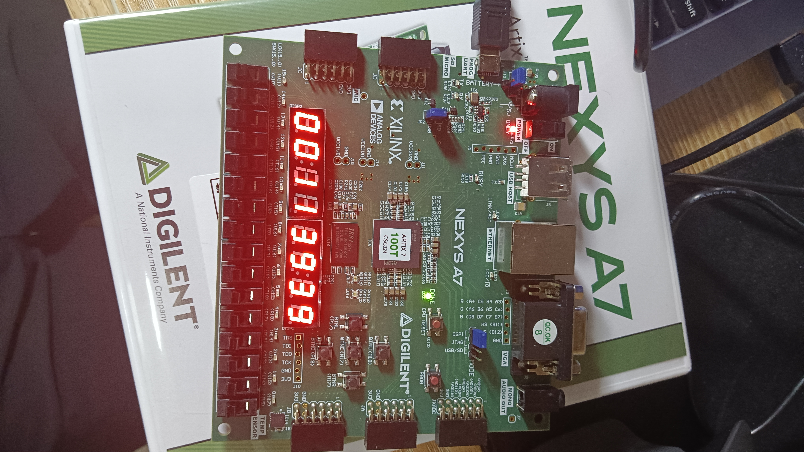
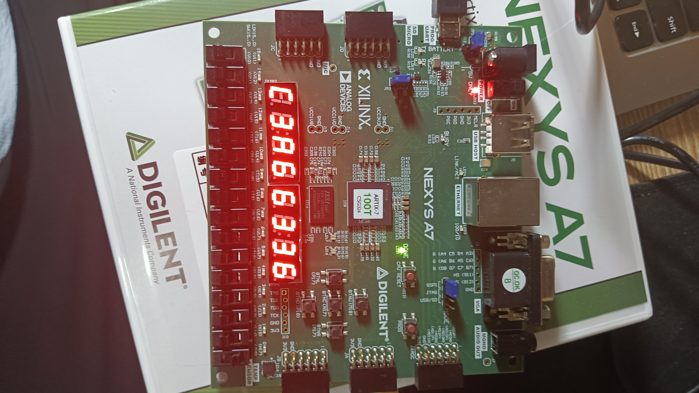
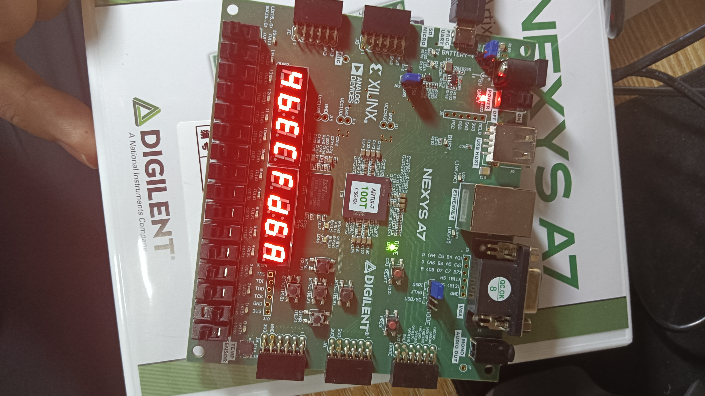
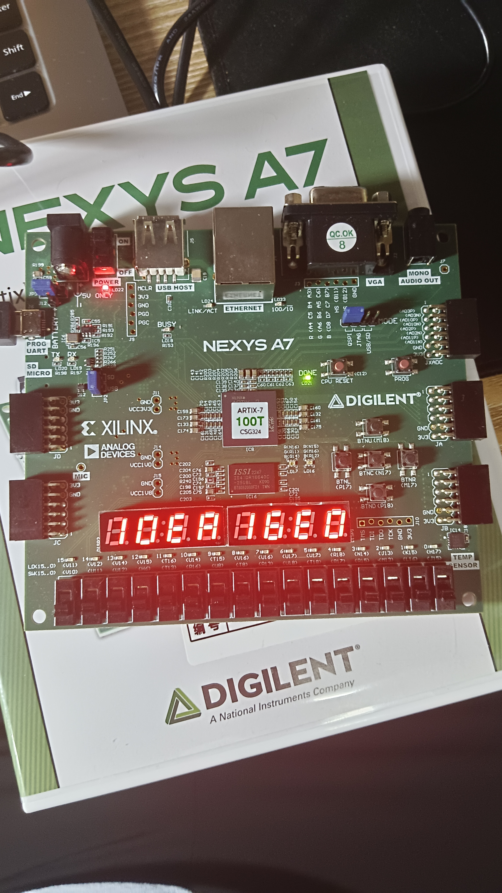
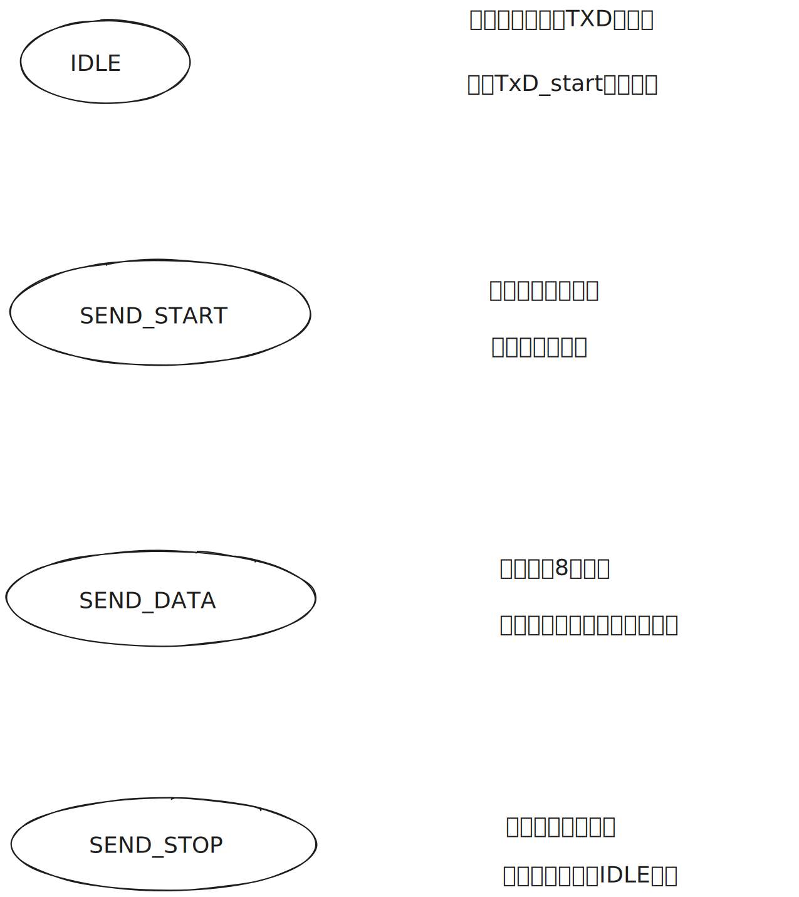
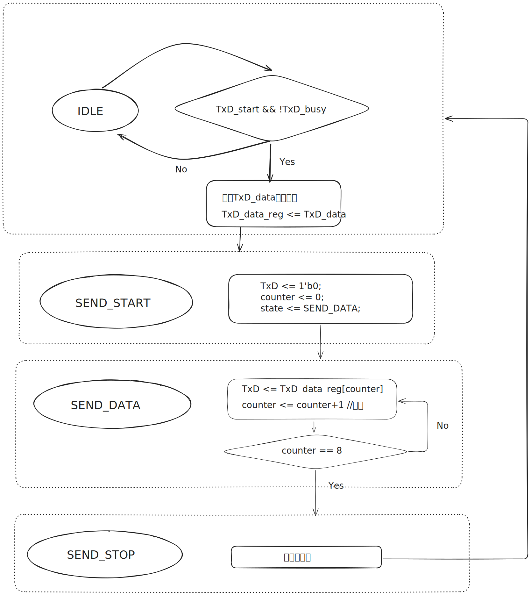

import { NTable, NCode,NCollapse,NCollapseItem,NTabs,NTabPane,NCard,NLog,NAlert } from "naive-ui";
import {Timeline as ATimeline, TimelineItem as ATimelineItem} from "ant-design-vue"
import CustomContainer from "@/components/container.vue";

# Lab 4-1 实验报告

<CustomContainer type="question">

1. 请在实验报告中详细描述每一步的过程并配有适当的截图和解释，对于仿真设计和上板验证的结果也应当有适当的解释和照片。80%

    > 细分：
    > 
    > - 仿真通过，输出 `success!!!` 40%
    > - 综合实现卷积单元 40%

</CustomContainer>

<ATimeline>
<ATimelineItem>
实现卷积单元、移位器模块、卷积运算模块
<CustomContainer type="attached-file" filename="">

Related File:
- `lab4-1/submit/Shift.sv`
- `lab4-1/submit/ConvUnit.sv`
- `lab4-1/submit/ConvOperator.sv`

</CustomContainer>

移位器：

<NCode code={
`module Shift (
    input clk,
    input rst,
    input Conv::data_t in_data,
    input in_valid,
    output reg in_ready,

    output Conv::data_vector data,
    output reg out_valid,
    input out_ready
);
    typedef enum logic {RDATA, TDATA} fsm_state;
    fsm_state state_reg;
    Conv::data_t data_reg [Conv::LEN-1:0];

    always_ff @(posedge clk or posedge rst) begin
        if (rst) begin
            state_reg <= RDATA;
            data_reg <= '{default:0};
            in_ready <= 1'b0;
            out_valid <= 1'b0;
        end else begin
            case(state_reg)
                RDATA: begin
                    // $display("Shift RDATA, in_valid=%b, in_ready=%b,data_reg=%p", in_valid, in_ready,data_reg);
                    if (in_valid && in_ready) begin
                        // 移位寄存器更新
                        for(int i=Conv::LEN-2; i>=0; i--) 
                            data_reg[i] <= data_reg[i+1];
                        data_reg[Conv::LEN-1] <= in_data;
                        
                        state_reg <= TDATA;
                        out_valid <= 1'b1;
                        in_ready <= 1'b0;
                    end else begin
                        in_ready <= 1'b1;
                    end
                end
                
                TDATA: begin
                    if (out_valid && out_ready) begin
                        out_valid <= 1'b0;
                        state_reg <= RDATA;
                        in_ready <= 1'b1;
                    end
                end
            endcase
        end
    end

    // 输出当前寄存器组数据
    assign data.data = data_reg;
endmodule`
} language="verilog" show-line-numbers />

卷积运算模块：

<NCode code={
`module ConvOperator(
    input clk,
    input rst,
    input Conv::data_vector kernel,
    input Conv::data_vector data,
    input in_valid,
    output reg in_ready,

    output Conv::result_t result,
    output reg out_valid,
    input out_ready
);
    // 中间寄存器定义
    typedef struct {
        Conv::result_t data;
        logic valid;
    } mid_vector;
    
    logic [Conv::WIDTH*2-1:0] vector_stage1 [Conv::LEN-1:0];
    mid_vector vector_stage2;
    
    // 状态机定义
    typedef enum logic [1:0] {RDATA, MULTIPLYING, ADDING, TDATA} fsm_state;
    fsm_state state_reg;
    
    // 乘法器
    logic [Conv::LEN-1:0] mul_valid ;
    Conv::result_t mul_result [Conv::LEN-1:0];
    generate
        for(genvar i=0; i<Conv::LEN; i++) begin : mul_gen
            Multiplier #(.LEN(Conv::WIDTH)) mul (
                .clk(clk),
                .rst(rst),
                .multiplicand(data.data[i]),
                .multiplier(kernel.data[Conv::LEN-1-i]),
                .start(state_reg == MULTIPLYING),
                .product(mul_result[i]),
                .finish(mul_valid[i])
            );
        end
    endgenerate

    // 加法树
    Conv::result_t add_tmp [Conv::LEN-1:1]/* verilator split_var */;
    generate
        for(genvar i=1; i<Conv::LEN; i++) begin
            if(i < Conv::LEN/2) begin
                assign add_tmp[i] = add_tmp[i*2] + add_tmp[i*2+1];
            end else begin
                assign add_tmp[i] = vector_stage1[(i-Conv::LEN/2)*2] + 
                                   vector_stage1[(i-Conv::LEN/2)*2+1];
            end
        end
    endgenerate

    // 状态机
    always_ff @(posedge clk or posedge rst) begin
        if (rst) begin
            state_reg <= RDATA;
            out_valid <= 1'b0;
            in_ready <= 1'b0;
        end else begin
            case(state_reg)
                RDATA: begin
                    if (in_valid && in_ready) begin
                        state_reg <= MULTIPLYING;
                        in_ready <= 1'b0;
                    end else begin
                        in_ready <= 1'b1;
                    end
                end
                
                MULTIPLYING: begin
                    if (&mul_valid) begin
                        for (integer i = 0; i < Conv::LEN; i = i + 1) begin
                            vector_stage1[i] <= mul_result[i];
                        end
                        state_reg <= ADDING;
                    end
                end

                ADDING: begin
                    // $display("ConvOperator ADDING:vector_stage1=%p",vector_stage1);
                    
                        vector_stage2.data <= add_tmp[1];
                        vector_stage2.valid <= 1'b1;
                        state_reg <= TDATA;
                   
                end
                
                TDATA: begin
                    if (out_valid && out_ready) begin
                        out_valid <= 1'b0;
                        state_reg <= RDATA;
                    end else begin
                        out_valid <= 1'b1;
                    end
                end

                default: begin
                    state_reg <= RDATA;
                end
            endcase
        end
    end
    assign result = vector_stage2.data;
endmodule`
} language="verilog" show-line-numbers />

卷积单元：

<NCode code={
`module ConvUnit (
    input clk,
    input rst,
    input Conv::data_vector kernel,
    input Conv::data_t in_data,
    input in_valid,
    output in_ready,

    output Conv::result_t result,
    output out_valid,
    input out_ready
);
    // 模块互连信号
    wire Conv::data_vector shift_data;
    wire shift_out_valid, shift_out_ready;
    wire op_in_ready;

    Shift shift_inst (
        .clk(clk),
        .rst(rst),
        .in_data(in_data),
        .in_valid(in_valid),
        .in_ready(in_ready),
        .data(shift_data),
        .out_valid(shift_out_valid),
        .out_ready(op_in_ready)
    );

    ConvOperator operator_inst (
        .clk(clk),
        .rst(rst),
        .kernel(kernel),
        .data(shift_data),
        .in_valid(shift_out_valid),
        .in_ready(op_in_ready),
        .result(result),
        .out_valid(out_valid),
        .out_ready(out_ready)
    );
endmodule`
} language="verilog" show-line-numbers />

</ATimelineItem><ATimelineItem>

仿真样例生成

<NCode code={
`...
integer i;
initial begin
    clk = 0;
    rst = 1;
    #20; rst = 0;
    kernel.data = {{$random,$random},{$random,$random},
                   {$random,$random},{$random,$random}}; 
    // 生成16组测试数据
    repeat(16) begin
        wait(in_ready);
        in_data = {$random,$random};
        in_valid = 1'b1;
        
        wait(!in_ready);
        @(posedge clk)in_valid = 1'b0;
    end
    $display("success!!!");
    $finish;
end
...`
} language="verilog" show-line-numbers />

</ATimelineItem><ATimelineItem>
仿真

执行 `make verilate` 进行仿真测试.

<NLog log={

`➜  lab4-1 ./build/verilate/Testbench
simulate result: 001eca062e4fe7ea7d5a5bfebb5f8fe0
simulate result: 72f5ef4ea7b271760370d6f6866e7110
simulate result: aa06414aaf98d9a65594a8d1d2686ad8
simulate result: 681a03641da30ea2bd5362f2638fcbd0
simulate result: 5bf98a59cec849b0e446299424c9dae8
simulate result: bf6131aa4ba6d816550ab90c299458f0
simulate result: ee3aa194aa5ae05a19ba815fcd234f56
simulate result: 9ddda9cb8f049c2008ec742af1a2a902
simulate result: 963cedb1e240edfaa7b9de4f5ad2b51e
simulate result: fb81a573a04f73540636bfce459b2cba
simulate result: e83a75733c904fe265b12373dccf6f2e
simulate result: d40ba1f8f0ab14b571ba47c3ea3305c4
simulate result: e3e221d41e48b9fe393bbc7cedaef9a0
simulate result: 0fd6e8e1d83701eb40a822646ca55982
success!!!
- /mnt/e/Projects/sys1-sp25-master/src/lab4-1/sim/testbench.sv:35: Verilog $finish
- S i m u l a t i o n   R e p o r t: Verilator 5.033 devel
- Verilator: $finish at 10us; walltime 0.018 s; speed 1.748 ms/s
- Verilator: cpu 0.006 s on 1 threads; alloced 89 MB`
} rows={20}></NLog>

注意到输出 `success!!!`，说明仿真成功。

</ATimelineItem><ATimelineItem>

综合下板

运行 `make bitstream` 生成比特流，然后下板验证。

</ATimelineItem>
</ATimeline>

<CustomContainer type="question">

2. 解释仿真测试样例和下板的顶层结构为什么满足 valid-ready 握手协议。20%

</CustomContainer>

可以看到仿真测试样例和下板的顶层结构都满足了 valid-ready 握手协议的要求

仿真测试样例：

* 对于in_data数据组合，发送方(Testbench)提供一个 `in_valid` 信号，接受方(ConvUnit)提供一个 `in_ready` 信号。
* 发送方当数据线上的数据准备就绪(完成了随机数生成)的时候将 `in_valid` 设置为 1，表示发送方数据准备就绪，然后持续等待接收方接收数据。
* 接收方准备接受数据就绪时将 `in_ready` 设置为 1，表示接收方准备就绪，然后持续等待接收方接收数据。
* 当 `in_valid=1` 且 `in_ready=1` 时，一次握手正式完成。
* 握手完成时，接收方(ConvUnit)立刻接收数据线上的数据，（由于ConvOperator运算）无法继续接受数据，将 `in_ready` 设置为 0
* 发送方(Testbench)等待`in_ready=1`时重复第二步

下板的顶层结构：

* 对于in_data数据组合，发送方(DataGenerator)提供一个 `in_valid` 信号，接受方(ConvUnit)提供一个 `in_ready` 信号。
* 按下按钮时，设置`index <= index+3'b001`（切换到下一组数据），同时`valid <= 1'b1`
* `if(valid & ready) valid <= 1'b0;`，握手成功后，设置`valid`为0表示不再传递数据

<CustomContainer type="question">

3. `ConvUnit` 模块被划分为 `Shift` 模块和 `ConvOperator` 模块，模块间用 valid-ready 协议传递数据。请思考能否对 `ConvOperator` 作类似上述的模块分割和数据交换，并给出这样分割后可能带来的性能提升。（bonus）5%

</CustomContainer>

`ConvOperator`可以被分解为“乘法器”`Multiplier`和“加法树”`AdderTree`两个模块，这两者之间可以用 valid-ready 协议传递数据。

这种方式增加计算并行度，同时可以更加灵活分配资源，带来性能提升。

# Lab 4-2 实验报告

<CustomContainer type="question">

1. 请在实验报告中详细描述每一步的过程并配有适当的截图和解释，对于仿真设计和上板验证的结果也应当有适当的解释和照片 

    > 细分：
    > 
    > - 仿真通过，输出 `success!!!` 20
    > - 下板测试，可以通过回环测试，要求会话窗口输出自己的学号 20

</CustomContainer>

<ATimeline>
<ATimelineItem>
实现UartLoop模块

<CustomContainer type="attached-file" filename="">

Related File:
- `lab4-2/submit/UartLoop.sv`

</CustomContainer>

<NCode code={
`module UartLoop(
    input clk,
    input rstn,
    Decoupled_ift.Slave uart_rdata,
    Decoupled_ift.Master uart_tdata,
    input UartPack::uart_t debug_data,
    input logic debug_send,
    output UartPack::uart_t debug_rdata,
    output UartPack::uart_t debug_tdata
);
    import UartPack::*;

    uart_t rdata;
    logic rdata_valid;

    uart_t tdata;
    logic tdata_valid;

    // 接收端逻辑
    always_ff @(posedge clk or negedge rstn) begin
        if (!rstn) begin
            rdata <= '0;
            rdata_valid <= 1'b0;
        end else begin
            if (uart_rdata.valid && uart_rdata.ready) begin
                rdata <= uart_rdata.data;   
                rdata_valid <= 1'b1;        
            end else if (tdata_valid && uart_tdata.ready) begin
                rdata_valid <= 1'b0;         // 数据已传递到发送端
            end
        end
    end

    // 发送端逻辑
    always_comb begin
        tdata = rdata;//收到的数据怼回去
        tdata_valid = rdata_valid;
        
        if (debug_send) begin    //调试           
            tdata = debug_data;
            tdata_valid = 1'b1;
        end
    end

    assign uart_rdata.ready = !rdata_valid || (tdata_valid && uart_tdata.ready);
    assign uart_tdata.valid = tdata_valid;
    assign uart_tdata.data = tdata;

    assign debug_rdata = rdata;
    assign debug_tdata = tdata;

endmodule`
} language="verilog" show-line-numbers />

</ATimelineItem><ATimelineItem>

仿真

执行 `make verilate` 进行仿真测试.

<NLog log={

`➜  lab4-2 ./build/verilate/Testbench
receive data c4
receive data 9c
receive data 02
transmit data c4
receive data e4
transmit data 9c
receive data 78
transmit data 02
receive data bc
transmit data e4
receive data b6
transmit data 78
receive data e4
transmit data bc
receive data b7
transmit data b6
receive data 53
transmit data e4
success!!!
- ../../sys-project-other/lab4-2/sim/testbench.sv:21: Verilog $finish
- S i m u l a t i o n   R e p o r t: Verilator 5.033 devel
- Verilator: $finish at 10us; walltime 0.011 s; speed 1.640 ms/s
- Verilator: cpu 0.006 s on 1 threads; alloced 89 MB`
} rows={25}></NLog>

注意到输出 `success!!!`，说明仿真成功。

</ATimelineItem><ATimelineItem>

综合下板

运行 `make bitstream` 生成比特流，然后下板验证。

<NAlert type="info" title="若无法播放，可解压该PDF文件查看视频"></NAlert>

<video src="./2-show.mp4" style="width:570px" controls></video>

</ATimelineItem>
</ATimeline>

<CustomContainer type="question">

2. 阅读代码和理论，设计 async_transmitter 的有限状态机，并描述 async_transmitter 的大致工作流程 40

</CustomContainer>

状态机的各个状态如下

async_transmitter 的大致工作流程：

<CustomContainer type="question">

3. uart 数据线不可避免存在毛刺和电平扰动，思考 async_receiver 可以用什么办法来规避接受数据的毛刺 20

</CustomContainer>

1. 在每个数据位的中间位置进行多次采样（如3次），然后取多数值作为最终的采样结果。
2. 在每个采样周期内，对连续的几个采样值进行平均，然后根据平均值来判断当前位的电平状态。

也可以给数据增加校验位或者CRC之类的校验片段来规避毛刺的影响