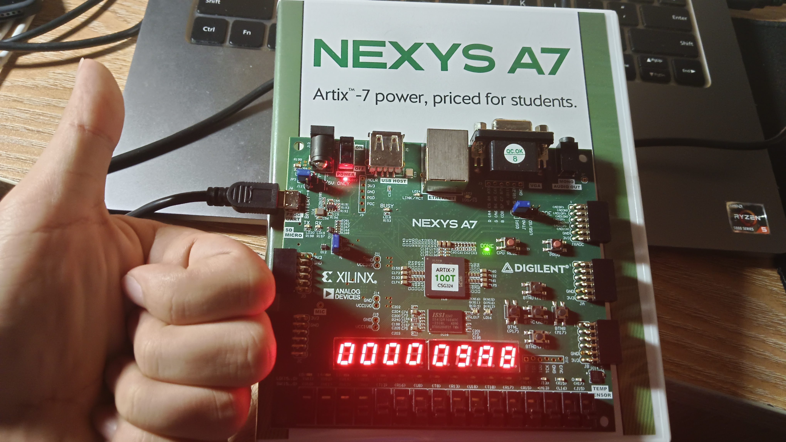

import CContainer from "@md-components/CustomContainer.vue";


<CContainer type="question">

请在实验报告中详细描述每一步的过程并配有适当的截图和解释，对于仿真设计和上板验证的结果也应当有适当的解释和照片

</CContainer>

## ID 阶段

### Controller

```verilog
`include "core_struct.vh"
module Controller (
    input CorePack::inst_t inst,
    output logic we_reg,
    output logic we_mem,
    output logic re_mem,
    output logic npc_sel,
    output CorePack::imm_op_enum immgen_op,
    output CorePack::alu_op_enum alu_op,
    output CorePack::cmp_op_enum cmp_op,
    output CorePack::alu_asel_op_enum alu_asel,
    output CorePack::alu_bsel_op_enum alu_bsel,
    output CorePack::wb_sel_op_enum wb_sel,
    output CorePack::mem_op_enum mem_op
);

    import CorePack::*;
    
    // 提取指令字段
    opcode_t opcode = inst[6:0];
    funct3_t funct3 = inst[14:12];
    funct7_t funct7 = inst[31:25];
    
    // 第一段译码：指令类型识别
    logic is_load     = (opcode == LOAD_OPCODE);
    logic is_store    = (opcode == STORE_OPCODE);
    logic is_branch   = (opcode == BRANCH_OPCODE);
    logic is_jal      = (opcode == JAL_OPCODE);
    logic is_jalr     = (opcode == JALR_OPCODE);
    logic is_lui      = (opcode == LUI_OPCODE);
    logic is_auipc    = (opcode == AUIPC_OPCODE);
    logic is_reg      = (opcode == REG_OPCODE);
    logic is_regw     = (opcode == REGW_OPCODE);
    logic is_imm      = (opcode == IMM_OPCODE);
    logic is_immw     = (opcode == IMMW_OPCODE);
    
    // 第二段译码：生成控制信号
    
    // 寄存器写使能
    assign we_reg = is_load | is_imm | is_immw | is_reg | is_regw | is_lui | is_auipc | is_jal | is_jalr;
    
    // 内存读写使能
    assign we_mem = is_store;
    assign re_mem = is_load;
    
    // 下一条PC选择
    assign npc_sel = is_branch | is_jal | is_jalr;
    
    // 立即数生成类型
    always_comb begin
        if (is_load | is_imm | is_immw | is_jalr)
            immgen_op = I_IMM;
        else if (is_store)
            immgen_op = S_IMM;
        else if (is_branch)
            immgen_op = B_IMM;
        else if (is_lui)
            immgen_op = U_IMM;
        else if (is_auipc)
            immgen_op = U_IMM;
        else if (is_jal)
            immgen_op = UJ_IMM;
        else
            immgen_op = IMM0;
    end
    
    // ALU操作选择
    always_comb begin
        if (is_lui)
            alu_op = ALU_ADD;
        else if (is_auipc)
            alu_op = ALU_ADD;
        else if (is_jal | is_jalr)
            alu_op = ALU_ADD;
        else if (is_branch)
            alu_op = ALU_ADD;
        else if (is_load | is_store)
            alu_op = ALU_ADD;
        else if (is_imm) begin
            case (funct3)
                ADD_FUNCT3:  alu_op = ALU_ADD;
                SLT_FUNCT3:  alu_op = ALU_SLT;
                SLTU_FUNCT3: alu_op = ALU_SLTU;
                XOR_FUNCT3:  alu_op = ALU_XOR;
                OR_FUNCT3:   alu_op = ALU_OR;
                AND_FUNCT3:  alu_op = ALU_AND;
                SLL_FUNCT3:  alu_op = ALU_SLL;
                SRL_FUNCT3:  alu_op = (funct7[5]) ? ALU_SRA : ALU_SRL;
                default:     alu_op = ALU_DEFAULT;
            endcase
        end
        else if (is_reg) begin
            case (funct3)
                ADD_FUNCT3:  alu_op = (funct7[5]) ? ALU_SUB : ALU_ADD;
                SLL_FUNCT3:  alu_op = ALU_SLL;
                SLT_FUNCT3:  alu_op = ALU_SLT;
                SLTU_FUNCT3: alu_op = ALU_SLTU;
                XOR_FUNCT3:  alu_op = ALU_XOR;
                SRL_FUNCT3:  alu_op = (funct7[5]) ? ALU_SRA : ALU_SRL;
                OR_FUNCT3:   alu_op = ALU_OR;
                AND_FUNCT3:  alu_op = ALU_AND;
                default:     alu_op = ALU_DEFAULT;
            endcase
        end
        else if (is_immw) begin
            case (funct3)
                ADDW_FUNCT3: alu_op = ALU_ADDW;
                SLLW_FUNCT3: alu_op = ALU_SLLW;
                SRLW_FUNCT3: alu_op = (funct7[5]) ? ALU_SRAW : ALU_SRLW;
                default:     alu_op = ALU_DEFAULT;
            endcase
        end
        else if (is_regw) begin
            case (funct3)
                ADDW_FUNCT3: alu_op = (funct7[5]) ? ALU_SUBW : ALU_ADDW;
                SLLW_FUNCT3: alu_op = ALU_SLLW;
                SRLW_FUNCT3: alu_op = (funct7[5]) ? ALU_SRAW : ALU_SRLW;
                default:     alu_op = ALU_DEFAULT;
            endcase
        end
        else
            alu_op = ALU_DEFAULT;
    end
    
    // 比较器操作选择
    always_comb begin
        if (is_branch) begin
            case (funct3)
                BEQ_FUNCT3:  cmp_op = CMP_EQ;
                BNE_FUNCT3:  cmp_op = CMP_NE;
                BLT_FUNCT3:  cmp_op = CMP_LT;
                BGE_FUNCT3:  cmp_op = CMP_GE;
                BLTU_FUNCT3: cmp_op = CMP_LTU;
                BGEU_FUNCT3: cmp_op = CMP_GEU;
                default:     cmp_op = CMP_NO;
            endcase
        end else if(is_jal | is_jalr)
            cmp_op = CMP7; // JAL和JALR指令不需要比较
        else
            cmp_op = CMP_NO; // 其他指令不需要比较
    end
    
    // ALU操作数A选择
    always_comb begin
        if (is_imm | is_immw | is_reg | is_regw | is_load | is_store)
            alu_asel = ASEL_REG;
        else if (is_auipc | is_branch | is_jal)
            alu_asel = ASEL_PC;
        else if (is_jalr)
            alu_asel = ASEL_REG;
        else
            alu_asel = ASEL0;
    end
    
    // ALU操作数B选择
    always_comb begin
        if (is_imm | is_immw | is_load | is_store | is_auipc | is_jal | is_jalr | is_lui | is_branch)
            alu_bsel = BSEL_IMM;
        else if (is_reg | is_regw)
            alu_bsel = BSEL_REG;
        else
            alu_bsel = BSEL0;
    end
    
    // 写回选择
    always_comb begin
        if (is_load )
            wb_sel = WB_SEL_MEM;
        else if (is_jal | is_jalr)
            wb_sel = WB_SEL_PC;
        else if (is_lui | is_auipc | is_imm  | is_reg| is_immw | is_regw )
            wb_sel = WB_SEL_ALU;
        else
            wb_sel = WB_SEL0;
    end
    
    // 内存操作类型
    always_comb begin
        if (is_load) begin
            case (funct3)
                LB_FUNCT3:   mem_op = MEM_B;
                LH_FUNCT3:   mem_op = MEM_H;
                LW_FUNCT3:   mem_op = MEM_W;
                LD_FUNCT3:   mem_op = MEM_D;
                LBU_FUNCT3:  mem_op = MEM_UB;
                LHU_FUNCT3:  mem_op = MEM_UH;
                LWU_FUNCT3:  mem_op = MEM_UW;
                default:     mem_op = MEM_NO;
            endcase
        end
        else if (is_store) begin
            case (funct3)
                SB_FUNCT3:   mem_op = MEM_B;
                SH_FUNCT3:   mem_op = MEM_H;
                SW_FUNCT3:   mem_op = MEM_W;
                SD_FUNCT3:   mem_op = MEM_D;
                default:     mem_op = MEM_NO;
            endcase
        end
        else
            mem_op = MEM_NO;
    end

endmodule    
```

按照实验文档的要求写了二段译码。写的体感很不错，有一种做物理实验时拿着导线到处插的快感。

### RegFile

```verilog
`include "core_struct.vh"
module RegFile (
  input clk,
  input rst,
  input we,
  input CorePack::reg_ind_t  read_addr_1,
  input CorePack::reg_ind_t  read_addr_2,
  input CorePack::reg_ind_t  write_addr,
  input  CorePack::data_t write_data,
  output CorePack::data_t read_data_1,
  output CorePack::data_t read_data_2
);
  import CorePack::*;

  integer i;
  data_t register [1:31]; // x1 - x31, x0 keeps zero

  always @(posedge clk or posedge rst) begin
    // $display("register data full: %p", register);
    if (rst) begin
      for (i = 1; i < 32; i = i + 1) begin
        register[i] <= 0;
      end
    end else if (we && write_addr != 0) begin
      register[write_addr] <= write_data;
    end
  end
  assign read_data_1 = (read_addr_1 == 0) ? 0 : register[read_addr_1];
  assign read_data_2 = (read_addr_2 == 0) ? 0 : register[read_addr_2];

endmodule
```

要注意的是寄存器x0的值永远是0，如果遇到写x0的请求可以直接扔掉


Core.sv
```verilog
RegFile u_regfile (
    .clk(clk),
    .rst(rst),
    .we(we_reg),
    .read_addr_1(rs1),
    .read_addr_2(rs2),
    .write_addr(rd),
    .write_data(wb_val),
    .read_data_1(read_data_1),
    .read_data_2(read_data_2)
);
```


## EXE 阶段

### ALU

```verilog
module ALU (
  input  CorePack::data_t a,
  input  CorePack::data_t b,
  input  CorePack::alu_op_enum  alu_op,
  output CorePack::data_t res
);

  import CorePack::*;

  // fill your code

  logic [63:0] result;
  always_comb begin
    case (alu_op)
      ALU_ADD:  result = a + b;
      ALU_SUB:  result = a - b;
      ALU_AND:  result = a & b;
      ALU_OR:   result = a | b;
      ALU_XOR:  result = a ^ b;
      ALU_SLT:  result = ($signed(a) < $signed(b)) ? 1 : 0;
      ALU_SLTU: result = (a < b) ? 1 : 0; // unsigned comparison
      ALU_SLL:  result = a << b[5:0]; // shift by lower 5 bits
      ALU_SRL:  result = a >> b[5:0]; // shift by lower 5 bits
      ALU_SRA:  result = $signed(a) >>> b[5:0]; // arithmetic right shift
      // 32-bit word operations with proper sign extension and truncation
      ALU_ADDW: result = {32'b0,{a[31:0] + b[31:0]}};
      ALU_SUBW: result = {32'b0,{a[31:0] - b[31:0]}}; 
      ALU_SLLW: result = {32'b0,{a[31:0] << $signed(b[4:0])}};
      ALU_SRLW: result = {32'b0,{a[31:0] >> $signed(b[4:0])}};
      ALU_SRAW: result = {32'b0,{$signed(a[31:0]) >>> $signed(b[4:0])}};
      ALU_DEFAULT: result = 0; // default case, can be modified as needed
      default:  result = 0; // default case, can be modified as needed
    endcase
    // $display("ALU log: a=%h, b=%h, alu_op=%s, result=%h", a, b, alu_op.name(), result);
    // $display("log: (b) =%b", b);
  end

  // wire res_truncated;
  assign res = (alu_op==ALU_ADDW||alu_op==ALU_SUBW||
                alu_op==ALU_SLLW||alu_op==ALU_SRLW||alu_op==ALU_SRAW) ?
                  {{32{result[31]}},{result}[31:0]} : // 64-bit result for word operations(should cut to 32-bit)
                  result; // 64-bit result for other operations
  // assign res = result;

endmodule

```

这里主要涉及一个XXXW类型操作，即只对低32位处理，处理完只留低32位，高位截断。我觉得应该会有更优雅的做法，但是没调出来。

Core.sv
```verilog
always_comb begin
    case (alu_a_sel)
        ASEL_REG: alu_a = read_data_1;
        ASEL_PC:  alu_a = pc;
        default:  alu_a = '0;
    endcase
    
    case (alu_b_sel)
        BSEL_REG: alu_b = read_data_2;
        BSEL_IMM: alu_b = {{32{imm[31]}}, imm};
        default:  alu_b = '0;
    endcase
end

ALU u_alu (
    .a(alu_a),
    .b(alu_b),
    .alu_op(alu_op),
    .res(alu_res)
);
```


### cmp

```verilog
`include"core_struct.vh"
module Cmp (
    input CorePack::data_t a,
    input CorePack::data_t b,
    input CorePack::cmp_op_enum cmp_op,
    output cmp_res
);

    import CorePack::*;

    logic cmp_result;
    assign cmp_res = cmp_result;

    always_comb begin
        case (cmp_op)
            CMP_NO:  cmp_result = 0; // no comparison, can be modified as needed
            CMP_EQ:  cmp_result = (a == b);
            CMP_NE:  cmp_result = (a != b);
            CMP_LT:  cmp_result = ($signed(a) < $signed(b));
            CMP_GE:  cmp_result = ($signed(a) >= $signed(b));
            CMP_LTU: cmp_result = (a < b); // unsigned comparison
            CMP_GEU: cmp_result = (a >= b); // unsigned comparison
            CMP7:    cmp_result = 1; // always true,
            default: cmp_result = 0; // default case,
        endcase
    end
endmodule
```

cmp还好，对着定义写就行。

Core.sv
```verilog
Cmp u_cmp (
    .a(read_data_1),
    .b(read_data_2),
    .cmp_op(cmp_op),
    .cmp_res(cmp_res)
);
```

## MEM 阶段

```verilog
`include "core_struct.vh"

module DataPkg(
    input CorePack::mem_op_enum mem_op,
    input CorePack::data_t reg_data,
    input CorePack::addr_t dmem_waddr,
    output CorePack::data_t dmem_wdata
);

    import CorePack::*;
    logic [2:0] byte_offset = dmem_waddr[2:0]; // 字节偏移量

    always_comb begin
        case (mem_op)
            MEM_B: begin  // 存储字节
                case (byte_offset)
                    3'd0: dmem_wdata = {56'b0, reg_data[7:0] };
                    3'd1: dmem_wdata = {48'b0, reg_data[7:0], 8'b0};
                    3'd2: dmem_wdata = {40'b0, reg_data[7:0], 16'b0};
                    3'd3: dmem_wdata = {32'b0, reg_data[7:0], 24'b0};
                    3'd4: dmem_wdata = {24'b0, reg_data[7:0], 32'b0};
                    3'd5: dmem_wdata = {16'b0, reg_data[7:0], 40'b0};
                    3'd6: dmem_wdata = {8'b0, reg_data[7:0], 48'b0};
                    3'd7: dmem_wdata = {reg_data[7:0], 56'b0};
                    default: dmem_wdata = '0;
                endcase
            end
            MEM_UB: begin  // 存储无符号字节
                case (byte_offset)
                    3'd0: dmem_wdata = {56'b0, reg_data[7:0]};
                    3'd1: dmem_wdata = {48'b0, reg_data[7:0], 8'b0};
                    3'd2: dmem_wdata = {40'b0, reg_data[7:0], 16'b0};
                    3'd3: dmem_wdata = {32'b0, reg_data[7:0], 24'b0};
                    3'd4: dmem_wdata = {24'b0, reg_data[7:0], 32'b0};
                    3'd5: dmem_wdata = {16'b0, reg_data[7:0], 40'b0};
                    3'd6: dmem_wdata = {8'b0, reg_data[7:0], 48'b0};
                    3'd7: dmem_wdata = {reg_data[7:0], 56'b0};
                    default: dmem_wdata = '0;
                endcase
            end
            MEM_H: begin  // 存储半字
                case (byte_offset[2:1])
                    2'd0: dmem_wdata = {48'b0,reg_data[15:0]};
                    2'd1: dmem_wdata = {32'b0, reg_data[15:0], 16'b0};
                    2'd2: dmem_wdata = {16'b0, reg_data[15:0], 32'b0};
                    2'd3: dmem_wdata = {reg_data[15:0], 48'b0};
                    default: dmem_wdata = '0;
                endcase
            end
            MEM_UH: begin  // 存储无符号半字
                case (byte_offset[2:1])
                    2'd0: dmem_wdata = {48'b0, reg_data[15:0]};
                    2'd1: dmem_wdata = {32'b0, reg_data[15:0], 16'b0};
                    2'd2: dmem_wdata = {16'b0, reg_data[15:0], 32'b0};
                    2'd3: dmem_wdata = {reg_data[15:0], 48'b0};
                    default: dmem_wdata = '0;
                endcase
            end
            MEM_W: begin  // 存储字
                case (byte_offset[2])
                    1'd0: dmem_wdata = {32'b0,reg_data[31:0]};
                    1'd1: dmem_wdata = {reg_data[31:0], 32'b0};
                    default: dmem_wdata = '0;
                endcase
            end
            MEM_UW: begin  // 存储无符号字
                case (byte_offset[2])
                    1'd0: dmem_wdata = {32'b0, reg_data[31:0]};
                    1'd1: dmem_wdata = {reg_data[31:0], 32'b0};
                    default: dmem_wdata = '0;
                endcase
            end
            MEM_D: dmem_wdata = reg_data;  // 存储双字

            default: dmem_wdata = '0;
        endcase
    end

endmodule    
```

```verilog
`include "core_struct.vh"

module DataTrunc (
    input CorePack::data_t dmem_rdata,
    input CorePack::mem_op_enum mem_op,
    input CorePack::addr_t dmem_raddr,
    output CorePack::data_t read_data
);

    import CorePack::*;
    logic [2:0] byte_offset = dmem_raddr[2:0]; // 字节偏移量

    always_comb begin
        case (mem_op)
            MEM_B: begin  // 加载字节
                logic [7:0] byte_data;
                case (byte_offset)
                    3'd0: byte_data = dmem_rdata[7:0];
                    3'd1: byte_data = dmem_rdata[15:8];
                    3'd2: byte_data = dmem_rdata[23:16];
                    3'd3: byte_data = dmem_rdata[31:24];
                    3'd4: byte_data = dmem_rdata[39:32];
                    3'd5: byte_data = dmem_rdata[47:40];
                    3'd6: byte_data = dmem_rdata[55:48];
                    3'd7: byte_data = dmem_rdata[63:56];
                    default: byte_data = '0;
                endcase
                read_data = {{56{byte_data[7]}}, byte_data}; // 符号扩展
            end
            MEM_UB: begin  // 加载无符号字节
                logic [7:0] byte_data;
                case (byte_offset)
                    3'd0: byte_data = dmem_rdata[7:0];
                    3'd1: byte_data = dmem_rdata[15:8];
                    3'd2: byte_data = dmem_rdata[23:16];
                    3'd3: byte_data = dmem_rdata[31:24];
                    3'd4: byte_data = dmem_rdata[39:32];
                    3'd5: byte_data = dmem_rdata[47:40];
                    3'd6: byte_data = dmem_rdata[55:48];
                    3'd7: byte_data = dmem_rdata[63:56];
                    default: byte_data = '0;
                endcase
                read_data = {56'b0, byte_data}; // 零扩展
            end
            MEM_H: begin  // 加载半字
                logic [15:0] half_data;
                case (byte_offset[2:1])
                    2'd0: half_data = dmem_rdata[15:0];
                    2'd1: half_data = dmem_rdata[31:16];
                    2'd2: half_data = dmem_rdata[47:32];
                    2'd3: half_data = dmem_rdata[63:48];
                    default: half_data = '0;
                endcase
                read_data = {{48{half_data[15]}}, half_data}; // 符号扩展
            end
            MEM_UH: begin  // 加载无符号半字
                logic [15:0] half_data;
                case (byte_offset[2:1])
                    2'd0: half_data = dmem_rdata[15:0];
                    2'd1: half_data = dmem_rdata[31:16];
                    2'd2: half_data = dmem_rdata[47:32];
                    2'd3: half_data = dmem_rdata[63:48];
                    default: half_data = '0;
                endcase
                read_data = {48'b0, half_data}; // 零扩展
            end
            MEM_W: begin  // 加载字
                logic [31:0] word_data;
                case (byte_offset[2])
                    1'd0: word_data = dmem_rdata[31:0];
                    1'd1: word_data = dmem_rdata[63:32];
                    default: word_data = '0;
                endcase
                read_data = {{32{word_data[31]}}, word_data}; // 符号扩展
            end
            MEM_UW: begin  // 加载无符号字
                logic [31:0] word_data;
                case (byte_offset[2])
                    1'd0: word_data = dmem_rdata[31:0];
                    1'd1: word_data = dmem_rdata[63:32];
                    default: word_data = '0;
                endcase
                read_data = {32'b0, word_data}; // 零扩展
            end
            MEM_D: read_data = dmem_rdata;  // 加载双字
            MEM_NO: read_data = '0;  // 无操作
            default: read_data = '0;
        endcase
    end

endmodule    
```

```verilog
`include "core_struct.vh"

module MaskGen(
    input CorePack::mem_op_enum mem_op,
    input CorePack::addr_t dmem_waddr,
    output CorePack::mask_t dmem_wmask
);

    import CorePack::*;
    logic [2:0] byte_offset = dmem_waddr[2:0]; // 字节偏移量

    always_comb begin
        case (mem_op)
            MEM_B: begin  // 存储字节
                case (byte_offset)
                    3'd0: dmem_wmask = 8'b00000001;
                    3'd1: dmem_wmask = 8'b00000010;
                    3'd2: dmem_wmask = 8'b00000100;
                    3'd3: dmem_wmask = 8'b00001000;
                    3'd4: dmem_wmask = 8'b00010000;
                    3'd5: dmem_wmask = 8'b00100000;
                    3'd6: dmem_wmask = 8'b01000000;
                    3'd7: dmem_wmask = 8'b10000000;
                    default: dmem_wmask = 8'b00000000;
                endcase
            end
            MEM_H: begin  // 存储半字
                case (byte_offset[2:1])
                    2'd0: dmem_wmask = 8'b00000011;
                    2'd1: dmem_wmask = 8'b00001100;
                    2'd2: dmem_wmask = 8'b00110000;
                    2'd3: dmem_wmask = 8'b11000000;
                    default: dmem_wmask = 8'b00000000;
                endcase
            end
            MEM_W: begin  // 存储字
                case (byte_offset[2])
                    1'd0: dmem_wmask = 8'b00001111;
                    1'd1: dmem_wmask = 8'b11110000;
                    default: dmem_wmask = 8'b00000000;
                endcase
            end
            MEM_D: dmem_wmask = 8'b11111111;  // 存储双字
            default: dmem_wmask = 8'b00000000;
        endcase
    end

endmodule    
```

这边三个模块`DataPkg`、`DataTrunc`和`MaskGen`分别负责数据包的生成、数据的截断和掩码的生成。

Core.sv

```verilog
    // 访存阶段 (MEM)
    // 数据打包
    DataPkg u_datapkg (
        .mem_op(mem_op),
        .reg_data(read_data_2),
        .dmem_waddr(alu_res),
        .dmem_wdata(dmem_wdata_pkg)
    );
    
    // 掩码生成
    MaskGen u_maskgen (
        .mem_op(mem_op),
        .dmem_waddr(alu_res),
        .dmem_wmask(dmem_wmask)
    );
    
    // 内存接口
    always_comb begin
        // 读请求
        dmem_ift.r_request_bits.raddr = alu_res;
        dmem_ift.r_request_valid = re_mem;
        
        // 写请求
        dmem_ift.w_request_bits.waddr = read_data_1+{{32{imm[31]}}, imm};
        dmem_ift.w_request_bits.wmask = dmem_wmask;
        dmem_ift.w_request_bits.wdata = dmem_wdata_pkg;
        dmem_ift.w_request_valid = we_mem;
        
        // 由于是单周期CPU，ready信号始终为1
        dmem_ift.r_reply_ready = 1'b1;
        dmem_ift.w_reply_ready = 1'b1;
    end
```

## 数据通路 Core

```verilog
`include "core_struct.vh"
module Core (
    input clk,
    input rst,

    Mem_ift.Master imem_ift,
    Mem_ift.Master dmem_ift,

    output cosim_valid,
    output CorePack::CoreInfo cosim_core_info
);
    import CorePack::*;
    
    // 信号声明
    // PC相关
    data_t pc, next_pc, pc_plus4;
    data_t branch_target, jump_target;
    logic br_taken;
    
    // 指令相关
    inst_t inst;
    
    // 寄存器堆相关
    logic [4:0] rs1, rs2, rd;
    data_t read_data_1, read_data_2;
    logic we_reg;
    data_t wb_val;
    
    // ALU相关
    data_t alu_a, alu_b, alu_res;
    alu_op_enum alu_op;
    alu_asel_op_enum alu_a_sel;
    alu_bsel_op_enum alu_b_sel;
    
    // 比较器相关
    logic cmp_res;
    cmp_op_enum cmp_op;
    
    // 内存相关
    data_t dmem_wdata_pkg;
    mask_t dmem_wmask;
    data_t dmem_rdata_trunc;
    mem_op_enum mem_op;
    logic we_mem, re_mem;
    
    // 立即数生成相关
    logic [31:0] imm;
    imm_op_enum immgen_op;
    
    // 下一条PC选择
    logic npc_sel;
    wb_sel_op_enum wb_sel;
    
    // 控制单元实例化
    Controller u_controller (
        .inst(inst),
        .we_reg(we_reg),
        .we_mem(we_mem),
        .re_mem(re_mem),
        .npc_sel(npc_sel),
        .immgen_op(immgen_op),
        .alu_op(alu_op),
        .cmp_op(cmp_op),
        .alu_asel(alu_a_sel),
        .alu_bsel(alu_b_sel),
        .wb_sel(wb_sel),
        .mem_op(mem_op)
    );
    
    // 立即数生成
    always_comb begin
        case (immgen_op)
            I_IMM:   imm = {{20{inst[31]}}, inst[31:20]};
            S_IMM:   imm = {{20{inst[31]}}, inst[31:25], inst[11:7]};
            B_IMM:   imm = {{20{inst[31]}}, inst[7], inst[30:25], inst[11:8], 1'b0};
            U_IMM:   imm = {inst[31:12], 12'b0};
            UJ_IMM:  imm = {{12{inst[31]}}, inst[19:12], inst[20], inst[30:21], 1'b0};
            default: imm = '0;
        endcase
    end
    
    // PC更新逻辑
    always_ff @(posedge clk or posedge rst) begin
        // $display(" PC: %h, Next PC: %h", pc, next_pc);
        // $display(" Instruction: %h", inst);
        // $display(" Read Data 1: %h, Read Data 2: %h", read_data_1, read_data_2);
        // $display(" ALU Result: %h, Branch Target: %h, Jump Target: %h", alu_res, branch_target, jump_target);
        // $display(" Branch Taken: %b, Next PC: %h", br_taken, next_pc);
        // $display(" Imm: %h, ALU A: %h, ALU B: %h", imm, alu_a, alu_b);
        if (rst) begin
            pc <= '0;
        end else begin
            pc <= next_pc;
        end
    end
    
    assign pc_plus4 = pc + 4;
    
    // 指令提取
    assign rs1 = inst[19:15];
    assign rs2 = inst[24:20];
    assign rd = inst[11:7];
    
    // 指令获取阶段 (IF)
    always_comb begin
        // 指令存储器接口
        imem_ift.r_request_bits.raddr = pc;
        imem_ift.r_request_valid = 1'b1;  // 单周期CPU，一直有效
        
        // 从指令存储器读取指令
        inst = pc[2] ? imem_ift.r_reply_bits.rdata[63:32] : imem_ift.r_reply_bits.rdata[31:0];
    end
     
    // 指令译码阶段 (ID)
    RegFile u_regfile (
        .clk(clk),
        .rst(rst),
        .we(we_reg),
        .read_addr_1(rs1),
        .read_addr_2(rs2),
        .write_addr(rd),
        .write_data(wb_val),
        .read_data_1(read_data_1),
        .read_data_2(read_data_2)
    );
    
    // 执行阶段 (EX)
    // ALU操作数选择
    always_comb begin
        case (alu_a_sel)
            ASEL_REG: alu_a = read_data_1;
            ASEL_PC:  alu_a = pc;
            default:  alu_a = '0;
        endcase
        
        case (alu_b_sel)
            BSEL_REG: alu_b = read_data_2;
            BSEL_IMM: alu_b = {{32{imm[31]}}, imm};
            default:  alu_b = '0;
        endcase
    end
    
    ALU u_alu (
        .a(alu_a),
        .b(alu_b),
        .alu_op(alu_op),
        .res(alu_res)
    );
    
    // 分支比较器
    Cmp u_cmp (
        .a(read_data_1),
        .b(read_data_2),
        .cmp_op(cmp_op),
        .cmp_res(cmp_res)
    );
    
    assign next_pc = npc_sel && cmp_res ? alu_res : pc_plus4;

    // 访存阶段 (MEM)
    // 数据打包
    DataPkg u_datapkg (
        .mem_op(mem_op),
        .reg_data(read_data_2),
        .dmem_waddr(alu_res),
        .dmem_wdata(dmem_wdata_pkg)
    );
    
    // 掩码生成
    MaskGen u_maskgen (
        .mem_op(mem_op),
        .dmem_waddr(alu_res),
        .dmem_wmask(dmem_wmask)
    );
    
    // 内存接口
    always_comb begin
        // 读请求
        dmem_ift.r_request_bits.raddr = alu_res;
        dmem_ift.r_request_valid = re_mem;
        
        // 写请求
        dmem_ift.w_request_bits.waddr = read_data_1+{{32{imm[31]}}, imm};
        dmem_ift.w_request_bits.wmask = dmem_wmask;
        dmem_ift.w_request_bits.wdata = dmem_wdata_pkg;
        dmem_ift.w_request_valid = we_mem;
        
        // 由于是单周期CPU，ready信号始终为1
        dmem_ift.r_reply_ready = 1'b1;
        dmem_ift.w_reply_ready = 1'b1;
    end
    
    // 数据截断
    DataTrunc u_datatrunc (
        .dmem_rdata(dmem_ift.r_reply_bits.rdata),
        .mem_op(mem_op),
        .dmem_raddr(alu_res),
        .read_data(dmem_rdata_trunc)
    );
    
    // 写回阶段 (WB)
    // 写回值选择
    always_comb begin
        case (wb_sel)
            WB_SEL_ALU: wb_val = alu_res;
            WB_SEL_MEM: wb_val = dmem_rdata_trunc;
            WB_SEL_PC:  wb_val = pc_plus4;
            default:    wb_val = '0;
        endcase
    end
    
    // 调试信息输出
        assign cosim_valid = 1'b1;
    assign cosim_core_info.pc        = pc;
    assign cosim_core_info.inst      = {32'b0,inst};   
    assign cosim_core_info.rs1_id    = {59'b0, rs1};
    assign cosim_core_info.rs1_data  = read_data_1;
    assign cosim_core_info.rs2_id    = {59'b0, rs2};
    assign cosim_core_info.rs2_data  = read_data_2;
    assign cosim_core_info.alu       = alu_res;
    assign cosim_core_info.mem_addr  = dmem_ift.r_request_bits.raddr;
    assign cosim_core_info.mem_we    = {63'b0, dmem_ift.w_request_valid};
    assign cosim_core_info.mem_wdata = dmem_ift.w_request_bits.wdata;
    assign cosim_core_info.mem_rdata = dmem_ift.r_reply_bits.rdata;
    assign cosim_core_info.rd_we     = {63'b0, we_reg};
    assign cosim_core_info.rd_id     = {59'b0, rd}; 
    assign cosim_core_info.rd_data   = wb_val;
    assign cosim_core_info.br_taken  = {63'b0, br_taken};
    assign cosim_core_info.npc       = next_pc;

endmodule    

```

# 仿真设计和上板验证

## 仿真设计

import AsciinemaWrapper from "@md-components/AsciinemaWrapper.vue"

sample：简单测试样例，用于熟悉实验结构

import cast1 from "./a1.cast?raw";

<AsciinemaWrapper cast={cast1} />

rtype：测试 R 型指令

import cast2 from "./p2.cast?raw";

<AsciinemaWrapper cast={cast2} />

itype：测试 I 型指令

import cast3 from "./p3.cast?raw";

<AsciinemaWrapper cast={cast3} />

stype：测试 S 型指令

import cast4 from "./p4.cast?raw";

<AsciinemaWrapper cast={cast4} />

btype：测试 B 型指令

import cast5 from "./p5.cast?raw";

<AsciinemaWrapper cast={cast5} />

utype：测试 U 型指令

import cast6 from "./p6.cast?raw";

<AsciinemaWrapper cast={cast6} />

jyupe：测试 J 型指令

import cast7 from "./p7.cast?raw";

<AsciinemaWrapper cast={cast7} />


remain：测试其他类型的指令

import cast8 from "./p8.cast?raw";

<AsciinemaWrapper cast={cast8} />

full：测试所有类型的指令


import cast9 from "./p9.cast?raw";

<AsciinemaWrapper cast={cast9} />

## 上板验证



大成功！
