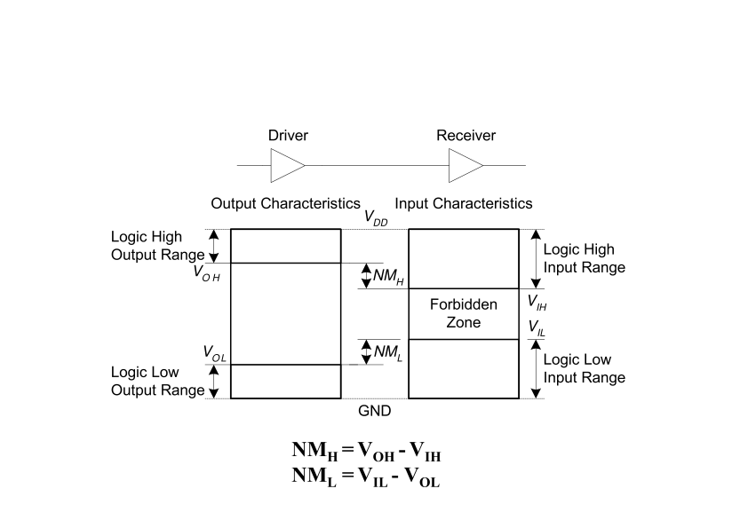
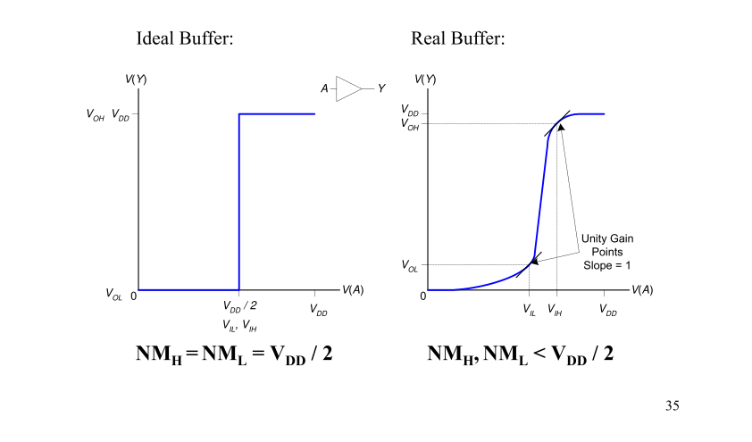

# Lec02_Boolean Algebra

## Foundations of Digital Logic

**Overview**

- Introduction
- Binary logic and gates
- Transistors
- Some IC parameters
- Boolean algebra
- Logic functions
- Simplification of logic functions
- Additional Gates and Circuits

## Electronic Systems

- **Analog signals vs. Digital signals**

## Why Digital?

- Intentionally restrict design choices
- Example: Digital discipline
  - Discrete voltages instead of continuous
  - Simpler to design than analog circuits – can build more sophisticated systems
  - Digital systems replacing analog predecessors:
    - i.e., digital cameras, digital television, cell phones, CDs

## Binary Logic and Gates

- Binary variables take on one of two values.
- Logical operators operate on binary values and binary variables.
- Basic logical operators are the logic functions AND, OR and NOT.
- Logic gates implement logic functions.
- Boolean Algebra: a useful mathematical system for specifying and transforming logic functions.
- We study Boolean algebra as a foundation for designing and analyzing digital systems!

## Binary Variables

- Recall that the two binary values have different names:
  - True/False
  - On/Off
  - Yes/No
  - 1/0
- We use 1 and 0 to denote the two values.
- Variable identifier examples:
  - A, B, y, z, or X

## Logical Operations

- The three basic logical operations are:
  - AND
  - OR
  - NOT
- AND is denoted by a dot (ꞏ).
- OR is denoted by a plus (+).
- NOT is denoted by an overbar ( ¯ ), a single quote mark (') after, or (~) before the variable.

## Truth Table

- A tabular listing of the values of a function for all possible combinations of values on its arguments
- Example: Truth tables for the basic logic operations:

| X | Y | Z = XꞏY | Z = X+Y |
|---|---|---------|---------|
| 0 | 0 | 0       | 0       |
| 0 | 1 | 0       | 1       |
| 1 | 0 | 0       | 1       |
| 1 | 1 | 1       | 1       |

| X | Z = X' |
|---|--------|
| 0 | 1      |
| 1 | 0      |

## How to Model Logic Functions?

- Using Switches
  - For inputs:
    - logic 1 is switch closed
    - logic 0 is switch open
  - For outputs:
    - logic 1 is light on
    - logic 0 is light off.
  - NOT uses a switch such that:
    - logic 1 is switch open
    - logic 0 is switch closed

## An Example: Logic Using Switches

- Light is on (L = 1) for L(A, B, C, D) = and off (L = 0), otherwise.
- Useful model for relay circuits and for CMOS gate circuits, the foundation of current digital logic technology

## Logic Gates

- Perform logic functions:
  - inversion (NOT), AND, OR, NAND, NOR, etc.
- Single-input:
  - NOT gate, buffer
- Two-input:
  - AND, OR, XOR, NAND, NOR, XNOR
- Multiple-input

## Single-Input Logic Gates

| A | Y = A' |
|---|--------|
| 0 | 1      |
| 1 | 0      |

| A | Y = A |
|---|--------|
| 0 | 0      |
| 1 | 1      |

## Two-Input Logic Gates

| A | B | Y = AB |
|---|---|--------|
| 0 | 0 | 0      |
| 0 | 1 | 0      |
| 1 | 0 | 0      |
| 1 | 1 | 1      |

| A | B | Y = A + B |
|---|---|-----------|
| 0 | 0 | 0         |
| 0 | 1 | 1         |
| 1 | 0 | 1         |
| 1 | 1 | 1         |

## More Two-Input Logic Gates

XOR

| A | B | Y = A + B |
|---|---|-----------|
| 0 | 0 | 1         |
| 0 | 1 | 0         |
| 1 | 0 | 0         |
| 1 | 1 | 1         |

NAND

| A | B | Y = AB |
|---|---|--------|
| 0 | 0 | 1      |
| 0 | 1 | 1      |
| 1 | 0 | 1      |
| 1 | 1 | 0      |

NOR

| A | B | Y = AB |
|---|---|--------|
| 0 | 0 | 1      |
| 0 | 1 | 0      |
| 1 | 0 | 0      |
| 1 | 1 | 0      |

## Multiple-Input Logic Gates

NOR3

| A | B | C | Y = A+B+C |
|---|---|---|-----------|
| 0 | 0 | 0 | 0         |
| 0 | 0 | 1 | 0         |
| 0 | 1 | 0 | 0         |
| 0 | 1 | 1 | 0         |
| 1 | 0 | 0 | 0         |
| 1 | 0 | 1 | 0         |
| 1 | 1 | 0 | 0         |
| 1 | 1 | 1 | 1         |

AND4

| A | B | C | D | Y = ABCD |
|---|---|---|---|----------|
| 0 | 0 | 0 | 0 | 0        |
| 0 | 0 | 0 | 1 | 0        |
| 0 | 0 | 1 | 0 | 0        |
| 0 | 0 | 1 | 1 | 0        |
| 0 | 1 | 0 | 0 | 0        |
| 0 | 1 | 0 | 1 | 0        |
| 0 | 1 | 1 | 0 | 0        |
| 0 | 1 | 1 | 1 | 0        |
| 1 | 0 | 0 | 0 | 0        |
| 1 | 0 | 0 | 1 | 0        |
| 1 | 0 | 1 | 0 | 0        |
| 1 | 0 | 1 | 1 | 0        |
| 1 | 1 | 0 | 0 | 0        |
| 1 | 1 | 0 | 1 | 0        |
| 1 | 1 | 1 | 0 | 0        |
| 1 | 1 | 1 | 1 | 1        |

# Transistors

## Relays vs. Vacuum Cube vs. Transistor

- In the earliest computers, switches were opened and closed by magnetic fields produced by energizing coils in relays. The switches in turn opened and closed the current paths.
- Later, vacuum tubes that open and close current paths electronically replaced relays.
- Today, transistors are used as electronic switches that open and close current paths.

## Robert Noyce, 1927-1990

- Nicknamed “Mayor of Silicon Valley”
- Cofounded Fairchild Semiconductor in 1957
- Cofounded Intel in 1968
- Co-invented the integrated circuit

## Silicon

- Transistors built from silicon, a semiconductor
- Pure silicon is a poor conductor (no free charges)
- Doped silicon is a good conductor (free charges)
  - n-type (free negative charges, electrons)
  - p-type (free positive charges, holes)

## Integrated Circuit and Transistors

- Integrated Circuit (IC)
  - Transistor-Transistor Logic (TTL)
- Bipolar Junction Transistor (BJT)
  - Complementary Metal-Oxide Semiconductor (CMOS)
- Field Effect Transistor (FET)
- CMOS Transistors
  - Gate, source, drain
  - NMOS transistor / PMOS transistor

## Implementation of Logic Gates with Transistors

(a) NOR

(b) NAND

(c) NOT

## Some IC Parameters

- VCC (Power Supply Voltage)
- Logic levels
  - VIH, VIL, VOH, VOL
  - Noise margin
- Propagation delay
- Transaction time
- Power dissipation
- Fan-in and Fan-out
- Gate Cost

## VCC – Power Supply Voltage

- Common across a logic family (e.g., 5V for all HC parts)
- VCC and GND commonly called “power supply rails”
  - Sometimes VDD and VSS for CMOS devices

## Logic Levels

- Discrete voltages represent 1 and 0
- For example:
  - 0 = ground (GND) or 0 volts
  - 1 = VCC or 5 volts
- What about 4.99 volts? Is that a 0 or a 1?
- What about 3.2 volts?
- **Range** of voltages for 1 and 0
- Different ranges for inputs and outputs to allow for **noise**

## What is Noise?

- Anything that degrades the signal
  - E.g., resistance, power supply noise, coupling to neighboring wires, etc.
- Example: a gate (driver) outputs 5 V but, because of resistance in a long wire, receiver gets 4.5 V

## Use Voltage Thresholds to Extract Discrete Values from Continuous Signals

- Simplest version: 1-bit signal
  - Either high range (1) or low range (0)
  - With guard range between them
- Not strongly affected by noise or low-quality circuit elements
  - Can make circuits simple, small, and fast

## Noise Margins

## DC Transfer Characteristics

## Logic Family Examples

| Logic Family | VDD | VIL | VIH | VOL | VOH |
|--------------|-----|-----|-----|-----|-----|
| TTL          | 5   | 0.8 | 2.0 | 0.4 | 2.4 |
| CMOS         | 5   | 1.35| 3.15| 0.33| 3.84|
| LVTTL        | 3.3 | 0.8 | 2.0 | 0.4 | 2.4 |
| LVCMOS       | 3.3 | 0.9 | 1.8 | 0.36| 2.7 |

## Propagation Delay (Tpd, Tplh, Tphl)

- Outputs don’t instantaneously reflect input changes
- Propagation delay is a measure of this time
- Delay from H to L can be different than from L to H

## Delay Models

- Transport delay - a change of the output in response to a change on the inputs occurred after a fixed specified delay
- Inertial delay - similar to transport delay, except that if input changes cause the output to changes twice in an interval less than the rejection time, then the first of the output changes does not occur. This models typical electronic circuit behavior, namely, rejects narrow “pulses” on the outputs

## Delay Model Example

- Propagation Delay = 2.0 ns
- Rejection Time = 1.0 ns

## How voltage affects speed?

- Takes time for signal to reach its output voltage
- Will be affected by capacitance, fan-out
- Also known as slew rate
- Typically measured from 10%/90% of VOL/VOH swing

## Transition Time (Rise & Fall)

## Power Dissipation

- Power “dissipation” and “consumption”
- Static (“quiescent”) power dissipation
  - When device outputs not changing
  - Caused by the quiescent supply current, IDD (also called the leakage current): $P_S = I_{DD} \cdot V_{CC}$
  - Very low for CMOS
- Dynamic power dissipation
  - $P_D = 2 \cdot C_L \cdot V_{CC}^2 \cdot f$
  - $C_L$ = Power dissipation capacitance (constant for logic family)
  - $C$ = Capacitive load on output (driving other devices)
  - $V_{CC}$ = Supply voltage
  - $f$ = Transition frequency (0.5 x number of output transitions/second)

## Fan-in and Fan-out

- Fan-in refers to the maximum number of input signals that feed the input equations of a logic cell.
  - Fan-in is a term that defines the maximum number of digital inputs that a single logic gate can accept. Most transistor-transistor logic (TTL) gates have one or two inputs, although some have more than two. A typical logic gate has a fan-in of 1 or 2.
- Fan-out refers to the maximum number of output signals that are fed by the output equations of a logic cell.
  - Fan Out is calculated from the amount of current available in the output of a gate and the amount of current needed in each input of the connecting gate. It is specified by manufacturer and is provided in the data sheet. Exceeding the specified maximum load may cause a malfunction because the circuit will not be able supply the demanded power.

## Fan-out

- Fan-out can be defined in terms of a standard load
  - Example: 1 standard load equals the load contributed by the input of 1 inverter.
- Transition time -the time required for the gate output to change from H to L, $t_{HL}$, or from L to H, $t_{LH}$
- The maximum fan-out that can be driven by a gate is the number of standard loads the gate can drive without exceeding its specified maximum transition time

## Fan-out and Delay

- The fan-out loading of a gate’s output affects the gate’s propagation delay
- Example:
  - One equation for $t_{pd}$ for a NAND gate with 4 inputs is: $t_{pd} = 0.07 + 0.021 SL \text{ ns}$
  - SL is the number of standard loads the gate is driving, i.e., its fan-out in standard loads
  - For SL = 4.5, $t_{pd} = 0.1645 \text{ ns}$

## Gate Cost

- In an integrated circuit:
  - The cost of a gate is proportional to the chip area occupied by the gate
  - The gate area is roughly proportional to the number and size of the transistors and the amount of wiring connecting them
  - Ignoring the wiring area, the gate area is roughly proportional to the gate input count
  - So gate input count is a rough measure of gate cost
- If the actual chip layout area occupied by the gate is known, it is a far more accurate measure

## George Boole, 1815 - 1864

- Born to working class parents
- Taught himself mathematics and joined the faculty of Queen’s College in Ireland.
- Wrote *An Investigation of the Laws of Thought* (1854)
- Introduced binary variables
- Introduced the three fundamental logic operations: AND, OR, and NOT.

## Axioms

- (A1) If $X \neq 1$, $X = 0$
- (A2) If $X = 0$, $\overline{X} = 1$
- (A3) $0 \cdot 0 = 0$
- (A4) $1 \cdot 1 = 1$
- (A5) $0 \cdot 1 = 1 \cdot 0 = 0$
- (A1D) If $X \neq 0$, $X = 1$
- (A2D) If $X = 1$, $\overline{X} = 0$
- (A3D) $1 + 1 = 1$
- (A4D) $0 + 0 = 0$
- (A5D) $1 + 0 = 0 + 1 = 1$

## Theorems: Single Variable

- (T1) $X + 1 = 1$
- (T2) $X + 0 = X$
- (T3) $X + X = X$
- (T4) $\overline{\overline{X}} = X$
- (T5) $X + \overline{X} = 1$
- (T1D) $X \cdot 0 = 0$
- (T2D) $X \cdot 1 = X$
- (T3D) $X \cdot X = X$
- (T5D) $X \cdot \overline{X} = 0$

## Theorems: 2-3 Variables

- (T6) $X + Y = Y + X$
- (T7) $(X + Y) + Z = X + (Y + Z)$
- (T8) $X \cdot (Y + Z) = X \cdot Y + X \cdot Z$
- (T9) $X + X \cdot Y = X$
- (T10) $X \cdot Y + X \cdot \overline{Y} = X$
- (T11) $X \cdot Y + \overline{X} \cdot Z + Y \cdot Z = X \cdot Y + \overline{X} \cdot Z$
- (T6D) $X \cdot Y = Y \cdot X$
- (T7D) $(X \cdot Y) \cdot Z = X \cdot (Y \cdot Z)$
- (T8D) $X + Y \cdot Z = (X + Y) \cdot (X + Z)$
- (T9D) $X \cdot (X + Y) = X$
- (T10D) $(X + Y) \cdot (X + \overline{Y}) = X$
- (T11D) $(X + Y) \cdot (\overline{X} + Z) \cdot (Y + Z) = (X + Y) \cdot (\overline{X} + Z)$

## Theorems: n Variables

- Generalized Idempotent Theorem
  - (T12) $X + X + \dots + X = X$
  - (T12D) $X \cdot X \cdot \dots \cdot X = X$
- De Morgan’s Theorem
  - (T13) $X_1 \cdot X_2 \cdot \dots \cdot X_n = \overline{X_1} + \overline{X_2} + \dots + \overline{X_n}$
  - (T13D) $X_1 + X_2 + \dots + X_n = \overline{X_1} \cdot \overline{X_2} \cdot \dots \cdot \overline{X_n}$
- Shannon’s Theorem
  - (T14) $F(X_1, X_2, \dots, X_n, +, \cdot) = F(X_1, X_2, \dots, X_n, \cdot, +)$
  - (T15) $F(X_1, X_2, \dots, X_n) = X_1 \cdot F(1, X_2, \dots, X_n) + \overline{X_1} \cdot F(0, X_2, \dots, X_n)$
  - (T15D) $F(X_1, X_2, \dots, X_n) = [X_1 + F(0, X_2, \dots, X_n)] \cdot [X_1 + F(1, X_2, \dots, X_n)]$

## Boolean Operator Precedence

- The order of evaluation in a Boolean expression is:
  1. Parentheses
  2. NOT
  3. AND
  4. OR
- Consequence: Parentheses appear around OR expressions
- Example: $F = A(B + C)$

## Some Properties of Identities & the Algebra

- The dual of an algebraic expression is obtained by interchanging $+$ and $\cdot$ and interchanging 0’s and 1’s.
- The identities appear in dual pairs. When there is only one identity on a line the identity is self-dual, i.e., the dual expression = the original expression.
- Unless it happens to be self-dual, the dual of an expression does not equal the expression itself.
  - Example: $F = (A + \overline{C}) \cdot B + 0$
  - dual $F = (A \cdot \overline{C} + B) \cdot 1 = A \cdot \overline{C} + B$
  - Example: $G = X \cdot Y + (W \cdot \overline{Z})$
  - dual $G = \dots$
  - Example: $H = A \cdot B + A \cdot C + B \cdot C$
  - dual $H = \dots$
  - Are any of these functions self-dual?

## Power of Duality

- $x + xy = x$ is true, so
- $x \cdot \overline{xy} = x$
- $x \cdot \overline{xy} = x \cdot (\overline{x} + \overline{y})$
- $x \cdot (\overline{x} + \overline{y}) = x$
- Let $X = \dots$, $Y = \dots$
- $X(X + Y) = X$, which is the dual of $x + xy = x$.
- The above process can be applied to any formula. So if a formula is valid, then its dual must also be valid.
- Proving one formula also proves its dual!

## Example 1: Boolean Algebraic Proof

- $A + A \cdot B = A$ (Absorption Theorem)
- Proof Steps Justification (identity or theorem)
  - $A + A \cdot B$
  - $= A \cdot 1 + A \cdot B$ $X = X \cdot 1$
  - $= A \cdot (1 + B)$ $X \cdot Y + X \cdot Z = X \cdot (Y + Z)$ (Distributive Law)
  - $= A \cdot 1$ $1 + X = 1$
  - $= A$ $X \cdot 1 = X$
- Our primary reason for doing proofs is to learn:
  - Careful and efficient use of the identities and theorems of Boolean algebra, and
  - How to choose the appropriate identity or theorem to apply to make forward progress, irrespective of the application.

## Example 2: Boolean Algebraic Proofs

- $AB + AC + BC = AB + AC$ (Consensus Theorem)
- Proof Steps
  - $AB + AC + BC = \dots$

## Example 3: Boolean Algebraic Proofs

- $\overline{A + B} = \overline{A} \cdot \overline{B}$
- Proof Steps
  - $\overline{A + B} = \dots$

## Proof of DeMorgan’s Laws

- $\overline{A \cdot B} = \overline{A} + \overline{B}$
- $\overline{A + B} = \overline{A} \cdot \overline{B}$

## Representation of Logic Functions

- Logic Functions
  - $F(X_1, X_2, \dots, X_n)$
- What is the logic function?

## Truth Table vs. Waveforms

- Representations of Logic Functions
  - Truth Table
  - Waveforms

## Truth Tables

- Truth table: a unique representation of a Boolean function
- If two functions have identical truth tables, the functions are equivalent (and vice-versa).
- Truth tables can be used to prove equality theorems.
- However, the size of a truth table grows exponentially with the number of variables involved, hence unwieldy. This motivates the use of Boolean Algebra.

## Boolean expressions-NOT unique

- Unlike truth tables, expressions representing a Boolean function are NOT unique.
- Example:
  - $F(x,y,z) = \overline{x} \cdot \overline{y} \cdot \overline{z} + \overline{x} \cdot y \cdot \overline{z} + x \cdot y \cdot \overline{z}$
  - $G(x,y,z) = \overline{x} \cdot \overline{y} \cdot \overline{z} + y \cdot \overline{z}$
- The corresponding truth tables for $F()$ and $G()$ are to the right. They are identical.
- Thus, $F() = G()$

## Complement of a Function

- The complement of a function is derived by interchanging ($\cdot$ and $+$), and (1 and 0), and complementing each variable.
- Otherwise, interchange 1s to 0s in the truth table column showing $F$.
- The complement of a function IS NOT THE SAME as the dual of a function.

## Complementation: An Example

- Find $G(x,y,z)$, the complement of $F(x,y,z) = x + y \cdot z$
- $G = F' = (x + y \cdot z)'$
- $= \overline{x} \cdot (\overline{y} + \overline{z})$ DeMorgan
- $= (\overline{x} + \overline{y} + \overline{z}) \cdot (\overline{x} + \overline{y} + \overline{z})$ DeMorgan again
- Note: The complement of a function can also be derived by finding the function’s dual, and then complementing all of the literals

## Canonical and Standard Forms

- We need to consider formal techniques for the simplification of Boolean functions.
  - Identical functions will have exactly the same canonical form.
  - Minterms and Maxterms
  - Sum-of-Minterms and Product-of-Maxterms
  - Product and Sum terms
  - Sum-of-Products (SOP) and Product-of-Sums (POS)

## Definitions

- Literal: A variable or its complement
- Product term: literals connected by $\cdot$
- Sum term: literals connected by $+$
- Minterm: a product term in which all the variables appear exactly once, either complemented or uncomplemented
- Maxterm: a sum term in which all the variables appear exactly once, either complemented or uncomplemented

## Minterm

- Represents exactly one combination in the truth table.
- Denoted by $m_j$, where $j$ is the decimal equivalent of the minterm’s corresponding binary combination ($b_j$).
- A variable in $m_j$ is complemented if its value in $b_j$ is 0, otherwise is uncomplemented.
- Example
  - Assume 3 variables (X,Y,Z), and $j = 3$. Then, $b_j = 011$ and its corresponding minterm is denoted by $m_j = \overline{X} \cdot Y \cdot Z$

## Maxterm

- Represents exactly one combination in the truth table.
- Denoted by $M_j$, where $j$ is the decimal equivalent of the maxterm’s corresponding binary combination ($b_j$).
- A variable in $M_j$ is complemented if its value in $b_j$ is 1, otherwise is uncomplemented.
- Example
  - Assume 3 variables (X,Y,Z), and $j = 3$. Then, $b_j = 011$ and its corresponding maxterm is denoted by $M_j = X + \overline{Y} + \overline{Z}$

## Truth Table notation for Minterms and Maxterms

- Minterms and Maxterms are easy to denote using a truth table.
- Example: Assume 3 variables x,y,z (order is fixed)

| No. | x | y | z | Minterm | Maxterm |
|-----|---|---|---|---------|---------|
| 0   | 0 | 0 | 0 | $\overline{x} \cdot \overline{y} \cdot \overline{z} = m_0$ | $x + y + z = M_0$ |
| 1   | 0 | 0 | 1 | $\overline{x} \cdot \overline{y} \cdot z = m_1$ | $x + y + \overline{z} = M_1$ |
| 2   | 0 | 1 | 0 | $\overline{x} \cdot y \cdot \overline{z} = m_2$ | $x + \overline{y} + z = M_2$ |
| 3   | 0 | 1 | 1 | $\overline{x} \cdot y \cdot z = m_3$ | $x + \overline{y} + \overline{z} = M_3$ |
| 4   | 1 | 0 | 0 | $x \cdot \overline{y} \cdot \overline{z} = m_4$ | $\overline{x} + y + z = M_4$ |
| 5   | 1 | 0 | 1 | $x \cdot \overline{y} \cdot z = m_5$ | $\overline{x} + y + \overline{z} = M_5$ |
| 6   | 1 | 1 | 0 | $x \cdot y \cdot \overline{z} = m_6$ | $\overline{x} + \overline{y} + z = M_6$ |
| 7   | 1 | 1 | 1 | $x \cdot y \cdot z = m_7$ | $\overline{x} + \overline{y} + \overline{z} = M_7$ |

## Canonical Forms (Unique)

- Any Boolean function $F()$ can be expressed as a unique sum of minterms and a unique product of maxterms (under a fixed variable ordering).
- In other words, every function $F()$ has two canonical forms:
  - Canonical Sum-Of-Products (sum of minterms)
  - Canonical Product-Of-Sums(product of maxterms)

## Canonical Forms (cont.)

- Canonical Sum-Of-Products: The minterms included are those $m_j$ such that $F() = 1$ in row $j$ of the truth table for $F()$.
- Canonical Product-Of-Sums: The maxterms included are those $M_j$ such that $F() = 0$ in row $j$ of the truth table for $F()$.
- $F(X_1, X_2,\dots, X_n) = \sum (minterms \ for \ 1s \ of \ the \ function)$
- $F(X_1, X_2,\dots, X_n) = \prod (maxterms \ for \ 0s \ of \ the \ function)$

## An Example

- Truth table for $f(x,y,z)$ at right
- The canonical sum-of-products form for $f$ is $f (x,y,z) = m_1 + m_2 + m_4 + m_6$
  - $\overline{x} \cdot \overline{y} \cdot z + \overline{x} \cdot y \cdot \overline{z} + x \cdot \overline{y} \cdot \overline{z} + x \cdot y \cdot \overline{z}$
- The canonical product-of-sums form for $f$ is $f(x,y,z) = M_0 \cdot M_3 \cdot M_5 \cdot M_7$
  - $= (x + y + z) \cdot (x + \overline{y} + \overline{z}) \cdot (x + y + \overline{z}) \cdot (\overline{x} + \overline{y} + \overline{z})$
- Observe that: $m_j = \overline{M_j}$

| x | y | z | f |
|---|---|---|---|
| 0 | 0 | 0 | 0 |
| 0 | 0 | 1 | 1 |
| 0 | 1 | 0 | 1 |
| 0 | 1 | 1 | 0 |
| 1 | 0 | 0 | 1 |
| 1 | 0 | 1 | 0 |
| 1 | 1 | 0 | 1 |
| 1 | 1 | 1 | 0 |

## Shorthand: ∑ and ∏

- $f(x,y,z) = \sum m(1,2,4,6)$, where ∑ indicates that this is a sum-of-products form, and $m(1,2,4,6)$ indicates that the minterms to be included are $m_1, m_2, m_4,$ and $m_6$.
- $f(x,y,z) = \prod M(0,3,5,7)$, where ∏ indicates that this is a product-ofsums form, and $M(0,3,5,7)$ indicates that the maxterms to be included are $M_0, M_3, M_5,$ and $M_7$.
- Since $m_j = \overline{M_j}$ for any $j$, $\sum m(1,2,4,6) = \prod M(0,3,5,7) = f(x,y,z)$

## Standard Forms (NOT Unique)

- Standard forms are “like” canonical forms, except that not all variables need appear in the individual product (SOP) or sum (POS) terms.
- Example
  - $f_1(x,y,z) = \overline{x} \cdot \overline{y} \cdot z + y \cdot \overline{z} + x \cdot \overline{z}$ is a standard sum-of-products form
  - $f_1(x,y,z) = (x + y + z) \cdot (\overline{y} + \overline{z}) \cdot (x + \overline{z})$ is a standard product-of-sums form
- Conversion of SOP from standard to canonical form
  - Expand non-canonical terms by inserting equivalent of 1 in each missing variable $x$: $(x + \overline{x}) = 1$
  - Remove duplicate minterms
- Conversion of POS from standard to canonical form
  - Expand noncanonical terms by adding 0 in terms of missing variables (e.g., $x \cdot \overline{x} = 0$) and using the distributive law
  - Remove duplicate maxterms

## Overview

- Introduction
- Binary logic and gates
- Transistors
- Some IC parameters
- Boolean algebra
- Logic functions
- Simplification of logic functions
- Additional Gates and Circuits

## Simplification of Logic Functions

- About Cost Criterion
  - See the optional material for more details
- Algebra Method
  - Use the theorems
- Karnaugh Map
  - Graphical representations

## Algebraic Manipulation

- Boolean algebra is a useful tool for simplifying digital circuits.
- Why do it? Simpler can mean cheaper, smaller, faster.
- Example: Simplify $F = y \cdot z + y + x \cdot z$.
  - $F = y \cdot z + y + x \cdot z$
  - $= y \cdot (z + 1) + x \cdot z$
  - $= y \cdot 1 + x \cdot z$
  - $= y + x \cdot z$

## Algebraic Manipulation (cont.)

- Example: Prove
  - $x + y + x \cdot y = x + y$
- Proof:
  - $x + y + x \cdot y$
  - $= x + y + y + x \cdot y$
  - $= (x + y) + y \cdot (x + 1)$
  - $= (x + y) \cdot 1 + y \cdot 1$
  - $= x + y$
- QED.

## A Quiz

- $F(X, Y, Z) = \sum m(1, 2, 4, 6)$ ?

## A Simplification Example:

- Writing the minterm expression: $F = A \cdot B \cdot \overline{C} + A \cdot \overline{B} \cdot \overline{C} + \overline{A} \cdot B \cdot \overline{C} + A \cdot B \cdot C + A \cdot \overline{B} \cdot C$
- Simplifying: $F = \dots$

## Yet Another One

- $F(A,B,C) = \sum m(1,2,4,6)$

## The Benefit

- The two implementations for $F$ are shown below – it is quite apparent which is simpler!

## Karnaugh Maps (K-map)
- Karnaugh maps (K-maps) are graphical representations of boolean functions.
- One map cell corresponds to a row in the truth table.
- Also, one map cell corresponds to a minterm or a maxterm in the boolean expression.
- Multiple-cell areas of the map correspond to standard terms.

## N-Variable Karnaugh Map
- Matrix with $2^n$ cells
  - E.g., 2-variables, 3-variables and 4-variables

## Some Uses of K-Maps
- Finding optimum or near optimum
  - SOP and POS standard forms, and
  - two-level AND/OR and OR/AND circuit implementations for functions with small numbers of variables
- Visualizing concepts related to manipulating Boolean expressions, and
- Demonstrating concepts used by computer-aided design programs to simplify large circuits

## Simplification of Logic Functions
- Example: $F(X, Y, Z) = \sum m(3, 5, 6, 7)$
  - Simplified expression: $Y \cdot Z + X \cdot Z + X \cdot Y$

## K-Map Definitions
- **Implicant**
  - Product of literals $ABC$, $AC$, $BC$
- **Prime implicant**
  - Implicant corresponding to the largest circle in a K-map, i.e., is a product term obtained by combining the maximum possible number of adjacent squares in the map into a rectangle with the number of squares a power of 2.
- **Essential prime implicant**
  - A prime implicant is called an Essential Prime Implicant if it is the only prime implicant that covers (includes) one or more minterms.

## K-Map Rules
- Every 1 must be circled at least once
- Each circle must span a power of 2 (i.e., 1, 2, 4) squares in each direction
- Each circle must be as large as possible
- A circle may wrap around the edges
- A “don't care” (X) is circled only if it helps minimize the equation

## Example of Prime Implicants
- Find ALL Prime Implicants
 
## Prime Implicant Practice
- Find all prime implicants for:
  \[
  F(A,B,C,D) = \sum m(0,2,3,8,9,10,11,12,13,14,15)
  \]

## Prime Implicant Selection Rule
- Minimize the overlap among prime implicants as much as possible.
- In particular, in the final solution, make sure that each prime implicant selected includes at least one minterm not included in any other prime implicant selected.

## Selection Rule Example
- Simplify $F(A, B, C, D)$ given on the K-map

## An Example of 4-Variable K-Map
- K-map:

- Simplified expression: $Y = AC + ABD + ABC + BD$

## Selection Rule Example with Don't Cares
- Simplify $F(A, B, C, D)$ given on the K-map
 
## An Example with Don’t Cares
- K-map:
 
- Simplified expression: $Y = A + BD + C$

## Systematic Simplification
- Example: $\sum m(1, 2, 5, 7, 8, 10, 12, 13, 15)$

## Systematic Simplification
- $F(W,X,Y,Z) = \sum m(3, 4, 5, 7, 9, 13, 14, 15)$ 

## Results May NOT Be Unique
- $F(X, Y, Z) = XZ' + X'Z + YZ' + Y'Z$
- $F(X, Y, Z) = \sum m(?)$

## DeMorgan’s Theorem Can Be Useful
- $Y = AB = A + B$
- $Y = A + B = A B$

## Bubble Pushing
- Backward:
  - Body changes
  - Adds bubbles to inputs
- Forward:
  - Body changes
  - Adds bubble to output

## Bubble Pushing Rules
- Begin at output, then work toward inputs
- Push bubbles on final output back
- Draw gates in a form so bubbles cancel

## Bubble Pushing Example
- Example circuit:

# Additional Gates and Circuits

## Exclusive OR/ Exclusive NOR
- The eXclusive OR (XOR) function is an important Boolean function used extensively in logic circuits.
- The XOR function may be;
  - implemented directly as an electronic circuit (truly a gate) or
  - implemented by interconnecting other gate types (used as a convenient representation)
- The eXclusive NOR function is the complement of the XOR function
- By our definition, XOR and XNOR gates are complement gates.

## Truth Tables for XOR/XNOR
- Operator Rules:
  - The XOR function means: X OR Y, but NOT BOTH
    - $X$ | $Y$ | $X \oplus Y$
      - 0 | 0 | 0
      - 0 | 1 | 1
      - 1 | 0 | 1
      - 1 | 1 | 0
    - $X$ | $Y$ | $X \equiv Y$
      - 0 | 0 | 1
      - 0 | 1 | 0
      - 1 | 0 | 0
      - 1 | 1 | 1

## XOR Implementations
- The simple SOP structure:
  - $X \oplus Y = X'Y + XY'$
- A implementation with just NAND is:
  - What’s the expression?
  - What’s the logic graph?

## Application of XOR/XNOR
- XOR / XNOR
  - Adders / subtractors / multipliers
  - Counters / incrementers / decrementers
  - Parity generators / checkers

## XOR Identities
- The complement of the odd function is the even function.
- Symbol $\oplus$ can be replaced by other Boolean equivalence.
  - $(X \oplus Y) \oplus Z = X \oplus (Y \oplus Z)$
  - $X \oplus 1 = X'$
  - $X \oplus 0 = X$
  - $X \oplus X = 0$
  - $X \oplus X' = 1$
  - $X \oplus Y = Y \oplus X$
  - $X \oplus (Y \oplus Z) = (X \oplus Y) \oplus Z$

## Parity Generators and Checkers
- Parity bit
  - a parity bit added to n-bit code to produce an n + 1 bit code
  - Add odd parity bit to generate code words with even parity
  - Add even parity bit to generate code words with odd parity
- Example: n = 3. Generate even parity code words of length 4 with odd parity generator
  - $(X,Y,Z) = (0,0,1)$ gives $(X,Y,Z,P) = (0,0,1,1)$ and $E = 0$.
  - Generator: generator parity bit
  - Checker: check the change of received data, for example:
    - If $Y$ changes from 0 to 1 between generator and checker, then $E = 1$ indicates an error.

## Hi-Impedance Outputs
- Logic gates introduced thus far
  - have 1 and 0 output values
  - cannot have their outputs connected together, and
  - transmit signals on connections in only one direction.
- Imagine:
  - What will happen if the gate outputs are connected together?
- Cannot Do It！
- Hi-Z state - Hi-z，Hiz，HiZ

## Hi-Impedance Outputs (continued)
- What is a Hi-Z value?
  - 1 —— high voltage
  - 0 —— low voltage
  - Hi-Z value —— Open circuit，disconnected.
- It is as if a switch between the internal circuitry and the output has been opened.
- Hi-Z may appear on the output of any gate, but we restrict gates to:
  - a 3-state buffer
  - a transmission gate
- Feature: each of which has one data input and one control input.

## The 3-State Buffer
- The 3-State Buffer
  - Symbol and truth table
  - IN, data input,
  - Out， Data Output
  - EN, Control input，Enabled.
  - EN = 0
    - regardless of the value on IN (denoted by X), the output value is Hi-Z.
  - EN = 1 OUT = IN
  - Variations:
    - Data input, IN, can be inverted
    - Control input, EN, can be inverted
  - Truth Table:
    - EN | IN | OUT
      - 0 | X | Hi-Z
      - 1 | 0 | 0
      - 1 | 1 | 1

## Multiplexed Line OL
- Figure 2-34 Three-state Buffers Forming a Multiplexed Line OL

## Transmission Gates
- The transmission gate is one of the designs for an electronic switch for connecting and disconnecting two points in a circuit
- Figure 2-35 Transmission Gates（TG）

## Transmission Gates
- Figure 2-36 Transmission Gate Exclusive OR

## Summary
- Introduction
- Binary logic and gates
- Transistors
- Some IC parameters
- Boolean algebra
- Logic functions
- Simplification of logic functions
- Additional Gates and Circuits

## More Materials (Optional)
- Circuit optimization and cost criterion
- More about k-maps

## Gate Input Cost
- Gate input costs
  - The number of inputs to the gates in the implementation corresponding exactly to the given equation or equations.
  - G - inverters not counted, GN - inverters counted
- For SOP and POS equations, it can be found from the equation(s) by finding the sum of:
  - All literal appearances
  - The number of terms excluding single literal terms,(G) and
  - Optionally, the number of distinct complemented single literals (GN).
- Example:
  - $F = BD + AB'C + AC'D'$
    - L = 8, G = 11, GN = 14
  - $F = BD + AB'C + AB'D' + ABC'$
    - L = 11, G = ?, GN = ?
  - $F = (A + B)(A + D)(B + C + D)(B' + C' + D')$
    - L = 10, G = ?, GN = ?
  - Which solution is best?

## Cost Criteria (continued)
- Example 1:
  - L = 5
  - G = L + 2 = 7
  - GN = G + 2 = 9
- Example 2:
  - L = 6, G = 8, GN = 11
  - L = 6, G = 9, GN = 12
  - Same function and same literal cost
  - But first circuit has better gate input count and better gate input count with NOTs
  - Select it!

## Boolean Function Optimization
- Minimizing the gate input (or literal) cost of a (a set of) Boolean equation(s) reduces circuit cost.
- We choose gate input cost.
- Boolean Algebra and graphical techniques are tools to minimize cost criteria values.
- Some important questions:
  - When do we stop trying to reduce the cost?
  - Do we know when we have a minimum cost?
- Treat optimum or near-optimum cost functions for two-level (SOP and POS) circuits first.
- Introduce a graphical technique using Karnaugh maps (K-maps, for short)

## Multiple-Level Optimization
- Multiple-level circuits - circuits that are not two-level (with or without input and/or output inverters)
- Multiple-level circuits can have reduced gate input cost compared to two-level (SOP and POS) circuits
- Multiple-level optimization is performed by applying transformations to circuits represented by equations while evaluating cost

## Optimization Example
- Optimize the function through transformations, and reduce the gate input cost. Example: Optimize these multi-level Boolean functions:
  - $G = ABC + ABD + E + ACF + ADF$ (a) gate input cost: 17
  - $G = AB + C + D + E + AF(C + D)$ (b) gate input cost: 13
  - $G = AB + AF + C + D + E$ (c) gate input cost: 12
  - $G = A + B + F + C + D + E$ (d) gate input cost: 9