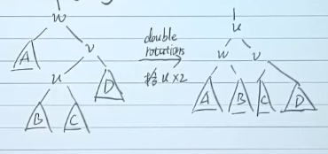
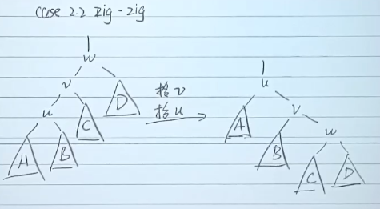
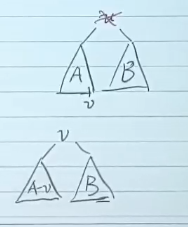

# Why Splay Tree?

Target :  Any M consecutive tree operations starting from an empty tree take at most $O(M log N)$ time.
Idea :  After a node is accessed, it is pushed to the root by a series of AVL tree rotations.

相比于AVL Tree：自适应性：频繁访问的节点会被快速移动到树的根部，从而加快后续访问速度。

{/* # Principles of the operations

- 搜索：使用普通二叉搜索树的方法找到结点，然后通过splay操作经过一系列旋转将搜索的结点移动到根结点的位置；
- 插入：使用普通二叉搜索树的方法找到要插入的位置进行插入，然后把刚刚插入的结点通过splay操作经过一系列旋转移动到根结点的位置；
- 删除：使用普通二叉搜索树的方法找到要删除的结点，然后通过splay操作经过一系列旋转将要删除的结点移动到根结点的位置，然后删除根结点（现在根结点就是要删除的点），然后和普通二叉搜索树的删除一样进行合理的merge即可。 */}

# Not use common rotations
非常naive的想法，就是不断地把访问的结点与其父结点更换父子关系，事实上就是不断用SingleRotation 翻到根结点的位置。然而这个例子告诉你，这么做之后虽然把要访问的结点放到了根结点，但其它有的结点被移动到了很深的位置

# Zig, Zag

The procedure of `splay(x)` is to move the node `x` to the root of the tree by a series of tree rotations. There are two types of rotations: `zig` and `zag`.
Step:
1. If `x` is the root, then return.
2. If `x` is the left child of its parent `p`, then perform a `zig` rotation on `p`.
3. If `x` is the right child of its parent `p`, then perform a `zag` rotation on `p`.
4. Repeat steps 1-3 until `x` becomes the root.

## Zig-Zag

## Zig-Zig

# Other Operations

## `find(x)`

1. Perform a standard BST search for the node with value `x`.
2. If the node is found, perform `splay(x)` to move it to the root.

## `insert(x)`
1. Perform a standard BST insertion for the node with value `x`.
2. Perform `splay(x)` to move the newly inserted node to the root.

## `delete(x)`
1. Perform `find(x)` to locate the node with value `x` (Now `x` is at the root).
2. If `x` has only one child, replace the root with that child.
3. If `x` has two children, find the maximum node in the left subtree (let's call it `y`), perform `splay(y)` to move it to the root of the left subtree, and then attach the right subtree of `x` as the right child of `y`.  

