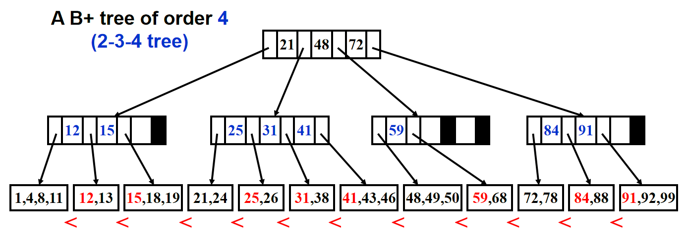

Visualization: https://www.cs.usfca.edu/~galles/visualization/BTree.html


# 单位时间？ Word RAM Model

1. Word - “便签的大小”

*   **定义**：Word是处理器一次能处理的基本数据单元，其大小（位数）为 $w$ bits。
*   **比喻**：假设你的便签本每一页的大小是固定的，比如是 $w$ 厘米宽。你只能在每一页上写东西，不能跨页写。
*   **严谨性**：这个 $w$ 并不是固定的，但我们通常假设它与问题规模 $n$ 相关，足够大以处理我们的数据。一个经典的假设是 $w = \Theta(\log n)$。这意味着我们的“便签”足够大，以至于能存下内存地址的索引（因为要索引 $n$ 个数据，你需要 $\log n$ 个比特）。
*   **重要性**：这个假设允许我们在 $O(1)$ 常数时间内完成对单个数据的算术运算（如加法、乘法）和逻辑运算。因为操作一个固定大小（尽管是 $\log n$ 大小）的“字”被认为是基本的、一步完成的操作。

2. Memory - “无限的带编号的格子”

*   **定义**：内存是一个由Word组成的、大小无限的数组。每个Word都有一个唯一的地址（从0到无穷大）。
*   **比喻**：回到那个无限桌面的比喻。桌面上有无数个格子，编号为0, 1, 2, 3...
*   **严谨性**：虽然无限，但我们只关心算法实际使用的部分。关键假设是**访问任何一个地址的内存，成本都是 $O(1)$**。这被称为“恒定时间访问模型”。

3. Processor / Operations - “你能做什么”

处理器可以执行一系列标准操作，每个操作都花费 **1个单位时间**。这些操作包括：

*   **算术运算**：对Word进行的加减乘除、比较等。
    *   `a + b`, `a * b`, `a / b`, `a < b`
*   **逻辑运算**：与、或、非、位移等。
    *   `a & b` (按位与), `a << 2` (左移两位)
*   **内存访问**：根据地址读写一个Word。
    *   `load M[addr]` (从地址 `addr` 读一个Word到处理器)
    *   `store M[addr], value` (将一个Word写入地址 `addr`)
*   **控制流**：条件分支、跳转等。
    *   `if (a == 0) goto label`

**关键点**：所有这些操作，只要操作数是存储在Word里的，就都花费 **常数时间 $O(1)$**。


# Or External Memory Model

External Memory Model（也称为I/O Model或Disk Access Model）由以下关键参数定义：

1. 存储层次结构

*   **内部内存**：大小有限的快速内存，可容纳 **M** 个数据项
*   **外部内存**：大小无限的慢速存储（如硬盘、SSD）
*   **数据块**：内外存之间以**固定大小的块**来传输数据，每个块包含 **B** 个数据项

2. 成本模型

*   **计算成本**：在内部内存中进行的操作（比较、算术等）被认为是"免费"的
*   **I/O成本**：每次在内部和外部内存之间传输**一个数据块**，计为 **1次I/O操作**

**关键洞察**：这个模型抓住了现代计算的核心瓶颈——**内存层次结构**带来的性能影响。

为什么需要这个模型？（与Word RAM的对比）

| 特性 | Word RAM Model (理想世界) | External Memory Model (现实世界) |
| :--- | :--- | :--- |
| **内存访问** | 所有访问成本相同 $O(1)$ | 内部访问"免费"，外部访问昂贵 |
| **数据局部性** | 不关心 | **极其重要**！连续访问比随机访问高效 |
| **分析焦点** | 操作步数 | **I/O次数** |
| **适用场景** | 小规模数据，数据全在内存 | 大数据集，数据主要在磁盘 |

# 经典的B-Tree引入：与BST对比，考虑硬盘的存在

B+ 树与之前学过的搜索树的目的不完全一致，事实上在数据库系统课程中会学到 B+ 树在数据库索
引中的应用。的确，B+ 树（或者 B 树族）自诞生之日起就注定是为数据库系统（或者文件系统）服务
的。对于在内存中暂时存储的数据，使用一般的平衡二叉搜索树即可达到目的。根据前面的分析，B+
树插入和查询的时间复杂度前面会带 M/ log M 的倍数，M 较大时这是一个比较大的常数，因此比二
叉树耗时多，并且逐层分裂更新结点也是非常复杂的操作，所以在数据量很小的时候，B+ 树看起来并
不是一个很好的选择。然而，当数据量非常大，不再存储在主存而是存储在机械硬盘时，情况恰好相反。
假设有 1000000 条数据存在硬盘中，这时需要存储在硬盘中的搜索树（因为显然这棵树也太大了，而且
这棵树也需要作为硬盘索引永久存储）。如果使用二叉树，则大约有 $\log_2 1000000$ 层，因此需要经过约 20 个结点才能逐步下推到叶子结点找到真正的数据。然而，记住这棵树在磁盘里，因此每次从一
个结点下降到其孩子时，磁盘都需要重新寻道、旋转，取出下孩子结点放在内存才能进行运算比较决定
下一个结点，这里的时间是非常长的，可以达到毫秒级别，比内存中需要的时间要高出 5 个甚至更多数
量级。所以现在时间瓶颈不在每一层的比较、重建的时间，因为这是在内存中的操作，相比于磁盘操作
完全可以忽略，现在的瓶颈在在磁盘上重新定位孩子结点，因此在这种情况下，最好的选择应该是让树
的高度越小越好，比如取 $M = 100$（真实的情况一般在 50-2000 之间），则大约需要 $\log_{100} 1000000 = 3$
次磁盘操作就可以了，因此比二叉树效率高很多。


# Properties of B-Trees

【Definition】A **B+ tree** of order *M* is a tree with the following structural properties:
- (1)  The root is either a leaf or has *between 2 and M children*.
- (2)  All nonleaf nodes (except the root) have *between $\lceil M/2 \rceil$ and $M$ children*.
- (3)  All leaves are at the *same depth*.
- Assume each nonroot leaf also has *between $\lceil M/2 \rceil$ and $M$ children*.

And a structural property of B-trees:
Any keys in leaves of $T_{i+1} \ge k_i$ 


# Operations on B-Trees

1. 搜索：根据 B+ 树定义，需要在非叶结点层逐层和存储的键值比较从而确定去哪一个孩子结点。因此时间复杂度有两个重要因素：一个是树的高度，另一个是每一层搜索需要的时间。树的高度非常好计算，最差的情况也是每个结点都存$\lceil M/2 \rceil$个结点，因此最大高度是 $O(\log_{\lceil M/2 \rceil} N)$ 的。然后每一层因为键值是排好序的，因此用二分查找找到要去哪个孩子结点，复杂度为 $O(\log_{2} M)$，综合可得搜索的时间复杂度为
    $$O(\log_{2} M \cdot \log_{\lceil M/2 \rceil} N) = O\left( (\log_{2} M/2 + 1) \cdot \frac{\log_{2} N}{\log_{2} M/2} \right) = O(\log N),$$
    注意推导中使用了换底公式。

2. 插入：PPT 上的伪代码已经十分清楚，就是找到插入的位置，然后插入看结点是否放得下，放不下就分裂，如果分裂后子结点个数也过多则继续向上一层分裂，直到根结点孩子爆满则将根结点分裂并生成新的根结点，当然还要注意即使不分裂也可能需要按 B+ 树定义更新上层结点。我们知道树有 $O(\log_{\lceil M/2\rceil} N)$ 层，每层操作最多是 $O(M)$ 的（如更新结点或者分裂，无非就是更改 $O(M)$ 个键值以及修改 $O(M)$ 个父子指针），因此整体时间复杂度为 $O(M\cdot\log_{\lceil M/2\rceil} N)=O\left(\frac{M}{\log M}\log N\right)$。

3. 删除：PPT 没有要求，但想法很简单，因为只需把插入时分裂结点改为合并键值或孩子数量少的结点，当然需要注意的是，为了确保合并后键值数量不会超过 $M$ 且减少合并次数，可以先看看兄弟结点是不是键值还很多，多的话拿一个过来即可，事实上整体时间复杂度和插入分析类似，也为 $O\left(\frac{M}{\log M}\log N\right)$。

```
Btree  Insert ( ElementType X,  Btree T ) 
{ 
	Search from root to leaf for X and find the proper leaf node;
	Insert X;
	while ( this node has M+1 keys ) {
    		split it into 2 nodes with (M+1)/2 and (M+1)/2  keys, respectively;
    		if (this node is the root)
        		create a new root with two children;
    		check its parent;
	}
} 
```


------

\* 部分内容来自yhwu_is's Teaching Notes: https://yhwu-is.github.io/Teach/tcs/ads/ads/