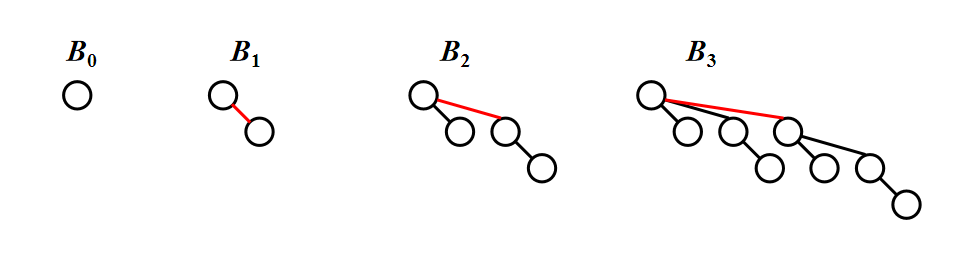

- **Structure:**
A binomial queue is not a heap-ordered tree, but rather a collection of heap-ordered trees, known as a forest. Each heap-ordered tree is a binomial tree.

A binomial tree of height 0 is a one-node tree.
A binomial tree, $B_k$, of height $k$ is formed by attaching a binomial tree, $B_{k-1}$, to the root of another binomial tree, $B_{k-1}$.

- **Observation:** $B_k$ consists of a root with $\underline{k}$ children, which are $\underline{B_0, B_1, \dots, B_{k-1}}$. $B_k$ has exactly $\underline{2^k}$ nodes. The number of nodes at depth $d$ is $\underline{\binom{k}{d}}$.

# 时间复杂度

- **FindMin**: The minimum key is in one of the roots.
There are at most $\lceil \log N \rceil$ roots, hence $T_p = \text{O}( \log N )$.

- Note: We can remember the minimum and update whenever it is changed. Then this operation will take $\text{O}(1)$.

- **Insert**: Create a new binomial queue with a single node and then merge it with the original queue.

    摊还运行时间为 $\text{O}(1)$，最坏运行时间为 $\text{O}(\log N)$.

- DeleteMin ( H ): 
    1. Find the tree with the minimum root.
    2. Remove this tree from H, leaving a binomial queue H'.
    3. Let H'' be the binomial queue formed by the subtrees of the removed tree.
    4. Return Merge( H', H'' ).

    最坏运行时间为 $\text{O}(\log N)$.

【Claim】A binomial queue of N elements can be built by N successive insertions in O(N) time.

$T_{worst} = O(\log N)$,  but $T_{amortized} = 2$
