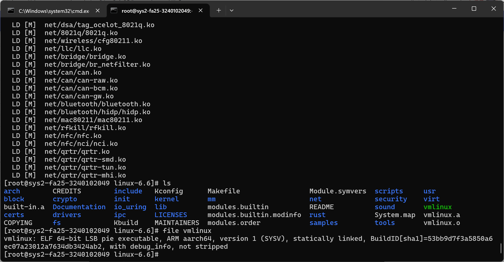

# 配置依赖环境

除了文档中提及的依赖项外，还需要安装以下软件包：

```bash
dnf install flex bison openssl-devel
```

# 配置 Linux ARM64 内核并编译


> - Linux 内核编译：编译完成后，请在终端依次执行以下命令并截图，截图内容需要包含 hostname（即 `root@sys2fa25-<学号>`）、一部分内核编译输出与以下命令的全部输出：
>     - `ls`：当前目录（`linux-6.6`）下应当包含 `vmlinux` 文件。
>     - `file vmlinux`：应当能观察到与示例类似的输出，示例见下。



# 使用 QEMU 运行编译的 ARM 内核

> - QEMU 内核仿真：成功进入 shell 后，请依次执行以下步骤：
>     - 执行 `echo <你的学号>`，应当能观察到 shell 中打印出了你的学号；
>     - 使用快捷键 `Ctrl A + X` 退出 QEMU；
>     - 截图，图中需要包含示例中从内核启动日志到 ECS hostname 的所有内容，部分启动日志可能有所不同。

