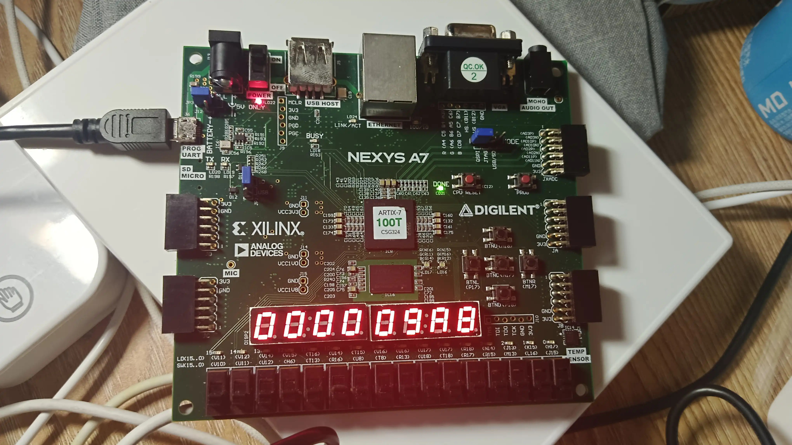

import Asciinema from '@md-components/AsciinemaWrapper.vue'

import { NImage } from 'naive-ui'

实验文档：https://zju-sys.pages.zjusct.io/sys2/sys2-fa25/lab2/

# 实验目的

- 理解数据竞争、控制竞争、结构竞争的原理和解决方法
- 完善流水线的基本功能，实现 Forwarding 机制
- 加入冲突检测模块和 stall 执行模块解决竞争问题
- 实现 AXI 总线接口的转换，学习 AXI 总线协议和真实的内存模型


# 实验过程

## forward实现

```verilog

    // Forwarding logic
    data_t EXE_forward_data;
    data_t MEM_forward_data;  
    data_t WB_forward_data;
    logic [1:0] forward_rs1, forward_rs2;
    data_t ID_real_reg_data_1, ID_real_reg_data_2;

    // Forwarding detection
    always_comb begin
        forward_rs1 = 2'b00;
        forward_rs2 = 2'b00;
        
        if (idexe_reg.valid && idexe_reg.we_reg && (idexe_reg.rd != 0) && (idexe_reg.rd == ID_rs1)) begin
            forward_rs1 = 2'b01;
        end else if (exemem_reg.valid && exemem_reg.we_reg && (exemem_reg.rd != 0) && (exemem_reg.rd == ID_rs1)) begin
            forward_rs1 = 2'b10;  
        end else if (memwb_reg.valid && memwb_reg.we_reg && (memwb_reg.rd != 0) && (memwb_reg.rd == ID_rs1)) begin
            forward_rs1 = 2'b11;
        end
        
        if (idexe_reg.valid && idexe_reg.we_reg && (idexe_reg.rd != 0) && (idexe_reg.rd == ID_rs2)) begin
            forward_rs2 = 2'b01;
        end else if (exemem_reg.valid && exemem_reg.we_reg && (exemem_reg.rd != 0) && (exemem_reg.rd == ID_rs2)) begin
            forward_rs2 = 2'b10;
        end else if (memwb_reg.valid && memwb_reg.we_reg && (memwb_reg.rd != 0) && (memwb_reg.rd == ID_rs2)) begin
            forward_rs2 = 2'b11;
        end
    end

    // Forwarding data sources
    always_comb begin
        EXE_forward_data = EXE_alu_res;
        MEM_forward_data = exemem_reg.alu_res;
        WB_forward_data = GLOBAL_wb_data;
    end

    // Apply forwarding
    always_comb begin
        case (forward_rs1)
            2'b01: ID_real_reg_data_1 = EXE_forward_data;
            2'b10: ID_real_reg_data_1 = MEM_forward_data;  
            2'b11: ID_real_reg_data_1 = WB_forward_data;
            default: ID_real_reg_data_1 = ID_reg_data_1;
        endcase
        
        case (forward_rs2)
            2'b01: ID_real_reg_data_2 = EXE_forward_data;
            2'b10: ID_real_reg_data_2 = MEM_forward_data;
            2'b11: ID_real_reg_data_2 = WB_forward_data;
            default: ID_real_reg_data_2 = ID_reg_data_2;
        endcase
    end
```

在顺序单发射处理器中，数据冒险只需要考虑 `RAW` 一种情况，本质上就是由读写同一个寄存器所导致的，所以数据冒险本身的检测只需对流水线中相应流水段中指令的寄存器编号进行比较，即可对数据冒险的发生进行判断。

在我们的实现中，`forward_rs1` 和 `forward_rs2` 分别表示源寄存器1和源寄存器2的前递选择信号。通过比较当前指令的源寄存器与流水线中各阶段指令的目的寄存器，确定是否需要进行前递以及前递的数据来源。

## AXI状态机实现

```verilog

    always_ff @(posedge clk) begin
        if (rst) current_state <= IDLE;
        else current_state <= next_state;
    end

    always_comb begin
        case (current_state)
            IDLE:  begin 
                if (idexe_reg.valid && (idexe_reg.re_mem || idexe_reg.we_mem))
                    next_state = WAITFOR1;
                else
                    next_state = IF1;
            end
            IF1: begin
                if (imem_ift.r_request_ready) begin
                    if (exemem_reg.valid && (exemem_reg.re_mem || exemem_reg.we_mem)) 
                        next_state = WAITFOR2;
                    else
                        next_state = IF2;
                end else begin
                    if (exemem_reg.valid && (exemem_reg.re_mem || exemem_reg.we_mem)) 
                        next_state = WAITFOR1;
                    else
                        next_state = IF1;
                end
            end
            IF2: begin
                if (imem_ift.r_reply_valid && imem_ift.r_reply_ready)
                    next_state = IDLE;
                else
                    next_state = IF2;
            end
            WAITFOR1: begin
                if (imem_ift.r_request_ready) 
                    next_state = WAITFOR2;
                else
                    next_state = WAITFOR1;
            end
            WAITFOR2: begin
                if (imem_ift.r_reply_valid && imem_ift.r_reply_ready) 
                    next_state = MEM1;
                else
                    next_state = WAITFOR2;
            end
            MEM1: begin
                if ((dmem_ift.r_request_ready && exemem_reg.re_mem) || 
                    (dmem_ift.w_request_ready && exemem_reg.we_mem))
                    next_state = MEM2;
                else
                    next_state = MEM1;
            end
            MEM2: begin
                if ((dmem_ift.r_reply_valid && dmem_ift.r_reply_ready && exemem_reg.re_mem) ||
                    (dmem_ift.w_reply_valid && dmem_ift.w_reply_ready && exemem_reg.we_mem))
                    next_state = IDLE;
                else
                    next_state = MEM2;
            end
            default: next_state = IDLE;
        endcase
    end
```

该状态机实现了对AXI总线的读写请求和响应的管理。通过不同的状态，确保在进行内存访问时，能够正确地发送请求并等待响应，从而实现对指令和数据的有效访问。

## 仿真&上板

*syn*

import Cast1 from "./syn.cast?url";

<Asciinema url={Cast1} />

*board_sim*

import Cast2 from "./board_sim.cast?url";

<Asciinema url={Cast2} />

*上板*




# 思考题

## 一些无法通过验收体现的问题和解决方法

代码的编写和调试过程相当顺利，具体的说，遇到的问题都比较简单，很容易debug和解决，没有出现那种*卡了很长时间*都无法仿真/上板的情况。

### `mem_stall`结束后，`pc`狂飙

```verilog
    always_ff @(posedge clk) begin
        if (rst) begin
            IF_pc <= 0;
            pc_plus_4 <= 0;
        end else if (~if_stall) begin
            if(FLUSH_TAG) begin
                IF_pc <= FLUSH_NPC;
                pc_plus_4 <= FLUSH_NPC + 4;
                FLUSH_TAG <= 1'b0;
            end else begin
                IF_pc <= pc_plus_4;
                pc_plus_4 <= pc_plus_4 + 4;
            end
        end
    end
```

因为`pc`的更新逻辑与IF阶段的其它逻辑分开，写到了另外一个`always_ff`块中，在实现`mem_stall`时，忘记考虑这个`always_ff`块了。导致在`mem_stall`期间，`pc`仍然在正常更新，等`mem_stall`结束后，`pc`直接增加了很多，导致取指地址错误。

```diff
    always_ff @(posedge clk) begin
        if (rst) begin
            IF_pc <= 0;
            pc_plus_4 <= 0;
-       end else if (~if_stall) begin
+       end else if (~if_stall && ~mem_stall) begin
            if(FLUSH_TAG) begin
                IF_pc <= FLUSH_NPC;
                pc_plus_4 <= FLUSH_NPC + 4;
                FLUSH_TAG <= 1'b0;
            end else begin
                IF_pc <= pc_plus_4;
                pc_plus_4 <= pc_plus_4 + 4;
            end
        end
    end
```


## `forward` 和 `stall` 的比较

> 分析 `forward` 和 `stall` 两种技术各自的优缺点，可以从 CPI、时钟频率、元器件开销等角度进行分析；10%


CPI角度：  
- forward通过将结果直接从执行单元传递给需要它的指令，能显著降低CPI。这是前递技术最核心的优势。通过旁路网络，计算结果可以直接从执行（EX）或访存（MEM）段传递到需要它的执行段，无需等待指令写回（WB）。对于大多数情况下，它可以完全消除因数据冒险引起的流水线停顿，使得在大多数情况下得以维持理想CPI。
- stall导致CPI显著增加。一旦检测到数据相关，无论相关程度如何，控制逻辑都会让流水线停顿一个或多个周期，直到数据被写入寄存器堆。这会引入大量的bubble，严重降低处理器的吞吐率。在只有停顿机制的简单流水线中，CPI会远大于1。

时钟频率角度：   
- forward需要在ALU的输入端增加大型的多路选择器（MUX），以选择来自寄存器堆或其它段的数据。这条新增的路径，可能会增加EXE这一关键步骤的耗时增加，那么整个CPU的时钟周期就必须按照这个更长的路径来设计，从而导致最高时钟频率的降低。
- stall对时钟频率影响较小。停顿机制主要通过控制逻辑来插入气泡，它不需要在数据通路上增加像前递那样复杂且要求高速的组合逻辑。数据通路保持相对简单，关键路径通常还是ALU计算本身，因此有可能达到更高的时钟频率。

元器件开销角度：  
- forward需要增加一个前递单元，具体的说需要增加大量的多路选择器和连接各流水段的数据通路。这个单元需要监测流水线中所有指令的源寄存器、目的寄存器信息，并根据冒险条件产生复杂的多路选择器控制信号。其判断逻辑远比停顿检测复杂。
- stall硬件开销小，设计简单。

## 竞争情况的分析

> 请你对数据竞争、控制竞争、结构竞争情况进行分析归纳，试着将他们分类列出，我们的 CPU 目前可能碰到哪些竞争？

1. **数据竞争（Data Hazard）**  
    - 当一条指令依赖于前面指令的执行结果，但这个结果尚未被写入或尚未可用，就发生了数据竞争。发生的原因是，后续指令在流水线中“追赶”上了前序指令，需要读取一个尚未被写入或更新完毕的数据。
    - 在顺序单发射处理器中，数据冒险只需要考虑 `RAW` 一种情况，本质上就是由读写同一个寄存器所导致的，所以数据冒险本身的检测只需对流水线中相应流水段中指令的寄存器编号进行比较，即可对数据冒险的发生进行判断。这是**我们的 CPU 目前可能碰到哪些竞争之一**，我们采用forward和stall技术解决这个竞争。
    - 除了`RAW`，还有`WAR`和`WAW`两种数据冒险类型：  
       - `WAR`（Write After Read）：当一条指令试图写入一个寄存器，而该寄存器尚未被前一条指令读取时发生。这种情况在顺序单发射处理器中较少见，因为指令通常按顺序执行，读取操作会在写入操作之前完成。
       - `WAW`（Write After Write）：当两条指令试图写入同一个寄存器，而后一条指令的写入操作在前一条指令的写入操作之前完成时发生。这种情况也较少见，通常出现在乱序执行或多发射处理器中。


2. **控制竞争（Control Hazardd）**
    - 流水线会假定没有跳转/分支，预取后续指令，但是由于分支、跳转等改变程序流向的指令，导致流水线已经预取并开始执行的后续指令（在分支目标地址确定之前）可能是无效的。
    - 分支指令的结果（是否跳转、跳转地址）在流水线中较晚的阶段（如EX或MEM）才能确定，但取指单元在IF阶段就需要知道下一条指令的地址。
    - 包含条件分支指令（如beq, bne）和无条件跳转指令（如jal, jalr）。
    - 这是**我们的 CPU 目前可能碰到哪些竞争之一**，我们采用flush技术解决这个竞争。

3. **结构竞争（Structural Hazard）**
    - 当两条或多条指令在同一个时钟周期内争抢同一个硬件资源时发生。硬件资源被设计为无法在同一周期内被流水线的多个阶段共享。
    - **分类**：
        - **存储器访问冲突**：如果指令和数据共享一个存储器，那么IF阶段的取指和MEM阶段的访存可能在同一周期发生冲突。只有这个类型是**我们的 CPU 目前可能碰到哪些竞争之一**，我们通过总线相关的状态机以及`mem_stall`解决这个竞争。
        - **寄存器堆端口冲突**：如果ID阶段需要同时读取两个寄存器，而WB阶段需要写入一个寄存器，但寄存器堆只支持两个读端口和一个写端口，这在设计上是允许的。但如果端口不足（例如，只有一个读端口），就会发生冲突。
        - **功能单元冲突**：例如，只有一个除法器，但多条指令同时需要做除法。


## 如果数据竞争和控制竞争同时发生……

> 如果数据竞争和控制竞争同时发生应该如何处理呢？

1. 优先处理分支指令的数据依赖：通过forward或stall来解决数据竞争，确保分支指令能够正确获取其操作数。
2. 随后处理控制竞争：一旦分支指令的结果确定，更新程序计数器（PC）并根据需要flush错误的指令。

## 总线的引入

> 过去的实验是不使用 `mem_ift` 总线或者 `axi` 总线的，通过这些实验对总线的实验，你认为总线的引入对实验开发、内存访问、外设管理、代码调试等带来了那些好处和坏处？

好处：  
- 在实验开发方面，总线提供了标准化的接口规范。这使得CPU核心、内存控制器以及各种外设之间的连接变得清晰和统一。在过去的实验中，我们需要为每一个模块设计特定的连接方式，而总线则定义了一套通用的“语言”。这种模块化的设计极大地提高了代码的可复用性，也使得团队协作开发变得更加容易，因为每个模块只需要关注如何与总线交互，而不需要了解其他模块的具体实现细节。
- 总线提供了更加真实的内存访问模型。在实际的计算机系统中，CPU并不是直接与内存交互，无法在一个周期内完成，而是通过总线进行通信。引入总线后，我们的实验环境更接近真实系统，这有助于我们理解现代计算机系统的工作原理。

坏处：
- 最主要的挑战在于复杂性的显著增加。理解和正确实现总线协议（包括握手信号、突发传输、各种响应状态等）需要投入大量的学习和调试时间。在调试时，由于总线引入了更多的信号和状态，定位问题变得更加困难。一个简单的错误可能会导致整个系统无法正常工作，而找到这个错误可能需要检查多个模块和它们之间的交互。

# 心得体会

通过这次实验，我深刻体会到了计算机体系结构中竞争处理和总线协议的重要性。竞争处理技术如forwarding和stalling，不仅提高了流水线的效率，还增强了我对指令执行顺序和数据依赖关系的理解。实现这些技术让我认识到，设计一个高效的处理器需要在性能和复杂性之间找到平衡。