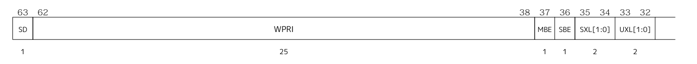
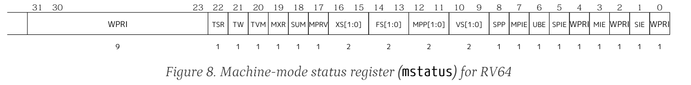

import Asciinema from '@md-components/AsciinemaWrapper.vue'

import { NImage } from 'naive-ui'

实验文档：https://zju-sys.pages.zjusct.io/sys2/sys2-fa25/lab4/

# 实验目的

* 学习 RISC-V 汇编， 编写 `head.S` 实现跳转到内核运行的第一个 C 函数。
* 学习 OpenSBI，理解 OpenSBI 在实验中所起到的作用，并调用 OpenSBI 提供的接口完成字符的输出。
* 学习 Makefile 相关知识，补充项目中的 Makefile 文件，来完成对整个工程的管理。
* 学习 docker 的基本命令与使用，来进行整个实验的测试


# 实验过程

## 请同学们比较其与 `#define max(a, b) ((a) > (b) ? (a) : (b))` 的区别

对于

```c
#define max(a, b)            \
  ({                         \
    __typeof__(a) __a = (a); \
    __typeof__(b) __b = (b); \
    __a > __b ? __a : __b;   \
  })

int c = max(x++, y++);
```

宏定义 `max` 在展开时会多次计算参数 `a` 和 `b`，因此如果传入的参数包含副作用（如 `x++`），`((a) > (b) ? (a) : (b))`会导致参数被多次求值，从而产生意外的结果；而使用 `__typeof__` 和临时变量的方式，可以确保每个参数只被计算一次，避免了副作用的问题。

## 完善 Makefile 脚本


> 参考工程文件中的其他 Makefile 文件，清除 `arch/riscv/kernel/Makefile` 中的 `error` 函数并完成正确的构造规则，使工程得以编译。
> 完成此步后在 `project/kernel` 下执行 `make`，可以看到不会再提示 Makefile 的错误，而是 C 或汇编代码中的 `#error` 错误。

```makefile
RISCV_PREFIX ?= riscv64-linux-gnu-
RISCV_GCC ?= $(RISCV_PREFIX)gcc
RISCV_GCC_OPTS ?= -march=rv64ia_zicsr_zifencei -mabi=lp64 -mcmodel=medany -fvisibility=hidden -fno-builtin -nostdlib -nostartfiles -DNOBRANCH
RISCV_OBJDUMP ?= $(RISCV_PREFIX)objdump -Mno-aliases -D
RISCV_OBJCOPY ?= $(RISCV_PREFIX)objcopy -O binary
RISCV_LD      ?= $(RISCV_PREFIX)ld

# 源文件
SRC_C = ./main.c ./print.c ./sbi.c
SRC_S = ./head.S 

# 头文件路径
INCLUDE_FLAG = -I ../../include -I ../include -I ./include -I ../../../include

# 目标文件
SRC_OBJ = $(patsubst %.c,%.o, $(SRC_C)) $(patsubst %.S,%.o, $(SRC_S))

# 输出文件
TARGET = vmlinux
TARGET_ELF := $(TARGET).elf
TARGET_ASM := $(TARGET).asm
TARGET_BIN := $(TARGET).bin

.PHONY: all clean

all: $(SRC_OBJ)

%.o: %.S
	$(RISCV_GCC) $(CFLAGS) $(INCLUDE_FLAG) -c $< -o $@

%.o: %.c
	$(RISCV_GCC) $(CFLAGS) $(INCLUDE_FLAG) -c $< -o $@

clean:
	rm -rf $(SRC_OBJ) $(TARGET_ELF) $(TARGET_ASM) $(TARGET_BIN) 2> /dev/null
```

## 编写 `head.S`


> 学习 RISC-V 的汇编，完成 `arch/riscv/kernel/head.S`。
> 我们首先为即将运行的第一个 C 函数设置程序栈（栈的大小可以设置为 4 KiB），并将该栈放置在程序的后面，也就是 `_ekernel` 以后的地址空间。
> 
> 下图是 `vmlinux.lds` 的链接示意图：
> 
> ``` 
> ┌──────────────┐◄─── _skernel, _start, 0x80200000
> │ .text        │
> ├──────────────┤
> │ .rodata      │
> ├──────────────┤
> │ .data        │
> ├──────────────┤
> │ .bss         │
> └──────────────┘◄─── _ekernel
> ```
> 
> 我们要做的是将 `sp` 指向 `_ekernel` 后 4 KiB 的位置，将其作为栈顶，防止在后续过程中修改 `.bss` 等数据段。
> 
> ``` 
> ┌──────────────┐◄─── _skernel, _start, 0x80200000
> │ .text        │
> ├──────────────┤
> │ .rodata      │
> ├──────────────┤
> │ .data        │
> ├──────────────┤
> │ .bss         │
> ├──────────────┤◄─── _ekernel
> │ 4 KiB stack  │
> └──────────────┘◄─── sp
> ```
> 
> 设置好 C 执行环境后，跳转至 `main.c` 中的 `start_kernel` 函数即可。


```asm
    .section .text.init
    .globl _start
_start:

    la   t0, _stack_top
    
    addi  sp, t0, 0
  
    j     start_kernel 
```

同时修改`vmlinux.lds`：

```diff
SECTIONS {
    /* . 代表当前地址 */
    . = BASE_ADDR;

    /* 记录 kernel 代码的起始地址 */
    _skernel = .;
+   _stack_top = . + 4K;

...
```


## 补充 `sbi.c`


> OpenSBI 运行在 M-mode，为 S-mode 提供了多种接口，比如调试输出。因此我们需要实现调用 OpenSBI 接口的功能。
> 
> ```c
> struct sbiret {
>   uint64_t error;
>   uint64_t value;
> };
> 
> struct sbiret sbi_ecall(uint64_t eid, uint64_t fid,
>                         uint64_t arg0, uint64_t arg1, uint64_t arg2,
>                         uint64_t arg3, uint64_t arg4, uint64_t arg5);
> ```
> 
> 请在 `arch/riscv/kernel/sbi.c` 中完成 `sbi_ecall` 的实现。
> 
> 1. 将 `eid`（Extension ID）放入寄存器 `a7` 中，`fid`（Function ID）放入寄存器 `a6` 中，将 `arg[0-5]` 放入寄存器 `a[0-5]` 中。
> 2. 使用 `ecall` 指令。执行 `ecall` 后系统会进入 M-mode，之后 OpenSBI 会完成相关操作。我们会在 lab5 中详细讲解这个过程。
> 3. OpenSBI 的返回结果会存放在寄存器 `a0`、`a1` 中，其中 `a0` 为 error code，`a1` 为返回值，我们用 `#!c struct sbiret` 来接受这两个返回值。


```c
struct sbiret sbi_ecall(uint64_t eid, uint64_t fid,
                        uint64_t arg0, uint64_t arg1, uint64_t arg2,
                        uint64_t arg3, uint64_t arg4, uint64_t arg5) {

     register uint64_t a0 asm("a0") = arg0;
     register uint64_t a1 asm("a1") = arg1;
     register uint64_t a2 asm("a2") = arg2;
     register uint64_t a3 asm("a3") = arg3;
     register uint64_t a4 asm("a4") = arg4;
     register uint64_t a5 asm("a5") = arg5;
     register uint64_t a6 asm("a6") = fid;
     register uint64_t a7 asm("a7") = eid;

     asm volatile("ecall"
                  : "+r"(a0), "+r"(a1)
                  : "r"(a2), "r"(a3), "r"(a4), "r"(a5), "r"(a6), "r"(a7)
                  : "memory");

     return (struct sbiret){ .error = a0, .value = a1 };

}
```

我们使用以下代码实现了：将 `eid`（Extension ID）放入寄存器 `a7` 中，`fid`（Function ID）放入寄存器 `a6` 中，将 `arg[0-5]` 放入寄存器 `a[0-5]` 中。

```c
     register uint64_t a0 asm("a0") = arg0;
     register uint64_t a1 asm("a1") = arg1;
     register uint64_t a2 asm("a2") = arg2;
     register uint64_t a3 asm("a3") = arg3;
     register uint64_t a4 asm("a4") = arg4;
     register uint64_t a5 asm("a5") = arg5;
     register uint64_t a6 asm("a6") = fid;
     register uint64_t a7 asm("a7") = eid;
```

使用以下代码实现了 `ecall` 指令的调用

```c
     asm volatile("ecall"
                  : "+r"(a0), "+r"(a1)
                  : "r"(a2), "r"(a3), "r"(a4), "r"(a5), "r"(a6), "r"(a7)
                  : "memory");
```


## `puts` 和 `puti`


> 调用以上完成的 `sbi_ecall`，在 `arch/riscv/kernel/print.c` 中实现 `puts` 和 `puti` 函数。函数的相关定义已经写在了 `print.h` 文件：
> 
> ```c title="arch/riscv/include/print.h" linenums="4"
> void puts(const char *s);  // 输出字符串 s
> void puti(int i);          // 输出整数 i
> ```


`puts`可以通过循环输出字符实现

```c
void puts(const char *s) {
    while (*s) {
        sbi_ecall(SBI_DEBUG_CONSOLE_EXTENSION_ID,SBI_CONSOLE_PUTCHAR, (uint64_t)(*s), 0, 0, 0, 0, 0);
        s++;
    }
}
```

`puti`也可以用类似的方法实现

```c
void puti(int i) {
    char buffer[20];
    int index = 0;
    if (i == 0) {
        sbi_ecall(SBI_DEBUG_CONSOLE_EXTENSION_ID,SBI_CONSOLE_PUTCHAR, (uint64_t)('0'), 0, 0, 0, 0, 0);
        return;
    }
    if (i < 0) {
        sbi_ecall(SBI_DEBUG_CONSOLE_EXTENSION_ID,SBI_CONSOLE_PUTCHAR, (uint64_t)('-'), 0, 0, 0, 0, 0);
        i = -i;
    }
    while (i > 0) {
        buffer[index++] = (char)('0' + (i % 10));
        i /= 10;
    }
    for (int j = index - 1; j >= 0; j--) {
        sbi_ecall(SBI_DEBUG_CONSOLE_EXTENSION_ID,SBI_CONSOLE_PUTCHAR, (uint64_t)(buffer[j]), 0, 0, 0, 0, 0);
    }
}
```

## 修改 `sbi.h`

> 学习了解了内联汇编的相关知识后，补充 `arch/riscv/include/sbi.h` 中的代码，完成 `csr_read` 宏定义。

```c
#define csr_read(csr)                                    \
  ({                                                     \
    uint64_t __v;                                        \
    asm volatile("csrr %0, " #csr : "=r"(__v));          \
    __v;                                                 \
  })

#define csr_write(csr, val)                                    \
  ({                                                           \
    uint64_t __v = (uint64_t)(val);                            \
    asm volatile("csrw " #csr ", %0" : : "r"(__v) : "memory"); \
  })
```

## 成功运行

> 运行 `make run` 即可执行，检查你的程序是否正确地打印出了欢迎信息 `2025 ZJU Computer System II` 并正常退出。

import cast130 from "./a33.cast?url";


<Asciinema url={cast130} />


## 遇到的问题

### `gnu/stubs-lp64.h` not exist


```plain
riscv64-linux-gnu-gcc -march=rv64i -mabi=lp64 -mcmodel=medany -fvisibility=hidden -nostdlib -nostartfiles -DNOBRANCH -I ../../include -I ../include -I ./include -c main.c -o main.o
In file included from /usr/riscv64-linux-gnu/include/features.h:547,
                 from /usr/riscv64-linux-gnu/include/bits/libc-header-start.h:33,
                 from /usr/riscv64-linux-gnu/include/stdint.h:26,
                 from /usr/lib/gcc-cross/riscv64-linux-gnu/15/include/stdint.h:11,
                 from ../include/sbi.h:4,
                 from main.c:2:
/usr/riscv64-linux-gnu/include/gnu/stubs.h:14:11: fatal error: gnu/stubs-lp64.h: No such file or directory
   14 | # include <gnu/stubs-lp64.h>
      |           ^~~~~~~~~~~~~~~~~~
compilation terminated.
```

在[Bug #2026829 “Missing file /usr/riscv64-linux-gnu/include/gnu/st...” : Bugs : cross-toolchain-base-ports package : Ubuntu](https://bugs.launchpad.net/ubuntu/+source/cross-toolchain-base-ports/+bug/2026829)找到了由人类给出的解决方案：

> stubs-lp64d.h as /usr/riscv64-linux-gnu/include/gnu/stubs-lp64.h does solve the compilation issues.
> 
> Right now, and for the past couple of years, people compiling EDK2 projects for RISC-V on Ubuntu (which includes anybody using GitHub Actions) will face an error unless they manually duplicate/symlink stubs-lp64d.h as stubs-lp64.h (See for instance the extra step needed in [(link)](https://github.com/pbatard/EfiFs/blob/d77c3ab5f4ad990d5a685f9f11c6d5fac54b5ed1/.github/workflows/linux_gcc_edk2.yml#L64-L66)), so I believe that the header should be added to the package installation regardless, especially as all it seems to do is provide empty stub definitions...

使用以下方式解决：

```shell
ln /usr/riscv64-linux-gnu/include/gnu/stubs-lp64d.h \
   /usr/riscv64-linux-gnu/include/gnu/stubs-lp64.h
```

### 经典链接不上

```
riscv64-linux-gnu-ld -T arch/riscv/kernel/vmlinux.lds arch/riscv/kernel/*.o lib/*.o -o vmlinux
riscv64-linux-gnu-ld: lib/div.o: can't link soft-float modules with double-float modules
riscv64-linux-gnu-ld: failed to merge target specific data of file lib/div.o
riscv64-linux-gnu-ld: lib/muldi3.o: can't link soft-float modules with double-float modules
riscv64-linux-gnu-ld: failed to merge target specific data of file lib/muldi3.o
```

在[sys2-fa24 #37](https://git.zju.edu.cn/zju-sys/sys2/sys2-fa24/-/issues/37)中找到了解决方案，不过可以再优化一下：

kernel的Makefile中已经导出了一个CFLAGS变量：

```Makefile
export CFLAGS := -march=$(ISA) -mabi=$(ABI) -mcmodel=medany \
	-ffreestanding -fno-builtin -ffunction-sections -fdata-sections \
	-nostartfiles -nostdlib -nostdinc -static -ggdb -Og \
	-Wall -Wextra -std=gnu11
```

在需要我们自己写的`/arch/riscv/kernel/Makefile`中，直接使用这个变量即可：

```Makefile
all: $(SRC_OBJ)

%.o: %.S
  $(RISCV_GCC) $(CFLAGS) $(INCLUDE_FLAG) -c $< -o $@

%.o: %.c
  $(RISCV_GCC) $(CFLAGS) $(INCLUDE_FLAG) -c $< -o $@
```

# 思考题

## vmlinux文件由哪些文件编译而成

> 1. 我们的vmlinux文件由哪些文件编译而成？

参见主Makefile中的编译指令：

```makefile
all:
  $(MAKE) -C lib all
  $(MAKE) -C arch/riscv all
  $(LD) -T arch/riscv/kernel/vmlinux.lds arch/riscv/kernel/*.o lib/*.o -o vmlinux
  mkdir -p arch/riscv/boot
  $(OBJCOPY) -O binary vmlinux arch/riscv/boot/Image
  $(OBJDUMP) -S vmlinux > vmlinux.asm
  $(NM) vmlinux > System.map
  # Build finished!
```

它首先`make -C lib all`，然后`make -C arch/riscv all`，最后将`arch/riscv/kernel/`目录下的所有`.o`文件和`lib/`目录下的所有`.o`文件链接生成最终的`vmlinux`文件。

再看`arch/riscv/Makefile`：

```makefile
OBJ := $(ASM_SRC:.S=.o)

all: $(OBJ)

%.o: %.S
  $(GCC) $(CPPFLAGS) $(CFLAGS) $(LDFLAGS) -c $<
```

也就是说，`arch/riscv/`目录下的所有汇编文件都会被编译成对应的`.o`文件。

再看`arch/riscv/kernel/Makefile`，这是我们自己写的，会把`arch/riscv/kernel/`目录下的所有`.c`和`.S`文件编译成对应的`.o`文件：

综合一下，`vmlinux`文件是由`lib/`目录下的所有源文件和`arch/riscv/kernel/`目录下的所有源文件编译生成的对象文件链接而成的。

```plain
.
├── arch
│   └── riscv
│       ├── include
│       │   ├── print.h
│       │   └── sbi.h
│       ├── kernel
│       │   ├── head.o
│       │   ├── head.S
│       │   ├── main.c
│       │   ├── main.o
│       │   ├── print.c
│       │   ├── print.o
│       │   ├── sbi.c
│       │   ├── sbi.o
│       │   └── vmlinux.lds
│       └── Makefile
├── include
│   ├── limits.h
│   ├── print.h
│   ├── riscv-asm.h
│   ├── sbi.h
│   └── stdint.h
├── lib
│   ├── div.o
│   ├── div.S
│   ├── Makefile
│   ├── muldi3.o
│   └── muldi3.S
├── Makefile
├── System.map
├── vmlinux
└── vmlinux.asm
```


## 反汇编 vmlinux 的发现

> 2. 使用 riscv64-linux-gnu-objdump 反汇编 vmlinux，你发现了什么？

1. 程序入口
  ```asm
  0000000080200000 <_skernel>:
      80200000:	00002297          	auipc	t0,0x2
      80200004:	0082b283          	ld	t0,8(t0) # 80202008 <_GLOBAL_OFFSET_TABLE_+0x8>
      80200008:	8116                	c.mv	sp,t0
      8020000a:	0260006f          	jal	zero,80200030 <start_kernel>
  ...
  0000000080200030 <start_kernel>:
    80200030:	1101                	c.addi	sp,-32
    80200032:	ec06                	c.sdsp	ra,24(sp)
    80200034:	e822                	c.sdsp	s0,16(sp)
    80200036:	1000                	c.addi4spn	s0,sp,32
    80200038:	7e900793          	addi	a5,zero,2025
    8020003c:	fef43423          	sd	a5,-24(s0)
    80200040:	fe843783          	ld	a5,-24(s0)
    80200044:	14079073          	csrrw	zero,sscratch,a5
    80200048:	140027f3          	csrrs	a5,sscratch,zero
    8020004c:	fef43023          	sd	a5,-32(s0)
    80200050:	fe043783          	ld	a5,-32(s0)
    80200054:	2781                	c.addiw	a5,0
    80200056:	853e                	c.mv	a0,a5
    80200058:	064000ef          	jal	ra,802000bc <puti>
    8020005c:	00001517          	auipc	a0,0x1
    80200060:	fa450513          	addi	a0,a0,-92 # 80201000 <_stack_top>
    80200064:	008000ef          	jal	ra,8020006c <iputs>
    80200068:	fa7ff0ef          	jal	ra,8020000e <ecall_test>
  ```
   - 入口点位于 `_skernel`（地址 `0x80200000`），它首先设置堆栈指针（从 `_GLOBAL_OFFSET_TABLE_+0x8` 加载地址），然后跳转到 `start_kernel` 函数。

2. 系统调用（SBI 调用）的使用
    ```
    0000000080200204 <sbi_ecall>:
        80200204:	7159                	c.addi16sp	sp,-112
        80200206:	f486                	c.sdsp	ra,104(sp)
        80200208:	f0a2                	c.sdsp	s0,96(sp)
        8020020a:	1880                	c.addi4spn	s0,sp,112
        8020020c:	fca43423          	sd	a0,-56(s0)
        80200210:	fcb43023          	sd	a1,-64(s0)
        80200214:	fac43c23          	sd	a2,-72(s0)
        80200218:	fad43823          	sd	a3,-80(s0)
        8020021c:	fae43423          	sd	a4,-88(s0)
        80200220:	faf43023          	sd	a5,-96(s0)
        80200224:	f9043c23          	sd	a6,-104(s0)
        80200228:	f9143823          	sd	a7,-112(s0)
        8020022c:	fb843503          	ld	a0,-72(s0)
        80200230:	fb043583          	ld	a1,-80(s0)
        80200234:	fa843603          	ld	a2,-88(s0)
        80200238:	fa043683          	ld	a3,-96(s0)
        8020023c:	f9843703          	ld	a4,-104(s0)
        80200240:	f9043783          	ld	a5,-112(s0)
        80200244:	fc043803          	ld	a6,-64(s0)
        80200248:	fc843883          	ld	a7,-56(s0)
        8020024c:	00000073          	ecall
        80200250:	872a                	c.mv	a4,a0
        80200252:	87ae                	c.mv	a5,a1
        80200254:	fee43023          	sd	a4,-32(s0)
        80200258:	fef43423          	sd	a5,-24(s0)
        8020025c:	fe043703          	ld	a4,-32(s0)
        80200260:	fe843783          	ld	a5,-24(s0)
        80200264:	833a                	c.mv	t1,a4
        80200266:	83be                	c.mv	t2,a5
        80200268:	871a                	c.mv	a4,t1
        8020026a:	879e                	c.mv	a5,t2
        8020026c:	853a                	c.mv	a0,a4
        8020026e:	85be                	c.mv	a1,a5
        80200270:	70a6                	c.ldsp	ra,104(sp)
        80200272:	7406                	c.ldsp	s0,96(sp)
        80200274:	6165                	c.addi16sp	sp,112
        80200276:	8082                	c.jr	ra
    ```
   - 函数 `sbi_ecall`（地址 `0x80200204`）是核心的系统调用接口，使用 `ecall` 指令触发 Supervisor Binary Interface (SBI) 调用。这表明程序运行在 RISC-V Supervisor 模式，并依赖 SBI 固件（如 OpenSBI）进行底层操作。

3. 字符串和数据
    ```asm
    Disassembly of section .rodata:

    0000000080201000 <_srodata>:
        80201000:	5a20                	c.lw	s0,112(a2)
        80201002:	554a                	c.lwsp	a0,176(sp)
        80201004:	4320                	c.lw	s0,64(a4)
        80201006:	75706d6f          	jal	s10,80207f5c <_ebss+0x4f5c>
        8020100a:	6574                	c.ld	a3,200(a0)
        8020100c:	2072                	c.fldsp	ft0,280(sp)
        8020100e:	74737953          	.insn	4, 0x74737953
        80201012:	6d65                	c.lui	s10,0x19
        80201014:	4920                	c.lw	s0,80(a0)
        80201016:	0049                	c.addi	zero,18
    ```
   - `.rodata` 节（地址 `0x80201000`）包含一个字符串：` ZJU Computer System II \0`。


## 编译的过程是什么

> 3. 编译的过程是什么？

```plain
make: Entering directory '/zju-os/code/src/project/kernel'
make -C lib all
make[1]: Entering directory '/zju-os/code/src/project/kernel/lib'
riscv64-linux-gnu-gcc -I/zju-os/code/src/project/kernel/include -march=rv64ia_zicsr_zifencei -mabi=lp64 -mcmodel=medany -ffreestanding -fno-builtin -ffunction-sections -fdata-sections -nostartfiles -nostdlib -nostdinc -static -ggdb -Og -Wall -Wextra -std=gnu11 -lgcc -Wl,--nmagic -Wl,--gc-sections -c div.S
riscv64-linux-gnu-gcc -I/zju-os/code/src/project/kernel/include -march=rv64ia_zicsr_zifencei -mabi=lp64 -mcmodel=medany -ffreestanding -fno-builtin -ffunction-sections -fdata-sections -nostartfiles -nostdlib -nostdinc -static -ggdb -Og -Wall -Wextra -std=gnu11 -lgcc -Wl,--nmagic -Wl,--gc-sections -c muldi3.S
make[1]: Leaving directory '/zju-os/code/src/project/kernel/lib'
make -C arch/riscv all
make[1]: Entering directory '/zju-os/code/src/project/kernel/arch/riscv'
make -C kernel all
make[2]: Entering directory '/zju-os/code/src/project/kernel/arch/riscv/kernel'
riscv64-linux-gnu-gcc -march=rv64ia_zicsr_zifencei -mabi=lp64 -mcmodel=medany -ffreestanding -fno-builtin -ffunction-sections -fdata-sections -nostartfiles -nostdlib -nostdinc -static -ggdb -Og -Wall -Wextra -std=gnu11 -I ../../include -I ../include -I ./include -I ../../../include -c main.c -o main.o
riscv64-linux-gnu-gcc -march=rv64ia_zicsr_zifencei -mabi=lp64 -mcmodel=medany -ffreestanding -fno-builtin -ffunction-sections -fdata-sections -nostartfiles -nostdlib -nostdinc -static -ggdb -Og -Wall -Wextra -std=gnu11 -I ../../include -I ../include -I ./include -I ../../../include -c print.c -o print.o
riscv64-linux-gnu-gcc -march=rv64ia_zicsr_zifencei -mabi=lp64 -mcmodel=medany -ffreestanding -fno-builtin -ffunction-sections -fdata-sections -nostartfiles -nostdlib -nostdinc -static -ggdb -Og -Wall -Wextra -std=gnu11 -I ../../include -I ../include -I ./include -I ../../../include -c sbi.c -o sbi.o
riscv64-linux-gnu-gcc -march=rv64ia_zicsr_zifencei -mabi=lp64 -mcmodel=medany -ffreestanding -fno-builtin -ffunction-sections -fdata-sections -nostartfiles -nostdlib -nostdinc -static -ggdb -Og -Wall -Wextra -std=gnu11 -I ../../include -I ../include -I ./include -I ../../../include -c head.S -o head.o
make[2]: Leaving directory '/zju-os/code/src/project/kernel/arch/riscv/kernel'
make[1]: Leaving directory '/zju-os/code/src/project/kernel/arch/riscv'
riscv64-linux-gnu-ld -T arch/riscv/kernel/vmlinux.lds arch/riscv/kernel/*.o lib/*.o -o vmlinux
mkdir -p arch/riscv/boot
riscv64-linux-gnu-objcopy -O binary vmlinux arch/riscv/boot/Image
riscv64-linux-gnu-objdump -S vmlinux > vmlinux.asm
riscv64-linux-gnu-nm vmlinux > System.map
# Build finished!
```

## 自定义符号的地址符合预期

> 4. 编译之后，通过 `System.map` 查看 `vmlinux.lds` 中自定义符号的值，比较它们的地址是否符合你的预期。

```plain
0000000080200000 A BASE_ADDR
0000000080200254 T __divdi3
000000008020024c T __divsi3
0000000080203000 D _ebss
0000000080200010 t ecall_test
0000000080202000 D _edata
0000000080203000 D _ekernel
000000008020101a R _erodata
0000000080200338 T _etext
0000000080202000 d _GLOBAL_OFFSET_TABLE_
000000008020025c T __hidden___udivdi3
00000000802002d8 T __moddi3
00000000802002d8 T __modsi3
0000000080200314 T __muldi3
00000000802000c0 T puti
000000008020006c T puts
00000000802001d4 T sbi_ecall
0000000080203000 D _sbss
0000000080202000 D _sdata
0000000080200000 T _skernel
0000000080201000 R _srodata
0000000080201000 T _stack_top
0000000080200000 T _start
0000000080200040 T start_kernel
0000000080200000 T _stext
000000008020025c T __udivdi3
0000000080200214 T __udivsi3
00000000802002a4 T __umoddi3
000000008020022c T __umodsi3
```

预期包括但不限于：

- `_start` 应位于 `0x80200000`。
- `_skernel`和`_stext` 应等于 `_start`，因为它们都指向内核的起始位置。
- `_stack_top` 应位于 `0x80201000`，表示栈的顶部位置。

均符合预期。


## 程序开始执行时的特权态和中断的开启情况

> 5. 在你的第一条指令处添加断点，观察你的程序开始执行时的特权态是多少，中断的开启情况是怎么样的？
>     - **提示**：可以尝试在第一条指令处插入一些特权操作，如 `csrr a0, mstatus`，观察调试现象，进行当前特权态的判断。

使用`b _skernel`添加断点，然后使用`continue`继续执行

使用以下指令查看以下寄存器的值：

```
# 查看当前特权态
(gdb) print $mstatus

# 查看中断状态
(gdb) print $mie
(gdb) print $mip
```

输出为：

```
(gdb) i r mstatus
mstatus        0x8000000a00006080       SD:1 VM:00 MXR:0 PUM:0 MPRV:0 XS:0 FS:3 MPP:0 HPP:0 SPP:0 MPIE:1 HPIE:0 SPIE:0 UPIE:0 MIE:0 HIE:0 SIE:0 UIE:0
```






1. 特权态
    *   当前处于Machine Mode (M 态 / 机器态)，因为我们正在查看 `mstatus` 寄存器。
    *   不过，寄存器中的 `MPP` (Machine Previous Privilege) 字段为 `0`，说明在进入当前 M 态之前，处理器是在 **User Mode (U 态)** 运行的。

2. 中断开启情况
    *   当前状态：中断已关闭 (Disabled)，因为`MIE` (Machine Interrupt Enable, bit 3) 的值为 `0`。
    *   此前状态：中断曾是开启的 (Previously Enabled)，因为`MPIE` (Machine Previous Interrupt Enable, bit 7) 的值为 `1`。

import cast8 from './a7.cast?url';

<Asciinema url={cast8} />

## 内存中 .text、.data、.bss 段的内容

> 在你的第一条指令处添加断点，观察内存中 .text、.data、.bss 段的内容是怎样的？

内存中 `.text` 段的内容：
```
(gdb)  x/10i _stext
=> 0x80200000 <_stext>: auipc   t0,0x2
   0x80200004 <_stext+4>:       ld      t0,16(t0)
   0x80200008 <_stext+8>:       mv      sp,t0
   0x8020000c <_stext+12>:      li      a0,465
   0x80200010 <_stext+16>:      auipc   a1,0x2
   0x80200014 <_stext+20>:      ld      a1,-8(a1)
   0x80200018 <_stext+24>:      lui     a2,0x38
   0x8020001c <_stext+28>:      addiw   a2,a2,-1353
   0x80200020 <_stext+32>:      slli    a2,a2,0xe
   0x80200024 <_stext+36>:      addi    a2,a2,-273
```

内存中 `.data` 段的内容：
```
(gdb) x/10x &_sdata
0x80202000:     0x00000000      0x00000000      0x80201000      0x00000000
0x80202010:     0x80201000      0x00000000      0xffffffff      0xffffffff
0x80202020:     0x00000000      0x00000000
```

内存中 `.bss` 段的内容：
```
(gdb) x/10x &_sbss
0x80203000:     0x00000000      0x00000000      0x00000000      0x00000000
0x80203010:     0x00000000      0x00000000      0x00000000      0x00000000
0x80203020:     0x00000000      0x00000000
```


import cast2 from './a90.cast?url';

<Asciinema url={cast2} />


## 将参数放置在寄存器中

> 7. 观察 `vmlinux.asm` 中 `sbi_ecall` 编译得到的汇编代码。这段代码是如何实现正确地将参数 `arg[0-5]` 放置在寄存器 `a[0-5]` 中的？
>     同时本题也是一个提示：如果你的程序没有输出正确的字符，有可能是 `sbi_ecall` 的参数没有正确传递。

```c
struct sbiret sbi_ecall(uint64_t eid, uint64_t fid,
                        uint64_t arg0, uint64_t arg1, uint64_t arg2,
                        uint64_t arg3, uint64_t arg4, uint64_t arg5) {

     register uint64_t a0 asm("a0") = arg0;
     register uint64_t a1 asm("a1") = arg1;
     register uint64_t a2 asm("a2") = arg2;
     register uint64_t a3 asm("a3") = arg3;
     register uint64_t a4 asm("a4") = arg4;
     register uint64_t a5 asm("a5") = arg5;
     register uint64_t a6 asm("a6") = fid;
     register uint64_t a7 asm("a7") = eid;

     asm volatile("ecall"
                  : "+r"(a0), "+r"(a1)
                  : "r"(a2), "r"(a3), "r"(a4), "r"(a5), "r"(a6), "r"(a7)
                  : "memory");

     return (struct sbiret){ .error = a0, .value = a1 };

}
```

编译为

```asm
0000000080200204 <sbi_ecall>:
    80200204:	7159                	c.addi16sp	sp,-112
    80200206:	f486                	c.sdsp	ra,104(sp)
    80200208:	f0a2                	c.sdsp	s0,96(sp)
    8020020a:	1880                	c.addi4spn	s0,sp,112
    8020020c:	fca43423          	sd	a0,-56(s0)
    80200210:	fcb43023          	sd	a1,-64(s0)
    80200214:	fac43c23          	sd	a2,-72(s0)
    80200218:	fad43823          	sd	a3,-80(s0)
    8020021c:	fae43423          	sd	a4,-88(s0)
    80200220:	faf43023          	sd	a5,-96(s0)
    80200224:	f9043c23          	sd	a6,-104(s0)
    80200228:	f9143823          	sd	a7,-112(s0)
    8020022c:	fb843503          	ld	a0,-72(s0)
    80200230:	fb043583          	ld	a1,-80(s0)
    80200234:	fa843603          	ld	a2,-88(s0)
    80200238:	fa043683          	ld	a3,-96(s0)
    8020023c:	f9843703          	ld	a4,-104(s0)
    80200240:	f9043783          	ld	a5,-112(s0)
    80200244:	fc043803          	ld	a6,-64(s0)
    80200248:	fc843883          	ld	a7,-56(s0)
    8020024c:	00000073          	ecall
    80200250:	872a                	c.mv	a4,a0
    80200252:	87ae                	c.mv	a5,a1
    80200254:	fee43023          	sd	a4,-32(s0)
    80200258:	fef43423          	sd	a5,-24(s0)
    8020025c:	fe043703          	ld	a4,-32(s0)
    80200260:	fe843783          	ld	a5,-24(s0)
    80200264:	833a                	c.mv	t1,a4
    80200266:	83be                	c.mv	t2,a5
    80200268:	871a                	c.mv	a4,t1
    8020026a:	879e                	c.mv	a5,t2
    8020026c:	853a                	c.mv	a0,a4
    8020026e:	85be                	c.mv	a1,a5
    80200270:	70a6                	c.ldsp	ra,104(sp)
    80200272:	7406                	c.ldsp	s0,96(sp)
    80200274:	6165                	c.addi16sp	sp,112
    80200276:	8082                	c.jr	ra
```

可以看出，函数 `sbi_ecall` 通过将传入的参数依次存储到栈上，然后再从栈上加载到对应的寄存器 `a0` 到 `a7` 中，确保了参数的正确传递。具体步骤如下：
1. 函数开始时，调整栈指针并保存返回地址和临时寄存器 `s0`。
2. 将传入的参数 `arg0` 到 `arg5` 以及 `fid` 和 `eid` 分别存储到栈上的不同偏移位置。
3. 然后从栈上加载这些参数到寄存器 `a0` 到 `a7` 中。
4. 最后执行 `ecall` 指令发起系统调用。


## 从汇编传递参数

> 8. 尝试从汇编代码中给 C 函数 `start_kernel` 传递参数。

修改汇编如下：

```diff
    .section .text.init
    .globl _start
_start:
    # 0. 设置 sp 为 _ekernel 之后 4 KiB 的位置

    # 1. 跳转到 start_kernel
    # auipc t0, %pcrel_hi(_ekernel + 4096)
    # addi  t0, t0, %pcrel_lo(_ekernel + 4096)
    la   t0, _stack_top
    addi  sp, t0, 0
    

+   li   a0, 0721         # 参数1
+   la   a1, hello_str    # 参数2
+   li   a2, 0xdeadbeef   # 参数3
    j     start_kernel 
+  .section .rodata
+hello_str:
+   .string "Hello arg from assembly!"
```

修改C代码如下：

```diff
#include <print.h>
#include <sbi.h>

_Noreturn static void ecall_test(void) __attribute__((noinline));
_Noreturn static void ecall_test(void) {
  sbi_ecall(0x53525354, 0, 0, 0, 0, 0, 0, 0);
  __builtin_unreachable();
}

-_Noreturn void start_kernel(void) {
+_Noreturn void start_kernel(int arg1, const char* arg2, unsigned int arg3) {
   csr_write(sscratch, 0x7e9);
-  puti(csr_read(sscratch));
  
+  puti(arg1);
+  puts(" - first argument\n");
+  
+  puts(arg2);
+  puts(" - second argument\n");
+  
+  puti(arg3);
+  puts(" - third argument\n");
  
   puts(" ZJU Computer System II \n");

   ecall_test();
}
```

运行发现传参成功。

import cast1 from './a1.cast?url';

<Asciinema url={cast1} />


## 内核运行在自立环境

> 9. 了解 C 语言中“有宿主环境”（hosted）和“自立环境”（freestanding）的概念，我们的内核运行在哪种环境下？

1. 宿主环境（Hosted Environment）
   - 提供完整的 C 标准库支持
   - 有操作系统管理程序执行
   - 程序入口点为 `main()` 函数
   - 适用于应用程序开发

2. 自立环境（Freestanding Environment）
   - **不提供完整的标准库**
   - **没有操作系统支持**
   - **程序入口点由实现定义**（不是 `main()`）
   - 适用于内核、嵌入式系统、引导程序等


**我们的内核运行在自立环境（freestanding）下**，原因：

1. 没有操作系统：内核本身就是最底层的软件
2. 自定义入口点：是我们自己写的`_skernel`，而不是标准的`main()`
3. 有限的库支持：需要自己实现内存管理、字符串操作等函数
4. 直接硬件访问：需要直接操作 CPU 寄存器、内存映射等


> 10. 解释为什么RV64中没有idiv指令，但是在我们的c代码中可以使用`/`和`%`

## 为什么RV64中没有idiv指令……

RISC-V架构设计中没有包含整数除法指令（如`idiv`），主要是出于以下几个原因：
1. 简化指令集：RISC-V遵循精简指令集计算机（RISC）的设计理念，减少复杂指令以简化硬件实现和提高性能。
2. 性能考虑：整数除法通常比其他基本算术操作（如加法、减法、乘法）更耗时。通过将除法操作留给软件实现，可以让硬件保持简单和高效。
3. 灵活性：软件实现的除法算法可以根据具体需求进行优化，例如针对特定应用场景选择不同的算法。

## ……但是在我们的C代码中可以使用 `/` 和 `%`

虽然RISC-V架构中没有直接的整数除法指令，但C语言编译器（如GCC）会将除法操作符`/`和取模操作符`%`转换为调用相应的库函数来实现整数除法。这些库函数通常位于编译器的运行时库中，例如GCC的libgcc。

但是啊，我们在编译时使用了`-nostdlib`选项，表示不链接标准库，因此需要我们自己提供这些除法函数的实现。在本实验中，我们在`lib/`目录下实现了`div.S`和`muldi3.S`等文件，提供了整数除法和乘法的功能。

p.s. 实际上就是[去libgcc源码里抄的](https://gcc.gnu.org/git/?p=gcc.git;a=blob;f=libgcc/config/riscv/div.S;h=dfcd551e3f433031e10eba6da87333686b50d1f0;hb=HEAD)。早知道上个实验conv.c也直接抄过来了。

## 系统调用表

> 11. 寻找 Linux v6.0 中 ARM32 RV32 RV64 x86_64 架构的系统调用表。
>     - 请列出源代码文件，展示完整的系统调用表（宏展开后），每一步都需要截图。

### x86_64

File: [`root/arch/x86/entry/syscalls/syscall_64.tbl`](https://git.kernel.org/pub/scm/linux/kernel/git/torvalds/linux.git/tree/arch/x86/entry/syscalls/syscall_64.tbl?h=v6.0)

见【附件1: `code-attatch:arch/x86/entry/syscalls/syscall_64.tbl`】


### ARM32

File: [`root/arch/arm/tools/syscall.tbl`](https://git.kernel.org/pub/scm/linux/kernel/git/torvalds/linux.git/tree/arch/arm/tools/syscall.tbl?h=v6.0)

见【附件2: `code-attatch:arch/arm/tools/syscall.tbl`】

### RV32 & RV64

在 Linux v6.0 中，RISC-V 架构**没有**自己的 `.tbl` 文件。它使用 Linux 的通用系统调用定义（asm-generic）。RV32 和 RV64 共享大部分定义，主要区别在于字长（BITS_PER_LONG）导致的一些特定调用（如 `fstat` vs `fstat64`）。

RISC-V 的系统调用表实际上是在编译时通过 C 语言宏展开生成的。

File: [`arch/riscv/kernel/syscall_table.c`](https://git.kernel.org/pub/scm/linux/kernel/git/torvalds/linux.git/tree/arch/riscv/kernel/syscall_table.c?h=v6.0)

```c
// SPDX-License-Identifier: GPL-2.0-only
/*
 * Copyright (C) 2009 Arnd Bergmann <arnd@arndb.de>
 * Copyright (C) 2012 Regents of the University of California
 */

#include <linux/linkage.h>
#include <linux/syscalls.h>
#include <asm-generic/syscalls.h>
#include <asm/syscall.h>

#define __SYSCALL_WITH_COMPAT(nr, native, compat) __SYSCALL(nr, native)

#undef __SYSCALL
#define __SYSCALL(nr, call)     asmlinkage long __riscv_##call(const struct pt_regs *);
#include <asm/syscall_table.h>

#undef __SYSCALL
#define __SYSCALL(nr, call)     [nr] = __riscv_##call,

void * const sys_call_table[__NR_syscalls] = {
        [0 ... __NR_syscalls - 1] = __riscv_sys_ni_syscall,
#include <asm/syscall_table.h>
};
```

所以我们需要查看这几个header文件来了解系统调用的定义：

然后我们惊讶的发现它引用的`syscall_table_64.h`文件不存在。

尝试运行下列命令来生成系统调用表：（过程日志见【附件3: `code-attatch:stdout:20251128-01`】）

```shell
make ARCH=riscv CROSS_COMPILE=riscv64-linux-gnu- defconfig
make ARCH=riscv CROSS_COMPILE=riscv64-linux-gnu-  arch/riscv/kernel/syscall_table.i 
```

在过程中发现

```shell
# SYSHDR  arch/riscv/include/generated/uapi/asm/unistd_32.h
  sh ./scripts/syscallhdr.sh --emit-nr  --abis common,32,riscv,memfd_secret scripts/syscall.tbl arch/riscv/include/generated/uapi/asm/unistd_32.h
# SYSHDR  arch/riscv/include/generated/uapi/asm/unistd_64.h
  sh ./scripts/syscallhdr.sh --emit-nr  --abis common,64,riscv,rlimit,memfd_secret scripts/syscall.tbl arch/riscv/include/generated/uapi/asm/unistd_64.h
make -f ./scripts/Makefile.asm-headers obj=arch/riscv/include/generated/asm \
generic=include/asm-generic
# SYSTBL  arch/riscv/include/generated/asm/syscall_table_32.h
  sh ./scripts/syscalltbl.sh  --abis common,32,riscv,memfd_secret scripts/syscall.tbl arch/riscv/include/generated/asm/syscall_table_32.h
# SYSTBL  arch/riscv/include/generated/asm/syscall_table_64.h
  sh ./scripts/syscalltbl.sh  --abis common,64,riscv,rlimit,memfd_secret scripts/syscall.tbl arch/riscv/include/generated/asm/syscall_table_64.h
```

给出了系统调用表的生成方式.

从中可以看出其根源在`./scripts/syscall.tbl`文件【附件9: `code-attatch:scripts/syscall.tbl`】。

import cast10 from './a102.cast?url';

<Asciinema url={cast10} />

输出的系统调用表参见
【附件7: `code-attatch:arch/riscv/include/generated/asm/syscall_table_32.h`】
【附件8: `code-attatch:arch/riscv/include/generated/asm/syscall_table_64.h`】

宏展开后的系统调用表参见
【附件4:  `code-attatch:arch/riscv/kernel/syscall_table.i`】
【附件10: `code-attatch:arch/riscv/kernel/syscall_table_32.i`】

# 心得体会


在本次实验中，我从头实现了 RV64 内核引导：编写了 head.S 设置栈并跳转到 start_kernel（并实现了从汇编向 C 传参），完善并修复了 Makefile 以正确编译生成 vmlinux 并在 vmlinux.lds 中放置 stack_top；实现了 sbi_ecall（将参数放入 a0–a7 并执行 ecall）的内联汇编封装，基于此实现 puts 与 puti 输出函数，并补充了 sbi.h 中的 csr_read/csr_write 宏；通过反汇编、GDB 调试验证了.text/.data/.bss 布局、参数传递和特权态行为；解决了交叉工具链缺失 gnu/stubs-lp64.h 与软/硬浮点链接冲突等问题，最终在仿真中成功打印“2025 ZJU Computer System II”并正常退出。

通过本次实验，我深入理解了 RISC-V 架构的引导过程、特权态切换和系统调用机制。编写汇编代码设置栈指针并跳转到 C 入口函数，让我体会到从裸机启动到内核初始化的细节。实现 sbi_ecall 并封装为 C 函数，增强了我对寄存器参数传递和内联汇编的掌握。