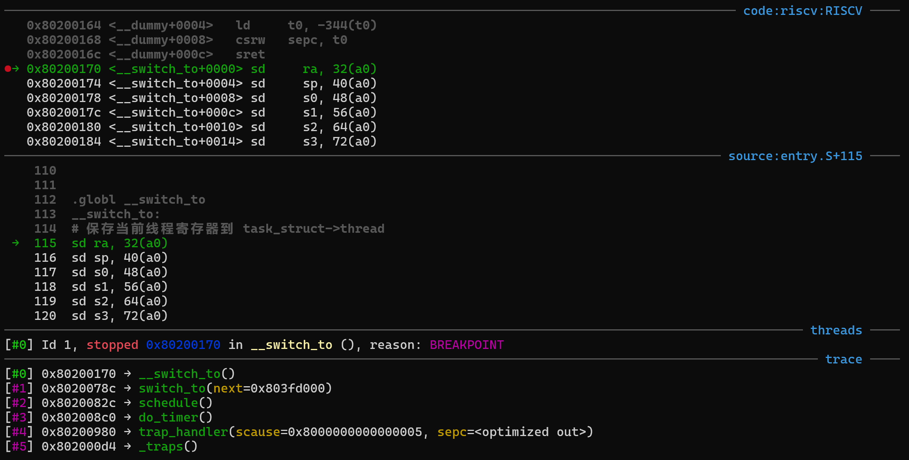
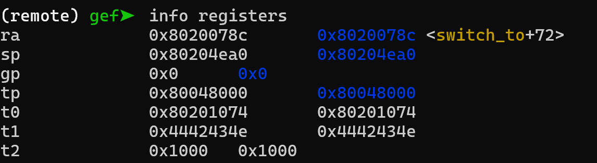
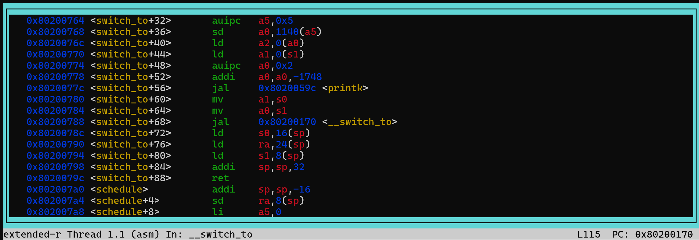

import Asciinema from '@md-components/AsciinemaWrapper.vue'

import { NImage } from 'naive-ui'

实验文档：https://zju-sys.pages.zjusct.io/sys2/sys2-fa25/lab6/


# 实验目的

* 了解线程概念，并学习线程相关结构体，并实现线程的初始化功能
* 了解如何使用时钟中断来实现线程的调度
* 了解线程切换原理，并实现线程的切换
* 掌握简单的线程调度算法，并完成简单调度算法的实现


# 实验过程

## 初始化线程


> - 在 `proc.c` 的适当位置实现 `task_init` 函数：
>     ```c 
>     void task_init(void) {
>       srand(2025);
> 
>       // 1. 调用 alloc_page() 为 idle 分配一个物理页
>       // 2. 初始化 idle 线程：
>       //   - state 为5 TASK_RUNNING
>       //   - pid 为 0
>       //   - 由于其不参与调度，可以将 priority 和 counter 设为 0
>       // 3. 将 current 和 task[0] 指向 idle
>     #error Not yet implemented
> 
>       // 4. 初始化 task[1..NR_TASKS - 1]：
>       //    - 分配一个物理页
>       //    - state 为 TASK_RUNNING
>       //    - pid 为对应线程在 task 数组中的索引
>       //    - priority 为 rand() 产生的随机数，
>       //         控制范围在 [PRIORITY_MIN, PRIORITY_MAX]
>       //    - counter 为 0
>       //    - 设置 thread_struct 中的 ra 和 sp：
>       //      - ra 设置为 __dummy 的地址（见 4.3.2 节）
>       //      - sp 设置为该线程申请的物理页的高地址
>     #error Not yet implemented
> 
>       printk("...task_init done!\n");
>     }
>     ```


实现如下：

```c
void task_init(void) {
    srand(2025);

    /* 1-3: init idle (task[0]) */
    void *pg = alloc_page();
    idle = (struct task_struct *)pg;
    idle->state = TASK_RUNNING;
    idle->pid = 0;
    idle->priority = 0;
    idle->counter = 0;
    task[0] = idle;
    current = idle;

    /* 4: init other tasks */
    for (int i = 1; i < NR_TASKS; ++i) {
        void *p = alloc_page();
        task[i] = (struct task_struct *)p;
        task[i]->state = TASK_RUNNING;
        task[i]->pid = i;
        task[i]->priority = PRIORITY_MIN + 
            (rand() % (PRIORITY_MAX - PRIORITY_MIN + 1));
        task[i]->counter = 0;
        task[i]->thread.ra = (unsigned long)__dummy;
        task[i]->thread.sp = (unsigned long)p + PGSIZE;
    }

    printk("...task_init done!\n");
}
```

## 实现 `__dummy` 函数

> 当线程在运行时，由于时钟中断的触发，会将当前运行线程的上下文环境保存在栈上（lab5 中实现的 `_traps`）。当线程再次被调度时，会将上下文从栈上恢复，但是当我们创建一个新的线程，此时线程的栈为空，当这个线程被调度时，是没有上下文需要被恢复的，所以我们需要为线程**第一次调度**提供一个特殊的返回函数 `__dummy`。请在 `entry.S` 的适当位置实现 `__dummy` 函数：
> 
> - 在`__dummy` 中将 `sepc` 设置为 `dummy_task` 的地址，并使用 `sret` 从中断中返回。
> - `__dummy` 与 `_traps`的 restore 部分相比，其实就是省略了从栈上恢复上下文的过程，只设置了 `sepc`。
> 
>     ```asm 
>         .globl __dummy
>     __dummy:
>     #error Not yet implemented
>         sret
>     ```

实现如下：

```asm
    .globl __dummy
__dummy:
la t0, dummy_task
csrw sepc, t0
    sret
```

## 实现线程切换


> - 在 `proc.c` 的适当位置线程切换函数 `switch_to`：判断下一个执行的线程 `next` 与当前的线程 `current` 是否为同一个线程，如果是同一个线程，则无需做任何处理，否则调用 `__switch_to` 进行线程切换。
>     ```c 
>     void switch_to(struct task_struct *next) {
>     #error Not yet implemented
>     }
>     ```

实现如下：

```c
void switch_to(struct task_struct *next) {
    struct task_struct *prev = current;
    if (prev == next) {
        return;
    }
    current = next;
    printk("[Switch] From PID = %" PRIu64 
           " to PID = %" PRIu64 "\n", prev->pid, next->pid);
    __switch_to(prev, next);
}
```


> - 在 `entry.S` 的适当位置线程实现上下文处理函数 `__switch_to`：
>     - 其接受两个 `task_struct` 指针作为参数
>     - 保存当前线程的 `ra`、`sp`、`s[0-11]` 到当前线程的 `thread_struct` 中
>     - 将下一个线程的 `thread_struct` 中的相关数据载入到 `ra`、`sp`、`s[0-11]` 中
> 
>     ```asm title="arch/riscv/kernel/entry.S" linenums="0"
>         .globl __switch_to
>     __switch_to:
>         # 1. 将当前线程的上下文保存到当前线程的 thread_struct 中
> 
>         # 2. 从下一个线程的 thread_struct 中恢复上下文
> 
>     #error Not yet implemented
>         ret
>     ```

实现如下：

```asm

.globl __switch_to
__switch_to:
# 保存当前线程寄存器到 task_struct->thread
sd ra, 32(a0)
sd sp, 40(a0)
sd s0, 48(a0)
sd s1, 56(a0)
sd s2, 64(a0)
sd s3, 72(a0)
sd s4, 80(a0)
sd s5, 88(a0)
sd s6, 96(a0)
sd s7, 104(a0)
sd s8, 112(a0)
sd s9, 120(a0)
sd s10, 128(a0)
sd s11, 136(a0)

# 从下一个线程载入寄存器（先载入 s 寄存器，再载入 ra/sp）
ld s0, 48(a1)
ld s1, 56(a1)
ld s2, 64(a1)
ld s3, 72(a1)
ld s4, 80(a1)
ld s5, 88(a1)
ld s6, 96(a1)
ld s7, 104(a1)
ld s8, 112(a1)
ld s9, 120(a1)
ld s10, 128(a1)
ld s11, 136(a1)

ld ra, 32(a1)
ld sp, 40(a1)

ret
```


## 实现线程时间片处理函数

> 为了使线程的时间片机制能够正常工作，我们需要完成以下工作：
> 
> - 在 `proc.c` 中实现线程时间片处理函数 `do_timer`。减少当前线程的时间片（counter），视情况进行线程调度。
> - 在处理时钟中断的适当位置调用 `do_timer`。
>     ```c 
>     void do_timer(void) {
>       // 1. 如果当前线程时间片耗尽，则直接进行调度
>       // 2. 否则将运行剩余时间减 1，若剩余时间仍然大于 0 则直接返回，否则进行调度
>     #error Not yet implemented
>     }
>     ```

实现如下：

```c
void do_timer(void) {
    if (current->counter == 0) {
        // Time slice exhausted, perform scheduling
        schedule();
    } else {
        // Decrease remaining time
        current->counter--;
        if (current->counter == 0) {
            // If remaining time is 0, perform scheduling
            schedule();
        }
    }
}
```

修改如下：

```diff
void trap_handler(uint64_t scause, uint64_t sepc) {
    if (scause & INTERRUPT_MASK) {
        uint64_t interrupt_code = scause & INTERRUPT_CODE_MASK;
        
        if (interrupt_code == SUPERVISOR_TIMER_INTERRUPT) {
            clock_set_next_event();
+           do_timer();  
        } else {
            // 处理其他类型的中断（可选）
            printk("[Trap Handler] Unknown interrupt: scause=0x%llx, sepc=0x%llx\n", 
                   scause, sepc);
        }
        ...
```

## 实现线程调度

> `task_init` 函数中为各线程随机分配了优先级。本次实验我们需要参考 [Linux v0.11 调度算法](https://elixir.bootlin.com/linux/0.11/source/kernel/sched.c#L122)实现一个优先级调度算法：
> 
> 1. 寻找所有可运行线程中 `counter` 最大的线程。
> 2. 如果所有线程的 `counter` 均为 0，则将所有线程的 `counter` 设置为其 `priority`，然后重复第 1 步。
> 3. 调用 `switch_to` 进行线程切换。
> 
> 即优先级越高的线程，运行的时间越长，且越先被调度。
> 
> - 在 `proc.c` 中实现调度函数 `schedule`：
>     ```c title="arch/riscv/kernel/proc.c" linenums="0"
>     void schedule(void) {
>     #error Not yet implemented
>     }
>     ```

实现如下：

```c 
void schedule(void) {
    for (;;) {
        int next_idx = -1;
        int max_counter = -1;

        /* find runnable task with largest counter */
        for (int i = 0; i < NR_TASKS; ++i) {
            struct task_struct *t = task[i];
            if (!t) continue;
            if (t->state != TASK_RUNNING) continue;
            if ((int)t->counter > max_counter) {
                max_counter = t->counter;
                next_idx = i;
            }
        }

        if (max_counter > 0 && next_idx >= 0) {
            switch_to(task[next_idx]);
            return;
        }

        /* all counters are 0 -> reload from priority and retry */
        for (int i = 0; i < NR_TASKS; ++i) {
            struct task_struct *t = task[i];
            if (!t) continue;
            t->counter = t->priority;
        }
    }
}
```


## 编译及测试

> 由于加入了一些新的文件，视实现可能需要调整部分 Makefile。请同学自己尝试修改，使项目可以编译并运行。
> 
> 进程切换和设置优先级的输出部分并未给出，请参考下面的示例输出，自行在代码的适当位置添加 `printk` 调用。对于满足以下两点的实现，输出应当和示例输出**完全一致**：
> 
> - 使用 `2025` 作为 `srand` 的参数。
> - 设置线程优先级时正确控制范围在给定的 `[PRIORITY_MIN, PRIORITY_MAX]`。

import cast1 from "./cast6-1.cast?raw"

<Asciinema cast={cast1} />


# 思考题

## 为什么 `__switch_to` 中只需保存 14 个通用寄存器
> 1. 在 RV64 中共有 32 个通用寄存器，为什么 `__switch_to` 中只需保存 14 个？

查阅文档：[Volume I: RISC-V User-Level ISA V2.1draft](https://riscv.org/wp-content/uploads/2024/12/riscv-calling.pdf)

> **18.2 RVG Calling Convention**
> 
> The RISC-V calling convention passes arguments in registers when possible. Up to eight integer registers, `a0-a7`, and up to eight floating-point registers, `fa0-fa7`, are used for this purpose.
> 
> If the arguments to a function are conceptualized as fields of a C `struct`, each with pointer alignment, the argument registers are a shadow of the first eight pointer-words of that `struct`. If argument \( i < 8 \) is a floating-point type, it is passed in floating-point register `faᵢ`; otherwise, it is passed in integer register `aᵢ`. However, floating-point arguments that are part of unions or array fields of structures are passed in integer registers. Additionally, floating-point arguments to variadic functions (except those that are explicitly named in the parameter list) are passed in integer registers.
> 
> Arguments smaller than a pointer-word are passed in the least-significant bits of argument registers. Correspondingly, sub-pointer-word arguments passed on the stack appear in the lower addresses of a pointer-word, since RISC-V has a little-endian memory system.
> 
> When primitive arguments twice the size of a pointer-word are passed on the stack, they are naturally aligned. When they are passed in the integer registers, they reside in an aligned even-odd register pair, with the even register holding the least-significant bits. In RV32, for example, the function `void foo(int, long long)` is passed its first argument in `a0` and its second in `a2` and `a3`. Nothing is passed in `a1`.
> 
> Arguments more than twice the size of a pointer-word are passed by reference.
> 
> The portion of the conceptual `struct` that is not passed in argument registers is passed on the stack. The stack pointer `sp` points to the first argument not passed in a register.
> 
> Values are returned from functions in integer registers `a0` and `a1` and floating-point registers `fa0` and `fa1`. Floating-point values are returned in floating-point registers only if they are primitives or members of a `struct` consisting of only one or two floating-point values. Other return values that fit into two pointer-words are returned in `a0` and `a1`. Larger return values are passed entirely in memory; the caller allocates this memory region and passes a pointer to it as an implicit first parameter to the callee.
> 
> In the standard RISC-V calling convention, the stack grows downward and the stack pointer is always kept 16-byte aligned.
> 
> In addition to the argument and return value registers, seven integer registers `t0-t6` and twelve floating-point registers `ft0-ft11` are temporary registers that are volatile across calls and must be saved by the caller if later used. Twelve integer registers `s0-s11` and twelve floating-point registers `fs0-fs11` are preserved across calls and must be saved by the callee if used. Table 18.2 indicates the role of each integer and floating-point register in the calling convention.
> 
> 
> | Register  | ABI Name       | Description                          | Saver   |
> |-----------|----------------|--------------------------------------|---------|
> | x0        | zero           | Hard-wired zero                      | —       |
> | x1        | ra             | Return address                       | Caller  |
> | x2        | sp             | Stack pointer                        | Caller  |
> | x3        | gp             | Global pointer                       | Callee  |
> | x4        | tp             | Thread pointer                       | —       |
> | x5–7      | t0–2           | Temporaries                          | Caller  |
> | x8        | s0/fp          | Saved register/frame pointer         | Callee  |
> | x9        | s1             | Saved register                       | Callee  |
> | x10–11    | a0–1           | Function arguments/return values     | Caller  |
> | x12–17    | a2–7           | Function arguments                   | Caller  |
> | x18–27    | s2–11          | Saved registers                      | Callee  |
> | x28–31    | t3–6           | Temporaries                          | Caller  |
> | f0–7      | ft0–7          | FP temporaries                       | Caller  |
> | f8–9      | fs0–1          | FP saved registers                   | Callee  |
> | f10–11    | fa0–1          | FP arguments/return values           | Caller  |
> | f12–17    | fa2–7          | FP arguments                         | Caller  |
> | f18–27    | fs2–11         | FP saved registers                   | Callee  |
> | f28–31    | ft8–11         | FP temporaries                       | Caller  |
>
> *Table 18.2: RISC-V calling convention register usage.*


  * **Caller-Saved (调用者保存):** `ra`, `t0-t6`, `a0-a7`。这些寄存器在函数调用（`call switch_to`）发生时，如果调用者（Caller）后续还需要用到它们，编译器会自动在调用前将它们保存到栈上。因此 `__switch_to` 函数本身不需要处理它们。
  * **Callee-Saved (被调用者保存):** `s0-s11`, `sp`。这些寄存器在函数调用前后必须保持不变。`__switch_to` 作为被调用的函数，有责任保存旧线程的这些寄存器，并在切换回旧线程时恢复它们。
  * **特殊寄存器:** `ra` (Return Address)。虽然它是 Caller-Saved，但在上下文切换中，我们需要保存它以便切换回来时知道从哪里继续执行（即 `__switch_to` 的下一条指令）。
  * **总计 14 个寄存器**。


## 线程间的共享与独有

> 2. 线程间什么是共享的，什么是独有的？具体体现在本次实验中是哪些？

  * 共享资源:虚拟地址空间（代码段、数据段、堆）、打开的文件描述符、信号处理、全局变量等。
  * 独有资源:栈、寄存器上下文 (PC, SP, Status Registers 等)、线程本地存储 (TLS)。
 
  在本实验中：  
      * 共享资源：
          * **内核代码 (`.text`):** 所有线程执行相同的内核指令。
          * **全局数据 (`.data`, `.bss`):** 如 `task` 数组, `current` 指针。
          * **内核页表:** 本实验中所有线程运行在内核态，共享内核页表。
      * 独有资源：
          * **内核栈:** 每个线程在 `task_init` 中都分配了一个独立的物理页 (`alloc_page()`) 作为栈。
          * **线程上下文 (`thread_struct`):** 包含在 `task_struct` 中，保存了独立的 `ra`, `sp`, `s0-s11`。
   
> 3. 当线程第一次调用 `__switch_to` 时，其 `ra` 寄存器恢复的返回地址是 `__dummy`。线程在之后对 `__switch_to` 的调用中，`ra` 寄存器保存 / 恢复的函数返回地址是什么呢？请使用 gdb 追踪一次完整的线程切换流程（附上你认为关键的截图），并特别关注 `pc`、`ra` 寄存器、`sepc` CSR 的变化。

## `ra` 寄存器保存 / 恢复的函数返回地址

当线程并非第一次运行时，它是通过 `schedule()` -\> `switch_to()` -\> `__switch_to()` 被挂起的。因此，保存的 `ra` 是 `switch_to` 函数中调用 `__switch_to` 指令的**下一条指令的地址**。

## ……使用GDB追踪一次完整的线程切换流程



随后查看寄存器



可以看出`ra` 寄存器指向 `switch_to+72`，即 `jal __switch_to` 指令的下一条指令。




> 4. 尝试回答这些问题。第 2 题的结果对这些问题应当很有帮助：

## `sret` 与 `ret`

>     - 为什么在 `__dummy` 中使用 `sret` 而不是 `ret`？

因为新线程也是模拟从“中断”返回的过程开始运行的。我们需要将特权级从 S 态“恢复”到 S 态（或者 U 态，如果后续实验支持），并跳转到 `sepc` 指定的地址（即 `dummy_task`）。`ret` 只是普通的函数返回，不会处理特权级和 `sepc`。

>     - 为什么在 `__switch_to` 中使用 `ret` 而不是 `sret`？


`__switch_to` 是标准的 C 函数调用过程的一部分（由 `switch_to` 调用）。它只需要返回到调用者（`ra` 指向的地址），不需要处理中断上下文，所以使用 `ret`。


## 不直接在 `start_kernel` 中调用 `schedule` 进行调度的原因
>     - 为什么我们不直接在 `start_kernel` 中调用 `schedule` 进行调度，而是要把这件事交给第一次时钟中断呢？请尝试直接调用 `schedule` 观察现象。在中断发生时，有哪些重要的 CSR 发生了变化？


```diff
_Noreturn void start_kernel(void) {
  printk("2025 ZJU Computer System II\n");

+ schedule();
  while (1)
    ;
}
```

因为在start_kernel所在的用户态不能调用schedule函数，必须要从中断中才能调用schedule。

现象：

```
[Trap Handler] Exception occurred: scause=0x8, sepc=0x80200930
Environment call from U-mode
```


## `dummy_task` 的 `priority` 为 1 时的特殊情况
> 5. `dummy_task` 的注释中提到了 `priority` 为 1 时的特殊情况。请解释为什么 `priority` 为 1 时，如果去除对 `counter` 的特殊处理，会导致信息无法打印（即，为什么线程可见的 `counter` 永远为 1）？


```c
void do_timer(void) {
    printk("[Timer] Tick! PID = %" PRIu64 ", Counter = %ld\n", current->pid, current->counter);
    if (current->counter == 0) {
        // Time slice exhausted, perform scheduling
        schedule();
    } else {
        // Decrease remaining time
        current->counter--;
        if (current->counter == 0) {
            // If remaining time is 0, perform scheduling
            schedule();
        }
    }
}
```

在我们的实现中，线程在运行期间，它刚拿到 CPU 时的 `counter` 是 1。当它被中断打断时，`counter` 会变成了 0，但随即被调度器切走并重置。因此，如果线程在循环中打印 `counter`，它只能看到 1 。

## 不能直接将 `sp` 设置为 `_ekernel` 加上 4 KiB 偏移量

> 6. 阅读并理解 `arch/riscv/kernel/mm.c`。为什么在准备工程中，我们不能直接将 `sp` 设置为 `_ekernel` 加上 4 KiB 偏移量？实际上，如果仍然保持这种设置方式，会发现内核无法正常启动。你的回答应当能够解释这一现象。
>    
> 
>         为了帮助你回答这个问题，请回忆 lab4 中的 `vmlinux.lds` 链接示意图：
>         ```
>         ┌──────────────┐◄─── _skernel, _start, 0x80200000
>         │ .text        │
>         ├──────────────┤
>         │ .rodata      │
>         ├──────────────┤
>         │ .data        │
>         ├──────────────┤
>         │ .bss         │
>         ├──────────────┤◄─── _ekernel
>         │ 4 KiB stack  │
>         └──────────────┘◄─── sp
>         ```
>         请画出 lab6 中的链接示意图，并标出 `_sbss`、`.bss.stack`、`_ekernel`、`sp` 和任何你认为重要的其他地址。
> 

* 引入内存管理模块 (`mm.c`) 后，物理内存分配器 (`alloc_page`) 通常会管理从 `_ekernel` (或 `_heap_start`) 开始的物理内存。
* 如果我们手动将 `sp` 指向 `_ekernel + 4KB`，我们实际上是在使用**物理内存分配器管理的内存池**作为栈。
* 当 `task_init` 调用 `alloc_page` 为其他线程分配页面时，分配器可能会分配出我们正在使用的这个“栈”页面，导致栈数据被覆盖，或者新线程的数据被栈操作破坏（**内存踩踏**），导致内核崩溃。


```text
      0x80200000
    ┌──────────────┐ ◄── _start / _skernel
    │   .text      │
    ├──────────────┤
    │   .rodata    │
    ├──────────────┤
    │   .data      │
    ├──────────────┤
    │   .bss       │
    │              │
    │  (boot_stack)│ ◄── 在这里预留了 4KB 空间作为启动栈
    │              │
    ├──────────────┤ ◄── _ekernel / _heap_start (System RAM start)
    │              │
    │  Free Memory │ ◄── alloc_page 从这里开始分配
    │  (Managed by │     如果 sp 设置在这里，会被 alloc_page 覆盖
    │    mm.c)     │
    │              │
    └──────────────┘ ◄── PHYSTOP
```

## 线程切换必须在 S 态进行
> 7. 为什么线程的切换要在S态进行而不能在U态进行，如果在U态会有什么后果？

  `__switch_to` 和调度器需要访问内核数据结构（`task_struct`，位于内核地址空间）以及可能的 CSR（如 `sstatus`，虽然本实验简化了，但完整上下文需要）。 用户态（U-mode）没有权限访问 Supervisor 级别的 CSR 和内核空间的内存。如果在 U 态尝试执行 `csrr sstatus` 或读写内核栈地址，会触发 **Illegal Instruction Exception** 或 **Load/Store Page Fault**，导致程序异常终止。


## 调度的方式
> 8. 我们本次lab是在所有线程的时间片都消耗为`0`后再进行设置和调度，如果我们改成每运行减少10次之后就重新设置与调度。会出现什么问题？

  * 这种策略破坏了优先级调度的核心机制。  
      * 原算法逻辑是：高优先级先跑，跑完（耗尽）了才轮到低优先级；所有人都跑完了，才统一重置。这保证了低优先级线程在每个大周期内至少能运行一次。
      * 如果改为“每运行减少10次就重置”，那么只要高优先级线程不主动让出或结束，低优先级线程可能永远无法获得 CPU。
      * 例如：假设线程 A 优先级 20，线程 B 优先级 5。A 运行 10 次 -\> 剩余 10 -\> 重置为 20。A 依然是优先级（counter）最高的，继续运行。


## 调度相关的运行结果
> 9.  （bonus）试着按照思考题8的问题修改你的代码，用运行结果来展示你上一条的答案（本bonus仅在本次实验中有效，不会溢出到其他实验）

修改如下：

```diff
void task_init(void) {
    srand(2025);

    /* 1-3: init idle (task[0]) */
    void *pg = alloc_page();
    idle = (struct task_struct *)pg;
    idle->state = TASK_RUNNING;
    idle->pid = 0;
    idle->priority = 0;
    idle->counter = 0;
    task[0] = idle;
    current = idle;

+   const int rrlist[] = {1,2,3,100,5,4,3};

    /* 4: init other tasks */
    for (int i = 1; i < NR_TASKS; ++i) {
        void *p = alloc_page();
        task[i] = (struct task_struct *)p;
        task[i]->state = TASK_RUNNING;
        task[i]->pid = i;
+       task[i]->priority = rrlist[i];
-       task[i]->priority = PRIORITY_MIN + 
-           (rand() % (PRIORITY_MAX - PRIORITY_MIN + 1));
        task[i]->counter = 0;
        task[i]->thread.ra = (unsigned long)__dummy;
        task[i]->thread.sp = (unsigned long)p + PGSIZE;
    }

    printk("...task_init done!\n");
}


+ static int schedule_clock_rr = 0;
void do_timer(void) {
    printk("[Timer] Tick! PID = %" PRIu64 ", Counter = %ld\n", current->pid, current->counter);
-   if (current->counter == 0) {
-       // Time slice exhausted, perform scheduling
-       schedule();
-   } else {
-       // Decrease remaining time
-       current->counter--;
-       if (current->counter == 0) {
-           // If remaining time is 0, perform scheduling
-           schedule();
-       }
-   }
+   if(schedule_clock_rr++==10){
+       schedule_clock_rr=0;
+       schedule();
+       return;
+   }
+   current.counter--;
}


void schedule(void) {
    for (;;) {
        int next_idx = -1;
        int max_counter = -1;

+       if(schedule_clock_rr++==10){
+           for (int i = 0; i < NR_TASKS; ++i) {
+               struct task_struct *t = task[i];
+               if (!t) continue;
+               t->counter = t->priority;
+               printk("[Schedule] Reloading PID = %" PRIu64 " with Counter = %ld\n", t->pid, t->counter);
+           }
+       }

        /* find runnable task with largest counter */
        for (int i = 0; i < NR_TASKS; ++i) {
            struct task_struct *t = task[i];
            if (!t) continue;
            if (t->state != TASK_RUNNING) continue;
            if ((int)t->counter > max_counter) {
                max_counter = t->counter;
                next_idx = i;
            }
        }

        if (max_counter > 0 && next_idx >= 0) {
            switch_to(task[next_idx]);
            return;
        }

        /* all counters are 0 -> reload from priority and retry */
-       for (int i = 0; i < NR_TASKS; ++i) {
-           struct task_struct *t = task[i];
-           if (!t) continue;
-           t->counter = t->priority;
-           printk("[Schedule] Reloading PID = %" PRIu64 " with Counter = %ld\n", t->pid, t->counter);
-       }
    }
}
```
在修改中，我们模拟了一个极端情况（有一个priority为100的进程，其它进程小于10），并且调整为每运行减少10次之后就重新设置与调度。结果如下：

import cast5 from "./cast6-3.cast?raw";

<Asciinema cast={cast5} />


> 10.   本次实验是最后一次软件实验，你有什么想说的话吗，不记录分数，纯属用于吐槽，可以是助教工作，实验设计，实验流程，实验环境等等。


{/*
-------

这是一个非常扎实的实验报告，代码实现逻辑清晰，符合 RISC-V 内核开发的常规流程。

针对你需要完成的思考题，我为你整理了详细的回答和操作方案。

-----

### 1\. 寄存器保存问题

**在 RV64 中共有 32 个通用寄存器，为什么 `__switch_to` 中只需保存 14 个？**

这是因为遵循了 **RISC-V 的调用约定 (Calling Convention / ABI)**。

  * **Caller-Saved (调用者保存):** `ra`, `t0-t6`, `a0-a7`。这些寄存器在函数调用（`call switch_to`）发生时，如果调用者（Caller）后续还需要用到它们，编译器会自动在调用前将它们保存到栈上。因此 `__switch_to` 函数本身不需要处理它们。
  * **Callee-Saved (被调用者保存):** `s0-s11`, `sp`。这些寄存器在函数调用前后必须保持不变。`__switch_to` 作为被调用的函数，有责任保存旧线程的这些寄存器，并在切换回旧线程时恢复它们。
  * **特殊寄存器:** `ra` (Return Address)。虽然它是 Caller-Saved，但在上下文切换中，我们需要保存它以便切换回来时知道从哪里继续执行（即 `__switch_to` 的下一条指令）。
  * **总计:** `ra` (1) + `sp` (1) + `s0-s11` (12) = **14 个寄存器**。

### 2\. 线程间的共享与独有

**线程间什么是共享的，什么是独有的？具体体现在本次实验中是哪些？**

  * **共享资源:**
      * **理论:** 虚拟地址空间（代码段、数据段、堆）、打开的文件描述符、信号处理、全局变量。
      * **本实验中:**
          * **内核代码 (`.text`):** 所有线程执行相同的内核指令。
          * **全局数据 (`.data`, `.bss`):** 如 `task` 数组, `current` 指针。
          * **内核页表:** 本实验中所有线程运行在内核态，共享内核页表。
  * **独有资源:**
      * **理论:** 栈、寄存器上下文 (PC, SP, Status Registers 等)、线程本地存储 (TLS)。
      * **本实验中:**
          * **内核栈:** 每个线程在 `task_init` 中都分配了一个独立的物理页 (`alloc_page()`) 作为栈。
          * **线程上下文 (`thread_struct`):** 包含在 `task_struct` 中，保存了独立的 `ra`, `sp`, `s0-s11`。

### 3\. `ra` 寄存器的变化与 GDB 追踪

**线程在之后对 `__switch_to` 的调用中，`ra` 寄存器保存 / 恢复的函数返回地址是什么呢？**

  * **后续调用:** 当线程并非第一次运行时，它是通过 `schedule()` -\> `switch_to()` -\> `__switch_to()` 被挂起的。因此，保存的 `ra` 是 `switch_to` 函数中调用 `__switch_to` 指令的**下一条指令的地址**。

**GDB 追踪操作方案：**

1.  启动 GDB 并连接到 QEMU。
2.  设置断点：`b __switch_to`。
3.  运行：`c`。
4.  **第一次命中 (线程 A -\> 线程 B):**
      * 查看当前 `ra`: `info register ra` (这是线程 A 要返回的地方，即 `switch_to` 中)。
      * 查看目标线程 (a1) 的 `ra` (假设 B 是第一次运行): `x/g $a1 + 32` (应为 `__dummy` 的地址)。
5.  继续运行直到**再次**切换回某个已运行过的线程（例如线程 A 再次被调度）。
6.  **观察恢复:** 单步执行 `si` 直到 `ld ra, 32(a1)` 执行完毕。
7.  **验证:** 此时 `ra` 的值应指向 `switch_to` 函数内部（C 语言层面的函数返回处）。
8.  **关键截图建议:** 截取 `layout asm` 界面，展示 `ra` 寄存器在 `ld ra, 32(a1)` 前后的值，以及 `sepc` 在中断进入时的值。

### 4\. 深入理解调度与中断

  * **为什么 `__dummy` 使用 `sret`？**
      * 因为新线程也是模拟从“中断”返回的过程开始运行的。我们需要将特权级从 S 态“恢复”到 S 态（或者 U 态，如果后续实验支持），并跳转到 `sepc` 指定的地址（即 `dummy_task`）。`ret` 只是普通的函数返回，不会处理特权级和 `sepc`。
  * **为什么 `__switch_to` 使用 `ret`？**
      * `__switch_to` 是标准的 C 函数调用过程的一部分（由 `switch_to` 调用）。它只需要返回到调用者（`ra` 指向的地址），不需要处理中断上下文，所以使用 `ret`。
  * **为什么不直接在 `start_kernel` 中调用 `schedule`？**
      * **原因:** 系统的“心跳”是时钟中断。如果在 `start_kernel` 中直接调度，此时时钟中断可能尚未初始化或开启 (`sstatus.SIE`)。如果没有中断，线程一旦运行且不主动让出 CPU（例如执行死循环），控制权将永远无法交回操作系统，导致系统“卡死”在第一个线程。
      * **操作方案:** 在 `start_kernel` 结尾直接添加 `schedule();`。
      * **观察:** 系统可能会进入第一个线程并卡住，无法切换到其他线程，或者打印出第一条 log 后静止。
      * **中断时的 CSR:** `scause` (中断原因), `sepc` (中断发生的 PC), `sstatus` (中断前的状态), `stval` (辅助信息)。

### 5\. `priority` 为 1 的特殊情况

**为什么去除特殊处理后，线程可见的 `counter` 永远为 1？**

  * **逻辑分析:**
    1.  线程初始化 `priority = 1`，`counter = 0` (或 1)。
    2.  调度器 `schedule()` 发现所有 `counter` 耗尽（或为 0），执行 `counter = priority`，此时 `counter` 变为 1。
    3.  切换到该线程。
    4.  线程运行一个时间片（Tick）。
    5.  发生时钟中断 -\> `do_timer()` -\> `counter` 减为 0。
    6.  `do_timer` 调用 `schedule()`。
    7.  回到步骤 2，`counter` 又被重置为 1。
  * **结论:** 线程在运行期间（在用户视角的 `dummy_task` 代码执行时），它刚拿到 CPU 时的 `counter` 是 1。当它被中断打断时，`counter` 变成了 0，但随即被调度器切走并重置。因此，如果线程在循环中打印 `counter`，它只能看到 1（因为它只有在 `counter > 0` 时才运行）。

### 6\. 内存布局与链接脚本 (mm.c)

**为什么不能直接将 `sp` 设置为 `_ekernel` + 4 KiB？**

  * **原因:**

      * 在简单的 Bare-metal 编程中，`_ekernel` 之后通常是空闲内存。
      * **但是**，引入内存管理模块 (`mm.c`) 后，物理内存分配器 (`alloc_page`) 通常会管理从 `_ekernel` (或 `_heap_start`) 开始的物理内存。
      * 如果我们手动将 `sp` 指向 `_ekernel + 4KB`，我们实际上是在使用**物理内存分配器管理的内存池**作为栈。
      * 当 `task_init` 调用 `alloc_page` 为其他线程分配页面时，分配器可能会分配出我们正在使用的这个“栈”页面，导致栈数据被覆盖，或者新线程的数据被栈操作破坏（**内存踩踏**），导致内核崩溃。

  * **链接示意图 (Lab 6):**

<!-- end list -->

```text
      0x80200000
    ┌──────────────┐ ◄── _start / _skernel
    │   .text      │
    ├──────────────┤
    │   .rodata    │
    ├──────────────┤
    │   .data      │
    ├──────────────┤
    │   .bss       │
    │              │
    │  (boot_stack)│ ◄── 通常在这里预留了 4KB 空间作为启动栈
    │              │
    ├──────────────┤ ◄── _ekernel / _heap_start (System RAM start)
    │              │
    │  Free Memory │ ◄── alloc_page 从这里开始分配!
    │  (Managed by │     如果 sp 设置在这里，会被 alloc_page 覆盖
    │    mm.c)     │
    │              │
    └──────────────┘ ◄── PHYSTOP
```

### 7\. 线程切换的特权级

**为什么要在 S 态进行？U 态会有什么后果？**

  * **CSR 访问权限:** `__switch_to` 和调度器需要访问内核数据结构（如 `task_struct`，通常位于内核地址空间）以及可能的 CSR（如 `sstatus`，虽然本实验简化了，但完整上下文需要）。
  * **安全性:** 用户态（U-mode）没有权限访问 Supervisor 级别的 CSR 和内核空间的内存。如果在 U 态尝试执行 `csrr sstatus` 或读写内核栈地址，会触发 **Illegal Instruction Exception** 或 **Load/Store Page Fault**，导致程序异常终止。

### 8\. 调度算法修改 (Starvation 问题)

**如果我们改成每运行减少 10 次之后就重新设置与调度。会出现什么问题？**

  * **问题:** 这种策略破坏了优先级调度的核心机制，可能导致**低优先级线程饥饿 (Starvation)**。
  * **分析:**
      * 原算法逻辑是：高优先级先跑，跑完（耗尽）了才轮到低优先级；**所有人都跑完了**，才集体“充电”。这保证了低优先级线程在每个大周期内至少能运行一次。
      * 如果改为“每运行减少10次就重置”：假设线程 A 优先级 20，线程 B 优先级 5。
      * A 运行 10 次 -\> 剩余 10 -\> 重置为 20。
      * A 依然是优先级（counter）最高的，继续运行。
      * 结果：只要高优先级线程不主动让出或结束，低优先级线程可能永远无法获得 CPU。

### 9\. (Bonus) 操作方案与代码修改

**验证上述饥饿现象的操作方案：**

1.  **修改 `task_init`:** 显式设置两个线程，一个高优先级 (e.g., 20)，一个低优先级 (e.g., 1)。
2.  **修改 `schedule`:** 移除“所有 counter 为 0 时才重置”的逻辑。改为“当选中的 `next` 线程运行完其时间片的一小部分（例如硬编码强制重置）”时的逻辑，或者更直接地，在 `do_timer` 或 `schedule` 中强行给高优先级线程“回血”。
3.  **更贴合题意的修改 (修改 `schedule` 逻辑):**
    不等待所有为 0，只要当前最大 counter \< 某个阈值就重置。或者复现“每运行减少10次后重置”的逻辑。

**代码修改示例 (模拟题目描述的错误调度):**

```c
void schedule(void) {
    // ... 查找 max_counter 的代码 ...

    // 错误逻辑：只要当前最大值还有，但我们想强行重置（模拟题目中的逻辑）
    // 或者更简单的演示：
    // 如果我们总是能找到 max_counter > 0 的任务，我们就不执行下面的重置循环。
    // 为了演示问题，我们需要让高优先级任务永远保持 > 0。

    // 在 do_timer 中修改逻辑可能更直观来展示题目意图：
    // 每次 counter 减少，如果 (priority - counter) % 10 == 0，则 counter = priority;
}
```

**更准确的验证代码 (arch/riscv/kernel/proc.c):**

```c
// 修改 do_timer，模拟“运行减少后重新设置”
void do_timer(void) {
    if (current->counter > 0) {
        current->counter--;
        
        // 模拟题目：每运行减少一定次数(比如1次)就重新设置，
        // 导致高优先级任务永远保持高电量
        if (current->counter < current->priority) { 
             current->counter = current->priority; // 瞬间回满血
        }
    }
    // 这样高优先级任务永远不会耗尽，schedule() 永远选中它
    schedule();
}
```

**预期结果:** 屏幕上只能看到高优先级线程的打印输出，低优先级线程的 PID 永远不会出现。

*/}

# 心得体会

通过本次实验，深入掌握了 RV64 下线程的初始化、上下文保存/恢复与基于优先级的调度机制。实现 __switch_to、__dummy 与 do_timer 的过程中，加深了对调用约定、寄存器分类（caller/callee-saved）、以及 sret/ret 区别的理解。