\* 目前提取至Ch2.4

import Card from "@md-components/card.vue"

# Chapter 2 Random Variables and Distributions

关键词 (Keywords):
- 随机变量 (Random Variable)
- 离散型随机变量 (Discrete Random Variable)
- 连续型随机变量 (Continuous Random Variable)
- (概率) 分布函数 ((Probability) Distribution Function)
- 随机变量的函数 (Functions of Random Variable)

## §2.1 随机变量(Random Variables)
We shall not always be interested in an experiment itself, but rather in some consequence of its random outcome. For example, many gamblers are more concerned with their losses than with the games which give rise to them. Such consequences, when real valued, may be thought of as functions which map S into a real line R, and these functions are called **random variables**.

常见的两类试验结果:
- 示数的: 降雨量; 候车人数; 发生交通事故的次数; ......
- 示性的: 明天天气(晴､多云......); 化验结果(阴性､阳性); ......

中心问题: 根据研究的目的, 将试验结果数量化.

<Card type="Definition" title="Definition 1 (随机变量)">
设随机试验的样本空间为 $S$, 若 $X=X(e)$ 为定义在样本空间 $S$ 上的实值单值函数, 则称 $X=X(e)$ 为随机变量.
</Card>

<Card type="Definition" title="Definition 1 (Random Variable)">
Let $S$ be the sample space for an experiment. A real-valued function that is defined on $S$ is called a random variable (abbreviated r.v.).
</Card>

一般采用大写英文字母 $X, Y, Z$ 等或希腊字母 $\xi, \eta$ 等来表示随机变量. 随机变量的自变量具有随机性.

说明:
1. 随机事件可以表示为 $A = \{e: X(e) \in I\} \{X \in I\}$, $I \subset \mathbb{R}$

<Card type="Example" title="Example 1">
将一枚均匀硬币抛掷3次, 观测其落地情况, 则样本空间为 
$$
 S=\{HHH, HHT, HTH, HTT, THT, TTH, TTT\} 
$$

若 $X$ 表示3次中出现正面(head, H)的次数, 则随机事件:
- $A=\{正面出现一次\}=\{HTT, THT, TTH\}=\{e: X(e)=1\}=\{X=1\}$
- $B=\{3次出现的情况相同\}=\{HHH, TTT\}=\{X=0 或 3\}$
- $C=\{正面至少出现一次\}=\{X \geq 1\}$

也可以研究随机事件发生的概率:
- $P(A)=P\{正面出现一次\}=P\{X=1\}=P\{HTT, THT, TTH\}=\frac{3}{8}$
- $P(B)=P\{3次出现的情况相同\}=P\{X=0 或 3\}=P\{HHH, TTT\}=\frac{2}{8}=\frac{1}{4}$
- $P(C)=P\{正面至少出现一次\}=P\{X \geq 1\}=1-P\{X=0\}=\frac{7}{8}$

</Card>

2. 对于 $i \neq j$, 必有 $\{X=i\} \cap \{X=j\}=\varnothing$

常见的两类随机变量:
- 离散型随机变量
- 连续型随机变量

## §2.2 离散型随机变量(Discrete Random Variable/Distribution)
<Card type="Definition" title="Definition 2 (离散型随机变量)">
取值至多可列的随机变量为**离散型随机变量**, 其分布为**离散型分布**.
</Card>

<Card type="Definition" title="Definition 2 (Discrete Random Variable/Distribution)">
We say that a random variable $X$ is a discrete random variable or $X$ has a discrete distribution if $X$ can take only a finite number $k(k \geq 1)$ of different values $x_1, ..., x_k$ or, at most, an infinite sequence of different values $x_1, x_2, ...$
</Card>

<Card type="Definition" title="Definition 3 (概率分布律/列(Probability Mass Function))">
设 $X$ 为离散型随机变量, 若其可能取值为 $x_1, x_2, ..., x_k, ...$, 即 $S=\cup_{k=1}^{+\infty}\{X=x_k\}$, 则称 
$$
 P(X=x_k)=p_k, k=1,2,... 
$$
为 $X$ 的概率分布律(Probability mass function). 它也可以用以下的列表方式来表示:

|  $X$  | $x_1$ | $x_2$ | $...$ | $x_k$ | $...$ |
|  ---  | --- | --- | --- | --- | --- |
|  $P$  | $p_1$ | $p_2$ | $...$ | $p_k$ | $...$ |

概率分布律必满足以下两条性质:
1. $p_k \geq 0$, $k=1,2,...$
2. $\sum_{k=1}^{\infty} p_k=1$

概率分布律需包含:
1. 离散型r.v.的所有可能取值
2. 每个可能取值取到的概率
</Card>

<Card type="Definition" title="Definition 3 (Probability Mass Function)">
Probability Mass Function/p.m.f./Support. If a random variable $X$ has a discrete distribution, the probability mass function (abbreviated p.m.f.) of $X$ is defined as the function $f(\cdot)$ such that for every real number $x$
$$
 f(x)=P(X=x) 
$$

The set $\{x: f(x)>0\}$ is called the support of (the distribution of) $X$. Some books refer to the probability mass function as the probability function, or p.f.
</Card>

<Card type="Example" title="Example 2">
求 $X$ 的概率分布律. 某人骑自行车从学校到火车站, 一路上要经过3个独立的交通灯, 设各灯工作独立, 且设各灯为红灯的概率为 $p(0<p<1)$. 以 $X$ 表示首次停车时所通过的交通灯数.

**Solution**  
易知 $X$ 的可能取值为 0,1,2,3 ($\{X=i\}, i=0,1,2,3$ 为样本空间 $S$ 的一个划分). 设 $A_i = \{第i个灯为红灯\}$, 则 $P(A_i)=p, i=1,2,3$ 且 $A_1, A_2, A_3$ 相互独立. 于是:
$$
 P(X=0)=P(A_1)=p 
$$
$$
 P(X=1)=P(\overline{A_1}A_2)=(1-p)p 
$$
$$
 P(X=2)=P(\overline{A_1}\overline{A_2}A_3)=(1-p)^2p 
$$
$$
 P(X=3)=P(\overline{A_1}\overline{A_2}\overline{A_3})=(1-p)^3 
$$

| $X$ | 0 | 1 | 2 | 3 |
| --- | --- | --- | --- | --- |
| $P$ | $p$ | $(1-p)p$ | $(1-p)^2p$ | $(1-p)^3$ |
</Card>

<Card type="Example" title="Example 3">
若随机变量 $X$ 的概率分布律为 
$$
 P(X=k)=\frac{c\lambda^k}{k!}, k=0,1,2,..., \lambda>0 
$$
求常数 $c$.

**Solution**  
由概率分布律的性质可知:
$$
 1=\sum_{k=0}^{\infty} P(X=k)=c\sum_{k=0}^{\infty} \frac{\lambda^k}{k!}=ce^{\lambda} \Rightarrow c=e^{-\lambda} 
$$
</Card>

### 几个重要的离散型随机变量
#### (1) 0-1(p)分布
<Card type="Definition" title="Definition 4 (0-1(p)分布)">
若随机变量 $X$ 服从参数为 $p$ 的0-1分布, 也称为两点分布, 记作 $X \sim 0-1(p)$ (或 $X \sim B(1,p)$), 其概率分布律为:
$$
 P(X=0)=1-p, P(X=1)=p 
$$
其中 $0<p<1$. 0-1(p)分布的分布律还可以写为:
$$
 P(X=k)=p^k(1-p)^{1-k}, k=0,1 
$$
</Card>

对于一个随机试验, 如果它的样本空间只包含两个元素, 即 $S=\{e_1, e_2\}$, 总能在 $S$ 上定义一个服从0-1分布的随机变量:
$$
 X= \begin{cases} 
1, & e_1 出现, \\ 
0, & e_2 出现 
\end{cases} 
$$
来描述这个随机试验的结果.

例如: 检查产品的质量是否合格､对新生婴儿的性别进行登记､检验种子是否发芽以及前面多次讨论过的“抛硬币”试验都可以用0-1分布的随机变量来描述.

#### Bernoulli 试验
对一个随机试验, 设 $A$ 是一随机事件, 且 $P(A)=p(0<p<1)$. 若仅考虑事件 $A$ 发生与否, 则可定义一个服从参数为 $p$ 的0-1分布的随机变量:
$$
 X= \begin{cases} 
1, & 若 A 发生; \\ 
0, & 若 A 不发生(即 \overline{A} 发生) 
\end{cases} 
$$
来描述这个随机试验的结果.

只有两个可能结果的试验, 称为Bernoulli (贝努利/伯努利)试验, 故两点分布也称为Bernoulli分布.

<Card type="Example" title="Example 4">
投掷一颗均匀的骰子, 考察6点是否出现, 用 $Y$ 表示该试验的结果, 求 $Y$ 的概率分布律.

**Solution**  
由题意可令:
$$
 Y= \begin{cases} 
1, & 出现6点; \\ 
0, & 不出现6点 
\end{cases} 
$$

则 $Y$ 的分布律为:

| $Y$ | 0 | 1 |
| --- | --- | --- |
| $P$ | $\frac{5}{6}$ | $\frac{1}{6}$ |

或写为 $P(Y=k)=(\frac{1}{6})^k(\frac{5}{6})^{1-k}, k=0,1$. 即 $Y \sim 0-1(\frac{1}{6})$. 事实上, $Y$ 也可以看作是掷一次骰子, 点数为6的次数.
</Card>

#### (2) 二项分布
<Card type="Definition" title="Definition 5 (n重Bernoulli试验)">
设试验 $E$ 只有两个可能的结果: $A$ 与 $\overline{A}$, 其中 $P(A)=p, 0<p<1$. 将 $E$ 独立地重复进行 $n$ 次, 则称这一串重复的独立试验为 $n$ 重Bernoulli试验.
</Card>

- 独立: 每次试验结果互不影响;
- 重复: 在相同条件下重复进行.

<Card type="Example" title="Example 5">
- 独立重复地抛 $n$ 次均匀硬币, 每次只有两个结果: 正面, 反面, $P(正面)=\frac{1}{2}$.
- 将一颗均匀的骰子抛 $n$ 次, 仅关心是否得到6点, 即 $A=\{得到6点\}$, 每次只有两个结果: $A, \overline{A}$, $P(A)=\frac{1}{6}$.
- 从52张牌中有放回地取 $n$ 次, 仅关心是否取到红牌, 即 $A=\{取到红牌\}$, 每次只有两个结果: $A, \overline{A}$, $P(A)=\frac{1}{2}$. (思考: 如果是不放回取呢?)
</Card>

想了解: $n$ 重Bernoulli试验中结果 $A$ 发生次数的统计规律.

设 $X$ 为 $n$ 重Bernoulli试验中结果 $A$ 发生的次数, 则 $X$ 的可能取值为 $0,1,...,n$, 且:
$$
 P(X=k)=C_n^k p^k(1-p)^{n-k}, k=0,1,...,n 
$$

**推导(以 $n=3$ 为例)**  
设 $A_i = \{第i次A发生\}$, 则:
$$
 P(X=0)=P(\overline{A_1}\overline{A_2}\overline{A_3})=(1-p)^3 
$$
$$
 P(X=1)=P(A_1\overline{A_2}\overline{A_3} \cup \overline{A_1}A_2\overline{A_3} \cup \overline{A_1}\overline{A_2}A_3)=C_3^1 p^1(1-p)^{3-1} 
$$
$$
 P(X=2)=P(A_1A_2\overline{A_3} \cup A_1\overline{A_2}A_3 \cup \overline{A_1}A_2A_3)=C_3^2 p^2(1-p)^{3-2} 
$$
$$
 P(X=3)=P(A_1A_2A_3)=p^3 
$$

一般地, 对 $n$ 重Bernoulli试验, 有 $P(X=k)=C_n^k p^k(1-p)^{n-k}, k=0,1,...,n$.

<Card type="Definition" title="Definition 6 (二项分布)">
若随机变量 $X$ 的概率分布律为:
$$
 P(X=k)=C_n^k p^k(1-p)^{n-k}, k=0,1,...,n 
$$
其中 $n \geq 1, 0<p<1$, 则称 $X$ 服从参数为 $n,p$ 的二项分布(binomial distribution), 记作 $X \sim B(n,p)$.
</Card>

易见 $C_n^k p^k(1-p)^{n-k} \geq 0$ 且由二项式定理可知:
$$
 1=(p+q)^n=\sum_{k=0}^n C_n^k p^k q^{n-k}, 其中 q=1-p 
$$
故满足概率分布律的性质.

<Card type="Definition" title="Definition 6 (Binomial Distribution/Random Variable)">
The discrete distribution represented by
$$
 P(X=k)=C_n^k p^k(1-p)^{n-k}, k=0,1,...,n 
$$
is called the binomial distribution with parameters $n$ and $p$. A random variable with this distribution is said to be a binomial random variable with parameters $n$ and $p$.
</Card>

<Card type="Example" title="Example 6">
有一大批产品, 其验收方案如下: 先作第一次检验, 从中任取10件, 无次品则接受这批产品, 次品数大于2拒收; 否则作第二次检验, 从中任取5件, 仅当5件中无次品才接受这批产品. 设产品的次品率为 $p(0<p<1)$, 求这批产品能被接受的概率.

**Solution**  
设 $A=\{接受该批产品\}$. 设 $X$ 为第一次抽得的次品数, $Y$ 为第二次抽得的次品数, 则 $X \sim B(10,p)$, $Y \sim B(5,p)$, 且 $\{X=i\}$ 与 $\{Y=j\}$ 独立. 于是:
$$
 P(A)=P(X=0)+P(1 \leq X \leq 2 且 Y=0) 
$$
(两次检验的结果是独立的)
$$
 =P(X=0)+P(1 \leq X \leq 2) \cdot P(Y=0) 
$$
$$
 =P(X=0)+[P(X=1)+P(X=2)] \cdot P(Y=0) 
$$
$$
 =(1-p)^{10}+[10p(1-p)^9 + 45p^2(1-p)^8] \cdot (1-p)^5 
$$
</Card>

<Card type="Example" title="Example 7">
某人骑自行车从学校到火车站, 一路上要经过3个独立的交通灯, 设各灯工作独立, 且设各灯为红灯的概率为 $p(0<p<1)$, 以 $Y$ 表示一路上遇到红灯的次数. 求 $Y$ 的概率分布律及恰好遇到2次红灯的概率.

**Solution**  
这是三重Bernoulli试验, 即 $Y \sim B(3,p)$. 因此:
- $Y$ 的概率分布律为 $P(Y=k)=C_3^k p^k(1-p)^{3-k}, k=0,1,2,3$;
- 恰好遇到2次红灯的概率为 $P(Y=2)=3p^2(1-p)$.

</Card>

**二项分布常常要求会判别!!!**

<Card type="Example" title="Example 8">
设随机变量 $X \sim B(100,0.05)$, 求 $P(X \leq 10)$ 和 $P(X=10)$.

**Solution**  
由二项分布的概率分布律可知:
$$
 P(X \leq 10)=\sum_{k=0}^{10} P(X=k)=\sum_{k=0}^{10} C_{100}^k 0.05^k 0.95^{100-k} 
$$
$$
 P(X=10)=C_{100}^{10} 0.05^{10} 0.95^{90} 
$$

思考: 若求 $P(X>10)$ 呢?
</Card>

使用Excel表单(以2003版本为例, 不同版本具体做法有所不同):
1. 在Excel表单的任一单元格输入“=”；
2. 在主菜单中点击“插入”, 选择“函数(F)”, 在选择类别的下拉式菜单中选择“统计”；
3. 选择“BINOMDIST”点击“确定”；
4. 在“函数参数”对话框中输入“Number_s=10, Trials=100, Probability_s=0.05, Cumulative=TRUE”点击“确定”, 则在单元格中出现“0.99852759”.

另: 若要计算 $P(X=10)$, 只要将上述步骤中“Cumulative=TRUE”改为“Cumulative=FALSE”即可出现“0.016715884”.

若为Excel 2010: 在主菜单中点击“公式”⇒“其他函数”⇒“统计”⇒“BINOM.DIST”, 就出现“函数参数”对话框.

#### (3) 泊松(Poisson)分布
<Card type="Definition" title="Definition 7 (泊松(Poisson)分布)">
若随机变量 $X$ 的概率分布律为:
$$
 P(X=k)=\frac{\lambda^k}{k!}e^{-\lambda}, k=0,1,2,... 
$$
其中 $\lambda>0$, 则称 $X$ 服从参数为 $\lambda$ 的泊松分布(Poisson distribution), 记作 $X \sim P(\lambda)$.
</Card>

泊松分布在生活中尤其是一些类似计数过程的问题中有着非常广泛的应用. 例如: 某人一天内收到的微信的数量､一段时间内某保险公司某保险业务的赔保数量､一段时间内某放射性物质发射出的粒子数量､显微镜下某区域中的白血球数量等等.

<Card type="Example" title="Example 9">
设某汽车停靠站单位时间内候车人数 $X \sim P(4.8)$. 求:
1. 随机观察1个单位时间, 至少有3人候车的概率;
2. 随机独立观察5个单位时间, 恰有4个单位时间至少有3人候车的概率.

**Solution**  
1. 
$$
 P(X \geq 3)=1-\sum_{k=0}^2 P(X=k)=1-e^{-4.8}\left(1+4.8+\frac{4.8^2}{2!}\right)=0.8580 
$$

2. 设5个单位时间内有 $Y$ 个单位时间是“至少有3人候车”, 则 $Y \sim B(5,p)$, 其中 $p=P(X \geq 3)=0.8580$, 于是:
$$
 P(Y=4)=C_5^4 p^4(1-p)=0.7696 
$$
</Card>

二项分布与Poisson分布有以下近似公式:  
当 $n>10$, $p<0.1$ 时,
$$
 C_n^k p^k(1-p)^{n-k} \approx \frac{e^{-\lambda}\lambda^k}{k!} 
$$
其中 $\lambda=np$.

**Proof**  
事实上, 当 $n$ 充分大时, 对适当的 $\lambda$,
$$
 \frac{n(n-1)\cdots(n-k+1)}{n^k} \approx 1, \quad \left(1-\frac{\lambda}{n}\right)^k \approx 1, \quad \left[\left(1-\frac{\lambda}{n}\right)^{-n/\lambda}\right]^{-\lambda} \approx e^{-\lambda} 
$$

因此:
$$
 C_n^k p^k(1-p)^{n-k}=\frac{n!}{k!(n-k)!}\left(\frac{\lambda}{n}\right)^k\left(1-\frac{\lambda}{n}\right)^{n-k} \approx \frac{e^{-\lambda}\lambda^k}{k!} 
$$

<Card type="Example" title="Example 10">
某地区一个月内每200个成年人中有1个会患上某种疾病, 且设各人是否患病相互独立. 若该地区一社区有1000个成年人, 求某月内该社区至少有3人患病的概率.

**Solution**  
设该社区1000人中有 $X$ 个人患病, 则 $X \sim B(1000,p)$, 其中 $p=\frac{1}{200}$. 则:
$$
 P(X \geq 3)=1-P(X=0)-P(X=1)-P(X=2)=0.8760 
$$

若利用Poisson分布进行近似计算, $\lambda=np=5$, 则:
$$
 P(X \geq 3) \approx 1-e^{-5}-5e^{-5}-\frac{5^2}{2!}e^{-5}=0.8753 
$$
</Card>

使用Excel表单(以2003版本为例, 不同版本具体做法有所不同):
1. 在Excel表单的任一单元格输入“=”；
2. 在主菜单中点击“插入”, 选择“函数(F)”, 在选择类别的下拉式菜单中选择“统计”；
3. 选择“POISSON”点击“确定”；
4. 在“函数参数”对话框中输入“X=2, Mean=5, Cumulative=TRUE”；
5. 点击“确定”, 则在单元格中出现“0.124652019”.

进而 $P(X \geq 3)=1-P(X \leq 2)=0.875347981$.

### 其它离散型随机变量
<Card type="Example" title="Example 11">
从生产线上随机抽产品进行检测, 设产品的次品率为 $p(0<p<1)$, 若查到一只次品就得停机检修, 设停机时已检测到 $X$ 只产品, 试写出 $X$ 的概率分布律.

**Solution**  
设 $A_i = \{第i次抽到正品\}, i=1,2,...$, 则 $A_1, A_2,...$ 相互独立. 于是 $X$ 的概率分布律为:
$$
 P(X=k)=P(A_1A_2\cdots A_{k-1}\overline{A_k})=(1-p)^{k-1}p, k=1,2,... 
$$
</Card>
此时称 $X$ 服从参数为 $p$ 的**几何分布(geometric distribution)**, 记作 $X \sim Geom(p)$.

<Card type="Example" title="Example 12">
独立重复地进行试验, 每次试验的结果为成功或失败, 每次试验中成功的概率均为 $p(0<p<1)$, 试验进行到出现 $r$ 次成功为止 ($r \geq 1$), 以 $X$ 表示试验次数, 则 $X$ 的概率分布律为:
$$
 P(X=k)=C_{k-1}^{r-1}p^r(1-p)^{k-r}, k=r, r+1, r+2,... 
$$
</Card>
其中 $r$ 为正整数. 此时称 $X$ 服从参数为 $(r,p)$ 的**巴斯卡分布(Pascal distribution)**, 有时也称为**负二项分布(negative binomial distribution)**.

<Card type="Example" title="Example 13">
一袋中有 $a$ 个白球, $b$ 个红球, $a+b=N$. 从中不放回地取 $n(≤N)$ 个球, 设每次取到各球的概率相等, 以 $X$ 表示取到的白球数, 则随机变量 $X$ 的概率分布律为:
$$
 P(X=k)=\frac{C_a^k C_b^{n-k}}{C_N^n}, k=l_1, l_1+1, ..., l_2 
$$
其中 $l_1=max(0, n-b)$, $l_2=min(a, n)$. 
</Card>
此时称 $X$ 服从**超几何分布(hypergeometric distribution)**.

<Card type="Example" title="思考题">
一盒中有2个红球和4个白球, 试求如下随机变量的概率分布律.
1. 从中取一球, 取到的红球数 $X$ 服从**0-1分布** $B(1,\frac{1}{3})$, 即:
$$
 P(X=0)=\frac{2}{3}, P(X=1)=\frac{1}{3} 
$$

2. 采用不放回抽样取3球, 取到的红球数 $Y$ 服从**超几何分布**, 即:
$$
 P(Y=k)=\frac{C_2^k C_4^{3-k}}{C_6^3}, k=0,1,2 
$$

3. 采用放回抽样取3球, 取到的红球数 $Z$ 服从**二项分布** $B(3,\frac{1}{3})$, 即:
$$
 P(Z=k)=C_3^k \frac{2^{3-k}}{3^3}, k=0,1,2,3 
$$

4. 采用放回抽样取球, 直到取到红球为止, 取球次数 $U$ 服从**几何分布** $G(\frac{1}{3})$, 即:
$$
 P(U=k)=\frac{2^{k-1}}{3^k}, k=1,2,... 
$$

5. 采用放回抽样取球, 直到取到3个红球为止, 取球次数 $V$ 服从**巴斯卡分布**, 即:
$$
 P(V=k)=C_{k-1}^2 \frac{2^{k-3}}{3^k}, k=3,4,... 
$$
</Card>

## §2.3 Distribution Function
<Card type="Definition" title="Definition 8 (分布函数)">
设 $X$ 为一随机变量, 对任意实数 $x$ 称函数:
$$
 F(x)=P(X \leq x)=P\{X \in(-\infty, x]\}, \quad -\infty<x<\infty 
$$
为 $X$ 的概率分布函数, 简称分布函数. 有时也写为 $F_X(x)=P(X \leq x)$.
</Card>

任何随机变量都有相应的分布函数.

分布函数的几何含义：

<Card type="Definition" title="Definition 8 ((Cumulative) Distribution Function)">
The distribution function or (cumulative) distribution function (abbreviated d.f. or c.d.f.) $F$ of a random variable $X$ is the function:
$$
 F(x)=P(X \leq x)=P\{X \in(-\infty, x]\}, \forall x \in \mathbb{R} 
$$

It should be emphasized that the cumulative distribution function is defined as above for every random variable $X$, regardless of whether the distribution of $X$ is discrete, continuous, or mixed.
</Card>

### 分布函数的性质
由分布函数的定义, 可知分布函数是事件 $\{X \leq x\}$ 的概率, 故显然有 $0 \leq F(x) \leq 1$. 此外它还具有以下三个基本性质:
1. **Nondecreasing (单调不减)**  
   A d.f. is nondecreasing as $x$ increases; that is, if $x_1<x_2$, then $F(x_1) \leq F(x_2)$.  
   因为对于任意的 $x_1<x_2$, 有 $F(x_2)-F(x_1)=P(x_1<X \leq x_2) \geq 0$.  
   或利用: If $x_1<x_2$, then the event $\{X \leq x_1\}$ is a subset of the event $\{X \leq x_2\}$.

2. **Limits at $\pm \infty$**  
   $F(-\infty):=\lim_{x \to -\infty}F(x)=0$ and $F(\infty):=\lim_{x \to \infty}F(x)=1$.

3. **Continuity from the Right (右连续)**  
   A d.f. is always continuous from the right; that is, $F(x+0)=F(x)$ at every point $x \in \mathbb{R}$.

### 分布函数的用途
分布函数表示出随机变量落入实数轴上任意一个范围的概率.

Let $F(x)$ be the distribution function of $X$. For any $a, b \in \mathbb{R}$ and $a<b$, then:
$$
 P(a<X \leq b)=P(X \leq b)-P(X \leq a)=F(b)-F(a) 
$$
$$
 P(a<X<b)=P(a<X \leq b)-P(X=b) 
$$

对于任意实数 $x_0$, 有:
$$
 P(X=x_0)=F(x_0)-F(x_0-0) 
$$

### 思考
What is the probability of the following events represented by $F$?
- $P(a<X<b)=F(b-0)-F(a)$
- $P(a \leq X \leq b)=F(b)-F(a-0)$
- $P(a \leq X<b)=F(b-0)-F(a-0)$

<Card type="Example" title="Example 14">
已知随机变量 $X$ 的概率分布律为:

| $X$ | 0 | 1 |
| --- | --- | --- |
| $P$ | $q$ | $p$ |

其中 $p>0$, $q>0$ 且 $p+q=1$. 求 $X$ 的概率分布函数 $F(x)$ 及 $P(X \geq 1)$ 的值.

**Solution**  
由分布函数的定义可知:
$$
 F(x)=P(X \leq x)= \begin{cases} 
0, & x<0, \\ 
q, & 0 \leq x<1, \\ 
1, & x \geq 1 
\end{cases} 
$$

而 $P(X \geq 1)=p$. 比较 $P(X \geq 1)=p$ 与当 $x \geq 1$ 时 $F(x)=1$ 二者的含义区别.

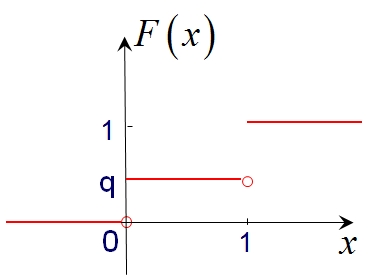
</Card>

一般地, 离散型随机变量的分布函数为阶梯函数.

若离散型随机变量 $X$ 的分布律为:
$$
 P(X=x_k)=p_k, k=1,2,... 
$$
则 $X$ 的分布函数为 $F(x)=\sum_{x_k \leq x} p_k$. 该分布函数 $F(x)$ 在 $x=x_k(k=1,2,...)$ 处有跳跃, 其跳跃度为 $p_k=P(X=x_k)$.

<Card type="Example" title="Example 15">
设随机变量 $X$ 的分布函数为:
$$
 F(x)= \begin{cases} 
0, & x<-1, \\ 
0.2, & -1 \leq x<3, \\ 
0.6, & 3 \leq x<4, \\ 
1, & x \geq 4 
\end{cases} 
$$
求 $X$ 的概率分布律.

**Solution**  
由 $F(x)$ 的定义和图像可知, $F(x)$ 只在 $-1, 3, 4$ 处有跳跃, 跳的幅度分别是0.2, 0.4, 0.4, 故概率分布律为:

| $X$ | -1 | 3 | 4 |
| --- | --- | --- | --- |
| $p_k$ | 0.2 | 0.4 | 0.4 |

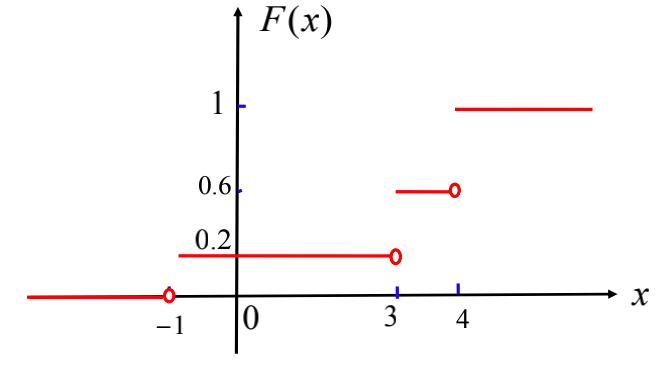
</Card>

<Card type="Example" title="Example 16">
设一物体在 $A, B$ 两点之间移动, $A, B$ 之间距离3个单位. 该物体落在 $A, B$ 中任一子区间的概率与区间长度成正比. 设它离 $A$ 的距离为 $X$, 求 $X$ 的分布函数.

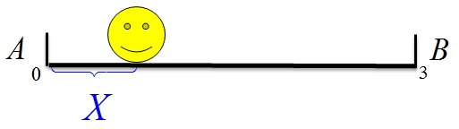

**Solution**  
根据题意可得, 设比例系数为 $k$, 则 $P(0 \leq X \leq 3)=3k=1 \Rightarrow k=\frac{1}{3}$. 故:
- 当 $x<0$ 时, $F(x)=0$;
- 当 $0 \leq x<3$ 时, $F(x)=P(X \leq x)=P(X<0)+P(0 \leq X \leq x)=0+\frac{1}{3} \cdot x=\frac{x}{3}$;
- 当 $x \geq 3$ 时, $F(x)=1$.

因此, $X$ 的分布函数为:
$$
 F(x)= \begin{cases} 
0, & x<0, \\ 
\frac{x}{3}, & 0 \leq x<3, \\ 
1, & x \geq 3 
\end{cases} 
$$

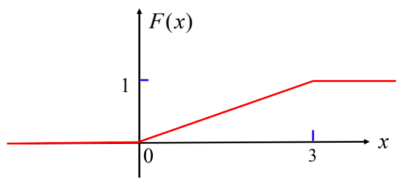

判断: $X$ 是否为离散型的随机变量?  
此分布函数是一个连续函数, 而非阶梯函数, 因此 $X$ 不是离散型随机变量.
</Card>

## §2.4 连续型随机变量(Continuous Random Variable/Distribution)

<Card type="Definition" title="Definition 9 (连续型随机变量、概率密度函数)">
对于随机变量 $X$ 的分布函数 $F(x)$，若存在非负的函数 $f(x)$，对于任意实数 $x$，均有 
$$
F(x)=\int_{-\infty}^{x} f(t) d t, \forall x \in \mathbb{R},
$$
则称 $X$ 为**连续型随机变量(continuous random variable)**，其中 $f(x)$ 称为 $X$ 的**概率密度函数(probability density function)**。
</Card>

<Card type="Definition" title="Definition 9 (Continuous Distribution/Random Variable/p.d.f./support)">
We say that a random variable $X$ has a continuous distribution or that $X$ is a continuous random variable if there exists a nonnegative function $f(x)$, defined on the real line, such that for every interval of real numbers (bounded or unbounded), the probability that $X$ takes a value in the interval is the integral of $f(x)$ over the interval. $f(x)$ is called the probability density function (abbreviated p.d.f.) of $X$. The set $\{x: f(x)>0\}$ is called the support of (the distribution of) $X$.
</Card>

概率密度函数 $f(x)$ 的性质:  
1. $f(x) \geq 0$;
2. $\int_{-\infty}^{\infty} f(x) d x=1$;

**说明**：(1)与(2)为概率密度函数的两条本质性质。

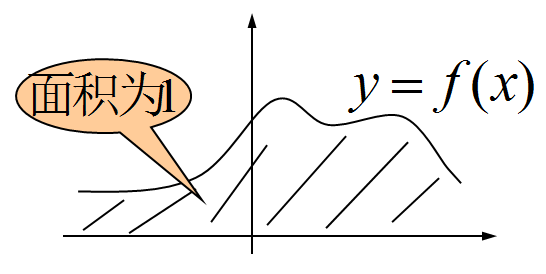

3. 对于连续型的随机变量 $X$，概率密度函数为 $f(x)$，则对于任意的实数 $x_{1}$，$x_{2}$（$x_{1}<x_{2}$），有 
$$
P\left(x_{1}<X \leq x_{2}\right)=\int_{x_{1}}^{x_{2}} f(x) d x .
$$

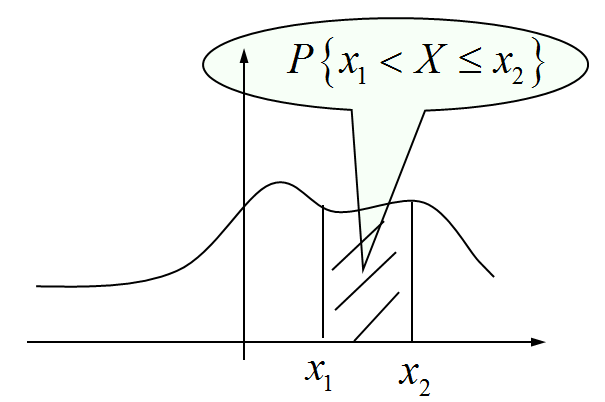

<Card type="Proof" title="Proof">
$$
P\left(x_{1}<X \leq x_{2}\right)=F\left(x_{2}\right)-F\left(x_{1}\right)=\int_{-\infty}^{x_{2}} f(x) d x-\int_{-\infty}^{x_{1}} f(x) d x=\int_{x_{1}}^{x_{2}} f(x) d x .
$$
</Card>

**注**：对于连续型的随机变量 $X$，概率密度函数为 $f(x)$：
- $P(X=a)=0$，$\forall a \in \mathbb{R}$
- $P(X \in I)=\int_{I} f(x) d x$，$I \subset \mathbb{R}$（常用计算公式）

4. 对于 $f(x)$ 的连续点 $x$，有 $F'(x)=f(x)$，即此时有 
$$
f(x)=F'(x)=\lim _{\Delta x \to 0} \frac{F(x+\Delta x)-F(x)}{\Delta x}=\lim _{\Delta x \to 0} \frac{P(x<X \leq x+\Delta x)}{\Delta x} .
$$

**说明**:  
1. $f(x)$ 值的含义：当 $\Delta x$ 充分小时，$P(x<X \leq x+\Delta x) \approx f(x) \cdot \Delta x$；
2. $f(x)$ 的值有可能大于1；
3. 连续型随机变量：概率密度函数与分布函数的关系
   - 由 $f(x)$ 求 $F(x)$：$F(x)=\int_{-\infty}^{x} f(t) d t$
   - 由 $F(x)$ 求 $f(x)$：$f(x)=\frac{d}{d x} F(x)$

<Card type="Example" title="Example 17">
设 $X$ 的概率密度函数为 
$$
f(x)= \begin{cases}c, & 0<x<1, \\ \frac{2}{9}, & 3<x<6, \\ 0, & 其他\end{cases}
$$
求：
1. 常数 $c$ 的值；
2. 写出 $X$ 的概率分布函数；
3. 要使 $P(X<k)=\frac{2}{3}$，求 $k$ 的值。

**Solution**

1. 由概率密度函数性质可知 
$$
1=\int_{-\infty}^{+\infty} f(t) d t=\int_{0}^{1} c d t+\int_{3}^{6} \frac{2}{9} d t=c+\frac{2}{3} \Rightarrow c=\frac{1}{3} .
$$
由此可知 $P\{X \in(0,1) \cup(3,6)\}=1$。

支撑(support)：$D=\{x: f(x)>0\}=\{x|0<x<1 \text{ 或 } 3<x<6\}$

对于连续型随机变量 $X$，有 
$$
\int_{-\infty}^{+\infty} f(x) d x=\int_{D} f(x) d x+\int_{\overline{D}} f(x) d x=\int_{D} f(x) d x+0=P(X \in D)=1 .
$$

2. 由密度函数定义，$F(x)=\int_{-\infty}^{x} f(t) d t$，分情况讨论：
$$
F(x)= \begin{cases}0, & x<0, \\ \int_{0}^{x} \frac{1}{3} d t=\frac{x}{3}, & 0 \leq x<1, \\ \int_{0}^{1} \frac{1}{3} d t=\frac{1}{3}, & 1 \leq x<3, \\ \int_{0}^{1} \frac{1}{3} d t+\int_{3}^{x} \frac{2}{9} d t=\frac{1}{3}+\frac{2(x-3)}{9}=\frac{2x-3}{9}, & 3 \leq x<6, \\ 1, & x \geq 6\end{cases}
$$

**思考**：若已知 $F(x)$，如何求 $f(x)$？

3. 使 $P(X<k)=\frac{2}{3}=F(k)$，代入分布函数得：
当 $3 \leq k<6$ 时，$\frac{2k-3}{9}=\frac{2}{3}$，解得 $k=4.5$。
</Card>

### 几个重要的连续型随机变量
#### (1) 均匀分布
<Card type="Definition" title="Definition 10 (均匀分布)">
设随机变量 $X$ 具有概率密度函数 
$$
f(x)= \begin{cases}\frac{1}{b-a}, & x \in(a, b), \\ 0, & 其他,\end{cases}
$$
其中 $a<b$，则称 $X$ 服从**区间 $(a, b)$ 上均匀分布(uniform distribution)**，记作 $X \sim U(a, b)$。
</Card>

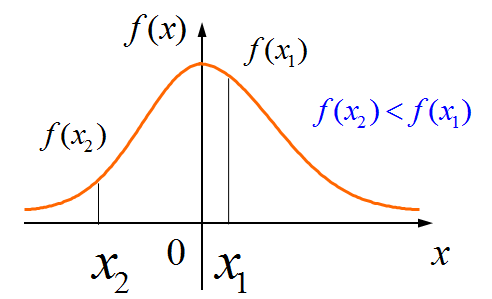

设 $a \leq c<c+s \leq b$，则 
$$
P(c<X<c+s)=\int_{c}^{c+s} \frac{1}{b-a} d t=\frac{s}{b-a}
$$
与 $c$ 无关，仅与区间长度 $s$ 有关（等可能性）。

根据概率密度函数的定义，可得均匀分布的分布函数为 
$$
F(x)= \begin{cases}0, & x<a, \\ \frac{x-a}{b-a}, & a \leq x<b, \\ 1, & x \geq b .\end{cases}
$$

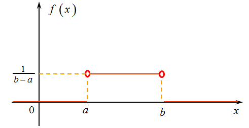

<Card type="Example" title="Example 18">
在区间 $(-1, 2)$ 上随机取一数 $X$，试写出 $X$ 的概率密度函数，并求 $P(X>0)$ 的值。

**Solution**

由题意知，$X$ 服从区间 $(-1, 2)$ 上的均匀分布，其概率密度为 
$$
f(x)= \begin{cases}\frac{1}{3}, & -1<x<2, \\ 0, & 其他.\end{cases}
$$

计算 $P(X>0)$：
- 法一：$P(X>0)=\int_{0}^{+\infty} f(x) d x=\int_{0}^{2} \frac{1}{3} d x=\frac{2}{3}$
- 法二：$P(X>0)=\frac{(-1,2) \cap(0,+\infty) \text{ 的长度 }}{(-1,2) \text{ 的长度 }}=\frac{(0,2) \text{ 的长度 }}{(-1,2) \text{ 的长度 }}=\frac{2}{3}$
</Card>

<Card type="Example" title="Example 18 (Cont.)">
若在该区间上随机取10个数，求10个数中恰有2个数大于0的概率。

**Solution**

设10个数中有 $Y$ 个数大于0，则 $Y \sim B(10, \frac{2}{3})$（二项分布），故 
$$
P(Y=2)=C_{10}^{2}\left(\frac{2}{3}\right)^{2}\left(\frac{1}{3}\right)^{8}=\frac{10!}{2!(10-2)!} \times \frac{4}{9} \times \frac{1}{3^8}=\frac{45 \times 4}{3^{10}}=\frac{180}{59049}=\frac{20}{6561} \approx 0.003048 .
$$
</Card>

<Card type="Example" title="Example 19">
杭州某长途汽车站每天从早上6点（第一班车）开始，每隔30分钟有一班车开往上 海。王先生在早上6:20至7:10随机到达车站，设他早上6:20过 $X$ 分钟到达车站，则 $X$ 服从 $(0, 50)$ 上的均匀分布。
求：
1. 王先生候车时间不超过15分钟的概率；
2. 如果王先生一月中有两次按此方式独立地去候车，求他一次候车不超过15分钟，另一次候车大于10分钟的概率。

**Solution**

1. $P(\text{候车时间不超过15分钟})=\frac{10+15}{50}=0.5$
2. $P(\text{候车时间大于10分钟})=\frac{20+10}{50}=0.6$

   设王先生两次分别在早上6:20过 $X_{1}$ 和 $X_{2}$ 分钟到达车站，那么 
$$

\begin{aligned}
P(\text{一次候车不超过15分钟，另一次大于10分钟})
&= P\left(\left(X_{1}<15, X_{2}>10\right) \cup\left(X_{1}>10, X_{2}<15\right)\right) \\
&= P\left(X_{1}<15, X_{2}>10\right)+P\left(X_{1}>10, X_{2}<15\right)-P\left(10<X_{1}<15,10<X_{2}<15\right) \\
&= 0.5 \times 0.6 + 0.6 \times 0.5 - 0.1 \times 0.1 \\
&= 0.3 + 0.3 - 0.01 \\
&= 0.59
\end{aligned}
$$
</Card>

#### (2) 指数分布
<Card type="Definition" title="Definition 11 (指数分布)">
设随机变量 $X$ 具有概率密度函数 
$$
f(x)= \begin{cases}\lambda e^{-\lambda x}, & x>0, \\ 0, & x \leq 0\end{cases}
$$
其中 $\lambda>0$，则称 $X$ 服从参数为 $\lambda$ 的指数分布(exponential distribution)，记作 $X \sim Exp(\lambda)$ 或 $X \sim E(\lambda)$。
</Card>

根据概率密度函数的定义，可得**指数分布 $X \sim E(\lambda)$ 的分布函数**为 
$$
F(x)= \begin{cases}1-e^{-\lambda x}, & x>0, \\ 0, & x \leq 0 .\end{cases}
$$

指数分布还具有一个重要的性质——“**无记忆性**”：  
即对任意的 $t>0$，$t_{0}>0$，有 
$$
P\left(X>t_{0}+t | X>t_{0}\right)=\frac{P\left(X>t_{0}+t\right)}{P\left(X>t_{0}\right)}=\frac{1-F\left(t_{0}+t\right)}{1-F\left(t_{0}\right)}=\frac{e^{-\lambda(t_{0}+t)}}{e^{-\lambda t_{0}}}=e^{-\lambda t}=P(X>t) .
$$

这也意味着，对于任意的 $t>0$，$t_{0}>0$，在 $\{X>t_{0}\}$ 的条件下，$X-t_{0}$ 服从指数分布（即其条件分布为指数分布）。

<Card type="Example" title="Example 20">
某大型设备在任何长度为 $t$ 的区间内发生故障的次数 $N(t)$ 服从参数为 $\lambda t$ 的Poisson分布。记设备无故障运行的时间为 $T$。
求：
1. $T$ 的概率分布函数；
2. 已知设备已无故障运行10个小时，求再无故障运行8个小时的概率。

**Solution**

由题意，$N(t) \sim P(\lambda t)$，其分布律为 $P(N(t)=k)=\frac{(\lambda t)^{k}}{k !} e^{-\lambda t}$，$k=0,1,2, ...$。  
无故障运行时间 $T$ 的分布函数为 $F_{T}(t)=P(T \leq t)$：

1. 当 $t<0$ 时，$F_{T}(t)=0$；   
   当 $t \geq 0$ 时，$F_{T}(t)=1-P(T>t)=1-P(N(t)=0)   =1-e^{-\lambda t}$。
   
   因此 $T$ 的分布函数为 
   $$
   F_{T}(t)= \begin{cases}1-e^{-\lambda t}, & t \geq 0, \\ 0, & t<0 .\end{cases}
   $$
   即 $T \sim E(\lambda)$，具有无记忆性。

2. 由无记忆性，$P(T>18 | T>10)=P(T>8)$，而 $P(T>8)=1-F_{T}(8)=e^{-8\lambda}$，故 
   $$
   P(T>18 | T>10)=e^{-8\lambda}
   $$
</Card>

#### (3) 正态分布
<Card type="Definition" title="Definition 12 (正态分布)">
设随机变量 $X$ 具有概率密度函数 
$$
f(x)=\frac{1}{\sqrt{2 \pi} \sigma} \exp \left\{-\frac{1}{2 \sigma^{2}}(x-\mu)^{2}\right\}, \quad-\infty<x<+\infty,
$$
其中 $\sigma>0$，$-\infty<\mu<+\infty$，则称 $X$ 服从参数为 $\mu$、$\sigma$ 的正态分布(normal distribution)，或简称 $X$ 为正态变量，也常称为Gauss分布，记作 $X \sim N(\mu, \sigma^{2})$。
</Card>

下面验证密度函数的归一化（即 $\int_{-\infty}^{+\infty} f(x) d x=1$）

<Card type="Proof" title="Proof">
注意到 
$$

\int_{-\infty}^{+\infty} f(x) d x \stackrel{\text{令 } t=\frac{x-\mu}{\sigma}}{=} \int_{-\infty}^{+\infty} \frac{1}{\sqrt{2 \pi} \sigma} e^{-\frac{t^{2}}{2}} \sigma d t=\int_{-\infty}^{+\infty} \frac{1}{\sqrt{2 \pi}} e^{-\frac{t^{2}}{2}} d t

$$
记 $I=\int_{-\infty}^{+\infty} e^{-\frac{t^{2}}{2}} d t$，则 $I^2=\int_{-\infty}^{+\infty} \int_{-\infty}^{+\infty} e^{-\frac{t^2 + s^2}{2}} d t d s$（极坐标变换：$t=r\cos\theta$，$s=r\sin\theta$），计算得 $I=\sqrt{2\pi}$。因此 
$$

\int_{-\infty}^{+\infty} f(x) d x=\frac{1}{\sqrt{2 \pi}} \times \sqrt{2\pi}=1

$$
</Card>

正态变量 $X \sim N(\mu, \sigma^{2})$ 的概率密度函数$f(x) = \dfrac{1}{\sqrt{2\pi}\sigma}\text{e}^{-\frac{(x-\mu)^2}{2\sigma^2}} , -\infty < x < + \infty$性质  
- $f(x)$ 关于 $x=\mu$ 对称；
- 当 $x>\mu$ 时，$f(x)$ 关于 $x$ 严格单调下降；
- 最大值：$f_{max}=f(\mu)=\frac{1}{\sqrt{2 \pi} \sigma}$；
- 极限：$\lim _{|x-\mu| \to+\infty} f(x)=0$；
- 在 $x=\mu \pm \sigma$ 处曲线有拐点。

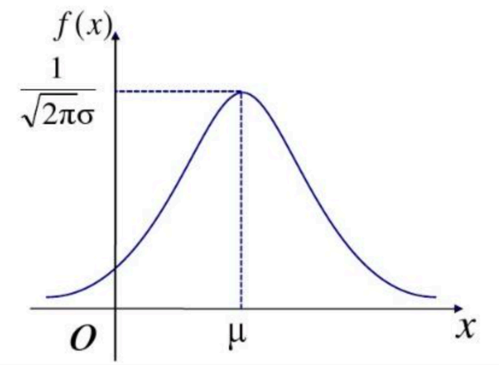

不同 $\mu$ 和 $\sigma$ 对概率密度函数图像的影响（两参数的含义） 
- 当固定 $\sigma$，改变 $\mu$ 的大小时，$f(x)$ 的图像形状不变，只是沿着 $x$ 轴作平移变换；
- 当固定 $\mu$，改变 $\sigma$ 的大小时，$f(x)$ 的图像对称轴不变，而形状在改变：$\sigma$ 越小，图形越高越瘦；$\sigma$ 越大，图形越矮越胖。

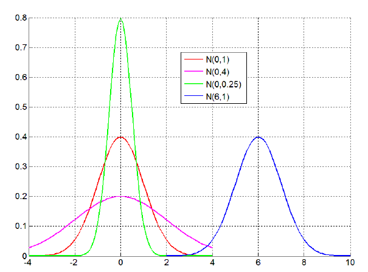

通常称 $\mu$ 为**位置参数**（决定曲线对称轴位置），$\sigma$ 为**尺度参数**（决定曲线分散程度）。

### 正态变量的特点
- 取值呈中间多、两头少、对称的特性；
- 当固定 $\mu$ 时，$\sigma$ 越大，曲线的峰越低，落在 $\mu$ 附近的概率越小，取值就越分散，即 $\sigma$ 是反映正态变量取值分散性的一个指标；
- 在自然现象和社会现象中，大量随机变量服从或近似服从正态分布。

### 正态分布下的概率计算
若 $X \sim N(\mu, \sigma^{2})$，则 
$$
P\{X \leq x\}=F(x)=\int_{-\infty}^{x} \frac{1}{\sqrt{2 \pi} \sigma} e^{-\frac{(t-\mu)^{2}}{2 \sigma^{2}}} d t = ?
$$

算不出来！  
1. 利用Excel、MATLAB、R、Python、C++、SPSS等软件计算；
2. 转化为标准正态分布，结合标准正态分布函数表计算。

#### 标准正态分布
<Card type="Definition" title="Definition 13 (标准正态分布)">
若 $Z \sim N(0,1)$，则称 $Z$ 服从标准正态分布。  
其概率密度函数为 $\varphi(z)=\frac{1}{\sqrt{2 \pi}} e^{-\frac{z^{2}}{2}}$，  
分布函数为 $\Phi(z)=\int_{-\infty}^{z} \varphi(t) d t=\int_{-\infty}^{z} \frac{1}{\sqrt{2 \pi}} e^{-\frac{t^{2}}{2}} d t$。
</Card>

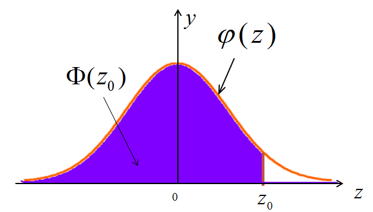

**标准正态分布函数表**：https://en.wikipedia.org/wiki/Standard_normal_table  

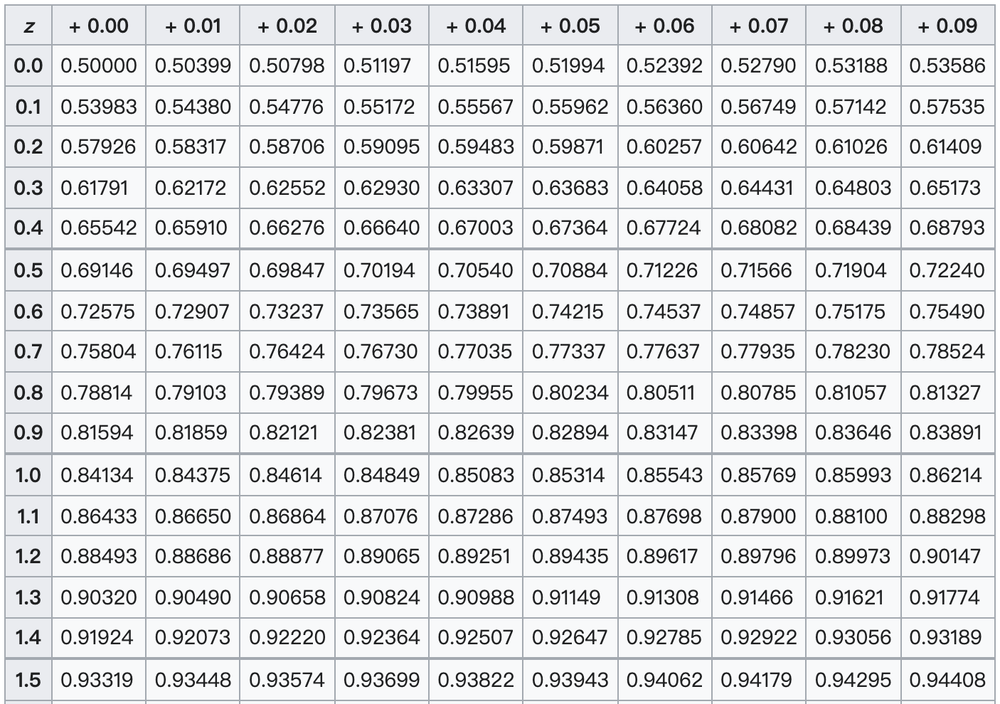
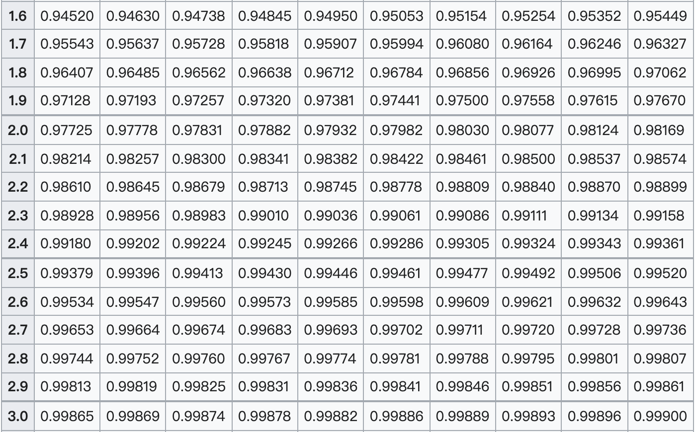

例如：$\Phi(1.23)=0.89065$，$\Phi(1.96)=0.97500$

由于 $\varphi(z)=\frac{1}{\sqrt{2 \pi}} e^{-\frac{z^{2}}{2}}$ 是偶函数，因此标准正态分布的分布函数具有性质：  
$$

\Phi\left(-z_{0}\right)=1-\Phi\left(z_{0}\right), \forall z_{0} \in \mathbb{R}

$$

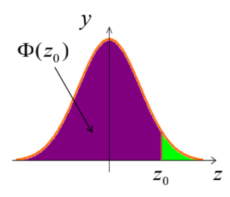

<Card type="性质" title="性质">
当 $X \sim N(\mu, \sigma^{2})$ 时，则有 $\frac{X-\mu}{\sigma} \sim N(0,1)$。
</Card>

<Card type="Proof" title="Proof">
$$

\begin{aligned}
F_{\frac{X-\mu}{\sigma}}(z) &= P\left(\frac{X-\mu}{\sigma} \leq z\right) \\
&= P(X \leq \mu + z\sigma) \\
&= F_{X}(\mu + z\sigma) \\
&= \int_{-\infty}^{\mu + z\sigma} \frac{1}{\sqrt{2 \pi} \sigma} e^{-\frac{(t-\mu)^{2}}{2 \sigma^{2}}} d t \\
&\stackrel{\text{令 } s=\frac{t-\mu}{\sigma}}{=} \int_{-\infty}^{z} \frac{1}{\sqrt{2 \pi}} e^{-\frac{s^{2}}{2}} d s \\
&= \Phi(z)
\end{aligned}

$$
因此 $\frac{X-\mu}{\sigma} \sim N(0,1)$。
</Card>

由此可知，当 $X \sim N(\mu, \sigma^{2})$ 时，对于任意实数 $a$，有 
$$

F_{X}(a)=P(X \leq a)=P\left(\frac{X-\mu}{\sigma} \leq \frac{a-\mu}{\sigma}\right)=\Phi\left(\frac{a-\mu}{\sigma}\right)

$$

<Card type="Example" title="Example 21">
设 $X \sim N(\mu, \sigma^{2})$，则 
$$

\begin{aligned}
P(|X-\mu|<\sigma) &= P(-\sigma<X-\mu<\sigma) \\
&= P(\mu-\sigma<X<\mu+\sigma) \\
&= P\left(\frac{(\mu-\sigma)-\mu}{\sigma}<\frac{X-\mu}{\sigma}<\frac{(\mu+\sigma)-\mu}{\sigma}\right) \\
&= P(-1<\frac{X-\mu}{\sigma}<1) \\
&= \Phi(1)-\Phi(-1) \\
&= 2\Phi(1)-1 \\
&= 2 \times 0.8413 - 1 = 0.6826
\end{aligned}

$$

同理：
$$

P(|X-\mu|<2\sigma)=2\Phi(2)-1=2 \times 0.9772 - 1 = 0.9544

$$
$$

P(|X-\mu|<3\sigma)=2\Phi(3)-1=2 \times 0.9987 - 1 = 0.9974

$$
</Card>

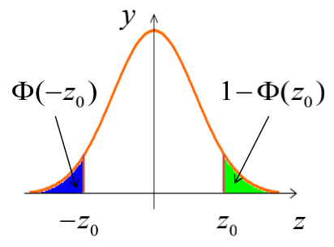

<Card type="Example" title="Example 22">
用天平称一实际重量为 $a$ 的物体，天平的读数为随机变量 $X$，设 $X \sim N(a, 0.01^{2})$。
求：
1. 读数 $X$ 与 $a$ 的误差小于0.005的概率；
2. 读数 $X$ 至少比 $a$ 多0.0085的概率。
</Card>

<Card type="Solution" title="Solution">
由正态分布性质知 $\frac{X-a}{0.01} \sim N(0,1)$。因此：

1. $P(|X-a|<0.005)=P\left(\left|\frac{X-a}{0.01}\right|<\frac{0.005}{0.01}\right)=P\left(\left|\frac{X-a}{0.01}\right|<0.5\right)$  
$=\Phi(0.5)-\Phi(-0.5)=2\Phi(0.5)-1$  
查附表2，$\Phi(0.5)=0.6915$，故 $2 \times 0.6915 - 1 = 0.3830$。

2. $P(X-a \geq 0.0085)=P\left(\frac{X-a}{0.01} \geq \frac{0.0085}{0.01}\right)=P\left(\frac{X-a}{0.01} \geq 0.85\right)$  
$=1-\Phi(0.85)$  
查附表2，$\Phi(0.85)=0.8023$，故 $1 - 0.8023 = 0.1977$。
</Card>

使用Excel表单计算 $P(X-a<0.0085)$（以2003版本为例，不同版本具体做法有所不同）  
1. 在Excel表单的任一单元格输入“=”；
2. 在主菜单中点击“插入”，选择“函数(F)”；
3. 在选择类别的下拉式菜单中选择“统计”；
4. 选择“NORMDIST”，点击“确定”（注意区别NORMSDIST）；
5. 在函数参数表单中输入“X=0.0085, Mean=0, Standard_dev=0.01, Cumulative=TRUE”；
6. 点击“确定”；
7. 在单元格中出现“0.802337508”。

<Card type="Example" title="Example 23">
一批钢材（线材）长度 $X$（单位：cm）服从正态分布 $N(\mu, \sigma^{2})$。
求：
1. 若 $\mu=100$，$\sigma=2$，求这批钢材长度小于97.8 cm的概率；
2. 若 $\mu=100$，要使这批钢材的长度至少有90%落在区间(97, 103)内，问 $\sigma$ 至多取何值？

**Solution**

1. $P(X<97.8)=P\left(\frac{X-100}{2}<\frac{97.8-100}{2}\right)=P\left(\frac{X-100}{2}<-1.1\right)$  
$=\Phi(-1.1)=1-\Phi(1.1)$  
查附表2，$\Phi(1.1)=0.8643$，故 $1 - 0.8643 = 0.1357$。

2. $P(97<X<103)=P\left(\frac{97-100}{\sigma}<\frac{X-100}{\sigma}<\frac{103-100}{\sigma}\right)$  
$=\Phi\left(\frac{3}{\sigma}\right)-\Phi\left(-\frac{3}{\sigma}\right)=2\Phi\left(\frac{3}{\sigma}\right)-1$  
要求该概率≥90%（即0.9），故 $2\Phi\left(\frac{3}{\sigma}\right)-1 \geq 0.9$，即 $\Phi\left(\frac{3}{\sigma}\right) \geq 0.95$。

所以需 $\Phi\left(\frac{3}{\sigma}\right) \geq 0.95$，查标准正态分布表，$\Phi(1.645)=0.95$，即 
$$

\frac{3}{\sigma} \geq 1.645 \Rightarrow \sigma \leq \frac{3}{1.645} \approx 1.8237

$$

</Card>

在计算 $\Phi$ 的逆函数时，也可以使用Excel表单：  
1. 选择“NORMINV”，点击“确定”；
2. 在函数参数表单中输入“Probability=0.95, Mean=0, Standard_dev=1”；
3. 点击“确定”，在单元格中出现“1.644853627”。

<Card type="Example" title="Example 24">
设一天中经过一高速公路某一入口的重型车辆数 $X$ 近似服从 $N(\mu, \sigma^{2})$。已知有25%的天数超过400辆，有33%的天数不到350辆，求 $\mu$、$\sigma$。

**Solution**

由题意知：
$$
P(X>400) \approx 1-\Phi\left(\frac{400-\mu}{\sigma}\right)=0.25
$$
$$
P(X<350) \approx \Phi\left(\frac{350-\mu}{\sigma}\right)=0.33
$$

而 $\Phi(0.675)=0.75$, $\Phi(-0.440)=0.33$因此

$$
\left\{\begin{array}{l}
(\mu - 400)/\sigma = -0.675 \\
(350 - \mu)/\sigma = -0.40
\end{array}\right.

$$
解得：
$$

\begin{cases}
\mu = 369.7 \\
\sigma = 44.8
\end{cases}

$$
</Card>

<Card type="Example" title="Example 25">
一银行服务需要等待，设等待时间 $X$（分钟）的概率密度函数为 
$$
f(x)= \begin{cases}\frac{1}{10} e^{-\frac{x}{10}}, & x>0, \\ 0, & x \leq 0\end{cases}
$$
某人进了银行，且打算过会儿去办另一件事情，于是先等待，如果超过15分钟还没有等到服务就离开。设他实际的等待时间为 $Y$。
求：
1. $Y$ 的分布函数；
2. 问 $Y$ 是离散型随机变量吗？是连续型随机变量吗？

**Solution**

1. 由题意可知 $Y=\min\{X, 15\}$，故
$$
F(y)= \begin{cases}0, & y<0, \\ 1-e^{-\frac{y}{10}}, & 0 \leq y<15, \\ 1, & y \geq 15\end{cases}
$$

2. $Y$ 的取值范围是 $[0, 15]$，取值不可列，故 $Y$ 不是离散型随机变量；  
又 $P(Y=15)=F(15)-F(15^-)=1 - (1-e^{-\frac{15}{10}})=e^{-1.5} \neq 0$，不满足连续型随机变量“单点概率为0”的性质，因此 $Y$ 也不是连续型随机变量。（事实上，从 $Y$ 的分布函数在 $y=15$ 处不连续也可知 $Y$ 不是连续型随机变量。）故 $Y$ 为非连非离型的随机变量。
</Card>