\* 目前提取至Ch3.1

import Card from "@md-components/card.vue"

# Chapter 3 Multivariate Random Variables and Their Distributions
- 二维随机变量（Bivariate Random Variables）
- 联合分布函数（Joint Distribution Function）
- 边际分布函数（Marginal Distribution Function）
- 条件分布函数（Conditional Distribution Function）
- 随机变量的独立性（Independence of Random Variables）
- 随机变量函数的分布（Functions of Random Variables）

## §3.1 Bivariate Random Variables

问题的提出:

<Card type="Example" title="Example 1">
- 研究某一地区学龄儿童的发育情况。一般仅研究身高 $H$ 的分布或仅研究体重 $W$ 的分布是不够的，通常需要同时考察每个儿童的身高和体重值，这就要引入定义在同一样本空间的两个随机变量。在分析时，往往除了研究两个指标各自的特点之外，还常常会分析身高和体重两者之间的关系。
- 研究市场供给模型时，需同时考察商品供给量、消费者收入和市场价格等多个因素，它们构成了定义在同一样本空间的三个（或多个）随机变量。
</Card>

Suppose that $X$ and $Y$ are random variables. Their distribution functions, $F_{X}$ and $F_{Y}$, contain information about their associated probabilities. But how may we encapsulate information about their properties relative to each other? The key is to think of $X$ and $Y$ as being the components of a "random vector" $(X, Y)$ taking values in $\mathbb{R}^{2}$, rather than being unrelated random variables each taking values in $\mathbb{R}$.

### 二维 (元) 随机变量 (向量)

<Card type="Definition" title="Definition 1（二维随机变量）">
设一随机试验 $E$ 的样本空间为 $S$，定义 $S$ 上的随机变量 $X=X(e)$，$Y=Y(e)$，称它们构成的向量 $(X, Y)$ 为二维（元）随机向量或二维（元）随机变量（bivariate random variable/vector）。
</Card>

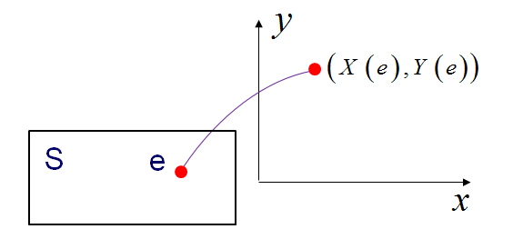

<Card type="Definition" title="Definition 2（二维离散型随机变量）">
若二维随机变量 $(X, Y)$ 的所有可能取值为有限对或可列无限对（即至多可列对），则称 $(X, Y)$ 是二维（元）离散型随机变量。
</Card>

### 离散型随机变量的联合 (joint) 概率分布律

<Card type="Definition" title="Definition 3（离散型随机变量的联合概率分布律）">
设二维离散型随机变量 $(X, Y)$ 的可能取值为 $(x_{i}, y_{j})$，$i, j=1,2, ...$，称
$$
P\left(X=x_{i}, Y=y_{j}\right)=p_{i j}, i, j=1,2, ...
$$
为 $(X, Y)$ 的联合概率分布律（joint probability mass function），简称联合分布律。

联合概率分布律也可以用列表方式表示：

| $X \setminus Y$ | $y_1$ | $y_2$ | ... | $y_j$ | ... |
| --- | --- | --- | --- | --- | --- |
| $x_1$ | $p_{11}$ | $p_{12}$ | ... | $p_{1j}$ | ... |
| $x_2$ | $p_{21}$ | $p_{22}$ | ... | $p_{2j}$ | ... |
| ... | ... | ... | ... | ... | ... |
| $x_i$ | $p_{i1}$ | $p_{i2}$ | ... | $p_{ij}$ | ... |
| ... | ... | ... | ... | ... | ... |

</Card>
联合概率分布律具有以下性质：

1. 
   $$
   p_{ij} \geq 0, i, j=1,2, ...
   $$
2. 
   $$
   \sum_{i=1}^{\infty} \sum_{j=1}^{\infty} p_{ij}=1
   $$

<Card type="Example" title="Example 2">
设随机变量 $X$ 在1, 2, 3, 4 四个整数中等可能地取一个值，另一个随机变量 $Y$ 在 $1 \sim X$ 中等可能地取一整数值，试求 $(X, Y)$ 的联合概率分布律。

**Solution**

$(X, Y)$ 的可能取值为 $(i, j)$，其中 $i=1,2,3,4$，$j$ 取不大于 $i$ 的正整数。

$(X, Y)$ 的联合概率分布律为：
$$
P(X=i, Y=j)=P(X=i) P(Y=j | X=i)=\frac{1}{4} \cdot \frac{1}{i}
$$
其中 $i=1,2,3,4$；$1 \leq j \leq i$，$j$ 为整数。

也可写为：

| $X \setminus Y$ | 1 | 2 | 3 | 4 |
| --- | --- | --- | --- | --- |
| 1 | 1/4 | 0 | 0 | 0 |
| 2 | 1/8 | 1/8 | 0 | 0 |
| 3 | 1/12 | 1/12 | 1/12 | 0 |
| 4 | 1/16 | 1/16 | 1/16 | 1/16 |
</Card>

<Card type="Example" title="Example 3">
某足球队在任何长度为 $t$ 的时间区间内得黄牌（或红牌）的次数 $N(t)$ 服从参数为 $\lambda t$ 的 Poisson 分布，其中 $t>0$。记 $X_i$ 为比赛进行 $t_i$ 分钟时的得牌数，$i=1,2$ 且 $t_2>t_1>0$。试写出 $(X_1, X_2)$ 的联合分布律。

**Solution**

由题意知，$P(N(t)=k)=\frac{e^{-\lambda t}(\lambda t)^{k}}{k !}$，$k=0,1,2, ...$。

$(X_1, X_2)$ 的联合分布律为：
$$

\begin{aligned} 
P\left(X_{1}=i, X_{2}=j\right) & =P\left(X_{1}=i\right) P\left(X_{2}=j | X_{1}=i\right) \\ 
& =P\left(N\left(t_{1}\right)=i\right) P\left(N\left(t_{2}-t_{1}\right)=j-i\right) \\ 
& =\frac{e^{-\lambda t_{1}}\left(\lambda t_{1}\right)^{i}}{i !} \cdot \frac{e^{-\lambda\left(t_{2}-t_{1}\right)}\left(\lambda\left(t_{2}-t_{1}\right)\right)^{j-i}}{(j-i) !}
\end{aligned}

$$
其中 $i=0,1, ...$；$j=i, i+1, ...$。
</Card>

### 离散型随机变量的边际 (边缘)(marginal) 分布律

<Card type="Definition" title="Definition 4（离散型随机变量的边际（边缘）分布律）">
设二维离散型随机变量 $(X, Y)$ 的联合分布律为 $P(X=x_i, Y=y_j)=p_{ij}$，$i, j=1,2, ...$，则
$$

\begin{aligned}
P\left(X=x_{i}\right)&=P\left(\bigcup_{j=1}^{+\infty}\left\{X=x_{i}, Y=y_{j}\right\}\right)=\sum_{j=1}^{+\infty} p_{i j} \stackrel{记为}{=} p_{i \cdot}, i=1,2, ... ; (1) \\
P\left(Y=y_{j}\right)&=P\left(\bigcup_{i=1}^{+\infty}\left\{X=x_{i}, Y=y_{j}\right\}\right)=\sum_{i=1}^{+\infty} p_{i j} \stackrel{记为}{=} p_{\cdot j}, j=1,2, ... ; (2)
\end{aligned}

$$

（1）和（2）满足概率分布律的性质，它们分别是随机变量 $X$ 与 $Y$ 的概率分布律，分别称为 $X$ 和 $Y$ 的边际分布律或边缘分布律。

注意：记号 $p_{i \cdot}$ 表示由 $p_{ij}$ 关于 $j$ 求和后得到；$p_{\cdot j}$ 表示由 $p_{ij}$ 关于 $i$ 求和后得到。
</Card>

<Card type="Example" title="Example 4">
在某一群体中，已知有80% 的人不吸烟，15% 的人少量吸烟，5% 的人吸烟较多，且已知近期他们患呼吸道疾病的概率分别为5%，25%，70%。记
$$
X=\begin{cases}0, & 不吸烟, \\ 1, & 少量吸烟, \\ 2, & 吸烟较多, \end{cases} 
Y=\begin{cases}0, & 不患病, \\ 1, & 患病 .\end{cases}
$$
求 $(X, Y)$ 的联合分布律和边际分布律；求患病的人中吸烟的概率。

**Solution**

由题意可知，$P(X=0)=0.80$，$P(X=1)=0.15$，$P(X=2)=0.05$；且 $P(Y=1|X=0)=0.05$，$P(Y=1|X=1)=0.25$，$P(Y=1|X=2)=0.7$。

结合乘法公式可得 $(X, Y)$ 的联合分布律与边际分布律如下表所示：

| $Y \setminus X$ | 0 | 1 | 2 | $P(X=i)$ |
| --- | --- | --- | --- | --- |
| 0 | 0.76 | 0.1125 | 0.015 | 0.8875 |
| 1 | 0.04 | 0.0375 | 0.035 | 0.1125 |
| $P(Y=j)$ | 0.80 | 0.15 | 0.05 | 1 |

患病的人中吸烟的概率为：
$$

P(患病的人中吸烟)=P(X=1 或 2|Y=1)=\frac{0.0375+0.035}{0.1125}=0.6444

$$

事实上，还可得：
$$

\begin{aligned}
P\{患病的人中不吸烟\}&=P\{X=0 | Y=1\}=\frac{0.04}{0.1125}; \\
P\{患病的人中少量吸烟\}&=P\{X=1 | Y=1\}=\frac{0.0375}{0.1125}; \\
P\{患病的人中吸烟较多\}&=P\{X=2 | Y=1\}=\frac{0.035}{0.1125}.
\end{aligned}

$$
上述概率之和为1。
</Card>

### 条件分布 (conditional distribution)

<Card type="Definition" title="Definition 5（条件分布）">
设二维离散型随机变量 $(X, Y)$ 的联合分布律为 $P(X=x_i, Y=y_j)=p_{ij}$，$i, j=1,2, ...$。

**Solution**

1. 对于某固定的 $y_j$（$P(Y=y_j)=p_{\cdot j} \neq 0$），则称
$$
P\left(X=x_{i} | Y=y_{j}\right)=\frac{P\left(X=x_{i}, Y=y_{j}\right)}{P\left(Y=y_{j}\right)}=\frac{p_{i j}}{p_{\cdot j}}, i=1,2, ... (4)
$$
为给定 $\{Y=y_j\}$ 的条件下 $X$ 的条件分布律。

2. 同理，对于某固定的 $x_i$（$P(X=x_i)=p_{i \cdot} \neq 0$），则称
$$
P\left(Y=y_{j} | X=x_{i}\right)=\frac{P\left(X=x_{i}, Y=y_{j}\right)}{P\left(X=x_{i}\right)}=\frac{p_{i j}}{p_{i \cdot}}, j=1,2, ... (5)
$$
为给定 $\{X=x_i\}$ 的条件下 $Y$ 的条件分布律。

注：条件分布律也是分布律，也包含两部分内容，一是可能取值，二是每个可能取值取到的概率（此处为条件概率）；即也需满足概率分布律的两条本质性质：
- $\frac{p_{ij}}{p_{\cdot j}} \geq 0$（或 $\frac{p_{ij}}{p_{i \cdot}} \geq 0$）；
- $\sum_{i=1}^{\infty} \frac{p_{ij}}{p_{\cdot j}}=1$（或 $\sum_{j=1}^{\infty} \frac{p_{ij}}{p_{i \cdot}}=1$）。
</Card>

<Card type="Example" title="Example 5">
设 $(X, Y)$ 的联合分布律为

| $X \setminus Y$ | -1 | 0 | 1 |
| --- | --- | --- | --- |
| 1 | $a$ | 0.2 | 0.2 |
| 2 | 0.1 | 0.1 | $b$ |

已知 $P(Y \leq 0 | X<2)=0.5$。求：
1. $a$，$b$ 的值；
2. $\{X=2\}$ 条件下 $Y$ 的条件分布律；
3. $\{X+Y=2\}$ 条件下 $X$ 的条件分布律。

**Solution**

1. 由题意知：
$$
0.5=P(Y \leq 0 | X<2)=\frac{P(X<2, Y \leq 0)}{P(X<2)}=\frac{a+0.2}{a+0.4}
$$
解得 $a=0$。

由分布律性质知 $a+b+0.6=1$，即 $a+b=0.4$，从而可得 $b=0.4$。

2. $P(X=2)=0.1+0.1+0.4=0.6$。由条件概率公式 $P(Y=j | X=2)=\frac{P(X=2, Y=j)}{P(X=2)}$ 可得：
$$
P(Y=j | X=2)= \begin{cases}1 / 6, & j=-1, \\ 1 / 6, & j=0, \\ 2 / 3, & j=1 .\end{cases}
$$
或写为：

| $Y$ | -1 | 0 | 1 |
| --- | --- | --- | --- |
| $P(Y=j | X=2)$ | 1/6 | 1/6 | 2/3 |

3. $P(X+Y=2)=P(X=1, Y=1)+P(X=2, Y=0)=0.2+0.1=0.3$。

由条件概率公式可得：
$$
P(X=i | X+Y=2)=\frac{P(X=i, Y=2-i)}{P(X+Y=2)}= \begin{cases}2 / 3, & i=1, \\ 1 / 3 & i=2\end{cases}
$$
或写为：

| $X$ | 1 | 2 |
| --- | --- | --- |
| $P(X=i \mid X+Y=2)$ | 2/3 | 1/3 |
</Card>

<Card type="Example" title="Example 6">
盒子里装有3个黑球，2只红球，1只白球，在其中不放回任取2球，以 $X$ 表示取到黑球的数目，$Y$ 表示取到红球的数目。求：
1. $X$，$Y$ 的联合分布律；
2. $\{X=1\}$ 时，$Y$ 的条件分布律；
3. $\{Y=0\}$ 时，$X$ 的条件分布律。
4. 若采用放回抽样呢？

**Solution**

采用不放回抽样, 联合分布律及条件分布律结果如下:

| $X \setminus Y$ | 0 | 1 | 2 | $P(X=i)$ |
| --- | --- | --- | --- | --- |
| 0 | 0 | 2/15 | 1/15 | 1/5 |
| 1 | 3/15 | 6/15 | 0 | 3/5 |
| 2 | 3/15 | 0 | 0 | 1/5 |
| $P(Y=j)$ | 6/15 | 8/15 | 1/15 | 1 |

| $Y$ | 0 | 1 |
| --- | --- | --- |
| $P(Y=j | X=1)$ | 1/3 | 2/3 |

| $X$ | 0 | 1 | 2 |
| --- | --- | --- | --- |
| $P(X=i | Y=0)$ | 0 | 1/2 | 1/2 |

若采用放回抽样呢?

采用放回抽样, 联合分布律及条件分布律结果如下:

| $X \setminus Y$ | 0 | 1 | 2 | $P(X=i)$ |
| --- | --- | --- | --- | --- |
| 0 | 1/36 | 4/36 | 4/36 | 1/4 |
| 1 | 6/36 | 12/36 | 0 | 1/2 |
| 2 | 9/36 | 0 | 0 | 1/4 |
| $P(Y=j)$ | 4/9 | 4/9 | 1/9 | 1 |

| $Y$ | 0 | 1 |
| --- | --- | --- |
| $P(Y=j | X=1)$ | 1/3 | 2/3 |

| $X$ | 0 | 1 | 2 |
| --- | --- | --- | --- |
| $P(X=i | Y=0)$ | 1/16 | 6/16 | 9/16 |
</Card>

<Card type="Example" title="Example 7">
一射手进行射击，已知其击中目标的概率为 $p(0<p<1)$，射击直至击中目标两次为止。设 $X$ 表示首次击中目标所进行的射击次数，$Y$ 表示总共进行的射击次数，试求 $X$ 和 $Y$ 的联合分布律和条件分布律（假设每次的射击是独立的）。

**Solution**

1. **联合分布律**：
由题意知，$(X, Y)$ 的联合分布律为
$$
P(X=m, Y=n)=p^{2}(1-p)^{n-2}, m=1,2, ..., n-1 ; n=2,3, ...
$$

2. **边际分布律**：
- $X$ 的边际分布律：
$$
P(X=m)=\sum_{n=m+1}^{\infty} p^{2}(1-p)^{n-2}=p(1-p)^{m-1}, m=1,2, ... ;
$$
- $Y$ 的边际分布律：
$$
P(Y=n)=\sum_{m=1}^{n-1} p^{2}(1-p)^{n-2}=(n-1) p^{2}(1-p)^{n-2}, n=2,3, ...
$$

事实上，$X$ 服从参数为 $p$ 的几何分布，$Y$ 服从参数为 $(2, p)$ 的巴斯卡分布。

3. **条件分布律**：
- 对每一 $n(n=2,3, ...)$，$P(Y=n)>0$，在 $\{Y=n\}$ 条件下，$X$ 的条件分布律为：
$$
P(X=m | Y=n)=\frac{p^{2}(1-p)^{n-2}}{(n-1) p^{2}(1-p)^{n-2}}=\frac{1}{n-1}, m=1,2, ..., n-1 .
$$
如：在 $\{Y=10\}$ 条件下，$X$ 的条件分布律为 $P(X=m | Y=10)=1 / 9$，$m=1,2, ..., 9$。

- 对每一 $m(m=1,2, ...)$，$P(X=m)>0$，在 $\{X=m\}$ 条件下，$Y$ 的条件分布律为：
$$
P(Y=n | X=m)=\frac{p^{2}(1-p)^{n-2}}{p(1-p)^{m-1}}=p(1-p)^{n-m-1}, n=m+1, m+2, ...
$$

**分析**：
1. 当总射击次数给定时，首次击中目标的射击是服从离散的均匀分布；
2. 当首次击中目标时的射击次数给定时，第二次击中目标相当于遗忘了第一次击中，重新开始进行射击，直至再一次击中时停止。
</Card>

## §3.2 Distribution Functions of Bivariate Random Variables
### 二维随机变量的联合分布函数(joint distribution function)
<Card type="Definition" title="Definition 6 (二维随机变量的联合分布函数)">
设 $(X, Y)$ 是二维随机变量，对于任意实数 $x, y$，称二元函数
$$
F(x, y)=P\{(X \leq x) \cap(Y \leq y)\} \stackrel{记为}{=} P(X \leq x, Y \leq y), \forall x, y \in \mathbb{R}.
$$
为二维随机变量的联合(joint)分布函数，即
$$
F(x, y)=P\{(X, Y) \in(\infty, x] \times(\infty, y]\}.
$$
</Card>
### 联合分布函数 $F(x, y)$ 的性质

易见 $0 \leq F(x, y) \leq 1$，此外还具有：

1. $F(x, y)$ 关于 $x, y$ 均单调不减，即
   $$
   x_1 < x_2 \Rightarrow F(x_1, y) \leq F(x_2, y); \quad y_1 < y_2 \Rightarrow F(x, y_1) \leq F(x, y_2).
   $$

2. $F(+\infty, +\infty) = 1$，且对任意 $x, y$，
   $$
   F(-\infty, y) = F(x, -\infty) = F(-\infty, -\infty) = 0.
   $$

3. $F(x, y)$ 关于 $x, y$ 右连续，即
   $$
   \lim_{\varepsilon \to 0^+} F(x + \varepsilon, y) = F(x, y); \quad \lim_{\varepsilon \to 0^+} F(x, y + \varepsilon) = F(x, y).
   $$

4. 若 $x_1 < x_2$，$y_1 < y_2$，则
   $$
   P(x_1 < X \leq x_2, y_1 < Y \leq y_2) = F(x_2, y_2) - F(x_2, y_1) - F(x_1, y_2) + F(x_1, y_1) \geq 0.
   $$

### 二维离散型随机变量联合分布律与联合分布函数的相互推导
**要求**：对于二维离散型随机变量，联合分布律和联合分布函数会相互推导

<Card type="Example" title="Example 8">
设 $(X, Y)$ 的联合分布律为

| X | 2 | 3 |
| --- | --- | --- |
| 1 | 1/2 | 1/3 |
| 2 | 1/12 | 1/12 |

求 $(X, Y)$ 的联合分布函数
</Card>

<Card type="Example" title="Example 9">
设 $(X, Y)$ 的联合分布函数为
$$
F(x, y)= \begin{cases}0, & x < 0 \text{ 或 } y < 1; \\ 0.1, & 0 \leq x < 1 \text{ 且 } 1 \leq y < 2; \\ 0.3, & 0 \leq x < 1 \text{ 且 } y \geq 2; \\ 0.4, & x \geq 1 \text{ 且 } 1 \leq y < 2; \\ 1, & x \geq 1 \text{ 且 } y \geq 2.\end{cases}
$$
求 $(X, Y)$ 的联合分布律。
</Card>

### 边际(边缘)(marginal)分布函数
<Card type="Definition" title="Definition 7 (边际分布函数)">
边际概率分布函数或边缘概率分布函数，记为边际分布函数(marginal distribution function)或边缘分布函数。设二维随机变量 $(X, Y)$ 的联合分布函数为 $F(x, y)$，$X, Y$ 的边际分布函数为 $F_{X}(x)$，$F_{Y}(y)$，则
$$
F_{X}(x)=F(x, +\infty)=\lim_{y \to +\infty} F(x, y)
$$
$$
F_{Y}(y)=F(+\infty, y)=\lim_{x \to +\infty} F(x, y)
$$
即二维随机变量中某一个分量的边际分布函数是其联合分布函数当另一个变量趋向于 $+\infty$ 时的极限。
</Card>

**结合例子**：Example 8, Example 9

### 条件分布函数(conditional distribution function)
<Card type="Definition" title="Definition 8 (条件分布函数)">
若 $P(Y=y)>0$，则在 $\{Y=y\}$ 条件下，$X$ 的条件分布函数为
$$
F_{X | Y}(x | y)=P(X \leq x | Y=y)=\frac{P(X \leq x, Y=y)}{P(Y=y)}, x \in \mathbb{R}
$$
</Card>

Note: 

- 条件分布函数为一元函数，如Definition 8定义的条件分布函数自变量为 $x$。

- 以Definition 8为例，若 $P(Y=y)=0$ 但对任给的 $\varepsilon>0$，$P(y<Y \leq y+\varepsilon)>0$，则在 $\{Y=y\}$ 条件下，$X$ 的条件分布函数定义为
$$

\begin{aligned}
F_{X | Y}(x | y) &=\lim _{\varepsilon \to 0^{+}} P(X \leq x | y<Y \leq y+\varepsilon) \\
&=\lim _{\varepsilon \to 0^{+}} \frac{P(X \leq x, y<Y \leq y+\varepsilon)}{P(y<Y \leq y+\varepsilon)} \\
&\stackrel{仍记为}{=} P(X \leq x | Y=y), x \in \mathbb{R}
\end{aligned}

$$
**要求**：条件分布律和条件分布函数间的相互转化（Example 5）

## §3.3 Continuous Bivariate Random Variables（二维连续型随机变量）
### 联合概率密度函数(Joint Probability Density Function)
<Card type="Definition" title="Definition 9 (联合概率密度函数)">
对于二维随机变量 $(X, Y)$ 的分布函数为 $F(x, y)$，如果存在非负函数 $f(x, y)$，使对于任意实数 $x, y$ 有
$$
F(x, y)=\int_{-\infty}^{x} \int_{-\infty}^{y} f(u, v) d u d v
$$
则称 $(X, Y)$ 为二维连续型随机变量，称 $f(x, y)$ 为二维随机变量 $(X, Y)$ 的联合(joint)概率密度函数。
</Card>

### 二维联合概率密度函数的性质
1. $f(x, y) \geq 0$，对任意 $x, y \in \mathbb{R}$
2. $\int_{-\infty}^{+\infty} \int_{-\infty}^{+\infty} f(x, y) d x d y=1$
3. 若 $G$ 是 $xOy$ 平面上的某个区域，则点 $(X, Y)$ 落在 $G$ 中的概率为
   $$
   P((X, Y) \in G)=\iint_{G} f(x, y) d x d y , \quad \forall G \subset \mathbb{R}^{2}
   $$
4. 在 $f(x, y)$ 的连续点 $(x, y)$ 处，有 $\frac{\partial^{2} F(x, y)}{\partial x \partial y}=f(x, y)$

**注**：性质2表明介于空间曲面 $z=f(x, y)$ 和 $xOy$ 平面的空间区域体积为1；性质3表明 $P((X, Y) \in G)$ 等于以 $G$ 为底，以曲面 $z=f(x, y)$ 为顶面的柱体体积，所以 $(X, Y)$ 落在面积为零的区域的概率为零。

<Card type="Example" title="Example 10">

设二维随机变量 $(X, Y)$ 具有联合概率密度函数
$$
f(x, y)= \begin{cases}k e^{-(2 x+3 y)}, & x>0, y>0 \\ 0, & 其他\end{cases}
$$
求：
1. 常数 $k$
2. 联合分布函数 $F(x, y)$
3. 概率 $P(Y \leq X)$

</Card>

<Card type="Solution" title="Solution">
1. 利用性质 $\int_{-\infty}^{+\infty} \int_{-\infty}^{+\infty} f(x, y) d x d y=1$ 可知
$$
k \int_{0}^{+\infty} e^{-2 x} d x \int_{0}^{+\infty} e^{-3 y} d y=\frac{k}{6}=1 \Rightarrow k=6
$$

2. 由定义
$$
\begin{aligned}
F(x, y) &=\int_{-\infty}^{x} \int_{-\infty}^{y} f(u, v) d u d v \\
&= \begin{cases}\int_{0}^{x} \int_{0}^{y} 6 e^{-(2 u+3 v)} d u d v, & x>0, y>0, \\
0, & 其他\end{cases} \\
&= \begin{cases}\int_{0}^{x} 2 e^{-2 u} d u \int_{0}^{y} 3 e^{-3 v} d v, & x>0, y>0, \\
0, & 其他\end{cases} \\
&= \begin{cases}\left(1-e^{-2 x}\right)\left(1-e^{-3 y}\right), & x>0, y>0, \\
0, & 其他\end{cases}
\end{aligned}
$$

3. 由性质

$$
\begin{align*}
\mathrm{P}(Y \leq X) &= \int_{0}^{+\infty} \left[ \int_{y}^{+\infty} 6\mathrm{e}^{-(2x+3y)} \mathrm{d}x \right] \mathrm{d}y \\
&= \int_{0}^{+\infty} 3\mathrm{e}^{-3y} \left(-\mathrm{e}^{-2x}\big|_{y}^{+\infty}\right) \mathrm{d}y \\
&= \int_{0}^{+\infty} 3\mathrm{e}^{-5y} \mathrm{d}y \\
&= -\frac{3}{5}\mathrm{e}^{-5y}\big|_{0}^{+\infty} = \frac{3}{5}.
\end{align*}
$$
</Card>

<Card type="Example" title="Example 11">
设随机变量 $(X, Y)$ 的联合概率密度为
$$
f(x, y)= \begin{cases}c y, & 0 < x < 1, x^2 < y < x, \\ 0, & 其他\end{cases}
$$
求：
1. 常数 $c$
2. $P(X>0.5)$，$P(Y \leq 0.5)$
3. $P(X>0.5, Y \leq 0.5)$
</Card>

<Card type="Solution" title="Solution">
1. 
$$
1=\int_{-\infty}^{+\infty} \int_{-\infty}^{+\infty} f(x, y) d x d y=\int_{0}^{1} d x \int_{x^{2}}^{x} c y d y=\frac{c}{15} \Rightarrow c=15
$$

2. 
$$
P(X>0.5)=1-\int_{0}^{\frac{1}{2}} d x \int_{x^{2}}^{x} 15 y d y=\frac{47}{64} \approx 0.734
$$
$$
P(Y \leq 0.5)=\int_{0}^{\frac{1}{2}} d y \int_{y}^{\sqrt{y}} 15 y d x=\frac{6 \sqrt{2}-5}{8} \approx 0.436
$$

3. 
$$
P(X>0.5, Y \leq 0.5)=\int_{\frac{1}{4}}^{\frac{1}{2}} d y \int_{\frac{1}{2}}^{\sqrt{y}} 15 y d x=\frac{48 \sqrt{2}-57}{64} \approx 0.170
$$

**注意**：$P(X>0.5, Y \leq 0.5) \neq P(X>0.5)P(Y \leq 0.5)$，所以 $\{X>0.5\}$ 与 $\{Y \leq 0.5\}$ 不独立。
</Card>

### 边际(边缘)概率密度函数(Marginal Probability Density Function)
<Card type="Definition" title="Definition 10 (边际(边缘)概率密度函数)">
对于二维连续型随机变量 $(X, Y)$，联合概率密度为 $f(x, y)$，称单个随机变量 $X$（或 $Y$）的密度函数为 $X$（或 $Y$）的边际(边缘)概率密度函数(marginal probability density function)，分别用 $f_{X}(x)$ 和 $f_{Y}(y)$ 表示，即
$$
f_{X}(x)=\int_{-\infty}^{+\infty} f(x, y) d y
$$
$$
f_{Y}(y)=\int_{-\infty}^{+\infty} f(x, y) d x
$$

事实上，
$$
F_{X}(x)=F(x, +\infty)=\int_{-\infty}^{x}\left[\int_{-\infty}^{+\infty} f(u, v) d v\right] d u=\int_{-\infty}^{x} f_{X}(u) d u
$$
$$
F_{Y}(y)=F(+\infty, y)=\int_{-\infty}^{y}\left[\int_{-\infty}^{+\infty} f(u, v) d u\right] d v=\int_{-\infty}^{y} f_{Y}(v) d v
$$
</Card>

<Card type="Example" title="Example 12 (续Example 11)">
设二维随机变量 $(X, Y)$ 的联合概率密度为
$$
f(x, y)= \begin{cases}15 y, & 0 < x < 1, x^2 < y < x, \\ 0, & 其他\end{cases}
$$
求 $X, Y$ 的边际概率密度 $f_{X}(x)$，$f_{Y}(y)$
</Card>

<Card type="Solution" title="Solution">
$$
f_{X}(x)=\int_{-\infty}^{+\infty} f(x, y) d y= \begin{cases}\int_{x^{2}}^{x} 15 y d y, & 0<x<1, \\ 0, & 其他\end{cases}= \begin{cases}\frac{15}{2}\left(x^{2}-x^{4}\right), & 0<x<1, \\ 0, & 其他\end{cases}
$$

$$
f_{Y}(y)=\int_{-\infty}^{+\infty} f(x, y) d x= \begin{cases}\int_{y}^{\sqrt{y}} 15 y d x, & 0<y<1, \\ 0, & 其他\end{cases}= \begin{cases}15\left(y^{\frac{3}{2}}-y^{2}\right), & 0<y<1, \\ 0, & 其他\end{cases}
$$
</Card>

### 条件概率密度函数(Conditional Probability Density Function)
<Card type="Definition" title="Definition 11 (条件概率密度函数)">
设二维随机变量 $(X, Y)$ 的概率密度函数为 $f(x, y)$，$(X, Y)$ 关于 $X, Y$ 的边际概率密度函数分别为 $f_{X}(x)$，$f_{Y}(y)$。

若对于固定的 $y$，$f_{Y}(y)>0$，在 $\{Y=y\}$ 的条件下，$X$ 的条件概率密度函数(conditional probability density function)为
$$
f_{X | Y}(x | y)=\frac{f(x, y)}{f_{Y}(y)}, x \in \mathbb{R}
$$

同理，若对于固定的 $x$，$f_{X}(x)>0$，在 $\{X=x\}$ 的条件下，$Y$ 的条件概率密度函数为
$$
f_{Y | X}(y | x)=\frac{f(x, y)}{f_{X}(x)}, y \in \mathbb{R}
$$
</Card>

### 条件概率密度函数的直观意义
$$
\begin{aligned}
f_{X | Y}(x | y) \Delta x &=\frac{f(x, y) \Delta x \Delta y}{f_{Y}(y) \Delta y} \\
&\approx \frac{P(x<X \leq x+\Delta x, y<Y \leq y+\Delta y)}{P(y<Y \leq y+\Delta y)} \\
&=P(x<X \leq x+\Delta x | y<Y \leq y+\Delta y)
\end{aligned}
$$

**注**：$f_{X | Y}(x | y)$ 是一元函数，自变量为 $x$

### 条件概率密度函数的性质（以 $f_{X | Y}(x | y)$ 为例）
1. $f_{X | Y}(x | y) \geq 0$
2. $\int_{-\infty}^{+\infty} f_{X | Y}(x | y) d x=1$
3. 在 $f_{X | Y}(x | y)$ 的连续点 $x$ 有 $\frac{d F_{X | Y}(x | y)}{d x}=f_{X | Y}(x | y)$
4. $f(x, y)=f_{X | Y}(x | y) f_{Y}(y)=f_{X}(x) f_{Y | X}(y | x)$（当所写的条件概率密度函数有意义时）

<Card type="Example" title="Example 13">
设数 $X$ 在区间 $(0, 1)$ 上随机取值，当观察到 $\{X=x\}(0<x<1)$ 时，数 $Y$ 在区间 $(x, 1)$ 上随机取值，求 $Y$ 的概率密度函数 $f_{Y}(y)$
</Card>

<Card type="Solution" title="Solution">
由题意知，$X$ 服从区间 $(0, 1)$ 上的均匀分布，其概率密度函数为
$$
f_{X}(x)= \begin{cases}1, & 0<x<1, \\ 0, & 其他\end{cases}
$$

且在 $\{X=x\}(0<x<1)$ 的条件下，$Y$ 的条件分布为区间 $(x, 1)$ 上的均匀分布，即条件概率密度函数为
$$
f_{Y | X}(y | x)= \begin{cases}\frac{1}{1-x}, & x<y<1, \\ 0, & 其他\end{cases}
$$

故 $(X, Y)$ 的联合概率密度函数为
$$
f(x, y)=f_{X}(x) f_{Y | X}(y | x)= \begin{cases}\frac{1}{1-x}, & 0<x<y<1, \\ 0, & 其他\end{cases}
$$

所以 $Y$ 的边缘概率密度为
$$
f_{Y}(y)=\int_{-\infty}^{+\infty} f(x, y) d x=\int_{0}^{y} \frac{1}{1-x} d x=-\ln(1-y), 0<y<1
$$
即
$$
f_{Y}(y)= \begin{cases}-\ln(1-y), & 0<y<1, \\ 0, & 其他\end{cases}
$$

**补充**：求在 $\{X=x\}$ 的条件下，$Y$ 的条件分布函数（待补充）
</Card>

<Card type="Example" title="Example 14">
设有一件工作需要甲乙两人接力完成，完成时间不能超过30分钟。设甲先干了 $X$ 分钟，再由乙完成，加起来共用 $Y$ 分钟。若 $X \sim U(0,30)$，在 $\{X=x\}(0<x<30)$ 条件下，$Y$ 的条件分布为 $U(x, 30)$。

求：
1. $(X, Y)$ 的联合概率密度以及条件概率密度 $f_{X | Y}(x | y)$
2. 当已知两人共花了25分钟完成工作时，求甲工作时间不超过10分钟的概率
</Card>

<Card type="Solution" title="Solution">
1. 由题意可知 $X$ 的概率密度函数为
$$
f_{X}(x)= \begin{cases}\frac{1}{30}, & 0<x<30, \\ 0, & 其他\end{cases}
$$

在 $\{X=x\}(0<x<30)$ 的条件下，$Y$ 的条件概率密度函数为
$$
f_{Y | X}(y | x)= \begin{cases}\frac{1}{30-x}, & x<y<30, \\ 0, & 其他\end{cases}
$$

故 $(X, Y)$ 的联合概率密度函数为
$$
f(x, y)=f_{X}(x) f_{Y | X}(y | x)= \begin{cases}\frac{1}{30(30-x)}, & x<y<30, 0<x<30, \\ 0, & 其他\end{cases}
$$

所以 $Y$ 的边缘概率密度为
$$
f_{Y}(y)=\int_{-\infty}^{+\infty} f(x, y) d x= \begin{cases}\int_{0}^{y} \frac{1}{30(30-x)} d x=\frac{1}{30} \ln \frac{30}{30-y}, & 0<y<30, \\ 0, & 其他\end{cases}
$$

故当 $\{Y=y\}(0<y<30)$ 时，$X$ 的条件概率密度函数为
$$
f_{X | Y}(x | y)=\frac{f(x, y)}{f_{Y}(y)}= \begin{cases}\frac{1}{(30-x) \ln \frac{30}{30-y}}, & 0<x<y, \\ 0, & 其他\end{cases}
$$

2. 
$$

\begin{aligned}
P(X \leq 10 | Y=25) &=\int_{-\infty}^{10} f_{X | Y}(x | 25) d x \\
&=\int_{0}^{10} \frac{1}{(30-x) \ln 6} d x=\frac{\ln 30 - \ln 20}{\ln 6} \approx 0.2263
\end{aligned}

$$

**注意**：这里的 $P(X \leq 10 | Y=25)$ 不表示 $\frac{P(X \leq 10, Y=25)}{P(Y=25)}$（因连续型随机变量单点概率为0）。
</Card>

### 二维均匀分布(Bivariate Uniform Distribution)
<Card type="Definition" title="Definition 12 (二维均匀分布)">
设二维随机变量 $(X, Y)$ 在二维有界区域 $D$ 上取值，且具有联合概率密度函数
$$
f(x, y)= \begin{cases}\frac{1}{S_D}, & (x, y) \in D, \\ 0, & 其他\end{cases}
$$
其中 $S_D$ 为区域 $D$ 的面积，则称 $(X, Y)$ 服从 $D$ 上的均匀分布。

若 $D_1$ 是 $D$ 的一个子集，则
$$
P((X, Y) \in D_1)=\frac{S_{D_1}}{S_D}
$$
即也具有等可能性。
</Card>

<Card type="Example" title="Example 15">
在区域 $\{(x, y):|y|<x<1\}$ 中随机地取一点，记其坐标为 $(X, Y)$。求在 $\{Y=y\}(f_{Y}(y) \neq 0)$ 的条件下，$X$ 的条件概率密度 $f_{X | Y}(x | y)$ 及 $P(X>\frac{2}{3} | Y=\frac{1}{2})$
</Card>

<Card type="Solution" title="Solution">
根据题意，区域 $D=\{(x, y):|y|<x<1\}$ 的面积 $S_D=\int_{-1}^{1} (1-|y|) d y=1$，故 $(X, Y)$ 的联合概率密度函数为
$$
f(x, y)= \begin{cases}1, & (x, y) \in D, \\ 0, & 其他\end{cases}
$$

Y 的边际概率密度为
$$
f_{Y}(y)=\int_{-\infty}^{+\infty} f(x, y) d x= \begin{cases}\int_{|y|}^{1} 1 d x=1-|y|, & -1<y<1, \\ 0, & 其他\end{cases}
$$

于是在给定 $\{Y=y\}(-1<y<1)$ 条件下，$X$ 的条件概率密度函数为
$$
f_{X | Y}(x | y)=\frac{f(x, y)}{f_{Y}(y)}= \begin{cases}\frac{1}{1-|y|}, & |y|<x<1, \\ 0, & 其他\end{cases}
$$

当 $Y=\frac{1}{2}$ 时，
$$
f_{X | Y}(x | \frac{1}{2})= \begin{cases}2, & \frac{1}{2}<x<1, \\ 0, & 其他\end{cases}
$$

故
$$
P\left(X>\frac{2}{3} | Y=\frac{1}{2}\right)=\int_{\frac{2}{3}}^{+\infty} f_{X | Y}\left(x | \frac{1}{2}\right) d x=\int_{\frac{2}{3}}^{1} 2 d x=\frac{2}{3}
$$

即，二元均匀分布的条件分布仍为均匀分布。也可利用在 $\{Y=\frac{1}{2}\}$ 条件下，$X$ 的条件分布为 $U(\frac{1}{2}, 1)$ 直接得出结果。
</Card>

### 进一步思考
$$
P\left(\frac{1}{3}<X<\frac{2}{3} | Y=\frac{1}{2}\right)=?\quad P\left(X>\frac{2}{3} | Y>\frac{1}{2}\right)=?
$$

已经计算得到 $f_{Y}(y)= \begin{cases}1-|y| & ,|y| \leq 1 \\ 0 & ,|y|>1\end{cases}$，可见 $Y$ 不服从均匀分布。但注意到
$$
P\left(Y>\frac{1}{2}\right)=\int_{\frac{1}{2}}^{+\infty} f_{Y}(y) d y=\int_{\frac{1}{2}}^{1}(1-y) d y=\frac{1}{8}
$$
$$
P\left(X>\frac{2}{3}, Y>\frac{1}{2}\right)=\iint_{x>\frac{2}{3}, y>\frac{1}{2}} f(x, y) d x d y=\int_{\frac{2}{3}}^{1}\left[\int_{\frac{1}{2}}^{x} 1 d y\right] d x=\frac{1}{9}
$$
(注: 上述两个概率均可由 $(X, Y)$ 服从二维均匀分布，利用几何概型公式，通过面积之比来得到。) 所以
$$
P\left(X>\frac{2}{3} | Y>\frac{1}{2}\right)=\frac{P\left(X>\frac{2}{3}, Y>\frac{1}{2}\right)}{P\left(Y>\frac{1}{2}\right)}=\frac{8}{9}
$$

### 二维(元)正态分布(Bivariate Normal Distribution)

<Card type="Definition" title="Definition 13 (二维(元)正态分布)">
设二维随机变量 $(X, Y)$ 具有联合概率密度函数
$$
f(x, y)=\frac{1}{2 \pi \sigma_{1} \sigma_{2} \sqrt{1-\rho^{2}}} e^{-\frac{1}{2\left(1-\rho^{2}\right)}\left[\frac{\left(x-\mu_{1}\right)^{2}}{\sigma_{1}^{2}}-2 \rho \frac{\left(x-\mu_{1}\right)\left(y-\mu_{2}\right)}{\sigma_{1} \sigma_{2}}+\frac{\left(y-\mu_{2}\right)^{2}}{\sigma_{2}^{2}}\right]}, x, y \in \mathbb{R}
$$
其中 $\mu_{1}$、$\mu_{2}$、$\sigma_{1}$、$\sigma_{2}$、$\rho$ 都是常数，且 $\mu_{1}, \mu_{2} \in \mathbb{R}$，$\sigma_{1}, \sigma_{2}>0$，$-1 \leq \rho \leq 1$，则称 $(X, Y)$ 服从参数为 $(\mu_{1}, \mu_{2}, \sigma_{1}, \sigma_{2}, \rho)$ 的二维(元)正态分布（bivariate normal distribution），记为 $(X, Y) \sim N(\mu_{1}, \mu_{2} ; \sigma_{1}^{2}, \sigma_{2}^{2} ; \rho)$。
</Card>

以下为 $(X, Y) \sim N(0,0 ; 1,1 ; \rho)$（其中 $\rho=0$）的顶曲面图及俯瞰图：
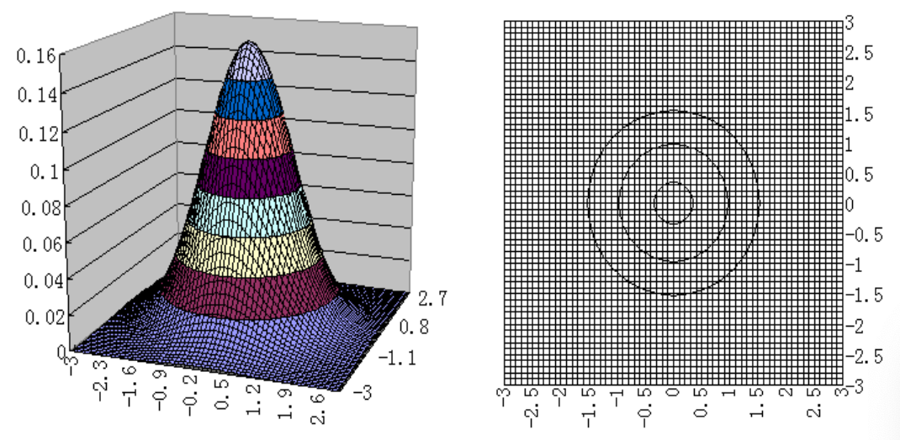

以下为 $(X, Y) \sim N(0,0 ; 1,1 ; \rho)$（其中 $\rho=0.5$）的顶曲面图及俯瞰图：
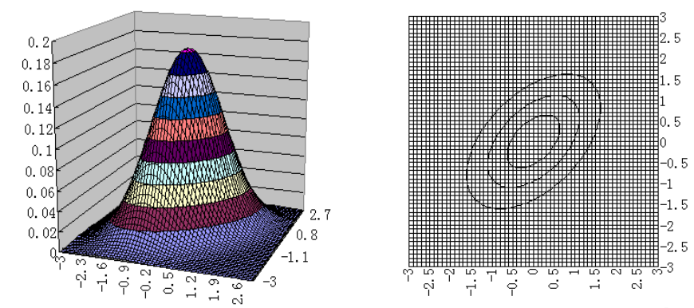

以下为 $(X, Y) \sim N(0,0 ; 1,1 ; \rho)$（其中 $\rho=-0.5$）的顶曲面图及俯瞰图：
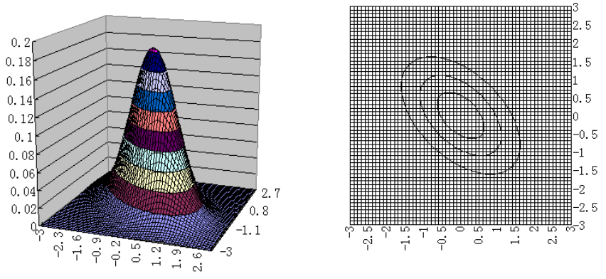

<Card type="Example" title="Example 16">
设二维随机变量 $(X, Y) \sim N(\mu_{1}, \mu_{2} ; \sigma_{1}^{2}, \sigma_{2}^{2} ; \rho)$，求：
1. $X$、$Y$ 的边际概率密度函数 $f_{X}(x)$、$f_{Y}(y)$
2. 条件概率密度 $f_{Y | X}(y | x)$、$f_{X | Y}(x | y)$

**Solution**：

1. 

$$

\begin{aligned} 
f_{X}(x) & =\int_{-\infty}^{+\infty} f(x, y) d y \\ 
& =\int_{-\infty}^{+\infty} \frac{1}{2 \pi \sigma_{1} \sigma_{2} \sqrt{1-\rho^{2}}} e^{-\frac{1}{2\left(1-\rho^{2}\right)}\left[\frac{\left(x-\mu_{1}\right)^{2}}{\sigma_{1}^{2}}-2 \rho \frac{\left(x-\mu_{1}\right)\left(y-\mu_{2}\right)}{\sigma_{1} \sigma_{2}}+\frac{\left(y-\mu_{2}\right)^{2}}{\sigma_{2}^{2}}\right]} d y \\ 
& =\int_{-\infty}^{+\infty} \frac{1}{2 \pi \sigma_{1} \sigma_{2} \sqrt{1-\rho^{2}}} e^{-\frac{\left(x-\mu_{1}\right)^{2}}{2 \sigma_{1}^{2}}} e^{-\frac{1}{2\left(1-\rho^{2}\right)}\left[\frac{y-\mu_{2}}{\sigma_{2}}-\rho \frac{x-\mu_{1}}{\sigma_{1}}\right]^{2}} d y \\ 
& =\frac{1}{\sqrt{2 \pi} \sigma_{1}} e^{-\frac{\left(x-\mu_{1}\right)^{2}}{2 \sigma_{1}^{2}}} \int_{-\infty}^{+\infty} \frac{1}{\sqrt{2 \pi} \sigma_{2} \sqrt{1-\rho^{2}}} e^{-\frac{1}{2 \sigma_{2}^{2}\left(1-\rho^{2}\right)}\left\{y-\left[\mu_{2}+\rho \frac{\sigma_{2}}{\sigma_{1}}\left(x-\mu_{1}\right)\right]\right\}^{2}} d y \\ 
& =\frac{1}{\sqrt{2 \pi} \sigma_{1}} e^{-\frac{\left(x-\mu_{1}\right)^{2}}{2 \sigma_{1}^{2}}}, \quad-\infty<x<+\infty 
\end{aligned}

$$

同理，$Y \sim N(\mu_{2}, \sigma_{2}^{2})$，且
$$
f_{Y}(y)=\frac{1}{\sqrt{2 \pi} \sigma_{2}} e^{-\frac{\left(y-\mu_{2}\right)^{2}}{2 \sigma_{2}^{2}}}, \quad-\infty<y<+\infty
$$
**结论**：
- 二元正态分布的边际分布是正态分布，并且都不依赖于参数 $\rho$；

2. 

$$
f_{Y | X}(y | x)=\frac{f(x, y)}{f_{X}(x)}=\frac{1}{\sqrt{2 \pi} \sigma_{2} \sqrt{1-\rho^{2}}} e^{-\frac{1}{2 \sigma_{2}^{2}\left(1-\rho^{2}\right)}\left\{y-\left[\mu_{2}+\rho \frac{\sigma_{2}}{\sigma_{1}}\left(x-\mu_{1}\right)\right]\right\}^{2}}
$$

- 在 $\{X=x\}$ 条件下，$Y$ 的条件分布是正态分布 $N\left(\mu_{2}+\rho \frac{\sigma_{2}}{\sigma_{1}}(x-\mu_{1}), (1-\rho^{2})\sigma_{2}^{2}\right)$；
- 在 $\{Y=y\}$ 条件下，$X$ 的条件分布是正态分布 $N\left(\mu_{1}+\rho \frac{\sigma_{1}}{\sigma_{2}}(y-\mu_{2}), (1-\rho^{2})\sigma_{1}^{2}\right)$。
</Card>

### 条件分布函数与条件概率密度函数的关系
$$
F_{X | Y}(x | y)=\int_{-\infty}^{x} f_{X | Y}(u | y) d u=\int_{-\infty}^{x} \frac{f(u, y)}{f_{Y}(y)} d u
$$

$$
F_{Y | X}(y | x)=\int_{-\infty}^{y} f_{Y | X}(v | x) d v=\int_{-\infty}^{y} \frac{f(x, v)}{f_{X}(x)} d v
$$

条件分布函数:

$$
F_{X | Y}(x | y)=P(X \leq x | Y=y)= \begin{cases}\sum_{x_{k} \leq x} P\left(X=x_{k} | Y=y\right), & 离散情形, \\ \int_{-\infty}^{x} f_{X | Y}(u | y) d u=\int_{-\infty}^{x} \frac{f(u, y)}{f_{Y}(y)} d u, & 连续情形. \end{cases}
$$

设 $(X, Y)$ 是二维连续型随机变量，则（注意比较）：
$$
P(a<X \leq b | Y=y)=\int_{a}^{b} f_{X | Y}(x | y) d x
$$

$$
P(a<X \leq b)=\int_{a}^{b} f_{X}(x) d x
$$

**说明**：联合分布、边缘分布、条件分布的关系如下：

## §3.4 Independence of Random Variables

<Card type="Definition" title="Definition 14 (随机变量的相互独立)">
设 $F(x, y)$ 及 $F_{X}(x)$ , $F_{Y}(y)$ 分别是二维随机变量 $(X, Y)$ 的联合分布函数及边际分布函数，若对所有的 $x, y \in \mathbb{R}$，有 
$$
P(X \leq x, Y \leq y)=P(X \leq x) P(Y \leq y),
$$
即 
$$
F(x, y)=F_{X}(x) F_{Y}(y), \forall x, y \in \mathbb{R},
$$
则称随机变量 $X, Y$ **相互独立**。
</Card>

- 若 $(X, Y)$ 是**离散型**随机变量，则 $X, Y$ 相互独立等价于 
   $$
   P\left(X=x_{i}, Y=y_{j}\right)=P\left(X=x_{i}\right) P\left(Y=y_{j}\right),
   $$
   即 $p_{i j}=p_{i \cdot} p_{\cdot j}$ 对一切 $i, j$ 都成立。

- 若 $(X, Y)$ 是**连续型**随机变量，$f(x, y)$ , $f_{X}(x)$ , $f_{Y}(y)$ 分别是 $(X, Y)$ 的联合概率密度函数和边际概率密度函数，则 $X, Y$ 相互独立等价于 
   $$
   f(x, y)=f_{X}(x) f_{Y}(y),  \,\text{几乎处处成立}
   $$
   即在平面上除去“面积”为零的集合以外，处处成立（可以在不连续点上不相等）。

<Card type="Example" title="Example 17">
在Example 10中，若 $(X, Y)$ 具有概率密度 
$
f(x, y)= \begin{cases}6 e^{-(2 x+3 y)}, & x > 0, y > 0, \\ 0, & 其他,\end{cases}
$

$X$ 和 $Y$ 的边际概率密度函数分别为 
$$
f_{X}(x)=\left\{ \begin{array} {ll}{2e^{-2 x},}&{x>0,}\\ {0,}&{x\leq 0,}\end{array} \right.,
$$
$$
f_{Y}(y)={\left\{ \begin{array} {ll}{3e^{-3y},}&{y>0,}\\ {0,}&{y\leq 0,}\end{array} \right.}
$$
故有对于任意的实数 $x, y$，有 $f(x, y)=f_{X}(x) f_{Y}(y)$，因而 $X, Y$ 是相互独立的。
</Card>

问：连续型随机变量 $X, Y$ 相互独立，其概率密度函数 $f(x, y)$ 有何特征？

<Card type="Theorem" title="Theorem 1">
若 $(X, Y)$ 为二维连续型随机变量，$f(x, y)$ 是 $(X, Y)$ 的联合概率密度函数，则连续型随机变量 $X, Y$ 相互独立的充分必要条件是 
$$
f(x, y)=m(x) \cdot n(y), \forall x, y \in \mathbb{R} .
$$
（注意范围，结合例子）
</Card>

<Card type="Question" title="思考题">

若随机变量 $(X, Y)$ 的联合概率密度函数如下所示，问哪些对应的 $X$ 与 $Y$ 是相互独立的？哪些不独立？并说明理由。
1. （独立）
$$
f(x, y)= \begin{cases}e^{-2 x}, & x>0,0<y<2, \\ 0, & 其他. \end{cases}
$$
2. （不独立）
$$
f(x, y)= \begin{cases}\frac{xy}{2}, & 0<x<y<2, \\ 0, & 其他. \end{cases}
$$
3. （不独立）
$$
f(x, y)= \begin{cases}x+y, & 0<x<1,0<y<1, \\ 0, & 其他. \end{cases}
$$
4. （独立）
$$
f(x, y)= \begin{cases}xy, & 0<x<2,0<y<1, \\ 0, & 其他. \end{cases}
$$
</Card>

<Card type="Example" title="Example 18">
若 $(X, Y)$ 具有联合概率分布律如下表：

| $X \setminus Y$ | 0   | 1   | $P(X = i)$ |
|-------------------|-----|-----|--------------|
| 1                 | 1/6 | 2/6 | 1/2          |
| 2                 | 1/6 | 2/6 | 1/2          |
| $P(Y = j)$      | 1/3 | 2/3 | 1            |

则
$$
P(X=1, Y=0)=\frac{1}{6}=P(X=1) P(Y=0),
$$
$$
P(X=2, Y=0)=\frac{1}{6}=P(X=2) P(Y=0),
$$
$$
P(X=1, Y=1)=\frac{2}{6}=P(X=1) P(Y=1),
$$
$$
P(X=2, Y=1)=\frac{2}{6}=P(X=2) P(Y=1),
$$
因而 $X, Y$ 是相互独立的。
</Card>

<Card type="Example" title="Example 19">
若 $(X, Y)$ 具有分布律如下表：

| $X \setminus Y$ | 0   | 1   | $P(X = i)$ |
|-------------------|-----|-----|--------------|
| 1                 | 1/6 | 2/6 | 1/2          |
| 2                 | 2/6 | 1/6 | 1/2          |
| $P(Y = j)$      | 1/2 | 1/2 | 1            |

而 
$$
P(X=1, Y=0)=\frac{1}{6} \neq P(X=1) P(Y=0)=\frac{1}{2} \times \frac{1}{2}=\frac{1}{4},
$$
因而 $X$ 与 $Y$ 不相互独立。
</Card>

<Card type="Example" title="Example 20">
设 $X$ 与 $Y$ 是相互独立的随机变量，已知 $(X, Y)$ 的联合分布律如下表，求其余未知的概率值。

| $X \setminus Y$ | 0    | 1    | 2    | $P(X = i)$ |
|-------------------|------|------|------|--------------|
| 1                 | 0.01 | 0.2  | 0.04 | 0.25         |
| 2                 | 0.03 | 0.6  | 0.12 | 0.75         |
| $P(Y = j)$      | 0.04 | 0.8  | 0.16 | 1            |
</Card>

<Card type="Example" title="Example 21">
证明：对于二维正态随机变量 $(X, Y) \sim N(\mu_{1}, \mu_{2} ; \sigma_{1}^{2}, \sigma_{2}^{2} ; \rho)$，$X$ 与 $Y$ 相互独立的充要条件是参数 $\rho=0$。

**Proof：**

因为 $(X, Y)$ 的概率密度为 
$$
f(x, y)=\frac{1}{2 \pi \sigma_{1} \sigma_{2} \sqrt{1-\rho^{2}}} e^{-\frac{1}{2\left(1-\rho^{2}\right)}\left[\frac{\left(x-\mu_{1}\right)^{2}}{\sigma_{1}^{2}}-2 \rho \frac{\left(x-\mu_{1}\right)\left(y-\mu_{2}\right)}{\sigma_{1} \sigma_{2}}+\frac{\left(y-\mu_{2}\right)^{2}}{\sigma_{2}^{2}}\right]},
$$
由Example 16可知每个分量各自的边际概率密度，故其乘积为 
$$
f_{X}(x) f_{Y}(y)=\frac{1}{2 \pi \sigma_{1} \sigma_{2}} e^{-\frac{1}{2}\left[\frac{\left(x-\mu_{1}\right)^{2}}{\sigma_{1}^{2}}+\frac{\left(y-\mu_{2}\right)^{2}}{\sigma_{2}^{2}}\right]} .
$$

“$\Leftarrow$” 如果 $\rho=0$，则对于所有 $x, y \in \mathbb{R}$，有 $f(x, y)=f_{X}(x) f_{Y}(y)$，故 $X, Y$ 相互独立。

“$\Rightarrow$” 反之，若 $X, Y$ 相互独立，由于 $f(x, y)$，$f_{X}(x)$，$f_{Y}(y)$ 都是连续函数，故对于所有的 $x, y \in \mathbb{R}$，有 $f(x, y)=f_{X}(x) f_{Y}(y)$。特别地，有 
$$
f\left(\mu_{1}, \mu_{2}\right)=f_{X}\left(\mu_{1}\right) f_{Y}\left(\mu_{2}\right) \Rightarrow \frac{1}{2 \pi \sigma_{1} \sigma_{2} \sqrt{1-\rho^{2}}}=\frac{1}{2 \pi \sigma_{1} \sigma_{2}} \Rightarrow \rho=0 .
$$
</Card>

<Card type="Example" title="Example 22">
设甲、乙两种元件的寿命 $X$、$Y$ 相互独立，服从同一分布，其概率密度函数均为 
$$
f(x)= \begin{cases}\frac{1}{2} e^{-\frac{x}{2}}, & x>0, \\ 0, & x \leq 0 .\end{cases}
$$
求甲元件寿命不大于乙元件寿命2倍的概率。

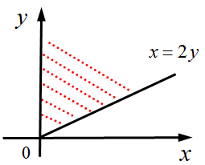

**Solution:**

$(X, Y)$ 的联合概率密度函数为 
$$
f(x, y)=f_{X}(x) f_{Y}(y)= \begin{cases}\frac{1}{4} e^{-\frac{x+y}{2}}, & x>0, y>0, \\ 0, & 其他.\end{cases}
$$
$$
P(X \leq 2 Y)=\iint_{x \leq 2 y} f(x, y) d x d y=\int_{0}^{+\infty}\left[\int_{\frac{x}{2}}^{+\infty} \frac{1}{4} e^{-\frac{x+y}{2}} d y\right] d x=\int_{0}^{+\infty} \frac{1}{2} e^{-\frac{3 x}{4}} d x=\frac{2}{3} .
$$
</Card>

### n 维随机变量的一些概念和性质
- n 维随机变量  
   设 $E$ 是一个随机试验，它的样本空间是 $S=\{e\}$。设 $X_{1}=X_{1}(e)$，$X_{2}=X_{2}(e)$，…，$X_{n}=X_{n}(e)$ 是定义在 $S$ 上的随机变量，由它们构成的一个 $n$ 维向量 $(X_{1}, X_{2}, ..., X_{n})$ 称为 $n$ 维随机变量（向量）。

- 联合分布函数  
   对于任意 $n$ 个实数 $x_{1}, x_{2}, ..., x_{n}$，$n$ 元函数 
   $$
   F\left(x_{1}, x_{2}, ..., x_{n}\right)=P\left(X_{1} \leq x_{1}, X_{2} \leq x_{2}, ..., X_{n} \leq x_{n}\right)
   $$
   称为 $n$ 维随机变量 $(X_{1}, X_{2}, ..., X_{n})$ 的联合分布函数。

- 离散型随机变量的联合分布律  
   设 $(X_{1}, X_{2}, ..., X_{n})$ 的所有可能取值为 $(x_{1 i_{1}}, x_{2 i_{2}}, ..., x_{n i_{n}})$（$i_{j}=1,2, ...$；$j=1,2, ..., n$），则 
   $$
   P\left(X_{1}=x_{1 i_{1}}, X_{2}=x_{2 i_{2}}, ..., X_{n}=x_{n i_{n}}\right), i_{j}=1,2, ... ; j=1,2, ..., n
   $$
   称为 $n$ 维离散型随机变量 $(X_{1}, X_{2}, ..., X_{n})$ 的联合分布律。

- 连续型随机变量的联合概率密度函数  
   若存在非负函数 $f(x_{1}, x_{2}, ..., x_{n})$ 使得对于任意实数 $x_{1}, x_{2}, ..., x_{n}$，有 
   $$
   F\left(x_{1}, x_{2}, ..., x_{n}\right)=\int_{-\infty}^{x_{1}} \int_{-\infty}^{x_{2}} ... \int_{-\infty}^{x_{n}} f\left(t_{1}, t_{2}, ..., t_{n}\right) d t_{1} d t_{2} \cdots d t_{n},
   $$
   则称 $f(x_{1}, x_{2}, ..., x_{n})$ 为 $n$ 维连续型随机变量 $(X_{1}, X_{2}, ..., X_{n})$ 的联合概率密度函数。

- 边际分布  
   若 $(X_{1}, X_{2}, ..., X_{n})$ 的联合分布函数 $F(x_{1}, x_{2}, ..., x_{n})$ 已知，则 $(X_{1}, X_{2}, ..., X_{n})$ 的任意 $k(1 ≤k ≤n)$ 维边际分布函数就随之确定。例如：
   1. 一维边际分布函数：
   $$
   F_{X_{1}}\left(x_{1}\right)=F\left(x_{1},+\infty,+\infty, ...,+\infty\right),
   $$
   2. 二维边际分布函数：
   $$
   F_{\left(X_{1}, X_{2}\right)}\left(x_{1}, x_{2}\right)=F\left(x_{1}, x_{2},+\infty,+\infty, ...,+\infty\right),
   $$
   3. 离散型一维边际分布律：
   $$
   P\left(X_{1}=x_{1 i_{1}}\right)=\sum_{i_{2}, i_{3}, ..., i_{n}} P\left(X_{1}=x_{1 i_{1}}, X_{2}=x_{2 i_{2}}, ..., X_{n}=x_{n i_{n}}\right),
   $$
   4. 离散型二维边际分布律：
   $$
   P\left(X_{1}=x_{1 i_{1}}, X_{2}=x_{2 i_{2}}\right)=\sum_{i_{3}, ..., i_{n}} P\left(X_{1}=x_{1 i_{1}}, X_{2}=x_{2 i_{2}}, ..., X_{n}=x_{n i_{n}}\right),
   $$
   5. 连续型一维边际概率密度：
   $$
   f_{X_{1}}\left(x_{1}\right)=\int_{-\infty}^{+\infty} \cdots \int_{-\infty}^{+\infty} f\left(x_{1}, x_{2}, ..., x_{n}\right) d x_{2} d x_{3} \cdots d x_{n},
   $$
   6. 连续型二维边际概率密度：
   $$
   f_{\left(X_{1}, X_{2}\right)}\left(x_{1}, x_{2}\right)=\int_{-\infty}^{+\infty} \cdots \int_{-\infty}^{+\infty} f\left(x_{1}, x_{2}, ..., x_{n}\right) d x_{3} d x_{4} \cdots d x_{n} .
   $$

- 相互独立  
   若对于所有的 $x_{1}, x_{2}, ..., x_{n} \in \mathbb{R}$，有 
   $$
   F\left(x_{1}, x_{2}, ..., x_{n}\right)=F_{X_{1}}\left(x_{1}\right) F_{X_{2}}\left(x_{2}\right) \cdots F_{X_{n}}\left(x_{n}\right),
   $$
   则称 $X_{1}, X_{2}, ..., X_{n}$ 是相互独立的。

- $(X_{1}, X_{2}, ..., X_{m})$ 与 $(Y_{1}, Y_{2}, ..., Y_{n})$ 的独立性  
   设 $(X_{1}, X_{2}, ..., X_{m})$ 的分布函数为 $F_{1}(x_{1}, x_{2}, ..., x_{m})$，$(Y_{1}, Y_{2}, ..., Y_{n})$ 的分布函数为 $F_{2}(y_{1}, y_{2}, ..., y_{n})$，$(X_{1}, X_{2}, ..., X_{m}, Y_{1}, Y_{2}, ..., Y_{n})$ 的分布函数为 $F(x_{1}, x_{2}, ..., x_{m}, y_{1}, y_{2}, ..., y_{n})$。若
   $$
   F\left(x_{1}, x_{2}, ..., x_{m}, y_{1}, y_{2}, ..., y_{n}\right)=F_{1}\left(x_{1}, x_{2}, ..., x_{m}\right) F_{2}\left(y_{1}, y_{2}, ..., y_{n}\right),
   $$
   则称 $(X_{1}, X_{2}, ..., X_{m})$ 与 $(Y_{1}, Y_{2}, ..., Y_{n})$ 相互独立。

<Card type="Theorem" title="Theorem 2">
设 $(X_{1}, X_{2}, ..., X_{m})$ 与 $(Y_{1}, Y_{2}, ..., Y_{n})$ 相互独立，则 $X_{i}(i=1,2, ..., m)$ 与 $Y_{j}(j=1,2, ..., n)$ 相互独立。
</Card>

<Card type="Theorem" title="Theorem 3">
设 $(X_{1}, X_{2}, ..., X_{m})$ 与 $(Y_{1}, Y_{2}, ..., Y_{n})$ 相互独立，若 $h(x_{1}, x_{2}, ..., x_{m})$ 和 $g(y_{1}, y_{2}, ..., y_{n})$ 是连续函数，则 $h(X_{1}, X_{2}, ..., X_{m})$ 与 $g(Y_{1}, Y_{2}, ..., Y_{n})$ 相互独立。
</Card>

### 独立性的几点说明
- $X, Y$ 相互独立，则 $f(X)$ 与 $g(Y)$ 也相互独立，其中 $f(\cdot)$ 与 $g(\cdot)$ 均为一元连续函数；
- 任意常数 $C$ 与任意随机变量 $X$ 均独立；
- $X, Y$ 相互独立，则 $\{X \in A\}$ 与 $\{Y \in B\}$ 两个事件也相互独立。

## §3.5 多维随机变量函数的分布(Functions of Multivariate Random Variables)
设二维离散型随机变量 $(X, Y)$ 具有概率分布 
$$
P\left(X=x_{i}, Y=y_{j}\right)=p_{i j}, i, j=1,2, ...
$$

请问：
1. 设 $Z=g(X, Y)$，则 $Z$ 的分布律是什么？  
   1. 先确定 $Z$ 的可能取值 $z_{i}$（$i=1,2, ...$）；
   2. 再找出 $\{Z=z_{i}\}=\{(X, Y) \in D\}$；
   3. 从而计算出分布律。

2. 设 $U=u(X, Y)$，$V=v(X, Y)$，则 $(U, V)$ 的分布律是什么？  
   1. 先确定 $(U, V)$ 的可能取值 $(u_{i}, v_{j})$（$i, j=1,2, ...$）；
   2. 再找出 $\{U=u_{i}, V=v_{j}\}=\{(X, Y) \in D\}$；
   3. 从而计算出分布律。

<Card type="Example" title="Example 23">
设 $X$ 与 $Y$ 的联合分布律为

| $X \setminus Y$ | 1   | 2   |
|-------------------|-----|-----|
| 1                 | 0.2 | 0.1 |
| 2                 | 0.3 | 0.4 |

令 $U=X+Y$，$V=\max (X, Y)$，求 $(U, V)$ 的联合分布律。

**Solution:**
$(U, V)$ 的联合分布律如下表所示：

| $V \setminus U$ | 2   | 3   | 4   |
|-------------------|-----|-----|-----|
| 1                 | 0.2 | 0   | 0   |
| 2                 | 0   | 0.4 | 0.4 |
</Card>

<Card type="Example" title="Example 24">
设 $X$ 的概率密度函数为 $f(x)= \begin{cases}e^{-x}, & x > 0 \\ 0, & x \leq0\end{cases}$，令 $U=\begin{cases}1, & X > 1 \\ 0, & X \leq1\end{cases}$，$V=\begin{cases}1, & X > 2 \\ 0, & X \leq2\end{cases}$，求 $(U, V)$ 的联合分布律。

**Solution:**

由 $U, V$ 的定义，$(U, V)$ 的联合分布律为 
$$
P(U=1, V=1)=P(X>1, X>2)=P(X>2)=e^{-2}
$$
$$
P(U=1, V=0)=P(X>1, X \leq 2)=P(1<X \leq 2)=e^{-1}-e^{-2}
$$
$$
P(U=0, V=1)=P(X \leq 1, X>2)=0
$$
$$
P(U=0, V=0)=P(X \leq 1, X \leq 2)=P(X \leq 1)=1-e^{-1}
$$
</Card>

### $Z=X+Y$ 的分布（离散型）
若 $(X, Y)$ 为二维离散型随机变量，联合分布律为 
$$
P\left(X=x_{i}, Y=y_{j}\right)=p_{i j}, i, j=1,2, ...
$$

设 $Z$ 的可能取值为 $z_{1}, z_{2}, ..., z_{k}, ...$，则 $Z=X+Y$ 的分布律为 
$$
P\left(Z=z_{k}\right)=P\left(X+Y=z_{k}\right)=\sum_{i=1}^{+\infty} P\left(X=x_{i}, Y=z_{k}-x_{i}\right), k=1,2, ...
$$
或 
$$
P\left(Z=z_{k}\right)=P\left(X+Y=z_{k}\right)=\sum_{j=1}^{+\infty} P\left(X=z_{k}-y_{j}, Y=y_{j}\right), k=1,2, ...
$$

特别的，当 $X$ 与 $Y$ 相互独立时，
$$
P\left(Z=z_{k}\right)=\sum_{i=1}^{+\infty} P\left(X=x_{i}\right) P\left(Y=z_{k}-x_{i}\right), k=1,2, ...
$$
或 
$$
P\left(Z=z_{k}\right)=\sum_{j=1}^{+\infty} P\left(X=z_{k}-y_{j}\right) P\left(Y=y_{j}\right), k=1,2, ...
$$

<Card type="Example" title="Example 25">
设随机变量 $X \sim P(\lambda_{1})$，$Y \sim P(\lambda_{2})$，且 $X, Y$ 相互独立。若 $Z=X+Y$，求 $Z$ 的概率分布律。

**Solution:**

由题意，$X$ 和 $Y$ 的概率分布律为 
$$
P(X=i)=\frac{\lambda_{1}^{i} e^{-\lambda_{1}}}{i !}, i=0,1, ... ; P(Y=j)=\frac{\lambda_{2}^{j} e^{-\lambda_{2}}}{j !}, j=0,1, ...
$$

首先可得 $Z$ 的可能取值为 $0, 1, ...$。

因 $X, Y$ 相互独立，所以 $Z$ 的概率分布律为 

$$

\begin{aligned} 
P(Z=k) & =\sum_{i=0}^{+\infty} P(X=i) P(Y=k-i) \\ 
& =\sum_{i=0}^{k} \frac{\lambda_{1}^{i} e^{-\lambda_{1}}}{i !} \frac{\lambda_{2}^{k-i} e^{-\lambda_{2}}}{(k-i) !}+\sum_{i=k+1}^{+\infty} \frac{\lambda_{1}^{i} e^{-\lambda_{1}}}{i !} \cdot 0 \\
& =e^{-\left(\lambda_{1}+\lambda_{2}\right)} \sum_{i=0}^{k} \frac{1}{i !(k-i) !} \lambda_{1}^{i} \lambda_{2}^{k-i} \\
& =\frac{e^{-\left(\lambda_{1}+\lambda_{2}\right)}}{k !} \sum_{i=0}^{k} \frac{k !}{i !(k-i) !} \lambda_{1}^{i} \lambda_{2}^{k-i} \\
& =\frac{\left(\lambda_{1}+\lambda_{2}\right)^{k} e^{-\left(\lambda_{1}+\lambda_{2}\right)}}{k !}, k=0,1, ... 
\end{aligned}

$$
即 $Z \sim P(\lambda_{1}+\lambda_{2})$。

</Card>

## $Z=X+Y$ 的分布（连续型）
若 $(X, Y)$ 为二维连续型随机变量，其联合概率密度函数为 $f(x, y)$，则 $Z=X+Y$ 的分布函数为 
$$

\begin{aligned}
F_{Z}(z)&=P(X+Y \leq z)\\
&=\iint_{x+y \leq z} f(x, y) d x d y\\
&=\int_{-\infty}^{+\infty}\left[\int_{-\infty}^{z-x} f(x, y) d y\right] d x\\
&\stackrel{u=x+y}{=} \int_{-\infty}^{+\infty}\left[\int_{-\infty}^{z} f(x, u-x) d u\right] d x\\
&=\int_{-\infty}^{z}\left[\int_{-\infty}^{+\infty} f(x, u-x) d x\right] d u\\
&= \int_{-\infty}^{z} f_{Z}(u) d u
\end{aligned}

$$

因此，$Z$ 的概率密度函数为 
$$
f_{Z}(z)=\int_{-\infty}^{+\infty} f(x, z-x) d x
$$
由 $X$ 与 $Y$ 的对称性，也可写为 
$$
f_{Z}(z)=\int_{-\infty}^{+\infty} f(z-y, y) d y
$$

### 卷积公式
当 $X$ 和 $Y$ 相互独立时，$Z=X+Y$ 的概率密度函数公式称为卷积公式，即 
$$
f_{X} * f_{Y}=\int_{-\infty}^{+\infty} f_{X}(x) f_{Y}(z-x) d x=\int_{-\infty}^{+\infty} f_{X}(z-y) f_{Y}(y) d y
$$

<Card type="Example" title="Example 26">
设 $X$ 和 $Y$ 是相互独立的标准正态随机变量，求 $Z=X+Y$ 的概率密度函数。

**Solution:**
由于 $X$ 与 $Y$ 相互独立，故利用卷积公式可得 
$$

\begin{aligned} 
f_{Z}(z) & =\int_{-\infty}^{+\infty} f_{X}(x) f_{Y}(z-x) d x \\ 
& =\frac{1}{2 \pi} \int_{-\infty}^{+\infty} e^{-\frac{x^{2}}{2}} e^{-\frac{(z-x)^{2}}{2}} d x \\
& =\frac{1}{2 \pi} e^{-\frac{z^{2}}{4}} \int_{-\infty}^{+\infty} e^{-\left(x-\frac{z}{2}\right)^{2}} d x 
\end{aligned}

$$

令 $t=x-\frac{z}{2}$，则 
$$

\begin{aligned}
f_{Z}(z)&=\frac{1}{2 \pi} e^{-\frac{z^{2}}{4}} \int_{-\infty}^{+\infty} e^{-t^{2}} d t\\
&=\frac{1}{2 \pi} e^{-\frac{z^{2}}{4}} \sqrt{\pi}\\
&=\frac{1}{2 \sqrt{\pi}} e^{-\frac{z^{2}}{4}}
\end{aligned}

$$
即 $Z \sim N(0,2)$。
</Card>

<Card type="Corollary" title="Corollary 1">
设 $X \sim N(\mu_{1}, \sigma_{1}^{2})$，$Y \sim N(\mu_{2}, \sigma_{2}^{2})$，且 $X, Y$ 相互独立，则 
$$
X+Y \sim N\left(\mu_{1}+\mu_{2}, \sigma_{1}^{2}+\sigma_{2}^{2}\right)
$$
更一般地，有 
$$
a X+b Y+c \sim N\left(a \mu_{1}+b \mu_{2}+c, a^{2} \sigma_{1}^{2}+b^{2} \sigma_{2}^{2}\right)
$$

**补**：四个分布的卷积
</Card>

<Card type="Example" title="Example 27">
设 $X$ 和 $Y$ 相互独立同分布，均服从$[0, 1]$ 上的均匀分布，求 $Z=X+Y$ 的密度函数。

**Solution:**

由于 $X$ 与 $Y$ 相互独立，故利用卷积公式可得 
$$
f_{Z}(z)=\int_{-\infty}^{+\infty} f_{X}(x) f_{Y}(z-x) d x
$$

上述积分的被积函数不为零当且仅当 
$$

\left\{\begin{array} { l } 
{ 0 \leq x \leq 1 } \\ 
{ 0 \leq z - x \leq 1 } 
\end{array} \Leftrightarrow \left\{\begin{array}{l} 
0 \leq x \leq 1 \\ 
z-1 \leq x \leq z 
\end{array}\right.\right.

$$

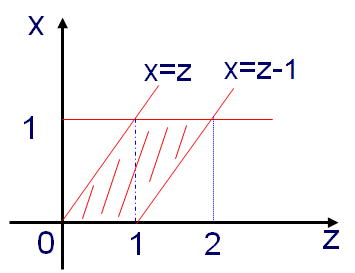

于是 
$$

f_{Z}(z)= 
\begin{cases}
\int_{0}^{z} 1 d x=z, & 0<z<1 \\ 
\int_{z-1}^{1} 1 d x=2-z, & 1 \leq z<2 \\ 
0, & 其他
\end{cases}

$$
</Card>

<Card type="Example" title="Example 28">
设 $(X, Y)$ 的联合概率密度为 $f(x, y)= \begin{cases}3 x, & 0<y<x<1 \\ 0, & 其他\end{cases}$，求 $Z=X+Y$ 的概率密度。

**Solution:**

利用公式 $f_{Z}(z)=\int_{-\infty}^{+\infty} f(x, z-x) d x$（不可以用卷积公式，因为 $X$ 与 $Y$ 不独立），其中 
$$
f(x, z-x)= \begin{cases}3 x, & 0<z-x<x<1 \\ 0, & 其他\end{cases}
$$

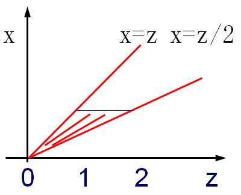

于是 
$$

f_{Z}(z)= 
\begin{cases}
\int_{\frac{z}{2}}^{z} 3 x d x=\frac{9}{8} z^{2}, & 0<z<1 \\ 
\int_{\frac{z}{2}}^{1} 3 x d x=\frac{3}{2}\left(1-\frac{z^{2}}{4}\right), & 1 \leq z<2 \\ 
0, & 其他
\end{cases}

$$
</Card>

<Card type="Example" title="Example 29">
某人一天做两份工作，一份工作的酬金 $X$ 为10元、20元、30元的概率各为$\frac{1}{3}$，另一份工作的酬金 $Y \sim N(15,4)$，且设 $X, Y$ 相互独立。记一天的酬金总数为 $Z=X+Y$，求：
1. $Z$ 的概率密度函数；
2. 一天酬金多于30元的概率。

**Solution:**

1. 先求 $Z$ 的分布函数，利用全概率公式 
$$

\begin{aligned}
F_{Z}(z)&=P(X+Y \leq z)\\
&=\sum_{i=1}^{3} P(X+Y \leq z | X=10i) P(X=10i)
\end{aligned}

$$

$$

\begin{aligned}
F_{Z}(z) & =\sum_{i=1}^{3} P(X+Y \leq z | X=10i) P(X=10i) \\ 
& =\frac{1}{3}[P(Y \leq z-10 | X=10)+P(Y \leq z-20 | X=20)+P(Y \leq z-30 | X=30)] \\ 
& =\frac{1}{3}[P(Y \leq z-10)+P(Y \leq z-20)+P(Y \leq z-30)] \\ 
& =\frac{1}{3}\left[F_{Y}(z-10)+F_{Y}(z-20)+F_{Y}(z-30)\right]
\end{aligned}

$$

因此 
$$
f_{Z}(z)=F_{Z}'(z)=\frac{1}{6 \sqrt{2 \pi}}\left[e^{-\frac{(z-25)^{2}}{8}}+e^{-\frac{(z-35)^{2}}{8}}+e^{-\frac{(z-45)^{2}}{8}}\right]
$$

2. 由上题的结果 
$$

\begin{aligned}
P(Z>30) & =1-F_{Z}(30) \\ 
& =1-\frac{1}{3}\left[F_{Y}(20)+F_{Y}(10)+F_{Y}(0)\right] \\ 
& =1-\frac{1}{3}\left[\Phi\left(\frac{5}{2}\right)+\Phi\left(-\frac{5}{2}\right)+\Phi\left(-\frac{15}{2}\right)\right] \\ 
& \approx \frac{2}{3}
\end{aligned}

$$
</Card>

### $M=\max (X, Y)$，$N=\min (X, Y)$ 的分布
设 $X, Y$ 是两个相互独立的随机变量，它们的分布函数分别为 $F_{X}(x)$ 和 $F_{Y}(y)$。

于是$M$ 的分布函数
$$

\begin{aligned} 
F_{\max }(z) & =P(M \leq z)\\
&=P(X \leq z, Y \leq z) \quad (\text{这里无需独立})\\
&=P(X \leq z) P(Y \leq z) \\ 
&=F_{X}(z) F_{Y}(z)
\end{aligned}

$$

$N$ 的分布函数
$$

\begin{aligned} 
F_{\min }(z) & =P(N \leq z)\\
&=1-P(N>z) \\ 
&=1-P(X>z, Y>z) \quad (\text{这里无需独立})\\
&=1-P(X>z) P(Y>z) \\ 
&=1-\left[1-F_{X}(z)\right]\left[1-F_{Y}(z)\right]
\end{aligned}

$$

### 推广到 $n$ 个相互独立的随机变量情形
设 $X_{1}, X_{2}, ..., X_{n}$ 是 $n$ 个相互独立的随机变量，它们的分布函数分别为 $F_{X_{i}}(x_{i})$（$i=1,2, ..., n$）。

$M=\max _{1 \leq i \leq n} X_{i}$ 的分布函数

$$
F_{\max }(z)=F_{X_{1}}(z)F_{X_{2}}(z)\cdots F_{X_{n}}(z)
$$

$N=\min _{1 \leq i \leq n} X_{i}$ 的分布函数

$$
F_{\min }(z)=1-[1-F_{X_{1}}(z)][1-F_{X_{2}}(z)]\cdots [1-F_{X_{n}}(z)]
$$

特别的，当 $X_{1}, X_{2}, ..., X_{n}$ 相互独立且具有相同分布函数 $F(x)$ 时，
$$
F_{\max }(z)=[F(z)]^{n}, F_{\min }(z)=1-[1-F(z)]^{n}
$$

<Card type="Example" title="Example 30">
$X$ 与 $Y$ 独立同分布，均服从 $U(0,1)$，求 $M=\max (X, Y)$，$N=\min (X, Y)$ 的概率密度函数。

**Solution:**

$X, Y$ 的分布函数均为 $F(x) = \begin{cases}0, & x<0 \\ x, & 0 \leq x<1 \\ 1, & x \geq 1\end{cases}$

于是 $M=\max (X, Y)$ 的分布函数为 
$$
F_{M}(x)=[F(x)]^{2}=\left\{\begin{array}{ll}0, & x<0 \\ x^{2}, & 0 \leq x<1 \\ 1, & x \geq 1\end{array}\right.
$$
其概率密度函数为 
$$
f_{M}(x)= \begin{cases}2 x, & 0<x<1 \\ 0, & 其他\end{cases}
$$

$N=\min (X, Y)$ 的分布函数为 
$$
F_{N}(x)=1-[1-F(x)]^{2}= \begin{cases}0, & x<0 \\ 1-(1-x)^{2}, & 0 \leq x<1 \\ 1, & x \geq 1\end{cases}
$$
其概率密度函数为 
$$
f_{N}(x)= \begin{cases}2(1-x), & 0<x<1 \\ 0, & 其他\end{cases}
$$
</Card>

<Card type="Example" title="Example 31">
设系统 $L$ 由两个相互独立的子系统 $L_{1}$，$L_{2}$ 联结而成，联结的方式分别为：(1) 串联；(2) 并联；(3) 备用（当系统 $L_{1}$ 损坏时，系统 $L_{2}$ 开始工作）。设 $L_{1}$，$L_{2}$ 的寿命分别为 $X, Y$，已知它们的概率密度分别为 
$$
f_{X}(x)=\left\{ \begin{array} {ll}{\alpha e^{-\alpha x},}&{x>0} \\ {0,}&{x\leq 0}\end{array} \right., f_{Y}(y)=\left\{ \begin{array} {ll}{\beta e^{-\beta y},}&{y>0} \\ {0,}&{y\leq 0}\end{array} \right., (\alpha >0,\beta >0,\alpha \neq \beta)
$$
试分别就以上三种联结方式写出 $L$ 的寿命 $Z$ 的概率密度。

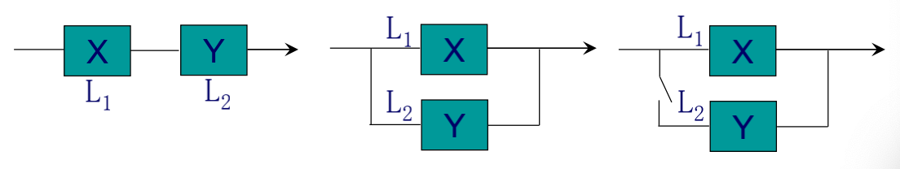

**Example 31 (串联情形)**

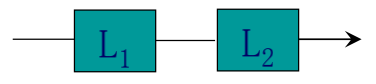

当 $L_{1}$，$L_{2}$ 中有一个损坏时，系统 $L$ 就停止工作，所以 $L$ 的寿命为 $Z=\min (X, Y)$。因此 $Z$ 的分布函数为 
$$
F_{Z}(z)=1-\left[1-F_{X}(z)\right]\left[1-F_{Y}(z)\right]= \begin{cases}1-e^{-(\alpha+\beta) z}, & z>0 \\ 0, & z \leq 0\end{cases}
$$
于是 $Z$ 的概率密度函数为 
$$
f_{Z}(z)= \begin{cases}(\alpha+\beta) e^{-(\alpha+\beta) z}, & z>0 \\ 0, & z \leq 0\end{cases}
$$
即 $Z$ 仍服从指数分布。

**Example 31 (并联情形)**

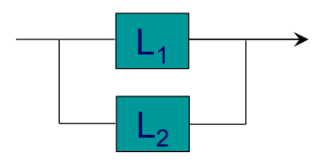

当且仅当 $L_{1}$，$L_{2}$ 都损坏时，系统 $L$ 才停止工作，所以 $L$ 的寿命为 $Z=\max (X, Y)$。因此 $Z$ 的分布函数为 
$$
F_{Z}(z)=F_{X}(z) F_{Y}(z)= \begin{cases}\left(1-e^{-\alpha z}\right)\left(1-e^{-\beta z}\right), & z>0 \\ 0, & z \leq 0\end{cases}
$$
于是 $Z$ 的概率密度函数为 
$$
f_{Z}(z)= \begin{cases}\alpha e^{-\alpha z}+\beta e^{-\beta z}-(\alpha+\beta) e^{-(\alpha+\beta) z}, & z>0 \\ 0, & z \leq 0\end{cases}
$$

**Example 31 (备用情形)**

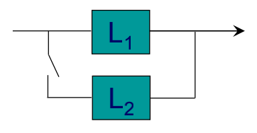

当系统 $L_{1}$ 损坏时，系统 $L_{2}$ 才开始工作，所以整个系统 $L$ 的寿命 $Z$ 是 $L_{1}$，$L_{2}$ 寿命之和，即 $Z=X+Y$。因此当 $z \leq0$ 时，$f_{Z}(z)=0$；当 $z>0$ 时，由卷积公式 
$$

\begin{aligned}
f_{Z}(z)&=\int_{-\infty}^{+\infty} f_{X}(z-y) f_{Y}(y) d y\\
&=\int_{0}^{z} \alpha e^{-\alpha(z-y)} \beta e^{-\beta y} d y\\
&=\frac{\alpha \beta}{\beta-\alpha}\left(e^{-\alpha z}-e^{-\beta z}\right)
\end{aligned}

$$
即 
$$
f_{Z}(z)= \begin{cases}\frac{\alpha \beta}{\beta-\alpha}\left(e^{-\alpha z}-e^{-\beta z}\right), & z>0 \\ 0, & z \leq 0\end{cases}
$$
</Card>

<Card type="Example" title="Example 32">
设 $Z=A X+(1-A) Y$，$A \sim B(1, p)$，$F_{X}(x)$，$F_{Y}(y)$ 已知，且 $A, X, Y$ 相互独立。
1. 求 $Z$ 的分布函数 $F_{Z}(z)$；
2. 若 $p=\frac{1}{2}$，$P(X=2)=1$，$Y \sim U(0,1)$，求 $F_{Z}(z)$，并判断此时 $Z$ 是什么类型的随机变量？

**Solution:**

1. 由全概率公式，$Z$ 的分布函数 
$$

\begin{aligned}
F_{Z}(z) & =P(Z \leq z)\\
&=P(A X+(1-A) Y \leq z) \\ 
&=P(A=1) P(A X+(1-A) Y \leq z | A=1)+P(A=0) P(A X+(1-A) Y \leq z | A=0) \\ 
&=P(A=1) P(X \leq z | A=1)+P(A=0) P(Y \leq z | A=0) \\ 
&=p P(X \leq z)+(1-p) P(Y \leq z)\\
&=p F_{X}(z)+(1-p) F_{Y}(z)
\end{aligned}

$$

2. 由题意，可知 $X$ 和 $Y$ 的分布函数为 
$$
F_{X}(x)=\left\{\begin{array}{ll} 0, & x<2 \\ 1, & x \geq 2 \end{array}\right., F_{Y}(y)= \begin{cases}0, & y<0 \\ y, & 0 \leq y<1 \\ 1, & y \geq 1\end{cases}
$$
又 $p=\frac{1}{2}$，故 $Z$ 的分布函数为 
$$
F_{Z}(z)=\frac{1}{2} F_{X}(z)+\frac{1}{2} F_{Y}(z)= \begin{cases}0, & z<0 \\ \frac{z}{2}, & 0 \leq z<1 \\ \frac{1}{2}, & 1 \leq z<2 \\ 1, & z \geq 2\end{cases}
$$

$Z$ 的分布函数如图所示：
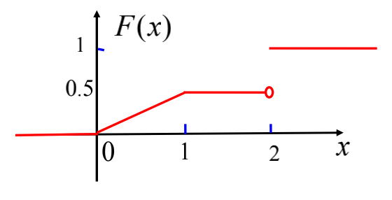

由此判断 $Z$ 既不是连续型也不是离散型的随机变量。
</Card>

谢谢！