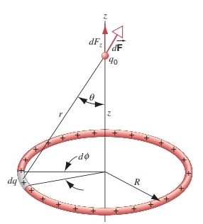

# 25-1 Electromagnetism: A Preview

| 时间 | 事件 |
| ---- | ---- |
| 600 BC | Electric and magnetic minerals (ancient Greeks) |
| 1600AD | Electric and magnetic attractions [Gilbert 1544 - 1603, 英国] |
| 1785 | Force between electric charges (Coulomb 1736 - 1806, 法国) |
| 1800 | Invention of battery (Volta, 1745 - 1827, 意大利) |
| 1820.8.21 | Currents deflect magnetic compass (Oersted, 1777 - 1851, 丹麦) |
| 1825 | Magnetic fields caused by currents (Ampere, 1775 - 1836, 法国) |
| 1827 | Electric conduction (Ohm, 1789 - 1854, 德国) |
| 1829 | Electric motor (Henry, 1797 - 1878, 美国) |
| 1831 | Currents induced by magnetic fields (Faraday, 1791 - 1867, 英国) |
| 1864 | Equations of electromagnetism (Maxwell, 1831 - 1879, 英国) |
| 1887 | Electromagnetic waves (Hertz, 1857 - 1894, 德国) |
| 1897 | Discovery of electron (Thomson, 1824 - 1907, 英国) |
| 1905 | Special theory of relativity (Einstein, 1879 - 1955, 德国) |
| 1949 | Quantum electrodynamics (Dirac, Dyson, Feynman) |
| 1967 | Electroweak theory (Glashow, Weinberg, Salam) |

# 25-2 What About Charges, etc?

Electric Charge (电荷)：  
- Attribute of body (物质组成的一部分)
- Unlike charges attract (异性相吸)
- Like charges repel (同性相斥)	  

## Charge is quantized (量子化)

实验表明，电荷总是以某个基本电荷量 **e** 的整数倍形式存在。也就是说：

$$
q = n e \quad n = 0,\pm1,\pm2,\pm3,\ldots,\quad(25 - 1)
$$

其中（保留四位有效数字）：

$$
e=1.602\times10^{-19}\mathrm{C}.
$$

Why the charge is quantized is that there are two kinds of elementary charged particles inside atoms: proton (质子)  and  electron (电子)

尽管我们认为电子是基本粒子且没有内部结构，但质子并非基本粒子。它们由更基本的实体——夸克(quark)构成。夸克被赋予分数电荷值 $-\frac{1}{3}e$ 和 $+\frac{2}{3}e$。质子由三个夸克组成：两个带 $+\frac{2}{3}e$ 电荷的夸克和一个带 $-\frac{1}{3}e$ 电荷的夸克，其净电荷为 $+e$。关于质子内存在夸克的实验证据非常充分（例如，高能电子可以与质子内的分数电荷夸克发生散射），但无论怎样剧烈地碰撞质子，都从未释放出自由夸克。因此，也从未观测到具有分数电荷的自由粒子。如果夸克之间的吸引力随其分离距离的增加而增强，这一现象就可以得到解释。这与电磁力和引力形成对比——这两种力都会随着相互作用物体间距离的增加而减弱。

$ 1n, 1p=3 \text{ quarks} $

Quark: 

$$ 
\boxed{-\frac{1}{3}e} \quad \boxed{\frac{2}{3}e} 
$$

$$ 
1p(+e)=2 \times (\frac{2}{3}e)+(-\frac{1}{3}e) 
$$

$$
 1n(0)=2 \times (-\frac{1}{3}e)+\frac{2}{3}e 
$$
# 25-3 Law of Electrical Force

## Coulomb's Law (库仑定律)

The force from 1 acting on 2

$$
 \vec{F}_{12} = \frac{1}{4\pi\varepsilon_0} \frac{q_1q_2}{r_{12}^2} \hat{r}_{12} 
$$

We call this group of constants $\frac{1}{4\pi\varepsilon_0} = 9 \times 10^9 \text{ N-m}^2/\text{C}^2 $ “$ k $” as in: $ F = k \frac{q_1q_2}{r^2} $

MKS Units:

- $ r $ in meters
- $ q $ in Coulombs
- $ \vec{F} $ in Newtons
- $ \hat{r}_{12} $ is a unit vector pointing from 1 to 2

This force has same spatial dependence as the gravitational force, BUT there is NO mention of mass here!!

The strength of the force between two objects is determined by the charge of the two objects, and the separation between them.

## The significance of Coulomb's law

- The significance of Coulomb's law goes far beyond the description of the forces between charged spheres.

- Coulomb's law +quantum physics correctly describes

  - In an atom: the electrical force that bind the electron of an atom to its nucleus.
  - In molecule: the forces that bind atoms together.
  - In solid, liquids: the force that bind atoms and molecules together.

- Most of the forces of our daily experience that are not gravitational in nature are electrical.
- Newton's law of gravitation can be considered a useful everyday approximation of the more basic general theory of relativity (广义相对论).
- While Coulomb's laws an exact result for stationary charges and not an approximation form some higher law.
- It hold not only for ordinary objects, but also for the most fundamental "point" particles such as electrons and quarks. Coulomb's law remains valid in the quantum limit.

# 25-4 Conductors & Insulators

## Conductors vs Insulators

### Insulators (绝缘体)
- **Definition**: In these materials, once they are charged, the charges ARE NOT FREE TO MOVE.
- **Examples**: 
  - Plastics, glass, and other "bad conductors of electricity"
  - e.g., Glass, Plastics, Dry wood
- **Conduction electrons**: On the average, less than 1 conduction electron per cubic centimeter

### Conductors (导体)
- **Definition**: In these materials, the charges ARE FREE TO MOVE. Metals are good examples of conductors. The charge can flow easily through them.
- **Examples**: 
  - e.g., Aluminum, Copper, Iron, Silver
- **Conduction electrons**: There might be on the average about $10^{23}$ conduction electrons per cubic centimeter

## Semiconductor and Superconductor

### Semiconductor (半导体)
- **Conduction electrons**: They might contain $10^{10}$ ~ $10^{12}$ conduction electrons per cubic centimeter.
- **Properties**: The density of conduction electrons changes drastically with the small changes of external conditions (impurity, applied voltage, temperature, incident light density).
- **Examples**: e.g., Silicon, Germanium

### Superconductor (超导体) $R=0$, $B=0$
- **Examples**:
  - $\text{Hg}$ ($T_{c}=4.2K$, 1911)
  - $\text{NbSn}$ ($T_{c}=23K$, 1969)
  - $\text{YBa}_2\text{Cu}_3\text{O}_7$ ($T_{c}=90K$, 1987)
  - $\text{HgBaCaCuO}$ ($T_{c}=156K$, 1988)
  - $\text{ReO}_{1-x}\text{F}_{x}\text{FeAs}$ ($T_{c}=55K$, 2008)
  - $\text{(BaK)Fe}_{2}\text{As}_{2}$ ($T_{c}=38K$, 2008)
  - $\text{H}_{3}\text{S}$ ($T_{c}=210K$, High Pressure, 2016)
  - $\text{LaH}_{10}$ ($T_{c}=250K$, High Pressure, 2019)
  - $\text{Fe(Te,Se)}$ ($T_{c}=14K$, 2008)
  - $\text{(Tl,K,Rb,Cs)Fe}_{x}\text{Se}_{2}$ ($T_{c}=30K$, 2010)
  - $\text{TlNi}_{2}\text{Se}_{2}, \text{TiNi}_{2}\text{S}_{2}$ ($T_{c}=3.7K$, 2013)

# 25-5  Continuous Charge Distribution

到目前为止，我们学习了如何计算点电荷产生的力。然而在许多实际应用中，带电物体（如棒、板或固体）会产生电场力。为简化问题，我们假设这些物体是绝缘体，其电荷均匀分布在表面或体积中，形成连续的电荷分布。

基本方法是把电荷分割成无限小的单元，再运用微积分方法计算所有单元产生的总作用力。 The basic philosophy to deal with continuous charge distributions is *to divide the charge into infinitesimal charged elements* .
 
Each element  is  regarded as a point charge. The full charge distribution is regarded as an infinite set of point charges.

There are 3 kinds of such densities:

1. Linear Charge density $ \lambda $: (线电荷密度)  $ \lambda = \frac{dq}{dx} $
2. Surface Charge Density $ \sigma $: (面电荷密度)  $ \sigma = \frac{dq}{dA} $
3. Volume Charge Density $ \rho $: (体电荷密度)  $ \rho = \frac{dq}{dV} $

## 求一个物体对一个点电荷的作用力

计算连续电荷分布对点电荷作用力的步骤如下：

1. 将连续电荷分布想象为大量微小电荷单元的集合
2. 选取任意电荷单元，根据电荷分布维度（线/面/体）选用公式25-9、25-10或25-11表示其电荷量dq
3. 由于$dq$无限微小，可视为点电荷。根据库仑定律（公式25-4）表示该单元对$q_0$的作用力大小dF：
   $$ 
   dF = \frac{1}{4\pi\epsilon_{0}} \frac{|dq||q_{0}|}{r^{2}} \quad (25-12) 
   $$
   其中r为$dq$与$q_0$之间的距离
4. 根据$dq$和$q_0$的符号及空间位置确定力元dF的方向
5. 通过对所有无限小力元求和得到总作用力，即进行积分运算：

$$ 
\overrightarrow{F} = \int d\overrightarrow{F} \quad (25-13) 
$$

在执行这个积分时，我们通常需要考虑不同电荷单元dq产生的力元d$\overrightarrow{F}$可能指向不同方向。公式25-13实际上是一个矢量积分，这意味着我们需要分别计算x、y（以及可能的z）方向上的分量，然后进行合成。

具体来说，对于每个电荷单元dq：
1. 首先根据库仑定律计算其产生的力元大小dF（公式25-12）
2. 然后确定该力元的方向（通常是沿着dq与q₀的连线方向）
3. 将这个力元分解为x、y、z方向的分量dF_x、dF_y、dF_z
4. 最后对所有电荷单元的各个分量分别进行积分：
   $$ F_x = \int dF_x $$
   $$ F_y = \int dF_y $$
   $$ F_z = \int dF_z $$

这样得到的总力就是：
$$ \overrightarrow{F} = F_x \hat{i} + F_y \hat{j} + F_z \hat{k} $$

在实际计算中，选择合适的坐标系（如直角坐标系、柱坐标系或球坐标系）可以大大简化积分过程。特别是当电荷分布具有某种对称性时（比如轴对称或球对称），往往可以通过选择适当的坐标系使得某些方向的积分为零，从而简化计算。

## Examples

### A Uniform Line of Charge

Figure 25-11 shows a thin rod of length $L$ that lies along the z axis and carries a uniformly distributed positive charge $q$, so that its linear charge density is $\lambda = q/L$. We want to find the force exerted by the rod on a positive point charge $q_0$, located on the perpendicular bisector of the rod (the positive y axis) a distance y from its center.

The figure shows the results of performing steps 1, 2, and 3 of our procedure. We imagine the rod divided into small elements of length $dz$. An arbitrary element of charge $dq = \lambda \, dz$ is located a distance $z$ from its center and exerts a force $d\vec{F}$ on $q_0$, where
$$
d\vec{F} = \frac{1}{4\pi\epsilon_0} \frac{q_0 dq}{r^2} \hat{r}.
$$
The direction of the force $d\vec{F}$ is shown in the figure. There is no component of $d\vec{F}$ in the x direction (perpendicular to the rod), so $F_x = 0$. We can also use a symmetry argument to show that $F_z = 0$. For every charge element $dq$ located at position + z, there is another charge element $dq$ located at $-z$. When we add the forces due to the charge elements at + z and $-z$, we find that the z components have equal magnitudes but point in opposite directions, so their sum is zero. Because the charge $q_0$ is located in the median plane of the rod, this cancellation will occur for every such pair of charge elements along the entire length of the rod. We therefore conclude that $F_z = 0$.

Only $F_y$ remains to be calculated. The element $d\vec{F}_y = d\vec{F} \cos \theta$ is shown in Fig. 25-11. With $dq = \lambda \, dz$, $r^2 = y^2 + z^2$, and $\cos \theta = y/r$, we have
$$
dF_y = dF \cos \theta = \frac{1}{4\pi\epsilon_0} \frac{q_0 \lambda dz}{(y^2 + z^2)} \frac{y}{\sqrt{y^2 + z^2}}.
$$
$$
F_y = \int dF_y = \frac{1}{4\pi\epsilon_0} q_0 \lambda y \int_{-L/2}^{L/2} \frac{dz}{(y^2 + z^2)^{3/2}}.
$$
Evaluating the integral (see Appendix I and note that $y$ is a constant), we obtain
$$
F_y = \frac{1}{4\pi\epsilon_0} \frac{q_0 q}{y \sqrt{y^2 + L^2/4}}.
$$
(25-15)

This force is in the positive y direction when $q_0$ and $q$ are positive. If the charge $q_0$ is moved to other locations in the xy plane, the expression for the force may change (see Exercise 14).

It is often instructive to evaluate expressions such as this one in various limiting cases. Let us consider the result when $y \gg L$, in which case the force becomes
$$
F_y = \frac{1}{4\pi\epsilon_0} \frac{q_0 q}{y^2},
$$
which is just the expression for the force of one point charge on another. When we are very far from the charged rod, or when the rod is very small, it looks like a point charge.

### A Ring of Charge

图25-12展示了一个半径为$R$的细环，携带均匀分布的正电荷$q$，因此其线性电荷密度为$\lambda = q/2\pi R$。我们希望找到环对位于环轴（我们选择为正z轴）上，距离环中心$z$的正点电荷$q_0$施加的力。环的一个小电荷元素的长度为$R \, d\phi$，因此携带电荷$dq = \lambda R \, d\phi$。由$dq$对$q_0$施加的力$d\vec{F}$为
$$
d\vec{F} = \frac{1}{4\pi\epsilon_0} \frac{q_0 dq}{r^2} = \frac{1}{4\pi\epsilon_0} \frac{q_0 \lambda R \, d\phi}{(z^2 + R^2)}.
$$
我们可以使用对称性论证来确定$\vec{F}$的唯一非零分量是它的z分量。对于环上的每个电荷元素$dq$，环中心直径的另一端将有一个等量电荷$dq$的元素；当这两个电荷元素对$q_0$的力元素相加时，除了$F_z$之外的所有力分量都将相互抵消。由于$\cos \theta = z/r$，我们得到
$$
\begin{aligned}
F_z = \int dF_z = \int dF \cos \theta \\
= \frac{1}{4\pi\epsilon_0} \frac{q_0 \lambda R \, d\phi}{(z^2 + R^2)} \frac{z}{\sqrt{z^2 + R^2}} \\
= \frac{1}{4\pi\epsilon_0} \frac{q_0 \lambda R z}{(z^2 + R^2)^{3/2}} \int_0^{2\pi} d\phi.
\end{aligned}
$$
环上的积分结果为$2\pi$，因此力的最终结果为
$$
F_z = \frac{1}{4\pi\epsilon_0} \frac{q_0 q z}{(z^2 + R^2)^{3/2}}.
$$
(25-16)

如果$q_0$位于负z轴上，这个结果是否仍然有效？（见练习15。）

我们可以在$z \rightarrow \infty$的极限情况下检查这个结果。对于$z \gg R$，我们得到
$$
F_z = \frac{1}{4\pi\epsilon_0} \frac{q_0 q}{z^2},
$$
这再次给出了点电荷的结果。当我们远离环时，它看起来像一个点电荷。

还要注意，当$z = 0$时，$F_z = 0$。这是合理的，因为在环的中心，电荷$q_0$会被组成环的电荷元素均匀地向所有方向推动。

### A Disk of Charge

图25-13展示了一个半径为$R$的圆盘，其表面均匀分布着正电荷$q$，因此其表面电荷密度为$\sigma = q/\pi R^2$。一个正点电荷$q_0$位于圆盘的轴上（正z轴），距离圆盘中心$z$。为了找到圆盘对点电荷施加的力，我们可以将圆盘划分为一系列同心圆环。图25-13中半径为$w$的圆环上的电荷为$dq = \sigma \, dA = \sigma (2\pi w \, dw) = 2\pi \sigma w \, dw$。这个圆环对$q_0$施加的力$d\vec{F}$可以通过使用方程25-16来找到，其中$\sigma$被替换为$dq$，$R$被替换为$w$：
$$
d\vec{F}_z = \frac{1}{4\pi\epsilon_0} \frac{q_0 (2\pi \sigma w \, dw) z}{(z^2 + w^2)^{3/2}}.
$$

为了加上所有圆环的力元素，我们对$w$从0到$R$进行积分：
$$
F_z = \frac{1}{4\pi\epsilon_0} \frac{q_0 2\pi \sigma z}{R^2} \int_0^R \frac{w \, dw}{(z^2 + R^2)^{3/2}}.
$$
$$
= \frac{1}{4\pi\epsilon_0} \frac{2q_0 q}{R^2} \left(1 - \frac{z}{\sqrt{z^2 + R^2}}\right).
$$
[怎么积的](./supp.Fuck-your-MA#ref-ch-25-1)

# 25-6 Charge is conserved (电荷守恒)

- Experiments show that in any physical process happened in a closed system, the algebraic sum of the total charges remains invariant.

- Examples
  - $e^{+}+e^{-}\rightarrow 2\gamma$
  - $n\rightarrow p+e^{-}+\tilde{\nu}_{e}$
  - $\pi^{0}\rightarrow 2\gamma$

-----

A positively charged rod is held near a neutral conducting sphere suspended by an insulating thread. The sphere will
(C) remain neutral, but be attracted to the rod anyway.

由于球通过绝缘线悬挂，**没有电荷转移，因此球整体保持中性**。