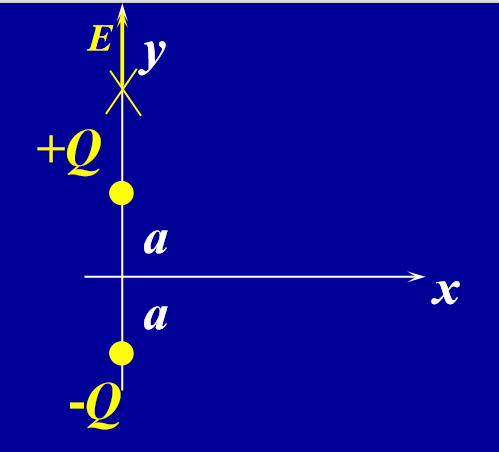

# 26-1  What is a Field (场)?

A FIELD is something that can be defined anywhere in space

- It can be a scalar field (标量场, e.g., Temperature field)
- It can be a vector field (矢量场, e.g., Electric field)

- Fields represent physical quantities (物理量的空间分布).

## Example: Gravitation field (引力场) $ \vec{g} $

The procedure for measuring the gravitational field

- use a test body of small mass $ m_{0} $
- release in the gravitational field
- measure F
- gravitational field:
$$ 
\vec{g}=\frac{\vec{F}}{m_0} 
$$

$$ 
\vec{g}(\vec{r})=-G\frac{M}{r^{2}}\hat{r} 
$$

$ m_{0} $ is small, does not disturb the mass distribution.

The Moon can not be as a test mass.

## Note about gravitation fields

- The force between gravitating bodies was thought of as a direct and instantaneous interaction, action at a distance (超距相互作用).This view violates the special theory of relativity 人们曾认为引力体之间的作用力是一种直接的、瞬时的相互作用，即超距作用。这种观点违反了狭义相对论。 *mass&lt;=>mass*

- A more modern interpretation (现代解释): *mass&lt;=>field&lt;=>mass*

# 28-2 The Electric field (电场)

Coulomb's law $ \vec{F} = \frac{1}{4\pi\varepsilon_0} \frac{Qq_0}{r^2} \hat{r} $ 
Charge Field Charge

1. Calculate the force that the field exerts on the second charge placed at particular point in space.
2. Determine, by measurement or calculation, the field established by first charge at every point in space.

$$ \vec{E} = \lim_{q_0 \to 0} \frac{\vec{F}}{q_0} $$ 

$ q_0 > 0, \vec{E}, \vec{F} $ in the same direction

# 28-3 The Electric field of point charge (点电荷产生的电场)

$\vec{F}=\frac{1}{4 \pi \varepsilon_{0}} \frac{q q_{0}}{r^{2}} \hat{r}$ 

$$
\color{blue}\boxed{\vec{E}=\frac{\vec{F}}{q_{0}}=\frac{1}{4 \pi \varepsilon_{0}} \frac{q}{r^{2}} \hat{r} }
$$  

The direction of $\vec{E}$ is the same as the direction of $\vec{F}$,along a radial line from q, pointing outward if q is positive, and inward if q is negative.

A group of N point charges (Law of Superposition)：$\vec{E}=\sum_{i=1}^{N} \vec{E}_{i}$

## Reality of Electric Fields

- 电场被引入作为一种数学上的便利工具，就像物理学I中的引力场一样 The electric field has been introduced as a mathematical convenience, just as the gravitational field of Physics I 

- 电场远不止于此！ 重要特性：电场以光速传播 There is MUCH MORE to electric fields than this! IMPORTANT FEATURE: E field propagates at speed of light

- 没有瞬时超距作用（我们将在讨论电磁波时解释这一点）  
  也就是说，当电荷移动时，时间t处的合成电场取决于在时间t−dt时电荷的位置  
  NO instantaneous action at a distance (we will explain this when we discuss electromagnetic waves)
  i.e., as charge moves, resultant E-field at time t depends upon where charge was at time $ t-dt $

- 目前，我们通过将自己限制在电场源静止的情况下来避免这些复杂情况。For now, we avoid these complications by restricting ourselves to situations in which the source of the E-field is at rest.

## Electric Dipole (电偶极矩)

*Important*

Two equal but opposite charges separated by a small distance form an electric dipole (电偶极子)

- $ E_{x} = $ ?  
   Coulomb Force Radial : $ E_{x}(0, y) = 0 $ 

- $ E_{y} = $ ?  
  Vertical Component :  
  $ E_{y}(0, y) = \frac{Q}{4\pi\varepsilon_{0}} \left( \frac{1}{(y-a)^2} - \frac{1}{(y+a)^2} \right) $  
  $ E_{y}(0, y) = \boxed{\frac{Q}{4\pi\varepsilon_{0}} \frac{4ay}{y^4 \left( 1 - \frac{a^2}{y^2} \right)^2}} $

- For **points along x-axis**: 

  - $ E_{x}(r, 0)=0 $

  - $ E_{y}(r, 0)=-2 \frac{1}{4 \pi \varepsilon_{0}} \frac{Q a}{\left(r^{2}+a^{2}\right)^{3 / 2}} $

  For  $\mathbf{r \gg a}$

  $$ 
  \color{blue}\boxed{E_{y}(r, 0) \approx-2 \frac{1}{4 \pi \varepsilon_{0}} \frac{Q a}{r^{3}}} 
  $$

- For **points along y-axis**: 

  - $ E_{x}(0, r)=0 $

  - $ E_{y}(0, r)=\frac{Q}{4 \pi \varepsilon_{0}} \frac{4 a r}{r^{4}\left(1-\frac{a^{2}}{r^{2}}\right)^{2}} $

  - For $\mathbf{r \gg a}$

  $$ 
  \color{blue}\boxed{E_{y}(0, r) \approx+4 \frac{1}{4 \pi \varepsilon_{0}} \frac{Q a}{r^{3}}}
  $$

