# 26 Electric Field

### 1. **电场的定义**
- **电场强度定义**：
  $$
  \vec{E} = \frac{\vec{F}}{q_0}
  $$
  - $ q_0 $：正检验电荷
  - 方向：与正电荷受力方向相同

- **更严谨定义（考虑检验电荷影响）**：
  $$
  \vec{E} = \lim_{q_0 \to 0} \frac{\vec{F}}{q_0}
  $$

- **电场力公式**：
  $$
  \vec{F} = q \vec{E}
  $$

---

### 2. **点电荷的电场**
- **单个点电荷**：
  $$
  E = \frac{1}{4\pi\epsilon_0} \frac{|q|}{r^2}
  $$
  - 方向：径向向外（正电荷）或向内（负电荷）

- **多个点电荷的电场叠加**：
  $$
  \vec{E} = \sum \vec{E}_n
  $$

---

### 3. **电偶极子**
- **电偶极矩**：
  $$
  p = qd,\quad \vec{p} \text{ 方向：负→正}
  $$

- **中垂线上电场（远处）**：
  $$
  E \approx \frac{1}{4\pi\epsilon_0} \frac{p}{x^3}
  $$

- **电场中电偶极子所受力矩**：
  $$
  \vec{\tau} = \vec{p} \times \vec{E}
  $$

- **电势能**：
  $$
  U = -\vec{p} \cdot \vec{E} = -pE \cos\theta
  $$

---

### 4. **连续电荷分布的电场**

#### 🔹 均匀带电直线（长度 L，电荷密度 λ）
- **中垂线上点 P**：
  $$
  E_y = \frac{1}{4\pi\epsilon_0} \frac{\lambda L}{y \sqrt{y^2 + L^2/4}}
  $$
- **无限长带电直线**：
  $$
  E = \frac{\lambda}{2\pi\epsilon_0 y}
  $$

#### 🔹 均匀带电圆环（半径 R，总电荷 q）
- **轴线上点**：
  $$
  E_z = \frac{1}{4\pi\epsilon_0} \frac{qz}{(z^2 + R^2)^{3/2}}
  $$

#### 🔹 均匀带电圆盘（半径 R，面密度 σ）
- **轴线上点**：
  $$
  E_z = \frac{\sigma}{2\epsilon_0} \left(1 - \frac{z}{\sqrt{z^2 + R^2}}\right)
  $$

#### 🔹 无限大带电平面：
  $$
  E = \frac{\sigma}{2\epsilon_0}
  $$

#### 🔹 均匀带电球壳（半径 R，总电荷 q）
- **球壳外**：
  $$
  E = \frac{1}{4\pi\epsilon_0} \frac{q}{r^2}
  $$
- **球壳内**：
  $$
  E = 0
  $$

#### 🔹 均匀带电球体（半径 R，总电荷 Q）
- **球内**：
  $$
  E = \frac{1}{4\pi\epsilon_0} \frac{Qr}{R^3}
  $$
- **球外**：
  $$
  E = \frac{1}{4\pi\epsilon_0} \frac{Q}{r^2}
  $$

---

### 5. **电场线**
- **性质**：
  - 切线方向 = 电场方向
  - 始于正电荷，止于负电荷
  - 密度 ∝ 电场强度

- **典型电场线图**：
  - 点电荷：径向
  - 电偶极子：从正到负
  - 均匀电场：平行等距

---

### 6. **电荷在电场中的运动**
- **牛顿第二定律**：
  $$
  \sum \vec{F} = m\vec{a} = q\vec{E} + \text{其他力}
  $$

- **匀强电场中运动**：
  - 加速度恒定
  - 轨迹为抛物线（若初速度不平行于电场）

- **密立根油滴实验**：
  - 电荷量子化：$ q = ne $
  - 元电荷：$ e \approx 1.60 \times 10^{-19} \, \text{C} $

---

### 7. **常见电场强度数量级（N/C）**
| 场景 | 电场强度 |
|------|----------|
| 铀核表面 | $ 3 \times 10^{21} $ |
| 空气击穿 | $ 3 \times 10^{6} $ |
| 复印机滚筒 | $ 1 \times 10^{5} $ |
| 家庭电路导线内 | $ 1 \times 10^{-2} $ |

---

### 8. **重要常数**
- 真空介电常数：
  $$
  \epsilon_0 = 8.85 \times 10^{-12} \, \text{C}^2/\text{N·m}^2
  $$
- 库仑常数：
  $$
  \frac{1}{4\pi\epsilon_0} = 8.99 \times 10^9 \, \text{N·m}^2/\text{C}^2
  $$

### 26-1 WHAT IS A FIELD?
The temperature has a definite value at every point in the room in which you are sitting. You can measure the temperature at each point by putting a thermometer there. You could then represent that temperature distribution either by drawing a map of the room showing the measured temperature at each point, or else by specifying a mathematical function $T(x, y, z)$ that can be used to calculate the temperature at any point $(x, y, z)$. This distribution of temperature, represented either as a map or a function, is called a temperature field. In a similar way we might measure the pressure at each point and so determine the pressure field. These two fields are examples of scalar fields, because the temperature and the pressure are scalar quantities. If the temperature or pressure do not vary with time, they are also static fields; otherwise they are time-varying fields that might be represented mathematically by a time-dependent function such as $T(x, y, z, t)$.

If, on the other hand, you wanted to measure the velocity at every point in a flowing fluid, you would need to specify the value of the velocity vector at each point. Once again, you could draw a map showing the magnitude and direction of the velocity at any point, or you could specify a mathematical function $\overrightarrow{v}(x, y, z)$ that would allow the flow velocity to be calculated at any point. This is an example of a vector field.

The Earth’s gravitational field is another example of a vector field. You might measure the value of the gravitational force at any point by attaching a test mass $m_{0}$ to a spring scale. You could then determine the magnitude and direction of the gravitational force $\overrightarrow{F}$ at any point, and you could present your results either by drawing a map showing the magnitude and direction of the force at various points or by specifying a mathematical function $\overrightarrow{F}(x, y, z)$. However, such a map would not be useful to other people unless they used exactly the same test mass that you used. Since the force you measure is directly proportional to the value of the test mass, a better procedure would be to produce a map showing not the force on your test mass but instead the force per unit test mass, or $\overrightarrow{F} / m_{0}$. This quantity, which would have units of N/kg, would be independent of the value of the test mass $m_{0}$. Choosing a test mass of a different size would give exactly the same map with the same values of the force per unit mass at every point. We call the quantity $\overrightarrow{F} / m_{0}$ the gravitational field. You will recognize it as also being equal to the free-fall acceleration $\overrightarrow{g}$ at any point:
$$
\vec{g}=\frac{\vec{F}}{m_{0}} \quad (26-1)
$$

The field $\overrightarrow{g}$ is a vector whose direction gives the direction of the gravitational force at that point and whose magnitude indicates the “strength” of the gravitational effect at that point. We could find the force on a mass $m$ at any point by multiplying $\overrightarrow{g}$ at that point by the value of the mass:
$$
\vec{F}=m \vec{g} \quad (26-2)
$$

In this chapter, we will develop the useful concept of an electric field based on a similar procedure that involves determining the electrical force per unit charge (rather than the gravitational force per unit mass). Because a force is involved, the electric field is a vector field. For now we deal only with static fields, but later when we discuss electromagnetic radiation we will consider time-varying electric fields.

Before the concept of fields became widely accepted, the force exerted by one gravitating body on another was thought of as a direct and instantaneous interaction. This view, called action at a distance, was also used for electromagnetic forces. In the case of gravitation, it can be represented schematically as
$$
mass \rightleftarrows mass,
$$
indicating that the two masses interact directly with one another. According to this view, the effect of a movement of one body is instantaneously transmitted to the other body. This view violates the special theory of relativity, which limits the speed at which such information can be transmitted to the speed of light $c$ at most. The present interpretation, based on the field concept, can be represented as
$$
mass \rightleftarrows field \rightleftarrows mass,
$$
in which each mass interacts not directly with the other but instead with the gravitational field established by the other. That is, the first mass sets up a field that has a certain value at every point in space; the second mass then interacts with the field at its particular location. The field plays the role of an intermediary between the two bodies. The force exerted on the second mass can be calculated from Eq. 26-2, given the value of the field $\overrightarrow{g}$ due to the first mass. The situation is completely symmetrical from the point of view of the first mass, which interacts with the gravitational field established by the second mass. Changes in the location of one mass cause variations in its gravitational field; these variations travel at the speed of light, so the field concept is consistent with the restrictions imposed by special relativity.

---

### 26-1 什么是场？
你所在的房间里，每个点都有一个确定的温度值。你可以通过在每个点放置温度计来测量温度，之后既可以绘制一张标注各点测量温度的房间地图，也可以定义一个数学函数$T(x, y, z)$，用它来计算任意点$(x, y, z)$的温度。这种以地图或函数形式表示的温度分布，被称为温度场。类似地，我们可以测量每个点的压强，进而确定压强场。这两种场都是标量场的例子，因为温度和压强都是标量。如果温度或压强不随时间变化，它们就是静态场；否则就是时变场，可用$T(x, y, z, t)$这类含时间变量的数学函数表示。

另一方面，若想测量流动流体中每个点的速度，就需要明确每个点的速度矢量。同样，你可以绘制一张标注任意点速度大小和方向的地图，也可以定义数学函数$\overrightarrow{v}(x, y, z)$来计算任意点的流速。这是矢量场的一个例子。

地球的引力场是另一个矢量场实例。你可以通过将一个检验质量$m_{0}$挂在弹簧秤上来测量任意点的引力大小：先确定任意点引力$\overrightarrow{F}$的大小和方向，再通过绘制标注各点引力大小和方向的地图，或定义数学函数$\overrightarrow{F}(x, y, z)$来呈现结果。但这样的地图只有在他人使用与你完全相同的检验质量时才有用。由于测量到的引力与检验质量成正比，更合理的做法是绘制“单位检验质量所受引力”（即$\overrightarrow{F}/m_{0}$）的地图。这个物理量的单位是牛/千克（N/kg），且与检验质量$m_{0}$的大小无关——即使选择不同质量的检验体，得到的地图在各点的单位质量引力值也完全相同。我们将$\overrightarrow{F}/m_{0}$称为引力场，它其实等同于任意点的自由落体加速度$\overrightarrow{g}$：
$$
\vec{g}=\frac{\vec{F}}{m_{0}} \quad (26-1)
$$

引力场$\overrightarrow{g}$是矢量，其方向与该点引力方向一致，大小则反映该点引力作用的“强弱”。若要计算质量为$m$的物体在任意点受到的引力，只需将该点的$\overrightarrow{g}$与质量$m$相乘：
$$
\vec{F}=m \vec{g} \quad (26-2)
$$

本章中，我们将基于类似的思路引入电场的概念——电场的定义依据是“单位电荷所受的电场力”（而非引力场中的“单位质量所受引力”）。由于涉及力的作用，电场也是矢量场。目前我们仅讨论静态电场，后续涉及电磁辐射时，会进一步探讨时变电场。

在“场”的概念被广泛接受之前，人们认为两个有引力的物体之间的作用力是直接且瞬时的相互作用，这种观点被称为超距作用，当时也用于解释电磁力。对于引力，超距作用可示意表示为：
$$
质量 \rightleftarrows 质量
$$
即两个质量直接相互作用。按照这一观点，一个物体的运动变化会瞬时传递给另一个物体，但这违背了狭义相对论——相对论限定这类信息的传递速度最高不能超过光速$c$。基于场概念的现代解释则示意表示为：
$$
质量 \rightleftarrows 场 \rightleftarrows 质量
$$
即每个质量并非直接与另一个质量相互作用，而是与对方建立的引力场相互作用。具体来说，第一个质量会在空间中所有点建立起一个引力场，第二个质量则在自身所在位置与该引力场发生作用。场充当了两个物体之间的中介：已知第一个质量产生的引力场$\overrightarrow{g}$，就可通过式（26-2）计算第二个质量受到的引力。从第一个质量的角度来看，情况完全对称——它会与第二个质量建立的引力场相互作用。一个质量位置的变化会引起其引力场的变化，而这种变化以光速传播，因此场的概念与狭义相对论的限定是一致的。

### 26-2 THE ELECTRIC FIELD
The previous description of the gravitational field can be carried directly over to electrostatics. Coulomb's law for the force of one electric charge on another encourages us to think in terms of action at a distance, represented as 
$$charge \rightleftarrows charge.$$

Again introducing the field as an intermediary between the charges, we can represent the interaction as 
$$charge \rightleftarrows field \rightleftarrows charge.$$

That is, the first charge sets up an electric field, and the second charge interacts with the electric field of the first charge. Our problem of determining the interaction between the charges is therefore reduced to two separate problems: (1) determine, by measurement or calculation, the electric field established by the first charge at every point in space, and (2) calculate the force that the field exerts on the second charge placed at a particular point in space.

In analogy with Eq. 26-1 for the gravitational field, we define the electric field $\overrightarrow{E}$ associated with a certain collection of charges in terms of the force exerted on a positive test charge $q_{0}$ at a particular point, or 
$$\vec{E}=\frac{\vec{F}}{q_{0}} . (26-3)$$

The direction of the vector $\overrightarrow{E}$ is the same as the direction of $\overrightarrow{F}$ because $q_{0}$ is a positive scalar. Defined in this way, the electric field is independent of the magnitude of the test charge $q_{0}$.

Figure 26-1 suggests how we use this definition to determine the electric field at a particular point P. We place a positive test charge $q_{0}$ at P and we determine the electrostatic force on $q_{0}$ due to objects in the surrounding area, which are not shown in the figure. Equation 26-3 then gives the electric field shown in Fig. 26-1b. Note that $\overrightarrow{E}$ and $\overrightarrow{F}$ are parallel, as they must be from the definition of Eq. 26-3.

(a)
(b)
FIGURE 26-1. (a) Charged objects in the environment exert a force $\overrightarrow{F}$ on a positive test charge $q_{0}$ at point P. (b) The electric field at point P due to the charged objects in the environment.

* We usually specify that the test mass $m_{0}$ must be small. That is, we do not want it to change the Earth's gravitational field. If, for instance, we used a test mass of the size of the Moon, its gravitational force on the Earth would cause tidal effects that would change the distribution of mass on the Earth and thus change the gravitational force at various locations. To prevent this from happening, we keep $m_{0}$ much smaller than the mass of the Earth.

Dimensionally, the electric field is the force per unit charge, and its SI unit is the newton/coulomb (N/C), although it is more often given, as we discuss in Chapter 28, in the equivalent unit of volt/meter (V/m). Note the similarity with the gravitational field, in which $\overrightarrow{g}$ (which is usually expressed in units of $m/s^2$) can also be expressed as the force per unit mass in units of newton/kilogram (N/kg). Both the gravitational and electric fields can be expressed as a force divided by a property (mass or charge) of the test body. Table 26-1 shows some electric fields that occur in a few situations.

TABLE 26-1 Some Electric Fields
| Location | Electric Field (N/C) |
| --- | --- |
| At the surface of a uranium nucleus | $3 \times 10^{21}$ |
| In a hydrogen atom, at the electron’s average radius | $5 \times 10^{11}$ |
| Electric breakdown occurs in air | $3 \times 10^{6}$ |
| At the charged drum of a photocopier | $1 \times 10^{5}$ |
| The electron beam accelerator in a TV set | $1 \times 10^{5}$ |
| Near a charged plastic comb | $1 \times 10^{3}$ |
| In the lower atmosphere | $1 \times 10^{2}$ |
| Inside the copper wire of household circuits | $1 \times 10^{-2}$ |

As we did in Eq. 26-2 for the gravitational force on a body, we can use the electric field to calculate the force on any charged body. Once we have found the electric field at a point (using our test body, for instance), we can find the electric force exerted on any object of charge $q$ at that location as 
$$\vec{F}=q \vec{E} . \quad(26-4)$$

Here the electric field $\overrightarrow{E}$ is caused by other charges that may be present, not by the charge $q$. Equation 26-4 is simply a way of specifying the force that these other charges exert on $q$.

We can now understand how the electric field acts as an intermediary in the interaction between two charges $q_{1}$ and $q_{2}$. As illustrated in Fig. 26-2a, charge $q_{1}$ located at A sets up an electric field at all surrounding points. Let $\overrightarrow{E}_{1}$ be its value at location B. We can find the value of the field by placing our test charge at B and measuring the force exerted on it by $q_{1}$. If we place a different charge $q_{2}$ at B, it will experience an electric force $\overrightarrow{F}_{21}$, which we can calculate using Eq. 26-4: $\overrightarrow{F}_{21}=q_{2} \overrightarrow{E}_{1}$ (Fig. 26-2b). The situation is completely symmetric: we could instead first use the test charge to determine the field $\overrightarrow{E}_{2}$ at A due to $q_{2}$ (Fig. 26-2c). Then placing $q_{1}$ at A, we find the force exerted on $q_{1}$ by $q_{2}$: $\overrightarrow{F}_{12}=q_{1} \overrightarrow{E}_{2}$ (Fig. 26-2d). From Newton’s third law the forces are equal and opposite $(\overrightarrow{F}_{21}=-\overrightarrow{F}_{12})$, even though the electric fields set up by the two charges are different.

q1 q2
A B A B
(a) (b)
A B A B
←E2 q1 F12 q1 q2
(c) (d)
FIGURE 26-2. (a) $q_{1}$ at A sets up an electric field at B. (b) The electric field at B exerts a force on $q_{2}$. (c) $q_{2}$ at B sets up an electric field at A. (d) The electric field at A exerts a force on $q_{1}$. Note that $\overrightarrow{F}_{12}=-\overrightarrow{F}_{21}$.

To use Eq. 26-3 as an operational procedure for measuring the electric field, we must apply the same caution we did in using a test mass to measure the gravitational field: the test charge should be sufficiently small so that it does not disturb the distribution of charges whose electric field we are trying to measure. That is, we should more properly write Eq. 26-3 as 
$$\vec{E}=\lim _{q_{0} \to 0} \frac{\vec{F}}{q_{0}}, \quad(26-5)$$
even though we know from Chapter 25 that this limit in actuality cannot be taken to zero because the test charge can never be smaller than the elementary charge $e$. Of course, if we are calculating (rather than measuring) the electric field due to a specified collection of charges at fixed positions, neither the magnitude nor the sign of $q_{0}$ affects the result. As we show later in this chapter, electric fields of collections of charges can be calculated using Eq. 26-3 and Coulomb's law without direct reference to Eq. 26-5.

### 26-2 电场
前文对引力场的描述可直接推广到静电学中。库仑定律描述两个点电荷之间的作用力时，容易让人联想到超距作用，其示意图可表示为：
$$电荷 \rightleftarrows 电荷$$

若再次引入“场”作为电荷间的中介，电荷间的相互作用可表示为：
$$电荷 \rightleftarrows 场 \rightleftarrows 电荷$$

也就是说，第一个电荷会建立起电场，第二个电荷则与第一个电荷产生的电场发生相互作用。因此，判断两个电荷间相互作用的问题可拆解为两个独立问题：（1）通过测量或计算，确定第一个电荷在空间中所有点建立的电场；（2）计算该电场对放置在空间某一特定点的第二个电荷所施加的力。

类比引力场的定义式（26-1），我们定义与某组电荷相关的电场$\overrightarrow{E}$：取一个正检验电荷$q_{0}$放在某点，电场$\overrightarrow{E}$等于该点检验电荷所受的静电力$\overrightarrow{F}$与检验电荷电荷量$q_{0}$的比值，即：
$$\vec{E}=\frac{\vec{F}}{q_{0}} \quad (26-3)$$

由于$q_{0}$是正标量，矢量$\overrightarrow{E}$的方向与$\overrightarrow{F}$的方向相同。通过这种方式定义的电场，与检验电荷$q_{0}$的电荷量大小无关。

图26-1展示了如何利用该定义确定某点P的电场：将正检验电荷$q_{0}$放在P点，测量周围带电体（图中未画出）对$q_{0}$的静电力，再代入式（26-3），即可得到图26-1b所示的电场。需注意，由式（26-3）的定义可知，$\overrightarrow{E}$与$\overrightarrow{F}$一定平行。

图26-1 （a）周围环境中的带电体对P点的正检验电荷$q_{0}$施加力$\overrightarrow{F}$；（b）周围带电体在P点产生的电场。

* 通常我们会要求检验质量$m_{0}$必须足够小，避免其改变地球的引力场。例如，若选用月球大小的检验质量，它对地球的引力会引发潮汐效应，改变地球的质量分布，进而改变各处的引力大小。为避免这种情况，检验质量$m_{0}$需远小于地球质量。

从量纲上看，电场是单位电荷所受的力，其国际单位制（SI）单位为牛/库（N/C）；但正如我们将在第28章讨论的，电场更常使用的等效单位是伏/米（V/m）。注意，这与引力场有相似之处：引力场$\overrightarrow{g}$的常用单位是米/二次方秒（$m/s^2$），也可表示为单位质量所受的力，即牛/千克（N/kg）。引力场和电场均可表示为“力与检验体属性（质量或电荷）的比值”。表26-1列出了几种常见场景下的电场大小。

表26-1 几种常见的电场
| 位置 | 电场强度（N/C） |
| --- | --- |
| 铀核表面 | $3 \times 10^{21}$ |
| 氢原子中电子的平均轨道处 | $5 \times 10^{11}$ |
| 空气发生电击穿时 | $3 \times 10^{6}$ |
| 复印机带电滚筒处 | $1 \times 10^{5}$ |
| 电视机电子束加速器中 | $1 \times 10^{5}$ |
| 带电塑料梳子附近 | $1 \times 10^{3}$ |
| 低层大气中 | $1 \times 10^{2}$ |
| 家庭电路铜线内部 | $1 \times 10^{-2}$ |

与利用式（26-2）计算物体所受引力类似，我们也可利用电场计算任意带电体所受的电场力。一旦确定了某点的电场（例如通过检验电荷测量），对于放在该点、电荷量为$q$的物体，其所受电场力可表示为：
$$\vec{F}=q \vec{E} \quad (26-4)$$

需要注意的是，式中电场$\overrightarrow{E}$由空间中其他电荷产生，而非电荷$q$本身。式（26-4）本质是用来表示“其他电荷对$q$所施加的力”的一种方式。

现在我们可以理解电场如何在两个电荷$q_{1}$和$q_{2}$的相互作用中充当中介：如图26-2a所示，位于A点的电荷$q_{1}$会在周围所有点建立电场，设B点的电场强度为$\overrightarrow{E}_{1}$——将检验电荷放在B点，测量$q_{1}$对它的作用力，即可得到$\overrightarrow{E}_{1}$。若将另一个电荷$q_{2}$放在B点，根据式（26-4），它所受电场力为$\overrightarrow{F}_{21}=q_{2} \overrightarrow{E}_{1}$（图26-2b）。这种作用是完全对称的：我们也可先通过检验电荷确定$q_{2}$在A点产生的电场$\overrightarrow{E}_{2}$（图26-2c），再将$q_{1}$放在A点，得到$q_{2}$对$q_{1}$的作用力$\overrightarrow{F}_{12}=q_{1} \overrightarrow{E}_{2}$（图26-2d）。根据牛顿第三定律，这两个力大小相等、方向相反（$\overrightarrow{F}_{21}=-\overrightarrow{F}_{12}$），即便两个电荷产生的电场本身并不相同。

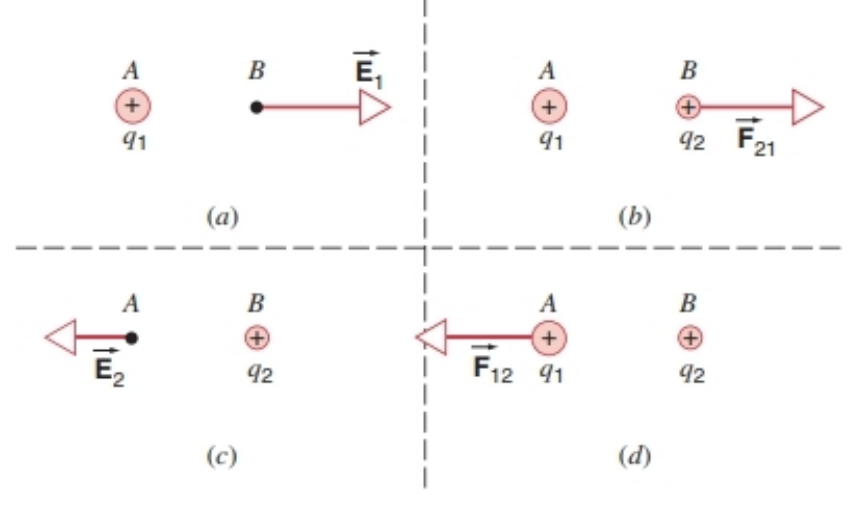
图26-2 （a）A点的$q_{1}$在B点产生电场；（b）B点的电场对$q_{2}$施加力；（c）B点的$q_{2}$在A点产生电场；（d）A点的电场对$q_{1}$施加力。注意$\overrightarrow{F}_{12}=-\overrightarrow{F}_{21}$。

若将式（26-3）作为测量电场的操作方法，需注意与测量引力场时相同的问题：检验电荷需足够小，避免其干扰我们所要测量的电场的电荷分布。因此，式（26-3）更严谨的写法应为：
$$\vec{E}=\lim _{q_{0} \to 0} \frac{\vec{F}}{q_{0}} \quad (26-5)$$
但由第25章可知，该极限实际上无法取到零——检验电荷的电荷量不可能小于元电荷$e$。当然，若我们是计算（而非测量）固定位置的一组已知电荷产生的电场，检验电荷$q_{0}$的大小和正负都不会影响结果。本章后续将介绍，利用式（26-3）和库仑定律，无需直接参考式（26-5），即可计算多个电荷产生的电场。
### 26-3 THE ELECTRIC FIELD OF POINT CHARGES
In this section we consider the electric field of point charges, first a single charge and then an assembly of individual charges. Later we generalize to continuous distributions of charge.

Let a positive test charge $q_{0}$ be placed a distance $r$ from a point charge $q$. The magnitude of the force acting on $q_{0}$ is given by Coulomb's law, 
$$F=\frac{1}{4 \pi \epsilon_{0}} \frac{q_{0}|q|}{r^{2}} .$$

The magnitude of the electric field at the site of the test charge is, from Eq. 26-3, 
$$E=\frac{F}{q_{0}}=\frac{1}{4 \pi \epsilon_{0}} \frac{|q|}{r^{2}} . (26-6)$$

The direction of $\overrightarrow{E}$ is the same as the direction of $\overrightarrow{F}$: along a radial line from $q$ pointing outward if $q$ is positive and inward if $q$ is negative. Figure 26-3 shows the magnitude and direction of the electric field $\overrightarrow{E}$ at various points near a positive point charge. How would this figure be drawn if the charge were negative?

FIGURE 26-3. The electric field $\overrightarrow{E}$ at various points near a positive point charge $q$. Note that the direction of $\overrightarrow{E}$ is everywhere radially outward from $q$. The fields at $P_{1}$ and $P_{2}$, which are the same distance from $q$, are equal in magnitude. The field at $P_{3}$, which is twice as far from $q$ as $P_{1}$ or $P_{2}$, has one-quarter the magnitude of the field at $P_{1}$ or $P_{2}$.

To find $\overrightarrow{E}$ for a group of $N$ point charges, the procedure is as follows: (1) Calculate $\overrightarrow{E}_{n}$ due to each charge $n$ at the given point as if it were the only charge present. (2) Add these separately calculated fields vectorially to find the resultant field $\overrightarrow{E}$ at the point. In equation form, 
$$
\begin{aligned} 
\vec{E} & =\vec{E}_{1}+\vec{E}_{2}+\vec{E}_{3}+\cdots \\ 
& =\sum \vec{E}_{n} \quad(n=1,2,3, ..., N) . \quad(26-7) 
\end{aligned}
$$

The sum is a vector sum, taken over all the charges. Equation 26-7 (like Eq. 25-8) is an example of the application of the principle of superposition, which states, in this context, that at a given point the electric fields due to separate charge distributions simply add up (vectorially) or superimpose independently. This principle may fail when the magnitudes of the fields are extremely large, but it will be valid in all situations we discuss in this text.

#### SAMPLE PROBLEM 26-2
In an ionized helium atom (a helium atom in which one of the two electrons has been removed), the electron and the nucleus are separated by a distance of 26.5 pm. What is the magnitude of the electric field due to the nucleus at the location of the electron?

**Solution** We use Eq. 26-6, with $q$ (the charge of the nucleus) equal to $+2e$: 
$$
\begin{aligned} 
E & =\frac{1}{4 \pi \epsilon_{0}} \frac{|q|}{r^{2}}=\frac{\left(8.99 × 10^{9} N \cdot m^{2} / C^{2}\right)\left[2\left(1.60 × 10^{-19} C\right)\right]}{\left(26.5 × 10^{-12} m\right)^{2}} \\ 
& =4.10 × 10^{12} N / C . 
\end{aligned}
$$

This value is 8 times the electric field that acts on an electron in hydrogen (see Table 26-1). The increase comes about because (1) the nuclear charge in helium is twice that in hydrogen, and (2) the electron in ionized helium is closer to its nucleus (by a factor of two) than is the case for an electron in the hydrogen atom.

#### SAMPLE PROBLEM 26-3
Figure 26-4 shows a charge $q_{1}$ of $+1.5\ \mu C$ and a charge $q_{2}$ of $+2.3\ \mu C$. The first charge is at the origin of an $x$-axis, and the second is at a position $x=L$, where $L=13\ cm$. At what point $P$ along the $x$-axis is the electric field zero?

FIGURE 26-4. Sample Problem 26-3. At point $P$, the electric fields of the charges $q_{1}$ and $q_{2}$ are equal and opposite, so the net field at $P$ is zero.

**Solution** The point must lie between the charges because only in this region do the forces exerted by $q_{1}$ and $q_{2}$ on a test charge oppose each other. If $\overrightarrow{E}_{1}$ is the electric field due to $q_{1}$ and $\overrightarrow{E}_{2}$ is that due to $q_{2}$, the magnitudes of these vectors must be equal, or 
$$E_{1}=E_{2} .$$

From Eq. 26-6 we then have 
$$
\frac{1}{4 \pi \epsilon_{0}} \frac{q_{1}}{x^{2}}=\frac{1}{4 \pi \epsilon_{0}} \frac{q_{2}}{(L-x)^{2}},
$$
where $x$ is the coordinate of point $P$. Taking the square root of each side and solving for $x$, we obtain 
$$x=\frac{L}{1 \pm \sqrt{q_{2} / q_{1}}},$$
where we have taken into account that the square root may have either a positive or a negative value. Substituting numerical values for $L$, $q_{1}$, and $q_{2}$, we obtain 
$$x=5.8\ cm\ and\ x=-54.6\ cm.$$

The first solution, which defines a point between the charges, is the solution we seek. The second solution defines a point to the left of the two charges. At this point it is true that $E_{1}=E_{2}$, but the fields point in the same direction so their vector sum cannot be zero. Thus we are justified in discarding the second solution.

### The Electric Dipole
Many objects found in nature can be successfully analyzed as isolated bodies having a net charge, as we have done so far in this chapter. Others show different kinds of behavior. One type of behavior is characteristic of an object that has no net charge but instead consists of equal positive and negative charges $+q$ and $-q$ separated by a fixed distance $d$. For example, an ionic molecule such as NaCl (in the high-temperature vapor state, not the familiar crystalline form) is electrically neutral but can be considered as a $Na^{+}$ ion joined to a $Cl^{-}$ ion. For another example, a similar type of behavior of the water molecule is in part responsible for the large solubilities of many substances in water.

The configuration of two equal and opposite charges separated by a distance is called an electric dipole. In equations that describe electric dipoles, we find that the magnitude of the charge $q$ on each of the components and their separation $d$ often occur together as the product $qd$. It is convenient to define this quantity as the electric dipole moment $p$: 
$$p=q d . \quad(26-8)$$

It turns out that this quantity behaves like a vector. We define the vector electric dipole moment to have a magnitude $p=qd$ and a direction pointing from the negative charge to the positive charge along the line joining the two charges. Figure 26-5a shows an electric dipole and its vector dipole moment. For example, in NaCl the magnitude of the charge $q$ on each ion is $e$ and the measured separation distance is 0.236 nm, so we expect the dipole moment of the molecule to be 
$$
\begin{aligned} 
p=e d & =\left(1.60 × 10^{-19} C\right)\left(0.236 × 10^{-9} m\right) \\ 
& =3.78 × 10^{-29} C \cdot m . 
\end{aligned}
$$

FIGURE 26-5. (a) Positive and negative charges of equal magnitude form an electric dipole. (b) The electric field $\overrightarrow{E}$ at any point is the vector sum of the fields due to the individual charges. At point $P$ on the $x$-axis, the field has only a $z$-component.

The measured value is $3.00 × 10^{-29} C \cdot m$, indicating that the electron is not entirely removed from Na and attached to Cl. To a certain extent, the electron is shared between Na and Cl, resulting in a dipole moment somewhat smaller than expected.

We now calculate the electric field $\overrightarrow{E}$ of the dipole at point $P$ a distance $x$ along the perpendicular bisector of the dipole, as shown in Fig. 26-5b.

The positive and negative charges set up electric fields $\overrightarrow{E}_{+}$ and $\overrightarrow{E}_{-}$ respectively. The magnitudes of these two fields at $P$ are equal, because $P$ is equidistant from the positive and negative charges. Figure 26-5 also shows the directions of $\overrightarrow{E}_{+}$ and $\overrightarrow{E}_{-}$ determined by the directions of the force due to each charge alone that would act on a positive test charge at $P$. The total electric field at $P$ is determined, according to Eq. 26-7, by the vector sum 
$$
\vec{E}=\vec{E}_{+}+\vec{E}_{-}
$$

From Eq. 26-6, the magnitudes of the fields from each charge are given by 
$$
E_{+}=E_{-}=\frac{1}{4 \pi \epsilon_{0}} \frac{q}{r^{2}}=\frac{1}{4 \pi \epsilon_{0}} \frac{q}{x^{2}+(d / 2)^{2}} . (26-9)
$$

Because the fields $\overrightarrow{E}_{+}$ and $\overrightarrow{E}_{-}$ have equal magnitudes and lie at equal angles $\theta$ with respect to the $x$-direction as shown, the $x$-component of the total field is $E_{+} \sin \theta - E_{-} \sin \theta = 0$. The total field $\overrightarrow{E}$ therefore has only a $z$-component, of magnitude 
$$
E=E_{+} \cos \theta + E_{-} \cos \theta = 2 E_{+} \cos \theta . \quad(26-10)
$$

From the figure we see that the cosine of the angle $\theta$ is determined according to 
$$
\cos \theta=\frac{d / 2}{\sqrt{x^{2}+(d / 2)^{2}}} .
$$

Substituting this result and Eq. 26-9 into Eq. 26-10, we obtain 
$$
E=(2) \frac{1}{4 \pi \epsilon_{0}} \frac{q}{x^{2}+(d / 2)^{2}} \frac{d / 2}{\sqrt{x^{2}+(d / 2)^{2}}}
$$
Or 
$$
E=\frac{1}{4 \pi \epsilon_{0}} \frac{p}{\left[x^{2}+(d / 2)^{2}\right]^{3 / 2}}, \quad(26-11)
$$
using Eq. 26-8 ($p=qd$) for the dipole moment.

Equation 26-11 gives the magnitude of the electric field at $P$ due to the dipole. Note that the problem has cylindrical symmetry about the $z$-axis; that is, we could have chosen the $x$-axis to have any direction perpendicular to the dipole axis, and the field would be given by Eq. 26-11.

Often we observe the field of an electric dipole at points $P$ whose distance $x$ from the dipole is very large compared with the separation $d$. In this case we can simplify the dipole field somewhat by making use of the binomial expansion, 
$$
(1+y)^{n}=1+ny+\frac{n(n-1)}{2!}y^{2}+\cdots .
$$

Let us rewrite Eq. 26-11 as 
$$
\begin{aligned} 
E & =\frac{1}{4 \pi \epsilon_{0}} \frac{p}{x^{3}} \frac{1}{\left[1+(d / 2x)^{2}\right]^{3 / 2}} \\ 
& =\frac{1}{4 \pi \epsilon_{0}} \frac{p}{x^{3}}\left[1+\left(\frac{d}{2x}\right)^{2}\right]^{-3 / 2} 
\end{aligned}
$$
and apply the binomial expansion to the factor in brackets, which gives 
$$
E=\frac{1}{4 \pi \epsilon_{0}} \frac{p}{x^{3}}\left[1+\left(-\frac{3}{2}\right)\left(\frac{d}{2x}\right)^{2}+\cdots\right] .
$$

For $x \gg d$ it is sufficient to keep only the first term in the brackets (the 1), and so we find an expression for the magnitude of the electric field due to a dipole at distant points in its median plane: 
$$
E=\frac{1}{4 \pi \epsilon_{0}} \frac{p}{x^{3}} . \quad(26-12)
$$

An expression of a similar form is obtained for the field along the dipole axis (the $z$-axis of Fig. 26-5b); see Problem 1. A more general result for the field at any point in the $xz$-plane can also be calculated; see Problem 2. In all cases, the field at distant points varies with the distance $r$ from the dipole as $1/r^3$. This is a characteristic result for the electric dipole field. The field varies more rapidly with distance than the $1/r^2$ dependence characteristic of a point charge.

There are also more complicated charge distributions that give electric fields that vary as higher inverse powers of $r$. See Exercise 11 and Problem 4 for examples of the $1/r^4$ variation of the field of an electric quadrupole.

### 26-3 点电荷的电场
本节将讨论点电荷的电场，首先分析单个点电荷，再扩展到多个点电荷的组合，后续还会将其推广到连续电荷分布的情况。

将一个正检验电荷$q_{0}$放在距离点电荷$q$为$r$的位置处，根据库仑定律，检验电荷$q_{0}$所受作用力的大小为：
$$F=\frac{1}{4 \pi \epsilon_{0}} \frac{q_{0}|q|}{r^{2}} $$

由式（26-3）可知，检验电荷所在位置的电场强度大小为：
$$E=\frac{F}{q_{0}}=\frac{1}{4 \pi \epsilon_{0}} \frac{|q|}{r^{2}} \quad (26-6)$$

电场强度$\overrightarrow{E}$的方向与静电力$\overrightarrow{F}$的方向一致：若点电荷$q$为正，$\overrightarrow{E}$的方向沿径向向外；若$q$为负，$\overrightarrow{E}$的方向沿径向向内。图26-3展示了正点电荷附近不同位置处电场$\overrightarrow{E}$的大小与方向。若点电荷为负，该图应如何绘制？

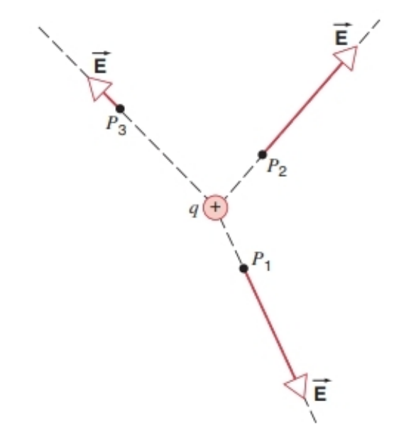
图26-3 正点电荷$q$附近不同位置的电场$\overrightarrow{E}$。可见，$\overrightarrow{E}$的方向始终沿径向背离$q$。$P_1$和$P_2$到$q$的距离相等，因此两处电场强度大小相同；$P_3$到$q$的距离是$P_1$（或$P_2$）的两倍，其电场强度大小仅为$P_1$（或$P_2$）的1/4。

若要求解$N$个点电荷在某点产生的合电场$\overrightarrow{E}$，步骤如下：（1）假设每个电荷单独存在，分别计算每个电荷$n$在该点产生的电场$\overrightarrow{E}_n$；（2）将这些单独计算出的电场进行矢量叠加，得到该点的合电场$\overrightarrow{E}$。其数学表达式为：
$$
\begin{aligned} 
\vec{E} & =\vec{E}_{1}+\vec{E}_{2}+\vec{E}_{3}+\cdots \\ 
& =\sum \vec{E}_{n} \quad(n=1,2,3, ..., N) \quad(26-7) 
\end{aligned}
$$

该求和为矢量和，需对所有电荷逐一计算后叠加。式（26-7）（与式25-8类似）是叠加原理的应用实例。在电场计算中，叠加原理指：多个独立电荷分布在某点产生的电场，可通过矢量叠加直接得到合电场，且各电荷的电场互不干扰。当电场强度极大时，叠加原理可能失效，但在本书讨论的所有场景中，该原理均成立。

#### 例题26-2
在电离的氦原子（即失去一个电子的氦原子）中，电子与原子核的距离为26.5 pm。求原子核在电子所在位置产生的电场强度大小。

**解答** 利用式（26-6）求解，其中原子核的电荷量$q=+2e$：
$$
\begin{aligned} 
E & =\frac{1}{4 \pi \epsilon_{0}} \frac{|q|}{r^{2}}=\frac{\left(8.99 × 10^{9} \, \text{N·m}^2/\text{C}^2\right)\left[2\left(1.60 × 10^{-19} \, \text{C}\right)\right]}{\left(26.5 × 10^{-12} \, \text{m}\right)^2} \\ 
& =4.10 × 10^{12} \, \text{N/C} 
\end{aligned}
$$

该电场强度是氢原子中电子所受电场强度的8倍（见表26-1）。强度增大的原因有二：（1）氦原子核的电荷量是氢原子核的2倍；（2）电离氦原子中电子与原子核的距离，是氢原子中电子与原子核距离的1/2。

#### 例题26-3
图26-4中，电荷$q_1=+1.5\ \mu\text{C}$，电荷$q_2=+2.3\ \mu\text{C}$。$q_1$位于$x$轴原点，$q_2$位于$x=L$处（$L=13\ \text{cm}$）。沿$x$轴方向，哪一点$P$的电场强度为零？

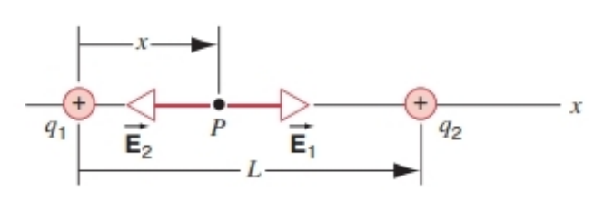
图26-4 例题26-3示意图。在$P$点，电荷$q_1$和$q_2$产生的电场大小相等、方向相反，因此该点的合电场强度为零。

**解答** 电场强度为零的点必须位于两个电荷之间，因为只有在这一区域，$q_1$和$q_2$对检验电荷的作用力才会方向相反。设$\overrightarrow{E}_1$为$q_1$产生的电场，$\overrightarrow{E}_2$为$q_2$产生的电场，要使合电场为零，二者的大小必须相等，即：
$$E_1=E_2$$

由式（26-6）可得：
$$
\frac{1}{4 \pi \epsilon_{0}} \frac{q_1}{x^2}=\frac{1}{4 \pi \epsilon_{0}} \frac{q_2}{(L-x)^2}
$$
其中$x$为$P$点的坐标。对等式两边开平方并求解$x$，可得：
$$x=\frac{L}{1 \pm \sqrt{q_2/q_1}}$$
式中考虑了平方根可能取正值或负值的情况。将$L$、$q_1$和$q_2$的数值代入，得到：
$$x=5.8\ \text{cm}\quad\text{和}\quad x=-54.6\ \text{cm}$$

第一个解对应的点位于两个电荷之间，是我们寻求的答案；第二个解对应的点位于两个电荷左侧，虽然此处$E_1=E_2$，但两个电场方向相同，矢量和无法为零，因此需舍弃第二个解。

#### 电偶极子
本章到目前为止，我们均将自然界中的物体视为“带有净电荷的孤立体”进行分析，这类分析对许多物体是适用的，但也有一些物体表现出不同的特性。其中一种典型特性来自“无净电荷，但由等量正、负电荷$+q$和$-q$构成，且正、负电荷间距$d$固定”的物体。例如，离子型分子氯化钠（NaCl，处于高温气态时，而非常见的晶体形态）呈电中性，但可看作由$Na^+$离子和$Cl^-$离子构成；再如，水分子的类似特性，是许多物质在水中溶解度较高的部分原因。

这种“由两个等量异种电荷构成、且电荷间距固定”的结构，称为电偶极子。在描述电偶极子的公式中，单个电荷的电荷量大小$q$与电荷间距$d$常以乘积$qd$的形式出现，我们将这一乘积定义为电偶极矩$p$：
$$p=qd\quad(26-8)$$

实际上，电偶极矩是矢量。我们定义电偶极矩矢量的大小为$p=qd$，方向为从负电荷指向正电荷，且沿两电荷的连线方向。图26-5a展示了电偶极子及其电偶极矩矢量。以氯化钠为例，每个离子的电荷量大小为$e$，实测电荷间距为0.236 nm，因此可估算该分子的电偶极矩为：
$$
\begin{aligned} 
p=ed & =\left(1.60 × 10^{-19} \, \text{C}\right)\left(0.236 × 10^{-9} \, \text{m}\right) \\ 
& =3.78 × 10^{-29} \, \text{C·m} 
\end{aligned}
$$

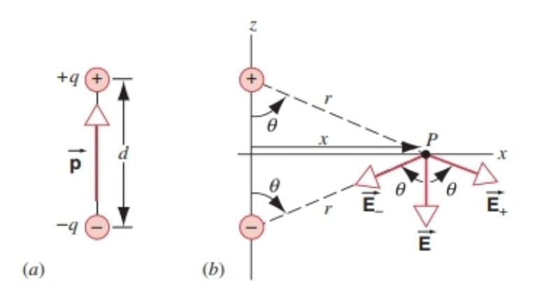

图26-5 （a）等量异种电荷构成电偶极子；（b）任意点的电场$\overrightarrow{E}$是两个电荷各自产生电场的矢量和。在$x$轴上的$P$点，电场仅存在$z$分量。

而实测的氯化钠分子电偶极矩为$3.00 × 10^{-29} \, \text{C·m}$，这表明电子并未完全从钠原子（Na）转移到氯原子（Cl），而是在一定程度上由Na和Cl共享，因此实际电偶极矩略小于理论估算值。

接下来，我们计算电偶极子在其垂直平分线上某点$P$产生的电场$\overrightarrow{E}$，如图26-5b所示，$P$到电偶极子中心的距离为$x$。

正电荷和负电荷分别在$P$点产生电场$\overrightarrow{E}_+$和$\overrightarrow{E}_-$。由于$P$到两个电荷的距离相等，因此$\overrightarrow{E}_+$和$\overrightarrow{E}_-$的大小相等。图26-5还标注了$\overrightarrow{E}_+$和$\overrightarrow{E}_-$的方向——可通过“正检验电荷在$P$点分别受两个电荷的作用力方向”来判断。根据式（26-7），$P$点的合电场为两个电场的矢量和：
$$
\vec{E}=\vec{E}_++\vec{E}_-
$$

由式（26-6）可知，单个电荷在$P$点产生的电场强度大小为：
$$
E_+=E_-=\frac{1}{4 \pi \epsilon_{0}} \frac{q}{r^2}=\frac{1}{4 \pi \epsilon_{0}} \frac{q}{x^2+(d/2)^2} \quad(26-9)
$$

如图所示，$\overrightarrow{E}_+$和$\overrightarrow{E}_-$大小相等，且与$x$轴的夹角均为$\theta$，因此它们的$x$分量相互抵消（$E_+ \sin\theta - E_- \sin\theta = 0$），合电场$\overrightarrow{E}$仅存在$z$分量，其大小为：
$$
E=E_+ \cos\theta + E_- \cos\theta = 2E_+ \cos\theta \quad(26-10)
$$

由图中几何关系可知，夹角$\theta$的余弦值为：
$$
\cos\theta=\frac{d/2}{\sqrt{x^2+(d/2)^2}}
$$

将该式与式（26-9）代入式（26-10），可得：
$$
E=2 \cdot \frac{1}{4 \pi \epsilon_{0}} \cdot \frac{q}{x^2+(d/2)^2} \cdot \frac{d/2}{\sqrt{x^2+(d/2)^2}}
$$
整理后（利用电偶极矩定义式$p=qd$，即式26-8）可得：
$$
E=\frac{1}{4 \pi \epsilon_{0}} \frac{p}{\left[x^2+(d/2)^2\right]^{3/2}} \quad(26-11)
$$

式（26-11）给出了$P$点的电场强度大小。需注意，该问题关于$z$轴具有柱对称性——无论将$x$轴选为垂直于电偶极子轴线的任意方向，电场强度均可用式（26-11）表示。

通常我们关注的是“距离电偶极子很远（$x \gg d$）”的点$P$处的电场。此时可利用二项展开式简化电偶极子的电场表达式，二项展开式为：
$$
(1+y)^n=1+ny+\frac{n(n-1)}{2!}y^2+\cdots
$$

将式（26-11）改写为：
$$
\begin{aligned} 
E & =\frac{1}{4 \pi \epsilon_{0}} \frac{p}{x^3} \cdot \frac{1}{\left[1+(d/(2x))^2\right]^{3/2}} \\ 
& =\frac{1}{4 \pi \epsilon_{0}} \frac{p}{x^3} \left[1+\left(\frac{d}{2x}\right)^2\right]^{-3/2} 
\end{aligned}
$$
对括号内的项进行二项展开，可得：
$$
E=\frac{1}{4 \pi \epsilon_{0}} \frac{p}{x^3} \left[1+\left(-\frac{3}{2}\right)\left(\frac{d}{2x}\right)^2+\cdots\right]
$$

当$x \gg d$时，括号内仅保留第一项（即1）即可，由此得到电偶极子在其中垂面远处产生的电场强度大小为：
$$
E=\frac{1}{4 \pi \epsilon_{0}} \frac{p}{x^3} \quad(26-12)
$$

电偶极子轴线上（图26-5b中的$z$轴）的电场也有类似形式的表达式（见习题1）；此外，还可计算$xz$平面内任意点的电场（见习题2）。在所有情况下，电偶极子在远处产生的电场强度均与“到电偶极子的距离$r$”成$1/r^3$的关系，这是电偶极子电场的典型特征——其随距离的衰减速度，比点电荷电场的$1/r^2$衰减更快。

更复杂的电荷分布会产生随距离衰减更快的电场（如$1/r^4$）。例如，电四极子的电场就满足$1/r^4$的衰减关系，具体可参考习题11和习题4。

### 26-4 ELECTRIC FIELD OF CONTINUOUS CHARGE DISTRIBUTIONS
In Section 25-5 we discussed the force exerted on a point charge by various continuous charge distributions. We analyzed those continuous charge distributions by considering them to be collections of infinitesimal charge elements, which we treated as point charges, and then integrating over the distribution to find the force. We use a similar method here to calculate the electric field due to continuous charge distributions. In fact, as we shall see, we can use the results of Section 25-5 to obtain the electric field due to the distributions considered in that section.

We first discuss the general method for finding the electric field of a continuous charge distribution. We divide the charge distribution into infinitesimal elements $dq$, expressing the charge element $dq$ as $\lambda ds$, $\sigma dA$, or $\rho dV$, depending on whether the charge is distributed over a line ($\lambda =$ linear charge density or charge per unit length), surface ($\sigma =$ surface charge density or charge per unit area), or volume ($\rho =$ volume charge density or charge per unit volume). Choosing an arbitrary charge element, we write the magnitude of the contribution to the electric field at the observation point $P$ as if $dq$ were a point charge: 
$$dq=\frac{1}{4 \pi \epsilon_{0}} \frac{|dq|}{r^{2}}, \quad(26-13)$$
using Eq. 26-6. The direction of the vector $d\overrightarrow{E}$ is determined by the sign of $dq$ according to the direction of the force that $dq$ would exert on a positive test charge at $P$. The total resultant field at $P$ for the entire distribution is obtained by adding the contributions from all the charge elements of the object, taking into account the different directions that all the $d\overrightarrow{E}$ might have: 
$$\vec{E}=\int d\vec{E} . \quad(26-14)$$

In Cartesian coordinates, we can regard Eq. 26-14 as a shorthand representation of the three component equations: 
$$E_{x}=\int dE_{x}, E_{y}=\int dE_{y}, E_{z}=\int dE_{z} \cdot(26-15)$$

As we discuss below, we can often simplify the calculation by arguing on the basis of symmetry that one or two of these integrals vanish or that two of them have identical values.

#### A Uniform Line of Charge
As an example of the application of Eqs. 26-13 to 26-15, we consider the electric field due to a line of charge (a thin charged rod, for example) of length $L$ having a uniform positive linear charge density $\lambda = q/L$, where $q$ is the total charge carried by the rod. Figure 26-6 shows the geometry for the calculation. We wish to find the field at point $P$ a distance $y$ from the rod along its perpendicular bisector (the positive $y$ axis). The magnitude of the electric field $d\overrightarrow{E}$ at point $P$ due to the charge element $dq$ is given by Eq. 26-13. We can conclude that $E_{x}=0$ because none of the charge elements $dq$ anywhere on the rod produces a $d\overrightarrow{E}$ with an $x$ component. We can also conclude from symmetry that $E_{z}=0$, because for every $dq$ at positive $z$ there is a corresponding $dq$ at negative $z$ such that, when we add the $d\overrightarrow{E}$ vectors from the two charge elements, the $z$ components cancel. The only nonzero component of the electric field at $P$ is $E_{y}$. We therefore have 
$$dE_{y}=dE \cos\theta=\frac{1}{4 \pi \epsilon_{0}} \frac{\lambda dz}{y^{2}+z^{2}} \frac{y}{\sqrt{y^{2}+z^{2}}},$$
where we have used Eq. 26-13 for $dE$ with $dq = \lambda dz$, $\cos\theta = y/r$ and $r^{2}=y^{2}+z^{2}$. The total field at $P$ is 
$$E_{y}=\int dE_{y}=\int_{-L/2}^{+L/2} \frac{1}{4 \pi \epsilon_{0}} \frac{\lambda y dz}{\left(y^{2}+z^{2}\right)^{3/2}} .$$

Carrying out the integration over $z$, with $y$ held constant, we obtain (see integral 18 in Appendix I) 
$$E_{y}=\frac{1}{4 \pi \epsilon_{0}} \frac{\lambda L}{y \sqrt{y^{2}+L^{2}/4}} . (26-16)$$

This equation gives the electric field at point $P$ on the positive $y$ axis due to the line of charge. Note that we could have obtained this result directly from Eq. 25-15 for the force between the line of charge and the point charge $q_{0}$ by substituting $\lambda L$ for $q$ and using Eq. 26-3, $E_{y}=F_{y}/q_{0}$.

As was the case with the electric dipole, this problem also has cylindrical symmetry about the $z$ axis, and we could have chosen the $y$ axis to point in any direction perpendicular to the axis of the rod and through its midpoint. Figure 26-7 shows a representation of the field in the $xy$ plane due to a uniform positively charged rod.

FIGURE 26-7. Electric field due to a positively charged rod. The field has cylindrical symmetry about the axis of the rod.

As we did for the force calculated in Chapter 25, it is important to check our electric field calculations to verify that they have the correct limits. In the limit $y \to \infty$, Eq. 26-16 approaches the expression for the electric field of a point charge, 
$$E_{y}=\frac{1}{4 \pi \epsilon_{0}} \frac{q}{y^{2}},$$
where we have used $q = \lambda L$.

Often in situations involving line charges, our observation point is very close to the line, such that $y$ is small in comparison with $L$. Taking the limit of Eq. 26-16 when $L \gg y$ with $\lambda$ remaining constant, we have the electric field due to an infinitely long line of charge: 
$$E_{y}=\frac{\lambda}{2 \pi \epsilon_{0} y} . \quad(26-17)$$

The field is directed radially outward from the rod and depends inversely on the distance from the rod.

You may wonder about the usefulness of calculating the field due to an infinite line of charge when any real line of charge must have a finite length. However, for points close to the line and far from either end, Eq. 26-17 gives a very good and useful approximation to the electric field. The difference between the approximate result, Eq. 26-17, and the exact result, Eq. 26-16, is often negligible. The approximate result in this case may give more physical insight, because the variation of $E$ with distance from the rod is more immediately apparent.

#### A Uniform Ring or Disk of Charge
To discuss the electric field due to a ring or disk of radius $R$ carrying a uniform charge density, it is not necessary to do the complete calculation starting with Eq. 26-13. We have already calculated the force exerted on a point charge $q_{0}$ by a ring of charge or a disk of charge. The force exerted by a ring of charge on a point charge $q_{0}$ on the axis of the ring was given by Eq. 25-16. Using Eq. 26-3, $E_{z}=F_{z}/q_{0}$, we can find the electric field at a point on the positive $z$ axis due to a ring of charge directly from Eq. 25-16: 
$$E_{z}=\frac{1}{4 \pi \epsilon_{0}} \frac{q z}{\left(z^{2}+R^{2}\right)^{3/2}}, \quad(26-18)$$
where we have used $q = \lambda(2\pi R)$. The electric field is directed along the axis of the ring (the $z$ axis) and away from the ring. Equation 26-18 is valid for positive as well as negative $z$. If the ring is negatively charged, the field points along the axis in the opposite direction (toward the ring).

In a similar fashion, we can find the electric field due to a disk of charge from Eq. 25-17: 
$$E_{z}=\frac{\sigma}{2 \epsilon_{0}}\left(1-\frac{z}{\sqrt{z^{2}+R^{2}}}\right) . (26-19)$$

Here we have expressed the electric field in terms of the surface charge density of the disk using $q = \sigma A = \sigma(\pi R^{2})$. This expression gives the field at a point on the positive $z$ axis a distance $z$ from the disk. The field points away from the disk if the disk is positively charged. Equation 26-19 is valid only for $z>0$. How should it be modified if $P$ is located on the negative $z$ axis?

#### An Infinite Sheet of Charge
Let us now consider the limiting case of Eq. 26-19 as $R \to \infty$ so that the charged disk becomes an infinite sheet of charge. We assume that, as $R$ increases, we add charge to the disk so that the surface charge density $\sigma$ remains constant. Under these conditions, we can approximate Eq. 26-19 as 
$$E_{z}=\frac{\sigma}{2 \epsilon_{0}} . \quad(26-20)$$

This turns out to be a very useful result, which is approximately valid for a disk of uniform charge density when we are close to the disk and far from any of its edges. In fact, if we are far from its edges, we cannot tell whether the charge distribution is spread over a circular area or over one that is square, rectangular, or irregularly shaped. As we will derive in the next chapter, this result is valid for any large uniformly charged sheet, no matter what its shape. The field has a uniform magnitude and (for a positively charged sheet) is directed away from the sheet of charge.

#### A Uniform Spherical Shell of Charge
In Section 25-5, we established two properties of a uniformly charged spherical shell: it exerts no force on a test charge in its interior, and at exterior points the force that it exerts on a test charge is the same as if all the charge of the shell were concentrated in a point at its center. We can use these properties to deduce the electric field due to a thin uniformly charged shell. Let the shell have radius $R$ and charge $q$, which we assume for now to be positive. We then have the following results for the electric field at various distances from the center of the shell: 
$$E=0 \quad(r<R) \quad(26-21 a)$$
$$E_{r}=\frac{1}{4 \pi \epsilon_{0}} \frac{q}{r^{2}} \quad(r \geq R) . \quad(26-21 b)$$

The subscript $r$ on the electric field reminds us that the field points in the radial direction. These results follow directly from the force on a test charge at the different locations. Inside the shell, the electric field is zero. At exterior points, the electric field is radial and identical to that of a point charge, so it would look just like the field displayed in Fig. 26-3.

FIGURE 26-8. The magnitude of the electric field due to a uniformly charged spherical shell of radius $R$.

We can use the properties of shells of charge to deduce the electric field due to a spherically symmetric charge distribution in a sphere of radius $R$. For simplicity we assume the charge to be distributed uniformly throughout the sphere, so that its volume charge density is a constant. If $Q$ is the total charge on the sphere, then the volume charge density is 
$$\rho=\frac{Q}{\frac{4}{3} \pi R^{3}} . (26-22)$$

Imagine the sphere to be divided into many thin shells of radius $r$ and thickness $dr$. If we place a test charge at a distance $r$ from the origin and inside the shell ($r<R$), the electric field at the location of the test charge is due only to the shells at smaller radii; we know from Eq. 26-21a that $E=0$ for all the shells of larger radii. Furthermore, we know from Eq. 26-21b that the field due to all the shells of smaller radii is the same as that of a point charge at the origin. The magnitude of that point charge is the same as the total charge of all the shells with radii smaller than $r$ or equivalently the total charge $q$ inside the sphere of radius $r$, which is given by the volume charge density times the volume of the sphere of radius $r$: 
$$q=\rho\left(\frac{4}{3} \pi r^{3}\right)=Q \frac{r^{3}}{R^{3}}, \quad(26-23)$$
using the charge density from Eq. 26-22.

Equation 26-21 then gives the radial component of the electric field at this location inside the sphere: 
$$E_{r}=\frac{1}{4 \pi \epsilon_{0}} \frac{Q r}{R^{3}} \quad(r<R) . (26-24)$$

If, as we assumed, $Q$ is positive, the field points radially outward; if $Q$ is negative, the field is radially inward. For $r>R$ the field is identical to that of a point charge $Q$ located at the origin (Eq. 26-6). Note that the field increases linearly with $r$ for $r<R$ and decreases like $1/r^2$ for $r>R$: Figure 26-8 shows the magnitude of the electric field as a function of $r$.

#### SAMPLE PROBLEM 26-4
A plastic rod, whose length $L$ is 220 cm and whose radius $R$ is 3.6 mm, carries a negative charge $q$ of magnitude $3.8 × 10^{-7}\ C$ spread uniformly over its surface. What is the electric field near the midpoint of the rod, at a point on its surface?

**Solution** Although the rod is not infinitely long, for a point on its surface and near its midpoint it is effectively very long, so that we are justified in using Eq. 26-17. The linear charge density for the rod is 
$$\lambda=\frac{q}{L}=\frac{-3.8 × 10^{-7}\ C}{2.2\ m}=-1.73 × 10^{-7}\ C/m .$$

From Eq. 26-17 we then have, for $y=0.0036\ m$, 
$$
\begin{aligned} 
E_{y} & =\frac{\lambda}{2 \pi \epsilon_{0} y} \\ 
& =\frac{-1.73 × 10^{-7}\ C/m}{(2\pi)\left(8.85 × 10^{-12}\ C^{2}/N·m^{2}\right)(0.0036\ m)} \\ 
& =-8.6 × 10^{5}\ N/C . 
\end{aligned}
$$

The negative sign tells us that, because the rod is negatively charged, the direction of the electric field is radially inward, toward the axis of the rod. Sparking occurs in dry air at atmospheric pressure at an electric field strength of about $3 × 10^{6}\ N/C$. The field strength we calculated is lower than this by a factor of about 3.4, so that sparking should not occur.

### 26-4 连续电荷分布的电场
在25-5节中，我们讨论了各类连续电荷分布对点电荷的作用力。分析这类连续电荷分布时，我们将其拆分为无数个电荷元，把每个电荷元视为点电荷，再通过对整个电荷分布积分得到总作用力。本节将采用类似方法计算连续电荷分布产生的电场，实际上，我们还可利用25-5节的结果，直接得到该节所讨论的电荷分布对应的电场。

首先介绍计算连续电荷分布电场的通用方法：将连续电荷分布分割为无数个电荷元$dq$，根据电荷分布的维度（线、面、体），将$dq$分别表示为$\lambda ds$、$\sigma dA$或$\rho dV$——其中$\lambda$为线电荷密度（单位长度的电荷量），$\sigma$为面电荷密度（单位面积的电荷量），$\rho$为体电荷密度（单位体积的电荷量）。

任选一个电荷元，将其视为点电荷，根据式（26-6），该电荷元在观测点$P$产生的电场强度大小为：
$$dE=\frac{1}{4 \pi \epsilon_{0}} \frac{|dq|}{r^{2}} \quad(26-13)$$
其中$r$为电荷元到$P$点的距离。电场强度矢量$d\overrightarrow{E}$的方向由电荷元$dq$的正负决定：可通过判断$dq$对$P$点正检验电荷的作用力方向来确定。

整个连续电荷分布在$P$点产生的总电场，需将所有电荷元的电场贡献矢量叠加（需考虑各$d\overrightarrow{E}$的方向差异），即：
$$\vec{E}=\int d\vec{E} \quad(26-14)$$

在直角坐标系中，式（26-14）可分解为三个分量的积分式，分别对应$x$、$y$、$z$方向：
$$E_{x}=\int dE_{x},\ E_{y}=\int dE_{y},\ E_{z}=\int dE_{z} \quad(26-15)$$

如下文所示，利用对称性分析可简化计算：常能证明其中一个或两个分量的积分为零，或两个分量的积分值相等。

#### 均匀带电直线
以式（26-13）至式（26-15）的应用为例，我们分析均匀带电直线（如细带电杆）的电场。设直线长度为$L$，总电荷量为$q$，则均匀线电荷密度$\lambda = q/L$（因电荷为正，$\lambda$为正值）。图26-6展示了计算所需的几何关系，我们需要求解直线中垂线上（正$y$轴方向）、距离直线为$y$的点$P$处的电场。

根据式（26-13），电荷元$dq$在$P$点产生的电场强度大小为$dE$。由对称性可知：
- 所有电荷元在$P$点产生的电场均无$x$分量，因此$E_x = 0$；
- 对于$z$轴正方向的任一电荷元，$z$轴负方向必有对称的电荷元，二者的$z$分量电场相互抵消，因此$E_z = 0$。

综上，$P$点的电场仅存在$y$分量，其表达式为：
$$dE_y = dE\cos\theta = \frac{1}{4 \pi \epsilon_{0}} \frac{\lambda dz}{y^2 + z^2} \cdot \frac{y}{\sqrt{y^2 + z^2}}$$
式中，$dq = \lambda dz$（$dz$为电荷元的长度），$\cos\theta = y/r$（$\theta$为$d\overrightarrow{E}$与$y$轴的夹角），且$r^2 = y^2 + z^2$（$r$为电荷元到$P$点的距离）。

对$z$从$-L/2$到$+L/2$积分，可得$P$点的总电场$y$分量：
$$E_y = \int dE_y = \int_{-L/2}^{+L/2} \frac{1}{4 \pi \epsilon_{0}} \frac{\lambda y dz}{(y^2 + z^2)^{3/2}}$$

固定$y$不变，对$z$积分（可参考附录I中的积分公式18），最终结果为：
$$E_y = \frac{1}{4 \pi \epsilon_{0}} \frac{\lambda L}{y \sqrt{y^2 + L^2/4}} \quad(26-16)$$

该式即为均匀带电直线在其中垂线上$P$点（正$y$轴）产生的电场强度。值得注意的是，将25-5节中式（25-15）（带电直线与点电荷的作用力公式）中的总电荷$q$替换为$\lambda L$，再结合电场定义式（26-3）$E_y = F_y/q_0$，可直接得到式（26-16）。

与电偶极子类似，该问题关于$z$轴具有柱对称性——无论将$y$轴选为垂直于直线、且过直线中点的任意方向，电场表达式均不变。图26-7展示了均匀带正电直线在$xy$平面内的电场分布示意图。

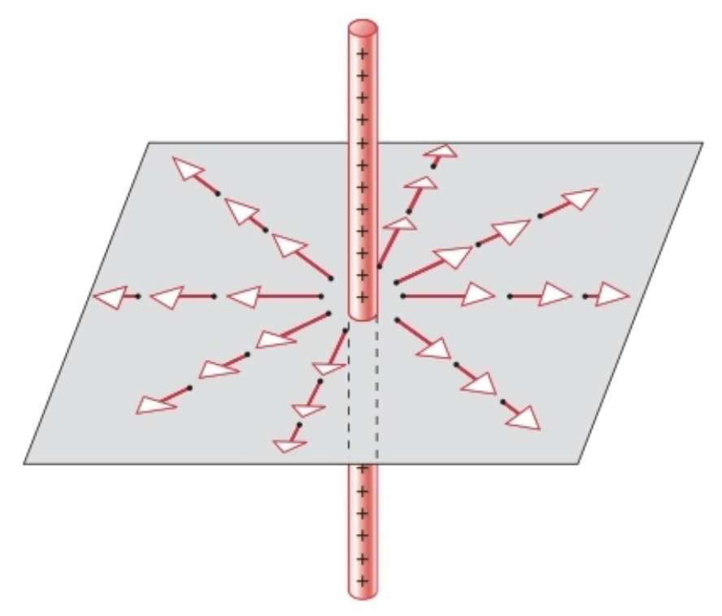
图26-7 均匀带正电直线的电场分布，电场关于直线的轴线呈柱对称。

与25章中检验作用力公式的极限情况类似，我们也需验证电场公式的极限合理性：
1. 当$y \to \infty$（$P$点远离直线）时，式（26-16）可近似为点电荷的电场公式：
$$E_y = \frac{1}{4 \pi \epsilon_{0}} \frac{q}{y^2}$$
（其中$q = \lambda L$，符合“远处的带电直线可视为点电荷”的物理直觉）。

2. 当$L \gg y$（$P$点靠近直线，且直线可近似为无限长）时，保持$\lambda$不变，式（26-16）可简化为无限长均匀带电直线的电场公式：
$$E_y = \frac{\lambda}{2 \pi \epsilon_{0} y} \quad(26-17)$$

此时电场方向沿径向背离直线（若直线带负电，则方向指向直线），且电场强度与到直线的距离$y$成反比。

你可能会疑惑：实际中的带电直线都是有限长的，计算无限长带电直线的电场有何意义？但对于“靠近直线、且远离直线两端”的区域，式（26-17）能很好地近似实际电场，其与精确式（26-16）的差异通常可忽略。此外，近似式（26-17）更能直观体现电场随距离的变化规律，便于理解物理本质。

#### 均匀带电圆环与圆盘
讨论半径为$R$、电荷密度均匀的圆环或圆盘的电场时，无需从式（26-13）重新推导——我们已在25-5节中计算过圆环、圆盘对轴上点电荷的作用力，结合电场定义式即可得到电场。

- **均匀带电圆环**：25-5节中式（25-16）给出了圆环对轴上点电荷$q_0$的作用力$F_z$。根据式（26-3）$E_z = F_z/q_0$，代入$q = \lambda \cdot 2\pi R$（$q$为圆环总电荷量，$\lambda$为圆环的线电荷密度），可得圆环在轴上（正$z$轴）某点产生的电场强度：
$$E_z = \frac{1}{4 \pi \epsilon_{0}} \frac{q z}{(z^2 + R^2)^{3/2}} \quad(26-18)$$
电场方向沿圆环轴线（$z$轴）向外；若圆环带负电，电场方向则沿轴线指向圆环。该式对正、负$z$均成立。

- **均匀带电圆盘**：类似地，由25-5节中式（25-17）（圆盘对轴上点电荷的作用力），结合$E_z = F_z/q_0$，并代入$q = \sigma \cdot \pi R^2$（$\sigma$为圆盘的面电荷密度），可得圆盘在轴上（正$z$轴）、距离圆盘为$z$处的电场强度：
$$E_z = \frac{\sigma}{2 \epsilon_{0}} \left(1 - \frac{z}{\sqrt{z^2 + R^2}}\right) \quad(26-19)$$
若圆盘带正电，电场方向沿$z$轴背离圆盘；式（26-19）仅适用于$z>0$的情况，若$P$点在负$z$轴上，需如何修改该式？（提示：仅需改变电场方向，即添加负号）

#### 无限大均匀带电平面
考虑式（26-19）的极限情况：当圆盘半径$R \to \infty$时，带电圆盘变为无限大带电平面。假设增大$R$时，通过补充电荷使面电荷密度$\sigma$保持恒定，此时$\frac{z}{\sqrt{z^2 + R^2}} \to 0$，式（26-19）可简化为：
$$E_z = \frac{\sigma}{2 \epsilon_{0}} \quad(26-20)$$

这是一个非常实用的结果：对于有限大均匀带电平面，若观测点“靠近平面且远离平面边缘”，式（26-20）可近似描述其电场。实际上，当远离边缘时，我们无法区分电荷分布是圆形、方形、矩形还是不规则形状——下一章将证明，该式对任意形状的“大均匀带电平面”均成立。无限大带电平面的电场大小均匀，且（带正电时）方向垂直于平面向外。

#### 均匀带电球壳
在25-5节中，我们得出了均匀带电球壳的两个关键性质：（1）球壳内部的检验电荷不受电场力；（2）球壳外部的检验电荷所受电场力，等效于球壳全部电荷集中在球心时的作用力。利用这两个性质，可推导薄均匀带电球壳的电场。

设球壳半径为$R$，总电荷量为$q$（暂设为正），则球壳在不同位置产生的电场强度为：
$$E = 0 \quad (r < R) \quad(26-21a)$$
$$E_r = \frac{1}{4 \pi \epsilon_{0}} \frac{q}{r^2} \quad (r \geq R) \quad(26-21b)$$

式中，下标$r$表示电场沿径向方向。上述结果直接由“不同位置检验电荷的受力”推导得出：球壳内部电场为零；球壳外部电场沿径向，且与“电荷集中在球心的点电荷电场”完全相同（电场分布与图26-3类似）。

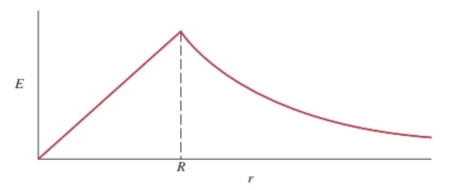
图26-8 半径为$R$的均匀带电球壳的电场强度大小分布。

利用带电球壳的性质，还可推导球对称电荷分布（如均匀带电球体）的电场。以“电荷均匀分布在半径为$R$的球体”为例，设球体总电荷量为$Q$，则体电荷密度为：
$$\rho = \frac{Q}{\frac{4}{3}\pi R^3} \quad(26-22)$$

将球体视为由无数个半径为$r$、厚度为$dr$的薄球壳组成。若观测点$P$在球内（$r < R$），则：
- 所有半径大于$r$的球壳，对$P$点的电场贡献均为零（由式26-21a）；
- 所有半径小于$r$的球壳，对$P$点的电场贡献等效于“电荷集中在球心的点电荷”（由式26-21b）。

半径小于$r$的球壳所带的总电荷量$q$，等于体电荷密度$\rho$乘以半径为$r$的球体体积：
$$q = \rho \cdot \frac{4}{3}\pi r^3 = Q \cdot \frac{r^3}{R^3} \quad(26-23)$$
（代入式26-22的$\rho$表达式可得）。

结合式（26-21b），球内（$r < R$）观测点的径向电场强度为：
$$E_r = \frac{1}{4 \pi \epsilon_{0}} \frac{Q r}{R^3} \quad (r < R) \quad(26-24)$$

若$Q$为正，球内电场沿径向向外；若$Q$为负，电场沿径向向内。对于球外（$r > R$）的观测点，球体的电场等效于“所有电荷集中在球心的点电荷电场”（与式26-6一致）。需注意：球内电场强度随$r$线性增大，球外电场强度随$r^2$减小，图26-8展示了电场强度大小随$r$的变化关系。

#### 例题26-4
一根塑料杆，长度$L = 220\ \text{cm}$，半径$R = 3.6\ \text{mm}$，表面均匀分布着电荷量大小为$3.8 × 10^{-7}\ \text{C}$的负电荷。求杆中点附近、杆表面某点的电场强度。

**解答** 尽管塑料杆并非无限长，但“杆表面且靠近中点”的区域，可近似将杆视为无限长带电直线，因此可使用式（26-17）求解。

首先计算杆的线电荷密度：
$$\lambda = \frac{q}{L} = \frac{-3.8 × 10^{-7}\ \text{C}}{2.2\ \text{m}} = -1.73 × 10^{-7}\ \text{C/m}$$
（负号表示电荷为负）。

杆表面到轴线的距离$y = R = 0.0036\ \text{m}$，代入式（26-17）：
$$
\begin{aligned} 
E_y &= \frac{\lambda}{2 \pi \epsilon_0 y} \\ 
&= \frac{-1.73 × 10^{-7}\ \text{C/m}}{2\pi × 8.85 × 10^{-12}\ \text{C}^2/(\text{N·m}^2) × 0.0036\ \text{m}} \\ 
&= -8.6 × 10^5\ \text{N/C} 
\end{aligned}
$$

负号表明：由于杆带负电，电场方向沿径向向内，指向杆的轴线。干燥空气在标准大气压下的电击穿场强约为$3 × 10^6\ \text{N/C}$，计算得到的场强仅为其1/3.4，因此不会发生火花放电。

### 26-5 ELECTRIC FIELD LINES
The concept of the electric field was introduced in the early 19th century by Michael Faraday. Faraday did not develop the mathematical representation of the electric field; instead, he developed a graphical representation, in which he imagined the space around an electric charge to be filled with lines of force. Today we no longer attach the same reality to the lines of force that Faraday did, but we retain them as a convenient way to visualize the electric field. We refer to these lines as electric field lines.

Figure 26-9a shows the electric field lines representing a uniform field. Note that the lines are parallel and equally spaced. Figure 26-9b shows lines representing a nonuniform field. By convention, we draw the field lines with the following property:

FIGURE 26-9. (a) Electric field lines for a uniform field. (b) Electric field lines for a nonuniform field.

The tangent to the electric field line passing through any point in space gives the direction of the electric field at that point.

In Fig. 26-9a, for example, the direction of the electric field at point $P$ is vertically upward, tangent to the field lines. Because the field is uniform, the electric field has this direction at every point in this region of space. In Fig. 26-9b, which shows a nonuniform field, the electric field has different directions at points $P_1$ and $P_2$, in each case tangent to the electric field line passing through that point.

For the electric field lines to have this property, they must also be drawn so that

The electric field lines start on positive charges and end on negative charges.

For example, Fig. 26-10 represents the field lines for an isolated positive point charge (or a small sphere of positive charge). The lines point radially outward, so that at any point $P$ the field is radial. The field lines begin on the positive charge and extend to infinity, since there are no negative charges in this region. If the charge were negative, the field lines would point in the opposite direction (radially inward).

FIGURE 26-10. Electric field lines surrounding an isolated positive point charge or positively charged uniform sphere. The field at an arbitrary point $P$ is shown.

One final property of electric field lines is that

The magnitude of the electric field at any point is proportional to the number of field lines per unit cross-sectional area perpendicular to the lines.

In other words, the more densely packed the field lines are near any point, the stronger is the field at that point. Figure 26-9b, for example, suggests that the magnitude of the field is larger at the bottom of the drawing (near point $P_1$) than it is at the top of the drawing (near point $P_2$). In Fig. 26-9a, on the other hand, the spacing of the field lines is the same at all points, suggesting that the field has the same magnitude everywhere. For a point charge (Fig. 26-10), the field lines are close together near the charge and further apart away from the charge, which indicates that the field grows weaker as the distance from the charge increases.

The uniform field near a large sheet of positive charge is shown in Fig. 26-11. The direction of the field is perpendicular to the sheet. Near the edges of the sheet, the field becomes nonuniform and is no longer directed perpendicular to the sheet, but as long as we stay close to the center of the sheet and far away from any edge, the field is very nearly uniform. Once again, the field lines extend to infinity.

FIGURE 26-11. Electric field lines near a thin uniform sheet of charge. Here we are looking at the edge of the sheet, which is oriented perpendicular to the page.

Figure 26-12 shows the field near a dipole (which illustrates how the field lines begin on positive charges and end on negative charges), and Fig. 26-13 shows the field near two equal positive charges. Note the differences between the two patterns. In the region directly between the charges, the density of field lines is larger in Fig. 26-12 than in Fig. 26-13, suggesting that the dipole gives a larger field in that region than the two positive charges. Because the electric field is zero halfway between the charges in Fig. 26-13, no electric field lines can be drawn through that point. As we travel far from the charges in Fig. 26-13, the pattern begins to resemble that of a single charge (as in Fig. 26-10). At external points in the median plane (the plane perpendicular to the page and midway between the charges), the field is small for the dipole and directed downward, while for the equal charges the field is larger and directed radially outward, as indicated at the points $P_2$ in Figs. 26-12 and 26-13.

FIGURE 26-12. Electric field lines for an electric dipole.

FIGURE 26-13. Electric field lines for two equal positive charges.

These drawings can be very useful in helping us to visualize the pattern of electric field lines. However, keep in mind that they represent only a two-dimensional “slice” through what is in reality a three-dimensional pattern. The relative spacings of the field lines in two dimensions do not strictly correspond with the spacings of the three-dimensional pattern, and the spacings of field lines in our two-dimensional drawings have no direct mathematical relationship to the magnitude of the field, other than to suggest regions where the field may be uniform or may be increasing or decreasing in magnitude.

The pattern of electric field lines can be made visible by applying an electric field to a suspension of tiny objects in an insulating fluid. Figure 26-14 shows photographs of patterns that resemble the drawings of electric field lines for a charged sheet and an electric dipole. The patterns were made visible by suspending grass seed in an insulating liquid.

FIGURE 26-14. Photographs of the patterns of electric field lines around (a) a charged plate (which produces parallel field lines) and (b) two rods with equal and opposite charges (similar to the electric dipole of Fig. 26-12). The patterns were made visible by suspending grass seed in an insulating liquid.

### 26-5 电场线
19世纪早期，迈克尔·法拉第提出了电场的概念。法拉第并未建立电场的数学表达式，而是提出了一种图形化表示方法——他设想电荷周围的空间中布满了“力线”。如今，我们不再像法拉第那样认为这些力线具有实际物理实体，但仍保留这一概念，将其作为直观描述电场的便捷工具，并将这些线称为电场线。

图26-9a展示了均匀电场的电场线，可见这些电场线平行且间距相等；图26-9b展示了非均匀电场的电场线。按照惯例，绘制电场线时需遵循以下基本性质：

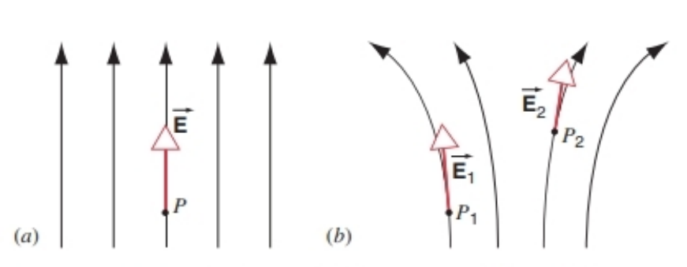
图26-9 （a）均匀电场的电场线；（b）非均匀电场的电场线。

**性质1**：空间中任意一点的电场线切线方向，即为该点电场强度的方向。

例如，在图26-9a中，$P$点的电场方向竖直向上，与该点电场线的切线方向一致；由于是均匀电场，该区域内所有点的电场方向均相同。在图26-9b（非均匀电场）中，$P_1$和$P_2$两点的电场方向不同，但均与各自所在位置电场线的切线方向一致。

为满足上述性质，电场线的绘制还需遵循：

**性质2**：电场线起始于正电荷，终止于负电荷。

例如，图26-10展示了孤立正点电荷（或带正电的小球体）的电场线——电场线沿径向向外发散，因此任意点$P$的电场均沿径向方向。由于该区域内无负电荷，电场线从正电荷出发后延伸至无限远；若电荷为负，电场线方向则相反（沿径向向内汇聚）。

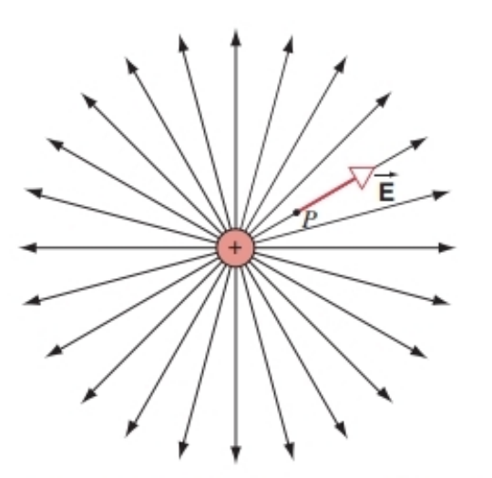
图26-10 孤立正点电荷或均匀带正电球体周围的电场线，图中显示了任意点$P$的电场方向。

电场线的最后一个关键性质是：

**性质3**：任意点电场强度的大小，与该点垂直于电场线方向的单位横截面积上穿过的电场线数量成正比。

换句话说，某点附近的电场线越密集，该点的电场强度就越大。例如，图26-9b中，绘图底部（靠近$P_1$点）的电场线比顶部（靠近$P_2$点）更密集，表明$P_1$点的电场强度大于$P_2$点；而图26-9a中电场线间距处处相同，说明均匀电场中各点的电场强度大小相等。对于点电荷（图26-10），电荷附近的电场线密集，远离电荷处电场线稀疏，这表明电场强度随到电荷距离的增大而减小。

图26-11展示了大尺度带正电平面附近的均匀电场——电场方向垂直于平面。在平面边缘附近，电场会变得非均匀，不再垂直于平面；但只要处于平面中心附近且远离边缘，电场就非常接近均匀分布，其电场线同样延伸至无限远。

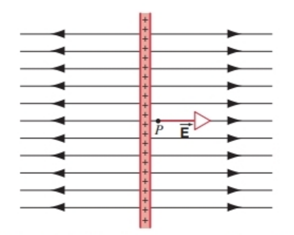
图26-11 薄均匀带电平面附近的电场线。图中展示的是平面的边缘，该平面垂直于纸面放置。

图26-12展示了电偶极子附近的电场线（体现了电场线“始于正电荷、止于负电荷”的性质），图26-13展示了两个等量正电荷附近的电场线，需注意两种电场线分布的差异：在两个电荷的正中间区域，图26-12（电偶极子）的电场线密度大于图26-13（两个正电荷），表明电偶极子在该区域的电场强度更大；图26-13中两电荷中点的电场强度为零，因此该点无电场线穿过。当远离图26-13中的两个正电荷时，电场线分布逐渐接近单个点电荷的电场线（如图26-10所示）。在中垂面（垂直于纸面且过两电荷中点的平面）上的外部点，电偶极子产生的电场强度较小且方向向下，而两个等量正电荷产生的电场强度较大且沿径向向外，这一点可从两图中$P_2$点的电场方向看出。

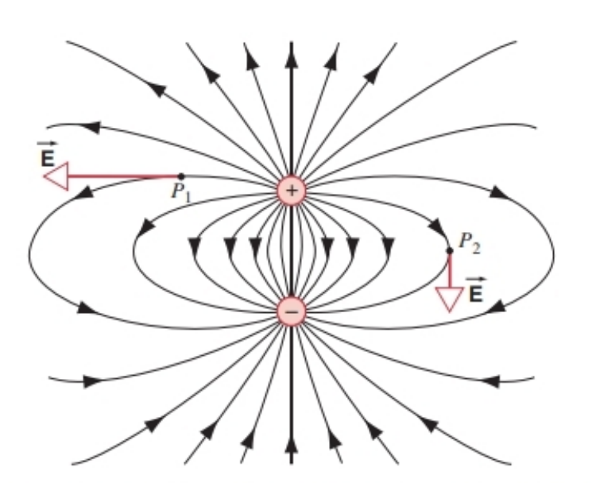
图26-12 电偶极子的电场线。

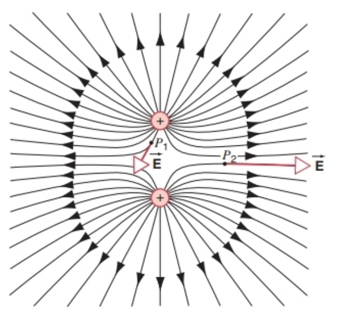
图26-13 两个等量正电荷的电场线。

这些电场线图对直观理解电场分布非常有帮助，但需注意：它们仅展示了三维电场分布的“二维截面”。二维图中电场线的相对间距与实际三维分布的间距并非严格对应，且二维图中电场线的间距与电场强度大小之间没有直接的数学关系，仅能大致指示电场可能均匀、增强或减弱的区域。

电场线的分布可通过实验可视化：在绝缘液体中悬浮微小物体，再施加电场，微小物体会沿电场线排列。图26-14展示了两组实验照片，分别对应带电平面（产生平行电场线）和电偶极子（类似图26-12的等量异种电荷杆）的电场线分布，实验中通过在绝缘液体中悬浮草籽实现了电场线的可视化。

图26-14 电场线分布的实验照片：（a）带电平板周围的电场线（产生平行电场线）；（b）两根带等量异种电荷的杆周围的电场线（类似图26-12的电偶极子）。实验通过在绝缘液体中悬浮草籽使电场线分布可视化。

### 26-6 A POINT CHARGE IN AN ELECTRIC FIELD
In preceding sections we have considered the first part of the charge ⇄ field ⇄ charge interaction: Given a collection of charges, what is the resulting electric field? In this section and the next, we consider the second part: What happens when we put a charged particle in a known electric field?

From Eq. 26-4, we know that a particle of charge $q$ in an electric field $\overrightarrow{E}$ experiences a force $\overrightarrow{F}$ given by 
$$\vec{F}=q \vec{E}$$

To study the motion of the particle in the electric field, all we need do is use Newton’s second law, $\sum \overrightarrow{F}=m \overrightarrow{a}$, where the resultant force on the particle includes the electric force and any other forces that may act.

As we did in our original study of Newton's laws, we can achieve a simplification if we consider the case in which the force is constant. We therefore begin by considering cases in which the electric field and the corresponding electric force are uniform (that is, they do not vary with location) and constant (they do not vary with time). Such a situation can be achieved in practice in the region near a large uniform sheet of charge, as we discussed in Section 26-4. For even greater uniformity, we can use a pair of closely spaced sheets of opposite charge, obtained by connecting the terminals of a battery to a pair of parallel metal plates. In the following sample problems, we assume that the field exists only in the region between the plates and drops suddenly to zero when the particle leaves that region.

In reality the field decreases rapidly over a distance that is of the order of the spacing between the plates; when this distance is small, we do not make too large an error in calculating the motion of the particle if we ignore the edge effect.

#### SAMPLE PROBLEM 26-5
A charged drop of oil of radius $R=2.76\ \mu m$ and density $\rho=918\ kg/m^3$ is maintained in equilibrium under the combined influence of its weight and a downward uniform electric field of magnitude $E=1.65 × 10^6\ N/C$ (Fig. 26-15). (a) Calculate the magnitude and sign of the charge on the drop. Express the result in terms of the elementary charge $e$. (b) The drop is exposed to a radioactive source that emits electrons. Two electrons strike the drop and are captured by it, changing its charge by two units. If the electric field remains at its constant value, calculate the resulting acceleration of the drop.

FIGURE 26-15. Sample Problem 26-5. A negatively charged drop is placed in a uniform electric field $\overrightarrow{E}$. The drop moves under the combined influence of its weight $m \overrightarrow{g}$ and the electric force $q \overrightarrow{E}$.

**Solution (a)** To keep the drop in equilibrium, its weight $mg$ must be balanced by an equal electric force of magnitude $qE$ acting upward. Because the electric field is given as being in the downward direction, the charge $q$ on the drop must be negative for the electric force to point in a direction opposite the field. The equilibrium condition is 
$$\sum \vec{F}=m \vec{g}+q \vec{E}=0 .$$

Taking $y$ components, we obtain 
$$-mg + q(-E)=0$$
or, solving for the unknown $q$ 
$$
\begin{aligned} 
q &=-\frac{mg}{E}=-\frac{\frac{4}{3}\pi R^3 \rho g}{E} \\ 
&=-\frac{\frac{4}{3}\pi(2.76 × 10^{-6}\ m)^3(918\ kg/m^3)(9.80\ m/s^2)}{1.65 × 10^6\ N/C} \\ 
&=-4.80 × 10^{-19}\ C. 
\end{aligned}
$$

If we write $q$ in terms of the electronic charge $-e$ as $q=n(-e)$, where $n$ is the number of electronic charges on the drop, then 
$$n=\frac{q}{-e}=\frac{-4.80 × 10^{-19}\ C}{-1.60 × 10^{-19}\ C}=3 .$$

**(b)** If we add two additional electrons to the drop, its charge will become 
$$q'=(n+2)(-e)=5(-1.60 × 10^{-19}\ C)=-8.00 × 10^{-19}\ C .$$

Newton's second law can be written 
$$\sum \vec{F}=m \vec{g}+q' \vec{E}=m \vec{a}$$
and, taking $y$ components, we obtain 
$$-mg + q'(-E)=ma$$

We can now solve for the acceleration: 
$$
\begin{aligned} 
a&=-g-\frac{q'E}{m} \\ 
&=-9.80\ m/s^2-\frac{(-8.00 × 10^{-19}\ C)(1.65 × 10^6\ N/C)}{\frac{4}{3}\pi(2.76 × 10^{-6}\ m)^3(918\ kg/m^3)} \\ 
&=-9.80\ m/s^2 + 16.3\ m/s^2=+6.5\ m/s^2 . 
\end{aligned}
$$

The drop accelerates in the positive $y$ direction.

In this calculation, we have ignored the viscous drag force, which is usually quite important in this situation. We have, in effect, found the acceleration of the drop at the instant it acquired the extra two electrons. The drag force, which depends on the velocity of the drop, is initially zero if the drop starts from rest, but it increases as the drop begins to move, and so the acceleration of the drop will decrease in magnitude.

This experimental configuration forms the basis of the Millikan oil-drop experiment, which was used to measure the magnitude of the electronic charge. The experiment is discussed later in this section.

#### SAMPLE PROBLEM 26-6
Figure 26-16 shows the deflecting electrode system of an ink-jet printer. An ink drop whose mass $m$ is $1.3 × 10^{-10}\ kg$ carries a charge $q$ of $-1.5 × 10^{-13}\ C$ and enters the deflecting plate system with a speed $v=18\ m/s$. The length $L$ of these plates is $1.6\ cm$, and the magnitude of the electric field $E$ between the plates is $1.4 × 10^6\ N/C$. What is the vertical deflection of the drop at the far edge of the plates? Ignore the varying electric field at the edges of the plates.

FIGURE 26-16. Sample Problem 26-6. The essential features of an ink-jet printer. An input signal from a computer controls the charge given to the drop and thus the position at which the drop strikes the paper. A transverse force from the electric field $\overrightarrow{E}$ is responsible for deflecting the drop. The drop moves in a parabolic path while it is between the plates, and it moves along a straight line (shown dashed) after it leaves the plates.

**Solution** Let $t$ be the time of passage of the drop through the deflecting system. The vertical and the horizontal displacements are given by 
$$y=\frac{1}{2}at^2 \quad \text{and} \quad L=vt$$
respectively, in which $a$ is the vertical acceleration of the drop.

As in the previous sample problem, we can write the $y$ component of Newton's second law as $-mg + q(-E)=ma$. As you can easily verify, the electric force acting on the drop, $-qE$, is much greater in this case than the gravitational force $mg$, so that the acceleration of the drop can be taken to be $qE/m$. Eliminating $t$ between the two displacement equations and substituting this value for $a$ leads to 
$$
\begin{aligned} 
y&=\frac{-qE L^2}{2mv^2} \\ 
&=\frac{-(-1.5 × 10^{-13}\ C)(1.4 × 10^6\ N/C)(1.6 × 10^{-2}\ m)^2}{(2)(1.3 × 10^{-10}\ kg)(18\ m/s)^2} \\ 
&=6.4 × 10^{-4}\ m=0.64\ mm . 
\end{aligned}
$$

The deflection at the paper will be larger than this because the ink drop follows a straight-line path to the paper after leaving the deflecting region, as shown by the dashed line in Fig. 26-16. To aim the ink drops so that they form the characters well, it is necessary to control the charge $q$ on the drops—to which the deflection is proportional—to within a few percent. In our treatment, we have again neglected the viscous drag forces that act on the drop; they are substantial at these high drop speeds.

#### Measuring the Elementary Charge
We know today that electric charge is quantized; that is, it appears only in integral multiples of the elementary charge $e$, whose currently accepted value is $1.602176462 × 10^{-19}\ C$, with an experimental uncertainty that shows up only in the last two digits. This modern value, like that of nearly all fundamental constants of physics, has been obtained from a variety of interlocking and increasingly precise experiments.

How did we first learn that charge was quantized, and how was the value of $e$ first measured? The earliest definitive answers to these questions were obtained from experiments done by the American physicist Robert A. Millikan (1868-1953). For this and related work Millikan received the 1923 Nobel Prize in physics.

Figure 26-17 shows Millikan’s apparatus. An atomizer introduces oil droplets into chamber A. Some of the drops can become charged (positive or negative) in the process. We consider a drop of charge $q$ (assumed negative): this drop drifts into chamber C through a small hole in plate $P_1$.

If there is no electric field in chamber C, two forces act on the drop, its weight $mg$ and an upwardly directed viscous drag force, whose magnitude is proportional to the speed of the falling drop. The drop quickly comes to a constant terminal speed $v$ at which these two forces are just balanced.

A downward electric field $\overrightarrow{E}$ is now set up in the chamber by connecting battery B between plates $P_1$ and $P_2$. A third force, $q\overrightarrow{E}$, now acts on the drop. If $q$ is negative, this force points upward, and—we assume—the drop now drifts upward, at a new terminal speed $v'$. In each case, the drag force points in the direction opposite to that in which the drop is moving and has a magnitude proportional to the speed of the drop. The charge $q$ on the drop can be found from measurements of $v$ and $v'$.

Millikan found that the values of $q$ were all consistent with the relation 
$$q=ne,\quad n=0,\pm1,\pm2,\pm3,...$$

That is, the charges on the drops occurred only in integer multiples of a certain fundamental quantity, the elementary charge $e$, which Millikan deduced to have a value of $1.64 × 10^{-19}\ C$, completely consistent with the currently accepted value. Millikan’s experiment provides convincing proof that charge is quantized.

#### Motion in Nonuniform Electric Fields (Optional)
So far we have considered only uniform fields, in which the electric field is constant in magnitude and direction over the region in which the particle moves. Often, however, we must deal with fields that are not uniform. For example, we consider a ring of positive charge, as shown in Fig. 26-18. The electric field on the axis of the ring is given by Eq. 26-18. Suppose we project a charged particle with initial speed $v_0$ along the $z$ axis toward the ring from a large distance. As the particle moves along the axis, the electric field (and therefore the electric force on the particle) increases.

FIGURE 26-18. (a) The motion of a proton projected along the axis of a uniform positively charged ring. The position and velocity are shown. The proton comes instantaneously to rest at a time of about $8 × 10^{-7}\ s$ and reverses its motion. The points are the results of a numerical calculation; the curves are drawn through the points. (b) If the initial velocity of the proton is increased sufficiently, it can pass through the ring; its speed is a minimum as it passes through the center of the ring.

Neglecting gravity and considering only the electric force on the particle, how can we analyze its subsequent motion?

In such cases, we must use analytical methods for position-dependent forces similar to those discussed in Section 5-5 for time-dependent forces. An equivalent method is to follow the procedure given in Section 12-5 because, as we discuss in Chapter 28, the electrostatic force is a conservative force. Alternatively, we can use numerical techniques to find the solution by dividing the motion into infinitesimally small intervals over which we can take the acceleration to be nearly constant; an approximate solution can be obtained with a computer.

For this calculation, we use a ring of radius $R=3\ cm$ and linear charge density $\lambda=+2 × 10^{-7}\ C/m$. A proton ($q=+1.6 × 10^{-19}\ C$, $m=1.67 × 10^{-27}\ kg$) is projected along the axis of the loop from an initial position at $z=+0.5\ m$ with initial velocity $v_{z0}=-7 × 10^5\ m/s$. (The negative initial velocity means that the proton is moving downward toward the loop, which lies in the $xy$ plane.) The positively charged loop exerts a repulsive force on the positively charged proton, decreasing its speed. In Fig. 26-18a we plot the resulting motion in the case that the proton does not have enough initial kinetic energy to reach the plane of the loop. The proton comes instantaneously to rest at a point just above the plane of the loop and then reverses its motion as the loop now accelerates it in the positive $z$ direction. Note that except for the region near the loop, the speed of the proton is nearly constant, because the electric field is weak at larger distances.

Figure 26-18b illustrates the motion in the case that the proton has more than enough initial kinetic energy to reach the plane of the loop. The repulsive force slows the proton’s motion but does not stop it. The proton passes through the loop, with the magnitude of its velocity reaching a minimum as it passes through the center of the loop. Once again, far from the loop the proton moves with very nearly constant velocity.

### 26-6 电场中的点电荷
在前几节中，我们讨论了“电荷⇄场⇄电荷”相互作用的第一部分：已知一组电荷，如何确定其产生的电场？本节及下一节将讨论第二部分：将带电粒子放入已知电场中时，会发生什么现象？

由式（26-4）可知，电荷量为$q$的粒子在电场$\overrightarrow{E}$中所受的电场力为：
$$\vec{F}=q \vec{E}$$

要研究粒子在电场中的运动，只需应用牛顿第二定律$\sum \overrightarrow{F}=m \overrightarrow{a}$即可，其中粒子所受的合外力包括电场力以及可能存在的其他力（如重力、阻力等）。

与最初学习牛顿定律时类似，若考虑“力恒定不变”的情况，问题可得到简化。因此，我们首先分析**均匀且恒定的电场**（即电场大小和方向不随位置变化，也不随时间变化）对应的电场力情况。正如26-4节所述，实际中可通过“大尺度均匀带电平面”产生均匀电场；若需更均匀的电场，可将电池正负极分别连接到一对平行金属板上，利用“间距很小的异种电荷平行板”实现。在以下例题中，我们假设电场仅存在于两板之间，且粒子离开该区域后，电场会突然降为零。

实际上，在两板边缘附近，电场会沿“与板间距相当的距离”快速减弱；当板间距较小时，忽略这种边缘效应计算粒子运动，产生的误差通常很小。

#### 例题26-5
一个带电油滴的半径$R=2.76\ \mu m$、密度$\rho=918\ kg/m^3$，在重力和竖直向下的均匀电场（场强大小$E=1.65 × 10^6\ N/C$）共同作用下保持平衡（图26-15）。（a）求油滴所带电荷的大小和正负，并以元电荷$e$为单位表示结果；（b）让油滴暴露在发射电子的放射源下，两个电子撞击并被油滴捕获，使其电荷量改变两个单位。若电场保持不变，求油滴此时的加速度。

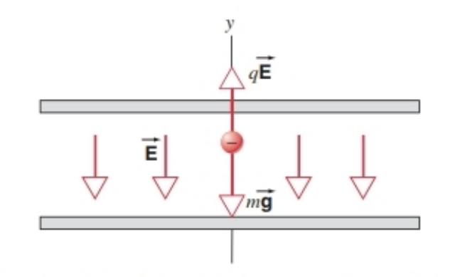
图26-15 例题26-5示意图：带负电的油滴处于均匀电场$\overrightarrow{E}$中，在重力$m \overrightarrow{g}$和电场力$q \overrightarrow{E}$共同作用下运动。

**解答（a）** 油滴平衡时，重力$mg$需与向上的电场力（大小为$qE$）抵消。已知电场方向向下，要使电场力方向向上，油滴所带电荷必须为负（负电荷受力方向与电场方向相反）。平衡条件为：
$$\sum \vec{F}=m \vec{g}+q \vec{E}=0$$

取$y$轴竖直向上，列$y$方向分量方程：
$$-mg + q(-E)=0$$
求解电荷$q$：
$$
\begin{aligned} 
q &=-\frac{mg}{E}=-\frac{\frac{4}{3}\pi R^3 \rho g}{E} \\ 
&=-\frac{\frac{4}{3}\pi(2.76 × 10^{-6}\ m)^3(918\ kg/m^3)(9.80\ m/s^2)}{1.65 × 10^6\ N/C} \\ 
&=-4.80 × 10^{-19}\ C 
\end{aligned}
$$

若将$q$表示为元电荷$-e$的整数倍（即$q=n(-e)$，$n$为油滴所带电子数），则：
$$n=\frac{q}{-e}=\frac{-4.80 × 10^{-19}\ C}{-1.60 × 10^{-19}\ C}=3$$
即油滴带3个多余电子。

**（b）** 捕获两个额外电子后，油滴的电荷量变为：
$$q'=(n+2)(-e)=5(-1.60 × 10^{-19}\ C)=-8.00 × 10^{-19}\ C$$

根据牛顿第二定律：
$$\sum \vec{F}=m \vec{g}+q' \vec{E}=m \vec{a}$$
列$y$方向分量方程：
$$-mg + q'(-E)=ma$$

求解加速度$a$：
$$
\begin{aligned} 
a&=-g-\frac{q'E}{m} \\ 
&=-9.80\ m/s^2-\frac{(-8.00 × 10^{-19}\ C)(1.65 × 10^6\ N/C)}{\frac{4}{3}\pi(2.76 × 10^{-6}\ m)^3(918\ kg/m^3)} \\ 
&=-9.80\ m/s^2 + 16.3\ m/s^2=+6.5\ m/s^2 
\end{aligned}
$$

加速度为正值，表明油滴沿正$y$方向（竖直向上）加速运动。

注：本计算中忽略了黏滞阻力（实际中该力通常很重要），所得加速度为油滴捕获电子瞬间的瞬时加速度。黏滞阻力与油滴速度成正比，若油滴从静止开始运动，初始阻力为零，随后随速度增大而增大，因此油滴的加速度会逐渐减小。

该实验装置是密立根油滴实验的基础，该实验最初用于测量元电荷$e$的大小，下文将详细介绍。

#### 例题26-6
图26-16展示了喷墨打印机的偏转电极系统。某墨滴的质量$m=1.3 × 10^{-10}\ kg$，带电荷量$q=-1.5 × 10^{-13}\ C$，以速度$v=18\ m/s$进入偏转板区域。偏转板长度$L=1.6\ cm$，两板间电场强度大小$E=1.4 × 10^6\ N/C$。求墨滴到达偏转板远端边缘时的竖直偏转量（忽略板边缘的非均匀电场）。

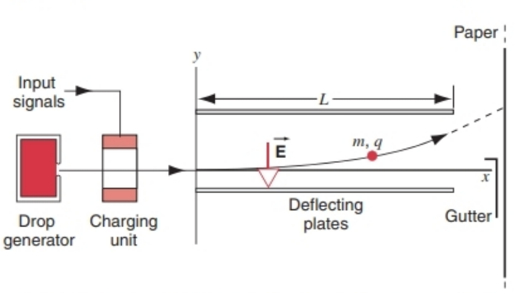
图26-16 例题26-6示意图：喷墨打印机的核心结构。计算机输入信号控制墨滴带电量，进而控制墨滴在纸上的撞击位置。电场$\overrightarrow{E}$产生的横向力使墨滴偏转：墨滴在两板间做抛物线运动，离开偏转区域后沿直线（图中虚线）运动。

**解答** 设墨滴穿过偏转系统的时间为$t$，其水平方向做匀速直线运动，竖直方向做匀加速直线运动，位移分别为：
$$y=\frac{1}{2}at^2\quad\text{和}\quad L=vt$$
其中$a$为墨滴的竖直加速度。

与前一例题类似，列牛顿第二定律的$y$方向分量方程：$-mg + q(-E)=ma$。可验证：本例中电场力$-qE$的大小远大于重力$mg$，因此加速度可近似为$a=qE/m$（负号表示加速度方向，后续计算中结合电荷正负可自动体现方向）。

联立两位移方程消去$t$，代入$a=qE/m$得：
$$
\begin{aligned} 
y&=\frac{-qE L^2}{2mv^2} \\ 
&=\frac{-(-1.5 × 10^{-13}\ C)(1.4 × 10^6\ N/C)(1.6 × 10^{-2}\ m)^2}{2×1.3 × 10^{-10}\ kg×(18\ m/s)^2} \\ 
&=6.4 × 10^{-4}\ m=0.64\ mm 
\end{aligned}
$$

需注意：墨滴到达纸张的偏转量会大于此值——如图26-16中虚线所示，墨滴离开偏转区域后会沿直线运动至纸张。为使墨滴准确形成字符，需将墨滴带电量$q$（偏转量与$q$成正比）的控制精度维持在百分之几以内。本计算中同样忽略了黏滞阻力，而在墨滴高速运动时，该阻力的影响十分显著。

#### 元电荷的测量
如今我们已知，电荷具有量子化特性——即电荷仅以元电荷$e$的整数倍存在。目前公认的元电荷值为$1.602176462 × 10^{-19}\ C$，实验不确定度仅体现在最后两位数字上。与几乎所有物理基本常数一样，这一现代数值来自一系列相互关联、精度不断提升的实验。

人类最初如何发现电荷的量子化特性，又如何首次测量元电荷$e$的大小？最早的明确答案来自美国物理学家罗伯特·A·密立根（Robert A. Millikan，1868-1953）的实验。他凭借此项工作及相关研究，获得了1923年诺贝尔物理学奖。

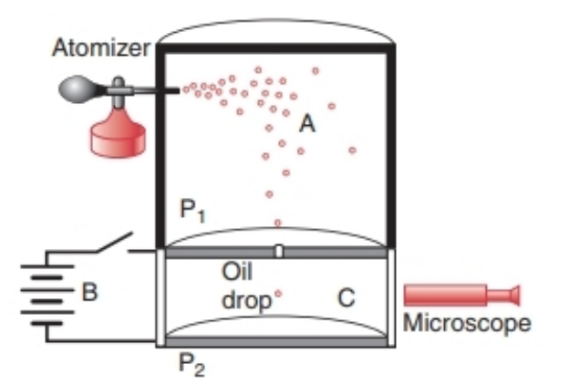
图26-17为密立根油滴实验装置：喷雾器将油滴喷入A室，部分油滴在喷雾过程中会带上电荷（正电或负电）。考虑一个带电荷量为$q$（假设为负电）的油滴，它会通过极板$P_1$上的小孔进入C室。

若C室中无电场，油滴仅受两个力：重力$mg$（竖直向下）和黏滞阻力（竖直向上，大小与油滴下落速度成正比）。油滴会迅速达到终端速度$v$，此时两力平衡，油滴匀速下落。

将电池B连接到极板$P_1$和$P_2$上，在C室中建立竖直向下的电场$\overrightarrow{E}$，此时油滴还会受到第三个力——电场力$q\overrightarrow{E}$。若$q$为负，电场力方向竖直向上，油滴会以新的终端速度$v'$向上运动。无论油滴向上还是向下运动，黏滞阻力的方向始终与运动方向相反，且大小与速度成正比。通过测量终端速度$v$和$v'$，即可计算出油滴的带电荷量$q$。

密立根发现，所有油滴的带电荷量$q$均满足以下关系：
$$q=ne,\quad n=0,\pm1,\pm2,\pm3,...$$
即油滴的电荷仅为某一基本电荷量（元电荷$e$）的整数倍。密立根通过实验推算出$e$的值约为$1.64 × 10^{-19}\ C$，与当前公认值高度一致。密立根油滴实验为“电荷量子化”提供了确凿证据。

#### 非均匀电场中的运动（选学）
截至目前，我们仅讨论了均匀电场中粒子的运动——即粒子运动区域内电场的大小和方向均恒定。但实际中，我们常需处理非均匀电场的情况。例如，考虑一个带正电的圆环（图26-18），其轴线上的电场由式（26-18）描述。假设将一个带电粒子从远处沿圆环轴线方向以初速度$v_0$射向圆环，粒子沿轴线运动时，电场强度（进而粒子所受电场力）会逐渐增大。

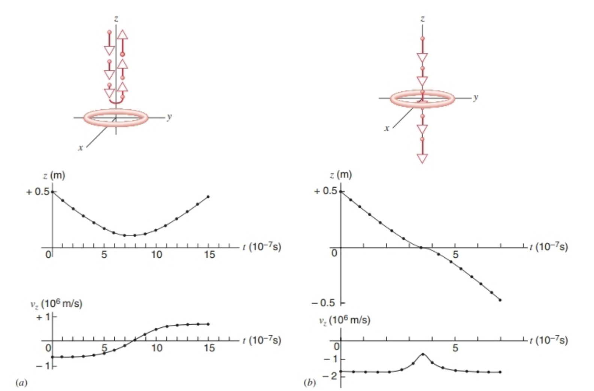
图26-18 （a）质子沿均匀带正电圆环轴线方向入射的运动轨迹：图中展示了质子的位置和速度变化。质子在约$8 × 10^{-7}\ s$时瞬时静止，随后反向运动。图中圆点为数值计算结果，曲线为拟合线；（b）若质子初速度足够大，可穿过圆环，且经过圆环中心时速度最小。

忽略重力，仅考虑电场力，如何分析粒子后续的运动？

这类“位置相关力”的问题，需采用与5-5节“时间相关力”类似的分析方法。由于静电力是保守力（将在第28章讨论），也可采用12-5节的能量分析方法；此外，还可通过数值技术求解：将运动划分为无数个微小时间间隔，在每个间隔内近似认为加速度恒定，再通过计算机得到近似解。

以具体计算为例：设圆环半径$R=3\ cm$，线电荷密度$\lambda=+2 × 10^{-7}\ C/m$；质子（$q=+1.6 × 10^{-19}\ C$，$m=1.67 × 10^{-27}\ kg$）从初始位置$z=+0.5\ m$处，沿圆环轴线（$z$轴）以初速度$v_{z0}=-7 × 10^5\ m/s$（负号表示向位于$xy$平面内的圆环运动）入射。带正电的圆环对质子产生排斥力，使质子速度减小。

图26-18a展示了“质子初动能不足以到达圆环平面”的运动情况：质子在圆环平面正上方某点瞬时静止，随后在排斥力作用下沿正$z$方向加速反向运动。需注意：除圆环附近区域外，远处电场较弱，质子速度几乎恒定。

图26-18b展示了“质子初动能足够大”的运动情况：排斥力使质子减速，但无法阻止其穿过圆环，质子经过圆环中心时速度达到最小值。同样，在远离圆环的区域，质子速度又会恢复到接近恒定的值。

### 26-7 A DIPOLE IN AN ELECTRIC FIELD
When we place an electric dipole (Fig. 26-5a) in an external electric field, the force on the positive charge will be in one direction and the force on the negative charge will be in another direction. In accounting for the net effect of these forces, it is convenient to use the dipole moment vector $\overrightarrow{p}$, which has magnitude $p=qd$ and which points from the negative charge toward the positive charge. Writing the dipole moment as a vector permits us to write the fundamental relationships involving electric dipoles in a concise form.

FIGURE 26-19. (a) An electric dipole in a uniform electric field. (b) The vector relationship $\vec{\tau}=\overrightarrow{p} ×\overrightarrow{E}$ between the dipole moment $\overrightarrow{p}$, the electric field $\overrightarrow{E}$, and the resultant torque $\vec{\tau}$ on the dipole. The torque points into the page.

Figure 26-19a shows a dipole in a uniform electric field $\overrightarrow{E}$. (This field is not that of the dipole itself but is produced by an external agent not shown in the figure.) The dipole moment $\overrightarrow{p}$ makes an angle $\theta$ with the direction of the field. We assume the field to be uniform, so that $\overrightarrow{E}$ has the same magnitude and direction at the location of $+q$ and $-q$. The forces on $+q$ and $-q$ therefore have equal magnitudes $F=qE$ but opposite directions, as shown in Fig. 26-19a. The net force on the dipole due to the external field is therefore zero, but there is a net torque about its center of mass that tends to rotate the dipole to bring $\overrightarrow{p}$ into alignment with $\overrightarrow{E}$. The torque on each charge is given by $\tau=Fr_{\perp}$; the net torque about the center of the dipole due to the two forces has magnitude 
$$\tau=F \frac{d}{2} \sin \theta+F \frac{d}{2} \sin \theta=Fd \sin \theta, \quad(26-25)$$
and its direction is perpendicular to the plane of the page and into the page, as indicated in Fig. 26-19b. We can write Eq. 26-25 as 
$$\tau=(qE)d \sin \theta=(qd)E \sin \theta=pE \sin \theta .(26-26)$$

Equation 26-26 can be written in vector form as 
$$\vec{\tau}=\vec{p} × \vec{E}, \quad(26-27)$$
which is consistent with the directional relationships for the cross product, as shown by the three vectors in Fig. 26-19b.

As is generally the case in dynamics when conservative forces act (the electrostatic force is conservative, as we discuss in Chapter 28), we can represent the system equally well using either force equations or energy equations. Let us therefore consider the work done by the electric field in turning the dipole through an angle $\theta$. Using the appropriate expression for work in rotational motion (Eq. 11-25), the work done by the external field in turning the dipole from an initial angle $\theta_0$ to a final angle $\theta$ is 
$$W=\int dW=\int_{\theta_0}^{\theta} \vec{\tau} \cdot d\vec{\theta}=\int_{\theta_0}^{\theta}-\tau d\theta, \quad(26-28)$$
where $\vec{\tau}$ is the torque exerted by the external electric field. The minus sign in Eq. 26-28 is necessary because the torque $\tau$ tends to decrease $\theta$; in vector terminology, $\vec{\tau}$ and $d\vec{\theta}$ are in opposite directions, so $\vec{\tau} \cdot d\vec{\theta}=-\tau d\theta$. Combining Eq. 26-28 with Eq. 26-26, we obtain 
$$
\begin{aligned} 
W &= \int_{\theta_0}^{\theta}-pE \sin \theta d\theta=-pE \int_{\theta_0}^{\theta} \sin \theta d\theta \\ 
&=pE\left(\cos \theta-\cos \theta_0\right) . 
\end{aligned}
$$

Since the work done by the agent that produces the external field is equal to the negative of the change in potential energy of the system of field + dipole, we have 
$$\Delta U \equiv U(\theta)-U(\theta_0)=-W=-pE\left(\cos \theta-\cos \theta_0\right) .$$

We arbitrarily define the reference angle $\theta_0$ to be $90^\circ$ and choose the potential energy $U(\theta_0)$ to be zero at that angle. At any angle $\theta$ the potential energy is then 
$$U=-pE \cos \theta, \quad(26-31)$$
which can be written in vector form as 
$$U=-\vec{p} \cdot \vec{E} . \quad(26-32)$$

Thus $U$ is a minimum when $\overrightarrow{p}$ and $\overrightarrow{E}$ are parallel.

A water molecule has an electric dipole moment. In a microwave oven, the electric field of the microwave radiation tends to rotate the dipole moment of water molecules into alignment with the field. A free water molecule would simply oscillate back and forth about its equilibrium position, but in materials (such as food) interactions between neighboring water molecules convert the angular motion due to the torque (or, equivalently, the kinetic energy of rotation arising from the decreased potential energy of the dipole in the field) into internal energy. The direction of the electric field reverses every $2 × 10^{-10}\ s$, and as the dipole moments continually try to follow the field, they transfer energy that cooks the food.

We can interpret the motion of a dipole in an external field either on the basis of a torque that rotates the dipole into alignment with the field (Eq. 26-27) or a potential energy that becomes a minimum when the dipole is aligned with the field (Eq. 26-32). The choice between the two interpretations is usually based on convenience in applications to a particular problem.

#### SAMPLE PROBLEM 26-7
A molecule of water vapor ($H_2O$) has an electric dipole moment of magnitude $p=6.2 × 10^{-30}\ C·m$ (This large dipole moment is responsible for many of the properties that make water such an important substance, such as its ability to act as an almost universal solvent.) Figure 26-20 is a representation of this molecule, showing the three nuclei and the surrounding electron distributions. The electric dipole moment $\overrightarrow{p}$ is represented by a vector on the axis of symmetry. The dipole moment arises because the effective center of positive charge does not coincide with the effective center of negative charge. (A contrasting case is that of a molecule of carbon dioxide, $CO_2$. Here the three atoms are joined in a straight line, with a carbon in the middle and oxygens on either side. The center of positive charge and the center of negative charge coincide at the center of mass of the molecule, and the electric dipole moment of $CO_2$ is zero.) (a) How far apart are the effective centers of positive and negative charge in a molecule of $H_2O$? (b) What is the maximum torque on a molecule of $H_2O$ in a typical laboratory electric field of magnitude $1.5 × 10^4\ N/C$? (c) Suppose the dipole moment of a molecule of $H_2O$ is initially pointing in a direction opposite to the field. How much work is done by the electric field in rotating the molecule into alignment with the field?

FIGURE 26-20. A molecule of $H_2O$ showing the three nuclei, the electron distributions, and the electric dipole moment vector $\overrightarrow{p}$.

**Solution (a)** There are 10 electrons and, correspondingly, 10 positive charges in this molecule. We can write, for the magnitude of the dipole moment, 
$$p=qd=(10e)(d),$$
in which $d$ is the separation we are seeking and $e$ is the elementary charge. Thus 
$$
\begin{aligned} 
d &= \frac{p}{10e}=\frac{6.2 × 10^{-30}\ C·m}{(10)(1.60 × 10^{-19}\ C)} \\ 
&=3.9 × 10^{-12}\ m=3.9\ pm . 
\end{aligned}
$$

This is about 4% of the OH bond distance in this molecule.

**(b)** As Eq. 26-26 shows, the torque is a maximum when $\theta=90^\circ$. Substituting this value in that equation yields 
$$
\begin{aligned} 
\tau &=pE \sin \theta=\left(6.2 × 10^{-30}\ C·m\right)\left(1.5 × 10^4\ N/C\right)\left(\sin 90^\circ\right) \\ 
&=9.3 × 10^{-26}\ N·m . 
\end{aligned}
$$

**(c)** The work done in rotating the dipole from $\theta_0=180^\circ$ to $\theta=0^\circ$ is given by Eq. 26-29, 
$$
\begin{aligned} 
W &=pE\left(\cos \theta-\cos \theta_0\right) \\ 
&=pE\left(\cos 0^\circ-\cos 180^\circ\right) \\ 
&=2pE=(2)\left(6.2 × 10^{-30}\ C·m\right)\left(1.5 × 10^4\ N/C\right) \\ 
&=1.9 × 10^{-25}\ J . 
\end{aligned}
$$

By comparison, the average translational contribution to the internal energy ($=\frac{3}{2}kT$) of a molecule at room temperature is $6.2 × 10^{-21}\ J$, which is 33,000 times larger. For the conditions of this problem, thermal agitation would overwhelm the tendency of the dipoles to align themselves with the field. That is, if we had a collection of molecules at room temperature with randomly oriented dipole moments, the application of an electric field of this magnitude would have a negligible influence on aligning the dipole moments, because of the large internal energies. If we wish to align the dipoles, we must use much stronger fields and/or much lower temperatures.

### 26-7 电场中的电偶极子
将电偶极子（图26-5a）放入外电场中时，正电荷所受电场力与负电荷所受电场力方向相反。为描述这两个力的总效应，引入电偶极矩矢量$\overrightarrow{p}$会非常便捷——其大小为$p=qd$（$q$为单个电荷的电荷量，$d$为正负电荷间距），方向从负电荷指向正电荷。将电偶极矩表示为矢量，可使电偶极子相关的基本关系式更加简洁。

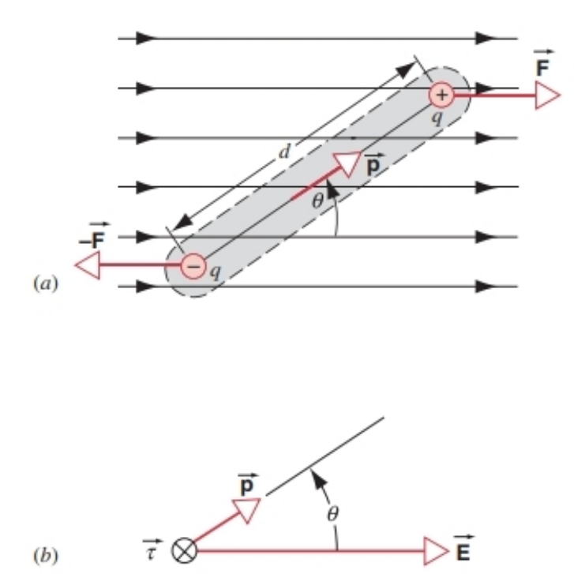
图26-19 （a）均匀电场中的电偶极子；（b）电偶极矩$\overrightarrow{p}$、电场$\overrightarrow{E}$与电偶极子所受合 torque（力矩）$\vec{\tau}$的矢量关系$\vec{\tau}=\overrightarrow{p}×\overrightarrow{E}$，力矩方向垂直纸面向里。

图26-19a展示了均匀电场$\overrightarrow{E}$中的电偶极子（注意：此电场由外部电荷产生，而非电偶极子自身的电场）。电偶极矩$\overrightarrow{p}$与电场方向的夹角为$\theta$。由于电场均匀，正电荷$+q$和负电荷$-q$所在位置的电场$\overrightarrow{E}$大小和方向均相同，因此两电荷所受电场力大小相等（$F=qE$）、方向相反（如图26-19a所示）。

综上，电偶极子在外电场中所受**合外力为零**，但会受到绕其质心的合外力矩——该力矩会使电偶极子绕质心转动，直至电偶极矩$\overrightarrow{p}$与电场$\overrightarrow{E}$同向（平衡位置）。单个电荷所受的力矩为$\tau=Fr_{\perp}$（$r_{\perp}$为力臂），因此电偶极子所受的合外力矩大小为：
$$\tau=F \cdot \frac{d}{2} \sin\theta + F \cdot \frac{d}{2} \sin\theta = Fd \sin\theta \quad(26-25)$$
力矩方向垂直于纸面且向里（如图26-19b所示）。将$F=qE$和$p=qd$代入式（26-25），可得：
$$\tau=(qE)d \sin\theta = (qd)E \sin\theta = pE \sin\theta \quad(26-26)$$

式（26-26）的矢量形式为：
$$\vec{\tau}=\overrightarrow{p}×\overrightarrow{E} \quad(26-27)$$
该式符合矢量叉乘的方向关系，如图26-19b中三个矢量所示（力矩方向由右手螺旋定则判断）。

#### 电偶极子的势能
在保守力（静电力为保守力，将在第28章讨论）作用的动力学问题中，通常既可通过力的方程分析，也可通过能量的方程描述。下面我们将分析电场使电偶极子转过角度$\theta$时所做的功。

根据转动过程中功的表达式（式11-25），外电场使电偶极子从初始角度$\theta_0$转到末角度$\theta$所做的功为：
$$W=\int dW = \int_{\theta_0}^{\theta} \vec{\tau} \cdot d\vec{\theta} = \int_{\theta_0}^{\theta} -\tau d\theta \quad(26-28)$$
式中$\vec{\tau}$为外电场对电偶极子的力矩。负号的物理意义是：力矩$\tau$的作用是减小角度$\theta$（使$\overrightarrow{p}$向$\overrightarrow{E}$靠拢），从矢量角度看，$\vec{\tau}$与角位移$d\vec{\theta}$方向相反，因此点积$\vec{\tau} \cdot d\vec{\theta}=-\tau d\theta$。

将式（26-26）（$\tau=pE \sin\theta$）代入式（26-28），积分可得：
$$
\begin{aligned} 
W &= \int_{\theta_0}^{\theta} -pE \sin\theta d\theta = -pE \int_{\theta_0}^{\theta} \sin\theta d\theta \\ 
&= pE \left( \cos\theta - \cos\theta_0 \right) \quad(26-29)
\end{aligned}
$$

由于“产生外电场的施力物体所做的功”等于“电偶极子-电场系统势能变化的负值”，即$\Delta U = -W$，因此系统的势能变化为：
$$\Delta U \equiv U(\theta) - U(\theta_0) = -W = -pE \left( \cos\theta - \cos\theta_0 \right) \quad(26-30)$$

为简化计算，我们**任意规定**：当电偶极矩$\overrightarrow{p}$与电场$\overrightarrow{E}$垂直（$\theta_0=90^\circ$）时，系统的势能为零（$U(\theta_0)=0$）。代入$\cos90^\circ=0$，可得任意角度$\theta$时系统的势能为：
$$U = -pE \cos\theta \quad(26-31)$$
其矢量形式为：
$$U = -\overrightarrow{p} \cdot \overrightarrow{E} \quad(26-32)$$

由式（26-31）可知：当$\overrightarrow{p}$与$\overrightarrow{E}$同向（$\theta=0^\circ$）时，$\cos\theta=1$，势能$U=-pE$（最小值）；当$\overrightarrow{p}$与$\overrightarrow{E}$反向（$\theta=180^\circ$）时，$\cos\theta=-1$，势能$U=pE$（最大值）——这与“力矩使电偶极子向势能最小的方向转动”的物理直觉一致。

#### 应用：微波炉的加热原理
水分子具有电偶极矩。在微波炉中，微波辐射产生的交变电场会使水分子的电偶极矩不断转向，以试图与交变电场保持同向。若水分子不受其他作用，仅会绕平衡位置往复振动；但在食物等物质中，水分子间的相互作用会将“力矩引起的转动”（或等效为“电偶极子在电场中势能降低所转化的转动动能”）转化为物质的内能（分子热运动加剧）。

微波炉中电场的方向每$2×10^{-10}\ s$反转一次，水分子的电偶极矩会不断跟随电场方向变化，在此过程中持续将能量传递给食物，实现加热效果。

#### 例题26-7
水蒸气中的水分子（$H_2O$）电偶极矩大小为$p=6.2×10^{-30}\ C·m$（这一较大的电偶极矩是水具有诸多重要性质的原因，例如几乎能溶解所有物质的能力）。图26-20为水分子的结构示意图，展示了三个原子核（两个氢核、一个氧核）及周围的电子云分布，电偶极矩矢量$\overrightarrow{p}$沿分子的对称轴方向。水分子的电偶极矩源于“正电荷的等效中心”与“负电荷的等效中心”不重合（对比：二氧化碳分子$CO_2$的三个原子呈直线排列，碳原子在中间，氧原子在两侧，其正、负电荷等效中心重合于分子质心，因此电偶极矩为零）。

（a）求水分子中正、负电荷等效中心的间距；（b）在典型的实验室电场（大小$E=1.5×10^4\ N/C$）中，水分子所受的最大力矩为多少？（c）若水分子的电偶极矩初始时与电场反向，求电场将其转到与电场同向时所做的功。

图26-20 水分子结构示意图：展示了三个原子核、电子云分布及电偶极矩矢量$\overrightarrow{p}$。

**解答（a）** 水分子中共有10个电子（对应10个负电荷）和10个正电荷（质子），因此电偶极矩的大小可表示为：
$$p=qd=(10e)d$$
其中$d$为正、负电荷等效中心的间距，$e=1.60×10^{-19}\ C$为元电荷。代入数据求解$d$：
$$
\begin{aligned} 
d &= \frac{p}{10e} = \frac{6.2×10^{-30}\ C·m}{10×1.60×10^{-19}\ C} \\ 
&= 3.9×10^{-12}\ m = 3.9\ pm 
\end{aligned}
$$
该间距约为水分子中O-H键长度的4%。

**（b）** 由式（26-26）$\tau=pE \sin\theta$可知，当$\sin\theta=1$（即$\theta=90^\circ$，电偶极矩与电场垂直）时，力矩达到最大值。代入数据：
$$
\begin{aligned} 
\tau_{max} &= pE \sin90^\circ = 6.2×10^{-30}\ C·m × 1.5×10^4\ N/C × 1 \\ 
&= 9.3×10^{-26}\ N·m 
\end{aligned}
$$

**（c）** 电偶极子从$\theta_0=180^\circ$（反向）转到$\theta=0^\circ$（同向），电场所做的功由式（26-29）计算：
$$
\begin{aligned} 
W &= pE \left( \cos\theta - \cos\theta_0 \right) \\ 
&= pE \left( \cos0^\circ - \cos180^\circ \right) \\ 
&= pE \left[ 1 - (-1) \right] = 2pE 
\end{aligned}
$$
代入数据：
$$
W=2×6.2×10^{-30}\ C·m ×1.5×10^4\ N/C = 1.9×10^{-25}\ J
$$

对比可知：室温下分子的平均平动内能（$\frac{3}{2}kT$，$k$为玻尔兹曼常数）约为$6.2×10^{-21}\ J$，是上述功的3.3×10⁴倍。因此，在本题条件下，热运动的无规则性会掩盖电场对电偶极子的定向作用——即使对室温下偶极矩随机取向的水分子集合施加该电场，也几乎无法使偶极矩定向排列。若需实现定向排列，需使用更强的电场或更低的温度。

### 26-8 THE NUCLEAR MODEL OF THE ATOM (Optional)
Today we know that an atom consists of a tiny nucleus carrying a positive charge $Ze$, where $Z$ is the atomic number of the atom. The nucleus is surrounded by a much larger volume containing $Z$ electrons, each carrying a charge of $-e$, so that the atom as a whole is electrically neutral. We also know that the nucleus contains a very large fraction (typically greater than 99.995%) of the mass of the atom.

In the early years of the 20th century these facts were not known, and there was much speculation about the structure of the atom and especially about the distribution of its positive charge. According to one theory that was popular at that time, the positive charge is distributed more or less uniformly throughout the entire spherical volume of the atom. This model of the structure of the atom is called the Thomson model after J. J. Thomson, who proposed it. (Thomson was the first to measure the charge-to-mass ratio of the electron and is therefore often credited as the discoverer of the electron.) It is also called the “plum pudding” model, because the electrons are imbedded throughout the diffuse sphere of positive charge like raisins in a plum pudding.

One way of testing this model is to determine the electric field of the atom by probing it with a beam of positively charged projectiles that pass nearby. The particles in the beam are deflected or scattered by the electric field of the atom. In the following discussion, we consider only the effect on the projectile of the sphere of positive charge. We assume that the projectile is both much less massive than the atom and much more massive than an electron. In this way the electrons have a negligible effect on the scattering of the projectile, and the atom can be assumed to remain at rest while the projectile is deflected.

We can estimate the deflection for a Thomson-model atom, in which the positive charge is uniformly distributed throughout the volume of the atom. The electric field due to a uniform sphere of positive charge was given by Eq. 26-6 for points outside the sphere of charge and by Eq. 26-24 for points inside. Let us calculate the electric field at the surface, which, as Fig. 26-8 shows, is the largest possible field that this distribution can produce. We consider a heavy atom such as gold, which has a positive charge $Q$ of $79e$ and a radius $R$ of about $1.0 × 10^{-10}\ m$. Neglecting the electrons, the electric field at $r=R$ due to the positive charges is 
$$E_{max}=\frac{1}{4\pi\epsilon_0}\frac{Q}{R^2}=1.1 × 10^{13}\ N/C .$$

For the projectiles in our experiment, let us use a beam of alpha particles, which have a positive charge $q$ of $2e$ and a mass $m$ of $6.6 × 10^{-27}\ kg$. Alpha particles are nuclei of helium atoms, which are emitted in certain radioactive decay processes. A typical kinetic energy for such a particle might be about $K=6\ MeV$ or $9.6 × 10^{-13}\ J$. At this energy you can easily verify that the particle has a speed of about $1.7 × 10^7\ m/s$.

Let the particle pass near the surface of the atom, where it experiences the largest electric field that this atom could exert. The corresponding force on the particle is 
$$F=qE_{max}=3.5 × 10^{-6}\ N .$$

Figure 26-21 shows a schematic diagram of a scattering experiment. The actual calculation of the deflection is relatively complicated, but we can make some approximations that simplify the calculation and permit a rough estimate of the maximum deflection. Let us assume that the above force is constant and acts only during the time $\Delta t$ it takes the projectile to travel a distance equal to a diameter of the atom, as indicated in Fig. 26-21. This time interval is 
$$\Delta t=\frac{2R}{v}=1.2 × 10^{-17}\ s .$$

FIGURE 26-21. The scattering of a positively charged projectile passing near the surface of an atom, represented by a uniform sphere of positive charge. The electric field on the projectile causes a transverse deflection by an angle $\theta$.

The force gives the particle a transverse acceleration $a_t$, which produces a transverse velocity $\Delta v$ given by 
$$\Delta v=a_t\Delta t=\frac{F}{m}\Delta t=6.4 × 10^3\ m/s .$$

The particle will be deflected by a small angle $\theta$ that can be estimated to be about 
$$\theta=\tan^{-1}\frac{\Delta v}{v}=0.02^\circ .$$

This type of scattering experiment was first done by Ernest Rutherford and his collaborators at the University of Manchester (England) in 1911. They passed a beam of alpha particles through a thin gold foil and determined the relative probability for alpha particles to be scattered through various angles $\theta$ relative to their original direction. Of course they could not control how the alpha particles passed through any particular atom; in fact, rather than grazing the edge, most alpha particles would pass through the volume of the atom pictured in Fig. 26-21 and (according to the Thomson model) be deflected by less than the maximum angle we have calculated.

The results of the experiment showed that, although nearly all of the alpha particles were deflected by angles no greater than a few hundredths of a degree, a small number (perhaps 1 in $10^4$) were deflected by angles greater than $90^\circ$. This result is in complete disagreement with the Thomson model and led Rutherford to comment: “It was quite the most incredible event that ever happened to me in my life. It was almost as incredible as if you had fired a 15-inch shell at a piece of tissue paper and it came back and hit you.”

Based on this kind of scattering experiment, Rutherford concluded that the positive charge of an atom was not diffused throughout a sphere of the same size as the atom, but instead was concentrated in a tiny region (the nucleus) near the center of the atom. In the case of a gold atom, the nucleus has a radius of about $7 × 10^{-15}\ m$ (7 fm), roughly $10^{-4}$ times smaller than the radius of the atom. That is, the nucleus occupies a volume only $10^{-12}$ that of the atom!

Let us calculate the maximum electric field and the corresponding force on an alpha particle that passes close to the surface of the nucleus. If we regard the nucleus as a uniform spherical ball of charge $Q=79e$ and radius $R=7\ fm$, the maximum electric field is 
$$E_{max}=\frac{1}{4\pi\epsilon_0}\frac{Q}{R^2}=2.3 × 10^{21}\ N/C .$$

This is more than eight orders of magnitude larger than the electric field that would act on a particle at the surface of a plum-pudding model atom. The corresponding force is 
$$F=qE_{max}=740\ N .$$

This is a huge force! Let us make the same simplification we did in our previous calculation and assume that this force is constant and acts on the particle only during the time $\Delta t$ it takes the particle to travel a distance equal to one nuclear diameter: 
$$\Delta t=\frac{2R}{v}=8.2 × 10^{-22}\ s .$$

The corresponding change in the velocity of the particle can be estimated to be 
$$\Delta v=a_t\Delta t=\frac{F}{m}\Delta t=9 × 10^7\ m/s .$$

This is comparable in magnitude to the velocity itself. We conclude that a nuclear atom can produce an electric field that is sufficiently large to reverse the motion of the projectile.

Based on the nuclear model of the atom, Rutherford was able to derive an exact formula for the number of particles scattered at any particular angle, and the experiments showed perfect agreement with this formula. He was also able to use the formula to determine the atomic number $Z$ of the target atoms. Moreover, by using particles of a higher energy that actually penetrate the nucleus (see Sample Problem 25-7), this method can also be used to determine the nuclear radius.

This classic and painstaking series of experiments and their brilliant interpretation laid the foundation for modern atomic and nuclear physics, and Rutherford is generally credited as the founder of these fields.

### 26-8 原子的核式模型（选学）
如今我们已知，原子由一个带正电的微小原子核和核外电子构成：原子核的电荷量为$Ze$（$Z$为原子序数），核外更大的空间中分布着$Z$个电子（每个电子电荷量为$-e$），因此原子整体呈电中性。同时我们还知道，原子核集中了原子的绝大部分质量（通常超过99.995%）。

但在20世纪初期，这些事实尚未被发现，科学界对原子结构（尤其是正电荷的分布方式）存在诸多猜测。当时一种流行的理论认为，原子的正电荷均匀分布在整个球形原子体积内，这一模型由J. J. 汤姆孙（J. J. Thomson）提出，因此被称为**汤姆孙模型**。汤姆孙首次测量了电子的荷质比，通常被认为是电子的发现者；该模型也被称为“葡萄干布丁模型”——电子像葡萄干一样嵌在均匀分布的正电荷“布丁”中。

#### 汤姆孙模型的检验：α粒子散射实验
要检验原子模型的正确性，可通过“带电粒子束轰击原子”的实验探测原子的电场分布：粒子束会因原子电场的作用发生偏转（散射）。以下分析仅考虑正电荷球对粒子的作用，且假设入射粒子满足两个条件：（1）质量远小于原子（确保原子碰撞后近似静止）；（2）质量远大于电子（确保电子对粒子散射的影响可忽略）。

根据汤姆孙模型，原子的正电荷均匀分布在球形体积内，其电场分布可由之前的公式描述：球外电场遵循式（26-6）（点电荷电场），球内电场遵循式（26-24）（线性增长电场）。如图26-8所示，原子表面（$r=R$）的电场强度最大，我们以此为基准估算粒子的最大偏转。

以金原子为例（常用于散射实验）：正电荷总量$Q=79e$，原子半径$R\approx1.0×10^{-10}\ m$。忽略电子的影响，原子表面的电场强度为：
$$E_{max}=\frac{1}{4\pi\epsilon_0}\frac{Q}{R^2}=1.1 × 10^{13}\ N/C$$

实验中选用α粒子作为入射粒子：α粒子是氦原子核，电荷量$q=2e$，质量$m=6.6×10^{-27}\ kg$，常见于某些放射性衰变过程。典型α粒子的动能约为$K=6\ MeV$（即$9.6×10^{-13}\ J$），据此可算出其速度约为$1.7×10^7\ m/s$。

假设α粒子从原子表面附近掠过（此时受电场力最大），所受电场力为：
$$F=qE_{max}=3.5 × 10^{-6}\ N$$

图26-21为散射实验的示意图。精确计算偏转角度较为复杂，但可通过近似简化估算最大偏转：假设上述电场力恒定，且仅在粒子穿过“原子直径”的时间内作用（如图26-21所示）。该作用时间为：
$$\Delta t=\frac{2R}{v}=1.2 × 10^{-17}\ s$$

图26-21 带正电的入射粒子从“均匀正电荷球模型”的原子表面附近掠过的散射示意图。原子电场使粒子产生横向偏转，偏转角为$\theta$。

电场力使粒子产生横向加速度$a_t$，进而产生横向速度$\Delta v$：
$$\Delta v=a_t\Delta t=\frac{F}{m}\Delta t=6.4 × 10^3\ m/s$$

粒子的偏转角$\theta$可通过“横向速度与入射速度的比值”估算（因偏转角很小，$\tan\theta\approx\theta$）：
$$\theta=\tan^{-1}\frac{\Delta v}{v}\approx0.02^\circ$$

这一结果表明，根据汤姆孙模型，α粒子的最大偏转角仅约$0.02^\circ$，且大部分粒子的偏转角会更小。

#### 卢瑟福的实验与核式模型的提出
1911年，英国曼彻斯特大学的欧内斯特·卢瑟福（Ernest Rutherford）及其团队首次完成了α粒子散射实验：他们让α粒子束穿过薄金箔，测量粒子被散射到不同角度$\theta$的概率。

实验结果却与汤姆孙模型的预测完全不符：尽管绝大多数α粒子的偏转角不超过百分之几度，但有极少数粒子（约1/10⁴）的偏转角超过了$90^\circ$，甚至出现了“反向散射”（偏转角接近$180^\circ$）。卢瑟福对此惊叹道：“这是我一生中最不可思议的事件，就像用15英寸的炮弹轰击一张薄纸，炮弹却反弹回来击中了你。”

基于这一实验结果，卢瑟福提出了**原子的核式模型**：原子的正电荷并非均匀分布在原子体积内，而是集中在原子中心一个极小的区域——原子核中。以金原子为例，原子核半径约为$7×10^{-15}\ m$（7飞米），仅为原子半径的$10^{-4}$倍；原子核的体积更是仅为原子体积的$10^{-12}$倍！

#### 核式模型的电场与散射验证
若将原子核视为“均匀带电球体”（电荷量$Q=79e$，半径$R=7\ fm$），计算α粒子掠过原子核表面时的最大电场强度：
$$E_{max}=\frac{1}{4\pi\epsilon_0}\frac{Q}{R^2}=2.3 × 10^{21}\ N/C$$

这一电场强度比汤姆孙模型中原子表面的电场强8个数量级以上，对应的电场力为：
$$F=qE_{max}=740\ N$$

同样假设力恒定作用，且作用时间为粒子穿过“原子核直径”的时间：
$$\Delta t=\frac{2R}{v}=8.2 × 10^{-22}\ s$$

此时粒子的横向速度变化为：
$$\Delta v=\frac{F}{m}\Delta t=9 × 10^7\ m/s$$

这一横向速度与粒子的入射速度（$1.7×10^7\ m/s$）相当，足以使粒子发生大角度偏转甚至反向运动，与实验结果完全一致。

#### 核式模型的意义
基于原子的核式模型，卢瑟福推导出了“粒子散射到任意角度的数量公式”，实验结果与该公式完美吻合。此外，利用该公式还可测定靶原子的原子序数$Z$；若使用更高能量的粒子（可穿透原子核，见例题25-7），还能进一步测量原子核的半径。

这一系列经典且严谨的实验及其出色的理论解释，为现代原子物理和核物理奠定了基础，卢瑟福也因此被公认为这两个领域的奠基人。

### 1. 
**Original Content**：The electric field is defined in Eq. 26-3 in terms of $q_{0}$, a small positive charge. If instead the definition were in terms of a small negative charge of the same magnitude, then compared to the original field, the newly defined electric field
(A) would point in the same direction, and have the same magnitude.
(B) would point in the opposite direction, but have the same magnitude.
(C) would point in the same direction, but have a different magnitude.
(D) would point in the opposite direction, and have a different magnitude.

**Chinese Translation**：电场在式（26-3）中是通过小正电荷$q_{0}$定义的。若改用大小相同的小负电荷来定义电场，那么与原电场相比，新定义的电场
（A）方向相同，大小相同  
（B）方向相反，大小相同  
（C）方向相同，大小不同  
（D）方向相反，大小不同  

### 2. 
**Original Content**：A point charge $+q$ is located at the origin, and a point charge $+2q$ is located at $x=a$, where $a$ is positive.
(a) Which of the following statements is true?
(A) Close to the charges, the electric field can be zero off the x axis.
(B) Close to the charges, the magnitude of the electric field can be a maximum off the x axis.
(C) The electric field can be zero somewhere between the charges.
(D) The electric field can be zero on the x axis at finite points not between the charges.

(b) In which of the following regions might there exist a point where the electric field has zero magnitude?
(A) $-\infty<x<0$
(B) $0<x<a$
(C) $a<x<\infty$
(D) E does not vanish in the region $-\infty<x<\infty$

**Chinese Translation**：点电荷$+q$位于坐标原点，点电荷$+2q$位于$x=a$处（$a$为正值）。  
（a）下列说法正确的是？  
（A）在靠近电荷的区域，x轴外存在电场为零的点  
（B）在靠近电荷的区域，x轴外存在电场强度大小为最大值的点  
（C）两电荷之间某处存在电场为零的点  
（D）x轴上非两电荷之间的有限远处存在电场为零的点  

（b）下列哪个区域可能存在电场强度大小为零的点？  
（A）$-\infty<x<0$  
（B）$0<x<a$  
（C）$a<x<\infty$  
（D）在$-\infty<x<\infty$区域内电场均不消失  

### 3. 
**Original Content**：A point charge $+q$ is located at the origin, and a point charge $-2q$ is located at $x=a$ where $a$ is positive.
(a) Which of the following statements is true?
(A) Close to the charges, the electric field can be zero off the x axis.
(B) Close to the charges, the magnitude of the electric field can be a maximum off the x axis.
(C) The electric field can be zero between the charges.
(D) The electric field can be zero on the x axis at finite points not between the charges.

(b) In which of the following regions might there exist a point where the electric field has zero magnitude?
(A) $-\infty<x<0$
(B) $0<x<a$
(C) $a<x<\infty$
(D) E does not vanish in the region $-\infty<x<\infty$

**Chinese Translation**：点电荷$+q$位于坐标原点，点电荷$-2q$位于$x=a$处（$a$为正值）。  
（a）下列说法正确的是？  
（A）在靠近电荷的区域，x轴外存在电场为零的点  
（B）在靠近电荷的区域，x轴外存在电场强度大小为最大值的点  
（C）两电荷之间存在电场为零的点  
（D）x轴上非两电荷之间的有限远处存在电场为零的点  

（b）下列哪个区域可能存在电场强度大小为零的点？  
（A）$-\infty<x<0$  
（B）$0<x<a$  
（C）$a<x<\infty$  
（D）在$-\infty<x<\infty$区域内电场均不消失  

### 4. 
**Original Content**：Consider the magnitude of the electric field $E(z)$ on the axis of a uniform ring of charge. (a) $E(z)$ will have its largest value where
(A) $z=0$
(B) $0<|z|<\infty$
(C) $|z|=\infty$
(D) (A) and (C) are correct.

(b) $E(z)$ can be zero where
(A) $z=0$
(B) $0<|z|<\infty$
(C) $|z|=\infty$
(D) (A) and (C) are correct.

**Chinese Translation**：考虑均匀带电圆环轴线上电场强度的大小$E(z)$。  
（a）$E(z)$的最大值出现在哪个位置？  
（A）$z=0$（圆环中心）  
（B）$0<|z|<\infty$（轴线上非中心的有限远处）  
（C）$|z|=\infty$（轴线上无限远处）  
（D）（A）和（C）均正确  

（b）$E(z)$可能为零的位置是？  
（A）$z=0$（圆环中心）  
（B）$0<|z|<\infty$（轴线上非中心的有限远处）  
（C）$|z|=\infty$（轴线上无限远处）  
（D）（A）和（C）均正确  

### 5. 
**Original Content**：Consider the magnitude of the electric field $E(z)$ on the axis of a uniform disk of charge. (a) $E(z)$ will have its largest value where
(A) $z=0$
(B) $0<|z|<\infty$
(C) $|z|=\infty$
(D) (A) and (C) are correct.

(b) $E(z)$ can be zero where
(A) $z=0$
(B) $0<|z|<\infty$
(C) $|z|=\infty$
(D) (A) and (C) are correct.

**Chinese Translation**：考虑均匀带电圆盘轴线上电场强度的大小$E(z)$。  
（a）$E(z)$的最大值出现在哪个位置？  
（A）$z=0$（圆盘中心正上方）  
（B）$0<|z|<\infty$（轴线上非中心正上方的有限远处）  
（C）$|z|=\infty$（轴线上无限远处）  
（D）（A）和（C）均正确  

（b）$E(z)$可能为零的位置是？  
（A）$z=0$（圆盘中心正上方）  
（B）$0<|z|<\infty$（轴线上非中心正上方的有限远处）  
（C）$|z|=\infty$（轴线上无限远处）  
（D）（A）和（C）均正确  

### 6. 
**Original Content**：Figure 26-22 shows the electric field lines around an electric dipole. Which of the arrows best represents the electric field at point $P$?
(A) (B) (C) (D) (E)

**Chinese Translation**：图26-22展示了电偶极子周围的电场线。下列哪个箭头最能表示点$P$处的电场方向？  
（A）（B）（C）（D）（E）（注：因未提供图26-22，选项为图中对应箭头标识）  

### 7. 
**Original Content**：Figure 26-23 shows the electric field lines around three point charges, A, B, and C. (a) Which charges are positive? (b) Which charge has the largest magnitude? (c) In which region or regions of the picture could the electric field be zero?

**Chinese Translation**：图26-23展示了三个点电荷A、B、C周围的电场线。  
（a）哪些电荷带正电？  
（b）哪个电荷的电荷量大小最大？  
（c）图中哪个或哪些区域可能存在电场为零的点？  

### 8. 
**Original Content**：Three small spheres x, y, and z carry charges of equal magnitudes and with signs shown in Fig. 26-24. They are placed at the vertices of an isosceles triangle with the distance between x and y equal to the distance between x and z. Spheres y and z are held in place but sphere x is free to move on a frictionless surface.
(a) What is the direction of the electric force on sphere x at the point shown in the figure?
(b) Which path will sphere x take when released?

**Chinese Translation**：三个小球x、y、z带有大小相等的电荷，电荷正负如图26-24所示。三个小球放置在等腰三角形的三个顶点上，x与y的距离等于x与z的距离。小球y和z被固定，小球x可在无摩擦表面上自由移动。  
（a）图中所示位置处，小球x受到的电场力方向是什么？  
（b）释放后，小球x会沿哪条路径运动？  

### 9. 
**Original Content**：An electron is located in the uniform electric field established between parallel charged positive and negative plates. Where would the electron experience the greatest electrostatic force?
(A) When the electron is closer to the positive plate
(B) When the electron is closer to the negative plate
(C) When the electron is midway between the plates
(D) The electron experiences the same force regardless of the location between the plates.

**Chinese Translation**：电子处于由带异种电荷的平行板建立的均匀电场中。电子在哪个位置受到的静电力最大？  
（A）靠近正极板时  
（B）靠近负极板时  
（C）在两板正中间时  
（D）在两板之间的任意位置，电子受到的力均相同  

### 10. 
**Original Content**：The following measurements were made of the charge (in units of $10^{-19} C$) on a series of charged droplets. What is the largest possible fundamental unit of charge that can be deduced from these data?
| 4.8 | 19.2 | 28.8 |
| --- | --- | --- |
| 9.6 | 38.4 | 24 |
(A) $1.6 × 10^{-19} C$
(B) $4.8 × 10^{-19} C$
(C) $9.6 × 10^{-19} C$
(D) $48 × 10^{-19} C$

**Chinese Translation**：对一系列带电油滴的电荷量（单位：$10^{-19} C$）进行了如下测量。从这些数据中可推导出的最大可能的基本电荷单位是多少？
| 4.8 | 19.2 | 28.8 |
| --- | --- | --- |
| 9.6 | 38.4 | 24 |
（A）$1.6 × 10^{-19} C$  
（B）$4.8 × 10^{-19} C$  
（C）$9.6 × 10^{-19} C$  
（D）$48 × 10^{-19} C$  

### 11. 
**Original Content**：The electric field in a certain region of space obeys $E_{y} \neq 0$, $E_{x}=E_{z}=0$ and $\partial \overrightarrow{E}/\partial x \neq 0$, $\partial \overrightarrow{E}/\partial y=\partial \overrightarrow{E}/\partial z=0$.
(a) The net force on an electric dipole oriented parallel to the x axis in this field is
(A) directed along the x axis.
(B) directed along the y axis.
(C) directed along the z axis.
(D) None of the above

(b) The net torque on an electric dipole parallel to the x axis in this field is
(A) directed along the x axis.
(B) directed along the y axis.
(C) directed along the z axis.
(D) None of the above

**Chinese Translation**：空间某区域的电场满足$E_{y} \neq 0$、$E_{x}=E_{z}=0$，且$\partial \overrightarrow{E}/\partial x \neq 0$、$\partial \overrightarrow{E}/\partial y=\partial \overrightarrow{E}/\partial z=0$（即电场仅沿y方向，且沿x方向变化，沿y、z方向不变）。  
（a）电偶极矩沿x轴方向的电偶极子在该电场中受到的合外力方向是？  
（A）沿x轴方向  
（B）沿y轴方向  
（C）沿z轴方向  
（D）以上均不正确  

（b）电偶极矩沿x轴方向的电偶极子在该电场中受到的合外力矩方向是？  
（A）沿x轴方向  
（B）沿y轴方向  
（C）沿z轴方向  
（D）以上均不正确