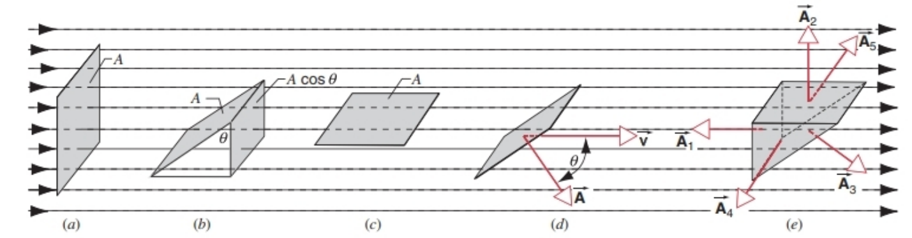
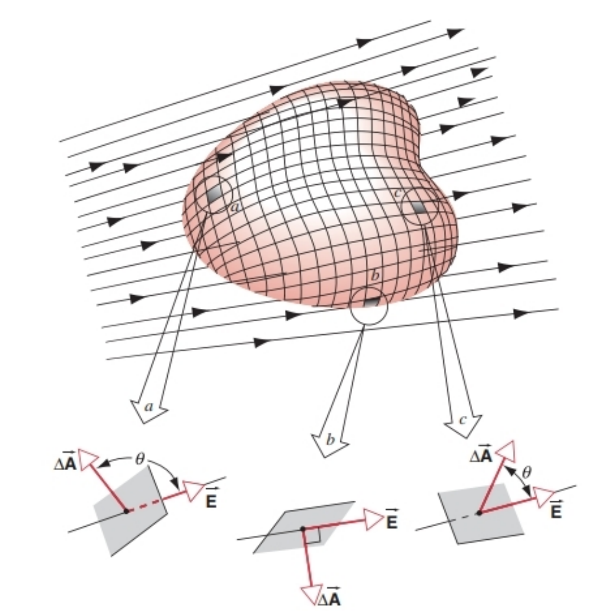
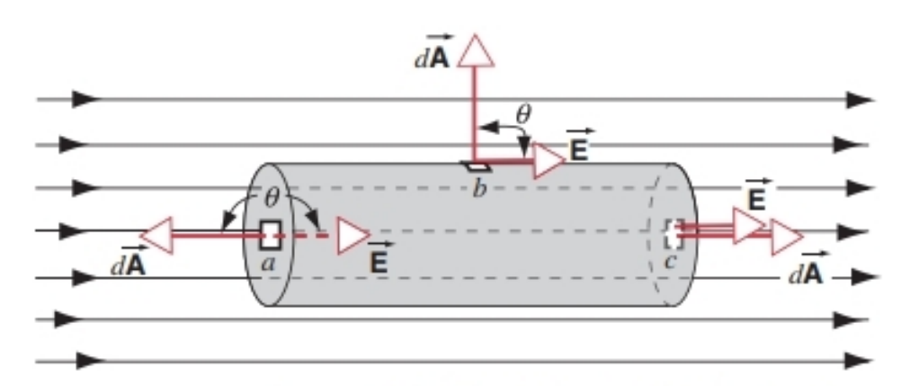
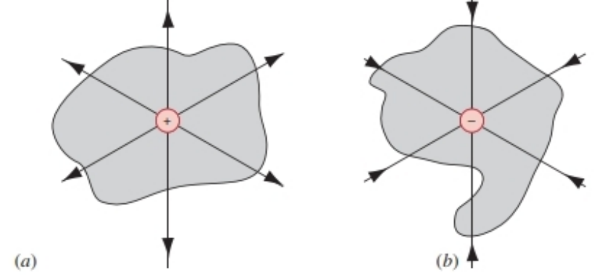
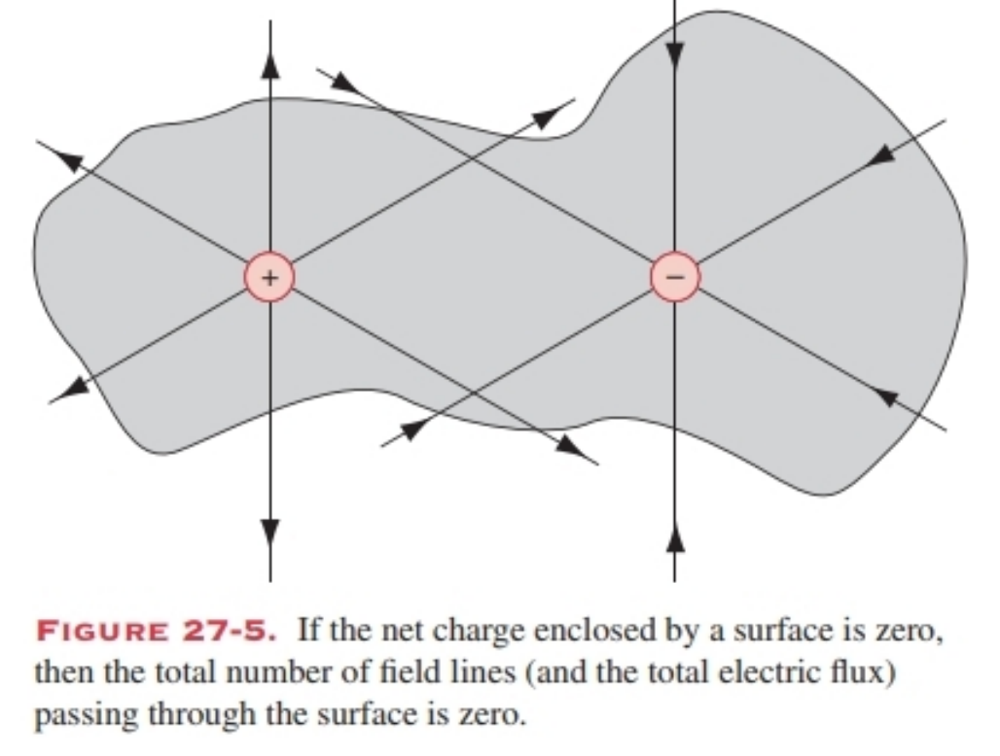
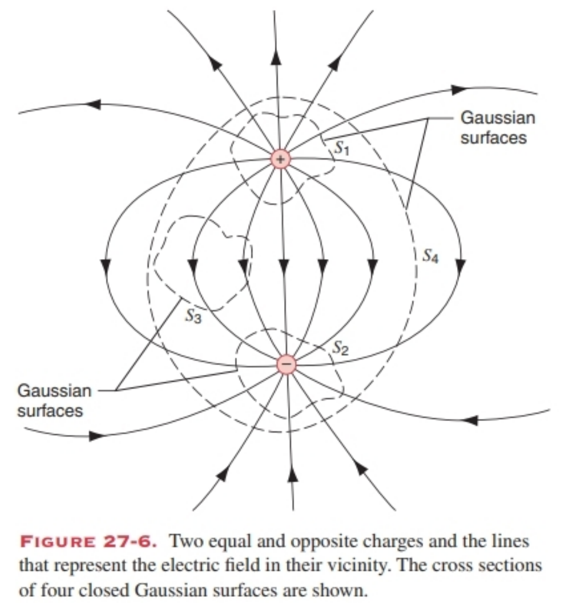
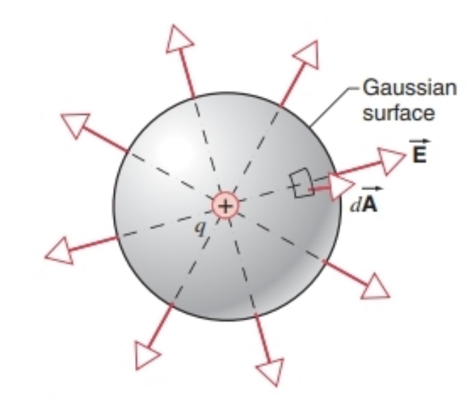
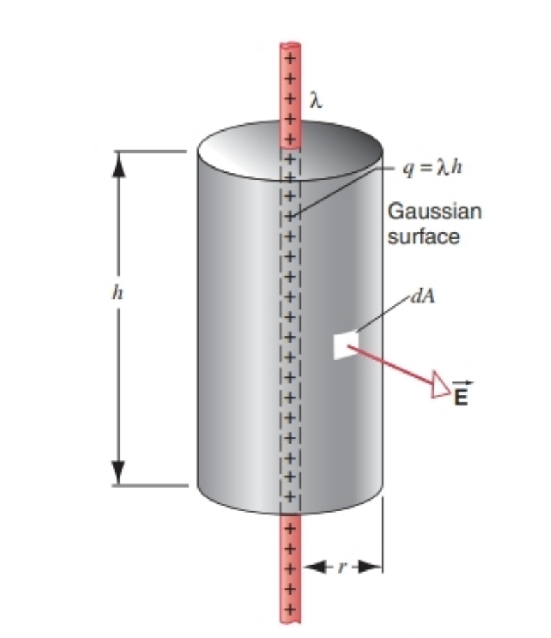

# Gauss' Law

## CheatsheeTwT
### 🔍 **1. 高斯定律的核心思想**
- **高斯定律**是静电学的基本定律之一，与库仑定律等价，但更普遍。
- **适用条件**：
  - 静止电荷或低速运动电荷；
  - 高速运动电荷也成立（库仑定律不适用）。
- **用途**：
  - 简化对称电荷分布的电场计算；
  - 推导库仑定律；
  - 是麦克斯韦方程组之一。

---

### 📐 **2. 矢量场的通量（Flux）**
- **定义**：衡量场矢量穿过某一曲面的“流量”。
- **通量公式**：
  - 对于均匀场 $\vec{v}$ 和平面 $\vec{A}$：
    $$
    \Phi = \vec{v} \cdot \vec{A} = vA\cos\theta
    $$
  - 对于非均匀场和任意曲面：
    $$
    \Phi = \int \vec{v} \cdot d\vec{A}
    $$
- **闭合曲面通量**：
  - 正：流出；负：流入。
  - 若无源/汇，净通量为零。

---

### ⚡ **3. 电通量（Electric Flux）**
- **定义**：
  $$
  \Phi_E = \int \vec{E} \cdot d\vec{A}
  $$
- **单位**：$N \cdot m^2/C$
- **几何意义**：穿过曲面的电场线条数。

---

### 🧲 **4. 高斯定律（数学表达式）**
- **积分形式**：
  $$
  \epsilon_0 \oint \vec{E} \cdot d\vec{A} = q_{\text{enc}}
  $$
  - $q_{\text{enc}}$：闭合曲面内包围的**净电荷**。
- **微分形式**（略，本章未强调）
- **关键点**：
  - 高斯面的选择是任意的，但应利用对称性；
  - 电场 $\vec{E}$ 必须是已知对称形式才能从积分中提出。

---

### 🧩 **5. 高斯定律的应用（对称电荷分布）**

| 电荷分布 | 高斯面选择 | 电场大小 $E$ |
|----------|-------------|--------------|
| 点电荷 $q$ | 球面（半径 $r$） | $$E = \frac{1}{4\pi\epsilon_0} \frac{q}{r^2}$$ |
| 无限长直线（线密度 $\lambda$） | 圆柱面（半径 $r$，高 $h$） | $$E = \frac{\lambda}{2\pi\epsilon_0 r}$$ |
| 无限大平面（面密度 $\sigma$） | 圆柱面（截面积 $A$） | $$E = \frac{\sigma}{2\epsilon_0}$$ |
| 均匀带电球壳（外 $r>R$） | 球面（半径 $r$） | $$E = \frac{1}{4\pi\epsilon_0} \frac{q}{r^2}$$ |
| 均匀带电球壳（内 $r<R$） | 球面（半径 $r$） | $$E = 0$$ |
| 均匀带电球体（外 $r>R$） | 球面（半径 $r$） | $$E = \frac{1}{4\pi\epsilon_0} \frac{q}{r^2}$$ |
| 均匀带电球体（内 $r<R$） | 球面（半径 $r$） | $$E = \frac{1}{4\pi\epsilon_0} \frac{q}{R^3} r$$ |

---

### 🔗 **6. 高斯定律与导体**
- **静电平衡时**：
  - 导体内部 $\vec{E} = 0$；
  - 所有净电荷分布于外表面；
  - 空腔内无电荷时，内表面也无电荷。
- **导体表面外侧电场**：
  $$
  E = \frac{\sigma}{\epsilon_0}
  $$
  - $\sigma$：该点表面电荷密度。

### 🧠 **记忆提示**
- 高斯定律：**电通量 ∝ 内包围电荷**
- 导体内部：**E=0，电荷在外表面**
- 对称性是使用高斯定律的关键！

### 27-1 What is Gauss’ Law All About?
So far, everything we have done in electrostatics has been based on Coulomb's law, Eq. 25-4, which gives the electric force between point charges. Starting with Coulomb’s law, which is essentially a mathematical representation of an experimental observation, we defined the electric field of a point charge q so that $\overrightarrow{E}=\overrightarrow{F} / q_{0}$, where $\overrightarrow{F}$ is the force exerted on $q_{0}$ by q. By generalizing to charge distributions that can be considered as assemblies of many infinitesimal point charges, we were able to find the electric field of several different charge distributions, such as a line or a disk.

Gauss’ law provides us with another way to calculate electric fields. It is equivalent to Coulomb's law for point charges, which means that everything we have done so far using Coulomb’s law could also be done if we had started with Gauss’ law instead.

Why do we need Gauss’ law, if Coulomb's law is sufficient to calculate electric fields for any static arrangements of charges? One answer is that Gauss’ law offers a much simpler way to calculate electric fields in situations with a high degree of symmetry, such as a spherical charge distribution. Another answer is that by writing Gauss’ law rather than Coulomb's law as the fundamental law for electrostatics we can develop a system of equations for all electromagnetic phenomena that illustrate more clearly the relationship between electric and magnetic fields. A third reason is that Gauss’ law is valid in the case of rapidly moving charges, but Coulomb’s law can be used only for charges that are at rest or moving very slowly. Finally, as we show later in this chapter, Coulomb’s law can be derived as a special case of Gauss’ law, and thus Gauss’ law is more general than Coulomb’s law. For these reasons, Gauss’ law is considered to be more fundamental than Coulomb’s law and is included as one of the four basic equations of electromagnetism (Maxwell's equations, which we discuss in Chapter 38).

Before we introduce Gauss’ law, we first need to define and discuss a new quantity, the flux of the electric field. The flux is a mathematical property of any field represented by vectors that is determined by the surface integral of the field vector over a particular area. There is also a geometrical interpretation of the flux that is based on the number of field lines that pass through the area.

### 27-1 高斯定律的核心内容（中文翻译）
到目前为止，我们在静电学中所做的一切都基于库仑定律（式25-4），该定律描述了点电荷之间的电场力。库仑定律本质上是实验观测结果的数学表达，我们从这一定律出发，定义了点电荷q的电场：$\overrightarrow{E}=\overrightarrow{F} / q_{0}$，其中$\overrightarrow{F}$是q对试探电荷$q_{0}$施加的力。通过将这一定律推广到可视为无数无穷小点点电荷集合的电荷分布，我们得以求解多种电荷分布（如带电直线或带电圆盘）产生的电场。

高斯定律为我们提供了另一种计算电场的方法。对于点电荷而言，它与库仑定律等价——这意味着，即便我们最初以高斯定律为基础，也能完成目前借助库仑定律所做的所有推导。

既然库仑定律足以计算任意静态电荷分布的电场，为何还需要高斯定律？其一，对于具有高度对称性的情况（如球形电荷分布），高斯定律能极大简化电场的计算过程。其二，若将高斯定律而非库仑定律作为静电学的基本定律，我们可构建一套适用于所有电磁现象的方程组，更清晰地揭示电场与磁场之间的关联。其三，高斯定律对高速运动的电荷依然成立，而库仑定律仅适用于静止或低速运动的电荷。最后，本章后续将证明，库仑定律可作为高斯定律的特例推导得出，因此高斯定律的适用范围更具普遍性。基于这些原因，高斯定律被认为是比库仑定律更基础的电磁学方程，也是麦克斯韦方程组（我们将在第38章讨论）这四大电磁学基本方程之一。

在引入高斯定律之前，我们需要先定义并探讨一个新的物理量——电通量。通量是矢量场的一种数学属性，由场矢量在特定面积上的曲面积分决定。从几何角度看，通量也可理解为穿过该面积的场线数量。

### 27-2 The Flux of a Vector Field
The word “flux” comes from a Latin word meaning “to flow,” and you can consider the flux of a vector field to be a measure of the flow or penetration of the field vectors through an imaginary fixed element of surface in the field. Later we consider the flux of the electric field, but for now we consider a more familiar example, the velocity field of a flowing fluid.

Imagine a stream of fluid in steady flow, in which we represent the flow by specifying the velocity vector at each point. Figure 27-1 shows a uniform flow; the velocity vectors are parallel throughout the fluid. Suppose we place into the stream a wire bent into a square loop of area A. In Fig. 27-la, the loop is placed so that its plane is perpendicular to the direction of flow. We define the flux Φ of the velocity field so that its magnitude is given by 
$$|\Phi|=v A, \quad(27-1)$$
where v is the magnitude of the velocity at the location of the loop. The flux has units of $m^{3} / s$ and might be considered to represent the rate at which fluid passes through the loop; in terms of the field concept (and for the purpose of introducing Gauss’ law), however, it is convenient to consider the flux as a measure of the number of field lines passing through the loop.

In Fig. 27-1b, the loop has been rotated so that its plane is no longer perpendicular to the direction of the velocity. Note that the number of lines of the velocity field passing through the loop is smaller in Fig. 27-1b than in Fig. 27-la. The projected area of the square is A cosθ and by examining Fig. 27-1b you should convince yourself that the number of field lines passing through the inclined loop of area A is the same as the number of field lines passing through the smaller loop of area A cosθ perpendicular to the stream. Thus the magnitude of the flux in the situation of Fig. 27-1b is 
$$|\Phi|=v A \cos \theta . \quad(27-2)$$

If the loop were rotated so that the fluid velocity were parallel to its surface, as in Fig. 27-1c, the flux would be zero, corresponding to $\theta=90^{\circ}$ in Eq. 27-2. Note that in this case no field lines pass through the loop.

Gauss’ law, as we shall see, concerns the net flux through a closed surface. We must therefore distinguish between positive and negative flux penetrating a surface. The right side of Eq. 27-2 can be expressed in terms of the dot product between $\overrightarrow{v}$ and a vector $\overrightarrow{A}$ whose magnitude is the area of the surface and whose direction is perpendicular to the surface (Fig. 27-1d). However, since the normal to a surface can point either in the direction shown in Fig. 27-1d or in the reverse direction, we must have a way to specify that direction; otherwise the sign of Φ will not be clearly defined. By convention, we choose the direction of $\overrightarrow{A}$ to be that of the outward normal from a closed surface. Thus flux leaving the volume enclosed by the surface is considered positive, and flux entering the volume is considered negative. With this choice, we can then write the flux for a closed surface consisting of several individual surfaces (Fig. 27-1e, for example) as 
$$\Phi=\sum \vec{v} \cdot \vec{A}, \quad(27-3)$$
where $\overrightarrow{v}$ is the velocity vector at the surface. The sum is carried out over all the individual surfaces that make up a closed surface. The flux is a scalar quantity, because it is defined in terms of the dot product of two vectors.

SAMPLE PROBLEM 27-1. Consider the closed surface of Fig. 27-1e, which shows a volume enclosed by five surfaces (1, 2, and 3, which are parallel to the surfaces of Figs. 27-la, 27-1c, 27-1b, respectively, along with 4 and 5, which are parallel to the streamlines). Assuming the velocity field is uniform, so that it has the same magnitude and direction everywhere, find the total flux through the closed surface.

Solution Using Eq. 27-3 we can write the total flux as the sum of the values of the flux through each of the five separate surfaces: 
$$\Phi=\vec{v} \cdot \vec{A}_{1}+\vec{v} \cdot \vec{A}_{2}+\vec{v} \cdot \vec{A}_{3}+\vec{v} \cdot \vec{A}_{4}+\vec{v} \cdot \vec{A}_{5} .$$

Note that for surface 1 the angle between the outward normal $\overrightarrow{A}_{1}$ and the velocity $\vec{v}$ is 180°, so that the dot product $\overrightarrow{v} \cdot \overrightarrow{A}_{1}$ can be written $-v A_{1}$. The contributions from surfaces 2, 4, and 5 all vanish, because in each case (as shown in Fig. 27-1e) the vector $\vec{A}$ is perpendicular to $\vec{v}$. For surface $A_{3}$ the flux can be written $v A_{3} \cos \theta$, and thus the total flux is 
$$\Phi=-v A_{1}+0+v A_{3} \cos \theta+0+0=-v A_{1}+v A_{3} \cos \theta .$$

However, from the geometry of Fig. 27-1e we conclude that $A_{3} \cos \theta=A_{1}$ and as a result we obtain 
$$\Phi=0$$

That is, the total flux through the closed surface is zero.

The result of the previous sample problem should not be surprising if we remember that the velocity field is an equivalent way of representing the actual flow of material particles in the stream. Every field line that enters the closed surface of Fig. 27-1e through surface 1 leaves through surface 3. Equivalently, we can state that, for the closed surface shown in Fig. 27-1e, the net amount of fluid entering the volume enclosed by the surface is equal to the net amount of fluid leaving the volume. This is to be expected for any closed surface if there are within the volume no sources or sinks of fluid—that is, locations at which new fluid is created or flowing fluid is trapped. If there were a source within the volume (such as a melting ice cube that introduced additional fluid into the stream), then more fluid would leave the surface than entered it, and the total flux would be positive. If there were a sink within the volume, then more fluid would enter than would leave, and the net flux would be negative. The net positive or negative flux through the surface depends on the strength of the source or sink (that is, on the volume rate at which fluid leaves the source or enters the sink). For example, if a melting solid inside the surface released $1 ~cm^{3}$ of fluid per second into the stream, then we would find the net flux through the closed surface to be $+1 ~cm^{3} / s$.

Figure 27-1 showed the special case of a uniform field and planar surfaces. We can easily generalize these concepts to a nonuniform field and to surfaces of arbitrary shape and orientation. Any arbitrary surface can be divided into infinitesimal elements of area $d A$ that are approximately plane surfaces. The direction of the vector $d \overrightarrow{A}$ is that of the outward normal to this infinitesimal element. The field has a value $\overrightarrow{v}$ at the site of this element, and the net flux is found by adding the contributions of all such elements—that is, by integrating over the entire surface. 
$$\Phi=\int \vec{v} \cdot d \vec{A} . \quad(27-4)$$

The conclusions we derived above remain valid in this general case: if Eq. 27-4 is evaluated over a closed surface, then the flux is (1) zero if the surface encloses no sources or sinks, (2) positive and equal in magnitude to their strength if the surface contains only sources, or (3) negative and equal in magnitude to their strength if the surface contains only sinks. If the surface encloses both sources and sinks, the net flux can be zero, positive, or negative, depending on the relative strength of the sources and sinks.

In the next section we apply similar considerations to the flux of another vector field, namely, the electric field $\overrightarrow{E}$. As you might anticipate, when we discuss electrostatics the sources or sinks of the field are positive or negative charges, and the strengths of the sources or sinks are proportional to the magnitudes of the charges. Gauss’ law relates the flux of the electric field through a closed surface, calculated by analogy with Eq. 27-4, to the net electric charge enclosed by the surface.

### 27-2 矢量场的通量
“通量（flux）”一词源自拉丁语，意为“流动”。我们可将矢量场的通量理解为：场矢量穿过场中某一假想固定曲面元素的“流动量”或“穿透量”的度量。后续我们将讨论电通量，但目前先以一个更易理解的例子——流动流体的速度场——来引入这一概念。

设想一股稳定流动的流体，我们通过确定每一点的速度矢量来描述其流动状态。图27-1展示的是匀速流动的情况，流体中所有速度矢量均相互平行。假设我们将一根金属丝弯成面积为A的正方形回路，并将其放入流体中。在图27-1a中，回路平面与流动方向垂直。我们定义速度场的通量Φ，其大小可表示为：
$$|\Phi|=v A, \quad(27-1)$$
式中v为回路所在位置的速度大小。通量的单位是$m^{3}/s$，可理解为流体穿过回路的体积流量；但从场的概念出发（且为引入高斯定律做铺垫），将通量视为穿过回路的“场线条数”的度量会更便捷。

在图27-1b中，回路已发生旋转，其平面不再与速度方向垂直。需注意，图27-1b中穿过回路的速度场线条数少于图27-1a。正方形回路在垂直于流动方向上的投影面积为A cosθ，观察图27-1b可发现：穿过面积为A的倾斜回路的场线条数，与穿过面积为A cosθ、垂直于流体流动方向的小回路的场线条数相等。因此，图27-1b所示情况下的通量大小为：
$$|\Phi|=v A \cos \theta . \quad(27-2)$$

若将回路旋转至流体速度与回路表面平行（如图27-1c所示），此时通量为零——这对应式27-2中$\theta=90^{\circ}$的情况。需注意，这种情况下没有任何场线穿过回路。

后续将看到，高斯定律关注的是穿过闭合曲面的“净通量”，因此我们必须区分穿过曲面的正通量与负通量。式27-2的右侧可通过速度矢量$\overrightarrow{v}$与面积矢量$\overrightarrow{A}$的点积表示：面积矢量$\overrightarrow{A}$的大小等于曲面面积，方向与曲面垂直（图27-1d）。但由于曲面的法向既可指向图27-1d所示方向，也可指向相反方向，我们需要明确法向的规定——否则通量Φ的正负将无法确定。根据约定，对于闭合曲面，我们规定面积矢量$\overrightarrow{A}$的方向为“外法向”（即垂直于曲面并指向曲面外部）。因此，从闭合曲面所围体积“流出”的通量为正，“流入”的通量为负。基于这一约定，对于由多个子曲面组成的闭合曲面（例如图27-1e），其通量可表示为：
$$\Phi=\sum \vec{v} \cdot \vec{A}, \quad(27-3)$$
式中$\overrightarrow{v}$为曲面处的速度矢量。求和需覆盖组成闭合曲面的所有子曲面。由于通量通过两个矢量的点积定义，因此它是一个标量。

#### 例题27-1
考虑图27-1e所示的闭合曲面，该曲面由5个子曲面围成（子曲面1、2、3分别与图27-1a、27-1c、27-1b中的曲面平行，子曲面4、5与流线平行）。假设速度场是均匀的（即空间中各点速度的大小和方向均相同），求穿过该闭合曲面的总通量。

**解答**  
根据式27-3，总通量等于穿过5个子曲面的通量之和：
$$\Phi=\vec{v} \cdot \vec{A}_{1}+\vec{v} \cdot \vec{A}_{2}+\vec{v} \cdot \vec{A}_{3}+\vec{v} \cdot \vec{A}_{4}+\vec{v} \cdot \vec{A}_{5} .$$

对于子曲面1：外法向矢量$\overrightarrow{A}_{1}$与速度矢量$\overrightarrow{v}$的夹角为180°，因此点积$\overrightarrow{v} \cdot \overrightarrow{A}_{1}$可表示为$-v A_{1}$。  
对于子曲面2、4、5：由图27-1e可知，这些子曲面的面积矢量$\overrightarrow{A}$与速度矢量$\overrightarrow{v}$垂直，因此它们对通量的贡献均为0。  
对于子曲面3：其通量可表示为$v A_{3} \cos \theta$。  

综上，总通量为：
$$\Phi=-v A_{1}+0+v A_{3} \cos \theta+0+0=-v A_{1}+v A_{3} \cos \theta .$$

由图27-1e的几何关系可知，$A_{3} \cos \theta=A_{1}$，因此代入后可得：
$$\Phi=0$$

即穿过该闭合曲面的总通量为零。

上述例题的结果并不难理解——若记住“速度场是流体中物质粒子实际流动的等效描述”，则穿过图27-1e中闭合曲面的每一条场线，都会从子曲面1“流入”，再从子曲面3“流出”。换句话说，对于图27-1e所示的闭合曲面，流入其包围体积的流体净量等于流出的流体净量。对于任意闭合曲面，若其包围的体积内没有“流体源”（产生流体的位置）或“流体汇”（消耗/截留流体的位置），则上述结论均成立。若体积内存在流体源（例如融化的冰块向流体中补充新的流体），则流出曲面的流体量会大于流入量，总通量为正；若存在流体汇，则流入量大于流出量，净通量为负。穿过曲面的净通量（正或负）取决于源或汇的“强度”——即流体从源流出或流入汇的体积速率。例如，若曲面内的融化固体每秒向流体释放$1 ~cm^{3}$的流体，则穿过该闭合曲面的净通量为$+1 ~cm^{3}/s$。

图27-1展示的是“均匀场+平面曲面”的特殊情况，我们可将这些概念轻松推广到“非均匀场”和“任意形状、任意朝向的曲面”。任意形状的曲面均可分割为无数个近似平面的无穷小面积元$dA$，每个面积元对应的矢量$d\overrightarrow{A}$方向为该面积元的外法向。在每个面积元处，场的大小和方向由$\overrightarrow{v}$表示，通过对所有面积元的贡献求和（即对整个曲面积分），可得到净通量：
$$\Phi=\int \vec{v} \cdot d \vec{A} . \quad(27-4)$$

上述结论在一般情况下依然成立：若对闭合曲面应用式27-4计算通量，则：（1）若曲面内无任何源或汇，通量为零；（2）若曲面内仅包含源，通量为正且大小等于源的总强度；（3）若曲面内仅包含汇，通量为负且大小等于汇的总强度。若曲面内同时包含源和汇，净通量的正负或是否为零，则取决于源与汇的相对强度。

在下一节中，我们将把类似的思路应用于另一矢量场——电场$\overrightarrow{E}$的通量。正如你可能推测的那样，在静电学中，电场的“源”和“汇”分别对应正电荷和负电荷，且源/汇的强度与电荷的大小成正比。高斯定律正是将“穿过闭合曲面的电通量”（类比式27-4计算）与“曲面所包围的净电荷”关联起来的定律。

### 27-3 THE FLUX OF THE ELECTRIC FIELD
Imagine the field lines in Fig. 27-1 to represent an electric field of charges at rest rather than a velocity field. Even though nothing is flowing in the electrostatic case, we still use the concept of flux. The definition of electric flux is similar to that of velocity flux, with $\overrightarrow{E}$ replacing $\overrightarrow{v}$ wherever it appears. In analogy with Eq. 27-3, we define the flux of the electric field $\Phi_{E}$ as 
$$\Phi_{E}=\sum \vec{E} \cdot \vec{A} . \quad(27-5)$$

As was the case with the velocity flux, the flux $\Phi_{E}$ can be considered as a measure of the number of lines of the electric field that pass through the surface. The subscript E on $\Phi_{E}$ reminds us that we are speaking of the electric flux and serves to distinguish electric from magnetic flux, which we consider in Chapter 34. Equation 27-5 applies, as did Eq. 27-3, only to cases in which $\overrightarrow{E}$ is constant in magnitude and direction over each area $\overrightarrow{A}$ included in the sum.

Like the velocity flux, the flux of the electric field is a scalar. Its units are, from Eq. 27-5, $N \cdot m^{2} / C$.

Gauss’ law deals with the flux of the electric field through a closed surface. To define $\Phi_{E}$ more generally, particularly in cases in which $\overrightarrow{E}$ is not uniform, consider Fig. 27-2, which shows an arbitrary closed surface immersed in a nonuniform electric field. Let us divide the surface into small squares of area $\Delta A$ each of which is small enough so that it may be considered to be plane. Each element of area can be represented as a vector $\Delta \overrightarrow{A}$ whose magnitude is the area $\Delta A$. The direction of $\Delta \overrightarrow{A}$ is taken as the outward-drawn normal to the surface, as in Fig. 27-1. Since the squares have been made very small, $\overrightarrow{E}$ may be taken as constant for all points on a given square.

The vectors $\overrightarrow{E}$ and $\Delta \overrightarrow{A}$ that characterize each square make an angle θ with each other. Figure 27-2 shows an enlarged view of three squares on the surface, marked a, b, and c. Note that at a, $\theta>90^{\circ}$ (E points in); at b, $\theta=90^{\circ}$ ($\overrightarrow{E}$ is parallel to the surface); and at c, $\theta<90^{\circ}$ (E points out).

A provisional definition of the total flux of the electric field over the surface is, by analogy with Eq. 27-5, 
$$\Phi_{E}=\sum \vec{E} \cdot \Delta \vec{A}, \quad(27-6)$$
which instructs us to add up the scalar quantity $\overrightarrow{E} \cdot \Delta \overrightarrow{A}$ for all elements of area into which the surface has been divided. For points such as a in Fig. 27-2 the contribution to the flux is negative; at b it is zero, and at c it is positive. Thus if $\overrightarrow{E}$ is everywhere outward ($\theta<90^{\circ}$), each $\overrightarrow{E} \cdot \Delta \overrightarrow{A}$ is positive, and $\Phi_{E}$ for the entire surface is positive. If $\overrightarrow{E}$ is everywhere inward ($\theta>90^{\circ}$), each $\overrightarrow{E} \cdot \Delta \overrightarrow{A}$ is negative, and $\Phi_{E}$ for the surface is negative. Whenever $\overrightarrow{E}$ is everywhere parallel to a surface ($\theta=90^{\circ}$) each $\overrightarrow{E} \cdot \Delta \overrightarrow{A}$ is zero, and $\Phi_{E}$ for the surface is zero.

The exact definition of electric flux is found in the differential limit of Eq. 27-6. Replacing the sum over the surface by an integral over the surface yields 
$$\Phi_{E}=\int \vec{E} \cdot d \vec{A} . \quad(27-7)$$

This surface integral indicates that the surface in question is to be divided into infinitesimal elements of area $d \overrightarrow{A}$ and that the scalar quantity $\overrightarrow{E} \cdot d \overrightarrow{A}$ is to be evaluated for each element and summed over the entire surface. In the case of Gauss’ law, we are concerned with evaluating this integral over a closed surface. In this case the integral sign is written with a circle $\oint$ as a reminder.

SAMPLE PROBLEM 27-2. Figure 27-3 shows a hypothetical closed cylinder of radius R immersed in a uniform electric field $\overrightarrow{E}$, the cylinder axis being parallel to the field. What is $\Phi_{E}$ for this closed surface?

Solution The flux $\Phi_{E}$ can be written as the sum of three terms, an integral over (a) the left cylinder cap, (b) the cylindrical surface, and (c) the right cap. Thus, from Eq. 27-7, written for a closed surface, 
$$\begin{aligned} \Phi_{E} & =\oint \vec{E} \cdot d \vec{A} \\ & =\int_{a} \vec{E} \cdot d \vec{A}+\int_{b} \vec{E} \cdot d \vec{A}+\int_{c} \vec{E} \cdot d \vec{A} . \end{aligned}$$

For the left cap, the angle θ for all points is 180°, $\overrightarrow{E}$ has a constant value, and the vectors are all parallel. Thus 
$$\int_{a} \vec{E} \cdot d \vec{A}=\int E d A \cos 180^{\circ}=-E \int d A=-E A,$$
where $A(=\pi R^{2})$ is the area of the left cap. Similarly, for the right cap, 
$$\int_{c} \vec{E} \cdot d \vec{A}=+E A,$$
the angle θ for all points being 0 here. Finally, for the cylinder wall, 
$$\int_{b} \vec{E} \cdot d \vec{A}=0,$$
because $\theta=90^{\circ}$; hence $\overrightarrow{E} \cdot d \overrightarrow{A}=0$ for all points on the cylindrical surface. Thus the total flux is 
$$\Phi_{E}=-E A+0+E A=0 .$$

This result is expected, because there are no charges within the closed surface of Fig. 27-3. Lines of (constant) $\overrightarrow{E}$ enter at the left and emerge at the right, just as in Fig. 27-1e.

Flux and Lines of Field

To illustrate the relationship between flux and number of electric field lines passing through a closed surface, let us agree that each unit of charge q will be represented by a specific number of field lines, for example six lines, as shown in Fig. 27-4. Six field lines point away from a charge $+q$ and six field lines terminate on a charge $-q$. If each charge is surrounded by a closed surface, then the electric flux through the surface surrounding the positive charge is +6 units, and the electric flux through the surface surrounding the negative charge is -6 units. (We count +1 arbitrary unit of flux for field lines that pass outward through the surface and -1 unit for field lines that pass inward through the surface.) No matter how big or how small is the surface surrounding each charge, six field lines always penetrate the surface and the flux is six units.

In Fig. 27-4b, the field line at the bottom of the drawing passes through the surface three times. Moving toward the charge from outside the surface, the first time the field line enters the surface we count -1, because it is going inward through the surface; the second time we count +1 because it is now going outward, and the third passage inward through the surface gives us another -1. The net contribution to the flux through the surface for this field line is -1, and the net flux for the entire surface is -6 units. No matter what the shape of the surface is or how it is stretched or distorted, the net flux through the surface is the same and is determined only by how much charge the surface encloses.

Figure 27-5 shows a closed surface enclosing charges $+q$ and $-q$. The net flux through the surface is zero, because for every field line from the positive charge passing outward through the surface, there is a field line from the negative charge passing inward through the surface. Because both charges have the same magnitude, the total number of field lines is zero, and therefore the net flux is zero.

Now suppose you are told that there are +30 field lines (or +30 units of flux) passing through an arbitrary closed surface. Can you determine how much charge is contained within the surface and where it is located inside the surface? We know that the net charge inside the surface is $+5q$ but we do not know whether one particle contains the full charge $+5q$ or whether there are two particles of charges $+6q$ and $-q$, three particles of $+8q$, $+4q$, and $-7q$, or any one of an infinite number of other possibilities. Also, the charge or charges can be located anywhere inside the surface and still produce the same +30 units of flux. If we know only the flux, we know the net amount of charge inside the surface, but we cannot deduce anything about the size or locations of the charges, and we therefore cannot deduce anything about the electric field, either on the surface or elsewhere in space.

If, however, we draw a spherical surface, and if we know that the flux is distributed uniformly over the surface, then we can conclude that all of the charge is located at the center of the sphere in a single particle of charge $+5q$, and knowing the magnitude and location of this charged particle we can then deduce the electric field at any location. We therefore conclude that the relationship between the total flux through a closed surface and the net charge enclosed by the surface is always valid, but we can use this relationship to deduce the electric field at points in space only if the geometry of the charge and the surface has a high degree of symmetry.

### 27-3 电通量
可将图27-1中的场线视为静止电荷产生的电场线（而非速度场线）。尽管在静电情况下不存在实际“流动”的物质，但我们仍会使用“通量”这一概念。电通量的定义与速度通量类似，只需将所有出现$\overrightarrow{v}$（速度矢量）的地方替换为$\overrightarrow{E}$（电场矢量）即可。类比式27-3，我们将电通量$\Phi_{E}$定义为：
$$\Phi_{E}=\sum \vec{E} \cdot \vec{A} . \quad(27-5)$$

与速度通量相同，电通量$\Phi_{E}$可理解为穿过曲面的电场线条数的度量。$\Phi_{E}$的下标“E”用于明确指代电通量，以区别于我们将在第34章讨论的磁通量。与式27-3的适用条件一致，式27-5仅适用于“每个面积元$\overrightarrow{A}$上的电场$\overrightarrow{E}$大小和方向均恒定”的情况。

和速度通量一样，电通量是标量。由式27-5可知，其单位为$N \cdot m^{2}/C$（牛·平方米/库仑）。

高斯定律研究的是穿过闭合曲面的电通量。为更一般地定义$\Phi_{E}$（尤其适用于$\overrightarrow{E}$非均匀的情况），我们观察图27-2：图中展示了一个任意形状的闭合曲面，浸没在非均匀电场中。我们将该曲面分割成许多面积为$\Delta A$的小正方形，每个小正方形的面积足够小，可近似视为平面。每个面积元可用矢量$\Delta \overrightarrow{A}$表示，其大小为$\Delta A$，方向与图27-1一致，取曲面的外法向（垂直于曲面且指向外部）。由于小正方形的面积足够小，可认为每个小正方形上各点的电场$\overrightarrow{E}$是恒定的。

表征每个小正方形的电场矢量$\overrightarrow{E}$与面积矢量$\Delta \overrightarrow{A}$之间的夹角为θ。图27-2放大展示了曲面上的三个小正方形（标记为a、b、c）：在a处，$\theta>90^{\circ}$（电场线指向曲面内部）；在b处，$\theta=90^{\circ}$（电场线与曲面平行）；在c处，$\theta<90^{\circ}$（电场线指向曲面外部）。

类比式27-5，可初步定义穿过该曲面的总电通量为：
$$\Phi_{E}=\sum \vec{E} \cdot \Delta \vec{A}, \quad(27-6)$$
该式表示：将曲面分割成的所有面积元对应的标量$\overrightarrow{E} \cdot \Delta \overrightarrow{A}$相加，得到总电通量。对于图27-2中a类的面积元，其对电通量的贡献为负；b类面积元的贡献为零；c类面积元的贡献为正。因此，若电场$\overrightarrow{E}$始终指向曲面外部（$\theta<90^{\circ}$），则每个$\overrightarrow{E} \cdot \Delta \overrightarrow{A}$均为正，整个曲面的电通量$\Phi_{E}$为正；若电场$\overrightarrow{E}$始终指向曲面内部（$\theta>90^{\circ}$），则每个$\overrightarrow{E} \cdot \Delta \overrightarrow{A}$均为负，曲面的电通量$\Phi_{E}$为负；若电场$\overrightarrow{E}$始终与曲面相平行（$\theta=90^{\circ}$），则每个$\overrightarrow{E} \cdot \Delta \overrightarrow{A}$均为零，曲面的电通量$\Phi_{E}$为零。

电通量的精确定义需对式27-6取微分极限：将曲面上的求和替换为对整个曲面的积分，得到：
$$\Phi_{E}=\int \vec{E} \cdot d \vec{A} . \quad(27-7)$$

该曲面积分的物理意义是：将待研究曲面分割成无数个无穷小的面积元$d\overrightarrow{A}$，计算每个面积元对应的标量$\overrightarrow{E} \cdot d\overrightarrow{A}$，再对所有面积元求和（即积分）。在高斯定律中，我们关注的是穿过闭合曲面的电通量，因此积分符号会标注一个圆圈$\oint$，以提醒这是对闭合曲面的积分。

#### 例题27-2

图27-3展示了一个假想的闭合圆柱面（半径为R），浸没在均匀电场$\overrightarrow{E}$中，圆柱的轴线与电场方向平行。求穿过该闭合曲面的电通量$\Phi_{E}$。

**解答**  
穿过闭合圆柱面的电通量$\Phi_{E}$可分解为三部分的积分之和：（a）左端面（圆柱的左cap）、（b）侧面（圆柱的曲面部分）、（c）右端面（圆柱的右cap）。根据适用于闭合曲面的式27-7，有：
$$\begin{aligned} \Phi_{E} & =\oint \vec{E} \cdot d \vec{A} \\ & =\int_{a} \vec{E} \cdot d \vec{A}+\int_{b} \vec{E} \cdot d \vec{A}+\int_{c} \vec{E} \cdot d \vec{A} . \end{aligned}$$

对于左端面（a）：所有点的电场$\overrightarrow{E}$与面积元法向的夹角θ均为180°，且$\overrightarrow{E}$大小恒定、方向平行。因此：
$$\int_{a} \vec{E} \cdot d \vec{A}=\int E d A \cos 180^{\circ}=-E \int d A=-E A,$$
其中$A=\pi R^{2}$（左端面的面积）。  

对于右端面（c）：所有点的θ均为0°，同理可得：
$$\int_{c} \vec{E} \cdot d \vec{A}=+E A .$$

对于侧面（b）：θ始终为90°，因此$\overrightarrow{E} \cdot d\overrightarrow{A}=0$（电场与侧面面积元法向垂直），即：
$$\int_{b} \vec{E} \cdot d \vec{A}=0 .$$

综上，总电通量为：
$$\Phi_{E}=-E A+0+E A=0 .$$

这一结果符合预期，因为图27-3中的闭合曲面内不含任何电荷——均匀电场$\overrightarrow{E}$的电场线从左端面进入，从右端面穿出，与图27-1e中“流体流入流出平衡”的情况一致。

#### 电通量与电场线的关系
为阐明电通量与穿过闭合曲面的电场线条数之间的关系，我们约定：每单位电荷q对应特定数量的电场线（例如6条，如图27-4所示）。正电荷$+q$向外发出6条电场线，负电荷$-q$则接收6条电场线（电场线终止于负电荷）。若用闭合曲面分别包围这两个电荷，则包围正电荷的闭合曲面的电通量为+6单位，包围负电荷的闭合曲面的电通量为-6单位（约定：电场线从曲面穿出时，电通量计为+1单位；穿入时计为-1单位）。无论包围电荷的闭合曲面大小或形状如何，始终有6条电场线穿过该曲面，因此电通量恒为6单位。

在图27-4b中，图底部的一条电场线穿过闭合曲面三次：从曲面外部向电荷移动时，第一次穿入曲面（计为-1单位），第二次穿出曲面（计为+1单位），第三次再次穿入曲面（计为-1单位）。这条电场线对总电通量的净贡献为-1单位，因此整个闭合曲面的净电通量为-6单位。无论闭合曲面的形状如何、是否被拉伸或扭曲，穿过它的净电通量始终不变，且仅由曲面所包围的电荷总量决定。

图27-5展示了一个包围$+q$和$-q$的闭合曲面，其净电通量为零。这是因为：从正电荷穿出曲面的每条电场线，都会对应一条从负电荷穿入曲面的电场线；由于两个电荷的电荷量大小相等，穿过曲面的总电场线条数为零，因此净电通量为零。

假设已知某任意闭合曲面的电通量为+30单位（即有30条电场线穿出曲面），我们能否确定曲面内电荷的总量及其位置？我们可以知道曲面内的净电荷为$+5q$（因每q对应6条电场线），但无法确定电荷的具体分布：可能是一个电荷量为$+5q$的点电荷，也可能是两个电荷量分别为$+6q$和$-q$的电荷，还可能是三个电荷量为$+8q$、$+4q$和$-7q$的电荷，甚至有无穷多种其他可能。此外，电荷在曲面内的位置也不影响电通量的大小——无论电荷位于曲面内何处，只要净电荷为$+5q$，电通量就始终为+30单位。因此，仅通过电通量，我们只能知道曲面内的净电荷总量，无法推断电荷的大小、位置，也无法推断曲面处或空间中其他位置的电场分布。

但如果我们选取球面作为闭合曲面，且已知电通量在球面上均匀分布，那么可以推断：所有电荷集中在球心，且为一个电荷量为$+5q$的点电荷。此时，结合电荷的大小和位置，我们就能推导出空间中任意点的电场。由此可得出结论：闭合曲面的总电通量与曲面内净电荷的关系始终成立，但只有当电荷分布和曲面几何具有高度对称性时，我们才能利用这一关系推导出空间中的电场分布。

### 27-4 GAUSS’ LAW（英文原文）
Now that we have defined the flux of the electric field vector through a closed surface, we are ready to write Gauss’ law. Let us suppose we have a collection of positive and negative charges, which establish an electric field throughout a certain region of space. We construct in that space an imaginary closed surface called a Gaussian surface, which may or may not enclose some of the charges.

Gauss’ law, which relates the total flux $\Phi_{E}$ through this surface to the net charge $q$ enclosed by the surface, can be stated as 
$$\epsilon_{0} \Phi_{E}=q \quad(27-8)$$
or 
$$\epsilon_{0} \oint \vec{E} \cdot d \vec{A}=q . \quad(27-9)$$

The circle on the integral sign indicates that the integral is to be carried out over a closed surface. We see that Gauss’ law predicts that $\Phi_{E}$ is zero for the surface considered in Sample Problem 27-2, because the surface encloses no charge.

As discussed in Section 26-5, the magnitude of the electric field is proportional to the number of field lines crossing an element of area perpendicular to the field. The integral in Eq. 27-9 essentially counts the number of field lines passing through the surface. It is entirely reasonable that the number of field lines passing through a surface should be proportional to the net charge enclosed by the surface, as Eq. 27-9 requires.

The choice of the Gaussian surface is arbitrary. It is usually chosen so that the symmetry of the distribution gives, on at least part of the surface, an electric field of constant magnitude, which can then be factored out of the integral of Eq. 27-9. In such a situation, Gauss’ law can be used to evaluate the electric field.

Figure 27-6 shows the lines of force (and thus of electric field) of a dipole. Four closed Gaussian surfaces have been drawn, the cross sections of which are shown in the figure. On surface $S_{1}$ the electric field is everywhere outward from the surface and thus, as was the case with surface element $c$ of Fig. 27-2, $\overrightarrow{E} \cdot d \overrightarrow{A}$ is everywhere positive on $S_{1}$. When we evaluate the integral of Eq. 27-9 over the entire closed surface, we get a positive result. Equation 27-9 then demands that the surface must enclose a net positive charge, as is the case. In Faraday’s terminology, more lines of force leave the surface than enter it, so it must enclose a net positive charge.

On surface $S_{2}$ of Fig. 27-6, on the other hand, the electric field is everywhere entering the surface. Like surface element $a$ in Fig. 27-2, $\overrightarrow{E} \cdot d \overrightarrow{A}$ is negative for every element of area, and the integral of Eq. 27-9 gives a negative value, which indicates that the surface encloses a net negative charge (as is the case). More lines of force enter the surface than leave it.

Surface $S_{3}$ encloses no charge at all, so according to Gauss’ law the total flux through the surface must be zero. This is consistent with Fig. 27-6, which shows that as many lines of force enter the top of the surface as leave the bottom. This is no accident; you can draw a surface in Fig. 27-6 of any irregular shape, and as long as it encloses neither of the charges, the number of field lines that enter the surface equals the number that leave the surface.

Surface $S_{4}$ also encloses no net charge, since we assumed the magnitudes of the two charges to be equal. Once again, the total flux through the surface should be zero. Some of the field lines are wholly contained within the surface and therefore do not contribute to the flux through the surface. However, since every field line that leaves the positive charge eventually terminates on the negative charge, every line from the positive charge that breaks the surface in the outward direction has a corresponding line that breaks the surface in the inward direction as it seeks the negative charge. The total flux is therefore zero.

*Karl Friedrich Gauss (1777-1855) was a German mathematician who made substantial discoveries in number theory, geometry, and probability. He also contributed to astronomy and to measuring the size and shape of the Earth. See “Gauss,” by Ian Stewart, Scientific American, July 1977, p. 122, for a fascinating account of the life of this remarkable mathematician.

### 27-4 高斯定律（中文翻译）
既然我们已经定义了电场矢量穿过闭合曲面的通量，现在就可以给出高斯定律了。假设存在一组正、负电荷，它们在空间某区域中产生电场。我们在该空间内构造一个假想的闭合曲面，称为**高斯面**，该曲面可能包围部分电荷，也可能不包围任何电荷。

高斯定律描述了穿过该曲面的总电通量$\Phi_{E}$与曲面所包围的净电荷$q$之间的关系，其数学表达式为：
$$\epsilon_{0} \Phi_{E}=q \quad(27-8)$$
或
$$\epsilon_{0} \oint \vec{E} \cdot d \vec{A}=q . \quad(27-9)$$

积分符号上的圆圈表示该积分是对**闭合曲面**进行的。回顾例题27-2：由于该例题中的闭合曲面未包围任何电荷，根据高斯定律可直接判断其电通量$\Phi_{E}=0$，与例题结果一致。

正如第26-5节所讨论的，电场强度的大小与穿过垂直于电场的单位面积的电场线条数成正比。式27-9中的积分本质上是对“穿过闭合曲面的电场线条数”的计数。因此，式27-9要求“穿过曲面的电场线条数与曲面包围的净电荷成正比”，这一结论完全合理。

高斯面的选择具有任意性，但通常会根据电荷分布的对称性来选取——目的是让高斯面的至少一部分区域上，电场强度的大小恒定，从而可将电场强度从式27-9的积分中提出。在这种情况下，就能利用高斯定律求解电场。

图27-6展示了电偶极子的电力线（即电场线），并绘制了四个闭合高斯面的横截面。对于曲面$S_{1}$，电场在每一点都指向曲面外部——与图27-2中面积元$c$的情况类似，$S_{1}$上每一点的$\overrightarrow{E} \cdot d \overrightarrow{A}$均为正。对整个闭合曲面计算式27-9的积分，结果为正值；根据式27-9，这意味着$S_{1}$包围的净电荷为正，与实际情况（$S_{1}$包围偶极子的正电荷）一致。用法拉第的术语描述：从$S_{1}$穿出的电力线数量多于穿入的数量，因此曲面内必然存在净正电荷。

与之相反，对于图27-6中的曲面$S_{2}$，电场在每一点都指向曲面内部——与图27-2中面积元$a$的情况类似，$S_{2}$上每一点的$\overrightarrow{E} \cdot d \overrightarrow{A}$均为负。对$S_{2}$计算式27-9的积分，结果为负值，表明$S_{2}$包围的净电荷为负（与$S_{2}$包围偶极子的负电荷一致）。此时，穿入$S_{2}$的电力线数量多于穿出的数量。

曲面$S_{3}$未包围任何电荷，根据高斯定律，穿过$S_{3}$的总电通量必须为零。这与图27-6的直观结果一致：从$S_{3}$顶部穿入的电力线数量，与从底部穿出的电力线数量相等。这并非偶然——在图27-6中，无论绘制何种形状的不规则曲面，只要它不包围偶极子的任何一个电荷，穿入曲面的电场线条数就始终等于穿出的电场线条数。

曲面$S_{4}$包围的净电荷也为零（因我们假设偶极子的正、负电荷大小相等），因此穿过$S_{4}$的总电通量同样为零。部分电场线完全包含在$S_{4}$内部，不对通量产生贡献；但由于从正电荷出发的每一条电场线最终都会终止于负电荷，因此每一条从正电荷穿出$S_{4}$的电场线，都会对应一条从负电荷穿入$S_{4}$的电场线。两者抵消，总电通量为零。

*卡尔·弗里德里希·高斯（Karl Friedrich Gauss，1777-1855）是德国数学家，在数论、几何学和概率论领域有重大发现，同时也为天文学和地球大小与形状的测量做出了贡献。欲了解这位杰出数学家的精彩生平，可参阅伊恩·斯图尔特（Ian Stewart）发表于1977年7月《科学美国人》（Scientific American）第122页的文章《高斯》（Gauss）。

### 27-5 APPLICATIONS OF GAUSS’ LAW（英文原文）
Gauss’ Law and Coulomb’s Law  
Coulomb’s law can be deduced from Gauss’ law and symmetry considerations. To do so, let us apply Gauss’ law to an isolated positive point charge $q$ as in Fig. 27-7. Although Gauss’ law holds for any surface whatever, we choose a spherical surface of radius $r$ centered on the charge. The advantage of this surface is that, from symmetry, $\overrightarrow{E}$ must be perpendicular to the surface, so the angle $\theta$ between $\overrightarrow{E}$ and $d\overrightarrow{A}$ is zero everywhere on the surface. Moreover, $\overrightarrow{E}$ has the same magnitude everywhere on the surface. Constructing a Gaussian surface that takes advantage of such a symmetry is of fundamental importance in applying Gauss’ law.  

In Fig. 27-7 both $\overrightarrow{E}$ and $d\overrightarrow{A}$ at any point on the Gaussian surface are directed radially outward, so the quantity $\overrightarrow{E} \cdot d\overrightarrow{A}$ becomes simply $E\ dA$. Gauss’ law (Eq. 27-9) thus reduces to 
$$
\epsilon_{0} \oint \vec{E} \cdot d \vec{A}=\epsilon_{0} \oint E\ dA=q.
$$  

Because $E$ has the same magnitude for all points on the sphere, it can be factored from inside the integral sign, which gives 
$$
\epsilon_{0} E \oint dA=q
$$  

The integral $\oint dA$ is simply the total surface area of the sphere, $4\pi r^{2}$. We therefore obtain 
$$
\epsilon_{0} E\left(4\pi r^{2}\right)=q
$$  
or 
$$
E=\frac{1}{4\pi \epsilon_{0}} \frac{q}{r^{2}}. \quad(27-10)
$$  

Equation 27-10 gives the magnitude of the electric field $\overrightarrow{E}$ at any point a distance $r$ from an isolated point charge $q$ and is identical to Eq. 26-6, which was obtained from Coulomb’s law. Thus by choosing a Gaussian surface with the proper symmetry, we obtain Coulomb’s law from Gauss’ law. These two laws can be regarded as equivalent for our applications, but (as we discussed in Section 27-1) Gauss’ law is more generally applicable and so is regarded as a more fundamental equation of electromagnetism.  

It is interesting to note that writing the proportionality constant in Coulomb’s law as $1/(4\pi \epsilon_{0})$ permits a simpler form for Gauss’ law. If we had written the Coulomb law constant simply as $K$, Gauss’ law would have to be written as $(1/(4\pi K)) \Phi_{E}=q$. We prefer to leave the factor $4\pi$ in Coulomb’s law so that it will not appear in Gauss’ law or in other frequently used relations that are derived later.  

#### Infinite Line of Charge  
Figure 27-8 shows a section of an infinite line of charge of constant positive linear charge density (charge per unit length) $\lambda$. We would like to find the electric field at a distance $r$ from the line.  

In Section 26-4 we discussed the symmetry arguments that lead us to conclude that the electric field in this case can have only a radial component. The problem therefore has cylindrical symmetry, and so as a Gaussian surface we choose a circular cylinder of radius $r$ and length $h$, closed at each end by plane caps normal to the axis. $E$ is constant over the cylindrical surface and perpendicular to the surface. The flux of $\overrightarrow{E}$ through this surface is $E(2\pi r h)$, where $2\pi r h$ is the area of the cylindrical surface. There is no flux through the circular caps because $\overrightarrow{E}$ here is parallel to the surface at every point, so that $\overrightarrow{E} \cdot d\overrightarrow{A}=0$ everywhere on the caps.  

The charge $q$ enclosed by the Gaussian surface of Fig. 27-8 is $\lambda h$. Gauss’ law (Eq. 27-9) then gives 
$$
\epsilon_{0} \oint \vec{E} \cdot d \vec{A}=q
$$  
$$
\epsilon_{0} E(2\pi r h)=\lambda h,
$$  

or  
$$
E=\frac{\lambda}{2\pi \epsilon_{0} r}. \quad(27-11)
$$  

This result is in agreement with Eq. 26-17. Note how much simpler is the solution using Gauss’ law than that using integration methods, as in Chapter 26. Note too that the solution using Gauss’ law is possible only if we choose our Gaussian surface to take full advantage of the cylindrical symmetry of the electric field set up by a long line of charge. We are free to choose any closed surface, such as a cube or a sphere (see Exercise 24), for a Gaussian surface. Even though Gauss’ law holds for all such surfaces, they are not all useful for the problem at hand; only the cylindrical surface of Fig. 27-8 is appropriate in this case.  

#### Infinite Sheet of Charge  
Figure 27-9 shows a portion of a thin, nonconducting, infinite sheet of charge of constant positive surface charge density $\sigma$ (charge per unit area). We calculate the electric field at points near the sheet.  

A convenient Gaussian surface is a closed cylinder of cross-sectional area $A$ arranged to pierce the plane as shown. From symmetry, we can conclude that $\overrightarrow{E}$ points at right angles to the end caps and away from the plane. Since $\overrightarrow{E}$ does not pierce the cylindrical surface, there is no contribution to the flux from the curved wall of the cylinder. We assume that the end caps are equidistant from the sheet. From symmetry the field has the same magnitude at the end caps. The flux through each end cap is $E A$ and is positive for both. Gauss’ law gives 
$$
\epsilon_{0} \oint \vec{E} \cdot d \vec{A}=q
$$  
$$
\epsilon_{0}(E A+E A)=\sigma A,
$$  

where $\sigma A$ is the enclosed charge. Solving for $E$ we obtain 
$$
E=\frac{\sigma}{2\epsilon_{0}}. \quad(27-12)
$$  

Note that $E$ is the same for all points on each side of the sheet. Although an infinite sheet of charge cannot exist physically, this derivation is still useful in that Eq. 27-12 gives approximately correct results for real (not infinite) charge sheets if we consider only points that are far from the edges and whose distance from the sheet is small compared to the dimensions of the sheet. In fact, Eq. 27-12 agrees with Eq. 26-20, which we obtained by considering points close to a circular disk of charge.  

#### A Spherical Shell of Charge  
In Section 25-5 we used the similarity between electrostatic and gravitational forces to establish two properties of the forces exerted by uniformly charged spherical shells. Then in Section 26-4 we used those properties of the electrostatic force to deduce the electric field due to a uniformly charged spherical shell at points inside or outside the shell.  

We can summarize the shell theorems for electric fields as follows:  
1. A uniform spherical shell of charge behaves, for external points, as if all its charge were concentrated at its center.  
2. A uniform spherical shell of charge exerts no electrical force on a charged particle placed inside the shell.  

Let us see how Gauss’ law simplifies the calculation of the electric field and the proofs of these shell theorems in this very symmetric geometry. Figure 27-10 shows a thin spherical shell on which a charge $q$ is uniformly distributed. The shell is surrounded by two concentric spherical Gaussian surfaces, $S_{1}$ and $S_{2}$. From a symmetry argument, we conclude that the field can have only a radial component $E_{r}$ (Assume that there were a nonradial component, and suppose that someone rotated the shell through some angle about a diameter when your back was turned. When you turned back, you could use a probe of the electric field—say, a test charge—to learn that the electric field had changed direction, even though the charge distribution was the same as before the rotation. Clearly this is a contradiction. Would this symmetry argument hold if the charge were not uniformly distributed over the surface?)  

Applying Gauss’ law to surface $S_{1}$, for which $r>R$ (where $R$ is the radius of the spherical shell), gives 
$$
\epsilon_{0} E_{r}\left(4\pi r^{2}\right)=q,
$$  

or 
$$
E_{r}=\frac{1}{4\pi \epsilon_{0}} \frac{q}{r^{2}} \quad (\text{spherical shell}, r>R), \quad(27-13)
$$  

just as it did in connection with Fig. 27-7. Thus the uniformly charged shell behaves like a point charge for all points outside the shell. This proves the first shell theorem.  

Applying Gauss’ law to surface $S_{2}$, for which $r<R$, leads directly to 
$$
E_{r}=0 \quad (\text{spherical shell}, r<R), \quad(27-14)
$$  

because this Gaussian surface encloses no charge and because $E_{r}$ (by another symmetry argument) has the same value everywhere on the surface. The electric field therefore vanishes inside a uniform shell of charge; a test charge placed anywhere in the interior would feel no electric force. This proves the second shell theorem.  

These two theorems apply only in the case of a uniformly charged shell. If the charges were sprayed on the surface in a nonuniform manner, such that the charge density varied over the surface, these theorems would not apply. The symmetry would be lost, and as a result $\overrightarrow{E}$ could not be removed from the integral in Gauss’ law. The flux would remain equal to $q/\epsilon_{0}$ for all exterior surfaces and zero for all interior surfaces, but we would not be able to make such a direct connection with $\overrightarrow{E}$ as we can in the uniform case. In contrast to the uniformly charged shell, the field would not be zero throughout the interior.  

#### Spherically Symmetric Charge Distribution  
Figure 27-11 shows a cross section of a spherical distribution of charge of radius $R$. Here the charge is distributed throughout the spherical volume. We do not assume that the volume charge density $\rho$ (the charge per unit volume) is a constant; however, we make the restriction that $\rho$ at any point depends only on the distance of the point from the center, a condition called spherical symmetry. That is, $\rho$ may be a function of $r$ but not of any angular coordinate. Let us find an expression for $E$ for points outside (Fig. 27-11a) and inside (Fig. 27-11b) the charge distribution.  

Any spherically symmetric charge distribution, such as that of Fig. 27-11, can be regarded as a nest of concentric thin shells. The volume charge density $\rho$ may vary from one shell to the next, but we make the shells so thin that we can assume $\rho$ is uniform on any particular shell. We can use the results of the previous subsection to calculate the contribution of each shell to the total electric field. The electric field from each thin shell has only a radial component, and thus the total electric field of the sphere can likewise have only a radial component. (This conclusion also follows from a symmetry argument but would not hold if the charge distribution lacked spherical symmetry—that is, if $\rho$ depended on direction.)  

Let us calculate the radial component of the electric field at points that lie at a distance $r$ greater than the radius $R$ of the sphere, as shown in Fig. 27-11a. Each concentric shell, with a charge $dq$, contributes a radial component $dE_{r}$ to the electric field according to Eq. 27-13. The total field is the sum of all such components, and because all components to the field are radial, we must compute only an algebraic sum rather than a vector sum. The sum over all the shells then gives 
$$
E_{r}=\int dE_{r}=\int \frac{1}{4\pi \epsilon_{0}} \frac{dq}{r^{2}}
$$  

or, since $r$ is constant in the integral over $q$, 
$$
E_{r}=\frac{1}{4\pi \epsilon_{0}} \frac{q}{r^{2}}, \quad(27-15)
$$  

where $q$ is the total charge of the sphere. Thus for points outside a spherically symmetric distribution of charge, the electric field has the value that it would have if the charge were concentrated at its center. This result is similar to the gravitational case proved in Section 14-5. Both results follow from the inverse square nature of the corresponding force laws.  

We now consider the electric field for points inside the charge distribution. Figure 27-11b shows a spherical Gaussian surface of radius $r<R$. Gauss’ law gives 
$$
\epsilon_{0} \oint \vec{E} \cdot d \vec{A}=\epsilon_{0} E_{r}\left(4\pi r^{2}\right)=q'
$$  

or 
$$
E_{r}=\frac{1}{4\pi \epsilon_{0}} \frac{q'}{r^{2}}, \quad(27-16)
$$  

in which $q'$ is that part of $q$ contained within the sphere of radius $r$. According to the second shell theorem, the part of the charge that lies outside this sphere makes no contribution to $\overrightarrow{E}$ at radius $r$.  

To continue this calculation, we must know the charge $q'$ that is within the radius $r$; that is, we must know $\rho(r)$. Let us consider the special case in which the sphere is uniformly charged, so that the charge density $\rho$ has the same value for all points within a sphere of radius $R$ and is zero for all points outside this sphere. For points inside such a uniform sphere of charge, the fraction of charge within $r$ is equal to the fraction of the volume within $r$, and so 
$$
\frac{q'}{q}=\frac{\frac{4}{3}\pi r^{3}}{\frac{4}{3}\pi R^{3}}
$$  
$$
q'=q\left(\frac{r}{R}\right)^{3},
$$  

where $\frac{4}{3}\pi R^{3}$ is the volume of the spherical charge distribution. The expression for $E$ then becomes 
$$
E_{r}=\frac{1}{4\pi \epsilon_{0}} \frac{q r}{R^{3}} \quad (\text{uniform sphere}, r<R). \quad(27-17)
$$  

This result is in agreement with Eq. 26-24. Equation 27-17 becomes zero, as it should, for $r=0$. Equation 27-17 applies only when the charge density is uniform, independent of $r$. Note that Eqs. 27-15 and 27-17 give the same result, as they must, for points on the surface of the charge distribution (that is, for $r=R$). Figure 27-12 shows the electric field for points with $r<R$ (given by Eq. 27-17) and for points with $r>R$ (given by Eq. 27-15).  

#### SAMPLE PROBLEM 27-3  
Figure 27-13a shows portions of two large sheets of charge with uniform surface charge densities of $\sigma_{+}=+6.8\ \mu\text{C/m}^{2}$ and $\sigma_{-}=-4.3\ \mu\text{C/m}^{2}$. Find the electric field $\overrightarrow{E}$ to the left of the sheets, between the sheets, and to the right of the sheets.  

**Solution** Our strategy is to deal with each sheet separately and then to add the resulting electric fields by using the superposition principle. For the positive sheet we have, from Eq. 27-12, 
$$
E_{+}=\frac{\sigma_{+}}{2\epsilon_{0}}=\frac{6.8 \times 10^{-6}\ \text{C/m}^{2}}{(2)(8.85 \times 10^{-12}\ \text{C}^{2}/\text{N}\cdot\text{m}^{2})}=3.84 \times 10^{5}\ \text{N/C}.
$$  

Similarly, for the negative sheet the magnitude of the field is 
$$
E_{-}=\frac{|\sigma_{-}|}{2\epsilon_{0}}=\frac{4.3 \times 10^{-6}\ \text{C/m}^{2}}{(2)(8.85 \times 10^{-12}\ \text{C}^{2}/\text{N}\cdot\text{m}^{2})}=2.43 \times 10^{5}\ \text{N/C}.
$$  

Figure 27-13a shows these fields to the left of the sheets, between them, and to the right of the sheets.  

The resultant fields in these three regions follow from the vector sums of $\overrightarrow{E}_{+}$ and $\overrightarrow{E}_{-}$. To the left of the sheets, we have (taking components of $E$ to be positive if $\overrightarrow{E}$ points to the right and negative if $\overrightarrow{E}$ points to the left) 
$$
\begin{aligned} 
E_{L}&=-E_{+}+E_{-} \\ 
&=-3.84 \times 10^{5}\ \text{N/C}+2.43 \times 10^{5}\ \text{N/C} \\ 
&=-1.4 \times 10^{5}\ \text{N/C}. 
\end{aligned}
$$  

The resultant (negative) electric field in this region points to the left, as Fig. 27-13 shows. To the right of the sheets, the electric field has this same magnitude but points to the right.  

Between the sheets, the two fields add to give 
$$
\begin{aligned} 
E_{C}&=E_{+}+E_{-} \\ 
&=3.84 \times 10^{5}\ \text{N/C}+2.43 \times 10^{5}\ \text{N/C} \\ 
&=6.3 \times 10^{5}\ \text{N/C}. 
\end{aligned}
$$  

Outside the sheets, the electric field behaves like that due to a single sheet whose surface charge density is $\sigma_{+}+\sigma_{-}$ (or $+2.5 \times 10^{-6}\ \text{C/m}^{2}$). The field pattern of Fig. 27-13 bears this out. In Exercises 14 and 15 you can investigate the case in which the two surface charge densities are equal in magnitude but opposite in sign and also the case in which they are equal in both magnitude and sign.  

### 27-5 高斯定律的应用
#### 高斯定律与库仑定律的关联  
结合高斯定律与对称性分析，可推导出库仑定律。以孤立正点电荷$q$为例（如图27-7所示），我们来应用高斯定律。尽管高斯定律对任意曲面均成立，但此处选择以点电荷为球心、半径为$r$的球面作为高斯面。该高斯面的优势在于：由对称性可知，电场$\overrightarrow{E}$必与球面垂直，因此球面上任意点的$\overrightarrow{E}$与面积元矢量$d\overrightarrow{A}$的夹角$\theta=0^\circ$；且球面上各点的$\overrightarrow{E}$大小处处相等。选择能利用这种对称性的高斯面，是应用高斯定律的关键。  

在图27-7中，高斯面上任意点的$\overrightarrow{E}$与$d\overrightarrow{A}$均沿径向向外，因此点积$\overrightarrow{E} \cdot d\overrightarrow{A}$简化为$E\ dA$。代入高斯定律（式27-9）可得：  
$$
\epsilon_{0} \oint \vec{E} \cdot d \vec{A}=\epsilon_{0} \oint E\ dA=q.
$$  

由于$E$在球面上处处恒定，可将其从积分中提出，得到：  
$$
\epsilon_{0} E \oint dA=q
$$  

其中，积分$\oint dA$为球面的总面积，即$4\pi r^{2}$。代入后整理得：  
$$
\epsilon_{0} E\left(4\pi r^{2}\right)=q
$$  
$$
E=\frac{1}{4\pi \epsilon_{0}} \frac{q}{r^{2}}. \quad(27-10)
$$  

式27-10给出了距离孤立点电荷$q$为$r$处的电场强度大小，与由库仑定律推导得出的式26-6完全一致。由此可见，通过选择具有恰当对称性的高斯面，可从高斯定律推导出库仑定律。对于我们的应用场景，这两个定律可视为等效，但正如27-1节所述，高斯定律的适用范围更广泛，因此被视为更基础的电磁学方程。  

值得注意的是，将库仑定律中的比例常数写为$1/(4\pi \epsilon_{0})$，能使高斯定律的形式更简洁。若将库仑定律的常数简单记为$K$，则高斯定律需写为$(1/(4\pi K)) \Phi_{E}=q$。我们更倾向于让$4\pi$保留在库仑定律中，这样它就不会出现在高斯定律及后续推导的其他常用公式里。  

#### 无限长带电直线的电场  
图27-8展示了无限长均匀带电直线的一段，其线电荷密度（单位长度的电荷量）为正的常数$\lambda$。我们需要求解距离直线为$r$处的电场。  

在26-4节中，通过对称性分析已得出：该场景下的电场仅存在径向分量，即问题具有柱对称性。因此，选择半径为$r$、长度为$h$的圆柱形高斯面，其两端面与直线垂直。圆柱侧面上的电场$E$大小恒定且与侧面垂直，因此穿过侧面的电通量为$E(2\pi r h)$（$2\pi r h$为圆柱侧面积）；而两端面上的电场与端面平行，$\overrightarrow{E} \cdot d\overrightarrow{A}=0$，因此两端面无电通量贡献。  

图27-8中高斯面包围的电荷量$q=\lambda h$（线电荷密度乘以高斯面长度）。代入高斯定律（式27-9）：  
$$
\epsilon_{0} \oint \vec{E} \cdot d \vec{A}=q
$$  
$$
\epsilon_{0} E(2\pi r h)=\lambda h,
$$  

整理得：  
$$
E=\frac{\lambda}{2\pi \epsilon_{0} r}. \quad(27-11)
$$  

该结果与式26-6一致。显然，利用高斯定律求解比26章的积分法简便得多——但这种简便性的前提是选择能充分利用柱对称性的高斯面。虽然高斯定律对任意闭合曲面（如立方体、球面，见习题24）均成立，但并非所有曲面都适用于此问题，只有图27-8中的圆柱面才是恰当的选择。  

#### 无限大带电平面的电场  
图27-9展示了无限大、薄且非导电的均匀带电平面的一部分，其面电荷密度（单位面积的电荷量）为正的常数$\sigma$。我们求解平面附近的电场。  

选择一个横截面面积为$A$的闭合圆柱作为高斯面，圆柱轴线垂直于带电平面，两端面与平面平行且等距。由对称性可知，电场$\overrightarrow{E}$仅沿垂直于平面的方向（即与圆柱端面垂直），且背离平面；圆柱侧面与电场平行，无电通量贡献。由于两端面与平面等距，其上的电场大小相等，每端面对应的电通量均为$E A$（且均为正）。  

高斯面包围的电荷量$q=\sigma A$（面电荷密度乘以横截面面积）。代入高斯定律：  
$$
\epsilon_{0} \oint \vec{E} \cdot d \vec{A}=q
$$  
$$
\epsilon_{0}(E A+E A)=\sigma A,
$$  

整理得：  
$$
E=\frac{\sigma}{2\epsilon_{0}}. \quad(27-12)
$$  

可见，平面两侧任意点的电场大小均为$\sigma/(2\epsilon_{0})$，与到平面的距离无关。尽管物理上不存在绝对的“无限大平面”，但对于实际带电平面，若仅考虑远离边缘、且到平面的距离远小于平面尺寸的区域，式27-12仍能给出近似正确的结果。实际上，该式与通过分析带电圆盘附近电场得到的式26-20一致。  

#### 均匀带电球壳的电场  
在25-5节中，我们利用静电力与万有引力的相似性，得出了均匀带电球壳的两个受力特性；26-4节又基于这些特性，推导了球壳内外的电场。现将带电球壳的电场定理总结如下：  
1. 对于球壳外部的点，均匀带电球壳的电场等效于其全部电荷集中在球心时产生的电场。  
2. 均匀带电球壳对壳内带电粒子无静电力作用。  

下面将通过高斯定律简化这两个定理的证明及电场计算。图27-10展示了一个均匀带电薄球壳（总电荷量为$q$），其外有两个同心球形高斯面$S_{1}$（$r>R$，$R$为球壳半径）和$S_{2}$（$r<R$）。由对称性分析可知，电场仅存在径向分量$E_{r}$（假设存在非径向分量：若有人在你转身时将球壳绕直径旋转某一角度，电荷分布未变，但电场方向会改变——这与“电荷分布决定电场”矛盾，因此非径向分量不可能存在；若电荷分布不均匀，该对称性分析不成立）。  

对高斯面$S_{1}$（$r>R$）应用高斯定律：  
$$
\epsilon_{0} E_{r}\left(4\pi r^{2}\right)=q,
$$  

整理得：  
$$
E_{r}=\frac{1}{4\pi \epsilon_{0}} \frac{q}{r^{2}} \quad (\text{带电球壳}, r>R), \quad(27-13)
$$  

该结果与图27-7中孤立点电荷的电场公式一致，证明了“球壳外部电场等效于电荷集中在球心”的定理。  

对高斯面$S_{2}$（$r<R$）应用高斯定律：由于$S_{2}$内无电荷，且由对称性可知$E_{r}$在$S_{2}$上处处相等，因此：  
$$
E_{r}=0 \quad (\text{带电球壳}, r<R), \quad(27-14)
$$  

即球壳内部电场为零，证明了“球壳对壳内电荷无作用力”的定理。  

需注意，这两个定理仅适用于**均匀带电球壳**。若电荷在球壳表面分布不均匀（电荷密度随位置变化），对称性会被破坏，$E_{r}$无法从高斯积分中提出——尽管外表面的总电通量仍为$q/\epsilon_{0}$、内表面电通量仍为零，但无法直接建立电通量与电场的关联，且壳内电场不再处处为零。  

#### 球对称电荷分布的电场  
图27-11展示了半径为$R$的球对称电荷分布（电荷充满球体体积）。此处不假设体积电荷密度$\rho$（单位体积的电荷量）恒定，但要求$\rho$仅与到球心的距离$r$有关（与角度无关），即满足“球对称性”。我们需要推导分布外部（图27-11a，$r>R$）和内部（图27-11b，$r<R$）的电场表达式。  

任意球对称电荷分布均可视为由无数同心薄球壳嵌套而成。不同球壳的$\rho$可能不同，但由于壳极薄，可认为单个球壳的$\rho$均匀。结合上一小节的球壳电场结论：每个薄球壳的电场仅含径向分量，因此整个球体的总电场也仅含径向分量（若电荷分布无球对称性，此结论不成立）。  

**1. 分布外部的电场（$r>R$）**  
对于距离球心$r>R$的点（图27-11a），每个薄球壳（带电量$dq$）产生的径向电场分量$dE_{r}$满足式27-13。总电场为所有球壳贡献的代数和（因均沿径向）：  
$$
E_{r}=\int dE_{r}=\int \frac{1}{4\pi \epsilon_{0}} \frac{dq}{r^{2}}
$$  

由于$r$对所有球壳均恒定，可提出积分外：  
$$
E_{r}=\frac{1}{4\pi \epsilon_{0}} \frac{q}{r^{2}}, \quad(27-15)
$$  

其中$q$为球体总电荷量。可见，球对称电荷分布外部的电场，等效于其全部电荷集中在球心时产生的电场——这与14-5节中万有引力的“球壳外部等效”结论类似，两者均源于力的平方反比特性。  

**2. 分布内部的电场（$r<R$）**  
对于距离球心$r<R$的点（图27-11b），取半径为$r$的球形高斯面。由高斯定律：  
$$
\epsilon_{0} \oint \vec{E} \cdot d \vec{A}=\epsilon_{0} E_{r}\left(4\pi r^{2}\right)=q'
$$  

整理得：  
$$
E_{r}=\frac{1}{4\pi \epsilon_{0}} \frac{q'}{r^{2}}, \quad(27-16)
$$  

其中$q'$为高斯面内（即半径$r$以内）的电荷量。根据球壳定理，$r$以外的电荷对该点电场无贡献。  

**特殊情况：均匀带电球体**  
若球体电荷密度均匀（$\rho$为常数），则$q'$与$r$的关系由体积比例决定（电荷均匀分布，电荷量与体积成正比）：  
$$
\frac{q'}{q}=\frac{\frac{4}{3}\pi r^{3}}{\frac{4}{3}\pi R^{3}}
$$  
$$
q'=q\left(\frac{r}{R}\right)^{3},
$$  

其中$\frac{4}{3}\pi R^{3}$为球体总体积。将$q'$代入式27-16，得：  
$$
E_{r}=\frac{1}{4\pi \epsilon_{0}} \frac{q r}{R^{3}} \quad (\text{均匀带电球体}, r<R). \quad(27-17)
$$  

该式与式26-24一致，且当$r=0$时$E_{r}=0$（符合物理直觉）。需注意，式27-17仅适用于电荷密度均匀的情况。对于球壳表面（$r=R$），式27-15与式27-17的结果相等（均为$q/(4\pi \epsilon_{0} R^{2})$），保证了电场的连续性。图27-12展示了均匀带电球体内部（式27-17）和外部（式27-15）的电场分布曲线。  

#### 例题27-3  
图27-13a展示了两块大带电平面的部分区域，其均匀面电荷密度分别为$\sigma_{+}=+6.8\ \mu\text{C/m}^{2}$和$\sigma_{-}=-4.3\ \mu\text{C/m}^{2}$。求平面左侧、两平面之间及平面右侧的电场$\overrightarrow{E}$。  

**解答** 采用“分别求解单平面电场，再叠加”的策略（利用电场叠加原理）。  

1. 单个平面的电场  
由式27-12，正平面的电场大小：  
$$
E_{+}=\frac{\sigma_{+}}{2\epsilon_{0}}=\frac{6.8 \times 10^{-6}\ \text{C/m}^{2}}{(2)(8.85 \times 10^{-12}\ \text{C}^{2}/\text{N}\cdot\text{m}^{2})}=3.84 \times 10^{5}\ \text{N/C}.
$$  

负平面的电场大小（取绝对值）：  
$$
E_{-}=\frac{|\sigma_{-}|}{2\epsilon_{0}}=\frac{4.3 \times 10^{-6}\ \text{C/m}^{2}}{(2)(8.85 \times 10^{-12}\ \text{C}^{2}/\text{N}\cdot\text{m}^{2})}=2.43 \times 10^{5}\ \text{N/C}.
$$  

由对称性，正平面的电场背离平面，负平面的电场指向平面（图27-13a）。  

2. 各区域的合电场  
规定“电场向右为正，向左为负”，分别计算三个区域的合电场：  

- **左侧区域**：$E_{+}$向左（负），$E_{-}$向右（正）  
$$
\begin{aligned} 
E_{L}&=-E_{+}+E_{-} \\ 
&=-3.84 \times 10^{5}\ \text{N/C}+2.43 \times 10^{5}\ \text{N/C} \\ 
&=-1.4 \times 10^{5}\ \text{N/C}. 
\end{aligned}
$$  
负号表示电场向左。  

- **右侧区域**：$E_{+}$向右（正），$E_{-}$向左（负）  
合电场大小与左侧相同（$1.4 \times 10^{5}\ \text{N/C}$），方向向右。  

- **两平面之间**：$E_{+}$与$E_{-}$均向右（正），叠加后：  
$$
\begin{aligned} 
E_{C}&=E_{+}+E_{-} \\ 
&=3.84 \times 10^{5}\ \text{N/C}+2.43 \times 10^{5}\ \text{N/C} \\ 
&=6.3 \times 10^{5}\ \text{N/C}. 
\end{aligned}
$$  

此外，平面外侧的电场等效于“面电荷密度为$\sigma_{+}+\sigma_{-}=+2.5 \times 10^{-6}\ \text{C/m}^{2}$的单个平面”产生的电场，与图27-13的场分布一致。在习题14和15中，可进一步分析“两平面电荷密度大小相等、符号相反”及“大小和符号均相等”的情况。

### 27-6 GAUSS’ LAW AND CONDUCTORS（英文原文）
We have seen that by using Gauss’ law we can find the electric field for several highly symmetric charge distributions. We can also use Gauss’ law to deduce the properties of conductors carrying a net electric charge. One such property is:  

An excess charge placed on an isolated conductor moves entirely to the outer surface of the conductor. None of the excess charge is found within the body of the conductor.  

Let us review what occurs when we place a quantity of electric charge on an isolated conductor. These charges can in principle be deposited anywhere in the conductor, even deep within its interior. Initially there is an electric field in the interior of the conductor due to the charges. This electric field results in forces on the charges that cause them to redistribute themselves. Very quickly (within $10^{-9}$ s) the electric field becomes zero, and the charges stop moving. This is the condition we describe as electrostatic equilibrium. If the field in the interior were nonzero, the conduction electrons in the metal would experience a force, and moving charges (an electric current) would be observed. Since we do not observe such currents, we conclude that the electric field is zero in the interior.  

Keep in mind that here we are considering only an “isolated” conductor —that is, a conductor that is free from all external influences. A wire carrying a current cannot be considered an isolated conductor, because it must be connected to an external agent such as a battery. The electric field in such a wire is not zero, the wire is not in electrostatic equilibrium, and the conclusions of this section do not apply to the wire.  

If we accept that the electric field in the interior of the conductor is zero under electrostatic conditions, then Gauss’ law directly implies that the charge on the conductor must reside on its outside surface. Figure 27-14a shows a conductor of arbitrary shape, perhaps a lump of copper, carrying a net charge $q$ and hanging from an insulating thread. A Gaussian surface has been drawn just inside the outer surface of the conductor.  

If the electric field is zero everywhere inside the conductor, it is zero everywhere on our Gaussian surface, which lies entirely inside the conductor. This means that the flux through the Gaussian surface is zero. Gauss’ law then allows us to conclude that the net charge enclosed by the Gaussian surface must be zero. If there is no charge inside the Gaussian surface, it must be outside that surface, which means that the charge must be on the actual outer surface of the conductor.  

Why is the electric field zero inside the conductor? Suppose that we could somehow “freeze” the charges on the surface, perhaps by embedding them in a thin plastic coating, while we removed the conductor completely, leaving only a thin shell of charge. The electric field would not change at all—it would remain zero everywhere inside the shell. This shows that the electric field is set up by the charges and not by the conductor. The conductor merely provides a pathway so that the charges can easily move to take positions where they set up a net electric field of zero inside the conductor.  

#### The Charge on Interior Surfaces  
So far we have been considering the charge on the outer surface of a solid conductor. Suppose the conductor has an internal cavity, as shown in Fig. 27-14b. Will charge also appear on the surface of this cavity? It is reasonable to suppose that scooping out electrically neutral material to form the cavity should not change the distribution of charge on the outer surface or the electric field in the interior. We can use Gauss’ law for a quantitative proof.  

We draw a Gaussian surface surrounding the cavity, close to its surface but inside the conductor, as shown in Fig. 27-14b. Because $\overrightarrow{E}=0$ everywhere inside the conductor, there can be no flux through this Gaussian surface. Therefore, according to Gauss’ law, the surface can enclose no net charge, and so there can be no charge on the surface of the interior cavity for an isolated conductor.  

If an object with a charge $q'$ is placed inside the cavity (so that we can no longer regard our conductor as isolated), Gauss’ law still requires that the net charge inside the Gaussian surface is zero. In this case, a charge $-q'$ must be attracted to the surface of the cavity to keep the net charge zero within the Gaussian surface. If the outer conductor originally carried a net charge $q$, then a charge of $q+q'$ will appear on its outer surface, so that the net charge does not change.  

#### The Electric Field Outside the Conductor  
Although the excess charge on an isolated conductor moves entirely to its surface, that charge —except for an isolated spherical conductor—does not in general distribute itself uniformly over that surface. Put another way, the surface charge density $\sigma(=dq/dA)$ varies from point to point over the surface.  

We can use Gauss’ law to find a relation—at any surface point—between the surface charge density $\sigma$ at that point and the electric field $\overrightarrow{E}$ just outside the surface at that same point. Figure 27-15a shows a squat cylindrical Gaussian surface, the (small) area of its two end caps being $A$. The end caps are parallel to the surface, one lying entirely inside the conductor and the other entirely outside. The short cylindrical walls are perpendicular to the surface of the conductor. An enlarged view of the Gaussian surface is shown in Fig. 27-15b.  

The electric field just outside a charged isolated conductor in electrostatic equilibrium must be at right angles to the surface of the conductor. If this were not so, there would be a component of $\overrightarrow{E}$ lying in the surface and this component would set up surface currents that would redistribute the surface charges, violating our assumption of electrostatic equilibrium. Thus $\overrightarrow{E}$ is perpendicular to the surface of the conductor, and the flux through the exterior end cap of the Gaussian surface of Fig. 27-15b is $EA$. The flux through the interior end cap is zero, because $\overrightarrow{E}=0$ for all interior points of the conductor. The flux through the cylindrical walls is also zero because the lines of $\overrightarrow{E}$ are parallel to the surface, so they cannot pierce it. The charge $q$ enclosed by the Gaussian surface is $\sigma A$.  

The total flux can then be calculated as 
$$
\begin{aligned} 
\Phi_{E} & =\oint \vec{E} \cdot d \vec{A} \\ 
& =\int_{\text{outer cap}} \vec{E} \cdot d \vec{A}+\int_{\text{inner cap}} \vec{E} \cdot d \vec{A}+\int_{\text{side walls}} \vec{E} \cdot d \vec{A} \\ 
& =EA+0+0=EA. 
\end{aligned}
$$  

The electric field can now be found by using Gauss’ law: 
$$
\epsilon_{0} \Phi_{E}=q,
$$  
and substituting the values for the flux and the enclosed charge $q(=\sigma A)$, we find 
$$
\epsilon_{0} EA=\sigma A
$$  
or 
$$
E=\frac{\sigma}{\epsilon_{0}}. \quad(27-18)
$$  

Compare this result with Eq. 27-12 for the electric field near a sheet of charge: $E=\sigma/(2\epsilon_{0})$. The electric field near a conductor is twice the field we would expect if we considered the conductor to be a sheet of charge, even for points very close to the surface, where the immediate vicinity does look like a sheet of charge. How can we understand the difference between the two cases?  

A sheet of charge can be constructed by spraying charges on one side of a thin layer of plastic. The charges stick where they land and are not free to move. We cannot charge a conductor in the same way. We can imagine the surface of the conductor to be divided into two sections: the region near where we wish to find the electric field and the remainder of the conductor. If we are sufficiently close to the conductor in Fig. 27-15, the region near the Gaussian surface can be approximated as a sheet of charge, and it contributes an amount $E=\sigma/(2\epsilon_{0})$ to the electric field. However, the charge on the rest of the conductor can be shown to contribute an identical amount to the electric field. The total electric field is the sum of the two contributions, or $\sigma/\epsilon_{0}$.  

We can see this most directly in the case of a thin conducting plate. Suppose the plate has area $A$. If we spray charge $q$ anywhere on the plate, the charge will distribute itself over both surfaces of the plate, as in Fig. 27-16. We therefore expect to find charge $q/2$ and a charge density $\sigma=q/(2A)$ on each surface of the plate. We can consider each surface of the plate as a sheet of charge, which (according to Eq. 27-12) establishes an electric field $E=\sigma/(2\epsilon_{0})=q/(4A\epsilon_{0})$. Close to the plate (at points $A$ or $C$ in Fig. 27-16) the fields due to the left and right surfaces are equal, and they add to give a total electric field of $E=q/(4A\epsilon_{0})+q/(4A\epsilon_{0})=q/(2A\epsilon_{0})=\sigma/\epsilon_{0}$. In the interior of the plate (point $B$) the fields are in the opposite direction and sum to zero, as expected for the interior of a conductor.  

Suppose that now we bring a second plate, carrying a charge $-q$, to the vicinity of the first plate. Now the original conductor can no longer be considered as “isolated,” and the charge on its outer surface is no longer uniformly distributed. There is an attraction between the positive charges on one plate and the negative charges on the other that draws the charges to the surfaces of the plates facing one another (Fig. 27-17). Each surface has charge $q$ (instead of $q/2$) and charge density $\sigma=q/A$. Regarded as a sheet of charge, each surface sets up an electric field $E=\sigma/(2\epsilon_{0})=q/(2A\epsilon_{0})$ according to Eq. 27-12. In the region between them, the positive and negative plates give contributions to the electric field of equal magnitudes and identical directions, so the net electric field between the plates is $E=\sigma/\epsilon_{0}=q/(A\epsilon_{0})$. This is the electric field of a parallel-plate capacitor, which is what is shown in Fig. 27-17.  

#### SAMPLE PROBLEM 27-4  
The electric field just above the surface of the charged drum of a photocopying machine has a magnitude $E$ of $2.3 \times 10^{5}\ \text{N/C}$. What is the surface charge density on the drum if it is a conductor?  

**Solution** From Eq. 27-18 we have 
$$
\begin{aligned} 
\sigma&=\epsilon_{0} E \\ 
&=(8.85 \times 10^{-12}\ \text{C}^{2}/\text{N}\cdot\text{m}^{2})(2.3 \times 10^{5}\ \text{N/C}) \\ 
&=2.0 \times 10^{-6}\ \text{C/m}^{2}=2.0\ \mu\text{C/m}^{2}. 
\end{aligned}
$$  

#### SAMPLE PROBLEM 27-5  
The magnitude of the average electric field normally present in the Earth’s atmosphere just above the surface of the Earth is about 150 N/C, directed downward (radially inward, toward the center of the Earth). What is the total net surface charge carried by the Earth? Assume the Earth to be a conductor.  

**Solution** Lines of force terminate on negative charges so that, if the Earth's electric field points downward, its average surface charge density $\sigma$ must be negative. From Eq. 27-18 we find 
$$
\begin{aligned} 
\sigma&=\epsilon_{0} E \\ 
&=(8.85 \times 10^{-12}\ \text{C}^{2}/\text{N}\cdot\text{m}^{2})(-150\ \text{N/C}) \\ 
&=-1.33 \times 10^{-9}\ \text{C/m}^{2}. 
\end{aligned}
$$  

The Earth's total charge is the surface charge density multiplied by $4\pi R^{2}$, the surface area of the (presumed spherical) Earth. Thus 
$$
\begin{aligned} 
q&=\sigma 4\pi R^{2} \\ 
&=(-1.33 \times 10^{-9}\ \text{C/m}^{2})(4\pi)(6.37 \times 10^{6}\ \text{m})^{2} \\ 
&=-6.8 \times 10^{5}\ \text{C}=-680\ \text{kC}. 
\end{aligned}
$$  

#### SAMPLE PROBLEM 27-6  
A long hollow cylindrical conductor (inner radius $a$, outer radius $b$) is surrounded by a long coaxial cylindrical conducting shell (inner radius $c$, outer radius $d$) as shown in Fig. 27-18. The inner conductor carries a positive charge $2q$ and the outer conductor carries a charge $-3q$. Find the charge that resides on each surface of the two conductors.  

**Solution** Gauss’ law gives similar results in the cylindrical and spherical geometries. In particular, the electric field due to the outer conductor in the region $r<c$ is zero, just as we proved for the spherical shell of charge. The charges on the outer conductor produce no electric field at the location of the inner conductor, which can thus be regarded as “isolated” for this discussion. If we treat the inner conductor as isolated, we conclude that charge must reside entirely on its outer surface. Thus there is no charge on surface $a$ (inner surface of the hollow cylinder) and a positive charge $2q$ on surface $b$ (outer surface of the hollow cylinder).  

If we were to draw a coaxial cylindrical Gaussian surface through the interior of the outer cylinder ($c<r<d$), we can use Gauss’ law to conclude that the flux through the Gaussian surface is zero. The flux through the curved part of the Gaussian surface is zero, because $E=0$ everywhere inside the conductor, and the flux through the flat ends of the surface is also zero, because the field for $b<r<c$ must be radial and therefore parallel to the flat surfaces. This means, according to Gauss’ law, that the total charge inside the Gaussian surface must be zero. We know that there is a charge $2q$ on the inner conductor, so to make the net charge zero there must be a charge $-2q$ on surface $c$ (inner surface of the outer shell). Since the total charge on the outer cylinder is $-3q$, the remaining charge of $-q$ must appear on surface $d$ (outer surface of the outer shell).  

Note that the outer conductor is influenced by the charge on the inner conductor and cannot be considered as isolated, so the charge on that conductor does not all reside on its outer surface.  

### 27-6 高斯定律与导体
我们已经知道，利用高斯定律可以求解多种高度对称电荷分布的电场。此外，高斯定律还能用于推导带净电荷导体的性质，其中一个关键性质如下：  

**孤立导体上的多余电荷会全部迁移到导体的外表面，导体内部（体积内）不存在任何多余电荷。**  

下面回顾一下：当我们在孤立导体上施加一定量的电荷时，从原理上讲，这些电荷最初可分布在导体的任何位置，甚至是导体内部深处。但初始状态下，电荷会在导体内部产生电场，该电场对电荷产生作用力，促使电荷重新分布。这一过程非常迅速（约在$10^{-9}$秒内完成），最终导体内部的电场变为零，电荷不再移动——此时导体处于**静电平衡状态**。若导体内部电场不为零，金属中的自由电子会在电场力作用下定向移动，形成电流；但我们并未观察到这种电流，因此可推断：静电平衡时导体内部电场为零。  

需注意，本节讨论的仅为“孤立导体”——即不受任何外部影响的导体。通电导线不属于孤立导体（因其需连接电池等外部电源），这类导线内部电场不为零，不处于静电平衡状态，因此本节结论不适用于通电导线。  

若认可静电平衡时导体内部电场为零，根据高斯定律可直接推出：导体上的电荷必然只分布在其外表面。图27-14a展示了一个任意形状的导体（例如一块铜块），它带净电荷$q$并悬挂在绝缘细线上。我们在导体外表面的内侧绘制了一个高斯面（完全处于导体内部）。  

由于导体内部各处电场均为零，高斯面上所有点的电场也为零，因此穿过该高斯面的电通量为零。根据高斯定律，高斯面所包围的净电荷必须为零。这意味着高斯面内部（即导体体积内）不存在电荷，电荷只能分布在导体的实际外表面上。  

为何导体内部电场为零？假设我们能将导体表面的电荷“冻结”（例如将电荷嵌入一层薄塑料涂层中），然后移除导体本体，仅留下一层带电薄壳——此时薄壳内部的电场仍会保持为零，与原导体内部的电场状态完全一致。这表明：电场是由电荷产生的，而非导体本身；导体的作用仅为提供电荷移动的通路，使电荷能重新排列至“内部电场为零”的稳定位置。  

#### 导体内腔表面的电荷  
截至目前，我们讨论的都是实心导体外表面的电荷分布。若导体内部存在空腔（如图27-14b所示），空腔表面是否会出现电荷？从直觉上看，挖去导体内部的电中性物质以形成空腔，不应改变导体外表面的电荷分布或内部的电场状态，我们可通过高斯定律对此进行定量证明。  

如图27-14b所示，我们围绕空腔绘制一个高斯面：该高斯面紧贴空腔表面，但完全处于导体内部。由于导体内部各处$\overrightarrow{E}=0$，穿过该高斯面的电通量为零。根据高斯定律，高斯面所包围的净电荷为零，因此**孤立导体的空腔表面不会出现电荷**。  

若将一个带电量为$q'$的物体放入空腔内（此时导体不再是孤立导体），高斯定律仍要求高斯面内的净电荷为零。在这种情况下，空腔表面会感应出$-q'$的电荷，以抵消内部$q'$的电荷，使高斯面内净电荷保持为零。若导体原本带净电荷$q$，则其外表面的电荷会变为$q+q'$，以保证导体的总电荷不变。  

#### 导体外部的电场  
对于孤立导体，多余电荷虽全部迁移至表面，但除孤立球形导体外，电荷在表面的分布通常并不均匀——也就是说，表面电荷密度$\sigma(=dq/dA)$会随表面位置的不同而变化。  

利用高斯定律，我们可建立“导体表面某点的电荷密度$\sigma$”与“该点外侧紧邻处的电场$\overrightarrow{E}$”之间的关系。图27-15a展示了一个“矮胖”的圆柱形高斯面：其两个端面的面积均为$A$（面积很小），且与导体表面平行——一个端面完全在导体内部，另一个完全在导体外部；圆柱的侧壁则垂直于导体表面。图27-15b为该高斯面的放大图。  

静电平衡状态下，带电孤立导体外侧紧邻处的电场必须与导体表面垂直。若电场不垂直于表面，则会存在平行于表面的电场分量——该分量会驱动表面电荷形成电流，破坏静电平衡状态，与“导体处于静电平衡”的前提矛盾。因此，$\overrightarrow{E}$垂直于导体表面，穿过高斯面外侧端面的电通量为$EA$。  

由于导体内部电场为零，穿过高斯面内侧端面的电通量为零；同时，电场线与圆柱侧壁平行，无法穿过侧壁，因此侧壁的电通量也为零。高斯面所包围的电荷为$\sigma A$（即端面面积$A$与表面电荷密度$\sigma$的乘积）。  

由此可计算穿过高斯面的总电通量：  
$$
\begin{aligned} 
\Phi_{E} & =\oint \vec{E} \cdot d \vec{A} \\ 
& =\int_{\text{外侧端面}} \vec{E} \cdot d \vec{A}+\int_{\text{内侧端面}} \vec{E} \cdot d \vec{A}+\int_{\text{侧壁}} \vec{E} \cdot d \vec{A} \\ 
& =EA+0+0=EA. 
\end{aligned}
$$  

结合高斯定律$\epsilon_{0} \Phi_{E}=q$，将电通量$\Phi_{E}=EA$和包围电荷$q=\sigma A$代入，可得：  
$$
\epsilon_{0} EA=\sigma A
$$  
整理后得到：  
$$
E=\frac{\sigma}{\epsilon_{0}}. \quad(27-18)
$$  

将此结果与27-12式（带电薄板附近的电场$E=\sigma/(2\epsilon_{0})$）对比可知：即使在紧邻导体表面的位置（此处导体表面看似与带电薄板无异），导体外侧的电场仍是带电薄板电场的两倍。如何理解这一差异？  

带电薄板的电荷仅分布在单侧（例如在薄塑料片的一面喷涂电荷），且电荷固定不动；而导体的电荷分布方式完全不同。我们可将导体表面分为两部分：“待求电场的邻近区域”和“导体的其余表面区域”。对于图27-15中的导体，若观察点足够靠近表面，邻近区域可近似为带电薄板，其贡献的电场为$\sigma/(2\epsilon_{0})$；而导体其余表面的电荷也会贡献一个大小相同的电场，两者叠加后总电场为$\sigma/\epsilon_{0}$。  

通过薄导体板的例子可更直观地理解这一点：假设薄导体板的面积为$A$，若在板上施加电荷$q$，电荷会均匀分布在板的两个表面（如图27-16所示），每个表面的电荷量为$q/2$，表面电荷密度$\sigma=q/(2A)$。根据27-12式，每个表面作为带电薄板产生的电场为$E=\sigma/(2\epsilon_{0})=q/(4A\epsilon_{0})$。在紧邻导体板的位置（如图27-16中的$A$点或$C$点），两个表面的电场方向相同，叠加后总电场为$q/(4A\epsilon_{0})+q/(4A\epsilon_{0})=q/(2A\epsilon_{0})=\sigma/\epsilon_{0}$；而在导体板内部（$B$点），两个表面的电场方向相反，叠加后为零，与“导体内部电场为零”的结论一致。  

若将另一块带电量为$-q$的导体板靠近上述导体板，原导体板不再是孤立导体，其外表面的电荷分布也不再均匀。由于异号电荷相互吸引，两块板的电荷会集中到彼此相对的表面上（如图27-17所示）——此时每块板相对表面的电荷量为$q$（而非$q/2$），表面电荷密度$\sigma=q/A$。根据27-12式，每个表面产生的电场为$\sigma/(2\epsilon_{0})=q/(2A\epsilon_{0})$。在两块板之间的区域，正、负板产生的电场方向相同，叠加后净电场为$E=\sigma/\epsilon_{0}=q/(A\epsilon_{0})$——这正是平行板电容器的电场分布（图27-17所示即为平行板电容器）。  

#### 例题27-4  
复印机带电滚筒表面外侧的电场强度大小为$E=2.3 \times 10^{5}\ \text{N/C}$。若滚筒为导体，其表面电荷密度为多少？  

**解答** 根据27-18式，表面电荷密度$\sigma=\epsilon_{0} E$，代入数据计算：  
$$
\begin{aligned} 
\sigma&=(8.85 \times 10^{-12}\ \text{C}^{2}/\text{N}\cdot\text{m}^{2})(2.3 \times 10^{5}\ \text{N/C}) \\ 
&=2.0 \times 10^{-6}\ \text{C/m}^{2}=2.0\ \mu\text{C/m}^{2}. 
\end{aligned}
$$  

#### 例题27-5  
地球表面上方大气中的平均电场强度约为150 N/C，方向竖直向下（沿径向指向地心）。假设地球为导体，其表面携带的总净电荷为多少？  

**解答** 电场线终止于负电荷，因此地球电场方向向下意味着其表面电荷密度$\sigma$为负。根据27-18式，先计算表面电荷密度：  
$$
\begin{aligned} 
\sigma&=(8.85 \times 10^{-12}\ \text{C}^{2}/\text{N}\cdot\text{m}^{2})(-150\ \text{N/C}) \\ 
&=-1.33 \times 10^{-9}\ \text{C/m}^{2}. 
\end{aligned}
$$  

地球的总电荷等于表面电荷密度乘以地球的表面积（假设地球为球体，表面积为$4\pi R^{2}$，地球半径$R=6.37 \times 10^{6}\ \text{m}$）：  
$$
\begin{aligned} 
q&=\sigma 4\pi R^{2} \\ 
&=(-1.33 \times 10^{-9}\ \text{C/m}^{2})(4\pi)(6.37 \times 10^{6}\ \text{m})^{2} \\ 
&=-6.8 \times 10^{5}\ \text{C}=-680\ \text{kC}. 
\end{aligned}
$$  

#### 例题27-6  
一根长空心圆柱导体（内半径$a$，外半径$b$）外侧同轴套有另一根长圆柱导体壳（内半径$c$，外半径$d$），如图27-18所示。内导体带正电荷$2q$，外导体带电荷$-3q$。求两根导体各表面的带电量。  

**解答** 高斯定律在柱形和球形几何中具有相似的应用规律：尤其对于外导体壳，其内部（$r<c$区域）的电场为零（与带电球壳内部电场为零的结论一致）。外导体壳的电荷不会对内导体所在区域产生电场，因此可将内导体视为“孤立导体”。  

对于孤立的空心圆柱导体，多余电荷全部分布在其外表面，因此其内表面（表面$a$）不带电，外表面（表面$b$）带正电荷$2q$。  

在了你可以在外导体壳的内部（$c<r<d$区域）绘制一个同轴柱形高斯面。由于导体内部电场为零，穿过高斯面侧壁的电通量为零；同时，$b<r<c$区域的电场沿径向，与高斯面的端面平行，因此端面的电通量也为零。根据高斯定律，高斯面内的净电荷为零。已知内导体带电荷$2q$，因此外导体壳的内表面（表面$c$）必须带$-2q$的电荷，以保证高斯面内净电荷为零。  

由于外导体壳的总带电量为$-3q$，其外表面（表面$d$）的带电量为总电量减去内表面电量，即$-3q-(-2q)=-q$。  

需注意：外导体壳受内导体电荷的影响，不属于孤立导体，因此其电荷并非全部分布在了你外表面。

### 27-7 EXPERIMENTAL TESTS OF GAUSS’ LAW AND COULOMB’S LAW（英文原文）
In Section 27-6, we deduced that the excess charge in a conductor must lie only on its outer surface. No charge can be within the volume of the conductor or on the surface of an empty inner cavity. This result was derived directly from Gauss’ law. Therefore, testing whether the charge does in fact lie entirely on the outer surface is a way of testing Gauss’ law. If charge is found to be within the conductor or on an interior surface (such as the cavity in Fig. 27-14b), then Gauss’ law fails. We also proved in Section 27-4 that Coulomb’s law follows directly from Gauss’ law. Thus if Gauss’ law fails, then Coulomb’s law fails. In particular, the force law might not be exactly an inverse square law. The exponent of $r$ might differ from 2 by some small amount $\delta$ so that the radial electric field might be 
$$E_{r}=\frac{1}{4 \pi \epsilon_{0}} \frac{q}{r^{2+\delta}}, \quad(27-19)$$
in which $\delta$ is exactly zero if Coulomb’s law and Gauss’ law hold.

Figure 27-19 shows an arrangement conceived by Benjamin Franklin to show that the charge placed on a conductor moves to its surface. (a) A charged metal ball is lowered into an uncharged metal can. (b) The ball is inside the can and a cover is added. The field lines between the ball and the uncharged can are shown. The ball attracts charges of the opposite sign to the inside of the can. (c) When the ball touches the can, they form a single conductor, and the net charge flows to the outer surface. The ball can then be removed from the can and shown to be completely uncharged, thus proving that the charge must have been transferred entirely to the can.

The direct measurement of the force between two charges, described in Chapter 25, does not have the precision necessary to test whether $\delta$ is zero beyond a few percent. The observation of the charge within a conductor provides the means for a test that, as we shall see, is far more precise.

In principle, the experiment follows a procedure illustrated in Fig. 27-19. A charged metal ball hangs from an insulating thread and is lowered into a metal can that rests on an insulating stand. When the ball is touched to the inside of the can, the two objects form a single conductor, and, if Gauss’ law is valid, all the charge from the ball must go to the outside of the combined conductor, as in Fig. 27-19c. When the ball is removed, it should no longer carry any charge. Touching other insulated metal objects to the inside of the can should not result in the transfer of any charge to the objects. Only on the outside of the can will it be possible to transfer charge.

Benjamin Franklin seems to have been the first to notice that there can be no charge inside an insulated metal can. In 1755 he wrote to a friend:
*“I electrified a silver pint cann, on an electric stand, and then lowered into it a cork-ball, of about an inch in diameter, hanging by a silk string, till the cork touched the bottom of the cann. The cork was not attracted to the inside of the cann as it would have been to the outside, and though it touched the bottom, yet when drawn out, it was not found to be electrified by that touch, as it would have been by touching the outside. The fact is singular. You require the reason; I do not know it.”*

About 10 years later Franklin recommended this “singular fact” to the attention of his friend Joseph Priestley (1733-1804). In 1767 (about 20 years before Coulomb’s experiments) Priestley checked Franklin's observation and, with remarkable insight, realized that the inverse square law of force followed from it. Thus the indirect approach is not only more accurate than the direct approach of Section 25-4 but was also carried out earlier.

Priestley, reasoning by analogy with gravitation, said that the fact that no electric force acted on Franklin’s cork ball when it was surrounded by a deep metal can is similar to the fact (see Section 14-5) that no gravitational force acts on a particle inside a spherical shell of matter; if gravitation obeys an inverse square law, perhaps the electrical force does also. Considering Franklin’s experiment, Priestley reasoned:
*“May we not infer from this that the attraction of electricity is subject to the same laws with that of gravitation and is therefore according to the squares of the distances; since it is easily demonstrated that were the earth in the form of a shell, a body in the inside of it would not be attracted to one side more than another?”*

Note how knowledge of one subject (gravitation) helps in understanding another (electrostatics).

Michael Faraday also carried out experiments designed to show that excess charge resides on the outside surface of a conductor. In particular, he built a large metal-covered box, which he mounted on insulating supports and charged with a powerful electrostatic generator. In Faraday’s words:
*“I went into the cube and lived in it, and using lighted candles, electrometers, and all other tests of electrical states, I could not find the least influence upon them ... though all the time the outside of the cube was very powerfully charged, and large sparks and brushes were darting off from every part of its outer surface.”*

Coulomb's law is vitally important in physics, and if $\delta$ in Eq. 27-19 is not zero, there are serious consequences for our understanding of electromagnetism and quantum physics. The best way to measure $\delta$ is to find out by experiment Whether an excess charge, placed on an isolated conductor, does or does not move entirely to its outside surface.

Modern experiments, carried out with remarkable precision, have shown that if $\delta$ in Eq. 27-19 is not zero it is certainly very, very small. Table 27-1 summarizes the results of the most important of these experiments.

**TABLE 27-1 Tests of Coulomb’s Inverse Square Law**

| Experimenters       | Date | $\delta$ (Eq. 27-19)       |
|---------------------|------|--------------------------------|
| Franklin            | 1755 | —                              |
| Priestley           | 1767 | ... according to the squares   |
| Robison             | 1769 | ≈ 0.06                         |
| Cavendish           | 1773 | ≈ 0.02                         |
| Coulomb             | 1785 | a few percent at most          |
| Maxwell             | 1873 | < 5×10⁻⁵                       |
| Plimpton and Lawton | 1936 | < 2×10⁻⁹                       |
| Bartlett, Goldhagen, and Phillips | 1970 | < 1.3×10⁻¹³ |
| Williams, Faller, and Hill | 1971 | < 1.0×10⁻¹⁶ |

Figure 27-20 is a drawing of the apparatus used by Plimpton and Lawton to measure $\delta$. It consists in principle of two concentric metal shells, A and B, the former being 1.5 m in diameter. The inner shell contains a sensitive electrometer E connected so that it will indicate whether any charge moves between shells A and B. If the shells are connected electrically, any charge placed on the shell assembly should reside entirely on shell A if Gauss’ law—and thus Coulomb's law—is correct as stated.

By throwing switch S to the left, a substantial charge could be placed on the sphere assembly by the battery V. If any of this charge moved to shell B, it would have to pass through the electrometer and would cause a deflection, which could be observed optically using telescope T, mirror M, and windows W.

However, when the switch S was thrown alternately from left to right, connecting the shell assembly either to the battery or to the ground, no effect was observed. Knowing the sensitivity of their electrometer, Plimpton and Lawton calculated that $\delta$ in Eq. 27-19 differs from zero by no more than $2×10^{-9}$, a very small value indeed. Yet since their experiment, the limits on $\delta$ have been improved by more than seven orders of magnitude by experimenters using more detailed and precise versions of this basic apparatus.

### 27-7 高斯定律与库仑定律的实验验证（中文翻译）
在27-6节中，我们推导出：导体中的多余电荷必须仅分布在其外表面，导体体积内部或空的内空腔表面均不会存在电荷。这一结论直接源于高斯定律，因此，通过实验验证“电荷是否确实仅分布在导体外表面”，即可检验高斯定律的正确性。若在导体内部或内空腔表面检测到电荷，则高斯定律不成立。此外，27-4节已证明库仑定律可由高斯定律直接推导得出，因此若高斯定律不成立，库仑定律也会随之失效。具体而言，库仑定律描述的“平方反比力”可能并非绝对严格——电场强度公式中$r$的指数可能与2存在微小偏差$\delta$，即径向电场可表示为：
$$E_{r}=\frac{1}{4 \pi \epsilon_{0}} \frac{q}{r^{2+\delta}}, \quad(27-19)$$
若库仑定律与高斯定律严格成立，则$\delta=0$。

图27-19展示了本杰明·富兰克林设计的实验装置，用于证明“导体上的电荷会迁移至外表面”：（a）将一个带电金属球通过绝缘细线放入不带电的金属罐中；（b）金属球置于罐内并盖上盖子，图中显示了球与罐之间的电场线——金属球会吸引罐内壁感应出异号电荷；（c）当金属球与罐内壁接触时，两者形成一个整体导体，净电荷全部迁移至这个组合导体的外表面。此时取出金属球，会发现它已完全不带电，这证明电荷已全部转移到金属罐上。

25节中介绍的“直接测量两个点电荷间作用力”的实验，精度仅能将$\delta$是否为零的检验误差控制在百分之几以内；而通过“观察导体内部电荷分布”的实验方法，能实现精度高得多的检验，如下文所述。

这类实验的原理与图27-19所示流程一致：将带电金属球用绝缘细线悬挂，放入置于绝缘支架上的金属罐中。当金属球与罐内壁接触时，两者构成单一导体；若高斯定律成立，金属球上的所有电荷必须迁移至组合导体的外表面（如图27-19c所示）。此时取出金属球，它应不再带电；将其他绝缘金属物体与罐内壁接触，也不会有电荷转移到这些物体上，只有接触罐的外表面才能实现电荷转移。

本杰明·富兰克林似乎是最早发现“绝缘金属罐内部不会存在电荷”的人。1755年，他在给朋友的信中写道：
*“我将一个银质品脱罐放在绝缘支架上并使其带电，随后用丝线悬挂一个直径约1英寸的软木球，将其放入罐中直至接触罐底。软木球并未像被罐外表面吸引那样被罐内壁吸引；尽管它接触了罐底，但取出后发现，它并未因这次接触而带电——若接触的是罐外表面，它一定会带电。这一现象十分奇特。你或许想知道原因，但我尚无法解释。”*

约10年后，富兰克林将这一“奇特现象”告知好友约瑟夫·普里斯特利（1733-1804）。1767年（比库仑的实验早约20年），普里斯特利验证了富兰克林的观察结果，并以敏锐的洞察力意识到，这一现象可推导出“电力的平方反比定律”。由此可见，这种“间接检验方法”不仅比25-4节的“直接测量法”精度更高，且实验开展时间更早。

普里斯特利通过类比万有引力进行推理：富兰克林实验中“软木球在深金属罐内不受电力作用”的现象，与14-5节中“球壳内部质点不受万有引力作用”的规律相似；既然万有引力遵循平方反比定律，电力或许也遵循同样的规律。结合富兰克林的实验，普里斯特利推论：
*“既然我们已知，若地球为球壳形状，其内部物体不会被某一侧更强烈地吸引——这一结论很容易证明，那么我们是否可由此推断：电力与万有引力遵循相同的规律，即与距离的平方成反比？”*

这一案例充分体现了“某一学科的知识（万有引力）有助于理解另一学科（静电学）”的跨学科思维。

迈克尔·法拉第也通过实验验证了“导体多余电荷仅分布在外部表面”。他制作了一个大型金属外壳箱，将其置于绝缘支架上，并用大功率静电发生器使其带电。法拉第在描述实验时写道：
*“我进入金属箱内并待在里面，使用点燃的蜡烛、静电计及其他所有可检测电学状态的仪器，却未发现它们受到丝毫影响……尽管箱的外表面始终带有强电荷，且从外表面各处都能迸发出大量电火花和电晕。”*

库仑定律在物理学中具有至关重要的地位：若式27-19中的$\delta\neq0$，将对我们对电磁学和量子物理学的理解产生重大影响。而测量$\delta$的最佳方法，正是通过实验检验“孤立导体上的多余电荷是否完全迁移至外表面”。

现代高精度实验表明，即便式27-19中的$\delta$不为零，其数值也极其微小。表27-1汇总了相关重要实验的结果。

**表27-1 库仑平方反比定律的检验实验**

| 实验者 | 年份 | $\delta$（式27-19） |
|-----------------------|------:|--------------------------------|
| 富兰克林（Franklin） | 1755 | — |
| 普里斯特利（Priestley） | 1767 | $\ldots\ \text{遵循平方反比规律}$ |
| 罗宾逊（Robison） | 1769 | $\approx\ 0.06$ |
| 卡文迪许（Cavendish） | 1773 | $\approx\ 0.02$ |
| 库仑（Coulomb） | 1785 | $\text{最大偏差仅百分之几}$ |
| 麦克斯韦（Maxwell） | 1873 | $<5\times 10^{-5}$ |
| 普林顿与劳顿（Plimpton \& Lawton） | 1936 | $<2\times 10^{-9}$ |
| 巴特利特、戈德哈根与菲利普斯（Bartlett, Goldhagen \& Phillips） | 1970 | $<1.3\times 10^{-13}$ |
| 威廉姆斯、福勒与希尔（Williams, Faller \& Hill） | 1971 | $<1.0\times 10^{-16}$ |

图27-20为普林顿与劳顿用于测量$\delta$的实验装置示意图。该装置的核心是两个同心金属壳A和B，其中外壳A的直径为1.5米。内壳B中装有一个灵敏静电计E，若A、B两壳之间有电荷移动，静电计会产生偏转以指示这一现象。若高斯定律（及库仑定律）严格成立，当两壳电连接时，施加在壳组上的所有电荷应仅分布在了你外壳A的表面。

将开关S拨向左侧时，电池V可向壳组施加一定量的电荷。若这些电荷中有任何一部分迁移到内壳B，就必须经过静电计，导致静电计偏转——这一偏转可通过望远镜T、反射镜M和观察窗W进行光学观测。

然而，当开关S在左侧（接电池）和右侧（接地）之间交替切换时，实验者并未观察到静电计有任何偏转。结合静电计的灵敏度，普林顿与劳顿计算得出：式27-19中$\delta$与零的偏差不超过$2×10^{-9}$，这一数值已极其微小。此后，实验者通过改进该基础装置的细节与精度，将$\delta$的测量精度进一步提升了7个多数量级。

27-1 What Is Gauss’ Law All About?  
27-2 The Flux of a Vector Field  
1. A velocity field exists in a region of space. A closed surface S is divided into four sections, $S_{1}$, $S_{2}$, $S_{3}$, and $S_{4}$. There is a source located just outside the closed surface near $S_{1}$; there may be other sources or sinks near the other surfaces $S_{n}$, but none are inside S.  
(a) What can be concluded about $\Phi_{1}$, the flux through $S_{1}$?  
(A) $\Phi_{1}>0$  
(B) $\Phi_{1}=0$  
(C) $\Phi_{1}<0$  
(D) Nothing can be concluded about $\Phi_{1}$ without additional information.  

(b) Which of the following statements is correct about the flux through the four surfaces?  
(A) At least one of the $\Phi_{n}$ must be negative.  
(B) At least one of the $\Phi_{n}$ must be positive.  
(C) At least one of the $\Phi_{n}$ must be zero.  
(D) If A is correct, then so is B.  
(E) Either A or B could be correct, but not both.  

(c) Measurements indicate that $\Phi_{1}+\Phi_{2}>0$. From this information we can conclude that  
(A) $\Phi_{3}=\Phi_{4}$  
(B) $\Phi_{3}=-\Phi_{4}$  
(C) $\Phi_{3}>\Phi_{4}$  
(D) $\Phi_{3}<-\Phi_{4}$  

27-1 高斯定律的核心内容是什么？  
27-2 矢量场的通量  
1. 空间某区域存在一个速度场。闭合曲面S被分为四个部分，分别为$S_{1}$、$S_{2}$、$S_{3}$和$S_{4}$。闭合曲面外靠近$S_{1}$的位置有一个源；其他表面$S_{n}$附近可能存在其他源或汇，但闭合曲面S内部不存在任何源或汇。  
(a) 关于穿过$S_{1}$的通量$\Phi_{1}$，可得出什么结论？  
(A) $\Phi_{1}>0$  
(B) $\Phi_{1}=0$  
(C) $\Phi_{1}<0$  
(D) 若无额外信息，无法得出关于$\Phi_{1}$的任何结论。  

(b) 关于四个表面的通量，下列哪项陈述正确？  
(A) 至少有一个$\Phi_{n}$为负。  
(B) 至少有一个$\Phi_{n}$为正。  
(C) 至少有一个$\Phi_{n}$为零。  
(D) 若A正确，则B也正确。  
(E) A或B中可能有一个正确，但两者不可能同时正确。  

(c) 测量结果表明$\Phi_{1}+\Phi_{2}>0$。根据该信息，我们可得出什么结论？  
(A) $\Phi_{3}=\Phi_{4}$  
(B) $\Phi_{3}=-\Phi_{4}$  
(C) $\Phi_{3}>\Phi_{4}$  
(D) $\Phi_{3}<-\Phi_{4}$  

27-3 The Flux of the Electric Field  
2. The flux through a flat surface of area A in a uniform $\overrightarrow{E}$ field is a Maximum when  
(A) the surface is parallel to $\overrightarrow{E}$  
(B) the surface is perpendicular to $\overrightarrow{E}$  
(C) the surface is shaped like a rectangle  
(D) the surface is shaped like a square  

27-3 电通量  
2. 在均匀电场$\overrightarrow{E}$中，面积为A的平面的通量最大时，满足什么条件？  
(A) 平面与$\overrightarrow{E}$平行  
(B) 平面与$\overrightarrow{E}$垂直  
(C) 平面形状为矩形  
(D) 平面形状为正方形  

3. A closed spherical surface of radius a is in a uniform electric field $\overrightarrow{E}$. What is the electric flux $\Phi_{E}$ through the surface?  
(A) $\Phi_{E}=4 \pi a^{2} E$  
(B) $\Phi_{E}=\pi a^{2} E$  
(C) $\Phi_{E}=0$  
(D) $\Phi_{E}$ cannot be determined without additional knowledge.  

3. 半径为a的闭合球面处于均匀电场$\overrightarrow{E}$中，穿过该球面的电通量$\Phi_{E}$为多少？  
(A) $\Phi_{E}=4 \pi a^{2} E$  
(B) $\Phi_{E}=\pi a^{2} E$  
(C) $\Phi_{E}=0$  
(D) 若无额外信息，无法确定$\Phi_{E}$。  

27-4 Gauss’ Law  
4. Consider two concentric spherical surfaces, $S_{1}$ with radius a and $S_{2}$ with radius $2a$, both centered on the origin. There is a charge $+q$ at the origin, and no other charges. Compare the flux $\Phi_{1}$ through $S_{1}$ with the flux $\Phi_{2}$ through $S_{2}$.  
(A) $\Phi_{1}=4 \Phi_{2}$  
(B) $\Phi_{1}=2 \Phi_{2}$  
(C) $\Phi_{1}=\Phi_{2}$  
(D) $\Phi_{1}=\Phi_{2}/2$  

27-4 高斯定律  
4. 考虑两个同心球面：$S_{1}$的半径为a，$S_{2}$的半径为$2a$，两者均以原点为球心。原点处有一个电荷$+q$，无其他电荷。比较穿过$S_{1}$的通量$\Phi_{1}$与穿过$S_{2}$的通量$\Phi_{2}$。  
(A) $\Phi_{1}=4 \Phi_{2}$  
(B) $\Phi_{1}=2 \Phi_{2}$  
(C) $\Phi_{1}=\Phi_{2}$  
(D) $\Phi_{1}=\Phi_{2}/2$  

5. An imaginary closed spherical surface S of radius R is centered on the origin. A positive charge is originally at the origin, and the flux through the surface is $\Phi_{E}$. The positive charge is slowly moved from the origin to a point $R/2$ away from the origin. In doing so the flux through S  
(A) increases to $4\Phi_{E}$  
(B) increases to $2\Phi_{E}$  
(C) remains the same  
(D) decreases to $\Phi_{E}/2$  
(E) decreases to $\Phi_{E}/4$  

5. 假想的闭合球面S（半径为R）以原点为球心。初始时，原点处有一个正电荷，穿过S的通量为$\Phi_{E}$。将该正电荷缓慢地从原点移至距离原点$R/2$的位置，此过程中穿过S的通量会如何变化？  
(A) 增加至$4\Phi_{E}$  
(B) 增加至$2\Phi_{E}$  
(C) 保持不变  
(D) 减小至$\Phi_{E}/2$  
(E) 减小至$\Phi_{E}/4$  

6. Under what conditions can the electric flux $\Phi_{E}$ be found through a closed surface?  
(A) If the magnitude of $\overrightarrow{E}$ is known everywhere on the surface.  
(B) If the total charge inside the surface is specified.  
(C) If the total charge outside the surface is specified.  
(D) Only if the location of each point charge inside the surface is specified.  

6. 在什么条件下，可求出穿过闭合曲面的电通量$\Phi_{E}$？  
(A) 若已知曲面上所有点的$\overrightarrow{E}$的大小。  
(B) 若已知曲面内部的总电荷量。  
(C) 若已知曲面外部的总电荷量。  
(D) 仅当已知曲面内部每个点电荷的位置时。  

7. An imaginary, closed, spherical surface S of radius R is centered on the origin. A positive charge $+q$ is originally at the origin, and the flux through the surface is $\Phi_{E}$. Three additional charges are now added along the x-axis: $-3q$ at $x=-R/2$, $+5q$ at $x=R/2$, and $+4q$ at $x=3R/2$. The flux through S is now  
(A) $2\Phi_{E}$  
(B) $3\Phi_{E}$  
(C) $6\Phi_{E}$  
(D) $7\Phi_{E}$  
(E) $\Phi_{E}$ cannot be determined, because the problem is no longer symmetric.  

7. 假想的闭合球面S（半径为R）以原点为球心。初始时，原点处有一个正电荷$+q$，穿过S的通量为$\Phi_{E}$。现在沿x轴添加三个额外电荷：$-3q$位于$x=-R/2$处，$+5q$位于$x=R/2$处，$+4q$位于$x=3R/2$处。此时穿过S的通量为多少？  
(A) $2\Phi_{E}$  
(B) $3\Phi_{E}$  
(C) $6\Phi_{E}$  
(D) $7\Phi_{E}$  
(E) 无法确定$\Phi_{E}$，因为问题不再具有对称性。  

27-5 Applications of Gauss’ Law  
8. A dipole lies on the x-axis, with the positive charge $+q$ at $x=+d/2$ and the negative charge $-q$ at $x=-d/2$. The electric flux $\Phi_{E}$ through the yz-plane midway between the charges  
(A) is zero  
(B) depends on d  
(C) depends on q  
(D) depends on both q and d  

27-5 高斯定律的应用  
8. 一个电偶极子位于x轴上，正电荷$+q$在$x=+d/2$处，负电荷$-q$在$x=-d/2$处。穿过两电荷中点处yz平面的电通量$\Phi_{E}$满足什么规律？  
(A) 为零  
(B) 与d有关  
(C) 与q有关  
(D) 与q和d均有关  

9. The surface in Multiple-choice question 8 is shifted closer to the positive charge. As the surface moves, the flux $\Phi_{E}$ through the surface  
(A) increases  
(B) decreases  
(C) remains the same  

9. 将第8题中的平面向正电荷方向移动（靠近正电荷），在移动过程中，穿过该平面的通量$\Phi_{E}$会如何变化？  
(A) 增加  
(B) 减少  
(C) 保持不变  

10. The surface in Multiple-choice question 8 is instead rotated so that the normal to the surface is no longer parallel to the x-axis. As the surface moves, the flux $\Phi_{E}$ through the surface  
(A) increases  
(B) decreases  
(C) remains the same  

10. 不移动第8题中的平面，而是将其旋转，使得平面的法向不再与x轴平行。在旋转过程中，穿过该平面的通量$\Phi_{E}$会如何变化？  
(A) 增加  
(B) 减少  
(C) 保持不变  

11. In which of the following problems would Gauss’ law be useful?  
(A) Finding the electric field at various points on the surface of a uniformly charged cylinder of finite length  
(B) Finding the electric flux through the end surface of a uniformly charged cylinder  
(C) Finding the electric field at various points on the surface of a uniformly charged cube  
(D) Finding the electric flux through one side of a uniformly charged cube  

11. 在下列哪个问题中，高斯定律是有用的？  
(A) 求有限长均匀带电圆柱面表面各点的电场  
(B) 求均匀带电圆柱面端面的电通量  
(C) 求均匀带电立方体表面各点的电场  
(D) 求均匀带电立方体一个侧面的电通量  

27-6 Gauss’ Law and Conductors  
12. A hollow conducting ball has a single positive charge $+q$ fixed at the center. The ball has no net charge.  
(a) The charge on the inner surface of the ball is  
(A) $+2q$  
(B) $+q$  
(C) $-q$  
(D) 0  

(b) The charge on the outer surface of the ball is  
(A) $+2q$  
(B) $+q$  
(C) $-q$  
(D) 0  

27-6 高斯定律与导体  
12. 一个空心导电球的球心处固定有一个正电荷$+q$，且该导电球本身不带净电荷。  
(a) 导电球内表面的电荷量为多少？  
(A) $+2q$  
(B) $+q$  
(C) $-q$  
(D) 0  

(b) 导电球外表面的电荷量为多少？  
(A) $+2q$  
(B) $+q$  
(C) $-q$  
(D) 0  

13. Suppose that a net charge $+q$ is placed on the ball of Multiple-choice question 12; the point charge remains at its center.  
(a) The charge on the inner surface of the ball is  
(A) $+2q$  
(B) $+q$  
(C) $-q$  
(D) 0  

(b) The charge on the outer surface of the ball is  
(A) $+2q$  
(B) $+q$  
(C) $-q$  
(D) 0  

13. 假设在第12题的导电球上施加净电荷$+q$，球心处的点电荷仍保持不变。  
(a) 导电球内表面的电荷量为多少？  
(A) $+2q$  
(B) $+q$  
(C) $-q$  
(D) 0  

(b) 导电球外表面的电荷量为多少？  
(A) $+2q$  
(B) $+q$  
(C) $-q$  
(D) 0  

14. The positive charge at the center of the ball in Multiple-choice question 13 is moved off center closer to the inner surface, but it does not touch the inner surface.  
(a) The total charge on the inner surface of the ball will  
(A) increase  
(B) decrease  
(C) remain the same  
(D) change, depending on how close the ball gets to the inner surface  

(b) The total charge on the outer surface of the ball will  
(A) increase  
(B) decrease  
(C) remain the same  
(D) change, depending on how close the ball gets to the inner surface  

14. 将第13题中球心处的正电荷移离球心，使其更靠近导电球的内表面（但不与内表面接触）。  
(a) 导电球内表面的总电荷量会如何变化？  
(A) 增加  
(B) 减少  
(C) 保持不变  
(D) 变化，取决于该正电荷与内表面的距离  

(b) 导电球外表面的总电荷量会如何变化？  
(A) 增加  
(B) 减少  
(C) 保持不变  
(D) 变化，取决于该正电荷与内表面的距离