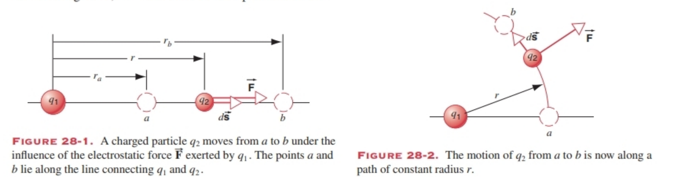
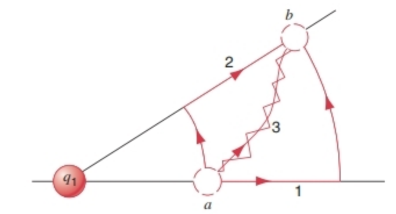

# 28 ELECTRIC POTENTIAL ENERGY AND POTENTIAL 

### 28-1 POTENTIAL ENERGY
Many electrical phenomena are associated with the transfer of large quantities of energy. For example, when a lightning flash strikes the Earth from a cloud, an energy of typically $10^{8} ~J$ is released in the form of light, sound, heat, and shock wave. Where does this energy come from, and how is it stored in clouds? To understand this question, we must consider the energy associated with electrical forces.

The electrostatic force law is very similar to the gravitational force law:
$$F=\frac{1}{4 \pi \epsilon_{0}} \frac{\left|q_{1}\right|\left|q_{2}\right|}{r^{2}} \quad \text{electrostatic, (28-1a)}$$
$$F=G \frac{m_{1} m_{2}}{r^{2}} \quad \text{gravitational. (28-1b)}$$

Both forces depend on the inverse square of the separation distance between the two objects. When an object moves from place to place under the gravitational force of another object (which we assume to remain at rest), the work done by the gravitational force on the first object depends only on the starting and finishing points and does not depend on the path taken between the points. In Section 12-1 we described a force that has this special property as a conservative force, and we concluded in Section 12-2 that for a conservative force we could define a potential energy. The difference in potential energy $\Delta U$ of the system as the object moves from its initial to its final position is equal to the negative of the work done by the force:
$$\Delta U=U_{f}-U_{i}=-W_{if}=-\int_{i}^{f} \vec{F} \cdot d \vec{s}, \quad(28-2)$$
where $W_{if}$ is the work done by the force $\overrightarrow{F}$ when the object moves from $i$ to $f$. In the case of the gravitational force, we showed in Section 14-6 that, when an object with mass $m_{2}$ moves from a distance $r_{i}$ from mass $m_{1}$ to a distance $r_{f}$ from $m_{1}$, the potential energy difference is
$$\Delta U=-G m_{1} m_{2}\left(\frac{1}{r_{f}}-\frac{1}{r_{i}}\right) . (28-3)$$

This potential energy difference is associated with the entire system consisting of $m_{1}$ and $m_{2}$, not with either object alone.

Because of the similarity of the electrostatic and gravitational force laws, we can make the same conclusion about the electrostatic force that we did about the gravitational force: The electrostatic force is conservative, and therefore there is a potential energy associated with the configuration (the relative locations of the objects) of a system in which electrostatic forces act.

Why is this approach useful for electrostatic forces? In mechanics, we learned that there are two ways to analyze problems. One approach is based on force (a vector) and allows us to determine the position and velocity of an object at every point of its motion. The other approach is based on energy (a scalar) and allows us to determine how a system changes in moving from a certain initial state to a certain final state. We will find in a similar way that both approaches are useful when we study interactions between charged objects.

There is one important property in which the electrostatic force differs from the gravitational force: the gravitational force is always attractive, whereas (depending on the relative signs of the charges) electrostatic forces can be either attractive or repulsive. This difference can affect the sign of the potential energy, but it in no way changes our argument based on the similarity of the two forces.

---

### 28-1 势能
许多电现象都与大量能量的转移相关。例如，当闪电从云层击中地面时，通常会以光、声、热和冲击波的形式释放出约 $10^{8} ~J$ 的能量。这些能量来自何处，又如何储存在云层中？要理解这个问题，我们必须考虑与电场力相关的能量。

静电力定律与万有引力定律非常相似：
$$F=\frac{1}{4 \pi \epsilon_{0}} \frac{\left|q_{1}\right|\left|q_{2}\right|}{r^{2}} \quad \text{（静电力，式28-1a）}$$
$$F=G \frac{m_{1} m_{2}}{r^{2}} \quad \text{（万有引力，式28-1b）}$$

这两种力都与两个物体间距离的平方成反比。当一个物体在另一个物体的万有引力作用下（假设施力物体静止）移动时，万有引力对该物体做的功仅取决于起点和终点，与两点间的运动路径无关。在12-1节中，我们将具有这种特殊性质的力称为保守力，并在12-2节中得出结论：对于保守力，可以定义势能。物体从初始位置移动到最终位置时，系统的势能变化量 $\Delta U$ 等于该力所做功的负值：
$$\Delta U=U_{f}-U_{i}=-W_{if}=-\int_{i}^{f} \vec{F} \cdot d \vec{s}, \quad(28-2)$$
其中 $W_{if}$ 是力 $\overrightarrow{F}$ 使物体从位置 $i$ 移动到位置 $f$ 时所做的功。对于万有引力，我们在14-6节中已证明：当质量为 $m_{2}$ 的物体从与质量为 $m_{1}$ 的物体相距 $r_{i}$ 处移动到相距 $r_{f}$ 处时，势能变化量为
$$\Delta U=-G m_{1} m_{2}\left(\frac{1}{r_{f}}-\frac{1}{r_{i}}\right) . (28-3)$$

这种势能变化量与由 $m_{1}$ 和 $m_{2}$ 组成的整个系统相关，而非单独与其中某个物体相关。

由于静电力定律与万有引力定律的相似性，我们可以对静电力得出与万有引力相同的结论：静电力是保守力，因此，在存在静电力作用的系统中，势能与系统的构型（物体的相对位置）相关。

为什么这种方法对分析静电力有用？在力学中，我们知道有两种分析问题的方法。一种基于力（矢量），可以确定物体在运动过程中每个时刻的位置和速度；另一种基于能量（标量），可以确定系统从某个初始状态变化到某个最终状态的过程。类似地，在研究带电物体间的相互作用时，这两种方法都很有用。

静电力与万有引力有一个重要区别：万有引力始终是吸引力，而静电力可以是吸引力（取决于电荷的相对符号），也可以是排斥力。这种差异会影响势能的符号，但不会改变我们基于两种力相似性得出的结论。

### 28-2 ELECTRIC POTENTIAL ENERGY
In this section we use the electrostatic force discussed in Chapter 25 to obtain the electric potential energy due to the interaction between two electric charges, and we extend the calculation to include the case of a collection of more than two charges.

Accepting the conclusion of the previous section that the electrostatic force is conservative, we can calculate the change in potential energy when a charge $q_{2}$ moves from point $a$ to point $b$ subject to the force due to another charge $q_{1}$ at rest. Let us assume for the present that both charges are positive. Figure 28-1 shows the geometry of the process. We have simplified the problem slightly by assuming that the motion from $a$ to $b$ is along the line that connects $q_{1}$ and $q_{2}$ (Later we shall generalize to other kinds of displacements.) We take the origin to be at the location of $q_{1}$ and we let $r$ represent the location of $q_{2}$ relative to this origin. In Eq. 28-2, the vector $d \overrightarrow{s}$ represents an infinitesimal displacement along the direction of motion from $a$ to $b$. The force $\overrightarrow{F}$ and the displacement $d \overrightarrow{s}$ are always parallel for this motion, and so $\overrightarrow{F} \cdot d \overrightarrow{s}=F d s$. For the motion shown in Fig. 28-1, $d s=d r$ because the displacement is always in the direction of $r$. With these substitutions, Eq. 28-2 becomes 
$$
\Delta U=-\int_{a}^{b} \vec{F} \cdot d \vec{s}=-\int_{a}^{b} F d r=-\int_{r_{a}}^{r_{b}} \frac{1}{4 \pi \epsilon_{0}} \frac{q_{1} q_{2}}{r^{2}} d r.
$$

FIGURE 28-1. A charged particle $q_{2}$ moves from $a$ to $b$ under the influence of the electrostatic force $\overrightarrow{F}$ exerted by $q_{1}$. The points $a$ and $b$ lie along the line connecting $q_{1}$ and $q_{2}$.

Carrying out the integral, we obtain 
$$
\Delta U=U_{b}-U_{a}=\frac{1}{4 \pi \epsilon_{0}} q_{1} q_{2}\left(\frac{1}{r_{b}}-\frac{1}{r_{a}}\right) . (28-5)
$$

Equation 28-5 is valid whether the motion of $q_{2}$ is toward or away from $q_{1}$. If $q_{2}$ moves toward $q_{1}$, then $r_{b}<r_{a}$ and $\Delta U>0$; that is, the potential energy increases if the charges move closer together. If $q_{2}$ moves away from $q_{1}$, then $r_{b}>r_{a}$ and $\Delta U<0$; that is, the potential energy decreases if the charges move further apart.

Equation 28-5 also remains valid whether the signs of the charges are positive or negative. If both charges are negative, clearly we obtain the same result. If the charges have opposite signs (one positive and the other negative), then the force between them is attractive. With the force vector in Fig. 28-1 in the opposite direction, we have 
$$
\begin{aligned} 
\vec{F} \cdot d \vec{s} &= -F d s=-F d r=-\frac{1}{4 \pi \epsilon_{0}} \frac{\left|q_{1}\right|\left|q_{2}\right|}{r^{2}} d r \\ 
&= \frac{1}{4 \pi \epsilon_{0}} \frac{q_{1} q_{2}}{r^{2}} d r, 
\end{aligned}
$$
where the last step can be made because $q_{1} q_{2}=-|q_{1}||q_{2}|$ when one of the charges is negative and one is positive. This gives exactly the same integrand as the earlier equation, and so the integral gives the same result.

FIGURE 28-2. The motion of $q_{2}$ from $a$ to $b$ is now along a path of constant radius $r$.

When the charges have opposite signs, so that $q_{1} q_{2}$ is negative in Eq. 28-5, then $\Delta U<0$ when the charges move closer together and $\Delta U>0$ when the charges move further apart.

Suppose we move $q_{2}$ in a direction that is not along the line connecting $q_{1}$ and $q_{2}$. Figure 28-2 shows $q_{2}$ moving from $a$ to $b$ along an arc of a circle of radius $r$ centered at $q_{1}$. Along this path, $\overrightarrow{F}$ is always perpendicular to $d \overrightarrow{s}$, and so $\overrightarrow{F} \cdot d \overrightarrow{s}=0$ throughout the path. The electrostatic force does no work along this path, and so $\Delta U=0$.

To move $q_{2}$ between arbitrary points $a$ and $b$, as in Fig. 28-3, we can choose a variety of possible paths. Along paths 1 and 2, $\Delta U$ is given by Eq. 28-5 for the radial (straight) parts of the paths and $\Delta U=0$ for the tangential (curved) parts of the paths. The arbitrary path 3 can be broken into a series of short radial and tangential steps. Along each tangential step $\Delta U=0$, while the total $\Delta U$ along all the radial steps is given by Eq. 28-5. Our conclusion is that Eq. 28-5 gives $\Delta U$ for any path between point $a$, which is a distance $r_{a}$ from $q_{1}$, and point $b$, which is a distance $r_{b}$ from $q_{1}$—no matter where the points may be located. This is consistent with our assertion that the electrostatic force is conservative, which means that the work and therefore the change in potential energy in moving from $a$ to $b$ does not depend on the path.

FIGURE 28-3. $q_{2}$ moves between arbitrary points $a$ and $b$ along several possible paths.

So far we have been discussing the difference in potential energy between two points: $\Delta U=U_{b}-U_{a}$. We can extend the discussion to define the potential energy at a single point $b$ by choosing a reference point $a$ of potential energy and assigning a reference value to the potential energy $U_{a}$ at that point. Often it is convenient to choose the reference point to correspond to an infinite separation between the charges, and we generally choose the reference value $U_{a}=0$. Then, letting point $b$ represent any point where the separation is $r$, Eq. 28-5 becomes 
$$
U(r)=\frac{1}{4 \pi \epsilon_{0}} \frac{q_{1} q_{2}}{r} . (28-7)
$$

In this expression, $U$ is positive whenever $q_{1}$ and $q_{2}$ have the same sign, corresponding to a repulsive force, and $U$ is negative whenever $q_{1}$ and $q_{2}$ have opposite signs, corresponding to an attractive force. If we compare Eq. 28-7 with the corresponding expression given in Eq. 14-17 for the gravitational potential energy, $U(r)=-G m_{1} m_{2} / r$, we note that the gravitational potential energy is always negative, because the gravitational force is always attractive. This agrees with the negative value of the electrostatic potential energy when the charges have opposite signs and the force is attractive.

### 28-2 电势能
在本节中，我们将利用第25章讨论过的静电力，推导两个点电荷相互作用产生的电势能，并将这一计算推广到包含两个以上电荷的系统。

根据上一节得出的“静电力是保守力”这一结论，我们可以计算电荷$q_{2}$在固定电荷$q_{1}$的静电力作用下，从$a$点移动到$b$点时的势能变化量。目前我们先假设两个电荷均为正电荷，图28-1展示了这一过程的几何关系。为简化问题，我们暂假设$q_{2}$从$a$到$b$的运动沿$q_{1}$与$q_{2}$的连线方向（后续将推广到其他运动方向）。以$q_{1}$的位置为原点，用$r$表示$q_{2}$相对于原点的位置。在式（28-2）中，矢量$d \overrightarrow{s}$表示$q_{2}$从$a$到$b$运动方向上的微小位移；由于此运动中静电力$\overrightarrow{F}$与位移$d \overrightarrow{s}$始终平行，因此$\overrightarrow{F} \cdot d \overrightarrow{s}=F d s$。结合图28-1的运动情况，位移方向与$r$的方向一致，故$d s=d r$。将这些关系代入式（28-2），可得：
$$
\Delta U=-\int_{a}^{b} \vec{F} \cdot d \vec{s}=-\int_{a}^{b} F d r=-\int_{r_{a}}^{r_{b}} \frac{1}{4 \pi \epsilon_{0}} \frac{q_{1} q_{2}}{r^{2}} d r.
$$

**图28-1** 带电粒子$q_{2}$在$q_{1}$施加的静电力$\overrightarrow{F}$作用下从$a$点运动到$b$点，$a$、$b$两点位于$q_{1}$与$q_{2}$的连线上。

对上述积分进行计算，结果如下：
$$
\Delta U=U_{b}-U_{a}=\frac{1}{4 \pi \epsilon_{0}} q_{1} q_{2}\left(\frac{1}{r_{b}}-\frac{1}{r_{a}}\right) . (28-5)
$$

无论$q_{2}$是向$q_{1}$靠近还是远离，式（28-5）均成立。若$q_{2}$向$q_{1}$靠近，则$r_{b}<r_{a}$，此时$\Delta U>0$，即电荷间距减小时势能增大；若$q_{2}$远离$q_{1}$，则$r_{b}>r_{a}$，此时$\Delta U<0$，即电荷间距增大时势能减小。

无论电荷的正负如何，式（28-5）同样成立。若两个电荷均为负电荷，显然会得到与两正电荷情况相同的结果；若两个电荷符号相反（一正一负），则它们之间的静电力为吸引力。此时图28-1中的静电力矢量方向反向，因此：
$$
\begin{aligned} 
\vec{F} \cdot d \vec{s} &= -F d s=-F d r=-\frac{1}{4 \pi \epsilon_{0}} \frac{\left|q_{1}\right|\left|q_{2}\right|}{r^{2}} d r \\ 
&= \frac{1}{4 \pi \epsilon_{0}} \frac{q_{1} q_{2}}{r^{2}} d r, 
\end{aligned}
$$
上式最后一步推导的依据是：当电荷一正一负时，$q_{1} q_{2}=-|q_{1}||q_{2}|$。由此可见，积分被积函数与两正电荷情况完全相同，因此积分结果也一致。

**图28-2** 此时$q_{2}$从$a$点到$b$点的运动路径为半径恒定的圆弧（半径为$r$）。

当电荷符号相反时，式（28-5）中$q_{1} q_{2}$为负值：此时电荷靠近（$r_{b}<r_{a}$）会导致$\Delta U<0$，电荷远离（$r_{b}>r_{a}$）会导致$\Delta U>0$。

假设$q_{2}$的运动方向不沿$q_{1}$与$q_{2}$的连线，如图28-2所示，$q_{2}$沿以$q_{1}$为圆心、半径为$r$的圆弧从$a$点运动到$b$点。在此路径上，静电力$\overrightarrow{F}$始终与位移$d \overrightarrow{s}$垂直，因此全程满足$\overrightarrow{F} \cdot d \overrightarrow{s}=0$。这意味着静电力沿该路径不做功，故势能变化量$\Delta U=0$。

如图28-3所示，当将$q_{2}$从任意两点$a$、$b$之间移动时，可选择多种路径：对于路径1和路径2，径向（直线）部分的势能变化量由式（28-5）计算，切向（曲线）部分的势能变化量$\Delta U=0$；对于任意路径3，可将其分解为一系列短的径向和切向小段，每个切向小段的$\Delta U=0$，所有径向小段的总势能变化量仍由式（28-5）计算。由此可得出结论：无论$a$点（与$q_{1}$间距为$r_{a}$）和$b$点（与$q_{1}$间距为$r_{b}$）的具体位置如何，两点间任意路径的势能变化量$\Delta U$均由式（28-5）确定。这与“静电力是保守力”的结论一致——保守力做功与路径无关，因此从$a$到$b$的势能变化量也与路径无关。

**图28-3** 带电粒子$q_{2}$沿多条可能的路径在任意两点$a$、$b$之间移动。

截至目前，我们讨论的都是两点间的势能变化量$\Delta U=U_{b}-U_{a}$。若要定义单点（如$b$点）的势能，可选择一个势能参考点（如$a$点）并为该点的势能$U_{a}$赋予参考值。通常，选择“两电荷无限远分离”作为参考状态会很方便，且一般取此时的参考势能$U_{a}=0$。若令$b$点为两电荷间距为$r$的任意点，将参考条件代入式（28-5），可得：
$$
U(r)=\frac{1}{4 \pi \epsilon_{0}} \frac{q_{1} q_{2}}{r} . (28-7)
$$

在该表达式中：当$q_{1}$与$q_{2}$符号相同时，$U$为正值，对应静电力为排斥力；当$q_{1}$与$q_{2}$符号相反时，$U$为负值，对应静电力为吸引力。将式（28-7）与第14章式（14-17）中的万有引力势能表达式$U(r)=-G \frac{m_{1} m_{2}}{r}$对比可知：万有引力势能始终为负值（因为万有引力始终是吸引力），这与“电荷符号相反时静电力为吸引力、电势能为负值”的规律一致。

### 28-3 ELECTRIC POTENTIAL
Imagine a charge $q$ fixed at the origin of a coordinate system. We take another charge $q_{0}$, which we call our “test charge,” and we move it from $r_{a}$ to $r_{b}$ under the influence of the force due to $q$. The change in potential energy $\Delta U$ of this two-charge system is given by Eq. 28-5.

If we were to use a test charge twice as large, we would obtain twice the change in potential energy; a test charge three times as large would give three times the potential energy change.

The potential energy change is directly proportional to the size of the test charge. Put another way, the quantity $\Delta U / q_{0}$ is independent of the size of the test charge and is characteristic only of the central charge $q$. This quantity turns out to be extremely useful in analyzing a wide variety of electrostatic problems, even those that involve more complicated assemblies of charges. We define the electric potential difference $\Delta V$ to be the electric potential energy difference per unit test charge: 
$$
\Delta V=\frac{\Delta U}{q_{0}} \quad(28-9)
$$

Or 
$$
V_{b}-V_{a}=\frac{U_{b}-U_{a}}{q_{0}} . \quad(28-10)
$$

Like the potential energy, the electric potential is a scalar. Usually we will refer to electric potential simply as “potential.”

Using the relation between work and potential energy given in Eq. 28-2, we can write the definition of potential difference as 
$$
\Delta V=-\frac{W_{a b}}{q_{0}}, \quad(28-11)
$$
where $W_{a b}$ is the work done by the electrostatic force exerted by $q$ on $q_{0}$ when the test charge moves from $a$ to $b$.

By defining a suitable choice of the reference point of potential energy (such as $U_{a}=0$ for an infinite initial separation of the charges), we obtained in the previous section an expression (Eq. 28-7) for the potential energy of a particular configuration rather than the change in potential energy for a change in configuration. We can do the same for electric potential. Only differences in potential have physical significance, so we are free to choose the zero point and its reference value at our convenience. When the potential is taken to be zero at points that are infinitely far from $q$, the electric potential is 
$$
V=\frac{U}{q_{0}} . \quad(28-12)
$$

In a complicated arrangement of many charges, the potential $V$ may be positive, negative, or zero. The potential at a point near an isolated positive charge is positive. If we were to move a positive test charge from infinity to that point, the charge would move from a location where $V=0$ to a location where $V>0$. Thus $\Delta V>0$ and (according to Eq.28-9) $\Delta U>0$, indicating that the electric force on the test charge has done negative work. Similarly, the potential at a point near an isolated negative charge is negative; the electric force does positive work when we move a positive test charge from infinity to that point.

If the potential is zero at a point, no net work is done by the electric force as the test charge moves in from infinity to that point, although the test charge may pass through regions where it experiences attractive or repulsive electric forces. A potential of zero at a point does not necessarily mean that the electric force is zero at that point.

The SI unit of potential that follows from Eq. 28-9 is the joule per coulomb. This combination is given the name of volt (V): 
$$
1 \text{ volt } =1 \text{ joule/coulomb.} \quad(28-13)
$$

The common name of “voltage” is often used for the potential at a point, and we often speak of “voltage difference” instead of potential difference. When you touch the two probes of a voltmeter to two points in an electric circuit, you are measuring the voltage difference or potential difference (in volts) between those points.

We have already discussed that the electric force is conservative, and so the potential energy difference when a test charge is moved between any two points depends only on the locations of the points and not on the path taken to move from one point to the other. Equation 28-9 therefore suggests that the potential difference is similarly path independent: the potential difference between any two points in an electric field is independent of the path through which the test charge moves in traveling from one point to the other.

For any arbitrary potential difference $\Delta V$, no matter what the arrangement of charges that produces it, we can write Eq. 28-9 as 
$$
\Delta U=q \Delta V . \quad(28-14)
$$

This equation indicates that when any charge $q$ moves between two points whose potential difference is $\Delta V$, the system experiences a change in potential energy $\Delta U$ given by Eq. 28-14. The potential difference $\Delta V$ is set up by other charges that are fixed at rest, so that the motion of $q$ does not change $\Delta V$. In using Eq. 28-14, we see from Eq. 28-13 that if $\Delta V$ is expressed in volts and $q$ is in coulombs, then $\Delta U$ comes out in joules.

From Eq. 28-14, you can see that the electron-volt, which we have introduced previously as a unit of energy, follows directly from the definition of potential or potential difference. If $\Delta V$ is expressed in volts and $q$ in units of the elementary charge $e$, then $\Delta U$ is expressed in electron-volts (eV). For example, consider a system in which a carbon atom from which all six electrons have been removed — $(q=+6 e)$ — moves through a change in potential of $\Delta V= + 20 \text{ kV}$. The change in potential energy is 
$$
\Delta U=q \Delta V=(+6 e)(+20 \text{ kV})=+120 \text{ keV} .
$$

Doing such calculations in units of eV is a great convenience when dealing with atoms or nuclei, in which the charge is easily expressed in terms of $e$.

Keep in mind that potential differences are of fundamental concern and that Eq. 28-12 depends on the arbitrary assignment of the value zero to the potential at the reference position (infinity); this reference potential could equally well have been chosen as any other value—say, — 100 V. Similarly, any other agreed-upon point could be chosen as a reference position. In many problems the Earth is taken as a reference of potential and is assigned the value zero. The location of the reference point and the value of the potential there are chosen for convenience; other choices would change the potential everywhere by the same amount but would not change the potential difference between any two points.

### 28-3 电势
假设将一个电荷$q$固定在坐标系的原点处，取另一个电荷$q_0$（我们称之为“试探电荷”），使其在$q$的静电力作用下从距离原点$r_a$处移动到$r_b$处。这个两电荷系统的势能变化量$\Delta U$可由式（28-5）给出。

若使用电荷量为原来两倍的试探电荷，势能变化量也会变为原来的两倍；若试探电荷电荷量为原来的三倍，势能变化量则为原来的三倍。

势能变化量与试探电荷的电荷量成正比。换而言之，$\Delta U / q_0$这一物理量与试探电荷的电荷量无关，仅由中心电荷$q$决定。该物理量在分析各类静电问题（甚至包含复杂电荷组合的问题）时极为有用。我们将**电势差**$\Delta V$定义为单位试探电荷的电势能变化量，即：
$$
\Delta V=\frac{\Delta U}{q_{0}} \quad(28-9)
$$

或写成：
$$
V_{b}-V_{a}=\frac{U_{b}-U_{a}}{q_{0}} . \quad(28-10)
$$

与电势能类似，电势是标量。通常我们会将“electric potential”简称为“电势”（potential）。

利用式（28-2）中功与势能的关系，可将电势差的定义改写为：
$$
\Delta V=-\frac{W_{a b}}{q_{0}}, \quad(28-11)
$$
其中$W_{ab}$是试探电荷从$a$点移动到$b$点时，$q$对$q_0$施加的静电力所做的功。

在上一节中，我们通过选择合适的势能参考点（例如，取两电荷初始无限远分离时$U_a=0$），得到了特定构型下的电势能表达式（式28-7），而非构型变化对应的势能变化量。对于电势，我们也可采用类似方法。由于只有电势差具有实际物理意义，因此我们可根据便利性自由选择电势零点及其参考值。当取距离$q$无限远处的电势为零时，电势的表达式为：
$$
V=\frac{U}{q_{0}} . \quad(28-12)
$$

在包含多个电荷的复杂系统中，某点的电势$V$可能为正、为负或为零。孤立正电荷附近某点的电势为正值：若将正试探电荷从无限远移动到该点，试探电荷会从电势$V=0$的位置移动到$V>0$的位置，因此$\Delta V>0$；根据式（28-9）可知$\Delta U>0$，这表明静电力对试探电荷做负功。类似地，孤立负电荷附近某点的电势为负值：将正试探电荷从无限远移动到该点时，静电力做正功。

若某点电势为零，说明正试探电荷从无限远移动到该点的过程中，静电力所做的总功为零——即便试探电荷可能经过受吸引力或排斥力作用的区域。需要注意的是，某点电势为零并不意味着该点的静电力为零。

由式（28-9）可知，电势的国际单位是“焦耳每库仑”，该单位被命名为“伏特”（简称“伏”，符号为V），即：
$$
1 \text{伏特} = 1 \text{焦耳/库仑} \quad(28-13)
$$

日常中，我们常将“某点的电势”称为“电压”（voltage），将“电势差”称为“电压差”（voltage difference）。当你将电压表的两个探针接触电路中的两点时，测量的就是这两点之间的电压差（或电势差），单位为伏特。

前文已提及，静电力是保守力，因此试探电荷在任意两点间移动时的势能变化量仅由两点的位置决定，与移动路径无关。结合式（28-9）可推知，电势差同样具有**路径无关性**：电场中任意两点间的电势差，与试探电荷在两点间移动时所经过的路径无关。

无论产生电势差的电荷分布如何，对于任意电势差$\Delta V$，均可将式（28-9）改写为：
$$
\Delta U=q \Delta V . \quad(28-14)
$$

该式表明：当任意电荷$q$在电势差为$\Delta V$的两点间移动时，系统的电势能变化量$\Delta U$由式（28-14）确定。其中，电势差$\Delta V$由其他固定不动的电荷产生，因此电荷$q$的移动不会改变$\Delta V$。根据式（28-13），若$\Delta V$以伏特为单位、$q$以库仑为单位，则$\Delta U$的单位为焦耳。

从式（28-14）可看出，我们此前引入的能量单位“电子伏特”（eV），本质上源于电势或电势差的定义：若$\Delta V$以伏特为单位，$q$以基本电荷$e$（电子或质子的电荷量）为单位，则$\Delta U$的单位为电子伏特。例如，一个失去全部6个电子的碳原子（电荷量$q=+6e$）在电势变化$\Delta V=+20\ \text{kV}$的区域中移动时，其电势能变化量为：
$$
\Delta U=q \Delta V=(+6 e)(+20 \text{ kV})=+120 \text{ keV} .
$$

在研究原子或原子核相关问题时，由于电荷很容易用$e$表示，因此采用电子伏特作为能量单位会非常便捷。

需要牢记的是，**电势差是核心物理量**：式（28-12）中“取无限远为电势零点”的设定具有任意性，我们完全可以选择其他参考值（例如-100 V）作为无限远的电势；同样，也可选择任意约定的点作为电势参考点。在许多问题中，我们会以地球为电势参考点，并规定其电势为零。参考点的位置及参考电势的取值均以便利性为原则：不同的选择会使空间中所有点的电势发生相同大小的偏移，但不会改变任意两点间的电势差。

### 28-4 CALCULATING THE POTENTIAL FROM THE FIELD
So far we have characterized electric charges and their interactions using four different properties: electric force, electric field, electric potential energy, and electric potential. Table 28-1 shows these four properties. Two of them are vectors (force and field), and two are scalars (potential energy and potential). Two of them characterize the interactions of two particles with one another (force and potential energy), and two of them represent the effect at a point in space due to a single charge or collection of charges (field and potential). The double arrows in the table show that the quantities in adjacent boxes of the table can be calculated from one another; for example, $\overrightarrow{E}$ from $\overrightarrow{F}$ (Eq.26-3), $U$ from $\overrightarrow{F}$ (Eq.28-4), and $V$ from $U$ (Eq.28-12). Now we examine the fourth connection—namely, that between $V$ and $\overrightarrow{E}$.

TABLE 28-1 Properties of Electric Charges
|  | Vector Description | Scalar Description |
| --- | --- | --- |
| Interaction between two particles | Electric force ($\overrightarrow{F}$) | Electric potential energy ($U$) |
| Effect at a point in space | Electric field ($\overrightarrow{E}$) | Electric potential ($V$) |

The connection between $V$ and $\overrightarrow{E}$ follows directly from the definition of potential in Eq. 28-11: $\Delta V=-W_{a b} / q_{0}$. Suppose we move a test charge $q_{0}$ from $a$ to $b$ in an electric field $\overrightarrow{E}$. Calculating the work done by the electric force $\overrightarrow{F}=q_{0} \overrightarrow{E}$, we obtain 
$$
\Delta V=\frac{-W_{a b}}{q_{0}}=\frac{-\int_{a}^{b} \vec{F} \cdot d \vec{s}}{q_{0}}=\frac{-\int_{a}^{b} q_{0} \vec{E} \cdot d \vec{s}}{q_{0}}
$$
or 
$$
\Delta V=V_{b}-V_{a}=-\int_{a}^{b} \vec{E} \cdot d \vec{s} . \quad(28-15)
$$

If the electric field is along the direction of $d \overrightarrow{s}$, then the integral in Eq. 28-15 will be positive, and the potential difference will be negative; that is, $V_{b}<V_{a}$. The electric field would move a positively charged particle from a region of higher potential to a region of lower potential or a negatively charged particle in the opposite direction.

An integral of the form of Eq. 28-15 is called a line integral. Figure 28-5 illustrates the calculation of a line integral. We integrate from $a$ to $b$ along any convenient path; we know that the potential difference is a path-independent quantity, so we get the same result from Eq. 28-15 no matter what path we choose. In general the magnitude and direction of $\overrightarrow{E}$ may change from point to point along the path. At each step of the path, we find the dot product between $\overrightarrow{E}$ and the path increment $d \overrightarrow{s}$ (which essentially gives the component of $\overrightarrow{E}$ along the path), and we add up these dot products for the entire path.

FIGURE 28-5. The potential difference between $a$ and $b$ can be found by calculating the line integral of $\overrightarrow{E}$ along the path $a b$: $\Delta V=V_{b}-V_{a}=-\int_{a}^{b} \overrightarrow{E} \cdot d \overrightarrow{s}$.

As we did in Section 28-3, we may wish to find the potential at a point, relative to some chosen reference potential, rather than the potential difference given by Eq. 28-15. If we choose the reference point to be at infinity and define $V=0$ as the reference, then Eq. 28-15 gives for the potential at point $P$ 
$$
V_{P}=-\int_{\infty}^{P} \vec{E} \cdot d \vec{s} . \quad(28-16)
$$

SAMPLE PROBLEM 28-5. In Fig. 28-6, a test charge $q_{0}$ moves through a uniform electric field $\overrightarrow{E}$ from $a$ to $b$ along the path $a c b$. Find the potential difference between $a$ and $b$.

Solution For the path $a c$ we have, from Eq. 28-15, 
$$
\begin{aligned} 
V_{c}-V_{a}&=-\int_{a}^{c} \vec{E} \cdot d \vec{s} =-\int_{a}^{c} E d s \cos (\pi-\theta) \\ 
&=E \cos \theta \int_{a}^{c} d s .
\end{aligned}
$$

The integral $\int_{a}^{c} d s$ is the length of the line $a c$, which is $L/\cos \theta$. Thus 
$$
V_{c}-V_{a}=E \cos \theta \cdot \frac{L}{\cos \theta}=E L .
$$

Points $b$ and $c$ have the same potential, because no work is done in moving a charge between them—$\overrightarrow{E}$ and $d \overrightarrow{s}$ being at right angles for all points on the line $c b$. Thus
$$
V_{b}-V_{a}=\left(V_{b}-V_{c}\right)+\left(V_{c}-V_{a}\right)=0+E L=E L .
$$

This is the same value derived for a direct path connecting $a$ and $b$, a result to be expected because the potential difference between two points is independent of path.

FIGURE 28-6. Sample Problem 28-5. A test charge $q_{0}$ moves along the path $a c b$ through the uniform electric field $\overrightarrow{E}$. The distance between the two equipotential surfaces (passing through $a$ and $b$) is $L$, and $\theta$ is the angle between $\overrightarrow{E}$ and the path segment $a c$.

### 28-4 由电场计算电势
截至目前，我们已用四种不同的物理量描述电荷及其相互作用：电场力、电场、电势能和电势，表28-1列出了这四种物理量的分类。其中，电场力和电场是矢量，电势能和电势是标量；电场力和电势能描述两个粒子间的相互作用，电场和电势则描述单个电荷或电荷系在空间某点产生的效应。表中的双向箭头表示相邻方框中的物理量可相互推导，例如：由电场力（$\overrightarrow{F}$）推导电场（$\overrightarrow{E}$）（式26-3）、由电场力推导电势能（$U$）（式28-4）、由电势能推导电势（$V$）（式28-12）。现在我们来分析第四种关联——电势与电场的关系。

**表28-1 电荷的四种物理量**
|  | 矢量描述 | 标量描述 |
| --- | --- | --- |
| 两个粒子间的相互作用 | 电场力（$\overrightarrow{F}$） | 电势能（$U$） |
| 空间某点的效应 | 电场（$\overrightarrow{E}$） | 电势（$V$） |

电势与电场的关联可直接由式（28-11）中的电势定义推导得出：$\Delta V=-W_{ab}/q_0$。假设在电场$\overrightarrow{E}$中，将试探电荷$q_0$从$a$点移动到$b$点，电场力$\overrightarrow{F}=q_0\overrightarrow{E}$所做的功可通过积分计算，代入电势定义式可得：
$$
\Delta V=\frac{-W_{a b}}{q_{0}}=\frac{-\int_{a}^{b} \vec{F} \cdot d \vec{s}}{q_{0}}=\frac{-\int_{a}^{b} q_{0} \vec{E} \cdot d \vec{s}}{q_{0}}
$$
化简后得到：
$$
\Delta V=V_{b}-V_{a}=-\int_{a}^{b} \vec{E} \cdot d \vec{s} . \quad(28-15)
$$

若电场方向与位移元$d\overrightarrow{s}$的方向一致，则式（28-15）中的积分结果为正值，电势差$\Delta V$为负值，即$V_b<V_a$。这表明：电场会使正电荷从高电势区域向低电势区域移动，而使负电荷向相反方向移动。

式（28-15）这类积分称为**线积分**。图28-5展示了线积分的计算过程：我们可沿任意便捷路径从$a$点积分到$b$点；由于电势差与路径无关，因此无论选择何种路径，由式（28-15）计算得到的结果均相同。一般情况下，电场$\overrightarrow{E}$的大小和方向会沿路径逐点变化，在路径的每一步中，需先计算$\overrightarrow{E}$与位移元$d\overrightarrow{s}$的点积（本质是求$\overrightarrow{E}$沿路径方向的分量），再对整个路径的点积结果求和（即积分）。

**图28-5** 两点间的电势差可通过计算电场$\overrightarrow{E}$沿路径$ab$的线积分得到，公式为$\Delta V=V_{b}-V_{a}=-\int_{a}^{b} \overrightarrow{E} \cdot d \overrightarrow{s}$。

与28-3节的思路类似，我们有时需要知道某点相对于选定参考电势的电势值，而非式（28-15）给出的电势差。若选择无限远处为参考点，并规定该点电势$V=0$，则由式（28-15）可得到任意点$P$的电势表达式：
$$
V_{P}=-\int_{\infty}^{P} \vec{E} \cdot d \vec{s} . \quad(28-16)
$$

**例题28-5** 如图28-6所示，试探电荷$q_0$在匀强电场$\overrightarrow{E}$中沿路径$acb$从$a$点移动到$b$点，求$a$、$b$两点间的电势差。

**解答** 对于路径$ac$段，由式（28-15）可得：
$$
\begin{aligned} 
V_{c}-V_{a}&=-\int_{a}^{c} \vec{E} \cdot d \vec{s} =-\int_{a}^{c} E d s \cos (\pi-\theta) \\ 
&=E \cos \theta \int_{a}^{c} d s .
\end{aligned}
$$

其中，积分$\int_{a}^{c} d s$表示路径$ac$的长度，由几何关系可知该长度为$L/\cos \theta$（$L$为$a$、$b$在电场方向上的垂直距离）。将其代入上式：
$$
V_{c}-V_{a}=E \cos \theta \cdot \frac{L}{\cos \theta}=E L .
$$

对于路径$cb$段，由于电场$\overrightarrow{E}$与位移元$d\overrightarrow{s}$始终垂直，移动电荷时电场力不做功，因此$b$、$c$两点电势相等（$V_b=V_c$）。综上：
$$
V_{b}-V_{a}=\left(V_{b}-V_{c}\right)+\left(V_{c}-V_{a}\right)=0+E L=E L .
$$

该结果与电荷沿$a$到$b$的直线路径移动时的电势差相同，这与“两点间电势差与路径无关”的结论一致。

**图28-6** 例题28-5示意图：试探电荷$q_0$沿路径$acb$在匀强电场$\overrightarrow{E}$中移动。过$a$、$b$两点的等势面间距为$L$，$\theta$为电场$\overrightarrow{E}$与路径段$ac$的夹角。

### 28-5 POTENTIAL DUE TO POINT CHARGES
In this section we will use the results of the previous sections to obtain the potential for various arrangements of point charges. In the next section we discuss the potential due to continuous charge distributions.

We first consider the potential due to a positive point charge $q$. Let a test charge $q_{0}$ move from point $a$ to point $b$ in the vicinity of $q$. We wish to use the test charge to find the potential difference between points $a$ and $b$ due to $q$. We can use the geometry of Fig. 28-1, with $q_{1}$ replaced by $q$ and $q_{2}$ replaced by $q_{0}$.

We have already found the potential energy difference $\Delta U$ for this situation, which was given by Eq. 28-5 for two point charges. Writing Eq. 28-5 for charges $q$ and $q_{0}$, and using Eq. 28-9 for the potential difference, we find 
$$
V_{b}-V_{a}=\frac{U_{b}-U_{a}}{q_{0}}=\frac{q}{4 \pi \epsilon_{0}}\left(\frac{1}{r_{b}}-\frac{1}{r_{a}}\right) . \quad(28-17)
$$

As we discussed in Section 28-2, Eq. 28-5 holds even if points $a$ and $b$ do not lie on the same line. Equation 28-17 is valid for the potential difference between any two points $a$ and $b$.

Instead of the potential difference between two points, we can find the potential at a single point in the vicinity of $q$. Equation 28-7 gives the potential energy $U$ due to the interaction of two point charges. The reference point for this expression is taken at infinity, where we define $U=0$. We can use Eq. 28-7, written for charges $q$ and $q_{0}$, to find the potential at a point using Eq. 28-12 for the potential: 
$$
V=\frac{U}{q_{0}}=\frac{1}{4 \pi \epsilon_{0}} \frac{q}{r}, \quad(28-18)
$$
for any point at a distance $r$ from $q$. Note that Eq. 28-18 could have been obtained directly from Eq. 28-17 by imposing the reference condition with $V_{a}=0$ at $r_{a}=\infty$.

Equation 28-18 shows that the potential for a single positive point charge is zero at large distances and grows to large positive values as we approach the charge $(r \to 0)$. If $q$ is negative, the potential grows to large negative values as we approach the charge. Note that these results do not depend at all on the sign of the test charge $q_{0}$ we use in the calculation. Figure 28-7 shows the potential as a function of the distance from the charge for a positive and a negative point charge.

FIGURE 28-7. The potential along one dimension (chosen to be the $x$ axis) for (a) a positive point charge and (b) a negative point charge. The magnitude of the potential increases to infinity as the distance from the charge becomes zero. The potential for a single positive charge is positive everywhere, and for a single negative charge the potential is negative everywhere.

SAMPLE PROBLEM 28-6. What must be the magnitude of an isolated positive point charge for the electric potential at 15 cm from the charge to be + 120 V? Assume that $V=0$ at infinity.

Solution Solving Eq. 28-18 for $q$ yields 
$$
\begin{aligned} 
q&=4 \pi \epsilon_{0} r V \\ 
&=(4 \pi)\left(8.9 × 10^{-12} C^{2} / N \cdot m^{2}\right)(0.15 m)(120 V) \\ 
&=2.0 × 10^{-9} C=2.0 nC .
\end{aligned}
$$

This charge is comparable to charges that can be produced by friction, such as by rubbing a balloon.

SAMPLE PROBLEM 28-7. What is the electric potential at the surface of a gold nucleus? The radius is $7.0 ×10^{-15} ~m$, and the atomic number $Z$ is 79.

Solution The nucleus, assumed to be spherically symmetric, behaves electrically for external points as if it were a point charge. Thus we can use Eq. 28-18, which gives, with $q=+79 e$, 
$$
\begin{aligned} 
V&=\frac{1}{4 \pi \epsilon_{0}} \frac{q}{r} \\ 
&=\frac{\left(9.0 × 10^{9} N \cdot m^{2} / C^{2}\right)(79)\left(1.6 × 10^{-19} C\right)}{7.0 × 10^{-15} m} \\ 
&=1.6 × 10^{7} V .
\end{aligned}
$$

This large positive potential has no effect outside a gold atom because it is compensated by an equally large negative potential from the 79 atomic electrons of gold.

#### Potential Due to a Collection of Point Charges
Suppose we have a collection of $N$ point charges $q_{1}$, $q_{2}, ..., q_{N}$ located at various fixed points (Fig. 28-8). We wish to find the potential at an arbitrary point $P$ due to this collection of charges. The procedure is to calculate the potential at $P$ due to each charge as if the others were not present and then add the resulting potentials to get the total potential. That is, 
$$
\begin{aligned} 
V &=V_{1}+V_{2}+\cdots+V_{N} \\ 
&=\frac{1}{4 \pi \epsilon_{0}} \frac{q_{1}}{r_{1}}+\frac{1}{4 \pi \epsilon_{0}} \frac{q_{2}}{r_{2}}+\cdots+\frac{1}{4 \pi \epsilon_{0}} \frac{q_{N}}{r_{N}}, \quad(28-19)
\end{aligned}
$$
which we can write in compact form as 
$$
V=\frac{1}{4 \pi \epsilon_{0}} \sum_{n=1}^{N} \frac{q_{n}}{r_{n}} . (28-20)
$$

In these expressions, $q_{n}$ is the value (magnitude and sign) of the $n$-th charge and $r_{n}$ is the distance of the $n$-th charge from the point $P$ where we wish to find the potential.

We could use Eq. 28-20, for instance, to find the work done when we bring a test charge $q_{0}$ in from infinity to point $P$ in Fig. 28-8. For this calculation we see the advantage of using the potential, which is a scalar, rather than the force, which is a vector. To find the net force on a test charge at $P$ it would be necessary to find a vector sum. The scalar calculation of the potential is much simpler.

FIGURE 28-8. A collection of point charges. The potential at point $P$ is the algebraic sum of the potentials due to each individual charge.

In this calculation we found the contribution to the potential from each charge as if the others were not present. This is another example of the application of the principle of superposition, which we discussed in connection with electric forces in Chapter 25.

SAMPLE PROBLEM 28-8. Calculate the potential at point $P$ located at the center of the square of point charges shown in Fig. 28-9a. Assume that $d=1.3 ~m$ and that the charges are $q_{1}=+12 nC$, $q_{2}=-24 nC$, $q_{3}=+31 nC$, $q_{4}=+17 nC$.

Solution From Eq. 28-20 we have:
The distance $R$ of each charge from the center of the square is $d/\sqrt{2}$ or 0.919 m, so that 
$$
\begin{aligned} 
V &=\frac{\left(8.99 × 10^{9} N \cdot m^{2} / C^{2}\right)(12-24+31+17) × 10^{-9} C}{0.919 m} \\ 
&=3.5 × 10^{2} V .
\end{aligned}
$$

Close to any of the three positive charges in Fig. 28-9a, the potential can have very large positive values. Close to the single negative charge in that figure, the potential can have large negative values. There must then be other points within the boundaries of the square that have the same potential as that at point $P$. The dashed line in Fig. 28-9b connects other points in the plane that have this same value of the potential. As we discuss later in Section 28-8, such equipotential surfaces provide a useful way of visualizing the potentials of various charge distributions.

FIGURE 28-9. Sample Problem 28-8. (a) Four charges are held at the corners of a square. (b) The curve connects points that have the same potential (350 V) as the point $P$ at the center of the square.

#### Potential Due to an Electric Dipole
The potential due to an electric dipole can be calculated in a straightforward way using Eq. 28-20. Figure 28-10 shows the geometry for the calculation. We place the origin of our coordinate system at the center of the dipole, and we seek the electric potential at the point $P$ which is located a distance $r$ from the center of the dipole and at an angle $\theta$ from the axis of the dipole (the $z$ axis). The distances from the positive and negative charges to $P$ are respectively $r_{+}$ and $r_{-}$. Using Eq. 28-20, we find the potential to be 
$$
V=\frac{1}{4 \pi \epsilon_{0}}\left(\frac{q}{r_{+}}+\frac{-q}{r_{-}}\right) . (28-21)
$$

FIGURE 28-10. The geometry for calculating the potential at point $P$ due to an electric dipole. The dipole consists of two charges $+q$ and $-q$ separated by a distance $d$; the dipole moment $\vec{p}$ has magnitude $p=qd$ and points along the $z$ axis from $-q$ to $+q$.

Equation 28-21 is the exact expression for the potential due to a dipole. However, in many applications (such as for atomic or molecular dipoles) we can obtain a more useful relationship by recognizing that our observation point $P$ is usually very far from the dipole, compared with the distance $d$ between the charges; that is, $r \gg d$. In this case, $r_{+} \approx r - (d/2)\cos\theta$, $r_{-} \approx r + (d/2)\cos\theta$, and $r_{+}r_{-} \approx r^{2}$. Substituting these results into Eq. 28-21, we obtain $V=\frac{1}{4 \pi \epsilon_{0}} \frac{p\cos\theta}{r^{2}}$ (28-22), where we have used Eq. 26-8 $(p=qd)$ for the dipole moment. Equation 28-22 gives the potential due to a dipole at any point in space. The dipole has cylindrical symmetry for rotations about the $z$ axis, so Eq. 28-22 is valid at points that do not lie in the plane of the diagram of Fig. 28-10.

Note that the potential due to the dipole varies as $1/r^{2}$. This is in contrast to the potential for a single charge, which varies (see Eq. 28-18) as $1/r$.

Equation 28-22 shows that $V=0$ when $\theta=90^{\circ}$, which corresponds to points in the $xy$ plane in Fig. 28-10. This means that if we move a test charge from infinity to a point in the $xy$ plane, the dipole does no net work on the test charge. For a given $r$, the potential varies from positive values on the positive $z$ axis $(\theta=0)$ to zero in the $xy$ plane $(\theta=90^{\circ})$ to negative values on the negative $z$ axis $(\theta=180^{\circ})$.

Note that, even though $V=0$ in the $xy$ plane, it is not true that $\overrightarrow{E}=0$ in that plane. In general we cannot assume that $V=0$ implies $\overrightarrow{E}=0$ or that $\overrightarrow{E}=0$ implies $V=0$.

SAMPLE PROBLEM 28-9. An electric quadrupole consists of two electric dipoles so arranged that they almost, but not quite, cancel each other in their electric effects at distant points (see Fig. 28-11). Calculate $V(r)$ for points on the axis of this quadrupole.

Solution Applying Eq. 28-20 to Fig. 28-11 yields 
$$
\begin{aligned} 
V &=\frac{1}{4 \pi \epsilon_{0}}\left(\frac{q}{r-d}+\frac{-2 q}{r}+\frac{q}{r+d}\right) \\ 
&=\frac{1}{4 \pi \epsilon_{0}} \frac{2 q d^{2}}{r\left(r^{2}-d^{2}\right)}=\frac{1}{4 \pi \epsilon_{0}} \frac{2 q d^{2}}{r^{3}\left(1-d^{2} / r^{2}\right)} .
\end{aligned}
$$

FIGURE 28-11. Sample Problem 28-9. An electric quadrupole, consisting of two oppositely directed electric dipoles. The quadrupole has charges $+q$, $-2q$, $+q$ separated by distance $d$ along the axis.

Because $d \ll r$, we can neglect $d^{2}/r^{2}$ compared with 1, in which case the potential becomes 
$$
V=\frac{1}{4 \pi \epsilon_{0}} \frac{Q}{r^{3}}, \quad(28-23)
$$
where $Q(=2 q d^{2})$ is the electric quadrupole moment of the charge assembly of Fig. 28-11. Note that $V$ varies (1) as $1/r$ for a point charge (see Eq. 28-18), (2) as $1/r^{2}$ for a dipole (see Eq. 28-22), and (3) as $1/r^{3}$ for a quadrupole (see Eq. 28-23).

Note too that (1) a dipole is two equal and opposite charges that do not quite coincide in space so that their electric effects at distant points do not quite cancel, and (2) a quadrupole is two equal and opposite dipoles that do not quite coincide in space so that their electric effects at distant points again do not quite cancel. We can continue to construct more complex assemblies of electric charges. This process turns out to be useful, because the electric potential of any charge distribution can be represented as a series of terms in increasing powers of $1/r$. The $1/r$ part, called the monopole term, depends on the net charge of the distribution, and the succeeding terms ($1/r^{2}$, the dipole term; $1/r^{3}$, the quadrupole term; and so on) indicate how the charge is distributed. This type of analysis is called an expansion in multipoles.

### 28-5 点电荷产生的电势
本节将利用前几节的结论，推导不同点电荷构型产生的电势；下一节将讨论连续电荷分布产生的电势。

#### 单个点电荷的电势
首先考虑单个正点电荷$q$产生的电势。设试探电荷$q_0$在$q$的附近从$a$点移动到$b$点，我们将通过试探电荷来推导$q$在$a$、$b$两点间产生的电势差。可沿用图28-1的几何关系，只需将图中的$q_1$替换为$q$、$q_2$替换为$q_0$即可。

对于两个点电荷的情况，我们已在式（28-5）中给出了势能变化量$\Delta U$的表达式。将式（28-5）应用于电荷$q$和$q_0$，并结合式（28-9）中电势差的定义，可得：
$$
V_{b}-V_{a}=\frac{U_{b}-U_{a}}{q_{0}}=\frac{q}{4 \pi \epsilon_{0}}\left(\frac{1}{r_{b}}-\frac{1}{r_{a}}\right) . \quad(28-17)
$$

如28-2节所述，即使$a$、$b$两点不在同一直线上，式（28-5）依然成立，因此式（28-17）对任意两点$a$、$b$间的电势差均有效。

除了两点间的电势差，我们还可求解$q$附近任意单点的电势。式（28-7）给出了两个点电荷相互作用的电势能表达式，其参考点取在无限远处（规定此处$U=0$）。将式（28-7）应用于电荷$q$和$q_0$，并结合式（28-12）中电势的定义，可得距离$q$为$r$的任意点的电势：
$$
V=\frac{U}{q_{0}}=\frac{1}{4 \pi \epsilon_{0}} \frac{q}{r}, \quad(28-18)
$$

需注意，式（28-18）也可直接由式（28-17）推导得出：只需设定参考条件为“无限远处（$r_a=\infty$）电势$V_a=0$”即可。

由式（28-18）可知，单个正点电荷产生的电势在无限远处为零，且随着趋近电荷（$r \to 0$）会逐渐增大为很大的正值；若$q$为负点电荷，则电势会随趋近电荷逐渐增大为很大的负值。需强调的是，这些结果与计算中所用试探电荷$q_0$的符号无关。图28-7展示了正、负点电荷的电势随距离变化的函数关系。

**图28-7** 沿一维方向（取为$x$轴）的电势分布：（a）正点电荷；（b）负点电荷。随着与电荷的距离趋近于零，电势的绝对值趋近于无穷大。单个正点电荷产生的电势在空间各处均为正值，单个负点电荷产生的电势在空间各处均为负值。

**例题28-6** 一个孤立正点电荷在距离其15 cm处产生的电势为+120 V（规定无限远处电势为0），求该点电荷的电荷量大小。

**解答** 对式（28-18）变形求解$q$：
$$
\begin{aligned} 
q&=4 \pi \epsilon_{0} r V \\ 
&=(4 \pi)\left(8.9 × 10^{-12} \, \text{C}^2/(\text{N·m}^2)\right)(0.15 \, \text{m})(120 \, \text{V}) \\ 
&=2.0 × 10^{-9} \, \text{C}=2.0 \, \text{nC} .
\end{aligned}
$$

该电荷量与摩擦起电（如摩擦气球产生的电荷）的量级相当。

**例题28-7** 金原子核的半径为$7.0 × 10^{-15} \, \text{m}$，原子序数$Z=79$，求其表面的电势。

**解答** 假设金原子核呈球对称分布，对于核外任意点，其电学行为等效于将全部电荷集中在球心的点电荷。因此可采用式（28-18）计算，其中核的电荷量$q=+79e$（$e$为基本电荷）：
$$
\begin{aligned} 
V&=\frac{1}{4 \pi \epsilon_{0}} \frac{q}{r} \\ 
&=\frac{\left(9.0 × 10^{9} \, \text{N·m}^2/\text{C}^2\right)(79)\left(1.6 × 10^{-19} \, \text{C}\right)}{7.0 × 10^{-15} \, \text{m}} \\ 
&=1.6 × 10^{7} \, \text{V} .
\end{aligned}
$$

这一巨大的正电势在金原子外无明显效应，因为金原子的79个核外电子会产生大小相等的负电势，两者相互抵消。

#### 点电荷系的电势
设有$N$个点电荷$q_1、q_2、…、q_N$，分别固定在空间不同位置（图28-8），我们希望求解任意点$P$处的电势。求解思路为：先假设其他电荷不存在，分别计算每个电荷在$P$点产生的电势，再将这些电势代数相加，得到总电势。即：
$$
\begin{aligned} 
V &=V_{1}+V_{2}+\cdots+V_{N} \\ 
&=\frac{1}{4 \pi \epsilon_{0}} \frac{q_{1}}{r_{1}}+\frac{1}{4 \pi \epsilon_{0}} \frac{q_{2}}{r_{2}}+\cdots+\frac{1}{4 \pi \epsilon_{0}} \frac{q_{N}}{r_{N}}, \quad(28-19)
\end{aligned}
$$

将上式简写为：
$$
V=\frac{1}{4 \pi \epsilon_{0}} \sum_{n=1}^{N} \frac{q_{n}}{r_{n}} . (28-20)
$$

式中，$q_n$为第$n$个电荷的电荷量（含正负号），$r_n$为第$n$个电荷到$P$点的距离。

例如，可利用式（28-20）计算将试探电荷$q_0$从无限远移动到图28-8中$P$点所需做的功。此计算体现了电势（标量）相对于电场力（矢量）的优势：若要求解$P$点试探电荷受到的合外力，需进行矢量叠加；而电势的计算仅需标量代数相加，过程更为简便。

**图28-8** 点电荷系示意图。$P$点的总电势等于各个点电荷在该点产生的电势的代数和。

上述计算中，我们假设其他电荷不存在，单独计算每个电荷的电势贡献，这是25章中讨论的**叠加原理**的又一应用（叠加原理此前已用于电场力的矢量叠加）。

**例题28-8** 如图28-9a所示，四个点电荷固定在正方形的四个顶点，求正方形中心$P$点的电势。已知正方形边长$d=1.3 \, \text{m}$，电荷量分别为$q_1=+12 \, \text{nC}$、$q_2=-24 \, \text{nC}$、$q_3=+31 \, \text{nC}$、$q_4=+17 \, \text{nC}$。

**解答** 根据式（28-20），正方形中心$P$到每个顶点的距离$R=d/\sqrt{2}=0.919 \, \text{m}$，代入数据计算得：
$$
\begin{aligned} 
V &=\frac{\left(8.99 × 10^{9} \, \text{N·m}^2/\text{C}^2\right)(12-24+31+17) × 10^{-9} \, \text{C}}{0.919 \, \text{m}} \\ 
&=3.5 × 10^{2} \, \text{V} .
\end{aligned}
$$

在图28-9a中，靠近三个正电荷的区域，电势会呈现很大的正值；靠近单个负电荷的区域，电势会呈现很大的负值。因此，正方形边界内必然存在其他与$P$点电势相等的点。图28-9b中的虚线连接了平面内所有电势等于350 V（即$P$点电势）的点。如28-8节后续所述，这类等势面是直观呈现不同电荷分布电势的有效工具。

**图28-9** 例题28-8示意图：（a）四个电荷固定在正方形顶点；（b）虚线连接了所有与正方形中心$P$点电势（350 V）相等的点。

#### 电偶极子的电势
利用式（28-20）可直接推导电偶极子产生的电势。图28-10展示了计算所用的几何关系：以偶极子中心为坐标原点，$z$轴为偶极子轴线，观测点$P$到偶极子中心的距离为$r$，与$z$轴的夹角为$\theta$；正、负电荷到$P$点的距离分别为$r_+$和$r_-$。根据式（28-20），$P$点的电势为：
$$
V=\frac{1}{4 \pi \epsilon_{0}}\left(\frac{q}{r_{+}}+\frac{-q}{r_{-}}\right) . (28-21)
$$

**图28-10** 电偶极子电势计算的几何关系。电偶极子由电荷量为$+q$和$-q$、间距为$d$的两个电荷组成；偶极矩$\vec{p}$的大小为$p=qd$，方向沿$z$轴从$-q$指向$+q$。

式（28-21）是电偶极子电势的精确表达式。但在许多应用场景中（如原子或分子偶极子），观测点$P$通常远大于偶极子的电荷间距$d$（即$r \gg d$），此时可对表达式进行简化：由几何关系近似得$r_+ \approx r - (d/2)\cos\theta$、$r_- \approx r + (d/2)\cos\theta$，且$r_+r_- \approx r^2$。将这些近似关系代入式（28-21），并结合偶极矩定义式$p=qd$（式26-8），可得：
$$
V=\frac{1}{4 \pi \epsilon_{0}} \frac{p\cos\theta}{r^{2}} \quad(28-22)
$$

式（28-22）为电偶极子在空间任意点产生的电势表达式。由于偶极子绕$z$轴旋转具有柱对称性，该式对不在图28-10平面内的点同样有效。

需注意，电偶极子的电势随$1/r^2$变化，而单个点电荷的电势随$1/r$变化（见式28-18），两者存在明显差异。

由式（28-22）可知，当$\theta=90^\circ$时，$V=0$，对应图28-10中的$xy$平面。这意味着：将试探电荷从无限远移动到$xy$平面内任意点时，偶极子对试探电荷做的总功为零。对于给定的$r$，电势在正$z$轴（$\theta=0^\circ$）处为正值，在$xy$平面（$\theta=90^\circ$）处为零，在负$z$轴（$\theta=180^\circ$）处为负值。

需特别注意，尽管$xy$平面内电势$V=0$，但该平面内的电场$\overrightarrow{E}$并不为零。一般而言，不能由“某点电势为零”推出“该点电场为零”，也不能由“某点电场为零”推出“该点电势为零”。

**例题28-9** 电四极子由两个方向相反的电偶极子组成，其在远处的电场效应几乎抵消但未完全抵消（图28-11）。求该四极子轴线上任意点的电势$V(r)$。

**解答** 对图28-11应用式（28-20），可得：
$$
\begin{aligned} 
V &=\frac{1}{4 \pi \epsilon_{0}}\left(\frac{q}{r-d}+\frac{-2 q}{r}+\frac{q}{r+d}\right) \\ 
&=\frac{1}{4 \pi \epsilon_{0}} \frac{2 q d^{2}}{r\left(r^{2}-d^{2}\right)}=\frac{1}{4 \pi \epsilon_{0}} \frac{2 q d^{2}}{r^{3}\left(1-d^{2}/r^{2}\right)} .
\end{aligned}
$$

**图28-11** 例题28-9示意图：电四极子由两个方向相反的电偶极子组成，电荷分布为$+q$、$-2q$、$+q$，沿轴线间距均为$d$。

由于$d \ll r$，可忽略$d^2/r^2$（相对于1），此时电势表达式简化为：
$$
V=\frac{1}{4 \pi \epsilon_{0}} \frac{Q}{r^{3}}, \quad(28-23)
$$

式中，$Q=2qd^2$为图28-11中电荷系的电四极矩。对比可知：点电荷的电势随$1/r$变化（式28-18），电偶极子的电势随$1/r^2$变化（式28-22），电四极子的电势随$1/r^3$变化（式28-23）。

此外还需注意：（1）电偶极子由两个等量异号、空间不重合的电荷组成，因此其在远处的电场效应未完全抵消；（2）电四极子由两个等量反向、空间不重合的电偶极子组成，因此其在远处的电场效应也未完全抵消。依此规律可构建更复杂的电荷系，这种方法具有实际意义——任意电荷分布的电势均可表示为一系列关于$1/r$幂次递增的项的叠加。其中，$1/r$项称为单极项，取决于电荷分布的总电荷量；后续的$1/r^2$项（偶极项）、$1/r^3$项（四极项）等，则反映电荷的分布特征。这类分析方法称为**多极展开**。

### 28-6 ELECTRIC POTENTIAL OF CONTINUOUS CHARGE DISTRIBUTIONS
In Section 25-5 we introduced a procedure for calculating the force exerted by a continuous charge distribution on a point charge. We can similarly obtain the potential energy for the interaction between a continuous distribution and a point charge by calculating the potential due to the charge distribution. In this section we calculate the potential for the same three charge distributions considered in Section 25-5.

The procedure for calculating the potential for a continuous charge distribution is similar to that used to find the force (or the electric field in Section 26-4), with one important exception: the potential is a scalar, and thus we do not encounter the difficulties that arose in Section 25-5 due to the differing directions of the force elements or field elements $d \overrightarrow{E}$ from different charge elements $d q$.

The procedure for calculating the potential begins by dividing the object into charge elements $d q$. We can write the potential $d V$ due to a charge element $d q$ by assuming that it behaves like a point charge: 
$$
d V=\frac{1}{4 \pi \epsilon_{0}} \frac{d q}{r}, \quad(28-24)
$$
where $r$ is the distance from $d q$ to the observation point $P$. The total potential is found by adding the contributions from all the charge elements of the object: 
$$
V=\int d V=\frac{1}{4 \pi \epsilon_{0}} \int \frac{d q}{r}, \quad(28-25)
$$
where the integral is carried out over the entire charge distribution.

#### A Uniform Line of Charge
We can use the geometry of Fig. 28-12 to find the potential due to a uniform line of positive charge at point $P$, a distance $y$ from the rod on its perpendicular bisector. Applying Eq. 28-24, using the charge element $d q=\lambda d z$ (where $\lambda$ is the linear charge density), we have 
$$
d V=\frac{1}{4 \pi \epsilon_{0}} \frac{d q}{r}=\frac{1}{4 \pi \epsilon_{0}} \frac{\lambda d z}{\sqrt{z^{2}+y^{2}}} . \quad(28-26)
$$

Carrying out the integration over the length $L$ as in Eq. 28-25 and noting that $y$ is a constant, we obtain 
$$
\begin{aligned} 
V &=\frac{1}{4 \pi \epsilon_{0}} \int_{-L / 2}^{+L / 2} \frac{\lambda d z}{\sqrt{z^{2}+y^{2}}} \\ 
&=\frac{\lambda}{4 \pi \epsilon_{0}}\left[\ln \left(z+\sqrt{z^{2}+y^{2}}\right)\right]_{-L / 2}^{+L / 2} \\ 
&=\frac{\lambda}{4 \pi \epsilon_{0}} \ln \left[\frac{L / 2+\sqrt{L^{2} / 4+y^{2}}}{-L / 2+\sqrt{L^{2} / 4+y^{2}}}\right], \quad(28-27)
\end{aligned}
$$
where we have used the relation $\ln A - \ln B = \ln (A/B)$ to obtain the last result.

FIGURE 28-12. A uniformly charged rod. To find the potential at point $P$ we consider the rod to consist of many individual charge elements such as $d q$. The rod has length $L$, linear charge density $\lambda$, and point $P$ lies on the perpendicular bisector at distance $y$ from the rod.

It is important to check this result to see whether it has the correct limiting value. As we move far from the rod, we expect the potential to approach 0, and Eq. 28-27 does have this property as $y \to \infty$. Furthermore, we can show that when $y$ is large, Eq. 28-27 becomes 
$$
V \approx \frac{1}{4 \pi \epsilon_{0}} \frac{\lambda L}{y}=\frac{1}{4 \pi \epsilon_{0}} \frac{q}{y}, (28-28)
$$
which is simply the expression for the potential a distance $y$ from a point charge. When we are very far away from the rod, it looks like a point charge.

#### A Ring of Charge
Figure 28-13 shows a uniform ring of positive charge. The contribution to the potential at point $P$ on its axis due to the charge element $d q=\lambda d s=\lambda R d \phi$ (where $\lambda$ is the linear charge density, $ds$ is the arc length element, $R$ is the ring radius, and $\phi$ is the angular coordinate) is 
$$
d V=\frac{1}{4 \pi \epsilon_{0}} \frac{d q}{r}=\frac{1}{4 \pi \epsilon_{0}} \frac{\lambda R d \phi}{\sqrt{R^{2}+z^{2}}} . (28-29)
$$

FIGURE 28-13. A uniformly charged ring. To find the potential at $P$ (on the ring’s axis at distance $z$ from the center) we calculate the total effect of all charge elements such as $d q$.

Integrating around the ring as we did in Section 25-5, we note that $R$ and $z$ both remain constant. The variable of integration is $\phi$, which ranges from 0 to $2\pi$: 
$$
V=\frac{1}{4 \pi \epsilon_{0}} \frac{\lambda R}{\sqrt{R^{2}+z^{2}}} \int_{0}^{2 \pi} d \phi=\frac{1}{4 \pi \epsilon_{0}} \frac{2 \pi \lambda R}{\sqrt{R^{2}+z^{2}}} . (28-30)
$$

Note that $2\pi\lambda R$ is the total charge $q$ of the ring, so Eq. 28-30 can also be written as $V=\frac{1}{4 \pi \epsilon_{0}} \frac{q}{\sqrt{R^{2}+z^{2}}}$. As $z \to \infty$, the potential decreases to zero and for large $z$, has the approximate value $q/(4\pi\epsilon_0 z)$ (where $q=2\pi\lambda R$) as expected for a location a distance $z$ from a point charge.

#### A Charged Disk
With the geometry of Fig. 28-14, we can use Eq. 28-30 to find the potential $d V$ at point $P$ (on the disk’s axis at distance $z$ from the center) due to a ring of radius $w$ and charge $d q=\sigma d A$, with area element $d A=2\pi w d w$ (where $\sigma$ is the surface charge density of the disk):
$$
d V=\frac{1}{4 \pi \epsilon_{0}} \frac{d q}{\sqrt{w^{2}+z^{2}}}=\frac{1}{4 \pi \epsilon_{0}} \frac{2 \pi \sigma w d w}{\sqrt{w^{2}+z^{2}}} . (28-31)
$$

FIGURE 28-14. A disk of radius $R$ carries a uniform charge density $\sigma$. The element of charge $d q$ is a uniformly charged ring of radius $w$ and width $d w$; point $P$ is on the disk’s axis at distance $z$ from the center.

To sum the contributions from all the rings on the disk, we integrate as $w$ ranges from 0 to $R$: 
$$
V=\frac{\sigma}{2 \epsilon_{0}} \int_{0}^{R} \frac{w d w}{\sqrt{w^{2}+z^{2}}}=\frac{\sigma}{2 \epsilon_{0}}\left(\sqrt{R^{2}+z^{2}}-|z|\right) . (28-32)
$$

The last term in Eq. 28-32 is written as $|z|$ (instead of $z$) so that Eq. 28-32 remains valid for points on the $z$ axis above the disk ($z>0$) as well as below the disk ($z<0$). The potential has its maximum value at the surface of the disk (where $z=0$) and decreases as we move along the $z$ axis in either direction.

When $z$ is large, we can use the binomial theorem to expand the square root in Eq. 28-32: 
$$
\sqrt{R^{2}+z^{2}}=|z|\left(1+\frac{R^{2}}{z^{2}}\right)^{1 / 2} \approx|z|\left(1+\frac{1}{2} \frac{R^{2}}{z^{2}}\right) \quad(28-33)
$$
Inserting this result into Eq. 28-32, we find once again the expression for the potential of a point charge: $V \approx \frac{1}{4 \pi \epsilon_{0}} \frac{q}{|z|}$ (where $q=\sigma\pi R^2$ is the total charge of the disk), which confirms the consistency of the result.

For very small values of $|z|$ (close to the disk surface), the potential can be approximated by expanding the square root for small $R^2/z^2$ (though more simply, setting $z \approx 0$ gives $V \approx \frac{\sigma R}{2 \epsilon_{0}}$). The potential approaches the constant value $\frac{\sigma R}{2 \epsilon_{0}}$ as $z \to 0$ and decreases linearly as $z$ increases in either direction for very small $|z|$ (this linear behavior comes from the approximation of Eq. 28-32 for small $z$: $V \approx \frac{\sigma}{2 \epsilon_{0}}(R - |z|)$). The rate at which the potential decreases as we move along the axis (given by the derivative of $V$ with respect to $z$) is independent of the size of the disk for a given charge density. In fact, this term turns out to be the same for any large, flat, uniformly charged plate, no matter what its size or shape (round, square, etc.), as long as we are near its center and thus far from any edge. We will use this fact in drawing a “map” of the potential in the next section.

SAMPLE PROBLEM 28-10. A disk of radius $R=4.8 ~cm$ carries a total charge $q=+2.5 nC$ that is uniformly distributed over its surface and held in fixed locations (consider the surface to behave like an insulator). An electron is initially at rest a distance of $d=3.0 ~cm$ from the disk along its axis. When the electron is released, it is attracted toward the disk. What is the speed of the electron when it strikes the center of the disk?

Solution The charge density on the disk is 
$$
\sigma=\frac{q}{\pi R^{2}}=\frac{2.5 × 10^{-9} C}{\pi(0.048 m)^{2}}=3.45 × 10^{-7} C / m^{2} .
$$

The difference in potential between the locations with $z=d$ and $z=0$ can be found from Eq. 28-32: 
$$
\begin{aligned} 
\Delta V&= V(0)-V(d)=\frac{\sigma R}{2 \epsilon_{0}}-\frac{\sigma}{2 \epsilon_{0}}\left(\sqrt{R^{2}+d^{2}}-d\right) \\ 
&=\frac{3.45 × 10^{-7} C / m^{2}}{2\left(8.85 × 10^{-12} C^{2} / N \cdot m^{2}\right)}[0.048 m \\ 
&\quad \left.-\left(\sqrt{(0.048 m)^{2}+(0.030 m)^{2}}-0.030 m\right)\right] \\ 
&=417 V .
\end{aligned}
$$

The change in the electron’s potential energy is, from Eq. 28-14 ($\Delta U=q\Delta V$), where $q=-e$ (electron charge): 
$$
\Delta U=(-1.6 × 10^{-19} C)(417 V)=-6.67 × 10^{-17} J .
$$

Conservation of energy gives $\Delta U + \Delta K = 0$ (since no external forces do work), so $\Delta K=-\Delta U=+6.67 × 10^{-17} J$. The kinetic energy gained by the electron is $\Delta K=\frac{1}{2} m v_{f}^{2} - 0$ (initial kinetic energy is zero). Solving for $v_f$ (mass of electron $m=9.11 × 10^{-31} kg$): 
$$
v_{f}=\sqrt{\frac{2 \Delta K}{m}}=\sqrt{\frac{2(6.67 × 10^{-17} J)}{9.11 × 10^{-31} kg}}=1.21 × 10^{7} m / s .
$$

SAMPLE PROBLEM 28-11. Using the expression for the electric field due to a uniform ring of positive charge at a point on its axis (the $z$ axis), find the expression for the potential due to the ring at a point on the axis a distance $z$ from the ring.

Solution Equation 28-16 gives the relationship between $V$ and $\overrightarrow{E}$: $V_{P}=-\int_{\infty}^{P} \overrightarrow{E} \cdot d \overrightarrow{s}$. The electric field for the ring of charge was given in Eq. 26-18: $E_{z}=\frac{1}{4 \pi \epsilon_{0}} \frac{q z}{\left(z^{2}+R^{2}\right)^{3 / 2}}$ (only the $z$-component exists, as symmetry implies no radial or angular components). The integrand of Eq. 28-16 reduces to $\overrightarrow{E} \cdot d \overrightarrow{s}=E_{z} d z$ (since we integrate along the $z$-axis from infinity to point $z$): 
$$
V(z)=-\int_{\infty}^{z} E_{z} d z=-\int_{\infty}^{z} \frac{1}{4 \pi \epsilon_{0}} \frac{q z'}{\left(z'^{2}+R^{2}\right)^{3 / 2}} d z' .
$$

Let $u = z'^2 + R^2$, so $du = 2z' dz'$ or $z' dz' = \frac{1}{2} du$. Changing limits: when $z'=\infty$, $u=\infty$; when $z'=z$, $u=z^2 + R^2$. Substituting into the integral: 
$$
V(z)=-\frac{q}{4 \pi \epsilon_{0}} \int_{\infty}^{z^2 + R^2} \frac{1}{u^{3/2}} \cdot \frac{1}{2} du=-\frac{q}{8 \pi \epsilon_{0}} \left[ \frac{u^{-1/2}}{-1/2} \right]_{\infty}^{z^2 + R^2} .
$$

Evaluating the integral: 
$$
V(z)=-\frac{q}{8 \pi \epsilon_{0}} \left[ -2(u^{-1/2}) \right]_{\infty}^{z^2 + R^2}=\frac{q}{4 \pi \epsilon_{0}} \left[ \frac{1}{\sqrt{u}} \right]_{\infty}^{z^2 + R^2}=\frac{1}{4 \pi \epsilon_{0}} \frac{q}{\sqrt{z^{2}+R^{2}}},
$$
which is identical to Eq. 28-30, obtained by integrating over the charge distribution of the ring. This confirms the consistency between the two methods of calculating potential (from charge elements and from electric field).

### 28-6 连续电荷分布的电势
在25-5节中，我们介绍了计算连续电荷分布对单个点电荷的作用力的方法。类似地，通过计算连续电荷分布产生的电势，我们可进一步得到该分布与点电荷间相互作用的电势能。本节将针对25-5节中讨论过的三种电荷分布（均匀带电细杆、均匀带电圆环、均匀带电圆盘），推导其产生的电势。

计算连续电荷分布电势的步骤，与计算电场力（或26-4节中计算电场）的步骤类似，但有一个关键区别：电势是标量，因此无需像25-5节那样处理“不同电荷元的力元或电场元$d\overrightarrow{E}$方向不同”的问题，计算过程更简便。

计算连续电荷分布电势的核心步骤如下：
1. 将带电体分割为无数个电荷元$d q$；
2. 假设每个电荷元$d q$的行为等效于点电荷，根据点电荷电势公式，写出其在观测点$P$产生的电势元$d V$：
$$
d V=\frac{1}{4 \pi \epsilon_{0}} \frac{d q}{r}, \quad(28-24)
$$
式中，$r$为电荷元$d q$到观测点$P$的距离；
3. 对整个带电体的所有电荷元的电势元进行积分，得到观测点$P$的总电势：
$$
V=\int d V=\frac{1}{4 \pi \epsilon_{0}} \int \frac{d q}{r}, \quad(28-25)
$$
积分范围覆盖整个带电体。

#### 1. 均匀带电细杆的电势
利用图28-12的几何关系，推导均匀带正电细杆在其垂直平分线上某点$P$产生的电势。已知细杆长度为$L$，线电荷密度为$\lambda$（$\lambda=q/L$，$q$为细杆总电荷量），观测点$P$到细杆的垂直距离为$y$。

- **电荷元选取**：取细杆中点为坐标原点，沿杆方向为$z$轴，取任意位置$z$处的小段长度$d z$，对应的电荷元为$d q=\lambda d z$；
- **电势元计算**：该电荷元到$P$点的距离为$r=\sqrt{z^2 + y^2}$，代入式（28-24）得电势元：
$$
d V=\frac{1}{4 \pi \epsilon_{0}} \frac{d q}{r}=\frac{1}{4 \pi \epsilon_{0}} \frac{\lambda d z}{\sqrt{z^{2}+y^{2}}} . \quad(28-26)
$$
- **总电势积分**：由于细杆关于垂直平分线对称，积分范围取$z$从$-L/2$到$+L/2$，且$y$为常量（与积分变量$z$无关），代入式（28-25）积分：
$$
\begin{aligned} 
V &=\frac{1}{4 \pi \epsilon_{0}} \int_{-L / 2}^{+L / 2} \frac{\lambda d z}{\sqrt{z^{2}+y^{2}}} \\ 
&=\frac{\lambda}{4 \pi \epsilon_{0}}\left[\ln \left(z+\sqrt{z^{2}+y^{2}}\right)\right]_{-L / 2}^{+L / 2} \\ 
&=\frac{\lambda}{4 \pi \epsilon_{0}} \ln \left[\frac{L / 2+\sqrt{L^{2} / 4+y^{2}}}{-L / 2+\sqrt{L^{2} / 4+y^{2}}}\right], \quad(28-27)
\end{aligned}
$$
最后一步利用了对数运算法则$\ln A - \ln B = \ln (A/B)$。

**图28-12** 均匀带电细杆示意图。为计算$P$点电势，将细杆分割为多个电荷元$d q$；细杆长度为$L$，线电荷密度为$\lambda$，$P$点位于细杆垂直平分线上，到细杆的距离为$y$。

- **极限情况验证**：当观测点远离细杆（$y \gg L$）时，细杆的行为应等效于点电荷。此时可对式（28-27）进行近似：$\sqrt{L^2/4 + y^2} \approx y + L^2/(8y)$（二项式展开），代入后化简得：
$$
V \approx \frac{1}{4 \pi \epsilon_{0}} \frac{\lambda L}{y}=\frac{1}{4 \pi \epsilon_{0}} \frac{q}{y}, (28-28)
$$
该式与点电荷电势公式一致，验证了结果的合理性。当$y \to \infty$时，$V \to 0$，符合“无限远处电势为零”的参考条件。

#### 2. 均匀带电圆环的电势
利用图28-13的几何关系，推导均匀带正电圆环在其轴线上某点$P$产生的电势。已知圆环半径为$R$，线电荷密度为$\lambda$（$\lambda=q/(2\pi R)$，$q$为圆环总电荷量），观测点$P$到圆环中心的距离为$z$。

- **电荷元选取**：取圆环上任意弧长元$d s$，对应的电荷元为$d q=\lambda d s$；由于圆环对称性，$d s=R d \phi$（$\phi$为极角，范围$0 \to 2\pi$），因此$d q=\lambda R d \phi$；
- **电势元计算**：所有电荷元到$P$点的距离均为$r=\sqrt{R^2 + z^2}$（与$\phi$无关），代入式（28-24）得电势元：
$$
d V=\frac{1}{4 \pi \epsilon_{0}} \frac{d q}{r}=\frac{1}{4 \pi \epsilon_{0}} \frac{\lambda R d \phi}{\sqrt{R^{2}+z^{2}}} . (28-29)
$$
- **总电势积分**：积分变量为$\phi$，范围$0 \to 2\pi$，且$R$、$z$均为常量，代入式（28-25）积分：
$$
V=\frac{1}{4 \pi \epsilon_{0}} \frac{\lambda R}{\sqrt{R^{2}+z^{2}}} \int_{0}^{2 \pi} d \phi=\frac{1}{4 \pi \epsilon_{0}} \frac{2 \pi \lambda R}{\sqrt{R^{2}+z^{2}}} . (28-30)
$$

**图28-13** 均匀带电圆环示意图。为计算轴线上$P$点电势，将圆环分割为多个电荷元$d q$；$P$点到圆环中心的距离为$z$。

- **简化与验证**：由于圆环总电荷量$q=2\pi\lambda R$，式（28-30）可简化为$V=\frac{1}{4 \pi \epsilon_{0}} \frac{q}{\sqrt{R^{2}+z^{2}}}$。当$z \gg R$时，$\sqrt{R^2 + z^2} \approx z$，此时$V \approx \frac{1}{4 \pi \epsilon_{0}} \frac{q}{z}$，与点电荷电势公式一致；当$z=0$（圆环中心）时，$V=\frac{1}{4 \pi \epsilon_{0}} \frac{q}{R}$，符合“中心电势为常量”的对称性结论。

#### 3. 均匀带电圆盘的电势
利用图28-14的几何关系，推导均匀带正电圆盘在其轴线上某点$P$产生的电势。可将圆盘视为无数个“同心带电细圆环”的叠加，利用带电圆环的电势公式（式28-30）进行积分。已知圆盘半径为$R$，面电荷密度为$\sigma$（$\sigma=q/(\pi R^2)$，$q$为圆盘总电荷量），观测点$P$到圆盘中心的距离为$z$。

- **电荷元选取**：取半径为$w$、宽度为$d w$的同心细圆环作为电荷元，其面积元为$d A=2\pi w d w$，对应的电荷元为$d q=\sigma d A=2\pi \sigma w d w$；
- **电势元计算**：该细圆环在$P$点产生的电势元可直接套用式（28-30），只需将圆环总电荷替换为$d q$，此时$d V=\frac{1}{4 \pi \epsilon_{0}} \frac{d q}{\sqrt{w^2 + z^2}}$，代入$d q$得：
$$
d V=\frac{1}{4 \pi \epsilon_{0}} \frac{2 \pi \sigma w d w}{\sqrt{w^{2}+z^{2}}} . (28-31)
$$
- **总电势积分**：积分变量为$w$，范围$0 \to R$，代入式（28-25）积分：
$$
V=\frac{\sigma}{2 \epsilon_{0}} \int_{0}^{R} \frac{w d w}{\sqrt{w^{2}+z^{2}}}=\frac{\sigma}{2 \epsilon_{0}}\left(\sqrt{R^{2}+z^{2}}-|z|\right) . (28-32)
$$

**图28-14** 均匀带电圆盘示意图。为计算轴线上$P$点电势，将圆盘分割为多个同心带电细圆环（电荷元$d q$）；$P$点到圆盘中心的距离为$z$。

- **符号与极限分析**：式（28-32）中用$|z|$替代$z$，是为了同时适用于圆盘上方（$z>0$）和下方（$z<0$）的观测点，体现对称性。
  - 当$z=0$（圆盘表面）时，$V=\frac{\sigma R}{2 \epsilon_{0}}$，为电势最大值；
  - 当$z \gg R$时，对$\sqrt{R^2 + z^2}$进行二项式展开：$\sqrt{R^2 + z^2} \approx |z| + \frac{R^2}{2|z|}$，代入式（28-32）得$V \approx \frac{1}{4 \pi \epsilon_{0}} \frac{q}{|z|}$，与点电荷电势公式一致；
  - 对“无限大均匀带电平板”（$R \to \infty$），当$z$较小时（远离平板边缘），$\sqrt{R^2 + z^2} \approx R + \frac{z^2}{2R}$，代入式（28-32）得$V \approx \frac{\sigma}{2 \epsilon_{0}}(R - |z|)$，即电势随$|z|$线性减小，且减小率与平板大小无关——这一结论将用于下一节的电势“分布图”绘制。

#### 例题28-10
一个半径$R=4.8 ~cm$的圆盘，表面均匀分布总电荷量$q=+2.5 ~nC$（视为绝缘体，电荷固定）。一个电子初始静止在圆盘轴线上，与圆盘的距离$d=3.0 ~cm$；释放电子后，电子受吸引力向圆盘运动，求电子撞击圆盘中心时的速度。

**解答**：
1. **计算圆盘面电荷密度**：
$$
\sigma=\frac{q}{\pi R^{2}}=\frac{2.5 × 10^{-9} C}{\pi(0.048 m)^{2}}=3.45 × 10^{-7} C / m^{2} .
$$
2. **计算$z=d$与$z=0$处的电势差**：由式（28-32），$\Delta V=V(0)-V(d)$：
$$
\begin{aligned} 
\Delta V&= \frac{\sigma R}{2 \epsilon_{0}}-\frac{\sigma}{2 \epsilon_{0}}\left(\sqrt{R^{2}+d^{2}}-d\right) \\ 
&=\frac{3.45 × 10^{-7} C / m^{2}}{2\left(8.85 × 10^{-12} C^{2} / N \cdot m^{2}\right)}[0.048 m \\ 
&\quad \left.-\left(\sqrt{(0.048 m)^{2}+(0.030 m)^{2}}-0.030 m\right)\right] \\ 
&=417 V .
\end{aligned}
$$
3. **计算电子势能变化与动能变化**：电子电荷量$q=-e=-1.6 × 10^{-19} C$，由式（28-14）$\Delta U=q\Delta V$：
$$
\Delta U=(-1.6 × 10^{-19} C)(417 V)=-6.67 × 10^{-17} J .
$$
由能量守恒（无外力做功），$\Delta U + \Delta K = 0$，故$\Delta K=-\Delta U=6.67 × 10^{-17} J$（电子初始动能为0，$\Delta K=\frac{1}{2} m v_f^2$）。
4. **求解电子末速度**：电子质量$m=9.11 × 10^{-31} kg$，代入动能公式：
$$
v_{f}=\sqrt{\frac{2 \Delta K}{m}}=\sqrt{\frac{2(6.67 × 10^{-17} J)}{9.11 × 10^{-31} kg}}=1.21 × 10^{7} m / s .
$$

#### 例题28-11
利用均匀带电圆环在轴线上的电场表达式，推导其在轴线上某点（距离圆环中心$z$处）的电势。

**解答**：
1. **电场与电势的关系**：由式（28-16），$V(z)=-\int_{\infty}^{z} \overrightarrow{E} \cdot d \overrightarrow{s}$。已知均匀带电圆环在轴线上的电场仅含$z$分量（对称性），表达式为式（26-18）：
$$
E_{z}=\frac{1}{4 \pi \epsilon_{0}} \frac{q z}{\left(z^{2}+R^{2}\right)^{3 / 2}} .
$$
2. **积分计算电势**：沿$z$轴积分（$\overrightarrow{E} \cdot d \overrightarrow{s}=E_z d z$），积分变量替换为$z'$（避免与上限$z$混淆）：
$$
V(z)=-\int_{\infty}^{z} \frac{1}{4 \pi \epsilon_{0}} \frac{q z'}{\left(z'^{2}+R^{2}\right)^{3 / 2}} d z' .
$$
令$u=z'^2 + R^2$，则$du=2z' d z'$，即$z' d z'=\frac{1}{2} du$；积分限变为：$z'=\infty$时$u=\infty$，$z'=z$时$u=z^2 + R^2$。代入积分：
$$
V(z)=-\frac{q}{8 \pi \epsilon_{0}} \int_{\infty}^{z^2 + R^2} u^{-3/2} du=\frac{q}{4 \pi \epsilon_{0}} \cdot \frac{1}{\sqrt{z^2 + R^2}} .
$$
该结果与式（28-30）（由电荷元积分得到的圆环电势公式）完全一致，验证了“由电场积分求电势”与“由电荷元积分求电势”两种方法的一致性。

### 28-7 CALCULATING THE FIELD FROM THE POTENTIAL
In Section 28-4 we described a method for obtaining the potential difference from the electric field. Now we discuss how to do that calculation in reverse: given the potential, we can find the electric field. That is, the double arrow connecting the two lower boxes in Table 28-1 can indeed go in either direction.

Figure 28-15a shows a positive test charge $q_{0}$ as it moves from point $a$ (where the potential is $V$) to point $b$ (potential $V+\Delta V$). In the process, the electric potential energy of $q_{0}$ changes by an amount $\Delta U=q_{0} \Delta V$. In the language of forces, we would say that there is an electric field $\overrightarrow{E}$ that exerts a force $\overrightarrow{F}=q_{0} \overrightarrow{E}$ on the particle. The work done by this force as the particle moves from $a$ to $b$ is $W=F_{s} \Delta s=q_{0} E_{s} \Delta s$, where $E_{s}$ and $F_{s}$ are the components of $\overrightarrow{E}$ and $\overrightarrow{F}$ along $\Delta s$ (which represents the displacement of the particle as it travels from $a$ to $b$). We assume that $\Delta s$ is small, so that we can regard the force and the field as roughly constant in both magnitude and direction along $ab$. The mathematical connection between the two equivalent descriptions is $W=-\Delta U$, which gives
$$
q_{0} E_{s} \Delta s=-q_{0} \Delta V
$$
or
$$
E_{s}=-\frac{\Delta V}{\Delta s} . \quad(28-36)
$$

This equation gives us the fundamental connection between the electric field and the electric potential: the electric field is the negative of the change in potential with distance. If $\Delta V$ is positive, the electric field gives a force that opposes the movement of the positively charged test particle from $a$ to $b$, and if $\Delta V$ is negative, the field gives a force in the direction of the motion. In the limit of infinitesimal displacements, Eq. 28-36 becomes a derivative: 
$$
E_{s}=-\frac{d V}{d s} . \quad(28-37)
$$

The component of the electric field in any direction is the negative of the derivative of the potential with respect to a displacement in that direction.

Let us choose a different geometry for this process. Figure 28-15b shows the same process, but instead of moving the test charge from $a$ to $b$ directly, we move it along two different paths. Path $acb$ takes the charge along the $x$ axis from $a$ to $c$ and then along the path from $c$ to $b$ (which has been chosen so that the potential has the same value $V+\Delta V$ everywhere between $c$ and $b$). The work done by the electric field along $cb$ is zero, because the potential does not change (see Eq. 28-11). The work done by the electric field along $ac$ is $q_{0} E_{x} \Delta x$. Because the change in potential energy is independent of path, we have again from $W=-\Delta U$ 
$$
q_{0} E_{x} \Delta x=-q_{0} \Delta V \quad \text{or} \quad E_{x}=-\frac{\Delta V}{\Delta x}.
$$

If we move the particle on path $adb$, the work is $F_{y} \Delta y=q_{0} E_{y} \Delta y$ along $ad$ and zero along $db$ (which has again been chosen so that the potential has the same value $V+\Delta V$ everywhere between $d$ and $b$). Because the net change in potential energy along $adb$ is also $\Delta U=q_{0} \Delta V$, we obtain 
$$
q_{0} E_{y} \Delta y=-q_{0} \Delta V \quad \text{or} \quad E_{y}=-\frac{\Delta V}{\Delta y}.
$$

A similar result would be obtained for $E_{z}$ from a three-dimensional calculation.

If we take the limit as the path lengths become very small, the differences become derivatives, and we can write the most general relationship between $\overrightarrow{E}$ and $V$ as 
$$
E_{x}=-\frac{\partial V}{\partial x}, \quad E_{y}=-\frac{\partial V}{\partial y}, \quad E_{z}=-\frac{\partial V}{\partial z} . (28-38)
$$

The symbol $\partial V/\partial x$ denotes a partial derivative. In taking this derivative of the function $V(x, y, z)$, the quantity $x$ is to be viewed as a variable and $y$ and $z$ are to be regarded as constants. Similar considerations hold for $\partial V/\partial y$ and $\partial V/\partial z$.

If $V(x, y, z)$ is known at all points in space for a particular charge distribution, then we can find the components of $\overrightarrow{E}$ by taking partial derivatives of $V$ with respect to each of the coordinates.

We therefore have two methods of calculating the electric field for continuous charge distributions: one based on integrating Coulomb’s law (Eqs. 26-13 to 26-15) and another based on differentiating the potential (Eq. 28-38). In practice, the second method often turns out to be less difficult, because it involves scalar differentiation rather than vector integration.

#### SAMPLE PROBLEM 28-12
Using Eq. 28-32 for the potential on the axis of a uniformly charged disk, derive an expression for the electric field at axial points.

Solution From symmetry, $\overrightarrow{E}$ must lie along the axis of the disk (the $z$ axis). We only need to find the $z$-component of the electric field. Using Eq. 28-38, we have (assuming $z>0$, so $|z|=z$):
$$
\begin{aligned} 
E_{z} &=-\frac{\partial V}{\partial z}=-\frac{\sigma}{2 \epsilon_{0}} \frac{d}{d z}\left[\left(z^{2}+R^{2}\right)^{1 / 2}-z\right] \\ 
&=-\frac{\sigma}{2 \epsilon_{0}}\left[\frac{1}{2}\left(z^{2}+R^{2}\right)^{-1 / 2}(2 z)-1\right] \\ 
&=\frac{\sigma}{2 \epsilon_{0}}\left(1-\frac{z}{\sqrt{z^{2}+R^{2}}}\right),
\end{aligned}
$$
which is identical to the result obtained by direct integration of Coulomb’s law (Eq. 26-19). This confirms the consistency of the two methods.

#### SAMPLE PROBLEM 28-13
Figure 28-16 shows a distant point $P$ in the field of a dipole located at the origin of an $xz$ coordinate system. Calculate $\overrightarrow{E}$ as a function of position.

Solution From symmetry, $\overrightarrow{E}$ at points in the plane of Fig. 28-16 lies in this plane and can be expressed in terms of its components $E_{x}$ and $E_{z}$ ( $E_{y}=0$ ). 

First, we express the potential $V$ in rectangular coordinates. For a dipole, the potential at a distant point ( $r \gg d$, where $d$ is the dipole separation) is given by Eq. 28-22: 
$$
V=\frac{1}{4 \pi \epsilon_{0}} \frac{p \cos \theta}{r^{2}} .
$$
Using geometric relationships $r=\sqrt{x^{2}+z^{2}}$ and $\cos \theta=\frac{z}{\sqrt{x^{2}+z^{2}}}$, we substitute into the potential equation:
$$
V=\frac{p}{4 \pi \epsilon_{0}} \frac{z}{\left(x^{2}+z^{2}\right)^{3 / 2}} .
$$

Next, we find $E_{z}$ and $E_{x}$ using Eq. 28-38 (partial derivatives, treating the other coordinate as constant):

1. Calculating $E_{z}$ (treating $x$ as constant):
$$
\begin{aligned} 
E_{z} &=-\frac{\partial V}{\partial z}=-\frac{p}{4 \pi \epsilon_{0}} \frac{d}{d z}\left[\frac{z}{\left(x^{2}+z^{2}\right)^{3 / 2}}\right] \\ 
&=-\frac{p}{4 \pi \epsilon_{0}} \frac{\left(x^{2}+z^{2}\right)^{3 / 2}-z \cdot \frac{3}{2}\left(x^{2}+z^{2}\right)^{1 / 2}(2 z)}{\left(x^{2}+z^{2}\right)^{3}} \\ 
&=-\frac{p}{4 \pi \epsilon_{0}} \frac{x^{2}-2 z^{2}}{\left(x^{2}+z^{2}\right)^{5 / 2}} .
\end{aligned}
$$

2. Calculating $E_{x}$ (treating $z$ as constant):
$$
\begin{aligned} 
E_{x} &=-\frac{\partial V}{\partial x}=-\frac{p}{4 \pi \epsilon_{0}} \frac{d}{d x}\left[\frac{z}{\left(x^{2}+z^{2}\right)^{3 / 2}}\right] \\ 
&=-\frac{p}{4 \pi \epsilon_{0}} \cdot z \cdot\left(-\frac{3}{2}\right)\left(x^{2}+z^{2}\right)^{-5 / 2}(2 x) \\ 
&=\frac{3 p x z}{4 \pi \epsilon_{0}\left(x^{2}+z^{2}\right)^{5 / 2}} .
\end{aligned}
$$

We can verify these results with special cases:
- Along the dipole axis ( $x=0$ ), $E_{x}=0$ and $E_{z}=\frac{1}{4 \pi \epsilon_{0}} \frac{2 p}{z^{3}}$, which matches Eq. 26-12 (dipole field along the axis).
- In the median plane of the dipole ( $z=0$ ), $E_{z}=-\frac{1}{4 \pi \epsilon_{0}} \frac{p}{x^{3}}$ and $E_{x}=0$, which also matches the known dipole field in the median plane. The negative sign indicates $E_{z}$ points in the negative $z$ direction, consistent with the dipole’s field direction.

在28-4节中，我们介绍了由电场求电势差的方法。现在我们讨论反向计算：已知电势，如何求解电场。也就是说，表28-1中下方两个方框之间的双向箭头，确实可以双向推导。

图28-15a展示了一个正试探电荷$q_0$从$a$点（电势为$V$）移动到$b$点（电势为$V+\Delta V$）的过程。在此过程中，$q_0$的电势能变化为$\Delta U=q_0 \Delta V$。从力的角度来看，存在电场$\overrightarrow{E}$对粒子施加作用力$\overrightarrow{F}=q_0 \overrightarrow{E}$。粒子从$a$移至$b$时，该力做的功为$W=F_s \Delta s=q_0 E_s \Delta s$，其中$E_s$和$F_s$分别是$\overrightarrow{E}$和$\overrightarrow{F}$沿位移$\Delta s$（粒子从$a$到$b$的位移）的分量。我们假设$\Delta s$足够小，因此$ab$路径上的力和电场在大小与方向上均可视为近似恒定。两种等效描述的数学关联为$W=-\Delta U$，由此可得：
$$
q_0 E_s \Delta s=-q_0 \Delta V
$$
即：
$$
E_s=-\frac{\Delta V}{\Delta s} \quad(28-36)
$$

该方程揭示了电场与电势的基本关系：电场强度等于电势随距离变化率的负值。若$\Delta V$为正，电场对正试探电荷从$a$到$b$的运动起阻碍作用；若$\Delta V$为负，电场则推动粒子沿运动方向移动。当位移趋近于无穷小时，式28-36可表示为导数形式：
$$
E_s=-\frac{d V}{d s} \quad(28-37)
$$

电场在任意方向的分量，等于电势沿该方向位移的导数的负值。

我们换一种几何场景分析该过程。图28-15b展示了相同的运动过程，但试探电荷并非直接从$a$移至$b$，而是沿两条不同路径移动。路径$acb$先沿$x$轴从$a$到$c$，再从$c$到$b$（$c$到$b$的路径被设定为等势路径，全程电势均为$V+\Delta V$）。由于$cb$段电势不变，电场力做的功为零（见式28-11）；$ac$段电场力做的功为$q_0 E_x \Delta x$。由于电势能变化与路径无关，由$W=-\Delta U$再次可得：
$$
q_0 E_x \Delta x=-q_0 \Delta V \quad \text{或} \quad E_x=-\frac{\Delta V}{\Delta x}
$$

若粒子沿路径$adb$移动，$ad$段电场力做功为$F_y \Delta y=q_0 E_y \Delta y$，$db$段为等势路径（全程电势均为$V+\Delta V$），做功为零。由于$adb$路径的电势能总变化仍为$\Delta U=q_0 \Delta V$，因此：
$$
q_0 E_y \Delta y=-q_0 \Delta V \quad \text{或} \quad E_y=-\frac{\Delta V}{\Delta y}
$$

通过三维空间分析，可得到$E_z$的类似结果。

当路径长度趋近于无穷小时，差值变为导数，$\overrightarrow{E}$与$V$的最一般关系可表示为：
$$
E_x=-\frac{\partial V}{\partial x}, \quad E_y=-\frac{\partial V}{\partial y}, \quad E_z=-\frac{\partial V}{\partial z} \quad(28-38)
$$

符号$\partial V/\partial x$表示偏导数。对函数$V(x, y, z)$求偏导时，将$x$视为变量，$y$和$z$视为常量。$\partial V/\partial y$和$\partial V/\partial z$的求导规则同理。

若已知某电荷分布在空间各点的电势$V(x, y, z)$，通过对$V$分别求各坐标的偏导数，即可得到$\overrightarrow{E}$的各个分量。

因此，计算连续电荷分布的电场有两种方法：一种基于库仑定律积分（式26-13至26-15），另一种基于电势求导（式28-38）。实际应用中，第二种方法往往更简便——因为它涉及标量求导，而非矢量积分。

#### 例题28-12
利用均匀带电圆盘轴线上的电势公式（式28-32），推导轴线上的电场表达式。

**解答** 由对称性可知，$\overrightarrow{E}$必定沿圆盘轴线（$z$轴）方向，因此只需求解电场的$z$分量。根据式28-38（假设$z>0$，故$|z|=z$）：
$$
\begin{aligned} 
E_{z} &=-\frac{\partial V}{\partial z}=-\frac{\sigma}{2 \epsilon_{0}} \frac{d}{d z}\left[\left(z^{2}+R^{2}\right)^{1 / 2}-z\right] \\ 
&=-\frac{\sigma}{2 \epsilon_{0}}\left[\frac{1}{2}\left(z^{2}+R^{2}\right)^{-1 / 2}(2 z)-1\right] \\ 
&=\frac{\sigma}{2 \epsilon_{0}}\left(1-\frac{z}{\sqrt{z^{2}+R^{2}}}\right),
\end{aligned}
$$
该结果与直接通过库仑定律积分得到的表达式（式26-19）完全一致，验证了两种方法的一致性。

#### 例题28-13
图28-16展示了$xz$坐标系原点处的电偶极子，$P$为其电场中的远场点。试求$\overrightarrow{E}$随位置的变化关系。

**解答** 由对称性可知，图28-16平面内各点的$\overrightarrow{E}$均在该平面内，可表示为$E_x$和$E_z$两个分量（$E_y=0$）。

首先，将电势$V$表示为直角坐标系的函数。对于电偶极子，远场点（$r \gg d$，$d$为偶极子间距）的电势由式28-22给出：
$$
V=\frac{1}{4 \pi \epsilon_{0}} \frac{p \cos \theta}{r^{2}}
$$
利用几何关系$r=\sqrt{x^{2}+z^{2}}$和$\cos \theta=\frac{z}{\sqrt{x^{2}+z^{2}}}$，代入电势公式得：
$$
V=\frac{p}{4 \pi \epsilon_{0}} \frac{z}{\left(x^{2}+z^{2}\right)^{3 / 2}}
$$

接下来，根据式28-38（求偏导时将另一坐标视为常量），求解$E_z$和$E_x$：

1. 计算$E_z$（将$x$视为常量）：
$$
\begin{aligned} 
E_{z} &=-\frac{\partial V}{\partial z}=-\frac{p}{4 \pi \epsilon_{0}} \frac{d}{d z}\left[\frac{z}{\left(x^{2}+z^{2}\right)^{3 / 2}}\right] \\ 
&=-\frac{p}{4 \pi \epsilon_{0}} \frac{\left(x^{2}+z^{2}\right)^{3 / 2}-z \cdot \frac{3}{2}\left(x^{2}+z^{2}\right)^{1 / 2}(2 z)}{\left(x^{2}+z^{2}\right)^{3}} \\ 
&=-\frac{p}{4 \pi \epsilon_{0}} \frac{x^{2}-2 z^{2}}{\left(x^{2}+z^{2}\right)^{5 / 2}} .
\end{aligned}
$$

2. 计算$E_x$（将$z$视为常量）：
$$
\begin{aligned} 
E_{x} &=-\frac{\partial V}{\partial x}=-\frac{p}{4 \pi \epsilon_{0}} \frac{d}{d x}\left[\frac{z}{\left(x^{2}+z^{2}\right)^{3 / 2}}\right] \\ 
&=-\frac{p}{4 \pi \epsilon_{0}} \cdot z \cdot\left(-\frac{3}{2}\right)\left(x^{2}+z^{2}\right)^{-5 / 2}(2 x) \\ 
&=\frac{3 p x z}{4 \pi \epsilon_{0}\left(x^{2}+z^{2}\right)^{5 / 2}} .
\end{aligned}
$$

通过特殊情况验证结果：
- 沿偶极子轴线（$x=0$）：$E_x=0$，$E_z=\frac{1}{4 \pi \epsilon_{0}} \frac{2 p}{z^{3}}$，与偶极子轴线电场公式（式26-12）一致。
- 在偶极子中垂面（$z=0$）：$E_z=-\frac{1}{4 \pi \epsilon_{0}} \frac{p}{x^{3}}$，$E_x=0$，与偶极子中垂面电场的已知结论一致。负号表明$E_z$沿$z$轴负方向，与偶极子的电场方向相符。

### 28-8 EQUIPOTENTIAL SURFACES
Consider a point charge $q=1.11 \, \text{nC}$. Using Eq. 28-18, we can find the potential due to this charge to be 100 V at a distance 0.1 m from the charge. Because there is no directionality associated with potential, its value is 100 V at that distance in any direction. This is indicated in Fig. 28-17. At any point on the sphere of radius 0.1 m surrounding $q$, the potential is 100 V. On a second sphere of radius 0.2 m, the potential everywhere has the value 50 V.

FIGURE 28-17. At all points on a sphere surrounding the charge $q$, the potential has the same value. Two spheres are shown, one for $V=100 \, \text{V}$ and another for $V=50 \, \text{V}$.

A surface on which the potential has the same value everywhere, such as one of the spheres in Fig. 28-17, is called an **equipotential surface**. No net work is done by electric forces when we move a test charge from any point on an equipotential surface to any other point on the same surface, because $\Delta V=0$ (and thus $\Delta U=q_0 \Delta V=0$, so $W=-\Delta U=0$). Even if the path moves off the surface temporarily, no net work is done as long as the path starts and finishes on the same equipotential surface. The amount of work done by electrical forces when a test charge moves from one equipotential surface to another depends only on the potential difference between the two surfaces; the work is independent of the starting and finishing locations on the two surfaces—the same work is done when the charge moves from any point on the first surface to any point on the second surface.

FIGURE 28-18. Portions of four equipotential surfaces. Four different paths for moving a test particle are shown. Paths 1 and 2 start and end on the same equipotential (net work = 0); paths 3 and 4 connect two different equipotentials (same net work).

Figure 28-18 shows portions of a family of equipotential surfaces that might be associated with a certain charge distribution. The work done by electric forces when a charged particle moves along path 1 is zero because that path starts and ends on the same equipotential surface. The work done along path 2 is zero for the same reason. The work is not zero along paths 3 and 4, but it has the same value for both these paths because they connect the same pair of equipotential surfaces (i.e., the same potential difference $\Delta V=V_B - V_A$). If we move a charge $q$ from any point on surface $A$ to any point on surface $B$, the work done by the electrostatic force is, according to Eq. 28-11, $W_{AB}=-q(V_B - V_A)$.

#### Field Lines and Equipotential Surfaces
In Section 26-5 we discussed a different graphical method of describing a charge distribution, based on electric field lines. The mathematical relationship between $\overrightarrow{E}$ and $V$ that we derived in Section 28-7 suggests a relationship between the graphical representations as well.

Suppose we release a positive charge from rest at point $b$ on the equipotential $V+\Delta V$ in Fig. 28-15a. In the language of potential, we say that the particle would “fall” through the potential difference $\Delta V$ toward the equipotential $V$ (lower potential). We can also regard the particle as being accelerated by an electric field that is present in the region between the equipotential surfaces. The electric field must be **perpendicular to the equipotential surface** at point $b$. If this were not so, then there would be a component of the electric field along the equipotential surface ($E_s \neq 0$), which would do work on a particle moving along the surface ($W=q_0 E_s \Delta s \neq 0$). This, however, would violate the definition of an equipotential as a surface of constant potential (where $\Delta V=0$ and thus $W=0$ for any motion along the surface). We conclude that the electric field lines must everywhere be perpendicular to the equipotential surfaces.

We can also reach the same conclusion from Eq. 28-37 ($E_s=-\frac{dV}{ds}$). For a given equipotential surface, there is one direction of $ds$ where the magnitude of $-\frac{dV}{ds}$ is maximized—this direction is the direction of the electric field (since $E_s$ equals this maximum value). Geometrically, if we draw a small circle of radius $ds$ around point $b$ on the equipotential surface, one point on the circle will be closest to the next equipotential surface (where $|dV|$ is largest). The direction from $b$ to this point is perpendicular to the equipotential surface and is the direction of $\overrightarrow{E}$ at $b$.

If we know the pattern of equipotential surfaces for a particular charge distribution, we can find the field lines by drawing perpendiculars to the equipotentials. Figure 28-19 shows the combined equipotentials and field lines for three cases we have already considered: the point charge, the infinite sheet of charge, and the dipole. These drawings represent the electric field lines of Figs. 26-10, 26-11, and 26-12 with superimposed equipotential surfaces. Note that the field lines are perpendicular to the equipotentials wherever they cross, and the spacing between equipotentials reflects the strength of the electric field: closer equipotentials mean a larger $|dV/ds|$ and thus a stronger $|\overrightarrow{E}|$.

FIGURE 28-19. Electric field lines (solid lines) and cross sections of equipotential surfaces (dashed lines) for (a) a positive point charge, (b) an infinite sheet of positive charge (viewed along its edge), and (c) an electric dipole. For the point charge, equipotentials are concentric spheres; for the infinite sheet, equipotentials are parallel planes; for the dipole, equipotentials are non-concentric closed curves.

### 28-8 等势面
考虑一个点电荷$q=1.11 \, \text{nC}$。根据式28-18，该电荷在距离其0.1 m处产生的电势为100 V。由于电势是标量（无方向性），在该距离的任意方向上，电势值均为100 V（如图28-17所示）。围绕点电荷$q$、半径为0.1 m的球面上，所有点的电势均为100 V；而在半径为0.2 m的另一球面上，所有点的电势均为50 V。

**图28-17** 围绕电荷$q$的球面上，所有点的电势值相同。图中展示了两个球面，分别对应$V=100 \, \text{V}$和$V=50 \, \text{V}$。

像图28-17中的球面这样，各点电势处处相等的曲面称为**等势面**。将试探电荷从等势面上的任意一点移至同一等势面上的另一点时，电场力做的总功为零——因为电势差$\Delta V=0$，根据$\Delta U=q_0 \Delta V$可知电势能变化为零，再由$W=-\Delta U$可得电场力做功为零。即便移动路径暂时偏离等势面，只要起点和终点均在同一等势面上，电场力做的总功仍为零。试探电荷从一个等势面移至另一个等势面时，电场力做功仅取决于两个等势面的电势差，与起点和终点在等势面上的具体位置无关——从第一个等势面上的任意一点移至第二个等势面上的任意一点，电场力做功均相同。

**图28-18** 四个等势面的局部示意图，图中展示了移动试探电荷的四条不同路径。路径1和路径2的起点与终点在同一等势面上（总功=0）；路径3和路径4连接两个不同的等势面（总功相同）。

图28-18展示了某电荷分布对应的一族等势面的局部。试探电荷沿路径1移动时，电场力做功为零（起点和终点在同一等势面）；沿路径2移动时同理，做功也为零。沿路径3和路径4移动时，电场力做功不为零，但两者做功值相等——因为这两条路径连接的是同一对等势面（即电势差$\Delta V=V_B - V_A$相同）。根据式28-11，将电荷$q$从等势面$A$上的任意一点移至等势面$B$上的任意一点时，静电力做的功为$W_{AB}=-q(V_B - V_A)$。

#### 电场线与等势面
在26-5节中，我们介绍了另一种描述电荷分布的图形方法——电场线。28-7节推导的$\overrightarrow{E}$与$V$的数学关系，同样揭示了两者图形表示之间的联系。

假设将一个正电荷从静止状态释放于图28-15a中电势为$V+\Delta V$的等势面上的$b$点。从电势的角度来看，该粒子会“下落”穿过电势差$\Delta V$，朝向电势为$V$的等势面（低电势方向）运动。从电场的角度来看，粒子是在等势面之间区域的电场作用下加速的。此时，电场在$b$点的方向**必定垂直于等势面**。若电场不垂直于等势面，则会存在沿等势面的电场分量（$E_s \neq 0$），该分量会对沿等势面移动的粒子做功（$W=q_0 E_s \Delta s \neq 0$）——这与等势面的定义（沿等势面移动时$\Delta V=0$，故$W=0$）矛盾。因此，电场线必须处处垂直于等势面。

我们也可通过式28-37（$E_s=-\frac{dV}{ds}$）得出同一结论。对于给定的等势面，存在一个$ds$方向能使$-\frac{dV}{ds}$的绝对值最大化——这个方向就是电场的方向（因为$E_s$等于该最大值）。从几何角度来看，在等势面上的$b$点周围画一个半径为$ds$的小圆，圆上有一点与相邻等势面的距离最近（即$|dV|$最大）。从$b$点指向该点的方向垂直于等势面，也就是$b$点处$\overrightarrow{E}$的方向。

若已知某电荷分布的等势面图案，可通过绘制等势面的垂线得到电场线。图28-19展示了三种常见电荷分布的等势面与电场线的组合：点电荷、无限大带电平面和电偶极子。这些图形在26-10、26-11、26-12节的电场线基础上，叠加了等势面（截面）。需注意：电场线与等势面相交处始终垂直；等势面的间距反映电场强度的大小——等势面越密集，$|dV/ds|$越大，对应的$|\overrightarrow{E}|$越强。

**图28-19** 电场线（实线）与等势面截面（虚线）：（a）正点电荷；（b）无限大带正电平面（沿边缘视角）；（c）电偶极子。点电荷的等势面是同心球面；无限大带电平面的等势面是平行平面；电偶极子的等势面是非同心闭合曲线。

### 28-9 THE POTENTIAL OF A CHARGED CONDUCTOR
In Section 27-6 we deduced two properties of an isolated charged conductor: (1) the electric field is zero in its interior, and (2) the charge resides on the outer surface of the conductor. A third important property of a charged conductor results from considering its electric potential.

Suppose we have a conductor of arbitrary shape, to which we transfer a net charge. The charges are free to move and will quickly distribute themselves on the outer surface of the conductor until they are in equilibrium. In effect, the charges of the same sign repel one another until they reach a distribution in which the average distance between them is as large as possible, so that the potential energy of the arrangement of charges reaches a minimum value.

If the charges are in equilibrium on the surface of the conductor, then its surface must be an equipotential. If this were not so, some parts of the surface would be at higher or lower potentials than other parts. Positive charges would then migrate toward regions of low potential and negative charges toward regions of high potential. However, this contradicts our assertion that the charges are in equilibrium, and therefore the surface must be an equipotential.

If the electric field is zero in the interior of the conductor, then we may move a test charge along any path in the interior or from the surface to the interior and the net work done on the test charge by the surface charges will be zero. This means that the potential difference between any two points is zero, and thus the potential has the same value at all points in the conductor. We therefore obtain a third property of conductors: **the entire conductor is at the same potential**. This conclusion holds only in the electrostatic case; when we discuss currents flowing through conductors, a potential difference can exist between different points in the conductor.

Note that we have made no assumptions about the shape of the conductor. If the conductor is spherical, the charge is uniformly distributed over the surface. For conductors whose shape is nonspherical, the charge density is not uniform over the surface, but the surface is still an equipotential. Even in a conductor with internal cavities, whether or not they contain charge, all points (surface and interior) are at the same potential.

Our conclusion about the surface of the conductor being an equipotential is consistent with the discussion in Section 28-8, in which we concluded that electric field lines are always perpendicular to equipotential surfaces. In Section 27-6 we used Gauss’ law to determine that the electric field just outside the surface of the conductor is perpendicular to the surface, which must be true if the surface of the conductor is an equipotential.

We can derive explicit results for the case of a solid spherical conductor that carries a uniformly distributed total charge $q$ on its surface. In Section 25-5, we discussed a property of a uniformly charged spherical shell: the force on an external charge is the same as if the shell were replaced with a point charge at its center. This property allows us to use the point-charge expressions for the electric potential (Eq. 28-18) and electric field (Eq. 26-6) at locations where $r>R$ (outside the sphere, where $R$ is the radius of the sphere).

Inside the shell ( $r<R$ ), the force on a point charge is zero, which means that the potential must have the same value everywhere in the conductor, including the surface. The value at the surface is found from Eq. 28-18 evaluated for $r=R$, so the potential in the interior is 
$$
V=\frac{1}{4 \pi \epsilon_{0}} \frac{q}{R}, \quad r<R . (28-40)
$$

Figure 28-20 shows the field and potential for an isolated charged spherical conductor. The field is zero for $r<R$ and decreases like $1/r^2$ for $r>R$. The potential is constant for $r<R$ (equal to the surface potential) and falls off like $1/r$ for $r>R$.

FIGURE 28-20. (a) The potential $V$ for a charged spherical conductor as a function of distance $r$ from the center. For $r<R$, $V$ is constant (equal to the surface potential $V_s=\frac{1}{4 \pi \epsilon_{0}} \frac{q}{R}$); for $r>R$, $V \propto 1/r$. (b) The electric field $E$ for the same conductor. For $r<R$, $E=0$; for $r>R$, $E \propto 1/r^2$.

#### Corona Discharge (Optional)
Although the surface charge is distributed uniformly on a spherical conductor, this will not be the case on conductors of arbitrary shape. Near sharp points or edges, the surface charge density—and thus the electric field just outside the surface—can reach very high values.

To see qualitatively how this occurs, consider two conducting spheres of different radii $R_1$ and $R_2$ ( $R_1 < R_2$ ) connected by a fine wire (Fig. 28-21). Let the entire assembly be raised to some arbitrary potential $V$. The (equal) potentials of the two spheres, using Eq. 28-40, are 
$$
V=\frac{1}{4 \pi \epsilon_{0}} \frac{q_{1}}{R_{1}}=\frac{1}{4 \pi \epsilon_{0}} \frac{q_{2}}{R_{2}},
$$
which yields $q_1/q_2 = R_1/R_2$ (the charge on each sphere is proportional to its radius).

The surface charge density $\sigma$ of a sphere is $\sigma = q/(4\pi R^2)$. The ratio of the surface charge densities of the two spheres is 
$$
\frac{\sigma_1}{\sigma_2} = \frac{q_1/(4\pi R_1^2)}{q_2/(4\pi R_2^2)} = \frac{q_1 R_2^2}{q_2 R_1^2}.
$$
Substituting $q_1/q_2 = R_1/R_2$ into this ratio gives 
$$
\frac{\sigma_1}{\sigma_2} = \frac{R_2}{R_1}. (28-42)
$$

Equation 28-42 suggests that the smaller sphere has the larger surface charge density (since $R_2 > R_1$, $\sigma_1 > \sigma_2$). Recalling that for a conductor, the electric field just outside the surface is given by $E = \sigma/\epsilon_0$ (Eq. 28-43, derived from Gauss’ law), we see that the electric field is also larger just outside the sphere of smaller radius. The smaller the radius of the sphere, the larger is the electric field just outside its surface.

Near a sharp conductor (that is, one of very small radius, such as a needle tip), the electric field may be large enough to ionize molecules in the surrounding air; as a result, the normally non-conducting air can conduct and carry charge away from the conductor. Such an effect is called a **corona discharge**. 

Electrostatic paint sprayers use a corona discharge to transfer charge to droplets of paint, which are then accelerated by an electric field toward the (grounded) object being painted. Photocopy machines based on the xerography process use a fine wire to produce a corona discharge that transfers charge to a selenium-covered drum; the charge is neutralized on regions where light strikes the drum (exposing the image), and the remaining charged areas attract a fine black powder that forms the image, which is then transferred to paper.

FIGURE 28-21. Two conducting spheres of radii $R_1$ and $R_2$ ( $R_1 < R_2$ ) connected by a long fine wire. The assembly is at a uniform potential $V$; the smaller sphere has a higher surface charge density and a stronger electric field just outside its surface.

### 28-9 带电导体的电势
在27-6节中，我们推导了孤立带电导体的两个性质：（1）内部电场强度为零；（2）电荷仅分布在导体外表面。考虑导体的电势后，可得到其第三个重要性质。

假设有一个任意形状的导体，我们向其传递净电荷。电荷能够自由移动，会迅速分布在导体外表面，直至达到平衡状态。本质上，同种电荷相互排斥，最终会形成平均间距最大的分布状态，使电荷系统的电势能降至最小值。

当电荷在导体表面达到平衡时，导体表面必然是等势面。若情况并非如此，表面不同区域的电势会存在高低差异。此时正电荷会向低电势区域移动，负电荷则向高电势区域移动——这与“电荷处于平衡状态”的前提矛盾，因此导体表面必定是等势面。

由于导体内部电场强度为零，将试探电荷沿内部任意路径移动，或从表面移至内部，表面电荷对试探电荷做的总功均为零。这意味着导体内部任意两点间的电势差为零，因此**导体各点的电势处处相等**。这是导体的第三个性质，该结论仅适用于静电情况；当讨论导体中存在电流时，导体不同点之间可能存在电势差。

需注意，我们并未对导体的形状做任何假设。球形导体的电荷会均匀分布在表面；非球形导体的表面电荷密度虽不均匀，但表面依然是等势面。即使是带有内部空腔的导体（无论空腔内是否带电），其所有点（表面和内部）的电势也完全相同。

导体表面为等势面的结论，与28-8节的讨论一致——电场线始终与等势面垂直。在27-6节中，我们利用高斯定理得出“导体表面外侧的电场强度垂直于表面”的结论，这与“导体表面是等势面”的性质完全兼容。

对于表面均匀分布总电荷量$q$的实心球形导体，我们可推导其电势的具体表达式。在25-5节中，我们介绍了均匀带电球壳的一个性质：外部电荷受到的作用力，等同于将球壳替换为球心处的点电荷时的作用力。利用这一性质，对于$r>R$（$R$为球的半径，即球外部区域），可直接采用点电荷的电势公式（式28-18）和电场强度公式（式26-6）。

在球壳内部（$r<R$），点电荷受到的作用力为零，说明导体内部（包括表面）各点的电势处处相等。表面的电势可通过式28-18令$r=R$求得，因此内部电势为：
$$
V=\frac{1}{4 \pi \epsilon_{0}} \frac{q}{R}, \quad r<R . (28-40)
$$

图28-20展示了孤立带电球形导体的电场强度与电势分布。$r<R$时，电场强度为零；$r>R$时，电场强度随$1/r^2$衰减。$r<R$时，电势为常量（等于表面电势）；$r>R$时，电势随$1/r$衰减。

**图28-20** （a）带电球形导体的电势$V$随到球心距离$r$的变化关系。$r<R$时，$V$为常量（等于表面电势$V_s=\frac{1}{4 \pi \epsilon_{0}} \frac{q}{R}$）；$r>R$时，$V$与$1/r$成正比。（b）同一导体的电场强度$E$分布。$r<R$时，$E=0$；$r>R$时，$E$与$1/r^2$成正比。

#### 电晕放电（选学内容）
球形导体的表面电荷分布均匀，但任意形状导体的情况并非如此。在尖端或边缘附近，表面电荷密度——进而导致表面外侧的电场强度——可能达到极高值。

我们可通过定性分析理解这一现象：考虑两个半径分别为$R_1$和$R_2$（$R_1 < R_2$）的导电球，通过细导线连接（图28-21）。将整个装置置于任意电势$V$下，根据式28-40，两个球的电势相等，即：
$$
V=\frac{1}{4 \pi \epsilon_{0}} \frac{q_{1}}{R_{1}}=\frac{1}{4 \pi \epsilon_{0}} \frac{q_{2}}{R_{2}},
$$
由此可得$q_1/q_2 = R_1/R_2$（每个球的带电荷量与其半径成正比）。

球的表面电荷密度$\sigma = q/(4\pi R^2)$，因此两个球的表面电荷密度之比为：
$$
\frac{\sigma_1}{\sigma_2} = \frac{q_1/(4\pi R_1^2)}{q_2/(4\pi R_2^2)} = \frac{q_1 R_2^2}{q_2 R_1^2}.
$$
将$q_1/q_2 = R_1/R_2$代入上式，可得：
$$
\frac{\sigma_1}{\sigma_2} = \frac{R_2}{R_1}. (28-42)
$$

式28-42表明，半径越小的球，表面电荷密度越大（因$R_2 > R_1$，故$\sigma_1 > \sigma_2$）。结合导体表面外侧电场强度的公式$E = \sigma/\epsilon_0$（式28-43，由高斯定理推导得出）可知，半径较小的球，其表面外侧的电场强度也更大。球的半径越小，表面外侧的电场强度越高。

对于尖端导体（即半径极小的导体，如针尖），其附近的电场强度可能足以使周围空气中的分子电离。原本不导电的空气由此变为导体，将电荷从导体上带走，这种现象称为**电晕放电**。

静电喷漆器利用电晕放电使漆滴带电，带电漆滴在电场作用下被加速，飞向接地的待喷物体。基于静电复印技术的复印机，通过细导线产生电晕放电，使硒鼓表面带电；光线照射鼓面的成像区域时，该区域电荷被中和，剩余带电区域会吸附黑色细粉形成图像，随后图像被转移至纸上。

**图28-21** 半径分别为$R_1$和$R_2$（$R_1 < R_2$）的两个导电球，通过长细导线连接。整个装置处于均匀电势$V$下，较小的球具有更高的表面电荷密度，其表面外侧的电场强度也更强。

### 28-10 THE ELECTROSTATIC ACCELERATOR (Optional)
Many studies of nuclei involve nuclear reactions, which occur when a beam of particles is incident on a target. One method that is used to accelerate particles for nuclear reactions is based on an electrostatic technique. A particle of positive charge $q$ “falls” through a negative change in potential $\Delta V$ and therefore experiences a negative change in its potential energy, $\Delta U=q \Delta V$, according to Eq. 28-14. The corresponding increase in the kinetic energy of the particle is $\Delta K=-\Delta U$, and, assuming the particle starts from rest, its final kinetic energy is 
$$
K=-q \Delta V . \quad(28-44)
$$

For ionized atoms, $q$ is normally positive. To obtain the highest energy possible for the beam, we would like to have the largest difference in potential. For applications of interest in nuclear physics, particles with kinetic energies of millions of electron-volts (MeV) are required to overcome the Coulomb force of repulsion between the incident and target particles. Kinetic energies of MeV require potential differences of millions of volts.

An electrostatic device that can produce such large potential differences is illustrated in Fig. 28-22. A small conducting sphere of radius $a$ and carrying charge $q$ is located inside a larger shell of radius $b$ that carries charge $Q$. A conducting path is momentarily established between the two conductors, and the charge $q$ then moves entirely to the outer conductor, no matter how much charge $Q$ is already residing there (because the charge on a conductor always moves to its outer surface). If there is a convenient mechanism for replenishing the charge $q$ on the inner sphere from an external supply, the charge $Q$ on the outer sphere and its potential can, in principle, be increased without limit. In practice, the terminal potential is limited by sparking that occurs through air (Fig. 28-23) — a breakdown of the insulating property of air when the electric field exceeds a certain critical value (about $3 \times 10^6 \, \text{V/m}$ at standard conditions).

FIGURE 28-22. A small charged sphere (radius $a$, charge $q$) is suspended inside a larger charged spherical shell (radius $b$, charge $Q$). When a conducting path is connected between them, all charge $q$ moves to the outer shell.

FIGURE 28-23. An electrostatic generator with a terminal potential of 2.7 million volts, causing sparking due to electrical breakdown of air. The spark occurs when the electric field near the terminal exceeds the critical value for air.

This well-known principle of electrostatics was first applied to accelerating nuclear particles by Robert J. Van de Graaff in the early 1930s, and the accelerator has become known as a **Van de Graaff accelerator**. Potentials of several million volts were easily achieved, the limiting potential coming from the leakage of charge through the insulating supports or breakdown of air (or the high-pressure insulating gas) surrounding the high-voltage terminal.

Figure 28-24 shows the basic design of the Van de Graaff accelerator. Charge is sprayed from a sharp tip (called a **corona point**) at $A$ onto a moving belt made of insulating material (often rubber). The belt carries the charge into the high-voltage terminal, where it is removed by another corona point $B$ and travels to the outer conductor (the terminal). Inside the terminal is a source of positive ions, for example, nuclei of hydrogen (protons) or helium (alpha particles). The ions “fall” from the high potential of the terminal to the ground potential outside, gaining a kinetic energy of $qV$ (where $V$ is the terminal potential relative to ground) in the process. The terminal is enclosed in a tank that contains insulating gas (such as sulfur hexafluoride, $SF_6$) to prevent sparking, as the gas can withstand a higher electric field before breakdown than air.

FIGURE 28-24. Diagram of a Van de Graaff accelerator. Positive charge is sprayed onto the moving insulating belt at $A$ (corona discharge), carried into the high-voltage terminal, and transferred to the terminal at $B$. Positive ions (e.g., protons, alpha particles) from an ion source inside the terminal are accelerated downward (toward ground) to form a high-energy beam.

A clever variation of this basic design makes use of the same high voltage to accelerate ions twice, thereby gaining an additional increase in kinetic energy. This is called a **tandem Van de Graaff accelerator**. A source of negative ions (made by adding an electron to a neutral atom, e.g., $H^-$ for hydrogen) is located outside the terminal. These negative ions are attracted to the positive potential of the terminal and “fall” toward it, gaining kinetic energy $qV$ (where $q=e$, the charge of the electron, and $V$ is the terminal potential). Inside the high-voltage terminal, the beam passes through a thin metal foil or gas chamber that strips several electrons from the negative ions (e.g., $H^-$ loses two electrons to become $H^+$), turning them into positive ions. These positive ions are then repelled by the positive terminal and “fall” from the high potential to the ground potential on the other side, gaining another $qV$ of kinetic energy. Thus, the total kinetic energy gain is $2qV$. Tandem Van de Graaff accelerators currently use terminal voltages of up to 25 million volts, allowing ions such as carbon ($C^{6+}$) or oxygen ($O^{8+}$) to reach kinetic energies in excess of 100 MeV.

#### SAMPLE PROBLEM 28-14
Calculate the potential difference between the two spheres illustrated in Fig. 28-22.

Solution The potential difference $V(b) - V(a)$ has two contributions: one from the small inner sphere (charge $q$) and one from the large outer spherical shell (charge $Q$). We calculate each contribution independently and add them algebraically.

1. **Contribution from the outer shell ($Q$)**:  
   From Section 28-9, we know that the electric potential inside a uniformly charged spherical shell is constant and equal to the potential on its surface. Thus, the potential due to $Q$ at any point inside the shell (including points on the inner sphere) is $V_Q = \frac{1}{4 \pi \epsilon_0} \frac{Q}{b}$. Therefore, the contribution of the outer shell to the potential difference $V(b) - V(a)$ is $V_Q(b) - V_Q(a) = \frac{1}{4 \pi \epsilon_0} \frac{Q}{b} - \frac{1}{4 \pi \epsilon_0} \frac{Q}{b} = 0$.

2. **Contribution from the inner sphere ($q$)**:  
   For points outside the inner sphere (including points on the outer shell), the inner sphere acts like a point charge at its center. Using Eq. 28-17 (potential difference for a point charge), the potential difference due to $q$ between the outer shell ($r=b$) and the inner sphere ($r=a$) is:
   $$
   V_q(b) - V_q(a) = \frac{q}{4 \pi \epsilon_0} \left( \frac{1}{b} - \frac{1}{a} \right)
   $$

3. **Total potential difference**:  
   Adding the two contributions, we get:
   $$
   V(b) - V(a) = \left[ V_Q(b) - V_Q(a) \right] + \left[ V_q(b) - V_q(a) \right] = 0 + \frac{q}{4 \pi \epsilon_0} \left( \frac{1}{b} - \frac{1}{a} \right)
   $$
   Simplifying,
   $$
   V(b) - V(a) = \frac{q}{4 \pi \epsilon_0} \left( \frac{1}{b} - \frac{1}{a} \right)
   $$

Note that this potential difference is independent of the charge $Q$ on the outer shell. If $q$ is positive, then $\frac{1}{b} - \frac{1}{a} < 0$ (since $a < b$), so $V(b) - V(a) < 0$, meaning the outer shell is at a lower potential than the inner sphere. This explains why positive charge moves from the inner sphere to the outer shell when a conducting path is connected: positive charge flows from higher potential to lower potential, regardless of the amount of charge already on the outer shell.

### 28-10 静电加速器（选学内容）
许多原子核研究都涉及核反应，这类反应由粒子束轰击靶核引发。静电加速技术是为核反应加速粒子的常用方法之一。根据式28-14，带正电粒子（电荷量为$q$）在电势差$\Delta V$（电势降低）中“下落”时，电势能会减少，即$\Delta U = q\Delta V$。粒子的动能会相应增加，且$\Delta K = -\Delta U$；若粒子从静止开始加速，其最终动能为：
$$
K = -q\Delta V \quad(28-44)
$$

对于电离原子，电荷量$q$通常为正值。要使粒子束获得最大能量，需施加尽可能大的电势差。核物理相关应用中，粒子动能需达到数百万电子伏特（MeV），才能克服入射粒子与靶核之间的库仑斥力。而MeV量级的动能，需要数百万伏特的电势差来实现。

图28-22展示了一种能产生超大电势差的静电装置。半径为$a$、带电荷量$q$的小型导电球置于半径为$b$、带电荷量$Q$的大型球壳内部。当两导体间短暂建立导电通路时，无论外球壳已带多少电荷量$Q$，内球的电荷量$q$都会全部转移到外导体上（因为导体上的电荷始终会移动到外表面）。若能通过外部装置持续向内球补充电荷量$q$，理论上外球壳的电荷量$Q$及其电势可无限增大。但实际中，终端电势会受空气击穿放电的限制（图28-23）——当电场强度超过临界值（标准条件下约为$3 \times 10^6 \, \text{V/m}$）时，空气的绝缘性能会被破坏。

**图28-22** 带电荷量$q$、半径为$a$的小型带电球悬挂在带电荷量$Q$、半径为$b$的大型带电球壳内部。当两者间连接导电通路时，所有电荷量$q$都会转移到外球壳上。

**图28-23** 终端电势为270万伏特的静电发生器，因空气被电击穿而产生放电火花。当终端附近电场强度超过空气的临界值时，火花便会产生。

这一著名的静电学原理，于20世纪30年代初由罗伯特·J·范德格拉夫首次应用于核粒子加速，此类加速器也因此被称为**范德格拉夫加速器**。该装置可轻松实现数百万伏特的电势差，其极限电势主要受两方面限制：一是电荷通过绝缘支架泄漏，二是高压终端周围的空气（或高压绝缘气体）发生击穿。

图28-24为范德格拉夫加速器的基本结构。电荷通过$A$处的尖端（称为**电晕针**）喷射到绝缘材料制成的运动传送带上（通常为橡胶材质）。传送带将电荷送入高压终端，再由另一根电晕针$B$将电荷转移至外导体（即终端）。终端内部设有正离子源，例如氢核（质子）或氦核（α粒子）。离子从终端的高电势“下落”至外部的地电势，在此过程中获得的动能为$qV$（其中$V$为终端相对于地的电势）。终端被封闭在装有绝缘气体（如六氟化硫$SF_6$）的容器内，该气体的击穿电场强度高于空气，可有效防止放电火花产生。

**图28-24** 范德格拉夫加速器结构示意图。正电荷通过$A$处的电晕放电喷射到运动的绝缘传送带上，被带入高压终端后，在$B$处转移至终端。终端内部离子源产生的正离子（如质子、α粒子）向下（朝向地面）加速，形成高能粒子束。

在基本结构的基础上，一种巧妙的改进设计可利用同一高压对离子进行两次加速，从而进一步提升粒子动能，这类加速器被称为**串列范德格拉夫加速器**。负离子源（通过向中性原子添加电子形成，如氢的负离子$H^-$）位于终端外部。这些负离子被终端的正电势吸引并“下落”，获得动能$qV$（其中$q=e$，即电子电荷量，$V$为终端电势）。进入高压终端后，粒子束会穿过薄金属箔或气体室，部分电子被剥离（如$H^-$失去两个电子变为$H^+$），负离子转化为正离子。随后，正离子被带正电的终端排斥，从高电势“下落”至另一侧的地电势，再次获得$qV$的动能。因此，粒子的总动能增量为$2qV$。目前，串列范德格拉夫加速器的终端电压最高可达2500万伏特，能使碳离子（$C^{6+}$）、氧离子（$O^{8+}$）等粒子的动能超过100 MeV。

#### 例题28-14
计算图28-22中两个球之间的电势差。

**解答** 电势差$V(b) - V(a)$由两部分贡献组成：一是内部小球（带电荷量$q$），二是外部大球壳（带电荷量$Q$）。分别计算两部分贡献后，进行代数相加即可。

1. **外球壳（$Q$）的贡献**：  
   由28-9节可知，均匀带电球壳内部的电势为常量，且等于球壳表面的电势。因此，外球壳$Q$在其内部任意点（包括内球表面）产生的电势为$V_Q = \frac{1}{4 \pi \epsilon_0} \frac{Q}{b}$。由此，外球壳对电势差$V(b) - V(a)$的贡献为：$V_Q(b) - V_Q(a) = \frac{1}{4 \pi \epsilon_0} \frac{Q}{b} - \frac{1}{4 \pi \epsilon_0} \frac{Q}{b} = 0$。

2. **内球（$q$）的贡献**：  
   对于内球外部的点（包括外球壳表面），内球可视为位于球心的点电荷。根据点电荷的电势差公式（式28-17），内球$q$在了你外球壳（$r=b$）与内球（$r=a$）之间产生的电势差为：
   $$
   V_q(b) - V_q(a) = \frac{q}{4 \pi \epsilon_0} \left( \frac{1}{b} - \frac{1}{a} \right)
   $$

3. **总电势差**：  
   叠加两部分贡献，可得：
   $$
   V(b) - V(a) = \left[ V_Q(b) - V_Q(a) \right] + \left[ V_q(b) - V_q(a) \right] = 0 + \frac{q}{4 \pi \epsilon_0} \left( \frac{1}{b} - \frac{1}{a} \right)
   $$
   化简后：
   $$
   V(b) - V(a) = \frac{q}{4 \pi \epsilon_0} \left( \frac{1}{b} - \frac{1}{a} \right)
   $$

需注意，该电势差与外球壳的电荷量$Q$无关。若$q$为正值，由于$a < b$，则$\frac{1}{b} - \frac{1}{a} < 0$，因此$V(b) - V(a) < 0$，即外球壳的电势低于内球。这也解释了为何两导体间连接导电通路时，正电荷会从内球转移到外球壳：正电荷始终从高电势向低电势移动，与外球壳已带电荷量无关。
