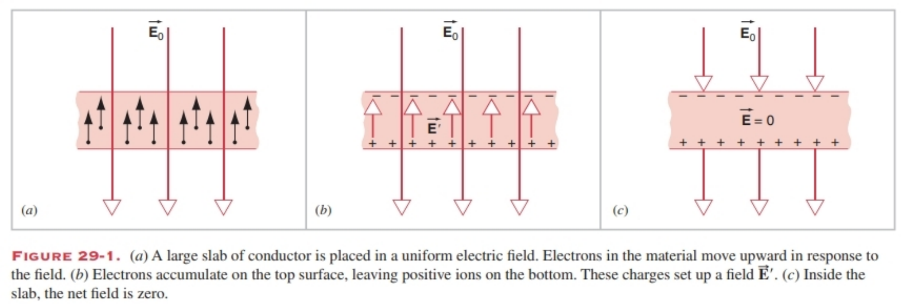
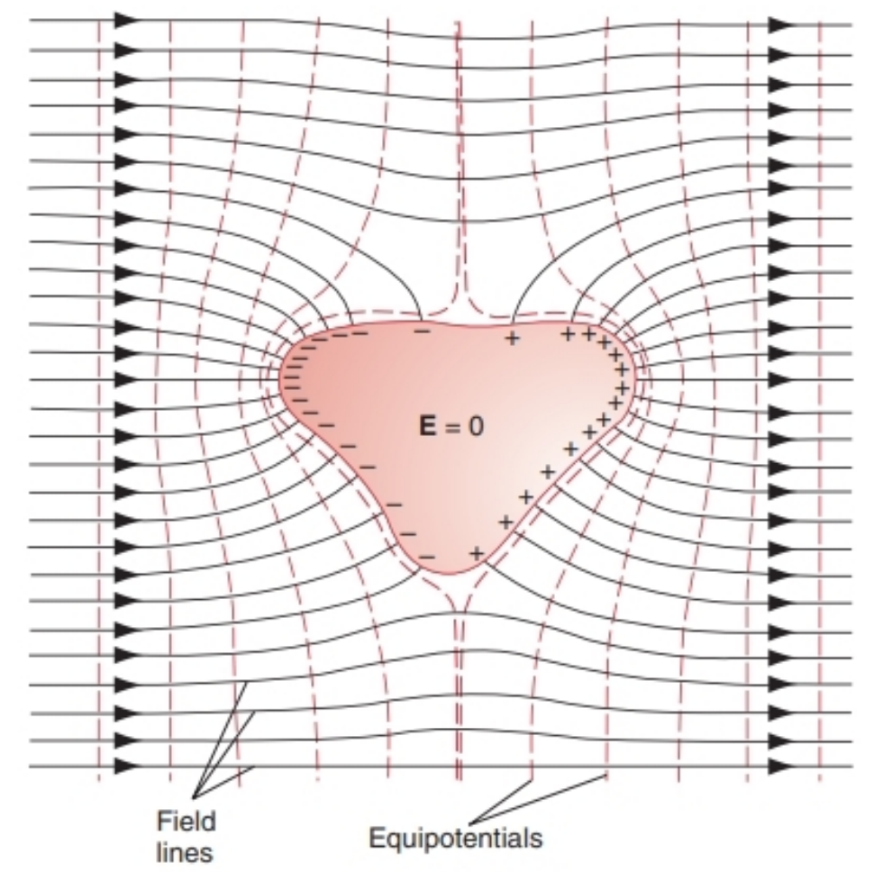
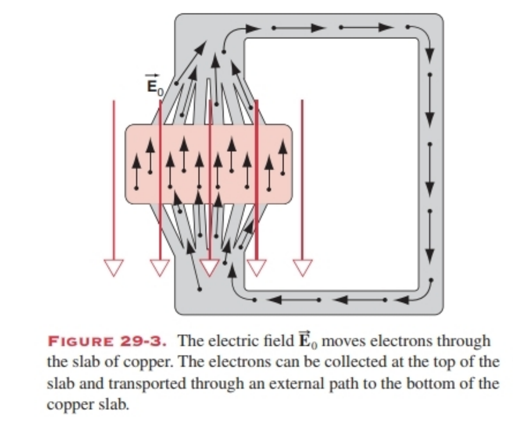
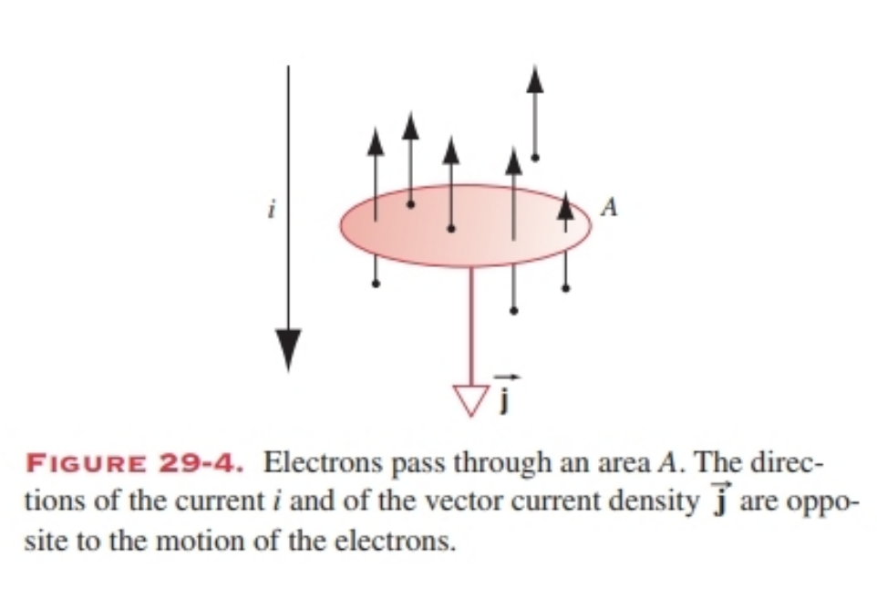
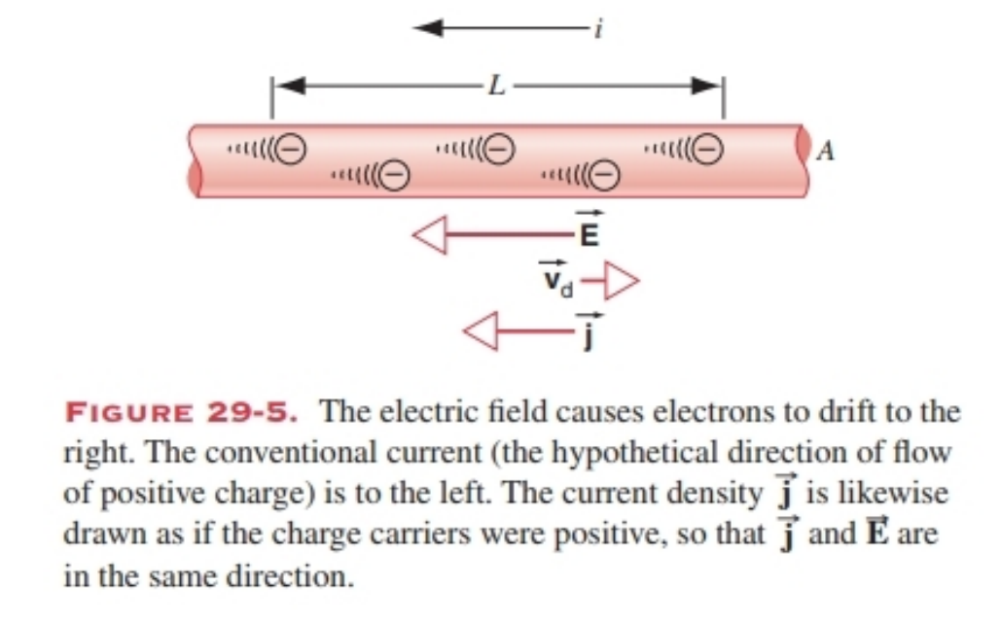
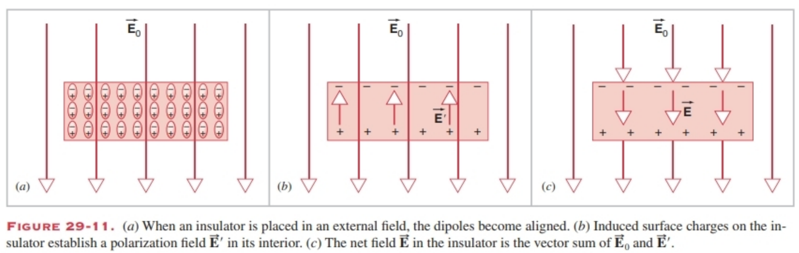

# 29 THE ELECTRICAL PROPERTIES OF MATERIALS

## Cheatsheet

## **29-1 材料的类型**
- **导体**：电荷自由移动（如金属），内部电场为零（静电条件下）。
- **绝缘体**：电荷被束缚，内部电场可不为零。
- **半导体**：介于导体与绝缘体之间（如硅、锗）。
- **超导体**：零电阻，低温下出现。

---

## **29-2 导体在电场中：静态条件**
- 导体内部电场为零：$\vec{E}_{\text{inside}} = 0$
- 电荷分布在表面，电场垂直于表面。
- 表面电荷密度：$\sigma = \epsilon_0 E_0$（对于大平板）

---

## **29-3 导体在电场中：动态条件**
- **电流定义**：$i = \frac{dq}{dt}$，单位：安培（A）
- **电流密度**：$\vec{j} = \frac{i}{A} \hat{j}$，方向为正电荷流动方向
- **漂移速度**：$\vec{j} = -en\vec{v}_d$，$v_d = \frac{j}{ne}$
- 电子漂移速度很小（cm/h量级），电场传播速度接近光速

---

## **29-4 欧姆材料**
- **欧姆定律（微观）**：$\vec{j} = \sigma \vec{E}$，$\vec{E} = \rho \vec{j}$
- **电阻率**：$\rho = \frac{1}{\sigma}$，单位：$\Omega \cdot m$
- **电阻**：$R = \frac{\Delta V}{i} = \rho \frac{L}{A}$
- **欧姆材料**：$\rho$ 与 $E$ 无关，$i$–$\Delta V$ 图为直线

### **电阻率表（20°C）**
| 材料       | $\rho$ (Ω·m)       | $\alpha_{\text{av}}$ (1/°C) |
|------------|--------------------|-----------------------------|
| 银         | $1.62 \times 10^{-8}$ | $4.1 \times 10^{-3}$        |
| 铜         | $1.69 \times 10^{-8}$ | $4.3 \times 10^{-3}$        |
| 硅（纯）   | $2.5 \times 10^3$     | $-70 \times 10^{-3}$        |
| 玻璃       | $10^{10}–10^{14}$    | —                           |

---

## **29-5 欧姆定律：微观解释**
- **自由电子模型**：电子与晶格碰撞，平均自由时间 $\tau$，平均自由程 $\lambda = v_{\text{av}} \tau$
- **漂移速度**：$v_d = \frac{eE\tau}{m}$
- **电阻率**：$\rho = \frac{m}{ne^2\tau}$
- $\tau$ 与 $E$ 无关 ⇒ 欧姆定律成立

---

## **29-6 绝缘体在电场中**
- **极化**：偶极子沿电场排列，产生极化场 $E'$
- **净电场**：$E = E_0 - E' = \frac{E_0}{\kappa_e}$
- **介电常数**：$\kappa_e > 1$，$\epsilon = \kappa_e \epsilon_0$
- **介电强度**：击穿所需最大电场

### **介电常数表（室温）**
| 材料       | $\kappa_e$ | 介电强度 (kV/mm) |
|------------|------------|------------------|
| 真空       | 1          | —                |
| 空气       | 1.00059    | 3                |
| 聚苯乙烯   | 2.6        | 24               |
| 水（20°C） | 80.4       | —                |
| 云母       | 5.4        | 160              |

---

## **重要公式总结**
- 电流：$i = \frac{dq}{dt}$
- 电流密度：$j = \frac{i}{A}$，$\vec{j} = -en\vec{v}_d$
- 漂移速度：$v_d = \frac{j}{ne}$
- 欧姆定律：$j = \sigma E$，$E = \rho j$
- 电阻：$R = \rho \frac{L}{A}$
- 介电常数：$E = \frac{E_0}{\kappa_e}$
- 极化场：$E' = E_0 - E$

### 29-1 TYPES OF MATERIALS
Natural and artificially made materials show a wide range of electrical properties. These properties are determined partly by the behavior of individual atoms or molecules and partly by the interactions of atoms or molecules in the bulk material. The ability of a material to conduct electricity may also depend on the conditions of the material, such as its temperature and pressure.

Conductors (for example, most metals) are materials in which electric charges readily flow. In many metals, each atom gives up one or more of its outer or valence electrons to the entire material, and we often regard the electrons as forming a “gas” within the material rather than belonging to any particular atom. These electrons are free to move when an electric field is applied to the material. Under static conditions the electric field in the interior of a conductor is zero, even if the conductor carries a net charge. (If this were not so, the free electrons would be accelerated, which would violate the assumption of a static charge distribution.) In Section 29-2, we will discuss the effect of an external electric field applied to a conductor under static conditions.

In an insulator, on the other hand, the electrons are bound rather tightly to the atoms and are not free to move under the electric fields that might be applied under ordinary circumstances. An insulator can carry any distribution of electric charges on its surface or in its interior, and (in contrast to a conductor) the electric field in the interior of an insulator can have nonzero values.

An insulating material can often be regarded as a collection of molecules that are not easily ionized. In this case the electrical properties may depend on the electric dipole moment of the molecules. Materials in which the molecules have permanent dipole moments are called polar, and electric fields can align the dipole moments of molecules, as we discussed in Section 26-7. In some materials, the alignment of the dipoles remains even when we remove the applied field; these materials are called ferroelectric (in analogy with ferromagnetic materials, in which magnetic dipole moments remain aligned even when an external magnetic field is removed). Even nonpolar materials can show these effects, because the applied electric field can induce a dipole moment in the molecules. These effects are discussed in Section 29-5.

Ordinary matter is usually electrically neutral. In the absence of an external electric field, this neutrality applies to individual atoms as well as to the entire material. The application of an electric field can remove one or more electrons from atoms of the material. This process is called ionization, and the resulting positively charged atoms with a deficiency of electrons are called ions. In an insulator, a sufficiently large electric field can ionize the atoms, and as a result there are electrons available to move through the material. Under these circumstances an insulator can behave more like a conductor. This situation is called breakdown and requires fields typically in the range of $10^6$ V/m in air to $10^7$ V/m in plastics and ceramics.

Intermediate between insulators and conductors are semiconductors. In a semiconductor, perhaps one atom in $10^{10}$ to $10^{12}$ might contribute an electron to the flow of electricity in the material (in contrast to a conductor, in which every atom typically contributes an electron to the flow of electricity). Commonly used semiconductors include silicon and germanium, as well as many compounds.

Even the best conductors (copper, silver, and gold) show a small but definitely nonzero resistance to the flow of electricity. Under certain conditions, often involving cooling to very low temperatures, electric charge can flow through some materials with no resistance at all. This property of materials is called superconductivity, and the materials under these conditions are called superconductors. Some materials can be relatively poor conductors at room temperature but can be superconductors at low temperatures.

In this chapter we study ways in which conductors and insulators respond to applied electric fields. Understanding the behavior of semiconductors and superconductors requires the methods of quantum mechanics, which are discussed in Chapter 49.

---

### 29-1 材料的类型
天然材料和人造材料具有广泛的电学性质。这些性质部分取决于单个原子或分子的行为，部分取决于大块材料中原子或分子之间的相互作用。材料的导电能力还可能取决于其自身状态，例如温度和压力。

导体（例如大多数金属）是电荷易于流动的材料。在许多金属中，每个原子会将一个或多个外层（价）电子贡献给整个材料，我们通常将这些电子视为在材料内部形成“电子气”，而非属于某个特定原子。当向材料施加电场时，这些电子可以自由移动。在静态条件下，即使导体带有净电荷，其内部的电场也为零。（如果不是这样，自由电子会被加速，这将违背静态电荷分布的假设。）在29-2节中，我们将讨论静态条件下外部电场对导体的作用。

另一方面，在绝缘体中，电子与原子结合得相当紧密，在通常情况下施加的电场中无法自由移动。绝缘体的表面或内部可以存在任意分布的电荷，并且（与导体不同）其内部的电场可以具有非零值。

绝缘材料通常可视为由不易电离的分子组成。在这种情况下，其电学性质可能取决于分子的电偶极矩。分子具有永久电偶极矩的材料称为极性材料，电场可以使分子的偶极矩取向一致，这一点我们在26-7节中已讨论过。有些材料在移除施加的电场后，偶极矩的取向仍然保持不变，这类材料称为铁电体（类似于铁磁材料，其磁偶极矩在移除外部磁场后仍能保持取向一致）。即使是非极性材料也会表现出这些效应，因为施加的电场可以在分子中感应出电偶极矩。这些效应将在29-5节中讨论。

普通物质通常是电中性的。在没有外部电场时，这种电中性既适用于单个原子，也适用于整个材料。施加电场后，材料中的原子可能会失去一个或多个电子，这个过程称为电离，失去电子后带正电的原子称为离子。在绝缘体中，足够强的电场可以使原子电离，从而产生可在材料中移动的电子。在这种情况下，绝缘体的行为会更接近导体，这种情况称为击穿，其所需的电场强度在空气中通常为$10^6$ V/m，在塑料和陶瓷中则为$10^7$ V/m。

半导体介于绝缘体和导体之间。在半导体中，大约每$10^{10}$到$10^{12}$个原子中才有一个原子可能贡献一个电子参与导电（而在导体中，每个原子通常都会贡献一个电子参与导电）。常用的半导体包括硅、锗以及许多化合物。

即使是最好的导体（铜、银、金），其对电流的流动也会表现出微小但确实存在的电阻。在某些条件下（通常是冷却到极低温度），电荷可以在某些材料中无电阻流动，这种材料的特性称为超导性，处于这种状态的材料称为超导体。有些材料在室温下是较差的导体，但在低温下会成为超导体。

本章中，我们将研究导体和绝缘体在施加电场后的响应方式。理解半导体和超导体的行为需要量子力学的方法，这将在第49章中讨论。

### 29-2 A CONDUCTOR IN AN ELECTRIC FIELD: STATIC CONDITIONS
Suppose we place a large rectangular slab of a conductor such as copper in a uniform electric field, as shown in Fig. 29-1a. We can regard the copper as a “gas” of electrons that are free to move in a lattice of copper ions in fixed locations. The electric field $\overrightarrow{E}_{0}$ exerts a force $\overrightarrow{F}=-e \overrightarrow{E}_{0}$ on the electrons, which causes the electrons to move in a direction opposite to the field. The electrons quickly move to the top surface of the copper, leaving a deficiency of electrons (a positive charge) on the bottom surface. When we place a conductor in an external field, the charges redistribute themselves almost instantaneously, after which electrostatic conditions apply.

The two surfaces of the conductor can be considered as sheets of charge, which set up an electric field $\overrightarrow{E}'$ as shown in Fig. 29-1b. Inside the copper, the net electric field is the vector sum of the two fields: $\overrightarrow{E}=\overrightarrow{E}_{0}+\overrightarrow{E}'$. In terms of magnitudes, the sum becomes a difference, because the two fields are in opposite directions: $E=E_{0}-E'$. In the interior of the copper under static conditions, the net electric field must be zero, as we discussed in Section 27-6. (In Section 27-6, we did not consider the presence of an externally applied electric field; however, the conclusion remains the same—the electric field inside the conductor must be zero, because otherwise the free electrons in the conductor would be accelerated, thus violating our assumption of a static situation.) The applied electric field $E_{0}$ must move just enough electrons to the surface to set up an electric field $E'$ that has the same magnitude as $E_{0}$, giving a net field of zero inside the copper (Fig. 29-1c). Outside the slab, the sheets of charge on the two surfaces give electric fields that cancel, leaving the net field unchanged in those regions.

Figure 29-2 shows an uncharged conductor of irregular shape in an originally uniform electric field. Once again, free electrons in the conductor quickly move to the surface, establishing a distribution of positive and negative charges that gives an electric field exactly canceling the applied field in the interior of the conductor. Outside the conductor, the field is the (vector) sum of the original uniform field and the field due to the charges on the surface of the conductor. Note that the field lines originate on positive charges and terminate on negative charges. Note also that the charge density is large on parts of the surface where the radius of curvature is small, as we discussed in Section 28-9, and that the field is large (the field lines are close together) where the charge density is large.

At the surface of the conductor in Fig. 29-2, the electric field lines are perpendicular to the surface. If this were not true, then there would be a component of the electric field parallel to the surface, which would cause charges to move. Since this would violate our assumption of a static situation, this component of the electric field cannot exist and the field must be perpendicular to the surface.

The figure also shows the equipotentials for this situation. Far from the conductor, where the field is uniform, the equipotentials are flat planes. As we move close to the conductor, the equipotentials are distorted, until at the surface the equipotential follows the surface exactly; as we discussed in Section 28-9, the surface of a conductor is an equipotential.

**SAMPLE PROBLEM 29-1**  
A large, thin plate of copper is placed in a uniform electric field of magnitude $E_{0}=450 ~N / C$ that is perpendicular to the plate (as in Fig. 29-1). Find the resulting surface charge density on the copper.

**Solution**  
The electric field causes a positive charge density on the lower surface of the plate and a negative charge density of equal magnitude on the upper surface. The field in the interior of the plate must be zero, which means that the two charge distributions must combine to give an electric field inside the plate of magnitude $E_{0}$ and direction opposite to the applied field. If we regard the plate as of very large dimensions, the field due to the positive charge distribution is, according to Eq. 26-20, $E_{+}=\sigma / 2 \epsilon_{0}$, and the magnitude of the field due to the negative charge is $E_{-}=\sigma / 2 \epsilon_{0}$. These two fields are in the same direction and must add to give a total field of $E_{0}$:  
$$E_{0}=\sigma / 2 \epsilon_{0}+\sigma / 2 \epsilon_{0}=\sigma / \epsilon_{0}$$  
and the charge density on each surface is  
$$\begin{aligned} \sigma=\epsilon_{0} E_{0} & =\left(8.85 × 10^{-12} C^{2} / N \cdot m^{2}\right)(450 N / C) \\ & =3.98 × 10^{-9} C / m^{2} . \end{aligned}$$

Note that outside the copper plate, the fields due to the two sheets of charge cancel one another, so that the resulting field remains $E_{0}$. This is true only for the flat geometry of this problem and is not true in general; see for example Fig. 29-2.

### 29-2 电场中的导体：静态条件
假设我们将一块大的矩形导体板（如铜板）置于均匀电场中，如图29-1a所示。我们可以将铜视为由“电子气”构成——电子可在固定位置的铜离子晶格中自由移动。电场$\overrightarrow{E}_{0}$会对电子施加力$\overrightarrow{F}=-e \overrightarrow{E}_{0}$，使电子向与电场相反的方向移动。电子会迅速移动到铜板的上表面，导致下表面因电子缺失而带正电。当导体置于外电场中时，电荷会几乎瞬间重新分布，随后进入静电状态。

导体的两个表面可视为电荷面，它们会产生一个电场$\overrightarrow{E}'$，如图29-1b所示。在铜板内部，净电场是这两个电场的矢量和，即$\overrightarrow{E}=\overrightarrow{E}_{0}+\overrightarrow{E}'$。由于两个电场方向相反，其大小关系表现为差值：$E=E_{0}-E'$。如27-6节所述，静态条件下铜板内部的净电场必须为零（27-6节未考虑外电场的存在，但结论仍然成立——导体内部电场必须为零，否则自由电子会被加速，违背静态条件的假设）。外电场$E_{0}$会推动足够多的电子到表面，形成一个与$E_{0}$大小相等的电场$E'$，从而使铜板内部的净电场为零（图29-1c）。在导体板外部，两个表面电荷面产生的电场相互抵消，因此这些区域的净电场保持不变。

图29-2展示了一块形状不规则的不带电导体置于初始均匀电场中的情况。导体中的自由电子会再次迅速移动到表面，形成正负电荷分布，其产生的电场恰好抵消导体内部的外电场。在导体外部，总电场是初始均匀电场与导体表面电荷产生电场的矢量和。需注意，电场线起始于正电荷、终止于负电荷；此外，如28-9节所述，导体表面曲率半径较小的部位电荷密度较大，而电荷密度大的区域电场也更强（电场线更密集）。

在图29-2中的导体表面，电场线与表面垂直。若情况并非如此，电场会存在平行于表面的分量，该分量会导致电荷移动——这与静态条件的假设矛盾，因此电场的平行分量不可能存在，电场必须与导体表面垂直。

该图还展示了这种情况下的等势面。在远离导体的区域，电场均匀，等势面为平面；靠近导体时，等势面发生畸变，直至在导体表面处，等势面与表面完全重合。如28-9节所述，导体表面本身就是一个等势面。

#### 示例问题29-1  
将一块大而薄的铜板置于垂直于板面的均匀电场中，电场强度大小$E_{0}=450 ~N/C$（如图29-1所示），求铜板表面的电荷面密度。

#### 解答  
电场会使铜板下表面产生正电荷面密度，上表面产生大小相等的负电荷面密度。由于铜板内部电场必须为零，这两个电荷分布产生的合电场需与外电场大小相等、方向相反。若将铜板视为尺寸极大的平板，根据式26-20，正电荷分布产生的电场为$E_{+}=\sigma / 2 \epsilon_{0}$，负电荷分布产生的电场大小为$E_{-}=\sigma / 2 \epsilon_{0}$。两个电场方向相同，叠加后总电场大小等于$E_{0}$：  
$$E_{0}=\sigma / 2 \epsilon_{0}+\sigma / 2 \epsilon_{0}=\sigma / \epsilon_{0}$$  
因此，每个表面的电荷面密度为：  
$$\begin{aligned} \sigma=\epsilon_{0} E_{0} & =\left(8.85 × 10^{-12} \, \text{C}^2/(\text{N·m}^2)\right)(450 \, \text{N/C}) \\ & =3.98 × 10^{-9} \, \text{C/m}^2 . \end{aligned}$$

需注意，在铜板外部，两个电荷面产生的电场相互抵消，因此外部电场仍保持$E_{0}$。但这一结论仅适用于本题的平板几何形状，并非普遍成立（例如图29-2的情况）。

### 29-3 A CONDUCTOR IN AN ELECTRIC FIELD: DYNAMIC CONDITIONS
In Fig. 29-1a, electrons move from the bottom of the slab of copper to the top under the action of the applied electric field, until the concentration of electrons at the top of the slab (and of positive ions at the bottom) creates a field that cancels the applied field in the interior of the copper and prevents the flow of additional electrons. Suppose there were a mechanism to remove electrons from the top of the slab, carry them around an external path, and re-inject them at the bottom of the slab (shown schematically in Fig. 29-3). In this case, there would be no build-up of charge on the top and bottom of the slab, and the electrostatic conditions of the previous section cannot be applied to the copper. In particular, the conclusion drawn in the last section is no longer valid—the electric field inside the copper will in general be nonzero when charges are flowing.

The continuous loop of flowing electrons is a simple representation of an electric circuit, and the flow of electrons (or other charged particles) is called an electric current.

Let us examine the flow of electric charge past a particular point in the interior of the material (Fig. 29-4). A quantity of charge $dq$ will pass through a small surface of area $A$ in a time $dt$. For example, the area $A$ might be the cross-sectional area of a wire through which the charge is flowing. The electric current $i$ is defined as the net charge that flows through the surface per unit time interval: 
$$i=\frac{dq}{dt} \quad(29-1)$$

For electric current to exist, there must be a net flow of charge across the surface. If neutral atoms travel across the surface, no current is flowing even though charges travel across the surface, because equal numbers of positive and negative charges cross the surface. If electrons are traveling randomly through the material, with equal numbers crossing the surface in either direction, no current flows because the net charge crossing the surface is zero.

The electric current has a direction, which is defined to be the direction of the flow of positive charge. Even though the current has a direction, current is a scalar and not a vector, because currents do not satisfy the laws for vector addition.

The SI unit of current is the ampere (A), defined as 
$$1 \, \text{ampere} = 1 \, \text{coulomb/second}$$

If the current is constant, then Eq. 29-1 becomes 
$$i=\frac{q}{t} \quad(29-2)$$

The net charge passing through any surface is determined by integrating the current: 
$$q=\int i \, dt \quad(29-3)$$

A related vector quantity is the current density $\overrightarrow{j}$, or current per unit area, whose magnitude is defined as 
$$j=\frac{i}{A} \quad(29-4)$$

The direction of $\overrightarrow{j}$ is defined to be the direction of the flow of positive charge. Since electrons are moving upward in Fig. 29-4, the direction of $\overrightarrow{j}$ is downward. That is, electrons move in the direction of $-\overrightarrow{j}$.

The current passing through any surface can be determined by integrating the current density over the surface: 
$$i=\int \overrightarrow{j} \cdot d\overrightarrow{A} \quad(29-5)$$
where $d\overrightarrow{A}$ is an element of surface area and the integral is done over the entire surface through which we want to find the current. The vector $d\overrightarrow{A}$ is taken to be perpendicular to the surface element such that $\overrightarrow{j} \cdot d\overrightarrow{A}$ is positive, corresponding to a positive current $i$.

#### Current Density and Drift Speed
As electrons make their way through the copper, they are accelerated by an electric field, which exerts a force $-e\overrightarrow{E}$ on the electrons. In Section 29-2 we considered static conditions, in which the electric field is always zero inside a conductor. Here we consider charges in motion, so that static conditions do not apply and $\overrightarrow{E}$ can be nonzero inside a conductor.

The electrons collide with the ions of the lattice and transfer energy to them. The motion of individual electrons is therefore very irregular, consisting of a short interval of acceleration in a direction opposite to the electric field, followed by a collision with an ion that might send the electron into motion in any direction, followed by another acceleration, and so on. The net effect is a drift of electrons in a direction opposite to the field. There is no net acceleration of electrons, because they continually lose energy in collisions with the lattice of copper ions. In effect, energy is transferred from the applied field to the lattice (in the form of internal energy of the conductor, often observed as a temperature increase). On the average, electrons can be described as moving with a constant drift velocity $\overrightarrow{v}_d$ in a direction opposite to the field, as indicated in Fig. 29-5.

Consider the motion of electrons in a portion of the conductor of length $L$. The electrons are moving with drift speed $v_d$, so they travel the length $L$ in a time $t=\frac{L}{v_d}$. The conductor has a cross-sectional area $A$, so in the time $t$ all of the electrons in the volume $AL$ will travel through a surface at the right end of the conductor. If the density of electrons (number per unit volume) is $n$, then the magnitude of the net charge passing through the surface is $q=enAL$, and the current density is 
$$j=\frac{q}{At}=\frac{enAL}{A \cdot \frac{L}{v_d}}=env_d \quad(29-6)$$

In vector notation, this is 
$$\overrightarrow{j}=-en\overrightarrow{v}_d \quad(29-7)$$

The negative sign again reminds us that the direction of the current density is opposite to the motion of the electrons.

As the following sample problems illustrate, the drift speeds of electrons in typical materials are very small compared with the speed of the random thermal motions of electrons (typically $10^6 \, \text{m/s}$).

#### SAMPLE PROBLEM 29-2
One end of an aluminum wire whose diameter is 2.5 mm is welded to one end of a copper wire whose diameter is 1.8 mm. The composite wire carries a steady current $i=1.3 \, \text{A}$. What is the current density in each wire?

**Solution**  
We may take the current density as (a different) constant within each wire except for points near the junction. The current density is given by Eq. 29-4, $j=\frac{i}{A}$. The cross-sectional area $A$ of the aluminum wire is 
$$A_{\text{Al}}=\frac{1}{4}\pi d^2=(\pi/4)(2.5 \times 10^{-3} \, \text{m})^2=4.91 \times 10^{-6} \, \text{m}^2$$
so that 
$$j_{\text{Al}}=\frac{1.3 \, \text{A}}{4.91 \times 10^{-6} \, \text{m}^2}=2.6 \times 10^5 \, \text{A/m}^2=26 \, \text{A/cm}^2$$

As you can verify, the cross-sectional area of the copper wire is $2.54 \times 10^{-6} \, \text{m}^2$, so that 
$$j_{\text{Cu}}=\frac{1.3 \, \text{A}}{2.54 \times 10^{-6} \, \text{m}^2}=5.1 \times 10^5 \, \text{A/m}^2=51 \, \text{A/cm}^2$$

The fact that the wires are of different materials does not enter here.

#### SAMPLE PROBLEM 29-3
What is the drift speed of the conduction electrons in the copper wire of Sample Problem 29-2?

**Solution**  
In copper, there is very nearly one conduction electron per atom on the average. The number $n$ of electrons per unit volume is therefore the same as the number of atoms per unit volume and is determined from 
$$\frac{n}{N_A}=\frac{\rho_m}{M} \quad \text{or} \quad \frac{\text{atoms/m}^3}{\text{atoms/mol}}=\frac{\text{mass/m}^3}{\text{mass/mol}}$$

Here $\rho_m$ is the (mass) density of copper, $N_A$ is the Avogadro constant, and $M$ is the molar mass of copper. Thus 
$$
\begin{aligned} 
n&=\frac{N_A \rho_m}{M}\\
&=\frac{(6.02 \times 10^{23} \, \text{electrons/mol})(8.96 \times 10^3 \, \text{kg/m}^3)}{63.5 \times 10^{-3} \, \text{kg/mol}}\\
&=8.49 \times 10^{28} \, \text{electrons/m}^3
\end{aligned}
$$

We then have, using Eq. 29-6 ($v_d=\frac{j}{ne}$), 
$$
\begin{aligned} 
v_d&=\frac{5.1 \times 10^5 \, \text{A/m}^2}{(8.49 \times 10^{28} \, \text{electrons/m}^3)(1.60 \times 10^{-19} \, \text{C/electron})}\\
&=3.8 \times 10^{-5} \, \text{m/s}=14 \, \text{cm/h}
\end{aligned}
$$

You should be able to show that for the aluminum wire, $v_d=2.7 \times 10^{-5} \, \text{m/s}=9.7 \, \text{cm/h}$. Can you explain, in physical terms, why in this example the drift speed is smaller in aluminum than in copper, even though the two wires carry the same current?

If the electrons drift at such a low speed, why do electrical effects seem to occur immediately after a switch is thrown, such as when you turn on the room lights? Confusion on this point results from not distinguishing between the drift speed of the electrons and the speed at which changes in the electric field configuration travel along wires. This latter speed approaches that of light. Similarly, when you turn the valve on your garden hose, with the hose full of water, a pressure wave travels along the hose at the speed of sound in water. The speed at which the water moves through the hose—measured perhaps with a dye marker—is much lower.

#### SAMPLE PROBLEM 29-4
A strip of silicon, of cross-sectional width $w=3.2 \, \text{mm}$ and thickness $d=250 \, \mu\text{m}$, carries a current of 190 mA. The silicon is an n-type semiconductor, having been “doped” with a controlled amount of phosphorus impurity. The doping has the effect of greatly increasing $n$, the number of charge carriers (electrons, in this case) per unit volume, as compared with the value for pure silicon. In this case, $n=8.0 \times 10^{21} \, \text{m}^{-3}$. (a) What is the current density in the strip? (b) What is the drift speed?

**Solution**  
(a) From Eq. 29-4, 
$$
\begin{aligned} 
j&=\frac{i}{wd}\\
&=\frac{190 \times 10^{-3} \, \text{A}}{(3.2 \times 10^{-3} \, \text{m})(250 \times 10^{-6} \, \text{m})}\\
&=2.4 \times 10^5 \, \text{A/m}^2
\end{aligned}
$$

(b) From Eq. 29-6, 
$$
\begin{aligned} 
v_d&=\frac{j}{ne}\\
&=\frac{2.4 \times 10^5 \, \text{A/m}^2}{(8.0 \times 10^{21} \, \text{m}^{-3})(1.60 \times 10^{-19} \, \text{C})}\\
&=190 \, \text{m/s}
\end{aligned}
$$

The drift speed (190 m/s) of the electrons in this silicon semiconductor is much greater than the drift speed ($3.8 \times 10^{-5} \, \text{m/s}$) of the conduction electrons in the metallic copper conductor of Sample Problem 29-3, even though the current densities are similar. The number of charge carriers in this semiconductor ($8.0 \times 10^{21} \, \text{m}^{-3}$) is much smaller than the number of charge carriers in the copper conductor ($8.49 \times 10^{28} \, \text{m}^{-3}$). The smaller number of charge carriers must drift faster in the semiconductor if they are to establish the same current density that the greater number of charge carriers establish in copper.

### 29-3 电场中的导体：动态条件
在图29-1a中，在外加电场的作用下，电子从铜板的底部向顶部移动，直到铜板顶部的电子聚集（以及底部的正离子聚集）产生一个电场——该电场会抵消铜板内部的外加电场，从而阻止更多电子流动。假设存在一种机制：将铜板顶部的电子移除，通过外部路径输送，并重新注入铜板底部（示意图如图29-3所示）。在这种情况下，铜板的顶部和底部不会积累电荷，上一节讨论的静电条件不再适用于该铜板。具体而言，上一节得出的结论不再成立——当电荷流动时，铜板内部的电场通常不为零。

电子流动形成的连续回路是电路的简单模型，电子（或其他带电粒子）的流动被称为电流。

我们来分析材料内部某一特定点的电荷流动情况（图29-4）。在时间$dt$内，电荷量$dq$会通过面积为$A$的小截面。例如，面积$A$可以是电荷流过的导线横截面积。电流$i$定义为单位时间内通过该截面的净电荷量：
$$i=\frac{dq}{dt} \quad(29-1)$$

要产生电流，必须存在电荷穿过截面的净流动。若中性原子穿过截面，即使电荷在移动，也不会产生电流——因为穿过截面的正负电荷数量相等。若电子在材料中随机运动，且向两个方向穿过截面的电子数量相等，净电荷量为零，同样不会产生电流。

电流具有方向，其定义为正电荷的流动方向。尽管电流有方向，但电流是标量而非矢量，因为电流不满足矢量叠加法则。

电流的国际单位是安培（A），定义为：
$$1 \, \text{安培} = 1 \, \text{库仑/秒}$$

若电流恒定，式29-1可写为：
$$i=\frac{q}{t} \quad(29-2)$$

通过任意截面的净电荷量可通过对电流积分得到：
$$q=\int i \, dt \quad(29-3)$$

与之相关的矢量物理量是电流密度$\overrightarrow{j}$（即单位面积的电流），其大小定义为：
$$j=\frac{i}{A} \quad(29-4)$$

电流密度$\overrightarrow{j}$的方向定义为正电荷的流动方向。在图29-4中，电子向上移动，因此电流密度$\overrightarrow{j}$的方向向下，即电子沿$-\overrightarrow{j}$的方向运动。

通过任意截面的电流可通过对该截面上的电流密度积分得到：
$$i=\int \overrightarrow{j} \cdot d\overrightarrow{A} \quad(29-5)$$
其中$d\overrightarrow{A}$是面元矢量，积分范围覆盖整个待求电流的截面。面元矢量$d\overrightarrow{A}$的方向垂直于截面，确保$\overrightarrow{j} \cdot d\overrightarrow{A}$为正值，对应正电流$i$。

#### 电流密度与漂移速度
当电子在铜中运动时，电场会对电子施加力$-e\overrightarrow{E}$，使电子加速。在29-2节的静态条件下，导体内部电场始终为零；而在本节讨论的电荷运动场景中，静态条件不再适用，导体内部电场$\overrightarrow{E}$可不为零。

电子会与晶格中的离子发生碰撞，并将能量传递给离子。因此，单个电子的运动极不规则：先是在与电场相反的方向上短暂加速，随后与离子碰撞（碰撞后电子运动方向随机），接着再次加速，如此循环。其净效应是电子向与电场相反的方向“漂移”。由于电子在与铜离子晶格的碰撞中持续损失能量，电子不会产生净加速。实际上，能量会从外加电场传递到晶格（表现为导体的内能增加，通常可观察到温度升高）。平均而言，电子可视为以恒定的漂移速度$\overrightarrow{v}_d$沿与电场相反的方向运动，如图29-5所示。

考虑导体中一段长度为$L$的区域：电子以漂移速度$v_d$运动，穿过长度$L$所需时间为$t=\frac{L}{v_d}$。导体的横截面积为$A$，因此在时间$t$内，体积$AL$中的所有电子都会穿过导体右端的截面。若电子数密度（单位体积内的电子数）为$n$，则穿过该截面的净电荷量大小为$q=enAL$，电流密度为：
$$j=\frac{q}{At}=\frac{enAL}{A \cdot \frac{L}{v_d}}=env_d \quad(29-6)$$

用矢量表示为：
$$\overrightarrow{j}=-en\overrightarrow{v}_d \quad(29-7)$$

负号再次表明，电流密度的方向与电子运动方向相反。

如下列示例问题所示，典型材料中电子的漂移速度远小于电子无规则热运动的速度（通常约为$10^6 \, \text{m/s}$）。

#### 示例问题29-2
一根直径为2.5 mm的铝线一端与一根直径为1.8 mm的铜线一端焊接在一起，复合导线中流过恒定电流$i=1.3 \, \text{A}$。求每根导线中的电流密度。

**解答**  
除了靠近接头的位置，每根导线内部的电流密度可视为（不同的）恒定值。根据式29-4（$j=\frac{i}{A}$）计算电流密度。铝线的横截面积为：
$$A_{\text{Al}}=\frac{1}{4}\pi d^2=(\pi/4)(2.5 \times 10^{-3} \, \text{m})^2=4.91 \times 10^{-6} \, \text{m}^2$$
因此铝线的电流密度为：
$$j_{\text{Al}}=\frac{1.3 \, \text{A}}{4.91 \times 10^{-6} \, \text{m}^2}=2.6 \times 10^5 \, \text{A/m}^2=26 \, \text{A/cm}^2$$

可自行验证，铜线的横截面积为$2.54 \times 10^{-6} \, \text{m}^2$，因此铜线的电流密度为：
$$j_{\text{Cu}}=\frac{1.3 \, \text{A}}{2.54 \times 10^{-6} \, \text{m}^2}=5.1 \times 10^5 \, \text{A/m}^2=51 \, \text{A/cm}^2$$

此处无需考虑导线材料的差异（电流密度仅与电流和横截面积相关）。

#### 示例问题29-3
求示例问题29-2中铜线内传导电子的漂移速度。

**解答**  
铜中平均每个原子几乎贡献一个传导电子，因此单位体积内的电子数$n$等于单位体积内的原子数，可通过下式计算：
$$\frac{n}{N_A}=\frac{\rho_m}{M} \quad \text{即} \quad \frac{\text{原子数/立方米}}{\text{原子数/摩尔}}=\frac{\text{质量/立方米}}{\text{质量/摩尔}}$$

其中，$\rho_m$为铜的（质量）密度，$N_A$为阿伏伽德罗常数，$M$为铜的摩尔质量。代入数据计算得：
$$
\begin{aligned} 
n&=\frac{N_A \rho_m}{M}\\
&=\frac{(6.02 \times 10^{23} \, \text{电子/摩尔})(8.96 \times 10^3 \, \text{千克/立方米})}{63.5 \times 10^{-3} \, \text{千克/摩尔}}\\
&=8.49 \times 10^{28} \, \text{电子/立方米}
\end{aligned}
$$

根据式29-6（$v_d=\frac{j}{ne}$），漂移速度为：
$$
\begin{aligned} 
v_d&=\frac{5.1 \times 10^5 \, \text{安/平方米}}{(8.49 \times 10^{28} \, \text{电子/立方米})(1.60 \times 10^{-19} \, \text{库/电子})}\\
&=3.8 \times 10^{-5} \, \text{米/秒}=14 \, \text{厘米/小时}
\end{aligned}
$$

可自行推导，铝线中电子的漂移速度为$v_d=2.7 \times 10^{-5} \, \text{米/秒}=9.7 \, \text{厘米/小时}$。从物理角度解释：为何在本例中，尽管两根导线电流相同，但铝线中电子的漂移速度小于铜线？

既然电子的漂移速度如此之低，为何闭合开关后电效应似乎立即发生（例如打开房间灯时）？产生这种困惑的原因是未区分电子的漂移速度与电场分布变化沿导线的传播速度——后者接近光速。类似地，当打开装满水的水管阀门时，压力波沿水管的传播速度等于水中的声速，而水在水管中的实际流动速度（可用染料标记测量）则慢得多。

#### 示例问题29-4
一块硅条的横截面宽度$w=3.2 \, \text{mm}$、厚度$d=250 \, \mu\text{m}$，其中流过的电流为190 mA。该硅为n型半导体，通过“掺杂”可控量的磷杂质，使其单位体积内的电荷载流子（此处为电子）数量$n$远大于纯硅。本题中$n=8.0 \times 10^{21} \, \text{米}^{-3}$。（a）求硅条中的电流密度；（b）求电子的漂移速度。

**解答**  
（a）根据式29-4，电流密度为：
$$
\begin{aligned} 
j&=\frac{i}{wd}\\
&=\frac{190 \times 10^{-3} \, \text{安}}{(3.2 \times 10^{-3} \, \text{米})(250 \times 10^{-6} \, \text{米})}\\
&=2.4 \times 10^5 \, \text{安/平方米}
\end{aligned}
$$

（b）根据式29-6，漂移速度为：
$$
\begin{aligned} 
v_d&=\frac{j}{ne}\\
&=\frac{2.4 \times 10^5 \, \text{安/平方米}}{(8.0 \times 10^{21} \, \text{米}^{-3})(1.60 \times 10^{-19} \, \text{库})}\\
&=190 \, \text{米/秒}
\end{aligned}
$$

该硅半导体中电子的漂移速度（190米/秒）远大于示例问题29-3中金属铜导体的传导电子漂移速度（$3.8 \times 10^{-5} \, \text{米/秒}$），尽管两者的电流密度相近。这是因为半导体中的电荷载流子数量（$8.0 \times 10^{21} \, \text{米}^{-3}$）远少于铜导体中的电荷载流子数量（$8.49 \times 10^{28} \, \text{米}^{-3}$）——要产生与铜相同的电流密度，半导体中数量更少的电荷载流子必须以更快的速度漂移。

### 29-4 OHMIC MATERIALS
Between collisions with the lattice ions, the electrons in a conducting material are accelerated by the electric field $\overrightarrow{E}$ and so their drift velocity is proportional to $\overrightarrow{E}$. The current density $\overrightarrow{j}$ is also proportional to $\overrightarrow{v}_d$, so it is reasonable that $\overrightarrow{j}$ should be proportional to $\overrightarrow{E}$. In fact, we observe this type of behavior for a wide class of materials. The proportionality constant between the current density and electric field is the electrical conductivity $\sigma$ of the material: 
$$\overrightarrow{j}=\sigma \overrightarrow{E} \quad(29-8)$$

A large value of $\sigma$ indicates that the material is a good conductor of electric current. The conductivity is a property of the material, not of any particular sample of the material. The SI unit for conductivity is the siemens per meter (S/m), where the siemens is defined as 
$$1 \, \text{siemens} = 1 \, \text{ampere/volt}$$

It is more common to find materials characterized by their resistivity, which is the inverse of the conductivity: 
$$\rho=\frac{1}{\sigma} \quad(29-9)$$
in which case Eq. 29-8 becomes 
$$\overrightarrow{E}=\rho \overrightarrow{j} \quad(29-10)$$

Units of resistivity are ohm-meters ($\Omega \cdot \text{m}$), where the ohm (symbol $\Omega$) is defined as 
$$1 \, \text{ohm} = 1 \, \text{volt/ampere}$$

Note that Eqs. 29-8 and 29-10 are valid only for isotropic materials, whose electrical properties are the same in all directions. In these materials, $\overrightarrow{j}$ will always be in the same direction as $\overrightarrow{E}$.

Table 29-1 gives some values of the resistivity for various materials. A perfect insulator would have $\rho=\infty$ (or $\sigma=0$). Note that even good insulators are weakly conducting.

#### TABLE 29-1 Resistivity of Some Materials at Room Temperature (20°C)
| Material               | Resistivity, $\rho$ ($\Omega \cdot \text{m}$) | Temperature Coefficient of Resistivity $\alpha_{\text{av}}$ (per °C) |
|------------------------|---------------------------------------------------|-------------------------------------------------------------------------|
| **Typical Metals**     |                                                   |                                                                         |
| Silver                 | $1.62 \times 10^{-8}$                           | $4.1 \times 10^{-3}$                                                 |
| Copper                 | $1.69 \times 10^{-8}$                           | $4.3 \times 10^{-3}$                                                 |
| Aluminum               | $2.75 \times 10^{-8}$                           | $4.4 \times 10^{-3}$                                                 |
| Tungsten               | $5.25 \times 10^{-8}$                           | $4.5 \times 10^{-3}$                                                 |
| Iron                   | $9.68 \times 10^{-8}$                           | $6.5 \times 10^{-3}$                                                 |
| Platinum               | $10.6 \times 10^{-8}$                           | $3.9 \times 10^{-3}$                                                 |
| Manganin\*             | $48.2 \times 10^{-8}$                           | $0.002 \times 10^{-3}$                                               |
| **Typical Semiconductors** |                                                   |                                                                         |
| Silicon (pure)         | $25 \times 10^{3}$                              | $-70 \times 10^{-3}$                                                 |
| Silicon (n-type)\*\*   | $8.7 \times 10^{-4}$                             |                                                                         |
| Silicon (p-type)\*\*\  | $2.8 \times 10^{-4}$                             |                                                                         |
| **Typical Insulators** |                                                   |                                                                         |
| Pure water             | $25 \times 10^{3}$                              |                                                                         |
| Glass                  | $10^{10} - 10^{14}$                             |                                                                         |
| Polystyrene            | $> 10^{16}$                                     |                                                                         |
| Fused quartz           | $\approx 10^{16}$                               |                                                                         |

\* An alloy specifically designed to have a small value of $\alpha_{\text{av}}$.  
\*\* Pure silicon “doped” with phosphorus impurities to a charge carrier density of $10^{23} \, \text{m}^{-3}$.  
\*\*\ Pure silicon “doped” with aluminum impurities to a charge carrier density of $10^{23} \, \text{m}^{-3}$.

We can use Eq. 29-10 to determine the resistivity of any material by applying an electric field and measuring the resulting current density. For some materials, we find that the resistivity is not a constant but depends on the strength of the electric field. That is, if we double the electric field the current density does not double. For other materials, we find that the resistivity does not depend on the strength of the applied field for a wide range of applied fields. For such materials, a plot of $E$ against $j$ gives a straight line, whose slope is the resistivity $\rho$. These materials are known as ohmic materials. Equivalently, such materials are said to satisfy Ohm's law:

> The resistivity (or conductivity) of a material is independent of the magnitude and direction of the applied electric field.

Many homogeneous materials, including conducting metals such as copper, obey Ohm's law for a certain range of values of the applied electric field. If the field is sufficiently large, all materials will behave in violation of Ohm's law.

The resistivity values in Table 29-1 are properties of the materials listed. We might also want to know the resistance of a particular object, such as a block of copper of certain dimensions. Figure 29-6 illustrates the situation for a homogeneous, isotropic conductor of length $L$ and uniform cross-sectional area $A$ to which we have applied a potential difference $\Delta V$. Inside the object, there is a uniform electric field $E=\frac{\Delta V}{L}$. If the current density is also uniform over the area $A$, then $j=\frac{i}{A}$. The resistivity is then 
$$
\rho=\frac{E}{j}=\frac{\Delta V / L}{i / A} \quad(29-11)
$$

The quantity $\frac{\Delta V}{i}$ that appears in this equation is defined as the resistance $R$: 
$$
R=\frac{\Delta V}{i} \quad(29-12)
$$

Combining Eqs. 29-11 and 29-12, we obtain an expression for the resistance $R$: 
$$
R=\rho \frac{L}{A} \quad(29-13)
$$

The resistance $R$ is characteristic of a particular object and depends on the material of which it is made as well as on its length and cross-sectional area; the resistivity $\rho$ is characteristic of the material in general. The units of resistance are ohms ($\Omega$).

Equation 29-12 gives us another basis for stating Ohm’s law. For a particular object, we can measure the current $i$ for various applied potential differences and plot $i$ as a function of $\Delta V$. If this plot gives a straight line, then the object is ohmic and obeys Ohm’s law. An equivalent statement of Ohm’s law is:

> The resistance of an object is independent of the magnitude or sign of the applied potential difference.

Ordinary resistors that are found in electric circuits are ohmic for the range of potential differences that are normally used in circuits. Semiconducting devices, such as diodes and transistors, usually are nonohmic. Figure 29-7 compares the current—voltage plots for ohmic and non-ohmic devices.

Keep in mind that the relationship $R=\frac{\Delta V}{i}$ is not a statement of Ohm’s law. This equation defines the resistance and is true for both ohmic and nonohmic objects. Even for nonohmic devices, we can find a value of the resistance $R$ for a particular value of $\Delta V$; for a different $\Delta V$, a different value of $R$ will be obtained. For ohmic devices, we get the same value of $R$ for any value of $\Delta V$.

$\Delta V$, $i$, and $R$ are macroscopic quantities, applying to a particular body or extended region. The corresponding microscopic quantities are $\overrightarrow{E}$, $\overrightarrow{j}$, and $\rho$ (or $\sigma$); they have values at every point in a body. The macroscopic quantities are related by Eq. 29-12 ($\Delta V=iR$) and the microscopic quantities by Eq. 29-10 ($\overrightarrow{E}=\rho \overrightarrow{j}$).

The macroscopic quantities $\Delta V$, $i$, and $R$ are of primary interest when we are making electrical measurements on real conducting objects. They are the quantities whose values are indicated on meters. The microscopic quantities $\overrightarrow{E}$, $\overrightarrow{j}$, and $\rho$ are of primary importance when we are concerned with the fundamental behavior of matter (rather than of specimens of matter), as we usually are in the research area of solid state (or condensed matter) physics. Section 29-5 accordingly deals with an atomic view of the resistivity of a metal and not of the resistance of a metallic specimen.

#### SAMPLE PROBLEM 29-5
A rectangular block of iron has dimensions $1.2 \, \text{cm} \times 1.2 \, \text{cm} \times 15 \, \text{cm}$. (a) What is the resistance of the block measured between the two square ends? (b) What is the resistance between two opposing rectangular faces? The resistivity of iron at room temperature is $9.68 \times 10^{-8} \, \Omega \cdot \text{m}$.

**Solution**  
(a) The area of a square end is $(1.2 \times 10^{-2} \, \text{m})^2 = 1.44 \times 10^{-4} \, \text{m}^2$. From Eq. 29-13, 
$$
\begin{aligned} 
R&=\frac{\rho L}{A}\\
&=\frac{(9.68 \times 10^{-8} \, \Omega \cdot \text{m})(0.15 \, \text{m})}{1.44 \times 10^{-4} \, \text{m}^2}\\
&=1.0 \times 10^{-4} \, \Omega = 100 \, \mu\Omega
\end{aligned}
$$

(b) The area of a rectangular face is $(1.2 \times 10^{-2} \, \text{m})(0.15 \, \text{m}) = 1.80 \times 10^{-3} \, \text{m}^2$. From Eq. 29-13, 
$$
\begin{aligned} 
R&=\frac{\rho L}{A}\\
&=\frac{(9.68 \times 10^{-8} \, \Omega \cdot \text{m})(1.2 \times 10^{-2} \, \text{m})}{1.80 \times 10^{-3} \, \text{m}^2}\\
&=6.5 \times 10^{-7} \, \Omega = 0.65 \, \mu\Omega
\end{aligned}
$$

We assume in each case that the potential difference is applied to the block in such a way that the surfaces between which the resistance is desired are equipotentials. Then the electric field is uniform between the surfaces, and as a result the current density is also uniform. Otherwise, Eq. 29-13 would not apply.

#### Analogy between Current and Heat Flow (Optional)
A close analogy exists between the flow of charge established by a potential difference and the flow of heat established by a temperature difference. Consider a thin electrically conducting slab of thickness $\Delta x$ and area $A$. Let a potential difference $\Delta V$ be maintained between opposing faces. The current $i$ is given by Eqs. 29-12 ($i=\frac{\Delta V}{R}$) and 29-13 ($R=\rho \frac{L}{A}$) or 
$$
i=\frac{\Delta V}{R}=\frac{\Delta V}{\rho \Delta x / A}=\sigma A \frac{\Delta V}{\Delta x}
$$

Using $\sigma=\rho^{-1}$, in the limiting case of a slab of thickness $dx$ this becomes: 
$$
\frac{dq}{dt}=-\sigma A \frac{dV}{dx} \quad(29-14)
$$

The negative sign in Eq. 29-14 indicates that positive charge flows in the direction of decreasing $V$; that is, $\frac{dq}{dt}$ is positive when $\frac{dV}{dx}$ is negative.

The analogous heat flow equation (see Section 23-2) is 
$$
\frac{dQ}{dt}=-k A \frac{dT}{dx} \quad(29-15)
$$
which shows that $k$ (the thermal conductivity) corresponds to $\sigma$ (electrical conductivity) and $\frac{dT}{dx}$ (the temperature gradient) corresponds to $\frac{dV}{dx}$ (the potential gradient). For pure metals there is more than a formal mathematical analogy between Eqs. 29-14 and 29-15. Both heat energy and charge are carried by the free electrons in such metals; empirically, a good electrical conductor (silver, say) is also a good heat conductor, and the electrical conductivity $\sigma$ is directly related to the thermal conductivity $k$.

#### Temperature Variation of Resistivity (Optional)
Figure 29-8 shows a summary of some experimental measurements of the resistivity of copper at different temperatures. For practical use of this information, it would be helpful to express it in the form of an equation. Over a limited range of temperature, the relationship between resistivity and temperature is nearly linear. We can fit a straight line to any selected region of Fig. 29-8, using two points to determine the slope of the line. Choosing a reference point, such as that labeled $T_0$, $\rho_0$ in the figure, we can express the resistivity $\rho$ at an arbitrary temperature $T$ from the empirical equation of the straight line in Fig. 29-8, which is 
$$
\rho - \rho_0 = \rho_0 \alpha_{\text{av}} (T - T_0) \quad(29-16)
$$

(This expression is very similar to that for linear thermal expansion, $\Delta L=\alpha L_0 \Delta T$, which we introduced in Section 21-4.) We have written the slope of this line as $\rho_0 \alpha_{\text{av}}$. If we solve Eq. 29-16 for $\alpha_{\text{av}}$, we obtain 
$$
\alpha_{\text{av}}=\frac{1}{\rho_0} \frac{\rho - \rho_0}{T - T_0} \quad(29-17)
$$

The quantity $\alpha_{\text{av}}$ is the mean (or average) temperature coefficient of resistivity over the region of temperature between the two points used to determine the slope of the line. We can define a more general temperature coefficient of resistivity as 
$$
\alpha=\frac{1}{\rho} \frac{d\rho}{dT} \quad(29-18)
$$
which is the fractional change in resistivity $\frac{d\rho}{\rho}$ per change in temperature $dT$. That is, $\alpha$ gives the dependence of resistivity on temperature at a particular temperature, whereas $\alpha_{\text{av}}$ gives the average dependence over a particular interval. The coefficient $\alpha$ is in general dependent on temperature.

For most practical purposes, Eq. 29-16 gives results that are within the acceptable range of accuracy. Typical values of $\alpha_{\text{av}}$ are given in Table 29-1. For more precise work, such as the use of the platinum resistance thermometer to measure temperature (see Section 21-3), the linear approximation is not sufficient. In this case we can add terms in $(T-T_0)^2$ and $(T-T_0)^3$ to the right side of Eq. 29-16 to improve the precision. The coefficients of these additional terms must be determined empirically, in analogy with the coefficient $\alpha_{\text{av}}$ in Eq. 29-16.

### 29-4 欧姆材料
在与晶格离子碰撞的间隙中，导电材料中的电子会在电场$\overrightarrow{E}$作用下加速，因此电子的漂移速度$\overrightarrow{v}_d$与$\overrightarrow{E}$成正比。由于电流密度$\overrightarrow{j}$也与$\overrightarrow{v}_d$成正比，因此$\overrightarrow{j}$与$\overrightarrow{E}$成正比是合理的。事实上，绝大多数材料都表现出这种特性。电流密度与电场之间的比例系数称为材料的电导率$\sigma$，其关系为：
$$\overrightarrow{j}=\sigma \overrightarrow{E} \quad(29-8)$$

电导率$\sigma$的值越大，表明材料的导电性能越好。电导率是材料本身的属性，与具体的材料样品无关。电导率的国际单位是西门子每米（S/m），其中西门子的定义为：
$$1 \, \text{西门子} = 1 \, \text{安培/伏特}$$

更常用的材料电学参数是电阻率，它是电导率的倒数：
$$\rho=\frac{1}{\sigma} \quad(29-9)$$
此时式29-8可改写为：
$$\overrightarrow{E}=\rho \overrightarrow{j} \quad(29-10)$$

电阻率的单位是欧姆·米（$\Omega \cdot \text{m}$），其中欧姆（符号$\Omega$）的定义为：
$$1 \, \text{欧姆} = 1 \, \text{伏特/安培}$$

需注意，式29-8和式29-10仅适用于各向同性材料——这类材料的电学性能在所有方向上均相同。在各向同性材料中，电流密度$\overrightarrow{j}$的方向始终与电场$\overrightarrow{E}$的方向一致。

表29-1列出了多种材料的电阻率。理想绝缘体的电阻率$\rho=\infty$（或电导率$\sigma=0$），但需注意，即使是性能优良的绝缘体也存在微弱的导电性。

#### 表29-1 部分材料在室温（20°C）下的电阻率
| 材料类别               | 电阻率$\rho$（$\Omega \cdot \text{m}$） | 平均电阻率温度系数$\alpha_{\text{av}}$（每°C） |
|------------------------|-------------------------------------------|-------------------------------------------------|
| **典型金属**           |                                           |                                                 |
| 银                     | $1.62 \times 10^{-8}$                   | $4.1 \times 10^{-3}$                           |
| 铜                     | $1.69 \times 10^{-8}$                   | $4.3 \times 10^{-3}$                           |
| 铝                     | $2.75 \times 10^{-8}$                   | $4.4 \times 10^{-3}$                           |
| 钨                     | $5.25 \times 10^{-8}$                   | $4.5 \times 10^{-3}$                           |
| 铁                     | $9.68 \times 10^{-8}$                   | $6.5 \times 10^{-3}$                           |
| 铂                     | $10.6 \times 10^{-8}$                   | $3.9 \times 10^{-3}$                           |
| 锰铜合金\*             | $48.2 \times 10^{-8}$                   | $0.002 \times 10^{-3}$                         |
| **典型半导体**         |                                           |                                                 |
| 纯硅                   | $25 \times 10^{3}$                      | $-70 \times 10^{-3}$                           |
| n型硅\*\*              | $8.7 \times 10^{-4}$                     |                                                 |
| p型硅\*\*\             | $2.8 \times 10^{-4}$                     |                                                 |
| **典型绝缘体**         |                                           |                                                 |
| 纯水                   | $25 \times 10^{3}$                      |                                                 |
| 玻璃                   | $10^{10} - 10^{14}$                     |                                                 |
| 聚苯乙烯               | $> 10^{16}$                             |                                                 |
| 熔融石英               | $\approx 10^{16}$                       |                                                 |

\* 一种专为降低平均电阻率温度系数$\alpha_{\text{av}}$设计的合金。  
\*\* 纯硅中掺杂磷杂质，使电荷载流子密度达到$10^{23} \, \text{m}^{-3}$的半导体。  
\*\*\ 纯硅中掺杂铝杂质，使电荷载流子密度达到$10^{23} \, \text{m}^{-3}$的半导体。

我们可利用式29-10测量材料的电阻率：对材料施加电场，测量产生的电流密度，即可计算电阻率。对于部分材料，电阻率并非恒定值，而是随电场强度变化——例如，若将电场强度加倍，电流密度并不会加倍；但对于另一类材料，在较大的外电场范围内，电阻率始终与外电场强度无关。这类材料的$E-j$图像为直线，直线斜率即为电阻率$\rho$，它们被称为欧姆材料。这类材料遵循欧姆定律，其定义可表述为：

> 材料的电阻率（或电导率）与外电场的大小和方向无关。

包括铜等金属导体在内的许多均匀材料，在一定的外电场范围内均遵循欧姆定律。但当电场强度足够大时，所有材料都会偏离欧姆定律。

表29-1中的电阻率是材料本身的属性，而实际应用中我们常需知道特定物体（如一定尺寸的铜块）的电阻。图29-6展示了均匀各向同性导体的情况：导体长度为$L$、横截面积为$A$，两端施加电势差$\Delta V$。导体内部存在均匀电场$E=\frac{\Delta V}{L}$；若电流密度在横截面积$A$上也均匀分布，则$j=\frac{i}{A}$。结合以上两式，电阻率可表示为：
$$
\rho=\frac{E}{j}=\frac{\Delta V / L}{i / A} \quad(29-11)
$$

式中$\frac{\Delta V}{i}$被定义为电阻$R$：
$$
R=\frac{\Delta V}{i} \quad(29-12)
$$

联立式29-11和式29-12，可得电阻的表达式：
$$
R=\rho \frac{L}{A} \quad(29-13)
$$

电阻$R$是特定物体的属性，不仅与材料有关，还取决于物体的长度和横截面积；而电阻率$\rho$是材料的固有属性。电阻的单位是欧姆（$\Omega$）。

式29-12为欧姆定律提供了另一种表述方式：对于某一物体，测量不同外加电势差下的电流$i$，并绘制$i-\Delta V$图像。若图像为直线，则该物体为欧姆材料，遵循欧姆定律。欧姆定律的等效表述为：

> 物体的电阻与外加电势差的大小和正负无关。

电路中常用的普通电阻器，在常规电路的电势差范围内均为欧姆材料；而二极管、晶体管等半导体器件通常为非欧姆材料。图29-7对比了欧姆器件与非欧姆器件的$i-\Delta V$图像。

需注意，$R=\frac{\Delta V}{i}$并非欧姆定律的表述——该式是电阻的定义式，对欧姆材料和非欧姆材料均成立。对于非欧姆器件，不同的外加电势差$\Delta V$对应不同的电阻$R$；而对于欧姆器件，任意$\Delta V$对应的电阻$R$均恒定。

$\Delta V$、$i$和$R$是宏观物理量，适用于特定物体或扩展区域；对应的微观物理量为$\overrightarrow{E}$（电场）、$\overrightarrow{j}$（电流密度）和$\rho$（或$\sigma$，电导率），它们在物体内部的每一点都有确定值。宏观量之间的关系由式29-12（$\Delta V=iR$）描述，微观量之间的关系由式29-10（$\overrightarrow{E}=\rho \overrightarrow{j}$）描述。

对实际导体进行电学测量时，我们主要关注$\Delta V$、$i$和$R$这类宏观量——它们是测量仪器直接显示的物理量；而在研究物质的基本行为（而非特定样品的行为）时（如固体物理或凝聚态物理研究），$\overrightarrow{E}$、$\overrightarrow{j}$和$\rho$这类微观量更为重要。因此，29-5节将从原子层面分析金属的电阻率，而非讨论金属样品的电阻。

#### 示例问题29-5
一块矩形铁块的尺寸为$1.2 \, \text{cm} \times 1.2 \, \text{cm} \times 15 \, \text{cm}$。（a）测量铁块两个正方形端面之间的电阻；（b）测量铁块两个相对矩形面之间的电阻。已知室温下铁的电阻率为$9.68 \times 10^{-8} \, \Omega \cdot \text{m}$。

**解答**  
（a）正方形端面的面积为$(1.2 \times 10^{-2} \, \text{m})^2 = 1.44 \times 10^{-4} \, \text{m}^2$。根据式29-13，电阻为：
$$
\begin{aligned} 
R&=\frac{\rho L}{A}\\
&=\frac{(9.68 \times 10^{-8} \, \Omega \cdot \text{m})(0.15 \, \text{m})}{1.44 \times 10^{-4} \, \text{m}^2}\\
&=1.0 \times 10^{-4} \, \Omega = 100 \, \mu\Omega
\end{aligned}
$$

（b）矩形面的面积为$(1.2 \times 10^{-2} \, \text{m})(0.15 \, \text{m}) = 1.80 \times 10^{-3} \, \text{m}^2$。根据式29-13，电阻为：
$$
\begin{aligned} 
R&=\frac{\rho L}{A}\\
&=\frac{(9.68 \times 10^{-8} \, \Omega \cdot \text{m})(1.2 \times 10^{-2} \, \text{m})}{1.80 \times 10^{-3} \, \text{m}^2}\\
&=6.5 \times 10^{-7} \, \Omega = 0.65 \, \mu\Omega
\end{aligned}
$$

两种情况下均假设：电势差的施加方式需确保待测量电阻的两个表面为等势面。此时，两表面之间的电场均匀，电流密度也随之均匀；否则，式29-13将不再适用。

#### 电流与热流的类比（选学）
由电势差引起的电荷流动，与由温度差引起的热流之间存在密切类比。考虑一块厚度为$\Delta x$、面积为$A$的薄导电平板，平板两端维持恒定电势差$\Delta V$。根据式29-12（$i=\frac{\Delta V}{R}$）和式29-13（$R=\rho \frac{L}{A}$），电流可表示为：
$$
i=\frac{\Delta V}{R}=\frac{\Delta V}{\rho \Delta x / A}=\sigma A \frac{\Delta V}{\Delta x}
$$

利用$\sigma=\rho^{-1}$，当平板厚度趋近于$dx$时，上式可写为：
$$
\frac{dq}{dt}=-\sigma A \frac{dV}{dx} \quad(29-14)
$$

式29-14中的负号表示正电荷沿电势降低的方向流动——即当$\frac{dV}{dx}$为负时，$\frac{dq}{dt}$为正（电荷正向流动）。

与之对应的热流方程（见23-2节）为：
$$
\frac{dQ}{dt}=-k A \frac{dT}{dx} \quad(29-15)
$$
该式表明，热导率$k$与电导率$\sigma$相对应，温度梯度$\frac{dT}{dx}$与电势梯度$\frac{dV}{dx}$相对应。对于纯金属，式29-14与式29-15的类比不仅是形式上的数学相似：金属中的自由电子既传递电荷，也传递热能。实验表明，优良的电导体（如银）通常也是优良的热导体，且电导率$\sigma$与热导率$k$存在直接关联。

#### 电阻率的温度变化（选学）
图29-8汇总了铜在不同温度下的电阻率实验数据。为便于实际应用，可将其表示为数学方程。在有限温度范围内，电阻率与温度近似呈线性关系：选取图29-8中的任意区域，通过两点确定直线斜率，即可用直线拟合该区域的数据。选取参考点（如图中标注的$T_0$、$\rho_0$），则任意温度$T$下的电阻率$\rho$可由直线的经验方程表示为：
$$
\rho - \rho_0 = \rho_0 \alpha_{\text{av}} (T - T_0) \quad(29-16)
$$

（该式与21-4节介绍的线膨胀公式$\Delta L=\alpha L_0 \Delta T$非常相似。）式中直线斜率表示为$\rho_0 \alpha_{\text{av}}$，对式29-16变形可得平均电阻率温度系数$\alpha_{\text{av}}$：
$$
\alpha_{\text{av}}=\frac{1}{\rho_0} \frac{\rho - \rho_0}{T - T_0} \quad(29-17)
$$

$\alpha_{\text{av}}$是两点温度区间内的平均电阻率温度系数。更一般的电阻率温度系数定义为：
$$
\alpha=\frac{1}{\rho} \frac{d\rho}{dT} \quad(29-18)
$$
它表示单位温度变化引起的电阻率相对变化（$\frac{d\rho}{\rho}$）。其中，$\alpha$描述特定温度下电阻率对温度的依赖关系，而$\alpha_{\text{av}}$描述某一温度区间内的平均依赖关系。通常情况下，$\alpha$本身也随温度变化。

对于大多数实际应用，式29-16的计算精度已足够。表29-1列出了典型材料的$\alpha_{\text{av}}$值。但对于高精度场景（如用铂电阻温度计测量温度，见21-3节），线性近似已不满足要求，此时需在式29-16右侧添加$(T-T_0)^2$和$(T-T_0)^3$项以提高精度。这些附加项的系数需通过实验确定，方法与确定$\alpha_{\text{av}}$类似。

### 29-5 OHM’S LAW: A MICROSCOPIC VIEW
As we discussed previously, Ohm's law is not a fundamental law of electromagnetism because it depends on the properties of the conducting medium. The law is very simple in form, and it is curious that many materials obey it so well, whereas other materials do not obey it at all. Let us see if we can understand why metals obey Ohm’s law—that is, why their resistivities $\rho$ are constant (and not, for example, dependent on the applied electric field).

In a metal, the valence electrons are not attached to individual atoms but are free to move about within the lattice and are called conduction electrons. In copper there is one such electron per atom, the other 28 remaining bound to the copper nuclei to form ionic cores.

The theory of electrical conduction in metals is often based on the free-electron model, in which (as a first approximation) the conduction electrons are assumed to move throughout the conducting material, somewhat like molecules of gas in a container. In fact, the assembly of conduction electrons is sometimes called an electron gas. As we shall see, however, we cannot neglect the effect of the ion cores on this “gas.”

The classical Maxwellian velocity distribution (see Section 22-4) for the electron gas would suggest that the conduction electrons have a broad distribution of velocities from zero to infinity, with a well-defined average. However, in considering the electrons we cannot ignore quantum mechanics, which gives a very different view. In the quantum distribution (see Section 49-4), the electrons that readily contribute to electrical conduction are concentrated in a very narrow interval of kinetic energies and therefore of speeds. To a very good approximation, we can assume that the electrons move with a uniform average speed. In the case of copper, this speed is about $v_{\text{av}}=1.6 ×10^{6} ~m / s$. Furthermore, whereas the Maxwellian average speed depends strongly on the temperature, the effective speed obtained from the quantum distribution is nearly independent of temperature.

In the absence of an electric field, the electrons move randomly, again like the molecules of gas in a container. Occasionally, an electron collides with an ionic core of the lattice, suffering a sudden change in direction in the process. As we did in the case of collisions of gas molecules, we can associate a mean free path $\lambda$ and a mean free time $\tau$ to the average distance and time between collisions. (Collisions between the electrons themselves are rare and do not affect the electrical properties of the conductor.)

In an ideal metallic crystal (containing no defects or impurities) at 0 K, electron—lattice collisions would not occur, according to the predictions of quantum physics; that is, $\lambda \to \infty$ as $T \to 0 ~K$ for ideal crystals. Collisions take place in actual crystals because (1) the ionic cores at any temperature $T$ are vibrating about their equilibrium positions in a random way; (2) impurities—that is, foreign atoms—may be present; and (3) the crystal may contain lattice imperfections, such as missing atoms and displaced atoms. Consequently, the resistivity of a metal can be increased by (1) raising its temperature, (2) adding small amounts of impurities, and (3) straining it severely, as by drawing it through a die, to increase the number of lattice imperfections.

When we apply an electric field to a metal, the electrons modify their random motion in such a way that they drift slowly, in the opposite direction to that of the field, with an average drift speed $v_d$. This drift speed is very much less (by a factor of something like $10^{10}$, see Sample Problem 29-3) than the effective average speed $v_{\text{av}}$. Figure 29-9 suggests the relationship between these two speeds. The solid lines suggest a possible random path followed by an electron in the absence of an applied field; the electron proceeds from $x$ to $y$ making six collisions on the way. The dashed lines show how this same event might have occurred if an electric field $\overrightarrow{E}$ had been applied. Note that the electron drifts steadily to the right, ending at $y'$ rather than at $y$. In preparing Fig. 29-9, it has been assumed that the drift speed $v_d$ is $0.02 v_{\text{av}}$; actually, it is more like $10^{-10} v_{\text{av}}$, so that the “drift” exhibited in the figure is greatly exaggerated.

We can calculate the drift speed $v_d$ in terms of the applied electric field $E$ and of $v_{\text{av}}$ and $\lambda$. When a field is applied to an electron in the metal, it experiences a force $eE$, which imparts to it an acceleration $a$ given by Newton's second law, 
$$a=\frac{e E}{m}$$

Consider an electron that has just collided with an ion core. The collision, in general, momentarily destroys the tendency to drift, and the electron has a truly random direction after the collision. During the time interval to the next collision, the electron’s speed changes, on the average, by an amount $a(\lambda / v_{\text{av}})$ or $a \tau$, where $\tau$ is the mean time between collisions. We identify this with the drift speed $v_d$, or 
$$v_{d}=a \tau=\frac{e E \tau}{m} \quad(29-19)$$

We may also express $v_d$ in terms of the current density (Eq. 29-6), which gives 
$$v_{d}=\frac{j}{n e}=\frac{e E \tau}{m}$$

Combining this with Eq. 29-10 ($\rho=E / j$) we finally obtain 
$$\rho=\frac{m}{n e^{2} \tau} \quad(29-20)$$

*It may be tempting to write Eq. 29-19 as $v_{d}=\frac{1}{2} a \tau$, reasoning that $a\tau$ is the electron’s final velocity, and thus that its average velocity is half that value. The extra factor of $\frac{1}{2}$ would be correct if we followed a typical electron, taking its drift speed to be the average of its velocity over its mean time $\tau$ between collisions. However, the drift speed is proportional to the current density $j$ and must be calculated from the average velocity of all the electrons taken at one instant of time. For each electron, the velocity at any time is $at$, where $t$ is the time since the last collision for that electron. Since the acceleration $a$ is the same for all electrons, the average value of $at$ at a given instant is $a\tau$, where $\tau$ is the average time since the last collision, which is the same as the mean time between collisions. For a discussion of this point, see Electricity and Magnetism, 2nd ed., by Edward Purcell (McGraw-Hill, 1985), Section 4.4. See also “Drift Speed and Collision Time,” by Donald E. Tilley, American Journal of Physics, June 1976, p. 597.*

Note that $m$, $n$, and $e$ in this equation are constants. Thus Eq. 29-20 can be taken as a statement that metals obey Ohm’s law if we can show that $\tau$ is a constant. In particular, we must show that $\tau$ does not depend on the applied electric field $E$. In this case $\rho$ does not depend on $E$, which is the criterion that a material obey Ohm’s law. The quantity $\tau$ depends on the speed distribution of the conduction electrons. We have seen that this distribution is affected only very slightly by the application of even a relatively large electric field, since $v_{\text{av}}$ is of the order of $10^{6} ~m / s$, and $v_d$ (see Sample Problem 29-3) is only of the order of $10^{-4} ~m / s$, a ratio of $10^{10}$. Whatever the value of $\tau$ is (for copper at 20°C, say) in the absence of a field, it remains essentially unchanged when the field is applied. Thus the right side of Eq. 29-20 is independent of $E$ (which means that $\rho$ is independent of $E$) and the material obeys Ohm’s law.

#### SAMPLE PROBLEM 29-6
(a) What is the mean free time $\tau$ between collisions for the conduction electrons in copper? (b) What is the mean free path $\lambda$ for these collisions? Assume an effective speed $v_{\text{av}}$ of $1.6 ×10^{6} ~m / s$.

**Solution**  
(a) From Eq. 29-20 we have 
$$
\begin{aligned} 
\tau & =\frac{9.11 × 10^{-31} \, \text{kg}}{\left(8.49 × 10^{28} \, \text{m}^{-3}\right)\left(1.60 × 10^{-19} \, \text{C}\right)^{2}\left(1.69 × 10^{-8} \, \Omega \cdot \text{m}\right)} \\ 
& =2.48 × 10^{-14} \, \text{s}
\end{aligned}
$$

The value of $n$, the number of conduction electrons per unit volume in copper, was obtained from Sample Problem 29-3; the value of $\rho$ comes from Table 29-1.

(b) We define the mean free path from $\lambda = v_{\text{av}} \tau$, so 
$$
\begin{aligned} 
\lambda&=\left(2.48 × 10^{-14} \, \text{s}\right)\left(1.6 × 10^{6} \, \text{m / s}\right) \\ 
& =4.0 × 10^{-8} \, \text{m}=40 \, \text{nm}
\end{aligned}
$$

This is about 150 times the distance between nearest-neighbor ions in a copper lattice. A full treatment based on quantum physics reveals that we cannot view a “collision” as a direct interaction between an electron and an ion. Rather, it is an interaction between an electron and the thermal vibrations of the lattice, lattice imperfections, or lattice impurity atoms. An electron can pass very freely through an “ideal” lattice—that is, a geometrically “perfect” lattice close to the absolute zero of temperature. Mean free paths as large as 10 cm have been observed under such conditions.

### 29-5 欧姆定律：微观视角
正如我们之前所讨论的，欧姆定律并非电磁学的基本定律，因为它取决于导电介质的特性。该定律形式简洁，有趣的是，许多材料能很好地遵循它，而另一些材料则完全不遵循。接下来我们将探究金属为何遵循欧姆定律——即为何它们的电阻率$\rho$是恒定的（而非依赖于外电场等因素）。

在金属中，价电子不隶属于某个特定原子，而是可在晶格内自由移动，这类电子被称为传导电子。以铜为例，每个铜原子贡献1个传导电子，其余28个电子则与铜原子核结合，形成离子实。

金属的导电理论通常基于自由电子模型。在该模型的一级近似中，传导电子被假定为可在导电材料内自由运动，类似容器中气体分子的运动。实际上，这些传导电子的集合有时被称为“电子气”。但我们将看到，不能忽略离子实对这一“气体”的影响。

经典麦克斯韦速度分布（见22-4节）认为，电子气中的传导电子速度分布范围极广（从0到无穷大），且存在明确的平均速度。然而，研究电子时不能忽略量子力学，它给出了截然不同的结论。在量子分布中（见49-4节），易参与导电的电子集中在极窄的动能区间内，因此速度区间也极窄。在良好的近似下，可认为这些电子以统一的平均速度运动。对于铜，该速度约为$v_{\text{av}}=1.6 ×10^{6} ~m / s$。此外，麦克斯韦平均速度受温度影响显著，而量子分布得到的有效平均速度则几乎与温度无关。

在无外电场时，电子的运动是无规则的，与容器中气体分子的运动类似。偶尔，电子会与晶格中的离子实发生碰撞，碰撞过程中电子的运动方向会突然改变。与研究气体分子碰撞时类似，我们可用平均自由程$\lambda$（平均碰撞间距）和平均自由时间$\tau$（平均碰撞间隔）来描述电子的碰撞特性。（电子之间的碰撞非常罕见，不会影响导体的电学性质。）

根据量子物理的预测，在0 K的理想金属晶体（无缺陷、无杂质）中，电子与晶格的碰撞不会发生；即对于理想晶体，当$T \to 0 ~K$时，$\lambda \to \infty$。但实际晶体中存在碰撞，原因包括：（1）在任意温度$T$下，离子实会围绕其平衡位置无规则振动；（2）晶体中可能存在杂质（外来原子）；（3）晶体可能存在晶格缺陷，如原子缺失、原子位移等。因此，金属的电阻率可通过以下方式增大：（1）升高温度；（2）添加少量杂质；（3）对金属进行剧烈拉伸（如通过模具拉制）以增加晶格缺陷数量。

当对金属施加外电场时，电子的无规则运动发生改变，会以平均漂移速度$v_d$向与电场相反的方向缓慢漂移。该漂移速度远小于有效平均速度$v_{\text{av}}$（约为$10^{10}$分之一，见示例问题29-3）。图29-9展示了这两种速度的关系：实线表示无外电场时电子可能的无规则运动轨迹，电子从$x$运动到$y$，途中发生6次碰撞；虚线表示施加外电场$\overrightarrow{E}$后的运动轨迹，可见电子持续向右漂移，最终到达$y'$而非$y$。图29-9绘制时假设漂移速度$v_d=0.02 v_{\text{av}}$，但实际漂移速度约为$10^{-10} v_{\text{av}}$，因此图中展示的“漂移”效果被大幅放大。

我们可根据外电场$E$、平均速度$v_{\text{av}}$和平均自由程$\lambda$计算漂移速度$v_d$。当金属中的电子受到外电场作用时，会受到力$eE$的作用，根据牛顿第二定律，电子获得的加速度为：
$$a=\frac{e E}{m}$$

考虑一个刚与离子实碰撞后的电子：碰撞通常会暂时消除电子的漂移趋势，碰撞后电子的运动方向完全随机。在两次碰撞的时间间隔内，电子的速度平均变化量为$a(\lambda / v_{\text{av}})$或$a \tau$（其中$\tau$为平均自由时间），该变化量即等于漂移速度$v_d$，因此：
$$v_{d}=a \tau=\frac{e E \tau}{m} \quad(29-19)$$

结合电流密度与漂移速度的关系（式29-6），可得：
$$v_{d}=\frac{j}{n e}=\frac{e E \tau}{m}$$

将上式与式29-10（$\rho=E / j$）联立，最终得到电阻率的表达式：
$$\rho=\frac{m}{n e^{2} \tau} \quad(29-20)$$

*有人可能会认为式29-19应写为$v_{d}=\frac{1}{2} a \tau$，理由是$a\tau$为电子的末速度，因此平均速度应为末速度的一半。若跟踪单个电子，将其在两次碰撞间隔$\tau$内的速度平均值视为漂移速度，那么额外的$\frac{1}{2}$因子是正确的。但漂移速度与电流密度$j$成正比，必须通过某一时刻所有电子的速度平均值来计算。对于每个电子，任意时刻的速度为$at$（$t$为该电子自上次碰撞后的时间）。由于所有电子的加速度$a$相同，某一时刻$at$的平均值为$a\tau$（其中$\tau$为所有电子自上次碰撞后的平均时间，与平均自由时间相等）。关于这一点的详细讨论，可参考Edward Purcell所著《Electricity and Magnetism》（第2版，McGraw-Hill出版社，1985年）第4.4节，以及Donald E. Tilley发表于《American Journal of Physics》1976年6月号第597页的论文“Drift Speed and Collision Time”。*

式29-20中，$m$（电子质量）、$n$（电子数密度）和$e$（电子电荷量）均为常量。因此，若能证明平均自由时间$\tau$为常量（尤其证明$\tau$与外电场$E$无关），则可说明金属遵循欧姆定律——此时电阻率$\rho$与$E$无关，符合欧姆定律的判定标准。

$\tau$的大小取决于传导电子的速度分布。我们已知，即使施加较强的外电场，电子的速度分布也仅会发生微小变化：因为$v_{\text{av}}$约为$10^{6} ~m / s$，而漂移速度$v_d$（见示例问题29-3）仅约为$10^{-4} ~m / s$，两者比值达$10^{10}$。因此，无电场时$\tau$的取值（如20°C时铜的$\tau$）在施加电场后基本保持不变。由此可知，式29-20右侧与$E$无关，即$\rho$与$E$无关，材料遵循欧姆定律。

#### 示例问题29-6
（a）求铜中传导电子的碰撞平均自由时间$\tau$；（b）求碰撞的平均自由程$\lambda$。已知电子的有效平均速度$v_{\text{av}}=1.6 ×10^{6} ~m / s$。

**解答**  
（a）根据式29-20，代入数据计算平均自由时间：
$$
\begin{aligned} 
\tau & =\frac{9.11 × 10^{-31} \, \text{千克}}{\left(8.49 × 10^{28} \, \text{米}^{-3}\right)\left(1.60 × 10^{-19} \, \text{库仑}\right)^{2}\left(1.69 × 10^{-8} \, \Omega \cdot \text{米}\right)} \\ 
& =2.48 × 10^{-14} \, \text{秒}
\end{aligned}
$$

其中，铜中传导电子的数密度$n$取自示例问题29-3，电阻率$\rho$取自表29-1。

（b）平均自由程$\lambda$定义为平均速度与平均自由时间的乘积（$\lambda = v_{\text{av}} \tau$），因此：
$$
\begin{aligned} 
\lambda&=\left(2.48 × 10^{-14} \, \text{秒}\right)\left(1.6 × 10^{6} \, \text{米/秒}\right) \\ 
& =4.0 × 10^{-8} \, \text{米}=40 \, \text{纳米}
\end{aligned}
$$

该平均自由程约为铜晶格中相邻离子间距的150倍。基于量子物理的完整分析表明，不能将“碰撞”视为电子与离子的直接相互作用，实际上是电子与晶格热振动、晶格缺陷或晶格杂质原子的相互作用。电子可在“理想”晶格（即接近绝对零度的几何“完美”晶格）中自由穿行，在这类条件下观察到的平均自由程可长达10厘米。

### 29-6 AN INSULATOR IN AN ELECTRIC FIELD
So far we have been talking only about the behavior of conducting materials in electric fields. We now consider what happens when we apply an external electric field to an insulating material. That is, we shall repeat the experiment of Fig. 29-1 with the conducting material replaced by an insulating material.

In an insulator, the electric charges are not free to move. No current results when an insulator is placed in an electric field. The electrons remain firmly locked to their atoms or molecules. Instead of moving charges through the material, all the electric field can do in an insulator is to produce a slight rearrangement of the electric charges within the atoms. However, this small effect can have a substantial influence on the electric field in an insulator.

We begin by considering an insulator such as pure water. The water molecule has a permanent electric dipole moment, as we illustrated in Fig. 26-20. When a water molecule, with its electric dipole moment, is placed in an electric field, as in Fig. 26-19, the field exerts a torque on the dipole that tries to align it with the field. Figure 29-10 shows a collection of dipoles, which have been rotated into alignment by an external field.

To an external observer, the collection of dipoles in Fig. 29-10 appears to show negative charges on its upper surface and positive charges on its lower surface. In this respect the insulator resembles the conductor of Fig. 29-1, but the explanation is very different—there is no movement of electrons through the insulating material. In an insulator, an external electric field causes charges to move only over distances that are less than an atomic diameter.

Figure 29-11a shows a slab of insulating material that has been placed in an externally applied electric field $\overrightarrow{E}_{0}$. As a result of the rotation of the dipole moments, there is an apparent sheet of positive charge on the lower surface of the material and a sheet of negative charge on the upper surface. These two sheets of induced surface charge establish an electric field $\overrightarrow{E}'$ in the insulator that opposes the applied field, as shown in Fig. 29-11b. The effect of aligning the dipoles in the insulator is called polarization, and the field $\overrightarrow{E}'$ is known as the polarization field.

The net field $\overrightarrow{E}$ inside the insulator is the vector sum of the applied field $\overrightarrow{E}_{0}$ and the polarization field $\overrightarrow{E}'$: 
$$\vec{E}=\vec{E}_{0}+\vec{E}' \quad(29-21)$$

Because $\overrightarrow{E}_{0}$ and $\overrightarrow{E}'$ are in opposite directions, we can write the vector sum as a difference of magnitudes: 
$$E=E_{0}-E' \quad(29-22)$$

Figure 29-11c shows the net field inside the insulator, which is smaller than the applied field. When an insulator is placed in an electric field, induced surface charges appear that tend to weaken the original field within the material.

As we increase the applied field $\overrightarrow{E}_{0}$, the polarization field will generally increase. The dipoles in the insulator are in random thermal motion, which tends to destroy their alignment. The greater the applied field, the greater is the torque on the dipoles, the greater is their degree of alignment, and the greater is the polarization field. For many materials, which are called linear materials, the polarization field increases in direct proportion to the applied field: $E' \propto E_{0}$. Using Eq. 29-22, we can also write this proportionality as $E \propto E_{0}$ and, introducing a constant of proportionality, we have 
$$E=\frac{1}{\kappa_{e}} E_{0} \quad(29-23)$$
where the dimensionless constant $\kappa_{e}$ is called the dielectric constant of the material. The dielectric constant is greater than 1, and so the net field $E$ in the insulator is smaller than the applied field. Like the conductivity or the resistivity, the dielectric constant is characteristic of the type of material (and its temperature), and is independent of the size or shape of any particular object made from the material.

Insulating materials are also known as dielectric materials, and we shall use the two terms interchangeably. Table 29-2 shows values of the dielectric constants for various materials at room temperature. Materials with large dielectric constants have large polarization fields, and therefore the fields in their interiors are considerably reduced compared with the applied field.

#### TABLE 29-2 Some Properties of Dielectrics
| Material               | Dielectric Constant $\kappa_{e}$ | Dielectric Strength (kV/mm) |
|------------------------|-----------------------------------|-----------------------------|
| Vacuum                 | 1 (exact)                         | —                           |
| Air (1 atm)            | 1.00059                           | 3                           |
| Polystyrene            | 2.6                               | 24                          |
| Paper                  | 3.5                               | 16                          |
| Transformer oil        | 4.5                               | 12                          |
| Pyrex                  | 4.7                               | 14                          |
| Mica                   | 5.4                               | 160                         |
| Porcelain              | 6.5                               | 4                           |
| Silicon                | 12                                | —                           |
| Water (25°C)           | 78.5                              | —                           |
| Water (20°C)           | 80.4                              | —                           |
| Titania ceramic        | 130                               | —                           |
| Strontium titanate     | 310                               | 4                           |

*Measured at room temperature.*

If we apply a large enough electric field to an insulating material, we can ionize atoms or molecules of the insulator and thus create a condition for electric charge to flow, as in a conductor. The fields necessary for the breakdown of various insulators, called the dielectric strengths, are given in Table 29-2.

Water is an example of a polar dielectric material, because its molecules have permanent electric dipole moments. Effects similar to those described in this section will also occur for nonpolar dielectrics, whose molecules do not have permanent dipole moments. Figure 29-12 shows the effect of an electric field on an atom. The atom can be considered as a spherically symmetric cloud of negative charge (the electrons) surrounding the positively charged nucleus. With no applied field, the centers of the distributions of positive and negative charge coincide, and the atom has no dipole moment. The electric field causes a separation of charge, as the electrons experience a force in one direction due to the field and the nucleus experiences a force in the opposite direction. The atom acquires an induced dipole moment as a result of the action of the electric field. The induced dipole moment disappears when the electric field is removed. The magnitude of this dipole moment is proportional to the applied field, and when the effect of all of the induced dipoles in the material is taken into account, we have again a polarization field $E'$ that is proportional to the applied field, for ordinary field strengths. The induced dipole moment is often responsible for the attraction of a charged object for an uncharged insulator, such as the charged comb and the bits of paper shown in Fig. 25-5.

Because all expressions for electric fields in empty space due to various charge distributions include a factor of $1/\epsilon_{0}$, Eq. 29-23 suggests that expressions for electric fields in matter will include the factor $1/(\kappa_{e} \epsilon_{0})$. Since this factor occurs frequently, it is designated by the symbol $\epsilon$: 
$$\epsilon=\kappa_{e} \epsilon_{0} \quad(29-24)$$
$\epsilon$ is called the permittivity of the material (recall that the electric constant $\epsilon_{0}$ is also known as the permittivity of free space). We can often change equations for electric fields in empty space to apply to electric fields in matter by replacing $\epsilon_{0}$ with $\epsilon$.

#### SAMPLE PROBLEM 29-7
Two circular conducting plates of radius 4.2 cm and separation 0.65 cm carry a uniformly distributed charge density of magnitude $2.88 ×10^{-7} ~C / m^{2}$, with one plate positively charged and the other negatively charged. The space between the plates is filled with a Pyrex glass disk, whose dielectric constant (see Table 29-2) is 4.7. (a) Find the electric field in the glass. (b) Find the induced charge density on the surfaces of the glass. Consider locations near the center of the disks, where the fields are uniform.

**Solution**  
(a) In the absence of the dielectric, the electric field due to each circular plate would be $\sigma / 2 \epsilon_{0}$ as given by Eq. 26-20. The fields due to the two plates are in the same direction, so they add to give a net field of 
$$E_{0}=\frac{\sigma}{\epsilon_{0}}=\frac{2.88 × 10^{-7} ~C / m^{2}}{8.85 × 10^{-12} ~C^{2} / (N \cdot m^{2})}=3.25 × 10^{4} ~N / C$$

With the dielectric present, the net field is 
$$E=\frac{E_{0}}{\kappa_{e}}=\frac{3.25 × 10^{4} ~N / C}{4.7}=6.9 × 10^{3} ~N / C$$

(b) The polarization field due to the induced surface charge is 
$$
\begin{aligned} 
E'&=E_{0}-E \\ 
&=3.25 × 10^{4} ~N / C-6.9 × 10^{3} ~N / C \\ 
&=2.56 × 10^{4} ~N / C
\end{aligned}
$$

The two sheets of induced charges set up the electric field $E'$ just as the two sheets of free charges set up the field $E_{0}$. With $E'=\sigma_{\text{ind}} / \epsilon_{0}$, we have 
$$
\begin{aligned} 
\sigma_{\text{ind}}&=\epsilon_{0} E' \\ 
&=\left(8.85 × 10^{-12} ~C^{2} / (N \cdot m^{2})\right)\left(2.56 × 10^{4} ~N / C\right) \\ 
&=2.27 × 10^{-7} ~C / m^{2}
\end{aligned}
$$

### 29-6 电场中的绝缘体
到目前为止，我们仅讨论了导电材料在电场中的行为。现在我们来分析绝缘材料在外电场中的响应——即重复图29-1中的实验，但将其中的导电材料替换为绝缘材料。

在绝缘体中，电荷无法自由移动。因此，将绝缘体置于电场中不会产生电流，电子会牢固地与原子或分子结合。电场无法使电荷在绝缘材料中迁移，只能使原子内部的电荷发生微小重排，但这种微小效应却会对绝缘体内部的电场产生显著影响。

我们先以纯水这类绝缘体为例。水分子具有永久电偶极矩（如图26-20所示）。当具有电偶极矩的水分子处于电场中时（如图26-19所示），电场会对电偶极子施加力矩，使偶极子转向与电场一致的方向。图29-10展示了一组电偶极子在外电场作用下转向排列的情况。

从外部观察，图29-10中的偶极子集合会呈现出“上表面带负电、下表面带正电”的效果。从这一点看，绝缘体与图29-1中的导体相似，但本质原因完全不同——绝缘材料中不存在电子的迁移，外电场仅能使电荷移动小于原子直径的距离。

图29-11a展示了一块绝缘材料板置于外电场$\overrightarrow{E}_{0}$中的情况。由于电偶极子转向排列，材料下表面会出现明显的正电荷面，上表面则出现负电荷面。这两层感应表面电荷会在绝缘体内部产生一个与外电场方向相反的电场$\overrightarrow{E}'$（如图29-11b所示）。绝缘体中偶极子转向排列的效应称为极化，而$\overrightarrow{E}'$则被称为极化场。

绝缘体内部的净电场$\overrightarrow{E}$是外电场$\overrightarrow{E}_{0}$与极化场$\overrightarrow{E}'$的矢量和：
$$\vec{E}=\vec{E}_{0}+\vec{E}' \quad(29-21)$$

由于$\overrightarrow{E}_{0}$与$\overrightarrow{E}'$方向相反，矢量和的大小关系可表示为差值：
$$E=E_{0}-E' \quad(29-22)$$

图29-11c显示，绝缘体内部的净电场小于外电场。当绝缘体置于电场中时，感应表面电荷的出现会削弱材料内部的原始电场。

随着外电场$\overrightarrow{E}_{0}$增强，极化场通常也会增强。绝缘体中的偶极子会因无规则热运动而偏离排列方向，外电场越强，施加在偶极子上的力矩越大，偶极子的排列程度越高，极化场也就越强。对于许多“线性材料”，极化场与外电场成正比：$E' \propto E_{0}$。结合式29-22，可得$E \propto E_{0}$，引入比例常数后可表示为：
$$E=\frac{1}{\kappa_{e}} E_{0} \quad(29-23)$$
其中，无量纲常数$\kappa_{e}$称为材料的介电常数。介电常数始终大于1，因此绝缘体内部的净电场$E$小于外电场$E_{0}$。与电导率或电阻率类似，介电常数是材料的固有属性（且与温度相关），与由该材料制成的具体物体的大小或形状无关。

绝缘材料也称为电介质材料，这两个术语可互换使用。表29-2列出了多种材料在室温下的介电常数。介电常数越大的材料，其极化场越强，因此内部电场相较于外电场的削弱程度也越显著。

#### 表29-2 电介质的部分特性
| 材料               | 介电常数$\kappa_{e}$ | 介电强度（kV/mm） |
|--------------------|-----------------------|-------------------|
| 真空               | 1（精确值）           | —                 |
| 空气（1标准大气压）| 1.00059               | 3                 |
| 聚苯乙烯           | 2.6                   | 24                |
| 纸张               | 3.5                   | 16                |
| 变压器油           | 4.5                   | 12                |
| 派热克斯玻璃       | 4.7                   | 14                |
| 云母               | 5.4                   | 160               |
| 陶瓷               | 6.5                   | 4                 |
| 硅                 | 12                    | —                 |
| 水（25°C）         | 78.5                  | —                 |
| 水（20°C）         | 80.4                  | —                 |
| 二氧化钛陶瓷       | 130                   | —                 |
| 钛酸锶             | 310                   | 4                 |

*所有数据均在室温下测量。*

若对绝缘材料施加足够强的电场，可使材料中的原子或分子电离，从而形成电荷流动的条件（类似导体）。使不同绝缘体发生这种“击穿”现象所需的电场强度称为介电强度，其数值列于表29-2中。

水分子具有永久电偶极矩，因此水是极性电介质的典型例子。对于分子无永久电偶极矩的非极性电介质，也会出现类似本节描述的极化效应。图29-12展示了电场对原子的作用：原子可视为带负电的电子云（呈球对称分布）围绕带正电的原子核。无外电场时，正负电荷的分布中心重合，原子无电偶极矩；施加电场后，电子受电场力向一个方向移动，原子核受电场力向相反方向移动，导致电荷分离，原子因此获得感应电偶极矩。当外电场移除后，感应电偶极矩也会消失。在常规电场强度下，感应电偶极矩的大小与外电场成正比；综合材料中所有感应电偶极子的效应，仍可得到与外电场成正比的极化场$E'$。感应电偶极矩也是带电物体吸引不带电绝缘体的原因，例如带电梳子吸引碎纸片的现象（如图25-5所示）。

由于真空中各种电荷分布产生的电场表达式均包含因子$1/\epsilon_{0}$，结合式29-23可推知，介质中电场的表达式会包含因子$1/(\kappa_{e} \epsilon_{0})$。由于该因子频繁出现，我们用符号$\epsilon$表示：
$$\epsilon=\kappa_{e} \epsilon_{0} \quad(29-24)$$
其中$\epsilon$称为材料的介电常数（需注意，电学常量$\epsilon_{0}$也被称为真空介电常数）。通常，只需将真空中电场的表达式中的$\epsilon_{0}$替换为$\epsilon$，即可得到介质中电场的表达式。

#### 示例问题29-7
两块圆形导电平板的半径为4.2 cm，间距为0.65 cm，板上均匀分布的电荷面密度大小为$2.88 ×10^{-7} ~C / m^{2}$（一块带正电，一块带负电）。平板间填充派热克斯玻璃盘（其介电常数见表29-2，为4.7）。（a）求玻璃中的电场强度；（b）求玻璃表面的感应电荷面密度。计算时仅考虑圆盘中心附近区域（此处电场均匀）。

**解答**  
（a）无电介质时，根据式26-20，单个圆形平板产生的电场为$\sigma / 2 \epsilon_{0}$。两块平板的电场方向相同，叠加后的净电场为：
$$E_{0}=\frac{\sigma}{\epsilon_{0}}=\frac{2.88 × 10^{-7} ~C / m^{2}}{8.85 × 10^{-12} ~C^{2} / (N \cdot m^{2})}=3.25 × 10^{4} ~N / C$$

存在电介质时，净电场为：
$$E=\frac{E_{0}}{\kappa_{e}}=\frac{3.25 × 10^{4} ~N / C}{4.7}=6.9 × 10^{3} ~N / C$$

（b）感应表面电荷产生的极化场为：
$$
\begin{aligned} 
E'&=E_{0}-E \\ 
&=3.25 × 10^{4} ~N / C-6.9 × 10^{3} ~N / C \\ 
&=2.56 × 10^{4} ~N / C
\end{aligned}
$$

两层感应电荷产生极化场$E'$的方式，与两层自由电荷产生外电场$E_{0}$的方式相同。由$E'=\sigma_{\text{ind}} / \epsilon_{0}$，可得感应电荷面密度：
$$
\begin{aligned} 
\sigma_{\text{ind}}&=\epsilon_{0} E' \\ 
&=\left(8.85 × 10^{-12} ~C^{2} / (N \cdot m^{2})\right)\left(2.56 × 10^{4} ~N / C\right) \\ 
&=2.27 × 10^{-7} ~C / m^{2}
\end{aligned}
$$