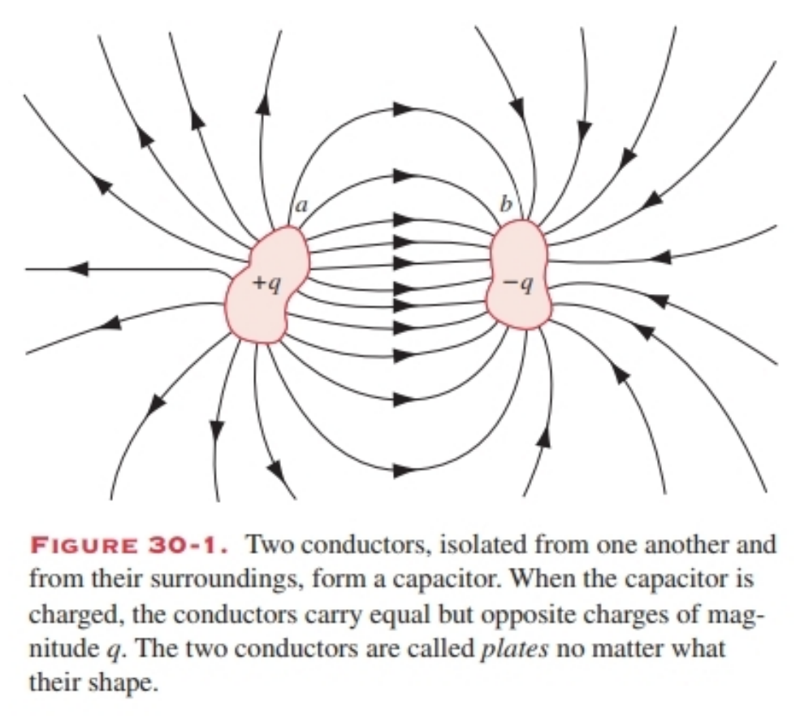
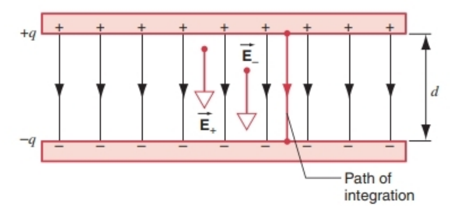
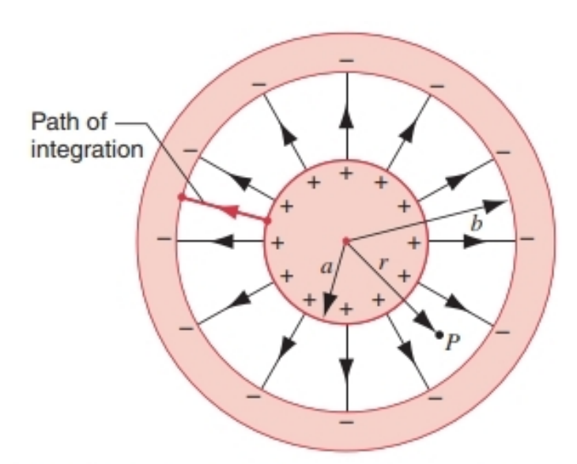
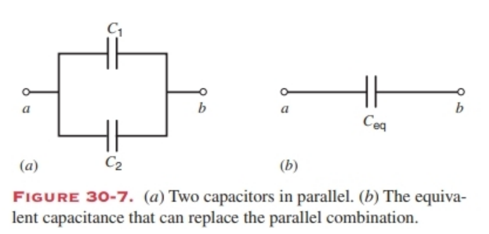
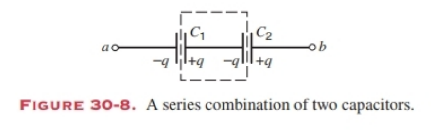

# 30 CAPACITANCE
 
## Cheatsheet

### **30-1 电容器**
- **定义**：在静电场中储存能量的装置。
- **应用**：
  - 闪光灯、激光脉冲（储能后快速释放）
  - 产生均匀电场（如平行板电容器）
  - 平滑电压波动、调谐电路（如收音机）

---

### **30-2 电容**
- **定义式**：
  $$
  q = C \cdot \Delta V
  $$
- **电容** $C$：几何量，与 $q$ 和 $\Delta V$ 无关。
- **单位**：法拉（F）
  $$
  1 \text{F} = 1 \text{C/V}
  $$
  常用单位：微法（µF）、皮法（pF）
- **示例 30-1**：RAM 电容 $C = 0.055 \text{pF}$，$\Delta V = 5.3 \text{V}$，求电子数：
  $$
  N = \frac{C \Delta V}{e} = 1.8 \times 10^6
  $$

---

### **30-3 电容的计算**
#### **1. 平行板电容器**
$$
C = \frac{\epsilon_0 A}{d}
$$
- 电场均匀，忽略边缘效应。
- $\epsilon_0 = 8.85 \times 10^{-12} \text{F/m}$

#### **2. 球形电容器**
$$
C = 4\pi\epsilon_0 \frac{ab}{b - a}
$$
- $a$：内球半径，$b$：外球壳内半径。

#### **3. 圆柱形电容器**
$$
C = 2\pi\epsilon_0 \frac{L}{\ln(b/a)}
$$
- $a$：内圆柱半径，$b$：外圆柱壳内半径。

#### **例题**
- **30-2**：$d = 1.0 \text{mm}$，$C = 1.0 \text{F}$ → $A = 1.1 \times 10^8 \text{m}^2$
- **30-3**：同轴电缆单位长度电容：
  $$
  \frac{C}{L} = \frac{2\pi\epsilon_0}{\ln(b/a)} = 21 \text{pF/m}
  $$
- **30-4**：地球电容（孤立球）：
  $$
  C = 4\pi\epsilon_0 R = 710 \mu\text{F}
  $$

---

### **30-4 电容器的串联与并联**
#### **并联**
$$
C_{\text{eq}} = C_1 + C_2 + \cdots
$$
- 电压相同，电荷分配。
- 等效电容 > 任一电容。

#### **串联**
$$
\frac{1}{C_{\text{eq}}} = \frac{1}{C_1} + \frac{1}{C_2} + \cdots
$$
- 电荷相同，电压分配。
- 等效电容 < 任一电容。

#### **例题 30-5**
- $C_1 = 12.0 \mu\text{F}$，$C_2 = 5.3 \mu\text{F}$，$C_3 = 4.5 \mu\text{F}$
- 先并后串：
  $$
  C_{12} = C_1 + C_2,\quad \frac{1}{C_{\text{eq}}} = \frac{1}{C_{12}} + \frac{1}{C_3}
  $$

---

### **30-5 电场中的能量存储**
- **储能公式**：
  $$
  U = \frac{q^2}{2C} = \frac{1}{2} C (\Delta V)^2 = \frac{1}{2} q \Delta V
  $$
- **能量密度**（真空中）：
  $$
  u = \frac{1}{2} \epsilon_0 E^2
  $$

#### **例题**
- **30-6**：两电容连接后电荷守恒，能量减少（转为热能）。
- **30-7**：孤立导体球储能：
  $$
  U = \frac{q^2}{8\pi\epsilon_0 R}
  $$
  能量密度：
  $$
  u = \frac{q^2}{32\pi^2 \epsilon_0 R^4}
  $$

---

### **30-6 含电介质的电容器**
- **电介质常数** $\kappa_e > 1$，减小电场：
  $$
  E = \frac{E_0}{\kappa_e}
  $$
- **电容增加**：
  $$
  C' = \kappa_e C
  $$
- **平行板电容器**：
  $$
  C' = \frac{\kappa_e \epsilon_0 A}{d}
  $$

#### **两种情况**
1. **电池连接**：$\Delta V$ 不变，$q$ 增加。
2. **电池断开**：$q$ 不变，$\Delta V$ 减小。

#### **高斯定律（有电介质）**
$$
\epsilon_0 \oint \kappa_e \vec{E} \cdot d\vec{A} = q_{\text{free}}
$$
- 只计自由电荷，感应电荷已包含在 $\kappa_e$ 中。

#### **例题 30-9**
- 插入部分电介质，电容、电场、电势差均变化。

---

## 🧠 **核心公式总结**
| 类型 | 电容公式 | 能量公式 |
|------|-----------|-----------|
| 平行板 | $C = \frac{\epsilon_0 A}{d}$ | $U = \frac{1}{2} C (\Delta V)^2$ |
| 球形 | $C = 4\pi\epsilon_0 \frac{ab}{b-a}$ | $u = \frac{1}{2} \epsilon_0 E^2$ |
| 圆柱形 | $C = 2\pi\epsilon_0 \frac{L}{\ln(b/a)}$ | |
| 有电介质 | $C' = \kappa_e C$ | |

### 30-1 CAPACITORS
A capacitor is a device that stores energy in an electrostatic field. A flashbulb, for example, requires a short burst of electric energy that exceeds what a battery can generally provide. A capacitor can draw energy relatively slowly (over several seconds) from the battery, and it then can release the energy rapidly (within milliseconds) through the bulb. Much larger capacitors are used to produce short laser pulses in attempts to induce thermonuclear fusion in tiny pellets of hydrogen. In this case the power level during the pulse is about $10^{14} ~W$ — about 200 times the entire electrical generating capacity of the United States, but the pulses typically last only for $10^{-9} ~s$.

Capacitors are also used to produce electric fields, such as the parallel-plate device that gives the very nearly uniform electric field that deflects beams of electrons in a TV or oscilloscope tube.

In circuits, capacitors are often used to smooth out the sudden variations in line voltage that can damage computer memories. In another application, the tuning of a radio or TV receiver is usually done by varying the capacitance of the circuit.

### 30-1 电容器
电容器是一种在静电场中储存能量的装置。例如，闪光灯需要短时间内释放的电能量，其功率通常超过电池的常规输出能力。电容器可以相对缓慢地（在几秒内）从电池汲取能量，然后通过灯泡快速释放（在毫秒内）。更大容量的电容器被用于产生短激光脉冲，试图在微小的氢 pellets 中引发热核聚变。在这种情况下，脉冲期间的功率水平约为 $10^{14} ~W$——约为美国总发电容量的200倍，但脉冲持续时间通常仅为 $10^{-9} ~s$。

电容器也用于产生电场，例如平行板电容器能产生近乎均匀的电场，可使电视或示波器管中的电子束发生偏转。

在电路中，电容器常被用于平滑线路电压的突然波动，这类波动可能会损坏计算机内存。在另一种应用中，收音机或电视接收机的调谐通常是通过改变电路的电容来实现的。

### 30-2 CAPACITANCE
Figure 30-1 shows a generalized capacitor, consisting of two conductors a and b of arbitrary shape. No matter what their geometry, these conductors are called plates. We assume that they are totally isolated from their surroundings. We further assume, for the time being, that the conductors exist in a vacuum.

A capacitor is said to be charged if its plates carry equal and opposite charges $+q$ and $-q$. Note that q is not the net charge on the capacitor, which is zero. In our discussion of capacitors, we let q represent the absolute value of the charge on either plate; that is, q represents a magnitude only, and the sign of the charge on a given plate must be specified.

We can “charge” a capacitor by connecting one of its plates to the positive terminal of a battery and the other plate to the negative terminal, as shown in Fig. 30-2. As we discuss in the next chapter, the flow of charge in an electrical circuit is analogous to the flow of fluid, and the battery serves as a “pump” for electric charge. When we connect a battery to the capacitor (by closing the switch in the circuit), the battery “pumps” electrons from the (previously uncharged) positive plate of the capacitor to the negative plate. After the battery moves a quantity of charge of magnitude q, the charge on the positive plate is $+q$ and the charge on the negative plate is $-q$.

An ideal battery maintains a constant potential difference between its terminals. The positive plate and the wire connecting it to the positive terminal of the battery are conductors, and so (under electrostatic conditions) they must be at the same potential $V_{+}$ as the positive terminal of the battery. The negative plate and the wire connecting it to the negative terminal of the battery are also conductors, and so (when the switch is closed) they must be at the same potential $V_{-}$ as the negative terminal of the battery. The potential difference $\Delta V=V_{+}-V_{-}$ between the battery terminals is the same potential difference that appears between the capacitor plates when the switch is closed. We usually describe this as the potential difference “across” the capacitor, meaning the potential difference between its plates.

Figure 30-3 shows the circuit for charging a capacitor by a battery that maintains a constant potential difference $\Delta V=V_{+}-V_{-}$ between its terminals. In a circuit, a capacitor is represented by the symbol $\parallel$, in which the two parallel lines suggest the two plates of the capacitor.

When we charge a capacitor, we find that the charge q that appears on the capacitor plates is always directly proportional to the potential difference $\Delta V$ between the plates: $q \propto \Delta V$. The capacitance C is the constant of proportionality necessary to make this relationship into an equation: 
$$q=C \Delta V . \quad(30-1)$$

The capacitance is a geometrical factor that depends on the size, shape, and separation of the plates and on the material that occupies the space between the plates (which for now we assume is a vacuum). The capacitance of a capacitor does not depend on $\Delta V$ or q.

The SI unit of capacitance that follows from Eq. 30-1 is the coulomb/volt, which is given the name farad (abbreviation F): 
$$1 farad =1 coulomb/volt.$$

The unit is named in honor of Michael Faraday who, among his other contributions, developed the concept of capacitance. The submultiples of the farad, the microfarad ($1 \mu F=10^{-6} ~F$) and the picofarad ($1 pF=10^{-12} ~F$), are more convenient units in practice. Figure 30-4 shows some capacitors in the microfarad or picofarad range that might be found in electronic or computing equipment.

**SAMPLE PROBLEM 30-1.** A storage capacitor on a random access memory (RAM) chip has a capacitance of 0.055 pF. If it is charged to 5.3 V, how many excess electrons are there on its negative plate?

**Solution** If the negative plate has $N$ excess electrons, it carries a net charge of magnitude $q = Ne$. Using Eq. 30-1, we obtain

$$
N = \frac{q}{e} = \frac{C \Delta V}{e} = \frac{(0.055 \times 10^{-12} \, \text{F})(5.3 \, \text{V})}{1.60 \times 10^{-19} \, \text{C}} = 1.8 \times 10^6 \, \text{electrons}.
$$

For electrons, this is a very small number. A speck of household dust, so tiny that it essentially never settles, contains about $10^{17}$ electrons (and the same number of protons).

#### Analogy with Fluid Flow (Optional)
In situations involving electric circuits, it is often useful to draw analogies between the movement of electric charge and the movement of material particles such as occurs in fluid flow. In the case of a capacitor, an analogy can be made between a capacitor carrying a charge $q$ and a rigid container of volume $v$ (we use $v$ rather than $V$ for volume so as not to confuse it with potential difference) containing $n$ moles of an ideal gas. The gas pressure $p$ is directly proportional to $n$ for a fixed temperature, according to the ideal gas law (Eq. 21-13)

$$ n = \left( \frac{v}{RT} \right) p. $$

For the capacitor (Eq. 30-1)

$$ q = C \Delta V. $$

Comparison shows that the capacitance $C$ of the capacitor is analogous to the volume $v$ of the container, assuming a fixed temperature for the gas. In fact, the word “capacitor” brings to mind the word “capacity,” in the same sense that the volume of a container for gas has a certain “capacity.”

We can force more gas into the container by imposing a higher pressure, just as we can force more charge into the capacitor by imposing a higher voltage. Note that any amount of charge can be put on the capacitor, and any mass of gas can be put in the container, up to certain limits. These correspond to electrical breakdown (“arcing over”) for the capacitor and to rupture of the walls for the container.

---

### 30-2 电容

图30-1展示了一个广义上的电容器，它由两个任意形状的导体a和b组成。无论这两个导体的几何形状如何，它们都被称为极板。我们假设这两个极板与周围环境完全隔离，且目前暂假设导体处于真空中。

当电容器的两个极板带有等量异号电荷$+q$和$-q$时，我们称该电容器已带电。需注意，q并非电容器的净电荷（电容器净电荷为零）。在讨论电容器时，q代表任意一个极板上电荷的绝对值，即q仅表示大小，特定极板上电荷的正负性需单独说明。

我们可以按图30-2所示的方式给电容器“充电”：将电容器的一个极板连接到电池的正极，另一个极板连接到电池的负极。正如我们将在下一章讨论的，电路中电荷的流动与流体的流动类似，而电池则起到“泵”的作用，推动电荷移动。当我们将电池与电容器连接（闭合电路中的开关）时，电池会将电子从（原本不带电的）电容器正极板“泵”到负极板。当电池移动的电荷量大小为q时，正极板的电荷量变为$+q$，负极板的电荷量变为$-q$。

理想电池的两极之间能维持恒定的电势差。正极板以及连接正极板与电池正极的导线均为导体，因此（在静电条件下）它们的电势必须与电池正极的电势$V_{+}$相同；负极板以及连接负极板与电池负极的导线也为导体，因此（开关闭合时）它们的电势必须与电池负极的电势$V_{-}$相同。电池两极之间的电势差$\Delta V=V_{+}-V_{-}$，与开关闭合时电容器两极板之间的电势差相等。我们通常将其描述为电容器“两端”的电势差，即指电容器两极板之间的电势差。

图30-3展示了用电池给电容器充电的电路，该电池能在其两极之间维持恒定的电势差$\Delta V=V_{+}-V_{-}$。在电路中，电容器用符号“$\parallel$”表示，其中两条平行线象征着电容器的两个极板。

当我们给电容器充电时，会发现极板上出现的电荷量q始终与极板间的电势差$\Delta V$成正比，即$q \propto \Delta V$。电容C是使该比例关系成为等式所需的比例常数，其表达式为：
$$q=C \Delta V . \quad(30-1)$$

电容是一个几何量，它取决于极板的大小、形状、间距以及极板间填充的材料（目前暂假设为真空）。电容器的电容与电势差$\Delta V$和电荷量q均无关。

由式（30-1）可推出电容的国际单位制（SI）单位为库仑/伏特（C/V），该单位被命名为法拉（简称法，符号为F），即：
$$1\text{法拉}=1\text{库仑/伏特}$$

法拉这一单位是为了纪念迈克尔·法拉第（Michael Faraday），他在诸多贡献中提出了电容的概念。在实际应用中，法拉的次级单位——微法（$1 \mu F=10^{-6} ~F$）和皮法（$1 pF=10^{-12} ~F$）更为常用。图30-4展示了一些电子设备或计算机设备中可能用到的、容量在微法或皮法量级的电容器。

**示例问题30-1**：随机存取存储器（RAM）芯片上的一个存储电容器，电容为0.055皮法（pF）。若将其充电至5.3伏，其负极板上有多少多余的电子？

**解答**：如果负极板有$N$个多余电子，其携带的净电荷量大小为$q = Ne$。利用式30-1，可得：

$$
N = \frac{q}{e} = \frac{C \Delta V}{e} = \frac{(0.055 \times 10^{-12} \, \text{F})(5.3 \, \text{V})}{1.60 \times 10^{-19} \, \text{C}} = 1.8 \times 10^6 \, \text{个电子}
$$

对于电子来说，这个数量非常小。一粒家用灰尘，小到基本上从不沉降，都含有约$10^{17}$个电子（以及相同数量的质子）。

#### 与流体流动的类比（选学）
在涉及电路的情况中，将电荷的运动与诸如流体流动中发生的物质粒子的运动进行类比往往很有用。就电容器而言，我们可以在带有电荷量$q$的电容器和容积为$v$的刚性容器（我们用$v$而非$V$表示容积，以免与电势差混淆）之间进行类比，该容器中装有$n$摩尔的理想气体。根据理想气体定律（式21-13），对于固定温度，气体压强$p$与$n$成正比：

$$ n = \left( \frac{v}{RT} \right) p. $$

对于电容器（式30-1）：

$$ q = C \Delta V. $$

对比可知，假设气体温度固定，电容器的电容$C$与容器的容积$v$是类似的。事实上，“电容器（capacitor）”一词会让人想到“容量（capacity）”这个词，这和储气容器的容积具有一定“容量”的意义是一样的。

我们可以通过施加更高的压强将更多气体压入容器，就像我们可以通过施加更高的电压将更多电荷“压入”电容器一样。需要注意的是，电容器可以存储任意数量的电荷，容器也可以装入任意质量的气体，但都有一定的限度。这些限度分别对应电容器的电击穿（“跳弧”）和容器壁的破裂。

### 30-3 CALCULATING THE CAPACITANCE
Our goal in this section is to calculate the capacitance of a capacitor from its geometry. We do this using the following procedure. (1) We first find the electric field in the region between the plates, using methods such as those described in Section 26-4. (2) We then use Eq. 28-15 to find the potential difference between the positive and negative plates by integrating the electric field along any convenient path connecting the plates: 
$$\Delta V=V_{+}-V_{-}=-\int_{-}^{+} \vec{E} \cdot d \vec{s}=\int_{+}^{-} \vec{E} \cdot d \vec{s} . \quad(30-2)$$

(3) The outcome of Eq. 30-2 will involve the magnitude of the charge q on the right-hand side. Using Eq. 30-1, we can then find $C=q / \Delta V$.

As we have defined it, $\Delta V$ is a positive number. Since q is an absolute magnitude, the capacitance C will always be positive.

We now illustrate this method with several examples.

#### A Parallel-Plate Capacitor
Figure 30-5 shows a capacitor in which the two flat plates are very large and very close together; that is, the separation d is much smaller than the length or width of the plates. We can neglect the “fringing” of the electric field that occurs near the edges of the plates and assume that the electric field has the same magnitude and direction everywhere in the volume between the plates.

We obtained the electric field for a single large uniformly charged disk at points near its center in Section 26-4: $E=\sigma / 2 \epsilon_{0}$. If the capacitor plates are very large, their shape is not important, and we can assume that the electric field due to each plate has this magnitude. The net electric field is the sum of the fields due to the two plates: $\overrightarrow{E}=\overrightarrow{E}_{+}+\overrightarrow{E}_{-}$. As Fig. 30-5 shows, the fields due to the positive and negative plates have the same direction, so we can write 
$$E=E_{+}+E_{-}=\sigma / 2 \epsilon_{0}+\sigma / 2 \epsilon_{0}=\sigma / \epsilon_{0} . \quad(30-3)$$

Using $\sigma=q / A$, where A is the surface area of each plate, and substituting Eq. 30-3 into Eq. 30-2, we obtain 
$$\Delta V=\int_{+}^{-} E d s=\frac{q}{\epsilon_{0} A} \int_{+}^{-} d s=\frac{q d}{\epsilon_{0} A}, \quad(30-4)$$
where we have chosen an integration path along one of the lines of the electric field, so that $\overrightarrow{E}$ and $d \overrightarrow{s}$ are parallel (see Fig. 30-5).

The capacitance is then obtained from Eq. 30-1: $C=q / \Delta V$ or 
$$C=\frac{\epsilon_{0} A}{d} \quad (\text{parallel-plate capacitor}). \quad(30-5)$$

You can see from this equation why we say that the capacitance depends on geometrical factors, in this case the plate separation d and area A. The capacitance does not depend on the voltage difference between the plates or the charge carried by the plates.

Note that the right-hand side of Eq. 30-5 has the form of $\epsilon_{0}$ times a quantity with the dimension of length ($A/d$). We will find that all expressions for capacitance have essentially this same form, which suggests that the units of $\epsilon_{0}$ can be expressed as capacitance divided by length: 
$$\epsilon_{0}=8.85 × 10^{-12} F / m=8.85 pF / m .$$

These units for $\epsilon_{0}$ are often more useful for calculations of capacitance than our previous (and equivalent) units of $C^{2} / N \cdot m^{2}$.

#### A Spherical Capacitor
Figure 30-6 shows a cross section of a spherical capacitor, in which the inner conductor is a solid sphere of radius a, and the outer conductor is a hollow spherical shell of inner radius b. We assume that the inner sphere carries a charge $+q$ and that the outer sphere has a charge $-q$. From our analysis of conductors using Gauss’ law (see Section 27-6), we know that the charge on the inner conductor resides on its surface and that the charge on the outer conductor resides on its inner surface. (Draw a spherical Gaussian surface of radius slightly larger than b; the surface lies entirely within the outer conductor, so $E=0$ everywhere on the surface and the flux through the surface is zero. Therefore the surface encloses no net charge, as Fig. 30-6 shows.)

In the region $a<r<b$ we can use Gauss’ law to determine that, in the region between the conductors, the electric field depends only on the charge on the inner sphere, and that this field is the same as that of a point charge at its center (recall the shell theorems discussed in Section 27-5). We therefore have 
$$E=\frac{1}{4 \pi \epsilon_{0}} \frac{q}{r^{2}} \quad (a<r<b) . \quad(30-6)$$

Substituting this expression for the electric field into Eq. 30-2 and integrating along the path shown in Fig. 30-6 from the positive plate to the negative plate, we obtain 
$$\begin{aligned} \Delta V=\int_{+}^{-} E d s=\int_{a}^{b} \frac{q}{4 \pi \epsilon_{0}} \frac{d r}{r^{2}} & =\frac{q}{4 \pi \epsilon_{0}}\left(\frac{1}{a}-\frac{1}{b}\right) \\ & =\frac{q}{4 \pi \epsilon_{0}} \frac{b-a}{a b} . \quad(30-7) \end{aligned}$$

Because the path of integration is in the radial direction, we have $\overrightarrow{E} \cdot d \overrightarrow{s}=E d s$ and $d s=d r$.

Using $C=q / \Delta V$, we now find 
$$C=4 \pi \epsilon_{0} \frac{a b}{b-a} \quad (\text{spherical capacitor}). \quad(30-8)$$

Note that the capacitance again has the form of $\epsilon_{0}$ times a quantity with the dimension of length.

#### A Cylindrical Capacitor
Figure 30-6 can also represent the cross section of a cylindrical capacitor, in which the inner conductor is a solid rod of radius a carrying a charge $+q$ uniformly distributed over its surface, and the outer conductor is a coaxial cylindrical shell of inner radius b carrying a charge of $-q$ uniformly distributed over its inner surface. The capacitor has length L, and we assume $L \gg b$ so that, as was the case with the parallel-plate capacitor, we can neglect the “fringing” field at the ends of the capacitor.

Just as we used Gauss’ law in the spherical geometry to obtain the two shell theorems, we can obtain two similar results in the cylindrical geometry. If only the uniformly charged outer cylindrical conductor were present, we could construct a Gaussian surface in the shape of a long cylinder of radius $r<b$ having the same axis as the outer cylinder. This surface encloses no net charge, so we conclude that $E=0$ everywhere on the Gaussian surface. As in the case of the spherical shell, a uniformly charged cylindrical shell produces no electric field in its interior. Using a cylindrical Gaussian surface with $r>a$, we can deduce that the inner cylinder behaves just like a uniform line of charge, for which the field points radially outward from the axis and has a magnitude that we calculated in Section 26-4 (Eq. 26-17): 
$$E=\frac{1}{2 \pi \epsilon_{0}} \frac{q}{L r} \quad (a<r<b), \quad(30-9)$$
where we have replaced the linear charge density $\lambda$ with $q/L$ and the distance y with the radial coordinate r. Equation 30-2 now gives
$$\begin{aligned} \Delta V=\int_{+}^{-} E d s & =\frac{q}{2 \pi \epsilon_{0} L} \int_{a}^{b} \frac{d r}{r} \\ & =\frac{q}{2 \pi \epsilon_{0} L} \ln \left(\frac{b}{a}\right) . \quad(30-10) \end{aligned}$$

As we did for the spherical capacitor, we have chosen an integrating path from the positive plate to the negative plate in the radial direction, so $\overrightarrow{E} \cdot d \overrightarrow{s}=E d s$ and $d s=d r$.

Equation 30-1 now gives the capacitance: 
$$C=2 \pi \epsilon_{0} \frac{L}{\ln (b / a)} \quad (\text{cylindrical capacitor}). \quad(30-11)$$

Note once again that only geometrical factors appear in this equation and that the capacitance has the form of $\epsilon_{0}$ multiplied by a quantity with the dimension of length.

#### SAMPLE PROBLEM 30-2
The plates of a parallel-plate capacitor are separated by a distance $d=1.0 ~mm$. What must be the plate area if the capacitance is to be 1.0 F?

**Solution** From Eq. 30-5 we have 
$$A=\frac{C d}{\epsilon_{0}}=\frac{(1.0 F)\left(1.0 × 10^{-3} m\right)}{8.85 × 10^{-12} F / m}=1.1 × 10^{8} m^{2} .$$

This is the area of a square more than 10 km on edge. The farad is indeed a large unit. Modern technology, however, has permitted the construction of 1-F capacitors of very modest size. These “Supercaps” are used as backup voltage sources for computers; they can maintain the computer memory for up to 30 days in case of power failure.

#### SAMPLE PROBLEM 30-3
The space between the conductors of a long coaxial cable, used to transmit TV signals, has an inner radius $a=0.15 ~mm$ and an outer radius $b=2.1 ~mm$. What is the capacitance per unit length of this cable?

**Solution** From Eq. 30-11 we have 
$$\frac{C}{L}=\frac{2 \pi \epsilon_{0}}{\ln (b / a)}=\frac{(2 \pi)(8.85 pF / m)}{\ln (2.1 mm / 0.15 mm)}=21 pF / m .$$

#### SAMPLE PROBLEM 30-4
What is the capacitance of the Earth, viewed as an isolated conducting sphere of radius $R=6370 ~km$?

**Solution** We can assign a capacitance to a single isolated spherical conductor by assuming that the “missing plate” is a conducting sphere of infinite radius.

If we let $b \to \infty$ in Eq. 30-8 and substitute R for a, we find 
$$C=4 \pi \epsilon_{0} R \quad (\text{isolated sphere}), \quad(30-12)$$

Substituting, we obtain 
$$\begin{aligned} C & =(4 \pi)\left(8.85 × 10^{-12} F / m\right)\left(6.37 × 10^{6} m\right) \\ & =7.1 × 10^{-4} F=710 \mu F . \end{aligned}$$

A tiny 1-F Supercap has a capacitance that is about 1400 times larger than that of the Earth.

---

### 30-3 电容的计算
本节的目标是根据电容器的几何结构计算其电容，具体可通过以下步骤实现：（1）首先采用第26-4节中介绍的方法，求解极板间区域的电场；（2）然后利用式（28-15），沿连接两极板的任意便捷路径对电场进行积分，得到正、负极板间的电势差：
$$\Delta V=V_{+}-V_{-}=-\int_{-}^{+} \vec{E} \cdot d \vec{s}=\int_{+}^{-} \vec{E} \cdot d \vec{s} . \quad(30-2)$$

（3）式（30-2）的计算结果中，右侧会包含电荷量q的大小。结合式（30-1），即可得到电容 $C=q / \Delta V$。

根据我们的定义，$\Delta V$ 为正值，而q是电荷量的绝对值，因此电容C始终为正值。

下面我们通过几个例子来具体说明该计算方法。

#### 平行板电容器

图30-5所示的电容器中，两块平板极板面积很大且间距很小，即极板间距d远小于极板的长度或宽度。此时可忽略极板边缘处电场的“边缘效应”，假设极板间体积内任意点的电场大小和方向均相同。

在第26-4节中，我们已求得单个大尺寸均匀带电圆盘在其中心附近区域产生的电场为 $E=\sigma / 2 \epsilon_{0}$。对于面积很大的电容器极板，其形状的影响可忽略，可认为每个极板产生的电场均满足该表达式。两极板产生的电场叠加后得到总电场：$\overrightarrow{E}=\overrightarrow{E}_{+}+\overrightarrow{E}_{-}$。由图30-5可知，正、负极板产生的电场方向相同，因此总电场可表示为：
$$E=E_{+}+E_{-}=\sigma / 2 \epsilon_{0}+\sigma / 2 \epsilon_{0}=\sigma / \epsilon_{0} . \quad(30-3)$$

其中，$\sigma=q / A$（A为单个极板的表面积）。将式（30-3）代入式（30-2），可得：
$$\Delta V=\int_{+}^{-} E d s=\frac{q}{\epsilon_{0} A} \int_{+}^{-} d s=\frac{q d}{\epsilon_{0} A}, \quad(30-4)$$
此处选择的积分路径沿电场线方向，因此$\overrightarrow{E}$与$d \overrightarrow{s}$方向平行（见图30-5）。

结合式（30-1）$C=q / \Delta V$，可得到平行板电容器的电容表达式：
$$C=\frac{\epsilon_{0} A}{d} \quad (\text{平行板电容器}). \quad(30-5)$$

由该式可见，电容确实取决于几何因素——此处为极板间距d和极板面积A，而与极板间的电势差或极板所带电荷量无关。

需注意，式（30-5）右侧的形式为$\epsilon_{0}$乘以一个具有长度量纲的物理量（$A/d$）。后续将发现，所有电容表达式本质上均为此形式，这表明$\epsilon_{0}$的单位也可表示为“电容/长度”：
$$\epsilon_{0}=8.85 × 10^{-12} \, \text{F/m}=8.85 \, \text{pF/m} .$$

在电容计算中，$\epsilon_{0}$的这一单位形式往往比之前使用的（与之等效的）$C^{2}/(N \cdot m^{2})$更便捷。

#### 球形电容器

图30-6展示了球形电容器的横截面：内导体为半径为a的实心球，外导体为内半径为b的空心球壳。假设内球带正电$+q$，外球壳带负电$-q$。根据第27-6节中利用高斯定理对导体的分析可知，内导体的电荷仅分布在其表面，外导体的电荷仅分布在其内壁（作一个半径略大于b的球形高斯面，该高斯面完全处于外导体内部，因此面上各点电场$E=0$，电通量为零，故高斯面内包围的净电荷为零，如图30-6所示）。

在区域$a<r<b$内，利用高斯定理可得出：极板间电场仅由内球的电荷决定，且该电场与将内球电荷集中于球心的点电荷产生的电场相同（回顾第27-5节讨论的球壳定理）。因此，电场表达式为：
$$E=\frac{1}{4 \pi \epsilon_{0}} \frac{q}{r^{2}} \quad (a<r<b) . \quad(30-6)$$

将该电场表达式代入式（30-2），沿图30-6所示路径从正极板（内球）积分至负极板（外球壳内壁），可得：
$$\begin{aligned} \Delta V=\int_{+}^{-} E d s=\int_{a}^{b} \frac{q}{4 \pi \epsilon_{0}} \frac{d r}{r^{2}} & =\frac{q}{4 \pi \epsilon_{0}}\left(\frac{1}{a}-\frac{1}{b}\right) \\ & =\frac{q}{4 \pi \epsilon_{0}} \frac{b-a}{a b} . \quad(30-7) \end{aligned}$$

由于积分路径沿径向，因此$\overrightarrow{E} \cdot d \overrightarrow{s}=E d s$，且$d s=d r$。

结合$C=q / \Delta V$，可得到球形电容器的电容表达式：
$$C=4 \pi \epsilon_{0} \frac{a b}{b-a} \quad (\text{球形电容器}). \quad(30-8)$$

可见，球形电容器的电容同样具有“$\epsilon_{0}$乘以长度量纲物理量”的形式。

#### 圆柱形电容器
图30-6也可表示圆柱形电容器的横截面：内导体为半径为a的实心圆柱，表面均匀分布正电荷$+q$；外导体为与内圆柱共轴的圆柱壳，其内壁半径为b，均匀分布负电荷$-q$。设电容器长度为L，且满足$L \gg b$，因此与平行板电容器类似，可忽略电容器两端的电场边缘效应。

与球形几何中利用高斯定理推导球壳定理类似，在柱形几何中也可得到两个类似结论：若仅存在均匀带电的外圆柱壳，作一个半径$r<b$、与外圆柱壳共轴的长圆柱高斯面，该高斯面内包围的净电荷为零，故面上各点电场$E=0$——即均匀带电圆柱壳内部无电场；作半径$r>a$的柱形高斯面，可推知内圆柱的电场等效于均匀线电荷的电场，电场方向沿径向向外，其大小可由第26-4节中的式（26-17）求得：
$$E=\frac{1}{2 \pi \epsilon_{0}} \frac{q}{L r} \quad (a<r<b), \quad(30-9)$$
式中，线电荷密度$\lambda$替换为$q/L$，距离y替换为径向坐标r。将其代入式（30-2），可得：
$$\begin{aligned} \Delta V=\int_{+}^{-} E d s & =\frac{q}{2 \pi \epsilon_{0} L} \int_{a}^{b} \frac{d r}{r} \\ & =\frac{q}{2 \pi \epsilon_{0} L} \ln \left(\frac{b}{a}\right) . \quad(30-10) \end{aligned}$$

与球形电容器类似，此处积分路径沿径向从正极板（内圆柱）指向负极板（外圆柱壳内壁），因此$\overrightarrow{E} \cdot d \overrightarrow{s}=E d s$，且$d s=d r$。

结合式（30-1），可得到圆柱形电容器的电容表达式：
$$C=2 \pi \epsilon_{0} \frac{L}{\ln (b / a)} \quad (\text{圆柱形电容器}). \quad(30-11)$$

再次可见，该式中仅包含几何因素，且电容形式仍为“$\epsilon_{0}$乘以长度量纲物理量”。

#### 例题30-2
某平行板电容器的极板间距$d=1.0 \, \text{mm}$，若要使该电容器的电容为1.0 F，极板面积应为多大？

**解答** 根据式（30-5）可得：
$$A=\frac{C d}{\epsilon_{0}}=\frac{(1.0 \, \text{F}) \times (1.0 × 10^{-3} \, \text{m})}{8.85 × 10^{-12} \, \text{F/m}}=1.1 × 10^{8} \, \text{m}^2 .$$

这一面积相当于边长超过10 km的正方形面积，可见法拉是一个非常大的单位。不过，现代技术已能制造出体积小巧的1F电容器，这类“超级电容器”（Supercap）可用作计算机的备用电源，在断电时可维持计算机内存长达30天。

#### 例题30-3
用于传输电视信号的同轴电缆，其内外导体间的内半径$a=0.15 \, \text{mm}$、外半径$b=2.1 \, \text{mm}$，求该电缆单位长度的电容。

**解答** 根据式（30-11）可得：
$$\frac{C}{L}=\frac{2 \pi \epsilon_{0}}{\ln (b / a)}=\frac{(2 \pi) \times (8.85 \, \text{pF/m})}{\ln (2.1 \, \text{mm} / 0.15 \, \text{mm})}=21 \, \text{pF/m} .$$

#### 例题30-4
将地球视为半径$R=6370 \, \text{km}$的孤立导体球，其电容为多大？

**解答** 对于单个孤立球形导体，可假设其“缺失的极板”是一个半径无穷大的导体球，从而为其赋予电容定义。

令式（30-8）中$b \to \infty$，并将a替换为地球半径R，可得孤立导体球的电容表达式：
$$C=4 \pi \epsilon_{0} R \quad (\text{孤立导体球}), \quad(30-12)$$

代入数值计算：
$$\begin{aligned} C & =(4 \pi) \times (8.85 × 10^{-12} \, \text{F/m}) \times (6.37 × 10^{6} \, \text{m}) \\ & =7.1 × 10^{-4} \, \text{F}=710 \, \mu F . \end{aligned}$$

一个体积小巧的1F超级电容器，其电容约为地球电容的1400倍。

### 30-4 CAPACITORS IN SERIES AND PARALLEL
In analyzing electric circuits, it is often desirable to know the equivalent capacitance of two or more capacitors that are connected in a certain way. By “equivalent capacitance” we mean the capacitance of a single capacitor that can be substituted for the combination with no change in the operation of the rest of the circuit.

#### Capacitors Connected in Parallel
Figure 30-7a shows two capacitors connected in parallel. There are three properties that characterize a parallel connection of circuit elements. (1) In traveling from a to b, we can take any of several (two, in this case) parallel paths, each of which goes through only one of the parallel elements. (2) When a battery of potential difference $\Delta V$ is connected across the combination (that is, one terminal of the battery is connected to point a in Fig. 30-7a and the other terminal to point b), the same potential difference $\Delta V$ appears across each element of the parallel connection. The wires and capacitor plates are conductors and therefore equipotentials under electrostatic conditions. The potential at a appears on the wires connected to a and on the two left-hand capacitor plates; similarly, the potential at b appears on all the wires connected to b and on the two right-hand capacitor plates. (3) The total charge that is delivered by the battery to the combination is shared among the elements; some charge “pumped” by the battery ends up on $C_{1}$ and some on $C_{2}$.

With these principles in mind, we can now find the equivalent capacitance $C_{eq}$ that gives the same total capacitance between points a and b as indicated in Fig. 30-7b. We assume a battery of potential difference $\Delta V$ to be connected between points a and b. For each capacitor, we can write (using Eq. 30-1) 
$$q_{1}=C_{1} \Delta V \quad \text{and} \quad q_{2}=C_{2} \Delta V. \quad(30-13)$$

In writing these equations, we have used the same value of the potential difference across the capacitors, in accordance with the second characteristic of a parallel connection stated previously. The battery extracts charge q from one side of the circuit and moves it to the other side. This charge is shared among the two elements according to the third characteristic, such that the sum of the charges on the two capacitors equals the total charge: 
$$q=q_{1}+q_{2} . \quad(30-14)$$

If the parallel combination were replaced with a single capacitor $C_{eq}$ and connected to the same battery, the requirement that the circuit operate in identical fashion means that the same charge q must be transferred by the battery. That is, for the equivalent capacitor, 
$$q=C_{eq} \Delta V . \quad(30-15)$$

Substituting Eq. 30-14 into Eq. 30-15, and then putting Eqs. 30-13 into the result, we obtain 
$$C_{eq} \Delta V=C_{1} \Delta V+C_{2} \Delta V$$
or 
$$C_{eq}=C_{1}+C_{2} . \quad(30-16)$$

If we have more than two capacitors in parallel, we can first replace $C_{1}$ and $C_{2}$ with their equivalent $C_{12}$, determined according to Eq. 30-16. We then find the equivalent capacitance of $C_{12}$ and the next parallel capacitor $C_{3}$. Continuing this process, we can extend Eq. 30-16 to any number of capacitors connected in parallel: 
$$C_{eq}=\sum_{n} C_{n} \quad (\text{parallel combination}). \quad(30-17)$$

That is, to find the equivalent capacitance of a parallel combination, simply add the individual capacitances. Note that the equivalent capacitance is always larger than the largest capacitance in the parallel combination. The parallel combination can store more charge than any one of the individual capacitors.

#### Capacitors Connected in Series
Figure 30-8 shows two capacitors connected in series. There are three properties that distinguish a series connection of circuit elements. (1) If we attempt to travel from a to b, we must pass through all the circuit elements in succession. (2) When a battery is connected across the combination, the potential difference $\Delta V$ of the battery equals the sum of the potential differences across each of the elements. (3) The charge q delivered to each element of the series combination has the same value.

To understand this last property, note the region of Fig. 30-8 enclosed by the dashed line. Let us assume the battery puts a charge $-q$ on the left-hand plate of $C_{1}$. Since a capacitor carries equal and opposite charges on its plates, a charge $+q$ appears on the right-hand plate of $C_{1}$. However, the H-shaped conductor enclosed by the dashed line is electrically isolated from the rest of the circuit; initially it carries no net charge, and no charge can be transferred to it. If a charge $+q$ appears on the right-hand plate of $C_{1}$, then a charge $-q$ must appear on the left-hand plate of $C_{2}$. That is, $n(=q/e)$ electrons move from the right-hand plate of $C_{1}$ to the left-hand plate of $C_{2}$. If there were more than two capacitors in series, a similar argument could be made across the entire line of capacitors, the result being that the left-hand plate of every capacitor in the series connection carries a charge of one sign, and the right-hand plate of every capacitor in the series connection carries a charge of equal magnitude and opposite sign.

For the individual capacitors we can write, using Eq. 30-1, 
$$\Delta V_{1}=\frac{q}{C_{1}} \quad \text{and} \quad \Delta V_{2}=\frac{q}{C_{2}}, \quad(30-18)$$
with the same charge q on each capacitor but different potential differences across each. According to the second property of a series connection, we have 
$$\Delta V=\Delta V_{1}+\Delta V_{2} . \quad(30-19)$$

We seek the equivalent capacitance $C_{eq}$ that can replace the combination, such that the battery would move the same amount of charge: 
$$\Delta V=\frac{q}{C_{eq}} . \quad(30-20)$$

Substituting Eq. 30-19 into Eq. 30-20 and then using Eqs. 30-18, we obtain 
$$\frac{q}{C_{eq}}=\frac{q}{C_{1}}+\frac{q}{C_{2}},$$
or 
$$\frac{1}{C_{eq}}=\frac{1}{C_{1}}+\frac{1}{C_{2}} . \quad(30-21)$$

If we have several capacitors in series, we can use Eq. 30-21 to find the equivalent capacitance $C_{12}$ of the first two. We then find the equivalent capacitance of $C_{12}$ and the next capacitor in series, $C_{3}$. Continuing in this way, we find the equivalent capacitance of any number of capacitors in series, 
$$\frac{1}{C_{eq}}=\sum_{n} \frac{1}{C_{n}} \quad (\text{series combination}). \quad(30-22)$$

That is, to find the equivalent capacitance of a series combination, take the reciprocal of the sum of the reciprocals of the individual capacitances. Note that the equivalent capacitance of the series combination is always smaller than the smallest individual capacitance in the series.

Occasionally, capacitors are connected in ways that are not immediately identifiable as series or parallel combinations. As Sample Problem 30-5 shows, such combinations can often (but not always) be broken down into smaller units that can be analyzed as series or parallel connections.

#### SAMPLE PROBLEM 30-5
(a) Find the equivalent capacitance of the combination shown in Fig. 30-9a, with $C_{1}=12.0 \, \mu F$, $C_{2}=5.3 \, \mu F$, and $C_{3}=4.5 \, \mu F$. (b) A potential difference $\Delta V=12.5 \, V$ is applied to the terminals in Fig. 30-9a. What is the charge on $C_{1}$?

**Solution (a)** Capacitors $C_{1}$ and $C_{2}$ are in parallel. From Eq. 30-16, their equivalent capacitance is 
$$C_{12}=C_{1}+C_{2}=12.0 \, \mu F+5.3 \, \mu F=17.3 \, \mu F .$$

In Fig. 30-9b, $C_{1}$ and $C_{2}$ have been replaced by their parallel combination, $C_{12}$. As the figure shows, $C_{12}$ and $C_{3}$ are in series. From Eq. 30-21, the final equivalent combination (see Fig. 30-9c) is found from 
$$\frac{1}{C_{123}}=\frac{1}{C_{12}}+\frac{1}{C_{3}}=\frac{1}{17.3 \, \mu F}+\frac{1}{4.5 \, \mu F}=0.280 \, \mu F^{-1},$$

or 
$$C_{123}=\frac{1}{0.280 \, \mu F^{-1}}=3.57 \, \mu F .$$

**(b)** We treat the equivalent capacitors $C_{12}$ and $C_{123}$ exactly as we would real capacitors having that capacitance. The charge on $C_{123}$ in Fig. 30-9c is then 
$$q_{123}=C_{123} \Delta V=(3.57 \, \mu F)(12.5 \, V)=44.6 \, \mu C .$$

This same charge exists on each capacitor in the series combination of Fig. 30-9b. The potential difference across $C_{12}$ in that figure is then 
$$\Delta V_{12}=\frac{q_{12}}{C_{12}}=\frac{44.6 \, \mu C}{17.3 \, \mu F}=2.58 \, V .$$

This same potential difference appears across $C_{1}$ in Fig. 30-9a, so that 
$$q_{1}=C_{1} \Delta V_{1}=(12 \, \mu F)(2.58 \, V)=31 \, \mu C$$

---

### 30-4 电容器的串联与并联
在分析电路时，我们通常需要知道两个或多个电容器以特定方式连接后的等效电容。“等效电容”指的是：用一个单一电容器替代该电容器组合后，电路其余部分的工作状态不受影响，这个单一电容器的电容即为等效电容。

#### 电容器的并联

图30-7a展示了两个电容器的并联连接。电路元件的并联连接具有三个特征：（1）从a点到b点的路径中，可选择任意一条并联支路（本题中为两条），每条支路仅包含一个并联元件；（2）当将电势差为$\Delta V$的电池接在该组合两端（即电池一端接图30-7a中的a点，另一端接b点）时，并联连接中的每个元件两端的电势差均为$\Delta V$。由于导线和电容器极板均为导体，在静电条件下它们是等势体：a点的电势会传递到与a相连的导线及两个电容器的左极板上；同理，b点的电势会传递到与b相连的导线及两个电容器的右极板上；（3）电池向该组合输送的总电荷量会在各元件间分配——电池“泵出”的电荷一部分流向$C_{1}$，另一部分流向$C_{2}$。

基于上述原理，我们可求出图30-7b中a、b两点间的等效电容$C_{eq}$（其总电容效果与原并联组合一致）。假设在a、b两点间接一个电势差为$\Delta V$的电池，根据式（30-1），每个电容器的电荷量可表示为：
$$q_{1}=C_{1} \Delta V \quad \text{且} \quad q_{2}=C_{2} \Delta V. \quad(30-13)$$

上述方程的推导依据了并联连接的第二个特征——各电容器两端电势差相同。电池从电路一侧抽取电荷量q，并将其转移到另一侧；根据第三个特征，该总电荷量会在两个电容器间分配，因此两个电容器的电荷量之和等于总电荷量：
$$q=q_{1}+q_{2} . \quad(30-14)$$

若用一个等效电容为$C_{eq}$的单一电容器替代该并联组合，并接在同一电池上，为保证电路工作状态不变，电池转移的总电荷量仍需为q。对等效电容器而言，有：
$$q=C_{eq} \Delta V . \quad(30-15)$$

将式（30-14）代入式（30-15），再将式（30-13）代入结果，可得：
$$C_{eq} \Delta V=C_{1} \Delta V+C_{2} \Delta V$$
即 
$$C_{eq}=C_{1}+C_{2} . \quad(30-16)$$

若并联的电容器多于两个，可先根据式（30-16）求出$C_{1}$与$C_{2}$的等效电容$C_{12}$，再求$C_{12}$与下一个并联电容器$C_{3}$的等效电容。以此类推，可将式（30-16）推广到任意数量电容器的并联情况：
$$C_{eq}=\sum_{n} C_{n} \quad (\text{并联组合}). \quad(30-17)$$

也就是说，求并联组合的等效电容时，只需将各个电容器的电容相加即可。需注意，并联组合的等效电容始终大于组合中最大的单个电容，因此并联组合能储存比任意一个单个电容器更多的电荷。

#### 电容器的串联

图30-8展示了两个电容器的串联连接。电路元件的串联连接具有三个特征：（1）从a点到b点的路径中，必须依次经过所有电路元件；（2）当电池接在该组合两端时，电池的总电势差$\Delta V$等于各元件两端电势差之和；（3）串联组合中每个元件所带的电荷量q大小相同。

要理解第三个特征，可观察图30-8中虚线包围的区域：假设电池在$C_{1}$的左极板上施加电荷量$-q$，由于电容器两极板带等量异号电荷，$C_{1}$的右极板会出现电荷量$+q$。但虚线包围的“H形”导体与电路其余部分电隔离——初始时它不带净电荷，且无法接收外部转移的电荷。因此，若$C_{1}$右极板带$+q$，则$C_{2}$的左极板必须带$-q$，即有$n(=q/e)$个电子从$C_{1}$的右极板转移到$C_{2}$的左极板。若串联的电容器多于两个，对整个串联链进行类似分析可发现：串联连接中每个电容器的左极板带一种符号的电荷，右极板带等量异号的电荷。

根据式（30-1），每个串联电容器的电势差可表示为：
$$\Delta V_{1}=\frac{q}{C_{1}} \quad \text{且} \quad \Delta V_{2}=\frac{q}{C_{2}}, \quad(30-18)$$
其中每个电容器的电荷量q相同，但两端的电势差不同。根据串联连接的第二个特征，总电势差满足：
$$\Delta V=\Delta V_{1}+\Delta V_{2} . \quad(30-19)$$

我们需要找到能替代该串联组合的等效电容$C_{eq}$，使得电池转移的电荷量仍为q。对等效电容器而言，有：
$$\Delta V=\frac{q}{C_{eq}} . \quad(30-20)$$

将式（30-19）代入式（30-20），再结合式（30-18），可得：
$$\frac{q}{C_{eq}}=\frac{q}{C_{1}}+\frac{q}{C_{2}},$$
即 
$$\frac{1}{C_{eq}}=\frac{1}{C_{1}}+\frac{1}{C_{2}} . \quad(30-21)$$

若串联的电容器多于两个，可先根据式（30-21）求出前两个电容器的等效电容$C_{12}$，再求$C_{12}$与下一个串联电容器$C_{3}$的等效电容。以此类推，可将式（30-21）推广到任意数量电容器的串联情况：
$$\frac{1}{C_{eq}}=\sum_{n} \frac{1}{C_{n}} \quad (\text{串联组合}). \quad(30-22)$$

也就是说，求串联组合的等效电容时，需先求各个电容器电容的倒数之和，再取该和的倒数。需注意，串联组合的等效电容始终小于组合中最小的单个电容。

有时，电容器的连接方式既非明显的串联也非明显的并联。如例题30-5所示，这类组合通常（但并非总是）可分解为更小的单元，再分别按串联或并联关系分析。

#### 例题30-5
（a）求图30-9a所示电容器组合的等效电容，已知$C_{1}=12.0 \, \mu F$、$C_{2}=5.3 \, \mu F$、$C_{3}=4.5 \, \mu F$；（b）若在图30-9a的两端施加电势差$\Delta V=12.5 \, V$，求$C_{1}$所带的电荷量。

**解答（a）** $C_{1}$与$C_{2}$为并联关系。根据式（30-16），它们的等效电容为：
$$C_{12}=C_{1}+C_{2}=12.0 \, \mu F+5.3 \, \mu F=17.3 \, \mu F .$$

在图30-9b中，$C_{1}$与$C_{2}$已替换为其并联等效电容$C_{12}$。由图可知，$C_{12}$与$C_{3}$为串联关系。根据式（30-21），最终的等效电容（见图30-9c）可由下式求得：
$$\frac{1}{C_{123}}=\frac{1}{C_{12}}+\frac{1}{C_{3}}=\frac{1}{17.3 \, \mu F}+\frac{1}{4.5 \, \mu F}=0.280 \, \mu F^{-1},$$

即 
$$C_{123}=\frac{1}{0.280 \, \mu F^{-1}}=3.57 \, \mu F .$$

**（b）** 我们可将等效电容$C_{12}$和$C_{123}$视为具有对应电容值的真实电容器。图30-9c中$C_{123}$所带的电荷量为：
$$q_{123}=C_{123} \Delta V=(3.57 \, \mu F)(12.5 \, V)=44.6 \, \mu C .$$

该电荷量与图30-9b中串联组合的每个电容器所带电荷量相同。因此，图30-9b中$C_{12}$两端的电势差为：
$$\Delta V_{12}=\frac{q_{12}}{C_{12}}=\frac{44.6 \, \mu C}{17.3 \, \mu F}=2.58 \, V .$$

该电势差与图30-9a中$C_{1}$两端的电势差相同，因此$C_{1}$所带的电荷量为：
$$q_{1}=C_{1} \Delta V_{1}=(12 \, \mu F)(2.58 \, V)=31 \, \mu C$$

### 30-5 ENERGY STORAGE IN AN ELECTRIC FIELD
An important use of capacitors is to store electrostatic energy in applications ranging from flash lamps to laser systems (see Fig. 30-10), both of which depend for their operation on the charging and discharging of capacitors.

In Section 28-2 we showed that any charge configuration has a certain electric potential energy $U$ equal to the work $W$ (which may be positive or negative) that is done by an external agent that assembles the charge configuration from its individual components, originally assumed to be infinitely far apart and at rest. This potential energy is similar to that of mechanical systems, such as a compressed spring or the Earth—Moon system.

For a simple example, work is done when two equal and opposite charges are separated. This energy is stored as electric potential energy in the system, and it can be recovered as kinetic energy if the charges are allowed to come together again. Similarly, a charged capacitor has stored in it an electrical potential energy $U$ equal to the work $W$ done by the external agent as the capacitor is charged. This energy can be recovered if the capacitor is allowed to discharge. Alternatively, we can visualize the work of charging by imagining that an external agent pulls electrons from the positive plate and pushes them onto the negative plate, thereby bringing about the charge separation. Normally, the work of charging is done by a battery, at the expense of its store of chemical energy.

Suppose that at a time $t$ a charge $q'$ has already been transferred from one plate to the other. The potential difference between the plates at that moment is $\Delta V' = q' / C$. If an increment of charge $dq'$ is now transferred, the resulting small change $dU$ in the electric potential energy is, according to Eq. 28-9 ($\Delta V = \Delta U / q_0$), 
$$dU = \Delta V' dq' = \frac{q'}{C} dq'$$

If this process is continued until a total charge $q$ has been transferred, the total potential energy is 
$$U = \int dU = \int_{0}^{q} \frac{q'}{C} dq' \quad (30-23)$$
or
$$U = \frac{q^2}{2C} . \quad (30-24)$$

From the relation $q = C\Delta V$ we can also write this as 
$$U = \frac{1}{2} C(\Delta V)^2 \quad (30-25)$$

Where does this energy reside? Equations 30-24 and 30-25 do not give us a direct answer, but we can determine the location of the stored energy by reasoning as follows. Suppose we have an isolated parallel-plate capacitor (that is, not connected to a battery) that carries a charge $q$. Without changing $q$ we pull the plates apart until their separation is twice as large as it was initially. According to Eq. 30-5, if the plate separation $d$ becomes twice as large, the capacitance becomes only half as large. Equation 30-24 shows that if $C$ becomes half as large, the stored energy doubles. Now in pulling the plates apart we have not changed the capacitor plates, so it would not be reasonable to conclude that the extra energy is stored there. What we have done is to double the volume of the space between the plates, and since the energy has also doubled it seems reasonable to conclude that this electric potential energy resides in the volume between the plates. More specifically, the energy is stored in the electric field that is present in this region.

In a parallel-plate capacitor, neglecting fringing, the electric field has the same value for all points between the plates. Based on our conclusion that the energy resides in the field, it follows that the energy density $u$, which is the stored energy per unit volume, should also be the same everywhere between the plates; $u$ is given by the stored energy $U$ divided by the volume $Ad$, or 
$$u = \frac{U}{Ad} = \frac{\frac{1}{2} C(\Delta V)^2}{Ad} . \quad (30-26)$$

Substituting the relation $C = \epsilon_0 A / d$ (Eq. 30-5) leads to 
$$u = \frac{\epsilon_0}{2}\left(\frac{\Delta V}{d}\right)^2 . \quad (30-27)$$

However, $\Delta V / d$ is the electric field $E$, so that 
$$u = \frac{1}{2} \epsilon_0 E^2 . \quad (30-28)$$

Although we derived this equation for the special case of a parallel-plate capacitor, it is true in general. If an electric field $\vec{E}$ exists at any point in empty space (a vacuum), we can think of that point as the site of stored energy in amount, per unit volume, of $\frac{1}{2} \epsilon_0 E^2$.

In general, $E$ varies with location, so $u$ is a function of the coordinates. For the special case of the parallel-plate capacitor, $E$ and $u$ do not vary with location in the region between the plates.

#### SAMPLE PROBLEM 30-6
A 3.55-μF capacitor $C_1$ is charged to a potential difference $\Delta V_0 = 6.30 ~V$ using a battery. The charging battery is then removed, and the capacitor is connected as in Fig. 30-11 to an uncharged 8.95-μF capacitor $C_2$. After the switch $S$ is closed, charge flows from $C_1$ to $C_2$ until an equilibrium is established, with both capacitors at the same potential difference $\Delta V$. (a) What is this common potential difference? (b) What is the energy stored in the electric field before and after the switch $S$ in Fig. 30-11 is closed?

**Solution (a)** Electric charge must be conserved, so the original charge $q_0$ is shared by two capacitors, or 
$$q_0 = q_1 + q_2 .$$

Applying the relation $q = C\Delta V$ to each term yields 
$$C_1 \Delta V_0 = C_1 \Delta V + C_2 \Delta V$$
or 
$$\Delta V = \Delta V_0 \frac{C_1}{C_1 + C_2} = \frac{(6.30 ~V)(3.55 ~\mu F)}{3.55 ~\mu F + 8.95 ~\mu F} = 1.79 ~V .$$

If we know the battery voltage $\Delta V_0$ and the value of $C_1$, we can determine an unknown capacitance $C_2$ by measuring the value of $\Delta V$, an arrangement similar to that of Fig. 30-11.

**(b)** The initial stored energy is 
$$
\begin{aligned} 
U_i & = \frac{1}{2} C_1 (\Delta V_0)^2 = \frac{1}{2}(3.55 × 10^{-6} ~F)(6.30 ~V)^2 \\ 
& = 7.05 × 10^{-5} ~J = 70.5 ~\mu J .
\end{aligned}
$$

The final energy is 
$$
\begin{aligned} 
U_f & = \frac{1}{2} C_1 (\Delta V)^2 + \frac{1}{2} C_2 (\Delta V)^2 = \frac{1}{2}(C_1 + C_2)(\Delta V)^2 \\ 
& = \frac{1}{2}(3.55 × 10^{-6} ~F + 8.95 × 10^{-6} ~F)(1.79 ~V)^2 \\ 
& = 2.00 × 10^{-5} ~J = 20.0 ~\mu J .
\end{aligned}
$$

We conclude that $U_f < U_i$ by about 72%. This is not a violation of energy conservation. The “missing” energy appears as thermal energy in the connecting wires, as we discuss in the next chapter.

#### SAMPLE PROBLEM 30-7
An isolated conducting sphere whose radius is 6.85 cm carries a charge $q = 1.25 ~nC$. (a) How much energy is stored in the electric field of this charged conductor? (b) What is the energy density at the surface of the sphere? (c) What is the radius $R_0$ of an imaginary spherical surface such that one-half of the stored potential energy lies within it?

**Solution (a)** From Eqs. 30-24 and 30-12 we have 
$$
\begin{aligned} 
U = \frac{q^2}{2C} = \frac{q^2}{8\pi \epsilon_0 R} & = \frac{(1.25 × 10^{-9} ~C)^2}{(8\pi)(8.85 × 10^{-12} ~F/m)(0.0685 ~m)} \\ 
& = 1.03 × 10^{-7} ~J = 103 ~nJ .
\end{aligned}
$$

**(b)** To find the energy density, we must first find $E$ at the surface of the sphere. This is given by 
$$E = \frac{1}{4\pi \epsilon_0} \frac{q}{R^2} .$$

The energy density is then, using Eq. 30-28, 
$$
\begin{aligned} 
u & = \frac{1}{2} \epsilon_0 E^2 = \frac{q^2}{32\pi^2 \epsilon_0 R^4} \\ 
& = \frac{(1.25 × 10^{-9} ~C)^2}{(32\pi^2)(8.85 × 10^{-12} ~C^2/N·m^2)(0.0685 ~m)^4} \\ 
& = 2.54 × 10^{-5} ~J/m^3 = 25.4 ~\mu J/m^3 .
\end{aligned}
$$

**(c)** The energy that lies in a spherical shell between radii $r$ and $r + dr$ is 
$$dU = (u)(4\pi r^2)(dr),$$
where $(4\pi r^2)(dr)$ is the volume of the spherical shell. Using the result of part (b) for the energy density evaluated at a radius $r$, we obtain 
$$dU = \frac{q^2}{32\pi^2 \epsilon_0 r^4} 4\pi r^2 dr = \frac{q^2}{8\pi \epsilon_0} \frac{dr}{r^2} .$$

The condition given for this problem is 
$$
\int_{R}^{R_0} dU = \frac{1}{2} \int_{R}^{\infty} dU
$$
or, using the result obtained above for $dU$ and canceling constant factors from both sides, 
$$
\int_{R}^{R_0} \frac{dr}{r^2} = \frac{1}{2} \int_{R}^{\infty} \frac{dr}{r^2} .
$$
which becomes 
$$
\frac{1}{R} - \frac{1}{R_0} = \frac{1}{2R} .
$$

Solving for $R_0$ yields 
$$R_0 = 2R = (2)(6.85 ~cm) = 13.7 ~cm.$$

Half the stored energy is contained within a spherical surface whose radius is twice the radius of the conducting sphere.

---

### 30-5 电场中的能量存储
电容器的一个重要用途是存储静电能，其应用范围从闪光灯到激光系统（见图30-10）不等，这两类设备的运行均依赖于电容器的充电与放电过程。

在第28-2节中我们已证明，任意电荷分布都具有一定的电势能$U$，其大小等于外界施力体将电荷从初始的无限远静止状态组装成该电荷分布所做的功$W$（功的正负取决于具体情况）。这种势能与力学系统的势能类似，例如压缩弹簧的弹性势能或地月系统的引力势能。

举一个简单的例子：将两个等量异号电荷分开时需要对外做功，这些能量会以电势能的形式存储在系统中；当允许电荷重新靠近时，存储的电势能可转化为动能释放出来。类似地，带电电容器中存储的电势能$U$，等于外界施力体给电容器充电时所做的功$W$，这些能量可在电容器放电时回收。我们也可以这样理解充电过程中的做功：外界施力体将电子从正极板拉出，并推到负极板上，从而实现电荷的分离。通常情况下，充电的功由电池完成，这会消耗电池内部储存的化学能。

假设在时刻$t$，已有电荷量$q'$从一个极板转移到另一个极板，此时极板间的电势差为$\Delta V' = q' / C$。若再转移一小份电荷量$dq'$，根据式（28-9）（$\Delta V = \Delta U / q_0$），电势能的微小变化量为：
$$dU = \Delta V' dq' = \frac{q'}{C} dq'$$

若持续这一过程，直到总转移电荷量达到$q$，则总电势能为：
$$U = \int dU = \int_{0}^{q} \frac{q'}{C} dq' \quad (30-23)$$
即
$$U = \frac{q^2}{2C} . \quad (30-24)$$

由$q = C\Delta V$的关系，还可将电势能表示为：
$$U = \frac{1}{2} C(\Delta V)^2 \quad (30-25)$$

这些能量储存在哪里呢？式（30-24）和式（30-25）并未直接给出答案，但我们可通过以下推理确定能量的存储位置。假设有一个孤立的平行板电容器（未接电池），其极板带电荷量$q$。在保持$q$不变的情况下，将极板间距拉大到初始值的两倍。根据式（30-5），极板间距$d$加倍时，电容$C$会减小到原来的一半；由式（30-24）可知，$C$减半会导致存储的能量加倍。由于拉大极板间距的过程中，极板本身未发生变化，因此额外的能量不可能存储在极板上。而我们实际改变的是极板间空间的体积（体积加倍），且能量也随之加倍，由此可合理推断：电势能存储在极板间的空间中，更具体地说，是存储在该区域存在的电场中。

对于平行板电容器，忽略边缘效应后，极板间各点的电场大小处处相等。基于“能量存储在电场中”的结论，能量密度$u$（单位体积内存储的能量）在极板间也应处处相等。能量密度$u$等于总存储能量$U$除以极板间体积$Ad$，即：
$$u = \frac{U}{Ad} = \frac{\frac{1}{2} C(\Delta V)^2}{Ad} . \quad (30-26)$$

将$C = \epsilon_0 A / d$（式30-5）代入上式，可得：
$$u = \frac{\epsilon_0}{2}\left(\frac{\Delta V}{d}\right)^2 . \quad (30-27)$$

由于$\Delta V / d$等于电场强度$E$，因此：
$$u = \frac{1}{2} \epsilon_0 E^2 . \quad (30-28)$$

尽管该式是针对平行板电容器推导的，但它具有普遍性：在真空中任意存在电场$\vec{E}$的点，单位体积内存储的能量均为$\frac{1}{2} \epsilon_0 E^2$。

通常情况下，电场强度$E$随位置变化，因此能量密度$u$是空间坐标的函数。而对于平行板电容器这一特殊情况，极板间区域的$E$和$u$均不随位置变化。

#### 例题30-6
用电池将一个3.55μF的电容器$C_1$充电至电势差$\Delta V_0 = 6.30 ~V$，随后移除充电电池，并按图30-11所示的方式将其与一个未充电的8.95μF电容器$C_2$连接。闭合开关$S$后，电荷从$C_1$流向$C_2$，直至达到平衡状态，此时两个电容器两端的电势差均为$\Delta V$。（a）该共同电势差为多大？（b）开关$S$闭合前后，电场中存储的能量分别为多大？

**解答（a）** 电荷守恒定律要求初始电荷量$q_0$由两个电容器共同分配，即：
$$q_0 = q_1 + q_2 .$$

对每个电容器应用$q = C\Delta V$的关系，可得：
$$C_1 \Delta V_0 = C_1 \Delta V + C_2 \Delta V$$
即
$$\Delta V = \Delta V_0 \frac{C_1}{C_1 + C_2} = \frac{(6.30 ~V)(3.55 ~\mu F)}{3.55 ~\mu F + 8.95 ~\mu F} = 1.79 ~V .$$

若已知电池电压$\Delta V_0$和电容器$C_1$的电容值，可通过测量平衡时的电势差$\Delta V$来确定未知电容器$C_2$的电容，该装置的原理与图30-11类似。

**（b）** 初始存储能量为：
$$
\begin{aligned} 
U_i & = \frac{1}{2} C_1 (\Delta V_0)^2 = \frac{1}{2}(3.55 × 10^{-6} ~F)(6.30 ~V)^2 \\ 
& = 7.05 × 10^{-5} ~J = 70.5 ~\mu J .
\end{aligned}
$$

最终存储能量为：
$$
\begin{aligned} 
U_f & = \frac{1}{2} C_1 (\Delta V)^2 + \frac{1}{2} C_2 (\Delta V)^2 = \frac{1}{2}(C_1 + C_2)(\Delta V)^2 \\ 
& = \frac{1}{2}(3.55 × 10^{-6} ~F + 8.95 × 10^{-6} ~F)(1.79 ~V)^2 \\ 
& = 2.00 × 10^{-5} ~J = 20.0 ~\mu J .
\end{aligned}
$$

可见，最终存储能量$U_f$比初始能量$U_i$减少了约72%。这并非违反能量守恒定律，“缺失”的能量以热能的形式消耗在连接导线上，这一点我们将在下一章中详细讨论。

#### 例题30-7
一个半径为6.85 cm的孤立导体球，带有电荷量$q = 1.25 ~nC$。（a）该带电导体的电场中存储的能量为多大？（b）导体球表面的能量密度为多大？（c）求一个假想球面的半径$R_0$，使得存储的电势能有一半位于该球面内部。

**解答（a）** 结合式（30-24）和式（30-12），可得存储的能量：
$$
\begin{aligned} 
U = \frac{q^2}{2C} = \frac{q^2}{8\pi \epsilon_0 R} & = \frac{(1.25 × 10^{-9} ~C)^2}{(8\pi)(8.85 × 10^{-12} ~F/m)(0.0685 ~m)} \\ 
& = 1.03 × 10^{-7} ~J = 103 ~nJ .
\end{aligned}
$$

**（b）** 求能量密度需先确定导体球表面的电场强度$E$，其表达式为：
$$E = \frac{1}{4\pi \epsilon_0} \frac{q}{R^2} .$$

由式（30-28）可得能量密度：
$$
\begin{aligned} 
u & = \frac{1}{2} \epsilon_0 E^2 = \frac{q^2}{32\pi^2 \epsilon_0 R^4} \\ 
& = \frac{(1.25 × 10^{-9} ~C)^2}{(32\pi^2)(8.85 × 10^{-12} ~C^2/N·m^2)(0.0685 ~m)^4} \\ 
& = 2.54 × 10^{-5} ~J/m^3 = 25.4 ~\mu J/m^3 .
\end{aligned}
$$

**（c）** 位于半径$r$到$r + dr$之间的球壳内的能量为：
$$dU = (u)(4\pi r^2)(dr),$$
其中$(4\pi r^2)(dr)$为该球壳的体积。将（b）中得到的、半径$r$处的能量密度代入，可得：
$$dU = \frac{q^2}{32\pi^2 \epsilon_0 r^4} 4\pi r^2 dr = \frac{q^2}{8\pi \epsilon_0} \frac{dr}{r^2} .$$

根据题意，需满足：
$$
\int_{R}^{R_0} dU = \frac{1}{2} \int_{R}^{\infty} dU
$$
将上述$dU$的表达式代入，并消去两侧的常数项，可得：
$$
\int_{R}^{R_0} \frac{dr}{r^2} = \frac{1}{2} \int_{R}^{\infty} \frac{dr}{r^2} .
$$
积分后得到：
$$
\frac{1}{R} - \frac{1}{R_0} = \frac{1}{2R} .
$$

求解$R_0$可得：
$$R_0 = 2R = (2)(6.85 ~cm) = 13.7 ~cm.$$

即存储的电势能有一半位于半径为导体球半径两倍的球面内部。

### 30-6 CAPACITOR WITH DIELECTRIC
In Section 29-6 we discussed the effect of applying an electric field to an insulating material (a dielectric). We showed that the effect of the dielectric is to reduce the strength of the electric field in its interior from its initial value in vacuum to $E=E_{0} / \kappa_{e}$ inside the dielectric. The parameter $\kappa_{e}$, the dielectric constant, has values greater than 1 for all materials, so that the electric field in the dielectric is smaller than the field in vacuum.

In this section, we consider the effect of filling the interior of a capacitor with a dielectric material. This effect was first investigated in 1837 by Michael Faraday. Faraday constructed two identical capacitors, filling one with a dielectric material and leaving the other with air between its plates. When both capacitors were connected to batteries with the same potential difference, Faraday found that the charge on the capacitor filled with the dielectric was greater than the charge on the capacitor with air between its plates. That is, the presence of the dielectric enables the capacitor to store more charge. Since storage of charge for later discharge is one of the purposes for which we use capacitors, the presence of a dielectric can enhance the performance of a capacitor.

The effect of filling a capacitor with dielectric depends on whether we do so with the battery connected (as in Faraday's experiment) or disconnected. First we consider the situation as in Faraday’s experiment (Fig. 30-12). A capacitor with capacitance $C$ is connected to a battery of potential difference $\Delta V$ and allowed to become fully charged, such that the plates carry a charge $q$ as in Fig. 30-12a. With the battery remaining connected, we then fill the interior of the capacitor with a material of dielectric constant $\kappa_{e}$, as in Fig. 30-12b. The battery maintains the same potential difference $\Delta V$ across the plates.

Equation 30-2 shows that, if the potential differences in Figs. 30-12a and 30-12b are the same, then the electric fields inside the capacitor must be the same. However, we would expect the presence of the dielectric to reduce the strength of the electric field. As Faraday concluded, the tendency of the dielectric to reduce the field is exactly balanced by the additional charge that the battery delivers to the plates as the dielectric is inserted.

Let us assume that we are using a parallel-plate capacitor. With the capacitor empty, the electric field is given by Eq. 30-3: $E=\sigma / \epsilon_{0}=q / \epsilon_{0} A$. When the dielectric is present, the electric field is reduced by the factor $1 / \kappa_{e}$ due to the presence of the dielectric, but the field is also changed because the plates now carry a charge $q'$, so the field is $E'=q' / (\kappa_{e} \epsilon_{0} A)$. Since the fields must be equal, we can set $E'=E$ and conclude that 
$$q'=\kappa_{e} q . \quad(30-29)$$

The dielectric constant is greater than 1, so the capacitor can store more charge with the dielectric present than it can when it is empty. As the dielectric material is inserted into the already-charged capacitor, the battery moves additional charge $q'-q=q(\kappa_{e}-1)$ from the negative to the positive plate.

The capacitance with the dielectric present is $C'=q' / \Delta V'$. Using $q'=\kappa_{e} q$ and $\Delta V'=\Delta V$, we obtain 
$$C'=\kappa_{e} C . \quad(30-30)$$

The presence of the dielectric increases the capacitance by the factor $\kappa_{e}$. For a parallel-plate capacitor with dielectric, the capacitance can be found by combining Eqs. 30-5 and 30-30: 
$$C'=\frac{\kappa_{e} \epsilon_{0} A}{d} . \quad(30-31)$$

The capacitance of any capacitor is increased by the same factor $\kappa_{e}$ when a dielectric substance completely fills the space between the plates. Equations 30-8 and 30-11 can be similarly modified to account for the presence of a dielectric filling the capacitor.

Although the effect on the capacitance is the same, the derivation is very different if the dielectric material is inserted with the battery not connected. We first connect the capacitor to a battery, so that the plates acquire a potential difference $\Delta V$ and charge $q$; after which we disconnect the battery, as in Fig. 30-13a. Now we fill the capacitor with dielectric, as in Fig. 30-13b. In this case, the charge must remain constant, since there is no battery present to move charge from one plate to another. With the charge remaining constant, the electric field is changed only by the presence of the dielectric, so $E'=E / \kappa_{e}$. Using this electric field in Eq. 30-2 to find the potential difference, we obtain $\Delta V'=\Delta V / \kappa_{e}$. That is, the potential difference in this case decreases by the factor $1 / \kappa_{e}$. With $\Delta V'=q' / C'$ and $q'=q$, once again we obtain $C'=\kappa_{e} C$, as in Eq. 30-30. The capacitance does not depend on how we charge the capacitor or insert the dielectric; it depends only on the geometry of the capacitor and the material with which it is filled.

#### SAMPLE PROBLEM 30-8
A parallel-plate capacitor whose capacitance $C$ is 13.5 pF has a potential difference $\Delta V=12.5 ~V$ across its plates. The charging battery is now disconnected and a porcelain slab ($\kappa_{e}=6.5$) is slipped between the plates as in Fig. 30-13b. What is the stored energy of the unit, both before and after the slab is introduced?

**Solution** The initial stored energy is given by Eq. 30-25 as 
$$
\begin{aligned} 
U_{i}=\frac{1}{2} C \Delta V^{2} & =\frac{1}{2}(13.5 × 10^{-12} ~F)(12.5 ~V)^{2} \\ 
& =1.055 × 10^{-9} ~J=1055 ~pJ .
\end{aligned}
$$

We can write the final energy from Eq. 30-24 in the form $U_{f}=q^{2} / (2 C')$ because, from the conditions of the problem statement, $q$ (but not $\Delta V$) remains constant as the slab is introduced. After the slab is in place, the capacitance increases to $C'=\kappa_{e} C$, so that 
$$U_{f}=\frac{q^{2}}{2 \kappa_{e} C}=\frac{U_{i}}{\kappa_{e}}=\frac{1055 ~pJ}{6.5}=162 ~pJ .$$

The energy after the slab is introduced is smaller by a factor of $1/\kappa_{e}$.

The “missing” energy, in principle, would be apparent to the person who introduced the slab. The capacitor would exert a force on the slab and would do work on it, in the amount 
$$W=U_{i}-U_{f}=1055 ~pJ-162 ~pJ=893 ~pJ .$$

If the slab were introduced with no restraint and if there were no friction, the slab would oscillate into and out of the region between the plates. The system consisting of capacitor + slab has a constant energy of 1055 pJ; the energy shuttles back and forth between kinetic energy of the moving slab and stored energy of the electric field. At the instant the oscillating slab filled the space between the plates, its kinetic energy would be 893 pJ.

#### Dielectrics and Gauss’ Law
So far our use of Gauss’ law has been confined to situations in which no dielectric was present. Now let us apply this law to a parallel-plate capacitor filled with a material of dielectric constant $\kappa_{e}$.

Figure 30-14 shows the capacitor both with and without the dielectric. We assume that the charge $q$ on the plates is the same in each case. Gaussian surfaces have been drawn partly through the upper plate and partly through the region between the plates.

If no dielectric is present (Fig. 30-14a), Gauss’ law gives 
$$
\epsilon_{0} \oint \vec{E} \cdot d \vec{A}=\epsilon_{0} E_{0} A=q,
$$
because the electric field exists only on that portion of the Gaussian surface between the plates. Thus, 
$$E_{0}=\frac{q}{\epsilon_{0} A} . \quad(30-32)$$

If the dielectric is present (Fig. 30-14b), Gauss’ law gives 
$$
\epsilon_{0} \oint \vec{E} \cdot d \vec{A}=\epsilon_{0} E A=q-q'
$$
or 
$$E=\frac{q}{\epsilon_{0} A}-\frac{q'}{\epsilon_{0} A}, \quad(30-33)$$
in which $-q'$, the induced surface charge, must be distinguished from $q$, the free charge on the plates. These two charges $+q$ and $-q'$, both of which lie within the Gaussian surface, are opposite in sign; the net charge within the Gaussian surface is $q+(-q')=q-q'$.

The dielectric reduces the electric field by the factor $\kappa_{e}$, and so 
$$E=\frac{E_{0}}{\kappa_{e}}=\frac{q}{\kappa_{e} \epsilon_{0} A} . \quad(30-34)$$

Inserting this in Eq. 30-33 yields 
$$
\frac{q}{\kappa_{e} \epsilon_{0} A}=\frac{q}{\epsilon_{0} A}-\frac{q'}{\epsilon_{0} A}
$$
or 
$$q'=q\left(1-\frac{1}{\kappa_{e}}\right) . \quad(30-35)$$

This shows that the induced surface charge $q'$ is always less in magnitude than the free charge $q$ and is equal to zero if no dielectric is present—that is, if $\kappa_{e}=1$.

Now we write Gauss’ law for the case of Fig. 30-14b in the form 
$$
\epsilon_{0} \oint \vec{E} \cdot d \vec{A}=q-q', \quad(30-36)
$$
$q-q'$ again being the net charge within the Gaussian surface. Substituting from Eq. 30-35 for $q'$ leads, after some rearrangement, to 
$$
\epsilon_{0} \oint \kappa_{e} \vec{E} \cdot d \vec{A}=q . \quad(30-37)
$$

This important relation, although derived for a parallel-plate capacitor, is true generally and is the form in which Gauss’ law is usually written when dielectrics are present. Note the following:
1. The flux integral now deals with $\kappa_{e} \vec{E}$ instead of $\vec{E}$. This is consistent with the reduction of $E$ in a dielectric by the factor $\kappa_{e}$, because $\kappa_{e} \vec{E}$ (dielectric present) equals $\vec{E}_{0}$ (no dielectric). For generality, we allow for the possibility that the dielectric is not uniform by putting $\kappa_{e}$ inside the integral.
2. The charge $q$ contained within the Gaussian surface is taken to be the free charge only. Induced surface charge is deliberately omitted on the right side of Eq. 30-37, having been taken into account by the introduction of $\kappa_{e}$ on the left side. Equations 30-36 and 30-37 are completely equivalent formulations.

#### SAMPLE PROBLEM 30-9
Figure 30-15 shows a parallel-plate capacitor of plate area $A$ and plate separation $d$. A potential difference $\Delta V$ is applied across the plates. The battery is then disconnected, and a dielectric slab of thickness $b$ and dielectric constant $\kappa_{e}$ is placed between the plates as shown. Assume that 
$$A=115 ~cm^{2}, d=1.24 ~cm, b=0.78 ~cm,$$
$$
\kappa_{e}=2.61, \Delta V=85.5 ~V .
$$

(a) What is the capacitance $C$ before the slab is inserted?  
(b) What free charge appears on the plates?  
(c) What is the electric field $E_{0}$ in the gaps between the plates and the dielectric slab?  
(d) Calculate the electric field $E$ in the dielectric slab.  
(e) What is the potential difference $\Delta V'$ between the plates after the slab has been introduced?  
(f) What is the capacitance $C'$ with the slab in place?

**Solution (a)** From Eq. 30-5 we have 
$$
\begin{aligned} 
C=\frac{\epsilon_{0} A}{d} & =\frac{(8.85 × 10^{-12} ~F/m)(115 × 10^{-4} ~m^{2})}{1.24 × 10^{-2} ~m} \\ 
& =8.21 × 10^{-12} ~F=8.21 ~pF .
\end{aligned}
$$

**(b)** The free charge on the plates can be found from Eq. 30-1, 
$$
\begin{aligned} 
q=C \Delta V & =(8.21 × 10^{-12} ~F)(85.5 ~V) \\ 
& =7.02 × 10^{-10} ~C=702 ~pC .
\end{aligned}
$$

Because the charging battery was disconnected before the slab was introduced, the free charge remains unchanged as the slab is put into place.

**(c)** Let us apply Gauss’ law in the form given in Eq. 30-37 to the upper Gaussian surface in Fig. 30-15, which encloses only the free charge on the upper capacitor plate. We have 
$$
\epsilon_{0} \oint \kappa_{e} \vec{E} \cdot d \vec{A}=\epsilon_{0}(1) E_{0} A=q
$$
or 
$$
\begin{aligned} 
E_{0} & =\frac{q}{\epsilon_{0} A}=\frac{7.02 × 10^{-10} ~C}{(8.85 × 10^{-12} ~F/m)(115 × 10^{-4} ~m^{2})} \\ 
& =6900 ~V/m=6.90 ~kV/m .
\end{aligned}
$$

Note that we put $\kappa_{e}=1$ in this equation because the Gaussian surface over which Gauss’ law was integrated does not pass through any dielectric. Note too that the value of $E_{0}$ remains unchanged as the slab is introduced. It depends only on the free charge on the plates.

**(d)** Again we apply Eq. 30-37, this time to the lower Gaussian surface in Fig. 30-15 and including only the free charge $-q$. We find 
$$
\epsilon_{0} \oint \kappa_{e} \vec{E} \cdot d \vec{A}=-\epsilon_{0} \kappa_{e} E A=-q
$$
or 
$$
E=\frac{q}{\kappa_{e} \epsilon_{0} A}=\frac{E_{0}}{\kappa_{e}}=\frac{6.90 ~kV/m}{2.61}=2.64 ~kV/m .
$$

The negative sign appears when we evaluate the dot product $\vec{E} \cdot d \vec{A}$ because $\vec{E}$ and $d \vec{A}$ are in opposite directions, $d \vec{A}$ always being in the direction of the outward normal to the closed Gaussian surface.

**(e)** To find the potential difference $\Delta V'$ we use Eq. 30-2 
$$
\begin{aligned} 
\Delta V' & =\int_{+}^{-} E d s=E_{0}(d-b)+E b \\ 
& =(6900 ~V/m)(0.0124 ~m-0.0078 ~m) \\ 
& \quad +(2640 ~V/m)(0.0078 ~m) \\ 
& =52.3 ~V .
\end{aligned}
$$

This contrasts with the original applied potential difference of 85.5 V.

**(f)** From Eq. 30-1, the capacitance with the slab in place is 
$$
\begin{aligned} 
C'=\frac{q}{\Delta V'} & =\frac{7.02 × 10^{-10} ~C}{52.3 ~V} \\ 
& =1.34 × 10^{-11} ~F=13.4 ~pF .
\end{aligned}
$$

---

### 30-6 含电介质的电容器
在第29-6节中，我们讨论了对绝缘材料（即电介质）施加电场的效应：电介质会使其内部的电场强度从真空环境下的初始值$E_0$减小至$E=E_{0} / \kappa_{e}$，其中$\kappa_{e}$为电介质常数。所有材料的电介质常数均大于1，因此电介质内部的电场强度会小于真空环境下的电场强度。

本节将探讨电容器内部填充电介质后的效应。1837年，迈克尔·法拉第首次研究了这一现象：他制作了两个完全相同的电容器，一个填充电介质，另一个极板间为空气；当两个电容器分别连接到电势差相同的电池时，法拉第发现填充电介质的电容器所带电荷量大于极板间为空气的电容器。这表明，电介质的存在能让电容器存储更多电荷——由于存储电荷以备后续放电是电容器的核心用途之一，因此电介质可提升电容器的性能。

电容器填充电介质的效应，取决于填充时电池是否保持连接（如法拉第实验的情况）或已断开。首先分析法拉第实验的场景（图30-12）：将电容为$C$的电容器连接到电势差为$\Delta V$的电池上，待其完全充电后，极板带电荷量$q$（图30-12a）；保持电池连接，向电容器内部填充电介质常数为$\kappa_{e}$的材料（图30-12b），此时电池会维持极板间电势差始终为$\Delta V$。

由式（30-2）可知，若图30-12a和图30-12b中电容器的电势差相同，则其内部电场强度也必须相同。但我们本应预期电介质会减小电场强度，正如法拉第得出的结论：电介质对电场的削弱作用，恰好被电介质插入时电池向极板输送的额外电荷抵消。

以平行板电容器为例：极板间为真空时，由式（30-3）可知电场强度$E=\sigma / \epsilon_{0}=q / \epsilon_{0} A$；填充电介质后，电介质会使电场强度减小$1/\kappa_{e}$倍，但极板电荷量会变为$q'$，因此此时的电场强度为$E'=q' / (\kappa_{e} \epsilon_{0} A)$。由于电场强度需保持不变（$E'=E$），可得：
$$q'=\kappa_{e} q . \quad(30-29)$$

因电介质常数$\kappa_{e}>1$，填充电介质后的电容器能存储比真空时更多的电荷。当向已充电的电容器中插入电介质时，电池会将额外电荷量$q'-q=q(\kappa_{e}-1)$从负极板转移到正极板。

填充电介质后的电容为$C'=q' / \Delta V'$，结合$q'=\kappa_{e} q$和$\Delta V'=\Delta V$，可得：
$$C'=\kappa_{e} C . \quad(30-30)$$

这表明，电介质的存在会使电容增大$\kappa_{e}$倍。对于填充电介质的平行板电容器，联立式（30-5）和式（30-30），可得其电容表达式：
$$C'=\frac{\kappa_{e} \epsilon_{0} A}{d} . \quad(30-31)$$

对于任意类型的电容器，当电介质完全填满极板间空间时，其电容都会增大$\kappa_{e}$倍。式（30-8）（球形电容器电容）和式（30-11）（圆柱形电容器电容）也可通过类似方式修改，以适应极板间填充电介质的情况。

尽管电介质对电容的最终影响相同，但当填充电介质时电池已断开，推导过程会完全不同：先将电容器连接电池，使其极板获得电势差$\Delta V$和电荷量$q$，随后断开电池（图30-13a）；再向电容器内部填充电介质（图30-13b）。此时，由于没有电池转移电荷，极板电荷量需保持恒定。电荷量不变时，电场强度仅由电介质影响，即$E'=E / \kappa_{e}$；将该电场强度代入式（30-2）求电势差，可得$\Delta V'=\Delta V / \kappa_{e}$，即电势差会减小$1/\kappa_{e}$倍。结合$\Delta V'=q' / C'$和$q'=q$，仍可得到$C'=\kappa_{e} C$（与式30-30一致）。这说明，电容器的电容与充电方式及电介质插入方式无关，仅取决于电容器的几何结构和填充材料。

#### 例题30-8
某平行板电容器的电容$C=13.5 ~pF$，极板间电势差$\Delta V=12.5 ~V$。断开充电电池后，将一块电介质常数$\kappa_{e}=6.5$的瓷片插入极板间（如图30-13b所示）。求插入瓷片前后，电容器存储的能量分别为多大？

**解答** 由式（30-25）可得初始存储能量：
$$
\begin{aligned} 
U_{i}=\frac{1}{2} C \Delta V^{2} & =\frac{1}{2}(13.5 × 10^{-12} ~F)(12.5 ~V)^{2} \\ 
& =1.055 × 10^{-9} ~J=1055 ~pJ .
\end{aligned}
$$

根据题意，插入瓷片过程中电荷量$q$保持恒定（电势差$\Delta V$变化），因此由式（30-24）可得最终存储能量$U_{f}=q^{2} / (2 C')$。插入瓷片后，电容增大为$C'=\kappa_{e} C$，因此：
$$U_{f}=\frac{q^{2}}{2 \kappa_{e} C}=\frac{U_{i}}{\kappa_{e}}=\frac{1055 ~pJ}{6.5}=162 ~pJ .$$

插入瓷片后的存储能量减小为原来的$1/\kappa_{e}$倍。

从原理上看，插入瓷片的人能感受到“缺失”的能量：电容器会对瓷片施加作用力并做功，做功大小为：
$$W=U_{i}-U_{f}=1055 ~pJ-162 ~pJ=893 ~pJ .$$

若瓷片不受约束且无摩擦，它会在极板间区域往复振动。电容器与瓷片组成的系统总能量始终为1055 pJ，能量会在瓷片的动能与电场的存储能量之间相互转化；当振动的瓷片完全填满极板间空间时，其动能恰好为893 pJ。

#### 电介质与高斯定理
此前我们应用高斯定理时，均未涉及电介质的情况。现在以填充电介质常数为$\kappa_{e}$的平行板电容器为例，探讨电介质存在时高斯定理的形式。

图30-14展示了电容器填充电介质前后的情况，假设两种情况下极板带电荷量均为$q$，并绘制了部分穿过上极板、部分穿过极板间区域的高斯面。

当极板间为真空时（图30-14a），由高斯定理可得：
$$
\epsilon_{0} \oint \vec{E} \cdot d \vec{A}=\epsilon_{0} E_{0} A=q,
$$
由于电场仅存在于高斯面位于极板间的部分，因此：
$$E_{0}=\frac{q}{\epsilon_{0} A} . \quad(30-32)$$

当极板间填充电介质时（图30-14b），由高斯定理可得：
$$
\epsilon_{0} \oint \vec{E} \cdot d \vec{A}=\epsilon_{0} E A=q-q'
$$
即
$$E=\frac{q}{\epsilon_{0} A}-\frac{q'}{\epsilon_{0} A}, \quad(30-33)$$
其中$-q'$为电介质表面的感应电荷，需与极板上的自由电荷$q$区分开。高斯面内同时包含$+q$和$-q'$，二者符号相反，因此高斯面内的净电荷为$q+(-q')=q-q'$。

电介质会使电场强度减小$\kappa_{e}$倍，即：
$$E=\frac{E_{0}}{\kappa_{e}}=\frac{q}{\kappa_{e} \epsilon_{0} A} . \quad(30-34)$$

将式（30-34）代入式（30-33），可得：
$$
\frac{q}{\kappa_{e} \epsilon_{0} A}=\frac{q}{\epsilon_{0} A}-\frac{q'}{\epsilon_{0} A}
$$
即
$$q'=q\left(1-\frac{1}{\kappa_{e}}\right) . \quad(30-35)$$

该式表明，感应电荷$q'$的大小始终小于自由电荷$q$；当无电介质时（$\kappa_{e}=1$），感应电荷$q'=0$。

将图30-14b的情况代入高斯定理，可表示为：
$$
\epsilon_{0} \oint \vec{E} \cdot d \vec{A}=q-q', \quad(30-36)
$$
其中$q-q'$仍为高斯面内的净电荷。将式（30-35）中的$q'$代入上式，整理后可得：
$$
\epsilon_{0} \oint \kappa_{e} \vec{E} \cdot d \vec{A}=q . \quad(30-37)
$$

这一重要关系式虽由平行板电容器推导得出，但具有普遍性，也是电介质存在时高斯定理的常用形式。需注意以下两点：
1. 通量积分的对象变为$\kappa_{e} \vec{E}$（而非$\vec{E}$）。这与电介质中电场强度减小$\kappa_{e}$倍的规律一致，因为电介质存在时的$\kappa_{e} \vec{E}$等于真空时的$\vec{E}_{0}$。为适应电介质不均匀的情况，将$\kappa_{e}$纳入积分内部。
2. 高斯面内包含的电荷仅为自由电荷$q$。感应表面电荷已通过在左侧引入$\kappa_{e}$被考虑，因此右侧刻意省略了感应电荷。式（30-36）与式（30-37）是完全等效的表达式。

#### 例题30-9
图30-15所示的平行板电容器，极板面积为$A$、间距为$d$。先对其施加电势差$\Delta V$，随后断开电池，将一块厚度为$b$、电介质常数为$\kappa_{e}$的电介质片插入极板间（如图所示）。已知：
$$A=115 ~cm^{2}, d=1.24 ~cm, b=0.78 ~cm,$$
$$
\kappa_{e}=2.61, \Delta V=85.5 ~V .
$$

（a）插入电介质片前，电容器的电容$C$为多大？  
（b）极板上的自由电荷为多大？  
（c）极板与电介质片之间空隙中的电场强度$E_0$为多大？  
（d）计算电介质片内部的电场强度$E$；  
（e）插入电介质片后，极板间的电势差$\Delta V'$为多大？  
（f）插入电介质片后，电容器的电容$C'$为多大？

**解答（a）** 由式（30-5）可得插入电介质片前的电容：
$$
\begin{aligned} 
C=\frac{\epsilon_{0} A}{d} & =\frac{(8.85 × 10^{-12} ~F/m)(115 × 10^{-4} ~m^{2})}{1.24 × 10^{-2} ~m} \\ 
& =8.21 × 10^{-12} ~F=8.21 ~pF .
\end{aligned}
$$

**（b）** 由式（30-1）可得极板上的自由电荷：
$$
\begin{aligned} 
q=C \Delta V & =(8.21 × 10^{-12} ~F)(85.5 ~V) \\ 
& =7.02 × 10^{-10} ~C=702 ~pC .
\end{aligned}
$$

由于插入电介质片前已断开充电电池，因此插入过程中极板上的自由电荷保持不变。

**（c）** 对图30-15中上方的高斯面（仅包围上极板的自由电荷）应用式（30-37）形式的高斯定理：
$$
\epsilon_{0} \oint \kappa_{e} \vec{E} \cdot d \vec{A}=\epsilon_{0}(1) E_{0} A=q
$$
即
$$
\begin{aligned} 
E_{0} & =\frac{q}{\epsilon_{0} A}=\frac{7.02 × 10^{-10} ~C}{(8.85 × 10^{-12} ~F/m)(115 × 10^{-4} ~m^{2})} \\ 
& =6900 ~V/m=6.90 ~kV/m .
\end{aligned}
$$

此处令$\kappa_{e}=1$，是因为该高斯面未穿过任何电介质；且$E_0$仅由极板上的自由电荷决定，因此插入电介质片后$E_0$保持不变。

**（d）** 对图30-15中下方的高斯面（仅包围下极板的自由电荷$-q$）应用式（30-37）：
$$
\epsilon_{0} \oint \kappa_{e} \vec{E} \cdot d \vec{A}=-\epsilon_{0} \kappa_{e} E A=-q
$$
即
$$
E=\frac{q}{\kappa_{e} \epsilon_{0} A}=\frac{E_{0}}{\kappa_{e}}=\frac{6.90 ~kV/m}{2.61}=2.64 ~kV/m .
$$

计算点积$\vec{E} \cdot d \vec{A}$时出现负号，是因为$\vec{E}$与$d \vec{A}$（闭合高斯面的外法向）方向相反。

**（e）** 由式（30-2）可得插入电介质片后的电势差：
$$
\begin{aligned} 
\Delta V' & =\int_{+}^{-} E d s=E_{0}(d-b)+E b \\ 
& =(6900 ~V/m)(0.0124 ~m-0.0078 ~m) \\ 
& \quad +(2640 ~V/m)(0.0078 ~m) \\ 
& =52.3 ~V .
\end{aligned}
$$

该值小于初始施加的85.5 V。

**（f）** 由式（30-1）可得插入电介质片后的电容：
$$
\begin{aligned} 
C'=\frac{q}{\Delta V'} & =\frac{7.02 × 10^{-10} ~C}{52.3 ~V} \\ 
& =1.34 × 10^{-11} ~F=13.4 ~pF .
\end{aligned}
$$