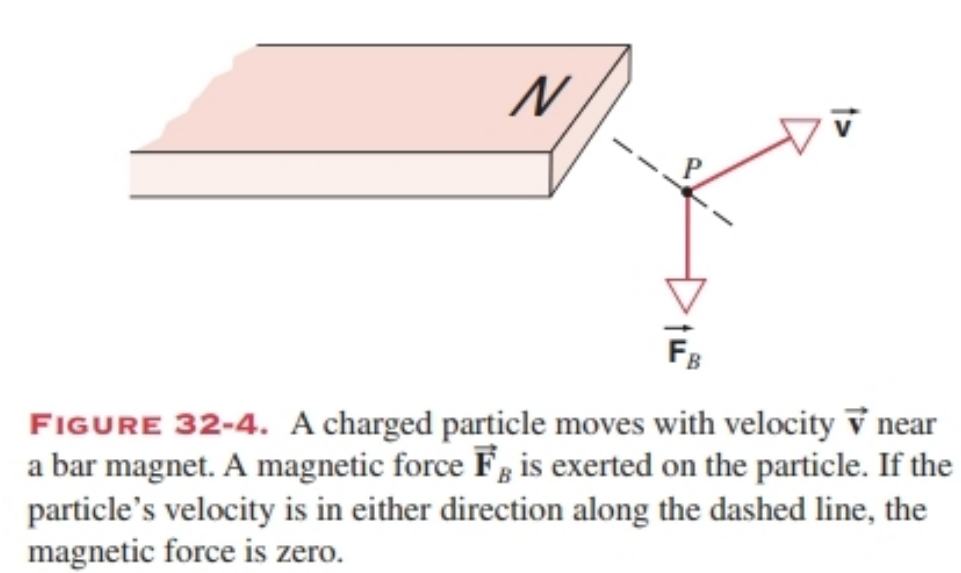
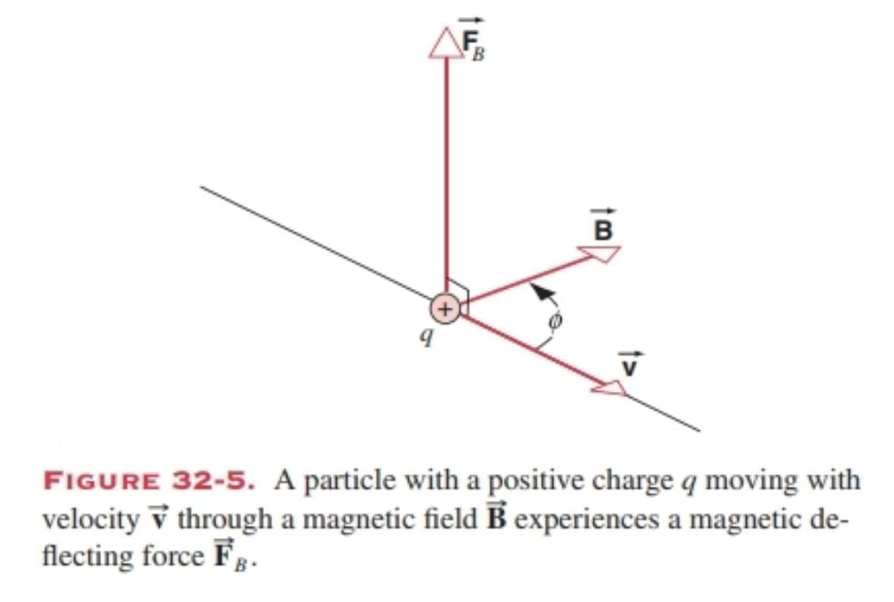
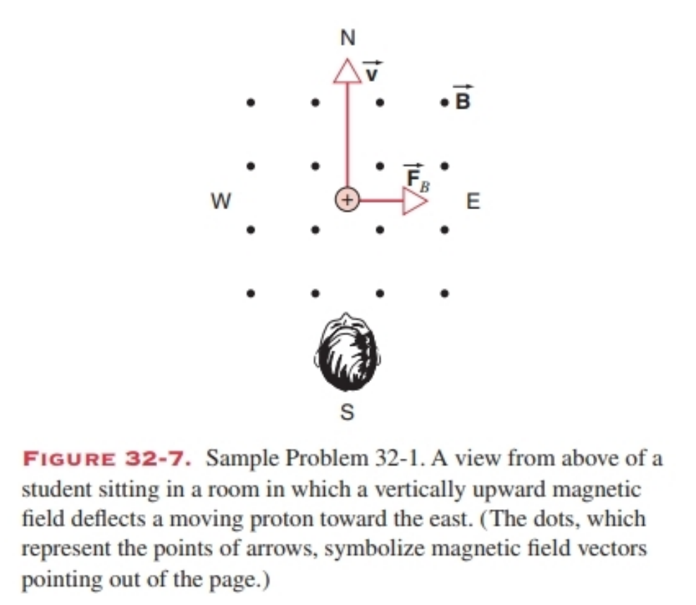
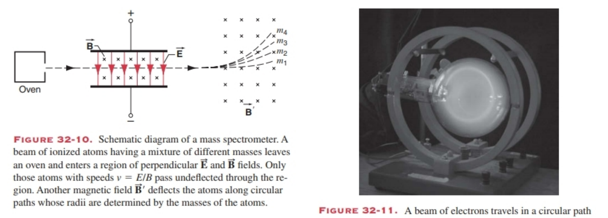
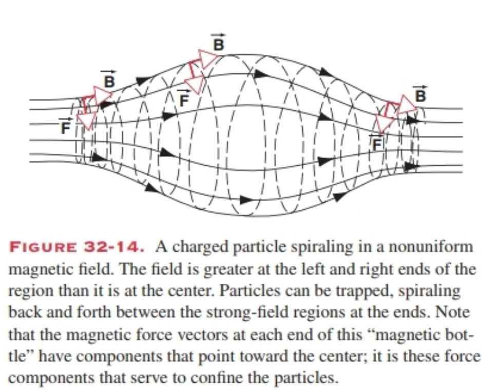
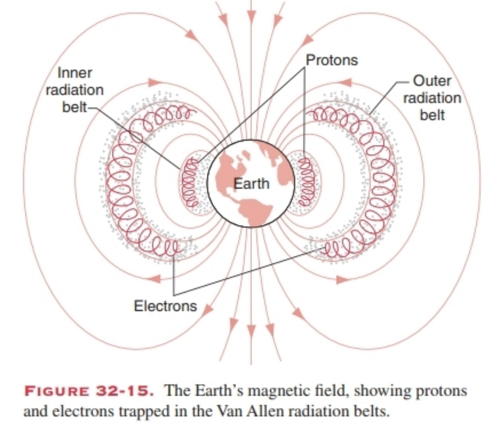
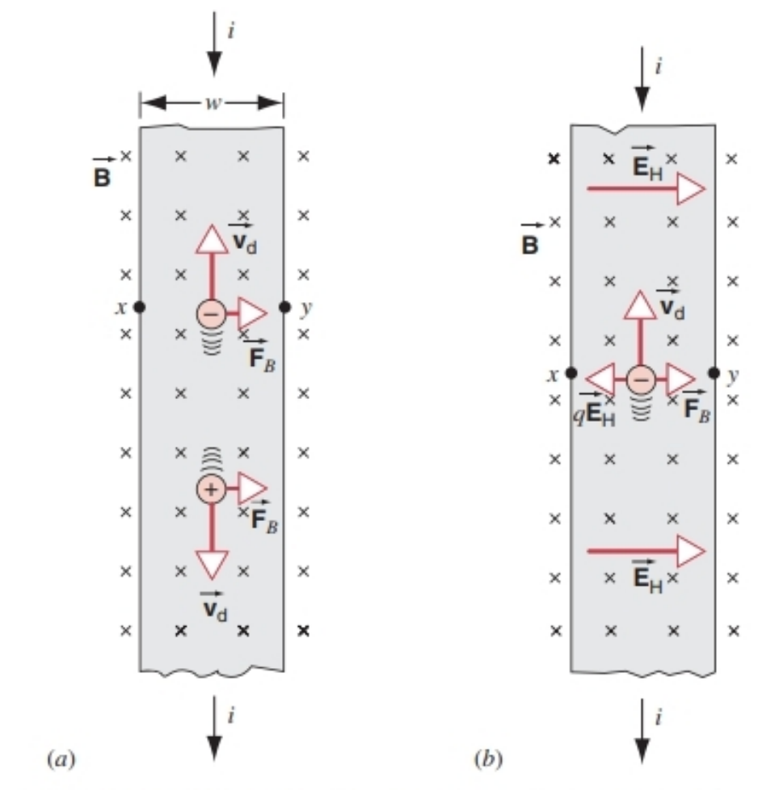
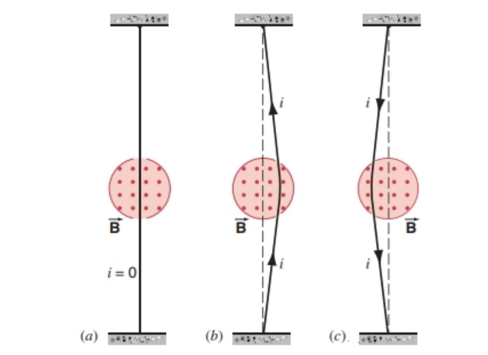
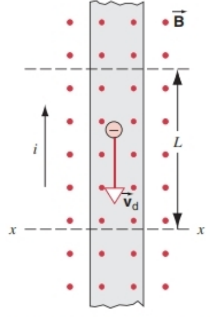
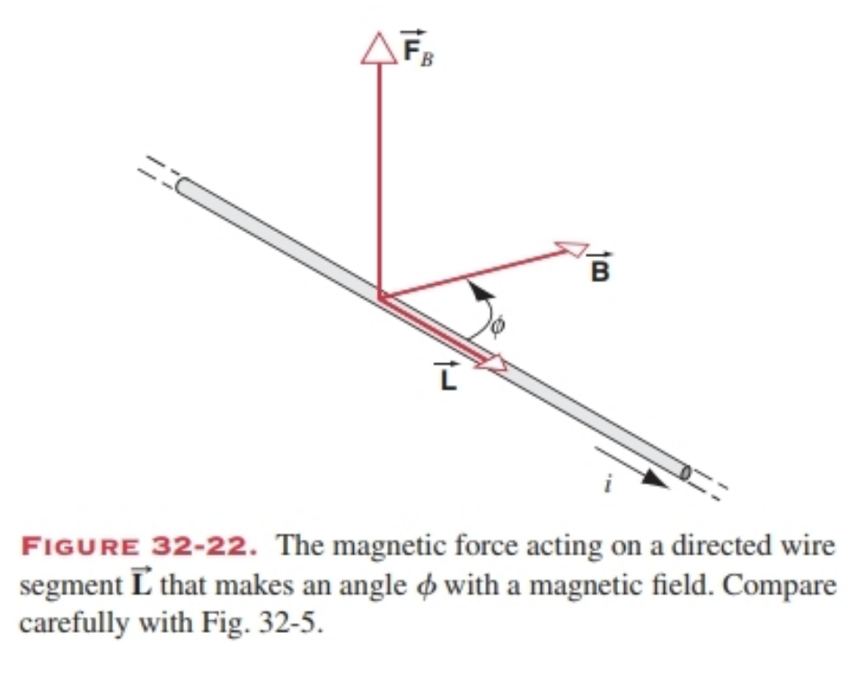

### 32-1 MAGNETIC INTERACTIONS AND MAGNETIC POLES
When we began our study of electrostatics in Chapter 25, we described an observation-the attraction between a plastic rod rubbed with fur and a glass rod rubbed with silk -that we could not explain based on the forces and interactions we had considered up to that point. We accounted for that attraction as a force exerted by the electric charges of one rod on the electric charges of the other. In subsequent chapters we learned that many interesting and useful phenomena can be understood in terms of this basic electrostatic force.

In this chapter we introduce another new observation, which will prove to have equally interesting and useful consequences. This observation is based on the magnetic interaction between objects, the effects of which are discussed in the next several chapters. As we begin this study, it is important to keep in mind many important similarities between electric and magnetic interactions as well as the important differences between them.

As early as the 8th century B.C., the Greeks had discovered that a piece of the mineral magnetite (known as lodestone, an oxide of iron) can attract a piece of iron but does not exert a measurable force on most other materials. Later it was discovered that one piece of magnetite can either attract or repel another piece, depending on their relative orientation. In these experiments and the ones we describe below, it is necessary to determine that neither of the objects carries a net electric charge, so that we can be sure these new forces cannot be of electrical origin.

By the 12th century, the following experiment was known. A small needle-shaped piece of magnetite is suspended so that it can pivot about a vertical axis. Even with no other magnetite or iron nearby, the piece will spontaneously rotate about its pivot and eventually come to rest with one end pointing roughly toward the Earth's north geographic pole. Let us identify that end by painting it red. No matter where we try this experiment on Earth, the red end always points north (Fig. 32-1).

The device we have constructed is of course a magnetic compass, which is responding to the magnetic field of the Earth, just as two pieces of magnetite exert forces on each other. We describe this outcome using the same language that we used for electrical interactions: one piece of magnetite (or the Earth) sets up a magnetic field, and the other piece responds to that magnetic field. The direction of a magnetic compass gives the direction of the horizontal component of the magnetic field of the Earth.

We can also use our magnetic compass to trace out the magnetic field of a bar magnet. In Fig. 32-2, one end of a bar magnet has been painted red, because that end points north if we suspend the bar magnet like a compass. By convention, we call this the “north-seeking” or simply north pole of the magnet, and the opposite end is the south pole. When we bring our compass close to the bar magnet, the compass rotates until its direction indicates the direction of the magnetic field at that point, as shown in Fig. 32-2. As we discuss in Chapter 35, the magnetic field of the Earth is in many ways similar to the magnetic field of a bar magnet.

Even more surprising results occur when we place our compass near a current-carrying wire, as in Fig. 32-3. When a steady current flows in the wire, the compass shows quite clearly that a magnetic field is present, and the direction of the compass needle indicates the direction of the magnetic field near the wire. If we turn off the current, there is no magnetic field. If we reverse the direction of the current, the compass needle points in the opposite direction (Fig. 32-3b).

These observations give a hint of the complex and fascinating relationship between electrical phenomena (such as a current in a wire) and magnetic phenomena (the deflection of a compass needle). Later in the text we discuss other examples of this relationship, which is responsible for such diverse effects as the operation of electric motors and the propagation of light.

#### Magnetism and Moving Charges
It is tempting to try to understand magnetic fields by following the same procedure we used for electric fields - that is, by using a test charge to probe the field. This leads immediately to questions about the relationship between electric and magnetic phenomena.

1. Does there exist in nature a “magnetic test charge” that could be used to determine the strength and direction of the magnetic field, just as we used the force on an electric test charge to determine the electric field? (As in $\overrightarrow{E}=\overrightarrow{F} / q_{0}$ Eq. 26-3). Theory permits the existence of isolated magnetic charges, but no one has ever found one despite intense experimental searches. We conclude that isolated magnetic charges, known as magnetic monopoles, are either very rare or nonexistent, and so our equations for electromagnetism are written as if there are no magnetic charges.

2. Can we use an electric test charge to probe a magnetic field? Yes, but only if the charge is moving relative to the source of the magnetic field. A magnetic field exerts no force on an electric charge at rest.

3. If electric charges in motion can be used to probe magnetic fields, can electric charges in motion also produce magnetic fields? Yes, as we illustrated in Fig. 32-3. In fact, electric charges in motion are also responsible for the magnetic fields of the Earth and the bar magnet (in the latter case, the charges are electrons moving in atoms).

4. In electrostatics we associated an electric potential energy with a test charge in an electric field (Section 28-2). Is there a “magnetic potential energy” associated with a moving electric test charge in a magnetic field? In general the answer is no, because forces that depend on velocity are not conservative forces. (Recall from Chapter 12 that potential energy can be defined only for conservative forces.)

Just as the space around a collection of charges is described as the location of an electric field represented by a vector $\overrightarrow{E}$, the space around the Earth, a bar magnet, or a current-carrying wire is described as the location of a magnetic field represented by a vector $\overrightarrow{B}$. In analogy with the electric field, we display the magnetic field by field lines, which are close together where the field is large and far apart where it is small. Often the lines of $\overrightarrow{B}$ will look similar to patterns we have previously drawn for lines of $\overrightarrow{E}$- for example, in the case of a uniform field or the field of a dipole. However, as we go along you should take note of several important differences between the lines of $\overrightarrow{E}$ and the lines of $\overrightarrow{B}$, which we shall discuss in the next several chapters.

The basic relationship between electric charge and electric field in electrostatics can be represented as:
electric charge -> electric field -> electric force on electric charges
That is, electric charges set up an electric field, which can then exert a force of electric origin on other electric charges. We would like to be able to write a similar relationship for magnetic fields:
magnetic charge -> magnetic field -> magnetic force on magnetic charges.
However, because no isolated magnetic charge has yet been found, we must use a different relationship:
moving electric charge -> magnetic field -> magnetic force on moving electric charges.
That is, a magnetic field is established by moving electric charges, and in turn the field can exert a force (which we call a magnetic force) on other moving electric charges. In this chapter we explore the second part of this relationship (the magnetic force on a moving charge). The next chapter discusses how magnetic fields are caused by moving electric charges, including currents in wires.

#### Magnetic Poles
By suspending a piece of magnetic material at the Earth's surface, we can identify and mark its north pole (the end that points roughly in the direction of the Earth’s north geographic pole) and its south pole (the opposite end). Let us test and mark two pieces of magnetic material in this way. We can then directly study the magnetic force that one of these pieces exerts on the other in various orientations. In particular, we can study the force that one north pole exerts on another north pole or on a south pole. From experiments of this type we deduce the following rule for the interactions of magnetic poles:
Like poles repel, and unlike poles attract.
That is, a south pole attracts a north pole, but two north poles or two south poles repel one another. This rule is very similar to the rule for the interaction of electric charges (Section 25-2). Applying this rule to the behavior of a magnetic compass on the Earth’s surface, as in Fig. 32-1, we conclude that to attract the north pole of the compass there must be a magnetic south pole near the Earth's geographic north pole.

---

### 32-1 磁相互作用与磁极
在第25章开始学习静电学时，我们描述了一个现象——用毛皮摩擦过的塑料棒与用丝绸摩擦过的玻璃棒之间会产生吸引力。这一现象无法用我们此前考虑过的力和相互作用来解释。我们将这种吸引力解释为一根棒上的电荷对另一根棒上电荷施加的力。在后续章节中，我们了解到许多有趣且实用的现象都可以用这种基本的静电力来解释。

本章我们将介绍另一个新的现象，它同样会带来有趣且实用的结果。这一现象基于物体间的磁相互作用，其相关效应将在后续几章中讨论。开始学习时，我们需要牢记电相互作用与磁相互作用之间的诸多重要相似点，以及它们之间的显著差异。

早在公元前8世纪，希腊人就发现了一种名为磁铁矿（又称天然磁石，是铁的氧化物）的矿物能吸引铁块，但对大多数其他物质几乎不施加可测量的力。后来人们发现，一块磁铁矿对另一块磁铁矿的作用可能是吸引也可能是排斥，这取决于它们的相对取向。在这些实验以及后续我们将要描述的实验中，必须确保两个物体都不带净电荷，以保证这些新的力并非源于电场。

到12世纪，人们已经知道了如下实验：将一根针状的磁铁矿悬挂起来，使其能绕垂直轴转动。即使附近没有其他磁铁矿或铁制品，这根针状磁铁矿也会自发地绕轴旋转，最终静止时一端大致指向地球的地理北极。我们将这一端涂成红色来标记它。无论在地球上的哪个位置进行这个实验，红色的一端始终指向北方（图32-1）。

我们制作的这个装置就是磁罗盘，它会对地球的磁场做出响应，就像两块磁铁矿之间会相互施加力一样。我们用描述电相互作用的语言来解释这一结果：一块磁铁矿（或地球）会产生磁场，另一块磁铁矿则会对该磁场做出响应。磁罗盘的指向给出了地球磁场水平分量的方向。

我们也可以用磁罗盘来描绘条形磁铁的磁场。在图32-2中，条形磁铁的一端被涂成红色，因为如果将条形磁铁像罗盘一样悬挂起来，这一端会指向北方。按照惯例，我们称这一端为“指北极”，简称北极，另一端则为南极。当我们将罗盘靠近条形磁铁时，罗盘会旋转，直到其指向表明该点磁场的方向，如图32-2所示。正如我们将在第35章中讨论的，地球的磁场在许多方面与条形磁铁的磁场相似。

当我们将罗盘放在载流导线附近时，会观察到更令人惊讶的结果（图32-3）。当导线中有恒定电流通过时，罗盘会清晰地显示出磁场的存在，且罗盘指针的指向表明了导线附近磁场的方向。如果断开电流，磁场就会消失；如果反向电流方向，罗盘指针也会反向偏转（图32-3b）。

这些观察结果暗示了电现象（如导线中的电流）与磁现象（罗盘指针的偏转）之间存在复杂而有趣的联系。在后续内容中，我们还将讨论这种联系的其他例子，它是电动机运行、光的传播等多种现象的根源。

#### 磁与运动电荷
我们很自然地想沿用研究电场的方法来理解磁场——即用试探电荷来探测磁场。这就引出了关于电现象与磁现象之间关系的一系列问题。

1. 自然界中是否存在“磁试探电荷”？就像我们利用电试探电荷所受的力来定义电场（如式26-3：$\overrightarrow{E}=\overrightarrow{F}/q_0$）那样，磁试探电荷可以用来确定磁场的大小和方向。理论上允许孤立磁荷的存在，但尽管经过了大量的实验搜索，人们从未发现过孤立磁荷。因此我们得出结论：孤立磁荷（称为磁单极子）要么极为罕见，要么根本不存在。因此，我们的电磁学方程都是在假设不存在磁单极子的前提下推导的。

2. 我们可以用电试探电荷来探测磁场吗？可以，但前提是该电荷相对于磁场源处于运动状态。磁场对静止的电荷不施加力。

3. 如果运动的电荷可以用来探测磁场，那么运动的电荷是否也能产生磁场？是的，如图32-3所示。事实上，地球和条形磁铁的磁场也都是由运动的电荷产生的（对于条形磁铁，这些电荷是原子中运动的电子）。

4. 在静电学中，我们将电势能与电场中的试探电荷联系起来（第28-2节）。那么，磁场中的运动电试探电荷是否存在“磁势能”？一般来说，答案是否定的，因为依赖于速度的力不是保守力（回顾第12章，势能只能针对保守力来定义）。

正如电荷周围的空间被描述为存在由矢量$\overrightarrow{E}$表示的电场一样，地球、条形磁铁或载流导线周围的空间被描述为存在由矢量$\overrightarrow{B}$表示的磁场。与电场类似，我们用磁感线来描绘磁场：磁感线密集的地方磁场较强，稀疏的地方磁场较弱。磁感线的形状通常与我们之前绘制的电场线相似——例如，均匀磁场或偶极子磁场的磁感线。不过，在后续学习中，你需要注意电场线与磁感线之间的几个重要差异，我们将在接下来的几章中讨论这些差异。

静电学中电荷与电场的基本关系可以表示为：
电荷→电场→对电荷的电场力
也就是说，电荷产生电场，电场进而对其他电荷施加电场力。我们希望能为磁场写出类似的关系：
磁荷→磁场→对磁荷的磁场力
然而，由于尚未发现孤立磁荷，我们必须采用另一种关系：
运动电荷→磁场→对运动电荷的磁场力
即磁场由运动电荷产生，而该磁场又会对其他运动电荷施加力（我们称之为磁力）。本章我们将探讨这一关系的后半部分（运动电荷受到的磁力）。下一章将讨论运动电荷（包括导线中的电流）如何产生磁场。

#### 磁极
将一块磁性材料悬挂在地球表面，我们可以识别并标记出它的北极（大致指向地球地理北极的一端）和南极（另一端）。我们用这种方法标记两块磁性材料，然后可以直接研究其中一块在不同取向时对另一块施加的磁力。特别是，我们可以研究一个北极对另一个北极或南极施加的力。通过这类实验，我们得出磁极相互作用的规律：
同名磁极相互排斥，异名磁极相互吸引。
也就是说，南极吸引北极，而两个北极或两个南极则相互排斥。这一规律与电荷相互作用的规律（第25-2节）非常相似。将这一规律应用到地球表面磁罗盘的行为上（图32-1），我们可以得出结论：为了吸引罗盘的北极，地球地理北极附近必定存在一个磁南极。

### 32-2 THE MAGNETIC FORCE ON A MOVING CHARGE
To begin to understand the properties of magnetic fields, our first task is to study the force on a charged particle moving in a magnetic field. In electrostatics, the force on a charged particle in an electric field is $\overrightarrow{F}_{E}=q \overrightarrow{E}$ (Eq. 26-4). This expression gives us a way to test whether an electric field is present at various points in any region of space; if, after we account for all other nonelectric forces (gravity, etc.), we find the force on a test charge at rest to be nonzero, then we can conclude that an electric field must be present at that point. We now seek the corresponding expression for magnetic fields, which will allow us to test for the presence of magnetic fields based on the force exerted on a moving charged particle. We know in advance that we will not obtain as simple an expression as the electric force, because the magnetic force involves two vectors: the magnetic field $\overrightarrow{B}$ and the velocity $\overrightarrow{v}$.

Before beginning our experiments, we first test the region of interest to make sure that no electric field is present. We make this determination by placing the test charge at rest at various locations and checking that the electric force on the test charge is zero.

*There is not general agreement on the naming of field vectors in magnetism. B may be called the magnetic induction or magnetic flux density, whereas another field vector, denoted by H, may be called the magnetic field. We regard B as the more fundamental quantity and therefore call it the magnetic field.*

Once we have established that there is no electric field acting on the charged particle, we can use it as a probe to find the magnetic force. We pick a particular point P near a source of a magnetic field, such as a bar magnet (Fig. 32-4). We assume that we have available a device for firing charged particles through point P; the device allows us to choose the magnitude of the velocity of the particles and their direction of motion. Using this device, we can do experiments that permit a variety of observations about the magnetic force $\overrightarrow{F}_{B}$ that acts on the particles.

1. By firing particles through P in a variety of directions, we find that the magnetic force, if it is present, is perpendicular to the velocity $\overrightarrow{v}$ as shown in Fig. 32-4. No matter what the direction of $\overrightarrow{v}$, the magnetic force is always perpendicular to it.
2. As we vary the direction of $\overrightarrow{v}$ through P (keeping the magnitude of $\overrightarrow{v}$ constant), we find that the magnetic force is zero for one particular direction of $\overrightarrow{v}$ indicated by the dashed line in Fig. 32-4. When the velocity is perpendicular to this direction, the magnetic force has its maximum value. In between these directions, the magnetic force varies as $\sin\phi$, where $\phi$ is the angle between the velocity and the dashed line. (Note that the dashed line actually indicates two opposite directions for which the force is zero, one corresponding to $\phi=0^\circ$ and the other to $\phi=180^\circ$.)
3. As we vary the magnitude of the velocity, we find that the magnitude of $\overrightarrow{F}_{B}$ varies in direct proportion.
4. We also find that the magnitude of $\overrightarrow{F}_{B}$ is proportional to the magnitude of the test charge $q$, and that $\overrightarrow{F}_{B}$ reverses direction when $q$ changes sign.

We now define the magnetic field $\overrightarrow{B}$ in the following way, based on these observations: the direction of $\overrightarrow{B}$ at point P is the same as one of the directions of $\overrightarrow{v}$ (to be specified shortly) for which the force is zero, and the magnitude of $\overrightarrow{B}$ is determined from the magnitude $F_{B,\text{max}}$ of the maximum force exerted when the test charge is projected perpendicular to the direction of $\overrightarrow{B}$; that is, 
$$B=\frac{F_{B,\text{max}}}{|q| v} \quad (32-1)$$

At arbitrary angles, our observations are summarized by the formula 
$$F_{B}=|q| v B \sin\phi \quad (32-2)$$
where $\phi$ is the smaller angle between $\overrightarrow{v}$ and $\overrightarrow{B}$. Because $F_{B}$, $v$, and $B$ are vectors, Eq. 32-2 can be written as a vector product: 
$$\overrightarrow{F}_{B}=q \overrightarrow{v} \times \overrightarrow{B} \quad (32-3)$$

By writing $\overrightarrow{v} \times \overrightarrow{B}$ instead of $\overrightarrow{B} \times \overrightarrow{v}$ in Eq. 32-3, we have specified which of the two possible directions of $B$ we want to use. Vector or cross products will occur frequently in our study of magnetism. You may find it helpful to review the properties of the vector product in Appendix H.

Figure 32-5 shows the geometrical relationship among the vectors $\overrightarrow{F}_{B}$, $\overrightarrow{v}$, and $\overrightarrow{B}$. Note that, as is always the case for a vector product, $\overrightarrow{F}_{B}$ is perpendicular to the plane formed by $\overrightarrow{v}$ and $\overrightarrow{B}$. Thus $\overrightarrow{F}_{B}$ is always perpendicular to $\overrightarrow{v}$ and the magnetic force is always a sideways deflecting force. Note also that $\overrightarrow{F}_{B}$ vanishes when $\overrightarrow{v}$ is either parallel or antiparallel to the direction of $\overrightarrow{B}$ (in which case $\phi=0^\circ$ or $180^\circ$, and $\overrightarrow{v} \times \overrightarrow{B}=0$), and that $\overrightarrow{F}_{B}$ has its maximum magnitude, equal to $qvB$ when $\overrightarrow{v}$ is at right angles to $\overrightarrow{B}$.

Because the magnetic force is always perpendicular to $\overrightarrow{v}$, it cannot change the magnitude of $\overrightarrow{v}$, only its direction. Equivalently, the force is always at right angles to the displacement of the particle and can do no work on it. Thus a constant magnetic field cannot change the kinetic energy of a moving charged particle. (In Chapter 34 we consider time-varying magnetic fields, which can change the kinetic energy of a particle. In this chapter we deal only with magnetic fields that do not vary with time.)

Equation 32-3, which serves as the definition of the magnetic field $\overrightarrow{B}$, indicates both its magnitude and its direction. We define the electric field similarly through an equation, $\overrightarrow{F}_{E}=q \overrightarrow{E}$, so that by measuring the electric force we can determine the magnitude and direction of the electric field. Magnetic fields cannot be determined quite so simply with a single measurement. As Fig. 32-5 suggests, measuring $\overrightarrow{F}_{B}$ for a single $\overrightarrow{v}$ is not sufficient to determine $\overrightarrow{B}$, because the direction of $\overrightarrow{F}_{B}$ does not indicate the direction of $\overrightarrow{B}$. We must first find the direction of $\overrightarrow{B}$ (for example, by finding the directions of $\overrightarrow{v}$ for which there is no force), and then a single additional measurement can determine its magnitude.

The SI unit of $\overrightarrow{B}$ is the tesla (abbreviation T). It follows from Eq. 32-1 that 
$$1 \text{ tesla} =1 \frac{\text{newton}}{\text{coulomb} \cdot \text{meter/second}}=1 \frac{\text{newton}}{\text{ampere} \cdot \text{meter}}$$

An earlier (non-SI) unit for $\overrightarrow{B}$ still in common use, is the gauss, related to the tesla by 
$$1 \text{ tesla} =10^{4} \text{ gauss}$$

Table 32-1 gives some typical values of magnetic fields.

**TABLE 32-1 Typical Values of Some Magnetic Fields**  
| Location | Magnetic Field (T) |
| --- | --- |
| At the surface of a neutron star (calculated) | $10^8$ |
| Near a superconducting magnet | 5 |
| Near a large electromagnet | 1 |
| Near a small bar magnet | $10^{-2}$ |
| At the surface of the Earth | $10^{-4}$ |
| In interstellar space | $10^{-10}$ |
| In a magnetically shielded room | $10^{-14}$ |

*Approximate values.*

Figure 32-6 shows the lines of $\overrightarrow{B}$ of a bar magnet. Note that the lines of $\overrightarrow{B}$ pass through the magnet, forming closed loops. From the clustering of field lines outside the magnet near its ends, we infer that the magnetic field in the space around the magnet has its greatest magnitude there. These ends are the poles of the magnet. Note that the field lines emerge from the north pole and converge toward the south pole.

####  SAMPLE PROBLEM 32-1
A uniform magnetic field $\overrightarrow{B}$, with magnitude 1.2 mT, points vertically upward throughout the volume of the room in which you are sitting (Fig. 32-7). A proton with a kinetic energy of 5.3 MeV moves horizontally to the north through a certain point in the room. What magnetic deflecting force acts on the proton as it passes through this point? The proton mass is $1.67 ×10^{-27} ~kg$.

Solution: The magnetic deflecting force depends on the speed of the proton, which we can find from $K=\frac{1}{2} m v^{2}$. Solving for $v$, we find:
$$
\begin{aligned} 
v&=\sqrt{\frac{2 K}{m}} \\ 
&=\sqrt{\frac{(2)(5.3 \text{ MeV})(1.60 × 10^{-13} \text{ J / MeV})}{1.67 × 10^{-27} \text{ kg}}} \\ 
&=3.2 × 10^{7} \text{ m / s} .
\end{aligned}
$$

Equation 32-2 then yields:
$$
\begin{aligned} 
F_{B} &=|q| v B \sin\phi \\ 
&=\left(1.60 × 10^{-19} \text{ C}\right)\left(3.2 × 10^{7} \text{ m / s}\right)\left(1.2 × 10^{-3} \text{ T}\right)\left(\sin 90^{\circ}\right) \\ 
&=6.1 × 10^{-15} \text{ N} .
\end{aligned}
$$

This may seem like a small force, but it acts on a particle of small mass, producing a large acceleration; namely:
$$a=\frac{F_{B}}{m}=\frac{6.1 × 10^{-15} \text{ N}}{1.67 × 10^{-27} \text{ kg}}=3.7 × 10^{12} \text{ m / s}^{2} .$$

It remains to find the direction of $\overrightarrow{F}_{B}$ when, as in Fig. 32-7, $\overrightarrow{v}$ points north, and B points vertically up. Using Eq. 32-3 and the right-hand rule for the direction of vector products (see Appendix H), we conclude that the deflecting force $\overrightarrow{F}_{B}$ must point horizontally to the east, as Fig. 32-7 shows.

If the charge of the particle had been negative, the magnetic deflecting force would have pointed in the opposite direction- that is, horizontally to the west. This is predicted automatically by Eq. 32-3, if we substitute $-q$ for $q$.

In this calculation, we used the (approximate) classical expression $(K=\frac{1}{2} m v^{2})$ for the kinetic energy of the proton rather than the (exact) relativistic expression (see Eq. 20-27). The criterion for safely using the classical expression is $K \ll m c^{2}$, where $m c^{2}$ is the rest energy of the particle. In this case $K=5.3 \text{ MeV}$, and the rest energy of a proton (see Appendix F) is 938 MeV. This proton passes the test, and we were justified in using the classical $K=\frac{1}{2} m v^{2}$ formula for the kinetic energy. In dealing with energetic particles, we must always be alert to this point.

#### Combined Electric and Magnetic Fields
If both an electric field $\overrightarrow{E}$ and a magnetic field $\overrightarrow{B}$ act on a charged particle, the total force on it can be expressed as:
$$\vec{F}=q \vec{E}+q \vec{v} × \vec{B} . (32-4)$$

This force is called the Lorentz force. The Lorentz force is not a new kind of force; it is merely the sum of the electric and magnetic forces that may simultaneously act on a charged particle. The electric part of this force acts on any charged particle, whether at rest or in motion; the magnetic part acts only on moving charged particles.

One common application of the Lorentz force occurs when a beam of charged particles passes through a region in which the $\overrightarrow{E}$ and $\overrightarrow{B}$ fields are perpendicular to each other and to the velocity of the particles. If $\overrightarrow{E}$, $\overrightarrow{B}$, and $\vec{v}$ are oriented as shown in Fig. 32-8, then the electric force $\overrightarrow{F}_{E}=q \overrightarrow{E}$ is in the opposite direction to the magnetic force $\overrightarrow{F}_{B}=q \overrightarrow{v} ×\overrightarrow{B}$. We can adjust the magnetic and electric fields until the magnitudes of the forces are equal, in which case the Lorentz force is zero. In scalar terms:
$$q E=q v B \quad(32-5)$$
or
$$v=\frac{E}{B} . \quad(32-6)$$

The crossed $\overrightarrow{E}$ and $\overrightarrow{B}$ fields therefore serve as a velocity selector: only particles with speed $v=E / B$ pass through the region unaffected by the two fields, whereas particles with other speeds are deflected. This value of $v$ is independent of the charge or mass of the particles.

Beams of charged particles are often prepared using methods that give a distribution of speeds (for example, a thermal distribution such as that of Fig. 22-6). Using a velocity selector we can isolate particles with a chosen speed from the beam. This principle was applied in 1897 by J. J. Thomson in his discovery of the electron and the measurement of its charge-to-mass ratio. Figure 32-9 shows a modern version of his apparatus. Thomson first measured the vertical deflection $y$ of the beam when only the electric field was present. From Sample Problem 26-6, the deflection is:
$$y=-\frac{q E L^{2}}{2 m v^{2}} . \quad(32-7)$$

In this expression, as in Fig. 32-9, we take the positive $y$ direction to be upward, and $E$ is the magnitude of the electric field. The deflection $y$ of a negatively charged particle is positive in Eq. 32-7 and Fig. 32-9.

Then the magnetic field was turned on and adjusted until the beam deflection was zero (equivalent to that measured with no fields present). In this case $v=E / B$, and solving for the charge-to-mass ratio with $q=-e$ gives:
$$\frac{e}{m}=\frac{2 y E}{B^{2} L^{2}} . (32-8)$$

Thomson’s value for $e/m$ (expressed in modern units) was $1.7 ×10^{11}$ C/kg, in good agreement with the current value of $1.758820174 ×10^{11}$ C/kg.

---

### 32-2 运动电荷受到的磁力
要理解磁场的性质，我们首先需要研究运动电荷在磁场中受到的力。在静电学中，带电粒子在电场中受到的电场力可表示为$\overrightarrow{F}_{E}=q \overrightarrow{E}$（式26-4）。利用这个表达式，我们可以判断空间中任意点是否存在电场：在考虑了所有非电场力（如重力等）后，若静止的试探电荷仍受到非零的力，就说明该点存在电场。现在我们需要找到磁场对应的表达式，以便根据运动带电粒子受到的力来判断磁场的存在。我们预先知道，磁场力的表达式不会像电场力这么简单，因为磁场力涉及两个矢量——磁场$\overrightarrow{B}$和速度$\overrightarrow{v}$。

在开始实验前，我们首先要检测目标区域，确保其中不存在电场。具体方法是：将试探电荷静止放置在区域内的不同位置，若试探电荷受到的电场力均为零，即可确定该区域无电场。

*注：磁场矢量的命名尚未有统一标准。$\overrightarrow{B}$有时被称为磁感应强度或磁通密度，而另一矢量$\overrightarrow{H}$有时被称为磁场强度。本书认为$\overrightarrow{B}$是更基本的物理量，因此将其称为磁场。*

确认带电粒子不受电场作用后，我们就可以用它作为试探体来探测磁力。选取磁场源（如条形磁铁）附近的某一点P（图32-4），并使用一个能将带电粒子射过P点的装置——该装置可调节粒子速度的大小和方向。通过这个装置，我们能通过实验观察带电粒子受到的磁力$\overrightarrow{F}_{B}$的各种特性，具体如下：

1. 让粒子沿不同方向射过P点，发现若存在磁力，磁力始终与速度$\overrightarrow{v}$垂直（图32-4）。无论$\overrightarrow{v}$沿哪个方向，磁力都与它垂直。
2. 保持粒子速度大小不变，改变其射向P点的方向，发现当$\overrightarrow{v}$沿某一特定方向（图32-4中虚线所示）时，磁力为零；当$\overrightarrow{v}$与该方向垂直时，磁力达到最大值；在这两个方向之间时，磁力大小随$\sin\phi$变化（$\phi$是速度与虚线方向的夹角）。需注意，虚线实际代表两个相反方向，对应$\phi=0^\circ$和$\phi=180^\circ$，这两个方向上的磁力均为零。
3. 改变粒子速度的大小，发现磁力$\overrightarrow{F}_{B}$的大小与速度大小成正比。
4. 还发现磁力$\overrightarrow{F}_{B}$的大小与试探电荷的电荷量$q$的大小成正比，且当$q$的符号改变时，$\overrightarrow{F}_{B}$的方向也会反向。

基于以上观察，我们这样定义磁场$\overrightarrow{B}$：P点处$\overrightarrow{B}$的方向与上述“磁力为零的速度方向”之一（具体方向后续确定）一致；$\overrightarrow{B}$的大小由“试探电荷垂直于$\overrightarrow{B}$方向运动时受到的最大磁力$F_{B,\text{max}}$”决定，即：
$$B=\frac{F_{B,\text{max}}}{|q| v} \quad (32-1)$$

对于任意夹角$\phi$，实验观察结果可总结为：
$$F_{B}=|q| v B \sin\phi \quad (32-2)$$
其中$\phi$是$\overrightarrow{v}$与$\overrightarrow{B}$之间的较小夹角。由于$F_{B}$、$v$和$B$均为矢量，式32-2可表示为矢量叉积形式：
$$\overrightarrow{F}_{B}=q \overrightarrow{v} \times \overrightarrow{B} \quad (32-3)$$

在式32-3中，我们用$\overrightarrow{v} \times \overrightarrow{B}$而非$\overrightarrow{B} \times \overrightarrow{v}$，是为了明确$\overrightarrow{B}$的两个可能方向中我们所选用的方向。矢量叉积在磁学研究中会频繁出现，建议参考附录H回顾矢量叉积的性质。

图32-5展示了矢量$\overrightarrow{F}_{B}$、$\overrightarrow{v}$和$\overrightarrow{B}$之间的几何关系。需注意，与所有矢量叉积的特性一致，$\overrightarrow{F}_{B}$垂直于$\overrightarrow{v}$和$\overrightarrow{B}$所构成的平面。因此，磁力始终是垂直于速度的侧向偏转力，它只能改变速度$\overrightarrow{v}$的方向，而不能改变其大小。同理，由于磁力始终与粒子的位移垂直，它对粒子不做功。因此，恒定磁场无法改变运动带电粒子的动能（第34章将讨论时变磁场，时变磁场可改变粒子的动能，本章仅研究不随时间变化的恒定磁场）。

式32-3既是磁场$\overrightarrow{B}$的定义式，也同时确定了$\overrightarrow{B}$的大小和方向。电场的定义方式与此类似——通过$\overrightarrow{F}_{E}=q \overrightarrow{E}$，只需测量电场力就能确定电场的大小和方向。但磁场无法通过单次测量简单确定：如图32-5所示，仅测量单个$\overrightarrow{v}$对应的$\overrightarrow{F}_{B}$不足以确定$\overrightarrow{B}$，因为$\overrightarrow{F}_{B}$的方向无法直接反映$\overrightarrow{B}$的方向。我们必须先确定$\overrightarrow{B}$的方向（例如，找到使磁力为零的速度方向），再通过一次额外测量确定其大小。

磁场$\overrightarrow{B}$的国际单位制（SI）单位是特斯拉（符号T）。由式32-1可得：
$$1 \text{ 特斯拉} =1 \frac{\text{牛顿}}{\text{库仑} \cdot \text{米/秒}}=1 \frac{\text{牛顿}}{\text{安培} \cdot \text{米}}$$

高斯（符号G）是早期使用的非国际单位制磁场单位，至今仍在部分场景中使用，它与特斯拉的换算关系为：
$$1 \text{ 特斯拉} =10^{4} \text{ 高斯}$$

表32-1列出了一些典型场景下的磁场大小。

**表32-1 部分场景下的典型磁场大小**  
| 场景 | 磁场大小（T） |
| --- | --- |
| 中子星表面（计算值） | $10^8$ |
| 超导磁体附近 | 5 |
| 大型电磁铁附近 | 1 |
| 小型条形磁铁附近 | $10^{-2}$ |
| 地球表面 | $10^{-4}$ |
| 星际空间 | $10^{-10}$ |
| 磁屏蔽室内 | $10^{-14}$ |

*注：表中数值均为近似值。*

图32-6展示了条形磁铁的磁感线（$\overrightarrow{B}$线）。可见，磁感线穿过磁铁形成闭合回路；磁铁外部的磁感线在两端密集，说明磁铁周围空间中这两处的磁场最强，这两端即为磁铁的磁极。需注意，磁感线从北极出发，向南极汇聚。

### 示例问题32-1
某均匀磁场$\overrightarrow{B}$的磁感应强度大小为1.2毫特斯拉，方向垂直向上，遍布你所在房间的整个空间（图32-7）。一个动能为5.3兆电子伏特的质子水平向北运动，经过房间内某点。质子经过该点时，受到的磁偏转力大小为多少？已知质子质量为$1.67 ×10^{-27}$千克。

**解答**：磁偏转力的大小与质子的速率相关，可通过动能公式$K=\frac{1}{2} m v^{2}$求解速率$v$：
$$
\begin{aligned} 
v&=\sqrt{\frac{2 K}{m}} \\ 
&=\sqrt{\frac{(2)(5.3 \text{ 兆电子伏特})(1.60 × 10^{-13} \text{ 焦耳/兆电子伏特})}{1.67 × 10^{-27} \text{ 千克}}} \\ 
&=3.2 × 10^{7} \text{ 米/秒} .
\end{aligned}
$$

根据式32-2，磁偏转力大小为：
$$
\begin{aligned} 
F_{B} &=|q| v B \sin\phi \\ 
&=\left(1.60 × 10^{-19} \text{ 库仑}\right)\left(3.2 × 10^{7} \text{ 米/秒}\right)\left(1.2 × 10^{-3} \text{ 特斯拉}\right)\left(\sin 90^{\circ}\right) \\ 
&=6.1 × 10^{-15} \text{ 牛顿} .
\end{aligned}
$$

这个力看似微小，但作用在质量极小的粒子上时，会产生巨大的加速度：
$$a=\frac{F_{B}}{m}=\frac{6.1 × 10^{-15} \text{ 牛顿}}{1.67 × 10^{-27} \text{ 千克}}=3.7 × 10^{12} \text{ 米/秒}^{2} .$$

接下来确定$\overrightarrow{F}_{B}$的方向。如图32-7所示，$\overrightarrow{v}$方向向北，$\overrightarrow{B}$方向垂直向上。根据式32-3和矢量积方向的右手定则（见附录H），可判断磁偏转力$\overrightarrow{F}_{B}$的方向为水平向东（如图32-7所示）。

若粒子带负电，磁偏转力方向会相反，即水平向西。将$-q$代入式32-3，可自动得到这一结果。

本计算中，我们使用了质子动能的经典近似表达式（$K=\frac{1}{2} m v^{2}$），而非精确的相对论表达式（见式20-27）。安全使用经典表达式的判据是$K \ll m c^{2}$，其中$m c^{2}$为粒子的静能。本题中$K=5.3$兆电子伏特，而质子的静能（见附录F）为938兆电子伏特，满足判据，因此使用经典动能公式是合理的。处理高能粒子时，需时刻注意这一前提。

---

### 电场与磁场的叠加
若带电粒子同时处于电场$\overrightarrow{E}$和磁场$\overrightarrow{B}$中，其受到的总作用力可表示为：
$$\vec{F}=q \vec{E}+q \vec{v} × \vec{B} . (32-4)$$

该力称为洛伦兹力。洛伦兹力并非一种新的力，而是带电粒子可能同时受到的电场力与磁场力的矢量和。其中，电场力部分对静止或运动的带电粒子均有作用，磁场力部分仅对运动的带电粒子起作用。

洛伦兹力的一个常见应用场景是：带电粒子束穿过某区域时，该区域的$\overrightarrow{E}$和$\overrightarrow{B}$相互垂直，且均与粒子速度$\vec{v}$垂直。如图32-8所示，当$\overrightarrow{E}$、$\overrightarrow{B}$和$\vec{v}$按图示方向分布时，电场力$\overrightarrow{F}_{E}=q \overrightarrow{E}$与磁场力$\overrightarrow{F}_{B}=q \overrightarrow{v} ×\overrightarrow{B}$方向相反。调节电场和磁场的大小，可使两力的大小相等，此时洛伦兹力为零。用标量形式表示为：
$$q E=q v B \quad(32-5)$$
或
$$v=\frac{E}{B} . \quad(32-6)$$

因此，相互垂直的$\overrightarrow{E}$和$\overrightarrow{B}$构成了速度选择器：只有速率满足$v=E / B$的粒子能不受两磁场影响穿过该区域，其他速率的粒子都会发生偏转。该速率值与粒子的电荷量和质量无关。

带电粒子束的制备方法（例如图22-6所示的热分布）通常会导致粒子速率呈分布状态。利用速度选择器，可从粒子束中筛选出具有特定速率的粒子。1897年，J.J.汤姆孙正是利用这一原理发现了电子，并测量了电子的荷质比。图32-9展示了该实验装置的现代版本。汤姆孙首先在仅存在电场的情况下，测量了粒子束的竖直偏转量$y$。根据示例问题26-6，偏转量为：
$$y=-\frac{q E L^{2}}{2 m v^{2}} . \quad(32-7)$$

式中（及图32-9中），取竖直向上为$y$轴正方向，$E$为电场强度的大小。带负电粒子的偏转量$y$在式32-7和图32-9中为正值。

随后，接通磁场并调节其大小，直到粒子束的偏转量为零（与无场时的偏转量一致）。此时满足$v=E / B$，将$q=-e$代入并求解荷质比，得到：
$$\frac{e}{m}=\frac{2 y E}{B^{2} L^{2}} . (32-8)$$

汤姆孙测得的荷质比（以现代单位表示）为$1.7 ×10^{11}$库仑/千克，与当前公认值$1.758820174 ×10^{11}$库仑/千克高度吻合。

### 32-3 CIRCULATING CHARGES
Another application of the velocity selector is in the mass spectrometer, a device for separating ions by mass. In this case a beam of ions, perhaps including species of differing masses, may be obtained from a vapor of the material heated in an oven (see Fig. 32-10). A velocity selector passes only ions of a particular speed, and when the resulting beam is then passed through another magnetic field, the paths of the particles are circular arcs (as we show in the next section) whose radii are determined by the momentum of the particles. Since all the particles have the same speed, the radius of the path is determined by the mass, and each different mass component in the beam follows a path of a different radius. These atoms can be collected and measured or else formed into a beam for subsequent experiments. See Problems 5 through 8 for other details on separating ions by their mass.

Figure 32-11 shows a beam of electrons traveling through an evacuated chamber in which there is a uniform magnetic field $\overrightarrow{B}$. The magnetic deflecting force is the only important force that acts on the electrons. The beam clearly follows a circular path. Let us see how we can understand this behavior.

The magnetic deflecting force has two properties that affect the trajectories of charged particles: (1) it does not change the speed of the particles, and (2) it always acts perpendicular to the velocity of the particles. These are exactly the characteristics we require for a particle to move in a circle at constant speed, as in the case of the electrons in Fig. 32-11.

Since $\overrightarrow{B}$ is perpendicular to $\overrightarrow{v}$, the magnitude of the magnetic force can be written $|q| v B$ and Newton’s second law with a centripetal acceleration of $v^2 / r$ gives 
$$|q| v B=m \frac{v^2}{r} \quad (32-9)$$
Or
$$r=\frac{m v}{|q| B}=\frac{p}{|q| B} \quad (32-10)$$

Thus the radius of the path is determined by the momentum $p$ of the particles, their charge, and the strength of the magnetic field. If the source of the electrons in Fig. 32-11 had projected them with a smaller speed, they would have moved in a circle of smaller radius.

The angular velocity of the circular motion is 
$$\omega=\frac{v}{r}=\frac{|q| B}{m} \quad (32-11)$$
and the corresponding frequency is 
$$f=\frac{\omega}{2 \pi}=\frac{|q| B}{2 \pi m} \quad (32-12)$$

Note that the frequency associated with the circular motion does not depend on the speed of the particle (as long as $v \ll c$, as we discuss below). Thus, if electrons in Fig. 32-11 were projected with a smaller speed, they would require the same time to complete the smaller circle that the faster electrons require to complete the larger circle. The frequency given by Eq. 32-12 is called the cyclotron frequency, because particles circulate at this frequency in a type of particle accelerator called a cyclotron. The frequency is characteristic of a particular particle moving in a particular magnetic field, just as the oscillating pendulum or the mass—spring system has its characteristic frequency.

#### The Cyclotron
A cyclotron (Fig. 32-12) is a device that accelerates beams of charged particles, which might be used in nuclear reaction experiments or for medical purposes. Figure 32-13 shows a schematic view of a cyclotron. It consists of two hollow metal D-shaped objects called dees. The dees are made of conducting material such as sheets of copper and are open along their straight edges. They are connected to an electric oscillator, which establishes an oscillating potential difference between the dees. A magnetic field is perpendicular to the plane of the dees. At the center of the instrument is a source that emits the ions we wish to accelerate.

When the ions are in the gap between the dees, they are accelerated by the potential difference between the dees. They then enter one of the dees, where they feel no electric field (because the electric field inside a conductor is zero), but the magnetic field (which is not shielded by the copper dees) bends their path into a semicircle. When the particles next enter the gap, the oscillator has reversed the direction of the electric field, and the particles are again accelerated as they cross the gap. Moving with greater speed, they travel a path of greater radius, as required by Eq. 32-10. However, according to Eq. 32-12, it takes them exactly the same amount of time to travel the larger semicircle; this is the critical characteristic of the operation of the cyclotron. The frequency of the electric oscillator must be adjusted to be equal to the cyclotron frequency (determined by the magnetic field and the charge and mass of the particle to be accelerated according to Eq. 32-12); this equality of frequencies is called the resonance condition. If the resonance condition is satisfied, particles continue to accelerate in the gap and “coast” around the semicircles, gaining a small increment of energy in each circuit, until they are deflected out of the accelerator.

The final speed of the particles is determined by the radius at which the particles leave the accelerator. From Eq. 32-10, 
$$v=\frac{|q| B R}{m} \quad (32-13)$$
and the corresponding (nonrelativistic) kinetic energy of the particles is 
$$K=\frac{1}{2} m v^2=\frac{q^2 B^2 R^2}{2 m} \quad (32-14)$$

Typical cyclotrons produce beams of protons with maximum energies in the range of 10 MeV. For a given mass, ions with higher electric charges emerge with energies that increase with the square of the charge.

It is somewhat surprising that the energy in Eq. 32-14 depends on the magnetic field, which does not accelerate the particles, but does not depend on the electric potential difference that causes the acceleration. A larger potential difference gives the particles a larger “kick” with each cycle; the radius increases more quickly, and the particles make fewer cycles before leaving the accelerator. With a smaller potential difference, the particles make more cycles but get a smaller “kick” each time. Thus the energy of the particles is independent of the potential difference.

The cyclotron is limited in the energy to which it can accelerate particles, because as the particles reach greater speeds the classical expressions for momentum ($p=mv$ in Eq. 32-10) and kinetic energy ($K=\frac{1}{2}mv^2$ in Eq. 32-14) are no longer valid, and we must use the corresponding relativistic expressions from Chapter 20. As the particles begin to move at speeds that approach the speed of light, they take a longer time to travel the circular path and so the resonance condition is lost. In practical terms, about 40 MeV is the highest proton kinetic energy that can be achieved with a conventional cyclotron, which might have a radius of the order of 1 m.

To achieve the higher energies that are needed for current research in particle physics, an accelerator of a different design, called a synchrotron, is used. Even though the synchrotron does not rely on the cyclotron resonance condition, it uses magnetic fields to keep particles moving in a circular path in which they can be repeatedly accelerated by an electric field. In the design of a synchrotron, both the oscillator frequency and the strength of the magnetic field are varied as bunches of particles are accelerated in a circular path of constant radius. To achieve an energy of 1 TeV (=10⁶ MeV) as in the case of the Fermi National Accelerator Laboratory near Chicago, a path radius of 1 km is required; the protons make about 400,000 revolutions around the 6.3-km circumference in about 10 s.

#### The Magnetic Mirror
A nonuniform magnetic field can be used to trap a charged particle in a region of space. Figure 32-14 shows a schematic view of the operation of such a magnetic mirror.

The charged particles tend to move in circles about the field direction. Suppose they also are drifting laterally, say, to the right in Fig. 32-14. The motion is therefore that of a helix, like a coiled spring. The field increases near the ends of the “magnetic bottle,” and the force has a small component pointing toward the center of the region, which reverses the direction of the motion of the particles and causes them to spiral in the opposite direction, until they are eventually reflected from the opposite end. The particles continue to travel back and forth, confined to the space between the two high-field regions. Such an arrangement is used to confine the hot ionized gases (called plasmas) that are used in research into controlled thermonuclear fusion (see Section 51-8).

A similar phenomenon occurs in the Earth's magnetic field, as shown in Fig. 32-15. Electrons and protons are trapped in different regions of the Earth’s field and spiral back and forth between the high-field regions near the poles in a time of a few seconds. These fast particles are responsible for the so-called Van Allen radiation belts that surround the Earth.

**SAMPLE PROBLEM 32-2** A particular cyclotron is designed with dees of radius $R=75\ \text{cm}$ and with magnets that can provide a field of 1.5 T. (a) To what frequency should the oscillator be set if deuterons are to be accelerated? (b) What is the maximum energy of deuterons that can be obtained?

**Solution (a)** A deuteron is a nucleus of heavy hydrogen, with a charge $q=+e$ and a mass of $3.34 \times 10^{-27}\ \text{kg}$ (about twice the mass of ordinary hydrogen). Using Eq. 32-12 we can find the frequency: 
$$
\begin{aligned} 
f&=\frac{|q| B}{2 \pi m} \\ 
&=\frac{(1.60 \times 10^{-19}\ \text{C})(1.5\ \text{T})}{2 \pi(3.34 \times 10^{-27}\ \text{kg})} \\ 
&=1.1 \times 10^{7}\ \text{Hz}=11\ \text{MHz} 
\end{aligned}
$$

**(b)** The maximum energy occurs for deuterons that emerge at the maximum radius $R$. According to Eq. 32-14, 
$$
\begin{aligned} 
K&=\frac{q^2 B^2 R^2}{2 m} \\ 
&=\frac{(1.60 \times 10^{-19}\ \text{C})^2(1.5\ \text{T})^2(0.75\ \text{m})^2}{2(3.34 \times 10^{-27}\ \text{kg})} \\ 
&=4.85 \times 10^{-12}\ \text{J}=30\ \text{MeV} 
\end{aligned}
$$

Deuterons of this energy have a range in air of a few meters, as suggested by Fig. 32-12.

#### Motion in Nonuniform Fields (Optional)
The path of a charged particle in a nonuniform magnetic field is not a circle, and the calculation of the path (such as that shown in Fig. 32-14) can be a complicated problem. Usually there is no analytical solution, and the path must be calculated numerically, in analogy with the path of a projectile including air resistance (Chapter 4). Figure 32-16 illustrates why the path in a nonuniform field is no longer a circle. The particle is initially at point $P_0$ where its velocity $\overrightarrow{v}_0$ is along the $y$ direction. We assume that the field is in the $z$ direction and that its strength increases as $x$ and $y$ increase. Initially the field is $\overrightarrow{B}_0$, and the resulting force on the particle is $\overrightarrow{F}_0$ in the $x$ direction. This force gives the particle a velocity increment in the $x$ direction, and an instant later the particle is at point $P_1$ moving with velocity $\overrightarrow{v}_1$. The magnetic field $\overrightarrow{B}_1$ at this point has a larger magnitude, and the force $\overrightarrow{F}_1$ is also larger. For circular motion, the force must have the same magnitude at all locations, so the particle's path is clearly not a circle.

We can solve this problem numerically if we know how $\overrightarrow{B}$ varies in magnitude (and possibly in direction) at all points where the particle might be located. We begin by writing the complete expression for the force as a vector (cross) product (see Appendix H): 
$$
\begin{aligned} 
\overrightarrow{F}_B&= q(\overrightarrow{v} \times \overrightarrow{B}) \\ 
&= q(v_y B_z - v_z B_y)\hat{i} + q(v_z B_x - v_x B_z)\hat{j} \\ 
&\quad + q(v_x B_y - v_y B_x)\hat{k} 
\end{aligned}
$$

Using Newton's second law, $\overrightarrow{F}=m \overrightarrow{a}=m(a_x \hat{i}+a_y \hat{j}+a_z \hat{k})$, we can equate the corresponding vector components to obtain the equations of motion, which can be solved for the path. For example, in the situation shown in Fig. 32-16, $\overrightarrow{B}$ has only a $z$ component ($B_x=B_y=0$). In this case the equations of motion simplify to 
$$
\begin{aligned} 
F_{Bx}&=q(v_y B_z - v_z B_y)=q v_y B_z=ma_x=m \frac{dv_x}{dt} \\ 
F_{By}&=q(v_z B_x - v_x B_z)= -q v_x B_z=ma_y=m \frac{dv_y}{dt} \\ 
F_{Bz}&=q(v_x B_y - v_y B_x)=0=ma_z=m \frac{dv_z}{dt} \quad (32-16)
\end{aligned}
$$
(If $v_z=0$ initially, then $v_z=0$ at all times, because $a_z=0$.) These expressions must be evaluated at every point of the trajectory, because the values of $v_x$, $v_y$, and $B_z$ vary from point to point. Usually a computer is used to obtain a numerical solution for the path. For example, suppose the field varies as 
$$B_z=B_0\left(1+\frac{\sqrt{x^2+y^2}}{R}\right) \quad (32-17)$$
where $R=mv/(qB_0)$ is the radius of the path in a uniform field $B_0$. This field increases with the distance of the particle from the origin. The resulting motion, which can be obtained numerically (see Computer Problem 1), gives the flower-shaped pattern illustrated in Fig. 32-17.

---

### 32-3 做圆周运动的电荷
速度选择器的另一个应用是在质谱仪中，这是一种按质量分离离子的装置。在这种装置中，待分析物质在烤箱中加热产生蒸汽，进而获得含有不同质量离子的离子束（见图32-10）。速度选择器只允许特定速度的离子通过，当经过选择的离子束进入另一个磁场后，粒子的运动轨迹会成为圆弧（下文中将详细说明），圆弧半径由粒子的动量决定。由于所有粒子速度相同，轨迹半径就由质量决定，因此束中不同质量的离子会沿不同半径的轨迹运动。这些离子可被收集并测量，或形成新的离子束用于后续实验。关于离子按质量分离的其他细节，可参考习题5至习题8。

图32-11展示了一束电子穿过含有均匀磁场$\overrightarrow{B}$的真空室的情景。此时电子仅受主要的磁力作用，且轨迹明显为圆形。下面我们将分析这一现象的原理。

磁力对带电粒子轨迹的影响具有两个关键特性：（1）不改变粒子的速度大小；（2）始终与粒子的速度方向垂直。这两个特性恰好是粒子做匀速圆周运动的必要条件，图32-11中的电子运动就符合这一情况。

当$\overrightarrow{B}$与$\overrightarrow{v}$垂直时，磁力大小可表示为$|q|vB$。根据牛顿第二定律，向心力由磁力提供，向心加速度为$v^2/r$，因此有：
$$|q| v B=m \frac{v^2}{r} \quad (32-9)$$
整理可得：
$$r=\frac{m v}{|q| B}=\frac{p}{|q| B} \quad (32-10)$$

由此可见，轨迹半径由粒子的动量$p$、电荷量以及磁场强度共同决定。若图32-11中电子源发射的电子速度更小，其运动轨迹的半径也会相应减小。

圆周运动的角速度为：
$$\omega=\frac{v}{r}=\frac{|q| B}{m} \quad (32-11)$$
对应的频率（即单位时间内的转动次数）为：
$$f=\frac{\omega}{2 \pi}=\frac{|q| B}{2 \pi m} \quad (32-12)$$

需注意，该圆周运动的频率与粒子速度无关（前提是$v \ll c$，下文将讨论这一限制）。因此，即使图32-11中的电子以更小的速度发射，它们完成小圆周运动所需的时间，与速度更快的电子完成大圆周运动的时间相同。式32-12给出的频率被称为回旋频率，因为在一种名为“回旋加速器”的粒子加速器中，粒子正是以这个频率做圆周运动的。回旋频率是特定粒子在特定磁场中运动的固有属性，类似钟摆的摆动频率或弹簧振子的振动频率，均为系统的特征频率。

#### 回旋加速器
回旋加速器（图32-12）是一种加速带电粒子束的装置，可用于核反应实验或医疗领域。图32-13为回旋加速器的示意图，其核心部件是两个中空的D形金属盒（称为“D形盒”）。D形盒由铜片等导电材料制成，直边处开口，且与产生交变电势差的振荡器相连。磁场垂直于D形盒所在平面，装置中心设有发射待加速离子的离子源。

当离子处于两个D形盒之间的缝隙时，会在交变电势差的作用下加速。随后离子进入其中一个D形盒，由于导体内部电场为零，离子在D形盒内不受电场力，但磁场（铜制D形盒无法屏蔽磁场）会使离子轨迹弯曲成半圆。当离子再次进入缝隙时，振荡器已反向电场方向，离子穿过缝隙时会再次加速。根据式32-10，速度增大后，离子的轨迹半径也会增大，但由式32-12可知，离子运动半圆周所需的时间始终不变——这是回旋加速器工作的关键特性。

为使离子持续加速，电振荡器的频率必须调节至与回旋频率相等（回旋频率由磁场强度及待加速粒子的电荷量、质量通过式32-12确定），这种频率匹配的条件称为“共振条件”。满足共振条件时，粒子在缝隙中不断加速，在D形盒内沿半圆轨迹“滑行”，每完成一次圆周运动就获得一次能量增量，直到被偏转离开加速器。

粒子的最终速度由其离开加速器时的轨迹半径（即D形盒的最大半径$R$）决定。由式32-10可得：
$$v=\frac{|q| B R}{m} \quad (32-13)$$
对应的（非相对论性）动能为：
$$K=\frac{1}{2} m v^2=\frac{q^2 B^2 R^2}{2 m} \quad (32-14)$$

典型的回旋加速器可将质子加速到最大能量约10 MeV。对于质量固定的离子，电荷量越大，最终能量越高，且能量与电荷量的平方成正比。

有趣的是，式32-14表明粒子的最终能量与“不直接加速粒子的磁场”相关，却与“直接提供加速作用的电势差”无关。电势差越大，粒子每次经过缝隙时获得的能量增量（“加速幅度”）越大，轨迹半径增长越快，离开加速器前完成的圆周运动次数越少；电势差越小，粒子运动次数越多，但每次加速幅度越小。因此，粒子的最终能量与电势差大小无关。

回旋加速器对粒子的加速能量存在限制：当粒子速度足够大时，经典物理中的动量表达式（式32-10中$p=mv$）和动能表达式（式32-14中$K=\frac{1}{2}mv^2$）不再适用，必须采用第20章中的相对论表达式。当粒子速度接近光速时，其做圆周运动的时间会变长，导致共振条件被破坏。实际应用中，传统回旋加速器（D形盒半径约1 m）对质子的最大加速能量约为40 MeV。

为获得粒子物理研究所需的更高能量，人们设计了另一种加速器——同步加速器。尽管同步加速器不依赖回旋共振条件，但它仍利用磁场使粒子保持在圆形轨道上，同时通过电场反复加速粒子。在同步加速器的设计中，当粒子束在固定半径的圆形轨道上加速时，振荡器频率和磁场强度会同步调节。例如，美国芝加哥附近的费米国家加速器实验室为将质子加速到1 TeV（即10⁶ MeV），需采用半径约1 km的轨道；质子在周长6.3 km的轨道上约旋转40万圈，耗时约10秒。

#### 磁镜
非均匀磁场可用于将带电粒子束缚在特定空间区域内，图32-14为这类“磁镜”装置的工作原理示意图。

带电粒子倾向于绕磁场方向做圆周运动。若粒子同时沿侧向漂移（例如图32-14中向右漂移），其合运动轨迹会呈螺旋状，类似弹簧线圈。在“磁瓶”的两端，磁场强度增大，此时磁力会产生一个指向区域中心的分力，该分力使粒子的漂移方向反向，进而沿螺旋轨迹向相反方向运动，最终从另一端反射回来。如此反复，粒子被束缚在两个强磁场区域之间的空间内。这种装置可用于约束高温电离气体（称为等离子体），该技术在受控热核聚变研究中被广泛应用（见第51-8节）。

地球磁场中也存在类似现象（图32-15）：电子和质子被束缚在地球磁场的不同区域，在两极附近的强磁场区域之间沿螺旋轨迹往返运动，单次往返时间约为几秒。这些高速粒子形成了环绕地球的“范艾伦辐射带”。

**例题32-2** 某回旋加速器的D形盒半径$R=75\ \text{cm}$， magnets能产生的磁场强度为1.5 T。（a）若要加速氘核，振荡器应调节到什么频率？（b）该加速器能使氘核获得的最大能量是多少？

**解答（a）** 氘核是重氢的原子核，电荷量$q=+e$，质量$m=3.34 \times 10^{-27}\ \text{kg}$（约为普通氢核质量的两倍）。由式32-12可计算回旋频率：
$$
\begin{aligned} 
f&=\frac{|q| B}{2 \pi m} \\ 
&=\frac{(1.60 \times 10^{-19}\ \text{C})(1.5\ \text{T})}{2 \pi(3.34 \times 10^{-27}\ \text{kg})} \\ 
&=1.1 \times 10^{7}\ \text{Hz}=11\ \text{MHz} 
\end{aligned}
$$

**（b）** 氘核的最大能量对应其从D形盒最大半径$R$处射出的情况。由式32-14可得：
$$
\begin{aligned} 
K&=\frac{q^2 B^2 R^2}{2 m} \\ 
&=\frac{(1.60 \times 10^{-19}\ \text{C})^2(1.5\ \text{T})^2(0.75\ \text{m})^2}{2(3.34 \times 10^{-27}\ \text{kg})} \\ 
&=4.85 \times 10^{-12}\ \text{J}=30\ \text{MeV} 
\end{aligned}
$$

具有该能量的氘核在空气中的射程约为几米，如图32-12所示。

#### 非均匀磁场中的运动（选学）
带电粒子在非均匀磁场中的轨迹并非圆形，且轨迹计算（如图32-14所示的轨迹）较为复杂。通常这类问题没有解析解，需采用数值方法计算轨迹，类似第4章中考虑空气阻力的抛体运动轨迹计算。图32-16可解释为何非均匀磁场中的轨迹不是圆形：粒子初始位于$P_0$点，速度$\overrightarrow{v}_0$沿$y$方向；假设磁场沿$z$方向，且强度随$x$、$y$坐标增大而增大。初始时磁场为$\overrightarrow{B}_0$，粒子受到的磁力$\overrightarrow{F}_0$沿$x$方向，该力使粒子获得$x$方向的速度增量。瞬间后粒子到达$P_1$点，速度为$\overrightarrow{v}_1$；此处磁场$\overrightarrow{B}_1$的强度更大，对应的磁力$\overrightarrow{F}_1$也更大。而圆周运动要求粒子在各位置受到的向心力大小恒定，因此粒子轨迹显然不是圆形。

若已知粒子可能到达的所有位置处磁场$\overrightarrow{B}$的大小（可能还包括方向）的变化规律，可通过数值方法求解轨迹。首先根据矢量叉积写出磁力的完整表达式（见附录H）：
$$
\begin{aligned} 
\overrightarrow{F}_B&= q(\overrightarrow{v} \times \overrightarrow{B}) \\ 
&= q(v_y B_z - v_z B_y)\hat{i} + q(v_z B_x - v_x B_z)\hat{j} \\ 
&\quad + q(v_x B_y - v_y B_x)\hat{k} 
\end{aligned}
$$

根据牛顿第二定律$\overrightarrow{F}=m \overrightarrow{a}=m(a_x \hat{i}+a_y \hat{j}+a_z \hat{k})$，将矢量分量对应相等可得到运动方程，进而求解轨迹。以图32-16的情况为例，磁场仅含$z$分量（$B_x=B_y=0$），此时运动方程简化为：
$$
\begin{aligned} 
F_{Bx}&=q(v_y B_z - v_z B_y)=q v_y B_z=ma_x=m \frac{dv_x}{dt} \\ 
F_{By}&=q(v_z B_x - v_x B_z)= -q v_x B_z=ma_y=m \frac{dv_y}{dt} \\ 
F_{Bz}&=q(v_x B_y - v_y B_x)=0=ma_z=m \frac{dv_z}{dt} \quad (32-16)
\end{aligned}
$$
（若初始时$v_z=0$，则因$a_z=0$，始终有$v_z=0$。）

由于轨迹上各点的$v_x$、$v_y$和$B_z$均会变化，上述表达式需在轨迹的每个点上进行计算，通常需借助计算机得到数值解。例如，假设磁场按以下规律变化：
$$B_z=B_0\left(1+\frac{\sqrt{x^2+y^2}}{R}\right) \quad (32-17)$$
其中$R=mv/(qB_0)$是粒子在均匀磁场$B_0$中的轨迹半径。该磁场的强度随粒子到原点的距离增大而增大，通过数值计算可得到粒子的运动轨迹（见计算机习题1），其形状为图32-17所示的花瓣状。

### 32-4 THE HALL EFFECT
We have discussed several examples of the sideways deflecting force exerted on moving charged particles by a magnetic field. So far we have considered only individual particles or beams of particles moving otherwise freely. In 1879, Edwin Hall showed that the moving conduction electrons in a conductor can also be deflected by a magnetic field. The Hall effect provides a way to determine both the sign and the density of the charge carriers.

Consider a flat strip of material of width $w$ carrying a current $i$, as shown in Fig. 32-18. The direction of the current $i$ is the conventional one, opposite to the direction of motion of the electrons. A uniform magnetic field $\overrightarrow{B}$ is established perpendicular to the plane of the strip, such as by placing the strip between the poles of an electromagnet. The charge carriers (electrons, for instance) experience a magnetic deflecting force $\overrightarrow{F}_{B}=q \overrightarrow{v} \times \overrightarrow{B}$ as shown in the figure, and move to the right side of the strip. Note that positive charges moving in the direction of $i$ experience a deflecting force in the same direction.

The buildup of charge along the right side of the strip (and a corresponding deficiency of charge of that sign on the opposite side of the strip), which is the Hall effect, produces an electric field $\overrightarrow{E}_{H}$ across the strip, as shown in Fig. 32-18b. Equivalently, a potential difference $\Delta V_{H}=E_{H} w$, called the Hall potential difference (or Hall voltage), exists across the strip. We can measure $\Delta V_{H}$ by connecting the leads of a voltmeter to points $x$ and $y$ of Fig. 32-18. As we show below, the sign of $\Delta V_{H}$ gives the sign of the charge carriers, and the magnitude of $\Delta V_{H}$ gives their density (number per unit volume). If the charge carriers are electrons, for example, an excess of negative charges builds up on the right side of the strip, and point $y$ is at a lower potential than point $x$. This may seem like an obvious conclusion in the case of metals; however, keep in mind that Hall’s work was done nearly 20 years before Thomson's discovery of the electron, and the nature of electrical conduction in metals was not at all obvious at that time.

Let us assume that conduction in the material is due to charge carriers of a particular sign (positive or negative) moving with drift velocity $\overrightarrow{v}_{d}$. As the charge carriers drift, they are deflected to the right in Fig. 32-18 by the magnetic force. As the charges collect on the right side, they set up an electric field that acts inside the conductor to oppose the sideways motion of additional charge carriers. Equilibrium is quickly reached, and the Hall voltage reaches its maximum; the sideways magnetic force ($\overrightarrow{F}_{B}=q \overrightarrow{v}_{d} \times \overrightarrow{B}$) is then balanced by the sideways electric force ($q \overrightarrow{E}_{H}$). In vector terms, the Lorentz force on the charge carriers under these circumstances is zero: 
$$
q \vec{E}_{H}+q \vec{v}_{d} \times \vec{B}=0 \quad(32-18)
$$
or 
$$
\vec{E}_{H}=-\vec{v}_{d} \times \vec{B} \quad(32-19)
$$

Since $\overrightarrow{v}_{d}$ and $\overrightarrow{B}$ are at right angles, we can write Eq. 32-19 in terms of magnitudes as 
$$
E_{H}=v_{d} B \quad(32-20)
$$

From Eq. 29-6 we can write the drift speed as $v_{d}=j / n e$, where $j$ is the current density in the strip and $n$ is the density of charge carriers. The current density $j$ is the current $i$ per unit cross-sectional area $A$ of the strip. If $t$ is the thickness of the strip, then its cross-sectional area $A$ can be written as $w t$. Substituting $\Delta V_{H} / w$ for the electric field $E_{H}$, we obtain 
$$
\frac{\Delta V_{H}}{w}=v_{d} B=\frac{j}{n e} B=\frac{i}{w t n e} B
$$
or, solving for the density of charge carriers, 
$$
n=\frac{i B}{e t \Delta V_{H}} \quad(32-21)
$$

From a measurement of the magnitude of the Hall potential difference $\Delta V_{H}$ we can find the number density of the charge carriers. Table 32-2 shows a summary of Hall effect data for several metals and semiconductors. For some monovalent metals (Na, K, Cu, Ag) the Hall effect indicates that each atom contributes approximately one free electron to the conduction. For other metals, the number of electrons can be greater than one per atom (Al) or less than one per atom (Sb). For some metals (Be, Zn), the Hall potential difference shows that the charge carriers have a positive sign. In this case the conduction is dominated by holes, unoccupied energy levels in the valence band (see Chapter 49). The holes correspond to the absence of an electron and thus behave like positive charge carriers moving through the material. For some materials, semiconductors in particular, there may be substantial contributions from both electrons and holes, and the simple interpretation of the Hall effect in terms of free conduction by one type of charge carrier is not sufficient. In this case we must use more detailed calculations based on quantum theory.

#### SAMPLE PROBLEM 32-3
A strip of copper 150 μm thick is placed in a magnetic field $B=0.65$ T perpendicular to the plane of the strip, and a current $i=23$ A is set up in the strip. What Hall potential difference $\Delta V_{H}$ would appear across the width of the strip if there were one charge carrier per atom?

**Solution**  
In Sample Problem 29-3, we calculated the number of charge carriers per unit volume for copper, assuming that each atom contributes one electron, and we found $n=8.49 \times 10^{28} \, \text{electrons/m}^3$. From Eq. 32-21 then, 
$$
\begin{aligned}
\Delta V_{H} &=\frac{i B}{n e t} \\
&=\frac{(23 \, \text{A})(0.65 \, \text{T})}{\left(8.49 \times 10^{28} \, \text{m}^{-3}\right)\left(1.60 \times 10^{-19} \, \text{C}\right)\left(150 \times 10^{-6} \, \text{m}\right)} \\
&=7.3 \times 10^{-6} \, \text{V}=7.3 \, \mu \text{V}
\end{aligned}
$$

This potential difference, though small, is readily measurable.

#### The Quantized Hall Effect (Optional)
Let us rewrite Eq. 32-21 as 
$$
\frac{\Delta V_{H}}{i}=\frac{1}{n e t} B \quad(32-22)
$$

The quantity on the left has the dimension of resistance (voltage divided by current), although it is not a resistance in the conventional sense. It is commonly called the Hall resistance. We can determine the Hall resistance by measuring the Hall voltage $\Delta V_{H}$ in a material carrying a current $i$.

Equation 32-22 shows that the Hall resistance is expected to increase linearly with the magnetic field $B$ for a particular sample of material (in which $n$ and $t$ are constants). A plot of the Hall resistance against $B$ should be a straight line.

In experiments done in 1980, German physicist Klaus von Klitzing discovered that, at high magnetic fields and low temperatures (about 1 K), the Hall resistance did not increase linearly with the field; instead, the plot showed a series of “stair steps,” as shown in Fig. 32-19. This effect has become known as the quantized Hall effect, and von Klitzing was awarded the 1985 Nobel Prize in physics for his discovery.

The explanation for this effect involves the circular paths in which electrons are forced to move by the field. Quantum mechanics prevents the electron orbits of neighboring atoms from overlapping. As the field increases, the orbital radius decreases, permitting more orbits to bunch together on one side of the material. Because the orbital motion of electrons is quantized (only certain orbits are allowed), the changes in orbital motion occur suddenly, corresponding to the steps in Fig. 32-19. A natural unit of resistance corresponding to orbital motion is $h / e^{2}$, where $h$ is the Planck constant, and the steps in Fig. 32-19 occur at Hall resistances of $h / 2 e^{2}$, $h / 3 e^{2}$, $h / 4 e^{2}$, and so on.

The quantized Hall resistance $h/e^2$, now known as the von Klitzing constant, has the value 25812.807572 Ω and has been determined to a precision of better than 1 part in $10^8$, so the quantized Hall effect has provided a new standard for resistance. This standard, which can be duplicated exactly in laboratories around the world, became the new representation for the ohm in 1990.

### 32-4 霍尔效应
我们已经讨论过磁场对运动带电粒子施加侧向偏转力的多个例子，不过此前仅针对单个粒子或自由运动的粒子束。1879年，埃德温·霍尔（Edwin Hall）发现，导体中运动的传导电子也会在磁场中发生偏转——这一现象被称为霍尔效应，它为测定电荷载流子的符号和数密度提供了方法。

考虑一个宽度为$w$、通有电流$i$的扁平材料条，如图32-18所示。电流$i$的方向为常规正方向，与电子运动方向相反。将材料条置于电磁铁两极之间，使其平面垂直于均匀磁场$\overrightarrow{B}$。此时，电荷载流子（如电子）会受到磁场施加的偏转力$\overrightarrow{F}_{B}=q \overrightarrow{v} \times \overrightarrow{B}$（如图所示），并向材料条的右侧移动。需注意，若正电荷沿电流$i$的方向运动，也会受到相同方向的偏转力。

电荷在材料条右侧堆积（另一侧则相应缺少该种电荷），这一霍尔效应会在材料条两端产生横向电场$\overrightarrow{E}_{H}$（如图32-18b所示）；相应地，材料条两端会出现电势差$\Delta V_{H}=E_{H} w$，称为霍尔电势差（或霍尔电压）。将电压表引线连接到图32-18中的$x$点和$y$点，即可测量$\Delta V_{H}$。如下文所示，$\Delta V_{H}$的符号可反映电荷载流子的正负，其大小则能反映载流子的数密度（单位体积内的载流子数量）。例如，若载流子为电子，材料条右侧会堆积过量负电荷，此时$y$点电势低于$x$点。这一结论在金属中看似显而易见，但需注意：霍尔的研究早于汤姆孙发现电子近20年，当时人们对金属中电传导的本质尚未有清晰认知。

假设材料的导电由特定符号（正或负）的电荷载流子以漂移速度$\overrightarrow{v}_{d}$运动实现。载流子漂移时，会在图32-18中被磁力推向右侧；随着电荷在右侧堆积，会在导体内部形成一个电场，阻碍后续载流子的侧向运动。很快系统达到平衡，霍尔电压达到最大值，此时侧向磁力（$\overrightarrow{F}_{B}=q \overrightarrow{v}_{d} \times \overrightarrow{B}$）与侧向电场力（$q \overrightarrow{E}_{H}$）相互抵消。从矢量角度看，此时电荷载流子所受的洛伦兹力为零：
$$
q \vec{E}_{H}+q \vec{v}_{d} \times \vec{B}=0 \quad(32-18)
$$
即：
$$
\vec{E}_{H}=-\vec{v}_{d} \times \vec{B} \quad(32-19)
$$

由于$\overrightarrow{v}_{d}$与$\overrightarrow{B}$垂直，式32-19可写成标量形式：
$$
E_{H}=v_{d} B \quad(32-20)
$$

由式29-6可知，漂移速度$v_{d}=j / n e$，其中$j$为材料条中的电流密度，$n$为电荷载流子数密度。电流密度$j$是电流$i$与材料条横截面积$A$的比值；若材料条厚度为$t$，则横截面积$A=w t$。将电场$E_{H}$替换为$\Delta V_{H} / w$，代入可得：
$$
\frac{\Delta V_{H}}{w}=v_{d} B=\frac{j}{n e} B=\frac{i}{w t n e} B
$$
整理后得到电荷载流子数密度的表达式：
$$
n=\frac{i B}{e t \Delta V_{H}} \quad(32-21)
$$

通过测量霍尔电势差$\Delta V_{H}$的大小，可求出电荷载流子的数密度。表32-2汇总了几种金属和半导体的霍尔效应数据：对于部分单价金属（钠、钾、铜、银），霍尔效应表明每个原子约贡献1个自由电子参与导电；其他金属中，每个原子贡献的电子数可能多于1个（如铝）或少于1个（如锑）；而在某些金属（如铍、锌）中，霍尔电势差的符号表明载流子带正电——此时导电由“空穴”（价带中的未占据能级，见第49章）主导，空穴相当于缺少电子的空位，其行为类似于正电荷载流子在材料中运动。对于部分材料（尤其是半导体），电子和空穴可能同时对导电有显著贡献，此时仅用单一类型载流子的自由导电模型无法充分解释霍尔效应，需基于量子理论进行更详细的计算。

#### 示例问题32-3
将厚度为150 μm的铜条置于垂直于其平面的磁场（$B=0.65$ T）中，铜条中通有电流$i=23$ A。若假设每个铜原子贡献1个电荷载流子，铜条宽度方向会产生多大的霍尔电势差$\Delta V_{H}$？

**解答**  
在示例问题29-3中，我们曾计算过铜的电荷载流子数密度（假设每个原子贡献1个电子），结果为$n=8.49 \times 10^{28} \, \text{个电子/立方米}$。根据式32-21，霍尔电势差为：
$$
\begin{aligned}
\Delta V_{H} &=\frac{i B}{n e t} \\
&=\frac{(23 \, \text{A})(0.65 \, \text{T})}{\left(8.49 \times 10^{28} \, \text{立方米}^{-1}\right)\left(1.60 \times 10^{-19} \, \text{C}\right)\left(150 \times 10^{-6} \, \text{m}\right)} \\
&=7.3 \times 10^{-6} \, \text{V}=7.3 \, \mu \text{V}
\end{aligned}
$$

该电势差虽小，但可通过实验轻松测量。

#### 量子霍尔效应（选学）
将式32-21改写为：
$$
\frac{\Delta V_{H}}{i}=\frac{1}{n e t} B \quad(32-22)
$$

上式左侧物理量的量纲为电阻（电压除以电流），尽管它并非传统意义上的电阻，仍被称为霍尔电阻。通过测量通有电流$i$的材料中的霍尔电压$\Delta V_{H}$，可确定霍尔电阻。

由式32-22可知，对于特定材料样品（$n$和$t$为定值），霍尔电阻应随磁场$B$线性增大，霍尔电阻与$B$的关系图应为一条直线。

1980年，德国物理学家克劳斯·冯·克利青（Klaus von Klitzing）在实验中发现：在强磁场和低温（约1 K）条件下，霍尔电阻并未随磁场线性增大，反而呈现出一系列“阶梯”状变化（如图32-19所示）。这一现象被称为量子霍尔效应，冯·克利青也因此获得1985年诺贝尔物理学奖。

量子霍尔效应的本质与电子在磁场中的圆周运动相关：量子力学原理阻止相邻原子的电子轨道重叠；随着磁场增强，电子轨道半径减小，更多轨道可在材料一侧聚集。由于电子的轨道运动是量子化的（仅允许特定轨道存在），轨道运动的变化会突然发生，对应图32-19中的“阶梯”。轨道运动对应的自然电阻单位为$h / e^{2}$（$h$为普朗克常量），因此图32-19中的阶梯出现在霍尔电阻为$h / 2 e^{2}$、$h / 3 e^{2}$、$h / 4 e^{2}$等位置。

量子霍尔电阻$h/e^2$（现称为冯·克利青常量）的数值为25812.807572 Ω，其测量精度优于$10^8$分之一。因此，量子霍尔效应为电阻提供了新的标准，该标准可在全球实验室中精确复现，并于1990年正式成为欧姆的新定义依据。

### 32-5 THE MAGNETIC FORCE ON A CURRENT-CARRYING WIRE
A current is a collection of moving charges. Because a magnetic field exerts a sideways force on a moving charge, it should also exert a sideways force on a wire carrying a current. That is, a sideways force is exerted on the conduction electrons in the wire, but since the electrons cannot escape sideways, the force must be transmitted to the wire itself. Figure 32-20 shows a wire that passes through a region in which a magnetic field $\overrightarrow{B}$ exists. When the wire carries no current (Fig. 32-20a), it experiences no deflection. When a current is carried by the wire, it deflects (Fig. 32-20b); when the current is reversed (Fig. 32-20c), the deflection reverses. The deflection also reverses when the field $\overrightarrow{B}$ is reversed.

To understand this effect, we consider the individual charges flowing in a wire (Fig. 32-21). We use the free-electron model (Section 29-3) for current in a wire, assuming the electrons to move with a constant velocity, the drift velocity $\overrightarrow{v}_{d}$. The actual direction of motion of the electrons is of course opposite to the direction we take for the current $i$ in the wire.

The wire passes through a region in which a uniform field $\overrightarrow{B}$ exists. The sideways force on each electron (of charge $q=-e$) due to the magnetic field is $-e \overrightarrow{v}_{d} \times \overrightarrow{B}$. Let us consider the total sideways force on a segment of the wire of length $L$. The same force (magnitude and direction) acts on each electron in the segment, and the total force $\overrightarrow{F}_{B}$ on the segment is therefore equal to the number $N$ of electrons times the force on each electron: 
$$
\vec{F}_{B}=-N e \vec{v}_{d} \times \vec{B} \quad(32-23)
$$

How many electrons are contained in that segment of wire? If $n$ is the number density (number per unit volume) of electrons, then the total number $N$ of electrons in the segment is $n A L$, where $A$ is the cross-sectional area of the wire. Substituting into Eq. 32-23, we obtain 
$$
\vec{F}_{B}=-n A L e \vec{v}_{d} \times \vec{B} \quad(32-24)
$$

Equation 29-6 permits us to write Eq. 32-24 in terms of the current $i$. To preserve the vector relationship of Eq. 32-24, we define the vector $\overrightarrow{L}$ to be equal in magnitude to the length of the segment and to point in the direction of the current (opposite to the direction of electron flow). The vectors $\overrightarrow{v}_{d}$ and $\overrightarrow{L}$ have opposite directions, and we can write the scalar relationship $n A L e v_{d}=i L$ using vectors as 
$$
-n A L e \vec{v}_{d}=i \vec{L} \quad(32-25)
$$

Substituting Eq. 32-25 into Eq. 32-24, we obtain an expression for the force on the segment: 
$$
\vec{F}_{B}=i \vec{L} \times \vec{B} \quad(32-26)
$$

Equation 32-26 is similar to Eq. 32-3 ($\overrightarrow{F}_{B}=q \overrightarrow{v} \times \overrightarrow{B}$), in that either can be taken to be the defining equation for the magnetic field. Figure 32-22 shows the vector relationship between $\overrightarrow{F}_{B}$, $\overrightarrow{L}$, and $\overrightarrow{B}$; compare with Fig. 32-5 to see the similarities between Eqs. 32-26 and 32-3.

If the field is uniform over the length of the wire segment and the direction of the current makes an angle $\phi$ with the field, then the magnitude of the force is (compare Eq. 32-2) 
$$
F_{B}=i L B \sin \phi \quad(32-27)
$$

If $\overrightarrow{L}$ is parallel to $\overrightarrow{B}$, then the force is zero. If the segment is perpendicular to the direction of the field, the magnitude of the force is 
$$
F_{B}=i L B \quad(32-28)
$$

If the wire is not straight or the field is not uniform, we can imagine the wire to be broken into small segments of length $dL$; we make the segments small enough that they are approximately straight and the field is approximately uniform. The force on each segment can then be written 
$$
d \vec{F}_{B}=i d \vec{L} \times \vec{B} \quad(32-29)
$$
We can find the total force on the wire by doing a suitable integration over the length.

#### SAMPLE PROBLEM 32-4
A straight, horizontal segment of copper wire carries a current $i=28$ A. What are the magnitude and direction of the magnetic field needed to “float” the wire—that is, to balance its weight? Its linear mass density is 46.6 g/m.

**Solution**  
Figure 32-23 shows the arrangement. For a length $L$ of wire we have (see Eq. 32-28) 
$$
mg = i L B
$$
or 
$$
B=\frac{mg}{i L}=\frac{\lambda g}{i}
$$
where $\lambda = m/L = 46.6$ g/m = 0.0466 kg/m is the linear mass density. Substituting the values, we find 
$$
B=\frac{(0.0466 \, \text{kg/m})(9.8 \, \text{m/s}^2)}{28 \, \text{A}}=0.016 \, \text{T}=16 \, \text{mT}
$$

To find the direction of $\overrightarrow{B}$, we note that the magnetic force must be upward to balance the downward weight of the wire. Using the right-hand rule for Eq. 32-26 ($\overrightarrow{F}_{B}=i \overrightarrow{L} \times \overrightarrow{B}$), we assume the current is, say, to the east. For $\overrightarrow{F}_{B}$ to be upward, $\overrightarrow{B}$ must be directed into the plane of the page (if we take the east direction as along the positive x-axis and upward as the positive y-axis, the into-the-page direction is the negative z-direction).

This is about 400 times the strength of the Earth’s magnetic field.

#### SAMPLE PROBLEM 32-5
Figure 32-24 shows a wire segment, placed in a uniform magnetic field $\overrightarrow{B}$ that points out of the plane of the figure. If the segment carries a current $i$, what resultant magnetic force acts on it?

**Solution**  
Let us consider the wire in three sections—the two straight parts (sections 1 and 3) and the curved part (section 2). 

- **Sections 1 and 3**: According to Eq. 32-28 ($F_{B}=i L B$), each straight section has length $L$, so the magnetic force on each has magnitude $F_{1}=F_{3}=i L B$. From the right-hand rule (Eq. 32-26), both forces point downward (as shown by the arrows in the figure).

- **Section 2 (curved part)**: The curved segment is a semicircle of radius $R$, so its length is $\pi R$. We consider a small segment of the arc with length $dL = R d\theta$. The force on this small segment is $dF_{B}=i B dL = i B R d\theta$, and its direction is radially toward the center $O$ of the semicircle (from the right-hand rule). 

  We resolve $dF_{B}$ into horizontal and vertical components: $dF_{B}\cos\theta$ (horizontal) and $dF_{B}\sin\theta$ (vertical). For every small segment on one side of the semicircle, there is a symmetrically located segment on the opposite side; their horizontal components cancel each other, while their vertical components add up (both pointing downward).

  The total force on the curved section is the integral of the vertical components over the semicircle ($\theta$ from $0$ to $\pi$): 
  $$
  F_{2}=\int dF_{B}\sin\theta = \int_{0}^{\pi} i B R \sin\theta d\theta = i B R \left[ -\cos\theta \right]_{0}^{\pi} = i B R ( -(-1) + 1 ) = 2 i B R
  $$
  This force also points downward.

The resultant force on the entire wire is the sum of the forces on the three sections: 
$$
F_{\text{total}}=F_{1}+F_{2}+F_{3}=i L B + 2 i B R + i L B = i B (2L + 2R)
$$

An important conclusion: The same resultant force would act on any wire segment (of any shape) that connects points $a$ and $b$ (the endpoints of the original segment) and carries the same current $i$ in a uniform magnetic field. This is because the total force on a wire in a uniform field depends only on the straight-line distance between the endpoints (the vector $\overrightarrow{L}$ from $a$ to $b$) and not on the wire’s shape.

### 32-5 载流导线受到的磁力

电流是运动电荷的集合。由于磁场会对运动电荷施加侧向力，因此它也会对载流导线施加侧向力。具体来说，磁场会对导线中的传导电子施加侧向力，但由于电子无法向侧面逃逸，该力会传递到导线本身。图32-20展示了一根穿过磁场$\overrightarrow{B}$区域的导线：当导线中无电流时（图32-20a），导线不发生偏转；当导线通有电流时（图32-20b），导线会偏转；当电流反向时（图32-20c），偏转方向也反向；若磁场$\overrightarrow{B}$反向，偏转方向同样会反向。

为理解这一现象，我们分析导线中运动的单个电荷（图32-21）。采用导线中电流的自由电子模型（第29-3节），假设电子以恒定的漂移速度$\overrightarrow{v}_{d}$运动。显然，电子的实际运动方向与我们定义的导线中电流$i$的方向相反。

导线处于均匀磁场$\overrightarrow{B}$中，每个电子（电荷量$q=-e$）受到的侧向磁力为$-e \overrightarrow{v}_{d} \times \overrightarrow{B}$。我们考虑一段长度为$L$的导线，该段导线中所有电子受到的磁力大小和方向均相同，因此这段导线所受的总磁力$\overrightarrow{F}_{B}$等于电子总数$N$与单个电子所受磁力的乘积，即：
$$
\vec{F}_{B}=-N e \vec{v}_{d} \times \vec{B} \quad(32-23)
$$

这段导线中包含多少个电子呢？若电子的数密度（单位体积内的电子数）为$n$，则这段导线中的电子总数$N = n A L$，其中$A$是导线的横截面积。将$N = n A L$代入式32-23，可得：
$$
\vec{F}_{B}=-n A L e \vec{v}_{d} \times \vec{B} \quad(32-24)
$$

根据式29-6，我们可将式32-24用电流$i$表示。为保留式32-24的矢量关系，定义矢量$\overrightarrow{L}$：其大小等于导线段的长度，方向与电流方向一致（与电子运动方向相反）。由于$\overrightarrow{v}_{d}$与$\overrightarrow{L}$方向相反， scalar关系$n A L e v_{d}=i L$可表示为矢量形式：
$$
-n A L e \vec{v}_{d}=i \vec{L} \quad(32-25)
$$

将式32-25代入式32-24，得到导线段所受磁力的表达式：
$$
\vec{F}_{B}=i \vec{L} \times \vec{B} \quad(32-26)
$$

式32-26与式32-3（$\overrightarrow{F}_{B}=q \overrightarrow{v} \times \overrightarrow{B}$）类似，两者均可作为磁场的定义式。图32-22展示了$\overrightarrow{F}_{B}$、$\overrightarrow{L}$与$\overrightarrow{B}$之间的矢量关系，对比图32-5可发现式32-26与式32-3的相似性。

若磁场在导线段长度范围内均匀，且电流方向与磁场方向的夹角为$\phi$，则磁力的大小为（对比式32-2）：
$$
F_{B}=i L B \sin \phi \quad(32-27)
$$

当$\overrightarrow{L}$与$\overrightarrow{B}$平行时，磁力为零；当导线段与磁场方向垂直时，磁力大小为：
$$
F_{B}=i L B \quad(32-28)
$$

若导线不是直线，或磁场非均匀，可将导线分割为无数小段，每段长度为$dL$。只要小段足够短，即可认为每段近似为直线，且所在位置的磁场近似均匀。此时，每小段导线所受的磁力可表示为：
$$
d \vec{F}_{B}=i d \vec{L} \times \vec{B} \quad(32-29)
$$
对整个导线长度进行积分，即可得到导线所受的总磁力。

#### 示例问题32-4
一段水平直铜导线通有电流$i=28$ A，其线质量密度为46.6 g/m。为使导线“悬浮”（即磁力平衡重力），所需磁场的大小和方向分别为多少？

**解答**  
如图32-23所示，取长度为$L$的导线段，根据式32-28，重力与磁力平衡：
$$
mg = i L B
$$
整理得：
$$
B=\frac{mg}{i L}=\frac{\lambda g}{i}
$$
其中，$\lambda = m/L = 46.6$ g/m = 0.0466 kg/m为导线的线质量密度。代入数值计算：
$$
B=\frac{(0.0466 \, \text{kg/m})(9.8 \, \text{m/s}^2)}{28 \, \text{A}}=0.016 \, \text{T}=16 \, \text{mT}
$$

关于磁场方向：磁力需向上以平衡导线向下的重力。根据式32-26（$\overrightarrow{F}_{B}=i \overrightarrow{L} \times \overrightarrow{B}$）的右手定则，假设电流方向向东（沿x轴正方向），要使$\overrightarrow{F}_{B}$向上（沿y轴正方向），则$\overrightarrow{B}$需垂直纸面向里（沿z轴负方向）。

该磁场大小约为地球磁场强度的400倍。

#### 示例问题32-5
图32-24所示的导线段处于垂直纸面向外的均匀磁场$\overrightarrow{B}$中，若导线通有电流$i$，求其受到的合磁力。

**解答**  
将导线分为三部分分析：两段直线段（1段和3段）与一段曲线段（2段）。

- **1段和3段（直线段）**：根据式32-28（$F_{B}=i L B$），两段直线的长度均为$L$，因此每段所受磁力大小为$F_{1}=F_{3}=i L B$。由式32-26的右手定则可知，两段导线所受的磁力均向下（如图中箭头所示）。

- **2段（曲线段）**：曲线段为半径为$R$的半圆，其长度为$\pi R$。取曲线上一微小段，长度为$dL = R d\theta$，该微小段所受的磁力为$dF_{B}=i B dL = i B R d\theta$，方向沿半径指向半圆的圆心$O$（由右手定则判断）。

  将$dF_{B}$分解为水平分量$dF_{B}\cos\theta$和垂直分量$dF_{B}\sin\theta$。对于半圆上任意一微小段，其对称位置的微小段会产生大小相等、方向相反的水平分量，两者相互抵消；而垂直分量方向相同（均向下），可叠加。

  对半圆范围内（$\theta$从$0$到$\pi$）的垂直分量积分，得到曲线段所受的总磁力：
  $$
  F_{2}=\int dF_{B}\sin\theta = \int_{0}^{\pi} i B R \sin\theta d\theta = i B R \left[ -\cos\theta \right]_{0}^{\pi} = i B R ( -(-1) + 1 ) = 2 i B R
  $$
  该力方向同样向下。

整个导线所受的合磁力为三部分力的总和：
$$
F_{\text{总}}=F_{1}+F_{2}+F_{3}=i L B + 2 i B R + i L B = i B (2L + 2R)
$$

一个重要结论：在均匀磁场中，任意形状的导线段（只要连接原导线的端点$a$和$b$，且通有相同电流$i$）所受的合磁力均相同。这是因为均匀磁场中导线所受的总磁力仅与端点间的直线距离（从$a$到$b$的矢量$\overrightarrow{L}$）有关，与导线的形状无关。

### 32-6 THE TORQUE ON A CURRENT LOOP
In an electric motor, a loop of wire carrying a current is placed in a magnetic field. A simplified version is shown in Fig. 32-25 for a rectangular loop in a uniform field. The loop is free to pivot about a vertical axis. When the loop is oriented so that the field is in the plane of the loop, the magnetic forces on the short ends are zero according to Eq. 32-26, because $\overrightarrow{B}$ and $\overrightarrow{L}$ are parallel. On the long ends of the rectangular loop, the forces are equal but point in opposite directions, so the net force on the loop is zero. However, there is a net torque that tends to rotate the loop about its axis in a clockwise direction when viewed from above.

This simple model shows how the combination of an electric current and a magnetic field can produce the rotary motion of the electric motor. The same principle is responsible for the action of analog voltmeters and ammeters.

Figure 32-26 shows a rectangular loop of length $a$ and width $b$ carrying a current $i$. The plane of the loop makes an angle $\theta$ with the x axis. For simplicity, only the loop itself is shown; wires needed to bring current into and out of the loop are not shown. The magnetic field is taken to be uniform and in the y direction, and the x axis lies in the plane of the loop. Our goal is to find the net force and the net torque on the loop by calculating the force on each side of the loop.

In this orientation, sides 1 and 3 are perpendicular to the field. That is, if we define the vector $\overrightarrow{L}$ as being in the direction of the current, then $\overrightarrow{L}$ is perpendicular to $\overrightarrow{B}$. For those sides, we can use Eq. 32-28 for the magnitudes of the forces: $F_1 = F_3 = i a B$ because sides 1 and 3 each have length $a$. The forces are parallel to the x axis of Fig. 32-26, with $\overrightarrow{F}_1$ in the positive x direction and $\overrightarrow{F}_3$ in the negative x direction.

The angle between side 2 of the wire and $\overrightarrow{B}$ is $\theta + 90^\circ$. Using Eq. 32-27, we find the force on this segment to be $F_2 = i b B \sin(\theta + 90^\circ) = i b B \cos\theta$ (32-31) in the negative z direction. Similarly, the force on side 4 is in the positive z direction.

To find the total force on the loop, we add the forces on the four sides, being careful to take into account both their magnitudes and directions. Because $F_2$ and $F_4$ are equal in magnitude and opposite in direction, they sum to zero; the same is true for $F_1$ and $F_3$. The net force on the loop is zero, so its center of mass does not accelerate under the action of the magnetic force. This conclusion follows because the field is uniform: if the field were nonuniform, the field at opposite pairs of sides 1 and 3 or 2 and 4 might have different magnitudes, and the forces on those sides might not be equal in magnitude.

Even though the net force is zero, the net torque is nonzero. Forces $F_2$ and $F_4$ both lie along the z axis and so have the same line of action; they do not contribute to the net torque. However, $F_1$ and $F_3$ do not have the same line of action; as you can see from Fig. 32-26, they tend to rotate the loop clockwise about the z axis as viewed from above. Relative to the z axis, the forces $F_1$ and $F_3$ each have moment arms of $(b/2)\sin\theta$ and so the magnitude of the total torque is $\tau = F_1 (b/2)\sin\theta + F_3 (b/2)\sin\theta = i a B (b/2)\sin\theta + i a B (b/2)\sin\theta = i a b B \sin\theta$, where the factor 2 enters because both forces contribute equally to the torque.

The torque has its maximum magnitude when the loop is oriented so that the magnetic field lies in the plane of the loop ($\theta = 90^\circ$). The torque is zero when the magnetic field is perpendicular to the plane of the loop ($\theta = 0$).

If the loop were constructed as a coil of $N$ turns of wire (such as might be found in a motor or an ammeter), Eq. 32-33 gives the torque on each turn, and the total torque on the coil would be $\tau = N i A B \sin\theta$ (32-34), where we have substituted $A = a b$ (the area of the loop) for the product $a b$. Equation 32-34 can be shown to hold in general for all plane loops of area $A$, whether or not they are rectangular.

Figure 32-26b gives another way to interpret the torque on the current loop. Using the right-hand rule, we define a unit vector $\hat{n}$ perpendicular to the plane of the loop. The direction of $\hat{n}$ can be determined by holding your right hand so the fingers follow the direction of the current; your thumb indicates the direction of $\hat{n}$. The torque tries to rotate the loop so that $\hat{n}$ is brought into alignment with $\overrightarrow{B}$. The torque, which is in the negative z direction in Fig. 32-26b, is in the direction determined by the cross product $\hat{n} \times \overrightarrow{B}$. With $|\hat{n} \times \overrightarrow{B}| = B \sin\theta$, we can write Eq. 32-34 in vector form as $\vec{\tau} = N i A \hat{n} \times \vec{B}$ (32-35).

#### SAMPLE PROBLEM 32-6
Analog voltmeters and ammeters, in which the reading is displayed by the deflection of a pointer over a scale, work by measuring the torque exerted by a magnetic field on a current loop. Figure 32-27 shows the rudiments of a galvanometer, on which both analog ammeters and analog voltmeters are based. The coil is 2.1 cm high and 1.2 cm wide; it has 250 turns and is mounted so that it can rotate about its axis in a uniform radial magnetic field with $B = 0.23$ T. A spring provides a countertorque that balances the magnetic torque, resulting in a steady angular deflection $\phi$ corresponding to a given steady current $i$ in the coil. If a current of $100 \mu A$ produces an angular deflection of $28^\circ (= 0.49$ rad), what must be the torsional constant $\kappa$ of the spring?

**Solution**  
Setting the magnetic torque (Eq. 32-34) equal to the restoring torque $\kappa \phi$ of the spring yields $\tau = N i A B \sin\theta = \kappa \phi$, in which $\phi$ is the angular deflection of the pointer and $A (= 2.1 \times 10^{-2} \, \text{m} \times 1.2 \times 10^{-2} \, \text{m} = 2.52 \times 10^{-4} \, \text{m}^2)$ is the area of the coil. Note that the normal to the plane of the coil (that is, the pointer) is always at right angles to the (radial) magnetic field so that $\theta = 90^\circ$ for all pointer positions.

Solving for $\kappa$, we find:
$$
\begin{aligned}
\kappa &= \frac{N i A B \sin\theta}{\phi} \\
&= \frac{(250)(100 \times 10^{-6} \, \text{A})(2.52 \times 10^{-4} \, \text{m}^2)(0.23 \, \text{T})(\sin 90^\circ)}{0.49 \, \text{rad}} \\
&= 3.0 \times 10^{-6} \, \text{N} \cdot \text{m} / \text{rad}.
\end{aligned}
$$

Modern ammeters and voltmeters are of the digital, direct-reading type and operate in a way that does not involve a moving coil.

---

### 32-6 载流线圈受到的力矩
在电动机中，通有电流的线圈会被放置在磁场中。图32-25展示了均匀磁场中矩形线圈的简化模型，该线圈可绕垂直轴转动。当线圈平面与磁场方向共面时，根据式32-26，线圈短边所受的磁力为零（因为$\overrightarrow{B}$与$\overrightarrow{L}$平行）。矩形线圈的长边所受磁力大小相等、方向相反，因此线圈所受的合外力为零，但会产生一个使线圈绕轴顺时针转动的合外力矩（从上方观察）。

这个简单模型揭示了电流与磁场的结合如何产生电动机的旋转运动，这一原理同样适用于指针式电压表和电流表的工作机制。

图32-26展示了一个长度为$a$、宽度为$b$、通有电流$i$的矩形线圈。线圈平面与x轴成$\theta$角，为简化分析，未画出引入和引出电流的导线。磁场均匀且沿y轴方向，x轴位于线圈平面内。我们的目标是通过计算线圈各边所受的力，求解线圈所受的合外力与合外力矩。

在该取向中，线圈的1边和3边与磁场垂直。若定义沿电流方向的矢量$\overrightarrow{L}$，则$\overrightarrow{L}$与$\overrightarrow{B}$垂直。对于这两条边，可利用式32-28计算磁力大小：$F_1 = F_3 = i a B$（因1边和3边的长度均为$a$）。$\overrightarrow{F}_1$沿x轴正方向，$\overrightarrow{F}_3$沿x轴负方向，两者均平行于x轴。

线圈2边与$\overrightarrow{B}$的夹角为$\theta + 90^\circ$，根据式32-27，该边所受的磁力为$F_2 = i b B \sin(\theta + 90^\circ) = i b B \cos\theta$（32-31），方向沿z轴负方向；同理，4边所受的磁力沿z轴正方向。

求解线圈的合外力时，需综合考虑四条边所受磁力的大小与方向：$F_2$与$F_4$大小相等、方向相反，相互抵消；$F_1$与$F_3$也相互抵消，因此线圈所受的合外力为零，其质心不会在磁力作用下产生加速度。这一结论的前提是磁场均匀——若磁场非均匀，相对的两条边（1与3、2与4）所在位置的磁场大小可能不同，所受磁力也可能不再平衡。

尽管合外力为零，线圈所受的合外力矩却不为零。$F_2$与$F_4$均沿z轴方向，作用线重合，不产生力矩；而$F_1$与$F_3$的作用线不重合，会使线圈绕z轴顺时针转动（从上方观察）。相对于z轴，$F_1$与$F_3$的力臂均为$(b/2)\sin\theta$，因此合外力矩的大小为$\tau = F_1 (b/2)\sin\theta + F_3 (b/2)\sin\theta = i a B (b/2)\sin\theta + i a B (b/2)\sin\theta = i a b B \sin\theta$，式中系数2源于两条边对力矩的共同贡献。

当线圈平面与磁场方向共面时（$\theta = 90^\circ$），力矩达到最大值；当磁场垂直于线圈平面时（$\theta = 0$），力矩为零。

若线圈由$N$匝导线绕制而成（如电动机或电流表中的线圈），式32-33给出的是单匝线圈所受的力矩，整个线圈的总力矩为$\tau = N i A B \sin\theta$（32-34），其中$A = a b$为线圈的面积。式32-34适用于所有面积为$A$的平面线圈，无论其形状是否为矩形。

图32-26b给出了载流线圈所受力矩的另一种解读方式：利用右手定则定义垂直于线圈平面的单位矢量$\hat{n}$——右手四指沿电流方向环绕，大拇指所指即为$\hat{n}$的方向。力矩的作用是使线圈转动，直至$\hat{n}$与$\overrightarrow{B}$同向。图32-26b中力矩沿z轴负方向，其方向由叉乘$\hat{n} \times \overrightarrow{B}$确定。由于$|\hat{n} \times \overrightarrow{B}| = B \sin\theta$，可将式32-34表示为矢量形式：$\vec{\tau} = N i A \hat{n} \times \vec{B}$（32-35）。

#### 示例问题32-6
指针式电压表和电流表通过测量磁场对载流线圈的力矩来实现读数，其核心是检流计（图32-27）。该检流计的线圈高2.1 cm、宽1.2 cm，共250匝，可绕轴在均匀径向磁场（$B = 0.23$ T）中转动。弹簧提供的反向力矩与磁力矩平衡，使线圈在恒定电流$i$作用下产生稳定的角偏转$\phi$。若电流为$100 \mu A$时，指针的角偏转为$28^\circ（= 0.49$ rad），求弹簧的扭转常数$\kappa$。

**解答**  
磁力矩（式32-34）与弹簧的恢复力矩$\kappa \phi$平衡，即$\tau = N i A B \sin\theta = \kappa \phi$。其中，$\phi$为指针的角偏转，线圈面积$A = 2.1 \times 10^{-2} \, \text{m} \times 1.2 \times 10^{-2} \, \text{m} = 2.52 \times 10^{-4} \, \text{m}^2$。需注意，线圈平面的法向（即指针方向）始终与径向磁场垂直，因此所有指针位置对应的$\theta = 90^\circ$。

求解扭转常数$\kappa$：
$$
\begin{aligned}
\kappa &= \frac{N i A B \sin\theta}{\phi} \\
&= \frac{(250)(100 \times 10^{-6} \, \text{A})(2.52 \times 10^{-4} \, \text{m}^2)(0.23 \, \text{T})(\sin 90^\circ)}{0.49 \, \text{rad}} \\
&= 3.0 \times 10^{-6} \, \text{N} \cdot \text{m} / \text{rad}.
\end{aligned}
$$

现代的电流表和电压表多为数字直读式，其工作原理不涉及运动线圈。

