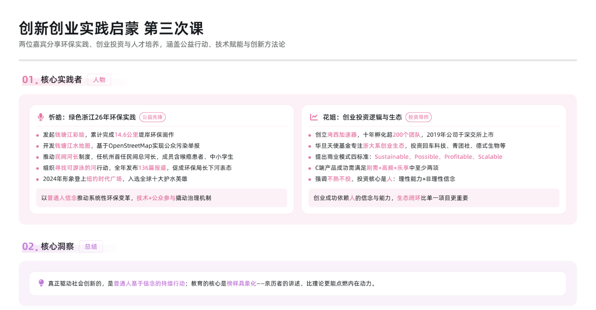

忻皓老师与花姐的分享，像两束光，照亮了我对创新创业的认知。他们一个从环保公益出发，一个从商业投资落笔，却共同诠释了“平凡人改变世界”的力量。

忻皓：用二十年坚持诠释“绿色信仰” 

他讲述的宿管员老汪故事令我动容：一位月薪800元的老人，不仅为环保组织捐出第一笔千元善款，临终前仍坚持巡河记录污染数据。这种超越物质的精神力量，让我明白真正的创新不是颠覆，而是对初心的坚守。他与黄金海骑行环浙的惊险经历，更印证了“看似偶然的机遇，实则是行动派的必然选择”。

花姐：用投资人视角解构创业本质 

她提出的“寻找必胜战役”理论直击痛点：英伟达从解决游戏卡顿到成为AI芯片巨头的蜕变，印证了“小切口撬动大变革”的智慧。而“创始人权重论”让我重新思考：技术可以迭代，但创业者对愿景的偏执才是穿越周期的核心。正如她展示的每日互动孵化案例，真正的创新永远需要“技术理性”与“人文感性”的交织。

下课时“创新创业让世界更美好”的三声呐喊，不仅是口号，更是行动纲领。作为Z世代，我们既要像忻皓老师般保持“一根蜡烛照亮他人”的情怀，也要具备花姐所说的“在不确定性中寻找确定性”的智慧。或许未来的某天，我们也能成为别人故事里的“关键先生”，用看似微小的坚持，汇成改变世界的星河。
