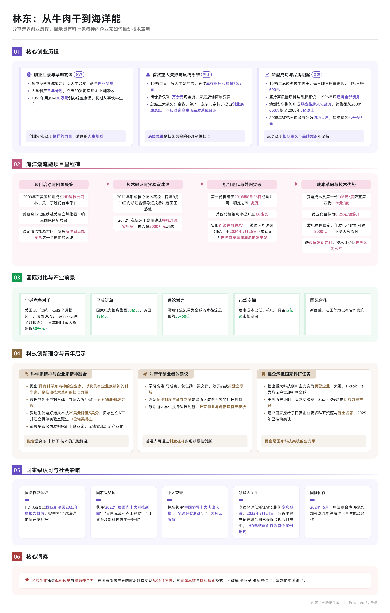

今晚的《创新创业实践启蒙》课，林东学长从“绿盛牛肉干”到“世界首座海洋潮流能电站”的跨界征程，如一道惊雷劈开了我对创新的固有认知。作为一名浙江大学计算机科学与技术专业的大二学生，我原本以为“硬科技”只是实验室里的代码、算法与算力堆叠，但林东学长用十四年如一日的坚守告诉我：真正的创新，是科学家精神与企业家精神的深度融合，是敢把论文写在祖国海疆的孤勇与浪漫。

讲座中最触动我的，是“底线思维”与“长期主义”的辩证。1995年首次创业失败，他亏掉七十多万，却坚持结清所有债务与工资，守住商业信誉的底线；此后跨界海洋能，面对外界“骗子”“疯子”的质疑，他坦言“最坏结果不过亏两亿，但不影响生活品质”，于是轻装上阵、十年磨一剑。这种“谋定而后动、败而不馁”的清醒，正是当下我们在算法内卷与短期KPI焦虑中最缺的定力。他提到“具有科学家精神的企业家，是推动技术革新的核心力量”，让我猛然意识到：计算机不仅是工具，更是重塑能源、制造与社会的底层逻辑。LHD电站的模块化设计、流场数字孪生、智能并网调度与故障预测，哪一项离得开边缘计算、强化学习与数据驱动的支撑？

作为计科学生，我常沉迷于模型参数量与学术刷榜，却少问一句：这行代码能否解决真问题？林东学长在千岛湖建模拟洋流实验室、在舟山抗住台风海浪的迭代，正是“从真实需求出发、用系统工程破局”的生动写照。未来人工智能与实体经济深度融合，正需要既懂技术边界、又懂产业逻辑的“跨界者”。我立志投身能源互联网与具身智能方向，但今晚的课让我明白：技术突破从不靠闭门造车，而要靠整合科学家、工程师、政策与资本的资源协同；创新也非一蹴而就，而是“凝视深渊、嚼碎玻璃仍向前”的韧性。

浙大“求是创新”的校训，在林东学长身上有了具象的刻度。阮俊华老师常说，创新创业启蒙不是教人开公司，而是唤醒改变世界的内驱力。我不求一夜成名，但愿以“科学家精神”打磨技术底座，以“企业家精神”锚定真实需求。未来十年，当海洋潮流能电站遍布黑潮与全球海域，当AI与清洁能源深度耦合，我希望自己能成为那群“把技术论文写在祖国大地上”的浙大人之一。唯有科技创新没有天花板，而我们的征途，既是星辰大海，更是人间烟火。

