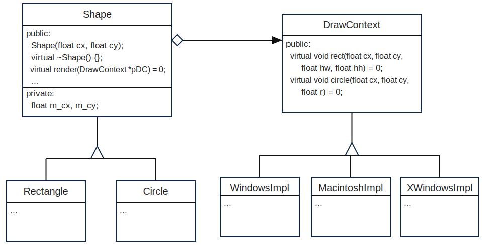

import { PTAQuiz, Q, C, A, Blank, PTACodeContent, Explanation } from "@md-comp/ptaquiz";

# 2025-2026春夏学期_面向对象程序设计考试试卷 - A卷

## 2025-2026春夏学期_面向对象程序设计考试试卷 - A卷

<PTAQuiz multiple-choice correct={1} title="2-1 Which statement about C++ class access specifiers is correct by " meta={{"source": "2025-2026春夏学期_面向对象程序设计考试试卷 - A卷", "points": "2", "author": "李际军 (浙江大学)"}}>
  <Q>
    Which statement about default access specifiers in C++ classes is correct?
  </Q>

  <C>Members of a class default to public</C>
  <C>Members of a class default to private</C>
  <C>Members of a class default to protected</C>
  <C>A struct and a class have identical default access rules</C>

  <Explanation>
    Members of a `class` default to `private`; members of a `struct` default to `public`.
  </Explanation>
</PTAQuiz>

<PTAQuiz multiple-choice correct={1} title="2-2 Given class Derived : public Base {};, which statement about pub" meta={{"source": "2025-2026春夏学期_面向对象程序设计考试试卷 - A卷", "points": "2", "author": "李际军 (浙江大学)"}}>
  <Q>
    Given `class Derived : public Base {};`, which statement about public inheritance is true?
  </Q>

  <C>Private members of Base become public in Derived</C>
  <C>Protected members of Base stay protected in Derived</C>
  <C>Public members of Base become private in Derived</C>
  <C>Protected members of Base become private in Derived</C>

  <Explanation>
    Public inheritance preserves public and protected access levels of base members; private base members are still not directly accessible.
  </Explanation>
</PTAQuiz>

<PTAQuiz multiple-choice correct={0} title="2-3 What core C++ feature enables runtime polymorphism?" meta={{"source": "2025-2026春夏学期_面向对象程序设计考试试卷 - A卷", "points": "2", "author": "李际军 (浙江大学)"}}>
  <Q>
    What core C++ feature enables runtime polymorphism?
  </Q>

  <C>Virtual member functions</C>
  <C>Template specialization</C>
  <C>Static member variables</C>
  <C>Operator overloading</C>

  <Explanation>
    Runtime polymorphism in C++ is enabled by virtual member functions and dynamic dispatch.
  </Explanation>
</PTAQuiz>

<PTAQuiz multiple-choice correct={2} title="2-4 Why prefer passing large objects by const T& instead of pass-by-" meta={{"source": "2025-2026春夏学期_面向对象程序设计考试试卷 - A卷", "points": "2", "author": "李际军 (浙江大学)"}}>
  <Q>
    Why prefer passing large objects by `const T&` instead of passing by value?
  </Q>

  <C>It creates a full copy of the object for safety</C>
  <C>It allows the function to modify the original object</C>
  <C>It avoids expensive copy construction and disallows modification</C>
  <C>It only works for primitive built-in types</C>

  <Explanation>
    `const T&` avoids copying a large object and prevents modification through the parameter. The submitted answer B was wrong; C is correct.
  </Explanation>
</PTAQuiz>

<PTAQuiz multiple-choice correct={3} title="2-5 Where is a static class member variable stored?" meta={{"source": "2025-2026春夏学期_面向对象程序设计考试试卷 - A卷", "points": "2", "author": "李际军 (浙江大学)"}}>
  <Q>
    Where is a static class member variable stored?
  </Q>

  <C>Separately inside each instance object of the class</C>
  <C>On the stack every time a member function is called</C>
  <C>Automatically allocated and destroyed per object constructor/destructor</C>
  <C>In a single shared memory location for all class instances</C>

  <Explanation>
    A static data member belongs to the class and is shared by all objects.
  </Explanation>
</PTAQuiz>

<PTAQuiz multiple-choice correct={2} title="2-6 What is the primary advantage of C++ function templates?" meta={{"source": "2025-2026春夏学期_面向对象程序设计考试试卷 - A卷", "points": "2", "author": "李际军 (浙江大学)"}}>
  <Q>
    What is the primary advantage of C++ function templates?
  </Q>

  <C>They generate runtime-polymorphic virtual functions</C>
  <C>They create static global variables shared by all types</C>
  <C>They allow writing generic code that works with multiple types without duplicate code</C>
  <C>They catch all runtime exceptions automatically</C>

  <Explanation>
    Function templates let one generic definition work for multiple types without duplicating source code.
  </Explanation>
</PTAQuiz>

<PTAQuiz multiple-choice correct={1} title="2-7 What is the purpose of the noexcept specifier on a function?" meta={{"source": "2025-2026春夏学期_面向对象程序设计考试试卷 - A卷", "points": "2", "author": "李际军 (浙江大学)"}}>
  <Q>
    What is the purpose of the `noexcept` specifier on a function?
  </Q>

  <C>The function will catch all exceptions internally</C>
  <C>The function promises it will never throw exceptions; `std::terminate` is called if it does</C>
  <C>The function can only throw standard library exceptions</C>
  <C>Exceptions thrown inside the function are ignored silently</C>

  <Explanation>
    `noexcept` promises that exceptions will not escape. If one does, `std::terminate()` is called.
  </Explanation>
</PTAQuiz>

<PTAQuiz multiple-choice correct={3} title="2-8 What is the function of a virtual destructor in a base class?" meta={{"source": "2025-2026春夏学期_面向对象程序设计考试试卷 - A卷", "points": "2", "author": "李际军 (浙江大学)"}}>
  <Q>
    What is the purpose of a virtual destructor in a base class?
  </Q>

  <C>It allows derived classes to inherit the base class destructor</C>
  <C>It makes all member functions of the class virtual automatically</C>
  <C>It allows static casting between unrelated class types</C>
  <C>It ensures the derived class destructor runs when deleting via a base pointer</C>

  <Explanation>
    A virtual base destructor ensures that deleting through a base pointer also runs the derived destructor.
  </Explanation>
</PTAQuiz>

<PTAQuiz multiple-choice correct={2} title="2-9 Which operator CANNOT be overloaded in C++?" meta={{"source": "2025-2026春夏学期_面向对象程序设计考试试卷 - A卷", "points": "2", "author": "李际军 (浙江大学)"}}>
  <Q>
    Which operator CANNOT be overloaded in C++?
  </Q>

  <C>`+`</C>
  <C>`=`</C>
  <C>`.` (member access dot)</C>
  <C>`[]`</C>

  <Explanation>
    The member access dot operator `.` cannot be overloaded. `+`, `=`, and `[]` can be overloaded.
  </Explanation>
</PTAQuiz>

<PTAQuiz multiple-choice correct={2} title="2-10 Which statement about copy constructors is false?" meta={{"source": "2025-2026春夏学期_面向对象程序设计考试试卷 - A卷", "points": "2", "author": "李际军 (浙江大学)"}}>
  <Q>
    Which statement about copy constructors is false?
  </Q>

  <C>The compiler may generate an implicit copy constructor if none is defined</C>
  <C>A copy constructor takes a reference to the same class type</C>
  <C>A copy constructor can take a value parameter of the same class</C>
  <C>User-defined copy constructors run custom logic for object duplication</C>

  <Explanation>
    A copy constructor cannot take the same class by value; passing the argument would require another copy construction.
  </Explanation>
</PTAQuiz>

<PTAQuiz fill-in-the-blank title="4-1 The output of the code below is:" meta={{"source": "2025-2026春夏学期_面向对象程序设计考试试卷 - A卷", "points": "5", "author": "许威威 (浙江大学)"}}>
  <Q>
    The output of the code below is:
    ```cpp
    #include <iostream>

    struct T {
      T() { std::cout << "T" << std::endl; }
      T(const T &a) { std::cout << "T copy" << std::endl; }
      T& operator=(const T &a) { std::cout << "T operator=" << std::endl; return *this; }
    };

    int main() {
      T a[2];
      T b;
      b = a[0];
      T c = a[1];
      
    }
    ```
    Output:
  </Q>

  Line 1: <Blank>{`T`}</Blank>
  Line 2: <Blank>{`T`}</Blank>
  Line 3: <Blank>{`T`}</Blank>
  Line 4: <Blank>{`T operator=`}</Blank>
  Line 5: <Blank>{`T copy`}</Blank>

  <Explanation>
    `T a[2]` default-constructs two objects, then `T b;` default-constructs one more. `b = a[0];` calls the assignment operator, and `T c = a[1];` copy-constructs `c`.
  </Explanation>
</PTAQuiz>

<PTAQuiz fill-in-the-blank title="4-2 The output of the following code is:" meta={{"source": "2025-2026春夏学期_面向对象程序设计考试试卷 - A卷", "points": "4", "author": "许威威 (浙江大学)"}}>
  <Q>
    ```cpp
    #include <iostream>
    using namespace std;

    template <typename T>
    class TP {
        T m_v1, m_v2;
    public:
        TP(T b1, T b2)
        {
            m_v1 = b1; m_v2 = b2;
        }
        T eval() const
        {
            return m_v1 + m_v2 + (T)10;
        }
    };

    template <>
    class TP<int> {
        int m_v1, m_v2;
    public:
        TP(int v1, int v2)
        {
            m_v1 = v1;
            m_v2 = v2;
        }
        int eval() const
        {
            cout << "TP(int)" << endl;
            return m_v1 + m_v2  - 10;
        }
    };

    int main()
    {
        TP<double> d(10.0, 20.0);
        TP<float>  f(10.0f, 10.0f);
        cout << (int)d.eval() << endl << (int)f.eval() << endl;
        TP<int> x(2, 3);
        cout << x.eval() << endl;
    }

    ```
    Output：
  </Q>

  Line 1: <Blank>{`40`}</Blank>
  Line 2: <Blank>{`30`}</Blank>
  Line 3: <Blank>{`TP(int)`}</Blank>
  Line 4: <Blank>{`-5`}</Blank>

  <Explanation>
    The primary template gives 40 and 30. The `int` specialization prints `TP(int)` inside `eval()` and returns -5.
  </Explanation>
</PTAQuiz>

<PTAQuiz fill-in-the-blank title="4-3 The output of the code below is:" meta={{"source": "2025-2026春夏学期_面向对象程序设计考试试卷 - A卷", "points": "3", "author": "许威威 (浙江大学)"}}>
  <Q>
    ```cpp

    #include <iostream>
    using namespace std;

    void processStr(const string& str)
    {
        if (str == "unexpected string")
            throw str;
        cout << "string read successfully" << endl;
    }

    void catchStr(const string& str)
    {
        try
        {
            processStr(str);
        }
        catch (string& e)
        {
            cout << "exception: " << e << endl;
            throw;
        }
    }

    int main()
    {
        try {
            catchStr("expected string");
            catchStr("unexpected string");
        }
        catch (...)
        {
            cout << "Main exception caught" << endl;
        }
        return 0;
    }
    ```
    Output:
  </Q>

  Line 1: <Blank>{`string read successfully`}</Blank>
  Line 2: <Blank>{`exception: unexpected string`}</Blank>
  Line 3: <Blank>{`Main exception caught`}</Blank>

  <Explanation>
    The first string is processed normally. The second throws a `string`, is caught and printed in `catchStr`, then rethrown and caught by `main`.
  </Explanation>
</PTAQuiz>

<PTAQuiz fill-in-the-blank title="4-4 The output of the code below is:" meta={{"source": "2025-2026春夏学期_面向对象程序设计考试试卷 - A卷", "points": "3", "author": "许威威 (浙江大学)"}}>
  <Q>
    ```cpp
    #include <iostream>
    using namespace std;

    class C {
        int i;
    public:
        C() : i(10) {}
        ~C() { cout << get() << endl; }
        void set(int i) { this->i = i; }
        int get() { return i; }
    };

    class D : public C
    {
    public:
        D() {}

    };

    class A {
        int i;
    public:
        A() : i(0) {}
        virtual ~A() { cout << get() <<endl; }
        void set(int i) { this->i = i; }
        int get() { return i; }
    };

    class B : public A
    {
    public:
        B() {}
        ~B() { cout << "~B " << get() << endl; }
    };

    int main()
    {
        A* p = new B();
        delete p;

         C* p1 = new D();
        delete p1;

        return 0;
    }
    ```
    Output:
  </Q>

  Line 1: <Blank>{`~B 0`}</Blank>
  Line 2: <Blank>{`0`}</Blank>
  Line 3: <Blank>{`10`}</Blank>

  <Explanation>
    Deleting `B` through `A*` is safe because `A` has a virtual destructor. Deleting `D` through `C*` is undefined by the standard because `C` has a non-virtual destructor; the expected educational result is a single `C` destructor output of 10.
  </Explanation>
</PTAQuiz>

<PTAQuiz fill-in-the-blank title="4-5 The output of the code below is" meta={{"source": "2025-2026春夏学期_面向对象程序设计考试试卷 - A卷", "points": "5", "author": "陈翔 (浙江大学)"}}>
  <Q>
    The output of the code below is:

    ```cpp
    #include <iostream>
    using namespace std;

    class Counter {
        static int count;
    public:
        Counter() { ++count; cout << "C+" << count << endl; }
        ~Counter() { cout << "C-" << count << endl; --count; }
    };

    int Counter::count = 0;

    void testExcept() {
        Counter c1;
        throw int(42);
    }

    int main() {
        try {
            Counter c2;
            testExcept();
        } catch (int e) {
            cout << "Catch " << e << endl;
        }
        return 0;
    }
    ```

    Output:
  </Q>

  Line 1: <Blank>{`C+1`}</Blank>
  Line 2: <Blank>{`C+2`}</Blank>
  Line 3: <Blank>{`C-2`}</Blank>
  Line 4: <Blank>{`C-1`}</Blank>
  Line 5: <Blank>{`Catch 42`}</Blank>

  <Explanation>
    `c2` and `c1` construct with counts 1 and 2. Stack unwinding destroys `c1` then `c2`, and the catch block prints the exception value.
  </Explanation>
</PTAQuiz>

<PTAQuiz fill-in-the-blank title="4-6 The output of the code below is" meta={{"source": "2025-2026春夏学期_面向对象程序设计考试试卷 - A卷", "points": "5", "author": "陈翔 (浙江大学)"}}>
  <Q>
    The output of the code below is:

    ```cpp
    #include <iostream>
    using namespace std;

    template <typename T>
    class Wrapper {
        T val;
    public:
        Wrapper(T v) : val(v) { cout << "Wrap" << endl; }
        
        operator int() const {
            cout << "Cast" << endl;
            return static_cast<int>(val);
        }
        
        Wrapper<T>& operator+=(const Wrapper<T>& rhs) {
            val += rhs.val;
            cout << "Add" << endl;
            return *this;
        }
    };

    int main() {
        Wrapper<double> w1(3.5);
        Wrapper<double> w2(1.5);
        w1 += w2;
        int result = static_cast<int>(w1);
        cout << "Res " << result << endl;
        return 0;
    }
    ```

    Output:
  </Q>

  Line 1: <Blank>{`Wrap`}</Blank>
  Line 2: <Blank>{`Wrap`}</Blank>
  Line 3: <Blank>{`Add`}</Blank>
  Line 4: <Blank>{`Cast`}</Blank>
  Line 5: <Blank>{`Res 5`}</Blank>

  <Explanation>
    The constructors print twice, `+=` prints `Add`, conversion to `int` prints `Cast`, and `3.5 + 1.5` converts to 5.
  </Explanation>
</PTAQuiz>

<PTAQuiz fill-in-the-blank title="4-7 The output of the code below is" meta={{"source": "2025-2026春夏学期_面向对象程序设计考试试卷 - A卷", "points": "5", "author": "陈翔 (浙江大学)"}}>
  <Q>
    The output of the code below is:

    ```cpp
    #include <iostream>
    using namespace std;

    class Num {
        int value;

    public:
        Num(int v) : value(v) {
            cout << "Num " << value << endl;
        }

        Num(const Num& other) : value(other.value + 1) {
            cout << "Copy " << value << endl;
        }

        void add(int x) {
            value += x;
            cout << "Add " << value << endl;
        }

        void show() const {
            cout << "Show " << value << endl;
        }
    };

    void changeByValue(Num n) {
        n.add(5);
    }

    void changeByRef(Num& n) {
        n.add(5);
    }

    int main() {
        Num a(10);

        changeByRef(a);
        changeByValue(a);

        a.show();
    }
    ```

    Output:
  </Q>

  Line 1: <Blank>{`Num 10`}</Blank>
  Line 2: <Blank>{`Add 15`}</Blank>
  Line 3: <Blank>{`Copy 16`}</Blank>
  Line 4: <Blank>{`Add 21`}</Blank>
  Line 5: <Blank>{`Show 15`}</Blank>

  <Explanation>
    Reference passing modifies `a` to 15. Value passing copy-constructs a separate object with value 16 and modifies only that copy to 21.
  </Explanation>
</PTAQuiz>

<PTAQuiz fill-in-the-blank-for-programming title="5-1 Fantasy Adventure" meta={{"source": "2025-2026春夏学期_面向对象程序设计考试试卷 - A卷", "points": "10", "author": "Weng Kai (浙江大学)"}}>
  <Q>
    # Adventurer's Gear Pointer

    ## Problem Description

    In a fantasy adventure game, every character needs to manage their own equipment. Complete `GearPtr<T>` so it supports dereference, arrow access, subscript access, and pointer assignment.

    ## Code

    <PTACodeContent lang="cpp">
      {`#include <iostream>
      #include <string>
      using namespace std;

      class Weapon {
      private:
          string name;
          int power;
      public:
          Weapon(string n, int p) : name(n), power(p) {}
          void show() const { cout << "Weapon: " << name << ", Power: " << power << endl; }
      };

      template<typename T>
      class GearPtr {
      private:
          T* gear;
      public:
          GearPtr(T* g = nullptr) : `}
      <Blank>{`gear(g)`}</Blank>
      {` {}
          ~GearPtr() { delete gear; }
          T& operator*() { return `}
      <Blank>{`*gear`}</Blank>
      {`; }
          T* operator->() { return `}
      <Blank>{`gear`}</Blank>
      {`; }
          GearPtr& operator=(T* g);
          `}
      <Blank>{`T&`}</Blank>
      {` operator[](size_t index) { return `}
      <Blank>{`gear[index]`}</Blank>
      {`; }
      };

      template<typename T>
      `}
      <Blank>{`GearPtr<T>`}</Blank>
      {`& `}
      <Blank>{`GearPtr<T>`}</Blank>
      {`::operator=(T* g) {
          if (`}
      <Blank>{`gear != g`}</Blank>
      {`) {
              delete gear;
              `}
      <Blank>{`gear = g`}</Blank>
      {`;
          }
          return `}
      <Blank>{`*this`}</Blank>
      {`;
      }

      int main() {
          int val;
          cin >> val;
          GearPtr<int> rune(new int(10));
          cout << "Rune Power: " << *rune << endl;
          *rune = val;
          cout << "Updated: " << *rune << endl;
          rune = new int(42);
          cout << "New Rune Power: " << *rune << endl;
          GearPtr<Weapon> weaponPtr(new Weapon("Axe", 80));
          weaponPtr->show();
          Weapon* w2 = new Weapon("Spear", 65);
          weaponPtr = w2;
          weaponPtr->show();
      }`}
    </PTACodeContent>

    ## Input and Output

    ```txt
    1
    ```

    ```txt
    Rune Power: 10
    Updated: 1
    New Rune Power: 42
    Weapon: Axe, Power: 80
    Weapon: Spear, Power: 65
    ```
  </Q>

  <Explanation>
    The correct class-template out-of-class definition is `GearPtr<T>& GearPtr<T>::operator=(T* g)`. The submitted answer was not trusted: it omitted `<T>` and used `g!=nullptr`, which would not correctly handle assignment to null.
  </Explanation>
</PTAQuiz>

<PTAQuiz fill-in-the-blank-for-programming title="5-2 Adventurer's Party System" meta={{"source": "2025-2026春夏学期_面向对象程序设计考试试卷 - A卷", "points": "20", "author": "陈翔 (浙江大学)"}}>
  <Q>
    ### Problem Description

    Complete the abstract base class `Character` and derived class `Wizard`. The system needs polymorphic actions, a static active-character count, `operator+=`, stream output, and exception handling.

    ### Code

    <PTACodeContent lang="cpp">
      {`#include <iostream>
      #include <string>
      using namespace std;

      class ExhaustedException {
      public:
          void warn() `}
      <Blank>{`const`}</Blank>
      {` { cout << "Action failed: Exhausted!" << endl; }
      };

      class Character {
      protected:
          string name;
          `}
      <Blank>{`static`}</Blank>
      {` int activeCount;
      public:
          Character(const string& n) : `}
      <Blank>{`name(n)`}</Blank>
      {` { activeCount++; }
          `}
      <Blank>{`virtual`}</Blank>
      {` ~Character() { activeCount--; }
          `}
      <Blank>{`virtual`}</Blank>
      {` void action() `}
      <Blank>{`= 0`}</Blank>
      {`;
          `}
      <Blank>{`static`}</Blank>
      {` int getCount() { return activeCount; }
          `}
      <Blank>{`friend ostream&`}</Blank>
      {` operator<<(ostream& os, const Character& c);
      };

      `}
      <Blank>{`int Character::activeCount`}</Blank>
      {` = 0;

      ostream& operator<<(ostream& os, const Character& c) { os << "[" << c.name << "]"; return os; }

      class Wizard : `}
      <Blank>{`public Character`}</Blank>
      {` {
      private:
          int mana;
      public:
          Wizard(const string& n, int m) : `}
      <Blank>{`Character(n)`}</Blank>
      {`, mana(m) {}
          void action() override {
              if (mana < 10) { `}
      <Blank>{`throw`}</Blank>
      {` ExhaustedException(); }
              mana -= 10;
              cout << name << " casts Fireball! Mana left: " << mana << endl;
          }
          Wizard& `}
      <Blank>{`operator+=`}</Blank>
      {`(const Wizard& other) {
              this->name = this->name + "+" + other.name;
              this->mana += other.mana;
              return *this;
          }
      };

      int main() {
          int initialMana = 5;
          `}
      <Blank>{`try`}</Blank>
      {` {
              Wizard w1("Gandalf", initialMana);
              Wizard w2("Merlin", 5);
              w1 `}
      <Blank>{`+=`}</Blank>
      {` w2;
              cout << "Party: " << w1 << endl;
              Character* ptr = &w1;
              ptr->action();
              ptr->action();
          } `}
      <Blank>{`catch`}</Blank>
      {` (const `}
      <Blank>{`ExhaustedException&`}</Blank>
      {` e) {
              e.warn();
          }
          cout << "Active characters: " << `}
      <Blank>{`Character::getCount()`}</Blank>
      {` << endl;
          return 0;
      }`}
    </PTACodeContent>

    ### Output

    ```txt
    Party: [Gandalf+Merlin]
    Gandalf+Merlin casts Fireball! Mana left: 0
    Action failed: Exhausted!
    Active characters: 0
    ```
  </Q>

  <Explanation>
    `activeCount` is static, the base destructor is virtual, `action` is pure virtual, and `Wizard` combines objects with `operator+=`. The exhausted action throws `ExhaustedException` and is caught by const reference.
  </Explanation>
</PTAQuiz>

<PTAQuiz subjective title="8-1 Abstraction" meta={{"source": "2025-2026春夏学期_面向对象程序设计考试试卷 - A卷", "points": "20", "author": "许威威 (浙江大学)"}}>
  <Q>
    In computer science, abstraction is an effective way to hide implementation complexity. For instance, suppose we want to design a shape-drawing program for different operating systems, such as *Windows*, *Macintosh*, *X Windows*, and so on. However, the SDK functions for drawing shapes, such as rectangles and circles, are different on these systems:
    1.	*Windows*:
        `WRect(float lx, float ly, float w, float h)` for rectangles,
        `WCircle(float cx, float cy, float r)` for circles.
    2.	*Macintosh*:
        `MRect(float lx, float ly, float rx, float ry)` for rectangles,
        `MCircle(float cx, float cy, float r)` for circles.
    3.	*X Windows*:
        `XRect(float cx, float cy, float hw, float hh)` for rectangles,
        `XCircle(float cx, float cy, float r)` for circles.

    The function parameters are specified as follows:
    * `(cx, cy)`: the center of a rectangle or circle
    * `(w, h)`: the width and height of a rectangle
    * `(lx, ly)`: the bottom-left corner of a rectangle
    * `(rx, ry)`: the top-right corner of a rectangle
    * `(hw, hh)`: the half-width and half-height of a rectangle
    * `(r)`: the radius of a circle

    Thus, it is necessary to introduce interface abstraction to decouple the shape-drawing code from the operating-system-dependent SDK functions. We can then design the class hierarchy as follows:

    

    The following code shows the main function of the program, and the program's output is listed after the code. **You must implement five classes: `WindowsImpl`, `MacintoshImpl`, `XWindowsImpl`, `Rectangle`, and `Circle` in your submission. From the code and output, you can see that switching between different drawing functions does not affect the implementation of the shape classes. Please implement all the necessary functions required for these classes.**

    ```cpp
    #include <iostream>

    using namespace  std;

    void WRect(float lx, float ly, float w, float h)
    {
        cout << "Windows WRect (lx,ly,w,h) " << lx << "," << ly << "," << w << "," << h << "," << endl;
    }

    void WCircle(float x, float y, float r)
    {
        cout << "Windows WCircle" << endl;
    }

    void MRect(float lx, float ly, float rx, float ry)
    {
        cout << "Macintosh MRect (lx,ly,rx,ry) " << lx << "," << ly  <<"," << rx << "," << ry << "," << endl;
    }

    void MCircle(float x, float y, float r)
    {
        cout << "Macintosh MCircle" << endl;
    }

    void XRect(float cx, float cy, float hw, float hh)
    {
        cout << "XWindows XRect (cx,cy,hw,hh) " << cx << "," << cy << "," << hw << "," << hh << ","  <<endl;
    }

    void XCircle(float x, float y, float r)
    {
        cout << "XWindows XCircle" << endl;
    }

    class DrawContext
    {
    public:
        virtual void rect(float cx, float cy, float hw, float hh) = 0;
        virtual void circle(float cx, float cy, float r) = 0;
    };

    class WindowsImpl : public DrawContext
    {
    public:
        // todo ...
    };

    class MacintoshImpl : public DrawContext
    {
        // todo ...
    };

    class XWindowsImpl : public DrawContext
    {
        // todo ...
    };


    class Shape
    {
    public:
        Shape(float cx, float cy) { m_cx = cx, m_cy = cy; }
        virtual ~Shape() {}
        virtual void render(DrawContext* pDC) = 0;
        float getCX() { return m_cx; }
        float getCY() { return m_cy; }
    private:
        float m_cx, m_cy;
    };

    class Rectangle : public Shape
    {
    public:
        // Ctor signature: Rectangle(float cx, float cy, float hw, float hh);
        // todo ...
    };

    class Circle : public Shape
    {
    public:
        // Ctor signature: Circle(float cx, float cy, float r);
        // todo ...
    };

    int main()
    {
        Rectangle r1(10, 10, 4, 4);
        Circle c1(5, 5, 6);

        DrawContext* pDC = new WindowsImpl();
        r1.render(pDC);
        c1.render(pDC);

        pDC = new MacintoshImpl();
        r1.render(pDC);
        c1.render(pDC);

        pDC = new XWindowsImpl();
        r1.render(pDC);
        c1.render(pDC);
    }
    ```

    **Program output:**

    ```
    Windows WRect (lx,ly,w,h) 6,6,8,8,
    Windows WCircle
    Macintosh MRect (lx,ly,rx,ry) 6,6,14,14,
    Macintosh MCircle
    XWindows XRect (cx,cy,hw,hh) 10,10,4,4,
    XWindows XCircle
    ```
  </Q>

  <A>
    ```cpp
    class WindowsImpl : public DrawContext {
    public:
        void rect(float cx, float cy, float hw, float hh) override { WRect(cx - hw, cy - hh, 2 * hw, 2 * hh); }
        void circle(float cx, float cy, float r) override { WCircle(cx, cy, r); }
    };

    class MacintoshImpl : public DrawContext {
    public:
        void rect(float cx, float cy, float hw, float hh) override { MRect(cx - hw, cy - hh, cx + hw, cy + hh); }
        void circle(float cx, float cy, float r) override { MCircle(cx, cy, r); }
    };

    class XWindowsImpl : public DrawContext {
    public:
        void rect(float cx, float cy, float hw, float hh) override { XRect(cx, cy, hw, hh); }
        void circle(float cx, float cy, float r) override { XCircle(cx, cy, r); }
    };

    class Rectangle : public Shape {
        float m_hw, m_hh;
    public:
        Rectangle(float cx, float cy, float hw, float hh) : Shape(cx, cy), m_hw(hw), m_hh(hh) {}
        void render(DrawContext* pDC) override { pDC->rect(getCX(), getCY(), m_hw, m_hh); }
    };

    class Circle : public Shape {
        float m_r;
    public:
        Circle(float cx, float cy, float r) : Shape(cx, cy), m_r(r) {}
        void render(DrawContext* pDC) override { pDC->circle(getCX(), getCY(), m_r); }
    };
    ```
  </A>

  <Explanation>
    This is the bridge idea: shapes depend only on `DrawContext`, while platform-specific coordinate conversion lives in the concrete implementation classes.
  </Explanation>
</PTAQuiz>
