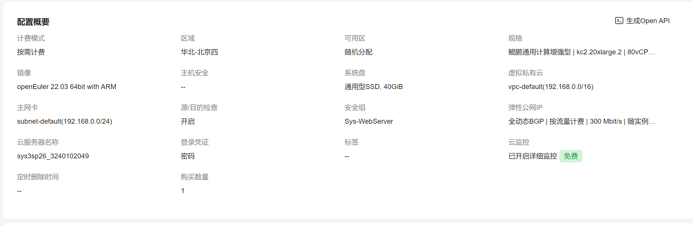
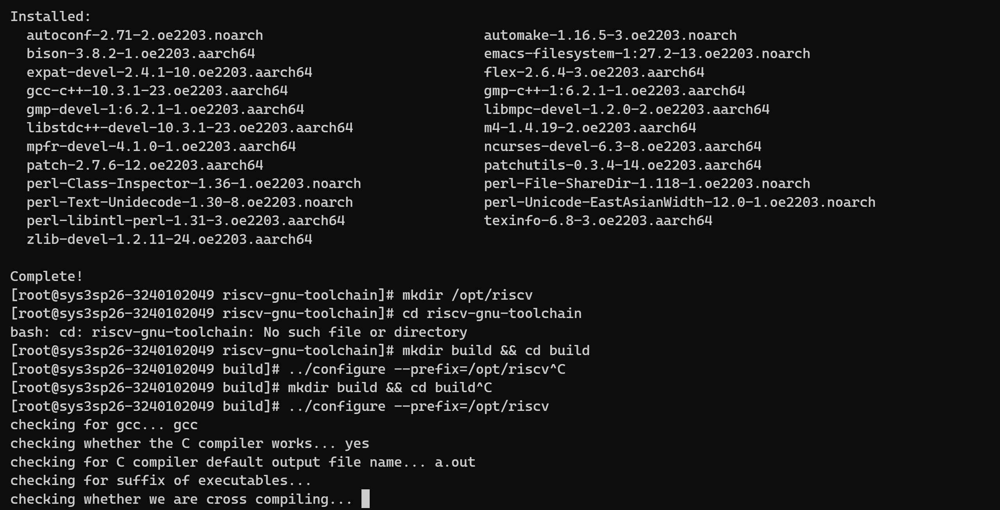
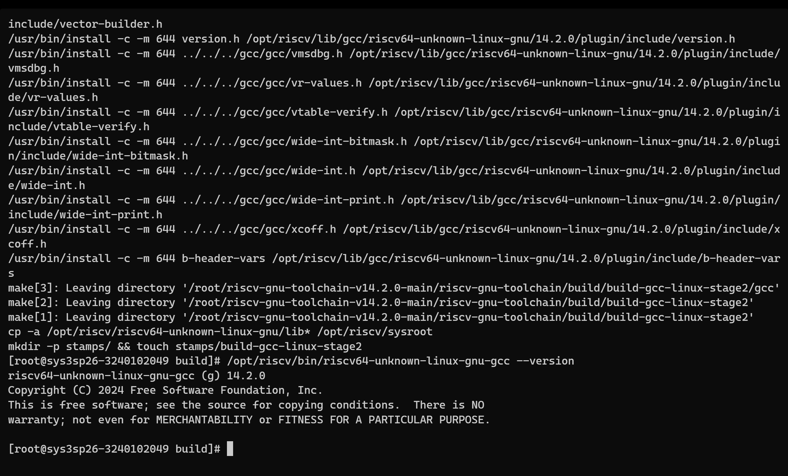
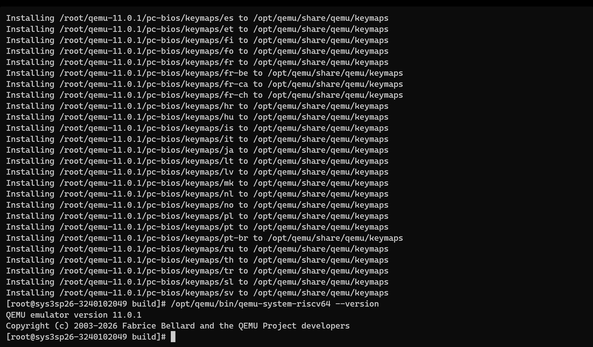
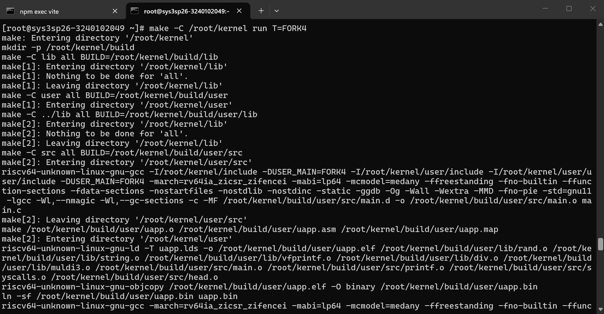
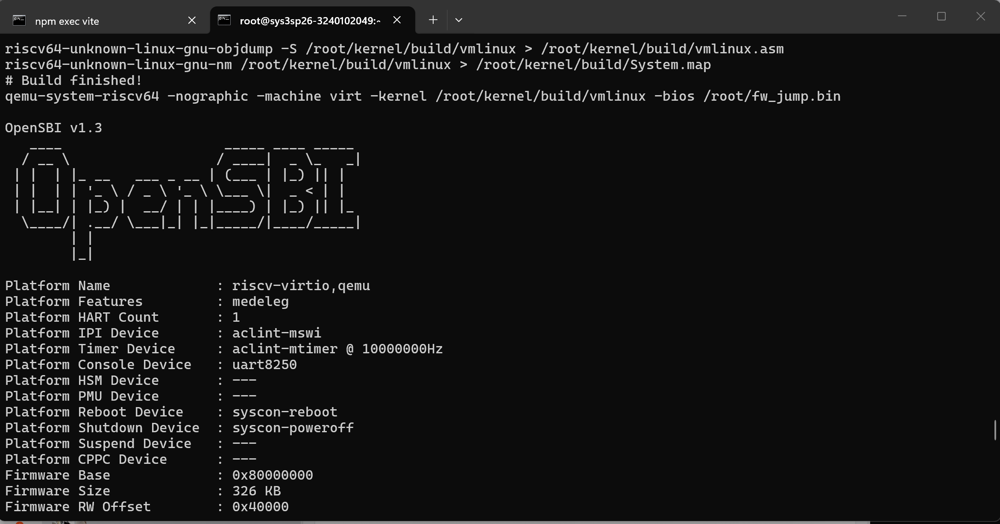
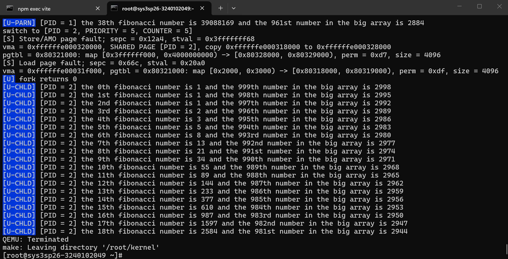

import Asciinema from "@md-components/AsciinemaWrapper.vue";

# Bonus: ARM 架构下的 RISC-V 交叉编译与运行 实验报告

## Asciinema


import castMain from "./demo1.cast?url";

<Asciinema url={castMain} />

~~全程~~录像。出于性能考虑，完整的编译过程将略去，因此，实际浏览的过程中，具体编译过程中可能会有跳跃。

## 环境配置

### 购买服务器



我们使用的是kc2.20xlarge.2，以获得更好的编译体验。

### 宿主机信息

```
[root@sys3sp26-3240102049 ~]# hostname
sys3sp26-3240102049

[root@sys3sp26-3240102049 ~]# uname -m
aarch64
```

宿主机为华为云鲲鹏 ECS，运行 openEuler 22.03 64bit with ARM，CPU 架构为 AArch64。

### 编译过程截图

安装riscv toolchain：





安装qemu：




## Task1：鲲鹏处理器 (ARM) 与 RISC-V 架构对比

1. **鲲鹏处理器与 ARM 架构简介**

鲲鹏（Kunpeng）处理器是华为基于 ARM 架构自主研发的服务器级 CPU，采用 ARMv8-A 指令集架构（ISA）

ARM 架构是精简指令集计算机（RISC）的代表，早期由 Acorn 公司设计，后经 ARM Holdings 推广，现广泛应用于移动设备、嵌入式系统和服务器领域。ARMv8-A 引入了 64 位执行状态（AArch64），支持 31 个通用寄存器（X0-X30）、64 位寻址空间。

2. **RISC-V 架构简介**

RISC-V 是一个开源的 RISC 指令集架构，由加州大学伯克利分校开发，具有高度模块化和可扩展性。RISC-V 的基础整数指令集（RV32I / RV64I）固定且精简，通过标准扩展（如 M、A、F、D、C 等）按需添加功能。

3. **ARM 与 RISC-V 对比分析**

| 对比维度 | ARM | RISC-V |
|----------|---------------|---------------|
| **指令集开放程度** | 闭源，需授权 | 开源，自由使用 |
| **基础指令数** | 较多（含复杂寻址模式） | 极少（RV64I 仅 47 条） |
| **通用寄存器** | 31 个 (X0-X30) | 32 个 (x0-x31) |
| **零寄存器** | WZR / XZR (32/64-bit) | x0 恒为 0 |
| **条件执行** | 条件标志位 (NZCV)；在 AArch64（64位模式）下，绝大多数指令已取消条件执行，仅保留少数特定条件选择指令（如 CSEL） | 无标志位，用分支指令替代 |
| **特权级** | EL0-EL3 (4级) | M/S/U 模式 (3级，可扩展) |
| **虚拟化** | 原生支持 (EL2) | 需 H 扩展 |
| **立即数编码** | 灵活但复杂 | 固定格式，简洁统一 |
| **压缩指令** | Thumb (变长) | C 扩展 (16-bit) |
| **内存模型** | 较强（multi-copy atomic） | 较弱但灵活 (RVWMO) |
| **生态系统** | 极其成熟 | 快速发展中 |
| **授权模式** | 商业授权，费用高昂 | 无授权费，BSD 许可证 |

**设计哲学差异**

- **ARM** 追求商业化与广泛兼容，指令集随历史演变有一定复杂度（如条件执行、多种寻址模式），但生态工具链极为成熟。
- **RISC-V** 遵循"精简至上"原则，基础指令集固定且最小化，模块化扩展使得定制 SoC 非常灵活，避免了 ARM 的历史包袱。

### 交叉编译与 QEMU 理解的异同

在先前的实验中，我们在 x86_64 主机上使用 RISC-V 交叉编译工具链，通过 QEMU 模拟 RISC-V 环境运行内核。本次 Bonus 实验将主机架构换为 ARM (AArch64)，实质上是"从一个 RISC 架构交叉编译到另一个 RISC 架构"。

- **相同点**：交叉编译工具链的原理一致——编译器在宿主机（ARM）上运行，但生成目标机（RISC-V）的机器码。QEMU 的模拟方式也相同，都是通过软件翻译执行 RISC-V 指令。
- **不同点**：
  - x86_64 使用 CISC 架构，有丰富的预编译工具链可用；ARM 上也需自行编译工具链
  - ARM 和 RISC-V 同为 RISC 架构，在某些设计思想上更为接近（如固定长度指令、load-store 架构），这使得某些编译优化策略有相似性
  - QEMU 在 ARM 上运行 riscv64 模拟需要翻译两次（RISC-V 指令 → 宿主机 ARM 指令），相比 x86_64 宿主机，ARM 的低功耗特性使得模拟性能略有不同


## Task2：在鲲鹏处理器上进行 kernel 的编译运行


### Makefile 修改

对比原 `Makefile`，在鲲鹏 ECS 上需要做以下修改：

#### 交叉编译器前缀

```diff
- CROSS_ := riscv64-linux-gnu-
+ CROSS_ := /opt/riscv/bin/riscv64-unknown-linux-gnu-
```

工具链前缀也由 `riscv64-linux-gnu-` 改为实际编译产物 `riscv64-unknown-linux-gnu-`。

#### 工作目录修正

```diff
+ CURDIR = /root/sys3labs/src/project/kernel
+ BUILD := $(CURDIR)/build
```

新增 `CURDIR` 指向工程实际路径，并定义 `BUILD` 变量将编译产物统一输出到 `build/` 子目录。

#### OpenSBI 固件路径

```diff
- SPIKE_CONF := $(realpath $(CURDIR)/../../../repo/sys-project/spike)
- qemu-system-riscv64 ... -bios $(SPIKE_CONF)/fw_jump.bin
+ FW_JUMP := /root/fw_jump.bin
+ qemu-system-riscv64 ... -bios $(FW_JUMP)
```

我们直接将`fw_jump.bin`上传到了`~/`，因此这里也要对应修改：将 `fw_jump.bin` 路径指向实际存放位置 `/root/fw_jump.bin`。

### 编译、运行kernel







## 总结

本次 Bonus 实验完成了在华为云鲲鹏 ARM 服务器上自行编译 RISC-V 交叉编译工具链与 QEMU 模拟器，并成功将 lab5 的 kernel 编译运行起来。相较于先前在 x86_64 环境上的实验，主要区别在于：

1. ARM 架构上缺少预编译的 RISC-V 工具链，需自行编译，过程与 x86_64 类似但耗时更长
2. Makefile 需要适配工具链的完整路径和 OpenSBI 固件的本地路径
3. 最终 kernel 在 QEMU 中运行效果与 x86_64 环境下一致，验证了交叉编译与模拟的跨平台正确性

整个实验加深了对交叉编译原理、RISC-V 与 ARM 两种 RISC 架构异同、以及 QEMU 用户态模拟机制的理解。
