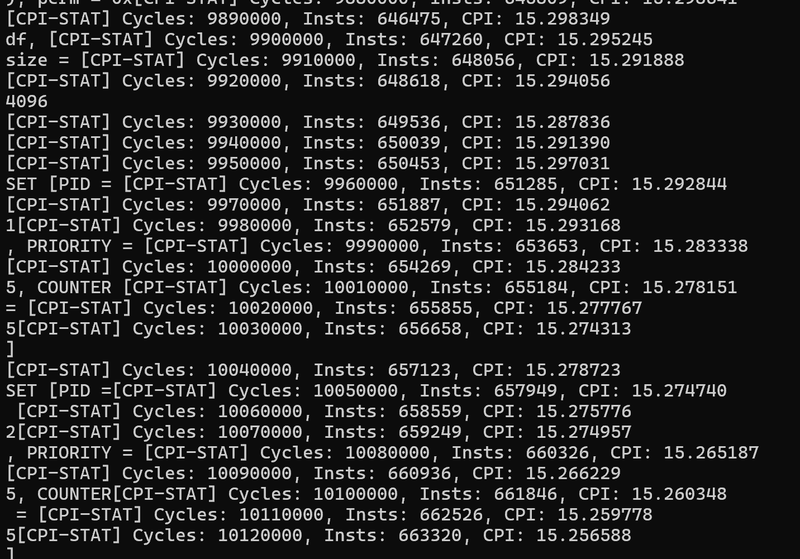
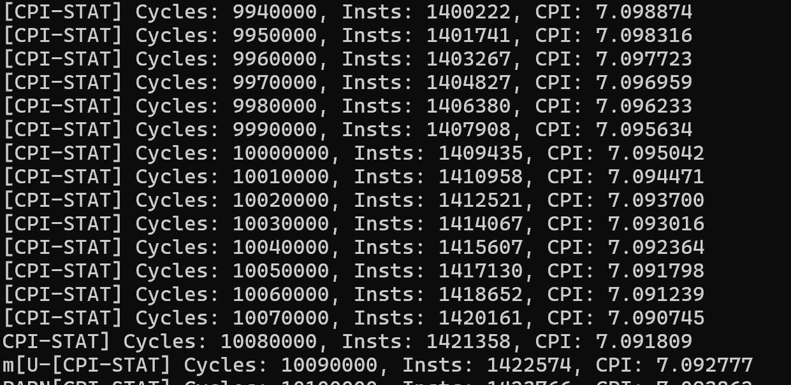
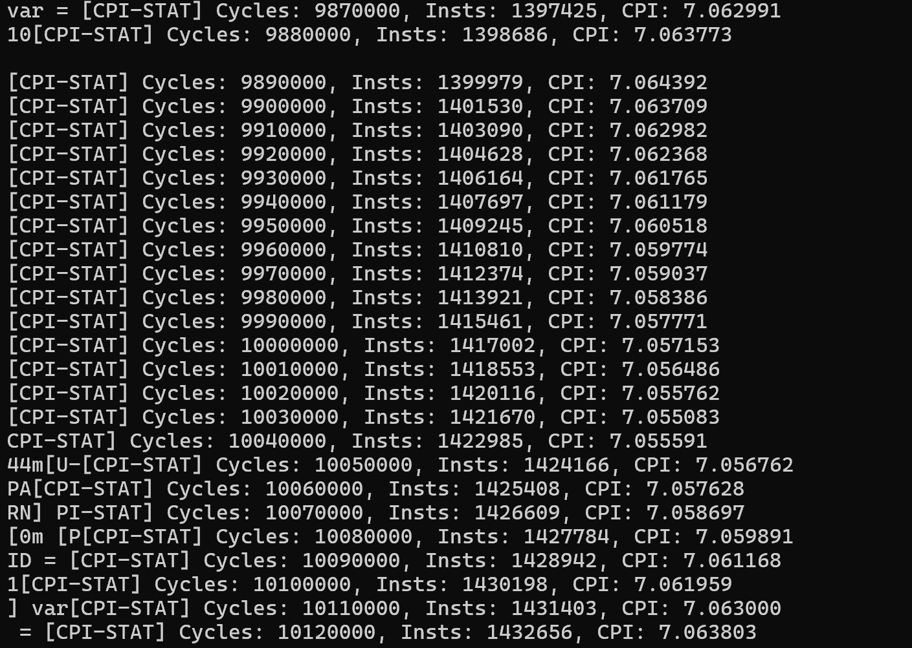
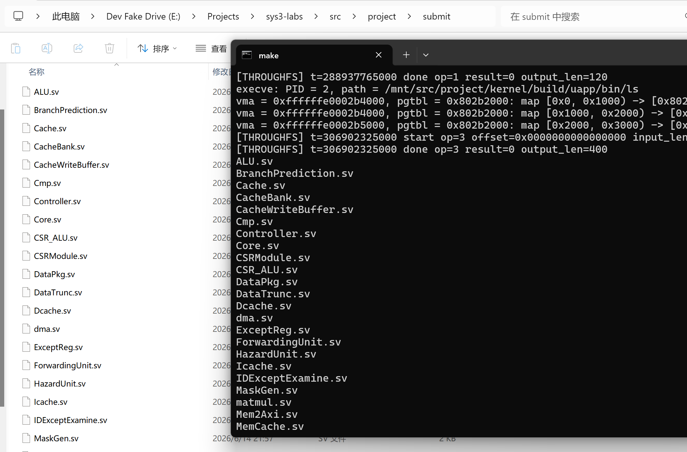
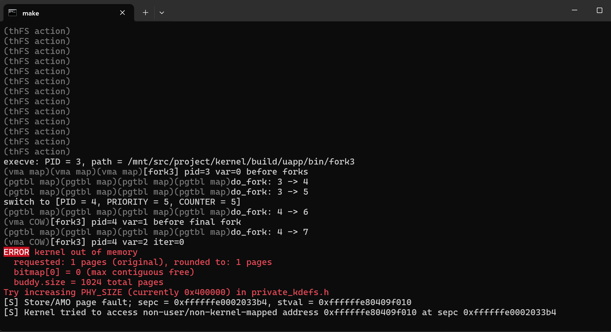

import Asciinema from "@md-components/AsciinemaWrapper.vue";

# Xpart：RV64 MMU 及软硬件贯通综合实验 实验报告

## TL; DR

必做部分：

- [实现 MMU 及 page fault 抛出，运行起 lab5 中的 kernel](#必做部分：运行起-lab-5-中的-kernel) 

选做部分：

- [实现 TLB 模块](#拓展部分：实现-tlb-模块)
- [实现 RSB 模块](#拓展部分：-return-stack-buffer-rsb)
- [在 MMU 基础上添加 Cache 模块](#拓展部分：在-mmu-基础上添加-cache-模块)
- [实现 M 拓展](#选做部分：-risc-v-m-扩展（乘除法指令）实现)
- [实现外设乘法加速器和矩阵乘法加速器](#拓展部分：-mmio-通用计算加速和专用硬件加速)
- [实现内核的输入输出，以及给硬件实现stdin支持](#支线任务：改uart-mmio以使cp-u支持stdin)
- [支持 VFS 与任意文件的 open、read、write]()
- [实现 ELF 文件的解析与加载]()
- [实现 shell （支持pipe，历史记录，自动补全，支持内置指令cd,exit,echo,pwd,history，外部指令通过作为elf文件提供）]()
- [实现 malloc、free]()


代码中废话比较多，信息密度不高。不想看文章的话可以直接读ToC。XD

**在本次实验中，实现了支持MMU和相关加速的流水线CPU，通过MMIO实现了控制台输入输出，以及宿主机文件系统操作的映射，然后实现了能在该CPU上运行的简易kernel，支持VFS，支持从文件系统中解析elf，支持shell。**


## 支线任务：创建 `project.f` 以便verilator，slang-server以及相关的MCP工具使用

> `-f <file>`
> 
> Read the specified file, and act as if all text inside it was specified as command line arguments. Any relative paths are relative to the current directory. See also `-F` option. Note `-f` is relatively standard across Verilog tools.
> 
> The file may contain `//` comments which are ignored until the end of the line. It may also contain `/* .. */` comments which are ignored, be cautious that wildcards are not handled in -f files, and that `directory/*` is the beginning of a comment, not a wildcard. Any `$VAR`, `$(VAR)`, or `${VAR}` will be replaced with the specified environment variable.
>
> *Ref: [verilator Arguments — Verilator Devel 5.049 documentation](https://verilator.org/guide/latest/exe_verilator.html#cmdoption-f)*

事实上，虽然还没有标准化，`-f`已经成为了很多库的事实标准。包括verilator；

此外还有`slang`和`slang-server`，我们使用这一套工具做Language server；

`sv-nav-mcp`也一样。

所以我们应当写一个这样的文件。

`project.f`：

```plaintext
+incdir+repo/sys-project/include

// General infrastructure
repo/sys-project/general/Axi_ift.sv
repo/sys-project/general/Mem_ift.sv
repo/sys-project/general/Decoupled_ift.sv
repo/sys-project/general/misc.sv
repo/sys-project/general/fifo.sv
repo/sys-project/general/conv.sv
repo/sys-project/general/Axi_InterConnect.sv
repo/sys-project/general/AxiCore.sv
repo/sys-project/general/DRAM.sv
repo/sys-project/general/uart.sv
repo/sys-project/general/SCPU.sv
repo/sys-project/general/async.v

// Our core
src/project/submit/ALU.sv
src/project/submit/BranchPrediction.sv
src/project/submit/Cmp.sv
src/project/submit/Controller.sv
src/project/submit/Core.sv
src/project/submit/CSR_ALU.sv
src/project/submit/CSRModule.sv
src/project/submit/DataPkg.sv
src/project/submit/DataTrunc.sv
src/project/submit/Dcache.sv
src/project/submit/ExceptReg.sv
src/project/submit/ForwardingUnit.sv
src/project/submit/HazardUnit.sv
src/project/submit/Icache.sv
src/project/submit/IDExceptExamine.sv
src/project/submit/MaskGen.sv
src/project/submit/MemCache.sv
src/project/submit/Mem2Axi.sv
src/project/submit/MemInterfaceCtrl.sv
src/project/submit/SimpleTLB.sv
src/project/submit/MMU.sv
src/project/submit/RegFile.sv

// Simulation
repo/sys-project/sim/sim_uart.sv
repo/sys-project/sim/testbench.sv
```

## 前置任务：改造lab3 kernel适配硬件

- 删除`mm.c`中的`memset`
    ```diff
    --- a/src/project/kernel/arch/riscv/kernel/mm.c
    +++ b/src/project/kernel/arch/riscv/kernel/mm.c
    @@ -131,11 +136,8 @@ static void buddy_init(void) {
       buddy.size = buddy_size;
       buddy.bitmap = free_page_start;
       free_page_start = (uint8_t *)free_page_start + 2 * buddy.size * sizeof(*buddy.bitmap);
    -  memset(buddy.bitmap, 0, 2 * buddy.size * sizeof(*buddy.bitmap));
    -  // alloc space for ref_cnt
       buddy.ref_cnt = free_page_start;
       free_page_start = (uint8_t *)free_page_start + buddy.size * sizeof(*buddy.ref_cnt);
    -  memset(buddy.ref_cnt, 0, buddy.size * sizeof(*buddy.ref_cnt));
    
       uint64_t node_size = 2 * buddy.size;
       for (uint64_t i = 0; i < 2 * buddy.size - 1; ++i) {
    ```
- 修改`private_kdefs.h`中的常量
    ```diff
    --- a/src/project/kernel/arch/riscv/include/private_kdefs.h
    +++ b/src/project/kernel/arch/riscv/include/private_kdefs.h
    @@ -2,10 +2,11 @@
     #define __PRIVATE_KDEFS_H__
    
     // QEMU virt 机器的时钟频率为 10 MHz
    -#define TIMECLOCK 10000000
    +#define TIMECLOCK 200000
    
     #define PHY_START 0x80000000
    -#define PHY_SIZE 0x8000000 // 128 MiB
    +// #define PHY_SIZE 0x8000000 // 128 MiB
    +#define PHY_SIZE 0x400000
     #define PHY_END (PHY_START + PHY_SIZE)
    
     #define OPENSBI_SIZE 0x200000
    ```

### “比较合适”？

> * 在 kernel/arch/riscv/include/private_kdefs.h 中定义了 `PHY_SIZE` 的大小，由于硬件资源有限并且初始化时间过长，需要把这个改小，在以下这个数量级是一个比较合适的数字：
> 
>     ```c
>     #define PHY_SIZE 0x400000
>     ```

实际上，这个数字是**最大**的可行的数字，因为`Define.vh`里面明确说了

```verilog
`define DDR_BASE 64'h80000000
`define DDR_LEN 64'h400000
```

其它任何数字都会因为与此不匹配爆出

```plaintext
ERROR kernel out of memory Try increasing PHY_SIZE (currently %#x) in private_kdefs.h
```

而事实上无论你把这个数字抬升多少都不会影响，因为`mm.c`正在为超出它能力范围的地址进行初始化操作


## 必做部分：MMU


核心数据通路从原来的：

```text
Core -> MemInterfaceCtrl -> Mem2Axi -> AXI memory
```

调整为：

```text
Core -> MemInterfaceCtrl -> MMU -> Mem2Axi -> AXI memory
```

其中 `MMU.sv` 负责判断是否启用 Sv39，必要时执行三级页表遍历，并把 Core 发出的虚拟地址改写为最终物理地址。

### 移除已有的Cache

由于 Cache 准备在下一步再接入，`project.f` 中先移除了 Cache 相关源文件：

```diff
 src/project/submit/ALU.sv
 src/project/submit/BranchPrediction.sv
-src/project/submit/Cache.sv
-src/project/submit/CacheBank.sv
-src/project/submit/CacheWriteBuffer.sv
 src/project/submit/Cmp.sv
 src/project/submit/Controller.sv
```

这样编译和调试时不会再受到尚未接入的 Cache 状态机影响。

### Core 和 CSR 对 MMU 的接口

为了让 MMU 得到地址翻译所需的上下文，Core 新增了 `except_mmu` 输入，以及 `satp`、特权级、`SUM`、TLB flush、流水线 PC 等输出：

```verilog
module Core (
    input clk,
    input rst,
    input time_int,
    input CsrPack::ExceptPack except_mmu,

    Mem_ift.Master imem_ift,
    Mem_ift.Master dmem_ift,
    output CorePack::data_t satp,
    output logic [1:0] output_priv,
    output logic sum_out,
    output logic flush_tlb,
    output CorePack::data_t pc_if,
    output CorePack::data_t pc_mem,
    output cosim_valid,
    ...
);
```

这些信号在 Core 内部由 CSR 信息和流水线状态生成：

```verilog
assign output_priv = priv;
assign sum_out = csr_info.sstatus[18];
assign flush_tlb = 1'b0;
assign pc_if = pc;
assign pc_mem = exemem_reg.pc;
```

`CSRModule` 中增加了 `except_mmu` 输入和 `satp` 输出。`satp` 在写回阶段写 CSR `SATP` 时更新，随后提供给 MMU 作为页表根地址和模式字段来源：

```verilog
logic [63:0] satp_reg;
always_ff @(posedge clk) begin
    if (rst) begin
        satp_reg <= 64'b0;
    end else if (csr_addr_wb == SATP && csr_we_wb) begin
        satp_reg <= csr_val_wb;
    end
end
assign satp = satp_reg;
```

异常选择逻辑也把 `except_mmu` 纳入 CSR trap 判定：

```verilog
wire except = except_commit.except | except_mmu.except;

assign except_final = interrupt ? except_interrupt
                    : (except_mmu.except ? except_mmu : except_commit);
```

当前实现中 `MMU.sv` 先完成页表遍历和地址重写，`except_mmu` 暂时保持为零。也就是说，硬件接口已经预留了缺页异常上报路径，但页表项合法性、权限检查和具体 page fault 生成还可以在后续迭代中补全。

### MMU 基本结构

`MMU.sv` 包含独立的取指翻译状态机和数据访存翻译状态机。两个状态机共用以下状态定义：

```verilog
typedef enum logic [2:0] {
    S_IDLE,
    S_DIRECT_REQ,
    S_DIRECT_RESP,
    S_PTW_REQ,
    S_PTW_RESP,
    S_FINAL_REQ,
    S_FINAL_RESP
} state_t;
```

状态含义如下：

| 状态 | 含义 |
| --- | --- |
| `S_IDLE` | 等待 Core 发起取指或访存请求 |
| `S_DIRECT_REQ` | 未启用虚拟内存时，直接向内存发送原始地址 |
| `S_DIRECT_RESP` | 等待直接访问的内存返回 |
| `S_PTW_REQ` | 启用 Sv39 时，发起页表项读取请求 |
| `S_PTW_RESP` | 等待页表项返回，并决定继续下一级或进入最终访问 |
| `S_FINAL_REQ` | 叶子 PTE 找到后，使用翻译后的物理地址访问内存 |
| `S_FINAL_RESP` | 等待最终访存返回，并转发给 Core |

启用虚拟地址翻译的条件由 `satp.MODE` 和当前特权级决定：

```verilog
function automatic logic use_vm(input data_t satp_i, input logic [1:0] priv_i);
    use_vm = (satp_i[63:60] == 4'd8) && (priv_i != 2'b11);
endfunction
```

这里 `satp[63:60] == 8` 对应 Sv39 模式。机器态 `M-mode` 不经过分页转换，其余特权级在 Sv39 开启时走页表遍历。

### Sv39 地址计算

Sv39 使用三级页表。实现中抽出了几个辅助函数，分别完成根页表地址、下一级页表地址、PTE 读取地址和最终物理地址的计算。

```verilog
function automatic data_t root_base(input data_t satp_i);
    root_base = {8'b0, satp_i[43:0], 12'b0};
endfunction

function automatic data_t next_table_base(input data_t pte);
    next_table_base = {8'b0, pte[53:10], 12'b0};
endfunction

function automatic data_t walk_addr(input data_t base, input data_t va, input logic [1:0] level);
    logic [8:0] vpn;
    begin
        case (level)
            2'd2: vpn = va[38:30];
            2'd1: vpn = va[29:21];
            default: vpn = va[20:12];
        endcase
        walk_addr = base + {52'b0, vpn, 3'b0};
    end
endfunction
```

`root_base` 使用 `satp.PPN` 生成根页表物理基地址；`walk_addr` 根据当前 level 选择 `VPN[2]`、`VPN[1]` 或 `VPN[0]`，再乘以 8 得到 PTE 地址。

当读到叶子 PTE 后，根据叶子所在层级生成物理地址：

```verilog
function automatic data_t translated_addr(input data_t pte, input data_t va, input logic [1:0] level);
    begin
        case (level)
            2'd2: translated_addr = {8'b0, pte[53:28], va[29:21], va[20:12], va[11:0]};
            2'd1: translated_addr = {8'b0, pte[53:28], pte[27:19], va[20:12], va[11:0]};
            default: translated_addr = {8'b0, pte[53:28], pte[27:19], pte[18:10], va[11:0]};
        endcase
    end
endfunction
```

叶子 PTE 的判断使用 R/X 位：

```verilog
function automatic logic pte_leaf(input data_t pte);
    pte_leaf = pte[1] | pte[3];
endfunction
```

即 PTE 可读或可执行时认为它是叶子项；否则认为它指向下一级页表。

### 取指地址翻译

取指侧保存当前虚拟地址、页表基地址、当前遍历层级和最终叶子 PTE：

```verilog
state_t i_state, i_nstate;
data_t i_va;
data_t i_pt_base;
data_t i_leaf_pte;
logic [1:0] i_level;
logic [1:0] i_leaf_level;
```

当 Core 在 `S_IDLE` 发起取指请求且虚拟内存已开启时，MMU 锁存请求地址并从 level 2 开始遍历：

```verilog
if (i_state == S_IDLE && core_imem_ift.r_request_valid && vm_enabled) begin
    i_va <= core_imem_ift.r_request_bits.raddr;
    i_pt_base <= root_base(satp);
    i_level <= 2'd2;
end else if (i_state == S_PTW_RESP && i_ptw_reply_fire) begin
    if (pte_leaf(mem_imem_ift.r_reply_bits.rdata) || i_level == 2'd0) begin
        i_leaf_pte <= mem_imem_ift.r_reply_bits.rdata;
        i_leaf_level <= i_level;
    end else begin
        i_pt_base <= next_table_base(mem_imem_ift.r_reply_bits.rdata);
        i_level <= i_level - 2'd1;
    end
end
```

状态转移逻辑负责在直接访问、页表遍历和最终访问之间切换：

```verilog
always_comb begin
    i_nstate = i_state;
    case (i_state)
        S_IDLE: begin
            if (core_imem_ift.r_request_valid) begin
                i_nstate = vm_enabled ? S_PTW_REQ : S_DIRECT_REQ;
            end
        end
        S_PTW_REQ: begin
            if (mem_imem_ift.r_request_ready) begin
                i_nstate = S_PTW_RESP;
            end
        end
        S_PTW_RESP: begin
            if (mem_imem_ift.r_reply_valid) begin
                i_nstate = (pte_leaf(mem_imem_ift.r_reply_bits.rdata) || i_level == 2'd0)
                         ? S_FINAL_REQ : S_PTW_REQ;
            end
        end
        S_FINAL_RESP: begin
            if (core_imem_ift.r_reply_ready && mem_imem_ift.r_reply_valid) begin
                i_nstate = S_IDLE;
            end
        end
        default: i_nstate = S_IDLE;
    endcase
end
```

组合输出部分将页表遍历请求和最终取指请求复用到同一条外部 instruction memory 通道：

```verilog
case (i_state)
    S_PTW_REQ: begin
        mem_imem_ift.r_request_valid = 1'b1;
        mem_imem_ift.r_request_bits.raddr = walk_addr(i_pt_base, i_va, i_level);
    end
    S_PTW_RESP: begin
        mem_imem_ift.r_reply_ready = 1'b1;
    end
    S_FINAL_REQ: begin
        mem_imem_ift.r_request_valid = core_imem_ift.r_request_valid;
        mem_imem_ift.r_request_bits.raddr = translated_addr(i_leaf_pte, i_va, i_leaf_level);
        core_imem_ift.r_request_ready = mem_imem_ift.r_request_ready;
    end
    S_FINAL_RESP: begin
        core_imem_ift.r_reply_valid = mem_imem_ift.r_reply_valid;
        core_imem_ift.r_reply_bits = mem_imem_ift.r_reply_bits;
        mem_imem_ift.r_reply_ready = core_imem_ift.r_reply_ready;
    end
endcase
```

未启用虚拟内存时，`S_DIRECT_REQ` 和 `S_DIRECT_RESP` 直接转发 Core 请求和内存响应，保证机器态启动阶段仍按原物理地址执行。

### 数据访存地址翻译

数据侧需要同时支持 load 和 store，因此除了虚拟地址和页表遍历状态，还保存写数据、写掩码和当前请求类型：

```verilog
state_t d_state, d_nstate;
data_t d_va;
data_t d_pt_base;
data_t d_leaf_pte;
data_t d_wdata;
mask_t d_wmask;
logic [1:0] d_level;
logic [1:0] d_leaf_level;
logic d_is_write;
```

当数据侧从空闲状态接收到请求时，优先判断读写类型并锁存请求内容：

```verilog
if (d_state == S_IDLE && (core_dmem_ift.r_request_valid || core_dmem_ift.w_request_valid)) begin
    d_is_write <= !core_dmem_ift.r_request_valid && core_dmem_ift.w_request_valid;
    d_va <= core_dmem_ift.r_request_valid ? core_dmem_ift.r_request_bits.raddr
                                           : core_dmem_ift.w_request_bits.waddr;
    d_wdata <= core_dmem_ift.w_request_bits.wdata;
    d_wmask <= core_dmem_ift.w_request_bits.wmask;
    if (vm_enabled) begin
        d_pt_base <= root_base(satp);
        d_level <= 2'd2;
    end
end
```

页表遍历过程和取指侧基本一致；区别在于最终访问阶段需要根据 `d_is_write` 选择读通道或写通道：

```verilog
S_FINAL_REQ: begin
    if (d_is_write) begin
        mem_dmem_ift.w_request_valid = core_dmem_ift.w_request_valid;
        mem_dmem_ift.w_request_bits.waddr = translated_addr(d_leaf_pte, d_va, d_leaf_level);
        mem_dmem_ift.w_request_bits.wdata = d_wdata;
        mem_dmem_ift.w_request_bits.wmask = d_wmask;
        core_dmem_ift.w_request_ready = mem_dmem_ift.w_request_ready;
    end else begin
        mem_dmem_ift.r_request_valid = core_dmem_ift.r_request_valid;
        mem_dmem_ift.r_request_bits.raddr = translated_addr(d_leaf_pte, d_va, d_leaf_level);
        core_dmem_ift.r_request_ready = mem_dmem_ift.r_request_ready;
    end
end
```

返回阶段同样按读写类型分别转发：

```verilog
S_FINAL_RESP: begin
    if (d_is_write) begin
        core_dmem_ift.w_reply_valid = mem_dmem_ift.w_reply_valid;
        core_dmem_ift.w_reply_bits = mem_dmem_ift.w_reply_bits;
        mem_dmem_ift.w_reply_ready = core_dmem_ift.w_reply_ready;
    end else begin
        core_dmem_ift.r_reply_valid = mem_dmem_ift.r_reply_valid;
        core_dmem_ift.r_reply_bits = mem_dmem_ift.r_reply_bits;
        mem_dmem_ift.r_reply_ready = core_dmem_ift.r_reply_ready;
    end
end
```

这一设计把取指和数据访存分成两个独立状态机，避免 load/store 页表遍历阻塞取指侧的状态保存。

### 成功仿真


import castLab3 from "./lab3success.cast?url"

<Asciinema url={castLab3} />


## 支线任务：将 rdtime 替换为系统调用

用户态程序 `user/src/main.c` 中的 `user_clock()` 函数使用了 RISC-V 的 `rdtime` 指令来读取时间：

```c
static uint64_t user_clock(void) {
  uint64_t ret;
  asm volatile("rdtime %0" : "=r"(ret));
  return ret / 10;
}
```

`rdtime` 是一条读取 `time` CSR 的伪指令。在标准 RISC-V 平台（如 QEMU virt）上，OpenSBI 会配置 `mcounteren` 和 `scounteren` 的 TM 位，允许 S-mode 和 U-mode 直接读取 `time` CSR。但在我们的自定义硬件上，CPU 并未实现 `rdtime` 指令，执行时会触发非法指令异常。

在 `repo/sys-project/general/misc.sv`提供了一个 **MISC 外设**（`Axi_MiscUnit`），其中实现了一个硬件计时器 `mtime`：

```verilog
// misc.sv: mtime 每个时钟周期自增 1
always_ff@(posedge clk) begin
    if(~rstn)
        misc_mtime <= {DATA_WIDTH{1'b0}};
    else
        misc_mtime <= misc_mtime + {{(DATA_WIDTH-1){1'b0}}, 1'b1};
end
```

该外设的寄存器映射定义在 `repo/sys-project/include/misc_struct.vh` 中：

| 寄存器 | 偏移 | 说明 |
| --- | --- | --- |
| `mtime` | `0x00` | 64 位硬件计时器，每周期 +1 |
| `mtimecmp` | `0x08` | 定时器比较寄存器 |
| `display` | `0x10` | 显示寄存器 |

MISC 外设的基地址由 `repo/sys-project/include/mem_struct.vh` 定义为 `0x10002000`。因此 `mtime` 的物理地址为 `0x10002000`。

该地址属于内核地址空间的 MMIO 区域，用户态程序无法直接访问。因此需要通过系统调用来间接读取。

整体调用链为：

```
user_clock()
  → get_time()          [user/src/syscalls.c, ecall]
    → trap_handler      [case __NR_get_time]
      → sys_get_time()  [ksyscalls.c, MMIO 读 0x10002000]
```

### 定义系统调用号

```diff
--- a/src/project/kernel/include/syscalls.h
+++ b/src/project/kernel/include/syscalls.h
@@ -5,5 +5,6 @@
 
 #define __NR_write 64
 #define __NR_getpid 172
+#define __NR_get_time 201
 
 #endif
```

选用 `201` 作为系统调用号。

### 内核侧处理函数

```diff
--- a/src/project/kernel/arch/riscv/include/ksyscalls.h
+++ b/src/project/kernel/arch/riscv/include/ksyscalls.h
@@ -5,5 +5,6 @@
 
 long sys_write(unsigned fd, const char *buf, size_t count);
 long sys_getpid(void);
+long sys_get_time(void);
 
 #endif
```

```diff
--- a/src/project/kernel/arch/riscv/kernel/ksyscalls.c
+++ b/src/project/kernel/arch/riscv/kernel/ksyscalls.c
@@ -19,3 +19,9 @@ long sys_write(unsigned int fd, const char *buf, size_t count) {
 long sys_getpid(void) {
   return current->pid;
 }
+
+#define MISC_BASE 0x10002000UL
+
+long sys_get_time(void) {
+  return *(volatile uint64_t *)MISC_BASE;
+}
```

`sys_get_time()` 通过 `volatile uint64_t *` 直接读取 MISC 外设基地址 `0x10002000` 处的 `mtime` 寄存器。使用 `volatile` 确保每次调用都会产生实际的内存访问，防止编译器优化掉对 MMIO 的读取。

### 在 trap handler 中分发系统调用

```diff
--- a/src/project/kernel/arch/riscv/kernel/trap.c
+++ b/src/project/kernel/arch/riscv/kernel/trap.c
@@ -32,6 +32,9 @@ void trap_handler(struct pt_regs *regs, uint64_t scause, uint64_t stval) {
       case __NR_getpid:
         regs->x[10] = sys_getpid();
         break;
+      case __NR_get_time:
+        regs->x[10] = sys_get_time();
+        break;
       default:
         regs->x[10] = -1;
         break;
```

在 `ecall` 异常处理的 syscall dispatch switch 中，新增 `__NR_get_time` 分支。

### 用户态 syscall wrapper

```diff
--- a/src/project/kernel/user/src/syscalls.c
+++ b/src/project/kernel/user/src/syscalls.c
@@ -23,3 +23,14 @@ ssize_t write(int fd, const void *buf, size_t count) {
                : "a0", "a1", "a2", "a7", "memory");
   return ret;
 }
+
+uint64_t get_time(void) {
+  uint64_t ret;
+  asm volatile("li a7, %1\n\t"
+               "ecall\n\t"
+               "mv %0, a0\n\t"
+               : "=r"(ret)
+               : "i"(__NR_get_time)
+               : "a0", "a7", "memory");
+  return ret;
+}
```

### 用户态 `user_clock()`

```diff
--- a/src/project/kernel/user/src/main.c
+++ b/src/project/kernel/user/src/main.c
@@ -4,13 +4,10 @@
 #include <inttypes.h>
 #include <unistd.h>
 
-// TODO for you:
-// try to implement the C library function clock() so that it can be
-// used across the kernel and user space, be DRY :)
+extern uint64_t get_time(void);
+
 static uint64_t user_clock(void) {
-  uint64_t ret;
-  asm volatile("rdtime %0" : "=r"(ret));
-  return ret / 10;
+  return get_time() / 10;
 }
 
 // IMPORTANT: DO NOT move global variables into main function
```

## 必做部分：用户态和 Page Fault

### 新增 PTE 校验函数

在 MMU 模块中新增了一组 PTE 校验函数，用于在页表遍历过程中判断 PTE 是否合法：

```verilog
function automatic logic pte_invalid(input data_t pte);
    pte_invalid = !pte[0] || (!pte[1] && pte[2]);
endfunction

function automatic logic pte_priv_fault(
    input data_t pte,
    input logic is_fetch
);
    begin
        pte_priv_fault = 1'b0;
        if (priv == 2'b00) begin
            pte_priv_fault = !pte[4];
        end else if (priv == 2'b01) begin
            pte_priv_fault = is_fetch ? pte[4] : (pte[4] && !sum);
        end
    end
endfunction

function automatic logic inst_pte_fault(input data_t pte);
    inst_pte_fault = !pte[3] || pte_priv_fault(pte, 1'b1);
endfunction

function automatic logic data_pte_fault(input data_t pte, input logic is_write);
    data_pte_fault = (is_write ? !pte[2] : !pte[1]) || pte_priv_fault(pte, 1'b0);
endfunction

function automatic logic pte_superpage_misaligned(input data_t pte, input logic [1:0] level);
    begin
        case (level)
            2'd2: pte_superpage_misaligned = |pte[27:10];
            2'd1: pte_superpage_misaligned = |pte[18:10];
            default: pte_superpage_misaligned = 1'b0;
        endcase
    end
endfunction
```

各函数的作用：

- `pte_invalid`：检查 PTE 的 V 位是否为 0，或者 R=0 但 W=1 的非法编码。
- `pte_priv_fault`：根据当前特权级和 SUM 位，检查 U 位权限是否满足要求。U 模式下必须 U=1；S 模式下取指时 U 页不允许访问，数据访问仅在 SUM=1 时允许 U 页。
- `inst_pte_fault`：取指路径的权限检查——叶节点 PTE 必须有 X 位，且不能有特权级冲突。
- `data_pte_fault`：数据路径的权限检查——写操作要求 W 位，读操作要求 R 位。
- `pte_superpage_misaligned`：超级页对齐检查——Sv39 下 1GiB 页（level=2）要求 PPN[1:0]=0，2MiB 页（level=1）要求 PPN[0]=0。


```verilog
function automatic logic pte_invalid(input data_t pte);
    pte_invalid = !pte[0] || (!pte[1] && pte[2]);
endfunction

function automatic logic pte_priv_fault(
    input data_t pte,
    input logic is_fetch,
    input logic [1:0] priv_i,
    input logic sum_i
);
    begin
        pte_priv_fault = 1'b0;
        if (priv_i == 2'b00) begin
            pte_priv_fault = !pte[4];
        end else if (priv_i == 2'b01) begin
            pte_priv_fault = is_fetch ? pte[4] : (pte[4] && !sum_i);
        end
    end
endfunction

function automatic logic inst_pte_fault(input data_t pte, input logic [1:0] priv_i, input logic sum_i);
    inst_pte_fault = !pte[3] || pte_priv_fault(pte, 1'b1, priv_i, sum_i);
endfunction

function automatic logic data_pte_fault(input data_t pte, input logic is_write, input logic [1:0] priv_i, input logic sum_i);
    data_pte_fault = (is_write ? !pte[2] : !pte[1]) || pte_priv_fault(pte, 1'b0, priv_i, sum_i);
endfunction
```

其中：

- `pte_invalid` 检查 `V=0` 或者 `R=0 && W=1` 的非法 PTE。
- `inst_pte_fault` 要求叶 PTE 具有 `X` 权限，并检查 U/S 特权级访问约束。
- `data_pte_fault` 按 load/store 区分 `R/W` 权限。

为了避免翻译过程中 CSR 特权级已经变化，提交 `8c180ab` 又把权限判断改成使用请求被 MMU 接收时锁存的 `i_priv/i_sum/d_priv/d_sum`，而不是实时读取 `priv/sum`：

```verilog
if (i_state == S_IDLE && core_imem_ift.r_request_valid && vm_enabled) begin
    i_va <= core_imem_ift.r_request_bits.raddr;
    i_pt_base <= root_base(satp);
    i_level <= 2'd2;
    i_priv <= priv;
    i_sum <= sum;
    i_kill <= 1'b0;
end
```

取指请求可能在 S/U 切换前发出，但页表遍历结束时当前特权级已经改变；如果使用实时 `priv`，page fault 类型和权限判断都会不精确。


### 新增异常状态 `S_PTWALK_EXC`

在 MMU 状态机中新增 `S_PTWALK_EXC` 状态，当 PTW 过程中检测到异常时进入该状态并产生异常信号：

```diff
 typedef enum logic [2:0] {
     S_IDLE,
     S_DIRECT_REQ,
     S_DIRECT_RESP,
     S_PTW_REQ,
     S_PTW_RESP,
     S_FINAL_REQ,
-    S_FINAL_RESP
+    S_FINAL_RESP,
+    S_PTWALK_EXC
 } state_t;
```

### 修改 PTW 响应逻辑

原来的 PTW 响应只判断是否为叶节点或已到达最后一级，现在增加了完整的异常检测链：

```verilog
S_PTW_RESP: begin
    if (mem_imem_ift.r_reply_valid) begin
        if (pte_invalid(mem_imem_ift.r_reply_bits.rdata)) begin
            i_nstate = S_PTWALK_EXC;
        end else if (pte_leaf(mem_imem_ift.r_reply_bits.rdata)) begin
            i_nstate = (inst_pte_fault(mem_imem_ift.r_reply_bits.rdata) ||
                        pte_superpage_misaligned(mem_imem_ift.r_reply_bits.rdata, i_level))
                     ? S_PTWALK_EXC : S_FINAL_REQ;
        end else if (i_level == 2'd0) begin
            i_nstate = S_PTWALK_EXC;
        end else begin
            i_nstate = S_PTW_REQ;
        end
    end
end
```

检测逻辑依次为：
1. PTE 无效（V=0 或 R=0,W=1）→ 异常
2. PTE 是叶节点，但权限不满足或超级页未对齐 → 异常
3. PTE 不是叶节点但已到达 level 0（无法继续遍历）→ 异常
4. 以上都不是 → 继续下一级遍历

数据路径（`d_state`）的处理逻辑类似，使用 `data_pte_fault` 代替 `inst_pte_fault`。

### 异常信号输出

在 `S_PTWALK_EXC` 状态下生成对应的异常包：

```verilog
if (i_state == S_PTWALK_EXC) begin
    except_mmu.except = 1'b1;
    except_mmu.epc = pc_if;
    except_mmu.ecause = CsrPack::INST_PAGE_FAULT;
    except_mmu.etval = i_va;
end

if (d_state == S_PTWALK_EXC) begin
    except_mmu.except = 1'b1;
    except_mmu.epc = pc_mem;
    except_mmu.ecause = d_is_write ? CsrPack::STORE_PAGE_FAULT
                                    : CsrPack::LOAD_PAGE_FAULT;
    except_mmu.etval = d_va;
end
```

`etval` 保存触发异常的虚拟地址，供 S 模式异常处理程序使用。

### Core 模块：`sfence.vma` 检测与 `translation_flush`

在 ID 阶段检测 `sfence.vma` 指令，并通过流水线寄存器传递到 WB 阶段：

```verilog
logic is_sfence_id;
assign is_sfence_id = ifid_reg.valid &&
                      (ifid_reg.inst[6:0] == CSR_OPCODE) &&
                      (ifid_reg.inst[14:12] == 3'b000) &&
                      (ifid_reg.inst[31:25] == 7'b0001001) &&
                      (ifid_reg.inst[11:7] == 5'b00000);
```

当 `sfence.vma` 或 `satp` 写入在 WB 阶段 retire 时，产生 `translation_flush` 信号：

```verilog
assign translation_flush_commit =
    retire_wb && ((memwb_reg.we_csr && (memwb_reg.csr_addr == SATP)) || memwb_reg.is_sfence);

always_ff @(posedge clk or posedge rst) begin
    if (rst) begin
        translation_flush <= 1'b0;
        translation_flush_pc <= 64'b0;
    end else begin
        translation_flush <= translation_flush_commit;
        if (translation_flush_commit) begin
            translation_flush_pc <= memwb_reg.pc + 64'd4;
        end
    end
end
```

`translation_flush` 延迟一拍生效，重定向 PC 到 `satp` 写入 / `sfence.vma` 的下一条指令。与 `csr_flush`（`mret`/`sret` 等控制流变更）不同，翻译上下文变更不改变控制流，只需清空流水线并重新取指。

### Core 模块：流水线冲刷信号

新增 `flush_imem` 和 `flush_dmem` 信号，统一控制 I/D 路径的冲刷：

```verilog
assign flush_imem = refetch || csr_flush || translation_flush;
assign flush_dmem = csr_flush || translation_flush;
```

所有流水线级的 flush 条件从 `refetch || csr_flush` 改为使用 `flush_imem`：

```diff
-        .flush(refetch || csr_flush),
+        .flush(flush_imem),
```

PC 更新和流水线寄存器清除也增加了 `translation_flush` 条件：

```diff
-end else if (~if_stall && (~global_stall || csr_flush) && (~load_use_stall || csr_flush)) begin
+end else if (~if_stall && (~global_stall || csr_flush || translation_flush) &&
+             (~load_use_stall || csr_flush || translation_flush)) begin
     pc <= next_pc;
 end
```

### MMU 模块：请求上下文锁存与 kill 机制

只实现 `S_PTWALK_EXC` 后，CPU 仍然会在用户态启动、`satp` 切换、`sret/mret` 返回等场景出现 diff-test mismatch。典型现象是：

- PC 已经跳到正确的新地址，但取回的指令来自旧地址或旧地址空间。
- `csrw satp` 后，高半地址 PC 正确，但 IF 返回的是旧上下文中的指令。
- `sret` 返回用户态后，旧的取指响应或旧异常在新的控制流下提交。

```plaintext
...
  [CSR-MRET] t=12445000 pc_csr=0x0000000080200000 mepc=0x0000000080200000 priv 3->1 mstatus=0x0000000200040800 mpp=1
  mpie=0 mie=0 satp=0x0000000000000000
  [MMU-SWITCH-BUSY] t=12445000 switch_mode=1 i_state=1 i_va=0x0000000000000000 i_kill=0 d_state=0
  d_va=0x0000000080001680 d_kill=0 live_priv=3 satp=0x0000000000000000
  [CORE-CSR-ID] t=140085000 pc=0x0000000080200068 inst=0x10529073 csr_addr=0x105 csr_val_id=0x0000000000000000
  csr_val_fwd=0x0000000000000000 priv=1
  [CORE-CSR-ID] t=140185000 pc=0x000000008020006c inst=0x12000073 csr_addr=0x120 csr_val_id=0x0000000200040000
  csr_val_fwd=0x0000000200040000 priv=1
  [CORE-CSR-ID] t=140885000 pc=0x0000000080200088 inst=0x18029073 csr_addr=0x180 csr_val_id=0x0000000000000000
  csr_val_fwd=0x0000000000000000 priv=1
  [CSR-WR] t=140945000 pc_wb=0x0000000080200088 csr=0x180 wdata=0x8000000000080207 old_sepc=0x0000000000000000
  old_sstatus=0x0000000200040000 old_sscratch=0x0000000000000000 old_stval=0x0000000000000000
  old_scause=0x0000000000000000 old_satp=0x0000000000000000
  [CORE-CSR-ID] t=141165000 pc=0xffffffe000200010 inst=0x14011173 csr_addr=0x140 csr_val_id=0x0000000000000000
  csr_val_fwd=0x0000000000000000 priv=1
  [CSR-WR] t=141225000 pc_wb=0xffffffe000200010 csr=0x140 wdata=0xffffffe000205000 old_sepc=0x0000000000000000
  old_sstatus=0x0000000200040000 old_sscratch=0x0000000000000000 old_stval=0x0000000000000000
  old_scause=0x0000000000000000 old_satp=0x8000000000080207
  [error] PC SIM ffffffe000200010, DUT ffffffe000200010
  [error] INSN SIM 7f0010ef, DUT 14011173
  ft0 = 0x0000000000000000 ft1 = 0x0000000000000000 ft2 = 0x0000000000000000 ft3 = 0x0000000000000000
  ft4 = 0x0000000000000000 ft5 = 0x0000000000000000 ft6 = 0x0000000000000000 ft7 = 0x0000000000000000
  fs0 = 0x0000000000000000 fs1 = 0x0000000000000000 fa0 = 0x0000000000000000 fa1 = 0x0000000000000000
  fa2 = 0x0000000000000000 fa3 = 0x0000000000000000 fa4 = 0x0000000000000000 fa5 = 0x0000000000000000
  fa6 = 0x0000000000000000 fa7 = 0x0000000000000000 fs2 = 0x0000000000000000 fs3 = 0x0000000000000000
  fs4 = 0x0000000000000000 fs5 = 0x0000000000000000 fs6 = 0x0000000000000000 fs7 = 0x0000000000000000
  fs8 = 0x0000000000000000 fs9 = 0x0000000000000000 fs10 = 0x0000000000000000 fs11 = 0x0000000000000000
  ft8 = 0x0000000000000000 ft9 = 0x0000000000000000 ft10 = 0x0000000000000000 ft11 = 0x0000000000000000
  x0 = 0x0000000000000000 ra = 0xffffffe000200014 sp = 0xffffffe000205000 gp = 0x0000000000000000
  tp = 0x0000000000000000 t0 = 0x8000000000080207 t1 = 0x8000000000000000 t2 = 0x0000000000000002
  s0 = 0x0000000000000000 s1 = 0x0000000000000000 a0 = 0x0000000080207000 a1 = 0x0000000000000000
  ft0 = 0x0000000000000000 ft1 = 0x0000000000000000 ft2 = 0x0000000000000000 ft3 = 0x0000000000000000
  ft4 = 0x0000000000000000 ft5 = 0x0000000000000000 ft6 = 0x0000000000000000 ft7 = 0x0000000000000000
  fs0 = 0x0000000000000000 fs1 = 0x0000000000000000 fa0 = 0x0000000000000000 fa1 = 0x0000000000000000
  fa2 = 0x0000000000000000 fa3 = 0x0000000000000000 fa4 = 0x0000000000000000 fa5 = 0x0000000000000000
  fa6 = 0x0000000000000000 fa7 = 0x0000000000000000 fs2 = 0x0000000000000000 fs3 = 0x0000000000000000
  fs4 = 0x0000000000000000 fs5 = 0x0000000000000000 fs6 = 0x0000000000000000 fs7 = 0x0000000000000000
  fs8 = 0x0000000000000000 fs9 = 0x0000000000000000 fs10 = 0x0000000000000000 fs11 = 0x0000000000000000
  ft8 = 0x0000000000000000 ft9 = 0x0000000000000000 ft10 = 0x0000000000000000 ft11 = 0x0000000000000000
  x0 = 0x0000000000000000 ra = 0xffffffe000200014 sp = 0xffffffe000205000 gp = 0x0000000000000000
  tp = 0x0000000000000000 t0 = 0x8000000000080207 t1 = 0x8000000000000000 t2 = 0x0000000000000002
  s0 = 0x0000000000000000 s1 = 0x0000000000000000 a0 = 0x0000000080207000 a1 = 0x0000000000000000
  a2 = 0x0000000000000000 a3 = 0x0000000000000000 a4 = 0x0000000080207f3c a5 = 0x00000000200000cf
  a6 = 0x0000000000000000 a7 = 0x0000000000000000 s2 = 0x0000000000000000 s3 = 0x0000000000000000
  s4 = 0x0000000000000000 s5 = 0x0000000000000000 s6 = 0x0000000000000000 s7 = 0x0000000000000000
  s8 = 0x0000000000000000 s9 = 0x0000000000000000 s10 = 0x0000000000000000 s11 = 0x0000000000000000
  t3 = 0x0000000000000017 t4 = 0x0000000000000002 t5 = 0x00000000000001ad t6 = 0x00000000000001ad
```

原因是：内存接口是 ready/valid 事务模型，流水线 flush 只清了 Core 内部寄存器，但已经发到 MMU/下游总线的请求仍可能返回。如果 MMU 不知道这些响应已经失效，就会把旧响应继续送回 Icache/Dcache。


在 PTW 开始时锁存当前的 `priv` 和 `sum`，避免 PTW 过程中特权级或 SUM 位被修改导致检查结果不正确：

```verilog
if (i_state == S_IDLE && i_nstate != S_IDLE) begin
    i_va <= core_imem_ift.r_request_bits.raddr;
    i_pt_base <= root_base(satp);
    i_level <= 2'd2;
    i_priv <= priv;
    i_sum <= sum;
    i_kill <= 1'b0;
end
```

权限检查函数改为接受显式参数，使用锁存值而非实时值：

```diff
-function automatic logic inst_pte_fault(input data_t pte);
-    inst_pte_fault = !pte[3] || pte_priv_fault(pte, 1'b1);
+function automatic logic inst_pte_fault(input data_t pte, input logic [1:0] priv_i, input logic sum_i);
+    inst_pte_fault = !pte[3] || pte_priv_fault(pte, 1'b1, priv_i, sum_i);
 endfunction
```

当 flush 信号到来时，MMU 不能立即回到 `S_IDLE`——已经发出的内存请求必须等待响应。`i_kill` / `d_kill` 机制处理这种情况：

```verilog
end else if (i_flush) begin
    case (i_state)
        S_DIRECT_REQ: begin
            if (core_imem_ift.r_request_valid && mem_imem_ift.r_request_ready) begin
                i_state <= S_DIRECT_RESP;
                i_kill <= 1'b1;
            end else begin
                i_state <= S_IDLE;
                i_kill <= 1'b0;
            end
        end
        S_DIRECT_RESP, S_PTW_RESP, S_FINAL_RESP: begin
            if (mem_imem_ift.r_reply_valid) begin
                i_state <= S_IDLE;
                i_kill <= 1'b0;
            end else begin
                i_state <= i_state;
                i_kill <= 1'b1;
            end
        end
        // ...
    endcase
end
```

当 `i_kill=1` 时：
- 不向 Core 转发请求或响应（吃掉内存侧的 reply）
- PTW 响应不更新页表遍历状态
- 异常状态不产生异常信号
- 等待 pending 的内存事务完成后才回到 IDLE

### CSR 模块修复

```diff
-            uxl <= csr_val_wb[33:32];
+            uxl <= 2'b10;
```

`uxl`（User XLEN）在 RV64 下始终为 `2'b10`（64 位），不应被软件写入的值覆盖。

```diff
-        end else if(csr_addr_wb == SATP && csr_we_wb)begin
+        end else if(is_satp_w)begin
             satp_reg <= csr_val_wb;
```

`satp` 写入条件改为使用已有的 `is_satp_w` 信号（包含 `valid_wb` 检查），避免无效指令的 CSR 地址偶然匹配导致错误写入。

```diff
-    :(s_ret & IEtogether) ? sepc - 4
     :(s_ret) ? sepc
```

移除了 `sepc - 4` 的特殊路径。`IEtogether` 标记"中断和 MMU 异常同时到来"的情况，原实现试图在 `sret` 时回退 4 字节来重试被中断打断的异常指令，但这个做法不正确——异常的 `sepc` 本身就保存了正确的返回地址，不需要减 4。

### CSR 异常与中断仲裁


原实现中，当中断（`interrupt`）和同步异常（`except_mmu` 或 `except_commit`）同时有效时，中断会抢占同步异常。

原逻辑中，`except_final` 直接让 `interrupt` 优先：

```verilog
assign except_interrupt.epc = pc_wb;
assign except_final = interrupt ? except_interrupt
                                : (except_mmu.except ? except_mmu : except_commit);
```

同时 `s_trap_int` 又允许 `except_mmu.except` 在 `valid_wb=0` 时打开中断 trap，这会把无效 WB 级 PC 当成中断的 EPC。

```verilog
wire interrupt_pending=|enable_interrupt;
wire sync_exception = except_commit.except | except_mmu.except;
wire interrupt_fire = interrupt_pending & valid_wb & ~sync_exception;
```

同步异常是精确异常，不能被异步中断抢占。因此 `except_final` 改为同步异常优先：

```verilog
ExceptPack except_sync;
assign except_sync = except_commit.except ? except_commit : except_mmu;
assign except_final = sync_exception ? except_sync : except_interrupt;
```

`s_trap_int` 也只由真正接收的 `interrupt_fire` 触发，而不是被 `except_mmu.except` 打开：

```verilog
wire s_interrupt_delegated=(|((64'b1<<{1'b0,cause[62:0]})&enable_interrupt_s));
wire s_exception_delegated=(|((64'b1<<except_sync.ecause)&medeleg)) & sync_exception;
wire s_trap_int=s_interrupt_delegated & interrupt_fire;
wire s_trap_exp=s_exception_delegated;

assign s_trap=(s_trap_int|s_trap_exp) & (priv == 2'b01 | priv == 2'b00);
assign m_trap=(interrupt_fire|sync_exception)&~s_trap;
```

最后，`cosim_interrupt` 也从 raw pending 改成 `interrupt_fire`，避免 timer pending 但未真正接收中断时抑制正常retire：

```diff
-assign cosim_interrupt=interrupt;
+assign cosim_interrupt=interrupt_fire;
```

## 必做部分：运行起 lab5 中的 kernel

import castFork1 from "./success-fork1.cast?url";
import castFork2 from "./success-fork2.cast?url";
import castFork3 from "./success-fork3.cast?url";
import castFork4 from "./success-fork4.cast?url";

### lab5 FORK1

<Asciinema url={castFork1} />

### lab5 FORK2

<Asciinema url={castFork2} />

### lab5 FORK3

<Asciinema url={castFork3} />

### lab5 FORK4

<Asciinema url={castFork4} />

## 拓展部分：实现 TLB 模块

### TLB

TLB 只缓存成功页表遍历得到的叶 PTE，不缓存 Page Fault。每个条目包含：

- `valid`：条目是否有效。
- `asid`：来自 `satp[59:44]`。
- `satp_ppn`：来自 `satp[43:0]`，用于区分不同根页表。
- `vpn`：Sv39 的 27-bit VPN。
- `level`：叶 PTE 出现的层级，支持 4 KiB / 2 MiB / 1 GiB 页面匹配。
- `pte`：完整 PTE，命中后仍交给 MMU 现有权限检查逻辑判断。

完整代码如下：

```verilog
`include "core_struct.vh"

module SimpleTLB #(
    parameter integer ENTRY_NUM = 16
) (
    input  logic clk,
    input  logic rst,
    input  logic flush,

    input  logic lookup_valid,
    input  CorePack::addr_t lookup_va,
    input  logic [15:0] lookup_asid,
    input  logic [43:0] lookup_satp_ppn,
    output logic hit,
    output CorePack::data_t hit_pte,
    output logic [1:0] hit_level,

    input  logic update_valid,
    input  CorePack::addr_t update_va,
    input  logic [15:0] update_asid,
    input  logic [43:0] update_satp_ppn,
    input  CorePack::data_t update_pte,
    input  logic [1:0] update_level
);

    import CorePack::*;

    localparam integer VPN_WIDTH = 27;
    localparam integer REPL_WIDTH = (ENTRY_NUM <= 1) ? 1 : $clog2(ENTRY_NUM);

    typedef logic [VPN_WIDTH-1:0] vpn_t;

    typedef struct packed {
        logic valid;
        logic [15:0] asid;
        logic [43:0] satp_ppn;
        vpn_t vpn;
        logic [1:0] level;
        data_t pte;
    } tlb_entry_t;

    tlb_entry_t entries [ENTRY_NUM-1:0];
    logic [REPL_WIDTH-1:0] replace_ptr;

    function automatic vpn_t vpn_of(input addr_t va);
        vpn_of = va[38:12];
    endfunction

    function automatic logic vpn_match(input vpn_t lhs, input vpn_t rhs, input logic [1:0] level);
        begin
            case (level)
                2'd2: vpn_match = lhs[26:18] == rhs[26:18];
                2'd1: vpn_match = lhs[26:9]  == rhs[26:9];
                default: vpn_match = lhs == rhs;
            endcase
        end
    endfunction

    vpn_t lookup_vpn;
    assign lookup_vpn = vpn_of(lookup_va);

    always_comb begin
        hit = 1'b0;
        hit_pte = '0;
        hit_level = 2'd0;

        for (int i = 0; i < ENTRY_NUM; i++) begin
            if (!hit &&
                lookup_valid &&
                entries[i].valid &&
                entries[i].asid == lookup_asid &&
                entries[i].satp_ppn == lookup_satp_ppn &&
                vpn_match(entries[i].vpn, lookup_vpn, entries[i].level)) begin
                hit = 1'b1;
                hit_pte = entries[i].pte;
                hit_level = entries[i].level;
            end
        end
    end

    logic [REPL_WIDTH-1:0] update_index;
    logic found_invalid;

    always_comb begin
        update_index = replace_ptr;
        found_invalid = 1'b0;
        for (int i = 0; i < ENTRY_NUM; i++) begin
            if (!found_invalid && !entries[i].valid) begin
                update_index = REPL_WIDTH'(i);
                found_invalid = 1'b1;
            end
        end
    end

    always_ff @(posedge clk or posedge rst) begin
        if (rst) begin
            replace_ptr <= '0;
            for (int i = 0; i < ENTRY_NUM; i++) begin
                entries[i] <= '0;
            end
        end else if (flush) begin
            replace_ptr <= '0;
            for (int i = 0; i < ENTRY_NUM; i++) begin
                entries[i].valid <= 1'b0;
            end
        end else if (update_valid) begin
            entries[update_index].valid <= 1'b1;
            entries[update_index].asid <= update_asid;
            entries[update_index].satp_ppn <= update_satp_ppn;
            entries[update_index].vpn <= vpn_of(update_va);
            entries[update_index].level <= update_level;
            entries[update_index].pte <= update_pte;

            if (!found_invalid) begin
                if (replace_ptr == REPL_WIDTH'(ENTRY_NUM - 1)) begin
                    replace_ptr <= '0;
                end else begin
                    replace_ptr <= replace_ptr + REPL_WIDTH'(1);
                end
            end
        end
    end

endmodule
```


1. 类型定义

    ```verilog
        typedef logic [VPN_WIDTH-1:0] vpn_t;

        typedef struct packed {
            logic valid;
            logic [15:0] asid;
            logic [43:0] satp_ppn;
            vpn_t vpn;
            logic [1:0] level;
            data_t pte;
        } tlb_entry_t;
    ```

    定义了两个类型：

    - `vpn_t`：27 位的虚拟页号类型。
    - `tlb_entry_t`：单个 TLB 条目的结构体，包含：
    - `valid`：该条目是否有效。
    - `asid`：地址空间标识符（来自 `satp[59:44]`），用于区分不同进程的地址空间，避免进程切换时需要全部刷新 TLB。
    - `satp_ppn`：根页表物理页号（来自 `satp[43:0]`），配合 ASID 一起唯一标识一个地址空间。
    - `vpn`：27 位虚拟页号。
    - `level`：该叶 PTE 出现在页表的哪一级（0 = 4 KiB，1 = 2 MiB，2 = 1 GiB），用于支持大页匹配。
    - `pte`：完整的页表项内容，命中后交给 MMU 做权限检查。

2. 条目数组与替换指针

    ```verilog
        tlb_entry_t entries [ENTRY_NUM-1:0];
        logic [REPL_WIDTH-1:0] replace_ptr;
    ```

    - `entries`：TLB 条目数组，共 `ENTRY_NUM` 项，全相联结构（查找时遍历所有条目）。
    - `replace_ptr`：轮转替换指针，指向下一个被替换的条目位置，实现简单的 Round-Robin 替换策略。

3. 辅助函数

    ```verilog
        function automatic vpn_t vpn_of(input addr_t va);
            vpn_of = va[38:12];
        endfunction

        function automatic logic vpn_match(input vpn_t lhs, input vpn_t rhs, input logic [1:0] level);
            begin
                case (level)
                    2'd2: vpn_match = lhs[26:18] == rhs[26:18];
                    2'd1: vpn_match = lhs[26:9]  == rhs[26:9];
                    default: vpn_match = lhs == rhs;
                endcase
            end
        endfunction
    ```

    - `vpn_of`：从 Sv39 虚拟地址中提取 27 位 VPN（`va[38:12]`）。
    - `vpn_match`：根据页表层级判断两个 VPN 是否匹配。大页只需要比较高位部分：
    - `level == 2`（1 GiB 大页）：只比较 VPN[2]，即 `[26:18]`（9 位）。
    - `level == 1`（2 MiB 大页）：比较 VPN[2] 和 VPN[1]，即 `[26:9]`（18 位）。
    - `level == 0`（4 KiB 标准页）：比较完整的 27 位 VPN。

4. 查找逻辑

    ```verilog
        vpn_t lookup_vpn;
        assign lookup_vpn = vpn_of(lookup_va);

        always_comb begin
            hit = 1'b0;
            hit_pte = '0;
            hit_level = 2'd0;

            for (int i = 0; i < ENTRY_NUM; i++) begin
                if (!hit &&
                    lookup_valid &&
                    entries[i].valid &&
                    entries[i].asid == lookup_asid &&
                    entries[i].satp_ppn == lookup_satp_ppn &&
                    vpn_match(entries[i].vpn, lookup_vpn, entries[i].level)) begin
                    hit = 1'b1;
                    hit_pte = entries[i].pte;
                    hit_level = entries[i].level;
                end
            end
        end
    ```

    这是 TLB 的核心查找逻辑：

    1. 先用 `vpn_of` 提取查找地址的 VPN。
    2. 遍历所有条目，依次检查：
    - `!hit`：尚未命中（优先级编码，只取第一个匹配）。
    - `lookup_valid`：查找请求有效。
    - `entries[i].valid`：条目有效。
    - ASID 和 `satp_ppn` 均匹配：确保属于同一地址空间。
    - `vpn_match`：VPN 按层级匹配。
    3. 命中时输出对应的 PTE 和层级。

    由于使用了 `!hit` 条件，循环中只会匹配第一个符合条件的条目，保证输出唯一。

5. 更新位置选择

    ```verilog
        logic [REPL_WIDTH-1:0] update_index;
        logic found_invalid;

        always_comb begin
            update_index = replace_ptr;
            found_invalid = 1'b0;
            for (int i = 0; i < ENTRY_NUM; i++) begin
                if (!found_invalid && !entries[i].valid) begin
                    update_index = REPL_WIDTH'(i);
                    found_invalid = 1'b1;
                end
            end
        end
    ```

    决定新条目写入哪个位置：

    - 优先使用无效条目：遍历所有条目，找到第一个 `valid == 0` 的空闲位置。
    - 如果所有条目都有效（`found_invalid == 0`），则使用 `replace_ptr` 指向的位置（Round-Robin 轮转替换）。

    这种策略确保 TLB 未满时不会覆盖已有的有效条目。

6. 时序逻辑（复位、刷新、写入）

    ```verilog
        always_ff @(posedge clk or posedge rst) begin
            if (rst) begin
                replace_ptr <= '0;
                for (int i = 0; i < ENTRY_NUM; i++) begin
                    entries[i] <= '0;
                end
            end else if (flush) begin
                replace_ptr <= '0;
                for (int i = 0; i < ENTRY_NUM; i++) begin
                    entries[i].valid <= 1'b0;
                end
            end else if (update_valid) begin
                entries[update_index].valid <= 1'b1;
                entries[update_index].asid <= update_asid;
                entries[update_index].satp_ppn <= update_satp_ppn;
                entries[update_index].vpn <= vpn_of(update_va);
                entries[update_index].level <= update_level;
                entries[update_index].pte <= update_pte;

                if (!found_invalid) begin
                    if (replace_ptr == REPL_WIDTH'(ENTRY_NUM - 1)) begin
                        replace_ptr <= '0;
                    end else begin
                        replace_ptr <= replace_ptr + REPL_WIDTH'(1);
                    end
                end
            end
        end

    endmodule
    ```

    在时钟上升沿处理三种情况，按优先级排列：

    1. **复位 (`rst`)**：将替换指针归零，所有条目清零（包括 `valid` 和全部字段）。这是硬件级的完全重置。

    2. **刷新 (`flush`)**：将替换指针归零，仅将所有条目的 `valid` 位清零。与复位不同，flush 不清除条目的其他字段（因为 `valid == 0` 后这些字段不会被匹配到，无需额外清理）。`flush` 通常在执行 `sfence.vma` 指令时触发。

    3. **写入 (`update_valid`)**：将新的 TLB 条目写入 `update_index` 指定的位置：
    - 设置 `valid`、`asid`、`satp_ppn`、`vpn`、`level`、`pte`。
    - 如果本次写入替换的是有效条目（`!found_invalid`，即没有找到空闲位置），则推进 `replace_ptr`：到达末尾时回绕到 0，实现 Round-Robin。如果写入的是空闲位置，则不移动 `replace_ptr`，因为没有发生替换。


### TLB 接入 MMU

MMU 中新增 ITLB / DTLB 两个实例。查找发生在 `S_IDLE`，如果命中，则直接把 PTE 和页级别写入原本 PTW 成功后才会写入的 `*_leaf_pte` / `*_leaf_level`，进入 `S_FINAL_REQ`。如果 miss，则保持原来的页表遍历路径。


```diff
--- src/project/submit/MMU.sv
+++ src/project/submit/MMU.sv
@@
     wire i_ptw_reply_fire = (i_state == S_PTW_RESP) && mem_imem_ift.r_reply_valid;
     wire d_ptw_reply_fire = (d_state == S_PTW_RESP) && mem_dmem_ift.r_reply_valid;
 
     wire vm_enabled = use_vm(satp, priv);
     wire i_flush = switch_mode || flush_imem || flush_tlb;
     wire d_flush = switch_mode || flush_dmem || flush_tlb;
+
+    wire [15:0] satp_asid = satp[59:44];
+    wire [43:0] satp_ppn = satp[43:0];
+
+    wire i_tlb_lookup = (i_state == S_IDLE) && core_imem_ift.r_request_valid && vm_enabled;
+    wire d_req_valid = core_dmem_ift.r_request_valid || core_dmem_ift.w_request_valid;
+    wire d_req_is_write = !core_dmem_ift.r_request_valid && core_dmem_ift.w_request_valid;
+    wire d_tlb_lookup = (d_state == S_IDLE) && d_req_valid && vm_enabled;
+
+    data_t i_tlb_pte;
+    data_t d_tlb_pte;
+    logic [1:0] i_tlb_level;
+    logic [1:0] d_tlb_level;
+    logic i_tlb_hit;
+    logic d_tlb_hit;
+
+    wire i_tlb_update =
+        (i_state == S_PTW_RESP) && mem_imem_ift.r_reply_valid && !i_kill && !i_flush &&
+        !pte_invalid(mem_imem_ift.r_reply_bits.rdata) &&
+        pte_leaf(mem_imem_ift.r_reply_bits.rdata) &&
+        !inst_pte_fault(mem_imem_ift.r_reply_bits.rdata, i_priv, i_sum) &&
+        !pte_superpage_misaligned(mem_imem_ift.r_reply_bits.rdata, i_level);
+
+    wire d_tlb_update =
+        (d_state == S_PTW_RESP) && mem_dmem_ift.r_reply_valid && !d_kill && !d_flush &&
+        !pte_invalid(mem_dmem_ift.r_reply_bits.rdata) &&
+        pte_leaf(mem_dmem_ift.r_reply_bits.rdata) &&
+        !data_pte_fault(mem_dmem_ift.r_reply_bits.rdata, d_is_write, d_priv, d_sum) &&
+        !pte_superpage_misaligned(mem_dmem_ift.r_reply_bits.rdata, d_level);
+
+    SimpleTLB #(
+        .ENTRY_NUM(16)
+    ) u_itlb (
+        .clk(clk),
+        .rst(rst),
+        .flush(flush_tlb),
+        .lookup_valid(i_tlb_lookup),
+        .lookup_va(core_imem_ift.r_request_bits.raddr),
+        .lookup_asid(satp_asid),
+        .lookup_satp_ppn(satp_ppn),
+        .hit(i_tlb_hit),
+        .hit_pte(i_tlb_pte),
+        .hit_level(i_tlb_level),
+        .update_valid(i_tlb_update),
+        .update_va(i_va),
+        .update_asid(satp_asid),
+        .update_satp_ppn(satp_ppn),
+        .update_pte(mem_imem_ift.r_reply_bits.rdata),
+        .update_level(i_level)
+    );
+
+    SimpleTLB #(
+        .ENTRY_NUM(16)
+    ) u_dtlb (
+        .clk(clk),
+        .rst(rst),
+        .flush(flush_tlb),
+        .lookup_valid(d_tlb_lookup),
+        .lookup_va(core_dmem_ift.r_request_valid ? core_dmem_ift.r_request_bits.raddr
+                                                  : core_dmem_ift.w_request_bits.waddr),
+        .lookup_asid(satp_asid),
+        .lookup_satp_ppn(satp_ppn),
+        .hit(d_tlb_hit),
+        .hit_pte(d_tlb_pte),
+        .hit_level(d_tlb_level),
+        .update_valid(d_tlb_update),
+        .update_va(d_va),
+        .update_asid(satp_asid),
+        .update_satp_ppn(satp_ppn),
+        .update_pte(mem_dmem_ift.r_reply_bits.rdata),
+        .update_level(d_level)
+    );
```

IF 侧入口状态调整如下：

```diff
--- src/project/submit/MMU.sv
+++ src/project/submit/MMU.sv
@@
             if (i_state == S_IDLE && core_imem_ift.r_request_valid && vm_enabled) begin
                 i_va <= core_imem_ift.r_request_bits.raddr;
-                i_pt_base <= root_base(satp);
-                i_level <= 2'd2;
                 i_priv <= priv;
                 i_sum <= sum;
                 i_kill <= 1'b0;
+                if (i_tlb_hit) begin
+                    i_leaf_pte <= i_tlb_pte;
+                    i_leaf_level <= i_tlb_level;
+                end else begin
+                    i_pt_base <= root_base(satp);
+                    i_level <= 2'd2;
+                end
             end
@@
             S_IDLE: begin
                 if (core_imem_ift.r_request_valid) begin
-                    i_nstate = vm_enabled ? S_PTW_REQ : S_DIRECT_REQ;
+                    if (!vm_enabled) begin
+                        i_nstate = S_DIRECT_REQ;
+                    end else if (i_tlb_hit) begin
+                        i_nstate = (inst_pte_fault(i_tlb_pte, priv, sum) ||
+                                    pte_superpage_misaligned(i_tlb_pte, i_tlb_level))
+                                 ? S_PTWALK_EXC : S_FINAL_REQ;
+                    end else begin
+                        i_nstate = S_PTW_REQ;
+                    end
                 end
             end
```

D 侧入口状态调整如下：

```diff
--- src/project/submit/MMU.sv
+++ src/project/submit/MMU.sv
@@
             if (d_state == S_IDLE && (core_dmem_ift.r_request_valid || core_dmem_ift.w_request_valid)) begin
-                d_is_write <= !core_dmem_ift.r_request_valid && core_dmem_ift.w_request_valid;
+                d_is_write <= d_req_is_write;
                 d_va <= core_dmem_ift.r_request_valid ? core_dmem_ift.r_request_bits.raddr
                                                        : core_dmem_ift.w_request_bits.waddr;
                 d_pc <= pc_mem;
                 d_wdata <= core_dmem_ift.w_request_bits.wdata;
                 d_wmask <= core_dmem_ift.w_request_bits.wmask;
                 if (vm_enabled) begin
-                    d_pt_base <= root_base(satp);
-                    d_level <= 2'd2;
                     d_priv <= priv;
                     d_sum <= sum;
                     d_kill <= 1'b0;
+                    if (d_tlb_hit) begin
+                        d_leaf_pte <= d_tlb_pte;
+                        d_leaf_level <= d_tlb_level;
+                    end else begin
+                        d_pt_base <= root_base(satp);
+                        d_level <= 2'd2;
+                    end
                 end
             end
@@
             S_IDLE: begin
                 if (core_dmem_ift.r_request_valid || core_dmem_ift.w_request_valid) begin
-                    d_nstate = vm_enabled ? S_PTW_REQ : S_DIRECT_REQ;
+                    if (!vm_enabled) begin
+                        d_nstate = S_DIRECT_REQ;
+                    end else if (d_tlb_hit) begin
+                        d_nstate = (data_pte_fault(d_tlb_pte, d_req_is_write, priv, sum) ||
+                                    pte_superpage_misaligned(d_tlb_pte, d_tlb_level))
+                                 ? S_PTWALK_EXC : S_FINAL_REQ;
+                    end else begin
+                        d_nstate = S_PTW_REQ;
+                    end
                 end
             end
```

## 拓展部分：在 MMU 基础上添加 Cache 模块

Cache 插在 `MMU` 与 `Mem2Axi` 之间：

```txt
Core I/D Mem_ift -> MMU/TLB -> MemCache -> Mem2Axi -> AXI
```

这样设计有两个好处：

- Cache 只看到物理地址，不缓存虚拟地址。
- MMU 的 Page Fault、权限检查、`except_mmu` 抛出逻辑不受 Cache 影响。

*好吧其实最主要的好处是比较简单*

当前 `Mem_ift` 一次只能表达一个 64-bit 读写请求，因此 Cache 也按 64-bit word 作为缓存粒度。读命中直接返回，读 miss 到下级取回一个 64-bit word 后填入缓存；写请求始终 write-through 发送到下级，如果该 word 已在缓存中则同步更新缓存数据。

MMIO 地址不缓存，当前只缓存 `ROM`、`BUFFER`、`DDR` 三类普通内存区域。


### Cache

完整代码如下：

```verilog
`include "core_struct.vh"
`include "Define.vh"

module MemCache #(
    parameter integer CACHE_BYTES = 1024,
    parameter integer ENABLE_CACHE = 1
) (
    input logic clk,
    input logic rst,
    input logic flush,

    Mem_ift.Slave cpu_ift,
    Mem_ift.Master mem_ift
);

    import CorePack::*;
    import BusPack::*;

    localparam integer DATA_WIDTH = 64;
    localparam integer BYTE_NUM = DATA_WIDTH / 8;
    localparam integer OFFSET_WIDTH = $clog2(BYTE_NUM);
    localparam integer ENTRY_NUM = CACHE_BYTES / BYTE_NUM;
    localparam integer INDEX_WIDTH = $clog2(ENTRY_NUM);
    localparam integer TAG_WIDTH = 64 - OFFSET_WIDTH - INDEX_WIDTH;

    typedef logic [INDEX_WIDTH-1:0] index_t;
    typedef logic [TAG_WIDTH-1:0] tag_t;

    typedef enum logic [2:0] {
        S_IDLE,
        S_READ_MEM,
        S_READ_RESP,
        S_WRITE_MEM,
        S_WRITE_RESP
    } state_t;

    state_t state;

    logic valid [ENTRY_NUM-1:0];
    tag_t tag [ENTRY_NUM-1:0];
    data_t data [ENTRY_NUM-1:0];

    data_t read_data_q;
    resp_t read_resp_q;
    resp_t write_resp_q;

    logic req_cacheable_q;
    index_t req_index_q;
    tag_t req_tag_q;

    function automatic logic in_range(input addr_t addr, input addr_t base, input addr_t len);
        in_range = (addr >= base) && (addr < (base + len));
    endfunction

    function automatic logic cacheable(input addr_t addr);
        cacheable = (ENABLE_CACHE != 0) &&
                    (in_range(addr, `ROM_BASE, `ROM_LEN) ||
                     in_range(addr, `BUFFER_BASE, `BUFFER_LEN) ||
                     in_range(addr, `DDR_BASE, `DDR_LEN));
    endfunction

    function automatic addr_t align_word(input addr_t addr);
        align_word = {addr[63:OFFSET_WIDTH], {OFFSET_WIDTH{1'b0}}};
    endfunction

    function automatic index_t index_of(input addr_t addr);
        index_of = addr[OFFSET_WIDTH + INDEX_WIDTH - 1:OFFSET_WIDTH];
    endfunction

    function automatic tag_t tag_of(input addr_t addr);
        tag_of = addr[63:OFFSET_WIDTH + INDEX_WIDTH];
    endfunction

    function automatic data_t merge_mask(input data_t old_data, input data_t new_data, input mask_t mask);
        data_t merged;
        begin
            merged = old_data;
            for (int i = 0; i < BYTE_NUM; i++) begin
                if (mask[i]) begin
                    merged[i*8 +: 8] = new_data[i*8 +: 8];
                end
            end
            merge_mask = merged;
        end
    endfunction

    index_t read_index;
    tag_t read_tag;
    logic read_cacheable;
    logic read_hit;

    index_t write_index;
    tag_t write_tag;
    logic write_cacheable;
    logic write_hit;

    assign read_index = index_of(cpu_ift.r_request_bits.raddr);
    assign read_tag = tag_of(cpu_ift.r_request_bits.raddr);
    assign read_cacheable = cacheable(cpu_ift.r_request_bits.raddr);
    assign read_hit = !flush && read_cacheable && valid[read_index] && (tag[read_index] == read_tag);

    assign write_index = index_of(cpu_ift.w_request_bits.waddr);
    assign write_tag = tag_of(cpu_ift.w_request_bits.waddr);
    assign write_cacheable = cacheable(cpu_ift.w_request_bits.waddr);
    assign write_hit = !flush && write_cacheable && valid[write_index] && (tag[write_index] == write_tag);

    always_comb begin
        cpu_ift.r_request_ready = 1'b0;
        cpu_ift.r_reply_valid = 1'b0;
        cpu_ift.r_reply_bits.rdata = read_data_q;
        cpu_ift.r_reply_bits.rresp = read_resp_q;

        cpu_ift.w_request_ready = 1'b0;
        cpu_ift.w_reply_valid = 1'b0;
        cpu_ift.w_reply_bits.bresp = write_resp_q;

        mem_ift.r_request_valid = 1'b0;
        mem_ift.r_request_bits.raddr = 64'b0;
        mem_ift.r_reply_ready = 1'b0;

        mem_ift.w_request_valid = 1'b0;
        mem_ift.w_request_bits.waddr = 64'b0;
        mem_ift.w_request_bits.wdata = 64'b0;
        mem_ift.w_request_bits.wmask = 8'b0;
        mem_ift.w_reply_ready = 1'b0;

        case (state)
            S_IDLE: begin
                if (cpu_ift.r_request_valid) begin
                    if (read_hit) begin
                        cpu_ift.r_request_ready = 1'b1;
                    end else begin
                        mem_ift.r_request_valid = 1'b1;
                        mem_ift.r_request_bits.raddr =
                            read_cacheable ? align_word(cpu_ift.r_request_bits.raddr)
                                           : cpu_ift.r_request_bits.raddr;
                        cpu_ift.r_request_ready = mem_ift.r_request_ready;
                    end
                end else if (cpu_ift.w_request_valid) begin
                    mem_ift.w_request_valid = 1'b1;
                    mem_ift.w_request_bits.waddr = cpu_ift.w_request_bits.waddr;
                    mem_ift.w_request_bits.wdata = cpu_ift.w_request_bits.wdata;
                    mem_ift.w_request_bits.wmask = cpu_ift.w_request_bits.wmask;
                    cpu_ift.w_request_ready = mem_ift.w_request_ready;
                end
            end
            S_READ_MEM: begin
                mem_ift.r_reply_ready = 1'b1;
            end
            S_READ_RESP: begin
                cpu_ift.r_reply_valid = 1'b1;
            end
            S_WRITE_MEM: begin
                mem_ift.w_reply_ready = 1'b1;
            end
            S_WRITE_RESP: begin
                cpu_ift.w_reply_valid = 1'b1;
            end
            default: begin
            end
        endcase
    end

    always_ff @(posedge clk or posedge rst) begin
        if (rst) begin
            state <= S_IDLE;
            read_data_q <= '0;
            read_resp_q <= OKAY;
            write_resp_q <= OKAY;
            req_cacheable_q <= 1'b0;
            req_index_q <= '0;
            req_tag_q <= '0;
            for (int i = 0; i < ENTRY_NUM; i++) begin
                valid[i] <= 1'b0;
                tag[i] <= '0;
                data[i] <= '0;
            end
        end else begin
            if (flush) begin
                for (int i = 0; i < ENTRY_NUM; i++) begin
                    valid[i] <= 1'b0;
                end
            end

            case (state)
                S_IDLE: begin
                    if (cpu_ift.r_request_valid) begin
                        if (read_hit) begin
                            read_data_q <= data[read_index];
                            read_resp_q <= OKAY;
                            state <= S_READ_RESP;
                        end else if (mem_ift.r_request_ready) begin
                            req_cacheable_q <= read_cacheable;
                            req_index_q <= read_index;
                            req_tag_q <= read_tag;
                            state <= S_READ_MEM;
                        end
                    end else if (cpu_ift.w_request_valid && mem_ift.w_request_ready) begin
                        if (write_hit) begin
                            data[write_index] <= merge_mask(
                                data[write_index],
                                cpu_ift.w_request_bits.wdata,
                                cpu_ift.w_request_bits.wmask
                            );
                        end
                        state <= S_WRITE_MEM;
                    end
                end
                S_READ_MEM: begin
                    if (mem_ift.r_reply_valid) begin
                        read_data_q <= mem_ift.r_reply_bits.rdata;
                        read_resp_q <= mem_ift.r_reply_bits.rresp;
                        if (req_cacheable_q && mem_ift.r_reply_bits.rresp == OKAY) begin
                            valid[req_index_q] <= 1'b1;
                            tag[req_index_q] <= req_tag_q;
                            data[req_index_q] <= mem_ift.r_reply_bits.rdata;
                        end
                        state <= S_READ_RESP;
                    end
                end
                S_READ_RESP: begin
                    if (cpu_ift.r_reply_ready) begin
                        state <= S_IDLE;
                    end
                end
                S_WRITE_MEM: begin
                    if (mem_ift.w_reply_valid) begin
                        write_resp_q <= mem_ift.w_reply_bits.bresp;
                        state <= S_WRITE_RESP;
                    end
                end
                S_WRITE_RESP: begin
                    if (cpu_ift.w_reply_ready) begin
                        state <= S_IDLE;
                    end
                end
                default: begin
                    state <= S_IDLE;
                end
            endcase
        end
    end

endmodule
```


*那个，，，我们这个实现的是一个仅有读Cache的Cache，暂没有处理CacheBank和写缓存*


1. 状态机和类型

    ```verilog
        typedef logic [INDEX_WIDTH-1:0] index_t;
        typedef logic [TAG_WIDTH-1:0] tag_t;

        typedef enum logic [2:0] {
            S_IDLE,
            S_READ_MEM,
            S_READ_RESP,
            S_WRITE_MEM,
            S_WRITE_RESP
        } state_t;

        state_t state;
    ```

    - `index_t`、`tag_t`：索引和标签的类型别名。
    - `state_t`：状态机的五个状态：
    - `S_IDLE`：空闲，等待 CPU 请求。
    - `S_READ_MEM`：读未命中，已向主存发起读请求，等待主存返回数据。
    - `S_READ_RESP`：读数据已就绪，等待 CPU 接收应答。
    - `S_WRITE_MEM`：写请求已发往主存，等待主存返回写应答。
    - `S_WRITE_RESP`：写应答已就绪，等待 CPU 接收应答。

2. 接线

    ```verilog
        logic valid [ENTRY_NUM-1:0];
        tag_t tag [ENTRY_NUM-1:0];
        data_t data [ENTRY_NUM-1:0];

        data_t read_data_q;
        resp_t read_resp_q;
        resp_t write_resp_q;

        logic req_cacheable_q;
        index_t req_index_q;
        tag_t req_tag_q;
    ```

    - `valid`、`tag`、`data`：每个缓存行的有效位、标签和数据，构成直映射 Cache 的存储体。
    - `read_data_q`、`read_resp_q`：缓存的读数据和读响应，在 `S_READ_RESP` 状态输出给 CPU。
    - `write_resp_q`：缓存的写响应，在 `S_WRITE_RESP` 状态输出给 CPU。
    - `req_cacheable_q`、`req_index_q`、`req_tag_q`：在 `S_IDLE` 接受请求时锁存的地址信息，供后续状态使用（因为 CPU 侧的请求信号在握手完成后可能变化）。

5. 辅助函数

```verilog
    function automatic logic in_range(input addr_t addr, input addr_t base, input addr_t len);
        in_range = (addr >= base) && (addr < (base + len));
    endfunction

    function automatic logic cacheable(input addr_t addr);
        cacheable = (ENABLE_CACHE != 0) &&
                    (in_range(addr, `ROM_BASE, `ROM_LEN) ||
                     in_range(addr, `BUFFER_BASE, `BUFFER_LEN) ||
                     in_range(addr, `DDR_BASE, `DDR_LEN));
    endfunction

    function automatic addr_t align_word(input addr_t addr);
        align_word = {addr[63:OFFSET_WIDTH], {OFFSET_WIDTH{1'b0}}};
    endfunction

    function automatic index_t index_of(input addr_t addr);
        index_of = addr[OFFSET_WIDTH + INDEX_WIDTH - 1:OFFSET_WIDTH];
    endfunction

    function automatic tag_t tag_of(input addr_t addr);
        tag_of = addr[63:OFFSET_WIDTH + INDEX_WIDTH];
    endfunction

    function automatic data_t merge_mask(input data_t old_data, input data_t new_data, input mask_t mask);
        data_t merged;
        begin
            merged = old_data;
            for (int i = 0; i < BYTE_NUM; i++) begin
                if (mask[i]) begin
                    merged[i*8 +: 8] = new_data[i*8 +: 8];
                end
            end
            merge_mask = merged;
        end
    endfunction
```

六个辅助函数：

- `in_range`：判断地址是否落在 `[base, base+len)` 区间内。
- `cacheable`：判断地址是否可缓存。只有 `ENABLE_CACHE` 开启且地址属于 ROM、BUFFER 或 DDR 区域时才可缓存。MMIO 设备（如 UART）的地址不可缓存，必须每次都访问真实硬件。
- `align_word`：将地址向下对齐到字边界（清除低 `OFFSET_WIDTH` 位）。用于读未命中时向主存发起对齐的读请求。
- `index_of`：从地址中提取索引字段。
- `tag_of`：从地址中提取标签字段。
- `merge_mask`：按字节掩码合并新旧数据。`mask[i]` 为 1 时取 `new_data` 的第 `i` 字节，否则保留 `old_data`。用于写命中时部分更新缓存行（例如 `sb`/`sh`/`sw` 只写部分字节）。

6. 命中检测

    ```verilog
        index_t read_index;
        tag_t read_tag;
        logic read_cacheable;
        logic read_hit;

        index_t write_index;
        tag_t write_tag;
        logic write_cacheable;
        logic write_hit;

        assign read_index = index_of(cpu_ift.r_request_bits.raddr);
        assign read_tag = tag_of(cpu_ift.r_request_bits.raddr);
        assign read_cacheable = cacheable(cpu_ift.r_request_bits.raddr);
        assign read_hit = !flush && read_cacheable && valid[read_index] && (tag[read_index] == read_tag);

        assign write_index = index_of(cpu_ift.w_request_bits.waddr);
        assign write_tag = tag_of(cpu_ift.w_request_bits.waddr);
        assign write_cacheable = cacheable(cpu_ift.w_request_bits.waddr);
        assign write_hit = !flush && write_cacheable && valid[write_index] && (tag[write_index] == write_tag);
    ```

    分别对读地址和写地址进行索引/标签提取和命中判断：

    - 读命中条件：未处于 flush、地址可缓存、对应行有效、标签匹配。读命中时可以直接从 Cache 返回数据，无需访问主存。
    - 写命中条件：同上。写命中时在将写请求转发到主存的同时，也同步更新 Cache 中的数据（写直通 + 写更新）。

7. 握手信号

    ```verilog
        always_comb begin
            cpu_ift.r_request_ready = 1'b0;
            cpu_ift.r_reply_valid = 1'b0;
            cpu_ift.r_reply_bits.rdata = read_data_q;
            cpu_ift.r_reply_bits.rresp = read_resp_q;

            cpu_ift.w_request_ready = 1'b0;
            cpu_ift.w_reply_valid = 1'b0;
            cpu_ift.w_reply_bits.bresp = write_resp_q;

            mem_ift.r_request_valid = 1'b0;
            mem_ift.r_request_bits.raddr = 64'b0;
            mem_ift.r_reply_ready = 1'b0;

            mem_ift.w_request_valid = 1'b0;
            mem_ift.w_request_bits.waddr = 64'b0;
            mem_ift.w_request_bits.wdata = 64'b0;
            mem_ift.w_request_bits.wmask = 8'b0;
            mem_ift.w_reply_ready = 1'b0;

            case (state)
                S_IDLE: begin
                    if (cpu_ift.r_request_valid) begin
                        if (read_hit) begin
                            cpu_ift.r_request_ready = 1'b1;
                        end else begin
                            mem_ift.r_request_valid = 1'b1;
                            mem_ift.r_request_bits.raddr =
                                read_cacheable ? align_word(cpu_ift.r_request_bits.raddr)
                                            : cpu_ift.r_request_bits.raddr;
                            cpu_ift.r_request_ready = mem_ift.r_request_ready;
                        end
                    end else if (cpu_ift.w_request_valid) begin
                        mem_ift.w_request_valid = 1'b1;
                        mem_ift.w_request_bits.waddr = cpu_ift.w_request_bits.waddr;
                        mem_ift.w_request_bits.wdata = cpu_ift.w_request_bits.wdata;
                        mem_ift.w_request_bits.wmask = cpu_ift.w_request_bits.wmask;
                        cpu_ift.w_request_ready = mem_ift.w_request_ready;
                    end
                end
                S_READ_MEM: begin
                    mem_ift.r_reply_ready = 1'b1;
                end
                S_READ_RESP: begin
                    cpu_ift.r_reply_valid = 1'b1;
                end
                S_WRITE_MEM: begin
                    mem_ift.w_reply_ready = 1'b1;
                end
                S_WRITE_RESP: begin
                    cpu_ift.w_reply_valid = 1'b1;
                end
                default: begin
                end
            endcase
        end
    ```

    这是状态机的**输出部分**，控制各接口的握手信号。所有信号默认置无效/零，再根据当前状态有选择地拉高：

    - **`S_IDLE`（空闲）**：
    - 读请求优先于写请求处理（`if ... else if` 结构）。
    - **读命中**：直接拉高 `cpu_ift.r_request_ready` 接受请求，不访问主存。下一周期进入 `S_READ_RESP` 返回缓存数据。
    - **读未命中**：将读请求转发到主存。若地址可缓存，使用字对齐地址 `align_word` 发起请求（确保取回完整缓存行）；若不可缓存，原样转发地址。CPU 侧的 `ready` 取决于主存侧是否 `ready`（背压传递）。
    - **写请求**：无论是否命中，都将写请求原样转发到主存（写直通策略）。CPU 侧的 `ready` 同样取决于主存侧。

    - **`S_READ_MEM`**：向主存表示"准备好接收读数据"（`r_reply_ready = 1`）。

    - **`S_READ_RESP`**：向 CPU 表示"读数据已就绪"（`r_reply_valid = 1`），输出寄存器中保存的 `read_data_q` 和 `read_resp_q`。

    - **`S_WRITE_MEM`**：向主存表示"准备好接收写应答"（`w_reply_ready = 1`）。

    - **`S_WRITE_RESP`**：向 CPU 表示"写操作已完成"（`w_reply_valid = 1`），输出 `write_resp_q`。

8. 时序逻辑（状态转移与缓存更新）

    ```verilog
        always_ff @(posedge clk or posedge rst) begin
            if (rst) begin
                state <= S_IDLE;
                read_data_q <= '0;
                read_resp_q <= OKAY;
                write_resp_q <= OKAY;
                req_cacheable_q <= 1'b0;
                req_index_q <= '0;
                req_tag_q <= '0;
                for (int i = 0; i < ENTRY_NUM; i++) begin
                    valid[i] <= 1'b0;
                    tag[i] <= '0;
                    data[i] <= '0;
                end
            end else begin
                if (flush) begin
                    for (int i = 0; i < ENTRY_NUM; i++) begin
                        valid[i] <= 1'b0;
                    end
                end

                case (state)
                    S_IDLE: begin
                        if (cpu_ift.r_request_valid) begin
                            if (read_hit) begin
                                read_data_q <= data[read_index];
                                read_resp_q <= OKAY;
                                state <= S_READ_RESP;
                            end else if (mem_ift.r_request_ready) begin
                                req_cacheable_q <= read_cacheable;
                                req_index_q <= read_index;
                                req_tag_q <= read_tag;
                                state <= S_READ_MEM;
                            end
                        end else if (cpu_ift.w_request_valid && mem_ift.w_request_ready) begin
                            if (write_hit) begin
                                data[write_index] <= merge_mask(
                                    data[write_index],
                                    cpu_ift.w_request_bits.wdata,
                                    cpu_ift.w_request_bits.wmask
                                );
                            end
                            state <= S_WRITE_MEM;
                        end
                    end
                    S_READ_MEM: begin
                        if (mem_ift.r_reply_valid) begin
                            read_data_q <= mem_ift.r_reply_bits.rdata;
                            read_resp_q <= mem_ift.r_reply_bits.rresp;
                            if (req_cacheable_q && mem_ift.r_reply_bits.rresp == OKAY) begin
                                valid[req_index_q] <= 1'b1;
                                tag[req_index_q] <= req_tag_q;
                                data[req_index_q] <= mem_ift.r_reply_bits.rdata;
                            end
                            state <= S_READ_RESP;
                        end
                    end
                    S_READ_RESP: begin
                        if (cpu_ift.r_reply_ready) begin
                            state <= S_IDLE;
                        end
                    end
                    S_WRITE_MEM: begin
                        if (mem_ift.w_reply_valid) begin
                            write_resp_q <= mem_ift.w_reply_bits.bresp;
                            state <= S_WRITE_RESP;
                        end
                    end
                    S_WRITE_RESP: begin
                        if (cpu_ift.w_reply_ready) begin
                            state <= S_IDLE;
                        end
                    end
                    default: begin
                        state <= S_IDLE;
                    end
                endcase
            end
        end

    endmodule
    ```

    这是状态机的**状态转移和数据更新部分**：

    - **复位 (`rst`)**：状态归 `S_IDLE`，所有寄存器和缓存行清零/置无效。

    - **刷新 (`flush`)**：将所有缓存行的 `valid` 位清零。注意 `flush` 的处理独立于状态机 `case` 之外，意味着无论当前处于哪个状态，`flush` 都会立即使所有缓存行失效。这通常在执行 `fence.i` 或 `sfence.vma` 时触发，确保后续访问不会读到过期数据。

    - **`S_IDLE` → 读路径**：
    - **读命中**：将 `data[read_index]` 锁存到 `read_data_q`，响应置 `OKAY`，转 `S_READ_RESP`。整个过程只需一个周期延迟（下一周期即可返回数据）。
    - **读未命中且主存 ready**：锁存当前请求的 `cacheable`、`index`、`tag` 到寄存器（因为下一周期 CPU 请求可能变化），转 `S_READ_MEM`。

    - **`S_IDLE` → 写路径**：
    - 当 CPU 发起写请求且主存 `ready` 时：
        - 若**写命中**，使用 `merge_mask` 按字节掩码更新缓存行数据（写直通策略：同时更新 Cache 和主存）。
        - 若**写未命中**，不更新 Cache（写不分配策略：不会因为写操作而将数据加载到 Cache 中）。
    - 转 `S_WRITE_MEM` 等待主存完成写操作。

    - **`S_READ_MEM`**：等待主存返回数据。收到后：
    - 将数据和响应锁存到 `read_data_q` 和 `read_resp_q`。
    - 如果地址可缓存且响应为 `OKAY`，则将数据**写入 Cache**（读分配策略）：设置 `valid`、写入 `tag` 和 `data`。
    - 转 `S_READ_RESP`。

    - **`S_READ_RESP`**：等待 CPU 接收读应答（`r_reply_ready`），完成后回 `S_IDLE`。

    - **`S_WRITE_MEM`**：等待主存返回写应答，锁存响应码，转 `S_WRITE_RESP`。

    - **`S_WRITE_RESP`**：等待 CPU 接收写应答（`w_reply_ready`），完成后回 `S_IDLE`。

### Cache 接入 AxiCore

**主要是因为MMU已经在AxiCore实例化了，而我们设计下Cache在MMU后面那一层，所以只能委屈一下repo/sys-project了，我们要把MemCache接到AxiCore里面**

在 `AxiCore` 中新增两条内部 `Mem_ift`，把 `MMU` 输出先接到 `MemCache`，再由 `MemCache` 接到 `Mem2Axi`：

```diff
--- repo/sys-project/general/AxiCore.sv
+++ repo/sys-project/general/AxiCore.sv
@@
     Mem_ift #(
         .ADDR_WIDTH(xLen),
         .DATA_WIDTH(xLen)
     ) mem_dmem_ift ();
+
+    Mem_ift #(
+        .ADDR_WIDTH(xLen),
+        .DATA_WIDTH(xLen)
+    ) cached_imem_ift ();
+
+    Mem_ift #(
+        .ADDR_WIDTH(xLen),
+        .DATA_WIDTH(xLen)
+    ) cached_dmem_ift ();
@@
     MMU mmu(
         .clk(clk),
         .rst(rst),
@@
         .mem_imem_ift(mem_imem_ift.Master),
         .mem_dmem_ift(mem_dmem_ift.Master)
     );
+
+    MemCache #(
+        .CACHE_BYTES(1024),
+        .ENABLE_CACHE(1)
+    ) imem_cache (
+        .clk(clk),
+        .rst(rst),
+        .flush(flush_imem),
+        .cpu_ift(mem_imem_ift.Slave),
+        .mem_ift(cached_imem_ift.Master)
+    );
+
+    MemCache #(
+        .CACHE_BYTES(1024),
+        .ENABLE_CACHE(1)
+    ) dmem_cache (
+        .clk(clk),
+        .rst(rst),
+        .flush(flush_dmem),
+        .cpu_ift(mem_dmem_ift.Slave),
+        .mem_ift(cached_dmem_ift.Master)
+    );
 
     Mem2Axi imem2axi (
         .clk(clk),
         .rstn(rstn),
-        .mem_ift(mem_imem_ift),
+        .mem_ift(cached_imem_ift),
         .axi_ift(imem_ift)
     );
 
     Mem2Axi dmem2axi (
         .clk(clk),
         .rstn(rstn),
-        .mem_ift(mem_dmem_ift),
+        .mem_ift(cached_dmem_ift),
         .axi_ift(dmem_ift)
     );
```


## 拓展部分：Return Stack Buffer (RSB)

原有的BTB/BHT承担了所有跳转指令的prediction，现在我们修改它，改成Call/Return类型用RSB，其它类型用BTB/BHT处理。


> Return-address prediction stacks are a common feature of
> high-performance instruction-fetch units, but require accurate detection
> of instructions used for procedure calls and returns to be effective.
> For RISC-V, hints as to the instructions' usage are encoded implicitly
> via the register numbers used. A `jal` instruction should push the return
> address onto a return-address stack (RAS) only when *rd* is `x1` or
> `x5`. `jalr` instructions should push/pop a RAS as shown in the
> [table below](#rashints):
> 
> <a id="rashints"></a>
> 
> **Return-address stack prediction hints encoded in the register operands of a `jalr` instruction.**
> 
> | *rd* is `x1`/`x5` | *rs1* is `x1`/`x5` | *rd* = *rs1* | RAS action |
> |-------------------|--------------------|--------------|------------|
> | No                | No                 | --           | None       |
> | No                | Yes                | --           | Pop        |
> | Yes               | No                 | --           | Push       |
> | Yes               | Yes                | No           | Pop, then push |
> | Yes               | Yes                | Yes          | Push       |
> 
> > **Note:** Some other ISAs added explicit hint bits to their indirect-jump
> > instructions to guide return-address stack manipulation. We use implicit
> > hinting tied to register numbers and the calling convention to reduce
> > the encoding space used for these hints.
> >
> > When two different link registers (`x1` and `x5`) are given as *rs1* and
> > *rd*, then the RAS is both popped and pushed to support coroutines. If
> > *rs1* and *rd* are the same link register (either `x1` or `x5`), the RAS
> > is only pushed to enable macro-op fusion of the sequences:
> > `lui ra, imm20; jalr ra, imm12(ra)` and `auipc ra, imm20; jalr ra, imm12(ra)`.

### BranchPrediction：拓展模块接口、参数和基础数据结构

```verilog
module BranchPrediction #(
    parameter DEPTH      = 32,
    parameter ADDR_WIDTH = 64,
    parameter STATE_NUM  = 2,
    parameter RSB_DEPTH  = 8
) (
    input                   clk,
    input                   rst,

    input                   flush_bp,

    input  [ADDR_WIDTH-1:0] pc_if,
    input  [31:0]           inst_if,
    input                   inst_valid_if,
    input                   fetch_fire_if,
    output logic            jump_pred_if,
    output logic [ADDR_WIDTH-1:0] pc_target_if,

    input  [ADDR_WIDTH-1:0] pc_exe,
    input  [31:0]           inst_exe,
    input                   inst_valid_exe,
    input  [ADDR_WIDTH-1:0] pc_target_exe,
    input                   is_jump_exe,
    input                   rsb_repair_exe
);

    localparam logic [6:0] BRANCH_OPCODE = 7'b1100011;
    localparam logic [6:0] JALR_OPCODE   = 7'b1100111;
    localparam logic [6:0] JAL_OPCODE    = 7'b1101111;

    localparam INDEX_BEGIN = 2;
    localparam INDEX_LEN   = $clog2(DEPTH);
    localparam INDEX_END   = INDEX_BEGIN + INDEX_LEN - 1;
    localparam TAG_BEGIN   = INDEX_END + 1;
    localparam TAG_END     = ADDR_WIDTH - 1;
    localparam TAG_LEN     = TAG_END - TAG_BEGIN + 1;

    typedef logic [TAG_LEN-1:0] tag_t;
    typedef logic [INDEX_LEN-1:0] index_t;
    typedef logic [STATE_NUM-1:0] state_t;
    typedef logic [ADDR_WIDTH-1:0] addr_t;
    typedef logic [31:0] inst_t;

    localparam state_t STRONGLY_NOT_TAKEN = 2'b00;
    localparam state_t WEAKLY_NOT_TAKEN   = 2'b01;
    localparam state_t WEAKLY_TAKEN       = 2'b10;
    localparam state_t STRONGLY_TAKEN     = 2'b11;

    typedef struct packed {
        tag_t   tag;
        addr_t  target;
        state_t state;
        logic   valid;
    } btb_line_t;

    typedef struct packed {
        logic  valid;
        addr_t ra;
    } rsb_line_t;

    btb_line_t btb [DEPTH-1:0];
    rsb_line_t rsb [RSB_DEPTH-1:0];
    rsb_line_t rsb_next [RSB_DEPTH-1:0];
```

这里将原来的 `BranchPrediction` 接口扩展为同时接收 IF 和 EXE 两侧信息。IF 侧新增 `inst_if` 和 `fetch_fire_if`，这样 RSB 只有在指令真实进入 IF/ID 时才会更新，避免 ICache miss 或流水线 stall 时污染返回栈。EXE 侧新增 `inst_exe`，让预测器能判断当前解析的控制流是否为 return，从而决定是否更新 BTB。

`btb_line_t` 合并了 BTB 和 BHT：`target` 是预测目标地址，`state` 是 2-bit 饱和计数器。`rsb_line_t` 是 RSB 的表项类型，只保存 `valid` 和返回地址 `ra`。

### BranchPrediction：辅助函数

```verilog
    function automatic logic is_branch(input inst_t inst);
        return inst[6:0] == BRANCH_OPCODE;
    endfunction

    function automatic logic is_jal(input inst_t inst);
        return inst[6:0] == JAL_OPCODE;
    endfunction

    function automatic logic is_jalr(input inst_t inst);
        return inst[6:0] == JALR_OPCODE;
    endfunction

    function automatic logic is_link_reg(input logic [4:0] reg_id);
        return (reg_id == 5'd1) || (reg_id == 5'd5);
    endfunction

    function automatic logic is_call(input inst_t inst);
        return (is_jal(inst) || is_jalr(inst)) && is_link_reg(inst[11:7]);
    endfunction

    function automatic logic is_return(input inst_t inst);
        return is_jalr(inst) && is_link_reg(inst[19:15]) && (inst[19:15] != inst[11:7]);
    endfunction

    function automatic logic is_control_flow(input inst_t inst);
        return is_branch(inst) || is_jal(inst) || is_jalr(inst);
    endfunction

    function automatic addr_t branch_imm(input inst_t inst);
        return {{(ADDR_WIDTH-13){inst[31]}}, inst[31], inst[7], inst[30:25], inst[11:8], 1'b0};
    endfunction

    function automatic addr_t jal_imm(input inst_t inst);
        return {{(ADDR_WIDTH-21){inst[31]}}, inst[31], inst[19:12], inst[20], inst[30:21], 1'b0};
    endfunction

    function automatic state_t next_state(input state_t state, input logic taken);
        if (taken) begin
            return (state == STRONGLY_TAKEN) ? STRONGLY_TAKEN : state + 2'b01;
        end else begin
            return (state == STRONGLY_NOT_TAKEN) ? STRONGLY_NOT_TAKEN : state - 2'b01;
        end
    endfunction
```

### BranchPrediction：IF 阶段表项查询与预测优先级

```verilog
    tag_t tag_if;
    index_t index_if;
    btb_line_t btb_if;
    logic btb_hit_if;
    logic bht_taken_if;

    assign tag_if       = pc_if[TAG_END:TAG_BEGIN];
    assign index_if     = pc_if[INDEX_END:INDEX_BEGIN];
    assign btb_if       = btb[index_if];
    assign btb_hit_if   = btb_if.valid && (btb_if.tag == tag_if);
    assign bht_taken_if = btb_hit_if && btb_if.state[STATE_NUM-1];

    logic if_is_return;
    logic if_is_jal;
    logic if_is_branch;
    logic if_is_indirect;

    assign if_is_return  = inst_valid_if && is_return(inst_if);
    assign if_is_jal     = inst_valid_if && is_jal(inst_if);
    assign if_is_branch  = inst_valid_if && is_branch(inst_if);
    assign if_is_indirect = inst_valid_if && is_jalr(inst_if) && !is_return(inst_if);

    always_comb begin
        jump_pred_if = 1'b0;
        pc_target_if = '0;

        if (if_is_return && rsb[0].valid) begin
            jump_pred_if = 1'b1;
            pc_target_if = rsb[0].ra;
        end else if (if_is_jal) begin
            jump_pred_if = 1'b1;
            pc_target_if = pc_if + jal_imm(inst_if);
        end else if (if_is_branch && bht_taken_if) begin
            jump_pred_if = 1'b1;
            pc_target_if = pc_if + branch_imm(inst_if);
        end else if (if_is_indirect && bht_taken_if) begin
            jump_pred_if = 1'b1;
            pc_target_if = btb_if.target;
        end
    end
```

IF 阶段的预测优先级是：

1. return 且 RSB 栈顶有效：直接预测为 `rsb[0].ra`。
2. `JAL`：直接由 `pc + imm` 算出目标。
3. 条件分支：只有 BTB hit 且 BHT 高位为 1 时预测 taken，目标为 `pc + branch_imm`。
4. 非 return 的 `JALR`：目标不可由立即数直接算出，使用 BTB 保存的历史目标。

这样可以把 `ret` 从 BTB 中剥离出来。

### BranchPrediction： EXE 阶段 BTB/BHT 更新

```verilog
    tag_t tag_exe;
    index_t index_exe;
    btb_line_t btb_exe;
    logic exe_is_return;
    logic exe_is_call;
    logic exe_is_uncond_jump;
    logic btb_update_en;
    state_t btb_alloc_state;

    assign tag_exe           = pc_exe[TAG_END:TAG_BEGIN];
    assign index_exe         = pc_exe[INDEX_END:INDEX_BEGIN];
    assign btb_exe           = btb[index_exe];
    assign exe_is_return     = is_return(inst_exe);
    assign exe_is_call       = is_call(inst_exe);
    assign exe_is_uncond_jump = is_jal(inst_exe) || is_jalr(inst_exe);
    assign btb_update_en     = inst_valid_exe && is_control_flow(inst_exe) && !exe_is_return;

    always_comb begin
        if (is_jump_exe) begin
            btb_alloc_state = exe_is_uncond_jump ? STRONGLY_TAKEN : WEAKLY_TAKEN;
        end else begin
            btb_alloc_state = WEAKLY_NOT_TAKEN;
        end
    end

    always_ff @(posedge clk or posedge rst) begin
        if (rst) begin
            for (integer i = 0; i < DEPTH; i = i + 1) begin
                btb[i].valid  <= 1'b0;
                btb[i].tag    <= '0;
                btb[i].target <= '0;
                btb[i].state  <= STRONGLY_NOT_TAKEN;
            end
        end else if (btb_update_en) begin
            btb[index_exe].valid  <= 1'b1;
            btb[index_exe].tag    <= tag_exe;
            btb[index_exe].target <= pc_target_exe;

            if (btb_exe.valid && (btb_exe.tag == tag_exe)) begin
                btb[index_exe].state <= next_state(btb_exe.state, is_jump_exe);
            end else begin
                btb[index_exe].state <= btb_alloc_state;
            end
        end
    end
```

EXE 阶段拥有真实跳转结果 `is_jump_exe` 和真实目标 `pc_target_exe`，因此在这里训练 BTB/BHT。`btb_update_en` 显式排除了 return。

新表项的初始状态做了区分：

- `JAL/JALR` 这类无条件跳转初始为 `STRONGLY_TAKEN`。
- 条件分支若实际 taken，初始为 `WEAKLY_TAKEN`。
- 条件分支若实际 not-taken，初始为 `WEAKLY_NOT_TAKEN`。

其他部分与原有实现不变

### BranchPrediction： RSB

```verilog
    logic rsb_push_if;
    logic rsb_pop_if;
    logic rsb_repair_push_exe;
    addr_t rsb_push_addr_if;
    addr_t rsb_repair_addr_exe;

    assign rsb_push_if         = fetch_fire_if && is_call(inst_if);
    assign rsb_pop_if          = fetch_fire_if && is_return(inst_if) && rsb[0].valid;
    assign rsb_repair_push_exe = rsb_repair_exe && inst_valid_exe && exe_is_call;
    assign rsb_push_addr_if    = pc_if + {{(ADDR_WIDTH-3){1'b0}}, 3'd4};
    assign rsb_repair_addr_exe = pc_exe + {{(ADDR_WIDTH-3){1'b0}}, 3'd4};

    always_comb begin
        for (integer i = 0; i < RSB_DEPTH; i = i + 1) begin
            rsb_next[i] = rsb[i];
        end

        if (rsb_push_if && rsb_pop_if) begin
            rsb_next[0].valid = 1'b1;
            rsb_next[0].ra    = rsb_push_addr_if;
        end else if (rsb_push_if) begin
            for (integer i = RSB_DEPTH - 1; i > 0; i = i - 1) begin
                rsb_next[i] = rsb_next[i-1];
            end
            rsb_next[0].valid = 1'b1;
            rsb_next[0].ra    = rsb_push_addr_if;
        end else if (rsb_pop_if) begin
            for (integer i = 0; i < RSB_DEPTH - 1; i = i + 1) begin
                rsb_next[i] = rsb_next[i+1];
            end
            rsb_next[RSB_DEPTH-1].valid = 1'b0;
            rsb_next[RSB_DEPTH-1].ra    = '0;
        end

        if (flush_bp) begin
            for (integer i = 0; i < RSB_DEPTH; i = i + 1) begin
                rsb_next[i].valid = 1'b0;
                rsb_next[i].ra    = '0;
            end
        end

        if (rsb_repair_push_exe) begin
            for (integer i = RSB_DEPTH - 1; i > 0; i = i - 1) begin
                rsb_next[i] = rsb_next[i-1];
            end
            rsb_next[0].valid = 1'b1;
            rsb_next[0].ra    = rsb_repair_addr_exe;
        end
    end

    always_ff @(posedge clk or posedge rst) begin
        if (rst) begin
            for (integer i = 0; i < RSB_DEPTH; i = i + 1) begin
                rsb[i].valid <= 1'b0;
                rsb[i].ra    <= '0;
            end
        end else begin
            for (integer i = 0; i < RSB_DEPTH; i = i + 1) begin
                rsb[i] <= rsb_next[i];
            end
        end
    end

endmodule
```

RSB 的行为设计如下：

- push：新返回地址写入栈顶，原有条目整体下移。
- pop：栈顶弹出，后续条目整体上移，最后一项无效化。
- push + pop：只替换栈顶，不整体移动。
- flush：清空整个 RSB。


### 新 BranchPrediction 接入 Core

1. 信号

    ```verilog
        logic jump_pred_if;
        logic [63:0] pc_target_if;
        logic fetch_fire_if;
        logic rsb_repair_exe;

        assign fetch_fire_if = hit_icache && ~global_stall && ~load_use_stall && ~flush_imem;
        assign rsb_repair_exe = refetch && ~csr_flush && ~translation_flush;
    ```

    `fetch_fire_if` 和 IF/ID 写入条件保持一致：只有 ICache hit，并且没有全局 stall、load-use stall、flush 时，当前 IF 指令才算真正被流水线使用。RSB push/pop 使用这个信号，避免在取指失败或暂停时提前改变返回栈。

    `rsb_repair_exe` 表示当前发生的是普通控制流误预测修复，而不是 CSR 或地址翻译 flush。只有这种情况下，EXE 侧的 call 修复 push 才有意义。

2. 实例化

    ```verilog
        BranchPrediction #(
            .DEPTH(32),
            .ADDR_WIDTH(64),
            .RSB_DEPTH(8)
        ) bp (
            .clk(clk),
            .rst(rst),
            .flush_bp(flush_imem),
            .pc_if(pc),
            .inst_if(icache_inst),
            .inst_valid_if(hit_icache),
            .fetch_fire_if(fetch_fire_if),
            .jump_pred_if(jump_pred_if),
            .pc_target_if(pc_target_if),
            .pc_exe(idexe_reg.pc),
            .inst_exe(idexe_reg.inst),
            .inst_valid_exe(idexe_reg.valid && idexe_reg.npc_sel),
            .pc_target_exe(alu_res),
            .is_jump_exe(jump_occur),
            .rsb_repair_exe(rsb_repair_exe)
        );
    ```

    新的预测器仍然复用原来的 `jump_pred_if` 和 `pc_target_if` 输出，因此后续 `next_pc` 选择逻辑和 IF/ID、ID/EXE 中已有的预测信息传递可以保持不变。

    EXE 侧传入 `idexe_reg.inst`，预测器据此判断当前解析的是 branch、JAL、JALR、call 还是 return。这样 BTB/BHT 更新逻辑不再依赖 `Core.sv` 外部拼接复杂条件，控制流分类集中在 `BranchPrediction.sv` 内部。


## 支线任务：CPI测试

怎么计算CPI呢？这一集[在Lab2已经玩过了](./lab2)

> 对代码的修改
> 
> ```verilog
> reg [31:0] cnt=32'b0;
> reg [31:0] core_cnt=32'b0;
> reg [31:0] valid_cnt=32'b0;
> always@(posedge core_clk)begin
>     if (rstn) begin
>         core_cnt <= core_cnt + 32'b1;
>         if (cosim_valid) begin
>             valid_cnt <= valid_cnt + 32'b1;
>         end
>         
>         $display("[CPI-STAT] Cycles: %0d, Insts: %0d, CPI: %f", core_cnt, valid_cnt, $itor(core_cnt) / $itor(valid_cnt));
>     end
> end
> ```

### 实验结果

1. 使用的是：lab5 kernel FORK1作为执行的代码
2. 执行10000000周期，看commit了多少valid指令

执行10000000周期的时候，基本上都是已经完成了初始化快要进入正常指令的位置了

另外，由于我们commit树比较乱，等到意识到要做CPI测试的时候，还能拆开来checkout过去的就是以下几个位置了:(

实际结果

| 类目 | Instns | CPI | 
| --- | --- | --- |
| baseline | 654269 | 15.284233 |
| 第一版Cache+TLB | 1409435 | 7.095042 |
| 实现RSB后 | 1417002 | 7.057153 |


### CPI画廊（x）

*Baseline*



*Cache1+TLB*



*RSB*



## 前置任务：写一个乘除法比较多的kernel来测试我们稍后要实现的M拓展

全场消费由libgcc公子买单

### 软件除法

来自[`libgcc/config/riscv/div.S`](https://gcc.gnu.org/git/?p=gcc.git;a=blob_plain;f=libgcc/config/riscv/div.S;hb=HEAD)

```riscvasm
/* Integer division routines for RISC-V.

   Copyright (C) 2016-2026 Free Software Foundation, Inc.

This file is part of GCC.

GCC is free software; you can redistribute it and/or modify it under
the terms of the GNU General Public License as published by the Free
Software Foundation; either version 3, or (at your option) any later
version.

GCC is distributed in the hope that it will be useful, but WITHOUT ANY
WARRANTY; without even the implied warranty of MERCHANTABILITY or
FITNESS FOR A PARTICULAR PURPOSE.  See the GNU General Public License
for more details.

Under Section 7 of GPL version 3, you are granted additional
permissions described in the GCC Runtime Library Exception, version
3.1, as published by the Free Software Foundation.

You should have received a copy of the GNU General Public License and
a copy of the GCC Runtime Library Exception along with this program;
see the files COPYING3 and COPYING.RUNTIME respectively.  If not, see
<http://www.gnu.org/licenses/>.  */

#include "riscv-asm.h"

  .text
  .align 2

#if __riscv_xlen == 32
/* Our RV64 64-bit routines are equivalent to our RV32 32-bit routines.  */
# define __udivdi3 __udivsi3
# define __umoddi3 __umodsi3
# define __divdi3 __divsi3
# define __moddi3 __modsi3
#else
FUNC_BEGIN (__udivsi3)
  /* Compute __udivdi3(a0 << 32, a1 << 32); cast result to uint32_t.  */
  sll    a0, a0, 32
  sll    a1, a1, 32
  move   t0, ra
  jal    HIDDEN_JUMPTARGET(__udivdi3)
  sext.w a0, a0
  jr     t0
FUNC_END (__udivsi3)

FUNC_BEGIN (__umodsi3)
  /* Compute __udivdi3((uint32_t)a0, (uint32_t)a1); cast a1 to uint32_t.  */
  sll    a0, a0, 32
  sll    a1, a1, 32
  srl    a0, a0, 32
  srl    a1, a1, 32
  move   t0, ra
  jal    HIDDEN_JUMPTARGET(__udivdi3)
  sext.w a0, a1
  jr     t0
FUNC_END (__umodsi3)

FUNC_ALIAS (__modsi3, __moddi3)

FUNC_BEGIN( __divsi3)
  /* Check for special case of INT_MIN/-1. Otherwise, fall into __divdi3.  */
  li    t0, -1
  beq   a1, t0, .L20
#endif

FUNC_BEGIN (__divdi3)
  bltz  a0, .L10
  bltz  a1, .L11
  /* Since the quotient is positive, fall into __udivdi3.  */

FUNC_BEGIN (__udivdi3)
  mv    a2, a1
  mv    a1, a0
  li    a0, -1
  beqz  a2, .L5
  li    a3, 1
  bgeu  a2, a1, .L2
.L1:
  blez  a2, .L2
  slli  a2, a2, 1
  slli  a3, a3, 1
  bgtu  a1, a2, .L1
.L2:
  li    a0, 0
.L3:
  bltu  a1, a2, .L4
  sub   a1, a1, a2
  or    a0, a0, a3
.L4:
  srli  a3, a3, 1
  srli  a2, a2, 1
  bnez  a3, .L3
.L5:
  ret
FUNC_END (__udivdi3)
HIDDEN_DEF (__udivdi3)

FUNC_BEGIN (__umoddi3)
  /* Call __udivdi3(a0, a1), then return the remainder, which is in a1.  */
  move  t0, ra
  jal   HIDDEN_JUMPTARGET(__udivdi3)
  move  a0, a1
  jr    t0
FUNC_END (__umoddi3)

  /* Handle negative arguments to __divdi3.  */
.L10:
  neg   a0, a0
  /* Zero is handled as a negative so that the result will not be inverted.  */
  bgtz  a1, .L12     /* Compute __udivdi3(-a0, a1), then negate the result.  */

  neg   a1, a1
  j     HIDDEN_JUMPTARGET(__udivdi3)     /* Compute __udivdi3(-a0, -a1).  */
.L11:                /* Compute __udivdi3(a0, -a1), then negate the result.  */
  neg   a1, a1
.L12:
  move  t0, ra
  jal   HIDDEN_JUMPTARGET(__udivdi3)
  neg   a0, a0
  jr    t0
FUNC_END (__divdi3)

FUNC_BEGIN (__moddi3)
  move   t0, ra
  bltz   a1, .L31
  bltz   a0, .L32
.L30:
  jal    HIDDEN_JUMPTARGET(__udivdi3)    /* The dividend is not negative.  */
  move   a0, a1
  jr     t0
.L31:
  neg    a1, a1
  bgez   a0, .L30
.L32:
  neg    a0, a0
  jal    HIDDEN_JUMPTARGET(__udivdi3)    /* The dividend is hella negative.  */
  neg    a0, a1
  jr     t0
FUNC_END (__moddi3)

#if __riscv_xlen == 64
  /* continuation of __divsi3 */
.L20:
  sll   t0, t0, 31
  bne   a0, t0, __divdi3
  ret
FUNC_END (__divsi3)
#endif
```

### 软件乘法

- 64位

    来自[`libgcc/config/riscv/muldi3.S`](https://gcc.gnu.org/git/?p=gcc.git;a=blob_plain;f=libgcc/config/riscv/muldi3.S;hb=HEAD)


    ```riscvasm
    /* Integer multiplication routines for RISC-V.

    Copyright (C) 2016-2026 Free Software Foundation, Inc.

    This file is part of GCC.

    GCC is free software; you can redistribute it and/or modify it under
    the terms of the GNU General Public License as published by the Free
    Software Foundation; either version 3, or (at your option) any later
    version.

    GCC is distributed in the hope that it will be useful, but WITHOUT ANY
    WARRANTY; without even the implied warranty of MERCHANTABILITY or
    FITNESS FOR A PARTICULAR PURPOSE.  See the GNU General Public License
    for more details.

    Under Section 7 of GPL version 3, you are granted additional
    permissions described in the GCC Runtime Library Exception, version
    3.1, as published by the Free Software Foundation.

    You should have received a copy of the GNU General Public License and
    a copy of the GCC Runtime Library Exception along with this program;
    see the files COPYING3 and COPYING.RUNTIME respectively.  If not, see
    <http://www.gnu.org/licenses/>.  */

    #include "riscv-asm.h"

    .text
    .align 2

    #if __riscv_xlen == 32
    /* Our RV64 64-bit routine is equivalent to our RV32 32-bit routine.  */
    # define __muldi3 __mulsi3
    #endif

    FUNC_BEGIN (__muldi3)
    mv     a2, a0
    li     a0, 0
    .L1:
    andi   a3, a1, 1
    beqz   a3, .L2
    add    a0, a0, a2
    .L2:
    srli   a1, a1, 1
    slli   a2, a2, 1
    bnez   a1, .L1
    ret
    FUNC_END (__muldi3)
    ```

- 128位

    来自[`libgcc/config/riscv/multi3.c`](https://gcc.gnu.org/git/?p=gcc.git;a=blob_plain;f=libgcc/config/riscv/multi3.c;hb=HEAD)

    ```c
    /* Multiplication two double word integers for RISC-V.

    Copyright (C) 2016-2026 Free Software Foundation, Inc.

    This file is part of GCC.

    GCC is free software; you can redistribute it and/or modify it under
    the terms of the GNU General Public License as published by the Free
    Software Foundation; either version 3, or (at your option) any later
    version.

    GCC is distributed in the hope that it will be useful, but WITHOUT ANY
    WARRANTY; without even the implied warranty of MERCHANTABILITY or
    FITNESS FOR A PARTICULAR PURPOSE.  See the GNU General Public License
    for more details.

    Under Section 7 of GPL version 3, you are granted additional
    permissions described in the GCC Runtime Library Exception, version
    3.1, as published by the Free Software Foundation.

    You should have received a copy of the GNU General Public License and
    a copy of the GCC Runtime Library Exception along with this program;
    see the files COPYING3 and COPYING.RUNTIME respectively.  If not, see
    <http://www.gnu.org/licenses/>.  */

    #include "tconfig.h"
    #include "tsystem.h"
    #include "coretypes.h"
    #include "tm.h"
    #include "libgcc_tm.h"
    #define LIBGCC2_UNITS_PER_WORD (__riscv_xlen / 8)

    #include "libgcc2.h"

    #if __riscv_xlen == 32
    /* Our RV64 64-bit routines are equivalent to our RV32 32-bit routines.  */
    # define __multi3 __muldi3
    #endif

    DWtype
    __multi3 (DWtype u, DWtype v)
    {
    const DWunion uu = {.ll = u};
    const DWunion vv = {.ll = v};
    DWunion w;
    UWtype u_low = uu.s.low;
    UWtype v_low = vv.s.low;
    UWtype u_low_msb;
    UWtype w_low = 0;
    UWtype new_w_low;
    UWtype w_high = 0;
    UWtype w_high_tmp = 0;
    UWtype w_high_tmp2x;
    UWtype carry;

    /* Calculate low half part of u and v, and get a UDWtype result just like
        what __umulsidi3 do.  */
    do
        {
        new_w_low = w_low + u_low;
        w_high_tmp2x = w_high_tmp << 1;
        w_high_tmp += w_high;
        if (v_low & 1)
        {
        carry = new_w_low < w_low;
        w_low = new_w_low;
        w_high = carry + w_high_tmp;
        }
        u_low_msb = (u_low >> ((sizeof (UWtype) * 8) - 1));
        v_low >>= 1;
        u_low <<= 1;
        w_high_tmp = u_low_msb | w_high_tmp2x;
        }
    while (v_low);

    w.s.low = w_low;
    w.s.high = w_high;

    if (uu.s.high)
        w.s.high = w.s.high + __muluw3(vv.s.low, uu.s.high);

    if (vv.s.high)
        w.s.high += __muluw3(uu.s.low, vv.s.high);

    return w.ll;
    }
    ```

### M拓展

文档：[riscv-isa-manual/src/unpriv/m-st-ext.adoc at main · riscv/riscv-isa-manual](https://github.com/riscv/riscv-isa-manual/blob/main/src/unpriv/m-st-ext.adoc)

我们要实现13种指令：


| 指令 | 说明 |
|------|------|
| `mul` | 低 64 位乘法（有符号×有符号） |
| `mulh` | 高 64 位乘法（有符号×有符号） |
| `mulhu` | 高 64 位乘法（无符号×无符号） |
| `mulhsu` | 高 64 位乘法（有符号×无符号） |
| `mulw` | 32 位乘法（结果符号扩展至 64 位） |
| `div` / `divu` | 有符号/无符号 64 位除法 |
| `rem` / `remu` | 有符号/无符号 64 位余数 |
| `divw` / `divuw` | 32 位有符号/无符号除法（结果符号扩展） |
| `remw` / `remuw` | 32 位有符号/无符号余数（结果符号扩展） |


### 测试用kernel

```c
#include <printk.h>
#include <sbi.h>
#include <stdint.h>

#define DETAIL  4
#define BULK    100

extern void soft_mul128(uint64_t a, uint64_t b, uint64_t *hi, uint64_t *lo);

extern uint64_t __udivdi3(uint64_t n, uint64_t d);
extern uint64_t __umoddi3(uint64_t n, uint64_t d);
extern int64_t  __divdi3(int64_t n, int64_t d);
extern int64_t  __moddi3(int64_t n, int64_t d);

extern int32_t  __divsi3(int32_t n, int32_t d);
extern int32_t  __modsi3(int32_t n, int32_t d);
extern uint32_t __udivsi3(uint32_t n, uint32_t d);
extern uint32_t __umodsi3(uint32_t n, uint32_t d);

static uint64_t seed = 0xDEADBEEFCAFEBABEULL;

static uint64_t rand64(void) {
  seed = seed * 6364136223846793005ULL + 1;
  return seed;
}

// static uint64_t get_time(void) {
//   uint64_t t;
//   asm volatile("rdtime %0" : "=r"(t));
//   return t;
// }
#define MISC_BASE 0x10002000UL

long get_time(void) {
  return *(volatile uint64_t *)MISC_BASE;
}

static uint64_t rand_small(void) {
  return (rand64() & 0xFFFFF) + 1;
}

static int64_t rand_signed(void) {
  return (int64_t)rand64();
}

static int64_t rand_small_signed(void) {
  int64_t v = (int64_t)((rand64() & 0xFFFFF) + 1);
  if (rand64() & 1) v = -v;
  return v;
}

_Noreturn void start_kernel(void) {
  printk("\n============================================\n");
  printk("=== RISC-V M Extension Full Coverage Test ===\n");
  printk("============================================\n\n");

  /* ---------- MUL ---------- */
  {
    uint64_t total_sw = 0, total_hw = 0;
    int pass = 0, fail = 0;
    int total = DETAIL + BULK;

    for (int i = 0; i < total; i++) {
      uint64_t a = rand64();
      uint64_t b = rand64();
      uint64_t sw_r, hw_r, t0, t1, sw_cyc, hw_cyc;

      t0 = get_time();
      { uint64_t hi, lo; soft_mul128(a, b, &hi, &lo); sw_r = lo; }
      t1 = get_time();
      sw_cyc = t1 - t0;
      total_sw += sw_cyc;

      t0 = get_time();
      asm volatile("mul %0, %1, %2" : "=&r"(hw_r) : "r"(a), "r"(b));
      t1 = get_time();
      hw_cyc = t1 - t0;
      total_hw += hw_cyc;

      int ok = (sw_r == hw_r);
      if (ok) pass++; else fail++;

      if (i < DETAIL) {
        printk("[mul #%d] a=0x%016lx b=0x%016lx\n", i + 1, a, b);
        printk("  sw=0x%016lx (%lu cyc)  hw=0x%016lx (%lu cyc)  %s\n",
               sw_r, sw_cyc, hw_r, hw_cyc, ok ? "PASS" : "FAIL");
      }
    }

    printk("\n--- mul ---\n");
    printk("  %d pass, %d fail\n", pass, fail);
    printk("  sw avg: %lu cycles, hw avg: %lu cycles\n\n",
           total_sw / total, total_hw / total);
  }

  /* ---------- mulh ---------- */
  {
    uint64_t total_sw = 0, total_hw = 0;
    int pass = 0, fail = 0;
    int total = DETAIL + BULK;

    for (int i = 0; i < total; i++) {
      uint64_t a = (uint64_t)rand_signed();
      uint64_t b = (uint64_t)rand_signed();
      uint64_t sw_r, hw_r, t0, t1, sw_cyc, hw_cyc, hi, lo;

      t0 = get_time();
      soft_mul128(a, b, &hi, &lo);
      sw_r = hi;
      if ((int64_t)a < 0) sw_r -= b;
      if ((int64_t)b < 0) sw_r -= a;
      t1 = get_time();
      sw_cyc = t1 - t0;
      total_sw += sw_cyc;

      t0 = get_time();
      asm volatile("mulh %0, %1, %2" : "=&r"(hw_r) : "r"(a), "r"(b));
      t1 = get_time();
      hw_cyc = t1 - t0;
      total_hw += hw_cyc;

      int ok = (sw_r == hw_r);
      if (ok) pass++; else fail++;

      if (i < DETAIL) {
        printk("[mulh #%d] a=0x%016lx(%ld) b=0x%016lx(%ld)\n",
               i + 1, a, (int64_t)a, b, (int64_t)b);
        printk("  sw=0x%016lx (%lu cyc)  hw=0x%016lx (%lu cyc)  %s\n",
               sw_r, sw_cyc, hw_r, hw_cyc, ok ? "PASS" : "FAIL");
      }
    }

    printk("\n--- mulh ---\n");
    printk("  %d pass, %d fail\n", pass, fail);
    printk("  sw avg: %lu cycles, hw avg: %lu cycles\n\n",
           total_sw / total, total_hw / total);
  }

  /* ---------- mulhu ---------- */
  {
    uint64_t total_sw = 0, total_hw = 0;
    int pass = 0, fail = 0;
    int total = DETAIL + BULK;

    for (int i = 0; i < total; i++) {
      uint64_t a = rand64();
      uint64_t b = rand64();
      uint64_t sw_r, hw_r, t0, t1, sw_cyc, hw_cyc, hi, lo;

      t0 = get_time();
      soft_mul128(a, b, &hi, &lo);
      sw_r = hi;
      t1 = get_time();
      sw_cyc = t1 - t0;
      total_sw += sw_cyc;

      t0 = get_time();
      asm volatile("mulhu %0, %1, %2" : "=&r"(hw_r) : "r"(a), "r"(b));
      t1 = get_time();
      hw_cyc = t1 - t0;
      total_hw += hw_cyc;

      int ok = (sw_r == hw_r);
      if (ok) pass++; else fail++;

      if (i < DETAIL) {
        printk("[mulhu #%d] a=0x%016lx b=0x%016lx\n", i + 1, a, b);
        printk("  sw=0x%016lx (%lu cyc)  hw=0x%016lx (%lu cyc)  %s\n",
               sw_r, sw_cyc, hw_r, hw_cyc, ok ? "PASS" : "FAIL");
      }
    }

    printk("\n--- mulhu ---\n");
    printk("  %d pass, %d fail\n", pass, fail);
    printk("  sw avg: %lu cycles, hw avg: %lu cycles\n\n",
           total_sw / total, total_hw / total);
  }

  /* ---------- mulhsu ---------- */
  {
    uint64_t total_sw = 0, total_hw = 0;
    int pass = 0, fail = 0;
    int total = DETAIL + BULK;

    for (int i = 0; i < total; i++) {
      uint64_t a = (uint64_t)rand_signed();
      uint64_t b = rand64();
      uint64_t sw_r, hw_r, t0, t1, sw_cyc, hw_cyc, hi, lo;

      t0 = get_time();
      soft_mul128(a, b, &hi, &lo);
      sw_r = hi;
      if ((int64_t)a < 0) sw_r -= b;
      t1 = get_time();
      sw_cyc = t1 - t0;
      total_sw += sw_cyc;

      t0 = get_time();
      asm volatile("mulhsu %0, %1, %2" : "=&r"(hw_r) : "r"(a), "r"(b));
      t1 = get_time();
      hw_cyc = t1 - t0;
      total_hw += hw_cyc;

      int ok = (sw_r == hw_r);
      if (ok) pass++; else fail++;

      if (i < DETAIL) {
        printk("[mulhsu #%d] a=0x%016lx(%ld) b=0x%016lx(%lu)\n",
               i + 1, a, (int64_t)a, b, b);
        printk("  sw=0x%016lx (%lu cyc)  hw=0x%016lx (%lu cyc)  %s\n",
               sw_r, sw_cyc, hw_r, hw_cyc, ok ? "PASS" : "FAIL");
      }
    }

    printk("\n--- mulhsu ---\n");
    printk("  %d pass, %d fail\n", pass, fail);
    printk("  sw avg: %lu cycles, hw avg: %lu cycles\n\n",
           total_sw / total, total_hw / total);
  }

  /* ---------- div ---------- */
  {
    uint64_t total_sw = 0, total_hw = 0;
    int pass = 0, fail = 0;
    int total = DETAIL + BULK;

    for (int i = 0; i < total; i++) {
      int64_t a = rand_signed();
      int64_t b = rand_small_signed();
      int64_t sw_r, hw_r;
      uint64_t t0, t1, sw_cyc, hw_cyc;

      t0 = get_time();
      sw_r = __divdi3(a, b);
      t1 = get_time();
      sw_cyc = t1 - t0;
      total_sw += sw_cyc;

      t0 = get_time();
      asm volatile("div %0, %1, %2" : "=&r"(hw_r) : "r"(a), "r"(b));
      t1 = get_time();
      hw_cyc = t1 - t0;
      total_hw += hw_cyc;

      int ok = (sw_r == hw_r);
      if (ok) pass++; else fail++;

      if (i < DETAIL) {
        printk("[div #%d] a=%ld b=%ld\n", i + 1, a, b);
        printk("  sw=%ld (%lu cyc)  hw=%ld (%lu cyc)  %s\n",
               sw_r, sw_cyc, hw_r, hw_cyc, ok ? "PASS" : "FAIL");
      }
    }

    printk("\n--- div ---\n");
    printk("  %d pass, %d fail\n", pass, fail);
    printk("  sw avg: %lu cycles, hw avg: %lu cycles\n\n",
           total_sw / total, total_hw / total);
  }

  /* ---------- divu ---------- */
  {
    uint64_t total_sw = 0, total_hw = 0;
    int pass = 0, fail = 0;
    int total = DETAIL + BULK;

    for (int i = 0; i < total; i++) {
      uint64_t a = rand64();
      uint64_t b = rand_small();
      uint64_t sw_r, hw_r, t0, t1, sw_cyc, hw_cyc;

      t0 = get_time();
      sw_r = __udivdi3(a, b);
      t1 = get_time();
      sw_cyc = t1 - t0;
      total_sw += sw_cyc;

      t0 = get_time();
      asm volatile("divu %0, %1, %2" : "=&r"(hw_r) : "r"(a), "r"(b));
      t1 = get_time();
      hw_cyc = t1 - t0;
      total_hw += hw_cyc;

      int ok = (sw_r == hw_r);
      if (ok) pass++; else fail++;

      if (i < DETAIL) {
        printk("[divu #%d] a=0x%016lx(%lu) b=0x%016lx(%lu)\n",
               i + 1, a, a, b, b);
        printk("  sw=%lu (%lu cyc)  hw=%lu (%lu cyc)  %s\n",
               sw_r, sw_cyc, hw_r, hw_cyc, ok ? "PASS" : "FAIL");
      }
    }

    printk("\n--- divu ---\n");
    printk("  %d pass, %d fail\n", pass, fail);
    printk("  sw avg: %lu cycles, hw avg: %lu cycles\n\n",
           total_sw / total, total_hw / total);
  }

  /* ---------- rem ---------- */
  {
    uint64_t total_sw = 0, total_hw = 0;
    int pass = 0, fail = 0;
    int total = DETAIL + BULK;

    for (int i = 0; i < total; i++) {
      int64_t a = rand_signed();
      int64_t b = rand_small_signed();
      int64_t sw_r, hw_r;
      uint64_t t0, t1, sw_cyc, hw_cyc;

      t0 = get_time();
      sw_r = __moddi3(a, b);
      t1 = get_time();
      sw_cyc = t1 - t0;
      total_sw += sw_cyc;

      t0 = get_time();
      asm volatile("rem %0, %1, %2" : "=&r"(hw_r) : "r"(a), "r"(b));
      t1 = get_time();
      hw_cyc = t1 - t0;
      total_hw += hw_cyc;

      int ok = (sw_r == hw_r);
      if (ok) pass++; else fail++;

      if (i < DETAIL) {
        printk("[rem #%d] a=%ld b=%ld\n", i + 1, a, b);
        printk("  sw=%ld (%lu cyc)  hw=%ld (%lu cyc)  %s\n",
               sw_r, sw_cyc, hw_r, hw_cyc, ok ? "PASS" : "FAIL");
      }
    }

    printk("\n--- rem ---\n");
    printk("  %d pass, %d fail\n", pass, fail);
    printk("  sw avg: %lu cycles, hw avg: %lu cycles\n\n",
           total_sw / total, total_hw / total);
  }

  /* ---------- remu ---------- */
  {
    uint64_t total_sw = 0, total_hw = 0;
    int pass = 0, fail = 0;
    int total = DETAIL + BULK;

    for (int i = 0; i < total; i++) {
      uint64_t a = rand64();
      uint64_t b = rand_small();
      uint64_t sw_r, hw_r, t0, t1, sw_cyc, hw_cyc;

      t0 = get_time();
      sw_r = __umoddi3(a, b);
      t1 = get_time();
      sw_cyc = t1 - t0;
      total_sw += sw_cyc;

      t0 = get_time();
      asm volatile("remu %0, %1, %2" : "=&r"(hw_r) : "r"(a), "r"(b));
      t1 = get_time();
      hw_cyc = t1 - t0;
      total_hw += hw_cyc;

      int ok = (sw_r == hw_r);
      if (ok) pass++; else fail++;

      if (i < DETAIL) {
        printk("[remu #%d] a=0x%016lx(%lu) b=0x%016lx(%lu)\n",
               i + 1, a, a, b, b);
        printk("  sw=%lu (%lu cyc)  hw=%lu (%lu cyc)  %s\n",
               sw_r, sw_cyc, hw_r, hw_cyc, ok ? "PASS" : "FAIL");
      }
    }

    printk("\n--- remu ---\n");
    printk("  %d pass, %d fail\n", pass, fail);
    printk("  sw avg: %lu cycles, hw avg: %lu cycles\n\n",
           total_sw / total, total_hw / total);
  }

  /* ---------- mulw ---------- */
  {
    uint64_t total_sw = 0, total_hw = 0;
    int pass = 0, fail = 0;
    int total = DETAIL + BULK;

    for (int i = 0; i < total; i++) {
      int32_t a = (int32_t)rand64();
      int32_t b = (int32_t)rand64();
      uint64_t sw_r, hw_r, t0, t1, sw_cyc, hw_cyc;

      t0 = get_time();
      {
        uint64_t ua = (uint64_t)(int64_t)a;
        uint64_t ub = (uint64_t)(int64_t)b;
        uint64_t hi, lo;
        soft_mul128(ua, ub, &hi, &lo);
        sw_r = (uint64_t)(int64_t)(int32_t)lo;
      }
      t1 = get_time();
      sw_cyc = t1 - t0;
      total_sw += sw_cyc;

      t0 = get_time();
      asm volatile("mulw %0, %1, %2" : "=&r"(hw_r) : "r"((int64_t)a), "r"((int64_t)b));
      t1 = get_time();
      hw_cyc = t1 - t0;
      total_hw += hw_cyc;

      int ok = (sw_r == hw_r);
      if (ok) pass++; else fail++;

      if (i < DETAIL) {
        printk("[mulw #%d] a=%d b=%d\n", i + 1, a, b);
        printk("  sw=%ld (%lu cyc)  hw=%ld (%lu cyc)  %s\n",
               (int64_t)sw_r, sw_cyc, (int64_t)hw_r, hw_cyc,
               ok ? "PASS" : "FAIL");
      }
    }

    printk("\n--- mulw ---\n");
    printk("  %d pass, %d fail\n", pass, fail);
    printk("  sw avg: %lu cycles, hw avg: %lu cycles\n\n",
           total_sw / total, total_hw / total);
  }

  /* ---------- divw ---------- */
  {
    uint64_t total_sw = 0, total_hw = 0;
    int pass = 0, fail = 0;
    int total = DETAIL + BULK;

    for (int i = 0; i < total; i++) {
      int32_t a = (int32_t)rand64();
      int32_t b = (int32_t)((rand64() & 0xFFF) + 1);
      if (rand64() & 1) b = -b;
      int64_t sw_r, hw_r;
      uint64_t t0, t1, sw_cyc, hw_cyc;

      t0 = get_time();
      sw_r = (int64_t)__divsi3(a, b);
      t1 = get_time();
      sw_cyc = t1 - t0;
      total_sw += sw_cyc;

      t0 = get_time();
      asm volatile("divw %0, %1, %2" : "=&r"(hw_r) : "r"((int64_t)a), "r"((int64_t)b));
      t1 = get_time();
      hw_cyc = t1 - t0;
      total_hw += hw_cyc;

      int ok = (sw_r == hw_r);
      if (ok) pass++; else fail++;

      if (i < DETAIL) {
        printk("[divw #%d] a=%d b=%d\n", i + 1, a, b);
        printk("  sw=%ld (%lu cyc)  hw=%ld (%lu cyc)  %s\n",
               sw_r, sw_cyc, hw_r, hw_cyc, ok ? "PASS" : "FAIL");
      }
    }

    printk("\n--- divw ---\n");
    printk("  %d pass, %d fail\n", pass, fail);
    printk("  sw avg: %lu cycles, hw avg: %lu cycles\n\n",
           total_sw / total, total_hw / total);
  }

  /* ---------- divuw ---------- */
  {
    uint64_t total_sw = 0, total_hw = 0;
    int pass = 0, fail = 0;
    int total = DETAIL + BULK;

    for (int i = 0; i < total; i++) {
      uint32_t a = (uint32_t)rand64();
      uint32_t b = (uint32_t)((rand64() & 0xFFF) + 1);
      int64_t sw_r, hw_r;
      uint64_t t0, t1, sw_cyc, hw_cyc;

      t0 = get_time();
      sw_r = (int64_t)(int32_t)__udivsi3(a, b);
      t1 = get_time();
      sw_cyc = t1 - t0;
      total_sw += sw_cyc;

      t0 = get_time();
      asm volatile("divuw %0, %1, %2" : "=&r"(hw_r)
                   : "r"((int64_t)(int32_t)a), "r"((int64_t)(int32_t)b));
      t1 = get_time();
      hw_cyc = t1 - t0;
      total_hw += hw_cyc;

      int ok = (sw_r == hw_r);
      if (ok) pass++; else fail++;

      if (i < DETAIL) {
        printk("[divuw #%d] a=%u b=%u\n", i + 1, a, b);
        printk("  sw=%ld (%lu cyc)  hw=%ld (%lu cyc)  %s\n",
               sw_r, sw_cyc, hw_r, hw_cyc, ok ? "PASS" : "FAIL");
      }
    }

    printk("\n--- divuw ---\n");
    printk("  %d pass, %d fail\n", pass, fail);
    printk("  sw avg: %lu cycles, hw avg: %lu cycles\n\n",
           total_sw / total, total_hw / total);
  }

  /* ---------- remw ---------- */
  {
    uint64_t total_sw = 0, total_hw = 0;
    int pass = 0, fail = 0;
    int total = DETAIL + BULK;

    for (int i = 0; i < total; i++) {
      int32_t a = (int32_t)rand64();
      int32_t b = (int32_t)((rand64() & 0xFFF) + 1);
      if (rand64() & 1) b = -b;
      int64_t sw_r, hw_r;
      uint64_t t0, t1, sw_cyc, hw_cyc;

      t0 = get_time();
      sw_r = (int64_t)__modsi3(a, b);
      t1 = get_time();
      sw_cyc = t1 - t0;
      total_sw += sw_cyc;

      t0 = get_time();
      asm volatile("remw %0, %1, %2" : "=&r"(hw_r) : "r"((int64_t)a), "r"((int64_t)b));
      t1 = get_time();
      hw_cyc = t1 - t0;
      total_hw += hw_cyc;

      int ok = (sw_r == hw_r);
      if (ok) pass++; else fail++;

      if (i < DETAIL) {
        printk("[remw #%d] a=%d b=%d\n", i + 1, a, b);
        printk("  sw=%ld (%lu cyc)  hw=%ld (%lu cyc)  %s\n",
               sw_r, sw_cyc, hw_r, hw_cyc, ok ? "PASS" : "FAIL");
      }
    }

    printk("\n--- remw ---\n");
    printk("  %d pass, %d fail\n", pass, fail);
    printk("  sw avg: %lu cycles, hw avg: %lu cycles\n\n",
           total_sw / total, total_hw / total);
  }

  /* ---------- remuw ---------- */
  {
    uint64_t total_sw = 0, total_hw = 0;
    int pass = 0, fail = 0;
    int total = DETAIL + BULK;

    for (int i = 0; i < total; i++) {
      uint32_t a = (uint32_t)rand64();
      uint32_t b = (uint32_t)((rand64() & 0xFFF) + 1);
      int64_t sw_r, hw_r;
      uint64_t t0, t1, sw_cyc, hw_cyc;

      t0 = get_time();
      sw_r = (int64_t)(int32_t)__umodsi3(a, b);
      t1 = get_time();
      sw_cyc = t1 - t0;
      total_sw += sw_cyc;

      t0 = get_time();
      asm volatile("remuw %0, %1, %2" : "=&r"(hw_r)
                   : "r"((int64_t)(int32_t)a), "r"((int64_t)(int32_t)b));
      t1 = get_time();
      hw_cyc = t1 - t0;
      total_hw += hw_cyc;

      int ok = (sw_r == hw_r);
      if (ok) pass++; else fail++;

      if (i < DETAIL) {
        printk("[remuw #%d] a=%u b=%u\n", i + 1, a, b);
        printk("  sw=%ld (%lu cyc)  hw=%ld (%lu cyc)  %s\n",
               sw_r, sw_cyc, hw_r, hw_cyc, ok ? "PASS" : "FAIL");
      }
    }

    printk("\n--- remuw ---\n");
    printk("  %d pass, %d fail\n", pass, fail);
    printk("  sw avg: %lu cycles, hw avg: %lu cycles\n\n",
           total_sw / total, total_hw / total);
  }

  printk("============================================\n");
  printk("=== All 13 M-extension instructions tested ===\n");
  printk("============================================\n");
  printk("Powering off.\n");

  __builtin_unreachable();
}
```

对于需要测试的13种指令，它会：

1. 执行4次，输出完整过程，用于检验正确性
2. 执行100次，不输出过程，用于度量速度

### qemu仿真

import qemuMext from "./qemu-mext1.cast?url"

<Asciinema url={qemuMext} />

| 指令名 | 软件算法平均周期 | 硬件算法平均周期 | 加速比 |
|--------|----------------|----------------|------|
| mul | 16 | 2 | 8.0000 |
| mulh | 32 | 3 | 10.6667 |
| mulhu | 12 | 3 | 4.0000 |
| mulhsu | 19 | 4 | 4.7500 |
| div | 32 | 4 | 8.0000 |
| divu | 12 | 3 | 4.0000 |
| rem | 20 | 4 | 5.0000 |
| remu | 15 | 4 | 3.7500 |
| mulw | 19 | 10 | 1.9000 |
| divw | 10 | 4 | 2.5000 |
| divuw | 15 | 3 | 5.0000 |
| remw | 10 | 4 | 2.5000 |
| remuw | 11 | 4 | 2.7500 |


## 拓展部分： RISC-V M-扩展（乘除法指令）实现


### 新增结构体与枚举定义

```diff
--- a/repo/sys-project/include/core_struct.vh
+++ b/repo/sys-project/include/core_struct.vh
+    typedef enum logic [1:0] {
+        FU_NONE, FU_ALU, FU_MEXT
+    } fu_sel_enum;
+
+    typedef enum logic [3:0] {
+        MEXT_MUL,   MEXT_MULH,  MEXT_MULHSU, MEXT_MULHU,
+        MEXT_MULW,  MEXT_DIV,   MEXT_DIVU,   MEXT_DIVW,
+        MEXT_DIVUW, MEXT_REM,   MEXT_REMU,   MEXT_REMW,
+        MEXT_REMUW, MEXT_NONE
+    } mext_op_enum;
+
+    parameter BASE_FUNCT7   = 7'b0000000;
+    parameter ALT_FUNCT7    = 7'b0100000;
+    parameter MULDIV_FUNCT7 = 7'b0000001;
```

- `fu_sel_enum`：功能单元选择枚举，新增 `FU_MEXT` 表示乘除法单元，原有的整数运算走 `FU_ALU`。
- `mext_op_enum`：乘除法操作码枚举，覆盖全部 RV64M 指令（12 种），用于在流水线各级传递具体操作类型。
- `MULDIV_FUNCT7 = 7'b0000001`：M-扩展指令的 funct7 常量。RISC-V 规范中，乘除法指令共享 `OP` (0110011) 或 `OP-32` (0111011) 操作码，通过 `funct7 = 0000001` 区分。
- 同时将原有的 `7'b0000000` 和 `7'b0100000` 抽象为 `BASE_FUNCT7` / `ALT_FUNCT7`。

**管道寄存器新增字段**（`PipelinePack::IDEXE` 等）：

```diff
+        fu_sel_enum         fu_sel;
+        mext_op_enum        mext_op;
```

在 ID/EXE 管道寄存器中新增 `fu_sel` 和 `mext_op` 字段，将 Controller 译码的功能单元选择和具体操作码随指令沿流水线向下传递，供 EXE 阶段的 MExtUnit 使用。

### MExtMultiplier 单周期乘法器

```verilog
module MExtMultiplier (
    input  logic                  clk,
    input  logic                  rst,
    input  logic                  flush,
    input  logic                  valid_i,
    input  CorePack::mext_op_enum op_i,
    input  CorePack::data_t       lhs_i,
    input  CorePack::data_t       rhs_i,
    output logic                  valid_o,
    output CorePack::data_t       result_o
);
```

核心逻辑：

```verilog
    always_comb begin
        sign_lhs = (op_i == MEXT_MULH) || (op_i == MEXT_MULHSU);
        sign_rhs = (op_i == MEXT_MULH);
        lhs_ext = $signed({lhs_i[63] & sign_lhs, lhs_i});
        rhs_ext = $signed({rhs_i[63] & sign_rhs, rhs_i});
        product_ext = lhs_ext * rhs_ext;

        case (op_i)
            MEXT_MULH,
            MEXT_MULHSU,
            MEXT_MULHU: result_d = product_ext[127:64];
            MEXT_MULW:  result_d = {{32{product_ext[31]}}, product_ext[31:0]};
            default:    result_d = product_ext[63:0];
        endcase
    end
```

- 利用 SystemVerilog 的 `$signed()` 和自动位宽扩展，将 64 位操作数扩展为 65 位后再做乘法，得到一个 130 位的完整积，从而正确区分有符号/无符号高位乘法。
- `MULH` 取两操作数均为有符号时积的高 64 位，`MULHSU` 取 lhs 有符号、rhs 无符号时积的高 64 位，`MULHU` 取两操作数均为无符号时积的高 64 位。
- `MULW` 取积的低 32 位符号扩展至 64 位。
- `MUL` 直接取积的低 64 位。
- 乘法在 1 拍内完成组合逻辑计算后寄存输出（`valid_o = valid_q`，即一拍延迟）。

### MExtDivider 多周期除法器

```verilog
module MExtDivider (
    input  logic                  clk,
    ...
    output logic                  ready_o,
    output logic                  valid_o,
    input  logic                  ready_i,
    output CorePack::data_t       result_o
);
```

#### 状态机

```verilog
    typedef enum logic [1:0] {
        DIV_IDLE,
        DIV_RUN,
        DIV_RESULT
    } div_state_enum;
```

- `DIV_IDLE`：空闲，接收除法请求。收到 `valid_i` 后检查除零和有符号溢出（`signed_overflow`），条件成立则 1 拍出结果进入 `DIV_RESULT`，否则进入 `DIV_RUN` 进行逐位迭代。
- `DIV_RUN`：执行恢复余数算法，每拍处理一个 bit，从高位向低位迭代。
- `DIV_RESULT`：等待外部 `ready_i` 握手后返回 `DIV_IDLE`。

#### 前处理（绝对值、除零检测、符号分离）

```verilog
   always_comb begin
        signed_op = is_signed_op(op_i);
        word_op   = is_word_op(op_i);
        rem_op    = is_rem_op(op_i);

        lhs_eff = lhs_i;
        rhs_eff = rhs_i;
        if (word_op) begin
            if (signed_op) begin
                lhs_eff = sext32(lhs_i[31:0]);
                rhs_eff = sext32(rhs_i[31:0]);
            end else begin
                lhs_eff = {32'b0, lhs_i[31:0]};
                rhs_eff = {32'b0, rhs_i[31:0]};
            end
        end

        lhs_neg = signed_op && lhs_eff[63];
        rhs_neg = signed_op && rhs_eff[63];
        lhs_abs = lhs_neg ? (~lhs_eff + 64'd1) : lhs_eff;
        rhs_abs = rhs_neg ? (~rhs_eff + 64'd1) : rhs_eff;

        div_by_zero = (rhs_eff == 64'b0);
        signed_overflow = signed_op &&
                          ((!word_op && (lhs_i == 64'h8000_0000_0000_0000) &&
                            (rhs_i == 64'hffff_ffff_ffff_ffff)) ||
                           (word_op && (lhs_i[31:0] == 32'h8000_0000) &&
                            (rhs_i[31:0] == 32'hffff_ffff)));

        if (div_by_zero) begin
            special_result = rem_op ? finalize_word(lhs_eff, word_op) : 64'hffff_ffff_ffff_ffff;
        end else if (signed_overflow) begin
            special_result = rem_op ? 64'b0 : finalize_word(lhs_eff, word_op);
        end else begin
            special_result = 64'b0;
        end
    end
```

- 对 DIVW/DIVUW/REMW/REMUW 等 W 变体，先按有符号/无符号扩展或截取低 32 位再操作。
- 取绝对值后进入迭代，符号信息保存在 `quotient_neg_q` 和 `remainder_neg_q` 中，迭代完成后再还原符号。
- 除零时：除法返回全 1 (`0xffff_ffff_ffff_ffff`)，取余返回被除数本身。
- 有符号溢出（`INT64_MIN / -1`）时：除法返回被除数，取余返回 0。

#### 恢复余数迭代算法

```verilog
    always_comb begin
        current_dividend_bit = dividend_q[bit_index_q];
        shifted_remainder = {remainder_q[63:0], current_dividend_bit};
        divisor_ext = {1'b0, divisor_q};
        subtract_en = (shifted_remainder >= divisor_ext);
        next_remainder = subtract_en ? (shifted_remainder - divisor_ext) : shifted_remainder;

        next_quotient = quotient_q;
        next_quotient[bit_index_q] = subtract_en;

        signed_quotient = quotient_neg_q ? (~next_quotient + 64'd1) : next_quotient;
        signed_remainder = remainder_neg_q ? (~next_remainder[63:0] + 64'd1) : next_remainder[63:0];
        final_result = rem_sel_q ? signed_remainder : signed_quotient;
        final_result = finalize_word(final_result, word_op_q);
    end

    always_ff @(posedge clk or posedge rst) begin
        if (rst) begin
            state_q         <= DIV_IDLE;
            dividend_q      <= '0;
            divisor_q       <= '0;
            quotient_q      <= '0;
            remainder_q     <= '0;
            bit_index_q     <= '0;
            rem_sel_q       <= 1'b0;
            word_op_q       <= 1'b0;
            quotient_neg_q  <= 1'b0;
            remainder_neg_q <= 1'b0;
            result_q        <= '0;
        end else if (flush) begin
            state_q         <= DIV_IDLE;
            dividend_q      <= '0;
            divisor_q       <= '0;
            quotient_q      <= '0;
            remainder_q     <= '0;
            bit_index_q     <= '0;
            rem_sel_q       <= 1'b0;
            word_op_q       <= 1'b0;
            quotient_neg_q  <= 1'b0;
            remainder_neg_q <= 1'b0;
            result_q        <= '0;
        end else begin
            case (state_q)
                DIV_IDLE: begin
                    if (valid_i) begin
                        if (div_by_zero || signed_overflow) begin
                            result_q <= special_result;
                            state_q  <= DIV_RESULT;
                        end else begin
                            dividend_q      <= lhs_abs;
                            divisor_q       <= rhs_abs;
                            quotient_q      <= '0;
                            remainder_q     <= '0;
                            bit_index_q     <= word_op ? 6'd31 : 6'd63;
                            rem_sel_q       <= rem_op;
                            word_op_q       <= word_op;
                            quotient_neg_q  <= signed_op && (lhs_neg ^ rhs_neg);
                            remainder_neg_q <= signed_op && lhs_neg;
                            state_q         <= DIV_RUN;
                        end
                    end
                end
                DIV_RUN: begin
                    quotient_q  <= next_quotient;
                    remainder_q <= next_remainder;
                    if (bit_index_q == 6'd0) begin
                        result_q <= final_result;
                        state_q  <= DIV_RESULT;
                    end else begin
                        bit_index_q <= bit_index_q - 6'd1;
                    end
                end
                DIV_RESULT: begin
                    if (ready_i) begin
                        state_q <= DIV_IDLE;
                    end
                end
                default: begin
                    state_q <= DIV_IDLE;
                end
            endcase
        end
    end
```
核心是：

```verilog
    always_comb begin
        current_dividend_bit = dividend_q[bit_index_q];
        shifted_remainder = {remainder_q[63:0], current_dividend_bit};
        divisor_ext = {1'b0, divisor_q};
        subtract_en = (shifted_remainder >= divisor_ext);
        next_remainder = subtract_en ? (shifted_remainder - divisor_ext) : shifted_remainder;
        next_quotient[bit_index_q] = subtract_en;
    end
```

- 每拍将余数左移 1 位并补入被除数的当前 bit。
- 比较移位后的余数与除数：若大于等于则减去除数，并将商的对应位设为 1；否则保持并设 0。
- 64 位操作需 64 拍，32 位 W 变体需 32 拍（通过 `bit_index_q` 的初值控制：word_op 时初值 31，否则 63）。
- 迭代完成后，根据符号标志对商和余数取反、按 W 变体做符号/零扩展。

#### 握手协议

```verilog
    assign ready_o = (state_q == DIV_IDLE);
    assign valid_o = (state_q == DIV_RESULT);
```

除法器使用 valid/ready 握手接口：`ready_o` 表示可接收新请求，`valid_o` 表示结果已就绪。这样 MExtUnit 的顶层状态机可以统一调度除法和乘法。

### MExtUnit 多周期乘除法调度

```verilog
module MExtUnit (
    input  logic                  clk,
    input  logic                  rst,
    input  logic                  flush,
    input  logic                  req_valid_i,
    input  CorePack::mext_op_enum op_i,
    input  CorePack::data_t       lhs_i,
    input  CorePack::data_t       rhs_i,
    output logic                  req_ready_o,
    output logic                  result_valid_o,
    input  logic                  result_ready_i,
    output CorePack::data_t       result_o
);
```

#### 状态机设计

```verilog
    typedef enum logic [1:0] {
        MEXT_IDLE,
        MEXT_MUL_WAIT,
        MEXT_DIV_WAIT,
        MEXT_RESULT
    } mext_state_enum;
```

- `MEXT_IDLE`：空闲。`req_ready_o = 1`，可接收请求。根据 `op_i` 判断是乘法还是除法，分别启动对应的子模块。
- `MEXT_MUL_WAIT`：等待乘法器输出 `mul_valid`。乘法为定长延迟（1 拍），收到后立即存结果切至 `MEXT_RESULT`。
- `MEXT_DIV_WAIT`：等待除法器输出 `div_valid`。除法数据路径中的 `ready_i` 始终接 `(state_q == MEXT_DIV_WAIT)`，除法完成时取结果。
- `MEXT_RESULT`：`result_valid_o = 1`，等待外部 `result_ready_i` 握手后切回 `MEXT_IDLE`。

#### 操作类型分发

```verilog
    function automatic logic is_mul_op(input mext_op_enum op);
        is_mul_op = (op == MEXT_MUL)  || (op == MEXT_MULH) ||
                    (op == MEXT_MULHSU) || (op == MEXT_MULHU) ||
                    (op == MEXT_MULW);
    endfunction

    function automatic logic is_div_op(input mext_op_enum op);
        is_div_op = (op == MEXT_DIV)   || (op == MEXT_DIVU)  ||
                    (op == MEXT_DIVW)  || (op == MEXT_DIVUW) ||
                    (op == MEXT_REM)   || (op == MEXT_REMU)  ||
                    (op == MEXT_REMW)  || (op == MEXT_REMUW);
    endfunction
```

MExtUnit 内部例化了 `MExtMultiplier` 和 `MExtDivider`，通过 `is_mul_op` / `is_div_op` 将请求分发到对应的子单元。两个子单元可以独立保持流水但互不干扰（当前设计不在 ME 单元内并行执行——状态机在同一时刻只处理一个请求）。

### Controller 译码与非法指令检测更新

#### 指令类型识别

在原有译码逻辑基础上，新增 M-extension 指令识别：

```verilog
    assign is_mext_reg  = is_reg && (funct7 == MULDIV_FUNCT7);
    assign is_mext_regw = is_regw && (funct7 == MULDIV_FUNCT7) &&
                          ((funct3 == 3'b000) || (funct3[2] == 1'b1));
    assign is_mext      = is_mext_reg || is_mext_regw;
```

M-扩展指令位于 `OP`（0110011）或 `OP-32`（0111011）操作码空间，通过 `funct7 = 0000001` 区分。对于 RV64 的 W 变体，合法的 funct3 编码为 `000`（MULW）和 `1xx`（DIVW/DIVUW/REMW/REMUW），通过 `funct3[2] == 1` 快速筛选。

#### 功能单元选择

```verilog
    always_comb begin
        if (is_mext) begin
            fu_sel = FU_MEXT;
        end else if (is_load | is_store | is_branch | is_jal | is_jalr |
                     is_lui | is_auipc | is_imm | is_immw | is_reg | is_regw) begin
            fu_sel = FU_ALU;
        end else begin
            fu_sel = FU_NONE;
        end
    end
```

#### MEXT 操作码译码

```verilog
    always_comb begin
        mext_op = MEXT_NONE;
        if (is_mext_reg) begin
            case (funct3)
                3'b000: mext_op = MEXT_MUL;
                3'b001: mext_op = MEXT_MULH;
                3'b010: mext_op = MEXT_MULHSU;
                3'b011: mext_op = MEXT_MULHU;
                3'b100: mext_op = MEXT_DIV;
                3'b101: mext_op = MEXT_DIVU;
                3'b110: mext_op = MEXT_REM;
                3'b111: mext_op = MEXT_REMU;
            endcase
        end else if (is_mext_regw) begin
            case (funct3)
                3'b000: mext_op = MEXT_MULW;
                3'b100: mext_op = MEXT_DIVW;
                3'b101: mext_op = MEXT_DIVUW;
                3'b110: mext_op = MEXT_REMW;
                3'b111: mext_op = MEXT_REMUW;
            endcase
        end
    end
```

#### ALU 操作码

当 `is_mext` 为真时，ALU 操作设为 `ALU_DEFAULT`（直通），因为实际运算在 MExtUnit 中完成，ALU 结果不被使用（后续流水线通过 `exe_result` 选择 MEXT 结果而非 `alu_res`）。

```verilog
    always_comb begin
        if (is_mext)
            alu_op = ALU_DEFAULT;
        ...
```

#### 新增非法指令检测

在 Controller 中实现了覆盖全部指令 **opcode × funct3 × funct7** 的合法性检查，输出 `illegal_inst` 信号：

```verilog
    always_comb begin
        illegal_inst = 1'b0;
        case (opcode)
            LOAD_OPCODE:   illegal_inst = !(funct3 in {LB,LH,LW,LD,LBU,LHU,LWU});
            STORE_OPCODE:  illegal_inst = !(funct3 in {SB,SH,SW,SD});
            BRANCH_OPCODE: illegal_inst = !(funct3 in {BEQ,BNE,BLT,BGE,BLTU,BGEU});
            JAL_OPCODE, LUI_OPCODE, AUIPC_OPCODE: illegal_inst = 1'b0;
            JALR_OPCODE:   illegal_inst = (funct3 != 3'b000);
            IMM_OPCODE:    // 检查 funct3 + funct7 合法性（SLL/SRL/SRA）
            IMMW_OPCODE:   // 检查 funct3 + funct7 合法性（SLLW/SRLW/SRAW）
            REG_OPCODE: begin
                case (funct7)
                    BASE_FUNCT7:   illegal_inst = 1'b0;
                    ALT_FUNCT7:    illegal_inst = !(funct3 == ADD || funct3 == SRL);
                    MULDIV_FUNCT7: illegal_inst = 1'b0;  // M-extension 全部合法
                    default:       illegal_inst = 1'b1;
                endcase
            end
            REGW_OPCODE: begin
                case (funct7)
                    BASE_FUNCT7: illegal_inst = !(funct3 in {ADDW,SLLW,SRLW});
                    ALT_FUNCT7:  illegal_inst = !(funct3 in {ADDW,SRLW});
                    MULDIV_FUNCT7: illegal_inst = !(funct3 == 000 || funct3[2] == 1);
                    default: illegal_inst = 1'b1;
                endcase
            end
            CSR_OPCODE:    // 检查 ECALL/EBREAK/MRET/SRET/SFENCE 及各 CSR 指令
            default: illegal_inst = 1'b1;
        endcase
    end
```

与非法的 `inst[1:0] != 2'b11` 检测不同，此处的 `illegal_inst` 能精确区分 **合法 M-扩展指令** 和真正未定义的指令编码。控制器随后将 `illegal_inst` 用于门控所有写使能信号（`we_reg`、`we_mem`、`re_mem`、`we_csr`），防止非法指令产生副作用。

### Core 接入M拓展

#### mext_wait 停顿机制

多周期乘除法指令的核心问题是在流水线中产生可变长停顿。为此引入了 `mext_wait` 信号：

```verilog
    assign mext_instr_exe = idexe_reg.valid && (idexe_reg.fu_sel == FU_MEXT);
    assign mext_wait = mext_instr_exe && !mext_result_valid;
```

`mext_wait` 的条件是：EXE 阶段有一条有效的 M-扩展指令，且 MExtUnit 尚未返回结果。该信号被注入到流水线的多个停顿点：

1. **IF 阶段取指停顿**：`fetch_fire_if`、PC 更新、IF/ID 寄存器写入均需 `~mext_wait`。
2. **ID/EXE 寄存器**：`mext_wait` 时保持 ID/EXE 不变（函数同 `global_stall`）。
3. **EXE/MEM 寄存器**：`mext_wait` 时写入气泡（各级控制信号清零），这是因为 EXE 阶段的乘除法指令不能在这一拍进入 MEM 阶段。
4. **异常传递**：ID 阶段异常检查的 stall 加上了 `mext_wait`，EXE→MEM 异常寄存器的 flush 条件增加 `mext_wait && !global_stall`。

这种停顿机制保证了：多周期乘除法期间，IF/ID 阶段暂停取指，ID/EXE 保持当前指令不变，EXE/MEM 后续各级被清空气泡（NOP）。当 MExtUnit 的结果就绪后（`mext_result_valid` 变高），`mext_wait` 解除，指令正常流出。

#### 结果选择与前递

```verilog
    data_t exe_result;
    assign exe_result = (idexe_reg.fu_sel == FU_MEXT) ? mext_result : alu_res;
```

EXE 阶段的最终结果根据 `fu_sel` 选择 MExtUnit 输出或 ALU 输出。对于 M-扩展指令，写入 EXE/MEM 管道的 `alu_res` 字段实际是 `exe_result`（即 `mext_result`）。

在前递路径中，MExtUnit 的结果也需要被纳入前递网络：

```verilog
    always_comb begin
        if (idexe_reg.we_csr) fwd_idexe = idexe_reg.csr_val;
        else if (idexe_reg.fu_sel == FU_MEXT) fwd_idexe = mext_result;
        else if (idexe_reg.wb_sel == WB_SEL_PC) fwd_idexe = idexe_reg.pc_4;
        else fwd_idexe = alu_res;
        ...
    end
```

当 EXE 阶段的前递源是 M-扩展指令时，直接从 `mext_result` 取值。这意味着乘除法指令的结果在 `result_valid_o` 为高的当拍就能被后续 ID 阶段的指令通过 forwarding 使用。

#### 握手时序

```verilog
    assign mext_result_ready = mext_result_valid && !global_stall && !csr_flush && !translation_flush;

    MExtUnit u_mext (
        .req_valid_i(mext_instr_exe && !global_stall && !flush_imem),
        ...
        .result_ready_i(mext_result_ready),
        ...
    );
```

- `req_valid_i`：乘除法指令进入 EXE 且流水线未被阻塞/冲刷时，向 MExtUnit 发起计算请求。
- `result_ready_i`：MExtUnit 输出有效结果且流水线能接收时，取走结果（MExtUnit 回到 IDLE）。


### 仿真


import realMext from "./real-mext1.cast?url"

<Asciinema url={realMext} />

| 指令名 | 软件算法平均周期 | 硬件算法平均周期 | 加速比 |
|--------|----------------|----------------|------|
| mul | 3118 | 30 | 103.9333 |
| mulh | 3173 | 30 | 105.7667 |
| mulhu | 3135 | 30 | 104.5000 |
| mulhsu | 3149 | 30 | 104.9667 |
| div | 1570 | 93 | 16.8817 |
| divu | 1580 | 93 | 16.9892 |
| rem | 1582 | 93 | 17.0108 |
| remu | 1592 | 93 | 17.1183 |
| mulw | 2439 | 30 | 81.3000 |
| divw | 822 | 60 | 13.7000 |
| divuw | 851 | 60 | 14.1833 |
| remw | 806 | 60 | 13.4333 |
| remuw | 852 | 60 | 14.2000 |

## 拓展部分： MMIO 通用计算加速和专用硬件加速

> 比如多周期的乘法器 / 除法器，以 AXI 的协议挂载在总线上，实现软乘除法的加速。可以参考卷积加速器的使用方式，为乘除法器指定一个地址范围来放入操作数，指定一个地址范围来取出结果。

实际使用体验比M拓展差一点，因为其中包含了MMIO的读和写


### 准备工作：定义内存地址空间

在添加硬件模块之前，先为 muldiv 和 matmul 两个外设在内存映射中预留地址空间。

```diff
--- repo/sys-project/include/Define.vh
+++ repo/sys-project/include/Define.vh
@@ -11,4 +11,8 @@
 `define MTIMECMP_LEN 64'h8

 `define UART_BASE 64'h10000000
 `define UART_LEN 64'h2
+`define MULDIV_BASE 64'h10003000
+`define MULDIV_LEN 64'h1000
+`define MATMUL_BASE 64'h10004000
+`define MATMUL_LEN 64'h1000
```

```diff
--- repo/sys-project/include/mem_struct.vh
+++ repo/sys-project/include/mem_struct.vh
@@ -20,6 +20,12 @@ package MemPack;
     parameter misc_start    = 64'h10002000;
     parameter misc_len      = 64'h1000;
     parameter misc_end      = misc_start + misc_len;
+    parameter muldiv_start  = 64'h10003000;
+    parameter muldiv_len    = 64'h1000;
+    parameter muldiv_end    = muldiv_start + muldiv_len;
+    parameter matmul_start  = 64'h10004000;
+    parameter matmul_len    = 64'h1000;
+    parameter matmul_end    = matmul_start + matmul_len;
     parameter ddr_start     = 64'h80000000;
     parameter ddr_len       = 64'h400000;
     parameter ddr_end       = ddr_start + ddr_len;
```

- `MULDIV_BASE = 0x10003000`，宽度 4 KiB。
- `MATMUL_BASE = 0x10004000`，宽度 4 KiB。

两个外设紧接在 `misc` 外设（`0x10002000`）之后，遵循现有 SoC 中 `boot → buffer → uart → cov → misc → muldiv → matmul` 的递增编址约定。`mem_struct.vh` 中的 `muldiv_start/end` 和 `matmul_start/end` 稍后将传给 AXI InterConnect，使其能够根据地址高位将请求路由到对应的 slave 端口。

### 定义寄存器布局与数据结构

#### MulDiv 寄存器映射

```verilog
// repo/sys-project/include/muldiv_struct.vh 
package MulDivPack;

    parameter MULDIV_ADDR_WIDTH = 12;
    parameter MULDIV_DATA_WIDTH = 64;

    parameter [MULDIV_ADDR_WIDTH-1:0] MULDIV_CTRL_OFFSET      = 12'h000;
    parameter [MULDIV_ADDR_WIDTH-1:0] MULDIV_STATUS_OFFSET    = 12'h008;
    parameter [MULDIV_ADDR_WIDTH-1:0] MULDIV_OP_OFFSET        = 12'h010;
    parameter [MULDIV_ADDR_WIDTH-1:0] MULDIV_LHS_OFFSET       = 12'h018;
    parameter [MULDIV_ADDR_WIDTH-1:0] MULDIV_RHS_OFFSET       = 12'h020;
    parameter [MULDIV_ADDR_WIDTH-1:0] MULDIV_RESULT_OFFSET    = 12'h028;
    parameter [MULDIV_ADDR_WIDTH-1:0] MULDIV_RESULT_HI_OFFSET = 12'h030;
    parameter [MULDIV_ADDR_WIDTH-1:0] MULDIV_CYCLE_OFFSET     = 12'h038;

    typedef enum logic [2:0] {
        MULDIV_OP_MUL    = 3'd0,
        MULDIV_OP_MULH   = 3'd1,
        MULDIV_OP_MULHU  = 3'd2,
        MULDIV_OP_MULHSU = 3'd3,
        MULDIV_OP_DIV    = 3'd4,
        MULDIV_OP_DIVU   = 3'd5,
        MULDIV_OP_REM    = 3'd6,
        MULDIV_OP_REMU   = 3'd7
    } muldiv_op_t;

endpackage
```

寄存器按**控制寄存器 → 状态寄存器 → 操作数寄存器 → 结果寄存器 → 性能计数器**的顺序排列，与 RISC-V 乘除法指令的一一对应关系如下：

| 寄存器 | 偏移 | 宽度 | 方向 | 含义 |
| --- | --- | --- | --- | --- |
| CTRL | `0x000` | 64-bit | W | bit[0] start, bit[1] clear_done |
| STATUS | `0x008` | 64-bit | R | bit[0] busy, bit[1] done, bit[8] div_by_zero, bit[9] overflow |
| OP | `0x010` | 64-bit | W | 低 3 位选择操作类型 |
| LHS | `0x018` | 64-bit | W | 左操作数 |
| RHS | `0x020` | 64-bit | W | 右操作数 |
| RESULT | `0x028` | 64-bit | R | 低 64 位结果（done 后有效） |
| RESULT_HI | `0x030` | 64-bit | R | 高 64 位结果（done 后有效） |
| CYCLE | `0x038` | 64-bit | R | 已消耗周期数 |

#### MatMul 寄存器映射

```verilog
// repo/sys-project/include/matmul_struct.vh
package MatMulPack;

    parameter MATMUL_ADDR_WIDTH = 12;
    parameter MATMUL_DATA_WIDTH = 64;
    parameter MATMUL_ELEM_NUM   = 9;

    parameter [MATMUL_ADDR_WIDTH-1:0] MATMUL_CTRL_OFFSET   = 12'h000;
    parameter [MATMUL_ADDR_WIDTH-1:0] MATMUL_STATUS_OFFSET = 12'h008;
    parameter [MATMUL_ADDR_WIDTH-1:0] MATMUL_CYCLE_OFFSET  = 12'h010;
    parameter [MATMUL_ADDR_WIDTH-1:0] MATMUL_A_BASE_OFFSET = 12'h100;
    parameter [MATMUL_ADDR_WIDTH-1:0] MATMUL_B_BASE_OFFSET = 12'h200;
    parameter [MATMUL_ADDR_WIDTH-1:0] MATMUL_C_BASE_OFFSET = 12'h300;

endpackage
```

| 寄存器 | 偏移 | 宽度 | 方向 | 含义 |
| --- | --- | --- | --- | --- |
| CTRL | `0x000` | 64-bit | W | bit[0] start, bit[1] clear_done |
| STATUS | `0x008` | 64-bit | R | bit[0] busy, bit[1] done |
| CYCLE | `0x010` | 64-bit | R | 已消耗周期数 |
| A[0..8] | `0x100~0x148` | 64-bit/元素 | W/R | 矩阵 A 的 9 个 32-bit 有符号元素 |
| B[0..8] | `0x200~0x248` | 64-bit/元素 | W/R | 矩阵 B 的 9 个 32-bit 有符号元素 |
| C[0..8] | `0x300~0x348` | 64-bit/元素 | R | 结果矩阵 C 的 9 个 64-bit 元素 |

每个元素占据 8 字节（`mem_waddr[2:0] == 3'b000` 对齐），矩阵共 9 个元素，总占用 `9 × 8 = 72` 字节。

### 通用计算加速：AXI_MulDivUnit


```verilog
module Axi_MulDivUnit (
    input clk,
    input rstn,
    Axi_ift.Slave mem_ift
);
```

#### AXI_MulDivUnit：设置OP类型，准备结果

软件依次通过 AXI 写事务向 OP / LHS / RHS 寄存器写入操作类型和两个操作数。硬件仅在 `!busy_q` 时接受写入，防止在计算过程中修改操作数：

```verilog
    always_ff @(posedge clk or negedge rstn) begin
        if (~rstn) begin
            op_q          <= MULDIV_OP_MUL;
            lhs_q         <= '0;
            rhs_q         <= '0;
            result_q      <= '0;
            result_hi_q   <= '0;
            cycle_q       <= '0;
            remaining_q   <= '0;
            busy_q        <= 1'b0;
            done_q        <= 1'b0;
            div_by_zero_q <= 1'b0;
            overflow_q    <= 1'b0;
        end else begin
            if (mem_wen && w_is_op && !busy_q) begin
                unique case (mem_wdata[2:0])
                    3'd0: op_q <= MULDIV_OP_MUL;
                    3'd1: op_q <= MULDIV_OP_MULH;
                    3'd2: op_q <= MULDIV_OP_MULHU;
                    3'd3: op_q <= MULDIV_OP_MULHSU;
                    3'd4: op_q <= MULDIV_OP_DIV;
                    3'd5: op_q <= MULDIV_OP_DIVU;
                    3'd6: op_q <= MULDIV_OP_REM;
                    3'd7: op_q <= MULDIV_OP_REMU;
                    default: op_q <= MULDIV_OP_MUL;
                endcase
            end
            if (mem_wen && w_is_lhs && !busy_q) begin
                lhs_q <= mem_wdata;
            end
            if (mem_wen && w_is_rhs && !busy_q) begin
                rhs_q <= mem_wdata;
            end

            if (clear_done_cmd) begin
                done_q <= 1'b0;
            end

            if (start_cmd) begin
                result_q      <= result_d;
                result_hi_q   <= result_hi_d;
                cycle_q       <= 64'd1;
                remaining_q   <= latency_d - 7'd1;
                busy_q        <= 1'b1;
                done_q        <= 1'b0;
                div_by_zero_q <= div_by_zero_d;
                overflow_q    <= overflow_d;
            end else if (busy_q) begin
                if (remaining_q == 7'd0) begin
                    busy_q <= 1'b0;
                    done_q <= 1'b1;
                end else begin
                    remaining_q <= remaining_q - 7'd1;
                    cycle_q <= cycle_q + 64'd1;
                end
            end
        end
    end

```

#### AXI_MulDivUnit：计算和OP->操作数

`result_d`、`result_hi_d` 在组合逻辑中计算：

```verilog

    always_comb begin
        mul_op = (op_q == MULDIV_OP_MUL) || (op_q == MULDIV_OP_MULH) ||
                 (op_q == MULDIV_OP_MULHU) || (op_q == MULDIV_OP_MULHSU);
        quotient_op = (op_q == MULDIV_OP_DIV) || (op_q == MULDIV_OP_DIVU);
        rem_op = (op_q == MULDIV_OP_REM) || (op_q == MULDIV_OP_REMU);
        signed_op = (op_q == MULDIV_OP_MULH) || (op_q == MULDIV_OP_MULHSU) ||
                    (op_q == MULDIV_OP_DIV) || (op_q == MULDIV_OP_REM);

        lhs_neg = lhs_q[DATA_WIDTH-1];
        rhs_neg = rhs_q[DATA_WIDTH-1];
        rhs_zero = rhs_q == '0;
        signed_overflow = ((op_q == MULDIV_OP_DIV) || (op_q == MULDIV_OP_REM)) &&
                          (lhs_q == 64'h8000_0000_0000_0000) &&
                          (rhs_q == 64'hffff_ffff_ffff_ffff);

        lhs_signed_ext = $signed({lhs_q[DATA_WIDTH-1], lhs_q});
        rhs_signed_ext = $signed({rhs_q[DATA_WIDTH-1], rhs_q});
        rhs_unsigned_ext = $signed({1'b0, rhs_q});
        product_ss = lhs_signed_ext * rhs_signed_ext;
        product_su = lhs_signed_ext * rhs_unsigned_ext;
        product_uu = {1'b0, lhs_q} * {1'b0, rhs_q};

        div_result = '0;
        rem_result = '0;
        if (rhs_zero) begin
            div_result = '1;
            rem_result = lhs_q;
        end else if (signed_overflow) begin
            div_result = lhs_q;
            rem_result = '0;
        end else if ((op_q == MULDIV_OP_DIV) || (op_q == MULDIV_OP_REM)) begin
            div_result = $signed(lhs_q) / $signed(rhs_q);
            rem_result = $signed(lhs_q) % $signed(rhs_q);
        end else begin
            div_result = lhs_q / rhs_q;
            rem_result = lhs_q % rhs_q;
        end

        result_d = '0;
        result_hi_d = '0;
        unique case (op_q)
            MULDIV_OP_MUL: begin
                result_d = product_uu[63:0];
                result_hi_d = product_uu[127:64];
            end
            MULDIV_OP_MULH: begin
                result_d = product_ss[127:64];
                result_hi_d = product_ss[127:64];
            end
            MULDIV_OP_MULHU: begin
                result_d = product_uu[127:64];
                result_hi_d = product_uu[127:64];
            end
            MULDIV_OP_MULHSU: begin
                result_d = product_su[127:64];
                result_hi_d = product_su[127:64];
            end
            MULDIV_OP_DIV,
            MULDIV_OP_DIVU: begin
                result_d = div_result;
                result_hi_d = '0;
            end
            MULDIV_OP_REM,
            MULDIV_OP_REMU: begin
                result_d = rem_result;
                result_hi_d = '0;
            end
            default: begin
                result_d = '0;
                result_hi_d = '0;
            end
        endcase

        div_by_zero_d = (quotient_op || rem_op) && rhs_zero;
        overflow_d = signed_overflow;
    end
```

乘法的三种变体的符号处理：
- `MUL`（低 64 位）：无符号乘法，取 `product_uu[63:0]`。
- `MULH`（高 64 位，带符号）：`lhs_signed_ext * rhs_signed_ext` 的高 64 位。
- `MULHU`（高 64 位，无符号）：`product_uu[127:64]`。
- `MULHSU`（高 64 位，有符号×无符号）：`lhs_signed_ext * rhs_unsigned_ext` 的高 64 位。

除法的分歧处理：
- 除零：商设为 `'1`，余数设为 `lhs_q`。
- `MIN / -1`（即 `0x8000_0000_0000_0000 / -1`）：溢出，商 `= lhs_q`，余数 `= 0`。
- 其余情况走 `$signed` 或无符号除法。

#### AXI_MulDivUnit：读取结果

`done_q == 1'b1` 后，RESULT / RESULT_HI 寄存器可以安全读取（此时 `mem_rresp = OKAY`）。在 `done_q == 1'b0` 时读取结果将得到 `mem_rresp = SLVERR`：

```verilog
r_is_result: begin
    mem_rdata <= result_q;
    mem_rresp <= done_q ? OKAY : SLVERR;
end
r_is_result_hi: begin
    mem_rdata <= result_hi_q;
    mem_rresp <= done_q ? OKAY : SLVERR;
end
```

STATUS 寄存器可在任意时刻读取，包含 busy/done/div_by_zero/overflow 四组状态位。

CTRL[1] 写 1 可以清除 done 标志（`clear_done_cmd`），为下一次操作做准备。


### 实现 AXI_MatMulUnit


MatMul 实现 **3×3 定点矩阵乘法** $C = A \times B$。9 个 A 元素和 9 个 B 元素各自以 32-bit 有符号整数存储，结果 C 的 9 个元素为 64-bit 有符号整数。

#### AXI_MatMulUnit：地址译码

```verilog
assign w_a_offset = mem_waddr - MATMUL_A_BASE_OFFSET;
assign w_b_offset = mem_waddr - MATMUL_B_BASE_OFFSET;
assign w_is_a = (mem_waddr >= MATMUL_A_BASE_OFFSET) &&
                (mem_waddr < (MATMUL_A_BASE_OFFSET + MAT_BYTES)) &&
                (mem_waddr[2:0] == 3'b000);
assign w_a_index = w_a_offset[6:3];  // 4-bit 索引, 覆盖 0~8
```

通过相对偏移确定操作属于哪个矩阵（A/B/C）以及元素索引（0~8）。

#### AXI_MatMulUnit：点积计算

```verilog
function automatic logic signed [63:0] dot_product(input int unsigned row, input int unsigned col);
    logic signed [63:0] a0, a1, a2, b0, b1, b2;
    begin
        a0 = sext32(a_q[row * 3 + 0]);
        a1 = sext32(a_q[row * 3 + 1]);
        a2 = sext32(a_q[row * 3 + 2]);
        b0 = sext32(b_q[0 * 3 + col]);
        b1 = sext32(b_q[1 * 3 + col]);
        b2 = sext32(b_q[2 * 3 + col]);
        dot_product = (a0 * b0) + (a1 * b1) + (a2 * b2);
    end
endfunction
```

结果矩阵的每个元素 C[row][col] 是 A 的第 row 行与 B 的第 col 列的点积。`sext32()` 将 32-bit 有符号扩展为 64-bit 后再相乘，最终累加得到 64-bit 结果。

*按照实验文档的说法，我们应当“你只要实例化出 27 个乘法器，你就可以在完成一次乘法和两次加法的时间内计算出这个矩阵乘法运算。你再与你的普通矩阵乘法运算对比，将会是巨大的提升”，实际操作时为了省事，我们直接用乘加代替了，按理来讲这个下板包要过不了的*owo

#### AXI_MatMulUnit：控制

与 MulDiv 类似：

```verilog
assign start_cmd = mem_wen && w_is_ctrl && mem_wdata[0] && !busy_q;
assign clear_done_cmd = mem_wen && w_is_ctrl && mem_wdata[1];

if (start_cmd) begin
    for (int unsigned i = 0; i < MATMUL_ELEM_NUM; i++) begin
        c_q[i] <= c_d[i];
    end
    busy_q <= 1'b1;
    done_q <= 1'b0;
    cycle_q <= 64'd1;
end else if (busy_q) begin
    busy_q <= 1'b0;
    done_q <= 1'b1;
end
```

9 个结果的点积在组合逻辑中 1 拍完成（`always_comb c_d`），模块提供 **2 拍**模拟延迟（matmul 的 `remaining_q` 从 `2'd1` 倒计数到 `2'd0`）。

### 在kernel里接入 MMIO

1. 相关定义

    ```c

    #define MISC_BASE      0x10002000UL
    #define MULDIV_BASE    0x10003000UL
    #define MATMUL_BASE    0x10004000UL

    #define MULDIV_CTRL       0x000UL
    #define MULDIV_STATUS     0x008UL
    #define MULDIV_OP         0x010UL
    #define MULDIV_LHS        0x018UL
    #define MULDIV_RHS        0x020UL
    #define MULDIV_RESULT     0x028UL
    #define MULDIV_RESULT_HI  0x030UL
    #define MULDIV_CYCLE      0x038UL

    #define MATMUL_CTRL       0x000UL
    #define MATMUL_STATUS     0x008UL
    #define MATMUL_CYCLE      0x010UL
    #define MATMUL_A_BASE     0x100UL
    #define MATMUL_B_BASE     0x200UL
    #define MATMUL_C_BASE     0x300UL

    #define MULDIV_STATUS_BUSY 0x1UL
    #define MULDIV_STATUS_DONE 0x2UL
    #define MATMUL_STATUS_BUSY 0x1UL
    #define MATMUL_STATUS_DONE 0x2UL

    #define MULDIV_OP_MUL     0UL
    #define MULDIV_OP_MULH    1UL
    #define MULDIV_OP_MULHU   2UL
    #define MULDIV_OP_MULHSU  3UL
    #define MULDIV_OP_DIV     4UL
    #define MULDIV_OP_DIVU    5UL
    #define MULDIV_OP_REM     6UL
    #define MULDIV_OP_REMU    7UL
    ```

2. 使用一个`mmio64`函数进行MMIO读和写。它会返回对应MMIO地址的指针，使用`*mmio64`可读，使用`*mmio64(...) = ...`可写


    ```c
    static inline volatile uint64_t *mmio64(uint64_t base, uint64_t off) {
    return (volatile uint64_t *)(base + off);
    }
    ```

3. 相关函数包装

    ```c

    static uint64_t mmio_muldiv(uint64_t op, uint64_t lhs, uint64_t rhs,
                                uint64_t *result_hi, uint64_t *cycle) {
        *mmio64(MULDIV_BASE, MULDIV_OP) = op;
        *mmio64(MULDIV_BASE, MULDIV_LHS) = lhs;
        *mmio64(MULDIV_BASE, MULDIV_RHS) = rhs;
        *mmio64(MULDIV_BASE, MULDIV_CTRL) = 1;
        while ((*mmio64(MULDIV_BASE, MULDIV_STATUS) & MULDIV_STATUS_DONE) == 0) {
        }
        if (result_hi) {
            *result_hi = *mmio64(MULDIV_BASE, MULDIV_RESULT_HI);
        }
        if (cycle) {
            *cycle = *mmio64(MULDIV_BASE, MULDIV_CYCLE);
        }
        uint64_t result = *mmio64(MULDIV_BASE, MULDIV_RESULT);
        *mmio64(MULDIV_BASE, MULDIV_CTRL) = 2;
        return result;
    }

    static void mmio_matmul3(const int32_t a[9], const int32_t b[9],
                            int64_t c[9], uint64_t *cycle) {
        for (int i = 0; i < 9; i++) {
            *mmio64(MATMUL_BASE, MATMUL_A_BASE + (uint64_t)i * 8) = (uint32_t)a[i];
            *mmio64(MATMUL_BASE, MATMUL_B_BASE + (uint64_t)i * 8) = (uint32_t)b[i];
        }
        *mmio64(MATMUL_BASE, MATMUL_CTRL) = 1;
        while ((*mmio64(MATMUL_BASE, MATMUL_STATUS) & MATMUL_STATUS_DONE) == 0) {
        }
        if (cycle) {
            *cycle = *mmio64(MATMUL_BASE, MATMUL_CYCLE);
        }
        for (int i = 0; i < 9; i++) {
            c[i] = (int64_t)*mmio64(MATMUL_BASE, MATMUL_C_BASE + (uint64_t)i * 8);
        }
        *mmio64(MATMUL_BASE, MATMUL_CTRL) = 2;
    }
    ```

### 仿真

import mmio1cast from "./mmio1.cast?url"

<Asciinema url={mmio1cast} />


## 顺便一提：关于 MMIO MulDiv 与 M 拓展的实现

*M 拓展* 用的是除法是*恢复余数迭代算法*；

而 *MMIO MulDiv* 是直接用的`/` `%`符号

## 支线任务：改uart MMIO以使CPU支持stdin

*由于使用了不同的定义和流程（主要是我们没用SBI而是直接读mmio），我们的kernel无法在qemu上正常使用*

事实上目前的代码架构已经有urat读入，只不过是读入随机数字。我们要改成从真实的stdin读取

### 在dpi.cpp中新增getchar

```cpp
#include <stdlib.h>
#include <termios.h>
#include "cj.h"

cosim_cj_t* simulator=NULL;
config_t cfg;

static bool console_ready = false;
static bool console_termios_saved = false;
static int console_stdin_flags = -1;
static struct termios console_old_termios;

static void console_restore(){
  if (console_termios_saved) {
    tcsetattr(STDIN_FILENO, TCSANOW, &console_old_termios);
  }
  if (console_stdin_flags >= 0) {
    fcntl(STDIN_FILENO, F_SETFL, console_stdin_flags);
  }
}

static void console_init(){
  if (console_ready) {
    return;
  }

  console_stdin_flags = fcntl(STDIN_FILENO, F_GETFL, 0);
  if (console_stdin_flags >= 0) {
    fcntl(STDIN_FILENO, F_SETFL, console_stdin_flags | O_NONBLOCK);
  }

  if (isatty(STDIN_FILENO) && tcgetattr(STDIN_FILENO, &console_old_termios) == 0) {
    struct termios raw = console_old_termios;
    raw.c_lflag &= ~(ICANON | ECHO);
    raw.c_cc[VMIN] = 0;
    raw.c_cc[VTIME] = 0;
    if (tcsetattr(STDIN_FILENO, TCSANOW, &raw) == 0) {
      console_termios_saved = true;
    }
  }

  atexit(console_restore);
  console_ready = true;
}

extern "C" int console_getchar_nonblock(){
  unsigned char ch = 0;
  console_init();
  ssize_t n = read(STDIN_FILENO, &ch, 1);
  return n == 1 ? ch : -1;
}
```

其中

```c
static void console_init(){
  if (console_ready) {
    return;
  }

  console_stdin_flags = fcntl(STDIN_FILENO, F_GETFL, 0);
  if (console_stdin_flags >= 0) {
    fcntl(STDIN_FILENO, F_SETFL, console_stdin_flags | O_NONBLOCK);
  }
```
- 先获取标准输入的文件状态标志，然后加上 `O_NONBLOCK` 再设置回去。这样 `read` 调用在没有输入时会立即返回 `-1`（`errno` 为 `EAGAIN`），而不是阻塞等待。

```c
  if (isatty(STDIN_FILENO) && tcgetattr(STDIN_FILENO, &console_old_termios) == 0) {
    struct termios raw = console_old_termios;
    raw.c_lflag &= ~(ICANON | ECHO);
    raw.c_cc[VMIN] = 0;
    raw.c_cc[VTIME] = 0;
    if (tcsetattr(STDIN_FILENO, TCSANOW, &raw) == 0) {
      console_termios_saved = true;
    }
  }
```
- 仅当标准输入是终端时，才修改终端属性（避免重定向时出错）。
- 将终端设置为 **raw 模式**（非规范模式）：
  - 关闭 `ICANON`（规范模式）：不再需要按回车才提交输入，每次按键立即可用。
  - 关闭 `ECHO`：输入的字符不回显到屏幕上。
  - `c_cc[VMIN] = 0`，`c_cc[VTIME] = 0`：read 成为非阻塞轮询模式——如果有数据就返回，没有则立即返回 0。


### sim_uart改成从stdin拿数据


```diff
--- a/repo/sys-project/sim/sim_uart.sv
+++ b/repo/sys-project/sim/sim_uart.sv
@@ -1,4 +1,7 @@
 `include"uart_struct.vh"
+
+import "DPI-C" function int console_getchar_nonblock();
+
 module SimUart #(
     parameter ClkFrequency = 100000000,
     parameter Baud = 9600,
@@ -36,7 +39,7 @@ module SimUart #(
     reg [2:0] rwork_cnt;
     reg [INTERVAL_WIDTH-1:0] wait_cnt;
     reg [7:0] rdata;
-    reg [31:0] next_rdata;
+    integer next_rdata;
     always@(posedge baud_clk or negedge rstn)begin
         if(~rstn)begin
             rdata_state_reg <= RIDLE;
@@ -47,20 +50,22 @@ module SimUart #(
                 RIDLE:begin
                     if(~|wait_cnt)begin
                         wait_cnt <= TransmitInterval[INTERVAL_WIDTH-1:0];
+                        if(~rts)begin
+                            next_rdata = console_getchar_nonblock();
+                            if(next_rdata >= 0)begin
+                                rdata <= next_rdata[7:0];
+                                `ifdef UART_DEBUG
+                                    $display("host transmit data %x",next_rdata[7:0]);
+                                `endif
+                                rdata_cnt <= rdata_cnt + 1;
+                                rxd <= 0;
+                                rdata_state_reg <= RWORK;
+                                rwork_cnt <= 3'd7;
+                            end
+                        end
                     end else begin
                         wait_cnt <= wait_cnt - {{(INTERVAL_WIDTH-1){1'b0}},1'b1};
                     end
-                    if(~rts & ~|wait_cnt)begin
-                        next_rdata = $random();
-                        rdata <= next_rdata[7:0];
-                        `ifdef UART_DEBUG
-                            $display("host transmit data %x",next_rdata[7:0]);
-                        `endif
-                        rdata_cnt <= rdata_cnt + 1;
-                        rxd <= 0;
-                        rdata_state_reg <= RWORK;
-                        rwork_cnt <= 3'd7;
-                    end
                 end 
                 RWORK:begin
                     rdata <= {1'b0,rdata[7:1]};
```

把`$random()`改成`console_getchar_nonblock()`

### 简单的交互式shell来测试core

```c
static int getchar_syscall(void) {
      while ((*mmio8(UART_BASE, UART_STATE) & UART_RX_VALID) == 0) {
  }
  return (int)*mmio8(UART_BASE, UART_DATA);
}

static void console_putchar(char ch) {
  sbi_ecall(0x01, SBI_CONSOLE_PUTCHAR, (uint64_t)(uint8_t)ch, 0, 0, 0, 0, 0);
}

static void console_write(const char *s) {
  while (*s) {
    console_putchar(*s++);
  }
}

static int str_equal(const char *a, const char *b) {
  while (*a && *b && *a == *b) {
    a++;
    b++;
  }
  return *a == '\0' && *b == '\0';
}

static int str_has_prefix(const char *s, const char *prefix) {
  while (*prefix) {
    if (*s++ != *prefix++) {
      return 0;
    }
  }
  return 1;
}

static char *skip_spaces(char *s) {
  while (*s == ' ' || *s == '\t') {
    s++;
  }
  return s;
}

static void trim_right(char *s) {
  char *end = s;
  while (*end) {
    end++;
  }
  while (end > s && (end[-1] == ' ' || end[-1] == '\t')) {
    *--end = '\0';
  }
}

static unsigned shell_readline(char *buf, unsigned cap) {
  unsigned len = 0;

  if (cap == 0) {
    return 0;
  }

  for (;;) {
    int ch = getchar_syscall();

    if (ch == '\r' || ch == '\n') {
      console_putchar('\n');
      buf[len] = '\0';
      return len;
    }

    if (ch == '\b' || ch == 0x7f) {
      if (len > 0) {
        len--;
        console_write("\b \b");
      }
      continue;
    }

    if (ch >= 0x20 && ch <= 0x7e && len + 1 < cap) {
      buf[len++] = (char)ch;
      console_putchar((char)ch);
    }
  }
}

static void shell_execute(char *line) {
  char *cmd = skip_spaces(line);
  trim_right(cmd);

  if (*cmd == '\0') {
    return;
  }

  if (str_equal(cmd, "hello")) {
    printk("hello from kernel\n");
    return;
  }

  if (str_equal(cmd, "echo")) {
    printk("\n");
    return;
  }

  if (str_has_prefix(cmd, "echo ") || str_has_prefix(cmd, "echo\t")) {
    char *arg = skip_spaces(cmd + 4);
    printk("%s\n", arg);
    return;
  }

  if (str_equal(cmd, "time")) {
    printk("%ld\n", get_time());
    return;
  }

  printk("unknown command: %s\n", cmd);
}

_Noreturn void start_kernel(void) {
  char line[128];

  printk("\nI AM SAYING HELLO FROM THE SYS3 XPART KERNEL\n");
  printk("commands: hello, echo <text>, time\n");

  for (;;) {
    printk("kernel> ");
    shell_readline(line, sizeof(line));
    shell_execute(line);
  }
}
```

### 以及uart stdout 也改一下

我发现它输出好像不会自动清空缓冲区。我们把它也改成使用dpi实现


```c
extern "C" void console_putchar(int ch){
    unsigned char byte = (unsigned char)ch;
    ssize_t n = write(STDOUT_FILENO, &byte, 1);
    (void)n;
    fflush(stdout);
}
```


### 仿真

import stdin1cast from "./stdin5.cast?url"

<Asciinema url={stdin1cast} />

从仿真中可以看出stdin互动基本正常

## 前置任务：把刚刚实现的getchar弄到我们的lab 5 kernel里

1. `ksyscalls.c`

    ```c
    long sys_getchar(void) {
    volatile uint8_t *data = (volatile uint8_t *)(MMIO_UART_VA + UART_DATA_OFFSET);
    volatile uint8_t *state = (volatile uint8_t *)(MMIO_UART_VA + UART_STATE_OFFSET);

    while ((*state & UART_RX_VALID) == 0)
        ;
    return *data;
    }
    ```

2. `syscalls.h`

    ```c
    #define __NR_getchar 202
    ```

3. `syscalls.c`

    ```c
    int getchar(void) {
    register long a0 asm("a0");
    register long a7 asm("a7") = __NR_getchar;
    asm volatile("ecall" : "=r"(a0) : "r"(a7) : "memory");
    return (int)a0;
    }
    ```
4. `trap.c`

    ```c
        case __NR_getchar:
            regs->x[10] = sys_getchar();
            break;
    ```


## 前置任务：把5个用户程序打包到uapp里面

实现了好大依托东西

### 5个用户程序拼到kernel里

我们把4个fork作为4个用户程序，还有一个shell

1. `uapp.S`，这5个程序会被拼装进去

    ```riscvasm
        .section .uapp

    #ifndef APP_SHELL_ELF
    #define APP_SHELL_ELF "shell.elf"
    #endif

    #ifndef APP_FORK1_ELF
    #define APP_FORK1_ELF "fork1.elf"
    #endif

    #ifndef APP_FORK2_ELF
    #define APP_FORK2_ELF "fork2.elf"
    #endif

    #ifndef APP_FORK3_ELF
    #define APP_FORK3_ELF "fork3.elf"
    #endif

    #ifndef APP_FORK4_ELF
    #define APP_FORK4_ELF "fork4.elf"
    #endif

        .balign 8
        .global _app_shell_start
    _app_shell_start:
        .incbin APP_SHELL_ELF
        .global _app_shell_end
    _app_shell_end:

        .balign 8
        .global _app_fork1_start
    _app_fork1_start:
        .incbin APP_FORK1_ELF
        .global _app_fork1_end
    _app_fork1_end:

        .balign 8
        .global _app_fork2_start
    _app_fork2_start:
        .incbin APP_FORK2_ELF
        .global _app_fork2_end
    _app_fork2_end:

        .balign 8
        .global _app_fork3_start
    _app_fork3_start:
        .incbin APP_FORK3_ELF
        .global _app_fork3_end
    _app_fork3_end:

        .balign 8
        .global _app_fork4_start
    _app_fork4_start:
        .incbin APP_FORK4_ELF
        .global _app_fork4_end
    _app_fork4_end:
    ```

2. `uapp.h`：在kernel中的类型定义

    ```c
    #ifndef __UAPP_H__
    #define __UAPP_H__

    #include <stddef.h>
    #include <stdint.h>

    struct embedded_app {
    const char *path;
    const uint8_t *start;
    const uint8_t *end;
    };

    const struct embedded_app *default_app(void);
    const struct embedded_app *find_app(const char *path);
    size_t embedded_app_count(void);
    const struct embedded_app *embedded_app_at(size_t index);

    #endif
    ```

3. `uapp.c`：在kernel中定义

    ```c
    extern const uint8_t _app_shell_start[];
    extern const uint8_t _app_shell_end[];
    extern const uint8_t _app_fork1_start[];
    extern const uint8_t _app_fork1_end[];
    extern const uint8_t _app_fork2_start[];
    extern const uint8_t _app_fork2_end[];
    extern const uint8_t _app_fork3_start[];
    extern const uint8_t _app_fork3_end[];
    extern const uint8_t _app_fork4_start[];
    extern const uint8_t _app_fork4_end[];

    static const struct embedded_app apps[] = {
        {"/shell", _app_shell_start, _app_shell_end},
        {"/fork1", _app_fork1_start, _app_fork1_end},
        {"/fork2", _app_fork2_start, _app_fork2_end},
        {"/fork3", _app_fork3_start, _app_fork3_end},
        {"/fork4", _app_fork4_start, _app_fork4_end},
    };
    ```

### 查询一个uapp

支持按照路径查找，支持默认app（也就是shell），支持指定index（当然暂时没用上）

```c

static int path_equal(const char *a, const char *b) {
  while (*a && *b && *a == *b) {
    a++;
    b++;
  }
  return *a == '\0' && *b == '\0';
}

const struct embedded_app *default_app(void) {
  return &apps[0];
}

const struct embedded_app *find_app(const char *path) {
  for (size_t i = 0; i < embedded_app_count(); i++) {
    if (path_equal(path, apps[i].path))
      return &apps[i];
  }
  return NULL;
}

size_t embedded_app_count(void) {
  return sizeof(apps) / sizeof(apps[0]);
}

const struct embedded_app *embedded_app_at(size_t index) {
  if (index >= embedded_app_count())
    return NULL;
  return &apps[index];
}
```

### 对应修改Makefile来独立编译4个uapp

```diff
--- a/src/project/kernel/user/Makefile
+++ b/src/project/kernel/user/Makefile
@@ -1,46 +1,49 @@
 BUILD ?= build
 
-T ?= PFH1
-CPPFLAGS += -I$(CURDIR)/include -I$(CURDIR)/user/include -DUSER_MAIN=$(T)
-
-LIBC_SRC := $(wildcard ../lib/*.c)
-LIBASM_SRC := $(wildcard ../lib/*.S)
-SRCC_SRC := $(wildcard src/*.c)
-SRCASM_SRC := $(wildcard src/*.S)
-
-LIBC_OBJ := $(addprefix $(BUILD)/lib/, $(notdir $(LIBC_SRC:.c=.o)))
-LIBASM_OBJ := $(addprefix $(BUILD)/lib/, $(notdir $(LIBASM_SRC:.S=.o)))
-SRCC_OBJ := $(addprefix $(BUILD)/src/, $(notdir $(SRCC_SRC:.c=.o)))
-SRCASM_OBJ := $(addprefix $(BUILD)/src/, $(notdir $(SRCASM_SRC:.S=.o)))
-OBJ := $(LIBC_OBJ) $(LIBASM_OBJ) $(SRCC_OBJ) $(SRCASM_OBJ)
-
-.PHONY: all clean
-
-all:
-	@mkdir -p $(BUILD)/lib $(BUILD)/src
-	$(MAKE) -C ../lib all BUILD=$(BUILD)/lib
-	$(MAKE) -C src all BUILD=$(BUILD)/src
-	$(MAKE) $(BUILD)/uapp.o $(BUILD)/uapp.asm $(BUILD)/uapp.map
+USER_CPPFLAGS := $(CPPFLAGS) -I$(CURDIR)/include
+APPS := shell fork1 fork2 fork3 fork4
+APP_ELFS := $(addprefix $(BUILD)/apps/,$(addsuffix /uapp.elf,$(APPS)))
+APP_BINS := $(addprefix $(BUILD)/apps/,$(addsuffix /uapp.bin,$(APPS)))
+UAPP_EMBED_DEFS := \
+	-DAPP_SHELL_ELF=\"$(BUILD)/apps/shell/uapp.elf\" \
+	-DAPP_FORK1_ELF=\"$(BUILD)/apps/fork1/uapp.elf\" \
+	-DAPP_FORK2_ELF=\"$(BUILD)/apps/fork2/uapp.elf\" \
+	-DAPP_FORK3_ELF=\"$(BUILD)/apps/fork3/uapp.elf\" \
+	-DAPP_FORK4_ELF=\"$(BUILD)/apps/fork4/uapp.elf\"
+
+.PHONY: all clean force
+
+all: $(BUILD)/uapp.o $(BUILD)/uapp.asm $(BUILD)/uapp.map $(APP_BINS)
+
+$(BUILD)/apps/shell/uapp.elf: USER_MAIN_DEF := SHELL
+$(BUILD)/apps/fork1/uapp.elf: USER_MAIN_DEF := FORK1
+$(BUILD)/apps/fork2/uapp.elf: USER_MAIN_DEF := FORK2
+$(BUILD)/apps/fork3/uapp.elf: USER_MAIN_DEF := FORK3
+$(BUILD)/apps/fork4/uapp.elf: USER_MAIN_DEF := FORK4
+
+$(BUILD)/apps/%/uapp.elf: force
+	@mkdir -p $(BUILD)/apps/$*/lib $(BUILD)/apps/$*/src
+	$(MAKE) -C ../lib all BUILD=$(BUILD)/apps/$*/lib CPPFLAGS="$(USER_CPPFLAGS) -DUSER_MAIN=$(USER_MAIN_DEF)"
+	$(MAKE) -C src all BUILD=$(BUILD)/apps/$*/src CPPFLAGS="$(USER_CPPFLAGS) -DUSER_MAIN=$(USER_MAIN_DEF)"
+	$(LD) -T uapp.lds -o $@ $(BUILD)/apps/$*/lib/*.o $(BUILD)/apps/$*/src/*.o
+
+$(BUILD)/apps/%/uapp.bin: $(BUILD)/apps/%/uapp.elf
+	$(OBJCOPY) $< -O binary $@
 
-$(BUILD)/uapp.o: $(BUILD)/uapp.bin
+$(BUILD)/uapp.o: $(APP_ELFS) uapp.S
 	@mkdir -p $(dir $@)
-	ln -sf $(BUILD)/uapp.bin uapp.bin
-	$(GCC) $(CFLAGS) -c uapp.S -MF $(BUILD)/uapp.d -o $@
+	$(GCC) $(CFLAGS) $(UAPP_EMBED_DEFS) -c uapp.S -MF $(BUILD)/uapp.d -o $@
 
-$(BUILD)/uapp.elf: $(OBJ)
-	$(LD) -T uapp.lds -o $@ $(OBJ)
-
-$(BUILD)/uapp.bin: $(BUILD)/uapp.elf
-	$(OBJCOPY) $< -O binary $@
-
-$(BUILD)/uapp.asm: $(BUILD)/uapp.elf
+$(BUILD)/uapp.asm: $(BUILD)/uapp.o
 	$(OBJDUMP) -S $< > $@
 
-$(BUILD)/uapp.map: $(BUILD)/uapp.elf
+$(BUILD)/uapp.map: $(BUILD)/uapp.o
 	$(NM) $< > $@
 
 clean:
 	$(MAKE) -C src clean BUILD=$(BUILD)/src
-	rm -rf $(BUILD) uapp.bin *.o *.d *.elf *.asm *.map
+	rm -rf $(BUILD) *.o *.d *.asm *.map
+
+force:
 
 -include $(addprefix $(BUILD)/, uapp.d)
```

每个应用独立编译到 `build/apps/<name>/` 目录，通过 `USER_MAIN_DEF` 选择对应的 `#if USER_MAIN == ...` 分支。每个应用生成独立的 `.elf` 文件。


## 前置任务：再实现一个shell来测试uapp以及即将实现的execve

### shell

```c
static int str_equal(const char *a, const char *b) {
  while (*a && *b && *a == *b) {
    a++;
    b++;
  }
  return *a == '\0' && *b == '\0';
}

static char *skip_spaces(char *s) {
  while (*s == ' ' || *s == '\t')
    s++;
  return s;
}

static void trim_right(char *s) {
  char *end = s;
  while (*end)
    end++;
  while (end > s && (end[-1] == ' ' || end[-1] == '\t'))
    *--end = '\0';
}

static void putch(char ch) {
  write(STDOUT_FILENO, &ch, 1);
}

static unsigned readline(char *buf, unsigned cap) {
  unsigned len = 0;
  if (cap == 0)
    return 0;

  for (;;) {
    int ch = getchar();
    if (ch == '\r' || ch == '\n') {
      putch('\n');
      buf[len] = '\0';
      return len;
    }

    if (ch == '\b' || ch == 0x7f) {
      if (len > 0) {
        len--;
        printf("\b \b");
      }
      continue;
    }

    if (ch >= 0x20 && ch <= 0x7e && len + 1 < cap) {
      buf[len++] = (char)ch;
      putch((char)ch);
    }
  }
}

static const char *resolve_app(char *cmd) {
  if (str_equal(cmd, "fork1") || str_equal(cmd, "/fork1"))
    return "/fork1";
  if (str_equal(cmd, "fork2") || str_equal(cmd, "/fork2"))
    return "/fork2";
  if (str_equal(cmd, "fork3") || str_equal(cmd, "/fork3"))
    return "/fork3";
  if (str_equal(cmd, "fork4") || str_equal(cmd, "/fork4"))
    return "/fork4";
  return 0;
}

static void spawn_app(const char *path) {
  pid_t pid = fork();
  if (pid < 0) {
    printf("fork failed\n");
    return;
  }

  if (pid == 0) {
    execve(path, 0, 0);
    printf("execve failed: %s\n", path);
    exit(127);
  }

  printf("spawned %s as pid %d\n", path, pid);
}

static void run_command(char *line) {
  char *cmd = skip_spaces(line);
  trim_right(cmd);

  if (*cmd == '\0')
    return;

  if (str_equal(cmd, "help")) {
    printf("commands: help, fork1, fork2, fork3, fork4\n");
    return;
  }

  const char *path = resolve_app(cmd);
  if (path) {
    spawn_app(path);
    return;
  }

  printf("unknown command: %s\n", cmd);
}

int main(void) {
  char line[80];

  printf("sys3 shell: type help, fork1, fork2, fork3, fork4\n");
  for (;;) {
    printf("/shell> ");
    readline(line, sizeof(line));
    run_command(line);
  }
}
```

这个shell整体意见和前面测试stdio时的shell意见差不多。

### 顺便一提，原先的几个fork我们也改了一下，现在他们会退出而不是无限执行下去

```diff
 
 #elif USER_MAIN == FORK1
 
-int var = 0;
-
 int main(void) {
+  int var = 0;
   pid_t pid = fork();
   const char *ident = pid ? "PARN" : "CHLD";
 
-  while (1) {
-    printf("\x1b[44m[U-%s]\x1b[0m [PID = %d] var = %d\n", ident, getpid(), var++);
-    delay(DELAY_TIME / 2 + rand() % DELAY_TIME);
+  for (int i = 0; i < 6; i++) {
+    printf("[fork1-%s] pid=%d var=%d iter=%d\n", ident, getpid(), var++, i);
+    delay(DELAY_TIME + rand() % DELAY_TIME);
   }
+  return 0;
 }
 
 #elif USER_MAIN == FORK2
 
-int var = 0;
-char space[0x2000] __attribute__((aligned(0x1000)));
+static char fork2_space[0x2000] __attribute__((aligned(0x1000)));
 
 int main(void) {
+  int var = 0;
+
   for (int i = 0; i < 3; i++) {
-    printf("\x1b[44m[U]\x1b[0m [PID = %d] var = %d\n", getpid(), var++);
+    printf("[fork2] pid=%d warmup var=%d\n", getpid(), var++);
     delay(DELAY_TIME);
   }
 
-  memcpy(&space[0x1000], "ZJU Sys3 Lab5", 14);
+  fork2_space[0x1000] = 'Z';
+  fork2_space[0x1001] = 'J';
+  fork2_space[0x1002] = 'U';
+  fork2_space[0x1003] = '\0';
 
   pid_t pid = fork();
   const char *ident = pid ? "PARN" : "CHLD";
 
-  printf("\x1b[44m[U-%s]\x1b[0m [PID = %d] Message: %s\n", ident, getpid(), &space[0x1000]);
-  while (1) {
-    printf("\x1b[44m[U-%s]\x1b[0m [PID = %d] var = %d\n", ident, getpid(), var++);
-    delay(DELAY_TIME / 2 + rand() % DELAY_TIME);
+  for (int i = 0; i < 6; i++) {
+    printf("[fork2-%s] pid=%d msg=%s var=%d iter=%d\n",
+           ident, getpid(), &fork2_space[0x1000], var++, i);
+    delay(DELAY_TIME + rand() % DELAY_TIME);
   }
+  return 0;
 }
 
 #elif USER_MAIN == FORK3
 
-int var = 0;
-
 int main(void) {
-  printf("\x1b[44m[U]\x1b[0m [PID = %d] var = %d\n", getpid(), var++);
+  int var = 0;
+
+  printf("[fork3] pid=%d var=%d before forks\n", getpid(), var++);
   fork();
   fork();
-
-  printf("\x1b[44m[U]\x1b[0m [PID = %d] var = %d\n", getpid(), var++);
+  printf("[fork3] pid=%d var=%d before final fork\n", getpid(), var++);
   fork();
 
-  while (1) {
-    printf("\x1b[44m[U]\x1b[0m [PID = %d] var = %d\n", getpid(), var++);
-    delay(DELAY_TIME / 2 + rand() % DELAY_TIME);
+  for (int i = 0; i < 4; i++) {
+    printf("[fork3] pid=%d var=%d iter=%d\n", getpid(), var++, i);
+    delay(DELAY_TIME + rand() % DELAY_TIME);
   }
+  return 0;
 }
 
 #elif USER_MAIN == FORK4
 
-#define LARGE 1000
+#define LARGE 24
 
-int var = 0;
-long bigarr[LARGE] __attribute__((aligned(0x1000))) = {};
-
-int fib(int times) {
-  if (times <= 2) {
+static int fib(int n) {
+  if (n <= 2)
     return 1;
-  } else {
-    return fib(times - 1) + fib(times - 2);
-  }
-}
-
-const char *suffix(int num) {
-  num %= 100;
-  int i = num % 10;
-  if (i == 1 && num != 11) {
-    return "st";
-  } else if (i == 2 && num != 12) {
-    return "nd";
-  } else if (i == 3 && num != 13) {
-    return "rd";
-  } else {
-    return "th";
-  }
+  return fib(n - 1) + fib(n - 2);
 }
 
 int main(void) {
-  for (int i = 0; i < LARGE; i++) {
+  long bigarr[LARGE] __attribute__((aligned(0x1000)));
+  for (int i = 0; i < LARGE; i++)
     bigarr[i] = 3 * i + 1;
-  }
 
   pid_t pid = fork();
   const char *ident = pid ? "PARN" : "CHLD";
-  printf("\x1b[44m[U]\x1b[0m fork returns %d\n", pid);
-
-  while (1) {
-    var = 0;
-    while (var < LARGE) {
-      printf("\x1b[44m[U-%s]\x1b[0m [PID = %d] the %d%s fibonacci number is %d and "
-             "the %d%s number in the big array is %ld\n",
-             ident, getpid(), var, suffix(var), fib(var), LARGE - 1 - var, suffix(LARGE - 1 - var),
-             bigarr[LARGE - 1 - var]);
-      var++;
-      delay(100);
-    }
+  printf("[fork4] fork returns %d\n", pid);
+
+  for (int i = 0; i < 8; i++) {
+    int n = i + 1;
+    printf("[fork4-%s] pid=%d fib(%d)=%d big[%d]=%ld\n",
+           ident, getpid(), n, fib(n), LARGE - 1 - i, bigarr[LARGE - 1 - i]);
+    delay(DELAY_TIME + rand() % DELAY_TIME);
   }
+  return 0;
 }
 
+#else
+#error "unknown USER_MAIN"
 #endif
```

## 软件任务：实现elf_loader（简易的）

### 数据结构

```c
struct elf_load_result {
  uint64_t entry;
  uint64_t start;
  uint64_t end;
};

typedef struct {
  unsigned char e_ident[16];
  uint16_t e_type, e_machine;
  uint32_t e_version;
  uint64_t e_entry, e_phoff, e_shoff;
  uint32_t e_flags;
  uint16_t e_ehsize, e_phentsize, e_phnum;
  uint16_t e_shentsize, e_shnum, e_shstrndx;
} elf64_ehdr_t;

typedef struct {
  uint32_t p_type, p_flags;
  uint64_t p_offset, p_vaddr, p_paddr;
  uint64_t p_filesz, p_memsz, p_align;
} elf64_phdr_t;
```

### ELF Header 验证 (`valid_elf_header`)

```c
static int valid_elf_header(const elf64_ehdr_t *ehdr, size_t image_size) {
  if (image_size < sizeof(*ehdr))
    return 0;
  if (ehdr->e_ident[0] != ELFMAG0 || ehdr->e_ident[1] != ELFMAG1 ||
      ehdr->e_ident[2] != ELFMAG2 || ehdr->e_ident[3] != ELFMAG3)
    return 0;
  if (ehdr->e_ident[4] != ELFCLASS64 || ehdr->e_ident[5] != ELFDATA2LSB)
    return 0;
  if (ehdr->e_version != EV_CURRENT || ehdr->e_machine != EM_RISCV)
    return 0;
  if (ehdr->e_type != ET_EXEC && ehdr->e_type != ET_DYN)
    return 0;
  if (ehdr->e_phentsize != sizeof(elf64_phdr_t) || ehdr->e_phnum == 0)
    return 0;
  return range_ok(ehdr->e_phoff, (uint64_t)ehdr->e_phnum * ehdr->e_phentsize, image_size);
}
```

1. 文件大小至少能容纳 ELF Header。
2. Magic bytes = `\x7fELF`。
3. 64-bit class + little-endian。
4. 版本 = `EV_CURRENT`，架构 = `EM_RISCV (243)`。
5. 类型为 `ET_EXEC`（可执行文件）或 `ET_DYN`（共享对象/PIE）。
6. Program Header 表大小和数量合法，且在文件范围内。

### 加载 PT_LOAD 段 (`load_elf_image`)

```c
int load_elf_image(struct mm_struct *mm, const uint8_t *image, size_t image_size,
                   struct elf_load_result *result) {
  image = kernel_image_ptr(image);
  const elf64_ehdr_t *ehdr = (const elf64_ehdr_t *)image;

  if (!mm || !image || !result || !valid_elf_header(ehdr, image_size))
    return -1;

  result->entry = ehdr->e_entry;
  result->start = USER_END;
  result->end = 0;

  const elf64_phdr_t *phdrs = (const elf64_phdr_t *)(image + ehdr->e_phoff);
  int load_count = 0;
  int entry_in_exec_segment = 0;

  for (uint16_t i = 0; i < ehdr->e_phnum; i++) {
    const elf64_phdr_t *ph = &phdrs[i];
    if (ph->p_type != PT_LOAD || ph->p_memsz == 0)
      continue;

    // 边界和溢出检查
    uint64_t seg_end;
    if (ph->p_filesz > ph->p_memsz ||
        add_overflow(ph->p_vaddr, ph->p_memsz, &seg_end) ||
        seg_end > USER_END || !range_ok(ph->p_offset, ph->p_filesz, image_size))
      return -1;

    uint64_t seg_start = PGROUNDDOWN(ph->p_vaddr);
    uint64_t seg_map_end = PGROUNDUP(seg_end);
    uint64_t page_delta = ph->p_vaddr - seg_start;
    if (ph->p_offset < page_delta)
      return -1;

    uint64_t file_page_offset = ph->p_offset - page_delta;
    uint64_t file_limit = ph->p_filesz ? ph->p_offset + ph->p_filesz : 0;
    const uint8_t *file_start = ph->p_filesz ? image : NULL;
    unsigned vm_flags = elf_flags_to_vm(ph->p_flags);

    if ((vm_flags & VM_EXEC) && ph->p_vaddr <= result->entry && result->entry < seg_end)
      entry_in_exec_segment = 1;

    do_mmap_file(mm, (void *)seg_start, seg_map_end - seg_start, vm_flags,
                 file_start, file_limit, file_page_offset);
    load_count++;
  }

  if (load_count == 0 || !entry_in_exec_segment || result->entry >= USER_END)
    return -1;
  return 0;
}
```

1. 遍历 Program Header Table，只处理 `PT_LOAD` 且 `p_memsz > 0` 的段。
2. 对每个段做安全性校验：`p_filesz ≤ p_memsz`、不会溢出、不超过 `USER_END`、文件数据在镜像范围内、`p_offset` 与页对齐兼容。
3. 通过 `do_mmap_file` 将段注册为 file-backed VMA，page fault 时按需从 `image + file_off` 复制内容。
4. 记录 `entry`（ehdr->e_entry）、`start`（最小虚拟地址）、`end`（最大虚拟地址）。
5. 最终校验：至少加载了一个段、entry 落在可执行段内、entry 不越界。

### ELF 段权限到 VMA 权限的转换

```c
static unsigned elf_flags_to_vm(uint32_t flags) {
  unsigned vm_flags = 0;
  if (flags & PF_R) vm_flags |= VM_READ;
  if (flags & PF_W) vm_flags |= VM_WRITE;
  if (flags & PF_X) vm_flags |= VM_EXEC;
  return vm_flags;
}
```

- ELF 的 `PF_R/W/X` 直接映射到 VMA 的 `VM_READ/WRITE/EXEC`。


## 软件任务：实现execve（暂时不支持envp和argv）

### 新增系统调用号

```diff
--- a/src/project/kernel/include/syscalls.h
+++ b/src/project/kernel/include/syscalls.h
@@ -4,9 +4,11 @@
 #define __NR_write 64
+#define __NR_exit 93
 #define __NR_getpid 172
 #define __NR_get_time 201
 #define __NR_getchar 202
 #define __NR_clone 220
+#define __NR_execve 221
```

### 内核 syscall 声明与 trap_handler

`arch/riscv/include/ksyscalls.h`：

```diff
+long sys_exit(long code);
+long sys_execve(struct pt_regs *regs, const char *path, char *const argv[], char *const envp[]);
```

`arch/riscv/kernel/ksyscalls.c`：

```c
long sys_exit(long code) {
  do_exit(code);
  return 0;
}

long sys_execve(struct pt_regs *regs, const char *path, char *const argv[], char *const envp[]) {
  return do_execve(regs, path, argv, envp);
}
```

`arch/riscv/kernel/trap.c` 中的 `trap_handler` ：

```diff
+      case __NR_exit:
+        regs->x[10] = sys_exit(regs->x[10]);
+        break;
+      case __NR_execve:
+        regs->x[10] = sys_execve(regs, (const char *)regs->x[10],
+                                  (char *const *)regs->x[11], (char *const *)regs->x[12]);
+        break;
```

### 用户态 syscall

`user/src/syscalls.c`：

```c
int execve(const char *path, char *const argv[], char *const envp[]) {
  register long a0 asm("a0") = (long)path;
  register long a1 asm("a1") = (long)argv;
  register long a2 asm("a2") = (long)envp;
  register long a7 asm("a7") = __NR_execve;
  asm volatile("ecall" : "+r"(a0) : "r"(a1), "r"(a2), "r"(a7) : "memory");
  return (int)a0;
}

void exit(int status) {
  register long a0 asm("a0") = status;
  register long a7 asm("a7") = __NR_exit;
  asm volatile("ecall" : "+r"(a0) : "r"(a7) : "memory");
  while (1)
    ;
}
```


### 扩展 VMA 允许其使用基础的基于虚拟地址的文件寻址

#### 新增 VMA 字段

`arch/riscv/include/proc.h`：

```diff
 struct vm_area_struct {
   struct mm_struct *vm_mm;
   void *vm_start;
   void *vm_end;
   void *vm_grow_limit;
   unsigned vm_flags;
+  const uint8_t *file_start;
+  uint64_t file_size;
+  uint64_t file_offset;
   struct vm_area_struct *vm_prev;
   struct vm_area_struct *vm_next;
 };
```

- `file_start`：指向镜像中该段文件数据的起始字节（虚拟地址）。
- `file_size`：镜像中该段对应的文件数据结束偏移（即 `p_offset + p_filesz`），用于 page fault 时判断是否需要复制文件数据。
- `file_offset`：镜像中对应到 VMA 起始地址（page-aligned）的文件偏移，用于将页内偏移转换回文件偏移。

#### `do_mmap_file`

```c
void *do_mmap_file(struct mm_struct *mm, void *va, size_t len, unsigned flags,
                   const uint8_t *file_start, uint64_t file_size, uint64_t file_offset) {
  struct vm_area_struct *vma = alloc_page();
  memset(vma, 0, PGSIZE);

  uint64_t start = PGROUNDDOWN((uint64_t)va);
  uint64_t end = PGROUNDUP((uint64_t)va + len);
  vma->vm_mm = mm;
  vma->vm_start = (void *)start;
  vma->vm_end = (void *)end;
  vma->vm_flags = flags;
  if ((uint64_t)file_start >= PHY_START && (uint64_t)file_start < PHY_END)
    file_start = (const uint8_t *)PA2VA((uint64_t)file_start);
  vma->file_start = file_start;
  vma->file_size = file_size;
  vma->file_offset = file_offset;

  if (!mm->mmap) {
    mm->mmap = vma;
    return vma->vm_start;
  }

  struct vm_area_struct *cur = mm->mmap;
  struct vm_area_struct *prev = NULL;
  while (cur && (uint64_t)cur->vm_start < start) {
    prev = cur;
    cur = cur->vm_next;
  }

  vma->vm_prev = prev;
  vma->vm_next = cur;
  if (prev)
    prev->vm_next = vma;
  else
    mm->mmap = vma;
  if (cur)
    cur->vm_prev = vma;

  return vma->vm_start;
}
```

给原版的do_mmap加了file相关字段支持

原有的 `do_mmap` 现在是 `do_mmap_file` 的包装（`file_start=NULL, file_size=0, file_offset=0`），即匿名映射。

#### Page Fault Handler 适配

`arch/riscv/kernel/trap.c` 的 `do_page_fault` 中：

```diff
-  if (!(vma->vm_flags & VM_ANON)) {
-    uint64_t file_off = map_va - USER_START;
-    uint64_t uapp_size = (uint64_t)_euapp - (uint64_t)_suapp;
-    if (file_off < uapp_size) {
-      uint64_t copy_len = uapp_size - file_off;
-      if (copy_len > PGSIZE) copy_len = PGSIZE;
-      memcpy(page, _suapp + file_off, copy_len);
-    }
-  }
+  if (!(vma->vm_flags & VM_ANON) && vma->file_start) {
+    uint64_t vma_off = map_va - (uint64_t)vma->vm_start;
+    uint64_t file_off = vma->file_offset + vma_off;
+    if (file_off < vma->file_size) {
+      uint64_t copy_len = vma->file_size - file_off;
+      if (copy_len > PGSIZE) copy_len = PGSIZE;
+      memcpy(page, vma->file_start + file_off, copy_len);
+    }
+  }
```

- 不再硬编码用户程序起始地址 `USER_START` 和全局符号 `_suapp/_euapp`。
- 改为读取 VMA 自身的 `file_start/file_offset/file_size` 字段，从正确的文件位置复制页数据。
- 这意味着每个 file VMA 可以有独立的文件数据源和偏移，支持 ELF 中多个不同偏移的 PT_LOAD 段。


### install_user_image

```c
static int install_user_image(struct task_struct *t, const struct embedded_app *app, uint64_t *entry) {
  if (!t || !app || !entry)
    return -1;

  uint64_t *new_pgtbl = alloc_page();
  memset(new_pgtbl, 0, PGSIZE);
  memcpy(new_pgtbl, swapper_pg_dir, PGSIZE);

  struct mm_struct *new_mm = alloc_page();
  memset(new_mm, 0, PGSIZE);

  uint64_t app_size = (uint64_t)(app->end - app->start);
  struct elf_load_result image;
  if (load_elf_image(new_mm, app->start, app_size, &image) < 0)
    return -1;

  do_mmap(new_mm, (void *)(USER_END - PGSIZE), PGSIZE, VM_READ | VM_WRITE | VM_ANON);

  t->pgd = (pagetable_t)new_pgtbl;
  t->mm = new_mm;
  *entry = image.entry;
  return 0;
}
```


- 分配新页表，复制内核页表模板。
- 分配新 `mm_struct`。
- 调用 `load_elf_image` 解析 ELF 并注册所有 PT_LOAD 段 VMA。
- 用 `do_mmap` 注册匿名栈 VMA。
- 将新页表和 `mm` 绑定到 `task_struct`，入口地址通过 `entry` 传出。


### 在 `init_user_task` 中使用 `install_user_image` 初始化第一个任务

```diff
-  t->mm = alloc_page();
-  memset(t->mm, 0, PGSIZE);
-  uint64_t uapp_size = (uint64_t)_euapp - (uint64_t)_suapp;
-  do_mmap(t->mm, (void *)USER_START, uapp_size, VM_READ | VM_WRITE | VM_EXEC);
-  do_mmap(t->mm, (void *)(USER_END - PGSIZE), PGSIZE, VM_READ | VM_WRITE | VM_ANON);
+  if (install_user_image(t, default_app(), &entry) < 0) {
+    printk("failed to load default user app\n");
+    while (1) ;
+  }
+  t->thread.sepc = entry;
```

- 不再硬编码 `USER_START` 作为入口。
- 使用 `default_app()` 加载 shell 作为初始用户程序，入口地址由 ELF 的 `e_entry` 决定。

### `copy_user_string`

```c
static int copy_user_string(char *dst, const char *src, size_t cap) {
  for (size_t i = 0; i + 1 < cap; i++) {
    uint64_t src_addr = (uint64_t)src + i;
    if (src_addr < (uint64_t)src) return -1;  // 溢出检测
    struct vm_area_struct *vma = find_vma(current->mm, (void *)src_addr);
    if (src_addr >= USER_END || !vma || !(vma->vm_flags & (VM_READ | VM_WRITE)))
      return -1;

    char ch = src[i];
    dst[i] = ch;
    if (ch == '\0') return 0;
  }
  dst[cap - 1] = '\0';
  return -1;
}
```

- 逐字节检查用户空间地址是否在合法 VMA 中且有读权限。
- 防止内核被用户传入的非法指针导致 page fault。

### do_execve

```c

long do_execve(struct pt_regs *regs, const char *path, char *const argv[], char *const envp[]) {
  (void)argv;
  (void)envp;

  char kpath[64];
  if (copy_user_string(kpath, path, sizeof(kpath)) < 0)
    return -1;


  const struct embedded_app *app = find_app(kpath);
  if (!app)
    return -1;

  uint64_t entry = USER_START;
  if (install_user_image(current, app, &entry) < 0)
    return -1;

  regs->sepc = entry;
  regs->x[2] = USER_END;
  regs->x[10] = 0;
  regs->x[11] = 0;
  regs->x[12] = 0;

  current->thread.sepc = entry;
  current->thread.sscratch = 0;
  current->thread.stval = 0;
  current->thread.scause = 0;

  activate_pagetable(current->pgd);
  printk("user pagetable ok");
  asm volatile("csrw sscratch, zero" ::: "memory");

  printk("execve: PID = %" PRIu64 ", path = %s\n", current->pid, kpath);
  return 0;
}
```

介绍一下，

1. **`copy_user_string`**：把用户传入的path挪到内核里
2. **`find_app`**：按名称查找目标 ELF 镜像。
3. **`install_user_image`**：新 ELF 镜像加载到fork的这一个内存区域里。
4. **重置寄存器上下文**：
   - `regs->sepc = entry`：从 trap 返回后跳转到新程序入口。
   - `regs->x[2] = USER_END`：重置用户栈指针到栈顶。
   - `regs->x[10] = 0`：execve 成功返回 0（虽然正常情况下 execve 不返回，但这里作为安全值）。
5. **重置 thread CSRs**：`sscratch=0` 使下次 U-mode trap 时能正确执行 swap 操作；清除 stval/scause。
6. **`activate_pagetable`**：通过 `csrw satp` + `sfence.vma` 切换到新页表。
7. **`csrw sscratch, zero`**：确保 `sscratch` 为 0（内核线程标记），下一次从该进程进入 trap 时，`_traps` 中的 `csrrw sp, sscratch, sp` 会正确将用户 sp 保存到 sscratch 并切换到内核栈。

## 支线任务：实现exit

### 线程有第二种状态咯

```c
#define TASK_RUNNING 0
#define TASK_DEAD    1
```

### do_exit

```c

void do_exit(long code) {
  if (current == idle) {
    printk("idle exit ignored: code = %ld\n", code);
    while (1)
      ;
  }

  uint64_t pid = current->pid;
  printk("exit: PID = %" PRIu64 ", code = %ld\n", pid, code);
  current->state = TASK_DEAD;
  current->counter = 0;
  if (pid < NR_TASKS && task[pid] == current)
    task[pid] = NULL;

  schedule();
  while (1)
    ;
}
```
- 设置退出码、状态为 `TASK_DEAD`。
- 调用 `schedule()` 让出 CPU，之后死循环（永远不会被调度回来，因为 `counter=0` + `TASK_ZOMBIE`）。

## 支线任务：父子进程，waitpid，更好的shell体验

###  `task_struct` 新增字段

```c
struct task_struct {
    // ...
    struct task_struct *parent;  // 指向父进程
    long exit_code;              // 退出状态码
};
```


### schedule() 调度器修改

原调度器在 `schedule()` 中遍历 `task[]` 时无条件为所有非空进程设置 counter。修改后跳过非 `TASK_RUNNING` 的进程：

```c
for (int i = 0; i < NR_TASKS; ++i) {
    struct task_struct *t = task[i];
    if (!t) continue;
    if (t->state != TASK_RUNNING) continue;  // 新增：跳过 zombie/waiting/dead
    t->counter = t->priority;
    // ...
}
```

这样 `TASK_ZOMBIE` 和 `TASK_WAITING` 状态的进程不会被调度执行。

### exit支持新结构和父子进程

```diff
@@ -385,10 +481,14 @@ void do_exit(long code) {
 
   uint64_t pid = current->pid;
   printk("exit: PID = %" PRIu64 ", code = %ld\n", pid, code);
-  current->state = TASK_DEAD;
+  current->exit_code = code;
+  current->state = TASK_ZOMBIE;
   current->counter = 0;
-  if (pid < NR_TASKS && task[pid] == current)
-    task[pid] = NULL;
+  if (current->parent && current->parent->state == TASK_WAITING) {
+    current->parent->state = TASK_RUNNING;
+    if (current->parent->counter == 0)
+      current->parent->counter = current->parent->priority;
+  }
 
   schedule();
   while (1)
```

### 调用号

```diff
diff --git a/src/project/kernel/include/syscalls.h b/src/project/kernel/include/syscalls.h
index df0f05d..3b84d2f 100644
--- a/src/project/kernel/include/syscalls.h
+++ b/src/project/kernel/include/syscalls.h
@@ -5,10 +5,14 @@
 
 #define __NR_write 64
 #define __NR_exit 93
+#define __NR_sched_yield 124
 #define __NR_getpid 172
 #define __NR_get_time 201
 #define __NR_getchar 202
 #define __NR_clone 220
 #define __NR_execve 221
+#define __NR_waitpid 260
+
+#define WNOHANG 1
 
 #endif
```
```diff
diff --git a/src/project/kernel/user/include/unistd.h b/src/project/kernel/user/include/unistd.h
index b32f8b1..253c9ae 100644
--- a/src/project/kernel/user/include/unistd.h
+++ b/src/project/kernel/user/include/unistd.h
@@ -6,6 +6,9 @@
 #define STDIN_FILENO 0
 #define STDOUT_FILENO 1
 #define STDERR_FILENO 2
+#define WNOHANG 1
+#define WEXITSTATUS(status) (((status) >> 8) & 0xff)
+#define WIFEXITED(status) 1
 
 typedef int pid_t;
 typedef long ssize_t;
@@ -14,6 +17,8 @@ ssize_t write(int fd, const void *buf, size_t count);
 pid_t getpid(void);
 pid_t fork(void);
 int execve(const char *path, char *const argv[], char *const envp[]);
+int sched_yield(void);
+pid_t waitpid(pid_t pid, int *status, int options);
 void exit(int status);
 
 #endif
```

```diff
diff --git a/src/project/kernel/user/src/syscalls.c b/src/project/kernel/user/src/syscalls.c
index 1e78d48..78a417c 100644
--- a/src/project/kernel/user/src/syscalls.c
+++ b/src/project/kernel/user/src/syscalls.c
@@ -25,6 +25,13 @@ uint64_t get_time(void) {
   return (uint64_t)a0;
 }
 
+int sched_yield(void) {
+  register long a0 asm("a0");
+  register long a7 asm("a7") = __NR_sched_yield;
+  asm volatile("ecall" : "=r"(a0) : "r"(a7) : "memory");
+  return (int)a0;
+}
+
 int getchar(void) {
   register long a0 asm("a0");
   register long a7 asm("a7") = __NR_getchar;
@@ -48,6 +55,15 @@ int execve(const char *path, char *const argv[], char *const envp[]) {
   return (int)a0;
 }
 
+pid_t waitpid(pid_t pid, int *status, int options) {
+  register long a0 asm("a0") = pid;
+  register long a1 asm("a1") = (long)status;
+  register long a2 asm("a2") = options;
+  register long a7 asm("a7") = __NR_waitpid;
+  asm volatile("ecall" : "+r"(a0) : "r"(a1), "r"(a2), "r"(a7) : "memory");
+  return (pid_t)a0;
+}
+
 void exit(int status) {
   register long a0 asm("a0") = status;
   register long a7 asm("a7") = __NR_exit;
```

### sched_yield

```c
long do_sched_yield(void) {
  if (!current)
    return 0;

  current->counter = 0;
  schedule();
  return 0;
}
```

将当前进程的 `counter` 置零，调用 `schedule()` 立即切换

### do_waitpid

1. `user_int_writable`

```c
static int user_int_writable(int *ptr) {
    if (!ptr) return 1;  
    if (!current || !current->mm) return 0;
    uint64_t start = (uint64_t)ptr;
    uint64_t end = start + sizeof(int);
    if (end < start || end > USER_END) return 0;
    for (uint64_t addr = start; addr < end; addr++) {
        struct vm_area_struct *vma = find_vma(current->mm, (void *)addr);
        if (!vma || !(vma->vm_flags & VM_WRITE))
            return 0;
    }
    return 1;
}
```

2. `waitpid_child_match`

```c
static int waitpid_child_match(struct task_struct *child, int pid) {
    if (!child || child->parent != current)
        return 0;
    if (pid > 0)
        return child->pid == (uint64_t)pid;
    return 1;  // pid <= 0 时匹配任意子进程
}
```

通过 `child->parent` 字段确认父子关系。


3. `do_waitpid`

    ```c
    long do_waitpid(int pid, int *status, int options) {
        if (options & ~WNOHANG) return -1;
        if (!user_int_writable(status)) return -1;

        for (;;) {
            int has_child = 0;
            for (int i = 1; i < NR_TASKS; i++) {
                struct task_struct *child = task[i];
                if (!waitpid_child_match(child, pid))
                    continue;
                has_child = 1;
                if (child->state == TASK_ZOMBIE)
                    return reap_child(child, status);
            }

            if (!has_child) return -1;         // 无匹配子进程
            if (options & WNOHANG) return 0;   // 非阻塞模式

            current->state = TASK_WAITING;     // 阻塞等待
            schedule();
            current->state = TASK_RUNNING;     // 被唤醒后恢复
        }
    }
    ```

    1. 遍历 `task[]`，查找满足父子关系且匹配 PID 的子进程。
    2. 若找到 zombie 子进程，调用 `reap_child` 回收。
    3. 若无子进程返回 -1（`ECHILD`）。
    4. 若 `WNOHANG` 且子进程未退出，返回 0。
    5. 否则将自己设为 `TASK_WAITING`，调用 `schedule()` 阻塞，等待子进程 `exit` 时唤醒。


#### 顺便一提：linux kernel中的实现

```c
// kernel/exit.c:1503-1555
static long do_wait(struct wait_opts *wo)
{
    struct task_struct *tsk;
    int retval;

    trace_sched_process_wait(wo->wo_pid);

    // 1. 初始化等待队列项，回调为 child_wait_callback
    init_waitqueue_func_entry(&wo->child_wait, child_wait_callback);
    wo->child_wait.private = current;

    // 2. 把自己挂到 current->signal->wait_chldexit 等待队列
    add_wait_queue(&current->signal->wait_chldexit, &wo->child_wait);

repeat:
    wo->notask_error = -ECHILD;

    // 3. 如果指定了 PID 但该 PID 已经不存在，直接返回 -ECHILD
    if ((wo->wo_type < PIDTYPE_MAX) &&
       (!wo->wo_pid || !pid_has_task(wo->wo_pid, wo->wo_type)))
        goto notask;

    // 4. 设自身状态为 TASK_INTERRUPTIBLE（可被信号唤醒）
    set_current_state(TASK_INTERRUPTIBLE);

    // 5. 遍历所有子进程（线程组内每个线程的孩子 + ptrace 的孩子）
    read_lock(&tasklist_lock);
    tsk = current;
    do {
        retval = do_wait_thread(wo, tsk);
        if (retval) goto end;

        retval = ptrace_do_wait(wo, tsk);
        if (retval) goto end;

        if (wo->wo_flags & __WNOTHREAD)
            break;
    } while_each_thread(current, tsk);
    read_unlock(&tasklist_lock);

notask:
    retval = wo->notask_error;

    // 6. 如果有子进程存在但不是 zombie，且不是 WNOHANG → 睡眠等待
    if (!retval && !(wo->wo_flags & WNOHANG)) {
        retval = -ERESTARTSYS;
        if (!signal_pending(current)) {
            schedule();        // ★★★ 放弃 CPU，阻塞在这里
            goto repeat;       // 醒来后重新遍历
        }
    }

end:
    __set_current_state(TASK_RUNNING);
    remove_wait_queue(&current->signal->wait_chldexit, &wo->child_wait);
    return retval;
}
```

### 回收子进程


```c
static long reap_child(struct task_struct *child, int *status) {
    long pid = (long)child->pid;
    if (status)
        *status = (int)((child->exit_code & 0xff) << 8); 

    for (int i = 1; i < NR_TASKS; i++) {
        if (task[i] && task[i]->parent == child)
            task[i]->parent = idle;
    }

    child->state = TASK_DEAD;
    if (pid > 0 && pid < NR_TASKS && task[pid] == child)
        task[pid] = NULL;
    return pid;
}
```


### shell在spawn子进程后要waitpid直接进入对应进程

```diff
diff --git a/src/project/kernel/user/src/main.c b/src/project/kernel/user/src/main.c
index 8922d3f..e6b1775 100644
--- a/src/project/kernel/user/src/main.c
+++ b/src/project/kernel/user/src/main.c
@@ -110,6 +110,13 @@ static void spawn_app(const char *path) {
   }
 
   printf("spawned %s as pid %d\n", path, pid);
+  int status = 0;
+  pid_t done = waitpid(pid, &status, 0);
+  if (done < 0) {
+    printf("waitpid failed for pid %d\n", pid);
+    return;
+  }
+  printf("%s pid %d exited with code %d\n", path, done, WEXITSTATUS(status));
 }
 
 static void run_command(char *line) {
```


### 仿真：来看看效果吧

import forkCast from "./fork.cast?url"

<Asciinema url={forkCast} />

## 支线任务：VM_GROWSDOWN

目前的栈还处于一个分多少用多少的阶段，按照linux的实现，栈应当能有一个grow down的机制，这个机制是写在VMA里的

### vma struct再添一员

```different#define VM_READ 0x01
 #define VM_WRITE 0x02
 #define VM_EXEC 0x04
 #define VM_ANON 0x08
+#define VM_GROWSDOWN 0x10
+#define VM_SHARED 0x20
 
 struct mm_struct;
 
 struct vm_area_struct {
   struct mm_struct *vm_mm;
   void *vm_start;
   void *vm_end;
+  void *vm_grow_limit;
   unsigned vm_flags;
   const uint8_t *file_start;
   uint64_t file_size;
   uint64_t file_offset;
   struct vm_area_struct *vm_prev;
   struct vm_area_struct *vm_next;
};
```

### 更新 do_mmap

```c

static struct vm_area_struct *do_mmap_file_limit(struct mm_struct *mm, void *va, size_t len,
                                                 unsigned flags, const uint8_t *file_start,
                                                 uint64_t file_size, uint64_t file_offset,
                                                 void *grow_limit) {
  if (!mm || len == 0)
    return NULL;

  struct vm_area_struct *vma = alloc_page();
  memset(vma, 0, PGSIZE);

  uint64_t start = PGROUNDDOWN((uint64_t)va);
  uint64_t end = PGROUNDUP((uint64_t)va + len);
  if (end <= start || end > USER_END) {
    free_pages(vma);
    return NULL;
  }

  uint64_t grow = start;
  if (flags & VM_GROWSDOWN) {
    grow = grow_limit ? PGROUNDDOWN((uint64_t)grow_limit) : start;
    if (grow > start)
      grow = start;
  }

  vma->vm_mm = mm;
  vma->vm_start = (void *)start;
  vma->vm_end = (void *)end;
  vma->vm_grow_limit = (void *)grow;
  vma->vm_flags = flags;
  if ((uint64_t)file_start >= PHY_START && (uint64_t)file_start < PHY_END)
    file_start = (const uint8_t *)PA2VA((uint64_t)file_start);
  vma->file_start = file_start;
  vma->file_size = file_size;
  vma->file_offset = file_offset;

  if (insert_vma(mm, vma) < 0) {
    free_pages(vma);
    return NULL;
  }

  return vma;
}
```

大意是说，新增了一个grow_limit。

一开始的do_mmap和do_mmap_file页相应更新对应默认值

### page fault也要支持grow down

```c

static int insert_vma(struct mm_struct *mm, struct vm_area_struct *vma) {
  uint64_t start = (uint64_t)vma->vm_start;
  uint64_t end = (uint64_t)vma->vm_end;
  struct vm_area_struct *cur = mm->mmap;
  struct vm_area_struct *prev = NULL;

  while (cur && (uint64_t)cur->vm_start < start) {
    prev = cur;
    cur = cur->vm_next;
  }

  if ((prev && (uint64_t)prev->vm_end > start) ||
      (cur && end > (uint64_t)cur->vm_start))
    return -1;

  vma->vm_prev = prev;
  vma->vm_next = cur;
  if (prev)
    prev->vm_next = vma;
  else
    mm->mmap = vma;
  if (cur)
    cur->vm_prev = vma;

  return 0;
}

static struct vm_area_struct *find_growdown_vma(struct mm_struct *mm, uint64_t addr) {
  uint64_t page_start = PGROUNDDOWN(addr);

  for (struct vm_area_struct *vma = mm->mmap; vma; vma = vma->vm_next) {
    if (!(vma->vm_flags & VM_GROWSDOWN))
      continue;
    if (addr >= (uint64_t)vma->vm_start)
      continue;
    if (addr < (uint64_t)vma->vm_grow_limit)
      continue;
    if (vma->vm_prev && page_start < (uint64_t)vma->vm_prev->vm_end)
      continue;

    vma->vm_start = (void *)page_start;
    return vma;
  }

  return NULL;
}

struct vm_area_struct *find_vma_for_page_fault(struct mm_struct *mm, void *va) {
  struct vm_area_struct *vma = find_vma(mm, va);
  if (vma)
    return vma;
  if (!mm)
    return NULL;
  return find_growdown_vma(mm, (uint64_t)va);
}
```

意思是说，如果app正在尝试访问一个不存在的地址，不一定是炸了，也有可能是GROWSDOWN的VMA还没分配，这个时候就要先分配一个给他。

## 软件任务：VFS，memFS，任意文件的 open、read、write

基于 Linux VFS 实现了一套文件系统层，用统一的 VFS 抽象承载 memFS。

目前的设计中还没有考虑用户、组和权限管理。

与Linux VFS类似，文件系统层由四组 operations 驱动：

| operations | 作用 |
| --- | --- |
| `super_operations` | 文件系统实例级生命周期，例如销毁 inode、drop inode、statfs 等预留接口。 |
| `inode_operations` | 路径名和目录项语义，例如 `lookup/create/mkdir/unlink/rmdir/getattr/truncate`。 |
| `dentry_operations` | dentry cache 语义，例如 revalidate、名字比较、删除和释放钩子。 |
| `file_operations` | 已打开文件语义，例如 `open/read/write/llseek/iterate/release`。 |


### 核心数据结构

`arch/riscv/include/fs.h` 定义 VFS 的公共 ABI 和核心对象：

```c
struct linux_dirent64 {
  uint64_t d_ino;
  int64_t d_off;
  unsigned short d_reclen;
  unsigned char d_type;
  char d_name[];
};

struct super_block {
  const struct super_operations *s_op;
  struct dentry *s_root;
  void *s_fs_info;
  int refcnt;
  char name[FS_NAME_MAX];
};

struct inode {
  uint64_t ino;
  unsigned mode;
  size_t size;
  int refcnt;
  struct super_block *i_sb;
  const struct inode_operations *i_op;
  const struct file_operations *i_fop;
  void *i_private;
};

struct dentry {
  char name[FS_NAME_MAX];
  int refcnt;
  struct inode *d_inode;
  struct dentry *d_parent;
  struct dentry *d_child;
  struct dentry *d_sibling;
  struct dentry *d_mount;
  struct super_block *d_sb;
  const struct dentry_operations *d_op;
  void *d_fsdata;
  unsigned flags;
};

struct file {
  struct path f_path;
  struct inode *inode;
  const struct file_operations *f_op;
  size_t f_pos;
  int flags;
  int refcnt;
  void *private_data;
};
```

其中 `inode` 表示文件对象本身，`dentry` 表示“父目录 + 名字 -> inode”的路径缓存节点，`file` 表示一次打开后的文件描述。`task_struct.cwd` 使用 `dentry *` 保存当前工作目录，这样 `chdir/getcwd` 可以通过父 dentry 链恢复路径。

文件描述符表目前采用定长实现：

```c
#define FS_MAX_FD 16

struct files_struct {
  struct file *fd[FS_MAX_FD];
};
```

fd `0/1/2` 预留给终端语义，普通文件从 `3` 开始分配。


### 路径解析和 dentry cache

路径解析以 dentry 为核心：先确定起点 dentry，再逐级 lookup。

1. 绝对路径从 `root_dentry` 开始。
2. 相对路径从 `dirfd` 或当前进程 `cwd` 开始。
3. 支持 `.` 和 `..`。
4. 每一级先查 dentry cache，命中后通过 `d_revalidate()` 判断是否仍有效。
5. cache 未命中时调用父目录 inode 的 `i_op->lookup()`。
6. 命中挂载点后调用 `follow_mount()` 进入被挂载文件系统。


### 系统调用接口


```c
#define __NR_mkdirat    34
#define __NR_unlinkat   35
#define __NR_openat     56
#define __NR_getdents64 61
#define __NR_lseek 62
#define __NR_read 63
#define __NR_write 64
```

用户态额外提供 `open()`、`mkdir()`、`unlink()`、`rmdir()` ：

```c
int open(const char *path, int flags) {
  return openat(AT_FDCWD, path, flags, 0);
}

int mkdir(const char *path, unsigned mode) {
  return mkdirat(AT_FDCWD, path, mode);
}

int unlink(const char *path) {
  return unlinkat(AT_FDCWD, path, 0);
}

int rmdir(const char *path) {
  return unlinkat(AT_FDCWD, path, AT_REMOVEDIR);
}
```

内核侧对应入口为：

```c
long vfs_openat(struct task_struct *task, int dirfd, const char *path, int flags);
long vfs_getdents64(struct task_struct *task, int fd, char *buf, size_t count);
long vfs_mkdirat(struct task_struct *task, int dirfd, const char *path, unsigned mode);
long vfs_unlinkat(struct task_struct *task, int dirfd, const char *path, int flags);
```

`openat()` ：

1. 根据 `dirfd` 和 `path` 选择起点。
2. 正常路径直接 `path_walk_from()`。
3. 如果路径不存在且带 `O_CREAT`，使用 `path_parent_from()` 找父目录，再调用父目录 `i_op->create()`。
4. 目录只允许只读打开。
5. 普通文件支持 `O_TRUNC`，最终调用 inode 的 `truncate()`。
6. 成功后分配 `struct file` 并放入进程 fd 表。

`mkdirat()` 和 `unlinkat()` ：

1. 都支持绝对路径、`AT_FDCWD` 相对路径、以及目录 fd 相对路径。
2. `mkdirat()` 定位父目录后调用 `i_op->mkdir()`，已存在返回 `-EEXIST`。
3. `unlinkat(..., 0)` 只能删除普通文件，遇到目录返回 `-EISDIR`。
4. `unlinkat(..., AT_REMOVEDIR)` 只能删除目录，遇到普通文件返回 `-ENOTDIR`。
5. 删除成功后 VFS 调用 `vfs_unhash_dentry()` 把对应 dentry 从 cache 中摘除。


### memFS 实现

`memfs` 是完整挂在 VFS 下的根文件系统。每个节点由 `memfs_node` 保存真实数据，并内嵌一个 VFS inode：

```c
struct memfs_node {
  char name[FS_NAME_MAX];
  int is_dir;
  struct memfs_node *parent;
  struct memfs_node *children;
  struct memfs_node *next;
  uint8_t *data;
  size_t capacity;
  struct inode inode;
};
```

目录使用单链表保存 children；普通文件首次写入时分配一页数据页。

memFS 的 operation table 分目录和普通文件两套：

```c
static const struct inode_operations memfs_dir_iops = {
  .lookup = memfs_lookup,
  .create = memfs_create,
  .mkdir = memfs_mkdir,
  .unlink = memfs_unlink,
  .rmdir = memfs_rmdir,
  .getattr = memfs_getattr,
};

static const struct inode_operations memfs_file_iops = {
  .getattr = memfs_getattr,
  .truncate = memfs_truncate,
};

static const struct file_operations memfs_dir_fops = {
  .llseek = vfs_generic_llseek,
  .iterate = memfs_iterate,
  .release = memfs_release,
};

static const struct file_operations memfs_file_fops = {
  .read = memfs_read,
  .write = memfs_write,
  .llseek = vfs_generic_llseek,
  .release = memfs_release,
};
```


### pipeFS 和普通 fd 生命周期

pipe 也被放进同一套 `file_operations` 模型：`pipefs_create_files()` 创建两个匿名 `struct file`，分别使用读端和写端 fops。这样 `read/write/close/dup2/fork/exit` 不需要为 pipe 写另一套 fd 生命周期逻辑。

fd 生命周期依赖引用计数：

```c
vfs_get_dentry() -> dentry->refcnt++
vfs_put_dentry() -> refcnt--，归零后 release dentry 并 put inode
vfs_get_file()   -> file->refcnt++
vfs_put_file()   -> refcnt--，归零后 flush/release 并 put dentry
```

`fork` 时调用 `vfs_dup_files()`，对子进程 fd 表中的每个 file 增加引用；`exit` 时调用 `vfs_close_files()`，统一释放所有 fd。`dup2()` 增加目标 file 的引用计数，并在覆盖前关闭原 fd。

## 支线任务：`throughFS` — 摆脱kernel的uapp section

什么是throughFS？

我们通过硬件侧dpi+mmio，**将一块宿主机磁盘上的文件树映射到了kernel里面**



带来的最大好处就是：再也没有uapp这个section了，kernel就是kernel，启动之后会直接去硬盘读取basic_sh二进制并开始执行。

本地我们只要把二进制编译好放在磁盘里就行的，想要多少二进制就有多少二进制。

### 硬件部分：ThroughFS 硬件模块设计

#### 寄存器映射

ThroughFS 作为一个 AXI 从设备挂载于地址 `0x10006000`，内部寄存器布局如下（`throughfs_struct.vh`）：

| 偏移 | 名称 | 说明 |
|------|------|------|
| `0x000` | CTRL | bit0=开始，bit1=清除 done，bit2=清除缓冲区 |
| `0x008` | STATUS | bit0=busy，bit1=done，bit2=error |
| `0x010` | OP | 操作码（1-8） |
| `0x018` | FILE_OFFSET | 文件偏移量（读写位置） |
| `0x020` | INPUT_LEN | 输入数据长度 |
| `0x028` | OUTPUT_LEN | 输出数据长度（只读） |
| `0x030` | RESULT | 操作结果码（0=成功） |
| `0x038` | PATH_LEN | 路径字符串长度 |
| `0x040` | CAPACITY | 路径/数据缓冲区容量 |
| `0x100` | PATH_BUF | 路径缓冲区（256 字节） |
| `0x200` | DATA_BUF | 数据缓冲区（3584 字节） |

#### 文件操作

```systemverilog
parameter int THROUGHFS_OP_READ_BLOCK  = 1;  // 读取文件块
parameter int THROUGHFS_OP_READ_META   = 2;  // 读取文件元数据（类型+大小）
parameter int THROUGHFS_OP_LIST_DIR    = 3;  // 列出目录内容
parameter int THROUGHFS_OP_WRITE_BLOCK = 4;  // 写入文件块
parameter int THROUGHFS_OP_CREATE_FILE = 5;  // 创建文件
parameter int THROUGHFS_OP_DELETE_FILE = 6;  // 删除文件
parameter int THROUGHFS_OP_DELETE_DIR  = 7;  // 删除目录
parameter int THROUGHFS_OP_CREATE_DIR  = 8;  // 创建目录
```

#### 集成一个mmio要几步

```diff
diff --git a/project.f b/project.f
index e437b32..79dbb0e 100644
--- a/project.f
+++ b/project.f
@@ -14,6 +14,7 @@ $(PROJECT_ROOT)/repo/sys-project/general/uart.sv
 $(PROJECT_ROOT)/src/project/submit/muldiv.sv
 $(PROJECT_ROOT)/src/project/submit/matmul.sv
 $(PROJECT_ROOT)/src/project/submit/dma.sv
+$(PROJECT_ROOT)/src/project/submit/throughfs.sv
 $(PROJECT_ROOT)/repo/sys-project/general/SCPU.sv
 $(PROJECT_ROOT)/repo/sys-project/general/async.v
 
@@ -46,6 +47,7 @@ $(PROJECT_ROOT)/src/project/submit/RegFile.sv
 
 // Simulation
 $(PROJECT_ROOT)/repo/sys-project/sim/dpi.cpp
+$(PROJECT_ROOT)/repo/sys-project/sim/throughfs-dpi.cpp
 $(PROJECT_ROOT)/repo/sys-project/sim/sim_uart.sv
 $(PROJECT_ROOT)/repo/sys-project/sim/cosim.v
 $(PROJECT_ROOT)/repo/sys-project/sim/testbench.sv
diff --git a/repo/sys-project/general/SCPU.sv b/repo/sys-project/general/SCPU.sv
index 4d63b18..ce6ec3b 100644
--- a/repo/sys-project/general/SCPU.sv
+++ b/repo/sys-project/general/SCPU.sv
@@ -32,7 +32,7 @@ module SCPU (
     Axi_ift #(
         .ADDR_WIDTH(xLen),
         .DATA_WIDTH(xLen)
-    ) slave_ift[9:0] ();
+    ) slave_ift[10:0] ();
     
     AxiCore core (
         .clk(core_clk),
@@ -50,9 +50,9 @@ module SCPU (
 
     Axi_InterConnect #(
         .INPUT_NUM(3),
-        .OUTPUT_NUM(9),
-        .MEM_BEGIN({dma_start, matmul_start, muldiv_start, ddr_start, misc_start, cov_start, uart_start, buffer_start, boot_start}),
-        .MEM_END({dma_end, matmul_end, muldiv_end, ddr_end, misc_end, cov_end, uart_end, buffer_end, boot_end})
+        .OUTPUT_NUM(10),
+        .MEM_BEGIN({throughfs_start, dma_start, matmul_start, muldiv_start, ddr_start, misc_start, cov_start, uart_start, buffer_start, boot_start}),
+        .MEM_END({throughfs_end, dma_end, matmul_end, muldiv_end, ddr_end, misc_end, cov_end, uart_end, buffer_end, boot_end})
     ) axi_interconnect (
         .clk(core_clk),
         .rstn(rstn),
@@ -148,6 +148,12 @@ module SCPU (
         .dma_ift(master_ift[2].Master)
     );
 
+    Axi_ThroughFsUnit axi_throughfs (
+        .clk(core_clk),
+        .rstn(rstn),
+        .mem_ift(slave_ift[10].Slave)
+    );
+
 `ifdef VERILATE
     Axi_Bram #(
         .FILE_PATH(KERNEL_PATH),
diff --git a/repo/sys-project/include/Define.vh b/repo/sys-project/include/Define.vh
index 023367c..b7cda7e 100644
--- a/repo/sys-project/include/Define.vh
+++ b/repo/sys-project/include/Define.vh
@@ -18,3 +18,5 @@
 `define MATMUL_LEN 64'h1000
 `define DMA_BASE 64'h10005000
 `define DMA_LEN 64'h1000
+`define THROUGHFS_BASE 64'h10006000
+`define THROUGHFS_LEN 64'h1000
diff --git a/repo/sys-project/include/mem_struct.vh b/repo/sys-project/include/mem_struct.vh
index edc40b4..3755aa4 100644
--- a/repo/sys-project/include/mem_struct.vh
+++ b/repo/sys-project/include/mem_struct.vh
@@ -29,6 +29,9 @@ package MemPack;
     parameter dma_start     = 64'h10005000;
     parameter dma_len       = 64'h1000;
     parameter dma_end       = dma_start + dma_len;
+    parameter throughfs_start = 64'h10006000;
+    parameter throughfs_len   = 64'h1000;
+    parameter throughfs_end   = throughfs_start + throughfs_len;
     parameter ddr_start     = 64'h80000000;
     parameter ddr_len       = 64'h400000;
     parameter ddr_end       = ddr_start + ddr_len;
diff --git a/repo/sys-project/sim/dpi.cpp b/repo/sys-project/sim/dpi.cpp
index 21901ba..60ec243 100644
--- a/repo/sys-project/sim/dpi.cpp
+++ b/repo/sys-project/sim/dpi.cpp
@@ -84,6 +84,7 @@ extern "C" void cosim_init(){
       mmio_cfg_t(0x10003000UL, 0x1000UL),
       mmio_cfg_t(0x10004000UL, 0x1000UL),
       mmio_cfg_t(0x10005000UL, 0x1000UL),
+      mmio_cfg_t(0x10006000UL, 0x1000UL),
   };
   cfg.commit_ecall = true;
   simulator = new cosim_cj_t(cfg);
diff --git a/src/project/submit/Dcache.sv b/src/project/submit/Dcache.sv
index 6ab87c2..97d5044 100644
--- a/src/project/submit/Dcache.sv
+++ b/src/project/submit/Dcache.sv
@@ -32,7 +32,7 @@ module Dcache #(
 );
     import CorePack::*;
 
-    logic mmio_mtime, mmio_mtimcmp, mmio_uart, mmio_muldiv, mmio_matmul, mmio_dma, is_mmio;
+    logic mmio_mtime, mmio_mtimcmp, mmio_uart, mmio_muldiv, mmio_matmul, mmio_dma, mmio_throughfs, is_mmio;
 
     assign mmio_mtime = (`MTIME_BASE <= addr_cpu) & ((`MTIME_BASE + `MTIME_LEN) > addr_cpu);
     assign mmio_mtimcmp = (`MTIMECMP_BASE <= addr_cpu) & ((`MTIMECMP_BASE + `MTIMECMP_LEN) > addr_cpu);
@@ -40,7 +40,8 @@ module Dcache #(
     assign mmio_muldiv = (`MULDIV_BASE <= addr_cpu) & ((`MULDIV_BASE + `MULDIV_LEN) > addr_cpu);
     assign mmio_matmul = (`MATMUL_BASE <= addr_cpu) & ((`MATMUL_BASE + `MATMUL_LEN) > addr_cpu);
     assign mmio_dma = (`DMA_BASE <= addr_cpu) & ((`DMA_BASE + `DMA_LEN) > addr_cpu);
-    assign is_mmio = mmio_mtime | mmio_mtimcmp | mmio_uart | mmio_muldiv | mmio_matmul | mmio_dma;
+    assign mmio_throughfs = (`THROUGHFS_BASE <= addr_cpu) & ((`THROUGHFS_BASE + `THROUGHFS_LEN) > addr_cpu);
+    assign is_mmio = mmio_mtime | mmio_mtimcmp | mmio_uart | mmio_muldiv | mmio_matmul | mmio_dma | mmio_throughfs;
 
     assign rdata_cpu = rdata_in;
     assign hit_cpu = (ren_cpu & rvalid_in) | (wen_cpu & wvalid_in) | (~ren_cpu & ~wen_cpu);
```

- **Dcache.sv**：新增 `mmio_throughfs` 检测信号，并入 `is_mmio`，使 CPU 的读写操作能路由到 ThroughFS 而非缓存/DDR。
- **SCPU.sv**：AXI Interconnect 从 9 输出扩展到 10 输出，新增 `throughfs_start`/`throughfs_end` 地址段。
- **Define.vh / mem_struct.vh**：定义 `THROUGHFS_BASE = 0x10006000`，`THROUGHFS_LEN = 0x1000`。
- **project.f**：添加 `throughfs.sv` 和 `throughfs-dpi.cpp` 到构建文件列表。
- **dpi.cpp**：cosim 配置中添加 `mmio_cfg_t(0x10006000UL, 0x1000UL)`。

#### DPI-C 宿主机桥接

不过我们实现的还是比较简单的流程

1. 所有 ThroughFS 路径被映射到宿主机的 `/root/sys3-sp26/` 目录下。内核中的 `/mnt` 前缀被自动剥离，其余部分直接拼接到 `kRoot` 路径后：

    ```cpp
    constexpr const char *kRoot = "/root/sys3-sp26";
    // "/mnt/dir/file.txt" → "/root/sys3-sp26/dir/file.txt"
    ```

    路径安全检查：拒绝 `".."` 组件和包含 `\` 或 `\0` 的路径，防止路径遍历攻击。

    ```cpp
    bool append_component(std::string &out, const std::string &component) {
    if (component.empty() || component == ".") {
        return true;
    }
    if (component == ".." || component.find('\\') != std::string::npos ||
        component.find('\0') != std::string::npos) {
        return false;
    }
    if (!out.empty()) {
        out.push_back('/');
    }
    out += component;
    return true;
    }

        
    bool build_host_path(int path_len, std::string &host_path) {
    if (!ensure_root()) {
        return false;
    }

    int n = clamp_int(path_len, 0, kPathBytes);
    std::string raw;
    raw.reserve(static_cast<size_t>(n));
    for (int i = 0; i < n && g_path[i] != 0; ++i) {
        raw.push_back(static_cast<char>(g_path[i]));
    }

    if (raw.rfind("/mnt", 0) == 0 && (raw.size() == 4 || raw[4] == '/')) {
        raw.erase(0, 4);
    }
    while (!raw.empty() && raw.front() == '/') {
        raw.erase(raw.begin());
    }

    std::string rel;
    size_t pos = 0;
    while (pos <= raw.size()) {
        size_t slash = raw.find('/', pos);
        std::string component = raw.substr(pos, slash == std::string::npos ? std::string::npos : slash - pos);
        if (!append_component(rel, component)) {
        return false;
        }
        if (slash == std::string::npos) {
        break;
        }
        pos = slash + 1;
    }

    host_path = kRoot;
    if (!rel.empty()) {
        host_path.push_back('/');
        host_path += rel;
    }
    return true;
    }

    ```

2. 操作实现

| 操作 | POSIX 调用 | 说明 |
|------|-----------|------|
| `kOpReadBlock` | `pread(fd, g_data, want, offset)` | 预读取指定偏移处的文件块 |
| `kOpWriteBlock` | `pwrite(fd, g_data, want, offset)` | 在指定偏移处写入文件块 |
| `kOpReadMeta` | `stat(path, &st)` | 返回 16 字节元数据（type + size，小端编码） |
| `kOpListDir` | `opendir` / `readdir` / `stat` | 列出目录，每个条目 `<name>[/]` 以换行分隔 |
| `kOpCreateFile` | `open(O_WRONLY \| O_CREAT)` | 创建空文件 |
| `kOpDeleteFile` | `unlink(path)` | 删除文件 |
| `kOpCreateDir` | `mkdir(path, 0755)` | 创建目录 |
| `kOpDeleteDir` | `rmdir(path)` | 删除空目录 |

-  `read_block`:
    ```cpp
    int read_block(const std::string &path, long long offset, int input_len) {
      if (offset < 0) {
        return -EINVAL;
      }
      int want = clamp_int(input_len, 0, kDataBytes);
      if (want == 0) {
        g_output_len = 0;
        return 0;
      }

      int fd = open(path.c_str(), O_RDONLY);
      if (fd < 0) {
        return neg_errno();
      }
      ssize_t n = pread(fd, g_data, static_cast<size_t>(want), static_cast<off_t>(offset));
      int saved_errno = errno;
      close(fd);
      if (n < 0) {
        errno = saved_errno;
        return neg_errno();
      }
      g_output_len = static_cast<int>(n);
      return 0;
    }
    ```
- `write_block`:
    ```cpp
    int write_block(const std::string &path, long long offset, int input_len) {
      if (offset < 0) {
        return -EINVAL;
      }
      int want = clamp_int(input_len, 0, kDataBytes);
      int fd = open(path.c_str(), O_WRONLY | O_CREAT, 0644);
      if (fd < 0) {
        return neg_errno();
      }
      ssize_t n = want == 0 ? 0 : pwrite(fd, g_data, static_cast<size_t>(want), static_cast<off_t>  (offset));
      int saved_errno = errno;
      close(fd);
      if (n < 0) {
        errno = saved_errno;
        return neg_errno();
      }
      g_output_len = static_cast<int>(n);
      return n == want ? 0 : -EIO;
    }
    ```
- `read_metadata`:
    ```cpp
    int read_metadata(const std::string &path) {
      struct stat st {};
      if (stat(path.c_str(), &st) < 0) {
        return neg_errno();
      }

      uint64_t type = 0;
      if (S_ISREG(st.st_mode)) {
        type = 1;
      } else if (S_ISDIR(st.st_mode)) {
        type = 2;
      } else {
        return -EINVAL;
      }

      std::memset(g_data, 0, sizeof(g_data));
      put_u64_le(0, type);
      put_u64_le(8, static_cast<uint64_t>(st.st_size));
      g_output_len = 16;
      return 0;
    }
    ```
- `append_output`:
    ```cpp
    bool append_output(const char *s) {
      while (*s) {
        if (g_output_len >= kDataBytes) {
          return false;
        }
        g_data[g_output_len++] = static_cast<uint8_t>(*s++);
      }
      return true;
    }
    ```
- `list_dir`:
    ```cpp
    int list_dir(const std::string &path) {
      DIR *dir = opendir(path.c_str());
      if (!dir) {
        return neg_errno();
      }

      std::memset(g_data, 0, sizeof(g_data));
      g_output_len = 0;

      int result = 0;
      for (;;) {
        errno = 0;
        struct dirent *ent = readdir(dir);
        if (!ent) {
          if (errno != 0) {
            result = neg_errno();
          }
          break;
        }
        if (std::strcmp(ent->d_name, ".") == 0 || std::strcmp(ent->d_name, "..") == 0) {
          continue;
        }

        std::string child = path;
        child.push_back('/');
        child += ent->d_name;
        struct stat st {};
        bool is_dir = stat(child.c_str(), &st) == 0 && S_ISDIR(st.st_mode);

        if (!append_output(ent->d_name) || (is_dir && !append_output("/")) || !append_output   ("\n")) {
          result = -ENOSPC;
          break;
        }
      }

      closedir(dir);
      return result;
    }
    ```
- `create_file`
    ```cpp
    int create_file(const std::string &path) {
      int fd = open(path.c_str(), O_WRONLY | O_CREAT, 0644);
      if (fd < 0) {
        return neg_errno();
      }
      close(fd);
      g_output_len = 0;
      return 0;
    }
    ```
- `create_dir`:
    ```cpp
    int create_dir(const std::string &path) {
      if (mkdir(path.c_str(), 0755) < 0 && errno != EEXIST) {
        return neg_errno();
      }
      g_output_len = 0;
      return 0;
    }
    ```
- `delete_file`
    ```cpp
    int delete_file(const std::string &path) {
      if (unlink(path.c_str()) < 0) {
        return neg_errno();
      }
      g_output_len = 0;
      return 0;
    }
    ```
- `delete_dir`
    ```cpp
    int delete_dir(const std::string &path) {
      if (rmdir(path.c_str()) < 0) {
        return neg_errno();
      }
      g_output_len = 0;
      return 0;
    }
    ```

### 内核端 ThroughFS 驱动


`throughfs_node` 结构体：
```c
struct throughfs_node {
  char path[FS_PATH_MAX];   // 在宿主文件系统中的完整路径
  int is_dir;
  struct inode inode;
};
```

ThroughFS 实现了完整的 `inode_operations`：

| 操作 | 实现 | 说明 |
|------|------|------|
| `lookup` | `throughfs_lookup` | 调用 `throughfs_stat` 查询，按需分配新 inode |
| `create` | `throughfs_create` | 调用 `throughfs_create_file` |
| `mkdir` | `throughfs_mkdir` | 调用 `throughfs_create_dir` |
| `unlink` | `throughfs_unlink` | 调用 `throughfs_delete_file` |
| `rmdir` | `throughfs_rmdir` | 调用 `throughfs_delete_dir` |
| `truncate` | `throughfs_truncate` | 调用 `throughfs_truncate_file`（删除+重建） |
| `listdir` | `throughfs_listdir_inode` | 调用 `throughfs_list_dir` |

以及 `file_operations`：
```c
static const struct file_operations throughfs_file_fops = {
    .read = throughfs_file_read,     // → throughfs_read_file
    .write = throughfs_file_write,   // → throughfs_write_file
    .release = throughfs_release,
};
```


#### MMIO 寄存器访问

```c
#define THFS_CTRL       0x000
#define THFS_STATUS     0x008
#define THFS_OP         0x010
#define THFS_OFFSET     0x018
#define THFS_INPUT_LEN  0x020
#define THFS_OUTPUT_LEN 0x028
#define THFS_RESULT     0x030
#define THFS_PATH_LEN   0x038
#define THFS_PATH_BUF   0x100
#define THFS_DATA_BUF   0x200
```

基地址 `MMIO_THROUGHFS_VA` 为 `MMIO_UART_VA + PGSIZE`，在 `setup_vm_final` 中完成内核地址空间映射。

#### 核心提交函数 `thfs_submit`

```c
static int thfs_submit(int op, const char *path, size_t offset,
                       const char *input, size_t input_len,
                       char *output, size_t output_cap,
                       size_t *output_len) {
  if (!path)
    return -EINVAL;

  size_t path_len = bounded_strlen(path, FS_PATH_MAX - 1);
  if (path_len >= THFS_PATH_BYTES)
    return -ENOSPC;
  if (input_len > THFS_DATA_BYTES)
    input_len = THFS_DATA_BYTES;

  thfs_write64(THFS_CTRL, THFS_CTRL_CLEAR_DONE | THFS_CTRL_CLEAR_BUFFERS);

  volatile uint8_t *path_buf = thfs_bytes(THFS_PATH_BUF);
  for (size_t i = 0; i < path_len; i++)
    path_buf[i] = (uint8_t)path[i];
  path_buf[path_len] = 0;

  if (input && input_len) {
    volatile uint8_t *data_buf = thfs_bytes(THFS_DATA_BUF);
    for (size_t i = 0; i < input_len; i++)
      data_buf[i] = (uint8_t)input[i];
  }

  thfs_write64(THFS_OP, (uint64_t)op);
  thfs_write64(THFS_OFFSET, offset);
  thfs_write64(THFS_INPUT_LEN, input_len);
  thfs_write64(THFS_PATH_LEN, path_len);
  thfs_write64(THFS_CTRL, THFS_CTRL_START);

  uint64_t status = 0;
  for (int spin = 0; spin < 100000; spin++) {
    status = thfs_read64(THFS_STATUS);
    if (status & THFS_STATUS_DONE)
      break;
  }
  if (!(status & THFS_STATUS_DONE))
    return -EIO;

  int result = (int)(int64_t)thfs_read64(THFS_RESULT);
  size_t out_len = (size_t)thfs_read64(THFS_OUTPUT_LEN);
  if (out_len > THFS_DATA_BYTES)
    out_len = THFS_DATA_BYTES;

  if (output_len)
    *output_len = out_len;

  if (output && output_cap) {
    size_t copy_len = out_len < output_cap ? out_len : output_cap;
    volatile uint8_t *data_buf = thfs_bytes(THFS_DATA_BUF);
    for (size_t i = 0; i < copy_len; i++)
      output[i] = (char)data_buf[i];
  }

  return result;
}
```

1. 写入 `CTRL` 清除 done 状态并清空缓冲区。
2. 将路径字符串逐字节写入 `PATH_BUF`。
3. 将输入数据逐字节写入 `DATA_BUF`（如有）。
4. 写入 `OP` / `OFFSET` / `INPUT_LEN` / `PATH_LEN` 寄存器。
5. 写入 `CTRL` 的 START 位，触发硬件执行。
6. 轮询 `STATUS` 寄存器（最多 100000 次自旋），等待 `DONE` 位置位。
7. 读取 `RESULT` 和 `OUTPUT_LEN`。
8. 从 `DATA_BUF` 复制输出数据到调用方缓冲区。


#### VFS 适配

throughFS 作为一个文件系统，它有独立的 `throughfs_sops`、目录/普通文件 `inode_operations`、`dentry_operations` 和 `file_operations`。

```c
struct throughfs_node {
  char path[FS_PATH_MAX];
  int is_dir;
  struct inode inode;
};
```

`lookup/create/mkdir/unlink/rmdir/truncate/read/write` 会把 dentry 或 file 转换为 throughFS 内部路径，再调用底层 MMIO throughFS API。`d_revalidate()` 会重新 `stat` 宿主机文件。

throughFS 同样有 errno：

- `repo/sys-project/sim/throughfs-dpi.cpp` 中的 DPI 操作失败时返回 `-errno`。
- SV 侧 `error_q <= result_tmp < 0`，并把 `result_tmp` 符号扩展写入 `RESULT`。

#### 挂载机制


```c
void vfs_init(void) {
  pipefs_init();
  root_dentry = memfs_init();

  struct dentry *mnt = create_child(root_dentry, "mnt", S_IFDIR, 1, NULL);
  struct dentry *through_root = throughfs_init(mnt);
  if (through_root) {
    vfs_mount(mnt, through_root);
    vfs_put_dentry(through_root);
  }
  vfs_put_dentry(mnt);
}
```
启动时会在`/mnt`下默认挂载


### 仿真：看看效果

import fsCast from "./fs.cast?url"

<Asciinema url={fsCast} />

## 修复：exit时未释放资源导致内存泄漏



```diff
void do_exit(long code) {
  if (current == idle) {
    printk("idle exit ignored: code = %ld\n", code);
    while (1)
      ;
  }

  uint64_t pid = current->pid;
  printk("exit: PID = %" PRIu64 ", code = %ld\n", pid, code);
  current->exit_code = code;
  vfs_close_files(current->files);
  current->files = NULL;
  vfs_put_dentry(current->cwd);
  current->cwd = NULL;
+ exit_mm(current);
  current->state = TASK_ZOMBIE;
  current->counter = 0;
  if (current->parent)
    send_signal(current->parent, SIGCHLD);
  if (current->parent && current->parent->state == TASK_WAITING) {
    current->parent->state = TASK_RUNNING;
    if (current->parent->counter == 0)
      current->parent->counter = current->parent->priority;
  }

  schedule();
  while (1)
    ;
}
```


exit_mm会释放这个进程的所有page table

```c

static void free_user_pagetable_level(uint64_t *pgtbl, int level, int root) {
  if (!pgtbl)
    return;

  uint64_t root_entries = ((USER_END - 1) >> 30) + 1;
  uint64_t limit = root ? root_entries : PGSIZE / sizeof(uint64_t);

  for (uint64_t i = 0; i < limit; i++) {
    uint64_t pte = pgtbl[i];
    if (!(pte & PTE_V))
      continue;

    void *page = pte_page_kva(pte);
    if (pte_is_leaf(pte)) {
      pgtbl[i] = 0;
      deref_page(page);
      continue;
    }

    if (level > 0) {
      free_user_pagetable_level((uint64_t *)page, level - 1, 0);
      pgtbl[i] = 0;
      free_pages(page);
    }
  }
}

static void free_vma_list(struct mm_struct *mm) {
  if (!mm)
    return;

  struct vm_area_struct *vma = mm->mmap;
  while (vma) {
    struct vm_area_struct *next = vma->vm_next;
    vma->vm_prev = NULL;
    vma->vm_next = NULL;
    free_vma(vma);
    vma = next;
  }
  mm->mmap = NULL;
}

static void destroy_user_address_space(struct mm_struct *mm, pagetable_t pgd) {
  if (pgd && pgd != (pagetable_t)swapper_pg_dir) {
    free_user_pagetable_level(pgd, 2, 1);
    free_pages(pgd);
  }

  if (mm) {
    free_vma_list(mm);
    kfree(mm);
  }
}

static void exit_mm(struct task_struct *t) {
  if (!t || (!t->mm && (!t->pgd || t->pgd == (pagetable_t)swapper_pg_dir)))
    return;

  struct mm_struct *mm = t->mm;
  pagetable_t pgd = t->pgd;
  t->mm = NULL;
  t->pgd = (pagetable_t)swapper_pg_dir;

  if (current == t)
    activate_pagetable((pagetable_t)swapper_pg_dir);
  destroy_user_address_space(mm, pgd);
}
```


## 软件任务：malloc和free

do_mmap已经实现好了，简单封装一下就行

我们这里主要做一下brk和unmap，以及用户侧的malloc和free


### do_munmap

```c

int do_munmap(struct mm_struct *mm, pagetable_t pgd, void *va, size_t len) {
  if (!mm || !pgd || len == 0)
    return -1;

  uint64_t start = (uint64_t)va;
  if (start & (PGSIZE - 1))
    return -1;
  if (start >= USER_END || start + len < start)
    return -1;
  uint64_t end = PGROUNDUP(start + len);
  if (end > USER_END || end <= start)
    return -1;

  while (start < end) {
    struct vm_area_struct *vma = find_vma(mm, (void *)start);
    if (!vma)
      return -1;

    uint64_t vma_start = (uint64_t)vma->vm_start;
    uint64_t vma_end = (uint64_t)vma->vm_end;
    uint64_t chunk_end = end < vma_end ? end : vma_end;
    if (start < vma_start || chunk_end <= start)
      return -1;

    int split_vma = start > vma_start && chunk_end < vma_end;
    struct vm_area_struct *right = NULL;
    if (split_vma) {
      right = alloc_vma();
      if (!right)
        return -1;
      memcpy(right, vma, sizeof(*right));
      right->file_backing = vm_file_backing_get(vma->file_backing);
      right->vm_start = (void *)chunk_end;
      right->file_offset += chunk_end - vma_start;
      right->vm_prev = vma;
      right->vm_next = vma->vm_next;
    }

    unmap_user_pages(pgd, start, chunk_end);

    if (start == vma_start && chunk_end == vma_end) {
      unlink_vma(mm, vma);
      free_vma(vma);
    } else if (start == vma_start) {
      vma->vm_start = (void *)chunk_end;
      vma->file_offset += chunk_end - vma_start;
      if ((uint64_t)vma->vm_grow_limit > chunk_end)
        vma->vm_grow_limit = (void *)chunk_end;
    } else if (chunk_end == vma_end) {
      vma->vm_end = (void *)start;
    } else {
      if (right->vm_next)
        right->vm_next->vm_prev = right;
      vma->vm_next = right;
      vma->vm_end = (void *)start;
    }

    start = chunk_end;
  }

  return 0;
}
```

从start到end的每一块vma，

- 如果完全覆盖 VMA，`unlink_vma` + `free_vma` 删除整个 VMA
- 如果只覆盖前半段，`vma->vm_start = chunk_end`
- 如果只覆盖后半段，`vma->vm_end = start`
- 如果属于VMA中间挖洞，分裂为左右两块

### brk

```c

uint64_t do_brk(uint64_t new_brk) {
  if (!current || !current->mm)
    return 0;

  struct mm_struct *mm = current->mm;
  if (new_brk == 0)
    return mm->brk;
  if (new_brk < mm->start_brk)
    return mm->brk;

  uint64_t new_map_end = PGROUNDUP(new_brk);
  uint64_t old_map_end = PGROUNDUP(mm->brk);
  if (new_map_end >= USER_MMAP_BASE)
    return mm->brk;

  if (new_map_end == old_map_end) {
    mm->brk = new_brk;
    return mm->brk;
  }

  if (new_map_end > old_map_end) {
    if (old_map_end == mm->start_brk) {
      if (!do_mmap(mm, (void *)mm->start_brk, new_map_end - mm->start_brk,
                   VM_READ | VM_WRITE | VM_ANON))
        return mm->brk;
    } else {
      struct vm_area_struct *heap = find_heap_vma(mm);
      if (!heap)
        return mm->brk;
      if (heap->vm_next && new_map_end > (uint64_t)heap->vm_next->vm_start)
        return mm->brk;
      heap->vm_end = (void *)new_map_end;
    }
  } else {
    if (new_map_end < old_map_end &&
        do_munmap(mm, current->pgd, (void *)new_map_end, old_map_end - new_map_end) < 0)
      return mm->brk;
  }

  mm->brk = new_brk;
  return mm->brk;
}
```

linux用的红黑树，我们改用链表实现，然后因为没有vma_merge，我们用`vma->vm_end = new_end`


### 用户侧malloc和free

malloc内部，我们抄的是glibc实现，

对于大小较小的块，会使用`brk`实现和存储，它的malloc和free由libc管理，对于大小较大的块用`mmap`和`munmap`处理malloc和free。

`brk`路径内部是一个SLOB链表，每一个块有一个大小和BLOCK_FREE标志

1. malloc会遍历寻找所有free块
2. 如果有刚好的，就用，没有的话，就找best_fit
3. 如果不够了就`do_brk`

free的brk路径就是设置BLOCK_FREE，然后看前后是不是free，合并块，然后看看是不是到结尾了，用do_brk收缩空间

<details>

<summary>展开代码</summary>

```c
#include <stddef.h>
#include <stdint.h>
#include <stdlib.h>
#include <string.h>
#include <unistd.h>

#define MALLOC_ALIGN 16UL
#define MALLOC_PAGE_SIZE 4096UL
#define MALLOC_BRK_CHUNK (64UL * 1024UL)
#define MALLOC_MMAP_THRESHOLD (128UL * 1024UL)
#define MALLOC_TRIM_THRESHOLD (64UL * 1024UL)
#define MALLOC_MAGIC 0x6d616c6c6f633031ULL

#define BLOCK_FREE 0x1U
#define BLOCK_MMAP 0x2U

struct malloc_block {
  size_t size;
  size_t map_size;
  struct malloc_block *prev;
  struct malloc_block *next;
  uint64_t magic;
  unsigned flags;
  unsigned reserved;
};

_Static_assert(sizeof(struct malloc_block) % MALLOC_ALIGN == 0,
               "malloc block header must preserve payload alignment");

static struct malloc_block *heap_head;
static struct malloc_block *heap_tail;

static size_t align_up(size_t value, size_t align) {
  size_t mask = align - 1;
  if (value > (size_t)-1 - mask)
    return 0;
  return (value + mask) & ~mask;
}

static int checked_add(size_t a, size_t b, size_t *out) {
  if (a > (size_t)-1 - b)
    return -1;
  *out = a + b;
  return 0;
}

static int fits_ptrdiff(size_t value) {
  return value <= (size_t)PTRDIFF_MAX;
}

static int block_is_free(struct malloc_block *block) {
  return block && (block->flags & BLOCK_FREE);
}

static int block_is_mmap(struct malloc_block *block) {
  return block && (block->flags & BLOCK_MMAP);
}

static uint8_t *block_end(struct malloc_block *block) {
  return (uint8_t *)(block + 1) + block->size;
}

static int blocks_are_adjacent(struct malloc_block *left,
                               struct malloc_block *right) {
  return left && right && block_end(left) == (uint8_t *)right;
}

static void init_block(struct malloc_block *block, size_t size, unsigned flags) {
  block->size = size;
  block->map_size = 0;
  block->prev = NULL;
  block->next = NULL;
  block->magic = MALLOC_MAGIC;
  block->flags = flags;
  block->reserved = 0;
}

static void link_tail(struct malloc_block *block) {
  block->prev = heap_tail;
  block->next = NULL;
  if (heap_tail)
    heap_tail->next = block;
  else
    heap_head = block;
  heap_tail = block;
}

static struct malloc_block *block_from_ptr(void *ptr) {
  if (!ptr)
    return NULL;
  struct malloc_block *block = (struct malloc_block *)ptr - 1;
  if (block->magic != MALLOC_MAGIC)
    return NULL;
  return block;
}

static void split_block(struct malloc_block *block, size_t size) {
  if (!block || block_is_mmap(block))
    return;
  if (block->size <= size)
    return;

  size_t remaining_total = block->size - size;
  if (remaining_total < sizeof(struct malloc_block) + MALLOC_ALIGN)
    return;

  size_t remaining = remaining_total - sizeof(struct malloc_block);
  struct malloc_block *next =
      (struct malloc_block *)((uint8_t *)(block + 1) + size);
  init_block(next, remaining, BLOCK_FREE);
  next->prev = block;
  next->next = block->next;
  if (next->next)
    next->next->prev = next;
  else
    heap_tail = next;

  block->size = size;
  block->next = next;
}

static struct malloc_block *find_free_block(size_t size) {
  struct malloc_block *best = NULL;
  for (struct malloc_block *block = heap_head; block; block = block->next) {
    if (!block_is_free(block) || block->size < size)
      continue;
    if (!best || block->size < best->size)
      best = block;
    if (block->size == size)
      break;
  }
  return best;
}

static void coalesce_next(struct malloc_block *block) {
  while (block && block->next && block_is_free(block->next) &&
         blocks_are_adjacent(block, block->next)) {
    struct malloc_block *next = block->next;
    block->size += sizeof(struct malloc_block) + next->size;
    block->next = next->next;
    if (block->next)
      block->next->prev = block;
    else
      heap_tail = block;
    next->magic = 0;
  }
}

static struct malloc_block *coalesce(struct malloc_block *block) {
  if (!block || block_is_mmap(block))
    return block;

  coalesce_next(block);
  if (block->prev && block_is_free(block->prev) &&
      blocks_are_adjacent(block->prev, block)) {
    block = block->prev;
    coalesce_next(block);
  }
  return block;
}

static void trim_heap_tail(void) {
  while (heap_tail && block_is_free(heap_tail)) {
    struct malloc_block *block = heap_tail;
    size_t total = sizeof(struct malloc_block) + block->size;
    if (total < MALLOC_TRIM_THRESHOLD || !fits_ptrdiff(total))
      break;

    struct malloc_block *prev = block->prev;
    if (sbrk(-(ptrdiff_t)total) == (void *)-1)
      break;

    if (prev)
      prev->next = NULL;
    else
      heap_head = NULL;
    heap_tail = prev;
  }
}

static struct malloc_block *request_from_brk(size_t size) {
  size_t needed = 0;
  if (checked_add(sizeof(struct malloc_block), size, &needed) < 0)
    return NULL;

  size_t request = needed < MALLOC_BRK_CHUNK ? MALLOC_BRK_CHUNK : needed;
  request = align_up(request, MALLOC_PAGE_SIZE);
  if (request == 0 || !fits_ptrdiff(request))
    return NULL;

  void *mem = sbrk((ptrdiff_t)request);
  if (mem == (void *)-1)
    return NULL;

  struct malloc_block *block = NULL;
  if (heap_tail && block_is_free(heap_tail) &&
      block_end(heap_tail) == (uint8_t *)mem) {
    block = heap_tail;
    if (block->size > (size_t)-1 - request) {
      sbrk(-(ptrdiff_t)request);
      return NULL;
    }
    block->size += request;
  } else {
    block = (struct malloc_block *)mem;
    init_block(block, request - sizeof(struct malloc_block), 0);
    link_tail(block);
  }

  block->flags &= ~BLOCK_FREE;
  split_block(block, size);
  return block;
}

static struct malloc_block *request_from_mmap(size_t size) {
  size_t needed = 0;
  if (checked_add(sizeof(struct malloc_block), size, &needed) < 0)
    return NULL;

  size_t map_size = align_up(needed, MALLOC_PAGE_SIZE);
  if (map_size == 0)
    return NULL;

  void *mem = mmap(NULL, map_size, PROT_READ | PROT_WRITE,
                   MAP_PRIVATE | MAP_ANONYMOUS, -1, 0);
  if (mem == MAP_FAILED)
    return NULL;

  struct malloc_block *block = (struct malloc_block *)mem;
  init_block(block, map_size - sizeof(struct malloc_block), BLOCK_MMAP);
  block->map_size = map_size;
  return block;
}

void *malloc(size_t size) {
  if (size == 0)
    return NULL;

  size = align_up(size, MALLOC_ALIGN);
  if (size == 0)
    return NULL;

  struct malloc_block *block = NULL;
  if (size >= MALLOC_MMAP_THRESHOLD)
    block = request_from_mmap(size);

  if (!block) {
    block = find_free_block(size);
    if (block) {
      block->flags &= ~BLOCK_FREE;
      split_block(block, size);
    } else {
      block = request_from_brk(size);
    }
  }

  return block ? (void *)(block + 1) : NULL;
}

void free(void *ptr) {
  struct malloc_block *block = block_from_ptr(ptr);
  if (!block)
    return;

  if (block_is_mmap(block)) {
    size_t map_size = block->map_size;
    block->magic = 0;
    munmap(block, map_size);
    return;
  }

  if (block_is_free(block))
    return;

  block->flags |= BLOCK_FREE;
  coalesce(block);
  trim_heap_tail();
}

void *calloc(size_t nmemb, size_t size) {
  if (nmemb != 0 && size > (size_t)-1 / nmemb)
    return NULL;

  size_t total = nmemb * size;
  void *ptr = malloc(total);
  if (ptr)
    memset(ptr, 0, total);
  return ptr;
}

void *realloc(void *ptr, size_t size) {
  if (!ptr)
    return malloc(size);
  if (size == 0) {
    free(ptr);
    return NULL;
  }

  struct malloc_block *block = block_from_ptr(ptr);
  if (!block)
    return NULL;

  size_t new_size = align_up(size, MALLOC_ALIGN);
  if (new_size == 0)
    return NULL;

  if (new_size <= block->size) {
    split_block(block, new_size);
    return ptr;
  }

  if (!block_is_mmap(block) && block->next && block_is_free(block->next) &&
      blocks_are_adjacent(block, block->next)) {
    size_t capacity = 0;
    if (checked_add(block->size, sizeof(struct malloc_block), &capacity) == 0 &&
        checked_add(capacity, block->next->size, &capacity) == 0 &&
        capacity >= new_size) {
      coalesce_next(block);
      block->flags &= ~BLOCK_FREE;
      split_block(block, new_size);
      return ptr;
    }
  }

  void *new_ptr = malloc(size);
  if (!new_ptr)
    return NULL;

  size_t copy_size = block->size < size ? block->size : size;
  memcpy(new_ptr, ptr, copy_size);
  free(ptr);
  return new_ptr;
}
```
</details>

### kmalloc和kfree也一样，大的走alloc_page/free_page，小的走SLOB


mm.c

```c
static void slob_insert_free_block(struct slob_block *block) {
  struct slob_block *prev = &slob_head;
  struct slob_block *cur = slob_head.next;

  while (cur && cur < block) {
    prev = cur;
    cur = cur->next;
  }

  block->next = cur;
  prev->next = block;

  if (block->next &&
      (uint8_t *)block + block->size == (uint8_t *)block->next) {
    block->size += block->next->size;
    block->next = block->next->next;
  }

  if (prev != &slob_head &&
      (uint8_t *)prev + prev->size == (uint8_t *)block) {
    prev->size += block->size;
    prev->next = block->next;
  }
}

static void slob_add_page(void *page) {
  struct slob_block *block = page;
  block->size = PGSIZE;
  block->next = NULL;
  slob_insert_free_block(block);
}

static void slob_init(void) {
  slob_head.size = 0;
  slob_head.next = NULL;
  slob_ready = 1;
}

void *kmalloc(size_t size) {
  if (size == 0 || !slob_ready)
    return NULL;

  size_t total = align_up(size + sizeof(struct kmalloc_header), KMALLOC_ALIGN);
  if (total < sizeof(struct slob_block))
    total = sizeof(struct slob_block);

  if (total > PGSIZE) {
    size_t pages = (total + PGSIZE - 1) / PGSIZE;
    struct kmalloc_header *hdr = alloc_pages(pages);
    hdr->size = pages * PGSIZE;
    hdr->flags = KMALLOC_LARGE;
    return (void *)(hdr + 1);
  }

  for (;;) {
    struct slob_block *prev = &slob_head;
    struct slob_block *cur = slob_head.next;

    while (cur) {
      if (cur->size >= total) {
        size_t remain = cur->size - total;
        if (remain >= sizeof(struct slob_block) + KMALLOC_ALIGN) {
          struct slob_block *next = (struct slob_block *)((uint8_t *)cur + total);
          next->size = remain;
          next->next = cur->next;
          prev->next = next;
          cur->size = total;
        } else {
          total = cur->size;
          prev->next = cur->next;
        }

        struct kmalloc_header *hdr = (struct kmalloc_header *)cur;
        hdr->size = total;
        hdr->flags = 0;
        return (void *)(hdr + 1);
      }

      prev = cur;
      cur = cur->next;
    }

    slob_add_page(alloc_page());
  }
}

void kfree(void *ptr) {
  if (!ptr)
    return;

  struct kmalloc_header *hdr = (struct kmalloc_header *)ptr - 1;
  if (hdr->flags & KMALLOC_LARGE) {
    free_pages(hdr);
    return;
  }

  struct slob_block *block = (struct slob_block *)hdr;
  block->size = hdr->size;
  block->next = NULL;
  slob_insert_free_block(block);
}

void mm_init(void) {
  buddy_init();
  slob_init();
}
```

## 前置任务：pipe & dup2, pipefs

为了给shell提供管道，我们要实现pipe, dup2 syscall

（后来发现linux中riscv那两个syscall是`pipe2`和`dup3`，额外提供了一个flag参数……总之能用就行）

### pipefs


我们把pipe也包装成一个fs，这样的话，后面dup2直接把fd=0/1改成pipe就行，中间抽象由vfs完成

#### 数据结构

```c
#define PIPE_BUFFER_SIZE 1024

struct pipe_inode_info {
  struct inode inode;
  size_t head;
  size_t tail;
  size_t len;
  int readers;
  int writers;
  char buffer[PIPE_BUFFER_SIZE];
};
```

- `pipe_inode_info` 是管道在内存中的核心结构体。
- 它内嵌了一个 `struct inode`（VFS 的索引节点），使管道能够作为文件系统的对象存在。
- `head` / `tail` 是环形缓冲区的读写位置，初始均为 0。
- `len` 是当前缓冲区中已有的数据长度（`head - tail` 的差值，但考虑了环回）。
- `readers` / `writers` 分别记录当前打开了读端和写端的进程数。
- `buffer[1024]` 是实际存放数据的环形数组。

#### 超级块操作

```c
static const struct super_operations pipefs_sops = {
    .destroy_inode = pipefs_destroy_inode,
    .drop_inode   = pipefs_drop_inode,
    /* 其他字段为 NULL */
};
```

- `pipefs_destroy_inode`：当 inode 被彻底销毁时调用，释放对应的 `pipe_inode_info` 结构体。
- `pipefs_drop_inode`：总是返回 1，告诉 VFS 可以立即回收此 inode（从缓存中移除）。

#### 读端文件操作

```c
static const struct file_operations pipe_read_fops = {
    .read    = pipe_read,
    .release = pipe_read_release,
};
```

1.  `pipe_read`

```c
static long pipe_read(struct file *file, char *buf, size_t count) {
  struct pipe_inode_info *pipe = pipe_from_inode(file->inode);
  ...
  size_t done = 0;
  while (done < count) {
    while (pipe->len == 0) {         
      if (pipe->writers == 0)        
        return (long)done;
      if (done)                      
        return (long)done;
      pipe_wait();                    
    }

    size_t chunk = count - done;
    if (chunk > pipe->len) chunk = pipe->len;           
    size_t till_end = PIPE_BUFFER_SIZE - pipe->tail;
    if (chunk > till_end) chunk = till_end;             

    memcpy(buf + done, pipe->buffer + pipe->tail, chunk);
    pipe->tail = (pipe->tail + chunk) % PIPE_BUFFER_SIZE; 
    pipe->len -= chunk;
    done += chunk;
  }
  return (long)done;
}
```

- 如果缓冲区空：
  - 若已经没有写者，直接返回已读到的字节数（或 0）。
  - 如果已经读了一些数据，立即返回（短读）。
  - 否则，调用 `pipe_wait()` 让出 CPU，等待写者写入数据。
- 从 `tail` 开始拷贝数据，考虑环回（`tail` 到达缓冲区末尾时折返）。
- 读完更新 `tail` 和 `len`。

2. `pipe_read_release`

```c
static int pipe_read_release(struct file *file) {
  struct pipe_inode_info *pipe = pipe_from_inode(file->inode);
  if (pipe && pipe->readers > 0)
    pipe->readers--;
  return 0;
}
```
关闭读端时减少读者计数，写端可以因此获知读者消失并发送 `SIGPIPE`。

#### 写端文件操作

```c
static const struct file_operations pipe_write_fops = {
    .write   = pipe_write,
    .release = pipe_write_release,
};
```

1. `pipe_write`

```c
static long pipe_write(struct file *file, const char *buf, size_t count) {
  struct pipe_inode_info *pipe = pipe_from_inode(file->inode);
  ...
  size_t done = 0;
  while (done < count) {
    if (pipe->readers == 0) {              
      send_signal(current, SIGPIPE);       
      return done ? (long)done : -1;       
    }

    while (pipe->len == PIPE_BUFFER_SIZE) {
      if (pipe->readers == 0) {            
        send_signal(current, SIGPIPE);
        return done ? (long)done : -1;
      }
      pipe_wait();                         
    }

    // 计算可写空间
    size_t space = PIPE_BUFFER_SIZE - pipe->len;
    size_t chunk = count - done;
    if (chunk > space) chunk = space;
    size_t till_end = PIPE_BUFFER_SIZE - pipe->head;
    if (chunk > till_end) chunk = till_end;

    memcpy(pipe->buffer + pipe->head, buf + done, chunk);
    pipe->head = (pipe->head + chunk) % PIPE_BUFFER_SIZE;
    pipe->len += chunk;
    done += chunk;
  }
  return (long)done;
}
```

- 如果发现 `readers == 0`，则立即向当前进程发送 `SIGPIPE` 信号，并根据是否已写了部分数据决定返回值（部分写入返回已写字节数，否则返回 -1）。
- 若缓冲区已满且还有读者，则阻塞等待（`pipe_wait`），但等待期间也要再次检查读者是否消失。
- 写入时从 `head` 开始放数据，同样处理环回，然后更新 `head` 和 `len`。

2.  `pipe_write_release`

```c
static int pipe_write_release(struct file *file) {
  struct pipe_inode_info *pipe = pipe_from_inode(file->inode);
  if (pipe && pipe->writers > 0)
    pipe->writers--;
  return 0;
}
```
关闭写端时减少写者计数，这样读端在缓冲区空时可以判断出 EOF。

---

#### 创建管道


```c
int pipefs_create_files(struct file **read_file, struct file **write_file) {
  struct pipe_inode_info *pipe = kmalloc(sizeof(*pipe));
  memset(pipe, 0, sizeof(*pipe));
  pipe->readers = 1;
  pipe->writers = 1;
  vfs_inode_init(&pipe->inode, &pipefs_sb, S_IFIFO, NULL, NULL, pipe);

  struct dentry *dentry = vfs_alloc_dentry("pipe", NULL, NULL);
  dentry->d_sb = &pipefs_sb;
  vfs_d_instantiate(dentry, &pipe->inode);

  struct file *rfile = vfs_alloc_file_with_ops(dentry, &pipe_read_fops, O_RDONLY);
  struct file *wfile = vfs_alloc_file_with_ops(dentry, &pipe_write_fops, O_WRONLY);
  ...
  *read_file = rfile;
  *write_file = wfile;
  return 0;
}
```

1. 分配一个 `pipe_inode_info` 结构，并将 `readers` 和 `writers` 都设为 1（初始时读写两端各打开一次）。
2. 调用 `vfs_inode_init` 初始化内嵌的 inode，文件类型为 `S_IFIFO`（命名管道/FIFO），并将 `pipe` 本身作为 `i_private` 保存。
3. 创建一个虚拟的目录项 `dentry`，名字为 `"pipe"`，关联到这个 inode。
4. 分别创建一个只读文件（`rfile`）和一个只写文件（`wfile`），并指定对应的文件操作表。
5. 返回这两个文件指针给调用者（即用户进程得到的 fd 对应的 `struct file`）。

这样，对 `rfile` 的读操作会调用 `pipe_read`，对 `wfile` 的写操作会调用 `pipe_write`，两者共享底层的 `pipe_inode_info` 环形缓冲区，从而实现了进程间的管道通信。

### dup2


## 软件任务：更好的shell

这一次的受害者是GNU Bash

### REPL


```c
int main(void) {
  char line[MAX_LINE];
  char cwd[256];
  char prompt[280];

  chdir(DEFAULT_BIN);
  printf("sys3bash: type help\n");

  for (;;) {
    if (!getcwd(cwd, sizeof(cwd))) { cwd[0] = '/'; cwd[1] = '\0'; }
    // ... 构造 prompt ...
    printf("%s", prompt);
    readline_input(line, MAX_LINE, prompt);
    run_command(line);
  }
}
```

### 处理CTRL+...输入

```c

    if (c == '\r' || c == '\n') {
      buf[len] = '\0';
      sh_putc('\n');
      return;
    }

    if (c == KEY_CTRL('H') || c == 0x7f) {
      if (cursor > 0) {
        mem_move(buf + cursor - 1, buf + cursor, len - cursor);
        len--; cursor--;
        sh_refresh_line(prompt, buf, len, cursor);
      }
      continue;
    }

    if (c == KEY_CTRL('P')) {
      if (hist_prev(buf, &len, &cursor)) {
        sh_refresh_line(prompt, buf, len, cursor);
      }
      continue;
    }

    if (c == KEY_CTRL('N')) {
      if (hist_next(buf, &len, &cursor)) {
        sh_refresh_line(prompt, buf, len, cursor);
      }
      continue;
    }

    if (c == KEY_CTRL('A')) {
      cursor = 0;
      sh_refresh_line(prompt, buf, len, cursor);
      continue;
    }

    if (c == KEY_CTRL('E')) {
      cursor = len;
      sh_refresh_line(prompt, buf, len, cursor);
      continue;
    }

    if (c == KEY_CTRL('B')) {
      if (cursor > 0) { cursor--; sh_putc('\b'); }
      continue;
    }

    if (c == KEY_CTRL('F')) {
      if (cursor < len) { sh_putc(buf[cursor]); cursor++; }
      continue;
    }

    if (c == KEY_CTRL('I')) {
      complete_tab(buf, &len, &cursor, prompt);
      continue;
    }
```

`ctrl+Char = Char & 0x1f`


| 快捷键 | sys3bash | GNU Bash (Readline) | 功能 |
|--------|----------|--------------------|----|
| `Ctrl-A` | `cursor = 0` | `rl_beg_of_line` | 行首 |
| `Ctrl-E` | `cursor = len` | `rl_end_of_line` | 行尾 |
| `Ctrl-B` | `cursor--` | `rl_backward_char` | 左移 |
| `Ctrl-F` | `cursor++` | `rl_forward_char` | 右移 |
| `Ctrl-P` | `hist_prev()` | `rl_get_previous_history` | 历史上翻 |
| `Ctrl-N` | `hist_next()` | `rl_get_next_history` | 历史下翻 |
| `TAB` | `complete_tab()` | `rl_complete` | 补全 |

顺便一提，因为我们硬件侧（dpi handle）没处理Ctrl+C/Ctrl+D，他们实际上打不到软件部分

### 历史记录


```c
static char history[MAX_HISTORY][MAX_LINE];  // 环形缓冲区
static int hist_count = 0;
static int hist_pos = 0;


static void hist_add(const char *line) {
  int len = str_len(line);
  if (len == 0) return;
  if (hist_count > 0 && str_cmp(history[(hist_count - 1) % MAX_HISTORY], line) == 0) return;
  int idx = hist_count % MAX_HISTORY;
  int i;
  for (i = 0; i < len && i < MAX_LINE - 1; i++) history[idx][i] = line[i];
  history[idx][i] = '\0';
  hist_count++;
}

static int hist_prev(char *buf, int *len, int *cursor) {
  if (hist_count == 0) return 0;
  if (hist_pos == 0) {
    int i;
    for (i = 0; i < *len && i < MAX_LINE - 1; i++) saved_line[i] = buf[i];
    saved_line[i] = '\0';
    saved_len = *len;
  }
  if (hist_pos >= hist_count) return 0;
  hist_pos++;
  int idx = (hist_count - hist_pos) % MAX_HISTORY;
  if (idx < 0) idx += MAX_HISTORY;
  int i;
  for (i = 0; history[idx][i]; i++) buf[i] = history[idx][i];
  buf[i] = '\0';
  *len = i;
  *cursor = i;
  return 1;
}

static int hist_next(char *buf, int *len, int *cursor) {
  if (hist_pos == 0) return 0;
  hist_pos--;
  if (hist_pos == 0) {
    int i;
    for (i = 0; i < saved_len && i < MAX_LINE - 1; i++) buf[i] = saved_line[i];
    buf[i] = '\0';
    *len = saved_len;
    *cursor = saved_len;
    return 1;
  }
  int idx = (hist_count - hist_pos) % MAX_HISTORY;
  if (idx < 0) idx += MAX_HISTORY;
  int i;
  for (i = 0; history[idx][i]; i++) buf[i] = history[idx][i];
  buf[i] = '\0';
  *len = i;
  *cursor = i;
  return 1;
}
```

GNU Bash 通过 `bashhist.c` 接口调用 GNU History 库。History 库同样维护一个动态数组（`the_history`），提供：
- `add_history()` — 添加新条目
- `previous_history()` / `next_history()` — 遍历
- 重复行检测（`HISTCONTROL=ignoredups`）


### 命令补全


1. 提取光标前的单词
2. 判断是否在命令位置
3. 命令位置则先从历史补全命令名，再从文件系统补全，参数位置则直接文件名补全
4. 计算最长公共前缀 (LCD)
5. 如果 LCD == 当前输入，等待双击 Tab 列出候选
6. 否则插入补全文本


```c

static int complete_filename(const char *text, char matches[][MAX_LINE], int max_matches) {
  char dir[MAX_LINE] = ".";
  char prefix[MAX_LINE] = "";
  int nmatch = 0;

  if (*text) {
    char *slash = str_rchr(text, '/');
    if (slash) {
      int dirlen = (int)(slash - text) + 1;
      int i;
      for (i = 0; i < dirlen && i < MAX_LINE - 1; i++) dir[i] = text[i];
      dir[i] = '\0';
      int j = 0;
      while (slash[1 + j] && j < MAX_LINE - 1) { prefix[j] = slash[1 + j]; j++; }
      prefix[j] = '\0';
    } else {
      int i;
      for (i = 0; text[i] && i < MAX_LINE - 1; i++) prefix[i] = text[i];
      prefix[i] = '\0';
    }
  }

  char open_path[MAX_LINE];
  if (dir[0] == '.' && dir[1] == '\0') {
    str_cpy(open_path, ".");
  } else {
    if (user_has_slash(dir) || str_cmp(dir, ".") == 0) {
      str_cpy(open_path, dir);
    } else {
      int dl = str_len(DEFAULT_BIN);
      int dl2 = str_len(dir);
      if (dl + 1 + dl2 + 1 < MAX_LINE) {
        int i;
        for (i = 0; i < dl; i++) open_path[i] = DEFAULT_BIN[i];
        open_path[dl] = '/';
        for (i = 0; i < dl2; i++) open_path[dl + 1 + i] = dir[i];
        open_path[dl + 1 + dl2] = '\0';
      } else {
        return 0;
      }
    }
  }

  int fd = open(open_path, O_RDONLY);
  if (fd < 0)
    return 0;

  int prefix_len = str_len(prefix);
  uint64_t entries[128];
  for (;;) {
    ssize_t nread = getdents64((unsigned int)fd,
                               (struct linux_dirent64 *)entries,
                               sizeof(entries));
    if (nread <= 0)
      break;

    size_t pos = 0;
    while (pos < (size_t)nread && nmatch < max_matches) {
      struct linux_dirent64 *d = (struct linux_dirent64 *)((char *)entries + pos);
      char *name = d->d_name;
      int namelen = str_len(name);
      if (namelen > 0 && (prefix_len == 0 || str_nprefix(prefix, name))) {
        int i;
        for (i = 0; i < namelen && i < MAX_LINE - 2; i++)
          matches[nmatch][i] = name[i];
        if (d->d_type == DT_DIR && i < MAX_LINE - 1)
          matches[nmatch][i++] = '/';
        matches[nmatch][i] = '\0';
        nmatch++;
      }
      pos += d->d_reclen;
    }
    if (nmatch >= max_matches)
      break;
  }

  close(fd);
  return nmatch;
}

static int complete_history_cmd(const char *prefix, char matches[][MAX_LINE], int max_matches) {
  int nmatch = 0;
  int prefix_len = str_len(prefix);
  if (prefix_len == 0) return 0;
  int start = hist_count > MAX_HISTORY ? hist_count - MAX_HISTORY : 0;
  int total = hist_count > MAX_HISTORY ? MAX_HISTORY : hist_count;
  for (int i = total - 1; i >= 0; i--) {
    int idx = (start + i) % MAX_HISTORY;
    char *first = user_skip_spaces(history[idx]);
    char *end = first;
    while (*end && !user_is_space(*end)) end++;
    int cmdlen = (int)(end - first);
    if (cmdlen >= prefix_len && str_nprefix(prefix, first)) {
      if (nmatch < max_matches) {
        char tmp[MAX_LINE];
        int j;
        for (j = 0; first[j] && !user_is_space(first[j]) && j < MAX_LINE - 1; j++)
          tmp[j] = first[j];
        tmp[j] = '\0';
        int already = 0;
        for (int k = 0; k < nmatch; k++) {
          if (str_cmp(matches[k], tmp) == 0) { already = 1; break; }
        }
        if (!already) {
          str_cpy(matches[nmatch], tmp);
          nmatch++;
        }
      }
    }
  }
  return nmatch;
}

static void compute_lcd(char matches[][MAX_LINE], int nmatch, char *lcd, int max_lcd) {
  if (nmatch <= 0) { if (max_lcd > 0) lcd[0] = '\0'; return; }
  int i, j;
  for (i = 0; i < max_lcd - 1; i++) {
    char c = matches[0][i];
    if (c == '\0') break;
    for (j = 1; j < nmatch; j++)
      if (matches[j][i] != c) { lcd[i] = '\0'; return; }
    lcd[i] = c;
  }
  lcd[i] = '\0';
}

static int is_cmd_position(const char *buf, int cursor) {
  int i = cursor - 1;
  while (i >= 0 && (buf[i] == ' ' || buf[i] == '\t')) i--;
  if (i < 0) return 1;
  char c = buf[i];
  return c == '|' || c == ';' || c == '&' || c == '\n';
}

static void complete_tab(char *buf, int *len, int *cursor, const char *prompt) {
  int start = *cursor;
  while (start > 0 && !user_is_space(buf[start - 1])) start--;
  int wlen = *cursor - start;

  char text[MAX_LINE];
  int i;
  for (i = 0; i < wlen && i < MAX_LINE - 1; i++) text[i] = buf[start + i];
  text[i] = '\0';

  char matches[MAX_MATCHES][MAX_LINE];
  int nmatch = 0;

  if (is_cmd_position(buf, *cursor)) {
    nmatch = complete_history_cmd(text, matches, MAX_MATCHES);
    if (nmatch == 0) {
      nmatch = complete_filename(text, matches, MAX_MATCHES);
    }
  } else {
    nmatch = complete_filename(text, matches, MAX_MATCHES);
  }

  if (nmatch == 0) return;

  char lcd[MAX_LINE];
  compute_lcd(matches, nmatch, lcd, MAX_LINE);
  int lcd_len = str_len(lcd);

  if (wlen == lcd_len && str_ncmp(text, lcd, wlen) == 0) {
    if (last_completion_was_tab && str_cmp(last_completion_text, text) == 0) {
      sh_puts("\r\n");
      for (i = 0; i < nmatch; i++) { sh_puts(matches[i]); sh_puts("  "); }
      sh_puts("\r\n");
      sh_refresh_line(prompt, buf, *len, *cursor);
    } else {
      str_cpy(last_completion_text, text);
      last_completion_was_tab = 1;
    }
    return;
  }

  last_completion_was_tab = 0;
  int insert_len = lcd_len - wlen;
  if (insert_len <= 0) return;
  if (*len + insert_len >= MAX_LINE) return;

  for (i = *len - 1; i >= *cursor; i--) buf[i + insert_len] = buf[i];
  for (i = 0; i < insert_len; i++) buf[*cursor + i] = lcd[wlen + i];
  *len += insert_len;
  *cursor += insert_len;
  buf[*len] = '\0';

  sh_refresh_line(prompt, buf, *len, *cursor);
}
```

### IO重定向和管道执行使用pipe+dup2实现

1. 单命令且是 builtin 时不 fork：
  - `save_stdio()` 把 fd 0/1 备份到 fd 14/15
  - `apply_redirects()` 处理 < > >>（open + dup2 到 fd 0/1）
  - `run_builtin()` 在当前进程执行
  - `restore_stdio()` 从 14/15 恢复
2. 多命令管道，prev_pipe = -1，从左到右遍历：
  - 如果不是最后一条，pipe(pipe_fds) 创建管道
  - fork() 出子进程
  - 子进程中 run_child_command()：
    - 关闭父进程侧不需要的 fd（如管道读端）
    - `dup2(prev_pipe, 0)` 接上一段的输出作为 stdin
    - `dup2(pipe_fds[1], 1)` 把本段输出写进管道
    - 如果结尾有`< > >>`则`apply_redirects()`
    - 如果是 builtin：run_builtin()
    - 否则：resolve_exec_path() 拼 DEFAULT_BIN/cmd，execve()
  - 父进程中：`close(prev_pipe)`，`close(pipe_fds[1])`，`prev_pipe = pipe_fds[0]`
3. 父进程先 waitpid 最后一个子进程拿退出码，再逐个 waitpid 回收其余子进程

### builtins

支持cd pwd echo exit history作为内置指令

```c
// sys3bash.c:610-661
static int run_builtin(int cmd_idx, struct sh_cmd *cmd) {
  if (str_cmp(cmd->argv[0], "cd") == 0) { 
    chdir(dir); 
    return 1; 
  }
  if (str_cmp(cmd->argv[0], "pwd") == 0) { 
    getcwd(); 
    printf(); 
    return 1; 
  }
  if (str_cmp(cmd->argv[0], "echo") == 0) { ... return 1; }
  if (str_cmp(cmd->argv[0], "exit") == 0) { exit(code); }
  if (str_cmp(cmd->argv[0], "history") == 0) { /* 列出历史 */ return 1; }
  if (str_cmp(cmd->argv[0], "kill") == 0) { kill(pid, sig); return 1; }
  return 0;
}

// sys3bash.c:684-694 — builtin 在当前进程执行，不 fork
if (pl->ncmds == 1 && is_builtin(pl->cmds[0].argv[0])) {
  save_stdio(&save);
  apply_redirects(&pl->cmds[0]);
  run_builtin(0, &pl->cmds[0]);
  restore_stdio(&save);
  return;
}
```


## 关于AI的使用

必须承认，AI在该项目的实现中帮了不少忙，如果没有AI，我几乎没有可能在这么短的时间内完成如此*工程化*的一整套软硬件贯通实现。

在此过程中我认为最有用的部分是*使用Agent进行代码的阅读*（类似*请你阅读linux-5.10.254/文件夹下的代码，找出其中与waitpid有关的代码，为我讲解*），加上课上学到的知识作为大纲/roadmap，使我能够最快速最方便的了解到业界对于相关工程的最佳实践。站在巨人的肩膀上思考怎么将其简化合并入自己的kernel，比起自己苦哈哈的实现代码确实要轻松许多。

## 总结和感悟

感觉很爽。

真的很爽。

妈的怎么这么爽。

学到了很多。