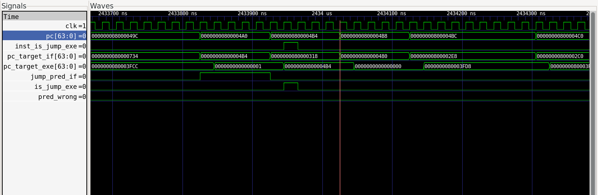
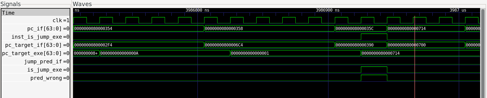
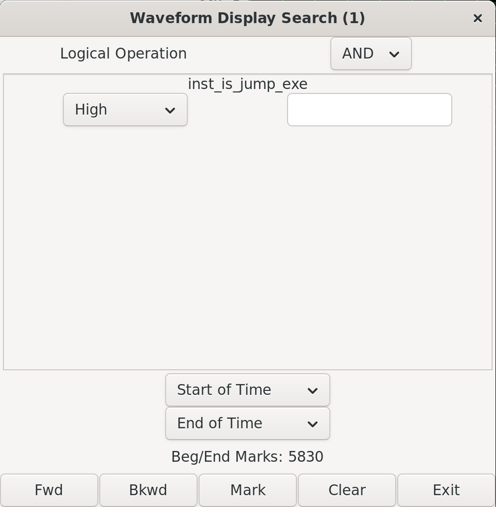
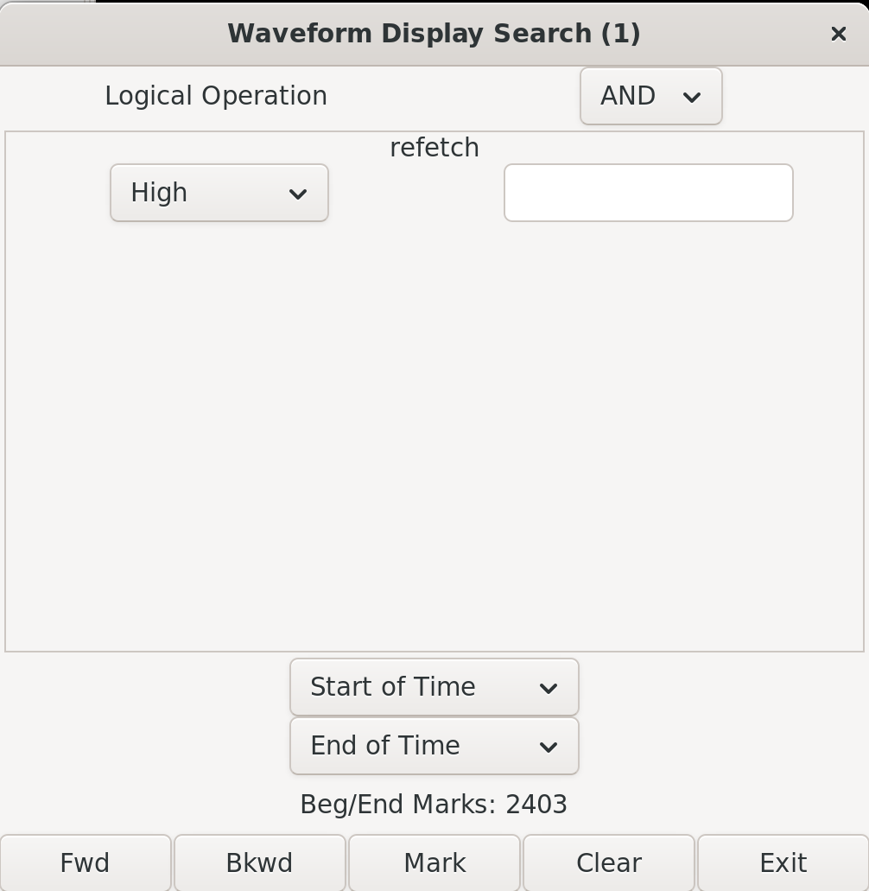
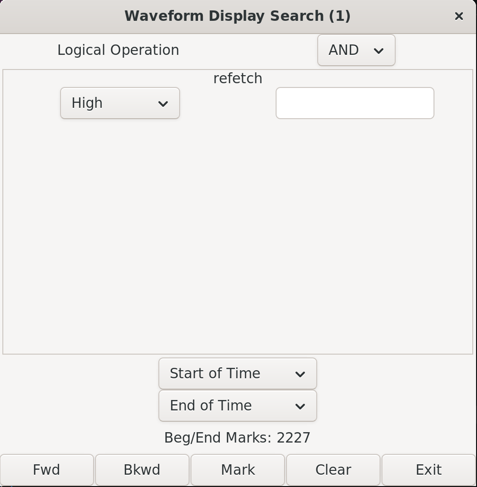
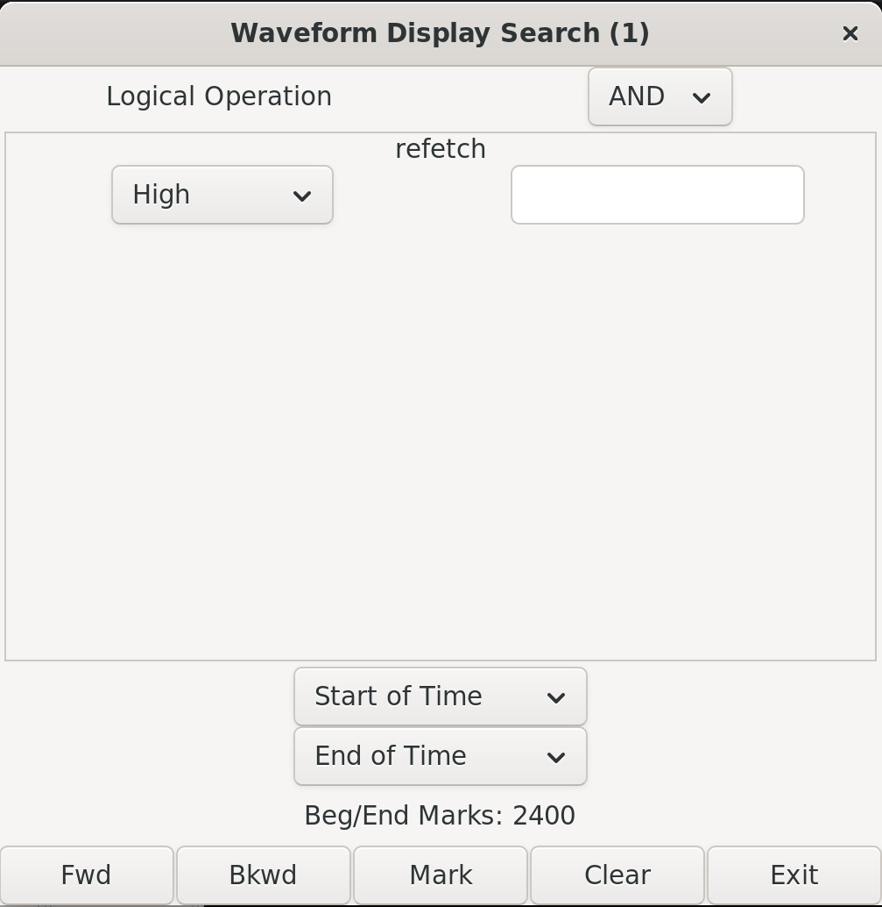

import Asciinema from "@md-components/AsciinemaWrapper.vue";

# 实验 1：动态分支预测 实验报告

## 一、 实验目的
- 了解分支预测原理
- 实现以 BHT 和 BTB 为基础的动态分支预测

## 二、 实验过程

## 实验过程

### 1. 动态分支预测模块 (BranchPrediction) 的实现

本次实验使用 BHT（分支历史表）和 BTB（分支目标缓冲）相结合的方式实现动态分支预测。


**预测阶段 (IF Phase)**：  
在取指阶段，利用当前 `pc_if` 解析出 `index_if` 和 `tag_if`，去表中查找对应的表项。如果表项有效 (`valid == 1`) 且 Tag 匹配，则说明在 BTB 中命中。此时通过检查 2-bit 状态位的高位 (`state[1]`) 来决定是否跳转：当状态为 `10` (Weakly Jump) 或 `11` (Strongly Jump) 时预测跳转，并输出记录的目标地址 `pc_target_if`。

```verilog
// IF Phase Prediction
assign jump_pred_if = btb_if.valid && 
    (btb_if.tag == tag_if) && (btb_if.state[1] == 1'b1);
assign pc_target_if = btb_if.target;
```

**更新阶段 (EXE Phase)**：  
在执行阶段，当检测到当前指令是分支或跳转指令时 (`inst_is_jump_exe == 1`)，根据实际的跳转情况 (`is_jump_exe`) 对 BTB 和 BHT 进行更新：  
1. **BTB Hit (命中)**：更新跳转目标地址 `pc_target_exe`。同时更新 2-bit 状态机，如果实际跳转，则状态值加 1（最高到 `11`）；如果实际未跳转，则状态值减 1（最低到 `00`）。
2. **BTB Miss (未命中)**：分配该表项，标记为有效并写入新的 tag 和目标地址。如果实际跳转，则将初始状态设为 `11` (Strongly Jump)，否则设为 `10` (Weakly Jump)。

```verilog
// Hit in BTB
if (btb_exe.valid && btb_exe.tag == tag_exe) begin
    btb[index_exe].target <= pc_target_exe;
    if (is_jump_exe) begin
        if (btb_exe.state != 2'b11) 
            btb[index_exe].state <= btb_exe.state + 2'b01;
    end else begin
        if (btb_exe.state != 2'b00) 
            btb[index_exe].state <= btb_exe.state - 2'b01;
    end
end else begin
// Miss in BTB
    btb[index_exe].valid <= 1'b1;
    btb[index_exe].tag <= tag_exe;
    btb[index_exe].target <= pc_target_exe;
    if (is_jump_exe) begin
        btb[index_exe].state <= 2'b11; // Transition from 00 to 01
    end else begin
        btb[index_exe].state <= 2'b10; // Stay at 00
    end
end
```

### 2. 分支预测模块接入 Core 流水线

**实例化并连接模块**

将 IF 阶段的 PC、EXE 阶段的 PC 及实际跳转结果接入模块：

```verilog
BranchPrediction #(
    .DEPTH(32),
    .ADDR_WIDTH(64)
) bp (
    .clk(clk),
    .rst(rst),
    .pc_if(pc),
    .jump_pred_if(jump_pred_if),
    .pc_target_if(pc_target_if),
    .pc_exe(idexe_reg.pc),
    .pc_target_exe(alu_res),
    .is_jump_exe(jump_occur),
    .inst_is_jump_exe(idexe_reg.valid && idexe_reg.npc_sel 
        && (idexe_reg.inst[6:0] == JAL_OPCODE || 
            idexe_reg.inst[6:0] == JALR_OPCODE || 
            idexe_reg.inst[6:0] == BRANCH_OPCODE)
        )
);
```

**修改 IF 阶段 PC 更新逻辑**

将分支预测的结果加入到 `next_pc` 的多路选择器中。如果预测器预测跳转，就将下一条指令的 PC 设为 `pc_target_if`。优先级关系为：异常/CSR 切换 > 分支预测错误修正 (refetch) > **分支预测跳转 (jump_pred_if)** > 顺序执行 (PC+4)。

```diff
  // next_pc 逻辑
  always_comb begin
      next_pc = pc + 4;
+     if (jump_pred_if) begin
+         next_pc = pc_target_if;
+     end
      
      if (switch_mode) begin
          next_pc = pc_csr;
      end
      else if (refetch) begin
          next_pc = correct_next_pc;
      end
  end
```

**流水线寄存器的数据传递**

由于要在 EXE 阶段判断之前的预测是否正确，我们需要将 IF 阶段的预测结果沿着流水线传递下去。在 `IF/ID` 和 `ID/EXE` 寄存器中增加了 `jump_pred` 和 `pc_target` 字段：

```diff
  // IF/ID 寄存器更新
  always_ff @(posedge clk or posedge rst) begin
      // ...
+     ifid_jump_pred <= jump_pred_if;
+     ifid_pc_target <= pc_target_if;
      // ...
  end

  // ID/EXE 寄存器更新
  always_ff @(posedge clk or posedge rst) begin
      // ...
+     idexe_jump_pred <= ifid_jump_pred;
+     idexe_pc_target <= ifid_pc_target;
      // ...
  end
```

**预测结果校验与冲刷机制**

在 EXE 阶段，如果确定当前是一条分支或跳转指令，就会比较 `jump_occur` (实际跳转情况) 与 `idexe_jump_pred` (预测跳转情况)，以及实际的跳转目标 `alu_res` 与预测的目标 `idexe_pc_target`。如果发现不一致（预测错误），则拉高 `pred_wrong` 信号（进而触发 `refetch` 信号清空 IF/ID 和 ID/EXE 流水段），并将 `correct_next_pc` 更新为正确的地址，让 IF 阶段在下一个周期从正确的地址重新取指。

```verilog
always_comb begin
    pred_wrong = 1'b0;
    correct_next_pc = idexe_pc_4;
    if (idexe_valid && idexe_npc_sel) begin
        if (jump_occur) begin
            if (!idexe_jump_pred || idexe_pc_target != alu_res) begin
                pred_wrong = 1'b1;
                correct_next_pc = alu_res;
            end
        end else begin
            if (idexe_jump_pred) begin
                pred_wrong = 1'b1;
                correct_next_pc = idexe_pc_4;
            end
        end
    end
end
assign refetch = pred_wrong;
```

### 3. 仿真结果

import c1 from "./sort.cast?url"
import c2 from "./kernel.cast?url"

1. 成功执行`make verilate_sort`

    <Asciinema url={c1} />

2. 成功执行`make kernel`

    <Asciinema url={c2} />


## 三、 思考题

### 分支预测波形分析

> 1. 在报告里分析排序测试中分支预测成功和预测失败时的相关波形 

#### 分支预测成功波形分析



**分析说明：**
- 从波形中可以看出，在 `clk` 上升沿，IF 阶段的 PC 值为 `800004A0`。
- `jump_pred_if` 信号为高电平 (1)，表示预测当前分支会跳转。
- BTB 提供的预测目标地址 `pc_target_if` 为 `800004B4`。
- 下一个周期的 PC 值更新为了预测地址 `800004B4`。
- 当该指令流转到 EXE 阶段时，计算出的实际跳转目标 `pc_target_exe` 为 `800004B4`，且实际发生跳转。
- 由于预测地址与实际地址一致，且预测方向正确，`pred_wrong` 信号保持低电平 (0)，没有触发流水线 refetch

#### 分支预测失败波形分析



**分析说明：**
- 从波形中可以看出，在 `clk` 上升沿，IF 阶段的 PC 值为 `800006C4`。
- `jump_pred_if` 信号为 `0`，预测为 *不跳转*。
- 当该指令到达 EXE 阶段时，实际的分支结果是 *发生跳转*，实际目标地址为 `80000714`。
- 因为预测结果与实际结果不符，在 EXE 阶段 `pred_wrong` 信号被拉高 (1)。
- 在下一个时钟周期，触发了 `flush`，清空了 IF/ID 和 ID/EXE 寄存器中的错误指令。
- PC 被更新为正确的地址(`80000714`)，流水线重新开始取指。

### PC 相关更新逻辑分析

> 2. 分析并呈现自己的 Core 中 pc 相关更新逻辑

PC 的更新逻辑主要集中在 `Core.sv` 的 IF 阶段以及 `HazardUnit.sv` 中，具体如下：

```verilog
// Core.sv 中的 next_pc 逻辑
always_comb begin
    next_pc = pc + 4; // 默认顺序执行
    
    if (jump_pred_if) begin
        next_pc = pc_target_if; // 如果分支预测器预测跳转，使用预测目标地址
    end
    
    // CSR 特权级切换优先级最高
    if (switch_mode) begin
        next_pc = pc_csr;
    end
    // 来自 EXE 阶段的 flush 修正 (预测失败时)
    else if (flush) begin
        next_pc = correct_next_pc;
    end

end
```

**更新优先级分析：**
1. **最高优先级：CSR 切换/异常 (`switch_mode`)**。如果发生异常、中断或执行了 `mret`/`sret` 指令，必须立刻跳转到 CSR 模块提供的陷入地址或返回地址，这会覆盖其他的 PC 更新。
2. **第二优先级：分支预测失败修正 (`flush`)**。`flush` 信号由 `HazardUnit` 产生，当它为 1 时，意味着之前分支预测错误。此时必须放弃当前预测的执行流，强制将 `next_pc` 更新为 `HazardUnit` 算出的正确地址 `correct_next_pc`。
3. **第三优先级：分支预测命中 (`jump_pred_if`)**。在没有异常和错误预测修正的情况下，如果 `BranchPrediction` 模块在 IF 阶段预测当前指令是分支且会跳转，则 `next_pc` 被更新为预测的跳转目标 `pc_target_if`。
4. **最低优先级：顺序执行 (`pc + 4`)**。如果没有预测跳转，也没有发生异常或需要修正错误，PC 正常加 4。

### 状态预测比特数与成功率的关系

> 3. 修改分支预测器中状态预测的比特数，比如从 2 比特改为 1 比特，或者 3 比特。然后修改相应的分支预测逻辑，计算分支预测的成功率。尝试探讨分支预测成功率和分支预测状态比特数的关系，并给出你的结论。

我们分别实现了 1-bit、2-bit 和 3-bit 的分支预测器，并在排序测试中统计了每种预测器的总指令数、预测错误次数以及成功率。以下是统计结果：

| 预测器状态位数 | 运行指令总数 (Total) | 预测错误次数 (Miss) | 成功率 ((Total-Miss)/Total) |
| :---: | :---: | :---: | :---: |
| 1-bit | 5830 | 2403 | $\frac{5830-2403}{5830} = 58.78\% $ |
| 2-bit | 5830 | 2400 | $\frac{5830-2400}{5830} = 58.83\% $ |
| 3-bit | 5830 | 2227 | $\frac{5830-2227}{5830} = 61.80\% $ |

import {NGrid, NGi} from "naive-ui";

<NGrid x-gap="12" cols={2}>
  <NGi>
    
  </NGi>
  <NGi>
    
  </NGi>
  <NGi>
    
  </NGi>
  <NGi>
    
  </NGi>
</NGrid>


**结论分析：**
- 从统计结果来看，增加状态预测的比特数确实提高了分支预测的成功率。1-bit 预测器的成功率约为 58.78%，2-bit 预测器提升到 58.83%，而 3-bit 预测器则提升到 61.79%。
- 1-bit 预测器只能区分“跳转”与“不跳转”，当分支行为发生改变时（例如从连续跳转变为连续不跳转），它会立即预测错误。而 2-bit 预测器引入了一个“弱跳转/弱不跳转”的状态，可以在分支行为改变时提供一次容错机会，从而减少误预测的次数。
- 3-bit 预测器进一步增加了状态的细粒度，可以更好地适应分支行为的变化，尤其是在分支行为频繁改变的情况下，能够更准确地捕捉分支模式，从而显著提升预测成功率。


### 间接跳转与分支预测器的局限性


> 4. 间接跳转与分支预测器的局限性
> 
> 考虑如下一段程序，函数 `foo` 在三处不同位置被调用：
> ```asm
> 0x100: JAL  x1, foo      # call site A，返回地址 = 0x104
> ...
> 0x200: JAL  x1, foo      # call site B，返回地址 = 0x204
> ...
> 0x300: JAL  x1, foo      # call site C，返回地址 = 0x304
> ...
> foo:
>     ...
> 0x500: JALR x0, x1, 0   # ret
> ```
> 
> 请回答以下问题：
> 
> (1) 分析上述 `ret` 指令（`JALR x0, x1, 0`）在 BTB 中对应几个表项？程序按 A→B→C 顺序依次调用 foo 时，每次 ret 的 BTB 预测结果分别是什么？预测准确率如何？
> 
> (2) 对比 `JAL x1, foo` 这类直接跳转指令，说明为什么 BTB 对 ret 的预测效果存在结构性局限，其根本原因是什么？
> 
> (3) 针对上述局限性，工业界在微架构层面提出了一种专用硬件结构 Return Address Stack 来解决此问题。请描述该结构的工作原理（push/pop 时机、存储内容），并分析其相比 BTB 预测 ret 的优势，以及该结构自身的局限性。


#### (1) `ret` 指令在 BTB 中的表项与预测准确率

- **表项数量：** 虽然函数 `foo` 在三处不同的地方被调用，但函数内部用于返回的 `ret` 指令（`JALR x0, x1, 0`）只有一条，其 PC 地址固定为 `0x500`。由于 BTB 是使用指令的 PC（低位作为 index，高位作为 tag）进行索引的，因此这条 `ret` 指令在 BTB 中**只对应 1 个表项**。
- **执行顺序 A→B→C 时的预测结果：**
    1. **调用点 A 返回：** `ret` 第一次执行，BTB 中尚未记录。在 EXE 阶段更新 BTB，将 `0x500` 对应的目标地址更新为 A 的返回地址 `0x104`。此时预测为 **Miss (无预测或预测不跳转)**。
    2. **调用点 B 返回：** `ret` 再次执行，PC 为 `0x500`，在 BTB 中命中。BTB 输出的目标地址是上一次记录的 `0x104`，但实际应该返回 `0x204`。此时预测结果为 **`0x104` (预测错误)**。在 EXE 阶段将 BTB 中的目标地址更新为 `0x204`。
    3. **调用点 C 返回：** `ret` 执行，在 BTB 中命中。BTB 输出的目标地址是上一次记录的 `0x204`，但实际应该返回 `0x304`。此时预测结果为 **`0x204` (预测错误)**。
- **预测准确率：** 对于上述依次在不同位置调用的场景，BTB 对该 `ret` 指令的预测准确率**极低（基本为 0%）**。因为每次调用的上下文不同，返回地址都在变化，而 BTB 只能保存最近一次的返回地址。

#### (2) BTB 预测 `ret` 效果存在结构性局限的根本原因

- 对比 `JAL x1, foo` 这类直接跳转指令，其跳转目标地址是在指令编码中硬计算好的（PC + offset），或者是一个固定的绝对地址。同一个 PC 处的直接跳转指令，其目标地址是**静态且唯一的**。BTB 只要记住一次，后续就能一直正确预测。
- 而 `ret` (`JALR`) 属于**间接跳转指令**，它的跳转目标来自于寄存器（通常是 `ra` / `x1`）。同一个 PC 处的 `ret` 指令，其目标地址是**动态的、上下文相关的**（取决于它是从哪里被调用的）。
- **根本原因：** BTB 的数据结构本质上是一个“PC -> Target”的**一对一静态映射表**。它假设同一个 PC 处的指令总是跳向同一个 Target。这种静态映射机制在原理上就无法处理“同一个 PC，多个可能 Target”的间接跳转情况（多态性）。

#### (3) Return Address Stack (RAS) 的原理与优势

- **工作原理：**
    - 硬件层面维护一个一个小型的先进后出 (LIFO) 栈，即 RAS。
    - **Push 时机：** 当解码（ID）或执行（EXE）阶段检测到函数调用指令（如 `JAL`/`JALR` 且目标寄存器为 `ra` 时），将下一条指令的地址（即返回地址，PC+4）**压入 (push)** RAS 栈顶。
    - **Pop 时机：** 当取指阶段（IF）解码发现是一条函数返回指令（如 `ret` / `JALR x0, x1, 0`）时，立即从 RAS 栈顶**弹出 (pop)** 一个地址，将其作为预测的跳转目标。
    - **存储内容：** 存储的是函数调用的返回地址。
- **优势：** RAS 完美契合了程序执行中函数调用与返回的“后进先出”对称特性。它可以精准地处理同一个 `ret` 指令对应不同返回地址的情况。在 A→B→C 调用的例子中，A 调用 push `0x104`，A 返回 pop `0x104`，Cache HIT；B 调用 push `0x204`，B 返回 pop `0x204`，依然HIT。只要调用和返回严格匹配，RAS 的准确率接近 100%。
- **局限性：**
    1. **栈深度有限：** 硬件 RAS 的深度是固定的（例如 8、16 或 32 层）。如果程序发生了过深的递归调用，或者极深的嵌套调用，RAS 会发生溢出（最旧的记录被覆盖）。当深度返回时，预测就会失效。
    2. **非对称控制流：** 如果程序中使用了 `setjmp/longjmp`，或者操作系统上下文切换，或者某些异常处理机制，导致程序的调用和返回不匹配（例如没有经过 `ret` 就跳转，或者伪造返回地址），RAS 的栈结构就会被破坏，导致后续一系列的 `ret` 预测失败，直到栈被重新同步。