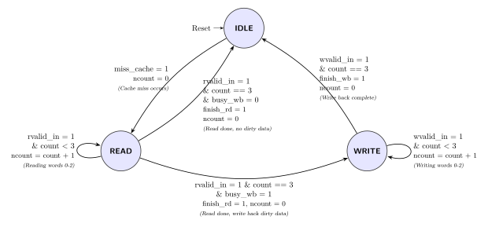
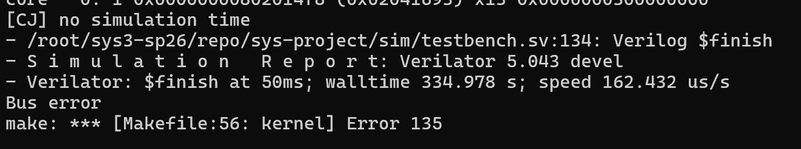
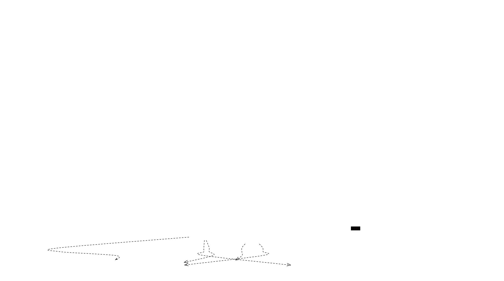
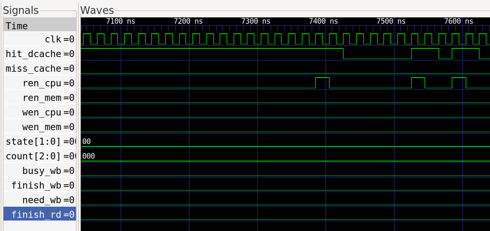
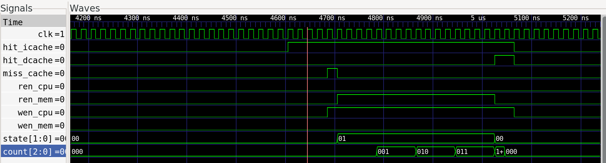
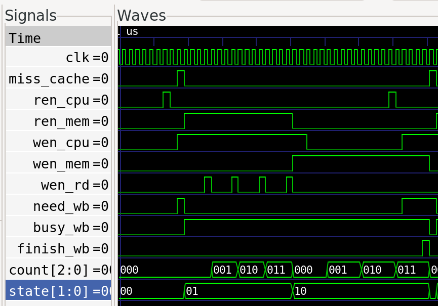

import Asciinema from "@md-components/AsciinemaWrapper.vue";

# 实验 2：Cache 实验报告

## 一、实验目的

在使用 Verilog 实现的系统级 CPU 中增量引入带有存储层次体系的高速缓存（Cache），体会速度更快的局域存储部件是如何在 CPU 流水线与主存之间充当桥梁的，了解和掌握 CacheBank 控制、D-Cache 和 I-Cache 与内存的读写协商策略（Write Allocate 和 Write Back）。通过自行编写 CMU 控制有限状态机、解决流水与 Cache 接驳的数据冒险，进一步增强对于体系结构的深入认知。


## 二、实验过程


### Cache 模块的完善

- **CMU 状态机控制：**

    

    * **IDLE（空闲状态）**：

        CMU 默认处于此状态。当接收到 CacheBank 发出的未命中信号（`miss_cache`）时，状态机将触发失配处理。此时，CMU 会将需要载入数据的目标地址（`addr_cache`）和目标路/组号（`set_cache`）锁存到内部寄存器（`miss_addr_reg`、`miss_set_reg`）中，并在下一个周期跳转至 `READ` 状态。

    * **READ（读内存状态）**：

        进入此状态后，CMU 向总线发出读内存使能（`ren_mem = 1`）。由于每个 Cacheline 包含 4 个 64-bit 的字（Word），使用一个计数器（`count`）。

        每次总线返回有效数据（`rvalid_in == 1`）时，CMU 会将数据写入 CacheBank 的对应位置（`wen_rd = 1`），并将 `count` 加 1。当 `count` 达到 3 时，意味着整个 Cacheline 的 4 个字均已载入完毕，此时发出 `finish_rd` 信号。

        此时 CPU 的读请求已经可以满足，流水线可以恢复执行（体现了**读优先**减少 Stall 的优势）。随后 CMU 会检查 Write Back Buffer 的 `busy_wb` 信号：如果 Buffer 中存有被替换下来的脏数据（Dirty Data），则状态机进入 `WRITE` 状态将其写回主存；如果没有，则直接返回 `IDLE` 状态。

    * **WRITE（写回内存状态）**：
    
        在此状态下，CMU 负责将 Write Back Buffer 中的脏数据同步到主存。CMU 同样利用 `count` 计数器，分 4 次向总线发出写使能（`wen_mem = 1`）和对应的写地址及数据（8 字节全掩码 `wmask_mem = 8'hff`）。当最后一次写操作收到总线的完成应答（`wvalid_in == 1`）后，CMU 发出 `finish_wb` 信号清空 Buffer 占用，并最终回归 `IDLE` 状态。


    ```verilog
    // CMU FSM
    typedef enum logic [1:0] {
        IDLE  = 2'b00,
        READ  = 2'b01,
        WRITE = 2'b10
    } state_t;

    state_t state, nstate;
    logic [2:0] count, ncount;
    addr_t miss_addr_reg;
    logic miss_set_reg;

    assign busy_rd = (state != IDLE);

    always_ff @(posedge clk or posedge rst) begin
        if (rst) begin
            state <= IDLE;
            count <= 0;
            miss_addr_reg <= 0;
            miss_set_reg <= 0;
        end else begin
            state <= nstate;
            count <= ncount;
            if (state == IDLE && miss_cache) begin
                miss_addr_reg <= addr_cache;
                miss_set_reg <= set_cache;
            end
        end
    end

    always_comb begin
        nstate = state;
        ncount = count;
        
        // Defaults
        ren_mem = 1'b0;
        wen_mem = 1'b0;
        raddr_mem = 0;
        waddr_mem = 0;
        wdata_mem = 0;
        wmask_mem = 0;

        wen_rd = 1'b0;
        addr_rd = 0;
        data_rd = 0;
        set_rd = 0;
        finish_rd = 1'b0;
        finish_wb = 1'b0;
        bank_index = count[1:0];

        case (state)
            IDLE: begin
                ncount = 0;
                if (miss_cache) begin
                    nstate = READ;
                end
            end
            
            READ: begin
                ren_mem = 1'b1;

                raddr_mem = miss_addr_reg + ({61'b0, count} << 3);
                
                if (rvalid_in) begin
                    wen_rd = 1'b1;
                    addr_rd = raddr_mem;
                    data_rd = rdata_in;
                    set_rd = miss_set_reg;
                    ncount = count + 1;
                    if (count == 3) begin
                        finish_rd = 1'b1;
                        if (busy_wb) begin
                            nstate = WRITE;
                            ncount = 0;
                        end else begin
                            nstate = IDLE;
                        end
                    end
                end
            end

            WRITE: begin
                wen_mem = 1'b1;
                waddr_mem = addr_mem + ({61'b0, count} << 3);
                wdata_mem = data_mem;
                wmask_mem = 8'hff;

                if (wvalid_in) begin
                    ncount = count + 1;
                    if (count == 3) begin
                        finish_wb = 1'b1;
                        nstate = IDLE;
                        ncount = 0;
                    end
                end
            end
            
            default: begin
                nstate = IDLE;
            end
        endcase
    end
    ```


### Core 模块接入 Cache


-  实例化 ICache 与 DCache 模块

    首先，在 `Core.sv` 中移除了原有的指令缓冲（inst_buffer）和数据缓冲（mem_data_buffer）相关逻辑，取而代之的是实例化 `Icache` 和 `Dcache` 模块。

    * **ICache 接入**：将 PC 信号直接接入 ICache，由 ICache 负责向内存接口 (`MemInterfaceCtrl`) 发起取指请求，并将命中的指令 `icache_inst` 传回给 IF/ID 段寄存器。
    
    * **DCache 接入**：在 MEM 阶段，将 `exemem_reg` 中的访存地址（alu_res）、写入数据和掩码接入 DCache。同时，DCache 内部包含了对 MMIO 地址（特殊外设地址）的判断旁路，非特殊地址由 Cache 缓存，mmio地址则直接发送至总线。

    ```diff
    @@ -48,22 +48,27 @@
        logic if_stall;
        logic mem_stall;

    -    // AXI signals
    -    logic if_resp_accept;
    -    logic inst_buffer_valid;
    -    logic [63:0] inst_buffer_pc;
    -    logic [31:0] inst_buffer;
    -    logic [63:0] if_pc_req;
    -    logic mem_data_buffer_valid;
    -    logic [63:0] mem_data_buffer;
    +    // ICache signals
    +    inst_t icache_inst;
    +    addr_t icache_req_addr;
    +    logic ren_imem;
    +    logic hit_icache;
    +
    +    // DCache signals
    +    data_t dcache_rdata;
    +    logic hit_dcache;
    +    logic ren_dmem;
    +    logic wen_dmem;
    +    logic is_mmio_addr;
    +    addr_t dcache_raddr;
    +    addr_t dcache_waddr;
    +    data_t dcache_wdata;
    +    mask_t dcache_wmask;

        // 辅助信号
        // 检查 MEM 阶段是否有有效请求
        logic mem_req_valid;
        assign mem_req_valid = (exemem_reg.we_mem || exemem_reg.re_mem) && exemem_reg.valid;

        // AXI 接口输出
        // MEM 阶段 wmask 生成
        mask_t mem_stage_wmask;
        MaskGen u_mem_maskgen (
            .mem_op(exemem_reg.mem_op),
    @@ -71,34 +76,71 @@
            .dmem_wmask(mem_stage_wmask)
        );

    +    Icache #(
    +        .ADDR_WIDTH(64),
    +        .DATA_WIDTH(64),
    +        .BANK_NUM(4),
    +        .CAPACITY(1024)
    +    ) u_icache (
    +        .clk(clk),
    +        .rst(rst),
    +        .pc(pc),
    +        .imem_data(imem_ift.r_reply_bits.rdata),
    +        .switch_mode(switch_mode),
    +        .rvalid_in(imem_ift.r_reply_valid),
    +        .inst(icache_inst),
    +        .icache_request_addr(icache_req_addr),
    +        .ren_imem(ren_imem),
    +        .hit_icache(hit_icache)
    +    );
    +
    +    Dcache #(
    +        .ADDR_WIDTH(64),
    +        .DATA_WIDTH(64),
    +        .BANK_NUM(4),
    +        .CAPACITY(1024)
    +    ) u_dcache (
    +        .clk(clk),
    +        .rst(rst),
    +        .addr_cpu(exemem_reg.alu_res),
    +        .wdata_cpu(exemem_reg.mem_wdata),
    +        .wen_cpu(exemem_reg.we_mem && exemem_reg.valid),
    +        .wmask_cpu(mem_stage_wmask),
    +        .ren_cpu(exemem_reg.re_mem && exemem_reg.valid),
    +        .rdata_cpu(dcache_rdata),
    +        .hit_cpu(hit_dcache),
    +        .ren_mem(ren_dmem),
    +        .wen_mem(wen_dmem),
    +        .is_mmio_addr(is_mmio_addr),
    +        .raddr_out(dcache_raddr),
    +        .waddr_out(dcache_waddr),
    +        .wdata_out(dcache_wdata),
    +        .wmask_out(dcache_wmask),
    +        .rdata_in(dmem_ift.r_reply_bits.rdata),
    +        .wvalid_in(dmem_ift.w_reply_valid),
    +        .rvalid_in(dmem_ift.r_reply_valid),
    +        .switch_mode(switch_mode)
    +    );
    +
        MemInterfaceCtrl u_mem_ctrl (
            .clk(clk),
            .rst(rst),
            .imem_ift(imem_ift),
            .dmem_ift(dmem_ift),
    -        .pc(pc),
    -        .flush(refetch),
    -        .csr_flush(csr_flush),
            .global_stall(global_stall),
    -        .mem_req_valid(mem_req_valid),
    -        .exemem_re_mem(exemem_reg.re_mem),
    -        .exemem_we_mem(exemem_reg.we_mem),
    -        .exemem_valid(exemem_reg.valid),
    -        .exemem_alu_res(exemem_reg.alu_res),
    -        .exemem_mem_wdata(exemem_reg.mem_wdata),
    -        .mem_stage_wmask(mem_stage_wmask),
    -        .mem_stall(mem_stall),
    -        .if_resp_accept(if_resp_accept),
    -        .inst_buffer_valid(inst_buffer_valid),
    -        .inst_buffer_pc(inst_buffer_pc),
    -        .inst_buffer(inst_buffer),
    -        .if_pc_req(if_pc_req),
    -        .mem_data_buffer_valid(mem_data_buffer_valid),
    -        .mem_data_buffer(mem_data_buffer)
    +        .ren_imem(ren_imem),
    +        .icache_req_addr(icache_req_addr),
    +        .ren_dmem(ren_dmem),
    +        .wen_dmem(wen_dmem),
    +        .dcache_raddr(dcache_raddr),
    +        .dcache_waddr(dcache_waddr),
    +        .dcache_wdata(dcache_wdata),
    +        .dcache_wmask(dcache_wmask)
        );
    ```

- Forwarding 模块
    由于流水线不再像之前一样需要几个周期才能取出一个指令执行，而是一个周期执行一个指令，之前的 forwarding 模块由于测试样例过于简单，以及总线的特殊性，其实并不能有效的处理指令冲突。

    在 `Core.sv` 中重构了传递给 EXE 阶段的前递数据来源：  
    * **fwd_idexe**：优先判断是否写 CSR，如果是则前递 `csr_val`；如果是跳转指令，则前递 `pc_4`；否则前递普通的 `alu_res`。
    * **fwd_exemem**：同理，按照优先级判断前递 `csr_alu_res`、内存读取结果 `dmem_rtrun`、跳转指令的 `pc_4`，或者是普通的 `alu_res`。

    ```diff
    @@ -112,7 +154,12 @@
            .alu_res(alu_res),
            .idexe_pc_4(idexe_reg.pc_4),
            .switch_mode(switch_mode),
    +        .idexe_re_mem(idexe_reg.re_mem),
    +        .idexe_rd(idexe_reg.rd),
    +        .rs1(rs1),
    +        .rs2(rs2),
            .global_stall(global_stall),
    +        .load_use_stall(load_use_stall),
            .flush(refetch),
            .csr_flush(csr_flush),
            .pred_wrong(pred_wrong),
    @@ -126,14 +173,12 @@
        logic retire_wb;
        assign retire_wb = wb_valid && ~cosim_interrupt;

    +    assign mem_stall = mem_req_valid && !hit_dcache;
    +
        always_comb begin
    -        if_stall = 1'b1;
    +        if_stall = !hit_icache;
            if (refetch || csr_flush) begin
                if_stall = 1'b0;
    -        end else if (~global_stall) begin
    -            if (if_resp_accept || inst_buffer_valid) begin
    -                if_stall = 1'b0;
    -            end
            end
        end

    @@ -189,7 +234,7 @@
        always_ff @(posedge clk or posedge rst) begin
            if (rst) begin
                pc <= '0;
    -        end else if (~if_stall && (~global_stall || csr_flush)) begin
    +        end else if (~if_stall && (~global_stall || csr_flush) && (~load_use_stall || csr_flush)) begin
                pc <= next_pc;
            end
        end
    @@ -206,26 +251,15 @@
            end else if (refetch || csr_flush) begin
                ifid_reg.valid <= 1'b0;
                ifid_jump_pred <= 1'b0;
    -        end else if (~global_stall) begin
    -            // 从 buffer 恢复
    -            if (inst_buffer_valid) begin
    -                ifid_reg.pc <= inst_buffer_pc;
    -                ifid_reg.pc_4 <= inst_buffer_pc + 4;
    -                ifid_reg.inst <= inst_buffer;
    -                ifid_reg.valid <= 1'b1;
    -                ifid_jump_pred <= jump_pred_if;
    -                ifid_pc_target <= pc_target_if;
    -            end
    -            // 直接从总线获取
    -            else if (if_resp_accept) begin
    -                ifid_reg.pc <= if_pc_req;
    -                ifid_reg.pc_4 <= if_pc_req + 4;
    -                ifid_reg.inst <= if_pc_req[2] ? imem_ift.r_reply_bits.rdata[63:32] : imem_ift.r_reply_bits.rdata[31:0];
    +        end else if (~global_stall && ~load_use_stall) begin
    +            if (hit_icache) begin
    +                ifid_reg.pc <= pc;
    +                ifid_reg.pc_4 <= pc + 4;
    +                ifid_reg.inst <= icache_inst;
                    ifid_reg.valid <= 1'b1;
                    ifid_jump_pred <= jump_pred_if;
                    ifid_pc_target <= pc_target_if;
    -            end
    -            else begin
    +            end else begin
                    ifid_reg.valid <= 1'b0;
                end
            end
    @@ -325,19 +359,31 @@
            .forward_sel_2(forward_sel_2)
        );

    +    data_t fwd_idexe;
    +    data_t fwd_exemem;
    +
        always_comb begin
    +        if (idexe_reg.we_csr) fwd_idexe = idexe_reg.csr_val;
    +        else if (idexe_reg.wb_sel == WB_SEL_PC) fwd_idexe = idexe_reg.pc_4;
    +        else fwd_idexe = alu_res;
    +
    +        if (exemem_reg.we_csr) fwd_exemem = exemem_reg.csr_alu_res;
    +        else if (exemem_reg.re_mem) fwd_exemem = dmem_rtrun;
    +        else if (exemem_reg.wb_sel == WB_SEL_PC) fwd_exemem = exemem_reg.pc_4;
    +        else fwd_exemem = exemem_reg.alu_res;
    +
            case (forward_sel_1)
                2'b00: forward_data_1 = read_data_1;
    -            2'b01: forward_data_1 = alu_res;
    -            2'b10: forward_data_1 = exemem_reg.re_mem ? dmem_rtrun : exemem_reg.alu_res;
    +            2'b01: forward_data_1 = fwd_idexe;
    +            2'b10: forward_data_1 = fwd_exemem;
                2'b11: forward_data_1 = wb_val;
                default: forward_data_1 = read_data_1;
            endcase

            case (forward_sel_2)
                2'b00: forward_data_2 = read_data_2;
    -            2'b01: forward_data_2 = alu_res;
    -            2'b10: forward_data_2 = exemem_reg.re_mem ? dmem_rtrun : exemem_reg.alu_res;
    +            2'b01: forward_data_2 = fwd_idexe;
    +            2'b10: forward_data_2 = fwd_exemem;
                2'b11: forward_data_2 = wb_val;
                default: forward_data_2 = read_data_2;
            endcase
    @@ -487,7 +533,7 @@
                idexe_reg <= idexe_reg;
                idexe_jump_pred <= idexe_jump_pred;
                idexe_pc_target <= idexe_pc_target;
    -        end else if (refetch || csr_flush) begin
    +        end else if (refetch || csr_flush || load_use_stall) begin
                idexe_reg.valid <= 1'b0;
                idexe_jump_pred <= 1'b0;
            end else begin
    ```


### 仿真测试

#### 运行`make verilate_sort`

import vsCast from "./vs.cast?raw";

<Asciinema cast={vsCast} />

#### 运行`make kernel`

import knCast from "./kn.cast?raw";

<Asciinema cast={knCast} />

### 支线任务：Testbench.vcd炸我硬盘咋办？

RT, 鼠鼠正在美美做着实验，突然：




这是怎么回事呢？仔细一看：


孩子们这能忍住不力竭的？

<div style="width:50%;text-align:center;margin:0 auto;">


</div>

问题出现在`Testbench.vcd`中，这个文件占用了我12GB的硬盘空间。众所周知`vcd2fst`可以将vcd转为fst，可以大幅度压缩文件大小，但是这还是需要我们dump出vcd文件的。

目前的dump逻辑是：

```verilog
`ifdef VERILATE
	int dump_vcd;
	int calc_cpi;
	initial begin
		dump_vcd = '1;//  ONLY WHEN NO_DUMP_VCD is on.
		calc_cpi = '1;// only when CALC_CPI
		if (dump_vcd == 'b1) begin
			$dumpfile({`TOP_DIR,"/Testbench.vcd"});
			$dumpvars(0,dut);
			$dumpon;
		end
	end
    ...
	always@(negedge clk)begin
		cnt<=cnt+32'b1;
		if(error)begin
			$display("[CJ] something error");
			$display("[CPI-STAT] Cycles: %0d, Insts: %0d, CPI: %f", core_cnt, valid_cnt, $itor(core_cnt) / $itor(valid_cnt));
			if (dump_vcd == 'b1) $dumpoff;
			$finish;
		end else if(cnt==max_sim_cycle)begin
			$display("[CJ] no simulation time");
			$display("[CPI-STAT] Cycles: %0d, Insts: %0d, CPI: %f", core_cnt, valid_cnt, $itor(core_cnt) / $itor(valid_cnt));
			if (dump_vcd == 'b1) $dumpoff;
			$finish;
		end
	end
    ...
```


注意到`$dumpvars(0,dut);`，这是在把所有信号全部导出到文件里面，考虑到我们这个CPU到这个阶段时，信号已经相当多了，使用这种写法（尤其是对于kernel）相当爆炸。我们可以改成：

```verilog
$dumpvars(0,dut.core.core.icache,dut.core.core.icache); // 或者这类，写细一点
```

#### TO BE CONTINUED

[semify-eda/fstdumper: Verilog VPI module to dump FST (Fast Signal Trace) databases](https://github.com/semify-eda/fstdumper)它通过VPI接口直接将信号数据写入fst文件，避免了vcd文件的中间步骤，极大地节省了磁盘空间和转换时间。但是按照README的说明，它只支持Icarus Verilog，而我们使用的是Verilator。后续可能会考虑基于这个改改看能不能用到目前的项目中去。

## 三、思考题

### 对于 CacheBank 模块的理解

CacheBank 可以被理解为我们系统的“临时内存收纳柜”，它运用了二路组相联技术。

内部运行机理如下：传入物理地址请求时，模块按一定位宽从中切取出 `Index`、`Tag`与 `Offset`。通过 `Index` 直接定位到库内部对应的两条存储路路线。如果存在某一条路线带有匹配的 `Tag` 且其 `valid` 位是有效高电平时，向外报告 `hit_cpu` 为 1 并借由 `Offset` 输送或吸纳 1 字节的数据操作。

同时，CacheBank 处理着汰换数据的判断（LRU 更新与 Dirty 管控）：在不命中时，如选中牺牲的那一路上 Dirty 原本为脏，便要求向外触发 `need_wb`，并直接把所有路内携带信息投喂给 `CacheWriteBuffer` 去代理执行复杂的写回动作，以不影响主线逻辑并发读取，极大程度利用了缓冲架构。



### 波形图与周期数

> 展示测试中遇到的 cache hit、miss、write back 的波形图，并分析消耗的周期数

   - **Cache Hit**



     这里只需要单个周期即可命中。对于 CPU 向内的写回也是在被确认为有效和匹配组的那一个边沿生效的（由于不访存，只需消耗 1 个流水周期）。

   - **Cache Miss**
     


     由于在 AXI 总线和跨周期接口上传递，在拉高直到 `finish_rd` 下达并重新设置 `hit_cpu` ，大约吃掉了17个周期。

   - **Write Back**

    

    p.s. 由于verilate_sort没有发生过脏数据写回，因此这里截的是kernel的波形图

     在此期间，可以看到由于 `busy_wb` 高，向 `DMem_ift` 控制器发出回写，直至回写满4次触发 `finish_wb` 清理状态。共计17+22大约39个周期

### 性能分析

> 计算自己的 CPU 在启用 cache 前后（利用 lab1 代码）运行排序测试的整体 CPI 并进行比较

#### 对代码的修改

```verilog
reg [31:0] cnt=32'b0;
reg [31:0] core_cnt=32'b0;
reg [31:0] valid_cnt=32'b0;
always@(posedge core_clk)begin
    if (rstn) begin
        core_cnt <= core_cnt + 32'b1;
        if (cosim_valid) begin
            valid_cnt <= valid_cnt + 32'b1;
        end
        
        $display("[CPI-STAT] Cycles: %0d, Insts: %0d, CPI: %f", core_cnt, valid_cnt, $itor(core_cnt) / $itor(valid_cnt));
    end
end
```

#### 整体 CPI 及比较

*p.s. Cache对排序的CPI提升可以说是巨大的，尤其是写完第一次运行的时候，代码跳数字的速度可以说是惊为天人*


|   | Cycles | Insts | CPI |
|---|---|---|---|
| Lab1 (无 Cache) | 234874 | 34782 | 6.752746 |
| Lab2 (有 Cache) | 50740 | 34782 | 1.458801 |