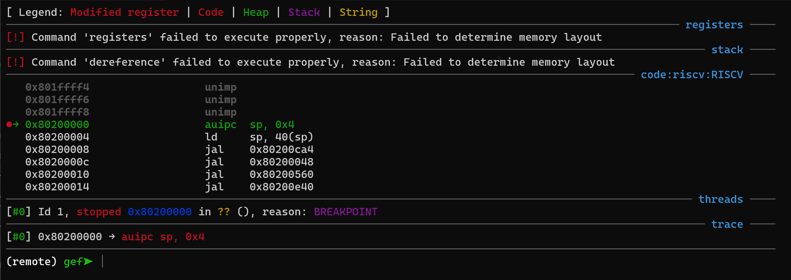
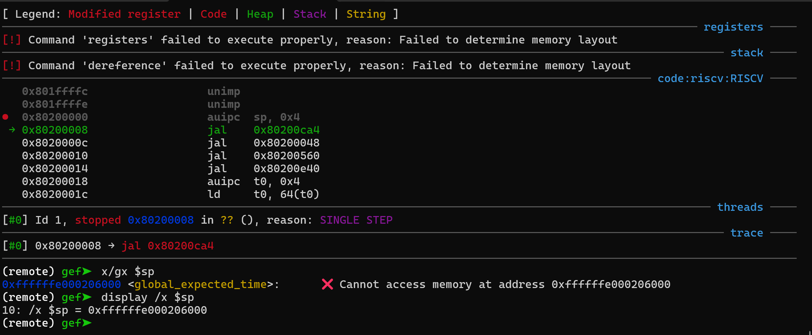
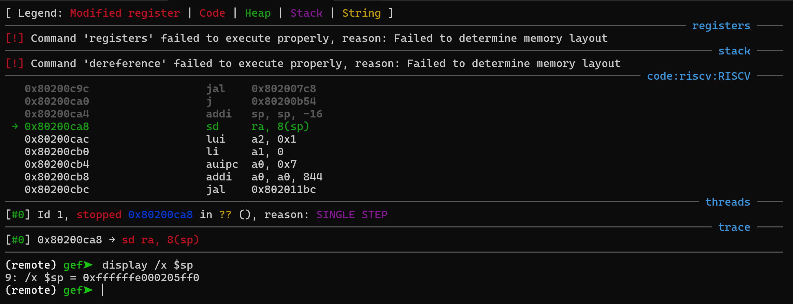

import Asciinema from "@md-components/AsciinemaWrapper.vue";

# 实验 3：RV64 虚拟内存管理

## 实验目的

- 理解虚拟内存的工作原理
- 实现物理地址到虚拟地址的切换
- 了解 RISC-V 的 Sv39 分页模式
- 实现虚拟地址到物理地址的映射，并对不同的段进行相应的权限设置

## 实验过程

### 修改 `printk_sbi_write`

由于 S-mode 运行在虚拟地址空间，而 M-mode 的 OpenSBI 仅识别物理地址，调用 SBI `debug_console_write` 时需要将缓冲区指针从 VA 转换为 PA：

```c
#include <mm.h>

static int printk_sbi_write(FILE *restrict fp, const void *restrict buf, size_t len) {
  (void)fp;
  uint64_t pa = VA2PA((uint64_t)buf);
  struct sbiret ret = sbi_ecall(SBI_DEBUG_CONSOLE_EXTENSION_ID, 0,
                                (uint64_t)len, LOBYTE(pa), HIBYTE(pa), 0, 0, 0);
  if (ret.error) return 0;
  return ret.value;
}
```


### `setup_vm` 建立临时页表

`setup_vm` 使用一级 gigapage 页表 `early_pgtbl`，将 `0x80000000` 开始的 1 GiB 区域同时做**等值映射**（`VA == PA`）和**高地址映射**（`VA == PA + PA2VA_OFFSET`）。


```c
void setup_vm(void) {
  memset(early_pgtbl, 0, PGSIZE);

  // VA[38:30] 作为 early_pgtbl 索引：
  //   等值映射：               (0x80000000 >> 30) & 0x1FF = 2
  //   高地址映射 (VM_START)：   (0xffffffe000000000 >> 30) & 0x1FF = 0x180
  uint64_t idx_id = (0x80000000UL >> 30) & 0x1FF;
  uint64_t idx_hi = (VM_START >> 30) & 0x1FF;

  // 1 GiB gigapage 的 PPN[2] 取自 PA[55:30]：0x80000000 >> 30 = 2
  uint64_t ppn2 = 0x80000000UL >> 30;

  // PTE = PPN[2] << 28 | D | A | X | W | R | V 
  uint64_t pte = (ppn2 << 28) | (1UL << 7) | (1UL << 6)
               | (1UL << 3) | (1UL << 2) | (1UL << 1) | (1UL << 0);

  // 两处映射共用相同 PTE —— 均指向同一块 1 GiB 物理内存
  early_pgtbl[idx_id] = pte;
  early_pgtbl[idx_hi] = pte;
}
```

### `relocate` 启用 MMU 并跳转到虚拟地址

在 `head.S` 中实现了 `relocate` 函数

```riscvasm
relocate:

    # 1. set general purpose registers to appropriate values
    #    - set ra = ra + PA2VA_OFFSET
    #    - set sp = sp + PA2VA_OFFSET, if needed
    li t0, PA2VA_OFFSET
    add ra, ra, t0
    add sp, sp, t0

    # flush TLB
    sfence.vma zero, zero


    # 2. set satp to use early_pgtbl
    #    - set satp to use Sv39 mode
    la t0, early_pgtbl
    srli t0, t0, 12
    li t1, 0x8000000000000000
    or t0, t0, t1
    csrw satp, t0

    ret
```

`ret` 指令将跳转到调整后的 `ra`（虚拟地址），此时 MMU 已经启用，通过 `early_pgtbl` 中的等值映射或高地址映射均可正确翻译。

### `setup_vm_final` —— 建立正式页表

`setup_vm_final` 使用 Sv39 三级页表结构，为内核所有段建立带有正确权限控制的映射，不再包含等值映射。

**映射规则**：

| 段 | 虚拟地址范围 | 权限 | 含义 |
|----|-------------|------|------|
| `.text` | `_stext ~ _etext` | `X \| R` (0xa) | 可执行、可读 |
| `.rodata` | `_srodata ~ _erodata` | `R` (0x2) | 只读 |
| 其余内存 | `_sdata ~ VM_START + PHY_SIZE` | `W \| R` (0x6) | 可读写 |

```c
void setup_vm_final(void) {
  memset(swapper_pg_dir, 0, PGSIZE);

  // kernel code: X | R
  uint64_t text_va = (uint64_t)_stext;
  uint64_t text_pa = VA2PA(text_va);
  uint64_t text_sz = (uint64_t)_etext - (uint64_t)_stext;
  create_mapping(swapper_pg_dir, _stext, (void *)text_pa, text_sz,
                 (1UL << 3) | (1UL << 1));

  // kernel rodata: R
  uint64_t rodata_va = (uint64_t)_srodata;
  uint64_t rodata_pa = VA2PA(rodata_va);
  uint64_t rodata_sz = (uint64_t)_erodata - (uint64_t)_srodata;
  create_mapping(swapper_pg_dir, _srodata, (void *)rodata_pa, rodata_sz,
                 (1UL << 1));

  // other memory (data + bss + free): W | R
  uint64_t other_va = (uint64_t)_sdata;
  uint64_t other_pa = VA2PA(other_va);
  uint64_t other_sz = VM_START + PHY_SIZE - other_va;
  create_mapping(swapper_pg_dir, _sdata, (void *)other_pa, other_sz,
                 (1UL << 2) | (1UL << 1));

  // switch to swapper_pg_dir
  uint64_t satp_val = (8UL << 60) | (VA2PA((uint64_t)swapper_pg_dir) >> 12);
  asm volatile("csrw satp, %0" : : "r"(satp_val) : "memory");
  asm volatile("sfence.vma" ::: "memory");
}
```

在 `csrw satp` 后执行 `sfence.vma` 刷新 TLB，确保切换至新页表后不会命中旧页表残留的 TLB 缓存项。

### `create_mapping` —— Sv39 三级页表

该函数对给定的一段虚拟地址到物理地址的映射，逐页遍历并创建/填充页表。

**实现要点**：

- 每一轮映射一页（4 KiB），计算其 `vpn2`、`vpn1`、`vpn0`。
- 检查当前级别 PTE 的 V 位：若为 0 则通过 `alloc_page()` 分配新页表并设置非叶子 PTE（`R = W = X = 0, V = 1`）。
- 叶子 PTE 中包含 PPN 以及 `perm | A | D | V`。
- 所有页表均通过虚拟地址访问（`PA2VA` 宏），但 PTE 中存入的是物理地址（`VA2PA` 宏 + `>> 12` 取 PPN）。

```c
void create_mapping(uint64_t pgtbl[static PGSIZE / 8], void *va,
                    void *pa, uint64_t sz, uint64_t perm) {
  uint64_t vaddr = (uint64_t)va;
  uint64_t paddr = (uint64_t)pa;
  uint64_t leaf_perm = perm | (1UL << 6) | (1UL << 7) | 0x01;

  for (uint64_t offset = 0; offset < sz; offset += PGSIZE) {
    uint64_t v = vaddr + offset;
    uint64_t p = paddr + offset;

    uint64_t vpn2 = (v >> 30) & 0x1FF;
    uint64_t vpn1 = (v >> 21) & 0x1FF;
    uint64_t vpn0 = (v >> 12) & 0x1FF;

    // Level 2 (PGD)
    if (!(pgtbl[vpn2] & 0x01)) {
      uint64_t *new_tbl = alloc_page();
      pgtbl[vpn2] = ((VA2PA((uint64_t)new_tbl) >> 12) << 10) | 0x01;
    }
    uint64_t *pmd = (uint64_t *)PA2VA((pgtbl[vpn2] >> 10) << 12);

    // Level 1 (PMD)
    if (!(pmd[vpn1] & 0x01)) {
      uint64_t *new_tbl = alloc_page();
      pmd[vpn1] = ((VA2PA((uint64_t)new_tbl) >> 12) << 10) | 0x01;
    }
    uint64_t *pte_tbl = (uint64_t *)PA2VA((pmd[vpn1] >> 10) << 12);

    // Level 0 (PTE leaf)
    uint64_t ppn = p >> 12;
    pte_tbl[vpn0] = (ppn << 10) | leaf_perm;
  }
}
```

### `_start`

在 `head.S` 中按以下顺序组织启动流程：

```riscvasm
_start:
    la sp, _sbss            # 栈指针初始化为物理地址
    call setup_vm           # 创建临时页表（等值映射 + 高地址映射）
    call relocate           # 调整 ra/sp，启用 MMU
    call mm_init            # 伙伴系统初始化（此时已在虚拟地址空间）
    call setup_vm_final     # 建立正式三级页表，切换到 swapper_pg_dir
    la t0, _traps
    csrw stvec, t0
    # 设置 sie[STIE]
    csrr t0, sie
    ori t0, t0, 0x20
    csrw sie, t0
    call clock_set_next_event
    # 开启中断
    csrr t0, sstatus
    ori t0, t0, 0x02
    csrw sstatus, t0
    call task_init
    j start_kernel
```

其中 `mm_init` 必须在 `setup_vm_final` 之前调用，因为后者需要通过 `alloc_page` 分配中间页表所需的物理内存。


### 编译及测试

import cast1 from "./l3car.cast?url";

<Asciinema url={cast1} />


## 思考题


### `.text`、`.rodata` 段的属性是否成功设置

> 1. 验证 `.text`，`.rodata` 段的属性是否成功设置，给出验证过程。

#### 瞪眼法

在 `setup_vm_final` 的输出中可以直接看到各段的权限值——`.text` 段 `perm = 0xa`（`X | R`），`.rodata` 段 `perm = 0x2`（`R`）。

#### 实践出真知

通过编写测试代码验证：
- 尝试在 `.text` 段写入数据，应触发 page fault（因为 W 位为 0）。
- 尝试执行 `.rodata` 段中的代码，应触发 page fault（因为 X 位为 0）。


```c
void test_vm_protection(void) {
  printk("\n======== VM Protection Test ========\n");

  printk("  [write to .text] ... \n");
  {
    extern uint8_t _stext[];
    volatile uint8_t *p = _stext;
    *p = 0x00;
  }

  printk("  [exec .rodata] ... \n");
  {
    extern uint8_t _srodata[];
    void (*fn)(void) = (void (*)(void))_srodata;
    fn();
  }

}
```

同时修改`trap_handler`：

```diff
void trap_handler(uint64_t scause, uint64_t sepc, uint64_t *saved_sepc) {
    if (scause & INTERRUPT_MASK) {
        uint64_t code = scause & INTERRUPT_CODE_MASK;
        if (code == SUPERVISOR_TIMER_INTERRUPT) {
            clock_set_next_event();
            do_timer();
        } else {
            printk("[Trap Handler] Unknown interrupt: scause=0x%llx, sepc=0x%llx\n",
                   scause, sepc);
        }
    } else {
        uint64_t code = scause;
        printk("[Trap Handler] Exception occurred: scause=0x%llx, sepc=0x%llx\n",
               scause, sepc);
+       *saved_sepc +=4;
    }
}
```
因为我们暂时希望trap_handler不要处理异常，只是输出异常存在，然后继续往下走。默认情况下trap_handler会返回到它一开始在的地方，这就会导致*异常->异常处理->回到异常*的死循环，所以要`saved_sepc+=4`，往下走一步。至于`fn();`这个，因为pc已经跑到rodata里了，没法只靠`+4`来脱离异常，就不管它了:P，它应该会走到时钟中断才结束

import castf from "./l3caf.cast?url";

<Asciinema url={castf} />

其中`scause=0xf`和`scause=0xc`分别是 Store/AMO page fault 和 Instruction page fault


> <table id="scauses" class="tableblock frame-all grid-all fit-content center">
> <caption class="title">Table 2. Supervisor cause (<code>scause</code>) register values after trap. Synchronous exception priorities are given by <a href="machine.html#norm:exc_priority" class="xref page">Table: Synchronous exception priority in decreasing priority order</a>.</caption>
> <colgroup><col /><col /><col /></colgroup>
> <thead><tr><th class="tableblock halign-right valign-top">Interrupt</th><th class="tableblock halign-right valign-top">Exception Code</th><th class="tableblock halign-left valign-top">Description</th></tr></thead>
> <tbody><tr><td class="tableblock halign-right valign-top"><p class="tableblock">1<br/>1<br/>1<br/>1<br/>1<br/>1<br/>1<br/>1<br/>1<br/>1</p></td><td class="tableblock halign-right valign-top"><p class="tableblock">0<br/>1<br/>2-4<br/>5<br/>6-8<br/>9<br/>10-12<br/>13<br/>14-15<br/>≥16</p></td><td class="tableblock halign-left valign-top"><p class="tableblock"><em>Reserved</em><br/>Supervisor software interrupt<br/><em>Reserved</em><br/>Supervisor timer interrupt<br/><em>Reserved</em><br/>Supervisor external interrupt<br/><em>Reserved</em><br/>Counter-overflow interrupt<br/><em>Reserved</em><br/><em>Designated for platform use</em></p></td></tr><tr><td class="tableblock halign-right valign-top"><p class="tableblock">0<br/>0<br/>0<br/>0<br/>0<br/>0<br/>0<br/>0<br/>0<br/>0<br/>0<br/>0<br/>0<br/>0<br/>0<br/>0<br/>0<br/>0<br/>0<br/>0<br/>0<br/>0<br/>0</p></td><td class="tableblock halign-right valign-top"><p class="tableblock">0<br/>1<br/>2<br/>3<br/>4<br/>5<br/>6<br/>7<br/>8<br/>9<br/>10-11<br/>12<br/>13<br/>14<br/>15<br/>16-17<br/>18<br/>19<br/>20-23<br/>24-31<br/>32-47<br/>48-63<br/>≥64</p></td><td class="tableblock halign-left valign-top"><p class="tableblock">Instruction address misaligned<br/>Instruction access fault<br/>Illegal instruction<br/>Breakpoint<br/>Load address misaligned<br/>Load access fault<br/>Store/AMO address misaligned<br/>Store/AMO access fault<br/>Environment call from U-mode<br/>Environment call from S-mode<br/><em>Reserved</em><br/>Instruction page fault<br/>Load page fault<br/><em>Reserved</em><br/>Store/AMO page fault<br/><em>Reserved</em><br/>Software check<br/>Hardware error<br/><em>Reserved</em><br/><em>Designated for custom use</em><br/><em>Reserved</em><br/><em>Designated for custom use</em><br/><em>Reserved</em></p></td></tr></tbody>
> </table>

{/* 
#### gdb大法

（3）通过 GDB 观察页表内容，确认各页表项中 R、W、X 位的实际值。以 `.text` 段地址 `0xffffffe000200000` 为例，手动计算其 VPN 并逐级查看页表，验证叶子 PTE 中 R=1、W=0、X=1。 */}


### 等值映射？

> 2. 我们在 `setup_vm` 中需要做等值映射，而在 Linux 中是不需要做等值映射的。请参考 [Linux v5.2.21](https://elixir.bootlin.com/linux/v5.2.21/source) 或之后的版本中内核启动部分，回答以下问题：
>     - 本次实验如果不做等值映射，会出现什么问题？原因是什么？
>     - 回答为什么 Linux 内核不需要做等值映射，它是如何在不使用等值映射的情况下让 PC 从物理地址跳转到虚拟地址的？
>     - 尝试修改你的 kernel，使其可以像 Linux 一样不需要做等值映射。
> 
>     !!! warning "注意"
> 
>         在阅读 Linux 源码时，你可能需要特别关注 PC 的变化以及某些指令对于 PC 的影响等。
> 
>         本题的历史正答率极其惨烈，直接导致了 2024 年增加了一次 Homework。请同学们结合 Linux 内核的实现认真思考。生成式 AI 无法直接给出正确答案。 

#### 如果不做等值映射

如果不做等值映射，内核将在 `relocate` 函数中的 `csrw satp` 指令之后出事。

核心原因在于 **PC（Program Counter）的连续性**。当 `csrw satp` 开启 MMU 之后，CPU 会**立即**以虚拟地址的方式取指下一条指令，但此时 PC 寄存器中保存的仍然是**物理地址值**。

但是CPU会把这个值当作虚拟地址来查页表，那肯定是查不到的，实际运行时qemu会直接在OpenSBI初始化完成后卡死

具体流程如下：

```riscvasm
relocate:
    # 1. set general purpose registers to appropriate values
    #    - set ra = ra + PA2VA_OFFSET
    #    - set sp = sp + PA2VA_OFFSET, if needed
    li t0, PA2VA_OFFSET
    add ra, ra, t0
    add sp, sp, t0

    # flush TLB
    sfence.vma zero, zero

    # 2. set satp to use early_pgtbl
    #    - set satp to use Sv39 mode
    la t0, early_pgtbl
    srli t0, t0, 12
    li t1, 0x8000000000000000
    or t0, t0, t1
    csrw satp, t0

    ret
```

1. `relocate` 中，`ra` 和 `sp` 被加上 `PA2VA_OFFSET`，转换为虚拟地址
2. `csrw satp, t0` 将 `satp` 设置为指向 `early_pgtbl`（Sv39 模式）
3. 下一条指令 `ret` 的取指：PC 当前值仍为 `0x80200xxx`（物理地址），开启 MMU 后，CPU 将此值视为**虚拟地址**进行页表翻译
4. 查 `early_pgtbl`：VA `0x80200000` → VPN[2] = `(0x80000000 >> 30) & 0x1FF` = 2
5. **如果没有等值映射**：`early_pgtbl[2]` 的 V 位为 0 → **page fault**
6. 由于 `stvec` 在 `head.S:16-17` 才被设置为 `_traps`（在 `relocate` **之后**），此时 `stvec` 应是保持 OpenSBI 设置的值，或者未初始化，导致无法正确处理该异常


#### Linux 内核不需要做等值映射

Linux 内核**不需要等值映射**，因为它利用了一个 **trampoline页表 + page fault -> stvec**来实现从物理地址到虚拟地址的跳转。其核心思想是：**在写 `satp` 之前设置 `stvec`，主动利用开启 MMU 后必然发生的 page fault，让 CPU 通过异常处理跳转到正确的虚拟地址。**

*首先是`mm/init.c`*

```c

/*
 * setup_vm() is called from head.S with MMU-off.
 *
 * Following requirements should be honoured for setup_vm() to work
 * correctly:
 * 1) It should use PC-relative addressing for accessing kernel symbols.
 *    To achieve this we always use GCC cmodel=medany.
 * 2) The compiler instrumentation for FTRACE will not work for setup_vm()
 *    so disable compiler instrumentation when FTRACE is enabled.
 *
 * Currently, the above requirements are honoured by using custom CFLAGS
 * for init.o in mm/Makefile.
 */

#ifndef __riscv_cmodel_medany
#error "setup_vm() is called from head.S before relocate so it should not use absolute addressing."
#endif

asmlinkage void __init setup_vm(uintptr_t dtb_pa)
{
	uintptr_t va, pa, end_va;
	uintptr_t load_pa = (uintptr_t)(&_start);
	uintptr_t load_sz = (uintptr_t)(&_end) - load_pa;
	uintptr_t map_size;
#ifndef __PAGETABLE_PMD_FOLDED
	pmd_t fix_bmap_spmd, fix_bmap_epmd;
#endif

	va_pa_offset = PAGE_OFFSET - load_pa;
	pfn_base = PFN_DOWN(load_pa);

	/*
	 * Enforce boot alignment requirements of RV32 and
	 * RV64 by only allowing PMD or PGD mappings.
	 */
	map_size = PMD_SIZE;

	/* Sanity check alignment and size */
	BUG_ON((PAGE_OFFSET % PGDIR_SIZE) != 0);
	BUG_ON((load_pa % map_size) != 0);

	pt_ops.alloc_pte = alloc_pte_early;
	pt_ops.get_pte_virt = get_pte_virt_early;
#ifndef __PAGETABLE_PMD_FOLDED
	pt_ops.alloc_pmd = alloc_pmd_early;
	pt_ops.get_pmd_virt = get_pmd_virt_early;
#endif
	/* Setup early PGD for fixmap */
	create_pgd_mapping(early_pg_dir, FIXADDR_START,
			   (uintptr_t)fixmap_pgd_next, PGDIR_SIZE, PAGE_TABLE);

#ifndef __PAGETABLE_PMD_FOLDED
	/* Setup fixmap PMD */
	create_pmd_mapping(fixmap_pmd, FIXADDR_START,
			   (uintptr_t)fixmap_pte, PMD_SIZE, PAGE_TABLE);
	/* Setup trampoline PGD and PMD */
	create_pgd_mapping(trampoline_pg_dir, PAGE_OFFSET,
			   (uintptr_t)trampoline_pmd, PGDIR_SIZE, PAGE_TABLE);
	create_pmd_mapping(trampoline_pmd, PAGE_OFFSET,
			   load_pa, PMD_SIZE, PAGE_KERNEL_EXEC);
#else
	/* Setup trampoline PGD */
	create_pgd_mapping(trampoline_pg_dir, PAGE_OFFSET,
			   load_pa, PGDIR_SIZE, PAGE_KERNEL_EXEC);
#endif

	/*
	 * Setup early PGD covering entire kernel which will allows
	 * us to reach paging_init(). We map all memory banks later
	 * in setup_vm_final() below.
	 */
	end_va = PAGE_OFFSET + load_sz;
	for (va = PAGE_OFFSET; va < end_va; va += map_size)
		create_pgd_mapping(early_pg_dir, va,
				   load_pa + (va - PAGE_OFFSET),
				   map_size, PAGE_KERNEL_EXEC);

#ifndef __PAGETABLE_PMD_FOLDED
	/* Setup early PMD for DTB */
	create_pgd_mapping(early_pg_dir, DTB_EARLY_BASE_VA,
			   (uintptr_t)early_dtb_pmd, PGDIR_SIZE, PAGE_TABLE);
	/* Create two consecutive PMD mappings for FDT early scan */
	pa = dtb_pa & ~(PMD_SIZE - 1);
	create_pmd_mapping(early_dtb_pmd, DTB_EARLY_BASE_VA,
			   pa, PMD_SIZE, PAGE_KERNEL);
	create_pmd_mapping(early_dtb_pmd, DTB_EARLY_BASE_VA + PMD_SIZE,
			   pa + PMD_SIZE, PMD_SIZE, PAGE_KERNEL);
	dtb_early_va = (void *)DTB_EARLY_BASE_VA + (dtb_pa & (PMD_SIZE - 1));
#else
	/* Create two consecutive PGD mappings for FDT early scan */
	pa = dtb_pa & ~(PGDIR_SIZE - 1);
	create_pgd_mapping(early_pg_dir, DTB_EARLY_BASE_VA,
			   pa, PGDIR_SIZE, PAGE_KERNEL);
	create_pgd_mapping(early_pg_dir, DTB_EARLY_BASE_VA + PGDIR_SIZE,
			   pa + PGDIR_SIZE, PGDIR_SIZE, PAGE_KERNEL);
	dtb_early_va = (void *)DTB_EARLY_BASE_VA + (dtb_pa & (PGDIR_SIZE - 1));
#endif
	dtb_early_pa = dtb_pa;

	/*
	 * Bootime fixmap only can handle PMD_SIZE mapping. Thus, boot-ioremap
	 * range can not span multiple pmds.
	 */
	BUILD_BUG_ON((__fix_to_virt(FIX_BTMAP_BEGIN) >> PMD_SHIFT)
		     != (__fix_to_virt(FIX_BTMAP_END) >> PMD_SHIFT));

#ifndef __PAGETABLE_PMD_FOLDED
	/*
	 * Early ioremap fixmap is already created as it lies within first 2MB
	 * of fixmap region. We always map PMD_SIZE. Thus, both FIX_BTMAP_END
	 * FIX_BTMAP_BEGIN should lie in the same pmd. Verify that and warn
	 * the user if not.
	 */
	fix_bmap_spmd = fixmap_pmd[pmd_index(__fix_to_virt(FIX_BTMAP_BEGIN))];
	fix_bmap_epmd = fixmap_pmd[pmd_index(__fix_to_virt(FIX_BTMAP_END))];
	if (pmd_val(fix_bmap_spmd) != pmd_val(fix_bmap_epmd)) {
		WARN_ON(1);
		pr_warn("fixmap btmap start [%08lx] != end [%08lx]\n",
			pmd_val(fix_bmap_spmd), pmd_val(fix_bmap_epmd));
		pr_warn("fix_to_virt(FIX_BTMAP_BEGIN): %08lx\n",
			fix_to_virt(FIX_BTMAP_BEGIN));
		pr_warn("fix_to_virt(FIX_BTMAP_END):   %08lx\n",
			fix_to_virt(FIX_BTMAP_END));

		pr_warn("FIX_BTMAP_END:       %d\n", FIX_BTMAP_END);
		pr_warn("FIX_BTMAP_BEGIN:     %d\n", FIX_BTMAP_BEGIN);
	}
#endif
}
```

`setup_vm()` 在 MMU 关闭的情况下被调用，构建了以下页表：

1. **`trampoline_pg_dir`**— 仅映射第一个 superpage（2MB 或 1GB，取决于 PMD 是否折叠）：

   ```c
   // init.c:476-485
   /* Setup trampoline PGD and PMD */
   create_pgd_mapping(trampoline_pg_dir, PAGE_OFFSET,
                      (uintptr_t)trampoline_pmd, PGDIR_SIZE, PAGE_TABLE);
   create_pmd_mapping(trampoline_pmd, PAGE_OFFSET,
                      load_pa, PMD_SIZE, PAGE_KERNEL_EXEC);
   ```

   它的作用：**仅将虚拟地址 `PAGE_OFFSET`（`0xffffffe000000000`）开始的第一个 superpage 映射到内核的物理加载地址 `load_pa`**。这是一个"最小化"映射，只够执行 `relocate` 代码中从 label `1:` 开始的那几条指令，这是方便stvec用的。

2. **`early_pg_dir`** — 映射整个内核镜像：

   ```c
   // init.c:492-496
   end_va = PAGE_OFFSET + load_sz;
   for (va = PAGE_OFFSET; va < end_va; va += map_size)
       create_pgd_mapping(early_pg_dir, va,
                          load_pa + (va - PAGE_OFFSET),
                          map_size, PAGE_KERNEL_EXEC);
   ```

   `early_pg_dir` 将虚拟地址 `PAGE_OFFSET` 到 `PAGE_OFFSET + kernel_size` 全部映射到对应的物理地址。这个映射是 `VA = PA + va_pa_offset`，**没有等值映射（VA == PA）**。


*接下来进入`kernel/head.S`的`relocate`*

```riscvasm

.align 2
#ifdef CONFIG_MMU
relocate:
	/* Relocate return address */
	li a1, PAGE_OFFSET
	la a2, _start
	sub a1, a1, a2
	add ra, ra, a1

	/* Point stvec to virtual address of intruction after satp write */
	la a2, 1f
	add a2, a2, a1
	csrw CSR_TVEC, a2

	/* Compute satp for kernel page tables, but don't load it yet */
	srl a2, a0, PAGE_SHIFT
	li a1, SATP_MODE
	or a2, a2, a1

	/*
	 * Load trampoline page directory, which will cause us to trap to
	 * stvec if VA != PA, or simply fall through if VA == PA.  We need a
	 * full fence here because setup_vm() just wrote these PTEs and we need
	 * to ensure the new translations are in use.
	 */
	la a0, trampoline_pg_dir
	srl a0, a0, PAGE_SHIFT
	or a0, a0, a1
	sfence.vma
	csrw CSR_SATP, a0
.align 2
1:
	/* Set trap vector to spin forever to help debug */
	la a0, .Lsecondary_park
	csrw CSR_TVEC, a0

	/* Reload the global pointer */
.option push
.option norelax
	la gp, __global_pointer$
.option pop

	/*
	 * Switch to kernel page tables.  A full fence is necessary in order to
	 * avoid using the trampoline translations, which are only correct for
	 * the first superpage.  Fetching the fence is guarnteed to work
	 * because that first superpage is translated the same way.
	 */
	csrw CSR_SATP, a2
	sfence.vma

	ret
#endif /* CONFIG_MMU */
```

流程如下：

1. 调整返回地址，准备进入虚拟空间

    ```riscvasm
    li a1, PAGE_OFFSET
    la a2, _start
    sub a1, a1, a2     
    add ra, ra, a1     
    ```

    - `_start` 是内核起始的物理地址。
    - `PAGE_OFFSET` 是内核在虚拟空间中的起始地址。
    - `va_pa_offset = PAGE_OFFSET - _start`。
    - `ra` 存放的是 `relocate` 返回后应跳转到的物理地址，这里直接加上偏移，变成对应的**虚拟返回地址**。之后 MMU 一旦启用，CPU 就会到虚拟地址取指令，所以要提前修正。

2. 设置 stvec

    ```riscvasm
    la a2, 1f           
    add a2, a2, a1      
    csrw CSR_TVEC, a2   
    ```

    `1f`是指此处向后的第一个`1:` label的位置，具体的说就是刚执行完`csrw CSR_SATP, a0`的时候

    - `trampoline_pg_dir` 只映射了以 `PAGE_OFFSET` 开头的区域，因此 1f（内核镜像的一部分）在虚拟空间中是可以被正确翻译的。
    - 这样即便当前 PC 是物理地址，一旦 `satp` 被加载、MMU 使能，取指时会发生缺页异常，硬件就会跳转到 `stvec` 里的 **虚拟地址**，自然就切换到了虚拟地址空间继续运行。

3. 提前构造最终页表的 satp 值

    ```riscvasm
    srl a2, a0, PAGE_SHIFT    
    li a1, SATP_MODE
    or a2, a2, a1             
    ```

    - 调用 `relocate` 前，`a0` 被设置为 `setup_vm` 返回的 `early_pg_dir` 物理地址。
    - 这里提前算好最终运行时要写入 `satp` 的值，保存在 `a2` 中，后面会用到。

4. 加载trampoline_pg_dir，触发trap

    ```riscvasm
    la a0, trampoline_pg_dir
    srl a0, a0, PAGE_SHIFT
    or a0, a0, a1        # 构造 trampoline_pg_dir 的 satp 值
    sfence.vma           # 刷新 TLB
    csrw CSR_SATP, a0    # 写入 satp，正式启用 MMU
    ```

    - `sfence.vma` 确保之前 `setup_vm` 写入的 PTE 对硬件可见。
    - 一旦 `satp` 写入，MMU 立刻以 **trampoline 页表** 进行地址翻译。
    - 当前 `PC` 还在物理地址。在这个页表中，这个物理地址没有被映射，所以**下一条指令的取指会立即触发指令页异常**。
    - 硬件根据 `stvec`跳转到 `1f` 的虚拟地址继续执行。于是此时 `PC` 已经变为虚拟地址，仍然由 trampoline 页表服务，因为 `1f` 落在 `PAGE_OFFSET` 的第一个超级页内，可以正常翻译。

    ```riscvasm
    .align 2
    1:
        la a0, .Lsecondary_park
        csrw CSR_TVEC, a0    # 暂时将陷阱向量设为 .Lsecondary_park 
    ```

5. 切换到最终内核页表

    ```riscvasm
    .option push
    .option norelax
    la gp, __global_pointer$   # 重新加载全局指针（现在是在虚拟空间了）
    .option pop

    csrw CSR_SATP, a2          # a2 是之前准备好的 early_pg_dir 的 satp 值
    sfence.vma                 # 刷新 TLB，使新页表生效
    ret                        # 返回到虚拟地址调用者
    ```

    - 当前还在 trampoline 页表下运行，该页表只映射了内核最开头的一小段（一个 PMD 大小）。现在切换到完整的 early_pg_dir，它覆盖了整个内核镜像。
    - 切换后必须 `sfence.vma`，确保旧映射失效。
    - 最后 `ret`，`ra` 已经在第一步被改成虚拟返回地址，调用者就会在最终的完整页表下运行。


#### 修改 kernel，使其可以像 Linux 一样不需要做等值映射


咋改呢？好办啊 我们也来个stvec


*`head.S`*

```diff
relocate:
    # 1. set general purpose registers to appropriate values
    #    - set ra = ra + PA2VA_OFFSET
    #    - set sp = sp + PA2VA_OFFSET, if needed
    li t0, PA2VA_OFFSET
    add ra, ra, t0
    add sp, sp, t0

+   la t0, 1f              
+   li t1, PA2VA_OFFSET
+   add t0, t0, t1         
+   csrw stvec, t0         

    # flush TLB
    sfence.vma zero, zero

    # 2. set satp to use early_pgtbl
    #    - set satp to use Sv39 mode
    la t0, early_pgtbl
    srli t0, t0, 12
    li t1, 0x8000000000000000
    or t0, t0, t1
    csrw satp, t0
+ .align 2
+ 1:
+   ret

    .section .bss.stack
    .space PGSIZE
```

*`vm.c`*

```diff 
void setup_vm(void) {
  memset(early_pgtbl, 0, PGSIZE);

- uint64_t idx_id = (0x80000000UL >> 30) & 0x1FF;
  uint64_t idx_hi = (VM_START >> 30) & 0x1FF;

  uint64_t ppn2 = 0x80000000UL >> 30;

  uint64_t pte = (ppn2 << 28) | (1UL << 7) | (1UL << 6) | (1UL << 3) | (1UL << 2) | (1UL << 1) | (1UL << 0);

- early_pgtbl[idx_id] = pte;
  early_pgtbl[idx_hi] = pte;
}
```


执行`make run`正常运行。


### MMD


> 3. 更新后的 `kernel/Makefile` 中，在 `CFLAGS` 中加入了 `-MMD` 选项。
>     - 比较 Sys2 中的 `kernel/lib/Makefile` 与本实验更新的 `kernel/lib/Makefile`，两者有什么区别？
>     - 结合 `kernel/Makefile` 的 `-MMD` 选项，解释这两处更改的目的。

#### 区别

Sys2 版本的 `kernel/lib/Makefile` 不包含 `DEPS` 变量和 `-include $(DEPS)` 行。更新后的版本新增了自动依赖管理：

```diff
--- src/project/kernel/lib/Makefile_sys2
+++ src/project/kernel/lib/Makefile_sys3
@@ -1,16 +1,19 @@
 C_SRC := $(wildcard *.c)
 ASM_SRC := $(wildcard *.S)
 OBJ := $(C_SRC:.c=.o) $(ASM_SRC:.S=.o)
+DEPS := $(C_SRC:.c=.d) $(ASM_SRC:.S=.d)

 .PHONY: all clean

 all: $(OBJ)

 clean:
-       rm -f *.o
+       rm -f *.o *.d

 %.o: %.c
        $(GCC) $(CPPFLAGS) $(CFLAGS) $(LDFLAGS) -c $<

 %.o: %.S
        $(GCC) $(CPPFLAGS) $(CFLAGS) $(LDFLAGS) -c $<
+
+-include $(DEPS)
```


#### 目的

结合顶层 `kernel/Makefile` 的 `CFLAGS` 中加入的 **`-MMD`** 选项，这两处改动的目的是**实现精确的自动头文件依赖跟踪**：

- **`-MMD` 的作用**：GCC 在编译 `.c` 或 `.S` 文件时，除了生成 `.o` 文件，还会**自动生成一个同名的 `.d` 文件**。该文件中包含了此源文件所依赖的所有用户头文件（不包含系统头文件），并以 Makefile 规则的格式写出（如 `foo.o: foo.c header1.h header2.h`）。
- **`DEPS` 与 `-include` 的作用**：Make 在开始构建时，通过 `-include $(DEPS)` 将所有 `.d` 文件的内容“嵌入”到当前 Makefile 中。这样，Make 就能精确知道每个 `.o` 文件究竟依赖哪些头文件。
- **整体效果**：当任意一个头文件发生修改时，Make 能自动识别出哪些 `.o` 文件需要重新编译，**无需手动执行 `make clean` 再全量重编**，提升构建效率与准确性。同时，`clean` 中清除 `.d` 文件可保持项目目录整洁，实现彻底的清理。


省流：解决了去年改一个`privite_kdefs.h`的`TIMECLOCK`之后要全部`make clean`再`make run`才能跑的问题

~~那为什么去年sys2没有这个呢 哦原来是`$(error Not yet implemented)`~~

### Position Independent Executable (PIE)


> 4. 更新后的 `kernel/Makefile` 中，在 `CFLAGS` 中还加入了 `-fno-pie` 选项。
>     - 如果删除该选项，对生成的 `vmlinux` 文件有什么影响？你的 kernel 是否还可以正常运行？
>     - 若不能正常运行，原因是什么？给出 GDB 调试的截图。删除该选项后，要如何修改 `head.S` 中的代码才能让 kernel 正常运行？


import castChecksec from "./checksec.cast?raw";

<Asciinema cast={castChecksec} />

#### 删掉 `-fno-pie`

若删除 `-fno-pie`，GCC 默认生成**位置无关可执行文件**（PIE）。这会导致以下变化：

- 全局变量和函数的访问不再使用绝对地址或 PC 相对寻址，而是通过 **GOT**（Global Offset Table）间接访问。
- 生成的代码中会包含`.got` 段，访问全局符号时需要先从 GOT 中加载地址。
- `la` 伪指令也会生成 GOT 加载序列（`auipc` + `ld` 从 GOT 读出地址），而非传统的 `auipc` + `addi`。

在我们的场景中，内核是一个静态链接的裸机程序（`-nostartfiles -nostdlib`），不存在动态加载器来处理 GOT 重定位。因此在 **MMU 启用之前（Bare 模式）**，GOT 表中的虚拟地址无法正确翻译为物理地址，导致访问全局变量（如 `early_pgtbl`、`_sbss`）时使用错误的地址，引发 page fault 或内存访问异常，内核无法正常启动。


```asm
ffffffe000200000 <_skernel>:
ffffffe000200000:	00004117          	auipc	sp,0x4
ffffffe000200004:	02813103          	ld	sp,40(sp) 
                 # ffffffe000204028 <_GLOBAL_OFFSET_TABLE_+0x20>
```

```asm
ffffffe000204008 <_GLOBAL_OFFSET_TABLE_>:
	...
ffffffe000204028:	6000                	.insn	2, 0x6000
ffffffe00020402a:	0020                	.insn	2, 0x0020
ffffffe00020402c:	ffe0                	.insn	2, 0xffe0
ffffffe00020402e:	ffff                	.insn	2, 0xffff
```

*开幕雷击.jpg*

至于运行自然是运行不了的。

#### 用GDB调试

import {Timeline,TimelineItem} from "ant-design-vue";

<Timeline>

<TimelineItem>

从`_skernel`开始：



</TimelineItem>

<TimelineItem>

前两步走完，可以看出`ld`成功读到了GOT中的值，可谓是皆大欢喜……



……就怪哩

虚拟内存启用前，这`sp`怎么能是一个虚拟地址呢

</TimelineItem>

<TimelineItem>




到这一步就要开始往这个虚拟地址写东西了

</TimelineItem>
<TimelineItem>

包是写不了一点的，这一步`stepi`直接触发重启回到了`0x80200000`了

然后就是这一步骤的循环

</TimelineItem>
</Timeline>

#### 支线：`relocate`之前没法用`b <symbol>`

因为在使用 `b *_skernel` 或 `b _skernel` 打断点时，GDB 会使用符号表中 `_skernel` 的虚拟地址（例如 `0xffffffe000200bac`）来设置断点。然而，`_skernel` 调用发生在 `_start` 阶段，此时 MMU 尚未开启（`satp.MODE = Bare`），CPU 运行在物理地址模式下。指令实际上位于物理地址 `0x80200bac`（即 `0xffffffe000200bac - PA2VA_OFFSET`）。GDB 将断点写入虚拟地址 `0xffffffe000200bac`，该地址在 MMU 关闭时对应的是物理内存中一个不存在或无关的位置，CPU 的 PC 永远不会等于该值，因此断点无法命中。

正确做法：通过 `p/x setup_vm` 得到虚拟地址，再计算出 `_kernel` 的物理地址后使用物理地址打断点，即 `b *0x80200000`。

当然，既然已经有asm文件了也可以直接看文件里的符号，然后减offset

#### 修改 `head.S` 中的代码让 kernel 正常运行

若希望 kernel 在去掉 `-fno-pie` 后仍能正常运行，需要在 `head.S` 中增加 GOT 重定位逻辑：

1. 在调用 C 函数之前，手动遍历 GOT 表，将其中每个条目的值减去 `PA2VA_OFFSET`，使 GOT 中的虚拟地址转换为当前 Bare 模式下的物理地址。
2. 在 `relocate` 启用 MMU 之后，再次遍历 GOT 表，将每个条目加上 `PA2VA_OFFSET`，恢复为虚拟地址。

```asm
// Bare 模式下将 GOT 从 VA 转换为 PA
la t0, __GOT_START__
la t1, __GOT_END__
li t2, PA2VA_OFFSET
1:
    ld t3, 0(t0)
    sub t3, t3, t2
    sd t3, 0(t0)
    addi t0, t0, 8
    blt t0, t1, 1b
```

这实质上是在内核启动阶段自行完成了动态链接器在用户态程序中所做的重定位工作，对于裸机内核而言增加不必要的复杂度，因此实验中保留 `-fno-pie` 是合理的选择。

## 总结

本实验实现了 RISC-V Sv39 虚拟内存管理，核心工作包括：

1. **两阶段页表建立**：临时页表（gigapage）负责 MMU 启用的平稳过渡，正式页表（三级 Sv39）提供细粒度的段权限控制。
2. **地址空间切换**：通过 `relocate` 函数调整 `ra`/`sp` 并结合 `sfence.vma` 与 `satp` 操作，实现了从物理地址到虚拟地址的无缝衔接。

通过本次实验，对 RISC-V 的多级页表结构、地址翻译流程、以及虚拟内存在操作系统中的作用有了深入的理解。
