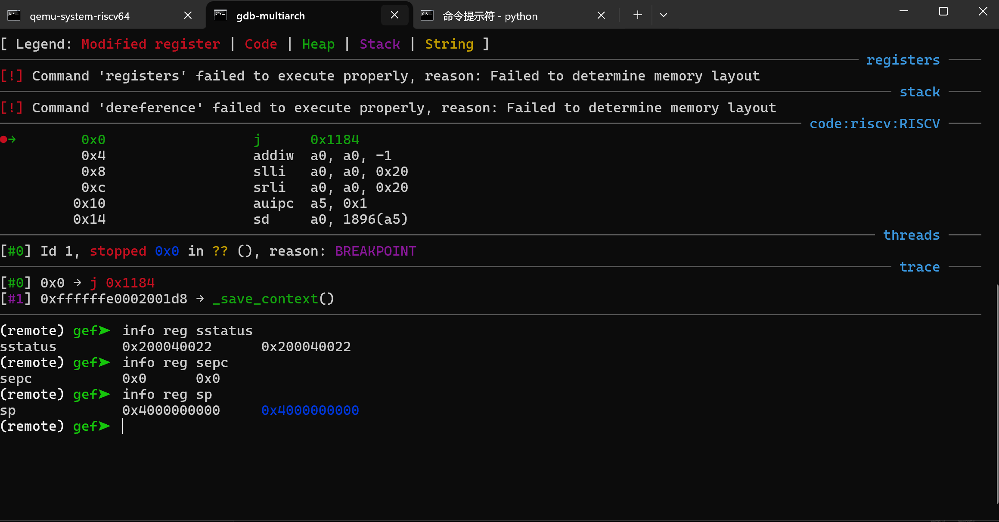

import Asciinema from "@md-components/AsciinemaWrapper.vue";

# 实验 4：RV64 用户模式 实验报告

## 一、实验目的

- 创建用户态进程，并设置 `sstatus` 来完成内核态转换至用户态。
- 正确设置用户进程的**用户态栈**和**内核态栈**，并在异常处理时正确切换。
- 补充异常处理逻辑，完成指定的 syscall（`sys_write`、`sys_getpid`）功能。

## 二、实验过程

### 创建用户态进程

#### 进程结构扩展


> 由于创建用户态进程要读取/设置 `sepc`、`sstatus`、`sscratch` 等 CSR，我们需要将它们加入 `thread_struct` 中。具体而言：
> 
> - `sepc`：保存 S-mode 中断处理完毕后 `#!asm sret` 的返回地址。
> - `sstatus`：控制 S-mode 的状态寄存器，包含与 trap、特权级、内存访问等相关的重要信息。
> - `sscratch`：由 S-mode 自由设置。在我们的实验中，我们用其保存另一状态的 `sp`，在特权态切换时进行栈的更新。
> - `scause`：保存异常原因。
> - `stval`：根据不同的异常类型，保存不同的信息值。
> 
> 另外，由于多个用户态进程需要保证相对隔离，因此不可以共用页表。**每个用户态进程都需要创建独立的页表。**


在 `arch/riscv/include/proc.h` 中扩展了 `thread_struct` 和 `task_struct`：

```diff
typedef uint64_t *pagetable_t;

struct pt_regs {
  uint64_t x[32];
  uint64_t sepc;
  uint64_t sstatus;
};

struct thread_struct {
  uint64_t ra;
  uint64_t sp;
  uint64_t s[12];
+ uint64_t sepc;
+ uint64_t sstatus;
+ uint64_t sscratch;
+ uint64_t stval;
+ uint64_t scause;
};

struct task_struct {
  uint64_t pid;
  uint64_t state;
  uint64_t priority;
  uint64_t counter;
  struct thread_struct thread;
+ pagetable_t pgd;
};
```

`pt_regs` 用于在 `_traps` 中将保存的寄存器堆映射为结构体，使 C 代码可直接访问寄存器值。CSR 字段（`sepc`, `sstatus`, `sscratch`, `stval`, `scause`）用于在上下文切换和异常处理中保存/恢复特权态状态。`pagetable_t pgd` 使每个进程拥有独立页表。

#### 用户态进程初始化 (`task_init`)

在 `arch/riscv/kernel/proc.c` 中重写了 `task_init`：

**Idle 任务**（`task[0]`）：
- `sscratch = 0` 标记为内核线程
- `sstatus = (SPP=1 | SPIE=1)` 使得 `sret` 返回 S-mode
- `pgd = swapper_pg_dir`（共享内核页表）

**用户任务**（`task[1..4]`）每个拥有：
- **独立页表**：`alloc_page() + memcpy` 从 `swapper_pg_dir` 复制内核地址空间映射
- **U-mode 栈**：`alloc_page()`，映射到 `USER_END - PGSIZE`，PTE 权限 `U | W | R`
- **uapp 私有副本**：`alloc_pages()` + `memcpy`，映射到 `USER_START`，PTE 权限 `U | X | W | R`
- **CSR 初始化**：
  - `sepc = USER_START`（用户程序入口）
  - `sstatus = (SPIE | SUM, SPP=0)` -> `sret` 返回 U-mode，S-mode 可访问用户页
  - `sscratch = USER_END`（U-mode 栈顶）

```c
// 关键初始化代码
task[i]->thread.sepc = USER_START;
task[i]->thread.sstatus = (1UL << 5) | (1UL << 18); // SPIE=1 | SUM=1, SPP=0
task[i]->thread.sscratch = USER_END;

// 独立页表
uint64_t *new_pgtbl = alloc_page();
memcpy(new_pgtbl, swapper_pg_dir, PGSIZE);
task[i]->pgd = (pagetable_t)new_pgtbl;

// 映射 U-mode 栈
void *ustack_page = alloc_page();
create_mapping(new_pgtbl, (void *)(USER_END - PGSIZE),
               (void *)VA2PA((uint64_t)ustack_page), PGSIZE,
               (1UL << 4) | (1UL << 2) | (1UL << 1)); 
               // U | W | R

// 复制 uapp 并映射
void *uapp_copy = alloc_pages(uapp_pages);
memcpy(uapp_copy, _suapp, uapp_size);
create_mapping(new_pgtbl, (void *)USER_START,
               (void *)VA2PA((uint64_t)uapp_copy),
               uapp_pages * PGSIZE,
               (1UL << 4) | (1UL << 3) | (1UL << 2) | (1UL << 1)); 
               // U | X | W | R
```

每个用户进程独享一份 uapp 副本，防止多进程共享 `.data`/`.bss` 段造成数据竞争。


#### 上下文切换 (`__switch_to`)

在 `__switch_to` 中新增了 CSR 和页表的保存/恢复：

```riscvasm
__switch_to:
    # 保存 callee-saved 寄存器
    sd ra, 32(a0)
    sd sp, 40(a0)
    sd s0, 48(a0)
    ...
    sd s11, 136(a0)

    # 保存 CSR
    csrr t0, sepc
    sd t0, 144(a0)
    csrr t0, sstatus
    sd t0, 152(a0)
    csrr t0, sscratch
    sd t0, 160(a0)
    csrr t0, stval
    sd t0, 168(a0)
    csrr t0, scause
    sd t0, 176(a0)

    # 恢复 next 的 callee-saved 和 CSR
    ld s0, 48(a1) ... ld s11, 136(a1)
    ld t0, 144(a1); csrw sepc, t0
    ld t0, 152(a1); csrw sstatus, t0
    ld t0, 160(a1); csrw sscratch, t0
    ld t0, 168(a1); csrw stval, t0
    ld t0, 176(a1); csrw scause, t0

    # 切换页表
    ld t0, 184(a1)            # next->pgd (VA)
    li t1, PA2VA_OFFSET
    sub t0, t0, t1             # VA -> PA
    srli t0, t0, 12
    li t1, 0x8000000000000000  # Sv39 mode
    or t0, t0, t1
    csrw satp, t0
    sfence.vma

    ld ra, 32(a1)
    ld sp, 40(a1)
    ret
```

页表中保存的是**虚拟地址**（`pagetable_t`），切换时通过 `PA2VA_OFFSET` 转换为物理地址写入 `satp`，然后 `sfence.vma` 刷新 TLB。

### 修改 `head.S` 及 `start_kernel`

#### 修改 `head.S`

去除 `sstatus.SIE` 的设置逻辑（对 `sstatus` 的设置由 `task_init` 完成）。添加了 `scounteren` 设置允许 U-mode 读取 `time` 寄存器。启动后直接调用 `task_init` 然后跳转 `start_kernel`。

```riscvasm
_start:
    la sp, _sbss

    call setup_vm
    call relocate

    call mm_init
    call setup_vm_final

    # 1. 将 stvec 设置为 _traps
    la t0, _traps
    csrw stvec, t0

    # 2. 设置 sie[STIE]
    csrr t0, sie
    ori t0, t0, 0x20      # STIE 是第 5 位
    csrw sie, t0

    # 2.5 设置 scounteren 允许 U-mode 访问 time 寄存器
    li t0, 0x2             # TM bit
    csrw 0x106, t0         # scounteren

    # 3. 设置第一次时钟中断的时间
    call clock_set_next_event

    # 4. 跳转到 start_kernel
    call task_init
    j start_kernel
```

- 不再设置 `sstatus.SIE`，因为每个进程的 `sstatus` 已在 `task_init` 中正确初始化。
- 新增 `csrw 0x106, t0`（`scounteren.TM = 1`），允许 U-mode 使用 `rdtime` 指令。

#### 修改 `start_kernel`

去除等待第一次时钟中断的逻辑，改为直接调用 `schedule`：

```c
_Noreturn void start_kernel(void) {
  printk("2025 ZJU Computer System III\n");

  schedule();
  __builtin_unreachable();
}
```


### 修改 `__dummy` 与 `_traps`

#### 修改 `__dummy`

进程首次被调度时从 `__dummy` 开始执行。此时处于 S-mode，`sp` 指向 S-mode 栈，`sepc` 已被 `__switch_to` 恢复为 `USER_START`。在执行 `sret` 前需要将 `sp` 和 `sscratch` 交换，切换到 U-mode 栈：

```asm
    .globl __dummy
__dummy:
    # Check if user process (sscratch != 0) or kernel thread (sscratch == 0)
    csrr t0, sscratch
    beqz t0, 1f
    # User process: swap sp with U-mode sp stored in sscratch
    csrrw sp, sscratch, sp
1:
    sret
```

若 `sscratch == 0` 则为内核线程（如 idle），不进行栈切换直接 `sret`。若 `sscratch != 0`（用户进程的 U-mode 栈地址），则交换 `sp` 和 `sscratch`，使得 `sret` 后 `sp = USER_END`（U-mode 栈顶），`sscratch` 保存 S-mode 栈指针。

#### 修改 `_traps`

进入 `_traps` 时需要从 U-mode 栈切换到 S-mode 栈，退出时需要切换回来：

```riscvasm
    .globl _traps
_traps:
    # Swap sp and sscratch to switch between U-mode and S-mode stacks
    csrrw sp, sscratch, sp
    bnez sp, _save_context
    # Came from S-mode (sscratch was 0): undo swap
    csrrw sp, sscratch, sp
_save_context:
    # 1. Save registers and CSRs to the stack as pt_regs
    addi sp, sp, -272

    sd x0, 0(sp)
    sd x1, 8(sp)
    sd x2, 16(sp)       # original sp (saved in sscratch)
    sd x3, 24(sp)
    ...
    sd x31, 248(sp)

    csrr t0, sepc
    sd t0, 256(sp)
    csrr t0, sstatus
    sd t0, 264(sp)

    # 2. Call trap_handler(regs, scause, stval)
    mv a0, sp
    csrr a1, scause
    csrr a2, stval
    call trap_handler

    # 3. Restore and return
    ld t0, 264(sp)       # load sstatus to check SPP

    ld t1, 256(sp)
    csrw sepc, t1

    # Restore x1-x31 (skip x0)
    ld x1, 8(sp)
    ld x3, 24(sp)
    ...
    ld x31, 248(sp)

    addi sp, sp, 272

    # Check SPP to determine if returning to U-mode or S-mode
    andi t0, t0, 0x100
    bnez t0, 1f

    # Returning to U-mode: swap sp/sscratch
    csrrw sp, sscratch, sp
1:
    sret
```

入口逻辑：
1. `csrrw sp, sscratch, sp`：原子交换 `sp` 和 `sscratch`。若来自 U-mode，交换后 `sp = S-mode 栈`（之前保存在 `sscratch` 中），`sscratch = U-mode sp`。
2. `bnez sp, _save_context`：若 `sp != 0` 说明来自 U-mode，跳转保存上下文。
3. 若 `sp == 0`（来自 S-mode，`sscratch` 原为 0）：撤销交换，继续使用当前 S-mode 栈。

出口逻辑：检查 `sstatus.SPP`（bit 8），若为 0 则返回 U-mode，需要再次交换 `sp` 和 `sscratch` 恢复 U-mode 栈。


### 修改 `trap_handler`

修改 `trap_handler` 函数签名，增加 `pt_regs` 参数和 `stval` 参数。在 `_traps` 中通过将 `sp`（指向栈上保存的寄存器组）作为第一个参数传递。

```c
#define INTERRUPT_MASK (1UL << 63)
#define SUPERVISOR_TIMER_INTERRUPT 5
#define ENVIRONMENT_CALL_FROM_U_MODE 8

void trap_handler(struct pt_regs *regs, uint64_t scause, uint64_t stval) {
  if (scause & INTERRUPT_MASK) {
    uint64_t interrupt_code = scause & ~INTERRUPT_MASK;
    if (interrupt_code == SUPERVISOR_TIMER_INTERRUPT) {
      printk("[S] Supervisor timer interrupt\n");
      clock_set_next_event();
      do_timer();
    }
  } else {
    uint64_t exception_code = scause;
    if (exception_code == ENVIRONMENT_CALL_FROM_U_MODE) {
      regs->sepc += 4;

      uint64_t syscall_nr = regs->x[17];  // a7
      switch (syscall_nr) {
      case __NR_write:
        regs->x[10] = sys_write(regs->x[10], (const char *)regs->x[11], regs->x[12]);
        break;
      case __NR_getpid:
        regs->x[10] = sys_getpid();
        break;
      default:
        regs->x[10] = -1;
        break;
      }
    }
  }
}
```


### 添加 syscall

#### 内核态 syscall 实现

`arch/riscv/kernel/ksyscalls.c`

```c
#include <ksyscalls.h>
#include <proc.h>
#include <sbi.h>
#include <stddef.h>
#include <stdint.h>

extern struct task_struct *current;

long sys_write(unsigned int fd, const char *buf, size_t count) {
  if (fd != 1)
    return -1;
  if (buf == NULL || count == 0)
    return 0;
  for (size_t i = 0; i < count; i++)
    sbi_ecall(0x01, 0, buf[i], 0, 0, 0, 0, 0);
  return count;
}

long sys_getpid(void) {
  return current->pid;
}
```

- `sys_write`：仅处理 `fd == 1`（`stdout`），逐字符通过 SBI 输出。
- `sys_getpid`：返回当前进程 `pid`。

#### 用户态 syscall 封装 

`user/src/syscalls.c`

```c
#include <syscalls.h>
#include <unistd.h>
#include <stdint.h>

pid_t getpid(void) {
  pid_t ret;
  asm volatile("li a7, %1\n\t"
               "ecall\n\t"
               "mv %0, a0\n\t"
               : "=r"(ret)
               : "i"(__NR_getpid)
               : "a0", "a7", "memory");
  return ret;
}

ssize_t write(int fd, const void *buf, size_t count) {
  ssize_t ret;
  asm volatile("li a7, %4\n\t"
               "ecall\n\t"
               "mv %0, a0\n\t"
               : "=r"(ret)
               : "r"((long)fd), "r"(buf), "r"((long)count), "i"(__NR_write)
               : "a0", "a1", "a2", "a7", "memory");
  return ret;
}
```

通过内联汇编将 syscall 号放入 `a7`，参数放入 `a0-a2`，执行 `ecall` 陷入内核，返回值从 `a0` 取出。

### 编译及测试

import cast1 from "./l4ca1.cast?url";

<Asciinema url={cast1} />

## 三、思考题

### 证明 uapp 运行在 U-mode

> 给出 GDB 的截图，证明你的 `uapp` 的确是运行在用户态下的。

1. 在 GDB 中设置用户程序入口断点并运行：
   ```
   (gdb) b *0x0
   (gdb) c
   ```

2. 当断点命中后查看关键寄存器：
   ```
   (gdb) info reg sstatus   # SPP 位（bit 8）应为 0，表示当前在 U-mode
   (gdb) info reg sepc      # 应指向用户空间地址
   (gdb) info reg sp        # 应在 USER_END 附近
   ```




- `sstatus.SPP = 0`：说明当前特权级为 U-mode（User mode）
- `sepc` 值在 `0x0 ~ 0x4000000000` 范围内：说明当前执行地址在用户空间
- `sp` 值在 `USER_END` 附近：说明使用的是用户态栈


### 为何必须通过 `regs->a0` 返回值

> 为什么内核在处理 syscall 时，需要用 `regs->a0` 来返回值给 `uapp`，而不能直接修改寄存器？

因为 `_traps` 在 `sret` 之前会从 `pt_regs` 结构**恢复所有通用寄存器**。

```c

```

1. `_traps` 入口将 `x0..x31` 保存到栈上的 `pt_regs`
2. `trap_handler` 被调用，此时 CPU 的 `a0` 寄存器可以被修改
3. `trap_handler` 返回后，`_traps` 执行 `ld x10, 80(sp)` 将 `pt_regs->x[10]`（即 a0）的值加载到 CPU 寄存器

所以无论 `trap_handler` 中把 CPU 的 `a0` 改成什么值，都会在 `_traps` 恢复阶段被 `pt_regs` 中保存的值覆盖。因此必须将返回值写入 `regs->x[10]`（即 `pt_regs` 的 a0 位置），`_traps` 恢复时才能将正确值载入 `a0` 并带回用户态。

#### ~~linux也干了~~

```riscvasm
# arch/riscv/kernel/entry.S L206-209
ret_from_syscall:
	/* Set user a0 to kernel a0 */
	REG_S a0, PT_A0(sp)
```

{/* ### 页表复制使用物理地址还是虚拟地址

> 在你的实现中将内核页表 `swapper_pg_dir` 复制到每个进程的页表中时用的是物理地址还是虚拟地址，为什么？

使用**虚拟地址**。具体代码：

```c
uint64_t *new_pgtbl = alloc_page();
memcpy(new_pgtbl, swapper_pg_dir, PGSIZE);
task[i]->pgd = (pagetable_t)new_pgtbl;
```

`alloc_page()` 返回的是内核虚拟地址（伙伴系统分配器工作在虚拟地址空间），`swapper_pg_dir` 同样是虚拟地址。`memcpy` 的两个操作数都是 VA，整个复制过程在虚拟地址空间完成。

此时已经`setup_vm_final`， CPU 已经在虚拟地址模式下运行，`swapper_pg_dir` 和 `alloc_page` 返回的新页面都可以通过直接映射（`VA = PA + PA2VA_OFFSET`）正确访问。页表中存储的 PPN 虽然是物理地址（由 `create_mapping` 内部通过 `VA2PA` 转换后填入 PTE），但页表本身作为内存页面，其访问和复制操作完全使用虚拟地址。

`pgd` 字段存储的是虚拟地址，在 `__switch_to` 中切换时通过 `PA2VA_OFFSET` 动态转换为物理地址写入 `satp`。 */}

### `printf` 调用链

> 对于 `user/src/main.c` 中的 `printf` 调用：
> ```c
> printf("\x1b[44m[U]\x1b[0m [PID = %d, sp = %p] i = %d @ %" PRIu64 "\n", getpid(), sp, ++i, prev_clock);
> ```
> 请分析这一行的调用链。

调用链分为两个阶段：**参数求值阶段**和**格式化输出阶段**。

**阶段一：参数求值**

`printf` 调用前，参数需从右向左入栈/传参：

1. `prev_clock`：全局变量，直接取值 -> 存入 a7（第 8 个参数，512-byte 对齐区域或 a7）
2. `++i`：自增全局变量 `i` -> 存入 a6
3. `sp`：`register const void *const sp asm("sp")` 声明使得 `sp` 直接读取栈指针寄存器存入 a5
4. `getpid()`：
   ```
   getpid() -> 内联汇编 "li a7, 172; ecall; mv a0, ret"
            -> CPU 陷入 S-mode
            -> _traps -> trap_handler
            -> regs->x[17] == 172 -> sys_getpid()
            -> return current->pid -> regs->x[10] = pid
            -> _traps 恢复 -> sret -> U-mode
            -> a0 = pid
   ```
   返回值 pid 存入 a4
5. `fmt`：格式串地址（位于 uapp .rodata）-> 存入 a0

**阶段二：格式化输出**

```
printf(fmt, ...)               [user/src/printf.c]
  -> va_start(ap, fmt)
  -> vfprintf(stdout, fmt, ap)  [lib/vfprintf.c]
      -> 解析格式串，每遇到格式化字符或普通字符，调用 stdout->write
      -> stdout->write = printf_syscall_write  [user/src/printf.c]
          -> write(STDOUT_FILENO, buf, len)  [user/src/syscalls.c]
              -> ecall (a7=64, a0=fd, a1=buf, a2=len)
              -> S-mode _traps -> trap_handler
              -> regs->x[17] == 64 -> sys_write(fd, buf, count)  [ksyscalls.c]
                  -> for i in 0..count: sbi_ecall(0x01, 0, buf[i], 0, 0, 0, 0, 0)
                      -> S-mode ecall -> M-mode OpenSBI -> 串口输出
              -> regs->x[10] = count
              -> _traps 恢复 -> sret -> U-mode
              -> 返回 write()，返回 count
```

`printf` 的一次调用会触发多次 `write` syscall——`vfprintf` 按字符格式化后分批调用 `printf_syscall_write` 输出。


### `_traps` 的栈切换与来源分析

> 现在我们在进入和离开 `_traps` 都需要切换栈；这隐含一个条件，即 `_traps` 一定是从 U-mode 进入的。这是否正确？

**不完全正确**。虽然用户进程始终运行在 U-mode、异常从 U-mode 进入，但我们的实现中 Idle 线程运行在 S-mode。Idle 线程的 `sscratch = 0` 且 `sstatus.SIE = 1`（通过 `SPIE` 在 `sret` 后自动设置），因此时钟中断可能在 Idle 线程执行时触发——此时 `_traps` 从 S-mode 进入。

我们的 `_traps` 通过 `sscratch` 的值区分来源：

```riscvasm
_traps:
    # Swap sp and sscratch to switch between U-mode and S-mode stacks
    csrrw sp, sscratch, sp
    bnez sp, _save_context
    # Came from S-mode (sscratch was 0): undo swap
    csrrw sp, sscratch, sp
```


| 来源 | `sscratch` 原值 | `csrrw` 后 `sp` | 处理 |
|------|----------------|-----------------|------|
| U-mode | S-mode sp | S-mode sp（非零） | 成功切换栈，进入 `_save_context` |
| S-mode (Idle) | 0 | 0 | `bnez` 不跳转，`csrrw` 撤销交换，栈不变 |

这种设计正确区分了两种来源，实现了正确的栈管理。

> 在本次实验中，什么最关键的原因/更改导致 `_traps` 是从 U-mode 进入的？

最关键的原因是 **`sstatus.SPP` 被设置为 0**。

在 `task_init` 中：
```c
task[i]->thread.sstatus = (1UL << 5) | (1UL << 18); 
// SPIE=1 | SUM=1, SPP=0
```

`SPP`（Previous Privilege）位为 0 表示 `sret` 的目标特权级为 U-mode。当 `__dummy` 执行 `sret` 后，CPU 进入 U-mode 执行用户程序。此后任何异常（syscall、timer 中断）都从 U-mode 进入 `_traps`。

对比 Lab3，所有任务运行在 S-mode（`SPP=1`），`_traps` 总是从 S-mode 进入，无需栈切换。

> 阅读 Linux `entry.S` 相关代码，分析其对来自 U-mode 和 S-mode 异常的区分与栈切换。


```riscvasm

ENTRY(handle_exception)
	/*
	 * If coming from userspace, preserve the user thread pointer and load
	 * the kernel thread pointer.  If we came from the kernel, the scratch
	 * register will contain 0, and we should continue on the current TP.
	 */
	csrrw tp, CSR_SCRATCH, tp
	bnez tp, _save_context

_restore_kernel_tpsp:
	csrr tp, CSR_SCRATCH
	REG_S sp, TASK_TI_KERNEL_SP(tp)
_save_context:
	REG_S sp, TASK_TI_USER_SP(tp)
	REG_L sp, TASK_TI_KERNEL_SP(tp)
	addi sp, sp, -(PT_SIZE_ON_STACK)
	REG_S x1,  PT_RA(sp)
	REG_S x3,  PT_GP(sp)
	REG_S x5,  PT_T0(sp)
	REG_S x6,  PT_T1(sp)
	REG_S x7,  PT_T2(sp)
	REG_S x8,  PT_S0(sp)
	REG_S x9,  PT_S1(sp)
	REG_S x10, PT_A0(sp)
	REG_S x11, PT_A1(sp)
	REG_S x12, PT_A2(sp)
	REG_S x13, PT_A3(sp)
	REG_S x14, PT_A4(sp)
	REG_S x15, PT_A5(sp)
	REG_S x16, PT_A6(sp)
	REG_S x17, PT_A7(sp)
	REG_S x18, PT_S2(sp)
	REG_S x19, PT_S3(sp)
	REG_S x20, PT_S4(sp)
	REG_S x21, PT_S5(sp)
	REG_S x22, PT_S6(sp)
	REG_S x23, PT_S7(sp)
	REG_S x24, PT_S8(sp)
	REG_S x25, PT_S9(sp)
	REG_S x26, PT_S10(sp)
	REG_S x27, PT_S11(sp)
	REG_S x28, PT_T3(sp)
	REG_S x29, PT_T4(sp)
	REG_S x30, PT_T5(sp)
	REG_S x31, PT_T6(sp)

	/*
	 * Disable user-mode memory access as it should only be set in the
	 * actual user copy routines.
	 *
	 * Disable the FPU to detect illegal usage of floating point in kernel
	 * space.
	 */
	li t0, SR_SUM | SR_FS

	REG_L s0, TASK_TI_USER_SP(tp)
	csrrc s1, CSR_STATUS, t0
	csrr s2, CSR_EPC
	csrr s3, CSR_TVAL
	csrr s4, CSR_CAUSE
	csrr s5, CSR_SCRATCH
	REG_S s0, PT_SP(sp)
	REG_S s1, PT_STATUS(sp)
	REG_S s2, PT_EPC(sp)
	REG_S s3, PT_BADADDR(sp)
	REG_S s4, PT_CAUSE(sp)
	REG_S s5, PT_TP(sp)

	/*
	 * Set the scratch register to 0, so that if a recursive exception
	 * occurs, the exception vector knows it came from the kernel
	 */
	csrw CSR_SCRATCH, x0

	/* Load the global pointer */
.option push
.option norelax
	la gp, __global_pointer$
.option pop

#ifdef CONFIG_TRACE_IRQFLAGS
	call __trace_hardirqs_off
#endif

#ifdef CONFIG_CONTEXT_TRACKING
	/* If previous state is in user mode, call context_tracking_user_exit. */
	li   a0, SR_PP
	and a0, s1, a0
	bnez a0, skip_context_tracking
	call context_tracking_user_exit
skip_context_tracking:
#endif

	/*
	 * MSB of cause differentiates between
	 * interrupts and exceptions
	 */
	bge s4, zero, 1f

	la ra, ret_from_exception

	/* Handle interrupts */
	move a0, sp /* pt_regs */
	la a1, handle_arch_irq
	REG_L a1, (a1)
	jr a1
1:
	/*
	 * Exceptions run with interrupts enabled or disabled depending on the
	 * state of SR_PIE in m/sstatus.
	 */
	andi t0, s1, SR_PIE
	beqz t0, 1f
#ifdef CONFIG_TRACE_IRQFLAGS
	call __trace_hardirqs_on
#endif
	csrs CSR_STATUS, SR_IE

1:
	la ra, ret_from_exception
	/* Handle syscalls */
	li t0, EXC_SYSCALL
	beq s4, t0, handle_syscall

	/* Handle other exceptions */
	slli t0, s4, RISCV_LGPTR
	la t1, excp_vect_table
	la t2, excp_vect_table_end
	move a0, sp /* pt_regs */
	add t0, t1, t0
	/* Check if exception code lies within bounds */
	bgeu t0, t2, 1f
	REG_L t0, 0(t0)
	jr t0
1:
	tail do_trap_unknown
```

Linux 使用 `sscratch` 存储 `task_struct` 指针（本质上即 `thread_info`），并通过以下约定区分来源：

| 场景 | `sscratch` | 含义 |
|------|-----------|------|
| 用户态运行时 | `&task_struct` | 下次陷入时可通过它找到内核栈 |
| 内核态运行时 | **0** | 表示当前已在 S-mode |

**异常入口**（`handle_exception`）：
```riscvasm
csrrw tp, CSR_SCRATCH, tp    // 交换 tp 和 sscratch
bnez tp, _save_context        // tp != 0 -> 来自 U-mode，继续保存

_restore_kernel_tpsp:         // tp == 0 -> 来自 S-mode
    csrr tp, CSR_SCRATCH      // 恢复原来的内核 tp
    REG_S sp, TASK_TI_KERNEL_SP(tp) // 保存当前 sp 到 thread_info
_save_context:
    REG_S sp, TASK_TI_USER_SP(tp)   // 保存用户 sp
    REG_L sp, TASK_TI_KERNEL_SP(tp) // 加载内核 sp
```

- **来自 U-mode**：`sscratch` 原为 `task_struct` 指针 -> 交换后 `tp = task_struct`≠0 -> 保存 `user_sp`，加载 `kernel_sp`，切换栈
- **来自 S-mode**：`sscratch` 原为 0 -> 交换后 `tp=0` -> 走 `_restore_kernel_tpsp` 恢复 `tp`，保存当前 `sp` 但不切换栈


```riscvasm

resume_userspace:
	/* Interrupts must be disabled here so flags are checked atomically */
	REG_L s0, TASK_TI_FLAGS(tp) /* current_thread_info->flags */
	andi s1, s0, _TIF_WORK_MASK
	bnez s1, work_pending

#ifdef CONFIG_CONTEXT_TRACKING
	call context_tracking_user_enter
#endif

	/* Save unwound kernel stack pointer in thread_info */
	addi s0, sp, PT_SIZE_ON_STACK
	REG_S s0, TASK_TI_KERNEL_SP(tp)

	/*
	 * Save TP into the scratch register , so we can find the kernel data
	 * structures again.
	 */
	csrw CSR_SCRATCH, tp

```

**返回路径**（`resume_userspace`）：
```riscvasm
resume_userspace:
    REG_S s0, TASK_TI_KERNEL_SP(tp) // 保存内核 sp
    csrw CSR_SCRATCH, tp            // 将 task_struct 指针写入 sscratch
    // 之后恢复寄存器，sret 返回 U-mode
```

返回 S-mode 的路径（如内核线程）不动 `sscratch`，保持其值为 0，确保下次异常从 S-mode 进入时能正确识别。

**设计意图**：`sscratch = 0` 的约定使得*来自 S-mode 的嵌套异常*不会错误地切换栈，而*来自 U-mode 的异常*始终能通过 `sscratch` 找到内核栈。

## 四、总结

本实验完成了 RISC-V 64 用户模式支持，通过本次实验，对 RISC-V 特权级切换机制、多级栈管理和系统调用全链路有了深入理解。
