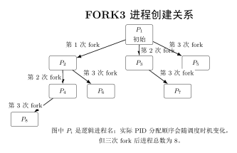
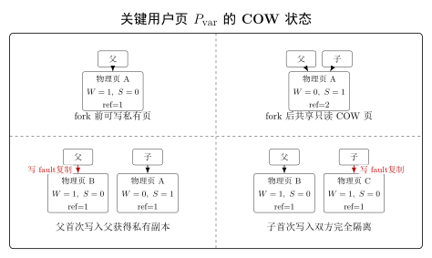

import Asciinema from "@md-components/AsciinemaWrapper.vue";

# 实验目的

- 通过 `vm_area_struct` 数据结构实现对进程**多区域**虚拟内存的管理。
- 在 [Lab4](lab4.md) 实现用户态程序的基础上，添加缺页异常处理 **page fault handler**。
- 为进程加入 **fork** 机制，能够支持通过 **fork** 创建新的用户态进程。

# 实验过程

## 准备工作

```diff
--- src/project/lab4/kernel/Makefile
+++ src/project/kernel/Makefile
@@ -7,11 +7,12 @@
 
 CURDIR = /root/sys3-sp26/src/project/kernel
 BUILD := $(CURDIR)/build
+T ?= PFH1
 
 ISA := rv64ia_zicsr_zifencei
 ABI := lp64
 
-export CPPFLAGS := -I$(CURDIR)/include
+export CPPFLAGS := -I$(CURDIR)/include -DUSER_MAIN=$(T)
 export CFLAGS := -march=$(ISA) -mabi=$(ABI) -mcmodel=medany \
     -ffreestanding -fno-builtin -ffunction-sections -fdata-sections \
     -nostartfiles -nostdlib -nostdinc -static -ggdb -Og \
```

新增 `T` 参数和 `-DUSER_MAIN=$(T)` 编译宏，允许通过 `make T=FORK1` 选择不同的用户程序入口（PFH1/PFH2/FORK1~FORK4），控制编译时条件编译。

## 实现缺页异常处理

### VMA 相关的结构体


```diff
--- src/project/lab4/kernel/arch/riscv/include/proc.h
+++ src/project/kernel/arch/riscv/include/proc.h
@@ -1,17 +1,38 @@
 #ifndef __PROC_H__
 #define __PROC_H__
 
+#include <stddef.h>
 #include <stdint.h>
 
 #define TASK_RUNNING 0
 
-#define NR_TASKS (1 + 4)
+#define NR_TASKS (1 + 16)
 #define PRIORITY_MIN 1
 #define PRIORITY_MAX 10
 
 typedef uint64_t *pagetable_t;
 
+#define VM_READ 0x01
+#define VM_WRITE 0x02
+#define VM_EXEC 0x04
+#define VM_ANON 0x08
+
+struct mm_struct;
+
+struct vm_area_struct {
+  struct mm_struct *vm_mm;
+  void *vm_start;
+  void *vm_end;
+  unsigned vm_flags;
+  struct vm_area_struct *vm_prev;
+  struct vm_area_struct *vm_next;
+};
+
+struct mm_struct {
+  struct vm_area_struct *mmap;
+};
+
 struct pt_regs {
   uint64_t x[32];
@@ -42,6 +63,8 @@
   struct thread_struct thread;
 
   pagetable_t pgd;
+
+  struct mm_struct *mm;
 };
 
 extern struct task_struct *current;
```

每块 VMA 都有自己的 flag 来定义权限以及分类（是否匿名）。我们参考文档，在适当的位置加入了 VMA 相关的结构体定义：

- 新增 **VMA（Virtual Memory Area）** 数据结构：`vm_area_struct`（用双向链表描述一段虚拟地址区域的属性）和 `mm_struct`（进程的地址空间）。
- 新增 **VM_READ / VM_WRITE / VM_EXEC / VM_ANON** 标志位。
- `task_struct` 新增 `mm` 指针，关联进程的地址空间描述。

### 支持对 `vm_area_struct` 的添加和查找


- `find_vma` 函数：实现对 `vm_area_struct` 的查找
    - 根据传入的地址 `addr`，遍历链表 `mm` 包含的 VMA 链表，找到该地址所在的 `vm_area_struct`
    - 如果链表中所有的 `vm_area_struct` 都不包含该地址，则返回 `NULL`
    ```c
    struct vm_area_struct *find_vma(struct mm_struct *mm, void *va) {
      if (!mm)
        return NULL;

      uint64_t addr = (uint64_t)va;
      for (struct vm_area_struct *vma = mm->mmap; vma; vma = vma->vm_next) {
        if ((uint64_t)vma->vm_start <= addr && addr < (uint64_t)vma->vm_end)
          return vma;
      }

      return NULL;
    }
    ```

- `do_mmap` 函数：实现添加新的 `vm_area_struct` 链表项
    - 新建 `vm_area_struct` 结构体，根据传入的参数对结构体赋值，并添加到 `mm` 指向的 VMA 链表中

    ```c
    void *do_mmap(struct mm_struct *mm, void *va, size_t len, unsigned flags) {
      struct vm_area_struct *vma = alloc_page();
      memset(vma, 0, PGSIZE);

      uint64_t start = PGROUNDDOWN((uint64_t)va);
      uint64_t end = PGROUNDUP((uint64_t)va + len);
      vma->vm_mm = mm;
      vma->vm_start = (void *)start;
      vma->vm_end = (void *)end;
      vma->vm_flags = flags;

      if (!mm->mmap) {
        mm->mmap = vma;
        return vma->vm_start;
      }

      struct vm_area_struct *cur = mm->mmap;
      struct vm_area_struct *prev = NULL;
      while (cur && (uint64_t)cur->vm_start < start) {
        prev = cur;
        cur = cur->vm_next;
      }

      vma->vm_prev = prev;
      vma->vm_next = cur;
      if (prev)
        prev->vm_next = vma;
      else
        mm->mmap = vma;
      if (cur)
        cur->vm_prev = vma;

      return vma->vm_start;
    }
    ```

### 修改 `task_init`


新增函数：

```c
static void init_user_task(struct task_struct *t, uint64_t pid) {
  t->state = TASK_RUNNING;
  t->pid = pid;
  t->priority = PRIORITY_MIN + (rand() % (PRIORITY_MAX - PRIORITY_MIN + 1));
  t->counter = 0;
  t->thread.ra = (unsigned long)__dummy;
  t->thread.sp = (unsigned long)t + PGSIZE;
  t->thread.sepc = USER_START;
  t->thread.sstatus = (1UL << 5) | (1UL << 18);
  t->thread.sscratch = USER_END;
  t->thread.stval = 0;
  t->thread.scause = 0;

  uint64_t *new_pgtbl = alloc_page();
  memset(new_pgtbl, 0, PGSIZE);
  memcpy(new_pgtbl, swapper_pg_dir, PGSIZE);
  t->pgd = (pagetable_t)new_pgtbl;

  t->mm = alloc_page();
  memset(t->mm, 0, PGSIZE);

  uint64_t uapp_size = (uint64_t)_euapp - (uint64_t)_suapp;
  do_mmap(t->mm, (void *)USER_START, uapp_size, VM_READ | VM_WRITE | VM_EXEC);
  do_mmap(t->mm, (void *)(USER_END - PGSIZE), PGSIZE, VM_READ | VM_WRITE | VM_ANON);
}

```

在该函数中：
- 初始化 `task_struct` 的基本信息（状态、PID、优先级、寄存器上下文等）。
- 为用户进程创建独立的页表，并复制内核页表的内容。
- 初始化 `mm_struct`，并通过 `do_mmap` 注册用户程序代码段和匿名栈段的 VMA。


```diff
--- src/project/lab4/kernel/arch/riscv/kernel/proc.c
+++ src/project/kernel/arch/riscv/kernel/proc.c
 void task_init(void) {
   srand(2025);
 
@@ -39,46 +100,10 @@
   task[0] = idle;
   current = idle;
 
-  /* 4: init user tasks */
-  uint64_t uapp_size = (uint64_t)_euapp - (uint64_t)_suapp;
-  uint64_t uapp_pages = (uapp_size + PGSIZE - 1) / PGSIZE;
-
   for (int i = 1; i < NR_TASKS; ++i) {
     void *task_pg = alloc_page();
     task[i] = (struct task_struct *)task_pg;
-    task[i]->state = TASK_RUNNING;
-    task[i]->pid = i;
-    task[i]->priority = PRIORITY_MIN + (rand() % (PRIORITY_MAX - PRIORITY_MIN + 1));
-    task[i]->counter = 0;
-    task[i]->thread.ra = (unsigned long)__dummy;
-    task[i]->thread.sp = (unsigned long)task_pg + PGSIZE;
-    task[i]->thread.sepc = USER_START;
-    task[i]->thread.sstatus = (1UL << 5) | (1UL << 18);  // SPIE=1 | SUM=1, SPP=0 (U-mode)
-    task[i]->thread.sscratch = USER_END;  // U-mode stack top
-    task[i]->thread.stval = 0;
-    task[i]->thread.scause = 0;
-
-    /* create independent page table */
-    uint64_t *new_pgtbl = alloc_page();
-    memcpy(new_pgtbl, swapper_pg_dir, PGSIZE);
-    task[i]->pgd = (pagetable_t)new_pgtbl;
-
-    /* map U-mode stack at USER_END - PGSIZE */
-    void *ustack_page = alloc_page();
-    create_mapping(new_pgtbl,
-                   (void *)(USER_END - PGSIZE),
-                   (void *)VA2PA((uint64_t)ustack_page),
-                   PGSIZE,
-                   (1UL << 4) | (1UL << 2) | (1UL << 1));  // U | W | R
-
-    /* copy uapp to process-private memory and map at USER_START */
-    void *uapp_copy = alloc_pages(uapp_pages);
-    memcpy(uapp_copy, _suapp, uapp_size);
-    create_mapping(new_pgtbl,
-                   (void *)USER_START,
-                   (void *)VA2PA((uint64_t)uapp_copy),
-                   uapp_pages * PGSIZE,
-                   (1UL << 4) | (1UL << 3) | (1UL << 2) | (1UL << 1));  // U | X | W | R
+    init_user_task(task[i], i);
   }
 
   printk("...task_init done!\n");
```

相比于原先的实现，把用户程序的代码页和栈页的映射从 `task_init` 中删除了，改成了在 `init_user_task` 里通过 `do_mmap` 注册 VMA。这样真正的页表建立和物理页分配就推迟到了 page fault 时做，实现了 demand paging 的基本框架。


### 实现 Page Fault Handler

> 当捕获了 page fault 之后，需要实现缺页异常的处理函数 do_page_fault，它可以同时处理三种不同的 page fault。（哪三种？）

要处理的三种 page fault 分别是：
- **Instruction page fault**：当 CPU 尝试执行一个地址但该地址没有映射时触发。
- **Load page fault**：当 CPU 尝试从一个地址加载数据但该地址没有映射时触发。
- **Store/AMO page fault**：当 CPU 尝试向一个地址存储数据或执行原子操作但该地址没有映射时触发。

```diff
--- src/project/lab4/kernel/arch/riscv/kernel/trap.c
+++ src/project/kernel/arch/riscv/kernel/trap.c
@@ -2,6 +2,10 @@
 #include <proc.h>
 #include <syscalls.h>
 #include <ksyscalls.h>
+#include <mm.h>
+#include <vm.h>
+#include <string.h>
+#include <private_kdefs.h>
@@ -9,9 +13,90 @@
 #define INTERRUPT_MASK (1UL << 63)
 #define SUPERVISOR_TIMER_INTERRUPT 5
 #define ENVIRONMENT_CALL_FROM_U_MODE 8
+#define INSTRUCTION_PAGE_FAULT 12
+#define LOAD_PAGE_FAULT 13
+#define STORE_AMO_PAGE_FAULT 15
+
+extern char _suapp[], _euapp[];
+
+static uint64_t vm_flags_to_pte_perm(unsigned flags) {
+  uint64_t perm = PTE_U;
+  if (flags & VM_READ)  perm |= PTE_R;
+  if (flags & VM_WRITE) perm |= PTE_W;
+  if (flags & VM_EXEC)  perm |= PTE_X;
+  return perm;
+}
+
+static const char *fault_name(uint64_t scause) {
+  switch (scause) {
+  case INSTRUCTION_PAGE_FAULT:   return "Instruction page fault";
+  case LOAD_PAGE_FAULT:          return "Load page fault";
+  case STORE_AMO_PAGE_FAULT:     return "Store/AMO page fault";
+  default:                       return "Unknown page fault";
+  }
+}
+
+static int access_allowed(uint64_t scause, struct vm_area_struct *vma) {
+  switch (scause) {
+  case INSTRUCTION_PAGE_FAULT:    return vma->vm_flags & VM_EXEC;
+  case LOAD_PAGE_FAULT:           return vma->vm_flags & (VM_READ | VM_WRITE);
+  case STORE_AMO_PAGE_FAULT:      return vma->vm_flags & VM_WRITE;
+  default:                        return 0;
+  }
+}
+
+static void do_page_fault(uint64_t scause, uint64_t sepc, uint64_t stval) {
+  printk("[S] %s; sepc = 0x%lx, stval = 0x%lx\n",
+         fault_name(scause), sepc, stval);
+
+  uint64_t fault_va = stval;
+  uint64_t map_va = PGROUNDDOWN(fault_va);
+  struct vm_area_struct *vma = find_vma(current->mm, (void *)fault_va);
+  if (!vma) {
+    printk("[S] Page fault address 0x%lx is not in any VMA\n", fault_va);
+    while (1) ;
+  }
+  if (!access_allowed(scause, vma)) {
+    printk("[S] Page fault access denied: scause = %lu, va = 0x%lx, "
+           "vma flags = 0x%x\n",
+           scause, fault_va, vma->vm_flags);
+    while (1) ;
+  }
+
+  void *page = alloc_page();
+  memset(page, 0, PGSIZE);
+
+  if (!(vma->vm_flags & VM_ANON)) {
+    uint64_t file_off = map_va - USER_START;
+    uint64_t uapp_size = (uint64_t)_euapp - (uint64_t)_suapp;
+    if (file_off < uapp_size) {
+      uint64_t copy_len = uapp_size - file_off;
+      if (copy_len > PGSIZE) copy_len = PGSIZE;
+      memcpy(page, _suapp + file_off, copy_len);
+    }
+  }
+
+  uint64_t perm = vm_flags_to_pte_perm(vma->vm_flags);
+  create_mapping(current->pgd, (void *)map_va,
+                 (void *)VA2PA((uint64_t)page), PGSIZE, perm);
+  printk("vma = 0x%lx, pgtbl = 0x%lx: "
+         "map [0x%lx, 0x%lx) -> [0x%lx, 0x%lx), perm = 0x%lx, size = %lu\n",
+         (uint64_t)vma, VA2PA((uint64_t)current->pgd),
+         map_va, map_va + PGSIZE,
+         VA2PA((uint64_t)page), VA2PA((uint64_t)page) + PGSIZE,
+         perm | PTE_A | PTE_D | PTE_V, (uint64_t)PGSIZE);
+  flush_tlb();
+}
@@ -36,6 +121,10 @@
         regs->x[10] = -1;
         break;
       }
+    } else if (exception_code == INSTRUCTION_PAGE_FAULT ||
+               exception_code == LOAD_PAGE_FAULT ||
+               exception_code == STORE_AMO_PAGE_FAULT) {
+      do_page_fault(exception_code, regs->sepc, stval);
     }
   }
 }
```


函数的具体逻辑为：

1. 通过 `stval` 获得访问出错的虚拟内存地址（bad address）；
2. 通过 `find_vma` 查找 bad address 是否在某个 VMA 中：
    1. 如果不在，说明 page fault 无法处理，则停止，可以输出相应的错误信息；
    2. 根据 VMA 的 flags 权限检查当前 page fault 的访问是否合法：
        1. 如果非法（比如触发了 Store/AMO page fault 但对应 VMA 不可写），则停止；
3. 到这里说明当前的 page fault 是合法的，接下来需要分配一页内存，并映射到对应的用户地址空间；
4. 通过 `vma->vm_flags & VM_ANON` 获得当前的 VMA 是否是匿名空间：
    1. 如果是匿名空间，则直接映射即可；
    2. 如果不是，则需要根据 page fault 出错的地址，在 `.uapp` 段中读取对应的数据，将其复制到分配的内存中后做映射。

## 测试缺页异常处理

使用 2 个 PFH 测试程序来测试自己的实现是否正确。

### `make run T=PFH1`

import pfh1 from "./pfh1.cast?url";

<Asciinema url={pfh1} />

### `make run T=PFH2`

import pfh2 from "./pfh2.cast?url";

<Asciinema url={pfh2} />

## 实现 fork 机制

### 实现`walk_page_table`工具函数

为了方便实验中深复制页表，实现 walk_page_table 函数，用于遍历页表，找到 VA 对应的 PA/PTE。

```c
uint64_t *walk_page_table(uint64_t pgtbl[static PGSIZE / 8], void *va, int alloc) {
  uint64_t v = (uint64_t)va;
  uint64_t vpn[3] = {
      (v >> 12) & 0x1FF,
      (v >> 21) & 0x1FF,
      (v >> 30) & 0x1FF,
  };

  uint64_t *table = pgtbl;
  for (int level = 2; level > 0; --level) {
    uint64_t *pte = &table[vpn[level]];
    if (!(*pte & PTE_V)) {
      if (!alloc)
        return NULL;
      uint64_t *new_table = alloc_page();
      memset(new_table, 0, PGSIZE);
      *pte = ((VA2PA((uint64_t)new_table) >> 12) << 10) | PTE_V;
    }
    table = (uint64_t *)PA2VA((*pte >> 10) << 12);
  }

  return &table[vpn[0]];
}
```

### 准备工作：修改 proc 相关代码，使其只初始化一个进程，其他进程保留为 NULL 等待 fork 创建

- `arch/riscv/include/proc.h`
    ```diff
    --- src/project/lab4/kernel/arch/riscv/include/proc.h
    +++ src/project/kernel/arch/riscv/include/proc.h
    @@ -6,7 +6,7 @@
    #define TASK_RUNNING 0
    
    // 可自行修改的宏定义
    -#define NR_TASKS (1 + 4) // idle 线程 + 用户线程
    +#define NR_TASKS (1 + 16) // idle 线程 + 最多 16 个用户进程
    #define PRIORITY_MIN 1
    #define PRIORITY_MAX 10
    ```

- `arch/riscv/kernel/proc.c`
    ```diff
    --- src/project/lab4/kernel/arch/riscv/include/proc.c
    +++ src/project/kernel/arch/riscv/include/proc.c
    @@ -107,8 +107,12 @@
    void task_init(void) {
    srand(2025);
    
    +  for (int i = 0; i < NR_TASKS; ++i)
    +    task[i] = NULL;
    +
    /* 1-3: init idle (task[0]) */
    void *idle_pg = alloc_page();
    +  memset(idle_pg, 0, PGSIZE);
    idle = (struct task_struct *)idle_pg;
    idle->state = TASK_RUNNING;
    idle->pid = 0;
    @@ -122,11 +126,19 @@
    idle->thread.stval = 0;
    idle->thread.scause = 0;
    idle->pgd = (pagetable_t)swapper_pg_dir;
    +  idle->mm = NULL;
    task[0] = idle;
    current = idle;
    
    -  for (int i = 1; i < NR_TASKS; ++i) {
    +#if USER_MAIN == PFH1 || USER_MAIN == PFH2
    +  int initial_user_tasks = 4;
    +#else
    +  int initial_user_tasks = 1;
    +#endif
    +
    +  for (int i = 1; i <= initial_user_tasks; ++i) {
        void *task_pg = alloc_page();
    +    memset(task_pg, 0, PGSIZE);
        task[i] = (struct task_struct *)task_pg;
        init_user_task(task[i], i);
    }
    ```

### 准备工作：添加系统调用处理

- 在`include/syscalls.h`中新增系统调用号
    ```diff
    --- src/project/lab4/kernel/include/syscalls.h
    +++ src/project/kernel/include/syscalls.h
    @@ -5,5 +5,6 @@
    #define __NR_write 64
    #define __NR_getpid 172
    +#define __NR_clone 220
    #endif
    ```
- `arch/riscv/include/ksyscalls.h` — 声明 sys_clone
    ```diff
    --- src/project/lab4/kernel/arch/riscv/include/ksyscalls.h
    +++ src/project/kernel/arch/riscv/include/ksyscalls.h
    @@ -6,4 +6,8 @@
    long sys_write(unsigned fd, const char *buf, size_t count);
    long sys_getpid(void);
    +struct pt_regs;
    +
    +long sys_clone(struct pt_regs *regs);
    +
    #endif
    ```
- `arch/riscv/kernel/ksyscalls.c` — 实现 sys_clone
    ```diff
    --- src/project/lab4/kernel/arch/riscv/kernel/ksyscalls.c
    +++ src/project/kernel/arch/riscv/kernel/ksyscalls.c
    @@ -19,3 +19,8 @@
    long sys_getpid(void) {
    return current->pid;
    }
    +
    +long sys_clone(struct pt_regs *regs) {
    +  long do_fork(struct pt_regs *regs);
    +  return do_fork(regs);
    +}
    ```
    > do_fork 在 proc.c 中还未实现，此处仅做转发调用，搭建框架。

- `arch/riscv/kernel/trap.c` — 添加对 clone 系统调用的处理
    ```diff
    --- src/project/lab4/kernel/arch/riscv/kernel/trap.c
    +++ src/project/kernel/arch/riscv/kernel/trap.c
    @@ -117,6 +117,9 @@
        case __NR_getpid:
            regs->x[10] = sys_getpid();
            break;
    +      case __NR_clone:
    +        regs->x[10] = sys_clone(regs);
    +        break;
        default:
            regs->x[10] = -1;
            break;
    ```


### 复制内核态进程状态


1. `arch/riscv/kernel/entry.S`

    ```diff
    --- src/project/lab4/kernel/arch/riscv/kernel/entry.S
    +++ src/project/kernel/arch/riscv/kernel/entry.S
    @@ -57,6 +57,8 @@
        csrr a2, stval
        call trap_handler
    
    +    .globl ret_from_fork
    +ret_from_fork:
        # 3. Restore and return
    ```

    在 `call trap_handler` 返回之后、恢复上下文之前插入 `ret_from_fork` 标签并导出为全局符号。子进程的 `thread.ra` 被设为 `ret_from_fork`，当子进程被调度时，`__switch_to` 返回到此处，随后恢复内核栈上保存的 `pt_regs` 并 `sret` 回用户态，且 `a0` (=0) 作为子进程的 fork 返回值。

2. `arch/riscv/include/proc.h`

    ```diff
    --- src/project/lab4/kernel/arch/riscv/include/proc.h
    +++ src/project/kernel/arch/riscv/include/proc.h
    @@ -90,7 +90,10 @@
    */
    void switch_to(struct task_struct *next);
    +long do_fork(struct pt_regs *regs);
    +
    void __dummy(void);
    +void ret_from_fork(void);
    void __switch_to(struct task_struct *prev, struct task_struct *next);
    ```

    新增 `do_fork` (fork 主逻辑) 和 `ret_from_fork` (子进程首次被调度时的入口标签) 的函数声明。

3. `arch/riscv/kernel/proc.c`

    ```c
    long do_fork(struct pt_regs *regs) {
    // 遍历 task[] 找空闲槽位作为子进程 PID
    int child_idx = -1;
    for (int i = 1; i < NR_TASKS; ++i) {
        if (task[i] == NULL) {
        child_idx = i;
        break;
        }
    }
    if (child_idx < 0)
        return -1;

    // 深复制父进程的内核栈页（含 task_struct 和栈上保存的 pt_regs）
    // 父子进程的 task_struct 分别位于各自页的低地址，栈从页顶向下增长
    uint64_t parent_page = PGROUNDDOWN((uint64_t)current);
    void *child_page = alloc_page();
    memcpy(child_page, (void *)parent_page, PGSIZE);

    struct task_struct *child = (struct task_struct *)child_page;
    task[child_idx] = child;

    child->pid = child_idx;
    child->counter = 0;  // 等待调度函数重新分配

    // 子进程被调度时 __switch_to 会返回到 ret_from_fork
    child->thread.ra = (uint64_t)ret_from_fork;

    // 根据父进程 regs 相对其页基址的偏移，计算子进程页中 pt_regs 的位置
    struct pt_regs *child_regs = (struct pt_regs *)
        ((uint64_t)child_page + ((uint64_t)regs - parent_page));
    child->thread.sp = (uint64_t)child_regs;  // 子进程内核栈 sp 指向其 pt_regs

    child_regs->x[2] = (uint64_t)child_regs;  // 用户态 sp（sp = x[2]）
    child_regs->x[10] = 0;                     // fork 返回 0（a0 = x[10]）

    // 读取当前 sscratch 值（用户栈顶），赋给子进程
    uint64_t user_sp;
    asm volatile("csrr %0, sscratch" : "=r"(user_sp));
    child->thread.sscratch = user_sp;

    // TODO: 复制 mm 和页表——属于下一步 "复制用户态进程状态"
    printk("do_fork: %" PRIu64 " -> %d\n", current->pid, child_idx);
    return child_idx;
    }
    ```

### 复制用户态进程状态

1. `arch/riscv/include/vm.h`

    ```diff
    --- a/arch/riscv/include/vm.h
    +++ b/arch/riscv/include/vm.h
    @@ -10,6 +10,7 @@
    #define PTE_A 0x040UL
    #define PTE_D 0x080UL
    +#define PTE_S 0x100UL
    ```

    利用 RISC-V Sv39 页表项中保留给 supervisor 软件的 RSW 位（bit 8），标记该页为 COW 共享页。fork 后父子共享物理页时置位 PTE_S 并清除 PTE_W。

2. `copy_mm_struct`（深复制 VMA 链表）

    ```c
    static void copy_mm_struct(struct task_struct *child, 
        struct task_struct *parent) {
    child->mm = alloc_page();
    memset(child->mm, 0, PGSIZE);

    struct vm_area_struct *prev = NULL;
    for (struct vm_area_struct *pvma = parent->mm->mmap; 
            pvma; pvma = pvma->vm_next) {
        struct vm_area_struct *cvma = alloc_page();
        memset(cvma, 0, PGSIZE);
        memcpy(cvma, pvma, sizeof(*cvma));
        cvma->vm_mm = child->mm;
        cvma->vm_prev = prev;
        cvma->vm_next = NULL;

        if (prev)
        prev->vm_next = cvma;
        else
        child->mm->mmap = cvma;
        prev = cvma;
    }
    }
    ```

    `copy_mm_struct` 函数实现了父子进程 VMA 链表的深复制，核心逻辑是：
    - 为子进程分配新的 `mm_struct`，并初始化为 0。
    - 遍历父进程的 VMA 链表，对每个 VMA 分配新的 `vm_area_struct`，复制内容并调整指针关系，构建子进程的 VMA 链表。


3. `copy_user_pages_cow`（COW 复制页表）

    ```c
    static void copy_user_pages_cow(struct task_struct *child, 
        struct task_struct *parent) {
    uint64_t *child_pgd = alloc_page();
    memset(child_pgd, 0, PGSIZE);
    memcpy(child_pgd, swapper_pg_dir, PGSIZE);
    child->pgd = (pagetable_t)child_pgd;

    for (struct vm_area_struct *vma = parent->mm->mmap; vma; vma = vma->vm_next) {
        for (uint64_t va = (uint64_t)vma->vm_start; 
                va < (uint64_t)vma->vm_end; va += PGSIZE) {
        uint64_t *parent_pte = walk_page_table(parent->pgd, (void *)va, 0);
        if (!parent_pte || !(*parent_pte & PTE_V))
            continue;

        uint64_t pa = (*parent_pte >> 10) << 12;
        ref_page((void *)PA2VA(pa));

        uint64_t child_perm = *parent_pte;
        if (*parent_pte & PTE_W) {
            *parent_pte = (*parent_pte & ~PTE_W) | PTE_S;
            child_perm = *parent_pte;
        }

        create_mapping(child_pgd, (void *)va, (void *)pa, PGSIZE,
                child_perm & (PTE_R | PTE_W | PTE_X | PTE_U | PTE_S));
        }
    }

    flush_tlb();
    }
    ```

    `copy_user_pages_cow` 函数实现了父子进程页表的深复制，核心逻辑是：
    - 为子进程分配新的页表，并复制内核页表内容。
    - 遍历父进程的 VMA 链表，对每个 VMA 内的页进行处理：
    - 通过 `walk_page_table` 找到父进程对应 VA 的 PTE，如果无效则跳过。
    - 对有效页，获取物理地址并增加引用计数。
    - 如果父页可写，则清除父页的写权限并设置 COW 标志，同时子页权限与父页一致（但不设置写权限）。
    - 在子进程页表中创建对应的映射。


3. 在 `do_fork` 中添加调用

    ```diff
    --- a/arch/riscv/kernel/proc.c
    +++ b/arch/riscv/kernel/proc.c
    @@ -230,3 +230,5 @@
    asm volatile("csrr %0, sscratch" : "=r"(user_sp));
    child->thread.sscratch = user_sp;
    
    +  copy_mm_struct(child, current);
    +  copy_user_pages_cow(child, current);
    +
    printk("do_fork: %" PRIu64 " -> %d\n", current->pid, child_idx);
    return child_idx;
    ```

### 设置父进程返回值

`do_fork` 末尾的 `return child_idx` 即设置父进程的返回值。该值经 `sys_clone` → `trap_handler` 中的 `regs->x[10] = sys_clone(regs)` 写入父进程的 a0 寄存器，父进程从 trap 返回用户态后得到子进程 PID。

### 设置子进程返回逻辑

子进程的返回路径：`__switch_to` → `ret_from_fork` → `...` → `sepc`。在 `call trap_handler` 返回之后、恢复上下文之前插入 `ret_from_fork` 标签。`do_fork` 中将子进程 `thread.ra` 设为 `ret_from_fork`，`thread.sp` 设为子进程内核栈中 `pt_regs` 的位置。当子进程被调度时，`__switch_to` 返回到此处，随后从内核栈恢复寄存器上下文（其中 `x[10]=0` 作为子进程的 fork 返回值）并 `sret` 回用户态。子进程认为自己刚完成一次系统调用，像父进程一样从 `trap_handler` 返回继续执行。

### 添加新的 Page Fault 处理


1. `handle_cow_fault` 函数

    ```c
    static void handle_cow_fault(struct vm_area_struct *vma, 
                                uint64_t va, uint64_t *pte) {
    uint64_t old_pa = (*pte >> 10) << 12;
    void *new_page = alloc_page();
    memcpy(new_page, (void *)PA2VA(old_pa), PGSIZE);
    deref_page((void *)PA2VA(old_pa));

    uint64_t perm = vm_flags_to_pte_perm(vma->vm_flags);
    printk("vma = 0x%lx, SHARED PAGE [PID = %lu], copy 0x%lx to 0x%lx\n",
            (uint64_t)vma, current->pid, PA2VA(old_pa), (uint64_t)new_page);
    create_mapping(current->pgd, (void *)va, 
                    (void *)VA2PA((uint64_t)new_page), PGSIZE, perm);
    printk("pgtbl = 0x%lx: map [0x%lx, 0x%lx) -> [0x%lx, 0x%lx),"
            " perm = 0x%lx, size = %lu\n",
            VA2PA((uint64_t)current->pgd), va, va + PGSIZE, VA2PA((uint64_t)new_page),
            VA2PA((uint64_t)new_page) + PGSIZE, 
            perm | PTE_A | PTE_D | PTE_V, (uint64_t)PGSIZE);
    flush_tlb();
    }
    ```

    当写 COW 共享页时触发：分配新物理页、拷贝原页内容、`deref_page` 减少原页引用计数（降为 0 时 buddy system 自动回收）、将新页以可写权限映射到当前进程页表。

2. do_page_fault 追加 COW 检测

    ```diff
    +++ a/arch/riscv/kernel/trap.c
    --- b/arch/riscv/kernel/trap.c
    @@ -74,6 +90,12 @@
        ;
    }
    
    +  uint64_t *pte = walk_page_table(current->pgd, (void *)map_va, 0);
    +  if (scause == STORE_AMO_PAGE_FAULT && pte && (*pte & PTE_V) && (*pte & PTE_S)) {
    +    handle_cow_fault(vma, map_va, pte);
    +    return;
    +  }
    +
    void *page = alloc_page();
    ```

    在常规缺页处理之前新增 COW 检测：若异常为 `STORE_AMO_PAGE_FAULT` 且 PTE 带有 `PTE_S` 共享标记，说明当前进程正试图写入 fork 共享页，转入 `handle_cow_fault` 执行写时复制。


## 测试 fork 机制


### `make run T=FORK1`

import fork1 from "./fork1.cast?url";

<Asciinema url={fork1} />

### `make run T=FORK2`

import fork2 from "./fork2.cast?url";

<Asciinema url={fork2} />

### `make run T=FORK3`

import fork3 from "./fork3.cast?url";

<Asciinema url={fork3} />

### `make run T=FORK4`

import fork4 from "./fork4.cast?url";

<Asciinema url={fork4} />


{/* 

## 2. VMA 和 `mm_struct`

我先把进程的地址空间从“只有页表”扩展成“页表 + VMA 链表”。这样 page fault 不再靠猜，而是可以先查这个地址是否属于合法区间，再决定是匿名页、代码页还是非法访问。

```diff
diff --git a/arch/riscv/include/proc.h b/arch/riscv/include/proc.h
@@
+#define VM_READ 0x01
+#define VM_WRITE 0x02
+#define VM_EXEC 0x04
+#define VM_ANON 0x08
+
+struct mm_struct;
+
+struct vm_area_struct {
+  struct mm_struct *vm_mm;
+  void *vm_start;
+  void *vm_end;
+  unsigned vm_flags;
+  struct vm_area_struct *vm_prev;
+  struct vm_area_struct *vm_next;
+};
+
+struct mm_struct {
+  struct vm_area_struct *mmap;
+};
@@
   pagetable_t pgd; // 页表
+
+  struct mm_struct *mm;
 };
@@
+struct vm_area_struct *find_vma(struct mm_struct *mm, void *va);
+void *do_mmap(struct mm_struct *mm, void *va, size_t len, unsigned flags);
+long do_fork(struct pt_regs *regs);
```

这里我把 `mm` 挂到 `task_struct` 上，保持了和 Linux 一样的方向：`task -> mm -> vma list`。虽然实验里没有实现 Linux 的红黑树，但链表已经足够支撑本次需求。

### Linux 对照

Linux 5.10 的 `struct vm_area_struct` 和 `struct mm_struct` 更大，但核心关系一致：

- `vm_start / vm_end` 描述区间
- `vm_prev / vm_next` 链接 VMA
- `mm->mmap` 保存整个 VMA 链表头

Linux 还维护 `mm_rb` 和 `rb_subtree_gap`，用于更快的查找和地址空间管理；本实验没有引入这些复杂性。

### 我的 insight

VMA 的关键不是“存权限”，而是“把 fault 变成可判定问题”。一旦地址属于哪个区间变成 O(n) 可查，就能把后续的“该分配页还是该拒绝”逻辑写成纯函数式判断，代码会清晰很多。

## 3. 页表工具与映射基础

为了让 demand paging 和 COW 更容易实现，我补了页表遍历和辅助接口。

```diff
diff --git a/arch/riscv/include/vm.h b/arch/riscv/include/vm.h
@@
+#define PTE_S 0x100UL
@@
+uint64_t *walk_page_table(uint64_t pgtbl[static PGSIZE / 8], void *va, int alloc);
+uint64_t va_to_pa(uint64_t pgtbl[static PGSIZE / 8], void *va);
+void flush_tlb(void);
```

```diff
diff --git a/arch/riscv/kernel/vm.c b/arch/riscv/kernel/vm.c
@@
+uint64_t *walk_page_table(uint64_t pgtbl[static PGSIZE / 8], void *va, int alloc) {
+  uint64_t v = (uint64_t)va;
+  uint64_t vpn[3] = {
+      (v >> 12) & 0x1FF,
+      (v >> 21) & 0x1FF,
+      (v >> 30) & 0x1FF,
+  };
+
+  uint64_t *table = pgtbl;
+  for (int level = 2; level > 0; --level) {
+    uint64_t *pte = &table[vpn[level]];
+    if (!(*pte & PTE_V)) {
+      if (!alloc)
+        return NULL;
+      uint64_t *new_table = alloc_page();
+      memset(new_table, 0, PGSIZE);
+      *pte = ((VA2PA((uint64_t)new_table) >> 12) << 10) | PTE_V;
+    }
+    table = (uint64_t *)PA2VA((*pte >> 10) << 12);
+  }
+
+  return &table[vpn[0]];
+}
```

这部分的作用是把“走三级页表”封装起来，后面 `do_mmap`、page fault、COW 都统一复用。

### Linux 对照

Linux 也是先通过 page table walk 找到对应 PTE，再决定是缺页、COW 还是普通访问权限更新。区别是 Linux 还会配合锁和各种 fault flag；实验版直接在单核场景里做最小闭环。

### 我的 insight

把页表走访抽成独立函数后，`fork` 和 fault handler 不再各写一套“找 PTE”代码，后续调试也更容易定位问题。

## 4. `task_init` 改成 demand paging

我删除了原来在初始化时对用户代码页和栈页的直接映射，只保留 VMA。

```diff
diff --git a/arch/riscv/kernel/proc.c b/arch/riscv/kernel/proc.c
@@
+static void init_user_task(struct task_struct *t, uint64_t pid) {
+  ...
+  t->mm = alloc_page();
+  memset(t->mm, 0, PGSIZE);
+
+  uint64_t uapp_size = (uint64_t)_euapp - (uint64_t)_suapp;
+  do_mmap(t->mm, (void *)USER_START, uapp_size, VM_READ | VM_WRITE | VM_EXEC);
+  do_mmap(t->mm, (void *)(USER_END - PGSIZE), PGSIZE, VM_READ | VM_WRITE | VM_ANON);
+}
```

这意味着：

- 代码和数据段先登记为一个普通 VMA
- 用户栈登记为匿名 VMA
- 真正建页表和分配物理页，推迟到 page fault 时做

### Linux 对照

Linux 在 `do_mmap()` 和 `find_vma()` 的基础上，把 fault 分流到匿名页、文件页、COW 页等不同路径。本实验只模拟两种：普通 `.uapp` 内容页和匿名栈页。

### 我的 insight

这一步的本质是把“程序能不能访问某个地址”与“页是否已经在内存里”解耦。这样 page fault 不是异常结束，而是地址空间正常工作的一部分。

## 5. Page Fault Handler

这是本次实验最核心的部分。我在 `trap.c` 中捕获三类 page fault：instruction / load / store AMO，并根据 `stval` 找到出错地址。

```diff
diff --git a/arch/riscv/kernel/trap.c b/arch/riscv/kernel/trap.c
@@
+static int access_allowed(uint64_t scause, struct vm_area_struct *vma) {
+  switch (scause) {
+  case INSTRUCTION_PAGE_FAULT:
+    return vma->vm_flags & VM_EXEC;
+  case LOAD_PAGE_FAULT:
+    return vma->vm_flags & (VM_READ | VM_WRITE);
+  case STORE_AMO_PAGE_FAULT:
+    return vma->vm_flags & VM_WRITE;
+  default:
+    return 0;
+  }
+}
+
+static void do_page_fault(uint64_t scause, uint64_t sepc, uint64_t stval) {
+  uint64_t fault_va = stval;
+  uint64_t map_va = PGROUNDDOWN(fault_va);
+  struct vm_area_struct *vma = find_vma(current->mm, (void *)fault_va);
+  if (!vma) while (1) ;
+  if (!access_allowed(scause, vma)) while (1) ;
+
+  uint64_t *pte = walk_page_table(current->pgd, (void *)map_va, 0);
+  if (scause == STORE_AMO_PAGE_FAULT && pte && (*pte & PTE_V) && (*pte & PTE_S)) {
+    handle_cow_fault(vma, map_va, pte);
+    return;
+  }
+
+  void *page = alloc_page();
+  memset(page, 0, PGSIZE);
+
+  if (!(vma->vm_flags & VM_ANON)) {
+    uint64_t file_off = map_va - USER_START;
+    uint64_t uapp_size = (uint64_t)_euapp - (uint64_t)_suapp;
+    if (file_off < uapp_size) {
+      uint64_t copy_len = uapp_size - file_off;
+      if (copy_len > PGSIZE) copy_len = PGSIZE;
+      memcpy(page, _suapp + file_off, copy_len);
+    }
+  }
+
+  create_mapping(current->pgd, (void *)map_va, (void *)VA2PA((uint64_t)page), PGSIZE,
+                 vm_flags_to_pte_perm(vma->vm_flags));
+  flush_tlb();
+}
```

我这里做了三件事：

1. 先查 VMA，确认访问地址合法。
2. 再根据 fault 类型检查权限。
3. 最后按需分配页并填充内容。

代码页从 `_suapp` 复制，匿名栈页清零。

### Linux 对照

Linux 5.10 的 `do_page_fault()` 会先找 `vma = find_vma(mm, addr)`，再通过 `access_error()` 判断访问是否合法，最后进入 `handle_mm_fault()`。真正的 fault 处理会根据 VMA 类型进一步分成匿名页、文件页、COW 等路径。

我的实现相当于把 Linux 的 fault 主流程压缩成了一个最小版本。

### 我的 insight

这里最容易错的是“地址合法”和“访问合法”是两件事。比如地址在 VMA 内，但 store 到只读区仍然应该拒绝。把这两层拆开后，后面 fork 的 COW 逻辑也更自然。

## 6. `fork` 和简单 COW

`fork` 的目标不是单纯复制 `task_struct`，而是复制出一个“看起来已经在 ready queue 里”的新进程，并且让父子共享旧页，直到一方写入时再复制。

```diff
diff --git a/arch/riscv/kernel/proc.c b/arch/riscv/kernel/proc.c
@@
+long do_fork(struct pt_regs *regs) {
+  int child_idx = -1;
+  ...
+  void *child_page = alloc_page();
+  memcpy(child_page, (void *)parent_page, PGSIZE);
+
+  struct task_struct *child = (struct task_struct *)child_page;
+  child->pid = child_idx;
+  child->thread.ra = (uint64_t)ret_from_fork;
+
+  struct pt_regs *child_regs = (struct pt_regs *)((uint64_t)child_page + ((uint64_t)regs - parent_page));
+  child->thread.sp = (uint64_t)child_regs;
+  child_regs->x[2] = (uint64_t)child_regs;
+  child_regs->x[10] = 0;
+
+  child->thread.sscratch = user_sp;
+  copy_mm_struct(child, current);
+  copy_user_pages_cow(child, current);
+  return child_idx;
+}
```

```diff
diff --git a/arch/riscv/kernel/proc.c b/arch/riscv/kernel/proc.c
@@
+static void copy_user_pages_cow(struct task_struct *child, struct task_struct *parent) {
+  ...
+  for (uint64_t va = (uint64_t)vma->vm_start; va < (uint64_t)vma->vm_end; va += PGSIZE) {
+    uint64_t *parent_pte = walk_page_table(parent->pgd, (void *)va, 0);
+    if (!parent_pte || !(*parent_pte & PTE_V))
+      continue;
+
+    uint64_t pa = (*parent_pte >> 10) << 12;
+    ref_page((void *)PA2VA(pa));
+
+    uint64_t child_perm = *parent_pte;
+    if (*parent_pte & PTE_W) {
+      *parent_pte = (*parent_pte & ~PTE_W) | PTE_S;
+      child_perm = *parent_pte;
+    }
+
+    create_mapping(child_pgd, (void *)va, (void *)pa, PGSIZE,
+                   child_perm & (PTE_R | PTE_W | PTE_X | PTE_U | PTE_S));
+  }
+  flush_tlb();
+}
```

这个实现有两个关键点：

- 子进程的内核栈内容是复制出来的，`pt_regs` 里的 `a0` 被设成 0，所以子进程从 `fork()` 返回 0。
- 用户页不直接复制，而是先共享物理页，并把原来可写页的 `PTE_W` 清掉，改用 `PTE_S` 作为“共享页标记”。

然后在 store fault 里识别 `PTE_S`，分配新页、拷贝旧页、恢复写权限。

```diff
diff --git a/arch/riscv/kernel/trap.c b/arch/riscv/kernel/trap.c
@@
+static void handle_cow_fault(struct vm_area_struct *vma, uint64_t va, uint64_t *pte) {
+  uint64_t old_pa = (*pte >> 10) << 12;
+  void *new_page = alloc_page();
+  memcpy(new_page, (void *)PA2VA(old_pa), PGSIZE);
+  deref_page((void *)PA2VA(old_pa));
+
+  uint64_t perm = vm_flags_to_pte_perm(vma->vm_flags);
+  create_mapping(current->pgd, (void *)va, (void *)VA2PA((uint64_t)new_page), PGSIZE, perm);
+  flush_tlb();
+}
```

### Linux 对照

Linux 的 `copy_process()` 会通过 `copy_mm()` 和 `copy_thread()` 建立子进程上下文；RISC-V 下的 `copy_thread()` 会把 `ret_from_fork` 放到新任务的返回地址里，并把子任务的 `a0` 设为 0。

在页复制方面，Linux 不是直接用 `PTE_S`，而是通过 `pte_write()`、`pte_wrprotect()` 等机制把页写保护，再在 `do_wp_page()` 中处理真正的写时复制。

### 我的 insight

我这里没有做真正的多进程共享计数器驱动的 COW，而是用一个很直接的标记位 `PTE_S` 表示“这是共享页，写入时需要拷贝”。这个方案足够完成实验，也更容易调试。真正难的是：fork 时不能把“共享页”和“只读代码页”混为一谈，否则写 fault 会被错误地复制成新页。

## 7. syscall、`ret_from_fork` 与用户态接口

为了让用户程序能调用 `fork()`，我补了 syscall 编号、内核分发表和用户态封装。

```diff
diff --git a/include/syscalls.h b/include/syscalls.h
@@
+#define __NR_clone 220
```

```diff
diff --git a/arch/riscv/kernel/ksyscalls.c b/arch/riscv/kernel/ksyscalls.c
@@
+long sys_clone(struct pt_regs *regs) {
+  return do_fork(regs);
+}
```

```diff
diff --git a/arch/riscv/kernel/trap.c b/arch/riscv/kernel/trap.c
@@
+      case __NR_clone:
+        regs->x[10] = sys_clone(regs);
+        break;
```

```diff
diff --git a/arch/riscv/kernel/entry.S b/arch/riscv/kernel/entry.S
@@
+    .globl ret_from_fork
+ret_from_fork:
+    ...
+    sret
```

```diff
diff --git a/user/src/syscalls.c b/user/src/syscalls.c
@@
+pid_t fork(void) {
+  register long a0 asm("a0");
+  register long a7 asm("a7") = __NR_clone;
+  asm volatile("ecall" : "=r"(a0) : "r"(a7) : "memory");
+  return (pid_t)a0;
+}
```

### Linux 对照

Linux 的 `fork()` 最终也会走到 `copy_process()`，然后回到 `ret_from_fork`，只不过 Linux 的返回路径还要处理调度、信号、线程组等额外状态。

### 我的 insight

这个实验里 syscall 只要把“用户态调用约定”和“内核返回约定”接上就够了。最关键的是别忘了给子进程设置 `a0=0`，否则父子返回值会错乱，很多测试都会表现成“看起来 fork 成功了，但逻辑全乱了”。

## 8. 构建系统和测试选择

我补了 `USER_MAIN` 的默认值和传递链路，这样可以用 `make run T=...` 切换不同测试。

```diff
diff --git a/Makefile b/Makefile
@@
+T ?= PFH1
+export CPPFLAGS := -I$(CURDIR)/include -DUSER_MAIN=$(T)
```

```diff
diff --git a/user/Makefile b/user/Makefile
@@
+T ?= PFH1
+CPPFLAGS += -I$(CURDIR)/include -I$(CURDIR)/user/include -DUSER_MAIN=$(T)
```

我还把 `user/src/main.c` 换成了实验提供的 6 个测试入口，并把 `uapp.lds` 改成把 `.rodata` 和 `.bss` 并进 `.data`，保证 flat binary 里包含全局变量和字符串常量。

### 重要说明

你之前执行的 `make run T=FOLK2` 实际上是无效参数。`USER_MAIN` 只接受 `PFH1/PFH2/FORK1/FORK2/FORK3/FORK4`，所以拼错后会回退到默认的 `PFH1`。正确命令应是：

```sh
make run T=FORK2
```

## 9. Linux 侧对应实现的几个关键点

我对照的 Linux 5.10 代码主要是这几处：

- `arch/riscv/mm/fault.c` 的 `do_page_fault()`
- `mm/mmap.c` 的 `find_vma()`
- `kernel/fork.c` 的 `copy_process()` / `copy_mm()`
- `arch/riscv/kernel/process.c` 的 `copy_thread()`
- `mm/memory.c` 的 `do_wp_page()` 和 `handle_mm_fault()`

对应关系可以概括成：

- 本实验的 `find_vma()` 对应 Linux 的 VMA 查找
- 本实验的 `do_page_fault()` 对应 Linux 的 fault 主入口
- 本实验的 `do_fork()` 对应 Linux 的进程复制 + thread context 初始化
- 本实验的 `PTE_S` COW 对应 Linux 的写保护后页复制

### 我的 insight

Linux 的实现之所以复杂，是因为它要同时照顾文件映射、匿名页、交换、NUMA、mprotect、huge page、信号和多核一致性。实验版把这些都删掉以后，主线就特别清楚：`VMA -> fault -> alloc/map -> fork/share -> write fault copy`。

## 10. 验证情况

当前我没有在本环境里跑 `make run`，所以报告里只总结了实现和代码路径，最终正确性还需要你在实验环境里验证。

从你已经贴过的输出来看，`PFH1` 能进入 page fault 流程，且 `FORK2` 的正确测试应当显示：

- 先出现 demand paging 的代码页和栈页映射
- fork 后父子分别输出 `ZJU Sys3 Lab5`
- `var` 在父子进程中互不影响

如果你测试时仍然看到 `PFH1`，先检查 `T` 是否拼写正确。

## 11. 结论

本次实验完成了三件核心工作：

1. 用 VMA 表达用户地址空间。
2. 用 page fault 实现按需加载。
3. 用 fork + 简单 COW 实现父子进程隔离。

这三个部分串起来之后，整个 Lab5 的模型就完整了：进程先“登记地址空间”，运行时再“按需建页”，复制时通过“共享 + 写时拷贝”保持语义正确。


## 图位占位与补图方法

本报告没有插入实际截图或录屏。需要补图时，请按下面步骤获取：

- `PFH1` 运行截图：进入 `E:\Projects\sys3-labs\src\project\kernel`，执行 `make clean` 和 `make run T=PFH1`，截取第一次出现 `Instruction page fault`、`Store/AMO page fault` 以及对应 `map` 输出的终端画面。
- `FORK2` 运行截图：执行 `make clean` 和 `make run T=FORK2`，截取父子进程分别打印 `ZJU Sys3 Lab5` 和 `var` 自增结果的画面。
- `FORK4` 运行截图：执行 `make clean` 和 `make run T=FORK4`，截取父子进程分别输出斐波那契序列的画面。

在 Windows 上可以直接用 `Win + Shift + S`，或者终端自带截图工具，把完整的一屏输出截进去即可。
 */}


# 思考题

## ？！page fault！？

> 1. 在 `PFH1` 测试函数中：
>     - 如果你的 kernel 触发了全部 3 种 page fault，这 3 种 page fault 分别是在哪行汇编代码触发的？对应的 C 语言代码是什么？
>     - 如果你的 kernel 缺少了某种 page fault，请指出缺少了哪一种，并尝试修改 `PFH1` 测试函数，使其能够稳定触发该类 page fault。

当前 `PFH1` 没有触发全部 3 种 page fault，而是稳定触发了两类：

1. **Instruction page fault**

   第一次出现在：

   ```riscvasm
   0000000000000000 <_start>:
       0:  1d40106f    j 11d4 <main>
   ```

   运行日志为：

   ```plaintext
   [S] Instruction page fault; sepc = 0x0, stval = 0x0
   ```

   这是用户进程第一次从 `sepc = USER_START = 0x0` 开始取指时触发的。此时用户代码页 `[0x0, 0x1000)` 还没有建立映射，所以 CPU 在 `_start` 的 `j main` 指令处发生取指缺页。它对应的是用户态启动代码：

   ```riscvasm
   _start:
       j main
   ```

   间接对应 C 程序开始执行 `main()`。

   第二次出现在：

   ```riscvasm
   00000000000011d4 <main>:
       11d4: ff010113    addi sp, sp, -16
   ```

   运行日志为：

   ```plaintext
   [S] Instruction page fault; sepc = 0x11d4, stval = 0x11d4
   ```

   `_start` 所在第一页已经被映射后，`j main` 跳到 `0x11d4`，该地址位于第二个用户程序页 `[0x1000, 0x2000)`。第二页还没有映射，所以在 `main` 的第一条指令取指时再次触发 instruction page fault。对应的 C 代码是 `PFH1` 的函数入口：

   ```c
   int main(void) {
   ```

2. **Store/AMO page fault**

   出现在：

   ```riscvasm
   00000000000011d4 <main>:
       11d4: ff010113    addi sp, sp, -16
       11d8: 00113423    sd ra, 8(sp)
   ```

   运行日志为：

   ```text
   [S] Store/AMO page fault; sepc = 0x11d8, stval = 0x3ffffffff8
   ```

   `addi sp, sp, -16` 后，用户栈指针从 `0x4000000000` 变为 `0x3ffffffff0`，随后 `sd ra, 8(sp)` 需要向 `0x3ffffffff8` 写入返回地址。这个地址属于用户栈 VMA `[0x3ffffff000, 0x4000000000)`，但栈页尚未实际分配和映射，因此触发 Store/AMO page fault。它对应的是 `main` 的编译器生成函数序言，语义上发生在进入下面这段 C 代码之前：

   ```c
   int main(void) {
     register const void *const sp asm("sp");

     while (1) {
       printf("\x1b[44m[U]\x1b[0m [PID = %d, sp = %p]\n", getpid(), sp);
       delay(DELAY_TIME);
     }
   }
   ```

缺少的是 **Load page fault**。原因是当前 `PFH1` 中，第一次取指会把 `[0x0, 0x1000)` 映射好，跳到 `main` 后又会把 `[0x1000, 0x2000)` 映射好；之后 `printf`、`getpid`、`delay` 访问到的代码、字符串常量、`stdout` 相关数据和栈基本都已经落在这两个用户程序页或已经映射的栈页中，所以没有出现“第一次 load 某个未映射页”的场景。

可以把 `PFH1` 改成显式读取一个页对齐的全局对象，让这个对象落到新的用户程序页中，并在第一次读取它时触发 Load page fault：

```c
#if USER_MAIN == PFH1

static volatile char pfh1_load_probe[0x1000] __attribute__((aligned(0x1000))) = {1};

int main(void) {
  register const void *const sp asm("sp");

  while (1) {
    int probe = pfh1_load_probe[0];
    printf("\x1b[44m[U]\x1b[0m [PID = %d, sp = %p, probe = %d]\n",
           getpid(), sp, probe);
    delay(DELAY_TIME);
  }
}

#endif
```

这里 `pfh1_load_probe` 是带初始内容的用户程序页，所属 VMA 权限为 `VM_READ | VM_WRITE | VM_EXEC`，所以读访问本身是合法的；但该页在 demand paging 下尚未映射。第一次执行 `probe = pfh1_load_probe[0]` 时，编译器会生成 `lbu`/`lb` 一类 load 指令访问这个全局数组，从而稳定触发 `Load page fault`。异常处理器随后会按 `stval` 对齐到页边界，分配物理页，把对应的 `.uapp` 内容复制进去并建立映射。


执行后可以看到完整的三类 page fault 输出：

import th1 from "./pfh1.cast?url";

<Asciinema url={th1} />

## PFH2 的页来源

> 2. 结合 `PFH2` 测试函数，说明 `space` 数组为何会跨越多个页；指出哪些 page fault 来自匿名页，哪些 page fault 来自带初始内容的用户程序页，并结合 VMA 权限解释触发原因。

`PFH2` 的关键代码如下：

```c
const char *const xdigits = "0123456789abcdef";
char space[0x2000] __attribute__((aligned(0x1000)));
size_t i;

int main(void) {
  while (1) {
    i = 0;
    printf("\x1b[44m[U]\x1b[0m [PID = %d] ", getpid());
    while (i < sizeof(space)) {
      space[i] = xdigits[i % 16];
      printf("\x1b[4%cm%c\x1b[0m", xdigits[rand() % 8], space[i]);
      i++;
      delay(1);
    }
    printf("\n");
  }
}
```

`space` 会跨越多个页，是因为它的大小是 `0x2000` 字节，也就是两个 4 KiB 页；同时它带有 `aligned(0x1000)`，起始地址会按页边界对齐。从实际输出看，`space` 的第一页从 `0x3000` 开始，第二页从 `0x4000` 开始：

```plaintext
[S] Store/AMO page fault; sepc = 0x1244, stval = 0x3000
map [0x3000, 0x4000) -> ...

[S] Store/AMO page fault; sepc = 0x1244, stval = 0x4000
map [0x4000, 0x5000) -> ...
```

所以 `space` 覆盖的虚拟地址区间是 `[0x3000, 0x5000)`，正好跨越 `[0x3000, 0x4000)` 和 `[0x4000, 0x5000)` 两个用户页。第一次写 `space[0]` 时触发 `stval = 0x3000`，循环到 `i = 0x1000` 后第一次写 `space[0x1000]`，触发 `stval = 0x4000`。

输出内容中，各类 page fault 的来源如下：

| 日志 | 地址页 | 来源 | 触发原因 |
| --- | --- | --- | --- |
| `Instruction page fault; sepc = 0x0, stval = 0x0` | `[0x0, 0x1000)` | 带初始内容的用户程序页 | 第一次从 `_start` 取指，代码页尚未映射 |
| `Instruction page fault; sepc = 0x11d4, stval = 0x11d4` | `[0x1000, 0x2000)` | 带初始内容的用户程序页 | `j main` 跳到第二个代码页，第二页尚未映射 |
| `Store/AMO page fault; sepc = 0x11d8, stval = 0x3ffffffff8` | `[0x3ffffff000, 0x4000000000)` | 匿名页 | `main` 函数序言保存 `ra` 到用户栈，栈页尚未映射 |
| `Store/AMO page fault; sepc = 0x11ec, stval = 0x2230` | `[0x2000, 0x3000)` | 带初始内容的用户程序页 | 执行 `i = 0`，第一次写全局变量 `i` 所在的数据页 |
| `Store/AMO page fault; sepc = 0x1244, stval = 0x3000` | `[0x3000, 0x4000)` | 带初始内容的用户程序页 | 执行 `space[i] = xdigits[i % 16]`，第一次写 `space[0]` |
| `Store/AMO page fault; sepc = 0x1244, stval = 0x4000` | `[0x4000, 0x5000)` | 带初始内容的用户程序页 | `i == 0x1000` 时第一次写 `space[0x1000]` |


权限上，这些 fault 都是合法的。用户程序 VMA 的权限是 `VM_READ | VM_WRITE | VM_EXEC`，所以取指、读全局数据、写 `i` 和写 `space` 都允许；栈 VMA 的权限是 `VM_READ | VM_WRITE | VM_ANON`，所以 `sd ra, 8(sp)` 这种写栈操作也允许。page fault handler 在 `find_vma()` 找到对应 VMA 并通过权限检查后，才会分配物理页并建立映射：匿名栈页直接清零，用户程序页则从 `_suapp + file_off` 复制对应页内容。

`printf` 中读取 `space[i]` 没有额外触发 load page fault，是因为同一轮循环里先执行了 `space[i] = ...`。写入时已经把 `space` 对应页映射好了，随后再读 `space[i]` 就能直接命中页表。

## 字符串的位置

> 3. 对于 `FORK2` 测试函数，在运行时字符串 `#!c "ZJU Sys3 Lab5"` 分别以什么形式存在于内存中：
>     - 作为字符串字面量时位于哪里？
>     - 作为 `memcpy` 目的地址写入后又位于哪里？


`uapp.map` 中相关符号为：

```text
0000000000003000 D space
0000000000002278 D var
```

`memcpy` 附近的反汇编为：

```riscvasm
memcpy(&space[0x1000], "ZJU Sys3 Lab5", 14);
    1224: 00e00613           li   a2,14
    1228: 00001597           auipc a1,0x1
    122c: e4058593           addi a1,a1,-448 # 2068 <__iob+0x68>
    1230: 00003517           auipc a0,0x3
    1234: dd050513           addi a0,a0,-560 # 4000 <space+0x1000>
    1238: f2dfe0ef           jal  164 <memcpy>
```


1. 作为字符串字面量时，`"ZJU Sys3 Lab5"` 位于用户程序镜像中的常量数据区，虚拟地址是 `0x2068`。由于当前 `uapp.lds` 把 `.rodata` 合并进 `.data`：

   ```ld
   .data : {
       *(.data .data.*)
       *(.rodata .rodata*)
       *(.sbss .sbss.*)
       *(.bss .bss.*)
   }
   ```

   所以这个字符串字面量不在单独的只读 VMA 中，而是在用户程序 VMA `[0x0, uapp_size)` 内。按页划分，它落在 `[0x2000, 0x3000)` 这一页。`memcpy` 调用前，编译器把源地址放进 `a1`，也就是：

    ```riscvasm
    1228: auipc a1,0x1       # a1 = 0x1228 + 0x1000 = 0x2228
    122c: addi  a1,a1,-448   # a1 = 0x2228 - 0x1c0 = 0x2068
    ```

2. 作为 `memcpy` 的目的地址写入后，它位于全局数组 `space` 的第二页开头。`space` 起始地址是 `0x3000`，所以：

   ```plaintext
   &space[0x1000] = 0x3000 + 0x1000 = 0x4000
   ```

    
    ```riscvasm
    1230: auipc a0,0x3       # a0 = 0x1230 + 0x3000 = 0x4230
    1234: addi  a0,a0,-560   # a0 = 0x4230 - 0x230 = 0x4000
    ```

   
复制完成后，同一串字节会同时存在两份：

| 形式 | 虚拟地址 | 所在页 | 含义 |
| --- | --- | --- | --- |
| 字符串字面量 | `0x2068` | `[0x2000, 0x3000)` | 用户程序镜像中的常量数据 |
| `memcpy` 目的副本 | `0x4000` | `[0x4000, 0x5000)` | `space[0x1000]` 开始的一段可写数组内容 |

>     - 在读取这两个位置的内容时，是否都会产生 page fault？

- 读取字符串字面量 `0x2068`：不会在 `memcpy` 处再发生 page fault。因为前面三次 `printf(... var++)` 已经访问了 var = 0x2278，它和 0x2068 同在 [0x2000, 0x3000) 页，所以这一页已经提前被映射了。
- 读取 `0x4000` 处的副本：在 `memcpy` 之前还没有副本可读。`memcpy` 第一次访问 0x4000 是写入，不是读取，因此会触发的是 Store/ AMO page fault，而非 load page fault。`memcpy` 完成后再读 0x4000，不会 page fault，因为写入时已经把 [0x4000, 0x5000) 映射好了。

## FORK3 与 COW

> 4. 分析 `FORK3` ：
>     - 画出进程创建关系图，并给出关键用户页在 fork 前、fork 后、父首次写入、子首次写入这几个时刻的共享关系；
>     - 说明对应页表项的 `W` 位、共享标记位（如 `PTE_S`）以及引用计数如何变化；
>     - 结合你的运行结果，验证 COW 是否真正起到了隔离父子进程地址空间的作用。

```c

int var = 0;

int main(void) {
  printf("\x1b[44m[U]\x1b[0m [PID = %d] var = %d\n", getpid(), var++);
  fork();   // <-- FORK_1
  fork();   // <-- FORK_2

  printf("\x1b[44m[U]\x1b[0m [PID = %d] var = %d\n", getpid(), var++);
  fork();   // <-- FORK_3

  while (1) {
    printf("\x1b[44m[U]\x1b[0m [PID = %d] var = %d\n", getpid(), var++);
    delay(DELAY_TIME / 2 + rand() % DELAY_TIME);
  }
}
```

### 进程创建关系图






### 进程树

从实际 `do_fork` 日志可画出进程创建关系：

```
                          PID 1
                       ┌────┼────┬────┐
                     #1→2 #2→3 #3→4   ...
                      │    │    │
                  PID 2  PID 3  PID 4
                 ┌──┴─┐  ┌┴┐
              #2→4 #3→5 #3→6
               │    │    │
           PID 5  PID 6  PID 7
```

具体时序：

1. PID 1 依次执行 FORK_1 → 创建 PID 2，再执行 FORK_2 → 创建 PID 3。
   此时 PID 2、PID 3 已创建但尚未调度。
2. PID 1 继续运行，写栈触发 COW，随后执行第二个 printf，打印 var = 1。
3. PID 1 执行 FORK_3 → 创建 PID 4。
4. PID 1 时间片耗尽，调度器依次切换到 PID 2、PID 3、PID 4。
5. PID 2 被调度，先执行其代码流中的 FORK_2 → 创建 PID 5；
   然后执行 printf 打印 var = 1；最后执行 FORK_3 → 创建 PID 6。
6. PID 3 被调度，执行 printf 打印 var = 1，随后执行 FORK_3 → 创建 PID 7。
7. PID 4 被调度，无 fork 调用，执行 printf 打印 var = 2 后进入正常循环。

### 共享关系与 PTE 变化的四个时刻

以代码页 `[0x1000, 0x2000)`（物理页 0x80314000）为例，追踪 PID 1 和 PID 2 之间的关系：

**时刻 1：fork 前（PID 1 首次访问该页）**
```
PID 1 PTE: VA 0x1000 → PA 0x80314000  perm = 0xdf (R|W|X|U|A|D|V)
ref_cnt[0x80314000] = 1
```

**时刻 2：fork 后（PID 1 → PID 2）**
```
PID 1 PTE: VA 0x1000 → PA 0x80314000  perm = 0x1db (R|X|U|S|A|D|V)  ← W 位清除
PID 2 PTE: VA 0x1000 → PA 0x80314000  perm = 0x1db (R|X|U|S|A|D|V)
ref_cnt[0x80314000] = 2
```
W 位变为 0，S 位（PTE_S = 0x100）标记为共享。两进程指向同一物理页且均不可写。

**时刻 3：父进程 PID 1 首次写入**
```
PID 1: Store page fault → handle_cow_fault
  → 分配新物理页 PA = 0x8032a000，复制 0x80314000 内容
  → deref_page(0x80314000) → ref_cnt 降为 1
  → PID 1 PTE: VA 0x1000 → PA 0x8032a000  perm = 0xdf (恢复 W 位, 清除 S)
PID 2 PTE: VA 0x1000 → PA 0x80314000  perm = 0x1db (不变)
ref_cnt[0x80314000] = 1, ref_cnt[0x8032a000] = 1
```

**时刻 4：子进程 PID 2 首次写入**
```
PID 2: Store page fault → handle_cow_fault
  → 分配新物理页 PA = 0x80340000，复制 0x80314000 内容
  → deref_page(0x80314000) → ref_cnt 降为 0 → buddy_free 回收
  → PID 2 PTE: VA 0x1000 → PA 0x80340000  perm = 0xdf (恢复 W 位)
ref_cnt[0x8032a000] = 1, ref_cnt[0x80340000] = 1
```

至此 PID 1 和 PID 2 的代码页完全独立，各自可写。

### COW 隔离验证

从运行输出可以验证 COW 正确隔离了父子地址空间：

1. **fork 时的 COW 日志**（以 `perm = 0x1db` / `0x1d3` 输出）：fork 后父子页表的 PTE 均不包含 W 位但设置了 S 位，确认页被标记为共享只读。

2. **COW fault 触发**：当任何进程尝试写入共享页时，日志出现 `SHARED PAGE [PID = N], copy 0x... to 0x...`，证明 COW 被触发并分配了新物理页。例如：
   ```
   SHARED PAGE [PID = 1], copy 0x80314000 to 0x8032a000
   map [0x1000, 0x2000) -> [0x8032a000, 0x8032b000), perm = 0xdf
   ```
   perm 从 0x1db 恢复为 0xdf（W 位恢复，S 位清除），确认该进程获得独立可写副本。

3. **var 值独立**：各进程打印的 `var` 值互不影响——PID 1、PID 2、PID 3 各自从 `var = 1` 开始自增，PID 4 从 `var = 2` 开始（因为它的 var 是在 PID 1 执行了 `var++` 之后 fork 出去的），证明修改操作被正确隔离到各自的物理页副本。

4. **引用计数正确回收**：当某物理页的 ref_cnt 降为 0 时，buddy system 自动回收。日志中可以看到旧物理页（如 0x80314000）在不再被引用后被 buddy 重新分配给后续的 alloc_page 调用（如出现在 PID 2 首次访问代码页时作为新页分配出去）。

# 心得体会

本次实验完成了 RISC-V 缺页异常处理与 fork 机制的实现。通过本次实验，对操作系统虚拟内存管理的三大核心机制——按需调页（demand paging）、写时复制（COW）、进程地址空间隔离——有了从原理到实现的完整理解。
