# 实验目的 
1. 设计并实现一个精简的图书管理系统，具有入库、查询、借书、还书、借书证管理等基本功能。 
2. 通过本次设计来加深对数据库的了解和使用，同时提高自身的系统编程能力。

# 实验平台 
开发工具：Node.js；数据库平台：MySQL

# 总体设计

## 系统架构描述

本系统采用 B/S（Browser/Server）三层架构，分为**前端展示层**、**后端服务层**和**数据库层**，各层职责分明、松耦合。后端基于 Node.js + Express 框架提供 RESTful API，前端基于 Nuxt 4 + Nuxt UI v4 提供响应式 SPA 界面，数据库采用 MySQL。

### 整体技术架构



| 层次 | 技术栈 | 说明 |
|------|--------|------|
| 前端展示层 | Nuxt 4 + Nuxt UI v4 + Tailwind CSS v4 + TypeScript | SPA 模式，响应式布局，7 语言国际化 |
| 后端服务层 | Node.js + Express 4 + JWT + bcryptjs | RESTful API，中间件鉴权，Provider 模式数据库访问 |
| 数据库层 | MySQL 8 / SQLite3 | 通过环境变量 `DB_PROVIDER` 切换，自动建表与初始化 |
| 数据采集 | Node.js 爬虫 + 导入脚本 | 从外部数据源批量抓取图书元数据，JSON 中转导入 |

### 系统功能概览

本系统包含 **六大核心功能模块**：**用户认证**、**图书管理**、**读者管理**、**借书管理**、**还书管理**、**借书卡管理**。系统同时支持三种使用场景：管理员后台、读者自助服务和公共终端自助操作。

系统处理基本流程如下：


## 功能模块说明

### 用户认证模块

| 功能点 | 描述 |
|--------|------|
| 用户名密码登录 | 用户输入用户名和密码，后端使用 bcrypt 比对哈希，验证通过后签发 JWT Token（有效期 24h），前端存入 localStorage 并在后续请求中通过 Authorization 头部自动携带。登录后根据角色跳转至相应首页。 |
| 借书卡登录 | 用户输入 card_id 和密码短语（passphrase），后端通过 library_cards 表关联 users 表进行验证，验证通过后签发 JWT Token。此方式用于实体借书卡场景。 |
| 借书卡验证 | 自助终端验证 card_id + passphrase 的合法性，返回用户信息但不签发 Token。 |
| 修改密码 | 已登录用户可自行修改密码（最小长度 4 位），bcrypt 重新加密存储。 |
| 强制改密 | 用户首次使用默认密码登录后，系统引导其修改密码后方可继续使用。 |

### 图书管理模块

| 功能点 | 描述 |
|--------|------|
| 图书查询 | 支持按书名、作者、ISBN 进行模糊搜索，分页返回结果（默认每页 10 条，最大 100 条），按创建时间降序排列。无需登录即可访问。 |
| 单本入库 | 管理员通过表单逐条录入图书信息（ISBN、书名、作者、出版社、出版日期、分类、简介、封面图 URL、总册数）。ISBN 唯一性校验，重复 ISBN 返回 409 冲突。 |
| 批量导入 | 通过导入脚本 `import.js` 读取爬虫生成的 JSON 文件，将图书数据批量写入数据库。自动跳过无 ISBN 和重复 ISBN 的记录，单条唯一冲突不阻塞后续导入。 |
| 图书编辑 | 管理员修改图书信息，包括库存数量调整。支持 ISBN 更新（需保证唯一性）。 |
| 图书删除 | 管理员删除图书记录。通过外键级联删除（ON DELETE CASCADE）自动清除关联的借阅记录。 |
| 封面代理 | 后端提供图片代理接口（`/api/image-proxy`），转发第三方图书封面 CDN，添加 Referer 头部以绕过防盗链限制，缓存 24 小时。 |

### 读者管理模块

| 功能点 | 描述 |
|--------|------|
| 新增读者 | 管理员录入用户名、密码（bcrypt 加密存储）、姓名、性别、部门、电话、邮箱、地址、角色（reader/admin）。系统自动设置注册日期并创建默认借书卡。 |
| 读者查询 | 支持按姓名、部门、电话模糊搜索，分页返回。不返回密码字段。 |
| 编辑读者 | 管理员修改读者信息、角色、状态（active/inactive）。密码字段为空时不更新密码。 |
| 删除读者 | 管理员删除读者账号，通过外键级联删除关联的借阅记录和借书卡。 |
| 个人信息 | 读者登录后可查看和编辑个人资料（姓名、性别、部门、电话、邮箱、地址）。 |

### 借书管理模块

| 功能点 | 描述 |
|--------|------|
| 管理员借书 | 管理员输入 book_id、user_id、card_id。系统依次校验：图书存在且 `available_copies > 0`；用户存在且 status = `active`；借书卡存在且 status = `active` 且归属该用户。校验通过后创建借阅记录，自动计算应还日期为借书日期 + 30 天，同时扣减 `available_copies`。 |
| 读者自助借书 | 已登录读者提供 book_id，系统自动查找其名下状态为 active 的借书卡，校验库存后完成借阅。 |
| 自助终端借书 | 无需登录。用户通过上传借书卡 JSON 文件完成身份验证，搜索并选择图书，系统完成借阅后生成一次性归还凭证（return_token）并下载为 JSON 文件。 |
| 续借 | 读者对尚未归还且未逾期的借阅记录进行续借，每次延长应还日期 14 天。累计借期上限为 90 天（自原始借书日期起算）。记录续借次数和续借日期。 |

### 还书管理模块

| 功能点 | 描述 |
|--------|------|
| 管理员还书 | 管理员选择借阅记录（record_id），系统检验该记录存在且状态为 `borrowed`，确认后将状态更新为 `returned`，记录实际还书日期，恢复对应图书的 `available_copies`。 |
| 自助终端还书 | 无需登录。用户上传归还凭证 JSON 文件（含 return_token），后端对 token 进行 SHA-256 哈希后查找借阅记录，匹配成功则自动完成还书操作。Token 一次性有效，归还后即失效。 |

### 借书卡管理模块

| 功能点 | 描述 |
|--------|------|
| 查询借书卡 | 读者可查看自己的活跃借书卡；管理员可按用户查询该用户的所有借书卡和历史记录。 |
| 办理新卡 | 读者或管理员为用户办理新借书卡。系统生成随机 32 字节十六进制密码短语，bcrypt 加密存储，同时将用户原有活跃卡标记为 `lost`。密码短语仅在办理时明文展示一次，并可下载为 JSON 文件。 |
| 挂失卡片 | 读者可挂失自己的活跃借书卡；管理员可为指定用户挂失指定卡片。挂失后卡片 status 变为 `lost`，记录挂失时间。 |
| 下载卡片 JSON | 办理新卡时可将卡片信息（card_id、passphrase）导出为 JSON 文件，用于自助终端身份验证。 |

## 数据库表设计

本系统数据库包含 **4 张数据表**：图书信息表（books）、用户表（users）、借书卡表（library_cards）、借阅记录表（borrow_records）。

### E-R 图


### 图书信息表（books）


### 用户表（users）


> 系统初始化时自动创建默认管理员账号（admin / admin），角色为 admin，状态为 active。

### 借书卡表（library_cards）


> 外键约束：`FOREIGN KEY (user_id) REFERENCES users(user_id) ON DELETE CASCADE`

### 借阅记录表（borrow_records）


> 外键约束：
> - `FOREIGN KEY (book_id) REFERENCES books(book_id) ON DELETE CASCADE`
> - `FOREIGN KEY (user_id) REFERENCES users(user_id) ON DELETE CASCADE`
> - `FOREIGN KEY (card_id) REFERENCES library_cards(card_id) ON DELETE CASCADE`

### 表关系说明


- 一个**用户**（users）可持有多张**借书卡**（library_cards），但同一时间只有一张为 active 状态；办理新卡时旧卡自动标记为 lost。
- 一个**用户**（users）可产生多条**借阅记录**（borrow_records）。
- 一本**图书**（books）可被多次借阅，对应多条借阅记录。库存通过 `available_copies` 字段实时反映。
- 一张**借书卡**（library_cards）可经手多条借阅记录。
- 所有外键均设置 `ON DELETE CASCADE`，删除用户或图书时级联清除关联记录。
- 每条借阅记录同时关联 `user_id` 和 `card_id`，形成双重引用约束，确保借书卡与用户的一致性。
- `borrow_records` 表同时承担借阅事务和自助终端归还凭证（return_token_hash）的存储，支持管理员操作和自助操作两种还书路径。

# 后端各模块详细设计

## 用户认证模块

本模块负责用户的身份认证与凭据管理，包含用户名密码登录、借书卡登录、获取当前用户信息、修改密码四个接口。认证采用 JWT（JSON Web Token）机制，密码使用 bcrypt 加密存储。

### POST /api/auth/login —— 用户名密码登录

**模块描述：** 用户通过用户名和密码登录系统。后端验证用户名和密码的有效性，检查账号状态，验证通过后签发 JWT Token（有效期 24 小时），并将 Token 及用户基本信息返回给前端。如果用户是首次使用默认密码（admin/admin）登录，额外返回 `defaultPassword: true` 标识，前端可据此引导用户修改密码。

**实现思路：**
1. 从请求体中提取 `username` 和 `password`，若任一为空则返回 400 错误。
2. 通过数据库连接池查询 `users` 表，按 `username` 检索用户记录。若查无此人返回 401 错误，避免通过错误信息泄露用户是否存在。
3. 使用 `bcrypt.compare()` 将用户输入的明文密码与数据库中存储的 bcrypt 哈希值进行比对。若不匹配则返回 401 错误。
4. 检查用户账号状态字段 `status`，若非 `active` 则返回 403 错误，阻止已停用账号登录。
5. 使用 `jsonwebtoken` 库签发 Token，payload 包含 `user_id`、`username`、`role`，密钥从环境变量 `JWT_SECRET` 读取（缺省为 `'secret'`）。
6. 判断是否为 admin 使用默认密码登录，若是则设置 `defaultPassword` 标识。
7. 返回 `{ token, defaultPassword, user }` 对象，其中 `user` 仅包含 `user_id`、`username`、`name`、`role`，不返回密码字段。

**具体代码如下：**

```js
// POST /api/auth/login
router.post('/login', async (req, res) => {
  try {
    const { username, password } = req.body;
    if (!username || !password) {
      return res.status(400).json({ error: 'Username and password are required' });
    }
    const db = getPool();
    const [rows] = await db.query('SELECT * FROM users WHERE username = ?', [username]);
    if (rows.length === 0) {
      return res.status(401).json({ error: 'Invalid username or password' });
    }
    const user = rows[0];
    const valid = await bcrypt.compare(password, user.password);
    if (!valid) {
      return res.status(401).json({ error: 'Invalid username or password' });
    }
    if (user.status !== 'active') {
      return res.status(403).json({ error: 'Account is inactive' });
    }
    const token = jwt.sign(
      { user_id: user.user_id, username: user.username, role: user.role },
      process.env.JWT_SECRET || 'secret',
      { expiresIn: '24h' }
    );
    const defaultPassword = (username === 'admin' && password === 'admin');
    res.json({ token, defaultPassword, user: { user_id: user.user_id, username: user.username, name: user.name, role: user.role } });
  } catch (err) {
    res.status(500).json({ error: err.message });
  }
});
```

### POST /api/auth/login-card —— 借书卡登录

**模块描述：** 用户通过借书卡卡号和密码短语登录系统。适用于实体借书卡场景：用户持卡在自助终端刷卡，上传借书卡 JSON 文件后完成身份认证。后端通过关联查询验证借书卡与用户的合法性，签发 JWT Token。

**实现思路：**
1. 从请求体中提取 `card_id` 和 `passphrase`，若任一为空则返回 400。
2. 通过 JOIN 查询将 `library_cards` 与 `users` 表关联，按 `card_id` 查找记录，同时获取用户的状态、角色等信息。若查无记录返回 401。
3. 依次检查借书卡状态（`card.status` 必须为 `active`）和用户状态（`user_status` 必须为 `active`）。
4. 使用 `bcrypt.compare()` 验证密码短语。
5. 签发 JWT Token，payload 中的 `user_id`、`username`、`role` 取自关联的 `users` 表。
6. 返回 `{ token, user }` 对象。

**具体代码如下：**

```js
// POST /api/auth/login-card
router.post('/login-card', async (req, res) => {
  try {
    const { card_id, passphrase } = req.body;
    if (!card_id || !passphrase) {
      return res.status(400).json({ error: 'Card ID and passphrase are required' });
    }
    const db = getPool();
    const [rows] = await db.query(
      `SELECT lc.*, u.user_id, u.username, u.name, u.role, u.status AS user_status
       FROM library_cards lc
       JOIN users u ON lc.user_id = u.user_id
       WHERE lc.card_id = ?`,
      [card_id]
    );
    if (rows.length === 0) return res.status(401).json({ error: 'Invalid card ID or passphrase' });
    const card = rows[0];

    if (card.status !== 'active') return res.status(401).json({ error: 'Card is lost or inactive' });
    if (card.user_status !== 'active') return res.status(403).json({ error: 'Account is inactive' });

    const valid = await bcrypt.compare(passphrase, card.passphrase);
    if (!valid) return res.status(401).json({ error: 'Invalid card ID or passphrase' });

    const token = jwt.sign(
      { user_id: card.user_id, username: card.username, role: card.role },
      process.env.JWT_SECRET || 'secret',
      { expiresIn: '24h' }
    );
    res.json({ token, user: { user_id: card.user_id, username: card.username, name: card.name, role: card.role } });
  } catch (err) {
    res.status(500).json({ error: err.message });
  }
});
```

### GET /api/auth/me —— 获取当前用户信息

**模块描述：** 已登录用户获取自己的详细信息，包含用户名、姓名、性别、部门、电话、邮箱、地址、角色、注册日期和账号状态。需要携带有效的 JWT Token，接口从 Token 中解析出 `user_id` 来查询数据库。

**实现思路：**
1. 该接口受 `verifyToken` 中间件保护。中间件从请求头 `Authorization: Bearer <token>` 中提取 Token，使用 `jwt.verify()` 校验合法性，将解码后的 payload 挂载到 `req.user` 上。
2. 从 `req.user.user_id` 获取当前用户 ID。
3. 查询 `users` 表，SELECT 明确列出字段，确保不返回 `password` 字段。
4. 若查无此人（如用户已被删除）返回 404。

**具体代码如下：**

```js
// GET /api/auth/me
router.get('/me', verifyToken, async (req, res) => {
  try {
    const db = getPool();
    const [rows] = await db.query(
      'SELECT user_id, username, name, gender, department, phone, email, address, role, register_date, status FROM users WHERE user_id = ?',
      [req.user.user_id]
    );
    if (rows.length === 0) return res.status(404).json({ error: 'User not found' });
    res.json(rows[0]);
  } catch (err) {
    res.status(500).json({ error: err.message });
  }
});
```

### POST /api/auth/change-password —— 修改密码

**模块描述：** 已登录用户修改自己的登录密码。新密码需满足最小长度要求（4 位），通过 bcrypt 加密后更新到数据库。

**实现思路：**
1. 接口受 `verifyToken` 中间件保护。
2. 从请求体获取 `newPassword`，校验长度 ≥ 4 字符，不满足返回 400。
3. 使用 `bcrypt.hash()` 以 cost factor 10 对新密码进行哈希加密。
4. 通过 `UPDATE users SET password = ? WHERE user_id = ?` 更新当前用户的密码字段。

**具体代码如下：**

```js
// POST /api/auth/change-password
router.post('/change-password', verifyToken, async (req, res) => {
  try {
    const { newPassword } = req.body;
    if (!newPassword || newPassword.length < 4) {
      return res.status(400).json({ error: 'Password must be at least 4 characters' });
    }
    const db = getPool();
    const hashed = await bcrypt.hash(newPassword, 10);
    await db.query('UPDATE users SET password = ? WHERE user_id = ?', [hashed, req.user.user_id]);
    res.json({ message: 'Password updated' });
  } catch (err) {
    res.status(500).json({ error: err.message });
  }
});
```

---

## 图书管理模块

本模块负责图书的增删改查操作。查询接口对所有用户（含未登录）开放，新增、编辑、删除操作需要管理员权限（`requireAdmin` 中间件）。

### GET /api/books —— 查询图书列表

**模块描述：** 按条件分页查询图书列表。支持按书名、作者、ISBN 进行模糊搜索，结果按创建时间降序排列，支持分页控制。无需登录即可访问。

**实现思路：**
1. 从查询字符串中提取 `search`（搜索关键词）、`page`（页码，最小 1）、`limit`（每页条数，1–100，默认 10）。
2. 计算 SQL 的 `OFFSET` 值。动态构建 `WHERE` 子句：若 `search` 非空，在 `title`、`author`、`isbn` 三字段上进行 `LIKE %keyword%` 模糊匹配，参数使用参数化查询防止 SQL 注入。
3. 先执行 `SELECT COUNT(*) AS total` 查询获取总记录数，用于前端分页。
4. 再执行主查询 `SELECT * ... ORDER BY created_at DESC LIMIT ? OFFSET ?`。
5. 返回 `{ data, total, page, limit }` 结构。

**具体代码如下：**

```js
// GET /api/books
router.get('/', async (req, res) => {
  try {
    const db = getPool();
    const { search, page, limit } = req.query;
    const pageNum = Math.max(1, parseInt(page) || 1);
    const limitNum = Math.min(100, Math.max(1, parseInt(limit) || 10));
    const offset = (pageNum - 1) * limitNum;

    let whereClause = 'WHERE 1=1';
    const params = [];
    if (search) {
      whereClause += ' AND (title LIKE ? OR author LIKE ? OR isbn LIKE ?)';
      params.push(`%${search}%`, `%${search}%`, `%${search}%`);
    }
    const [[{ total }]] = await db.query(`SELECT COUNT(*) AS total FROM books ${whereClause}`, params);

    const [rows] = await db.query(
      `SELECT * FROM books ${whereClause} ORDER BY created_at DESC LIMIT ? OFFSET ?`,
      [...params, limitNum, offset]
    );

    res.json({
      data: rows,
      total,
      page: pageNum,
      limit: limitNum,
    });
  } catch (err) {
    res.status(500).json({ error: err.message });
  }
});
```

### GET /api/books/:id —— 查询单个图书

**模块描述：** 按图书 ID（book_id）查询单本图书的详细信息，包含所有字段。若图书不存在返回 404。

**实现思路：**
1. 从路径参数 `req.params.id` 获取图书 ID。
2. 执行 `SELECT * FROM books WHERE book_id = ?`，参数化查询。
3. 若结果集为空则返回 404，否则返回单条记录。

**具体代码如下：**

```js
// GET /api/books/:id
router.get('/:id', async (req, res) => {
  try {
    const db = getPool();
    const [rows] = await db.query('SELECT * FROM books WHERE book_id = ?', [req.params.id]);
    if (rows.length === 0) return res.status(404).json({ error: 'Book not found' });
    res.json(rows[0]);
  } catch (err) {
    res.status(500).json({ error: err.message });
  }
});
```

### POST /api/books —— 新增图书（管理员）

**模块描述：** 管理员向数据库中添加一本新图书。图书的 ISBN 必须唯一，若 ISBN 已存在则返回 409 冲突错误。新建图书的总册数与可借册数初始值相同（由 `total_copies` 决定，默认为 1）。

**实现思路：**
1. 接口受 `requireAdmin` 中间件保护（隐式包含 `verifyToken` + role 检查）。
2. 从请求体提取图书信息字段（isbn, title, author, publisher, publish_year, description, bookimg, total_copies）。
3. 处理可选字段：若 `total_copies` 未提供则默认为 1；`available_copies` 与 `total_copies` 设为相同值；`publish_year` 和 `bookimg` 若无则存 NULL。
4. 执行 `INSERT INTO books ...`，若触发唯一约束冲突（错误码 `ER_DUP_ENTRY`），捕获异常并返回 409 错误 "ISBN already exists"。
5. 插入成功后，从数据库返回的 `result.insertId` 获取自增主键值，与请求体字段一同返回，状态码 201。

**具体代码如下：**

```js
// POST /api/books
router.post('/', requireAdmin, async (req, res) => {
  try {
    const db = getPool();
    const { isbn, title, author, publisher, publish_year, description, bookimg, total_copies } = req.body;
    const copies = total_copies || 1;
    const [result] = await db.query(
      'INSERT INTO books (isbn, title, author, publisher, publish_year, description, bookimg, total_copies, available_copies) VALUES (?, ?, ?, ?, ?, ?, ?, ?, ?)',
      [isbn, title, author, publisher, publish_year || null, description, bookimg || null, copies, copies]
    );
    res.status(201).json({ book_id: result.insertId, ...req.body });
  } catch (err) {
    if (err.code === 'ER_DUP_ENTRY') {
      res.status(409).json({ error: 'ISBN already exists' });
    } else {
      res.status(500).json({ error: err.message });
    }
  }
});
```

### PUT /api/books/:id —— 编辑图书（管理员）

**模块描述：** 管理员根据图书 ID 修改图书的全部基本信息（包括库存数量）。若指定 ID 的图书不存在则返回 404；若修改后的 ISBN 与其他图书记录冲突则返回 409。

**实现思路：**
1. 接口受 `requireAdmin` 中间件保护。
2. 从请求体提取所有可修改字段，执行 `UPDATE books SET ... WHERE book_id = ?`。
3. 检查 `result.affectedRows`：若为 0 表示指定 ID 的图书不存在，返回 404。
4. 捕获唯一约束冲突（`ER_DUP_ENTRY`），返回 409 错误。

**具体代码如下：**

```js
// PUT /api/books/:id
router.put('/:id', requireAdmin, async (req, res) => {
  try {
    const db = getPool();
    const { isbn, title, author, publisher, publish_year, description, bookimg, total_copies, available_copies } = req.body;
    const [result] = await db.query(
      'UPDATE books SET isbn=?, title=?, author=?, publisher=?, publish_year=?, description=?, bookimg=?, total_copies=?, available_copies=? WHERE book_id=?',
      [isbn, title, author, publisher, publish_year || null, description, bookimg || null, total_copies, available_copies, req.params.id]
    );
    if (result.affectedRows === 0) return res.status(404).json({ error: 'Book not found' });
    res.json({ book_id: parseInt(req.params.id), ...req.body });
  } catch (err) {
    if (err.code === 'ER_DUP_ENTRY') {
      res.status(409).json({ error: 'ISBN already exists' });
    } else {
      res.status(500).json({ error: err.message });
    }
  }
});
```

### DELETE /api/books/:id —— 删除图书（管理员）

**模块描述：** 管理员按图书 ID 删除一本图书记录。由于外键设置了 `ON DELETE CASCADE`，删除图书时将级联删除所有关联的借阅记录。

**实现思路：**
1. 接口受 `requireAdmin` 中间件保护。
2. 执行 `DELETE FROM books WHERE book_id = ?`。
3. 检查 `result.affectedRows`，若为 0 表示图书不存在，返回 404。
4. 删除成功后返回成功消息，状态码 200。

**具体代码如下：**

```js
// DELETE /api/books/:id
router.delete('/:id', requireAdmin, async (req, res) => {
  try {
    const db = getPool();
    const [result] = await db.query('DELETE FROM books WHERE book_id = ?', [req.params.id]);
    if (result.affectedRows === 0) return res.status(404).json({ error: 'Book not found' });
    res.json({ message: 'Book deleted' });
  } catch (err) {
    res.status(500).json({ error: err.message });
  }
});
```

---

## 读者管理模块

本模块负责用户（读者/借阅人）的增删改查操作，所有接口均要求管理员权限。查询和编辑时明确排除密码字段，新增和编辑时自动使用 bcrypt 加密密码，并处理用户名唯一性约束。

### GET /api/users —— 查询读者列表（管理员）

**模块描述：** 管理员按条件查询用户列表。支持按姓名、部门、电话进行模糊搜索，结果按创建时间降序排列。返回字段不包括密码。

**实现思路：**
1. 接口受 `requireAdmin` 中间件保护。
2. 从查询参数提取 `search`，动态拼接 WHERE 子句：若 search 非空，在 `name`、`department`、`phone` 三字段上执行 LIKE 模糊匹配。
3. SELECT 子句明确列出所有字段但排除 `password`。
4. 执行查询并按 `created_at DESC` 排序返回完整用户列表（不分页）。

**具体代码如下：**

```js
// GET /api/users
router.get('/', requireAdmin, async (req, res) => {
  try {
    const db = getPool();
    const { search } = req.query;
    let sql = 'SELECT user_id, username, name, gender, department, phone, email, address, role, register_date, status FROM users WHERE 1=1';
    const params = [];
    if (search) {
      sql += ' AND (name LIKE ? OR department LIKE ? OR phone LIKE ?)';
      params.push(`%${search}%`, `%${search}%`, `%${search}%`);
    }
    sql += ' ORDER BY created_at DESC';
    const [rows] = await db.query(sql, params);
    res.json(rows);
  } catch (err) {
    res.status(500).json({ error: err.message });
  }
});
```

### GET /api/users/:id —— 查询单个读者（管理员）

**模块描述：** 管理员按用户 ID 查询单个用户的详细信息。若用户不存在返回 404。

**实现思路：**
1. 接口受 `requireAdmin` 中间件保护。
2. 执行 SELECT 查询，按 `user_id` 精确匹配，不返回 `password` 字段。
3. 结果为空则返回 404。

**具体代码如下：**

```js
// GET /api/users/:id
router.get('/:id', requireAdmin, async (req, res) => {
  try {
    const db = getPool();
    const [rows] = await db.query('SELECT user_id, username, name, gender, department, phone, email, address, role, register_date, status FROM users WHERE user_id = ?', [req.params.id]);
    if (rows.length === 0) return res.status(404).json({ error: 'User not found' });
    res.json(rows[0]);
  } catch (err) {
    res.status(500).json({ error: err.message });
  }
});
```

### POST /api/users —— 新增读者（管理员）

**模块描述：** 管理员创建新的用户账号。必填字段为用户名、密码和姓名。密码通过 bcrypt 加密后存储。用户名具有唯一索引，重复时返回 409 冲突。

**实现思路：**
1. 接口受 `requireAdmin` 中间件保护。
2. 从请求体提取字段，校验 `username`、`password`、`name` 必填，否则返回 400。
3. 使用 `bcrypt.hash()` 将密码加密为哈希值（cost factor 10）。
4. 执行 `INSERT INTO users ...` 插入记录，`role` 默认为 `'reader'`，`register_date` 由数据库默认值 `CURRENT_DATE` 自动生成。
5. 捕获唯一约束冲突（`ER_DUP_ENTRY`）返回 409；插入成功返回 201 和新建用户的 `user_id`、`username`、`name`、`role`。

**具体代码如下：**

```js
// POST /api/users
router.post('/', requireAdmin, async (req, res) => {
  try {
    const db = getPool();
    const { username, password, name, gender, department, phone, email, address, role } = req.body;
    if (!username || !password || !name) {
      return res.status(400).json({ error: 'Username, password and name are required' });
    }
    const hashed = await bcrypt.hash(password, 10);
    const [result] = await db.query(
      'INSERT INTO users (username, password, name, gender, department, phone, email, address, role) VALUES (?, ?, ?, ?, ?, ?, ?, ?, ?)',
      [username, hashed, name, gender || null, department || null, phone || null, email || null, address || null, role || 'reader']
    );
    res.status(201).json({ user_id: result.insertId, username, name, role: role || 'reader' });
  } catch (err) {
    if (err.code === 'ER_DUP_ENTRY') {
      res.status(409).json({ error: 'Username already exists' });
    } else {
      res.status(500).json({ error: err.message });
    }
  }
});
```

### PUT /api/users/:id —— 编辑读者（管理员）

**模块描述：** 管理员修改指定用户的信息。可修改字段包括用户名、姓名、性别、部门、电话、邮箱、地址、角色和状态。如果请求中提供了 `password` 字段，则重新加密存储；否则不更新密码字段。

**实现思路：**
1. 接口受 `requireAdmin` 中间件保护。
2. 从请求体提取所有字段。判断 `password` 是否存在：若存在，执行含 `password` 字段的 UPDATE 语句并将新密码 bcrypt 加密；若不存在，执行不含 password 的 UPDATE 语句，保持原密码不变。
3. 捕获 `ER_DUP_ENTRY` 异常，返回 409 "Username already exists"。
4. 返回更新后的用户信息，同时将 `password` 字段设为 `undefined` 避免泄露。

**具体代码如下：**

```js
// PUT /api/users/:id
router.put('/:id', requireAdmin, async (req, res) => {
  try {
    const db = getPool();
    const { username, password, name, gender, department, phone, email, address, role, status } = req.body;
    if (password) {
      const hashed = await bcrypt.hash(password, 10);
      await db.query(
        'UPDATE users SET username=?, password=?, name=?, gender=?, department=?, phone=?, email=?, address=?, role=?, status=? WHERE user_id=?',
        [username, hashed, name, gender || null, department || null, phone || null, email || null, address || null, role, status, req.params.id]
      );
    } else {
      await db.query(
        'UPDATE users SET username=?, name=?, gender=?, department=?, phone=?, email=?, address=?, role=?, status=? WHERE user_id=?',
        [username, name, gender || null, department || null, phone || null, email || null, address || null, role, status, req.params.id]
      );
    }
    res.json({ user_id: parseInt(req.params.id), ...req.body, password: undefined });
  } catch (err) {
    if (err.code === 'ER_DUP_ENTRY') {
      res.status(409).json({ error: 'Username already exists' });
    } else {
      res.status(500).json({ error: err.message });
    }
  }
});
```

### DELETE /api/users/:id —— 删除读者（管理员）

**模块描述：** 管理员按用户 ID 删除读者账号。由于外键设置了 `ON DELETE CASCADE`，删除用户将级联删除其所有借书卡和借阅记录。

**实现思路：**
1. 接口受 `requireAdmin` 中间件保护。
2. 执行 `DELETE FROM users WHERE user_id = ?`。
3. 检查 `result.affectedRows`，若为 0 表示用户不存在，返回 404。

**具体代码如下：**

```js
// DELETE /api/users/:id
router.delete('/:id', requireAdmin, async (req, res) => {
  try {
    const db = getPool();
    const [result] = await db.query('DELETE FROM users WHERE user_id = ?', [req.params.id]);
    if (result.affectedRows === 0) return res.status(404).json({ error: 'User not found' });
    res.json({ message: 'User deleted' });
  } catch (err) {
    res.status(500).json({ error: err.message });
  }
});
```

---

## 借阅管理模块

本模块负责借阅记录的查询与借还操作，涵盖管理员借还和自助终端借还两种模式。自助模式使用借书卡密码短语进行身份验证，借书时生成一次性归还凭证。

### GET /api/borrows —— 查询借阅记录列表（管理员）

**模块描述：** 管理员查询所有借阅记录，支持按书名/ISBN/借阅人姓名进行模糊搜索、按借阅状态（borrowed/returned）筛选、按指定图书 ID 筛选。查询结果通过三表 JOIN（borrow_records + books + users + library_cards）展示完整的借阅信息，按借书日期降序排列。

**实现思路：**
1. 接口受 `requireAdmin` 中间件保护。
2. 从查询参数提取 `search`、`status`、`book_id` 三个可选过滤器。
3. 构建 JOIN 查询：`borrow_records br JOIN books b ON br.book_id = b.book_id JOIN users u ON br.user_id = u.user_id JOIN library_cards lc ON br.card_id = lc.card_id`。
4. 动态拼接 WHERE 条件：若 `search` 非空，在 `b.title`、`b.isbn`、`u.name` 上执行 LIKE 模糊匹配；若 `status` 非空，精确匹配 `br.status`；若 `book_id` 非空，精确匹配 `br.book_id`。所有参数使用参数化查询。

**具体代码如下：**

```js
// GET /api/borrows
router.get('/', requireAdmin, async (req, res) => {
  try {
    const db = getPool();
    const { search, status, book_id } = req.query;
    let sql = `SELECT br.*, b.title AS book_title, b.isbn, b.bookimg,
               u.name AS user_name, u.user_id,
               lc.card_id AS library_card_id
               FROM borrow_records br
               JOIN books b ON br.book_id = b.book_id
               JOIN users u ON br.user_id = u.user_id
               JOIN library_cards lc ON br.card_id = lc.card_id
               WHERE 1=1`;
    const params = [];
    if (search) {
      sql += ' AND (b.title LIKE ? OR b.isbn LIKE ? OR u.name LIKE ?)';
      params.push(`%${search}%`, `%${search}%`, `%${search}%`);
    }
    if (status) {
      sql += ' AND br.status = ?';
      params.push(status);
    }
    if (book_id) {
      sql += ' AND br.book_id = ?';
      params.push(book_id);
    }
    sql += ' ORDER BY br.borrow_date DESC';
    const [rows] = await db.query(sql, params);
    res.json(rows);
  } catch (err) {
    res.status(500).json({ error: err.message });
  }
});
```

### POST /api/borrows/borrow —— 管理员借书

**模块描述：** 管理员手动执行借书操作。管理员需指定图书 ID（book_id）、用户 ID（user_id）和借书卡 ID（card_id）。系统依次校验图书库存、用户状态、借书卡状态及归属关系，全部通过后创建借阅记录并扣减库存。

**实现思路：**
1. 接口受 `requireAdmin` 中间件保护。
2. 从请求体提取 `book_id`、`user_id`、`card_id`。
3. **校验图书**：查询 `books` 表，确认存在且 `available_copies > 0`。
4. **校验用户**：查询 `users` 表，确认存在且 `status = 'active'`。
5. **校验借书卡**：查询 `library_cards` 表，确认存在、`status = 'active'`、且 `card.user_id` 与传入的 `user_id` 一致（确保卡片归属于该用户）。
6. 计算应还日期为当前日期 + 30 天，格式化为 `YYYY-MM-DD`。
7. 在一个事务逻辑中依次执行：`INSERT INTO borrow_records` 创建记录，再 `UPDATE books SET available_copies = available_copies - 1` 扣减库存。
8. 返回新建记录的 `record_id` 及相关信息，状态码 201。

**具体代码如下：**

```js
// POST /api/borrows/borrow
router.post('/borrow', requireAdmin, async (req, res) => {
  try {
    const db = getPool();
    const { book_id, user_id, card_id } = req.body;

    const [books] = await db.query('SELECT available_copies FROM books WHERE book_id = ?', [book_id]);
    if (books.length === 0) return res.status(404).json({ error: 'Book not found' });
    if (books[0].available_copies <= 0) return res.status(400).json({ error: 'No available copies' });

    const [users] = await db.query('SELECT status FROM users WHERE user_id = ?', [user_id]);
    if (users.length === 0) return res.status(404).json({ error: 'User not found' });
    if (users[0].status !== 'active') return res.status(400).json({ error: 'User is inactive' });

    const [cards] = await db.query('SELECT status, user_id FROM library_cards WHERE card_id = ?', [card_id]);
    if (cards.length === 0) return res.status(404).json({ error: 'Card not found' });
    if (cards[0].status !== 'active') return res.status(400).json({ error: 'Card is not active' });
    if (cards[0].user_id !== parseInt(user_id)) return res.status(400).json({ error: 'Card does not belong to this user' });

    const dueDate = new Date();
    dueDate.setDate(dueDate.getDate() + 30);

    const [result] = await db.query(
      'INSERT INTO borrow_records (book_id, user_id, card_id, due_date) VALUES (?, ?, ?, ?)',
      [book_id, user_id, card_id, dueDate.toISOString().split('T')[0]]
    );
    await db.query('UPDATE books SET available_copies = available_copies - 1 WHERE book_id = ?', [book_id]);
    res.status(201).json({ record_id: result.insertId, book_id, user_id, card_id, due_date: dueDate.toISOString().split('T')[0] });
  } catch (err) {
    res.status(500).json({ error: err.message });
  }
});
```

### POST /api/borrows/return/:id —— 管理员还书

**模块描述：** 管理员根据借阅记录 ID 执行还书操作。校验该记录存在且未归还，将其状态更新为 `returned`，记录还书日期，并恢复对应图书的库存。

**实现思路：**
1. 接口受 `requireAdmin` 中间件保护。
2. 按 `record_id` 查询借阅记录。若不存在返回 404；若 `status` 已为 `returned` 则返回 400 "Book already returned"。
3. 执行 `UPDATE borrow_records SET status = 'returned', return_date = CURDATE() WHERE record_id = ?`。
4. 执行 `UPDATE books SET available_copies = available_copies + 1 WHERE book_id = ?`，使用记录中保存的 `book_id`。

**具体代码如下：**

```js
// POST /api/borrows/return/:id
router.post('/return/:id', requireAdmin, async (req, res) => {
  try {
    const db = getPool();
    const [records] = await db.query('SELECT * FROM borrow_records WHERE record_id = ?', [req.params.id]);
    if (records.length === 0) return res.status(404).json({ error: 'Record not found' });
    if (records[0].status === 'returned') return res.status(400).json({ error: 'Book already returned' });

    await db.query(
      "UPDATE borrow_records SET status = 'returned', return_date = CURDATE() WHERE record_id = ?",
      [req.params.id]
    );
    await db.query('UPDATE books SET available_copies = available_copies + 1 WHERE book_id = ?', [records[0].book_id]);
    res.json({ message: 'Book returned successfully' });
  } catch (err) {
    res.status(500).json({ error: err.message });
  }
});
```

### POST /api/borrows/self-borrow —— 自助终端借书

**模块描述：** 自助终端上的借书操作，无需 JWT 登录。用户通过提交借书卡 ID 和密码短语（passphrase）完成身份验证，选择图书后，系统创建借阅记录并生成一次性归还凭证（return_token），用户可将此凭证保存为 JSON 文件，用于后续自助还书。

**实现思路：**
1. 从请求体获取 `card_id`、`passphrase`、`book_id`，任一为空返回 400。
2. **验证借书卡**：JOIN 查询 `library_cards` 与 `users`，确认卡片存在、状态为 `active`、关联用户状态为 `active`。使用 `bcrypt.compare()` 验证密码短语。
3. **验证图书**：查询 `books` 表，确认存在且 `available_copies > 0`。
4. 使用 Node.js `crypto` 模块的 `randomBytes(32)` 生成随机 32 字节的 return_token（64 位十六进制字符串），再通过 `crypto.createHash('sha256').update()` 计算其 SHA-256 哈希值，将哈希值存入 `borrow_records.return_token_hash` 字段。明文 token 仅返回给用户一次。
5. 插入借阅记录（包含 `return_token_hash`），扣减图书库存。
6. 返回完整的借阅结果，**重点返回 `return_token` 明文**，状态码 201。

**具体代码如下：**

```js
// POST /api/borrows/self-borrow
router.post('/self-borrow', async (req, res) => {
  try {
    const db = getPool();
    const { card_id, passphrase, book_id } = req.body;
    if (!card_id || !passphrase || !book_id) {
      return res.status(400).json({ error: 'Card ID, passphrase and book ID are required' });
    }

    const [cards] = await db.query(
      `SELECT lc.*, u.user_id, u.status AS user_status
       FROM library_cards lc
       JOIN users u ON lc.user_id = u.user_id
       WHERE lc.card_id = ?`,
      [card_id]
    );
    if (cards.length === 0) return res.status(404).json({ error: 'Card not found' });
    const card = cards[0];
    if (card.status !== 'active') return res.status(400).json({ error: 'Card is not active' });
    if (card.user_status !== 'active') return res.status(400).json({ error: 'User account is inactive' });

    const valid = await bcrypt.compare(passphrase, card.passphrase);
    if (!valid) return res.status(401).json({ error: 'Invalid passphrase' });

    const [books] = await db.query('SELECT * FROM books WHERE book_id = ?', [book_id]);
    if (books.length === 0) return res.status(404).json({ error: 'Book not found' });
    if (books[0].available_copies <= 0) return res.status(400).json({ error: 'No available copies' });

    const dueDate = new Date();
    dueDate.setDate(dueDate.getDate() + 30);

    const returnToken = crypto.randomBytes(32).toString('hex');
    const returnTokenHash = crypto.createHash('sha256').update(returnToken).digest('hex');

    const [result] = await db.query(
      'INSERT INTO borrow_records (book_id, user_id, card_id, due_date, return_token_hash) VALUES (?, ?, ?, ?, ?)',
      [book_id, card.user_id, card_id, dueDate.toISOString().split('T')[0], returnTokenHash]
    );
    await db.query('UPDATE books SET available_copies = available_copies - 1 WHERE book_id = ?', [book_id]);

    res.status(201).json({
      record_id: result.insertId,
      book_id,
      book_title: books[0].title,
      user_id: card.user_id,
      card_id,
      borrow_date: new Date().toISOString().split('T')[0],
      due_date: dueDate.toISOString().split('T')[0],
      return_token: returnToken,
    });
  } catch (err) {
    res.status(500).json({ error: err.message });
  }
});
```

### POST /api/borrows/self-return —— 自助终端还书

**模块描述：** 自助终端上的还书操作，无需登录。用户提交借书时获取的归还凭证（return_token），系统将其 SHA-256 哈希后与数据库中的 `return_token_hash` 进行比对，匹配成功后自动完成还书操作。凭证一次性有效，还书后不能再重复使用。

**实现思路：**
1. 从请求体获取 `return_token`，为空则返回 400。
2. 使用 `crypto.createHash('sha256').update(return_token).digest('hex')` 计算哈希值。
3. 按哈希值查询 `borrow_records` 表匹配 `return_token_hash` 字段。若查无记录返回 404 "Invalid return token"。
4. 检查记录状态：若已为 `returned` 则返回 400 "Book already returned"。
5. 更新记录：`status = 'returned'`、`return_date = CURDATE()`。
6. 恢复图书库存：`available_copies + 1`。
7. 查询书名并返回归还成功信息。

**具体代码如下：**

```js
// POST /api/borrows/self-return
router.post('/self-return', async (req, res) => {
  try {
    const db = getPool();
    const { return_token } = req.body;
    if (!return_token) {
      return res.status(400).json({ error: 'Return token is required' });
    }

    const returnTokenHash = crypto.createHash('sha256').update(return_token).digest('hex');

    const [records] = await db.query(
      'SELECT * FROM borrow_records WHERE return_token_hash = ?',
      [returnTokenHash]
    );
    if (records.length === 0) return res.status(404).json({ error: 'Invalid return token' });
    const record = records[0];
    if (record.status === 'returned') return res.status(400).json({ error: 'Book already returned' });

    await db.query(
      "UPDATE borrow_records SET status = 'returned', return_date = CURDATE() WHERE record_id = ?",
      [record.record_id]
    );
    await db.query('UPDATE books SET available_copies = available_copies + 1 WHERE book_id = ?', [record.book_id]);

    const [books] = await db.query('SELECT title FROM books WHERE book_id = ?', [record.book_id]);

    res.json({
      message: 'Book returned successfully',
      book_title: books[0]?.title,
      record_id: record.record_id,
    });
  } catch (err) {
    res.status(500).json({ error: err.message });
  }
});
```

---

## 借书卡管理模块

本模块负责借书卡的全生命周期管理，包含卡片验证、查询活跃卡、办理新卡、挂失卡片等功能。分为读者自助操作和管理员操作两类接口，管理员可为任意用户管理卡片。

### POST /api/cards/verify —— 验证借书卡

**模块描述：** 无需登录的公开接口，用于验证借书卡 ID 和密码短语是否合法。自助终端在借书前先调用此接口确认卡片有效性，返回卡片关联的用户信息。与 `login-card` 的区别在于不签发 JWT Token。

**实现思路：**
1. 从请求体获取 `card_id` 和 `passphrase`。
2. JOIN 查询 `library_cards` 和 `users`，验证卡片存在性、卡片状态为 `active`、用户状态为 `active`。
3. `bcrypt.compare()` 验证密码短语。
4. 验证通过后返回 `{ user_id, username, name, card_id }`，不签发 Token。

**具体代码如下：**

```js
// POST /api/cards/verify
router.post('/verify', async (req, res) => {
  try {
    const db = getPool();
    const { card_id, passphrase } = req.body;
    if (!card_id || !passphrase) {
      return res.status(400).json({ error: 'Card ID and passphrase are required' });
    }

    const [cards] = await db.query(
      `SELECT lc.*, u.user_id, u.username, u.name, u.status AS user_status
       FROM library_cards lc
       JOIN users u ON lc.user_id = u.user_id
       WHERE lc.card_id = ?`,
      [card_id]
    );
    if (cards.length === 0) return res.status(404).json({ error: 'Card not found' });
    const card = cards[0];

    if (card.status !== 'active') return res.status(400).json({ error: 'Card is not active' });
    if (card.user_status !== 'active') return res.status(400).json({ error: 'User account is inactive' });

    const valid = await bcrypt.compare(passphrase, card.passphrase);
    if (!valid) return res.status(401).json({ error: 'Invalid passphrase' });

    res.json({ user_id: card.user_id, username: card.username, name: card.name, card_id: card.card_id });
  } catch (err) {
    res.status(500).json({ error: err.message });
  }
});
```

### GET /api/cards/user/cards/active —— 查询当前用户的活跃借书卡

**模块描述：** 已登录用户查询自己当前活跃（status='active'）的借书卡信息。一般用户只有一张活跃卡；若无活跃卡返回 null。

**实现思路：**
1. 接口受 `verifyToken` 中间件保护，从 `req.user.user_id` 获取当前用户 ID。
2. 查询 `library_cards` 表：`WHERE user_id = ? AND status = 'active'`。
3. 返回结果集的第一个元素（一张活跃卡），若为空返回 null。

**具体代码如下：**

```js
// GET /api/cards/user/cards/active
router.get('/user/cards/active', verifyToken, async (req, res) => {
  try {
    const db = getPool();
    const [cards] = await db.query(
      'SELECT card_id, status, issued_at, lost_at FROM library_cards WHERE user_id = ? AND status = ?',
      [req.user.user_id, 'active']
    );
    res.json(cards.length > 0 ? cards[0] : null);
  } catch (err) {
    res.status(500).json({ error: err.message });
  }
});
```

### POST /api/cards/user/cards —— 当前用户办理新借书卡

**模块描述：** 已登录用户为自己办理新的借书卡。系统先将用户所有原有活跃卡标记为 `lost`，再创建新卡（生成随机 32 字节密码短语）。新卡的密码短语明文仅在此时返回一次。

**实现思路：**
1. 接口受 `verifyToken` 中间件保护。
2. 先执行 UPDATE，将当前用户所有状态为 `active` 的卡片标记为 `lost`（设置 `lost_at` 为当前时间）。
3. 调用 `db/index.js` 导出的 `generatePassphrase()` 生成随机 32 字节 hex 字符串。
4. 使用 `bcrypt.hash()` 加密密码短语。
5. 执行 INSERT 插入新卡记录。
6. 返回 `{ card_id, passphrase（明文）, issued_at }`，状态码 201。

**具体代码如下：**

```js
// POST /api/cards/user/cards
router.post('/user/cards', verifyToken, async (req, res) => {
  try {
    const db = getPool();

    await db.query(
      "UPDATE library_cards SET status = 'lost', lost_at = datetime('now') WHERE user_id = ? AND status = 'active'",
      [req.user.user_id]
    );

    const passphrase = generatePassphrase();
    const passphraseHash = await bcrypt.hash(passphrase, 10);
    const [result] = await db.query(
      'INSERT INTO library_cards (user_id, passphrase, status) VALUES (?, ?, ?)',
      [req.user.user_id, passphraseHash, 'active']
    );

    res.status(201).json({ card_id: result.insertId, passphrase, issued_at: new Date().toISOString() });
  } catch (err) {
    res.status(500).json({ error: err.message });
  }
});
```

### POST /api/cards/user/cards/report-lost —— 当前用户挂失借书卡

**模块描述：** 已登录用户将自己的活跃借书卡标记为挂失状态。如果没有活跃卡则返回 404。

**实现思路：**
1. 接口受 `verifyToken` 中间件保护。
2. 执行 UPDATE：`SET status = 'lost', lost_at = datetime('now') WHERE user_id = ? AND status = 'active'`。
3. 检查 `result.affectedRows`，若为 0 表示无活跃卡可挂失，返回 404。

**具体代码如下：**

```js
// POST /api/cards/user/cards/report-lost
router.post('/user/cards/report-lost', verifyToken, async (req, res) => {
  try {
    const db = getPool();
    const [result] = await db.query(
      "UPDATE library_cards SET status = 'lost', lost_at = datetime('now') WHERE user_id = ? AND status = 'active'",
      [req.user.user_id]
    );
    if (result.affectedRows === 0) return res.status(404).json({ error: 'No active card found' });
    res.json({ message: 'Card reported as lost' });
  } catch (err) {
    res.status(500).json({ error: err.message });
  }
});
```

### GET /api/cards/users/:id/cards —— 管理员查询某用户的借书卡列表

**模块描述：** 管理员查看指定用户（通过 `user_id` 路径参数）的所有借书卡历史记录（包括已挂失的），按签发时间降序排列。

**实现思路：**
1. 接口受 `requireAdmin` 中间件保护。
2. 按路径参数 `req.params.id`（user_id）查询 `library_cards` 表，返回 `card_id, status, issued_at, lost_at`。
3. 不限制卡片状态（active 和 lost 均返回）。

**具体代码如下：**

```js
// GET /api/cards/users/:id/cards
router.get('/users/:id/cards', requireAdmin, async (req, res) => {
  try {
    const db = getPool();
    const [cards] = await db.query(
      'SELECT card_id, status, issued_at, lost_at FROM library_cards WHERE user_id = ? ORDER BY issued_at DESC',
      [req.params.id]
    );
    res.json(cards);
  } catch (err) {
    res.status(500).json({ error: err.message });
  }
});
```

### POST /api/cards/users/:id/cards —— 管理员为用户办理借书卡

**模块描述：** 管理员为指定用户办理新的借书卡。先校验用户是否存在，再将用户原有活跃卡标记为 `lost`，最后创建新卡并返回密码短语明文。

**实现思路：**
1. 接口受 `requireAdmin` 中间件保护。
2. 先查询 `users` 表确认 `user_id` 对应的用户存在，否则返回 404。
3. 将用户所有活跃卡标记为 `lost`。
4. 生成密码短语并加密，插入新卡记录。
5. 返回 `{ card_id, passphrase, issued_at }`。

**具体代码如下：**

```js
// POST /api/cards/users/:id/cards
router.post('/users/:id/cards', requireAdmin, async (req, res) => {
  try {
    const db = getPool();

    const [users] = await db.query('SELECT user_id FROM users WHERE user_id = ?', [req.params.id]);
    if (users.length === 0) return res.status(404).json({ error: 'User not found' });

    await db.query(
      "UPDATE library_cards SET status = 'lost', lost_at = datetime('now') WHERE user_id = ? AND status = 'active'",
      [req.params.id]
    );

    const passphrase = generatePassphrase();
    const passphraseHash = await bcrypt.hash(passphrase, 10);
    const [result] = await db.query(
      'INSERT INTO library_cards (user_id, passphrase, status) VALUES (?, ?, ?)',
      [req.params.id, passphraseHash, 'active']
    );

    res.status(201).json({ card_id: result.insertId, passphrase, issued_at: new Date().toISOString() });
  } catch (err) {
    res.status(500).json({ error: err.message });
  }
});
```

### POST /api/cards/users/:id/cards/:cid/report-lost —— 管理员挂失指定借书卡

**模块描述：** 管理员为指定用户的指定借书卡执行挂失操作。需要同时提供用户 ID 和卡片 ID，确保挂失操作精确到具体的卡，防止误操作。

**实现思路：**
1. 接口受 `requireAdmin` 中间件保护。
2. 从路径参数获取 `user_id`（`:id`）和 `card_id`（`:cid`）。
3. 执行 UPDATE：`SET status = 'lost', lost_at = datetime('now') WHERE card_id = ? AND user_id = ? AND status = 'active'`。
4. 双重条件（card_id + user_id）确保卡片确实归属于指定用户。若 `affectedRows` 为 0 返回 404。

**具体代码如下：**

```js
// POST /api/cards/users/:id/cards/:cid/report-lost
router.post('/users/:id/cards/:cid/report-lost', requireAdmin, async (req, res) => {
  try {
    const db = getPool();
    const [result] = await db.query(
      "UPDATE library_cards SET status = 'lost', lost_at = datetime('now') WHERE card_id = ? AND user_id = ? AND status = 'active'",
      [req.params.cid, req.params.id]
    );
    if (result.affectedRows === 0) return res.status(404).json({ error: 'Active card not found' });
    res.json({ message: 'Card reported as lost' });
  } catch (err) {
    res.status(500).json({ error: err.message });
  }
});
```

---

## 读者自助服务模块

本模块为已登录读者（任何已认证用户）提供个人化自助服务功能，包括查看/编辑个人资料、查看借阅历史、自助借书和续借操作。

### GET /api/user/profile —— 查看个人资料

**模块描述：** 已登录用户查看自己的个人资料，包含所有字段但不包含密码。与 `/api/auth/me` 功能相同，作为 user 命名空间下的个人资料访问入口。

**实现思路：**
1. 接口受 `verifyToken` 中间件保护。
2. 从 `req.user.user_id` 获取当前用户 ID，查询 `users` 表（排除 password 字段）。
3. 结果为空返回 404。

**具体代码如下：**

```js
// GET /api/user/profile
router.get('/profile', verifyToken, async (req, res) => {
  try {
    const db = getPool();
    const [rows] = await db.query(
      'SELECT user_id, username, name, gender, department, phone, email, address, role, register_date, status FROM users WHERE user_id = ?',
      [req.user.user_id]
    );
    if (rows.length === 0) return res.status(404).json({ error: 'User not found' });
    res.json(rows[0]);
  } catch (err) {
    res.status(500).json({ error: err.message });
  }
});
```

### PUT /api/user/profile —— 编辑个人资料

**模块描述：** 已登录用户编辑自己的个人资料信息，可修改姓名、性别、部门、电话、邮箱、地址等字段。不能修改用户名、角色和密码（密码修改通过 `/api/auth/change-password` 接口）。

**实现思路：**
1. 接口受 `verifyToken` 中间件保护。
2. 从请求体提取 `name`、`gender`、`department`、`phone`、`email`、`address`。
3. 执行 UPDATE 语句更新以上字段，WHERE 条件约束为 `user_id = req.user.user_id`，确保只能修改自己的信息。
4. 可选字段无值时设为 NULL。

**具体代码如下：**

```js
// PUT /api/user/profile
router.put('/profile', verifyToken, async (req, res) => {
  try {
    const db = getPool();
    const { name, gender, department, phone, email, address } = req.body;
    await db.query(
      'UPDATE users SET name=?, gender=?, department=?, phone=?, email=?, address=? WHERE user_id=?',
      [name, gender || null, department || null, phone || null, email || null, address || null, req.user.user_id]
    );
    res.json({ message: 'Profile updated' });
  } catch (err) {
    res.status(500).json({ error: err.message });
  }
});
```

### GET /api/user/borrows —— 查看个人借阅记录

**模块描述：** 已登录用户查看自己的全部借阅历史记录。通过 JOIN 查询关联图书信息（书名、ISBN、封面图），按借书日期降序排列。

**实现思路：**
1. 接口受 `verifyToken` 中间件保护。
2. 执行 JOIN 查询：`borrow_records br JOIN books b ON br.book_id = b.book_id WHERE br.user_id = ?`。
3. 按 `borrow_date DESC` 排序，返回读者的完整借阅历史。

**具体代码如下：**

```js
// GET /api/user/borrows
router.get('/borrows', verifyToken, async (req, res) => {
  try {
    const db = getPool();
    const [rows] = await db.query(
      `SELECT br.*, b.title AS book_title, b.isbn, b.bookimg
       FROM borrow_records br
       JOIN books b ON br.book_id = b.book_id
       WHERE br.user_id = ?
       ORDER BY br.borrow_date DESC`,
      [req.user.user_id]
    );
    res.json(rows);
  } catch (err) {
    res.status(500).json({ error: err.message });
  }
});
```

### POST /api/user/borrows —— 读者自助借书

**模块描述：** 已登录读者通过 JWT Token 认证后，只需提供图书 ID 即可自助借书。系统自动查找读者名下的活跃借书卡，校验图书库存后完成借阅操作。不需要读者手动输入卡号。

**实现思路：**
1. 接口受 `verifyToken` 中间件保护。
2. 从请求体获取 `book_id`，若为空返回 400。
3. **校验图书**：查询 `books` 表，确认存在且 `available_copies > 0`。
4. **自动查找活跃卡**：查询 `library_cards` 表：`WHERE user_id = ? AND status = 'active'`。若无活跃卡返回 400。
5. 计算借书日期（当天）和应还日期（借书日期 + 30 天）。
6. 插入借阅记录，扣减图书库存。
7. 通过 `LAST_INSERT_ID()` 获取新建记录的 ID（SQLite 兼容方式）。

**具体代码如下：**

```js
// POST /api/user/borrows
router.post('/borrows', verifyToken, async (req, res) => {
  try {
    const db = getPool();
    const { book_id } = req.body;

    if (!book_id) {
      return res.status(400).json({ error: 'Book ID is required' });
    }

    const [books] = await db.query('SELECT * FROM books WHERE book_id = ?', [book_id]);
    if (books.length === 0) return res.status(404).json({ error: 'Book not found' });
    const book = books[0];
    if (book.available_copies <= 0) return res.status(400).json({ error: 'No available copies' });

    const [cards] = await db.query(
      "SELECT card_id FROM library_cards WHERE user_id = ? AND status = 'active'",
      [req.user.user_id]
    );
    if (cards.length === 0) return res.status(400).json({ error: 'No active library card found' });

    const cardId = cards[0].card_id;
    const borrowDate = new Date().toISOString().split('T')[0];
    const dueDate = new Date(Date.now() + 30 * 24 * 60 * 60 * 1000).toISOString().split('T')[0];

    await db.query(
      'INSERT INTO borrow_records (book_id, user_id, card_id, borrow_date, due_date, status) VALUES (?, ?, ?, ?, ?, ?)',
      [book_id, req.user.user_id, cardId, borrowDate, dueDate, 'borrowed']
    );
    await db.query('UPDATE books SET available_copies = available_copies - 1 WHERE book_id = ?', [book_id]);

    const [records] = await db.query('SELECT LAST_INSERT_ID() AS id');
    res.status(201).json({
      record_id: records[0].id,
      book_title: book.title,
      borrow_date: borrowDate,
      due_date: dueDate
    });
  } catch (err) {
    res.status(500).json({ error: err.message });
  }
});
```

### POST /api/user/borrows/:id/renew —— 续借

**模块描述：** 已登录读者对本人未归还且未逾期的借阅记录进行续借。每次续借延长应还日期 14 天，但累计借期（自原始借书日期起算）上限为 90 天。续借成功后更新应还日期、递增续借次数并记录续借日期。

**实现思路：**
1. 接口受 `verifyToken` 中间件保护。
2. 从路径参数获取 `record_id`，查询借阅记录并校验 `user_id` 匹配（防止续借他人的记录）。
3. **状态检查**：若 `status` 为 `returned`，返回 400 "Book already returned"。
4. **逾期检查**：将 `due_date` 与当前日期比较，若已逾期则返回 400 "Cannot renew an overdue book"。
5. **最大借期限制**：计算自 `borrow_date` 起 90 天后的日期（`maxDueDate`）。新的应还日期 = max(今天, 原应还日期) + 14 天。若新应还日期超过 `maxDueDate`，返回 400 错误。
6. 执行 UPDATE：设置新的 `due_date`、`renew_count + 1`、`renew_date = CURDATE()`。
7. 返回 `{ message, record_id, due_date, renew_count }` 对象。

**具体代码如下：**

```js
// POST /api/user/borrows/:id/renew
router.post('/borrows/:id/renew', verifyToken, async (req, res) => {
  try {
    const db = getPool();
    const recordId = req.params.id;

    const [records] = await db.query(
      'SELECT * FROM borrow_records WHERE record_id = ? AND user_id = ?',
      [recordId, req.user.user_id]
    );
    if (records.length === 0) return res.status(404).json({ error: 'Borrow record not found' });
    const record = records[0];
    if (record.status === 'returned') return res.status(400).json({ error: 'Book already returned' });

    const borrowDate = new Date(record.borrow_date);
    const dueDate = new Date(record.due_date);
    const today = new Date();
    today.setHours(0, 0, 0, 0);

    if (dueDate < today) return res.status(400).json({ error: 'Cannot renew an overdue book' });

    const maxDueDate = new Date(borrowDate);
    maxDueDate.setDate(maxDueDate.getDate() + 90);

    const newDueDate = new Date(Math.max(today.getTime(), dueDate.getTime()));
    newDueDate.setDate(newDueDate.getDate() + 14);

    if (newDueDate > maxDueDate) {
      return res.status(400).json({ error: 'Maximum borrow period is 90 days. Cannot renew further.' });
    }

    await db.query(
      'UPDATE borrow_records SET due_date = ?, renew_count = renew_count + 1, renew_date = CURDATE() WHERE record_id = ?',
      [newDueDate.toISOString().split('T')[0], recordId]
    );

    res.json({
      message: 'Book renewed successfully',
      record_id: parseInt(recordId),
      due_date: newDueDate.toISOString().split('T')[0],
      renew_count: record.renew_count + 1,
    });
  } catch (err) {
    res.status(500).json({ error: err.message });
  }
});
```

---

## 管理统计模块

本模块为管理员提供系统级别的统计数据，接口以内联路由形式直接在 `index.js` 中定义。

### GET /api/stats —— 仪表盘统计数据

**模块描述：** 管理员访问仪表盘时获取三项核心统计指标：馆藏图书总数、当前在借数量、逾期未还数量。逾期定义为借阅状态为 `borrowed` 且应还日期早于当前日期的记录。

**实现思路：**
1. 接口受 `requireAdmin` 中间件保护。
2. 依次执行三个聚合查询：
   - `SELECT COUNT(*) AS total FROM books` — 图书总量。
   - `SELECT COUNT(*) AS total FROM borrow_records WHERE status = 'borrowed'` — 当前在借数量。
   - `SELECT COUNT(*) AS total FROM borrow_records WHERE status = 'borrowed' AND due_date < CURDATE()` — 逾期数量。
3. 将三个子查询结果拼装为 `{ totalBooks, borrowedBooks, overdueBooks }` 对象返回。

**具体代码如下：**

```js
// GET /api/stats
app.get('/api/stats', requireAdmin, async (req, res) => {
  try {
    const db = require('./db').getPool();
    const [bookCount] = await db.query("SELECT COUNT(*) AS total FROM books");
    const [borrowedCount] = await db.query("SELECT COUNT(*) AS total FROM borrow_records WHERE status = 'borrowed'");
    const [overdueCount] = await db.query("SELECT COUNT(*) AS total FROM borrow_records WHERE status = 'borrowed' AND due_date < CURDATE()");
    res.json({
      totalBooks: bookCount[0].total,
      borrowedBooks: borrowedCount[0].total,
      overdueBooks: overdueCount[0].total,
    });
  } catch (err) {
    res.status(500).json({ error: err.message });
  }
});
```

---

## 杂项

### GET /api/image-proxy —— 图片代理

**模块描述：** 反向代理第三方图书封面 CDN 的图片资源，通过添加 Referer 请求头绕过目标服务器的防盗链限制，并将响应缓存 24 小时以降低重复请求开销。仅允许代理白名单内的 `https://cckb.lib.tsinghua.edu.cn/proxy/` 前缀 URL。

**实现思路：**
1. 从查询参数 `url` 获取目标图片地址，为空返回 400。
2. 校验 URL 前缀必须为 `https://cckb.lib.tsinghua.edu.cn/proxy/`，否则返回 400 "url not allowed"，防止被滥用为开放代理。
3. 使用 Node.js 原生 `fetch()` 发起请求，设置 `Referer: http://m.lib.zju.edu.cn/` 头部以伪装来源。
4. 若上游响应非 2xx，则透传状态码并返回错误。
5. 将上游响应的 `Content-Type` 头部原样设置到代理响应，设置 `Cache-Control: public, max-age=86400` 缓存一天。
6. 以 Buffer 形式返回图片二进制数据。

**具体代码如下：**

```js
// GET /api/image-proxy
router.get('/', async (req, res) => {
  try {
    const { url } = req.query;
    if (!url) return res.status(400).json({ error: 'url query param required' });
    if (!url.startsWith('https://cckb.lib.tsinghua.edu.cn/proxy/')) {
      return res.status(400).json({ error: 'url not allowed' });
    }

    const response = await fetch(url, {
      headers: { Referer: 'http://m.lib.zju.edu.cn/' }
    });

    if (!response.ok) {
      return res.status(response.status).json({ error: 'fetch failed' });
    }

    const contentType = response.headers.get('content-type') || 'image/jpeg';
    const buffer = await response.arrayBuffer();

    res.setHeader('Content-Type', contentType);
    res.setHeader('Cache-Control', 'public, max-age=86400');
    res.send(Buffer.from(buffer));
  } catch (err) {
    res.status(500).json({ error: err.message });
  }
});
```

### 中间件 —— JWT 认证中间件

**模块描述：** 提供两个 Express 中间件函数 `verifyToken` 和 `requireAdmin`，用于保护路由免受未授权访问。`verifyToken` 校验 JWT Token 的有效性并将解析出的用户信息挂载到 `req.user`。`requireAdmin` 在 `verifyToken` 的基础上进一步检查用户角色是否为 `admin`。

**实现思路：**
1. `verifyToken`：
   - 从请求头 `Authorization` 中提取 `Bearer <token>` 格式的 Token。
   - 使用 `jwt.verify()` 对 Token 进行解码与签名校验，密钥来自环境变量 `JWT_SECRET`。
   - 校验通过后将解码后的 payload（`user_id`、`username`、`role`）挂载到 `req.user`，调用 `next()` 放行。
   - 校验失败（过期、签名不匹配、格式错误）返回 401。
2. `requireAdmin`：
   - 内部调用 `verifyToken` 完成 Token 校验。
   - 校验通过后检查 `req.user.role !== 'admin'`，若不符合则返回 403 "Admin access required"。

**具体代码如下：**

```js
const jwt = require('jsonwebtoken');

function verifyToken(req, res, next) {
  const header = req.headers.authorization;
  if (!header || !header.startsWith('Bearer ')) {
    return res.status(401).json({ error: 'No token provided' });
  }
  const token = header.split(' ')[1];
  try {
    const decoded = jwt.verify(token, process.env.JWT_SECRET || 'secret');
    req.user = decoded;
    next();
  } catch (err) {
    return res.status(401).json({ error: 'Invalid token' });
  }
}

function requireAdmin(req, res, next) {
  verifyToken(req, res, () => {
    if (req.user.role !== 'admin') {
      return res.status(403).json({ error: 'Admin access required' });
    }
    next();
  });
}

module.exports = { verifyToken, requireAdmin };
```

### 数据库初始化 —— 自动建表与初始管理员

**模块描述：** 系统启动时自动执行数据库初始化流程。根据环境变量 `DB_PROVIDER` 选择对应的数据库提供者（MySQL 或 SQLite），依次创建四张数据表。若数据库中尚无管理员账号，则自动创建一个默认管理员（admin/admin）及其借书卡，并在控制台输出一次性的密码短语。

**实现思路：**
1. 读取环境变量 `DB_PROVIDER`（默认 `'mysql'`），动态加载 `./providers/mysql` 或 `./providers/sqlite` 模块。
2. 调用对应提供者的 `initDB()` 方法，执行 `CREATE TABLE IF NOT EXISTS` 语句分别创建 `books`、`users`、`library_cards`、`borrow_records` 四张表及更新触发器（SQLite 模式）。
3. 查询 `users` 表是否已存在角色为 `admin` 的用户。若不存在：
   - 使用 `bcrypt.hash('admin', 10)` 加密默认密码。
   - INSERT 管理员账号（username='admin', password=hash, name='Administrator', role='admin'）。
   - 调用 `generatePassphrase()` 生成随机 32 字节 hex 字符串，bcrypt 加密后 INSERT 创建管理员的借书卡。
   - 控制台输出管理员创建信息和密码短语（仅首次可见）。
4. 同时导出 `generatePassphrase()` 函数供借书卡管理模块复用。

**具体代码如下：**

```js
const bcrypt = require('bcryptjs');
const crypto = require('crypto');

const provider = (process.env.DB_PROVIDER || 'mysql').toLowerCase();
let selectedProvider;

if (provider === 'sqlite') {
  selectedProvider = require('./providers/sqlite');
} else {
  selectedProvider = require('./providers/mysql');
}

function generatePassphrase() {
  return crypto.randomBytes(32).toString('hex');
}

async function initDB() {
  await selectedProvider.initDB();
  const pool = selectedProvider.getPool();

  const [existing] = await pool.query('SELECT user_id FROM users WHERE role = ?', ['admin']);
  if (existing.length === 0) {
    const hash = await bcrypt.hash('admin', 10);
    const [userResult] = await pool.query(
      "INSERT INTO users (username, password, name, role) VALUES (?, ?, ?, ?)",
      ['admin', hash, 'Administrator', 'admin']
    );
    const userId = userResult.insertId;

    const passphrase = generatePassphrase();
    const passphraseHash = await bcrypt.hash(passphrase, 10);
    await pool.query(
      'INSERT INTO library_cards (user_id, passphrase, status) VALUES (?, ?, ?)',
      [userId, passphraseHash, 'active']
    );

    console.log('Default admin user created (admin/admin)');
    console.log('Admin passphrase (save this, shown only once):', passphrase);
  }
}

module.exports = {
  getPool: selectedProvider.getPool,
  initDB,
  generatePassphrase,
};
```

# 所用开发技术

本次开发中使用的技术可从四个方面来说明：**MySQL / SQLite**（数据库）、**Node.js + Express**（后端框架）、**Nuxt 4 + Nuxt UI v4**（前端框架）、**辅助工具与库**（认证、加密等）。

## 数据库 —— MySQL 与 SQLite

MySQL 是由 Oracle 公司开发和维护的开放源代码关系数据库管理系统（RDBMS），它采用客户端/服务器体系结构，支持多用户、多线程并发访问，具有成熟的事务支持（ACID）、行级锁定和丰富的存储引擎（如 InnoDB）。MySQL 在国内互联网和教学场景中使用极为广泛，其 SQL 方言与标准 SQL 高度兼容，内置的 `mysql` 命令行工具和第三方图形化管理工具（如 Navicat、DBeaver、phpMyAdmin）能够直观地进行建库建表、编辑数据和执行查询，显著提高开发和调试效率。本次开发中使用 MySQL 8 版本作为生产推荐数据库，选用 InnoDB 引擎以保证事务安全与外键约束的正确执行。

考虑到开发与演示的便捷性，系统同时兼容 SQLite 数据库。SQLite 是一个嵌入式的轻量级关系数据库引擎，不需要独立的服务器进程，整个数据库存储于单个文件中，零配置即可使用。通过 `better-sqlite3` 库的同步 API，SQLite 在开发环境中提供了极快的响应速度和极简的部署步骤。后端通过 Provider 模式封装了 MySQL 与 SQLite 的差异：MySQL 使用 `mysql2/promise` 连接池提供异步查询，SQLite 使用 `better-sqlite3` 并通过一个翻译层将 `CURDATE()`、`NOW()` 等 MySQL 函数转换为 SQLite 等效表达式（`date('now')`、`datetime('now')`）。两种数据库均支持参数化查询，有效防止 SQL 注入。开发者只需修改 `.env` 文件中的 `DB_PROVIDER` 变量（设为 `mysql` 或 `sqlite`），即可在两种数据库之间切换，上层业务代码无需任何改动。

## 后端框架 —— Node.js 与 Express

本次后端开发使用 Node.js 作为运行环境，Express 作为 Web 应用框架。

Node.js 是基于 Chrome V8 引擎的 JavaScript 运行时，它将事件驱动、非阻塞 I/O 模型作为核心设计理念，非常适合构建 I/O 密集型的数据 API 服务。Node.js 拥有庞大的 npm 生态（全球最大的包注册中心），几乎所有通用功能都有成熟的开源库可供调用，极大地加快了开发速度。在本次开发中，后端所有代码使用 JavaScript（CommonJS 模块规范）编写，利用 Node.js 的异步特性（async/await）实现对数据库的高效并发访问。

Express 是目前 Node.js 生态中最广泛使用的 Web 应用框架，它提供了简洁的路由定义机制、中间件管道架构和 HTTP 工具方法。通过 Express，开发者可以以极少的代码量构建出结构清晰的 RESTful API。Express 中间件（middleware）机制是其核心设计优势：每个请求按顺序经过一系列中间件函数，每个中间件可对请求/响应对象进行处理后决定放行（`next()`）或终止。本次开发中充分利用了这一机制：

- `cors()` 中间件：位于管道最前端，处理跨域资源共享（CORS），允许前端 Nuxt 开发服务器跨域访问后端 API。
- `express.json()` 中间件：自动解析请求体中的 JSON 数据，挂载到 `req.body`。
- **自定义日志中间件**：在每个请求进入时以不同颜色打印 HTTP 方法和路径（GET 青色、POST 黄色、PUT 蓝色、DELETE 红色），便于开发调试。
- **认证中间件**（`verifyToken` 和 `requireAdmin`）：用于路由级别的权限控制，前者校验 JWT Token 合法性并挂载 `req.user`，后者在此基础上进一步检查管理员角色。

Express 的路由系统通过 `express.Router()` 将不同功能模块拆分为独立的路由文件（auth.js、books.js、users.js、borrows.js、cards.js、user.js、image-proxy.js），每个路由文件负责一组相关 API，最终在 `index.js` 中通过 `app.use()` 挂载到不同的路径前缀下。这种模块化设计使得代码高度内聚、职责清晰，新增功能时只需添加新的路由文件即可。

## 前端框架 —— Nuxt 4 与 Nuxt UI v4

本次前端开发使用 Nuxt 4 作为全栈元框架，Nuxt UI v4 作为 UI 组件库，Tailwind CSS v4 作为样式方案。

Nuxt 是一个基于 Vue 3 构建的开源元框架，它通过约定式文件路由、自动导入、零配置模块系统等特性，简化了 Vue 应用的创建和组织。本次开发中，前端运行于单页应用（SPA）模式（`ssr: false`），所有路由在客户端由 Vue Router 动态渲染。使用 Nuxt 带来的主要优势包括：

- **基于文件的页面路由**：`pages/` 目录下的 `.vue` 文件自动映射为 URL 路由，无需手写路由配置。例如 `pages/books/[id].vue` 自动对应 `/books/:id` 路径。嵌套目录和布局文件（`layouts/`）使得页面结构清晰、层次分明。
- **自动导入机制**：在 `composables/`、`components/`、`utils/` 目录下定义的函数和组件无需手动 import，在 `.vue` 文件的 `<script>` 中可直接使用（如 `useApi()`、`AppHeader` 等），消除了样板导入代码。
- **Nitro 开发代理**：通过 `nuxt.config.ts` 中的 `nitro.devProxy` 配置，前端的 `/api/*` 请求自动转发到后端服务（如 `http://localhost:8089/api`），解决前后端分离开发时的跨域问题，前后端使用同一端口访问。
- **模块化生态集成**：通过 `@nuxtjs/i18n` 模块集成国际化功能，支持 7 种语言（zh-CN、zh-TW、en、ja、fr、de、ko）的动态切换。通过 `@iconify-json/lucide` 加载 Lucide 图标集。
- **TypeScript 支持**：Nuxt 4 内置 TypeScript 原生支持，通过零配置的 `tsconfig.json` 自动补全组件 props、路由参数等类型的智能提示。

Nuxt UI v4 是一个基于 Tailwind CSS 和 Vue 3 Composition API 的现代化 UI 组件库，为 Nuxt 应用提供了丰富的界面组件（如 Button、Table、Modal、Input、Card、Header 等），所有组件均支持暗色模式和定制主题。它采用 `@nuxt/ui` 模块自动注册，无需逐个引入。在 `app.config.ts` 中通过 `ui: { colors: { primary: 'blue', neutral: 'slate' } }` 即可全局切换主题色调。在本次开发中，Nuxt UI 提供了以下关键组件：

- `UApp` / `UHeader` / `UMain`：构建应用的外框布局结构。
- `UTable`：用于管理员后台的图书列表、读者列表、借阅记录等数据表格，内置排序、选中、分页等功能。
- `UModal`：用于新增/编辑图书、新增/编辑读者、办理借书卡、借书/还书确认等弹窗操作。
- `UButton` / `UInput` / `USelect`：构成各类表单和操作入口。
- `UCard`：用于仪表盘统计卡片和个人概览面板。
- `UColorModeButton`：一键切换亮色/暗色主题，利用 Tailwind CSS 的 `dark:` 变体自动适配。
- `UPopover`：实现语言切换下拉菜单。

Tailwind CSS v4 是一个功能优先（utility-first）的 CSS 框架，它通过预定义的类名（如 `flex`、`p-4`、`text-lg`、`bg-blue-500`）直接在 HTML/模板中组合样式，无需编写传统 CSS 文件。在本次开发中，Tailwind CSS 作为 Nuxt UI 的底层样式引擎使用，通过 `@theme static` 在 `app/assets/css/main.css` 中定义了项目级的颜色主题变量（如 `--ui-primary`、`--ui-bg`、自定义绿色色阶），与 Nuxt UI 的组件无缝衔接。

## 辅助工具与库

**身份认证**：后端使用 `jsonwebtoken`（JWT）库实现基于 Token 的无状态身份认证。用户登录成功后，后端使用 HMAC-SHA256 算法签发 Token，payload 中嵌入用户 ID、用户名和角色信息，签名密钥存储在环境变量中，Token 有效期为 24 小时。前端将 Token 存入 `localStorage`，后续通过请求头 `Authorization: Bearer <token>` 携带，后端中间件提取并校验。这种机制避免了服务端维护会话状态的开销，适合前后端分离架构。

**密码安全**：用户密码和借书卡密码短语均使用 `bcryptjs` 库进行单向哈希加密存储，cost factor 为 10。bcrypt 算法内置盐值（salt）生成机制，能有效抵抗彩虹表攻击和暴力破解。登录时通过 `bcrypt.compare()` 将用户输入的明文与数据库中的哈希值进行比对，全程不涉及明文密码的传输和存储。

**跨域处理**：使用 `cors` 中间件配置跨域资源共享策略，允许前端开发服务器（如 `localhost:3000`）访问后端 API。在生产部署中可通过反向代理（如 Nginx）统一处理跨域，也可在 `cors` 配置中限制允许的源。

**数据库连接池**：MySQL 模式下使用 `mysql2/promise` 的连接池（`connectionLimit: 10`）管理数据库连接，连接池预先创建并复用连接，避免了频繁创建/销毁连接的开销，提高了并发访问时的性能。SQLite 模式下使用 `better-sqlite3` 的 WAL（Write-Ahead Logging）模式，在保证数据一致性的前提下提供更高的并发读性能。

**图片代理**：后端 `image-proxy.js` 路由使用 Node.js 18+ 原生支持的 `fetch()` API 发起 HTTP 请求，代理第三方图书封面 CDN 的图片资源。通过设置 `Referer` 请求头绕过目标服务器的防盗链限制，通过 `Cache-Control` 响应头设置 24 小时浏览器缓存，减少重复请求。

**国际化**：前端使用 `@nuxtjs/i18n` 模块实现多语言支持。翻译文本分别存放在 `i18n/locales/` 目录下的 7 个 JSON 文件中，在模板中通过 `{{ $t('key') }}` 语法引用翻译文本，通过 `LocaleSwitcher` 组件切换语言。国际化策略设置为 `no_prefix`（URL 中不带语言前缀）。

**环境变量管理**：后端使用 `dotenv` 库从项目根目录的 `.env` 文件中加载环境变量（数据库类型、连接参数、服务器端口、JWT 密钥等），实现了配置与代码的分离，方便在不同环境（开发、测试、生产）之间切换。

**数据采集管道**：`spiders/` 目录下的爬虫脚本基于 Node.js ESM 模块编写，调用浙江大学图书馆的 API 接口批量获取图书 MARC 元数据，解析后输出为结构化的 JSON 文件。后端 `import.js` 脚本读取该 JSON 文件，遍历每本图书并执行 INSERT 语句写入 `books` 表，自动跳过无 ISBN 和重复 ISBN 的记录，实现一次性大批量数据导入。

# 前端页面功能说明

前端共包含 **17 个页面**，按使用场景分为公共页面、管理员后台页面、读者自助页面和自助终端页面四类。此外还有 **4 种布局** 和 **6 个公共组件** 构成页面的框架结构。

---

## 布局与导航

### 布局体系

系统提供 4 种页面布局，通过 Nuxt 的 `layouts/` 目录定义：

| 布局名称 | 文件 | 适用页面 | 说明 |
|----------|------|----------|------|
| hero | `layouts/hero.vue` | 首页、登录、修改密码、图书详情 | 极简布局，无顶部导航栏，内容上下居中。右上角固定放置色彩模式切换、语言切换、登录/用户菜单按钮 |
| default | `layouts/default.vue` | 管理员全部页面 | 标准管理后台布局：顶部 AppHeader（含 Logo + NavMenu 导航）+ 内容区 UMain + 底部 AppFooter |
| user | `layouts/user.vue` | 读者全部页面 | 用户后台布局：顶部 AppHeader（含 Logo + UserNavMenu 导航）+ 内容区 + 底部 AppFooter |
| machine | `layouts/machine.vue` | 自助终端页面 | 终端布局：顶部简化标题栏 "自助服务终端" + 色彩切换，内容完全居中，模拟自助机操作界面 |

### 导航菜单

**管理员导航（NavMenu）**：包含四个导航项：仪表盘（Dashboard）、图书（Books）、读者（Borrowers）、借阅（Borrows），高亮当前活跃页面。

**读者导航（UserNavMenu）**：包含四个导航项：首页（Home）、个人信息（Profile）、借书卡（Card）、借阅记录（Borrows）。

**公共布局右上角**：包含色彩模式切换按钮、语言切换下拉菜单（LocaleSwitcher，7 种语言）、登录按钮（未登录时）/ 用户名 + 退出按钮（已登录时）。

---

## 公共页面

### 首页 / 图书搜索（`/`）

**所属布局**：hero  
**访问权限**：无需登录

**页面功能**：首页是系统的公共入口，以图书搜索为核心功能。页面顶部展示系统 Logo 和应用名称（"图书馆管理系统"），中央区域设有搜索输入框，用户输入关键词后自动触发搜索（带防抖处理，300ms 延迟），下方以网格卡片形式展示搜索结果。

- 搜索范围覆盖书名、作者和 ISBN 三个字段，支持模糊匹配。
- 搜索结果以卡片网格布局展示，每张卡片包含图书封面缩略图、书名、作者和 ISBN 信息。
- 点击卡片跳转至图书详情页（`/books/:id`）。
- 搜索无结果时显示空状态提示。
- 支持分页浏览，底部显示页码导航。
- 封面图片通过后端 `/api/image-proxy` 代理加载，若无封面则显示默认占位图。


### 登录页（`/login`）

**所属布局**：hero  
**访问权限**：无需登录（已登录用户自动跳转至对应首页）

**页面功能**：提供两种登录方式供用户选择。

- **密码登录模式**：默认显示的登录方式。表单包含用户名输入框和密码输入框，提交后调用 `POST /api/auth/login` 接口。登录成功后将 Token 和用户信息存入 localStorage，根据角色跳转：管理员跳转至 `/admin`，读者跳转至 `/user`。若后端返回 `defaultPassword: true`，登录后自动跳转至修改密码页。
- **借书卡登录模式**：用户可切换至此模式。通过上传借书卡 JSON 文件（含 `card_id` 和 `passphrase` 字段）进行身份认证。上传后前端解析 JSON 内容，调用 `POST /api/auth/login-card` 接口完成登录。此模式主要用于实体借书卡场景。
- 登录失败时，页面显示红色错误提示信息。
- 页面底部提供跳转至自助终端（"使用自助终端"）的链接。

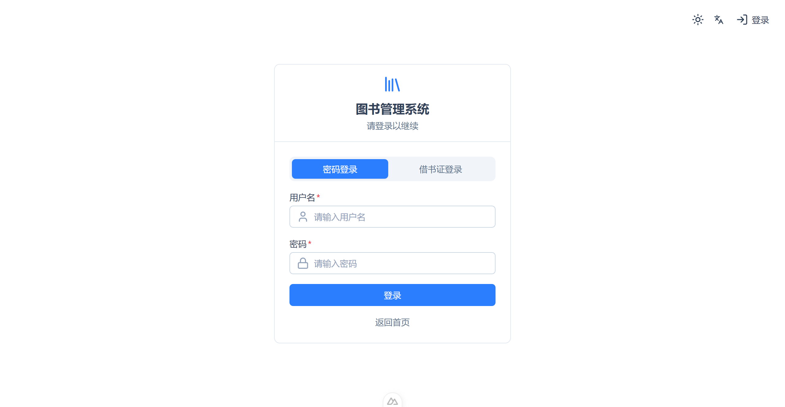

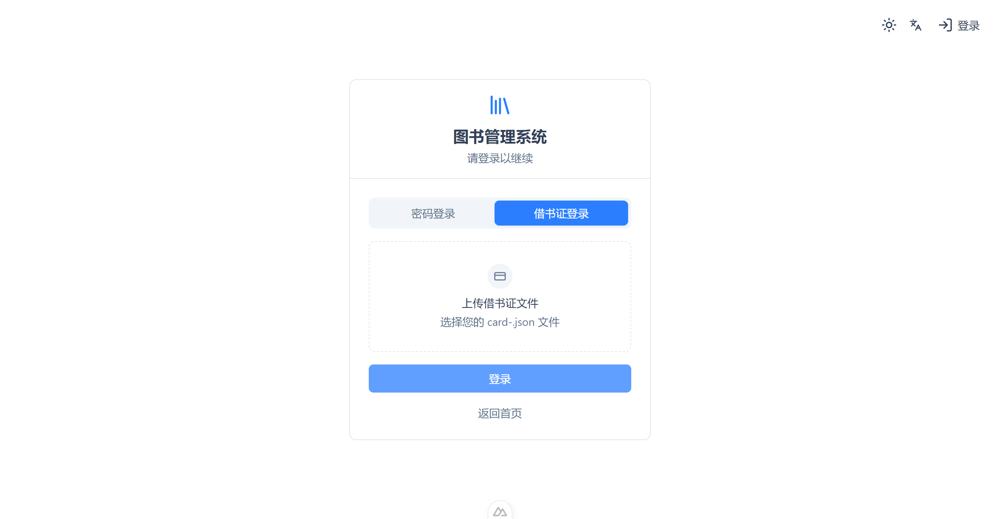

### 修改密码页（`/change-password`）

**所属布局**：hero  
**访问权限**：需登录（未登录跳转至 `/login`）

**页面功能**：提供密码修改表单，用于以下两种场景：（1）用户使用默认密码首次登录后强制改密；（2）用户主动修改密码。

- 表单包含新密码输入框和确认密码输入框，新密码需满足最小 4 字符长度。
- 两次输入不一致时显示提示。
- 提交后调用 `POST /api/auth/change-password`，成功后提示修改成功并跳转至对应首页。
- 首次登录强制改密场景下，页面顶部显示提示横幅："您正在使用默认密码，请修改密码后继续"。
- 非强制改密场景下，页面提供"跳过"按钮直接进入系统。

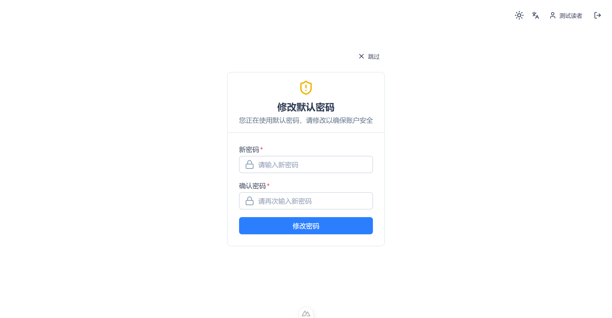

### 图书详情页（`/books/:id`）

**所属布局**：hero  
**访问权限**：无需登录（部分功能需角色判定）

**页面功能**：展示单本图书的完整信息，并根据登录用户的角色提供差异化操作。

- **图书信息展示**：页面左侧展示图书封面大图（代理加载或占位图），右侧展示图书基本信息，包括书名、ISBN、作者、出版社、出版年份、分类、简介、总册数和当前可借册数。
- **读者视角**（已登录且 role=reader）：当可借册数 > 0 时，显示绿色"借阅此书"按钮。点击后调用 `POST /api/user/borrows` 接口完成借阅，成功后给予成功提示并刷新页面以更新可借数量。库存为 0 时按钮置灰显示"暂无库存"。
- **管理员视角**（已登录且 role=admin）：显示"编辑信息"按钮，点击后弹出编辑表单（UModal），可修改图书全部字段后保存。同时下方以 Tab 面板展示该书的借阅历史记录列表。
- **未登录用户**：仅可浏览图书信息，不显示操作按钮。

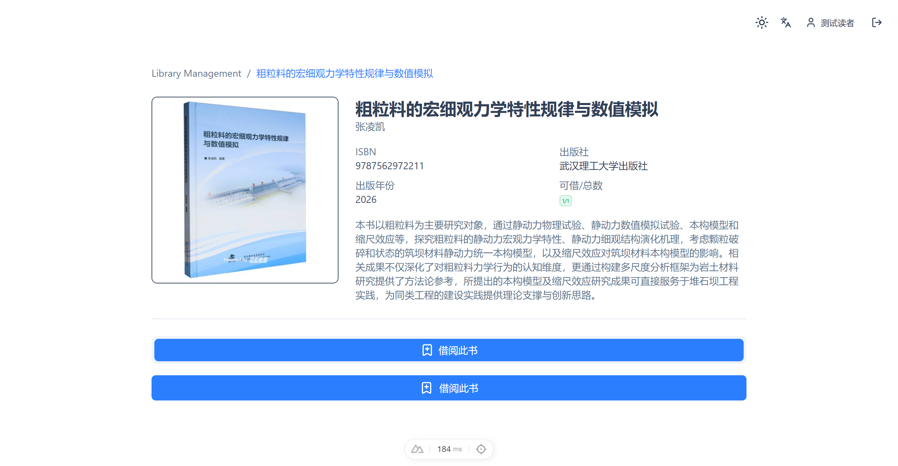

---

## 管理员后台页面

所有管理员页面均需通过 `auth` 和 `admin` 两道中间件校验：auth 确保 Token 有效，admin 确保角色为管理员。不满足条件时自动重定向至 `/login` 或 `/user`。

### 仪表盘（`/admin`）

**所属布局**：default  
**访问权限**：管理员

**页面功能**：管理员登录后的首页，以数据驾驶舱形式展示系统的核心运营指标。

- **统计卡片区**：页面顶部三张彩色卡片并排展示——馆藏图书总数（蓝色）、当前在借数量（橙色）、逾期未还数量（红色）。数据来自 `GET /api/stats` 接口，页面加载时自动获取。
- **快捷操作区**：卡片下方提供三个快捷入口按钮：管理图书、管理读者、查看借阅记录，分别跳转至 `/admin/books`、`/admin/borrowers`、`/admin/borrows`。
- **最近借阅列表**：底部展示最近 10 条借阅记录摘要表格，含书名、借阅人、借书日期和状态，点击记录可跳转至借阅管理页。

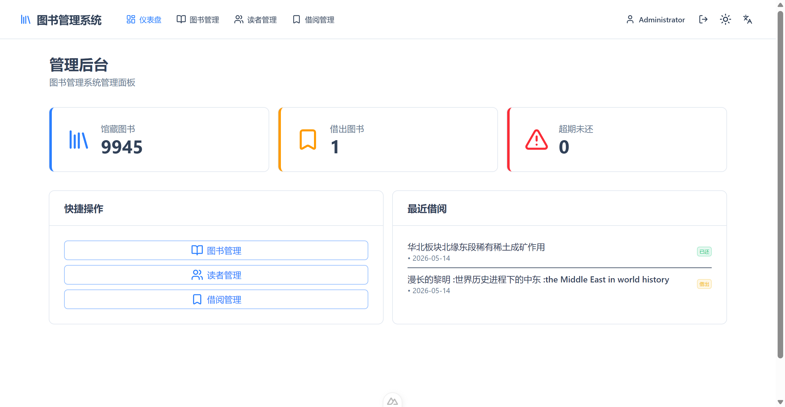

### 图书管理（`/admin/books`）

**所属布局**：default  
**访问权限**：管理员

**页面功能**：对图书信息进行全生命周期管理（增、删、改、查）。

- **搜索功能**：页面顶部搜索框支持按书名、作者、ISBN 进行模糊搜索，带防抖处理，搜索时自动刷新下方表格。
- **图书列表**：使用 UTable 组件展示图书列表，列包含 ISBN、书名、作者、出版社、总册数、可借册数。列表支持分页（每页 10 条），底部显示分页控件。
- **新增图书**：点击"新增图书"按钮弹出 UModal 编辑表单，填写 ISBN（必填）、书名（必填）、作者（必填）、出版社、出版年份、分类、简介、封面图 URL 和总册数。ISBN 重复时弹出错误提示。新增成功后列表自动刷新。
- **编辑图书**：点击表格每行的编辑按钮，弹出预填充当前数据的编辑表单，修改后保存。同样校验 ISBN 唯一性。
- **删除图书**：点击删除按钮，弹出确认对话框（"确定要删除《xxx》吗？此操作不可撤销"），确认后调用 DELETE 接口，成功后列表刷新。
- **库存调整**：在编辑表单中可直接修改总册数和可借册数。

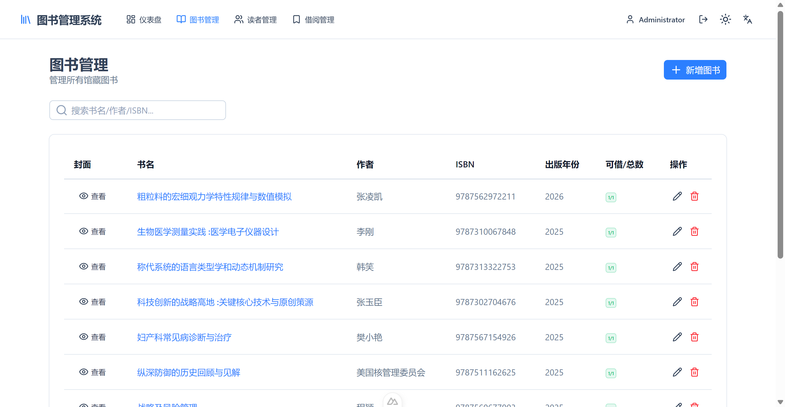

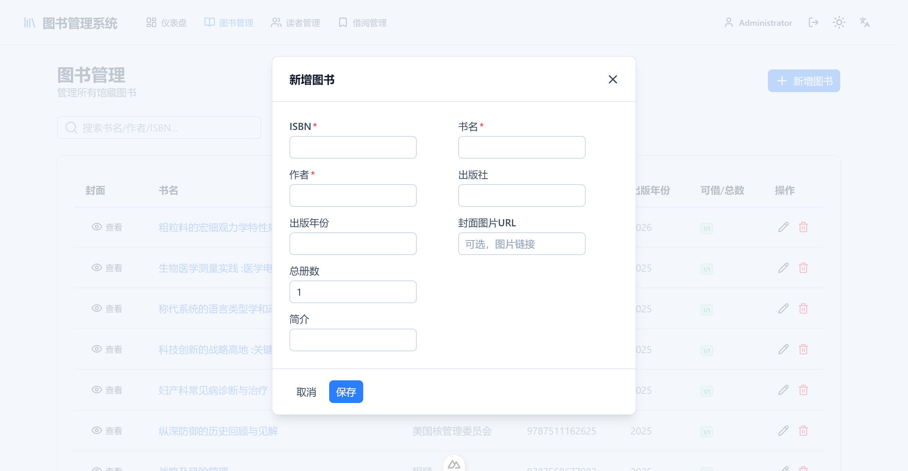

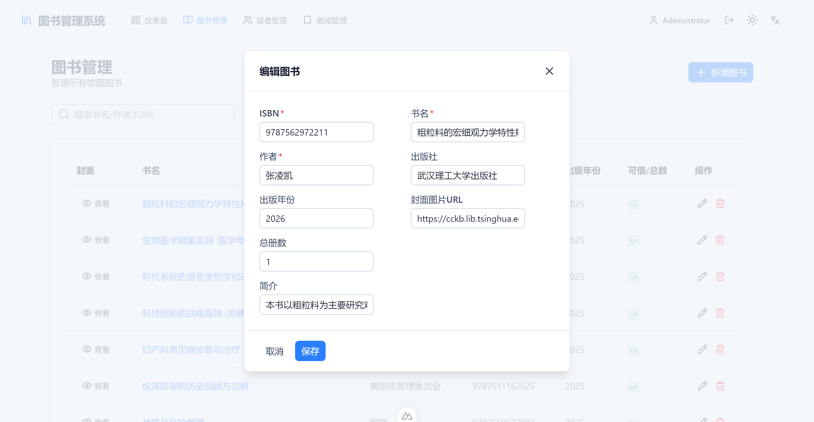

### 借阅管理（`/admin/borrows`）

**所属布局**：default  
**访问权限**：管理员

**页面功能**：查看和管理所有借阅记录，执行借书和还书操作。

- **搜索与筛选**：页面顶部提供搜索框（按书名、ISBN、借阅人姓名搜索）和状态下拉筛选（全部 / 借阅中 / 已归还）。筛选条件变化时列表自动刷新。
- **借阅记录表格**：展示所有借阅记录，列包含借阅人、书名、ISBN、借书日期、应还日期、还书日期、状态（带颜色标签：绿色"借阅中" / 灰色"已归还"）。按借书日期降序排列。
- **借书操作**：点击"借出图书"按钮弹出借书表单（UModal），依次输入图书 ID、用户 ID 和借书卡 ID。提交前系统依次校验三项数据的有效性和关联关系，任一校验失败则显示具体错误提示（"图书不存在"、"无库存"、"用户不存在或已停用"、"借书卡不存在或已挂失"、"借书卡不属于该用户"）。借书成功后，应还日期自动计算为借书日期 + 30 天，列表刷新。
- **还书操作**：在表格中，对状态为"借阅中"的记录，点击"归还"按钮触发还书操作。调用 `POST /api/borrows/return/:id` 接口，成功后记录状态变为"已归还"，图书可借册数自动恢复。

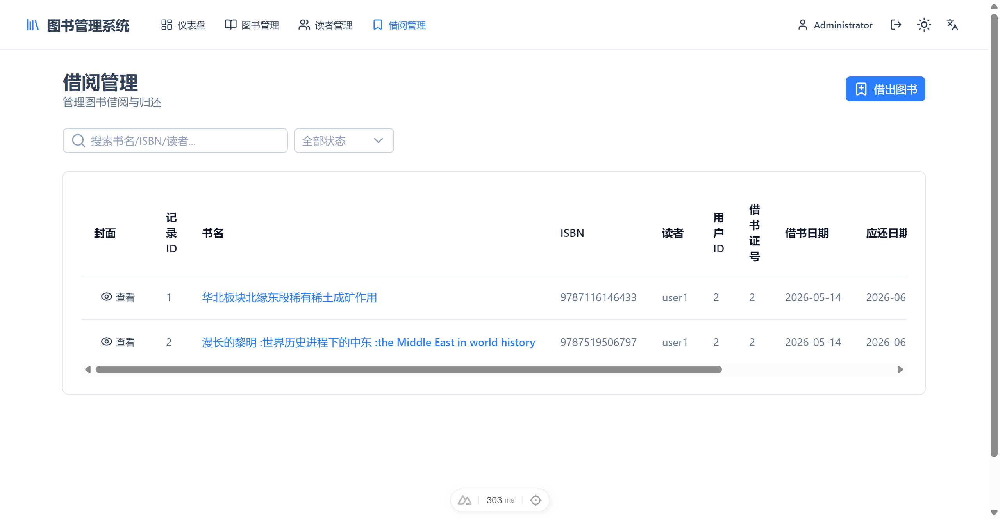

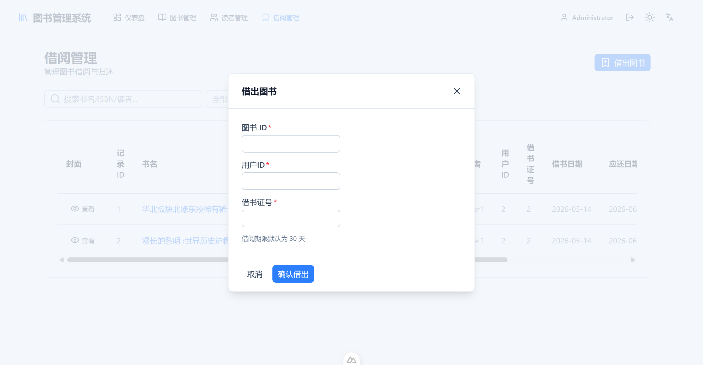

### 读者管理（`/admin/borrowers`）

**所属布局**：default  
**访问权限**：管理员

**页面功能**：管理所有读者（系统用户）账号及其借书卡。

- **搜索功能**：搜索框支持按姓名、部门、电话进行模糊搜索。
- **读者列表**：表格展示所有读者，列包含用户名、姓名、性别、部门、电话、角色、状态（active/inactive）。
- **新增读者**：弹出表单录入用户名、密码、姓名（必填）以及性别、部门、电话、邮箱、地址、角色（reader/admin）等可选字段。用户名重复时提示错误。新建读者系统自动分配 `reader` 角色。
- **编辑读者**：修改读者信息、角色和状态（可将违规用户设为 inactive 停用）。密码字段留空表示不修改密码。用户名重复时提示错误。
- **删除读者**：确认后删除，级联清除该读者的所有借阅记录与借书卡。
- **借书卡管理**：表格每行提供"管理卡片"按钮，点击后弹出该用户的借书卡管理面板。面板顶部显示该用户的所有历史卡片列表（含 active 和 lost 状态），提供三个操作：
  - **办理新卡**：点击后自动将用户旧活跃卡挂失，创建新卡并显示密码短语（仅展示一次，可下载为 JSON 文件）。
  - **挂失卡片**：对状态为 active 的卡片执行挂失操作。
  - **下载卡片 JSON**：下载选中卡片的信息为 JSON 文件。

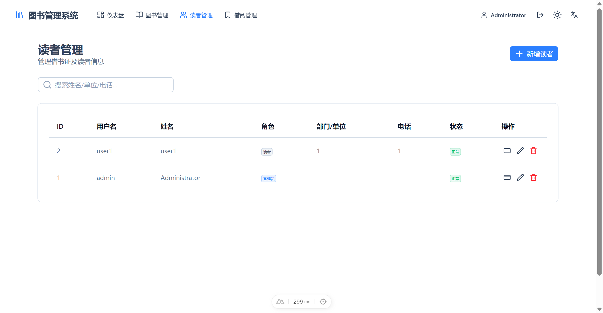

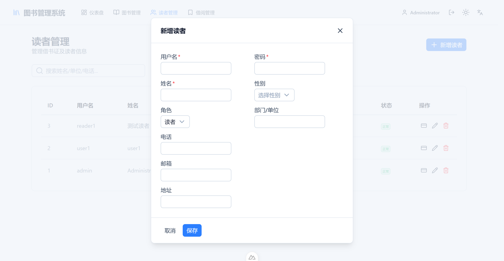

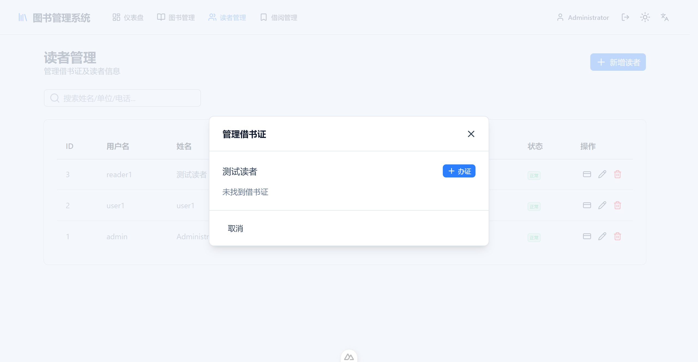

---

## 读者自助页面

所有读者页面均需通过 `auth` 中间件校验（确保已登录）。读者页面使用 user 布局，顶部包含读者导航栏（首页、个人信息、借书卡、借阅记录），右上角显示用户名和退出按钮。

### 读者首页（`/user`）

**所属布局**：user  
**访问权限**：已登录读者

**页面功能**：读者的个人概览面板，集中展示当前借阅状态和快速操作入口。

- **借书卡信息卡**：顶部卡片显示读者当前活跃借书卡的卡号、状态和签发日期。若无活跃卡则提示"无活跃借书卡"。
- **借阅统计区**：以数字卡片或进度条形式展示：当前在借数量、已归还数量、逾期数量。
- **当前借阅列表**：底部表格列出当前在借的图书记录，包含书名、借书日期、应还日期。每行提供续借按钮（点击后调用 `POST /api/user/borrows/:id/renew`，成功后应还日期延长 14 天并刷新列表）。续借按钮在图书已逾期时置灰不可用。
- **快速入口**：提供"浏览图书"和"查看借阅历史"按钮，分别跳往首页搜索和完整借阅记录页。

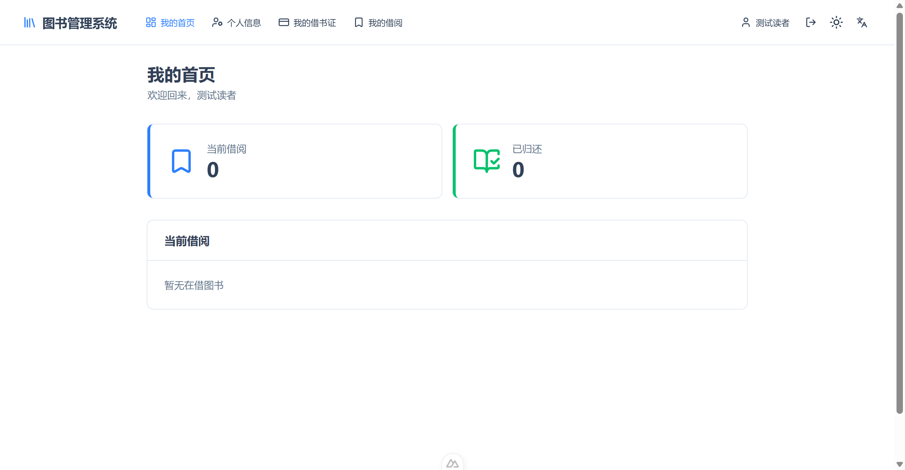

### 我的借阅（`/user/borrows`）

**所属布局**：user  
**访问权限**：已登录读者

**页面功能**：查看本人的全部借阅历史记录。

- 表格展示所有借阅记录，列包含书名、ISBN、借书日期、应还日期、还书日期和状态。按借书日期降序排列。
- 状态以颜色标签区分：绿色"借阅中"、灰色"已归还"。
- 对"借阅中"且未逾期的记录，提供续借操作按钮。

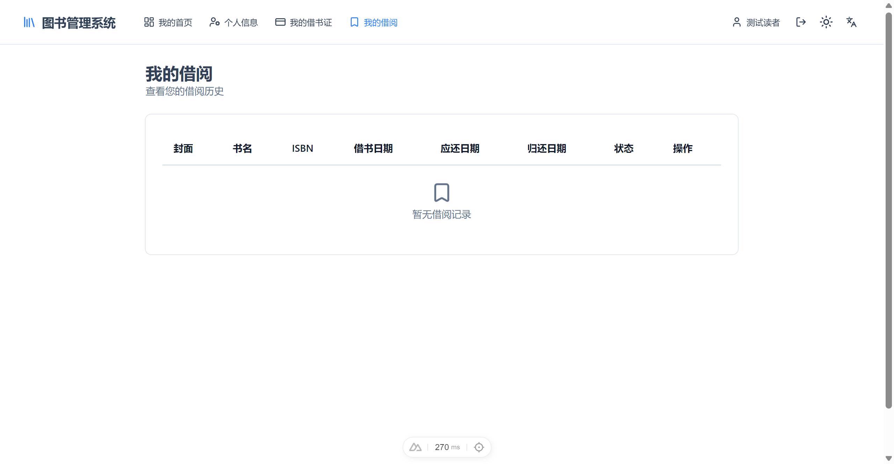

### 个人信息（`/user/profile`）

**所属布局**：user  
**访问权限**：已登录读者

**页面功能**：查看和编辑个人资料。

- **信息展示模式**（默认）：以只读表单形式展示当前用户的全部个人信息（姓名、性别、部门、电话、邮箱、地址、注册日期、账号状态）。
- **编辑模式**：点击"编辑"按钮切换为可编辑表单，可修改姓名、性别、部门、电话、邮箱、地址。用户名和角色不可修改。保存后调用 `PUT /api/user/profile` 更新数据。
- 账号的注册日期和状态为只读字段，仅展示。

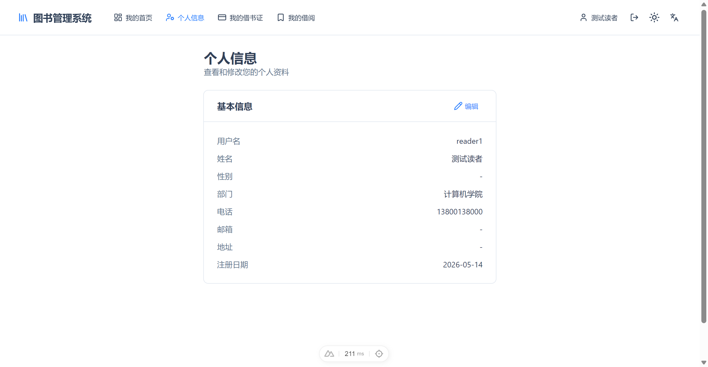

### 我的借书卡（`/user/card`）

**所属布局**：user  
**访问权限**：已登录读者

**页面功能**：查看活跃借书卡的详细信息，并提供挂失和补办操作入口。

- **卡片详情卡片**：以卡片形式展示当前活跃借书卡的信息，包括卡号、状态（带颜色标签）、签发日期。若无活跃卡则显示无卡提示。
- **操作按钮组**：
  - **挂失卡片**：点击后弹出确认对话框（"确定要挂失此借书卡吗？挂失后卡片将无法使用"），确认后调用 `POST /api/cards/user/cards/report-lost` 接口执行挂失。挂失成功后页面刷新，显示无活跃卡状态。
  - **办理新卡**：点击后跳转至 `/user/issue-card` 页面。

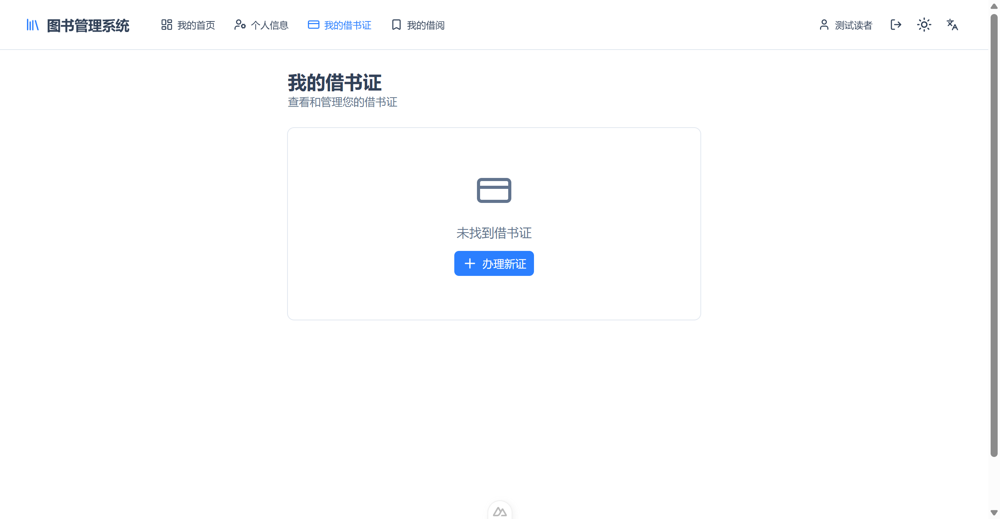

### 办理新借书卡（`/user/issue-card`）

**所属布局**：user  
**访问权限**：已登录读者

**页面功能**：为自己办理一张新的借书卡。

- 页面说明文字解释：办新卡时旧卡将自动作废，新卡的密码短语仅在此时展示一次，请妥善保管。
- 点击"确认办理"按钮，调用 `POST /api/cards/user/cards` 接口。
- 成功后页面展示新卡信息：卡号、密码短语（以代码块或醒目样式显示，强调"仅此一次"）、签发日期。
- 提供"下载卡片 JSON"按钮，调用 `downloadJson()` 工具函数将卡片信息导出为 JSON 文件保存到本地。
- 下载文件包含 `card_id` 和 `passphrase` 两个字段，用于后续在自助终端上登录和借阅。

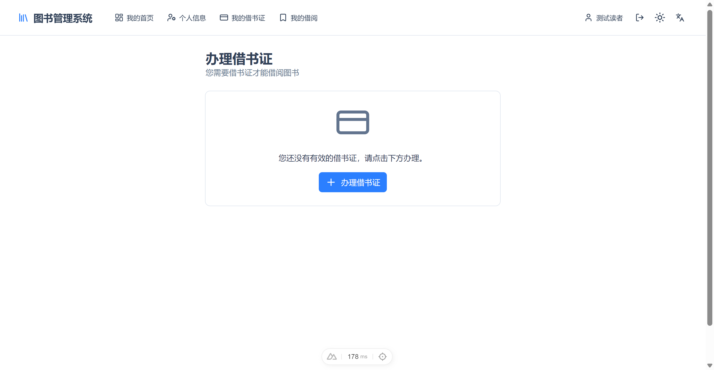

### 挂失借书卡（`/user/report-lost`）

**所属布局**：user  
**访问权限**：已登录读者

**页面功能**：确认挂失操作的独立页面（也可从借书卡主页的按钮直接进入）。

- 页面显示当前活跃卡的基本信息（卡号、签发日期）。
- 下方显示警告文字："挂失后此卡将无法使用，如需继续借书请办理新卡。"
- 点击"确认挂失"按钮执行操作，成功后跳转回借书卡主页，页面状态更新为无活跃卡。

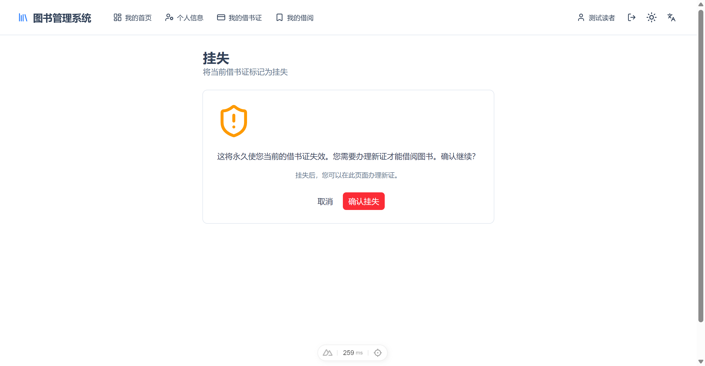

---

## 自助终端页面

自助终端页面使用 machine 布局，模拟公共图书馆自助借还机的操作界面。所有操作不需要登录系统，仅凭借书卡 JSON 文件或归还凭证 JSON 文件即可完成。

### 自助终端入口（`/machine`）

**所属布局**：machine  
**访问权限**：无需登录

**页面功能**：自助终端的主菜单页面，引导用户选择操作类型。

- 页面中央两个大按钮，分别标注"借书（Borrow）"和"还书（Return）"，配有对应图标。
- 点击"借书"跳转至 `/machine/borrow`，点击"还书"跳转至 `/machine/return`。
- 设计上采用大字体、大按钮、高对比度，适合触摸屏操作。


### 自助借书（`/machine/borrow`）

**所属布局**：machine  
**访问权限**：无需登录

**页面功能**：引导用户通过三步流程完成自助借书。

**步骤一：验证身份**
- 页面显示上传区域，提示用户上传借书卡 JSON 文件（包含 `card_id` 和 `passphrase`）。
- 用户可通过文件选择器或拖拽上传 JSON 文件。
- 上传后前端解析文件内容，调用 `POST /api/cards/verify` 接口验证卡片有效性。
- 验证成功后显示持卡用户姓名，亮起绿色验证通过标识，自动进入下一步。验证失败显示错误信息（"卡片无效"、"卡片已挂失"、"账号已停用"）。

**步骤二：选择图书**
- 页面显示搜索框，用户可通过输入图书 ID 或图书名称搜索目标图书。
- 搜索结果以列表或卡片展示，每条显示书名、作者和可借库存。
- 用户选中一本库存 > 0 的图书，点击"确认借阅此书"。
- 选中的图书高亮显示，库存为 0 的图书置灰不可选。

**步骤三：确认借阅**
- 显示借阅确认信息：借书卡号、持卡人姓名、所选书名、预计应还日期（当天 + 30 天）。
- 点击"确认借阅"按钮，调用 `POST /api/borrows/self-borrow` 接口。
- 借阅成功后显示成功页面，包含借阅详情和**归还凭证（return_token）**。
- 提供"下载归还凭证"按钮，将归还凭证保存为 JSON 文件。页面强烈提示用户保存该文件，因为这是还书的唯一凭据（无登录情况下）。
- 提供"继续借书"按钮返回步骤一，或"返回首页"按钮回到终端主菜单。

**步骤一 — 验证身份：**
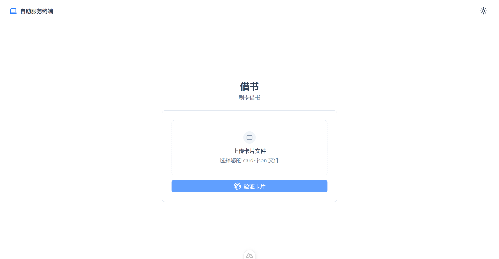

**步骤二 — 选择图书：**


**步骤三 — 确认借阅与下载归还凭证：**
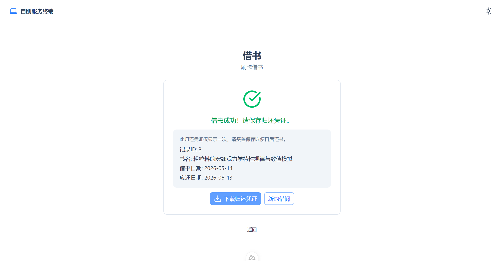

### 自助还书（`/machine/return`）

**所属布局**：machine  
**访问权限**：无需登录

**页面功能**：通过上传归还凭证 JSON 文件完成自助还书。

- **上传凭证**：页面显示上传区域，提示用户上传借书时下载的归还凭证 JSON 文件。用户通过文件选择器或拖拽上传。
- 上传后前端解析文件，提取 `return_token` 字段，调用 `POST /api/borrows/self-return` 接口。
- **还书成功**：接口返回成功后，页面显示归还成功信息，包括归还的书名和记录编号。绿色成功标识。
- **还书失败**：若凭证无效（Token 不存在或已归还），显示红色错误信息："无效的归还凭证"或"此书已归还"。
- 提供"继续还书"和"返回首页"按钮。

**上传凭证页面：**
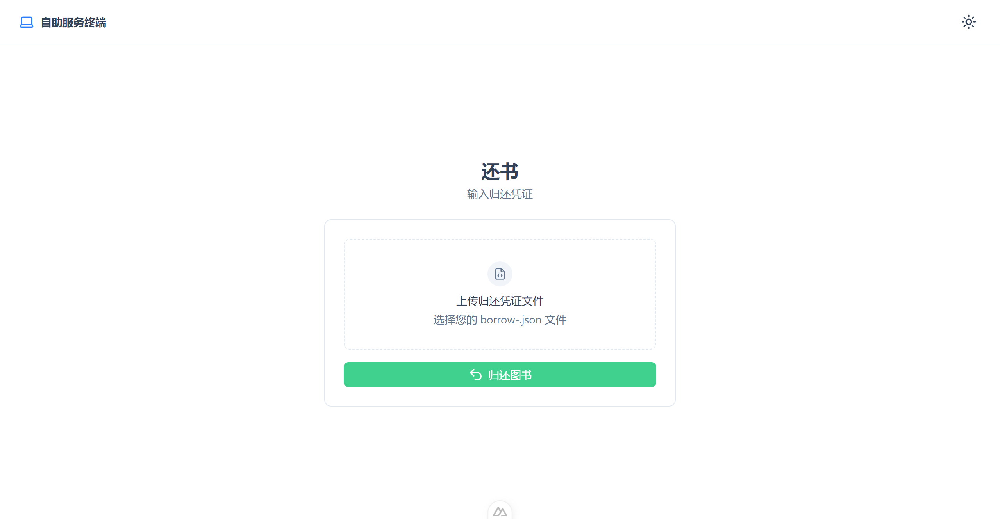

**还书成功结果：**
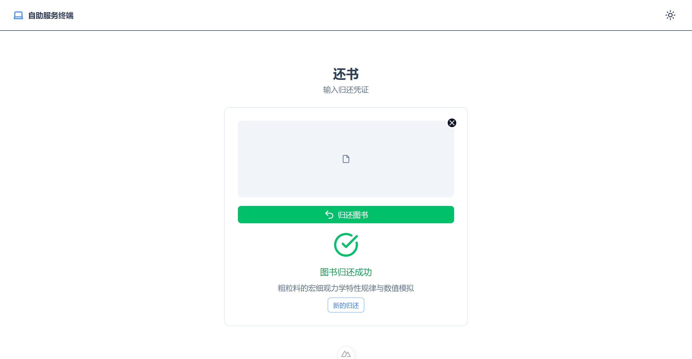

---

## 公共组件

以下是页面中复用的核心组件，不单独对应路由，但在多个页面中出现。

| 组件 | 文件 | 说明 |
|------|------|------|
| AppHeader | `components/AppHeader.vue` | 统一的顶部导航栏，包裹 Nuxt UI 的 UHeader 组件。左侧区域留给页面自行填充（Logo + 导航菜单），右侧固定放置用户名、退出按钮、色彩模式切换、语言切换 |
| AppLogo | `components/AppLogo.vue` | 系统 Logo 图标 + 应用名称文字（"图书馆管理系统"，多语言支持），点击可回到首页 |
| AppFooter | `components/AppFooter.vue` | 统一页脚，含分隔线和版权信息 |
| NavMenu | `components/NavMenu.vue` | 管理员导航菜单（4 项），根据当前路由高亮激活项 |
| UserNavMenu | `components/UserNavMenu.vue` | 读者导航菜单（4 项），根据当前路由高亮激活项 |
| LocaleSwitcher | `components/LocaleSwitcher.vue` | 语言切换下拉菜单，使用 UPopover + 旗帜图标，支持 7 种语言实时切换 |

# 前端各模块详细设计

## 核心模块

本模块包含 Vue 应用的根组件和全局错误页面，定义全局 SEO 元数据、国际化的 HTML 属性以及自定义错误展示界面。

### `app.vue` —— 根组件

**模块描述：** Nuxt 应用的根组件，为整个前端应用提供最外层结构。它配置了页面视口 meta 标签、网站图标和多语言的 HTML 属性，并设置多语言 SEO 元数据（页面标题和描述）。模板中嵌套 `<UApp>`（Nuxt UI 的应用外壳组件）、`<NuxtLayout>`（动态布局插槽）和 `<NuxtPage>`（页面路由出口），构成了 Nuxt 应用的渲染骨架。

**实现思路：**
1. 使用 `useLocaleHead()` 获取当前语言的 HTML 属性（如 `lang` 和 `dir`），绑定到 `<html>` 元素的 `htmlAttrs` 上，确保不同语言下的无障碍访问合规。
2. 使用 `useSeoMeta()` 设定响应式页面标题和描述：调用 `useI18n()` 获取当前 locale，通过 `t()` 翻译函数动态返回对应语言的应用标题和描述。`ogTitle`/`ogDescription` 用于 Open Graph 社交分享卡片。
3. 使用 `useHead()` 配置全局固定的 meta（viewport）和 link（favicon），确保移动端适配和设备图标。
4. 模板结构：`<UApp>` 包裹 `<NuxtLayout>`，`<NuxtLayout>` 内部再嵌套 `<NuxtPage>`。`<NuxtLayout>` 根据当前页面的 `layout` 配置自动选择对应的布局组件；`<NuxtPage>` 渲染当前路由对应的页面组件。

**具体代码如下：**

```vue
<script setup>
const i18nHead = useLocaleHead()
const { t } = useI18n()

useHead({
  meta: [
    { name: 'viewport', content: 'width=device-width, initial-scale=1' }
  ],
  link: [
    { rel: 'icon', href: '/favicon.ico' }
  ],
  htmlAttrs: computed(() => i18nHead.value.htmlAttrs)
})

useSeoMeta({
  title: () => t('app.title'),
  ogTitle: () => t('app.title'),
  description: () => t('app.description'),
  ogDescription: () => t('app.description')
})
</script>

<template>
  <UApp>
    <NuxtLayout>
      <NuxtPage />
    </NuxtLayout>
  </UApp>
</template>
```

### `error.vue` —— 全局错误页

**模块描述：** Nuxt 的自定义错误页面组件，在页面路由出错或抛出未经处理的异常时被渲染。根据错误状态码区分 404（页面未找到）和通用错误（如 500 服务器错误），展示不同的图标、颜色和信息文案。提供"返回首页"按钮以清除错误状态并跳转到首页。

**实现思路：**
1. 通过 `defineProps` 接收 Nuxt 传入的 `error` 对象，其中包含 `statusCode`（HTTP 状态码）和 `message`（错误消息）。
2. 使用 `computed` 判断 `is404`：当 `statusCode === 404` 时为真，显示文件问号图标（`i-lucide-file-question`）；否则显示三角警告图标（`i-lucide-triangle-alert`），颜色分别采用边框强调色和警告色。
3. 标题和副标题同样通过计算属性按是否为 404 分发：404 使用 `notFound.title` / `notFound.subtitle` 翻译键，其他错误使用 `errors.generic` 翻译键或 `error.message` 原文。
4. 页面顶部右侧放置色彩模式切换按钮和语言切换组件，与 hero 布局保持一致。
5. 点击"返回首页"按钮调用 `clearError({ redirect: '/' })`，清除 Nuxt 内部错误状态并导航到首页。

**具体代码如下：**

```vue
<template>
  <div class="min-h-screen bg-(--ui-bg)">
    <div class="absolute top-4 right-4 flex items-center gap-1">
      <UColorModeButton />
      <LocaleSwitcher />
    </div>
    <div class="min-h-screen flex items-center justify-center">
      <div class="flex flex-col items-center gap-6 text-center p-8">
        <UIcon
          v-if="is404"
          name="i-lucide-file-question"
          class="w-24 h-24 text-(--ui-border-accented)"
        />
        <UIcon
          v-else
          name="i-lucide-triangle-alert"
          class="w-24 h-24 text-(--ui-warning)"
        />
        <p class="text-8xl font-bold text-(--ui-primary)">
          {{ error.statusCode }}
        </p>
        <div>
          <h1 class="text-2xl font-bold">
            {{ title }}
          </h1>
          <p class="text-muted text-sm mt-2">
            {{ subtitle }}
          </p>
        </div>
        <UButton
          :label="$t('notFound.backHome')"
          icon="i-lucide-arrow-left"
          size="lg"
          @click="clearError({ redirect: '/' })"
        />
      </div>
    </div>
  </div>
</template>

<script setup>
const props = defineProps({
  error: {
    type: Object,
    required: true
  }
})

const { t } = useI18n()
const is404 = computed(() => props.error.statusCode === 404)

const title = computed(() => {
  if (is404.value) return t('notFound.title')
  return t('errors.generic')
})

const subtitle = computed(() => {
  if (is404.value) return t('notFound.subtitle')
  return props.error.message || t('errors.generic')
})
</script>
```

---

## Composable 模块

Composable 是 Nuxt 3/Vue 3 中可复用的组合式函数，利用 Vue 的响应式 API 封装有状态逻辑。本项目的三个 Composable 分别负责 API 请求封装、认证状态管理和输入防抖。

### `useApi.ts` —— API 请求封装

**模块描述：** 封装对后端 API 的请求调用，自动附加 JWT 认证 Token 到请求头，在收到 401 未授权响应时自动执行登出并跳转到登录页。所有需要认证的接口调用应通过此 Composable 进行，而非直接使用 `$fetch`。

**实现思路：**
1. 在导出的 `useApi()` 函数中，通过 `useAuth()` 获取 `getHeaders()` 和 `logout()` 函数，实现认证状态的注入。
2. 返回一个 `api<T>()` 泛型函数，接收 `path`（请求路径）和 `opts`（额外请求选项）。将 `getHeaders()` 返回的认证头（`Authorization: Bearer <token>`）与传入的 `opts.headers` 合并。
3. 使用 Nuxt 内置的 `$fetch<T>()` 发起 HTTP 请求（`$fetch` 是 `ofetch` 的封装，默认将 `/api/*` 路径通过 Nitro 代理转发到后端）。
4. 捕获异常：检查错误对象的 `status` 字段，若为 401 则调用 `logout()` 清除认证状态并通过 `navigateTo('/login')` 跳转到登录页。无论是否 401，都将异常重新抛出给调用方自行处理。

**具体代码如下：**

```ts
export function useApi() {
  const { getHeaders, logout } = useAuth()

  async function api<T = unknown>(path: string, opts: Record<string, unknown> = {}): Promise<T> {
    try {
      return await $fetch<T>(path, {
        ...opts,
        headers: {
          ...(opts.headers as Record<string, string> || {}),
          ...getHeaders()
        }
      } as Parameters<typeof $fetch>[1])
    } catch (e: unknown) {
      const err = e as { status?: number }
      if (err.status === 401) {
        logout()
        navigateTo('/login')
      }
      throw e
    }
  }

  return { api }
}
```

### `useAuth.ts` —— 认证状态管理

**模块描述：** 管理整个前端的认证状态，包括 JWT Token、当前用户信息和借书卡信息。提供登录（用户名密码 / 借书卡）、登出和获取认证请求头的方法。认证状态通过 Nuxt 的 `useState` 实现跨页面共享，并通过 `localStorage` 实现页面刷新后的状态持久化。

**实现思路：**
1. 定义 `AuthUser` 和 `AuthCard` 两个 TypeScript 接口，描述用户对象和借书卡对象的形状。
2. 使用 `useState()` 创建三个全局共享的响应式状态：`auth_token`（Token 字符串）、`auth_user`（用户对象）、`auth_card`（借书卡对象）。Nuxt 的 `useState` 在服务端渲染时按 key 隔离，在客户端渲染时跨组件共享。
3. **初始化恢复**：在 `import.meta.client`（客户端）条件下，从 `localStorage` 读取 `'auth'` 键的 JSON 数据。若数据存在且当前 Token 为空，则恢复三项状态。try-catch 包裹解析过程，防止损坏数据导致崩溃。
4. **`saveAuth(t, u, c)`**：同时设置三项状态值并将它们序列化为 JSON 存入 `localStorage`，实现持久化。
5. **`login(username, password)`**：调用 `POST /api/auth/login` 获取 Token 和用户信息。随后携带 Token 调用 `GET /api/cards/user/cards/active` 获取活跃借书卡信息。将 Token、用户、借书卡三者一同保存。返回包含 `defaultPassword` 和 `card` 的登录结果对象。
6. **`loginCard(cardId, passphrase)`**：调用 `POST /api/auth/login-card` 借书卡登录，流程同上。
7. **`logout()`**：清空三项状态，移除 `localStorage` 中的 `'auth'` 键，调用 `navigateTo('/')` 跳转到首页。
8. **`getHeaders()`**：若 Token 存在则返回 `{ Authorization: 'Bearer ' + token }`，否则返回空对象。

**具体代码如下：**

```ts
export interface AuthUser {
  user_id: number
  username: string
  name: string
  role: 'admin' | 'reader'
  [key: string]: unknown
}

export interface AuthCard {
  card_id: number
  status: 'active' | 'lost'
  issued_at?: string
  lost_at?: string
  [key: string]: unknown
}

interface AuthState {
  token: string | null
  user: AuthUser | null
  card: AuthCard | null
}

export function useAuth() {
  const token = useState<string | null>('auth_token', () => null)
  const user = useState<AuthUser | null>('auth_user', () => null)
  const card = useState<AuthCard | null>('auth_card', () => null)

  if (import.meta.client) {
    const saved = localStorage.getItem('auth')
    if (saved && !token.value) {
      try {
        const data = JSON.parse(saved) as AuthState
        token.value = data.token
        user.value = data.user
        card.value = data.card
      } catch { /* ignore parse errors */ }
    }
  }

  function saveAuth(t: string, u: AuthUser, c?: AuthCard | null) {
    token.value = t
    user.value = u
    card.value = c || null
    localStorage.setItem('auth', JSON.stringify({ token: t, user: u, card: c || null }))
  }

  async function login(username: string, password: string) {
    const res = await $fetch<{ token: string, user: AuthUser, defaultPassword?: boolean }>('/api/auth/login', {
      method: 'POST',
      body: { username, password }
    })
    let cardInfo: AuthCard | null = null
    try {
      cardInfo = await $fetch<AuthCard>('/api/cards/user/cards/active', {
        headers: { Authorization: `Bearer ${res.token}` }
      })
    } catch { /* card might not exist */ }
    saveAuth(res.token, res.user, cardInfo)
    return { ...res.user, defaultPassword: res.defaultPassword, card: cardInfo }
  }

  async function loginCard(cardId: number | string, passphrase: string) {
    const res = await $fetch<{ token: string, user: AuthUser }>('/api/auth/login-card', {
      method: 'POST',
      body: { card_id: Number(cardId), passphrase }
    })
    let cardInfo: AuthCard | null = null
    try {
      cardInfo = await $fetch<AuthCard>('/api/cards/user/cards/active', {
        headers: { Authorization: `Bearer ${res.token}` }
      })
    } catch { /* no card yet */ }
    saveAuth(res.token, res.user, cardInfo)
    return { ...res.user, card: cardInfo }
  }

  function logout() {
    token.value = null
    user.value = null
    card.value = null
    localStorage.removeItem('auth')
    navigateTo('/')
  }

  function getHeaders(): Record<string, string> {
    if (token.value) {
      return { Authorization: `Bearer ${token.value}` }
    }
    return {}
  }

  return { token, user, card, login, loginCard, logout, getHeaders }
}
```

### `useDebounce.ts` —— 防抖工具

**模块描述：** 提供通用的防抖（Debounce）功能，用于限制高频触发函数的执行频率。常用于搜索输入框：用户连续输入时，只在停止输入一定时间后（默认 300ms）才发起请求，避免每个字符变化都触发 API 调用。

**实现思路：**
1. 导出的 `useDebounce(fn, delay)` 接收目标函数 `fn` 和延迟毫秒数 `delay`（默认为 300）。
2. 内部维护一个 `timer` 变量（使用 `setTimeout` 的返回值类型）。
3. 返回 `debounced(...args)` 函数：每次调用时先 `clearTimeout(timer)` 清除之前的定时器，然后重新设定一个 `delay` 毫秒的定时器执行原函数。这样只有最后一次调用会在延迟后生效。
4. 同时返回 `cancel()` 函数：可主动清除当前等待中的定时器。

**具体代码如下：**

```ts
export function useDebounce(fn: (...args: unknown[]) => void, delay = 300) {
  let timer: ReturnType<typeof setTimeout> | null = null

  function debounced(...args: unknown[]) {
    if (timer) clearTimeout(timer)
    timer = setTimeout(() => {
      fn(...args)
    }, delay)
  }

  function cancel() {
    if (timer) {
      clearTimeout(timer)
      timer = null
    }
  }

  return { debounced, cancel }
}
```

---

## Middleware 模块

Nuxt 的路由中间件在页面渲染前执行，可拦截请求并重定向。本项目定义了两个中间件，分别用于认证检查和角色检查。

### `auth.ts` —— 认证检查中间件

**模块描述：** 保护需要登录才能访问的页面。在页面路由解析前检查当前是否存在有效的 JWT Token。若 Token 为空（用户未登录），则重定向至登录页 `/login`。

**实现思路：**
1. 通过 `defineNuxtRouteMiddleware()` 定义路由中间件。
2. 调用 `useAuth()` 获取 `token` 响应式状态。
3. 若 `token.value` 为 falsy（null 或空字符串），调用 `navigateTo('/login')` 返回重定向指令，阻止当前页面的渲染。Nuxt 的路由系统将终止当前导航并执行重定向。

**具体代码如下：**

```ts
export default defineNuxtRouteMiddleware(() => {
  const { token } = useAuth()
  if (!token.value) {
    return navigateTo('/login')
  }
})
```

### `admin.ts` —— 管理员角色检查中间件

**模块描述：** 保护仅限管理员访问的页面。在校验 Token 有效性的基础上，进一步检查当前用户的角色是否为 `admin`。非管理员用户将被重定向至读者首页 `/user`。

**实现思路：**
1. 通过 `defineNuxtRouteMiddleware()` 定义中间件。
2. 调用 `useAuth()` 获取 `user` 响应式状态。
3. 检查 `user.value?.role !== 'admin'`：若用户角色不是 admin（可能为 reader 或 null），则 `navigateTo('/user')` 重定向至读者首页。
4. 注意：该中间件需要与 `auth` 中间件配合使用。Nuxt 的中间件按在路由 meta 中声明的顺序执行，若 `auth` 在 `admin` 之前且用户未登录，用户将先被重定向至 `/login`，不会到达 `admin` 中间件。

**具体代码如下：**

```ts
export default defineNuxtRouteMiddleware(() => {
  const { user } = useAuth()
  if (user.value?.role !== 'admin') {
    return navigateTo('/user')
  }
})
```

---

## Layout 模块

Nuxt 的布局（Layout）组件为页面提供统一的外框结构。布局通过 `<slot />` 插槽渲染当前路由页面组件。本项目定义了 4 种布局以服务不同的使用场景。

### `layouts/default.vue` —— 管理员布局

**模块描述：** 适用于所有管理员后台页面的标准布局。顶部放置 AppHeader（内含 Logo 链接和管理员导航菜单），中间为 `<UMain>` 内容区域渲染页面内容，底部放置 AppFooter 页脚。Logo 可点击跳转至 `/admin`。

**实现思路：**
1. 引入 `AppHeader` 组件，通过 `<template #left>` 具名插槽向 Header 左部填充内容。
2. 左部包含：`<NuxtLink to="/admin">` 包裹的 `AppLogo`（点击跳转管理员首页），以及 `NavMenu` 管理员导航菜单（添加左边距 `ml-6`）。
3. `AppHeader` 组件本身在右侧插槽中已自动包含用户名、退出按钮、色彩切换和语言切换，此处无需额外配置。
4. `<UMain>` 包裹 `<slot />`：`<slot />` 将由 Nuxt 自动填充当前活动页面组件。
5. 底部放置 `AppFooter`。

**具体代码如下：**

```vue
<template>
  <div>
    <AppHeader>
      <template #left>
        <NuxtLink to="/admin">
          <AppLogo />
        </NuxtLink>
        <NavMenu class="ml-6" />
      </template>
    </AppHeader>

    <UMain>
      <slot />
    </UMain>

    <AppFooter />
  </div>
</template>
```

### `layouts/user.vue` —— 读者布局

**模块描述：** 适用于所有读者自助页面的布局，与管理员布局结构相同但导航菜单不同。左侧导航使用 `UserNavMenu` 组件（首页、个人信息、借书卡、借阅记录四项），Logo 点击跳转至 `/user`。

**实现思路：**
1. 结构与 `default.vue` 完全相同，区别仅在于：
   - Logo 的 `<NuxtLink to="/user">`（而非 `/admin`）。
   - 使用 `UserNavMenu` 组件（而非 `NavMenu`）。

**具体代码如下：**

```vue
<template>
  <div>
    <AppHeader>
      <template #left>
        <NuxtLink to="/user">
          <AppLogo />
        </NuxtLink>
        <UserNavMenu class="ml-6" />
      </template>
    </AppHeader>

    <UMain>
      <slot />
    </UMain>

    <AppFooter />
  </div>
</template>
```

### `layouts/hero.vue` —— 公共布局

**模块描述：** 适用于无需登录的公共页面（首页、登录、修改密码、图书详情）。采用极简设计：无顶部导航栏，整个内容区域垂直水平居中。右上角固定放置色彩模式切换、语言切换以及登录/用户操作按钮。

**实现思路：**
1. 整个布局容器设为 `min-h-screen`（至少一屏高度），内容区使用 `flex items-center justify-center` 实现垂直水平居中。
2. 右上角区域绝对定位（`absolute top-0 right-0`），`z-10` 确保浮动在内容之上。包含：
   - `UColorModeButton`：色彩模式切换按钮。
   - `LocaleSwitcher`：语言切换组件。
   - 条件渲染：若 `user` 为空（未登录），显示"登录"按钮（`to="/login"`）；若已登录，显示用户名按钮（点击跳转至对应后台）和退出按钮。
3. 调用 `useAuth()` 获取 `user` 和 `logout`：user 用于判断渲染路径（admin → /admin，reader → /user），logout 用于退出操作。

**具体代码如下：**

```vue
<template>
  <div class="min-h-screen relative bg-(--ui-bg)">
    <div class="absolute top-0 right-0 p-4 z-10 flex items-center gap-1">
      <UColorModeButton />
      <LocaleSwitcher />
      <UButton
        v-if="!user"
        :label="$t('login.login')"
        icon="i-lucide-log-in"
        variant="ghost"
        color="neutral"
        to="/login"
      />
      <div
        v-else
        class="flex items-center gap-2"
      >
        <UButton
          :label="user.name"
          icon="i-lucide-user"
          variant="ghost"
          size="sm"
          color="neutral"
          :to="user.role === 'admin' ? '/admin' : '/user'"
        />
        <UButton
          icon="i-lucide-log-out"
          variant="ghost"
          size="sm"
          color="neutral"
          @click="logout"
        />
      </div>
    </div>
    <div class="min-h-screen flex items-center justify-center">
      <slot />
    </div>
  </div>
</template>

<script setup>
const { user, logout } = useAuth()
</script>
```

### `layouts/machine.vue` —— 自助终端布局

**模块描述：** 适用于自助终端页面，模拟公共图书馆自助借还机的操作界面。顶部简化标题栏显示"自助服务终端"标题和色彩切换按钮，内容区完全居中。

**实现思路：**
1. 使用 `flex-col` 纵向布局，`min-h-screen` 撑满屏幕。
2. 顶部 `<header>` 栏包含：
   - 左侧：`NuxtLink to="/machine"` 包裹的 Logo 样式的"自助终端"标题（带 `i-lucide-laptop` 图标）。
   - 右侧：`UColorModeButton` 色彩模式切换。
3. `main` 区域使用 `flex-1 flex items-center justify-center` 实现内容居中。`<slot />` 插槽渲染当前页面。

**具体代码如下：**

```vue
<template>
  <div class="min-h-screen flex flex-col">
    <header class="border-b border-border px-6 py-3 flex items-center justify-between">
      <NuxtLink
        to="/machine"
        class="flex items-center gap-2"
      >
        <UIcon
          name="i-lucide-laptop"
          class="w-5 h-5 text-(--ui-primary)"
        />
        <span class="font-semibold text-sm">{{ $t('machine.title') }}</span>
      </NuxtLink>
      <UColorModeButton />
    </header>
    <main class="flex-1 flex items-center justify-center">
      <slot />
    </main>
  </div>
</template>
```

---

## Component 模块

公共组件是独立封装的可复用的 Vue 组件，在多个页面和布局中被引用。本项目定义了 6 个组件：顶部导航栏、页脚、Logo、管理员导航菜单、读者导航菜单和语言切换器。

### `AppHeader.vue` —— 顶部导航栏

**模块描述：** 统一的顶部导航栏组件，封装 Nuxt UI 的 `UHeader` 组件。提供 `left` 和 `right` 两个具名插槽供布局层填充导航内容。右侧固定放置当前用户名展示、退出登录按钮、色彩模式切换按钮和语言切换组件。

**实现思路：**
1. 使用 `UHeader` 作为外层组件，提供基础的面包屑导航条样式。
2. 左侧插槽 `#left`：透传，由调用方（layout）填充 Logo 和导航菜单。
3. 右侧插槽 `#right`：内置四个固定项：
   - 用户名按钮（`UButton`，`label` 绑定 `user?.name`，`ghost` 变体无背景，`sm` 小尺寸）。
   - 退出按钮（`UButton`，图标 `i-lucide-log-out`，点击触发 `logout()`）。
   - `UColorModeButton`：Nuxt UI 内置的亮色/暗色切换按钮。
   - `LocaleSwitcher`：自定义语言切换组件。
4. 通过 `useAuth()` 获取当前用户信息（`user`）和退出方法（`logout`）。

**具体代码如下：**

```vue
<template>
  <UHeader>
    <template #left>
      <slot name="left" />
    </template>

    <template #right>
      <UButton
        :label="user?.name"
        icon="i-lucide-user"
        variant="ghost"
        size="sm"
        color="neutral"
      />
      <UButton
        icon="i-lucide-log-out"
        variant="ghost"
        size="sm"
        color="neutral"
        @click="logout"
      />
      <UColorModeButton />
      <LocaleSwitcher />
    </template>
  </UHeader>
</template>

<script setup>
const { user, logout } = useAuth()
</script>
```

### `AppFooter.vue` —— 页脚

**模块描述：** 统一的页面底部组件。在内容区和页脚之间插入一个带图标的分隔线（`USeparator`），然后显示 `UFooter` 页脚，包含版权年份和作者署名信息。

**实现思路：**
1. `USeparator` 是 Nuxt UI 提供的装饰性分割组件，设置 `icon="i-lucide-book-open"` 在分隔线上显示书本图标，与系统主题呼应。
2. `UFooter` 组件的 `#left` 插槽中显示版权文本：通过 `$t('app.footer')` 国际化翻译 + `©` 符号 + 当前年份（`new Date().getFullYear()`） + 作者署名 `@5dbwat4`。

**具体代码如下：**

```vue
<template>
  <USeparator icon="i-lucide-book-open" />

  <UFooter>
    <template #left>
      <p class="text-sm text-muted">
        {{ $t('app.footer') }} &copy; {{ new Date().getFullYear() }}    @5dbwat4
      </p>
    </template>
  </UFooter>
</template>
```

### `AppLogo.vue` —— Logo 组件

**模块描述：** 系统 Logo 组件，在导航栏左侧显示一个图书馆图标和"图书馆管理系统"应用名称。应用名称通过 i18n 翻译函数 `$t()` 获取，支持多语言切换。在小屏幕上（`sm:` 断点以下）隐藏文字，仅显示图标以节省空间。

**实现思路：**
1. 使用 `span` 作为容器，flex 排列图标和文字，上下对齐。
2. 图标使用 Nuxt UI 的 `UIcon` 组件，`name="i-lucide-library"` 为 Lucide 图标库的图书馆图标，颜色使用主题色 `--ui-primary`。
3. 文字部分通过 `<span class="hidden sm:inline">` 在极小屏幕上隐藏，用 `{{ $t('app.title') }}` 输出应用名称。

**具体代码如下：**

```vue
<template>
  <span class="font-bold text-lg tracking-tight flex items-center gap-2">
    <UIcon
      name="i-lucide-library"
      class="w-5 h-5 text-(--ui-primary)"
    />
    <span class="hidden sm:inline">{{ $t('app.title') }}</span>
  </span>
</template>
```

### `NavMenu.vue` —— 管理员导航菜单

**模块描述：** 管理员后台的导航菜单组件，在 Header 左侧 Logo 旁边水平排列四个导航链接：仪表盘、图书、读者、借阅。每个链接使用 `UButton` 的 `to` 属性实现 Vue Router 导航。当前活跃路由对应的按钮以主题色高亮显示。

**实现思路：**
1. 使用 `v-for` 遍历 `navItems` 计算属性数组，每个元素包含 `label`（显示文字）、`to`（路由路径）、`icon`（图标名）。
2. 导航项通过 `useI18n()` 的 `t()` 函数获取翻译文本，图标基于 Lucide 图标集。
3. 每个 `UButton` 使用 `variant="ghost"`（无背景）和 `color="neutral"`（中性色）。
4. 当前路由高亮：通过动态绑定 `:class`，当 `$route.path === item.to` 时添加 `text-(--ui-primary) font-medium` 样式，使活跃项突出显示。
5. 四个导航项分别为：仪表盘（`i-lucide-layout-dashboard`→`/admin`）、图书（`i-lucide-book-open`→`/admin/books`）、读者（`i-lucide-users`→`/admin/borrowers`）、借阅（`i-lucide-bookmark`→`/admin/borrows`）。

**具体代码如下：**

```vue
<template>
  <div class="flex items-center gap-1">
    <UButton
      v-for="item in navItems"
      :key="item.to"
      :to="item.to"
      :label="item.label"
      :icon="item.icon"
      variant="ghost"
      size="sm"
      color="neutral"
      :class="[$route.path === item.to ? 'text-(--ui-primary) font-medium' : '']"
    />
  </div>
</template>

<script setup>
const { t } = useI18n()

const navItems = computed(() => [
  { label: t('nav.dashboard'), to: '/admin', icon: 'i-lucide-layout-dashboard' },
  { label: t('nav.books'), to: '/admin/books', icon: 'i-lucide-book-open' },
  { label: t('nav.borrowers'), to: '/admin/borrowers', icon: 'i-lucide-users' },
  { label: t('nav.borrows'), to: '/admin/borrows', icon: 'i-lucide-bookmark' }
])
</script>
```

### `UserNavMenu.vue` —— 读者导航菜单

**模块描述：** 读者自助后台的导航菜单组件，结构和实现与 `NavMenu` 基本相同，但导航项不同：首页、个人信息、借书卡、借阅记录。

**实现思路：**
与 `NavMenu` 相同的模板结构。四个导航项分别为：首页（`i-lucide-layout-dashboard`→`/user`）、个人信息（`i-lucide-user-cog`→`/user/profile`）、借书卡（`i-lucide-credit-card`→`/user/card`）、借阅记录（`i-lucide-bookmark`→`/user/borrows`）。

**具体代码如下：**

```vue
<template>
  <div class="flex items-center gap-1">
    <UButton
      v-for="item in navItems"
      :key="item.to"
      :to="item.to"
      :label="item.label"
      :icon="item.icon"
      variant="ghost"
      size="sm"
      color="neutral"
      :class="[$route.path === item.to ? 'text-(--ui-primary) font-medium' : '']"
    />
  </div>
</template>

<script setup>
const { t } = useI18n()

const navItems = computed(() => [
  { label: t('userHome.title'), to: '/user', icon: 'i-lucide-layout-dashboard' },
  { label: t('userProfile.title'), to: '/user/profile', icon: 'i-lucide-user-cog' },
  { label: t('card.title'), to: '/user/card', icon: 'i-lucide-credit-card' },
  { label: t('userBorrows.title'), to: '/user/borrows', icon: 'i-lucide-bookmark' }
])
</script>
```

### `LocaleSwitcher.vue` —— 语言切换器

**模块描述：** 提供 7 种语言的切换下拉菜单。使用 `UPopover` 弹出悬浮面板，面板内以垂直列表展示所有支持的语言，当前使用的语言高亮显示（不透明），其他语言半透明。

**实现思路：**
1. 外层 `UPopover` 设置 `mode="hover"`，鼠标悬停时自动展开下拉面板而不需要点击。触发器是一个 `UButton`，仅显示地球图标（`i-lucide-languages`），无文字。
2. 通过 `useI18n()` 获取 `locale`（当前语言代码）和 `setLocale(callback)`（切换语言函数）。
3. 面板内使用 `v-for` 遍历 `locales` 常量数组（7 种语言：简体中文、繁體中文、English、日本語、Français、Deutsch、한국어），每个语言项为一个 `UButton`，点击调用 `setLocale(loc.code)` 切换语言。
4. 当前活跃语言（`locale === loc.code`）保持正常不透明度，其他语言添加 `opacity-50` 半透明效果。

**具体代码如下：**

```vue
<template>
  <UPopover mode="hover">
    <UButton
      icon="i-lucide-languages"
      size="sm"
      variant="ghost"
      color="neutral"
    />

    <template #content>
      <div class="flex flex-col">
        <UButton
          v-for="loc in locales"
          :key="loc.code"
          :label="loc.label"
          size="sm"
          variant="ghost"
          color="neutral"
          block
          :class="locale === loc.code ? '' : 'opacity-50'"
          @click="setLocale(loc.code)"
        />
      </div>
    </template>
  </UPopover>
</template>

<script setup>
const { locale, setLocale } = useI18n()

const locales = [
  { code: 'zh-CN', label: '简体中文' },
  { code: 'zh-TW', label: '繁體中文' },
  { code: 'en', label: 'English' },
  { code: 'ja', label: '日本語' },
  { code: 'fr', label: 'Français' },
  { code: 'de', label: 'Deutsch' },
  { code: 'ko', label: '한국어' }
]
</script>
```

---

## Util 模块

工具函数模块提供不依赖 Vue 响应式系统的纯函数，用于封面图片 URL 构建和 JSON 文件下载。

### `bookImg.ts` —— 封面图片 URL 处理

**模块描述：** 将图书的封面图片字段（可能是空字符串、null 或 URL）转换为可用的图片地址。若封面 URL 为空，返回本地默认占位图片；若为非空 URL，则拼接后端图片代理接口路径，通过代理加载以绕过第三方防盗链限制。

**实现思路：**
1. 导入本地 `assets/lz.jpg` 作为默认占位图（`defaultBookImg`），Nuxt/Vite 构建时会自动处理静态资源的路径。
2. 导出的 `getBookImgUrl(url?: string)` 接收可选的 `url` 字符串参数：
   - 若 `url` 为 falsy（`undefined`、`null`、空字符串），直接返回默认占位图路径。
   - 若 `url` 有值，拼接为 `/api/image-proxy?url=<URLENCODED_URL>`，通过 `encodeURIComponent()` 将原始 URL 编码防止特殊字符破坏查询字符串结构。

**具体代码如下：**

```ts
import defaultBookImg from '~/assets/lz.jpg'

export function getBookImgUrl(url?: string) {
  if (!url) return defaultBookImg
  return `/api/image-proxy?url=${encodeURIComponent(url)}`
}
```

### `downloadJson.ts` —— JSON 文件下载

**模块描述：** 将前端数据对象序列化为格式化的 JSON 字符串，并以文件形式触发浏览器下载。用于借书卡 JSON（card_id + passphrase）和归还凭证 JSON（return_token）的导出保存。

**实现思路：**
1. 导出的 `downloadJson(data, filename)` 接收两个参数：任意可序列化的 `data` 对象和下载文件名 `filename`。
2. 使用 `JSON.stringify(data, null, 2)` 将数据转为缩进 2 空格的格式化 JSON 字符串。
3. 创建 `Blob` 对象（MIME 类型 `application/json`），通过 `URL.createObjectURL(blob)` 生成临时 blob URL。
4. 动态创建 `<a>` 元素：设置 `href` 为 blob URL，`download` 为指定文件名，模拟点击触发浏览器下载。
5. 下载后立即调用 `URL.revokeObjectURL(url)` 释放内存。

**具体代码如下：**

```ts
export function downloadJson(data: unknown, filename: string) {
  const json = JSON.stringify(data, null, 2)
  const blob = new Blob([json], { type: 'application/json' })
  const url = URL.createObjectURL(blob)
  const a = document.createElement('a')
  a.href = url
  a.download = filename
  a.click()
  URL.revokeObjectURL(url)
}
```

# 总结

## 实验要求回顾

本次数据库大作业的实验要求如下：

1. 设计简单的图书管理数据库概念模式。
2. 设计相应的关系模式。
3. 实现一个图书管理程序，实现图书、借书证及图书借阅的管理的基本功能。

## 任务完成情况

### 数据库概念模式设计

本系统围绕图书管理场景，识别出 **四个核心实体** 及其关系，完成了 E-R 模型的概念设计：

- **用户（users）**：系统的使用者，包含读者和管理员两种角色。每个用户拥有登录凭据和个人信息。系统初始化时自动创建默认管理员账号。
- **图书（books）**：被管理的核心对象，每本图书具有唯一的 ISBN 标识、基本书目信息和库存数量（总册数与可借册数独立维护）。
- **借书卡（library_cards）**：用户与系统交互的物理凭证。每个用户可以持有多张卡片（历史记录），但同一时间仅有一张为活跃状态。每张卡拥有随机生成的密码短语用于身份验证。
- **借阅记录（borrow_records）**：用户与图书之间的借阅关系，记录了完整的借阅生命周期（借出日期、应还日期、实际还书日期），并支持续借操作和自助归还凭证管理。

实体间关系设计如下：
- 用户与借书卡为一对多关系（一个用户可有多张卡，一张卡仅属于一个用户）。
- 用户与借阅记录为一对多关系（一个用户可以多次借阅）。
- 图书与借阅记录为一对多关系（一本图书可被多次借阅）。
- 借书卡与借阅记录为一对多关系（一张卡可经手多次借阅）。

所有外键均设置 `ON DELETE CASCADE` 级联删除约束，确保数据一致性。

### 关系模式设计

基于上述概念模式，将 E-R 模型转换为四张关系表，完成逻辑模式设计：

| 表名 | 主键 | 关键约束 | 说明 |
|------|------|----------|------|
| `books` | `book_id` (INT, AUTO_INCREMENT) | `isbn` UNIQUE NOT NULL | 图书信息表，维护库存字段 `available_copies` |
| `users` | `user_id` (INT, AUTO_INCREMENT) | `username` UNIQUE NOT NULL | 用户/读者表，`role` 区分管理员与读者，密码 bcrypt 加密 |
| `library_cards` | `card_id` (INT, AUTO_INCREMENT) | `user_id` FK → users，`passphrase` bcrypt 加密 | 借书卡表，管理卡片生命周期（签发、挂失） |
| `borrow_records` | `record_id` (INT, AUTO_INCREMENT) | `book_id` FK → books，`user_id` FK → users，`card_id` FK → library_cards | 借阅记录表，关联三张核心表，支持续借和自助归还 |

各表均包含 `created_at` 和 `updated_at` 时间戳字段用于审计追踪。

### 系统程序实现

本系统基于 B/S 架构，采用前后端分离模式完成了完整的图书管理应用开发：

**后端实现**（Node.js + Express）：
- 实现了 25 个 RESTful API 端点，覆盖六大功能模块：用户认证、图书管理（CRUD + 分页搜索）、读者管理（CRUD + 搜索）、借书管理（管理员借书/还书、自助借书/还书）、借书卡管理（签发、挂失、验证）、读者自助服务（个人信息、借阅历史、续借）。
- 采用 JWT + bcrypt 的认证与密码安全体系。
- 设计了 Provider 模式的数据库抽象层，支持 MySQL 和 SQLite 双数据库切换。
- 实现了自助终端场景：通过密码短语验证的身份认证，以及 SHA-256 哈希保护的一次性归还凭证机制。

**前端实现**（Nuxt 4 + Nuxt UI v4 + TypeScript）：
- 开发了 17 个功能页面，涵盖公共搜索、管理员后台（仪表盘/图书/读者/借阅管理）、读者自助（个人信息/借书卡/借阅记录）、自助终端（借书/还书）四类使用场景。
- 实现了 4 种页面布局对应不同场景，6 个公共组件复用 UI 元素。
- 支持 7 种语言的国际化切换和亮色/暗色主题切换。
- 通过 composable 实现了认证状态管理（useAuth）、API 请求封装（useApi）和搜索防抖（useDebounce）。

**数据采集**：
- 通过 Node.js 爬虫脚本从浙江大学图书馆 API 批量抓取 MARC 元数据，输出为结构化 JSON 文件，由后端导入脚本批量写入数据库。

## 设计中的关键决策

1. **用户与借书卡分离**：不采用早期设计中将用户信息与借书证合并为一张 `borrowers` 表的方案，而是将用户账号与物理借书卡分离为两张表。这样设计的优势在于：一个用户可以拥有多张卡（卡片丢失后补办时保留历史记录），卡片管理逻辑与用户账号管理解耦，用户状态（active/inactive）和卡片状态（active/lost）可以独立控制。

2. **库存字段而非计算字段**：`available_copies` 作为 `books` 表的冗余字段存储而非通过统计借阅记录实时计算。虽然引入了冗余，但避免了每次展示图书信息时都需要聚合查询 `borrow_records` 表，显著提升了页面加载性能，符合"以空间换时间"的常见数据库优化策略。同时通过借书时递减、还书时递增的操作保证了数据的一致性。

3. **自助归还凭证的哈希存储**：自助终端借书时生成的 `return_token` 以 SHA-256 哈希值（`return_token_hash`）存入数据库，明文 Token 仅返回给用户一次。这种设计使得即使数据库被泄露，攻击者也无法根据哈希值反推出有效的归还凭证，且 Token 不会在 `library_cards` 表或以任何长期存储形式存在。

4. **双数据库兼容设计**：通过 Provider 模式抽象数据库访问层，使得系统在开发阶段使用零配置的 SQLite，生产部署时切换到 MySQL，业务代码无需修改。SQLite Provider 中还实现了一个 SQL 方言翻译层，将 MySQL 特有的 `CURDATE()`、`NOW()` 等函数转换为 SQLite 的等效表达式。

5. **前后端分离加上开发代理**：在 `nuxt.config.ts` 中配置 Nitro 开发代理（`devProxy`），前端 `/api/*` 请求自动转发到本地后端端口，开发模式下无需处理跨域配置，前后端可在各自端口独立运行和热更新。

## 存在的不足与改进方向

1. **事务处理**：当前借书操作中的"插入借阅记录"和"扣减库存"是两个独立的数据库操作，未包裹在数据库事务中。理论上如果后者失败，会导致数据不一致。在生产环境中应将两步操作置于数据库事务（`BEGIN/COMMIT/ROLLBACK`）中，但 SQLite better-sqlite3 的同步 API 不支持两阶段提交，跨库兼容的事务抽象需要额外设计。

2. **并发库存控制**：当前系统在高并发借阅场景下可能出现超借现象（两个请求同时读取 `available_copies=1`，都判断为可借）。MySQL 模式下可通过 `SELECT ... FOR UPDATE` 行级锁解决；SQLite 模式下 WAL 模式的事务隔离级别已提供一定的并发保护，但未显式使用悲观锁。

3. **分页查询优化**：当前读者列表和借阅记录列表未实现分页（仅图书列表支持），在数据量较大时可能影响加载性能。

4. **密码短语仅为首次展示**：新办理借书卡时密码短语仅在 API 响应中返回一次，前端展示后即丢。若用户忘记保存 JSON 文件或关闭页面，需要重新办卡（旧卡自动挂失），增加了操作步骤。在严格的单次展示安全性和用户体验之间存在权衡。

5. **测试覆盖**：当前缺少自动化测试（单元测试 / 集成测试 / E2E 测试），系统的正确性依赖手动验证。

6. **前端页面状态管理**：读者自助借书和自助终端借书的表单状态（搜索关键字、筛选条件、分页位置）在页面跳转后丢失，返回时需要重新操作。可考虑使用 `useState` 或 Pinia 进行页面级状态缓存。

## 心得体会

通过本次数据库大作业的完整开发，从概念设计到系统实现经历了完整的软件工程流程，主要收获如下：

在数据库设计方面，从最初将用户与借书证合并为一张表的设计，到后来识别出两者不同生命周期后拆分为两张独立表的优化过程，深刻体会到概念模式设计的重要性——好的数据库模式设计能够在应用层极大地简化业务逻辑，反之则会带来持续的复杂性成本。

在系统架构方面，前后端分离的开发模式使得前端可以专注于用户体验和界面交互，后端专注于数据验证和业务规则，开发效率显著高于传统单体式开发。Provider 模式的引入使得数据库切换成为配置层面的操作而非代码层面的改动，体现了依赖倒置（DIP）等设计原则的工程价值。

在具体实现方面，JWT 的无状态认证、bcrypt 的哈希存储、参数化查询的 SQL 注入防护等措施加深了对 Web 安全最佳实践的理解。自助终端场景的 return_token 哈希设计是一个具体的安全工程案例。

总体而言，本次大作业不仅完成了实验要求的三项基本任务，还在工程实践层面进行了若干扩展（国际化、双数据库支持、自助终端等），对数据库系统和 Web 应用开发有了更全面的认识。
 