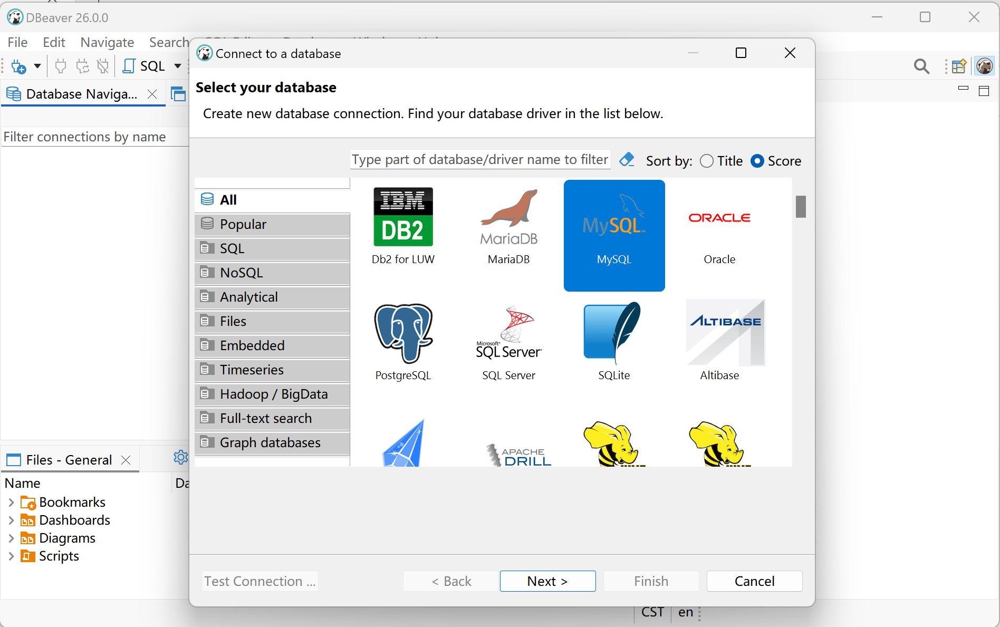
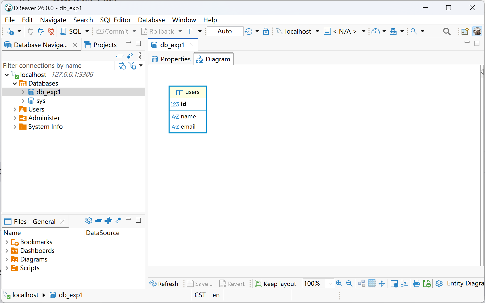
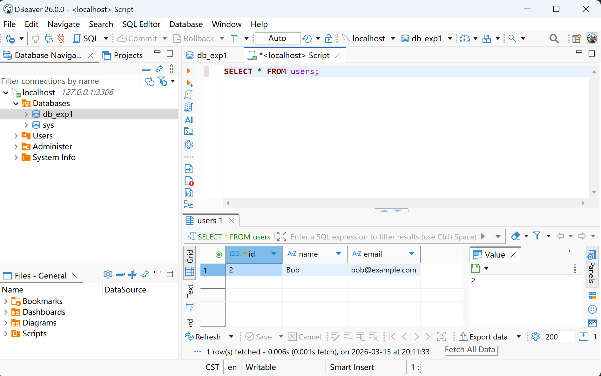
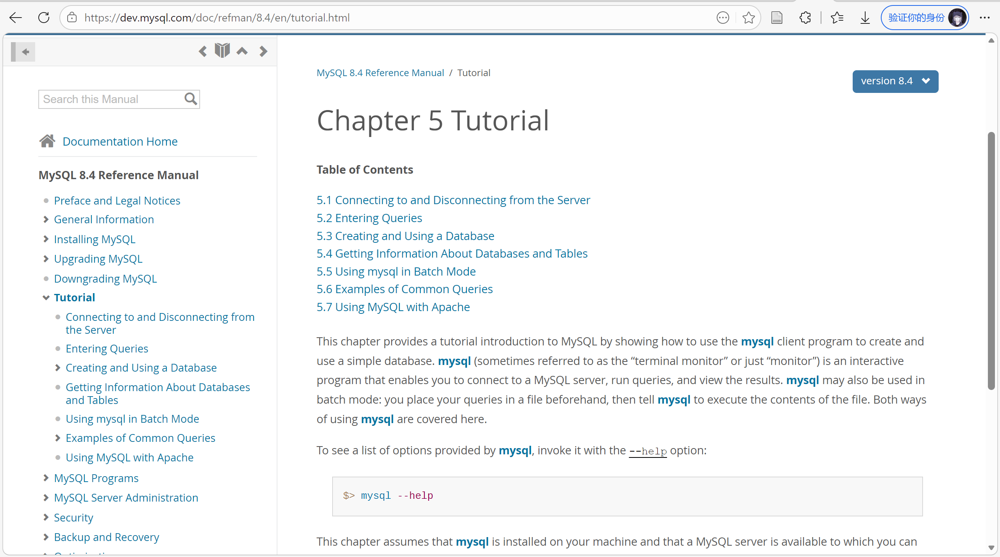

import Asciinema from "@md-comp/AsciinemaWrapper.vue";

# 实验目的

1. 通过安装某个数据库管理系统，初步了解 DBMS 的运行环境。
2. 了解 DBMS 交互界面、图形界面和系统管理工具的使用。
3. 搭建实验平台

# 实验平台

1. OS系统： Windows 11 + WSL Kali GNU/Linux Rolling
2. DBMS： MySQL 9.6
3. GUI工具： DBeaver 26.0.0

# 实验内容

## 安装MySQL

> 1. 根据某个DBMS的安装说明等文档，安装DBMS。

**操作说明**：本实验在Windows平台借助WSL（Windows Subsystem for Linux）环境安装MySQL。使用docker安装MySQL数据库。在Windows中使用DBeaver 26.0.0 GUI 工具管理。

```bash
docker pull mysql:latest
```

运行MySQL容器：

```bash
docker run --name mysql-container -e MYSQL_ROOT_PASSWORD=$MYSQL_ROOT_PASSWORD -p 3306:3306 -d mysql:latest
```

如下图所示，服务器启动成功

import Cast1 from "./labs/l1ca1.cast?url";

<Asciinema url={Cast1} />

## 安装DBeaver

DBeaver是一款免费、开源的数据库管理工具，支持连接并管理MySQL数据库。

> DBeaver Community is a free, open-source database management tool for personal projects.
> 
> [*About | DBeaver Community*](https://dbeaver.io/about/)

访问[Download | DBeaver Community](https://dbeaver.io/download/)下载页面，选择合适的版本，跟随引导下载安装DBeaver。


## 了解DBMS的用户管理

> 2. 了解DBMS的用户管理。

使用MySQL的CLI，通过前一步指定的root用户登录MySQL服务器。

```bash
mysql -u root -p
```

## 熟悉交互界面的基本交互命令

> 3. 熟悉交互界面的基本交互命令。

通过MySQL自带的CLI，熟悉了数据库日常操作的基础交互命令。包括查看系统状态、查看当前所有的数据库列表、新建实验数据库并进行切换，以及基本的插入、更新、删除等操作。

```sql
STATUS;                  -- 查看数据库当前状态和版本信息
SHOW DATABASES;          -- 查看所有数据库
CREATE DATABASE db_exp1; -- 创建一个实验用数据库
USE db_exp1;             -- 切换到该数据库
SELECT DATABASE();       -- 验证当前所在的数据库
CREATE TABLE users (
    id INT AUTO_INCREMENT PRIMARY KEY,
    name VARCHAR(255) NOT NULL,
    email VARCHAR(255) NOT NULL UNIQUE
);                      -- 创建一个名为 users 的数据表
INSERT INTO users (name, email) VALUES ('Alice', 'alice@example.com'); -- 插入一条记录
SELECT * FROM users;     -- 查询 users 表中的所有记录
UPDATE users SET email = 'bob@example.com' WHERE name = 'Alice'; -- 更新记录
DELETE FROM users WHERE name = 'Alice'; -- 删除记录
```

执行结果如下，可以看见了数据库状态、数据库列表、当前数据库、表结构以及数据操作的结果。

import Cast2 from "./labs/l1ca4.cast?url";

<Asciinema url={Cast2} />


## 图形界面的功能和操作

> 4. 熟悉图形界面的功能和操作。


import {Timeline as ATimeline, TimelineItem as ATimelineItem} from "ant-design-vue"


<ATimeline>
  <ATimelineItem>
  
  打开DBeaver，创建一个新的MySQL连接，输入连接信息（主机地址、端口、用户名、密码）并测试连接成功。

  
  
  </ATimelineItem>
  <ATimelineItem>
  
  通过图形界面，直观地浏览了数据库目录结构，并可以看到在前一步新建的表`users`。

  
  
  </ATimelineItem>

  <ATimelineItem>

  用户图形界面同样支持 SQL 语句，支持多种运行方式，可以查看运行结果，并且提供结果表格视图。

    

    </ATimelineItem>
</ATimeline>

## DBMS管理功能

> 5. 了解基本的DBMS管理功能和操作。

**操作说明**：

数据库管理不仅包含数据增删改查，还包括对数据库运行状态和系统配置的监控。本步骤通过命令查看了当前MySQL中正在执行的进程/会话，以及数据库的物理文件存放路径等环境变量。

**执行命令**：

```sql
SHOW PROCESSLIST;                 -- 查看当前连接的客户端及正在运行的线程
SHOW VARIABLES LIKE '%datadir%';  -- 查看数据库文件物理存储路径
```

import Cast3 from "./labs/l1ca5.cast?url";

<Asciinema url={Cast3} />

## 在线帮助系统的使用


> 6. 熟悉在线帮助系统的使用。

在[MySQL :: MySQL Documentation](https://dev.mysql.com/doc/)官方文档中可以找到MySQL的安装指南、SQL语法参考以及各种功能的使用说明。官方文档内容详实，结构清晰，是学习和使用MySQL的重要资源。



在脱离互联网环境或需要快速查询官方标准时，MySQL内置了强大的帮助系统。在交互命令行中输入 `HELP` 命令，可以查询各类SQL语法的详细说明和示例。

```sql
HELP contents;         -- 查看帮助主目录
HELP CREATE TABLE;     -- 查看创建数据表的具体语法
```

import Cast4 from "./labs/l1ca6.cast?url";

<Asciinema url={Cast4} />

# 实验总结与体会
通过本次“DBMS的安装与使用”实验，我初步掌握了数据库管理系统从安装部署到日常使用的完整流程。在环境搭建方面，我成功在Windows平台结合WSL Linux子系统搭建了MySQL运行环境，体验了跨平台开发的基础架构。在操作方面，我不仅熟练掌握了命令行界面（CLI）下基础SQL语句的交互（如系统状态查询、数据库创建与用户授权等），还掌握了如何利用图形界面工具（如DBeaver）高效地进行数据库的可视化管理。

此外，通过系统管理命令和内置 `HELP` 在线帮助系统的学习，我了解了如何监控数据库运行状态以及独立排查语法问题。本次实验不仅为我搭建了稳定可靠的数据库实验平台，也为后续深入学习关系型数据库原理、SQL复杂查询及数据库设计打下了坚实的实践基础。
{/* ----


完成这个实验需要结合 **Windows宿主机（用于运行图形界面）** 和 **WSL（Windows Subsystem for Linux，用于运行MySQL服务和命令行交互）**。

下面我将为你详细梳理如何一步步完成实验，并为你提供一份**实验报告的撰写模板和截图指南**。你可以直接参考这个结构来完成你的实验报告。

---

# 准备工作与需要访问的网站
1. **WSL环境准备**：如果你的Windows尚未安装WSL，可以打开PowerShell运行 `wsl --install` 安装Ubuntu。
2. **MySQL官方文档**：实验中查询安装和帮助文档可访问 [MySQL 8.0 Reference Manual](https://dev.mysql.com/doc/refman/8.0/en/)
3. **图形界面(GUI)工具下载**：推荐在Windows端安装 **DBeaver**（轻量且支持全平台）或 **MySQL Workbench**（官方工具）。
   - DBeaver官网：[https://dbeaver.io/download/](https://dbeaver.io/download/)
   - MySQL Workbench官网：[https://dev.mysql.com/downloads/workbench/](https://dev.mysql.com/downloads/workbench/)

---

# 📄 实验报告撰写指南与截图要求

以下是你的实验报告主体内容该怎么写，以及每一步需要截取什么图片的详细指导。

## 实验1：DBMS的安装和使用

### 一、 实验目的与平台
*（这部分直接将实验要求中的内容抄写上去即可，并在实验平台中补充详细版本号）*
**实验平台：**
1. 操作系统：Windows 11 (或10) + WSL (Ubuntu 22.04 LTS)
2. 数据库管理系统：MySQL 8.x
3. 图形界面工具：DBeaver / MySQL Workbench (选你安装的一个)

### 二、 实验内容与操作步骤

#### 1. DBMS的安装
**报告怎么写：**
描述在WSL环境下通过APT包管理器安装MySQL的过程。首先更新软件源，然后执行安装命令，最后启动MySQL服务并查看运行状态。
*   操作命令：
    ```bash
    sudo apt update
    sudo apt install mysql-server
    sudo service mysql start
    sudo service mysql status
    ```
**📸 截图要求：**
- **截图1**：WSL终端中执行 `sudo service mysql status` 提示 `* MySQL is running` （绿色的 active 状态）的画面。

#### 2. 了解DBMS的用户管理
**报告怎么写：**
说明在MySQL中如何创建新用户、赋予权限以及查看系统的用户列表。在真实的企业环境中，通常不建议直接使用root用户远程操作，因此创建了一个专属的实验账号。
*   操作命令（在WSL终端输入 `sudo mysql` 进入数据库后执行）：
    ```sql
    -- 创建一个名为 exp_user 的新用户，密码设为 123456
    CREATE USER 'exp_user'@'localhost' IDENTIFIED BY '123456';
    CREATE USER 'exp_user'@'%' IDENTIFIED BY '123456'; -- 允许Windows主机连接
    -- 赋予该用户所有权限
    GRANT ALL PRIVILEGES ON *.* TO 'exp_user'@'localhost' WITH GRANT OPTION;
    GRANT ALL PRIVILEGES ON *.* TO 'exp_user'@'%' WITH GRANT OPTION;
    FLUSH PRIVILEGES;
    -- 查看当前数据库中的用户
    SELECT user, host FROM mysql.user;
    ```
**📸 截图要求：**
- **截图2**：终端中成功执行上述SQL命令，特别是 `SELECT user, host FROM mysql.user;` 输出了包含 `exp_user` 的表格。

#### 3. 熟悉交互界面的基本交互命令
**报告怎么写：**
描述如何使用MySQL的命令行客户端（CLI）进行基本的交互操作，如查看数据库、创建数据库、切换数据库、查看服务器状态和退出客户端。
*   操作命令：
    ```sql
    SHOW DATABASES;          -- 查看所有数据库
    CREATE DATABASE db_exp1; -- 创建一个实验用数据库
    USE db_exp1;             -- 切换到该数据库
    SELECT DATABASE();       -- 验证当前所在的数据库
    STATUS;                  -- 查看数据库当前状态和版本信息
    \q                       -- 退出交互界面
    ```
**📸 截图要求：**
- **截图3**：终端中执行 `STATUS;` 命令输出详细版本、连接信息的画面，以及 `SHOW DATABASES;` 显示出 `db_exp1` 的画面。

#### 4. 熟悉图形界面的功能和操作
**报告怎么写：**
说明在Windows宿主机上安装了图形化工具（如DBeaver），并通过本地回环地址（127.0.0.1）和3306端口，使用刚才创建的 `exp_user` 成功连接到了WSL中的MySQL服务器。通过图形界面，直观地浏览了数据库目录结构，并使用图形化方式新建了一张测试表。
*   操作过程：打开DBeaver -> 新建数据库连接 -> 选择MySQL -> 填入 `localhost`、用户名 `exp_user`、密码 `123456` -> 点击“测试连接”。连接后，右键 `db_exp1` 数据库创建一张表。
**📸 截图要求：**
- **截图4**：图形界面工具（DBeaver/Workbench）的**连接测试成功（Connected）**的弹窗。
- **截图5**：图形界面的主界面，左侧导航树展开显示到了你刚才创建的 `db_exp1` 数据库。

#### 5. 了解基本的DBMS管理功能和操作
**报告怎么写：**
数据库管理不仅包含数据操作，还包含系统运维。在此步骤中，通过图形界面/命令行体验了数据库的备份/导出功能（Data Export），以及查看当前的活动连接和会话（Session Management）。
*   操作过程（二选一即可）：
    - **方法A（命令行操作）**：执行 `SHOW PROCESSLIST;` 查看当前有哪些客户端正在连接和执行任务。执行 `SHOW VARIABLES LIKE '%datadir%';` 查看数据库物理文件的存储位置。
    - **方法B（图形界面）**：在DBeaver中点击顶部菜单“数据库” -> “会话管理器”（Session Manager），查看当前连接。右键数据库选择“工具” -> “备份（Dump database）”。
**📸 截图要求：**
- **截图6**：终端中执行 `SHOW PROCESSLIST;` 的结果表，或者图形工具中的“会话管理器/Server Status”界面（展示当前系统运行负载或连接的界面）。

#### 6. 熟悉在线帮助系统的使用
**报告怎么写：**
说明在遇到不熟悉的SQL语法时，除了访问MySQL官网（[https://dev.mysql.com/doc/](https://dev.mysql.com/doc/)），还可以直接在MySQL交互界面中使用 `HELP` 命令获取官方帮助文档。
*   操作命令：
    ```sql
    HELP contents;         -- 查看帮助目录
    HELP CREATE TABLE;     -- 查看创建表的具体语法说明
    ```
**📸 截图要求：**
- **截图7**：终端中执行 `HELP CREATE TABLE;` 后，终端打印出详细的语法结构说明文档的画面。

### 三、 实验总结与体会
*（这部分用你自己的话总结，可以参考以下套话：）*
“通过本次实验，我成功在Windows + WSL环境下搭建了MySQL数据库实验平台。不仅掌握了Linux环境下通过包管理器安装DBMS的流程，还熟悉了基于命令行的交互方式和用户权限配置。同时，通过引入图形界面工具（GUI），我直观地体验到了现代DBMS强大的管理能力和操作便捷性。在线帮助系统也为后续实验中独立解决SQL语法问题提供了极大的便利。这为后续深入学习SQL语言和数据库系统设计打下了坚实的环境基础。”

---

### 💡 额外提示（防踩坑指南）：
1. **WSL网络互通**：在WSL2中，Windows宿主机通常可以直接通过 `localhost` 访问WSL内部的服务。如果你的GUI工具连不上，请检查WSL里的MySQL是否绑定了特定IP，可以编辑 `/etc/mysql/mysql.conf.d/mysqld.cnf`，将 `bind-address = 127.0.0.1` 修改为 `bind-address = 0.0.0.0`，然后重启MySQL服务 (`sudo service mysql restart`)。
2. **免密登录问题**：在WSL Ubuntu上新安装的MySQL root用户可能是通过 `auth_socket` 插件登录的（只能通过 `sudo mysql` 无密码进入）。这就是为什么我们在“步骤2”中专门创建了一个带密码的 `exp_user`，这样你在Windows上用GUI才能顺利通过密码连上去。


--------------------


这是一份为您量身定制的完整实验报告。您可以直接复制并根据实际运行情况稍微调整细节，然后在对应的【截图X】位置插入您的图片即可。

---

# 实验报告：实验1 DBMS的安装和使用

**实验姓名**：___________    **学号**：___________    **实验日期**：___________

### 一、 实验目的
1. 通过安装某个数据库管理系统，初步了解DBMS的运行环境。
2. 了解DBMS交互界面、图形界面和系统管理工具的使用。
3. 搭建实验平台。

### 二、 实验平台
1. **操作系统**：Windows 11 (宿主机) + WSL Ubuntu 22.04 LTS (Linux子系统)
2. **数据库管理系统 (DBMS)**：MySQL 8.0 
3. **图形界面工具 (GUI)**：DBeaver (或 MySQL Workbench)

---

### 三、 实验内容与操作步骤

#### 1. 数据库管理系统 (DBMS) 的安装
**操作说明**：
本实验在Windows平台借助WSL（Windows Subsystem for Linux）环境安装MySQL。打开WSL终端（Ubuntu），使用Linux内置的APT包管理器获取并安装MySQL Server。安装完成后，启动数据库服务并检查其运行状态。
**执行命令**：
```bash
sudo apt update
sudo apt install mysql-server -y
sudo service mysql start
sudo service mysql status
```
**实验结果**：MySQL服务正常启动，状态显示为 active (running)。
【截图1：WSL终端中MySQL服务成功启动及状态显示的画面】

#### 2. 了解DBMS的用户管理
**操作说明**：
在企业开发中，直接使用root用户进行远程连接存在安全隐患。本次实验进入MySQL终端后，创建了一个专门用于实验的普通用户 `exp_user`，配置其密码，并向其授予远程访问和所有数据库的操作权限。
**执行命令**：
```sql
-- 使用sudo mysql以root身份进入数据库后执行：
CREATE USER 'exp_user'@'localhost' IDENTIFIED BY '123456';
CREATE USER 'exp_user'@'%' IDENTIFIED BY '123456'; 
GRANT ALL PRIVILEGES ON *.* TO 'exp_user'@'localhost' WITH GRANT OPTION;
GRANT ALL PRIVILEGES ON *.* TO 'exp_user'@'%' WITH GRANT OPTION;
FLUSH PRIVILEGES;
SELECT user, host FROM mysql.user;
```
**实验结果**：成功创建 `exp_user`，并在系统的 `mysql.user` 权限表中成功查询到该用户的记录。
【截图2：终端中执行SELECT语句显示系统用户列表（包含exp_user）的画面】

#### 3. 熟悉交互界面的基本交互命令
**操作说明**：
通过MySQL自带的命令行客户端（CLI），熟悉了数据库日常操作的基础交互命令。包括查看系统状态、查看当前所有的数据库列表、新建实验数据库并进行切换等操作。
**执行命令**：
```sql
STATUS;                  -- 查看数据库当前状态和版本信息
SHOW DATABASES;          -- 查看所有数据库
CREATE DATABASE db_exp1; -- 创建一个实验用数据库
USE db_exp1;             -- 切换到该数据库
SELECT DATABASE();       -- 验证当前所在的数据库
```
**实验结果**：成功打印出MySQL版本号及连接状态，并且成功创建并切换至 `db_exp1` 数据库。
【截图3：终端中执行STATUS和SHOW DATABASES命令的结果画面】

#### 4. 熟悉图形界面的功能和操作
**操作说明**：
在Windows宿主机上打开DBeaver图形化工具，新建一个MySQL连接。主机地址填写 `localhost`（通过WSL网络互通），端口为 `3306`，输入前面创建的账号 `exp_user` 及密码 `123456`。连接成功后，在左侧导航树中浏览刚才创建的 `db_exp1`，并使用图形界面的右键菜单体验了创建表的操作。
**实验结果**：DBeaver成功连接到WSL中的MySQL引擎，实现了图形化、可视化的数据库目录管理。
【截图4：DBeaver中“测试连接”提示Connected成功的弹窗画面】
【截图5：DBeaver主界面，左侧导航树展开显示到 db_exp1 数据库的画面】

#### 5. 了解基本的DBMS管理功能和操作
**操作说明**：
数据库管理不仅包含数据增删改查，还包括对数据库运行状态和系统配置的监控。本步骤通过命令查看了当前MySQL中正在执行的进程/会话，以及数据库的物理文件存放路径等环境变量。
**执行命令**：
```sql
SHOW PROCESSLIST;                 -- 查看当前连接的客户端及正在运行的线程
SHOW VARIABLES LIKE '%datadir%';  -- 查看数据库文件物理存储路径
```
*(注：此处也可以描述为“在DBeaver中点击‘数据库->会话管理器’查看当前活动连接”)*
**实验结果**：清晰地看到了当前由DBeaver客户端和命令行客户端发起的数据库连接状态，并获知了数据的存储位置。
【截图6：终端中执行SHOW PROCESSLIST的结果表，或图形工具中的会话管理界面】

#### 6. 熟悉在线帮助系统的使用
**操作说明**：
在脱离互联网环境或需要快速查询官方标准时，MySQL内置了强大的帮助系统。在交互命令行中输入 `HELP` 命令，可以查询各类SQL语法的详细说明和示例。本实验演示了如何查询 `CREATE TABLE` 的语法规则。
**执行命令**：
```sql
HELP contents;         -- 查看帮助主目录
HELP CREATE TABLE;     -- 查看创建数据表的具体语法
```
**实验结果**：终端快速输出 `CREATE TABLE` 的详细官方说明文档，包含参数解析和语法格式。
【截图7：终端中执行 HELP CREATE TABLE; 后打印出详细说明文档的画面】

---

### 四、 实验总结与体会
通过本次“DBMS的安装与使用”实验，我初步掌握了数据库管理系统从安装部署到日常使用的完整流程。在环境搭建方面，我成功在Windows平台结合WSL Linux子系统搭建了MySQL运行环境，体验了跨平台开发的基础架构。在操作方面，我不仅熟练掌握了命令行界面（CLI）下基础SQL语句的交互（如系统状态查询、数据库创建与用户授权等），还掌握了如何利用图形界面工具（如DBeaver）高效地进行数据库的可视化管理。

此外，通过系统管理命令和内置 `HELP` 在线帮助系统的学习，我了解了如何监控数据库运行状态以及独立排查语法问题。本次实验不仅为我搭建了稳定可靠的数据库实验平台，也为后续深入学习关系型数据库原理、SQL复杂查询及数据库设计打下了坚实的实践基础。 */}