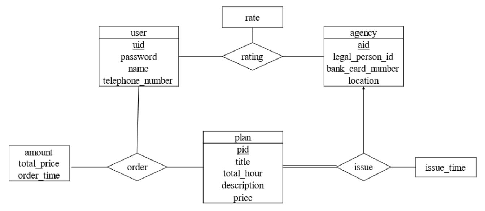

# 浙江大学**2025–2026** 学年春夏季学期

## 《数据库系统》课程课堂测试三

(Quiz 3 for Database Systems)

考生姓名：　　　　　学号：　　　　　专业：　　　　　得分：

**Problem 1.** Consider the table <strong><em>course(<u>id</u>, credit, pre_course_id)</em></strong> and the following query:

**Select c1.id, c2.id**  
**From course as c1, course as c2**  
**Where c1.pre_course_id = c2.id and c1.credit=4 and c2.credit>2**

Which algebra expression is ***not equivalent*** to above query? Please show a smallest single instance of ***course*** you can come up with that demonstrates your answer. (50 points)

(1)

$$
\Pi_{c1.id,c2.id}\left(
  \sigma_{c1.\text{pre\_course\_id}=c2.id \land c1.credit=4 \land c1.credit>2}
  \left(\rho_{c1}(course) \times \rho_{c2}(course)\right)
\right)
$$

(2)

$$
\Pi_{c1.id,c2.id}\left(
  \sigma_{c1.credit=4 \land c1.credit>2}
  \left(\rho_{c1}(course) \bowtie \rho_{c2}(course)\right)
\right)
$$

(3)

$$
\Pi_{c1.id,c2.id}\left(
  \sigma_{c1.\text{pre\_course\_id}=c2.id}
  \left(
    \sigma_{c1.credit=4}\left(\rho_{c1}(course)\right)
    \times
    \sigma_{c2.credit>2}\left(\rho_{c2}(course)\right)
  \right)
\right)
$$

此处题目有些问题，(1)和(2)的关系代数的选择操作的条件应该是 c1.credit=4 and <strong>c2.credit&gt;2</strong>

(2) is not equivalent to the above query.

<table style="color:red">
  <thead>
    <tr>
      <th>id</th>
      <th>credit</th>
      <th>pre_course_id</th>
    </tr>
  </thead>
  <tbody>
    <tr>
      <td>0</td>
      <td>4</td>
      <td>1</td>
    </tr>
    <tr>
      <td>1</td>
      <td>3</td>
      <td>2</td>
    </tr>
    <tr>
      <td>2</td>
      <td>4</td>
      <td>null</td>
    </tr>
  </tbody>
</table>

For (1) and (3), the query result is (0, 1)

For (2), the query result is (0, 0), (2, 2)

**Problem 2.** This year, the tourism industry is recovering. One popular way to plan trips is to use online travel websites like Tuniu and Xiecheng. To do this, the database of travel websites needs to keep track of information about travel agencies, travel plans, and users.

- The database stores basic information about each **user**, such as user's ID, password, name, and telephone number.
- For each **travel agency** that wants to sell the travel plans, it must upload its name, the legal person's ID number (法人身份证号), the bank card number of the corporate account (对公账户银行卡号), and its location. The travel database would also allocate each agency an ID for identification.
- Each travel agency can issue different **travel plans** and specify the information of the title, the total hour, the description of the travel, and the price.
- Each user can **order** the required travel plan according to his preference. The order information, such as the order ID, the user ID, the travel plan ID, the amount purchased, the total price, and the order time.
- After traveling, the user can **rate** the travel agency, and the travel database should record these rating scores.

(1) Please draw the E-R diagram of the travel database. (25 points)

(2) Transform the E-R diagram into the relational schemas and specify the primary keys and foreign keys of these relations. (25 points)

(1) Answers:

(2) Answers:

The relational schemas are as follows.

<strong><em>user(<u>uid</u>, password, name, telephone_number)</em></strong>

<strong><em>agency(<u>aid</u>, legal_person_ID, bank_card_number, location)</em></strong>

<strong><em>travel_plan(<u>pid</u>, title, total_hour, description, price, agency_ID, issue_time)</em></strong>

<strong><em>order(<u>user_ID</u>, <u>plan_ID</u>, amount, total_price, order_time)</em></strong>

<strong><em>rating(<u>user_ID</u>, <u>agency_ID</u>, rate)</em></strong>

The primary key of each table is underlined.

The foreign keys are as follows:

<ul style="color:red">
  <li>the <strong><em>agency_ID</em></strong> of the <em>travel plan</em> table references the <strong><em>aid</em></strong> of the <em>agency</em> table</li>
  <li>the <strong><em>user_ID</em></strong> of the order table references the <strong><em>uid</em></strong> of the <em>user</em> table</li>
  <li>the <strong><em>plan_ID</em></strong> of the order table references the <strong><em>pid</em></strong> of the <em>travel plan</em> table</li>
  <li>the <strong><em>user_ID</em></strong> of the rating table references the <strong><em>uid</em></strong> of the <em>user</em> table</li>
  <li>the <strong><em>agency_ID</em></strong> of the rating table references the <strong><em>aid</em></strong> of <em>agency</em> table</li>
</ul>
